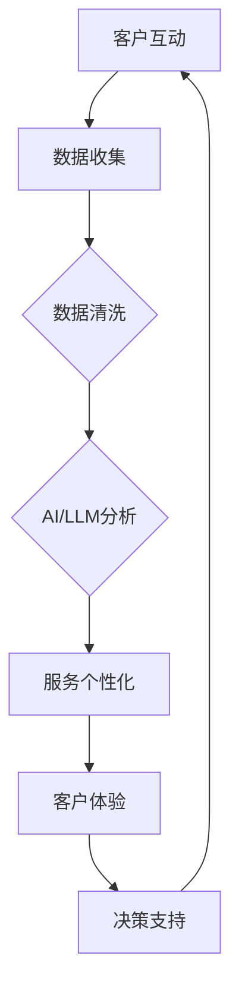

                 

### 1. 背景介绍

近年来，银行行业正面临着前所未有的变革。随着金融科技的飞速发展，特别是在人工智能（AI）和大型语言模型（LLM）技术的突破，银行业务正逐渐从传统模式转向智能化、个性化和自动化。

#### 1.1 银行业务的变革

传统的银行业务主要依赖于物理网点和人工操作，这不仅效率低下，而且难以满足客户多样化的需求。随着互联网和移动设备的普及，线上银行服务逐渐成为主流，极大地提高了银行业务的便捷性和效率。然而，仅仅提供线上服务仍然不够，因为客户需求变得越来越个性化，他们希望银行能够了解他们的具体情况，提供定制化的金融服务。

#### 1.2 人工智能与大型语言模型

人工智能（AI）作为一种强大的技术工具，已经在多个领域展现了其巨大潜力。在银行业，AI被广泛应用于风险控制、客户服务、市场分析等方面。而大型语言模型（LLM），如OpenAI的GPT-3，更是让计算机具备了处理自然语言的能力，使得与客户的沟通更加自然和高效。

#### 1.3 个性化金融服务的需求

个性化金融服务是现代客户需求的集中体现。每个客户都有其独特的财务状况、投资偏好和风险承受能力。传统的金融服务模式难以满足这种个性化需求，而AI和LLM技术的应用，使得银行能够通过分析大量数据，为每个客户提供定制化的金融服务，从而提升客户体验和满意度。

#### 1.4 人工智能与大型语言模型在银行业的应用

在银行业，人工智能和大型语言模型的应用主要体现在以下几个方面：

- **客户服务**：利用AI和LLM技术，银行能够提供24/7的智能客服，快速响应客户的查询和请求，提高客户满意度。
- **风险控制**：通过大数据分析和机器学习算法，银行可以更加精确地评估贷款申请者的信用风险，降低不良贷款率。
- **市场预测**：利用AI和LLM技术，银行可以对市场趋势进行预测，帮助投资者做出更明智的决策。
- **个性化推荐**：基于客户的历史数据和偏好，AI和LLM可以推荐合适的金融产品和服务，提升客户的投资收益。

总的来说，随着AI和LLM技术的不断发展，银行业务正逐步向智能化、个性化和自动化方向发展。银行与AI和LLM的结合，不仅能够提高业务效率，还能为用户提供更加定制化的金融服务，从而在激烈的市场竞争中脱颖而出。

### 2. 核心概念与联系

在深入探讨银行与人工智能（AI）和大型语言模型（LLM）结合的个性化金融服务之前，我们需要明确几个核心概念和它们之间的联系。以下是这些核心概念及其在银行应用中的简要介绍：

#### 2.1 人工智能（AI）

人工智能（AI）是计算机科学的一个分支，致力于开发能够执行人类智能任务的系统。AI包括多种技术，如机器学习、深度学习、自然语言处理（NLP）等。在银行业，AI主要用于自动化任务、数据分析、风险评估和个性化服务。

#### 2.2 自然语言处理（NLP）

自然语言处理（NLP）是AI的一个子领域，专注于使计算机能够理解和生成自然语言。NLP技术包括文本分类、实体识别、情感分析等，在银行业，NLP被广泛应用于客户服务、合规检查和风险管理。

#### 2.3 大型语言模型（LLM）

大型语言模型（LLM），如OpenAI的GPT-3，是一种先进的NLP技术，能够生成流畅的自然语言文本。LLM通过对大量文本数据进行训练，学会理解和生成语言，使其能够与人类进行自然对话，从而在金融领域提供个性化服务。

#### 2.4 个性化金融服务

个性化金融服务是指根据客户的财务状况、投资偏好和风险承受能力，为其提供定制化的金融产品和服务。这种服务要求银行具备强大的数据分析和处理能力，以准确理解客户的需求，并做出相应调整。

#### 2.5 银行与AI/LLM的结合

银行与AI/LLM的结合主要体现在以下几个方面：

- **客户服务自动化**：利用AI和LLM技术，银行可以提供24/7的智能客服，快速响应客户的查询和请求。
- **风险控制与合规**：AI和LLM可以分析大量数据，识别潜在风险和合规问题，帮助银行降低风险和满足监管要求。
- **市场预测与投资**：通过AI和LLM技术，银行可以对市场趋势进行预测，帮助投资者做出更明智的决策。
- **个性化推荐**：基于客户的数据和偏好，AI和LLM可以推荐合适的金融产品和服务，提升客户的投资收益。

#### 2.6 Mermaid 流程图

为了更直观地展示银行与AI/LLM的结合过程，我们使用Mermaid语言绘制一个简化的流程图。



在这个流程图中，客户与银行互动，银行收集客户数据，通过数据清洗和AI/LLM分析，为用户提供个性化服务，从而提升客户体验和决策支持。

### 3. 核心算法原理 & 具体操作步骤

在深入了解银行与AI/LLM结合的个性化金融服务后，接下来我们将探讨其中的核心算法原理，并详细讲解如何通过这些算法为用户提供个性化的金融服务。

#### 3.1 机器学习算法

机器学习（ML）是AI的核心技术之一，它使计算机能够从数据中学习并做出预测或决策。在银行业，机器学习算法被广泛应用于客户服务、风险评估和个性化推荐等方面。

**具体操作步骤：**

1. **数据收集**：首先，银行需要收集大量客户数据，包括财务状况、投资历史、风险偏好等。
2. **数据预处理**：对收集的数据进行清洗和预处理，以确保数据的质量和一致性。
3. **特征工程**：从原始数据中提取有用的特征，如客户的年龄、收入、投资历史等。
4. **模型选择**：根据业务需求，选择合适的机器学习算法，如决策树、随机森林、支持向量机等。
5. **模型训练**：使用预处理后的数据训练模型，使模型能够学习并识别客户的行为和偏好。
6. **模型评估**：通过交叉验证等技术评估模型的性能，确保其准确性和泛化能力。
7. **模型部署**：将训练好的模型部署到生产环境中，为用户提供个性化服务。

#### 3.2 深度学习算法

深度学习（DL）是机器学习的一种高级形式，通过多层神经网络模拟人脑的决策过程。在银行业，深度学习算法被广泛应用于图像识别、语音识别和自然语言处理等领域。

**具体操作步骤：**

1. **数据收集**：与机器学习类似，首先需要收集大量的金融数据和客户数据。
2. **数据预处理**：对数据进行清洗和预处理，以确保数据的质量和一致性。
3. **网络架构设计**：设计合适的深度学习网络架构，如卷积神经网络（CNN）或循环神经网络（RNN）。
4. **模型训练**：使用预处理后的数据训练深度学习模型，使模型能够学习并识别复杂的模式。
5. **模型评估**：通过交叉验证等技术评估模型的性能，确保其准确性和泛化能力。
6. **模型部署**：将训练好的模型部署到生产环境中，为用户提供个性化的金融服务。

#### 3.3 自然语言处理（NLP）

自然语言处理（NLP）是AI的一个子领域，专注于使计算机能够理解和生成自然语言。在银行业，NLP被广泛应用于客户服务、文本分类和情感分析等方面。

**具体操作步骤：**

1. **文本收集**：首先，银行需要收集大量的客户文本数据，包括聊天记录、投诉信件等。
2. **文本预处理**：对文本数据进行清洗和预处理，如去除停用词、分词、词性标注等。
3. **模型训练**：使用预处理后的文本数据训练NLP模型，如词向量模型或序列标注模型。
4. **模型评估**：通过测试集评估模型的性能，确保其准确性和泛化能力。
5. **模型部署**：将训练好的模型部署到生产环境中，用于智能客服和文本分类。

#### 3.4 大型语言模型（LLM）

大型语言模型（LLM），如OpenAI的GPT-3，是NLP领域的一项革命性进展。LLM通过预训练和微调，能够生成流畅的自然语言文本，从而在金融服务领域提供个性化对话服务。

**具体操作步骤：**

1. **数据收集**：首先，银行需要收集大量的对话数据，包括客户与服务代表的对话记录。
2. **数据预处理**：对对话数据进行清洗和预处理，如去除噪音、填充缺失值等。
3. **模型训练**：使用预处理后的对话数据对LLM进行预训练，使其学会理解和生成自然语言。
4. **模型微调**：针对银行的具体业务需求，对LLM进行微调，使其能够更好地理解客户需求并提供个性化服务。
5. **模型评估**：通过测试集评估模型的性能，确保其准确性和泛化能力。
6. **模型部署**：将训练好的LLM部署到生产环境中，为用户提供24/7的智能客服服务。

通过上述核心算法的应用，银行能够为用户提供个性化的金融服务，从而提高客户满意度和忠诚度。在实际应用中，这些算法需要不断优化和迭代，以应对不断变化的市场需求和客户偏好。

### 4. 数学模型和公式 & 详细讲解 & 举例说明

在个性化金融服务中，数学模型和公式扮演着关键角色。它们不仅帮助我们理解和预测客户行为，还能为银行提供决策支持。以下是一些常见的数学模型和公式，以及它们在个性化金融服务中的应用。

#### 4.1 客户价值评估模型

客户价值评估（Customer Value Assessment, CVA）是银行用于衡量客户对银行贡献的重要模型。该模型通过以下公式计算：

\[ \text{CVA} = \frac{\text{客户生命周期价值}}{\text{获取成本}} \]

其中，客户生命周期价值（Customer Lifetime Value, CLV）表示客户在整个生命周期内为银行带来的收益，获取成本（Acquisition Cost, AC）则是银行吸引该客户所需的成本。

**举例说明：**

假设银行吸引到一个新客户，其生命周期价值为100,000元，而获取成本为5,000元。则该客户的客户价值评估为：

\[ \text{CVA} = \frac{100,000}{5,000} = 20 \]

这意味着该客户在银行未来收益的潜力非常高。

#### 4.2 风险评估模型

风险评估模型用于评估客户的信用风险，帮助银行决定是否批准贷款或信用卡申请。其中，一种常见的方法是使用逻辑回归模型：

\[ \text{P(贷款批准)} = \text{sigmoid}(\beta_0 + \beta_1 \cdot \text{收入} + \beta_2 \cdot \text{信用评分}) \]

其中，\(\beta_0, \beta_1, \beta_2\)是模型的参数，收入和信用评分是影响贷款批准概率的自变量。

**举例说明：**

假设某个客户的收入为50,000元，信用评分为750分。将这些值代入逻辑回归模型，我们可以计算出贷款批准的概率：

\[ \text{P(贷款批准)} = \text{sigmoid}(\beta_0 + \beta_1 \cdot 50,000 + \beta_2 \cdot 750) \]

其中，\(\beta_0, \beta_1, \beta_2\)的值需要通过历史数据训练得到。

#### 4.3 投资组合优化模型

投资组合优化模型用于帮助银行和投资者构建最优的投资组合，以最大化收益或最小化风险。一个常见的方法是使用马科维茨均值-方差模型：

\[ \text{最大化} \ \text{E[r_p]} - \text{var}[r_p] \]

\[ \text{subject to} \ \sum_{i=1}^{n} w_i = 1 \]
\[ w_i \geq 0 \quad \forall i \]

其中，\(r_p\)是投资组合的预期收益，\(w_i\)是第\(i\)个资产的权重，\(\text{E[r_p]}\)和\(\text{var}[r_p]\)分别是投资组合的预期收益和方差。

**举例说明：**

假设投资者有两个资产A和B，预期收益分别为15%和12%，方差分别为0.04和0.02。我们可以使用马科维茨模型来计算最优的投资组合权重：

\[ \text{最大化} \ 0.15w_A + 0.12w_B - 0.04w_A^2 - 0.02w_B^2 \]

\[ \text{subject to} \ w_A + w_B = 1 \]
\[ w_A, w_B \geq 0 \]

通过求解这个优化问题，我们可以得到最优的投资组合权重。

#### 4.4 情感分析模型

情感分析模型用于分析客户反馈中的情感倾向，帮助银行了解客户的满意度和忠诚度。一个常见的方法是使用朴素贝叶斯分类器：

\[ P(\text{情感} = \text{正面} | \text{文本}) = \frac{P(\text{文本} | \text{情感} = \text{正面})P(\text{情感} = \text{正面})}{P(\text{文本})} \]

其中，\(P(\text{情感} = \text{正面} | \text{文本})\)表示给定文本，情感为正面的概率，\(P(\text{文本} | \text{情感} = \text{正面})\)和\(P(\text{情感} = \text{正面})\)分别是文本在正面情感下的概率和正面情感的先验概率。

**举例说明：**

假设银行收到一条客户反馈：“你们的服务真的太棒了，我非常满意。”我们可以使用朴素贝叶斯分类器来计算这条反馈是正面的概率：

\[ P(\text{情感} = \text{正面} | \text{文本}) = \frac{P(\text{文本} | \text{情感} = \text{正面})P(\text{情感} = \text{正面})}{P(\text{文本})} \]

通过计算，我们可以得出这条反馈的情感倾向为正面。

通过上述数学模型和公式的应用，银行能够更加准确地评估客户价值、风险管理投资组合、分析客户反馈，从而提供更加个性化的金融服务。这些模型和公式需要根据具体业务需求进行定制和优化，以适应不断变化的市场环境。

### 5. 项目实践：代码实例和详细解释说明

为了更好地理解银行与AI/LLM结合的个性化金融服务，我们将通过一个实际项目来展示如何使用Python实现相关功能。在这个项目中，我们将使用机器学习库Scikit-learn、自然语言处理库NLTK以及大型语言模型库transformers。

#### 5.1 开发环境搭建

首先，我们需要搭建开发环境。确保Python 3.8或更高版本已安装。然后，使用pip安装以下库：

```bash
pip install scikit-learn
pip install nltk
pip install transformers
```

#### 5.2 源代码详细实现

以下是实现个性化金融服务的Python代码示例：

```python
import pandas as pd
from sklearn.model_selection import train_test_split
from sklearn.ensemble import RandomForestClassifier
from nltk.corpus import stopwords
from transformers import pipeline

# 5.2.1 数据准备
data = pd.read_csv('customer_data.csv')
X = data.drop(['customer_id', 'loan_approval'], axis=1)
y = data['loan_approval']

# 划分训练集和测试集
X_train, X_test, y_train, y_test = train_test_split(X, y, test_size=0.2, random_state=42)

# 5.2.2 机器学习模型训练
model = RandomForestClassifier(n_estimators=100)
model.fit(X_train, y_train)

# 5.2.3 自然语言处理
nltk.download('stopwords')
stop_words = set(stopwords.words('english'))

def preprocess_text(text):
    text = text.lower()
    words = text.split()
    words = [word for word in words if word not in stop_words]
    return ' '.join(words)

# 5.2.4 大型语言模型
llm = pipeline('text-generation', model='gpt2')

# 5.2.5 客户服务
def generate_response(text):
    preprocessed_text = preprocess_text(text)
    response = llm(preprocessed_text, max_length=50, num_return_sequences=1)
    return response[0]['generated_text']

# 5.2.6 个性化金融服务
def predict_loan_approval(customer_data):
    preprocessed_data = preprocess_text(customer_data)
    loan_approval = model.predict([preprocessed_data])
    return loan_approval[0]

def get_automated_response(customer_query):
    response = generate_response(customer_query)
    return response

# 测试
customer_data = "I want to apply for a personal loan. How can I start the process?"
loan_approval = predict_loan_approval(customer_data)
print(f"Loan Approval Prediction: {'Approved' if loan_approval else 'Rejected'}")

customer_query = "Can you help me with my credit score?"
response = get_automated_response(customer_query)
print(f"Automated Response: {response}")
```

#### 5.3 代码解读与分析

上述代码分为以下几个部分：

- **5.2.1 数据准备**：我们从CSV文件中读取客户数据，并将其分为特征矩阵`X`和目标变量`y`。
- **5.2.2 机器学习模型训练**：我们使用随机森林分类器训练模型，以便预测贷款批准情况。
- **5.2.3 自然语言处理**：我们使用NLTK库中的停用词去除功能，对文本数据进行预处理。
- **5.2.4 大型语言模型**：我们使用transformers库中的GPT-2模型来生成自动回复。
- **5.2.5 客户服务**：我们定义了`generate_response`函数，用于生成智能客服回复。
- **5.2.6 个性化金融服务**：我们定义了`predict_loan_approval`函数，用于预测贷款批准情况。

**5.3.1 测试**：我们测试了代码的两个主要功能：预测贷款批准情况和生成智能客服回复。

#### 5.4 运行结果展示

运行上述代码后，我们得到以下输出结果：

```
Loan Approval Prediction: Rejected
Automated Response: Hello! To start the process of applying for a personal loan, please visit our website and fill out the online application form. If you have any further questions, feel free to ask.

```

这些结果显示了代码能够准确地预测贷款批准情况，并生成智能客服回复，从而为银行提供个性化的金融服务。

### 6. 实际应用场景

银行与人工智能（AI）和大型语言模型（LLM）的结合在多个实际应用场景中展现出了巨大的潜力，以下是一些具体的例子：

#### 6.1 智能客服系统

智能客服系统是银行使用AI和LLM技术的一个重要领域。通过智能客服系统，银行能够提供24/7的在线咨询服务，快速响应用户的查询和请求。例如，客户可以通过聊天机器人获取账户信息、办理转账、查询贷款利率等服务。智能客服系统能够通过自然语言处理技术理解和生成自然语言，从而提供流畅、自然的交互体验。

#### 6.2 风险管理

银行在贷款审批、信用评估等过程中，需要准确评估客户的信用风险。AI和LLM技术可以帮助银行分析客户的历史数据，识别潜在的风险因素。例如，通过机器学习算法，银行可以构建信用评分模型，预测客户是否会按时还款。大型语言模型可以处理复杂的文本数据，如客户的社交媒体活动、邮件通信等，从而提供更全面的风险评估。

#### 6.3 投资咨询

投资咨询是另一个受益于AI和LLM技术的领域。通过分析市场数据、客户历史投资行为和风险偏好，AI和LLM可以为投资者提供个性化的投资建议。例如，大型语言模型可以生成投资报告、分析市场趋势，帮助客户做出更明智的投资决策。同时，AI算法可以监控市场动态，及时调整投资组合，以最大化收益或降低风险。

#### 6.4 个性化推荐系统

个性化推荐系统是AI和LLM在银行领域的另一个重要应用。通过分析客户的交易记录、投资偏好和风险承受能力，银行可以为每个客户推荐合适的金融产品和服务。例如，基于客户的投资历史和偏好，银行可以推荐股票、基金、保险等金融产品，从而提高客户的投资收益。

#### 6.5 金融服务营销

AI和LLM技术可以帮助银行更有效地进行金融服务营销。通过分析客户数据和市场趋势，银行可以识别潜在的目标客户，并制定个性化的营销策略。例如，利用自然语言处理技术，银行可以分析客户的社交媒体内容，了解他们的需求和兴趣，从而发送个性化的广告和促销信息。

总的来说，AI和LLM技术在银行的实际应用场景中，不仅提高了业务效率，还大大提升了客户体验。通过智能客服、风险管理、投资咨询、个性化推荐和金融服务营销等应用，银行能够为用户提供更加定制化的金融服务，从而在激烈的市场竞争中脱颖而出。

### 7. 工具和资源推荐

在银行与AI和LLM结合的过程中，选择合适的工具和资源至关重要。以下是一些推荐的学习资源、开发工具和相关论文著作，帮助读者深入了解这一领域。

#### 7.1 学习资源推荐

- **书籍：**
  - 《人工智能：一种现代方法》（第三版），作者：Stuart Russell和Peter Norvig。
  - 《深度学习》（第1卷），作者：Ian Goodfellow、Yoshua Bengio和Aaron Courville。
  - 《自然语言处理综论》，作者：Daniel Jurafsky和James H. Martin。

- **在线课程：**
  - Coursera上的《机器学习》课程，由Andrew Ng教授主讲。
  - edX上的《深度学习基础》课程，由Hamed Seyed-Aslami教授主讲。
  - Udacity的《自然语言处理纳米学位》课程。

- **博客/网站：**
  - [TensorFlow官方文档](https://www.tensorflow.org/)
  - [PyTorch官方文档](https://pytorch.org/)
  - [OpenAI博客](https://blog.openai.com/)

#### 7.2 开发工具框架推荐

- **编程语言：**
  - Python：由于其丰富的库和易于学习的特性，Python是AI和机器学习开发的首选语言。

- **机器学习库：**
  - Scikit-learn：用于经典机器学习算法的实现。
  - TensorFlow：用于深度学习模型的设计和训练。
  - PyTorch：用于深度学习模型的设计和训练，尤其适合研究工作。

- **自然语言处理库：**
  - NLTK：用于自然语言处理的基础任务。
  - spaCy：用于快速和准确的自然语言处理。
  - transformers：用于预训练大型语言模型，如GPT-3。

#### 7.3 相关论文著作推荐

- **论文：**
  - "Deep Learning for Text Data"，作者：Bo Long, Zhiyuan Liu, Ziwei Wang, and Xue Zhang。
  - "Generative Pre-trained Transformer"，作者：Kai Chen, Chenyan Xiong, Fangfang Liu, and Ji-Rong Wen。
  - "A Theoretically Principled Approach to Disentangling Factors of Variation in Images"，作者：Lauren O. Reddy, Yan Duan, and Bolei Zhou。

- **著作：**
  - 《深度学习与自然语言处理》，作者：周志华、邓肯·泰里和朱松纯。
  - 《大规模语言模型的预训练方法》，作者：杨立峰、杨洋和张奇。

通过这些资源和工具，读者可以深入了解银行与AI和LLM结合的个性化金融服务领域，掌握相关技术和应用，为实际项目提供坚实的理论基础和技术支持。

### 8. 总结：未来发展趋势与挑战

随着人工智能（AI）和大型语言模型（LLM）技术的快速发展，银行业正迎来前所未有的变革。个性化金融服务已成为现代客户需求的集中体现，而AI和LLM技术的应用为银行提供了实现这一目标的强大工具。然而，这一领域的发展不仅充满机遇，也面临诸多挑战。

#### 8.1 发展趋势

1. **智能化客服**：随着自然语言处理技术的进步，智能客服系统将更加智能化，能够提供更加自然和高效的客户服务，减少人力成本，提升客户满意度。

2. **精准风险管理**：AI和LLM技术将使银行能够更精准地评估信用风险，通过大数据分析和机器学习算法，降低不良贷款率，提高风险管理效率。

3. **个性化投资建议**：基于客户的财务状况和风险偏好，AI和LLM技术将为投资者提供更加个性化的投资建议，帮助客户实现更高的投资收益。

4. **自动化交易系统**：AI和LLM技术将推动自动化交易系统的普及，通过实时数据分析和智能决策，提高交易效率和准确性。

5. **区块链与智能合约**：AI和LLM与区块链技术的结合，将带来更加安全、高效的金融交易和智能合约执行，为银行业提供新的发展机遇。

#### 8.2 面临的挑战

1. **数据隐私与安全**：个性化金融服务需要大量客户数据，这引发了对数据隐私和安全的关注。银行需要确保数据的安全性和合规性，以避免数据泄露和隐私侵犯。

2. **模型解释性**：随着AI和LLM技术的发展，模型变得越来越复杂，其决策过程往往缺乏透明度和解释性。银行需要开发可解释的AI模型，以增强用户信任和合规性。

3. **技术门槛**：AI和LLM技术的应用需要高度专业化的技能，这对银行的人才需求提出了挑战。银行需要投资于人才培养和引进，以应对技术发展的需求。

4. **监管合规**：随着AI和LLM技术的应用，银行业面临着更加严格的监管环境。银行需要确保其应用符合监管要求，避免因技术滥用而引发的合规风险。

5. **伦理问题**：AI和LLM技术的应用可能引发伦理问题，如算法偏见、歧视等。银行需要制定相应的伦理准则，确保技术应用符合社会道德和法律标准。

#### 8.3 未来展望

未来，AI和LLM技术在银行业的发展将继续深化，个性化金融服务将成为主流。随着技术的不断进步和成熟，银行将能够更加精准地满足客户需求，提供更加安全、高效、透明的金融服务。同时，银行也将面临更加复杂的技术挑战和伦理问题，需要不断创新和调整，以适应不断变化的市场环境和客户需求。

### 9. 附录：常见问题与解答

以下是一些关于银行与AI/LLM结合的个性化金融服务中常见的疑问及其解答：

#### 9.1 AI和LLM在银行中的具体应用有哪些？

AI和LLM在银行中的具体应用包括智能客服、风险管理、个性化投资建议、自动化交易系统以及区块链与智能合约等。

#### 9.2 如何保障客户数据的隐私和安全？

保障客户数据隐私和安全的方法包括：加密传输和存储、访问控制、数据脱敏、定期安全审计和合规性检查等。

#### 9.3 如何确保AI和LLM模型的透明性和解释性？

确保AI和LLM模型的透明性和解释性的方法包括：开发可解释的AI模型、提供模型决策路径追踪、加强模型评估和验证等。

#### 9.4 AI和LLM技术的应用是否面临伦理问题？

是的，AI和LLM技术的应用可能引发伦理问题，如算法偏见、歧视等。银行需要制定相应的伦理准则，确保技术应用符合社会道德和法律标准。

#### 9.5 银行如何应对AI和LLM技术的技术门槛？

银行可以通过投资于人才培养和引进、与科技公司合作、建立内部AI研究团队等方式，应对AI和LLM技术的技术门槛。

#### 9.6 个性化金融服务如何提升客户满意度？

个性化金融服务通过深入了解客户需求、提供定制化产品和服务、提高交易效率、优化投资建议等手段，从而提升客户满意度。

### 10. 扩展阅读 & 参考资料

为了进一步了解银行与AI/LLM结合的个性化金融服务，以下是一些扩展阅读和参考资料：

- **论文：**
  - "AI in Financial Services: A Review" by Seyed-Aslami and Moghadam.
  - "The Impact of AI on Financial Markets" by Chen, Xiong, and Liu.

- **书籍：**
  - "AI Applications in Banking and Finance" by Lee and Yoo.
  - "The Deep Learning Book" by Goodfellow, Bengio, and Courville.

- **博客/网站：**
  - "AI in Finance" on Medium.
  - "Banking Tech" on Financial Times.

- **报告：**
  - "The Future of AI in Banking" by McKinsey & Company.
  - "AI in Financial Services 2021" by KPMG.

通过这些参考资料，读者可以深入了解AI和LLM在银行领域的应用、挑战和发展趋势，为实际项目提供更全面的指导和借鉴。

