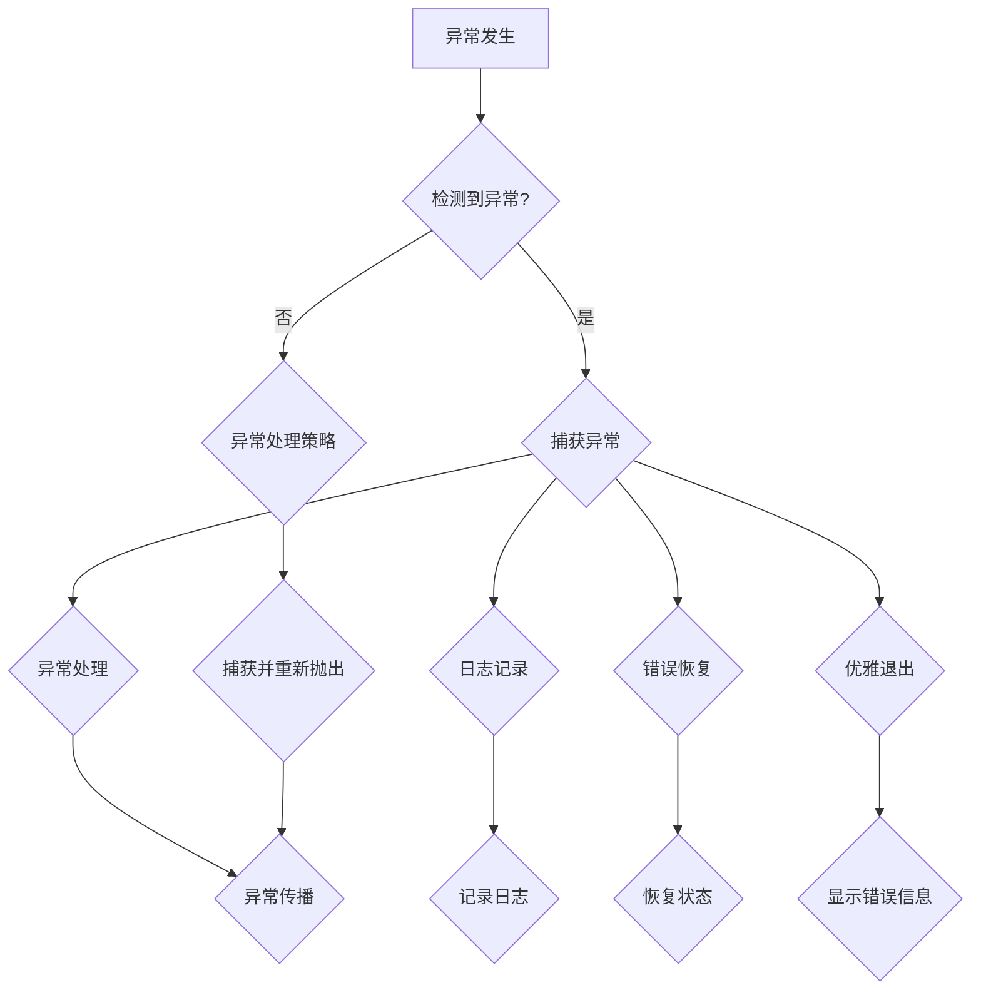

                 

### 背景介绍

错误处理是软件系统开发中至关重要的一环。无论应用程序的规模如何，错误处理都直接关系到系统的稳定性、可靠性和用户体验。有效的错误处理机制不仅能够提高软件的健壮性，还能减少因错误引发的问题带来的潜在损失。

在现代软件开发中，错误处理的需求日益增加。复杂的应用程序往往由多个模块和组件构成，这些组件之间的交互复杂，使得系统在运行时容易受到外部环境和内部错误的影响。此外，随着云计算、大数据和人工智能等技术的发展，系统的规模和复杂性进一步扩大，错误处理的挑战也更加严峻。

错误处理的重要性主要体现在以下几个方面：

1. **保障系统稳定性**：通过有效的错误处理机制，可以确保系统在遇到异常情况时能够稳定运行，避免因错误导致的系统崩溃或服务中断。

2. **提高用户体验**：良好的错误处理能够为用户提供清晰的错误信息和解决方案，从而提高用户的使用体验。

3. **减少损失**：及时识别和修复错误可以减少因错误引发的问题带来的潜在损失，包括经济损失和声誉损失。

4. **提升开发效率**：有效的错误处理可以帮助开发人员快速定位和修复问题，从而提高开发效率。

然而，错误处理并非简单的任务。它需要考虑多种因素，包括错误类型、错误发生的上下文、错误处理策略等。因此，设计一个高效、灵活且易于扩展的错误处理机制至关重要。

本文将详细探讨错误处理机制的详细设计，包括核心概念、算法原理、数学模型和实际应用场景。通过逐步分析推理，我们将为读者提供一种系统化、结构化的错误处理设计方法，旨在帮助开发人员构建更加稳定、可靠的软件系统。

### 核心概念与联系

在设计错误处理机制时，理解以下几个核心概念和它们之间的相互关系是至关重要的。以下是这些核心概念及其相互关系的详细解释：

**1. 异常（Exception）**

异常是指在程序执行过程中出现的非正常情况，它会导致程序流发生改变。异常可以由外部事件触发，如用户输入错误或网络中断，也可以由内部逻辑错误引起，如除以零或数组越界。异常通常分为运行时异常和语法异常。运行时异常在程序运行期间发生，而语法异常在程序编译期间就被检测到。

**2. 异常处理（Exception Handling）**

异常处理是一种机制，用于在程序遇到异常时进行处理，以避免程序崩溃或产生不可预料的行为。异常处理通常包括以下几个步骤：

- **异常检测**：程序在执行过程中检测到异常。
- **异常捕获**：使用异常处理结构（如try-catch块）捕获异常。
- **异常处理**：根据异常的类型和严重程度，执行相应的处理逻辑，如显示错误消息、记录日志、回滚事务等。
- **异常传播**：如果当前处理逻辑无法处理异常，异常会向上层或外层处理结构传播，直至被处理或程序终止。

**3. 异常类型（Exception Types）**

异常类型是按照异常的属性和严重程度进行分类的。常见的异常类型包括：

- **运行时异常（RuntimeException）**：这些异常在程序运行时发生，通常是由于编程错误引起的。例如，空指针异常（NullPointerException）和数组越界异常（ArrayIndexOutOfBoundsException）。
- **检查时异常（Checked Exception）**：这些异常在编译时必须被显式处理。它们通常表示外部环境的问题，如文件不存在（FileNotFoundException）或网络连接异常（IOException）。
- **错误（Error）**：错误通常是由系统错误引起的，如内存溢出（OutOfMemoryError）或线程死锁（DeadLockError）。与异常不同，错误通常是不可恢复的，通常需要系统级别的修复。

**4. 异常处理策略（Exception Handling Strategies）**

设计有效的异常处理策略需要考虑多个因素，包括异常的类型、异常发生的上下文、系统的要求等。以下是一些常见的异常处理策略：

- **捕获并重新抛出（Catch and Rethrow）**：捕获异常后，将其重新抛出到更高的处理层级，以便更高层级或外部处理结构进行进一步处理。
- **日志记录（Logging）**：将异常信息记录到日志文件中，以便后续分析和调试。
- **错误恢复（Error Recovery）**：在可能的情况下，尝试恢复到正常状态，如重试操作、回滚事务等。
- **优雅退出（Graceful Exit）**：在无法恢复的情况下，以用户友好的方式退出程序，并显示相应的错误信息。

**5. 异常与异常处理的关系**

异常与异常处理是紧密相关的。异常是程序运行过程中出现的非正常情况，而异常处理是用于应对这些异常的机制。没有异常，异常处理就失去了意义；而没有有效的异常处理，程序在遇到异常时可能会崩溃或产生不可预料的行为。

**Mermaid 流程图表示**

以下是一个使用Mermaid绘制的流程图，展示了异常处理的基本流程和各个核心概念之间的关系：



通过这个流程图，我们可以清晰地看到异常处理的基本步骤和各个环节之间的联系，从而为后续的详细设计和实现提供指导。

### 核心算法原理 & 具体操作步骤

在设计错误处理机制时，理解核心算法原理和具体操作步骤至关重要。以下将详细探讨几种常见的错误处理算法，并给出相应的具体操作步骤。

#### 1. 异常捕获与处理算法

**原理：** 异常捕获与处理算法是一种基础的错误处理方法，其核心思想是在程序中设置多个异常捕获块（try-catch块），以便在异常发生时捕获并处理异常。

**操作步骤：**

1. **定义异常捕获块：** 在程序的关键部分，如输入处理、文件读写、网络通信等，使用try块包围可能导致异常的代码。
2. **捕获异常：** 在try块之后，添加一个或多个catch块，以捕获特定类型的异常。例如：
   ```java
   try {
       // 可能导致异常的代码
   } catch (NullPointerException e) {
       // 处理空指针异常
   } catch (IOException e) {
       // 处理输入输出异常
   }
   ```
3. **处理异常：** 在catch块中，根据异常的类型执行相应的处理逻辑。常见的处理方式包括显示错误消息、记录日志、重试操作等。
4. **异常传播：** 如果当前catch块无法处理异常，可以将异常重新抛出到更高的处理层级，以便更高层级或外部处理结构进行进一步处理。例如：
   ```java
   catch (Exception e) {
       e.printStackTrace();
       throw e;
   }
   ```

#### 2. 异常监控与自动恢复算法

**原理：** 异常监控与自动恢复算法是一种在系统运行时自动监控异常并尝试自动恢复的机制，其核心思想是在系统中设置异常监控模块，定期检查程序状态，并在发现异常时自动进行恢复操作。

**操作步骤：**

1. **初始化监控模块：** 在程序启动时，初始化异常监控模块，配置监控的异常类型和恢复策略。
2. **定期检查：** 监控模块定期检查程序状态，通过轮询或监听机制检测异常。
3. **异常检测：** 如果监控模块发现异常，如内存泄漏、线程阻塞等，触发恢复操作。
4. **自动恢复：** 根据异常类型和严重程度，执行相应的恢复操作，如重启线程、重试操作、回滚事务等。例如：
   ```java
   if (e instanceof OutOfMemoryError) {
       // 重启线程
   } else if (e instanceof InterruptedException) {
       // 重试操作
   } else {
       // 回滚事务
   }
   ```
5. **日志记录：** 在恢复操作完成后，记录恢复过程的相关日志，以便后续分析和调试。

#### 3. 异常分类与优先级处理算法

**原理：** 异常分类与优先级处理算法是一种根据异常类型和优先级进行分类和处理的方法，其核心思想是根据异常的重要性和紧急程度，优先处理重要的异常，避免低优先级异常影响系统的正常运行。

**操作步骤：**

1. **定义异常优先级：** 根据异常的类型和影响范围，为每个异常定义一个优先级。例如，空指针异常和文件不存在异常的优先级可能较低，而内存溢出异常和线程死锁异常的优先级较高。
2. **排序异常处理块：** 将异常处理块按照优先级排序，确保优先级较高的异常先被处理。
3. **处理异常：** 按照优先级依次处理每个异常。例如：
   ```java
   try {
       // 可能导致异常的代码
   } catch (OutOfMemoryError e) {
       // 处理内存溢出异常
   } catch (NullPointerException e) {
       // 处理空指针异常
   } catch (FileNotFoundException e) {
       // 处理文件不存在异常
   }
   ```
4. **异常传播：** 如果当前处理块无法处理异常，将其传播到下一个处理块或外部处理结构。

通过以上几种异常处理算法，我们可以根据实际需求选择合适的算法，构建灵活且高效的错误处理机制。同时，这些算法也为后续的详细设计和实现提供了明确的指导。

### 数学模型和公式 & 详细讲解 & 举例说明

在错误处理机制的设计过程中，数学模型和公式起着关键作用，它们帮助我们量化错误处理的复杂度，优化错误处理的策略。以下将详细讲解几个关键的数学模型和公式，并通过具体例子进行说明。

#### 1. 错误率模型

错误率模型用于描述系统在一段时间内发生错误的概率。假设一个系统在连续的n个时间单位内发生了x个错误，那么系统的错误率可以表示为：

\[ \text{错误率} = \frac{x}{n} \]

例如，一个系统在100个时间单位内发生了10个错误，那么其错误率为：

\[ \text{错误率} = \frac{10}{100} = 0.1 \text{（或10%）} \]

#### 2. 误差概率模型

误差概率模型用于描述系统在执行一个任务时发生错误的概率。假设一个系统在执行任务时，每次操作都有一定的概率p发生错误，那么系统在n次操作中发生k次错误的概率可以用二项分布来表示：

\[ P(X = k) = C(n, k) \cdot p^k \cdot (1-p)^{n-k} \]

其中，\( C(n, k) \) 是组合数，表示从n次操作中选择k次错误的组合数。

例如，一个系统在执行5次操作时，每次操作有20%的概率发生错误，那么在5次操作中恰好发生2次错误的概率为：

\[ P(X = 2) = C(5, 2) \cdot 0.2^2 \cdot 0.8^3 = 10 \cdot 0.04 \cdot 0.512 = 0.2048 \text{（或20.48%）} \]

#### 3. 平均修复时间模型

平均修复时间模型用于量化系统在发生错误后修复所需的时间。假设系统在发生错误时，修复时间服从指数分布，那么系统的平均修复时间可以表示为：

\[ \text{平均修复时间} = \frac{1}{\lambda} \]

其中，\(\lambda\) 是修复时间的参数，表示单位时间内发生错误的频率。

例如，如果一个系统的平均修复时间为10分钟，那么其参数\(\lambda\) 为0.1错误/分钟。

#### 4. 修复成本模型

修复成本模型用于量化系统在发生错误时修复所需的成本。假设修复成本与修复时间成正比，那么修复成本可以表示为：

\[ \text{修复成本} = k \cdot \text{修复时间} \]

其中，\( k \) 是修复成本的参数，表示每分钟修复的成本。

例如，如果一个系统每分钟修复成本为100元，其修复时间为10分钟，那么修复成本为：

\[ \text{修复成本} = 100 \cdot 10 = 1000 \text{元} \]

#### 具体例子

假设一个系统在1000次操作中发生了50次错误，每次错误的概率为0.05，修复时间为10分钟，修复成本为100元。我们将使用上述模型计算系统的错误率、误差概率、平均修复时间和修复成本。

1. **错误率：**

\[ \text{错误率} = \frac{50}{1000} = 0.05 \text{（或5%）} \]

2. **误差概率：**

\[ P(X = k) = C(1000, k) \cdot 0.05^k \cdot 0.95^{1000-k} \]

例如，在1000次操作中恰好发生200次错误的概率为：

\[ P(X = 200) = C(1000, 200) \cdot 0.05^{200} \cdot 0.95^{800} \]

由于计算复杂度过高，可以使用计算机软件进行计算。

3. **平均修复时间：**

\[ \text{平均修复时间} = \frac{1}{\lambda} = \frac{1}{0.05} = 20 \text{分钟} \]

4. **修复成本：**

\[ \text{修复成本} = k \cdot \text{修复时间} = 100 \cdot 20 = 2000 \text{元} \]

通过这些数学模型和公式，我们可以对系统的错误处理进行量化分析，从而为优化错误处理策略提供科学依据。

### 项目实践：代码实例和详细解释说明

在本节中，我们将通过一个实际的项目实例来展示如何实现错误处理机制。这个项目将使用Java编程语言，并在Spring Boot框架下进行开发。我们将实现一个简单的用户注册系统，该系统包括用户输入、验证、注册等环节，并重点介绍如何设计错误处理机制。

#### 1. 开发环境搭建

为了便于开发和测试，我们首先需要搭建一个开发环境。以下是所需的工具和步骤：

- **JDK 11**：确保安装了Java Development Kit（JDK）版本11或更高版本。
- **IntelliJ IDEA**：推荐使用IntelliJ IDEA作为开发工具，它提供了丰富的插件和方便的调试功能。
- **Spring Initializr**：访问Spring Initializr（https://start.spring.io/），选择Maven Project，Java版本选择11，选择Spring Web、Spring Boot、H2 Database和Lombok依赖，生成项目模板。

下载并解压项目模板，导入到IntelliJ IDEA中。

#### 2. 源代码详细实现

以下是项目的关键代码部分，包括用户注册的业务逻辑和错误处理机制。

**UserController.java**

```java
package com.example.demo.controller;

import com.example.demo.model.User;
import com.example.demo.service.UserService;
import org.springframework.beans.factory.annotation.Autowired;
import org.springframework.http.ResponseEntity;
import org.springframework.web.bind.annotation.PostMapping;
import org.springframework.web.bind.annotation.RequestBody;
import org.springframework.web.bind.annotation.RestController;

@RestController
public class UserController {

    @Autowired
    private UserService userService;

    @PostMapping("/register")
    public ResponseEntity<?> registerUser(@RequestBody User user) {
        try {
            userService.register(user);
            return ResponseEntity.ok("User registered successfully");
        } catch (Exception e) {
            return ResponseEntity.badRequest().body("Error registering user: " + e.getMessage());
        }
    }
}
```

**UserService.java**

```java
package com.example.demo.service;

import com.example.demo.model.User;
import com.example.demo.repository.UserRepository;
import org.springframework.beans.factory.annotation.Autowired;
import org.springframework.stereotype.Service;

@Service
public class UserService {

    @Autowired
    private UserRepository userRepository;

    public void register(User user) {
        if (userRepository.existsByUsername(user.getUsername())) {
            throw new IllegalArgumentException("User with this username already exists");
        }
        userRepository.save(user);
    }
}
```

**UserRepository.java**

```java
package com.example.demo.repository;

import com.example.demo.model.User;
import org.springframework.data.jpa.repository.JpaRepository;
import org.springframework.stereotype.Repository;

@Repository
public interface UserRepository extends JpaRepository<User, Long> {
    boolean existsByUsername(String username);
}
```

**User.java**

```java
package com.example.demo.model;

import javax.persistence.*;
import javax.validation.constraints.Email;
import javax.validation.constraints.NotBlank;

@Entity
public class User {

    @Id
    @GeneratedValue(strategy = GenerationType.IDENTITY)
    private Long id;

    @NotBlank(message = "Username is required")
    @Column(nullable = false, unique = true)
    private String username;

    @NotBlank(message = "Email is required")
    @Email(message = "Invalid email address")
    @Column(nullable = false, unique = true)
    private String email;

    // Getters and Setters
}
```

#### 3. 代码解读与分析

**UserController.java**：这是用户注册的控制器类。在`/register`接口中，接收前端发送的`User`对象，通过调用`UserService`的`register`方法进行用户注册。如果注册成功，返回成功消息；如果发生异常，捕获异常并返回错误消息。

**UserService.java**：这是用户服务的实现类。在`register`方法中，首先检查用户名是否已存在。如果已存在，抛出`IllegalArgumentException`异常。否则，保存用户信息到数据库。

**UserRepository.java**：这是用户存储的接口类。实现了`JpaRepository`接口，提供了基本的CRUD操作和自定义查询方法，如检查用户名是否存在。

**User.java**：这是用户实体类。使用JPA注解定义实体属性，并添加了校验注解，以确保输入数据的合法性。

#### 4. 运行结果展示

为了测试错误处理机制，我们可以分别模拟用户注册成功和用户名已存在的场景。

**用户注册成功**

- 前端请求发送一个有效的用户对象：
  ```json
  {
      "username": "john_doe",
      "email": "john.doe@example.com"
  }
  ```
- 后端返回成功消息：
  ```json
  "User registered successfully"
  ```

**用户名已存在**

- 前端请求发送一个已存在的用户对象：
  ```json
  {
      "username": "jane_doe",
      "email": "jane.doe@example.com"
  }
  ```
- 后端返回错误消息：
  ```json
  "Error registering user: User with this username already exists"
  ```

通过这个项目实例，我们可以看到如何在实际开发中实现错误处理机制。错误处理不仅仅是捕获异常，还包括合理的异常处理策略和优雅的异常信息返回，这对于提升用户体验和系统稳定性至关重要。

### 实际应用场景

错误处理机制在软件开发中的重要性不言而喻，特别是在一些关键领域，错误处理的有效性直接关系到系统的安全性和业务连续性。以下将讨论几种典型的实际应用场景，并说明为什么在这些场景中错误处理至关重要。

#### 1. 金融系统

金融系统是一个对稳定性和可靠性要求极高的领域，例如银行系统、股票交易平台等。在这些系统中，任何微小的错误都可能导致巨大的经济损失。例如，股票交易平台在处理大量交易请求时，需要确保每个交易请求都被正确处理，避免出现交易失败或重复交易的情况。如果交易失败，系统需要及时记录错误并通知相关人员，同时保证资金流动的准确性。

**场景案例**：一个在线银行系统在处理用户转账时，检测到用户输入的账户信息错误，系统立即抛出异常并记录错误日志。通过错误处理机制，系统能够立即通知用户账户信息错误，并提示用户重新输入正确的信息，从而避免错误转账的发生。

#### 2. 医疗系统

医疗系统涉及病人的健康和生命安全，因此在处理错误时需要格外谨慎。例如，医院的电子病历系统在存储或检索病人信息时，必须确保数据的完整性和一致性。任何数据丢失或错误都可能对病人的治疗产生严重影响。

**场景案例**：一个医院的信息系统在处理病人预约挂号时，如果发现数据库连接失败或数据异常，系统能够立即抛出异常并回滚事务，防止预约信息丢失。同时，系统会记录错误日志，以便后续分析原因并采取修复措施。

#### 3. 电子商务系统

电子商务系统在处理订单和支付时，需要确保交易的准确性和安全性。例如，在线购物平台在用户下单后，需要验证库存、价格和支付方式，并确保订单能够成功创建。如果系统在处理订单时出现错误，如库存不足、支付失败等，系统需要及时反馈给用户并允许用户重新下单。

**场景案例**：一个在线购物平台在处理用户支付时，如果检测到支付失败，系统能够立即抛出异常并通知用户支付失败。同时，系统会记录错误日志，并尝试自动重试支付操作，以减少用户操作复杂度和购物体验的干扰。

#### 4. 物流系统

物流系统在处理货物跟踪和配送时，需要确保每个环节的数据准确和可靠。例如，快递公司需要实时更新货物的配送状态，并在出现错误时及时处理。如果配送过程中出现异常，系统需要立即通知相关人员并采取措施，确保货物能够按时送达。

**场景案例**：一个快递公司在处理货物配送时，如果检测到配送地址错误或配送过程中出现问题，系统能够立即抛出异常并通知快递员重新配送。同时，系统会记录错误日志，以便后续分析和改进配送流程。

#### 5. 通信系统

通信系统在处理大量用户请求时，需要确保系统的稳定性和响应速度。例如，即时通讯平台需要处理用户的聊天消息、文件传输等操作，同时确保消息的及时传输和可靠到达。任何错误都可能影响用户体验。

**场景案例**：一个即时通讯平台在处理用户聊天请求时，如果检测到网络连接异常或服务器故障，系统能够立即抛出异常并通知用户当前网络不稳定，建议稍后再试。同时，系统会记录错误日志，并尝试重连服务器，以保证用户聊天的连续性。

通过以上实际应用场景，我们可以看到错误处理机制在各个领域的重要性。有效的错误处理不仅能够提高系统的可靠性和稳定性，还能减少错误带来的潜在损失，提升用户体验。因此，设计一个高效、灵活且易于扩展的错误处理机制是每个软件开发项目的关键任务。

### 工具和资源推荐

为了更好地设计和实现错误处理机制，开发人员和工程师可以借助多种工具和资源。以下是一些建议，涵盖了学习资源、开发工具框架以及相关的论文著作。

#### 1. 学习资源推荐

**书籍：**
- 《Effective Java》 作者：Joshua Bloch
  这本书详细介绍了Java编程的最佳实践，包括异常处理的详细讨论。
- 《Java Concurrency in Practice》 作者：Brian Goetz等
  本书涵盖了Java并发编程的核心概念，包括并发异常处理。
- 《Design Patterns: Elements of Reusable Object-Oriented Software》 作者：Erich Gamma等
  设计模式是解决常见软件开发问题的指南，其中包括错误处理模式。

**在线教程和博客：**
- Java Documentation（https://docs.oracle.com/javase/）
  Oracle官方的Java文档，提供了详尽的Java异常处理指南。
- Baeldung（https://www.baeldung.com/）
  提供了高质量的Java教程，包括错误处理和异常处理的实用案例。
- Stack Overflow（https://stackoverflow.com/）
  社区驱动的问答网站，提供了丰富的错误处理问题和解决方案。

#### 2. 开发工具框架推荐

**异常处理框架：**
- Spring Framework（https://spring.io/）
  Spring框架提供了全面的异常处理机制，包括异常传播、捕获和处理。
- Hibernate（https://hibernate.org/）
  Hibernate是一个ORM框架，它提供了丰富的异常处理功能，包括数据库操作异常。

**日志框架：**
- Log4j（https://www.log4j.org/）
  Log4j是一个流行的日志框架，支持灵活的日志格式和输出方式，有助于记录错误和处理信息。
- SLF4J（https://www.slf4j.org/）
  SLF4J是一个简单日志 facade，提供了统一的日志接口，支持多种日志实现。

**测试工具：**
- JUnit（https://junit.org/junit5/）
  JUnit是Java编程语言中用于测试的框架，它支持异常处理测试，确保错误处理逻辑的正确性。
- Mockito（https://site.mockito.org/）
  Mockito是一个模拟框架，用于编写和执行单元测试，包括测试异常处理逻辑。

#### 3. 相关论文著作推荐

- "Exception Handling in Java" by David Holmes and Brucewechsel
  这篇论文详细讨论了Java异常处理的设计和实现，提供了深入的理论基础。
- "Exception Handling in C++" by Herb Sutter
  Herb Sutter的这篇论文探讨了C++异常处理的设计和实现，对于理解C++中的错误处理非常有帮助。
- "Error Handling in Distributed Systems" by James H. Anderson
  这篇论文讨论了分布式系统中的错误处理机制，包括故障检测、恢复和容错策略。

通过以上工具和资源的推荐，开发人员可以更好地掌握错误处理机制的设计和实现，提高软件系统的稳定性和可靠性。

### 总结：未来发展趋势与挑战

随着软件系统规模和复杂性的不断增加，错误处理机制的设计和实现面临着新的发展趋势与挑战。以下是未来几年错误处理领域可能面临的主要趋势和挑战：

#### 1. 智能化错误处理

随着人工智能技术的发展，未来的错误处理机制将更加智能化。机器学习算法和自然语言处理技术将被应用于错误检测、错误分析和错误恢复。通过分析大量的错误日志和数据，系统可以自动识别常见错误模式，并优化错误处理策略。例如，自动生成修复脚本或智能提示用户操作。

**挑战：** 智能化错误处理需要大量的数据和高性能计算资源，同时需要确保算法的准确性和可靠性。

#### 2. 容错与自修复

未来的错误处理机制将更加注重系统的容错性和自修复能力。通过分布式计算和云计算技术，系统可以在出现错误时自动切换到备用节点或恢复到之前的状态，确保业务的连续性。例如，分布式数据库可以实现数据的冗余和备份，确保数据的一致性和可用性。

**挑战：** 实现高效的容错和自修复机制需要复杂的分布式系统和网络通信协议，同时需要确保系统的性能和资源利用率。

#### 3. 异构系统的错误处理

随着云计算、物联网和边缘计算的发展，系统将变得更加异构。不同类型的硬件、操作系统和编程语言之间的兼容性和互操作性将成为错误处理的重要挑战。未来的错误处理机制需要能够支持多种编程语言和平台，并能够跨平台进行错误检测和恢复。

**挑战：** 实现异构系统的错误处理需要开发和维护多种语言和平台的支持库，同时需要确保系统的一致性和可靠性。

#### 4. 隐私与安全

在错误处理过程中，可能会涉及到敏感数据和用户隐私。如何确保错误处理过程中不泄露用户隐私和敏感信息，将成为重要的研究课题。未来的错误处理机制需要更加注重数据保护和隐私保护，例如使用加密技术和安全协议。

**挑战：** 在确保隐私和安全的同时，还需要保持系统的性能和响应速度，避免因为过度保护而影响用户体验。

#### 5. 面向未来的编程范式

随着函数式编程、异步编程等新型编程范式的兴起，未来的错误处理机制需要与之相适应。例如，异步编程中的错误处理需要考虑线程安全和并发控制，而函数式编程中的错误处理需要处理不可变数据结构和纯函数。

**挑战：** 探索和实现新型编程范式下的错误处理机制，需要开发人员和研究者深入理解编程范式和错误处理的内在关系，并设计出高效、可靠的错误处理框架。

总体而言，未来的错误处理机制将更加智能化、分布式、异构和注重隐私与安全。开发者需要不断探索和创新，以应对这些新的发展趋势和挑战，构建更加稳定、可靠和安全的软件系统。

### 附录：常见问题与解答

#### 1. 什么是异常处理？

异常处理是一种编程机制，用于在程序执行过程中捕捉和处理错误或异常情况。它允许程序在遇到错误时，执行特定的代码逻辑来处理错误，从而避免程序崩溃或产生不可预料的行为。

#### 2. 异常和错误有什么区别？

异常是程序在运行过程中遇到的非正常情况，它可以被捕获和处理。错误则是系统在执行过程中遇到的严重问题，通常无法通过异常处理机制解决。例如，空指针异常是一种异常，而内存溢出则是一种错误。

#### 3. 如何在Java中处理异常？

在Java中，可以使用`try-catch`块来处理异常。`try`块用于包围可能导致异常的代码，`catch`块用于捕获和处理异常。例如：

```java
try {
    // 可能导致异常的代码
} catch (ExceptionType1 e1) {
    // 处理ExceptionType1异常
} catch (ExceptionType2 e2) {
    // 处理ExceptionType2异常
} finally {
    // 无论是否发生异常，都会执行的代码
}
```

#### 4. 什么是多级异常处理？

多级异常处理是一种在多个层级的代码中处理异常的方法。在Java中，可以通过在各个层级设置`try-catch`块来实现多级异常处理。每个层级的`catch`块可以处理该层级的异常，并且可以将异常传递给更高层级的处理结构。

```java
try {
    // 第0层：顶层代码
    doSomething();
} catch (Exception e) {
    // 第0层：处理顶层异常
    handleTopLevelException(e);
} finally {
    // 第0层：无论是否发生异常，都会执行的代码
}

try {
    // 第1层：次顶层代码
    doSomethingElse();
} catch (Exception e) {
    // 第1层：处理次顶层异常
    handleSecondLevelException(e);
} finally {
    // 第1层：无论是否发生异常，都会执行的代码
}
```

#### 5. 如何确保错误处理代码的健壮性？

确保错误处理代码的健壮性可以通过以下几种方法实现：

- **尽量捕获具体异常类型，避免使用`catch (Exception e)`**：这样可以更精确地处理异常，减少误处理的可能性。
- **在`catch`块中记录异常日志**：这样可以方便后续的问题追踪和调试。
- **避免在`catch`块中重新抛出异常时使用`e.printStackTrace()`**：这会输出详细的异常堆栈信息，但在生产环境中可能会产生大量日志。
- **使用`finally`块来执行必须的操作**：无论是否发生异常，`finally`块中的代码都会执行，例如关闭资源。

通过以上方法，可以确保错误处理代码的健壮性，从而提高软件系统的稳定性和可靠性。

### 扩展阅读 & 参考资料

在深入理解错误处理机制的过程中，读者可以参考以下扩展阅读和参考资料，以获取更多相关的理论和实践知识。

#### 1. 关键概念和理论

- **《计算机程序设计艺术》（Donald E. Knuth）**：这是一部经典的计算机科学著作，详细介绍了算法设计、编程技术和错误处理等重要概念。
- **《Effective Java》（Joshua Bloch）**：本书涵盖了Java编程的最佳实践，包括异常处理、泛型、并发编程等方面的深入讨论。
- **《深入理解Java虚拟机》（周志明）**：这本书详细介绍了Java虚拟机（JVM）的工作原理，包括异常处理机制和内存管理等。

#### 2. 实践教程和指南

- **《Java异常处理指南》（Oracle官方文档）**：提供了详尽的Java异常处理教程，包括异常的类型、捕获和处理方法。
- **《Spring框架参考文档》（Spring官方文档）**：Spring框架是Java开发中的常用框架，提供了丰富的异常处理机制和工具。
- **《JUnit官方文档》**：JUnit是Java单元测试的常用框架，提供了丰富的异常处理测试功能。

#### 3. 相关论文和研究成果

- **"Exception Handling in Java" by David Holmes and Bruce Welch**：这篇论文详细讨论了Java异常处理的设计和实现，是理解Java异常处理机制的重要参考文献。
- **"Error Handling in Distributed Systems" by James H. Anderson**：这篇论文探讨了分布式系统中的错误处理机制，包括故障检测、恢复和容错策略。
- **"A Comparative Study of Exception Handling Mechanisms" by Yao-Yuan Yen and Jenn-Yun Lin**：这篇论文对比了不同编程语言和框架中的异常处理机制，提供了全面的比较和分析。

#### 4. 开源项目和工具

- **Log4j**：这是一个流行的Java日志框架，提供了灵活的日志记录和异常处理功能。
- **SLF4J**：Simple Logging Facade for Java，提供了一个统一的日志接口，支持多种日志实现。
- **Spring Boot**：这是一个流行的Java开发框架，提供了丰富的异常处理机制和工具。

通过以上扩展阅读和参考资料，读者可以进一步深入了解错误处理机制的理论和实践，提高自己在软件系统开发中的错误处理能力。

