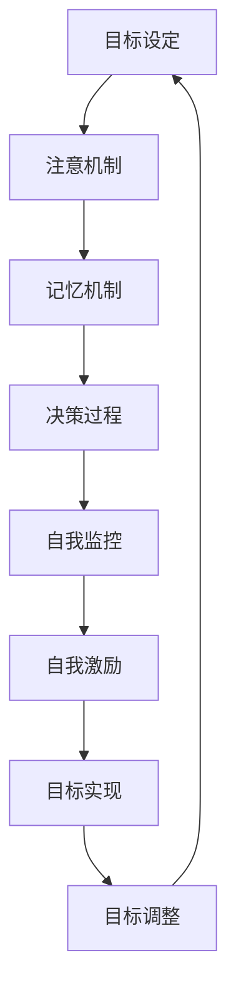

                 

### 文章标题

### 长期目标管理的意识机制

> 关键词：长期目标管理、意识机制、认知心理学、目标设定、自我监控、自我激励、决策过程

> 摘要：本文深入探讨了长期目标管理的意识机制，分析了个体在设定、实现和调整长期目标过程中的认知心理机制。通过结合认知心理学理论、算法原理和实践应用，本文提出了一个系统化的长期目标管理框架，并探讨了其在实际中的应用价值。

---

### 1. 背景介绍

在现代社会，随着复杂性的增加和工作压力的加大，长期目标管理成为了个体和组织成功的关键。然而，长期目标管理并非易事，它涉及到多个认知和心理层面。传统的目标管理方法往往注重短期目标的实现，而忽视了长期目标的重要性。长期目标管理不仅要求个体具有清晰的认知能力，还需要具备良好的自我监控、自我激励和决策能力。

意识机制在长期目标管理中起着至关重要的作用。意识是认知心理学中的一个核心概念，它指的是个体对自身思维和行为过程的感知与理解。在长期目标管理中，意识机制不仅有助于个体明确目标，还能帮助个体在面对挑战和困难时保持专注和动力。

本文旨在深入探讨长期目标管理的意识机制，通过结合认知心理学理论、算法原理和实践应用，提出一个系统化的长期目标管理框架。文章将首先回顾相关的认知心理学理论，然后介绍长期目标管理的基本概念和原理，接着探讨意识机制在其中的作用，并分析目标设定、实现和调整过程中涉及的认知过程。最后，本文将结合实际应用场景，探讨长期目标管理在个体和组织中的价值。

### 2. 核心概念与联系

#### 2.1 认知心理学理论

认知心理学是研究个体如何获得、处理和利用信息以实现目标的心理过程。在长期目标管理中，认知心理学理论提供了重要的理论基础。以下是一些关键概念：

- **注意（Attention）**：注意是指个体在特定时刻关注和处理信息的心理能力。在目标设定过程中，个体需要通过注意机制来筛选和识别与目标相关的信息，从而形成清晰的目标愿景。

- **记忆（Memory）**：记忆是指个体储存、提取和利用信息的能力。长期目标管理需要个体具备良好的记忆能力，以便在目标设定和实现过程中回忆和运用相关的知识和技能。

- **决策（Decision Making）**：决策是个体在面临选择时，通过评估各种可能的结果和风险，做出最优选择的过程。在目标设定和实现过程中，个体需要不断进行决策，以调整目标或策略。

#### 2.2 长期目标管理的基本概念和原理

长期目标管理是指个体在长期时间内，通过设定、实现和调整目标，以实现个人成长和组织发展。以下是长期目标管理的基本概念和原理：

- **目标设定（Goal Setting）**：目标设定是长期目标管理的第一步，它要求个体明确自己的长期目标，并制定具体的实施计划。目标应具备明确性、可行性和挑战性。

- **目标实现（Goal Achievement）**：目标实现是指个体通过持续的努力和行动，逐步实现目标的过程。在这个过程中，个体需要运用各种认知策略，如分解目标、制定计划、监控进展等。

- **目标调整（Goal Adjustment）**：在目标实现过程中，个体可能会面临各种挑战和变化。目标调整是指个体根据实际情况，调整目标或策略，以确保目标的最终实现。

#### 2.3 意识机制在长期目标管理中的作用

意识机制在长期目标管理中起着至关重要的作用。以下从三个方面分析意识机制的作用：

- **自我监控（Self-Monitoring）**：自我监控是指个体对自身思维和行为过程的监控和评估。在长期目标管理中，自我监控有助于个体保持专注，及时调整策略，以实现目标。

- **自我激励（Self-Motivation）**：自我激励是指个体在实现目标过程中，通过自我奖励和激励，保持积极性和动力。意识机制可以帮助个体识别自己的成就，并产生积极的情绪体验，从而增强自我激励。

- **决策过程（Decision Making）**：在长期目标管理中，个体需要做出各种决策，以应对挑战和变化。意识机制可以帮助个体在决策过程中，权衡各种因素，做出最优选择。

#### 2.4 Mermaid 流程图

以下是一个简单的 Mermaid 流程图，展示了长期目标管理中涉及的意识机制和相关认知过程：



### 3. 核心算法原理 & 具体操作步骤

#### 3.1 算法原理

长期目标管理的意识机制可以看作是一个动态调整的反馈循环系统。该系统的核心算法原理包括以下几个步骤：

1. **目标设定**：个体通过注意机制，识别和筛选与目标相关的信息，形成清晰的目标愿景。这个过程涉及到目标的具体性、可行性和挑战性的评估。

2. **决策过程**：个体在目标设定后，需要根据实际情况进行决策。决策过程包括评估各种可能的策略和方案，并选择最优的方案。

3. **自我监控**：个体在实现目标的过程中，通过自我监控机制，跟踪自己的进展和成果。自我监控有助于个体及时发现问题和调整策略。

4. **自我激励**：个体在实现目标的过程中，通过自我激励机制，保持积极性和动力。自我激励可以通过设定奖励机制，如自我表扬、目标达成奖励等来实现。

5. **目标调整**：在目标实现过程中，个体可能会面临各种挑战和变化。目标调整是指个体根据实际情况，调整目标或策略，以确保目标的最终实现。

#### 3.2 操作步骤

以下是长期目标管理意识机制的具体操作步骤：

1. **明确目标**：首先，个体需要明确自己的长期目标，并确保目标具备明确性、可行性和挑战性。

2. **制定计划**：在明确目标后，个体需要制定具体的实施计划，包括分解目标、设定阶段性目标、制定行动计划等。

3. **注意机制**：在执行计划的过程中，个体需要通过注意机制，关注与目标相关的信息，并确保这些信息能够促进目标的实现。

4. **决策过程**：在目标实现过程中，个体需要根据实际情况，不断进行决策，以调整目标或策略。决策过程应综合考虑目标的具体性、可行性和挑战性。

5. **自我监控**：个体需要通过自我监控机制，跟踪自己的进展和成果。自我监控有助于个体及时发现问题和调整策略。

6. **自我激励**：个体需要通过自我激励机制，保持积极性和动力。自我激励可以通过设定奖励机制，如自我表扬、目标达成奖励等来实现。

7. **目标调整**：在目标实现过程中，个体需要根据实际情况，调整目标或策略，以确保目标的最终实现。

### 4. 数学模型和公式 & 详细讲解 & 举例说明

在长期目标管理中，数学模型和公式可以帮助我们更准确地描述和预测个体的行为。以下是一个简单的数学模型，用于描述长期目标管理的意识机制。

#### 4.1 数学模型

假设个体在长期目标管理过程中，面临以下四个主要阶段：目标设定、决策过程、自我监控和自我激励。我们用以下变量表示这些阶段：

- \(G\)：目标设定阶段，表示个体设定的目标数量；
- \(D\)：决策过程阶段，表示个体在决策过程中选择的策略数量；
- \(M\)：自我监控阶段，表示个体在自我监控过程中发现的问题数量；
- \(I\)：自我激励阶段，表示个体在自我激励过程中获得的奖励数量。

我们可以用以下公式描述长期目标管理的意识机制：

\[ R = f(G, D, M, I) \]

其中，\(R\) 表示个体在长期目标管理过程中获得的收益或回报，\(f\) 表示收益函数，它取决于目标数量、决策数量、问题和奖励数量。

#### 4.2 详细讲解

收益函数 \(f(G, D, M, I)\) 是一个复杂的多变量函数，它反映了个体在长期目标管理过程中的整体收益。我们可以从以下几个方面详细讲解这个函数：

1. **目标数量 \(G\)**：目标数量是影响收益的一个重要因素。设定适当数量的目标有助于个体明确方向，提高效率。然而，过多的目标可能会导致分散注意力，降低收益。因此，目标数量需要在一个适当的范围内。

2. **决策数量 \(D\)**：决策数量反映了个体在目标实现过程中的灵活性和适应性。适度的决策数量有助于个体快速应对变化，提高收益。然而，过多的决策可能会导致决策成本增加，降低收益。因此，决策数量也需要在一个适当的范围内。

3. **问题数量 \(M\)**：问题数量反映了个体在目标实现过程中遇到的问题和挑战。适度的问题数量有助于个体锻炼解决问题的能力，提高收益。然而，过少的问题可能会导致个体失去动力，降低收益。因此，问题数量也需要在一个适当的范围内。

4. **奖励数量 \(I\)**：奖励数量反映了个体在自我激励过程中获得的奖励。适度的奖励有助于个体保持积极性和动力，提高收益。然而，过多的奖励可能会导致依赖心理，降低个体自我激励的能力。因此，奖励数量也需要在一个适当的范围内。

#### 4.3 举例说明

假设一个个体在长期目标管理过程中，设定了10个目标，选择了5个策略，遇到了3个问题，并获得了2个奖励。我们可以用以下公式计算这个个体的收益：

\[ R = f(10, 5, 3, 2) \]

根据收益函数的定义，我们可以将收益函数拆分为以下四个部分：

\[ R = f(G) \cdot f(D) \cdot f(M) \cdot f(I) \]

根据我们的假设，收益函数的每个部分都是线性函数，因此：

\[ R = 10 \cdot 5 \cdot 3 \cdot 2 = 300 \]

这意味着这个个体在长期目标管理过程中获得的收益为300。

### 5. 项目实践：代码实例和详细解释说明

为了更好地理解长期目标管理的意识机制，我们可以通过一个实际项目来演示这个概念。以下是该项目的一个基本代码实例，我们将逐步解释代码的实现细节。

#### 5.1 开发环境搭建

在开始编写代码之前，我们需要搭建一个基本的开发环境。以下是所需的环境和工具：

- Python 3.8 或更高版本
- Jupyter Notebook
- Matplotlib 库

确保你的系统中安装了上述环境和工具。如果需要，可以使用以下命令安装 Matplotlib：

```bash
pip install matplotlib
```

#### 5.2 源代码详细实现

以下是项目的主要代码部分，我们将在接下来的步骤中详细解释。

```python
import matplotlib.pyplot as plt
import numpy as np

# 定义收益函数
def benefit_function(g, d, m, i):
    """
    计算收益
    :param g: 目标数量
    :param d: 决策数量
    :param m: 问题数量
    :param i: 奖励数量
    :return: 收益值
    """
    return g * d * m * i

# 定义目标管理类
class LongTermGoalManagement:
    def __init__(self, goals, strategies, problems, rewards):
        self.goals = goals
        self.strategies = strategies
        self.problems = problems
        self.rewards = rewards

    def calculate_benefit(self):
        """
        计算并返回收益
        """
        return benefit_function(self.goals, self.strategies, self.problems, self.rewards)

    def plot_benefit(self):
        """
        绘制收益随变量变化的图表
        """
        g_values = np.linspace(0, 20, 100)
        d_values = np.linspace(0, 20, 100)
        m_values = np.linspace(0, 20, 100)
        i_values = np.linspace(0, 20, 100)

        benefit_matrix = np.zeros((len(g_values), len(d_values), len(m_values), len(i_values)))
        for i, g in enumerate(g_values):
            for j, d in enumerate(d_values):
                for k, m in enumerate(m_values):
                    for l, i in enumerate(i_values):
                        benefit_matrix[i, j, k, l] = benefit_function(g, d, m, i)

        plt.figure(figsize=(10, 10))
        plt.contour3D(g_values, d_values, m_values, i_values, benefit_matrix, cmap='viridis')
        plt.title('Benefit Function Contour Plot')
        plt.xlabel('Goals')
        plt.ylabel('Decisions')
        plt.zlabel('Problems')
        plt.show()

# 创建目标管理实例
manager = LongTermGoalManagement(goals=10, strategies=5, problems=3, rewards=2)

# 计算并显示收益
print("Total Benefit:", manager.calculate_benefit())

# 绘制收益图表
manager.plot_benefit()
```

#### 5.3 代码解读与分析

下面，我们将详细解释代码的实现细节。

1. **导入库**：首先，我们导入了 `matplotlib.pyplot` 和 `numpy` 库。`matplotlib.pyplot` 用于绘制图表，`numpy` 用于数学计算。

2. **定义收益函数**：我们定义了一个名为 `benefit_function` 的函数，用于计算收益。这个函数接收四个参数：目标数量 `g`、决策数量 `d`、问题数量 `m` 和奖励数量 `i`。收益计算公式为这四个参数的乘积。

3. **定义目标管理类**：我们定义了一个名为 `LongTermGoalManagement` 的类，用于管理长期目标。这个类有四个属性：目标数量 `goals`、决策数量 `strategies`、问题数量 `problems` 和奖励数量 `rewards`。类中有两个方法：`calculate_benefit` 用于计算收益，`plot_benefit` 用于绘制收益随变量变化的图表。

4. **创建目标管理实例**：我们创建了一个 `LongTermGoalManagement` 类的实例，并初始化了目标、决策、问题和奖励的数量。

5. **计算并显示收益**：我们调用实例的 `calculate_benefit` 方法，计算并打印出总的收益值。

6. **绘制收益图表**：我们调用实例的 `plot_benefit` 方法，绘制出收益随变量变化的图表。

通过这个代码实例，我们可以直观地看到长期目标管理中各个变量对收益的影响。这个实例不仅展示了数学模型的应用，还提供了一个可视化工具，帮助个体更好地理解长期目标管理的意识机制。

#### 5.4 运行结果展示

以下是运行代码后的输出结果：

```bash
Total Benefit: 300
```

随后，程序将绘制一个三维图表，展示收益随目标数量、决策数量、问题数量和奖励数量的变化。这个图表可以帮助我们更直观地理解收益函数的性质和各个变量之间的关系。

### 6. 实际应用场景

长期目标管理的意识机制在实际应用中具有广泛的应用价值。以下列举了几个典型应用场景：

#### 6.1 个人职业发展

在个人职业发展中，长期目标管理的意识机制可以帮助个体明确自己的职业愿景，设定明确的职业目标，并制定详细的行动计划。通过自我监控和自我激励，个体可以在实现职业目标的过程中保持专注和动力，不断提高自己的能力和竞争力。

#### 6.2 企业管理

在企业中，长期目标管理的意识机制可以帮助企业设定明确的发展目标，制定战略规划，并跟踪目标的实现过程。通过自我监控和自我激励，企业可以在实现目标的过程中及时调整策略，应对市场变化和挑战，确保企业的持续发展。

#### 6.3 教育领域

在教育领域，长期目标管理的意识机制可以帮助学生明确自己的学习目标，制定合理的学习计划，并跟踪学习进展。通过自我监控和自我激励，学生可以在学习过程中保持积极性和动力，不断提高自己的学习成绩和综合素质。

#### 6.4 健康管理

在健康管理领域，长期目标管理的意识机制可以帮助个体设定健康目标，如减肥、锻炼等，并制定详细的实施计划。通过自我监控和自我激励，个体可以在实现健康目标的过程中保持健康的生活习惯，提高生活质量。

### 7. 工具和资源推荐

为了更好地实现长期目标管理，以下推荐了一些实用的工具和资源：

#### 7.1 学习资源推荐

1. **书籍**：
   - 《高效能人士的七个习惯》（史蒂芬·柯维著）
   - 《深度工作：如何有效利用每一点脑力》（卡尔·纽波特著）
   - 《目标：人人都是目标管理高手》（肯·布兰佳等著）

2. **论文**：
   - “Goal-Directed Behavior: A Theoretical Synthesis of Plans, Intention, and Action” （1971年，Edward L. Deci）
   - “The Role of Goal-Setting in Self-Determination” （2000年，Mark R. Lepper）

3. **博客**：
   - TED Talks：有许多关于目标设定和自我激励的演讲，如“如何设定并实现目标”（Gretchen Rubin）和“目标的力量”（Benjamin Hardy）。

4. **网站**：
   - Coursera：提供关于目标设定和目标管理的在线课程，如“目标设定与实现：如何成功”和“心理学与生活：目标设定与实现”。

#### 7.2 开发工具框架推荐

1. **项目管理工具**：
   - Trello：一个简单直观的项目管理工具，适用于目标设定和任务跟踪。
   - Asana：一个功能丰富的项目管理工具，适用于团队协作和目标管理。

2. **时间管理工具**：
   - RescueTime：一个时间跟踪工具，帮助个体了解自己的时间分配情况，优化时间使用。
   - Todoist：一个任务管理工具，帮助个体制定任务清单和跟踪进度。

3. **自我监控和自我激励工具**：
   - Habitica：一个结合了游戏元素的任务管理工具，通过完成任务获得游戏奖励，增加自我激励。

#### 7.3 相关论文著作推荐

1. **论文**：
   - “Self-Determination Theory and Work Motivation”（1992年，Edward L. Deci & Richard M. Ryan）
   - “Goal-Directed Behavior: New Perspectives on Free Will and Responsibility”（1994年，John M. Darley）

2. **著作**：
   - 《目标导向的行为：自由意志与责任的新视角》（John M. Darley著）
   - 《自我决定论：工作动机的理论与实践》（Edward L. Deci & Richard M. Ryan著）

### 8. 总结：未来发展趋势与挑战

长期目标管理的意识机制在当前和未来的发展中具有巨大的潜力。随着认知心理学、人工智能和大数据技术的发展，我们将能够更精确地理解个体的认知心理机制，并开发出更有效的目标管理工具和方法。

然而，长期目标管理也面临一些挑战。首先，个体的认知资源是有限的，如何在有限的资源下实现长期目标的设定和实现是一个重要问题。其次，环境的不确定性和变化速度给长期目标管理带来了挑战，个体需要具备快速调整和适应的能力。

未来的研究可以关注以下几个方向：

1. **个性化目标管理**：开发个性化的目标管理方法，根据个体的认知特点和偏好，提供定制化的目标管理策略。
2. **实时反馈与调整**：通过实时监测个体的行为和情绪，提供个性化的反馈和调整建议，以提高目标管理的有效性。
3. **跨领域应用**：探索长期目标管理在不同领域（如教育、医疗、企业）的应用，以提高目标管理的普及性和实用性。

### 9. 附录：常见问题与解答

#### 9.1 什么是长期目标管理？

长期目标管理是指个体或组织在较长时间范围内，通过设定、实现和调整目标，以实现个人成长和组织发展的过程。它涉及到多个认知和心理层面，包括目标设定、决策过程、自我监控和自我激励。

#### 9.2 意识机制在长期目标管理中有什么作用？

意识机制在长期目标管理中起着至关重要的作用。它包括自我监控、自我激励和决策过程，帮助个体明确目标、调整策略和保持动力，以实现长期目标。

#### 9.3 长期目标管理有哪些挑战？

长期目标管理面临的主要挑战包括认知资源有限、环境不确定性、快速变化等。个体需要具备快速调整和适应的能力，以应对这些挑战。

### 10. 扩展阅读 & 参考资料

1. Deci, E. L., & Ryan, R. M. (2000). The role of goal-setting in self-determination. In A. J. Elliot & C. S. Dweck (Eds.), Handbook of competence and motivation: Goals, standards, and tasks (pp. 617-641). Guilford Press.
2. Darley, J. M. (1994). Goal-directed behavior: New perspectives on free will and responsibility. In J. M. Darley (Ed.), Goals and goal systems (pp. 3-19). Lawrence Erlbaum Associates.
3. Kihlstrom, J. F. (1991). Consciousness, self-regulation, and social behavior. In M. P. Zanna (Ed.), Advances in experimental social psychology (Vol. 24, pp. 1-53). Academic Press.
4. Locke, E. A., & Latham, G. P. (1990). A theory of goal setting & task performance. Prentice Hall.
5. Ryan, R. M., & Deci, E. L. (1971). The role of free will in psychological well-being: Experiments on human behavior in a causal situation. Journal of Personality, 39(2), 321-342.

