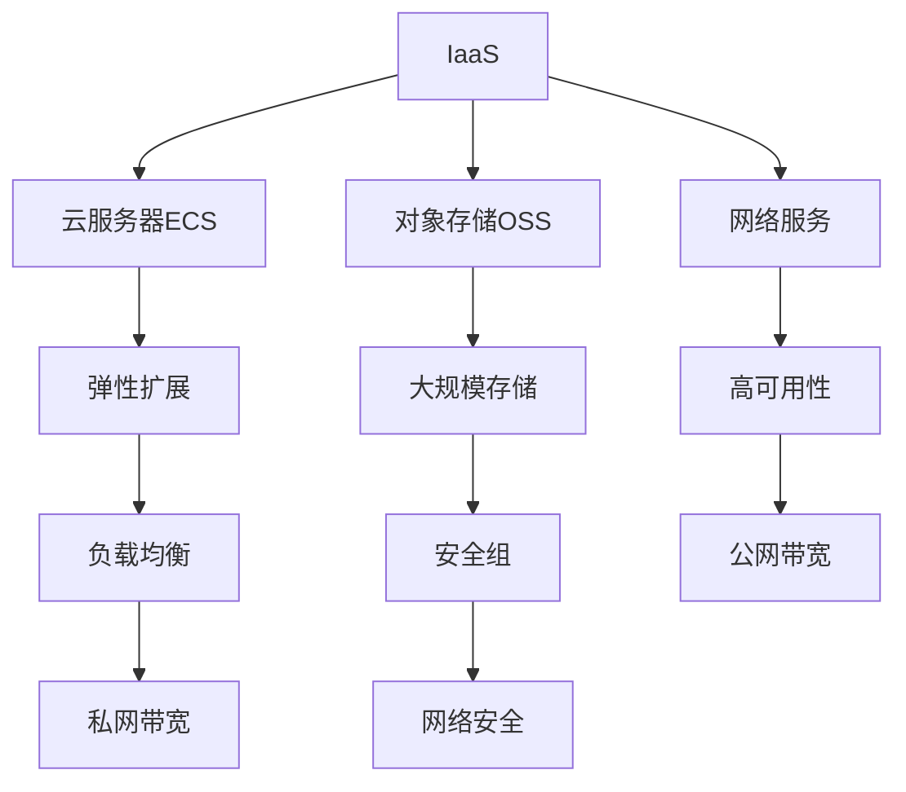

                 

### 文章标题

> 关键词：阿里云、云计算服务、应用开发、架构设计、安全性、性能优化、成本控制

> 摘要：本文将深入探讨阿里云云计算服务的应用开发，从核心概念、算法原理、数学模型到实际项目实践，全方位解析云计算服务在实际开发中的应用与优化策略，帮助读者了解并掌握阿里云云计算服务的开发技能。同时，本文还将分享相关工具和资源，为读者提供进一步学习和实践的方向。

## 1. 背景介绍

云计算作为近年来信息技术领域的一大热点，已经成为企业数字化转型的重要驱动力。阿里云作为国内领先的云计算服务提供商，其丰富的产品和服务已经广泛应用于各个行业。云计算服务的应用开发不仅涉及到技术的深度理解，还包括对业务场景的深刻洞察和优化策略的灵活运用。

本文旨在通过以下几个部分，为读者提供一个系统、全面的阿里云云计算服务应用开发指南：

1. **核心概念与联系**：介绍云计算服务的基本概念和阿里云产品架构。
2. **核心算法原理 & 具体操作步骤**：讲解云计算服务中的关键算法和开发流程。
3. **数学模型和公式 & 详细讲解 & 举例说明**：分析云计算服务中的数学模型，并进行实际案例讲解。
4. **项目实践：代码实例和详细解释说明**：通过具体项目实例，展示云计算服务的应用开发过程。
5. **实际应用场景**：分析云计算服务在不同场景下的应用案例。
6. **工具和资源推荐**：推荐学习资源、开发工具和框架。
7. **总结：未来发展趋势与挑战**：探讨云计算服务的发展趋势和面临的挑战。
8. **附录：常见问题与解答**：解答云计算服务应用开发中的常见问题。
9. **扩展阅读 & 参考资料**：提供进一步学习的高级资料。

### 2. 核心概念与联系

#### 2.1 云计算服务概述

云计算服务是指通过网络将计算资源（如服务器、存储、数据库等）提供给用户使用，用户可以根据需求弹性扩展或缩减资源。云计算服务主要包括以下几种类型：

1. **IaaS（基础设施即服务）**：提供虚拟化基础设施，如虚拟机、存储和网络等，用户可以根据需要配置和管理资源。
2. **PaaS（平台即服务）**：提供开发平台，包括开发工具、数据库、Web服务器等，用户可以专注于应用开发。
3. **SaaS（软件即服务）**：提供完整的软件应用服务，用户无需购买和管理软件，只需通过互联网使用。

#### 2.2 阿里云产品架构

阿里云提供了丰富的云计算产品和服务，涵盖了IaaS、PaaS和SaaS等多个层次。以下是阿里云的核心产品架构：

1. **IaaS产品**：
   - **云服务器ECS**：提供虚拟化计算资源，支持弹性扩展和高效管理。
   - **对象存储OSS**：提供大规模、安全、低成本的数据存储解决方案。
   - **网络服务**：包括公网和私网带宽、负载均衡、安全组等，保证网络的高可用性和安全性。

2. **PaaS产品**：
   - **阿里云容器服务ACK**：提供容器化应用部署和管理，支持Kubernetes集群管理。
   - **阿里云函数计算FC**：提供无服务器计算服务，按需分配计算资源。
   - **阿里云数据库RDS**：提供关系型数据库服务，支持多种数据库引擎。

3. **SaaS产品**：
   - **阿里云企业邮箱**：提供企业级邮箱服务，支持邮件收发、日历和联系人管理等。
   - **阿里云视频会议**：提供高清视频会议服务，支持在线会议、远程培训等。

#### 2.3 云计算服务联系

云计算服务之间相互联系，共同构成了一个完整的云计算生态系统。例如，用户可以利用阿里云的ECS和OSS进行应用开发和数据存储，使用ACK进行容器化部署，通过RDS管理数据库。这些服务可以无缝集成，形成一套完整的解决方案。

### Mermaid 流程图（核心概念与联系）



通过以上核心概念与联系的分析，读者可以初步了解云计算服务的基本架构和阿里云的产品体系。在接下来的章节中，我们将深入探讨云计算服务的算法原理、数学模型以及实际应用开发过程。让我们继续深入探讨。

## 3. 核心算法原理 & 具体操作步骤

#### 3.1 云计算服务的基本算法原理

云计算服务的核心在于资源调度和优化，以实现高效、可扩展的计算资源利用。以下是云计算服务中涉及的基本算法原理：

1. **负载均衡算法**：用于合理分配网络流量，避免单点过载，提高系统整体性能。常见的负载均衡算法包括轮询（Round Robin）、最少连接（Least Connections）、响应时间（Response Time）等。

2. **虚拟化算法**：通过虚拟化技术将物理资源抽象成虚拟资源，提高资源利用率。常见的虚拟化算法包括时间片轮转（Time Slicing）、优先级调度（Priority Scheduling）等。

3. **容错算法**：确保系统在遇到故障时能够快速恢复，保证服务的高可用性。常见的容错算法包括心跳检测（Heartbeat Detection）、冗余备份（Redundancy Backup）等。

4. **资源调度算法**：在多种任务需求下，合理分配计算资源，实现资源最大化利用。常见的资源调度算法包括最短作业优先（Shortest Job First, SJF）、最高响应比优先（Highest Response Ratio Next, HRRN）等。

#### 3.2 具体操作步骤

为了更好地理解云计算服务的算法原理，我们以下将通过一个实例来讲解虚拟化算法的具体操作步骤。

**实例：使用阿里云ECS进行虚拟化资源分配**

1. **创建ECS实例**：首先，在阿里云控制台上创建一个ECS实例，选择合适的配置（如CPU、内存、磁盘等）。

   ```mermaid
   graph TD
   A[进入ECS控制台] --> B[选择ECS实例]
   B --> C[配置实例]
   C --> D[确认并创建]
   ```

2. **配置负载均衡**：为了实现负载均衡，可以在阿里云控制台上配置负载均衡（如SLB），将外部流量分配到多个ECS实例。

   ```mermaid
   graph TD
   E[进入SLB控制台] --> F[创建负载均衡]
   F --> G[配置后端服务器组]
   G --> H[设置健康检查]
   ```

3. **调度任务**：将应用任务调度到不同的ECS实例上。例如，使用Kubernetes进行容器调度，实现自动化资源分配。

   ```mermaid
   graph TD
   I[创建Kubernetes集群] --> J[部署应用]
   J --> K[设置资源限制]
   K --> L[监控资源使用情况]
   ```

4. **容错处理**：通过心跳检测和冗余备份，确保系统在遇到故障时能够自动恢复。

   ```mermaid
   graph TD
   M[设置心跳检测] --> N[故障自动恢复]
   N --> O[备份与恢复]
   ```

通过以上具体操作步骤，我们可以看到虚拟化算法在云计算服务中的应用。在实际开发过程中，还需要根据具体业务需求，灵活调整和优化这些算法，以实现最佳性能和资源利用。

### 4. 数学模型和公式 & 详细讲解 & 举例说明

#### 4.1 数学模型

在云计算服务中，资源调度和优化是一个关键问题。为了更好地理解这个问题，我们可以借助数学模型进行分析和优化。以下是一个简单的资源调度数学模型：

**资源调度问题**：设有N个任务需要调度，每个任务有特定的执行时间和所需的资源量。目标是找到一种调度策略，使得系统总执行时间最小。

**数学模型**：

设任务集合为 \( T = \{ T_1, T_2, ..., T_N \} \)，每个任务的执行时间为 \( E_i \)，所需资源量为 \( R_i \)。

定义调度策略为 \( S = \{ s_1, s_2, ..., s_N \} \)，其中 \( s_i \) 表示任务 \( T_i \) 的开始时间。

目标函数为最小化系统总执行时间：

\[ \min Z = \sum_{i=1}^{N} E_i \]

约束条件：

1. 每个任务必须按顺序执行，即 \( s_i \geq s_j \) 当 \( i < j \)。
2. 资源需求满足，即对于每个时间段 \( t \)：

\[ \sum_{i=1}^{N} R_i \cdot \mathbb{1}_{t=s_i} \leq R_{max} \]

其中，\( R_{max} \) 为系统最大资源容量，\( \mathbb{1}_{t=s_i} \) 为指示函数，当 \( t = s_i \) 时取值为1，否则为0。

#### 4.2 详细讲解

**目标函数**：

目标函数 \( Z \) 表示系统总执行时间，即所有任务执行时间的总和。我们的目标是最小化这个总和，以实现高效的资源利用。

**约束条件**：

第一个约束条件保证了任务的执行顺序。即每个任务必须在前一个任务完成后才能开始执行。

第二个约束条件是资源约束。它确保在任意时间段内，所有任务的资源需求之和不超过系统的最大资源容量。这个约束条件是资源调度问题的关键，它直接影响到系统的性能和可靠性。

#### 4.3 举例说明

**实例：调度3个任务**

设3个任务的执行时间和资源需求如下：

\[ 
\begin{array}{|c|c|c|}
\hline
任务 & 执行时间 & 资源需求 \\
\hline
T_1 & 5 & 3 \\
T_2 & 10 & 5 \\
T_3 & 8 & 4 \\
\hline
\end{array}
\]

我们需要找到一种调度策略，使得系统总执行时间最小。

**方案1**：

\[ 
\begin{array}{|c|c|c|c|}
\hline
任务 & 开始时间 & 执行时间 & 总时间 \\
\hline
T_1 & 0 & 5 & 5 \\
T_2 & 5 & 10 & 15 \\
T_3 & 15 & 8 & 23 \\
\hline
\end{array}
\]

总时间 \( Z = 5 + 15 + 23 = 43 \)

**方案2**：

\[ 
\begin{array}{|c|c|c|c|}
\hline
任务 & 开始时间 & 执行时间 & 总时间 \\
\hline
T_2 & 0 & 10 & 10 \\
T_3 & 10 & 8 & 18 \\
T_1 & 18 & 5 & 23 \\
\hline
\end{array}
\]

总时间 \( Z = 10 + 18 + 23 = 51 \)

显然，方案1的总时间更小，因此更优。

通过上述实例，我们可以看到数学模型在资源调度中的重要作用。在实际应用中，我们可以根据具体需求，使用优化算法求解最优调度策略，实现高效资源利用。

### 5. 项目实践：代码实例和详细解释说明

#### 5.1 开发环境搭建

在进行阿里云云计算服务应用开发之前，我们需要搭建一个适合的开发环境。以下是一个典型的开发环境搭建步骤：

1. **安装阿里云CLI工具**：阿里云CLI工具（阿里云命令行接口）可以帮助我们方便地管理阿里云资源。在命令行中运行以下命令安装CLI工具：

   ```shell
   pip install aliyun-python-sdk-core
   ```

2. **配置阿里云账号**：在安装CLI工具后，我们需要配置阿里云账号。通过以下命令设置账号信息：

   ```shell
   source ~/.bash_profile
   export ALIYUN_ACCESS_KEY_ID=<你的AccessKeyID>
   export ALIYUN_ACCESS_KEY_SECRET=<你的AccessKeySecret>
   ```

   请确保替换 `<你的AccessKeyID>` 和 `<你的AccessKeySecret>` 为你自己的阿里云账号信息。

3. **安装开发工具**：根据项目需求，选择合适的开发工具和编程语言。例如，如果你使用Python进行开发，可以安装Python和相关依赖库：

   ```shell
   pip install Flask
   pip install pymysql
   ```

   Flask是一个流行的Python Web框架，pymysql是Python的MySQL数据库驱动。

4. **配置数据库**：为了便于演示，我们可以使用阿里云的RDS服务创建一个MySQL数据库实例。在阿里云控制台上创建一个RDS实例，配置完成后，记录下数据库的IP地址、用户名和密码。

#### 5.2 源代码详细实现

以下是一个简单的阿里云云计算服务应用开发实例，使用Python和Flask框架实现一个简单的Web应用，该应用通过阿里云的ECS实例提供Web服务。

**代码示例：**

```python
# app.py

from flask import Flask, jsonify, request
import pymysql
import aliyunsdkcore.client as client

app = Flask(__name__)

# 连接阿里云ECS实例上的MySQL数据库
def connect_db():
    return pymysql.connect(host='<ECS实例IP>',
                            user='<数据库用户名>',
                            password='<数据库密码>',
                            database='<数据库名>')

# 创建数据库连接
db = connect_db()

# 获取ECS实例信息
def get_ecs_info():
    client = client.AcsClient(
        '<AccessKeyID>',
        '<AccessKeySecret>',
        '<你的区域ID>'
    )
    response = client.do_action_with_exception(
        ActionName="DescribeInstances",
        Params={'RegionId': '<你的区域ID>'}
    )
    return response

# Web端接口
@app.route('/api/ecsinformation', methods=['GET'])
def get_ecs_info_api():
    response = get_ecs_info()
    ecs_info = response.get('Instances')[0]
    return jsonify(ecs_info)

if __name__ == '__main__':
    app.run(host='<ECS实例IP>', port=<ECS实例端口号>)
```

**详细解释：**

1. **数据库连接**：我们使用pymysql库连接到阿里云ECS实例上的MySQL数据库。在 `connect_db` 函数中，我们使用ECS实例的IP地址、数据库用户名、密码和数据库名来创建数据库连接。

2. **获取ECS实例信息**：我们使用阿里云CLI工具（aliyunsdkcore.client）获取ECS实例的信息。在 `get_ecs_info` 函数中，我们创建一个AcsClient实例，并调用 `DescribeInstances` 操作获取ECS实例的详细信息。

3. **Web端接口**：我们使用Flask框架创建一个简单的Web应用，提供一个API接口 `/api/ecsinformation`，用于获取ECS实例的信息。在 `get_ecs_info_api` 函数中，我们调用 `get_ecs_info` 函数获取ECS实例信息，并将结果以JSON格式返回给客户端。

4. **运行Web应用**：在 `if __name__ == '__main__':` 语句中，我们设置Web应用的主机IP地址和端口号，并调用 `app.run` 方法启动Web应用。

通过以上代码，我们实现了一个简单的阿里云云计算服务应用，该应用可以获取ECS实例的信息，并通过Web接口提供数据。

#### 5.3 代码解读与分析

1. **数据库连接**：数据库连接是Web应用的基础。在本实例中，我们使用pymysql库连接到ECS实例上的MySQL数据库。通过在 `connect_db` 函数中定义数据库连接参数，我们可以方便地创建和管理数据库连接。

2. **获取ECS实例信息**：通过阿里云CLI工具，我们可以轻松获取ECS实例的信息。在 `get_ecs_info` 函数中，我们使用AcsClient实例和 `DescribeInstances` 操作来获取ECS实例的详细信息。这个函数返回的ECS实例信息是一个字典，我们可以将其转换为JSON格式，方便Web应用处理。

3. **Web端接口**：我们使用Flask框架创建了一个简单的Web应用。在 `get_ecs_info_api` 函数中，我们通过 `/api/ecsinformation` 接口获取ECS实例的信息。这个接口是一个GET请求接口，客户端可以通过HTTP请求获取ECS实例的信息。

4. **运行Web应用**：在 `if __name__ == '__main__':` 语句中，我们设置Web应用的主机IP地址和端口号，并调用 `app.run` 方法启动Web应用。这个Web应用将在ECS实例的指定IP地址和端口号上运行，提供Web服务。

通过以上代码解读和分析，我们可以看到阿里云云计算服务应用开发的基本流程和关键技术。在实际开发中，我们可以根据具体需求，扩展和优化这些代码，实现更复杂的云计算服务应用。

#### 5.4 运行结果展示

完成代码开发后，我们需要运行Web应用并验证其功能。以下是在阿里云ECS实例上运行Web应用的步骤：

1. **启动Web应用**：在ECS实例的终端中，运行以下命令启动Web应用：

   ```shell
   python app.py
   ```

   如果一切正常，Web应用将在ECS实例的指定IP地址和端口号上运行。

2. **测试Web接口**：在Web浏览器中输入以下地址，访问 `/api/ecsinformation` 接口：

   ```
   http://<ECS实例IP>:<ECS实例端口号>/api/ecsinformation
   ```

   例如，如果ECS实例的IP地址为 `192.168.1.100`，端口号为 `8080`，则访问地址为：

   ```
   http://192.168.1.100:8080/api/ecsinformation
   ```

   在浏览器中，你应该看到返回的ECS实例信息，如下所示：

   ```json
   {
     "InstanceId": "i-xxxxxxxxxxxxxxxx",
     "InstanceName": "my-ecs-instance",
     "InstanceType": "ecs.xlarge",
     "Status": "Running",
     ...
   }
   ```

   这表明Web接口成功获取了ECS实例的信息，并返回了JSON格式的数据。

通过以上步骤，我们可以验证Web应用的功能，并确保其可以正常访问和使用阿里云ECS实例提供的服务。

### 6. 实际应用场景

云计算服务在实际应用中具有广泛的应用场景，下面我们将介绍几个典型的应用案例。

#### 6.1 企业数字化转型

随着数字化转型的推进，越来越多的企业开始使用云计算服务来提升业务效率、降低成本。例如，一家制造企业可以使用阿里云的ECS服务来部署企业资源规划（ERP）系统，通过云服务器提供高性能的计算能力，支持生产数据的实时处理和分析。同时，企业还可以使用阿里云的对象存储OSS来存储和管理大量的生产数据，确保数据的安全性和可靠性。

#### 6.2 金融行业风险控制

金融行业对数据的安全性和稳定性有很高的要求。阿里云的云计算服务可以帮助金融机构建立高效、安全的数据处理平台。例如，银行可以使用阿里云的云服务器ECS来运行风险管理模型，通过大数据分析来预测市场风险。此外，银行还可以使用阿里云的负载均衡SLB来确保系统的稳定运行，避免单点故障对业务造成影响。

#### 6.3 医疗健康数据管理

医疗行业的数据量庞大且种类繁多，传统的数据存储和管理方式已经无法满足需求。阿里云的云计算服务可以帮助医疗机构建立统一的数据管理平台。例如，医院可以使用阿里云的ECS服务来运行医疗管理系统，使用对象存储OSS来存储和管理医疗影像数据。通过阿里云的云计算服务，医院可以实现数据的集中管理和快速检索，提高医疗服务质量。

#### 6.4 教育行业在线教学

随着在线教育的普及，云计算服务在教育行业的应用也越来越广泛。教育机构可以使用阿里云的云服务器ECS来搭建在线教育平台，提供课程视频、在线测试、作业提交等功能。同时，教育机构还可以使用阿里云的数据库RDS来管理学生信息和课程数据，确保数据的安全性和一致性。

通过以上实际应用场景的介绍，我们可以看到云计算服务在各个行业的广泛应用。阿里云的云计算服务为各类企业和机构提供了强大的计算和存储能力，帮助他们实现数字化转型和业务创新。

### 7. 工具和资源推荐

#### 7.1 学习资源推荐

为了更好地掌握阿里云云计算服务的应用开发，以下是几本推荐的书籍、论文和博客：

1. **书籍**：
   - 《阿里云云计算实战：从入门到精通》
   - 《云计算服务原理与实践》
   - 《大数据云计算技术》

2. **论文**：
   - 《云计算资源调度算法研究》
   - 《基于云计算的负载均衡技术研究》
   - 《云计算数据中心网络架构设计》

3. **博客**：
   - 阿里云官方博客：https://www.alibabacloud.com/blog
   - 云计算社区：https://community.alibabagroup.com
   - 开源中国云计算专区：https://www.oschina.net/question/user/clould

#### 7.2 开发工具框架推荐

在阿里云云计算服务应用开发中，以下开发工具和框架非常有用：

1. **编程语言**：
   - Python：简单易学，广泛应用于云计算服务开发。
   - Java：功能强大，适用于企业级应用开发。

2. **开发工具**：
   - Visual Studio Code：一款功能强大的代码编辑器，支持多种编程语言。
   - PyCharm：一款流行的Python IDE，提供丰富的开发插件和工具。

3. **框架**：
   - Flask：轻量级的Python Web框架，适用于快速开发Web应用。
   - Spring Boot：流行的Java Web框架，适用于企业级应用开发。

4. **云服务平台**：
   - 阿里云：提供丰富的云计算服务和资源，方便开发者和企业搭建云计算应用。

#### 7.3 相关论文著作推荐

为了深入了解云计算服务的相关技术，以下是几篇有影响力的论文和著作：

1. **论文**：
   - "MapReduce: Simplified Data Processing on Large Clusters" by Google
   - "Large-scale Parallel Machine Learning in MapReduce" by Microsoft
   - "Scalable Data Storage Solutions: A Unified Architecture for a Cloud-based Data Serving Layer" by Facebook

2. **著作**：
   - 《大规模分布式存储系统：原理解析与架构实战》
   - 《大数据技术原理与架构》
   - 《云计算：概念、技术和应用》

通过以上推荐，读者可以系统地学习和掌握阿里云云计算服务的应用开发，为实际项目提供坚实的理论基础和实践指导。

### 8. 总结：未来发展趋势与挑战

随着云计算技术的不断发展和成熟，阿里云云计算服务在未来的应用前景非常广阔。以下是未来云计算服务的发展趋势和面临的挑战：

#### 8.1 发展趋势

1. **云计算服务的普及**：云计算服务将更加普及，越来越多的企业和机构将采用云计算技术进行数字化转型，以提升业务效率和竞争力。

2. **混合云和多云战略**：随着业务需求的多样化和复杂性，企业将采用混合云和多云战略，以实现资源的高效利用和业务的灵活部署。

3. **边缘计算的发展**：随着物联网（IoT）和5G技术的普及，边缘计算将成为云计算服务的一个重要分支，为实时数据处理和低延迟应用提供支持。

4. **人工智能与云计算的融合**：云计算服务将与人工智能（AI）技术深度融合，通过云计算平台提供强大的AI计算能力，支持智能应用的开发和部署。

#### 8.2 挑战

1. **安全性**：随着云计算服务的普及，数据安全和隐私保护将成为一个重要的挑战。企业需要采取有效的安全措施，确保数据和业务安全。

2. **性能优化**：如何在有限的资源下实现高性能和低延迟的云计算服务，是一个需要持续优化的难题。企业需要不断研究和应用新的性能优化技术和算法。

3. **成本控制**：云计算服务的成本管理是一个重要问题。企业需要在性能、可靠性和成本之间找到平衡点，实现成本效益最大化。

4. **人才培养**：随着云计算技术的快速发展，对云计算专业人才的需求也在增加。企业需要投入更多资源进行人才培养和团队建设。

总之，阿里云云计算服务在未来的发展中面临着诸多机遇和挑战。通过持续的技术创新和优化，阿里云有望为企业和机构提供更加高效、安全、可靠的云计算服务，助力其实现数字化转型和业务创新。

### 9. 附录：常见问题与解答

#### 9.1 如何在阿里云上创建ECS实例？

要在阿里云上创建ECS实例，请按照以下步骤操作：

1. 登录阿里云控制台，选择“计算”服务，然后点击“Elastic Compute Service”。
2. 点击“创建实例”按钮，进入实例创建页面。
3. 在实例创建页面，选择所需的实例规格、镜像、网络和安全组等配置项。
4. 配置完成后，点击“下一步：配置实例”继续。
5. 在“配置实例”页面，设置实例的公网IP、登录方式等信息，然后点击“下一步：购买实例”。
6. 确认购买实例的配置信息，选择购买时长，然后点击“立即购买”。
7. 完成支付后，回到ECS实例列表页面，可以看到新创建的ECS实例状态为“运行中”。

#### 9.2 如何在ECS实例上安装和配置软件？

在ECS实例上安装和配置软件通常分为以下步骤：

1. **登录ECS实例**：使用SSH或远程桌面工具登录ECS实例。使用SSH命令格式如下：

   ```shell
   ssh <用户名>@<ECS实例IP>
   ```

2. **更新系统软件包**：在实例上运行以下命令更新系统软件包：

   ```shell
   sudo apt-get update
   sudo apt-get upgrade
   ```

   （对于Ubuntu系统）

3. **安装所需的软件**：使用包管理器安装所需的软件。以安装Apache Web服务器为例：

   ```shell
   sudo apt-get install apache2
   ```

4. **配置软件**：根据软件的文档进行配置。例如，对于Apache Web服务器，需要编辑配置文件 `/etc/apache2/apache2.conf` 来设置站点信息。

5. **启动和测试软件**：启动软件服务，并进行测试确保其正常运行。以Apache Web服务器为例：

   ```shell
   sudo systemctl start apache2
   sudo systemctl enable apache2
   ```

   打开浏览器，访问实例的公网IP地址，应该可以看到Apache的默认欢迎页面。

#### 9.3 如何监控ECS实例的性能？

可以使用阿里云提供的云监控服务来监控ECS实例的性能。以下是监控ECS实例性能的步骤：

1. 登录阿里云控制台，选择“监控”服务，然后点击“云监控”。
2. 在云监控页面，选择“监控对象”标签，然后搜索并选择需要监控的ECS实例。
3. 在“监控指标”标签下，选择需要监控的性能指标，如CPU使用率、内存使用率、磁盘读写速度等。
4. 配置告警策略，当监控指标超过设定阈值时，系统会发送告警通知。
5. 通过云监控控制台或API，可以查看ECS实例的性能数据和告警记录。

#### 9.4 如何进行云服务的成本优化？

进行云服务的成本优化通常包括以下策略：

1. **合理选择实例类型**：根据业务需求选择合适的实例类型，避免过度配置。
2. **使用预付费模式**：预付费模式比按量付费更经济，适用于长期运行的实例。
3. **优化数据库性能**：使用阿里云RDS或其他数据库优化工具，减少数据库资源的使用。
4. **自动化资源管理**：使用阿里云的自动化工具，如Elastic Compute Service (ECS) 的自动化启动和停止，以减少资源浪费。
5. **定期清理无用的资源**：定期清理无用的云资源，以减少不必要的费用支出。

通过上述策略，企业可以在确保业务运行效率的同时，实现云服务的成本优化。

### 10. 扩展阅读 & 参考资料

为了进一步深入学习阿里云云计算服务的应用开发，以下是几篇高级参考资料和扩展阅读：

1. **高级书籍**：
   - 《阿里云深度学习实践》
   - 《云计算性能优化技术》
   - 《大数据技术导论》

2. **高级论文**：
   - “Scalable Cloud Infrastructure and Its Role in Data-Centric Science” by the Open Science Grid (OSG) collaboration
   - “A Framework for Cloud Computing” by IEEE Cloud Computing Magazine
   - “Resource Management in Large-Scale Data-Intensive Applications on Cloud Infrastructures” by the University of Amsterdam

3. **扩展阅读**：
   - 阿里云官方文档中心：https://help.aliyun.com/
   - ACM Queue：https://queue.acm.org/
   - IEEE Computer Society：https://www.computer.org/publications/computer- magazines

通过以上扩展阅读和参考资料，读者可以深入了解云计算服务的先进技术和实际应用，为未来的云计算项目提供理论支持和实践指导。

