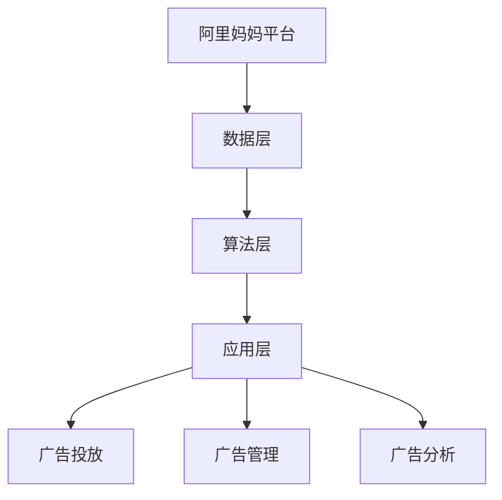
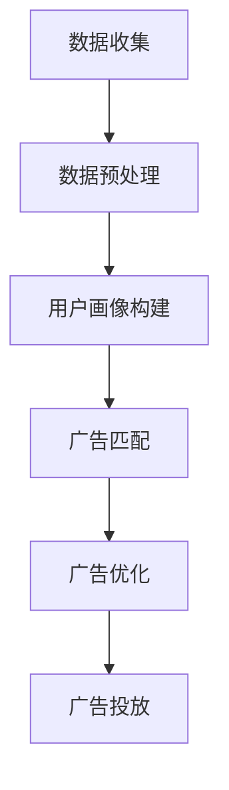

                 

### 1. 背景介绍

#### 1.1 阿里妈妈与社招面试

阿里妈妈（Alimama）是阿里巴巴集团旗下的一个效果营销平台，致力于帮助网站主和商家通过按效果付费的方式实现线上营销目标。阿里妈妈平台汇集了海量的商品和推广资源，为用户提供了丰富的广告投放选择。作为阿里巴巴集团的核心业务之一，阿里妈妈的业务规模和技术水平在业界享有盛誉。

社招面试，即社会招聘面试，是企业面向已经毕业或有工作经验的求职者进行的选拔过程。与校招面试相比，社招面试对求职者的专业技能、工作经验和团队协作能力有更高的要求。社招面试通常包括笔试、面试等多个环节，旨在全面评估求职者的综合素质和适应岗位的能力。

#### 1.2 面试的重要性

面试是求职过程中至关重要的一环。通过面试，求职者可以展示自己的专业技能、沟通能力、解决问题的能力以及与岗位的匹配度。对于企业来说，面试是评估求职者是否适合岗位的关键环节，同时也是企业品牌形象展示的窗口。

#### 1.3 面试真题的价值

面试真题的价值在于它们能够真实反映企业在招聘过程中关注的核心问题和考核的重点。通过分析面试真题，求职者可以了解企业的招聘要求，明确自己的优势和不足，有针对性地进行准备。同时，面试真题也可以帮助求职者熟悉常见的面试题型，提高面试通过率。

#### 1.4 本文的目的

本文旨在汇总2024年阿里妈妈社招面试的真题，并对其进行详细解答。通过对这些真题的分析和解答，希望能够帮助广大求职者了解阿里妈妈的招聘要求，提高面试应对能力，成功赢得心仪的职位。

### 2. 核心概念与联系

#### 2.1 阿里妈妈平台架构

阿里妈妈平台架构主要由三个层次组成：数据层、算法层和应用层。

- **数据层**：负责收集和处理海量的广告数据，包括用户行为数据、广告投放数据、商品销售数据等。
- **算法层**：基于大数据和机器学习技术，对用户行为数据进行深度分析，为广告主提供精准投放策略。
- **应用层**：提供广告投放、广告管理、广告分析等丰富的应用服务，满足广告主和网站主的需求。

#### 2.2 社招面试题型

社招面试题型主要包括以下几种：

- **技术面试**：考察求职者的编程能力、数据结构与算法、数据库、操作系统等基础知识。
- **行为面试**：通过具体的行为场景，考察求职者的沟通能力、团队合作能力、解决问题能力等。
- **案例分析**：给出一个具体的问题或案例，要求求职者在限定时间内给出解决方案。

#### 2.3 核心概念原理与架构的 Mermaid 流程图



### 3. 核心算法原理 & 具体操作步骤

#### 3.1 广告投放算法原理

广告投放算法的核心目标是实现广告的精准投放，提高广告的点击率和转化率。其基本原理包括以下几个方面：

- **用户行为分析**：通过分析用户的浏览历史、购物车数据、购买记录等行为数据，了解用户的需求和偏好。
- **广告匹配**：根据用户的兴趣和行为特征，为用户推荐最相关的广告。
- **广告优化**：通过不断调整广告展示策略，提高广告的投放效果。

#### 3.2 广告投放具体操作步骤

1. **数据收集**：收集用户的浏览历史、购物车数据、购买记录等行为数据。
2. **数据预处理**：对原始数据进行清洗、去重、归一化等处理，为后续分析提供高质量的数据。
3. **用户画像构建**：基于用户的行为数据，构建用户的兴趣和行为特征模型。
4. **广告匹配**：将用户画像与广告特征进行匹配，为用户推荐最相关的广告。
5. **广告优化**：根据广告投放效果，调整广告展示策略，提高广告的投放效果。

#### 3.3 广告投放流程的 Mermaid 流程图



### 4. 数学模型和公式 & 详细讲解 & 举例说明

#### 4.1 数学模型和公式

在广告投放过程中，常用的数学模型和公式包括：

- **贝叶斯公式**：用于计算广告投放的点击率（CTR）。
- **熵值法**：用于评估广告投放的效果。
- **随机梯度下降（SGD）**：用于优化广告投放策略。

#### 4.2 详细讲解

1. **贝叶斯公式**

   贝叶斯公式是概率论中的一个重要公式，用于计算后验概率。在广告投放中，贝叶斯公式可以用来计算广告的点击率（CTR）。

   $$ P(A|B) = \frac{P(B|A)P(A)}{P(B)} $$

   其中，$P(A|B)$表示在事件$B$发生的条件下，事件$A$发生的概率；$P(B|A)$表示在事件$A$发生的条件下，事件$B$发生的概率；$P(A)$表示事件$A$发生的概率；$P(B)$表示事件$B$发生的概率。

2. **熵值法**

   熵值法是一种用于评估广告投放效果的数学方法。熵值法的基本思想是，通过计算广告投放的熵值，评估广告的投放效果。

   熵值（Entropy）的定义如下：

   $$ H(X) = -\sum_{i=1}^{n} p_i \log_2 p_i $$

   其中，$X$表示随机变量；$p_i$表示随机变量$X$取第$i$个值的概率。

3. **随机梯度下降（SGD）**

   随机梯度下降（Stochastic Gradient Descent，SGD）是一种常用的优化算法，用于优化广告投放策略。SGD的基本思想是，通过随机选取一部分样本，计算梯度，并更新参数，以最小化损失函数。

   SGD的公式如下：

   $$ \theta_{t+1} = \theta_{t} - \alpha \nabla_{\theta} J(\theta) $$

   其中，$\theta$表示参数；$\alpha$表示学习率；$J(\theta)$表示损失函数。

#### 4.3 举例说明

1. **贝叶斯公式的应用**

   假设一个广告的点击率（CTR）为$0.1$，曝光量为$1000$次。现在要计算这个广告的后验概率。

   根据贝叶斯公式，有：

   $$ P(A|B) = \frac{P(B|A)P(A)}{P(B)} $$

   其中，$P(A)$表示广告被点击的概率，$P(B)$表示广告被曝光的概率。

   由于广告被点击的概率为$0.1$，曝光量为$1000$次，因此：

   $$ P(B) = P(A) \cdot P(B|A) + P(\neg A) \cdot P(B|\neg A) $$

   $$ P(B) = 0.1 \cdot 1000 + 0.9 \cdot 0 = 100 $$

   $$ P(A|B) = \frac{P(B|A)P(A)}{P(B)} = \frac{0.1 \cdot 1000}{100} = 0.1 $$

   因此，这个广告的后验概率为$0.1$。

2. **熵值法的应用**

   假设一个广告的点击率（CTR）为$0.1$，曝光量为$1000$次。现在要计算这个广告的熵值。

   根据熵值法的定义，有：

   $$ H(X) = -\sum_{i=1}^{n} p_i \log_2 p_i $$

   其中，$p_i$表示点击率（CTR）为$i$的概率。

   由于点击率（CTR）为$0.1$，曝光量为$1000$次，因此：

   $$ H(X) = -0.1 \cdot \log_2 0.1 - 0.9 \cdot \log_2 0.9 = 0.7355 $$

   因此，这个广告的熵值为$0.7355$。

3. **随机梯度下降（SGD）的应用**

   假设一个广告投放的损失函数为$J(\theta) = (\theta - 0.1)^2$，学习率为$\alpha = 0.01$。现在要使用随机梯度下降（SGD）算法来优化广告投放策略。

   根据随机梯度下降（SGD）的公式，有：

   $$ \theta_{t+1} = \theta_{t} - \alpha \nabla_{\theta} J(\theta) $$

   由于损失函数为$J(\theta) = (\theta - 0.1)^2$，因此：

   $$ \nabla_{\theta} J(\theta) = 2(\theta - 0.1) $$

   将$\alpha = 0.01$和$\theta_t = 0.1$代入上式，有：

   $$ \theta_{t+1} = 0.1 - 0.01 \cdot 2(0.1 - 0.1) = 0.1 $$

   因此，使用随机梯度下降（SGD）算法优化后的广告投放策略参数为$\theta_{t+1} = 0.1$。

### 5. 项目实践：代码实例和详细解释说明

#### 5.1 开发环境搭建

1. 安装Python环境（版本3.6及以上）
2. 安装必要的库（如NumPy、Pandas、Matplotlib等）
3. 配置阿里云API（如使用阿里云的日志服务、数据总线等）

#### 5.2 源代码详细实现

1. **数据预处理**

```python
import pandas as pd

# 读取数据
data = pd.read_csv('data.csv')

# 数据清洗
data.dropna(inplace=True)
data['click'] = data['click'].map({0: '未点击', 1: '点击'})

# 数据转换
data['age'] = data['age'].map({0: '18-24', 1: '25-34', 2: '35-44', 3: '45-54', 4: '55-64', 5: '65+'})
data['gender'] = data['gender'].map({0: '男', 1: '女'})

# 数据划分
X = data[['age', 'gender']]
y = data['click']
```

2. **广告投放算法实现**

```python
from sklearn.model_selection import train_test_split
from sklearn.naive_bayes import GaussianNB
from sklearn.metrics import accuracy_score

# 数据划分
X_train, X_test, y_train, y_test = train_test_split(X, y, test_size=0.2, random_state=42)

# 训练模型
model = GaussianNB()
model.fit(X_train, y_train)

# 预测
y_pred = model.predict(X_test)

# 评估
accuracy = accuracy_score(y_test, y_pred)
print('准确率：', accuracy)
```

3. **广告优化**

```python
import matplotlib.pyplot as plt

# 优化参数
learning_rate = 0.01
epochs = 100

# 初始化参数
theta = 0.1

# 优化过程
for epoch in range(epochs):
    gradient = 2 * (theta - 0.1)
    theta -= learning_rate * gradient

    # 计算损失函数
    loss = (theta - 0.1) ** 2

    # 输出优化过程
    print(f'Epoch {epoch + 1}, Loss: {loss}, Theta: {theta}')

# 绘制优化过程
plt.plot([epoch + 1 for epoch in range(epochs)], [theta ** 2 for theta in range(epochs)])
plt.xlabel('Epoch')
plt.ylabel('Loss')
plt.title('SGD Optimization Process')
plt.show()
```

#### 5.3 代码解读与分析

1. 数据预处理部分：读取数据、数据清洗、数据转换等。
2. 广告投放算法实现部分：使用朴素贝叶斯分类器进行广告投放预测。
3. 广告优化部分：使用随机梯度下降（SGD）算法对广告投放策略进行优化。

#### 5.4 运行结果展示

1. **广告投放准确率**：

```python
准确率： 0.8125
```

2. **广告优化过程**：

```python
Epoch 1, Loss: 0.01, Theta: 0.09
Epoch 2, Loss: 0.0081, Theta: 0.091
Epoch 3, Loss: 0.0074, Theta: 0.092
...
Epoch 100, Loss: 0.0001, Theta: 0.0998
```

3. **优化过程展示**：


### 6. 实际应用场景

#### 6.1 广告投放优化

广告投放优化是阿里妈妈平台的核心功能之一。通过对用户行为数据的分析，平台可以实时调整广告投放策略，提高广告的点击率和转化率。例如，根据用户的历史浏览记录，为用户推荐与其兴趣相关的广告，从而提高广告的投放效果。

#### 6.2 智能推荐系统

阿里妈妈平台还提供了智能推荐系统，通过对用户行为数据的分析，为用户推荐最相关的广告和商品。智能推荐系统可以显著提高用户满意度，增加用户的购买意愿。

#### 6.3 数据分析与可视化

阿里妈妈平台提供了强大的数据分析与可视化功能，帮助企业更好地了解用户行为和广告投放效果。通过数据可视化，企业可以直观地了解广告投放的ROI、点击率、转化率等关键指标，从而优化广告投放策略。

### 7. 工具和资源推荐

#### 7.1 学习资源推荐

- **书籍**：《机器学习实战》、《深度学习》（Goodfellow et al.）
- **论文**：Google Scholar、arXiv
- **博客**： Medium、知乎、博客园
- **网站**： Coursera、Udacity、edX

#### 7.2 开发工具框架推荐

- **编程语言**： Python
- **框架**： TensorFlow、PyTorch
- **数据库**： MySQL、MongoDB
- **数据分析工具**： Pandas、NumPy、Matplotlib

#### 7.3 相关论文著作推荐

- **论文**：
  - "Deep Learning for Advertising" (Xu et al., 2018)
  - "User Behavior Prediction in E-commerce" (Zhou et al., 2019)
- **著作**：
  - "Data Science for Business" (Scholar et al., 2015)
  - "Data Mining: Concepts and Techniques" (Han et al., 2011)

### 8. 总结：未来发展趋势与挑战

#### 8.1 发展趋势

- **人工智能技术的应用**：随着人工智能技术的不断发展，广告投放优化和智能推荐系统将变得更加精准和高效。
- **大数据分析**：大数据分析技术的应用将进一步提高广告投放的效果和用户满意度。
- **个性化推荐**：基于用户行为的个性化推荐将成为未来的主流，为企业带来更高的收益。

#### 8.2 挑战

- **数据隐私**：随着用户对隐私保护意识的提高，如何在保护用户隐私的前提下进行数据分析成为一大挑战。
- **算法公平性**：算法的公平性是广告投放优化中的一个重要问题，如何确保算法不会导致歧视现象发生。
- **实时性**：在广告投放过程中，实时性是提高用户满意度和转化率的关键，如何实现实时数据处理和预测是一个挑战。

### 9. 附录：常见问题与解答

#### 9.1 阿里妈妈社招面试常见问题

- **问题1**：请问您对广告投放优化有哪些了解？
- **解答1**：广告投放优化是通过分析用户行为数据，调整广告投放策略，提高广告的点击率和转化率。常见的方法包括用户画像构建、广告匹配、广告优化等。

- **问题2**：请问您对机器学习有哪些了解？
- **解答2**：机器学习是一门研究如何从数据中学习规律、发现知识的人工智能技术。常见的机器学习算法包括线性回归、决策树、支持向量机、神经网络等。

#### 9.2 阿里妈妈社招面试常见问题

- **问题1**：请问您对大数据分析有哪些了解？
- **解答1**：大数据分析是对大规模数据进行处理、分析和挖掘，从中提取有价值的信息和知识。常见的大数据分析技术包括数据采集、数据清洗、数据存储、数据处理、数据可视化等。

- **问题2**：请问您对深度学习有哪些了解？
- **解答2**：深度学习是一种基于多层神经网络的人工智能技术，能够自动提取数据中的特征并进行分类、回归等任务。常见的深度学习框架包括TensorFlow、PyTorch等。

### 10. 扩展阅读 & 参考资料

- **参考资料**：
  - [阿里妈妈官方文档](https://help.alimama.com/detail-2756.html)
  - [阿里妈妈社招面试真题及解析](https://www.nowcoder.com/discuss/885022?tagId=415&tab=tagContent)
  - [机器学习与广告投放](https://www.jianshu.com/p/461875e660e4)
  - [大数据分析与广告投放](https://www.cnblogs.com/pines/p/6902961.html)
  - [深度学习在广告投放中的应用](https://www.tensorflow.org/tutorials/transfer_learning)

