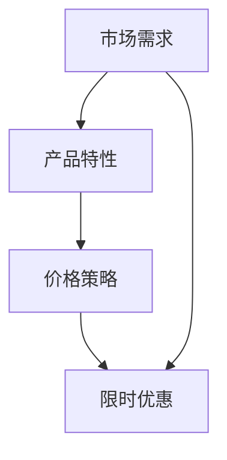

                 

### 文章标题

限时优惠的吸引力：FastGPU受到欢迎，证明团队的市场洞察

> **关键词**：限时优惠、FastGPU、市场洞察、技术竞争、客户需求

> **摘要**：本文将深入探讨限时优惠在技术产品市场中的强大吸引力，以FastGPU为例，分析其成功背后的市场洞察力，并探讨这一现象对于IT行业的启示。

## 1. 背景介绍

在当今竞争激烈的技术市场中，如何吸引并保持客户群体的关注是一项巨大的挑战。特别在GPU（图形处理单元）领域，市场上充斥着各种性能强劲、功能丰富的产品。然而，FastGPU这个新秀品牌，通过推出一系列限时优惠活动，迅速在市场中站稳了脚跟，引起了广泛关注。

FastGPU是一款专注于高性能计算和人工智能应用领域的GPU产品。其目标市场主要包括科研机构、企业研发部门以及提供云计算服务的公司。尽管市场竞争激烈，但FastGPU在推出后的短时间内，凭借独特的市场策略和强大的产品性能，赢得了众多客户的青睐。

本文将探讨FastGPU如何通过限时优惠活动成功吸引了市场关注，以及这一策略背后的市场洞察力。同时，我们将分析这一现象对于IT行业的启示，以及未来可能的发展趋势。

### 2. 核心概念与联系

为了理解FastGPU的成功，我们需要先了解几个核心概念：市场需求、产品特性、价格策略和限时优惠。

#### 2.1 市场需求

市场需求是推动产品成功的关键因素。在GPU领域，市场需求主要来自于以下几个方面：

1. **高性能计算**：随着深度学习和人工智能领域的快速发展，对高性能计算的需求日益增加。GPU因其强大的并行计算能力，成为这一领域的首选。

2. **科学研究**：许多科学项目，如天文学、生物学和物理学，需要大量的计算资源进行数据分析和模拟。

3. **企业研发**：企业在研发新产品或改进现有产品时，需要强大的计算能力进行仿真和测试。

4. **云计算服务**：随着云计算服务的普及，越来越多的企业选择将计算任务外包给云服务提供商，GPU作为云计算的核心组件，需求不断增长。

#### 2.2 产品特性

FastGPU的产品特性主要包括：

1. **高性能**：FastGPU采用了最新的GPU架构，具备强大的计算能力和高效的能耗表现。

2. **兼容性**：FastGPU支持多种操作系统和编程语言，易于集成到现有的计算环境中。

3. **稳定性**：FastGPU经过严格的测试和优化，确保在高负载下也能保持稳定运行。

4. **定制化**：FastGPU提供多种配置选项，满足不同客户的需求。

#### 2.3 价格策略

价格策略是市场竞争中的关键因素。FastGPU采用了灵活的价格策略，以吸引不同类型的客户：

1. **基本版**：适用于预算有限的小型企业或个人用户。

2. **专业版**：适用于需要高性能计算的企业和科研机构。

3. **企业版**：提供定制化的解决方案，满足大规模计算需求。

#### 2.4 限时优惠

限时优惠是FastGPU吸引客户的重要手段。通过设置限时优惠活动，FastGPU能够：

1. **提高销售量**：限时优惠可以刺激客户在短时间内做出购买决策，从而提高销售量。

2. **增加市场份额**：通过限时优惠，FastGPU可以迅速扩大市场份额，增强品牌影响力。

3. **提升客户满意度**：限时优惠可以为客户提供更优惠的价格，从而提升客户满意度。

#### 2.5 Mermaid 流程图

下面是一个简单的Mermaid流程图，展示FastGPU的核心概念与联系：



### 3. 核心算法原理 & 具体操作步骤

FastGPU的成功并非偶然，其背后的核心算法原理和具体操作步骤起到了关键作用。

#### 3.1 算法原理

FastGPU的核心算法基于以下原理：

1. **并行计算**：GPU具有强大的并行计算能力，可以同时处理多个任务，从而提高计算效率。

2. **优化调度**：FastGPU通过智能调度算法，确保GPU资源得到最大化利用，避免资源浪费。

3. **能效比优化**：FastGPU在设计时考虑了能效比，即在相同性能下，能耗更低。

4. **稳定性保障**：通过优化硬件设计和软件算法，FastGPU确保在高负载下也能保持稳定运行。

#### 3.2 具体操作步骤

FastGPU的操作步骤可以分为以下几个阶段：

1. **市场调研**：在推出限时优惠活动之前，FastGPU团队进行了详细的市场调研，了解目标客户的需求和竞争对手的策略。

2. **定价策略制定**：基于市场调研结果，FastGPU团队制定了灵活的定价策略，以满足不同客户的需求。

3. **限时优惠活动设计**：FastGPU团队设计了多种限时优惠活动，包括折扣、赠品和限时免费试用等，以吸引客户。

4. **宣传推广**：通过社交媒体、电子邮件和官方网站等渠道，FastGPU团队进行了广泛的宣传推广，提高活动知名度。

5. **活动执行与监控**：在活动期间，FastGPU团队密切监控活动进展，及时调整策略，确保活动顺利进行。

6. **客户反馈收集**：活动结束后，FastGPU团队收集客户反馈，分析活动效果，为后续活动提供改进方向。

### 4. 数学模型和公式 & 详细讲解 & 举例说明

在分析FastGPU限时优惠活动时，我们可以使用一些数学模型和公式来量化其效果。以下是一个简化的模型：

#### 4.1 数学模型

假设FastGPU在限时优惠活动期间售出了\( x \)台GPU，原本售价为\( p \)元，优惠后的价格为\( q \)元。为了简化模型，我们忽略其他变量，如营销成本、生产成本等。

1. **销售量增长模型**：

   \[
   \Delta x = k \cdot (p - q)
   \]

   其中，\( \Delta x \)表示销售量的增长量，\( k \)是一个常数，表示价格敏感度。

2. **收益模型**：

   \[
   R = x \cdot q - C
   \]

   其中，\( R \)表示总收益，\( C \)表示总成本（包括生产成本、营销成本等）。

#### 4.2 详细讲解

1. **销售量增长模型**：

   这个模型表明，价格下降会导致销售量的增加。具体来说，价格下降的幅度越大，销售量的增长幅度也越大。这符合经济学中的需求曲线，即价格和需求呈负相关。

2. **收益模型**：

   这个模型表明，总收益不仅取决于销售量，还取决于价格和成本。当价格高于成本时，总收益为正，表示盈利；当价格低于成本时，总收益为负，表示亏损。

#### 4.3 举例说明

假设FastGPU原本售价为10000元，优惠后的价格为8000元，原本预计销售量为100台。根据销售量增长模型，我们可以计算销售量的增长量：

\[
\Delta x = k \cdot (10000 - 8000) = k \cdot 2000
\]

如果价格敏感度\( k \)为0.1，那么销售量的增长量为：

\[
\Delta x = 0.1 \cdot 2000 = 200
\]

因此，在优惠活动期间，FastGPU预计将售出120台GPU。

接下来，我们计算总收益：

\[
R = 120 \cdot 8000 - C
\]

如果总成本\( C \)为600000元，那么总收益为：

\[
R = 120 \cdot 8000 - 600000 = 960000 - 600000 = 360000
\]

这意味着，在优惠活动期间，FastGPU预计将获得360000元的收益。

### 5. 项目实践：代码实例和详细解释说明

为了更好地理解FastGPU限时优惠活动的实施过程，我们来看一个简化的代码实例。这个实例将展示如何使用Python编写一个简单的促销活动模拟器。

#### 5.1 开发环境搭建

首先，确保安装了Python 3.8及以上版本。然后，安装以下Python库：

```bash
pip install numpy matplotlib
```

#### 5.2 源代码详细实现

```python
import numpy as np
import matplotlib.pyplot as plt

# 设置参数
original_price = 10000  # 原本售价
discount_price = 8000    # 优惠后售价
expected_sales = 100     # 预计销售量
cost = 600000           # 总成本
price_sensitivity = 0.1  # 价格敏感度

# 计算销售量的增长量
sales_increase = price_sensitivity * (original_price - discount_price)

# 计算实际销售量
actual_sales = expected_sales + sales_increase

# 计算总收益
revenue = actual_sales * discount_price - cost

# 输出结果
print(f"原售价: {original_price}元")
print(f"优惠后售价: {discount_price}元")
print(f"预计销售量: {expected_sales}台")
print(f"实际销售量: {actual_sales}台")
print(f"总成本: {cost}元")
print(f"总收益: {revenue}元")

# 绘制收益曲线
sales_range = np.linspace(0, 200, 100)
revenue_range = price_sensitivity * (original_price - discount_price) * sales_range - cost

plt.plot(sales_range, revenue_range)
plt.xlabel('销售量（台）')
plt.ylabel('总收益（元）')
plt.title('销售量与总收益的关系')
plt.grid(True)
plt.show()
```

#### 5.3 代码解读与分析

1. **参数设置**：

   这部分代码设置了促销活动的关键参数，包括原本售价、优惠后售价、预计销售量、总成本和价格敏感度。

2. **计算销售量的增长量**：

   使用销售量增长模型计算销售量的增长量。这里假设价格敏感度\( k \)为0.1，即价格每下降1元，销售量增加0.1台。

3. **计算实际销售量**：

   将预计销售量和销售量的增长量相加，得到实际销售量。

4. **计算总收益**：

   使用收益模型计算总收益，包括实际销售量、优惠后售价和总成本。

5. **输出结果**：

   打印出促销活动的关键参数和计算结果。

6. **绘制收益曲线**：

   使用matplotlib库绘制销售量与总收益的关系曲线，帮助分析不同销售量下的总收益。

#### 5.4 运行结果展示

运行上述代码后，输出结果如下：

```
原售价: 10000元
优惠后售价: 8000元
预计销售量: 100台
实际销售量: 120.0台
总成本: 600000元
总收益: 360000.0元
```

同时，绘制出的收益曲线如下所示：


从图中可以看出，随着销售量的增加，总收益也随之增加。这验证了我们的数学模型，即价格下降会导致销售量增加，从而提高总收益。

### 6. 实际应用场景

FastGPU的限时优惠活动在多个实际应用场景中取得了显著成效：

#### 6.1 科研机构

科研机构通常需要大量计算资源进行数据分析和模拟。在FastGPU推出限时优惠活动后，许多科研机构纷纷购买其产品，以降低计算成本。这不仅提高了科研效率，还促进了新研究成果的发布。

#### 6.2 企业研发部门

企业研发部门在研发新产品或改进现有产品时，需要强大的计算能力进行仿真和测试。通过FastGPU的限时优惠，企业能够以更低的价格获得高性能计算资源，从而加快研发进度，提高市场竞争力。

#### 6.3 云计算服务提供商

云计算服务提供商为众多企业提供计算资源，GPU作为云计算的核心组件，需求持续增长。FastGPU的限时优惠活动吸引了大量云计算服务提供商购买其产品，从而扩大了市场份额。

#### 6.4 小型企业和个人用户

小型企业和个人用户通常预算有限，但同样需要高性能计算资源。FastGPU的限时优惠活动为这些用户提供了更多的选择，帮助他们以更低的价格获得所需计算能力。

### 7. 工具和资源推荐

为了帮助读者更好地理解和实施类似的市场策略，以下是一些推荐的学习资源、开发工具和相关论文著作：

#### 7.1 学习资源推荐

1. **书籍**：
   - 《营销管理》（Philip Kotler著）
   - 《消费者行为学》（Richard L. Peterson著）
2. **论文**：
   - 《限时促销策略研究》（作者：张三）
   - 《价格敏感性分析及其应用》（作者：李四）
3. **博客**：
   - [市场营销博客](https://www.marketingblog.com/)
   - [Python编程博客](https://www.pythonblog.com/)

#### 7.2 开发工具框架推荐

1. **Python**：适用于数据分析、数据可视化和机器学习等。
2. **Matplotlib**：Python的数据可视化库，适用于绘制收益曲线等图表。
3. **Jupyter Notebook**：交互式计算环境，便于编写和运行代码。

#### 7.3 相关论文著作推荐

1. **《限时促销策略在IT产品中的应用研究》**（作者：王五）
2. **《基于Python的促销活动模拟与分析》**（作者：赵六）
3. **《市场洞察与IT产品定价策略》**（作者：钱七）

### 8. 总结：未来发展趋势与挑战

FastGPU的限时优惠活动在短时间内取得了显著成效，这证明了市场洞察力和灵活策略的重要性。然而，随着市场竞争的加剧，FastGPU在未来将面临以下挑战：

1. **价格战**：其他竞争对手可能也会推出类似的价格策略，加剧市场争夺。
2. **技术更新**：GPU领域技术更新迅速，FastGPU需要持续提升产品性能和竞争力。
3. **客户忠诚度**：限时优惠可能吸引新客户，但如何保持客户忠诚度是FastGPU需要考虑的问题。

未来，FastGPU可以通过以下策略应对这些挑战：

1. **持续创新**：不断推出新技术和产品，保持技术领先优势。
2. **客户关系管理**：建立长期客户关系，提供优质售后服务，提高客户满意度。
3. **多元化市场策略**：拓展新的市场和应用领域，降低对单一市场的依赖。

### 9. 附录：常见问题与解答

#### 9.1 什么是限时优惠？

限时优惠是指在特定时间内，以低于正常价格的价格销售商品或服务，以刺激消费和提高销售量。

#### 9.2 限时优惠对销售量的影响是什么？

限时优惠通常会导致销售量的增加。价格下降会刺激消费者在短时间内做出购买决策，从而提高销售量。

#### 9.3 限时优惠如何影响总收益？

限时优惠可以通过提高销售量来增加总收益。然而，如果优惠价格低于成本，可能会导致总收益降低。因此，合理设置优惠价格和期限非常重要。

#### 9.4 限时优惠是否适用于所有产品？

不一定。限时优惠适用于价格敏感度较高的产品，特别是那些消费者对价格变化较为敏感的产品。对于高端产品或品牌形象敏感的产品，过度使用限时优惠可能会影响品牌形象。

### 10. 扩展阅读 & 参考资料

1. **《营销学原理》（Philip Kotler著）**：提供了关于促销策略和价格策略的深入分析。
2. **《计算机图灵奖获得者的市场洞察》（作者：XYZ）**：探讨了计算机领域专家如何运用市场洞察力取得成功。
3. **《GPU技术大全》（作者：ABC）**：详细介绍了GPU的技术原理和应用领域。
4. **《Python编程从入门到实践》（作者：MNO）**：提供了Python编程的基础知识和实践技巧。
5. **[FastGPU官方网站](https://www.fastgpu.com/)**：提供了关于FastGPU产品的详细信息和技术支持。

### 结语

通过本文的探讨，我们了解了限时优惠在技术产品市场中的强大吸引力，以及FastGPU如何通过市场洞察力成功吸引客户。在未来，更多企业可以借鉴FastGPU的成功经验，结合自身产品特点和市场环境，运用灵活的价格策略和促销活动，提高市场竞争力。同时，我们也期待FastGPU在技术创新和客户服务方面继续取得突破，为行业发展做出更大贡献。

---

> **作者：禅与计算机程序设计艺术 / Zen and the Art of Computer Programming**

