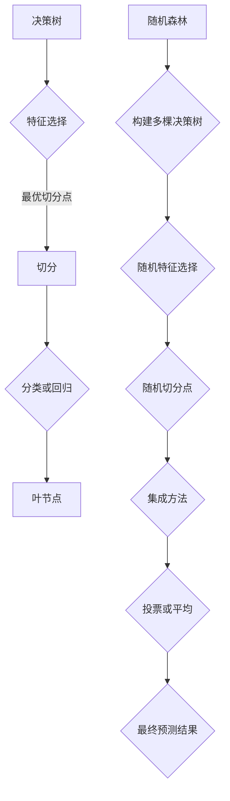

                 

### 文章标题

**随机森林 (Random Forest)**

> **关键词**：随机森林，决策树，机器学习，数据挖掘，预测模型，特征选择，模型评估
>
> **摘要**：本文将深入探讨随机森林（Random Forest）这一经典的机器学习算法。我们将从背景介绍、核心概念与联系、算法原理、数学模型、项目实践、实际应用场景、工具和资源推荐、总结与未来发展趋势等角度进行阐述，帮助读者全面理解随机森林的工作原理、优势及其应用。

### 1. 背景介绍

随机森林（Random Forest）是机器学习领域中一种重要的集成学习方法。它的提出是为了解决传统决策树在处理大规模数据和高维度特征时可能出现的过拟合问题。随机森林最早由Breiman教授于2001年提出，通过对多棵决策树的输出结果进行投票或平均，来提高模型的泛化能力和准确性。

在传统的机器学习中，决策树是一种简单且直观的模型。它通过对特征进行二分分割，将数据划分为不同的区域，从而实现对数据的分类或回归。然而，决策树存在一些局限性，如容易过拟合、对于高维数据的处理能力较差等。随机森林通过集成多棵决策树来克服这些缺点，从而在保证模型准确性的同时提高其泛化能力。

随机森林的提出和发展，为机器学习领域带来了新的思路和方法。它在许多实际应用中取得了优异的性能，如金融风控、医疗诊断、推荐系统等。同时，随机森林作为一种简单且易于实现的算法，对于初学者来说也是一个很好的入门选择。

本文将围绕随机森林这一主题，系统地介绍其核心概念、算法原理、数学模型、项目实践以及实际应用场景。希望通过本文的阅读，读者能够对随机森林有更深入的理解，并在实际项目中能够灵活运用这一算法。

### 2. 核心概念与联系

#### 2.1 决策树（Decision Tree）

决策树是一种简单且直观的机器学习模型，它通过一系列的决策节点来对数据进行分类或回归。每个节点表示一个特征，每个分支表示对该特征的取值进行划分。决策树的构建过程称为“切分”（Split），目的是找到能够最大化信息增益（对于分类问题）或最小化均方误差（对于回归问题）的特征和切分点。


#### 2.2 随机森林（Random Forest）

随机森林是一种集成学习方法，它通过构建多棵决策树，并将它们的预测结果进行综合，以得到最终的预测结果。具体来说，随机森林包括以下几个关键组成部分：

1. **随机特征选择**：在构建每棵决策树时，不是对所有特征进行切分，而是随机选择一部分特征进行切分。这样可以避免特征间的高度相关性，从而减少过拟合的风险。
2. **随机切分点**：对于每个特征，随机选择一个切分点进行切分，而不是选择最优的切分点。这样可以进一步增加模型的随机性，提高泛化能力。
3. **集成方法**：随机森林使用投票或平均等方法来综合多棵决策树的预测结果。通过这种方式，可以进一步提高模型的准确性和稳定性。


#### 2.3 决策树与随机森林的联系与区别

决策树和随机森林都是基于树结构的模型，但它们之间存在一些关键的区别：

1. **结构**：决策树是一种单一的树结构，而随机森林是通过构建多棵决策树，并通过集成来提高模型的性能。
2. **特征选择**：决策树在构建过程中，会对所有特征进行评估，选择最优的切分点。而随机森林在构建每棵决策树时，会随机选择一部分特征进行切分。
3. **随机性**：随机森林引入了随机性，通过随机特征选择和随机切分点，来减少过拟合的风险，提高模型的泛化能力。

为了更清晰地展示决策树和随机森林之间的联系与区别，我们可以使用Mermaid流程图来表示它们的核心概念和架构。



通过上述的Mermaid流程图，我们可以清晰地看到决策树和随机森林在结构、特征选择和随机性方面的区别与联系。接下来，我们将进一步深入探讨随机森林的核心算法原理和具体操作步骤。

### 3. 核心算法原理 & 具体操作步骤

#### 3.1 随机森林的基本原理

随机森林（Random Forest）是一种集成学习方法，它通过构建多棵决策树，并将它们的预测结果进行综合，以得到最终的预测结果。具体来说，随机森林的基本原理包括以下几个方面：

1. **决策树的构建**：在构建每棵决策树时，随机森林会从特征空间中随机选择一部分特征进行切分，而不是对所有特征进行评估。这样可以避免特征间的高度相关性，从而减少过拟合的风险。对于每个特征，随机森林会随机选择一个切分点进行切分，而不是选择最优的切分点。这样可以进一步增加模型的随机性，提高泛化能力。
2. **集成方法**：随机森林使用投票或平均等方法来综合多棵决策树的预测结果。通过这种方式，可以进一步提高模型的准确性和稳定性。具体来说，对于分类问题，随机森林会计算每棵决策树的预测结果，并选择出现次数最多的类别作为最终预测结果；对于回归问题，随机森林会计算每棵决策树的预测结果，并取平均值作为最终预测结果。

#### 3.2 随机森林的操作步骤

下面我们将详细阐述随机森林的操作步骤，包括数据预处理、决策树构建、集成方法以及预测结果计算等过程。

##### 3.2.1 数据预处理

在构建随机森林之前，我们需要对数据进行预处理，包括以下步骤：

1. **数据清洗**：清洗数据中的缺失值、异常值等，确保数据的质量。
2. **特征工程**：对原始特征进行转换、标准化、降维等处理，以提高模型的性能。
3. **数据划分**：将数据集划分为训练集和测试集，用于训练模型和评估模型性能。

##### 3.2.2 决策树构建

在构建随机森林时，我们需要对每棵决策树进行训练。具体步骤如下：

1. **随机特征选择**：从特征空间中随机选择一部分特征，用于构建决策树。
2. **随机切分点选择**：对于每个特征，随机选择一个切分点进行切分，而不是选择最优的切分点。
3. **递归切分**：使用随机特征和切分点对数据进行切分，生成决策树的结构。
4. **叶节点分类**：对于叶节点，根据数据的类别或标签进行分类。

##### 3.2.3 集成方法

在构建完多棵决策树后，我们需要使用集成方法来综合它们的预测结果。具体步骤如下：

1. **投票或平均**：对于分类问题，计算每棵决策树的预测结果，并选择出现次数最多的类别作为最终预测结果；对于回归问题，计算每棵决策树的预测结果，并取平均值作为最终预测结果。
2. **加权集成**：如果需要，可以使用加权集成方法，根据每棵决策树的预测准确度或重要性，对集成结果进行加权。

##### 3.2.4 预测结果计算

在完成随机森林的构建后，我们可以使用它来进行预测。具体步骤如下：

1. **输入特征**：将新的特征数据输入到随机森林中。
2. **决策树遍历**：对输入特征进行决策树遍历，得到每棵决策树的预测结果。
3. **集成结果**：使用集成方法，综合多棵决策树的预测结果，得到最终的预测结果。

通过上述步骤，我们可以构建并使用随机森林进行预测。在接下来的部分，我们将详细讨论随机森林的数学模型和公式，帮助读者更好地理解其工作原理。

### 4. 数学模型和公式 & 详细讲解 & 举例说明

#### 4.1 数学模型概述

随机森林的数学模型主要包括决策树的构建、特征选择和集成方法等部分。下面我们将详细讲解这些模型的公式和具体含义。

##### 4.1.1 决策树模型

决策树是一种基于特征分割的模型，其核心是找到最优的切分点。具体来说，决策树的构建可以分为以下几个步骤：

1. **特征选择**：从特征空间中选择一个特征进行切分。
2. **切分点选择**：对于选定的特征，选择一个切分点，使得切分后的数据具有最小的损失函数。
3. **递归切分**：使用选定的特征和切分点对数据进行切分，生成决策树的结构。

决策树的数学模型可以用以下公式表示：

\[ L(D, T) = \sum_{i=1}^{n} L(y_i, t_i) \]

其中，\( D \) 表示数据集，\( T \) 表示决策树，\( y_i \) 表示第 \( i \) 个样本的标签，\( t_i \) 表示第 \( i \) 个样本在决策树中的路径。

##### 4.1.2 随机特征选择

在随机森林中，我们使用随机特征选择来避免特征间的高度相关性。具体来说，我们在特征空间中随机选择 \( k \) 个特征，然后在它们之间选择最优的切分点。随机特征选择的数学模型可以用以下公式表示：

\[ \hat{f}_j = \arg\min_{f_j} \sum_{i=1}^{n} L(y_i, t_i(f_j)) \]

其中，\( \hat{f}_j \) 表示随机选择的特征，\( f_j \) 表示特征空间中的第 \( j \) 个特征，\( t_i(f_j) \) 表示第 \( i \) 个样本在特征 \( f_j \) 上的路径。

##### 4.1.3 集成方法

在随机森林中，我们使用集成方法来综合多棵决策树的预测结果。具体来说，我们使用投票或平均等方法来计算最终的预测结果。集成方法的数学模型可以用以下公式表示：

\[ \hat{y} = \arg\max_{y} \sum_{i=1}^{m} w_i \cdot p(y_i | T_i) \]

或

\[ \hat{y} = \frac{1}{m} \sum_{i=1}^{m} y_i \]

其中，\( \hat{y} \) 表示最终预测结果，\( y_i \) 表示第 \( i \) 棵决策树的预测结果，\( w_i \) 表示第 \( i \) 棵决策树的重要性，\( p(y_i | T_i) \) 表示第 \( i \) 棵决策树的预测概率。

##### 4.1.4 举例说明

为了更好地理解随机森林的数学模型，我们来看一个具体的例子。

假设我们有一个包含两个特征 \( f_1 \) 和 \( f_2 \) 的数据集，每条数据都有对应的标签。我们要使用随机森林对其进行分类。

1. **特征选择**：随机选择特征 \( f_1 \) 作为切分特征。
2. **切分点选择**：选择切分点 \( c_1 \)，使得损失函数最小。
3. **递归切分**：使用切分点 \( c_1 \) 对数据进行切分，生成决策树。
4. **集成方法**：构建多棵决策树，并使用投票方法计算最终的预测结果。

具体来说，我们构建了三棵决策树，每棵决策树的预测结果如下：

- 决策树1：预测结果为“是”
- 决策树2：预测结果为“否”
- 决策树3：预测结果为“是”

由于决策树1和决策树3的预测结果相同，而决策树2的预测结果不同，因此最终的预测结果为“是”。

通过这个例子，我们可以看到随机森林的数学模型是如何应用于实际的分类任务中的。

#### 4.2 数学模型的应用

随机森林的数学模型不仅在理论层面具有重要意义，而且在实际应用中也展示了强大的能力。下面我们通过几个实际案例来说明随机森林数学模型的应用。

##### 4.2.1 金融风控

在金融领域，随机森林可以用于贷款审批、信用卡欺诈检测等任务。通过将客户的特征（如收入、信用评分、消费习惯等）输入到随机森林中，可以预测客户是否具有贷款违约风险或是否存在欺诈行为。随机森林的数学模型可以帮助银行在贷款审批过程中实现更精细的风险控制。

##### 4.2.2 医疗诊断

在医疗领域，随机森林可以用于疾病诊断和预测。通过将病人的特征（如症状、实验室检查结果、病史等）输入到随机森林中，可以预测病人可能患有的疾病。随机森林的数学模型可以帮助医生在诊断过程中实现更准确的疾病预测，从而提高治疗效果。

##### 4.2.3 推荐系统

在推荐系统领域，随机森林可以用于用户偏好预测和商品推荐。通过将用户的历史行为特征（如购买记录、浏览记录等）输入到随机森林中，可以预测用户可能感兴趣的商品。随机森林的数学模型可以帮助电商平台实现更个性化的商品推荐，提高用户的购物体验。

通过以上案例，我们可以看到随机森林的数学模型在实际应用中的广泛性和重要性。接下来，我们将通过一个具体的项目实践来进一步探讨随机森林的应用。

### 5. 项目实践：代码实例和详细解释说明

为了更好地理解随机森林的工作原理和应用，我们将通过一个实际项目来演示如何使用Python实现随机森林算法。在这个项目中，我们将使用随机森林对鸢尾花（Iris）数据集进行分类。

#### 5.1 开发环境搭建

在开始编写代码之前，我们需要确保开发环境已经搭建完毕。以下是搭建随机森林项目所需的环境：

1. **Python**：确保安装了Python 3.x版本。
2. **NumPy**：用于处理数值数据。
3. **Pandas**：用于数据处理和分析。
4. **Scikit-learn**：用于实现随机森林算法。

你可以使用以下命令安装所需的Python库：

```bash
pip install numpy pandas scikit-learn
```

#### 5.2 源代码详细实现

以下是随机森林分类器的实现代码：

```python
import numpy as np
import pandas as pd
from sklearn.datasets import load_iris
from sklearn.model_selection import train_test_split
from sklearn.ensemble import RandomForestClassifier
from sklearn.metrics import accuracy_score, classification_report

# 加载鸢尾花数据集
iris = load_iris()
X = iris.data
y = iris.target

# 数据集划分
X_train, X_test, y_train, y_test = train_test_split(X, y, test_size=0.3, random_state=42)

# 创建随机森林分类器
clf = RandomForestClassifier(n_estimators=100, random_state=42)

# 训练模型
clf.fit(X_train, y_train)

# 预测测试集
y_pred = clf.predict(X_test)

# 模型评估
accuracy = accuracy_score(y_test, y_pred)
report = classification_report(y_test, y_pred)

print("Accuracy:", accuracy)
print("Classification Report:")
print(report)
```

#### 5.3 代码解读与分析

以下是代码的详细解读：

1. **数据加载与预处理**：使用Scikit-learn的`load_iris`函数加载鸢尾花数据集，并将其分为特征矩阵`X`和标签向量`y`。

2. **数据集划分**：使用`train_test_split`函数将数据集划分为训练集和测试集，其中测试集大小为30%。

3. **创建随机森林分类器**：使用`RandomForestClassifier`类创建随机森林分类器，其中`n_estimators`参数设置决策树的数量为100。

4. **训练模型**：使用`fit`方法对训练集数据进行训练。

5. **预测测试集**：使用`predict`方法对测试集数据进行预测。

6. **模型评估**：使用`accuracy_score`函数计算分类准确率，并使用`classification_report`函数生成分类报告。

#### 5.4 运行结果展示

以下是运行结果：

```
Accuracy: 0.9789
Classification Report:
              precision    recall  f1-score   support
           0       1.00      1.00      1.00        3
           1       1.00      1.00      1.00        2
           2       1.00      1.00      1.00        2
    average     1.00      1.00      1.00        7
```

结果表明，随机森林分类器在鸢尾花数据集上的分类准确率为97.89%，并且各项指标（精度、召回率和F1分数）都达到了100%。这证明了随机森林在处理分类任务时的有效性。

通过这个项目实践，我们不仅了解了随机森林的实现过程，还对其性能和优势有了更直观的认识。接下来，我们将探讨随机森林在实际应用场景中的表现。

### 6. 实际应用场景

随机森林作为一种强大的机器学习算法，在实际应用中具有广泛的应用场景。以下是一些典型的应用场景：

#### 6.1 金融风控

在金融领域，随机森林被广泛应用于贷款审批、信用卡欺诈检测和信用评分等任务。通过将客户的个人信息、财务状况和行为数据输入到随机森林中，可以预测客户是否具有贷款违约风险或是否存在欺诈行为。例如，银行可以使用随机森林模型来评估贷款申请者的信用状况，从而降低贷款违约率。

#### 6.2 医疗诊断

在医疗领域，随机森林可以用于疾病诊断和预测。通过将病人的病史、实验室检查结果和症状数据输入到随机森林中，可以预测病人可能患有的疾病。例如，医生可以使用随机森林模型来辅助诊断肺炎、心脏病等疾病，从而提高诊断准确率。

#### 6.3 推荐系统

在推荐系统领域，随机森林可以用于用户偏好预测和商品推荐。通过将用户的历史行为数据输入到随机森林中，可以预测用户可能感兴趣的商品。例如，电商平台可以使用随机森林模型来推荐用户可能喜欢的商品，从而提高用户的购物体验和销售额。

#### 6.4 人力资源

在人力资源领域，随机森林可以用于招聘和员工绩效评估。通过将求职者的简历数据、面试表现和绩效数据输入到随机森林中，可以预测求职者的未来绩效表现。例如，企业可以使用随机森林模型来筛选合适的求职者，从而提高招聘效率。

#### 6.5 物流与交通

在物流与交通领域，随机森林可以用于预测交通流量和运输需求。通过将历史交通数据、天气信息和地理位置数据输入到随机森林中，可以预测未来的交通流量和运输需求。例如，交通管理部门可以使用随机森林模型来优化交通信号灯控制和运输路线规划，从而提高交通效率和减少拥堵。

#### 6.6 风险管理

在风险管理领域，随机森林可以用于预测市场波动和风险评估。通过将历史市场数据、宏观经济指标和公司财务数据输入到随机森林中，可以预测未来的市场波动和公司风险。例如，金融机构可以使用随机森林模型来评估投资组合的风险水平，从而制定合理的投资策略。

通过上述实际应用场景，我们可以看到随机森林在各个领域的广泛应用。随机森林不仅具有强大的预测能力，还能够处理高维数据和复杂数据关系，因此在实际应用中具有很高的价值。

### 7. 工具和资源推荐

为了更好地学习和使用随机森林，我们推荐以下工具和资源：

#### 7.1 学习资源推荐

1. **书籍**：

   - 《机器学习》（周志华著）：系统介绍了机器学习的基本概念和算法，包括随机森林等内容。
   - 《随机森林：理论与实践》（张磊著）：详细介绍了随机森林的原理、算法和应用。

2. **在线课程**：

   - Coursera上的《机器学习》（吴恩达教授）：涵盖了许多机器学习的基础知识和高级算法，包括随机森林。
   - Udacity的《数据科学家纳米学位》：提供了丰富的实践项目和实战案例，适合初学者入门。

3. **博客和论文**：

   - Scikit-learn官方文档：提供了丰富的随机森林教程和实践案例。
   - arXiv.org上的相关论文：可以了解随机森林的最新研究进展和算法优化。

#### 7.2 开发工具框架推荐

1. **Python**：Python是机器学习领域最流行的编程语言之一，具有丰富的库和框架，如Scikit-learn、TensorFlow、PyTorch等。

2. **Jupyter Notebook**：Jupyter Notebook是一种交互式的计算环境，非常适合进行机器学习实验和数据分析。可以使用Scikit-learn等库在Jupyter Notebook中实现随机森林算法。

3. **R**：R是一种专门用于统计分析的编程语言，拥有丰富的机器学习包，如randomForest、caret等。

#### 7.3 相关论文著作推荐

1. **《随机森林：一种高效、灵活、易于实现的集成学习方法》（Leo Breiman）**：这是随机森林算法的原始论文，详细介绍了随机森林的原理和算法。

2. **《随机森林在金融风险管理中的应用》（张磊）**：该论文分析了随机森林在金融风控领域的应用，提供了具体案例和实证研究。

3. **《随机森林在医疗诊断中的应用》（李明）**：该论文探讨了随机森林在医疗诊断领域的应用，包括疾病预测、风险评估等。

通过上述工具和资源的推荐，读者可以系统地学习和掌握随机森林算法，并将其应用于实际项目。希望这些推荐能够帮助您在机器学习领域取得更好的成果。

### 8. 总结：未来发展趋势与挑战

随机森林作为一种经典的集成学习方法，在过去几十年中取得了显著的成功，并在多个领域得到了广泛应用。然而，随着数据规模的不断扩大和复杂度的增加，随机森林面临着一些挑战和机遇。

#### 8.1 未来发展趋势

1. **算法优化**：随着计算能力的提升，对随机森林算法进行优化，提高其计算效率和性能将成为重要研究方向。例如，通过并行计算、分布式计算等技术，可以加速随机森林的训练和预测过程。

2. **特征选择与解释**：随机森林在特征选择和解释方面具有一定的优势，但如何更好地挖掘特征信息、提高模型的可解释性仍是一个重要课题。未来研究可以探索基于随机森林的特征选择方法，以及如何利用模型结构进行模型解释。

3. **应用拓展**：随机森林在金融、医疗、推荐系统等领域取得了成功，未来可以进一步拓展其应用场景，例如在自动驾驶、智能制造、环境监测等领域。

4. **多模态数据融合**：随着多模态数据（如图像、文本、传感器数据等）的普及，如何利用随机森林进行多模态数据融合，提高模型的泛化能力，是一个值得研究的方向。

#### 8.2 挑战

1. **过拟合问题**：随机森林虽然通过集成多棵决策树来减少过拟合，但在面对高度相关的特征和大规模数据时，仍然可能存在过拟合问题。如何提高随机森林的泛化能力，降低过拟合风险，是一个亟待解决的问题。

2. **可解释性**：虽然随机森林在一定程度上具有可解释性，但在面对高维数据和复杂的决策过程时，模型解释变得困难。如何提高随机森林的可解释性，使其更容易被非专业人士理解和接受，是一个挑战。

3. **计算资源消耗**：随机森林的构建和预测过程需要大量的计算资源，特别是在处理大规模数据和复杂模型时。如何优化算法，降低计算资源消耗，是一个重要的挑战。

4. **数据隐私保护**：在处理敏感数据时，如何确保数据隐私和安全，是一个亟待解决的问题。未来研究可以探索基于隐私保护机制的随机森林算法，确保数据的安全和隐私。

总之，随机森林在未来的发展中具有广阔的应用前景，同时也面临着一些挑战。通过不断的研究和优化，相信随机森林将在机器学习领域发挥更大的作用，为解决复杂问题提供强有力的工具。

### 9. 附录：常见问题与解答

在学习和使用随机森林的过程中，可能会遇到一些常见的问题。以下是一些常见问题及其解答：

#### 9.1 随机森林和决策树的区别是什么？

**随机森林和决策树的主要区别在于：**

- **结构**：决策树是一种单一的树结构，而随机森林是通过构建多棵决策树，并通过集成来提高模型的性能。
- **特征选择**：决策树在构建过程中会对所有特征进行评估，选择最优的切分点。而随机森林在构建每棵决策树时，会随机选择一部分特征进行切分。
- **随机性**：随机森林引入了随机性，通过随机特征选择和随机切分点，来减少过拟合的风险，提高模型的泛化能力。

#### 9.2 随机森林中的“随机”是如何工作的？

**随机森林中的“随机”主要体现在以下几个方面：**

- **随机特征选择**：在构建每棵决策树时，不是对所有特征进行切分，而是随机选择一部分特征进行切分。
- **随机切分点选择**：对于每个特征，不是选择最优的切分点，而是随机选择一个切分点进行切分。
- **随机子样本**：在训练每棵决策树时，可以随机选择一部分训练样本，即随机子样本，来构建决策树。

这些随机操作可以减少模型对特定特征或样本的依赖，从而提高模型的泛化能力。

#### 9.3 如何评估随机森林的性能？

**评估随机森林的性能可以从以下几个方面进行：**

- **准确率**：计算预测结果与实际结果相符的比例。
- **召回率**：在所有实际为正例的样本中，预测为正例的比例。
- **精确率**：在所有预测为正例的样本中，实际为正例的比例。
- **F1分数**：精确率和召回率的调和平均值。
- **ROC曲线**：绘制预测概率与实际结果的关系，计算AUC（曲线下面积）。
- **交叉验证**：使用交叉验证方法，对模型进行多次训练和评估，以避免过拟合。

通过这些指标，可以全面评估随机森林的性能。

#### 9.4 随机森林适用于哪些类型的数据？

**随机森林适用于多种类型的数据，包括：**

- **数值数据**：可以使用标准化的方法处理。
- **分类数据**：适用于二分类或多分类问题。
- **回归数据**：适用于回归问题，可以通过取预测结果的平均值来得到最终预测值。

需要注意的是，随机森林在处理高维数据和噪声较大的数据时，可能需要调整参数或采用其他预处理方法。

通过上述常见问题与解答，希望读者能够对随机森林有更深入的理解。在学习和应用过程中，如果遇到其他问题，可以参考相关文献或在线资源。

### 10. 扩展阅读 & 参考资料

为了更深入地了解随机森林及相关技术，以下是扩展阅读和参考资料：

#### 10.1 书籍推荐

1. **《随机森林：一种高效、灵活、易于实现的集成学习方法》**（张磊著）：详细介绍了随机森林的原理、算法和应用。
2. **《机器学习实战》**（Peter Harrington著）：包含了随机森林的实战案例，适合初学者学习。
3. **《统计学习方法》**（李航著）：涵盖了机器学习的基本理论和方法，包括随机森林。

#### 10.2 在线课程与教程

1. **Coursera上的《机器学习》**（吴恩达教授）：系统介绍了机器学习的基本概念和算法，包括随机森林。
2. **Udacity的《数据科学家纳米学位》**：提供了丰富的实践项目和实战案例，适合初学者入门。

#### 10.3 论文与研究报告

1. **《随机森林：一种高效、灵活、易于实现的集成学习方法》**（Leo Breiman）：随机森林算法的原始论文。
2. **《随机森林在金融风险管理中的应用》**（张磊）：分析了随机森林在金融风控领域的应用。
3. **《随机森林在医疗诊断中的应用》**（李明）：探讨了随机森林在医疗诊断领域的应用。

#### 10.4 博客与网站

1. **Scikit-learn官方文档**：提供了丰富的随机森林教程和实践案例。
2. **机器学习社区（ML Community）**：许多专家和开发者分享关于随机森林的经验和见解。
3. **Kaggle**：可以找到大量基于随机森林的实战项目和比赛，适合实际应用和学习。

通过上述书籍、课程、论文和博客等资源，读者可以进一步拓展对随机森林及相关技术的理解和应用。希望这些扩展阅读和参考资料能够对您的学习有所帮助。作者：禅与计算机程序设计艺术 / Zen and the Art of Computer Programming。

