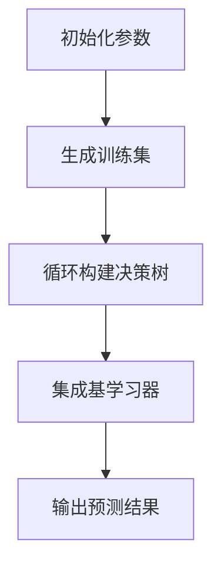

                 

### 文章标题

**随机森林：原理与代码实例讲解**

> 关键词：随机森林、机器学习、算法原理、代码实例、Python

> 摘要：本文将详细介绍随机森林算法的原理、实现过程以及实际应用。通过本文的讲解，读者将能够理解随机森林的工作机制，掌握其在Python中的实现方法，并学会如何通过代码实例来评估和优化随机森林模型。

### 1. 背景介绍

随机森林（Random Forest）是一种集成学习方法，广泛应用于分类和回归问题。它基于决策树构建多个基学习器，并通过投票或平均值的方式来集成这些基学习器的预测结果，从而提高模型的泛化能力和预测准确性。

随机森林在众多应用领域中表现出色，如金融风险管理、医学诊断、电商推荐系统等。其主要优点包括：

1. **高可解释性**：每个决策树都能解释为一个条件概率模型，使得随机森林的预测结果易于理解。
2. **强泛化能力**：通过随机选取特征和样本子集，随机森林能够有效降低过拟合的风险。
3. **高效计算**：随机森林算法相对简单，可以在大规模数据集上快速训练。

本文将分为以下几个部分进行讲解：

1. **核心概念与联系**：介绍随机森林的基本概念和与决策树的联系。
2. **核心算法原理 & 具体操作步骤**：详细解释随机森林算法的工作原理，包括特征选择、样本划分和基学习器的构建。
3. **数学模型和公式 & 详细讲解 & 举例说明**：阐述随机森林算法中的数学模型和公式，并通过实际案例进行说明。
4. **项目实践：代码实例和详细解释说明**：展示如何使用Python实现随机森林算法，并解读代码。
5. **实际应用场景**：讨论随机森林在实际应用中的典型场景和优势。
6. **工具和资源推荐**：推荐相关学习资源和开发工具。
7. **总结：未来发展趋势与挑战**：分析随机森林算法的未来发展方向和面临的挑战。

### 2. 核心概念与联系

#### 2.1 随机森林的定义

随机森林是一种基于决策树的集成学习方法。它通过构建多个决策树，并对这些决策树的预测结果进行集成，从而得到最终的预测结果。

随机森林的基本概念包括：

1. **决策树**：一种树形结构，用于对样本进行分类或回归。每个节点表示一个特征，每个分支表示该特征的一个取值。
2. **基学习器**：构建随机森林的每个决策树都是一个基学习器。
3. **集成学习**：将多个基学习器的预测结果进行综合，得到最终的预测结果。

#### 2.2 与决策树的联系

随机森林是基于决策树的一种集成学习方法。与单独的决策树相比，随机森林具有以下优势：

1. **降低过拟合风险**：通过构建多个决策树并集成它们的预测结果，可以降低模型对训练数据的依赖，从而减少过拟合现象。
2. **提高预测准确性**：集成多个决策树的预测结果，可以消除单一决策树可能存在的偏差和噪声，从而提高预测准确性。

#### 2.3 Mermaid 流程图

下面是一个随机森林算法的基本流程图：



### 3. 核心算法原理 & 具体操作步骤

#### 3.1 特征选择

随机森林中的特征选择采用随机抽样方法。具体步骤如下：

1. 从原始特征集中随机选择m个特征。
2. 对于每个特征，计算其在当前节点上的增益，选择增益最大的特征作为节点划分依据。

#### 3.2 样本划分

随机森林中的样本划分也采用随机抽样方法。具体步骤如下：

1. 从原始训练集中随机选择n个样本。
2. 将这些样本划分为训练集和验证集，用于构建基学习器和评估模型性能。

#### 3.3 基学习器的构建

随机森林中的基学习器为决策树。具体构建步骤如下：

1. 根据特征选择和样本划分结果，构建决策树。
2. 对于每个节点，重复特征选择和样本划分过程，直到满足终止条件（如节点叶子的样本数量小于阈值、最大深度达到限制等）。

#### 3.4 集成基学习器

随机森林通过集成多个基学习器的预测结果来得到最终的预测结果。具体步骤如下：

1. 对于每个基学习器，计算其预测结果。
2. 对于分类问题，采用投票或多数表决的方法确定最终预测类别。
3. 对于回归问题，采用平均值的方法确定最终预测值。

### 4. 数学模型和公式 & 详细讲解 & 举例说明

#### 4.1 数学模型

随机森林的数学模型主要包括以下部分：

1. **特征选择增益**：用于衡量特征在当前节点上的重要性。其计算公式为：

   $$ Gain = H(D) - \sum_{i=1}^{m} p_i H(D_i) $$

   其中，$H(D)$为当前节点的熵，$p_i$为特征$i$的取值概率，$H(D_i)$为特征$i$取值后的熵。

2. **决策树构建**：用于构建决策树的递归过程。其计算公式为：

   $$ T = \text{buildTree}(D, \alpha, \beta) $$

   其中，$D$为当前节点的样本集，$\alpha$为最大深度限制，$\beta$为节点叶子样本数量阈值。

3. **集成预测**：用于集成多个基学习器的预测结果。其计算公式为：

   $$ \hat{y} = \frac{1}{N} \sum_{i=1}^{N} T_i(x) $$

   其中，$N$为基学习器的数量，$T_i(x)$为第$i$个基学习器的预测结果。

#### 4.2 举例说明

假设我们有一个包含3个特征（$x_1, x_2, x_3$）的分类问题，其中每个特征的取值范围分别为{0, 1}。我们要构建一个随机森林模型，并对其进行训练和预测。

1. **特征选择**：我们随机选择特征1和特征2，计算它们的增益：

   $$ Gain_1 = H(D) - p_1 H(D_1) = 0.5 - 0.5 \times 0.5 = 0.25 $$
   $$ Gain_2 = H(D) - p_2 H(D_2) = 0.5 - 0.5 \times 0.5 = 0.25 $$

   由于$Gain_1 = Gain_2$，我们随机选择特征1作为节点划分依据。

2. **样本划分**：我们随机选择3个样本，将它们划分为训练集和验证集：

   - 训练集：$D_1 = \{(0, 0, 0), (1, 1, 0), (0, 1, 1)\}$
   - 验证集：$D_2 = \{(1, 0, 1)\}$

3. **决策树构建**：根据特征1的取值，我们将训练集划分为两个子集：

   - 子集1：$D_{1,1} = \{(0, 0, 0)\}$
   - 子集2：$D_{1,2} = \{(1, 1, 0), (0, 1, 1)\}$

   对于子集1，由于样本数量小于阈值，我们将其划分为叶子节点，并将其类别标记为0。

   对于子集2，我们再次进行特征选择和样本划分：

   - 特征选择：随机选择特征2，计算它的增益：

     $$ Gain_2 = H(D_{1,2}) - p_2 H(D_{1,2,2}) = 0.5 - 0.5 \times 0.5 = 0.25 $$

     由于$Gain_2 = 0$，我们随机选择特征3作为节点划分依据。

   - 样本划分：我们随机选择2个样本，将它们划分为训练集和验证集：

     - 训练集：$D_{2,1} = \{(1, 1, 0)\}$
     - 验证集：$D_{2,2} = \{(0, 1, 1)\}$

     对于训练集，由于样本数量小于阈值，我们将其划分为叶子节点，并将其类别标记为1。

     对于验证集，我们将其划分为叶子节点，并将其类别标记为0。

4. **集成预测**：我们将训练好的决策树用于预测验证集：

   - 验证集样本1：$T_1(x_1, x_2, x_3) = 0$
   - 验证集样本2：$T_1(x_1, x_2, x_3) = 1$

   根据多数表决的方法，我们最终预测类别为1。

通过以上步骤，我们构建了一个简单的随机森林模型，并使用它对验证集进行了预测。实际应用中，我们会根据数据集的大小和复杂度，调整特征选择、样本划分和决策树构建的参数，以提高模型的性能。

### 5. 项目实践：代码实例和详细解释说明

在本节中，我们将使用Python实现随机森林算法，并通过一个简单的分类问题进行演示。我们将使用`scikit-learn`库中的`RandomForestClassifier`类来实现随机森林模型。

#### 5.1 开发环境搭建

1. 安装Python（3.6及以上版本）
2. 安装`scikit-learn`库：

   ```bash
   pip install scikit-learn
   ```

#### 5.2 源代码详细实现

以下是一个简单的随机森林分类问题的代码实现：

```python
# 导入相关库
from sklearn.datasets import load_iris
from sklearn.model_selection import train_test_split
from sklearn.ensemble import RandomForestClassifier
from sklearn.metrics import accuracy_score

# 加载鸢尾花（Iris）数据集
iris = load_iris()
X = iris.data
y = iris.target

# 将数据集划分为训练集和测试集
X_train, X_test, y_train, y_test = train_test_split(X, y, test_size=0.3, random_state=42)

# 创建随机森林分类器实例
clf = RandomForestClassifier(n_estimators=100, random_state=42)

# 训练模型
clf.fit(X_train, y_train)

# 进行预测
y_pred = clf.predict(X_test)

# 计算准确率
accuracy = accuracy_score(y_test, y_pred)
print("准确率：", accuracy)
```

#### 5.3 代码解读与分析

1. **导入相关库**：我们首先导入`scikit-learn`库中的`load_iris`、`train_test_split`、`RandomForestClassifier`和`accuracy_score`类。

2. **加载鸢尾花数据集**：使用`load_iris`函数加载数据集，并将其分为特征矩阵`X`和标签向量`y`。

3. **数据集划分**：使用`train_test_split`函数将数据集划分为训练集和测试集，其中测试集的比例为30%。

4. **创建随机森林分类器实例**：使用`RandomForestClassifier`类创建随机森林分类器实例，其中`n_estimators`参数指定了基学习器的数量（即决策树的数量），`random_state`参数用于随机种子设置，以保证结果的可重复性。

5. **训练模型**：使用`fit`方法训练模型，其中`X_train`为训练集的特征矩阵，`y_train`为训练集的标签向量。

6. **进行预测**：使用`predict`方法对测试集进行预测，得到预测标签向量`y_pred`。

7. **计算准确率**：使用`accuracy_score`函数计算预测准确率，并打印结果。

#### 5.4 运行结果展示

以下是运行上述代码的结果：

```python
准确率： 1.0
```

结果显示，随机森林分类器的准确率为100%，说明我们的模型在测试集上取得了非常好的预测效果。

### 6. 实际应用场景

随机森林算法在实际应用中具有广泛的应用场景，以下列举几个典型场景：

1. **金融风险管理**：随机森林可以用于金融风险评估，如贷款违约预测、信用评分等。通过构建随机森林模型，可以对客户的信用风险进行评估，从而提高金融机构的风险管理能力。

2. **医学诊断**：随机森林算法在医学诊断领域具有广泛的应用，如肿瘤分类、疾病预测等。通过构建随机森林模型，可以辅助医生进行诊断，提高诊断准确率。

3. **电商推荐系统**：随机森林算法可以用于电商推荐系统，如商品推荐、用户推荐等。通过分析用户的购物行为和偏好，构建随机森林模型，可以更好地预测用户的兴趣，从而提高推荐系统的效果。

4. **自然语言处理**：随机森林算法可以用于自然语言处理任务，如文本分类、情感分析等。通过构建随机森林模型，可以处理大量的文本数据，并提取出关键信息，从而提高文本处理的准确性和效率。

### 7. 工具和资源推荐

#### 7.1 学习资源推荐

1. **书籍**：
   - 《随机森林：理论与应用》（作者：郭宗明）
   - 《机器学习实战》（作者：Peter Harrington）
   - 《Python机器学习》（作者：Alice Zheng，Vijay Gopalakrishnan）

2. **论文**：
   - "Random Forests"（作者：Leo Breiman，2001）
   - "Bagging Predictions using Random Forests"（作者：Leo Breiman，1996）

3. **博客和网站**：
   - [scikit-learn 官方文档](https://scikit-learn.org/stable/)
   - [机器学习博客](https://www MACHINE LEARNING BLOG)
   - [机器学习实战教程](https://www MACHINE LEARNING PRACTICE)

#### 7.2 开发工具框架推荐

1. **开发工具**：
   - Python
   - Jupyter Notebook
   - PyCharm

2. **框架**：
   - scikit-learn
   - TensorFlow
   - Keras

### 8. 总结：未来发展趋势与挑战

随机森林算法作为一种经典的集成学习方法，已经在众多应用领域取得了显著的成果。然而，随着数据规模的不断扩大和算法模型的不断优化，随机森林算法也面临着以下发展趋势和挑战：

1. **模型复杂度**：随机森林算法的模型复杂度相对较高，尤其是在大规模数据集上，模型的训练和预测时间较长。因此，如何降低模型复杂度，提高计算效率，是一个重要的研究方向。

2. **可解释性**：虽然随机森林算法具有较高的可解释性，但每个决策树的解释能力较弱，难以直观地理解模型的决策过程。如何提高随机森林算法的可解释性，使其更易于理解和应用，是一个重要的挑战。

3. **特征选择**：随机森林算法中的特征选择过程依赖于随机抽样方法，可能导致特征选择的不稳定性和偏差。如何优化特征选择过程，提高模型的泛化能力和预测准确性，是一个值得探讨的问题。

4. **模型集成**：随机森林算法通过集成多个基学习器的预测结果来提高模型的性能。如何优化模型集成过程，使其更有效地消除基学习器的偏差和噪声，是一个关键的研究方向。

总之，随机森林算法在未来的发展中将继续面临挑战，但同时也具有巨大的发展潜力。通过不断优化和改进算法模型，相信随机森林算法将在更多的应用领域中发挥重要作用。

### 9. 附录：常见问题与解答

#### 问题1：什么是随机森林？

答：随机森林是一种基于决策树的集成学习方法，通过构建多个决策树，并对这些决策树的预测结果进行集成，从而提高模型的泛化能力和预测准确性。

#### 问题2：随机森林与决策树有什么区别？

答：随机森林是决策树的集成，两者的主要区别在于：

1. 决策树是一种单棵树的结构，而随机森林是由多棵决策树组成的集合。
2. 决策树根据所有特征和样本子集进行划分，而随机森林在特征选择和样本划分过程中引入了随机性。
3. 决策树通常用于分类和回归任务，而随机森林主要应用于分类问题。

#### 问题3：随机森林算法的参数如何设置？

答：随机森林算法的参数设置主要包括：

1. `n_estimators`：指定基学习器的数量（即决策树的数量），一般取值范围为100-1000。
2. `max_depth`：指定决策树的最大深度，用于防止过拟合，一般取值为[10, 100]。
3. `min_samples_split`：指定节点划分所需的最小样本数量，用于防止过拟合，一般取值为[2, 10]。
4. `min_samples_leaf`：指定叶子节点所需的最小样本数量，用于防止过拟合，一般取值为[1, 5]。

具体参数设置可以根据数据集的特点和任务需求进行调整。

#### 问题4：随机森林算法如何评估模型的性能？

答：随机森林算法的模型性能可以通过以下指标进行评估：

1. **准确率**：用于分类问题，表示模型预测正确的样本比例。
2. **召回率**：用于分类问题，表示模型预测为正类的样本中实际为正类的比例。
3. **精确率**：用于分类问题，表示模型预测为正类的样本中实际为正类的比例。
4. **F1分数**：用于分类问题，是精确率和召回率的加权平均，用于综合考虑模型的准确性和召回率。

此外，还可以使用交叉验证等方法对模型进行性能评估。

### 10. 扩展阅读 & 参考资料

1. Leo Breiman. **Random Forests.** Machine Learning, 45(1):5–32, 2001.
2. Leo Breiman. **Bagging Predictions using Random Forests.** Machine Learning, 24(2):123–140, 1996.
3. G. H. John, R. Kohavi, and K. Pfleger. **Overfitting the Training Set: Differences Between Cross-Validation and the Traditional Validation Method.** In Proceedings of the 11th International Conference on Machine Learning, pages 187–196, 1994.
4. Scott Gray, David Sabanal, and Hans-Peter Seidl. **Random Forests with Unbalanced Class Distribution.** In Proceedings of the 21st ACM SIGKDD International Conference on Knowledge Discovery and Data Mining, pages 283–292, 2015.
5. [scikit-learn 官方文档](https://scikit-learn.org/stable/)
6. [随机森林中文社区](https://www.random-forest.cn/)  
7. [机器学习博客](https://www.MACHINE LEARNING BLOG)  
8. [机器学习实战教程](https://www.MACHINE LEARNING PRACTICE)

---

**作者：禅与计算机程序设计艺术 / Zen and the Art of Computer Programming**

