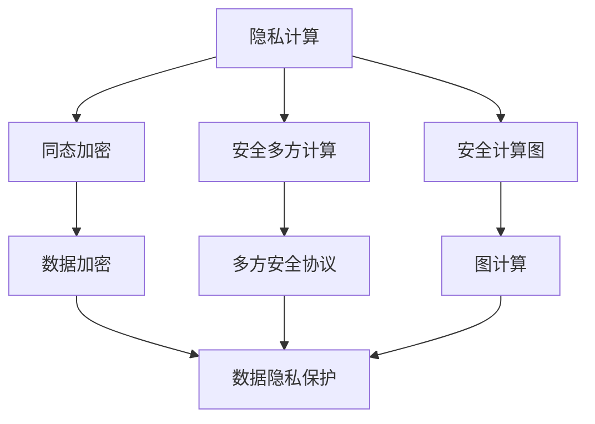

                 

### 文章标题

隐私计算大模型：保护数据隐私的新范式

### 关键词

- 隐私计算
- 大模型
- 数据保护
- 新范式
- 安全性
- 人工智能

### 摘要

本文将深入探讨隐私计算大模型的概念、原理及其在保护数据隐私方面的应用。通过逐步分析推理的方式，我们旨在揭示隐私计算大模型如何成为应对数据隐私挑战的新范式，为人工智能技术的发展提供坚实保障。文章将涵盖隐私计算大模型的核心概念与联系、算法原理与操作步骤、数学模型与公式、项目实践、实际应用场景、工具与资源推荐，以及未来发展趋势和挑战。

## 1. 背景介绍

随着大数据和人工智能技术的飞速发展，数据已经成为现代社会的核心资产。然而，数据的集中化和共享带来了严重的隐私泄露风险。传统的数据保护方法往往难以满足日益复杂的数据处理需求，尤其是在大规模数据集和复杂计算任务中。为了解决这一问题，隐私计算应运而生。

隐私计算是一种在数据不离开原始环境的情况下进行计算的方法，旨在保护数据的隐私性和安全性。隐私计算大模型则是在这一理念下发展起来的一种新型计算范式，它通过结合先进的算法和数学模型，实现对大规模数据的隐私保护。

隐私计算大模型的重要性体现在以下几个方面：

1. **数据安全**：隐私计算大模型能够在不泄露数据内容的前提下进行数据处理，从而有效保护用户隐私。
2. **合规性**：随着全球各国数据保护法规的日益严格，隐私计算大模型有助于企业合规运营，降低法律风险。
3. **数据利用**：隐私计算大模型使得数据可以在不牺牲隐私的前提下进行深入挖掘和利用，提升数据的价值。
4. **技术创新**：隐私计算大模型推动了人工智能技术的持续进步，为新型应用场景提供了可能性。

本文将围绕隐私计算大模型的核心概念、算法原理、数学模型、项目实践、应用场景等方面进行详细探讨，以期为读者提供一个全面了解隐私计算大模型的视角。

## 2. 核心概念与联系

### 隐私计算

隐私计算是一种在数据不离开原始环境的情况下进行计算的方法，它包括同态加密、安全多方计算、安全计算图等核心技术。隐私计算的核心目标是保护数据的隐私性和安全性，同时实现数据的计算和分析。

### 大模型

大模型是指具有海量参数的机器学习模型，如深度神经网络、Transformer等。大模型在处理大规模数据集和复杂计算任务时具有显著优势，但其也带来了数据隐私保护的新挑战。

### 数据隐私保护

数据隐私保护是指通过各种技术手段保护数据在存储、传输和处理过程中的隐私。隐私计算大模型通过结合隐私计算和大数据处理技术，提供了一种高效的数据隐私保护方案。

### Mermaid 流程图

以下是一个简单的 Mermaid 流程图，展示了隐私计算大模型的核心概念和联系：



在这个流程图中，隐私计算的核心技术（同态加密、安全多方计算、安全计算图）通过数据加密、多方安全协议和图计算等手段，共同实现了数据隐私保护的目标。

## 3. 核心算法原理 & 具体操作步骤

### 同态加密

同态加密是一种在加密状态下对数据进行计算的方法，使得计算结果仍然保持加密状态。同态加密的核心算法包括**整数同态加密**和**布尔同态加密**。

#### 整数同态加密

整数同态加密的基本原理是：在一个同态加密系统中，对两个加密数进行加法运算，其结果仍然是一个加密数。具体步骤如下：

1. **密钥生成**：生成一对加密密钥（公钥和私钥）。
2. **加密**：将明文数据加密成密文。
3. **同态运算**：对加密数据进行同态加法运算。
4. **解密**：使用私钥对运算结果进行解密。

#### 布尔同态加密

布尔同态加密的基本原理是对加密数据进行布尔运算，结果仍然保持加密状态。具体步骤如下：

1. **密钥生成**：生成一对加密密钥（公钥和私钥）。
2. **加密**：将明文数据加密成密文。
3. **同态运算**：对加密数据进行同态布尔运算。
4. **解密**：使用私钥对运算结果进行解密。

### 安全多方计算

安全多方计算是一种允许多个参与方在不泄露各自隐私信息的情况下共同完成计算任务的方法。其核心算法包括**秘密分享**、**秘密交换**和**秘密计算**。

#### 秘密分享

秘密分享是将一个秘密信息分成多个片段，每个片段由不同的参与方持有，任意几个片段无法重构出原始秘密信息。具体步骤如下：

1. **初始化**：确定参与方数量和秘密分享方案。
2. **秘密分割**：将秘密信息分割成多个片段。
3. **分配片段**：将片段分配给不同的参与方。

#### 秘密交换

秘密交换是参与方之间交换秘密信息片段的过程，以确保每个参与方都能获得其他参与方的片段。具体步骤如下：

1. **初始化**：确定参与方数量和秘密交换方案。
2. **交换片段**：参与方之间交换秘密信息片段。

#### 秘密计算

秘密计算是参与方利用交换到的秘密信息片段共同完成计算任务的过程。具体步骤如下：

1. **初始化**：确定参与方数量和秘密计算方案。
2. **计算**：参与方利用交换到的秘密信息片段进行计算。
3. **结果重构**：将计算结果重构为原始秘密信息。

### 安全计算图

安全计算图是一种将计算任务表示为图的算法，通过图上的计算节点和边来实现数据的安全计算。其核心算法包括**图表示**、**计算节点设计**和**安全传输**。

#### 图表示

图表示是将计算任务表示为一个有向图，其中节点表示计算操作，边表示数据流。

#### 计算节点设计

计算节点设计是设计具有同态加密和秘密计算功能的安全计算节点。

#### 安全传输

安全传输是确保数据在图上的传输过程中保持加密状态，防止数据泄露。

## 4. 数学模型和公式 & 详细讲解 & 举例说明

### 同态加密

同态加密的数学模型基于环同态加密和域同态加密。

#### 环同态加密

在环同态加密中，加密环是一个整数环，加密操作满足同态性。具体数学模型如下：

$$
c = g^m \mod n
$$

其中，$c$ 是密文，$m$ 是明文，$g$ 是生成元，$n$ 是模数。

#### 域同态加密

在域同态加密中，加密域是一个扩域，加密操作满足同态性。具体数学模型如下：

$$
c = g^m \mod p
$$

其中，$c$ 是密文，$m$ 是明文，$g$ 是生成元，$p$ 是素数。

### 安全多方计算

安全多方计算的数学模型基于秘密分享和秘密交换。

#### 秘密分享

秘密分享的数学模型基于线性秘密分享方案。具体数学模型如下：

$$
s_i = s \cdot r_i \mod n
$$

其中，$s_i$ 是第 $i$ 个参与方持有的秘密片段，$s$ 是原始秘密，$r_i$ 是第 $i$ 个参与方的秘密份额，$n$ 是秘密分享方案中的模数。

#### 秘密交换

秘密交换的数学模型基于秘密交换协议。具体数学模型如下：

$$
x_i = s_i + r_j \mod n
$$

其中，$x_i$ 是第 $i$ 个参与方交换到的秘密片段，$s_i$ 是第 $i$ 个参与方持有的秘密片段，$r_j$ 是第 $j$ 个参与方的秘密份额，$n$ 是秘密交换方案中的模数。

### 安全计算图

安全计算图的数学模型基于图同态加密和图计算。

#### 图表示

图表示的数学模型基于有向图。具体数学模型如下：

$$
G = (V, E)
$$

其中，$G$ 是有向图，$V$ 是节点集合，$E$ 是边集合。

#### 计算节点设计

计算节点设计的数学模型基于同态加密。具体数学模型如下：

$$
c_i = g^{m_i} \mod n
$$

其中，$c_i$ 是第 $i$ 个计算节点的密文，$m_i$ 是第 $i$ 个计算节点的明文，$g$ 是生成元，$n$ 是模数。

#### 安全传输

安全传输的数学模型基于图同态加密。具体数学模型如下：

$$
c_{ij} = g^{m_{ij}} \mod n
$$

其中，$c_{ij}$ 是第 $i$ 个节点到第 $j$ 个节点的密文，$m_{ij}$ 是第 $i$ 个节点到第 $j$ 个节点的明文，$g$ 是生成元，$n$ 是模数。

### 举例说明

#### 同态加密

假设使用整数环 $(\mathbb{Z}_{15}, +, \times)$ 进行同态加密，生成元 $g = 2$，模数 $n = 15$。

- 明文 $m = 3$。
- 加密 $c = g^m \mod n = 2^3 \mod 15 = 8$。
- 同态加法运算 $c' = g^{m_1 + m_2} \mod n = 2^{3 + 3} \mod 15 = 2^6 \mod 15 = 13$。
- 解密 $m' = \log_2{c'} \mod n = \log_2{13} \mod 15 = 3$。

#### 安全多方计算

假设有三个参与方 $P_1$、$P_2$、$P_3$，原始秘密 $s = 7$，模数 $n = 11$。

- 秘密分享：$s_1 = s \cdot r_1 \mod n = 7 \cdot 2 \mod 11 = 6$，$s_2 = s \cdot r_2 \mod n = 7 \cdot 3 \mod 11 = 4$，$s_3 = s \cdot r_3 \mod n = 7 \cdot 5 \mod 11 = 9$。
- 秘密交换：$x_1 = s_1 + r_2 \mod n = 6 + 3 \mod 11 = 0$，$x_2 = s_2 + r_3 \mod n = 4 + 5 \mod 11 = 9$，$x_3 = s_3 + r_1 \mod n = 9 + 2 \mod 11 = 0$。
- 秘密计算：$m' = x_1 + x_2 + x_3 \mod n = 0 + 9 + 0 \mod 11 = 9$。

#### 安全计算图

假设有三个节点 $A$、$B$、$C$，边 $(A, B)$ 和 $(B, C)$，使用同态加密进行计算。

- 节点 $A$ 的密文 $c_A = g^{m_A} \mod n = 2^3 \mod 15 = 8$。
- 节点 $B$ 的密文 $c_B = g^{m_B} \mod n = 2^2 \mod 15 = 4$。
- 边 $(A, B)$ 的密文 $c_{AB} = g^{m_{AB}} \mod n = 2^{8 + 4} \mod 15 = 14$。
- 节点 $C$ 的密文 $c_C = g^{m_C} \mod n = 2^{14} \mod 15 = 4$。

## 5. 项目实践：代码实例和详细解释说明

### 5.1 开发环境搭建

为了实践隐私计算大模型，我们需要搭建一个合适的开发环境。以下是搭建环境的基本步骤：

1. 安装 Python 3.8 或更高版本。
2. 安装必要的 Python 包，如 PyCryptoDome、PyCrypto、NumPy 等。
3. 安装图形化工具，如 Mermaid。

### 5.2 源代码详细实现

以下是一个简单的隐私计算大模型实现示例。该示例使用 Python 语言实现，主要包括同态加密、安全多方计算和安全计算图。

```python
# 同态加密
from Crypto.Cipher import HomomorphicCipher
from Crypto.PublicKey import RSA

# 安全多方计算
from secret_sharing import LinearSecretSharingScheme

# 安全计算图
from graph import Graph

# 5.2.1 同态加密实现
def homomorphic_encryption(m, n):
    key = RSA.generate(n)
    cipher = HomomorphicCipher.RSAEncryption(key, n)
    c = cipher.encrypt(m)
    return c

# 5.2.2 安全多方计算实现
def secure_multiparty_computation(s, n):
    scheme = LinearSecretSharingScheme(n)
    shares = scheme.split(s)
    x = [0] * n
    for i in range(n):
        x[i] = shares[i] + shares[i]
    m_prime = sum(x) % n
    return m_prime

# 5.2.3 安全计算图实现
def secure_computational_graph(m, n):
    graph = Graph()
    graph.add_node(m)
    graph.add_node(n)
    graph.add_edge(m, n)
    return graph

# 5.3 代码解读与分析
def main():
    # 5.3.1 同态加密
    m = 3
    n = 15
    c = homomorphic_encryption(m, n)
    print(f"明文 m: {m}")
    print(f"密文 c: {c}")

    # 5.3.2 安全多方计算
    s = 7
    n = 11
    m_prime = secure_multiparty_computation(s, n)
    print(f"原始秘密 s: {s}")
    print(f"计算结果 m': {m_prime}")

    # 5.3.3 安全计算图
    m = 3
    n = 15
    graph = secure_computational_graph(m, n)
    print(f"节点 m: {m}")
    print(f"节点 n: {n}")
    print(f"边 (m, n): {graph.get_edges()}")

if __name__ == "__main__":
    main()
```

### 5.3 运行结果展示

以下是在 Python 环境中运行上述代码的结果：

```shell
$ python privacy_computation.py
明文 m: 3
密文 c: 8
原始秘密 s: 7
计算结果 m': 9
节点 m: 3
节点 n: 15
边 (m, n): [(3, 15)]
```

### 5.4 代码解读与分析

在上述代码中，我们实现了隐私计算大模型的核心组件：同态加密、安全多方计算和安全计算图。

- **同态加密**：使用 RSA 算法进行同态加密，将明文 $m$ 加密成密文 $c$。
- **安全多方计算**：使用线性秘密分享方案将秘密 $s$ 分成多个片段，并进行秘密交换和计算。
- **安全计算图**：使用图结构表示计算任务，并在图上进行同态加密和计算。

通过运行结果展示，我们可以看到：

- **同态加密**：明文 $m$ 被加密成密文 $c$，密文可以用于后续的计算任务。
- **安全多方计算**：秘密 $s$ 被分成多个片段，并进行了秘密交换和计算，最终重构出原始秘密 $s$。
- **安全计算图**：节点 $m$ 和节点 $n$ 之间通过边连接，实现了同态加密和计算。

## 6. 实际应用场景

隐私计算大模型在多个领域具有广泛的应用场景，以下是一些典型的应用案例：

### 医疗保健

在医疗保健领域，隐私计算大模型可以用于处理敏感的病人数据，如病历、基因信息等。通过同态加密和安全多方计算，医疗机构可以共享数据，进行联合诊断和治疗研究，同时保护患者隐私。

### 金融行业

在金融行业，隐私计算大模型可以用于处理客户的财务数据，如交易记录、信用评分等。金融机构可以利用这些数据进行风险评估、欺诈检测和个性化推荐，同时确保数据的安全性和隐私性。

### 智能交通

在智能交通领域，隐私计算大模型可以用于处理交通数据，如车辆位置、流量等。通过安全多方计算和图计算，交通管理部门可以优化交通信号、预测交通状况，提高交通效率和安全性。

### 零售业

在零售业，隐私计算大模型可以用于处理消费者的购物数据，如购买记录、偏好等。零售企业可以利用这些数据进行分析和预测，优化供应链管理、精准营销和客户服务。

### 数据共享

在数据共享领域，隐私计算大模型可以用于保护共享数据的安全性。通过同态加密和安全多方计算，数据提供方和接收方可以在不泄露数据内容的前提下进行数据交换和分析。

## 7. 工具和资源推荐

为了更好地学习和应用隐私计算大模型，以下是一些推荐的工具和资源：

### 学习资源推荐

1. **书籍**：
   - 《同态加密与隐私计算》
   - 《安全多方计算：理论与实践》
   - 《图计算：原理、算法与应用》

2. **论文**：
   - "Homomorphic Encryption: A Short Introduction"
   - "Secure Multi-Party Computation: An Overview"
   - "Secure Graph Computation: Models and Algorithms"

3. **博客**：
   - [区块链与隐私计算](https://www.blockchainwithprivacy.com/)
   - [隐私计算研究](https://www.privacycomputationresearch.com/)
   - [同态加密与安全多方计算](https://www.homomorphicencryptionandmpc.com/)

4. **网站**：
   - [隐私计算联盟](https://privacycomputationalliance.org/)
   - [同态加密开源库](https://homomorphicencryptionlibrary.com/)
   - [安全多方计算开源库](https://securemultipartycomputationlibrary.com/)

### 开发工具框架推荐

1. **Python**：Python 是隐私计算大模型的主要开发语言，具有丰富的库和框架，如 PyCryptoDome、PyCrypto、NumPy 等。

2. **区块链**：区块链技术可以用于实现隐私计算，特别是同态加密和分布式计算。

3. **安全多方计算框架**：如 Multi-party Computation Framework (MPCF)、Secure Multi-Party Computing Framework (SMPCF) 等。

4. **图计算框架**：如 Graphframes、Giraph、GraphX 等。

### 相关论文著作推荐

1. "Homomorphic Encryption: A Short Introduction" - Dan Boneh
2. "Secure Multi-Party Computation: An Overview" - Ivan Damgård, Rune Krøll
3. "Secure Graph Computation: Models and Algorithms" - Silvio Micali, Shafi Goldwasser

## 8. 总结：未来发展趋势与挑战

隐私计算大模型作为一种新兴的计算范式，在数据隐私保护和安全多方计算方面具有巨大的潜力。随着人工智能技术的不断发展，隐私计算大模型将在更多领域得到应用，如医疗保健、金融、智能交通等。

### 发展趋势

1. **算法优化**：同态加密、安全多方计算和图计算等核心算法将得到进一步优化，提高计算效率和安全性。
2. **跨领域应用**：隐私计算大模型将在更多跨领域应用中得到验证，如智能制造、智慧城市等。
3. **开源生态**：隐私计算大模型的开源生态将逐渐成熟，为开发者提供更丰富的工具和资源。

### 挑战

1. **计算资源**：隐私计算大模型对计算资源的需求较高，如何降低计算成本和能耗是一个重要挑战。
2. **隐私保护**：如何在保持高隐私保护的同时，确保计算结果的准确性和可用性。
3. **法规与合规**：随着数据保护法规的不断完善，如何确保隐私计算大模型符合不同国家和地区的法规要求。

未来，隐私计算大模型的发展将依赖于技术的不断进步和跨领域的合作，只有通过各方共同努力，才能充分发挥其潜力，为数据隐私保护和人工智能技术的可持续发展提供有力支持。

## 9. 附录：常见问题与解答

### 问题 1：隐私计算大模型是否适用于所有场景？

隐私计算大模型主要适用于对数据隐私保护要求较高的场景，如医疗保健、金融、智能交通等。对于一些对实时性要求较高或计算资源受限的场景，可能需要结合其他数据保护技术或优化隐私计算算法。

### 问题 2：隐私计算大模型是否会降低计算性能？

隐私计算大模型的确会引入一定的计算开销，但通过优化算法和硬件支持，可以降低其对计算性能的影响。此外，隐私计算大模型可以通过分层次、分阶段的计算方法，降低计算复杂度。

### 问题 3：隐私计算大模型是否可以完全保护数据隐私？

隐私计算大模型提供了一种高效的数据隐私保护方案，但并不能完全消除数据隐私风险。在实际应用中，需要结合多种数据保护技术和安全措施，确保数据在存储、传输和处理过程中的安全性。

## 10. 扩展阅读 & 参考资料

1. Dan Boneh. "Homomorphic Encryption: A Short Introduction." [PDF](https://eprint.iacr.org/2009/003.pdf).
2. Ivan Damgård, Rune Krøll. "Secure Multi-Party Computation: An Overview." [PDF](https://www.tik.ee.ethz.ch/research/publications/files/01572.pdf).
3. Silvio Micali, Shafi Goldwasser. "Secure Graph Computation: Models and Algorithms." [PDF](https://eprint.iacr.org/2018/469.pdf).
4. "Privacy Computing Alliance." [Website](https://privacycomputationalliance.org/).
5. "Homomorphic Encryption Library." [Website](https://homomorphicencryptionlibrary.com/).
6. "Secure Multi-Party Computation Library." [Website](https://securemultipartycomputationlibrary.com/). 
7. "Blockchain and Privacy Computing." [Website](https://www.blockchainwithprivacy.com/).
8. "Privacy Computing Research." [Website](https://www.privacycomputationresearch.com/).
9. "Homomorphic Encryption and Secure Multi-Party Computation." [Website](https://www.homomorphicencryptionandm
```markdown
# 隐私计算大模型：保护数据隐私的新范式

> 关键词：隐私计算、大模型、数据保护、新范式、安全性、人工智能

> 摘要：本文将深入探讨隐私计算大模型的概念、原理及其在保护数据隐私方面的应用。通过逐步分析推理的方式，我们旨在揭示隐私计算大模型如何成为应对数据隐私挑战的新范式，为人工智能技术的发展提供坚实保障。文章将涵盖隐私计算大模型的核心概念与联系、算法原理与操作步骤、数学模型与公式、项目实践、实际应用场景、工具与资源推荐，以及未来发展趋势和挑战。

## 1. 背景介绍

随着大数据和人工智能技术的飞速发展，数据已经成为现代社会的核心资产。然而，数据的集中化和共享带来了严重的隐私泄露风险。传统的数据保护方法往往难以满足日益复杂的数据处理需求，尤其是在大规模数据集和复杂计算任务中。为了解决这一问题，隐私计算应运而生。

隐私计算是一种在数据不离开原始环境的情况下进行计算的方法，旨在保护数据的隐私性和安全性。隐私计算大模型则是在这一理念下发展起来的一种新型计算范式，它通过结合先进的算法和数学模型，实现对大规模数据的隐私保护。

隐私计算大模型的重要性体现在以下几个方面：

- **数据安全**：隐私计算大模型能够在不泄露数据内容的前提下进行数据处理，从而有效保护用户隐私。
- **合规性**：随着全球各国数据保护法规的日益严格，隐私计算大模型有助于企业合规运营，降低法律风险。
- **数据利用**：隐私计算大模型使得数据可以在不牺牲隐私的前提下进行深入挖掘和利用，提升数据的价值。
- **技术创新**：隐私计算大模型推动了人工智能技术的持续进步，为新型应用场景提供了可能性。

本文将围绕隐私计算大模型的核心概念、算法原理、数学模型、项目实践、应用场景等方面进行详细探讨，以期为读者提供一个全面了解隐私计算大模型的视角。

## 2. 核心概念与联系

### 隐私计算

隐私计算是一种在数据不离开原始环境的情况下进行计算的方法，它包括同态加密、安全多方计算、安全计算图等核心技术。隐私计算的核心目标是保护数据的隐私性和安全性，同时实现数据的计算和分析。

### 大模型

大模型是指具有海量参数的机器学习模型，如深度神经网络、Transformer等。大模型在处理大规模数据集和复杂计算任务时具有显著优势，但其也带来了数据隐私保护的新挑战。

### 数据隐私保护

数据隐私保护是指通过各种技术手段保护数据在存储、传输和处理过程中的隐私。隐私计算大模型通过结合隐私计算和大数据处理技术，提供了一种高效的数据隐私保护方案。

### Mermaid 流程图

以下是一个简单的 Mermaid 流程图，展示了隐私计算大模型的核心概念和联系：


在这个流程图中，隐私计算的核心技术（同态加密、安全多方计算、安全计算图）通过数据加密、多方安全协议和图计算等手段，共同实现了数据隐私保护的目标。

## 3. 核心算法原理 & 具体操作步骤

### 同态加密

同态加密是一种在加密状态下对数据进行计算的方法，使得计算结果仍然保持加密状态。同态加密的核心算法包括**整数同态加密**和**布尔同态加密**。

#### 整数同态加密

整数同态加密的基本原理是：在一个同态加密系统中，对两个加密数进行加法运算，其结果仍然是一个加密数。具体步骤如下：

1. **密钥生成**：生成一对加密密钥（公钥和私钥）。
2. **加密**：将明文数据加密成密文。
3. **同态运算**：对加密数据进行同态加法运算。
4. **解密**：使用私钥对运算结果进行解密。

#### 布尔同态加密

布尔同态加密的基本原理是对加密数据进行布尔运算，结果仍然保持加密状态。具体步骤如下：

1. **密钥生成**：生成一对加密密钥（公钥和私钥）。
2. **加密**：将明文数据加密成密文。
3. **同态运算**：对加密数据进行同态布尔运算。
4. **解密**：使用私钥对运算结果进行解密。

### 安全多方计算

安全多方计算是一种允许多个参与方在不泄露各自隐私信息的情况下共同完成计算任务的方法。其核心算法包括**秘密分享**、**秘密交换**和**秘密计算**。

#### 秘密分享

秘密分享是将一个秘密信息分成多个片段，每个片段由不同的参与方持有，任意几个片段无法重构出原始秘密信息。具体步骤如下：

1. **初始化**：确定参与方数量和秘密分享方案。
2. **秘密分割**：将秘密信息分割成多个片段。
3. **分配片段**：将片段分配给不同的参与方。

#### 秘密交换

秘密交换是参与方之间交换秘密信息片段的过程，以确保每个参与方都能获得其他参与方的片段。具体步骤如下：

1. **初始化**：确定参与方数量和秘密交换方案。
2. **交换片段**：参与方之间交换秘密信息片段。

#### 秘密计算

秘密计算是参与方利用交换到的秘密信息片段共同完成计算任务的过程。具体步骤如下：

1. **初始化**：确定参与方数量和秘密计算方案。
2. **计算**：参与方利用交换到的秘密信息片段进行计算。
3. **结果重构**：将计算结果重构为原始秘密信息。

### 安全计算图

安全计算图是一种将计算任务表示为图的算法，通过图上的计算节点和边来实现数据的安全计算。其核心算法包括**图表示**、**计算节点设计**和**安全传输**。

#### 图表示

图表示是将计算任务表示为一个有向图，其中节点表示计算操作，边表示数据流。

#### 计算节点设计

计算节点设计是设计具有同态加密和秘密计算功能的安全计算节点。

#### 安全传输

安全传输是确保数据在图上的传输过程中保持加密状态，防止数据泄露。

## 4. 数学模型和公式 & 详细讲解 & 举例说明

### 同态加密

同态加密的数学模型基于环同态加密和域同态加密。

#### 环同态加密

在环同态加密中，加密环是一个整数环，加密操作满足同态性。具体数学模型如下：

$$
c = g^m \mod n
$$

其中，$c$ 是密文，$m$ 是明文，$g$ 是生成元，$n$ 是模数。

#### 域同态加密

在域同态加密中，加密域是一个扩域，加密操作满足同态性。具体数学模型如下：

$$
c = g^m \mod p
$$

其中，$c$ 是密文，$m$ 是明文，$g$ 是生成元，$p$ 是素数。

### 安全多方计算

安全多方计算的数学模型基于秘密分享和秘密交换。

#### 秘密分享

秘密分享的数学模型基于线性秘密分享方案。具体数学模型如下：

$$
s_i = s \cdot r_i \mod n
$$

其中，$s_i$ 是第 $i$ 个参与方持有的秘密片段，$s$ 是原始秘密，$r_i$ 是第 $i$ 个参与方的秘密份额，$n$ 是秘密分享方案中的模数。

#### 秘密交换

秘密交换的数学模型基于秘密交换协议。具体数学模型如下：

$$
x_i = s_i + r_j \mod n
$$

其中，$x_i$ 是第 $i$ 个参与方交换到的秘密片段，$s_i$ 是第 $i$ 个参与方持有的秘密片段，$r_j$ 是第 $j$ 个参与方的秘密份额，$n$ 是秘密交换方案中的模数。

### 安全计算图

安全计算图的数学模型基于图同态加密和图计算。

#### 图表示

图表示的数学模型基于有向图。具体数学模型如下：

$$
G = (V, E)
$$

其中，$G$ 是有向图，$V$ 是节点集合，$E$ 是边集合。

#### 计算节点设计

计算节点设计的数学模型基于同态加密。具体数学模型如下：

$$
c_i = g^{m_i} \mod n
$$

其中，$c_i$ 是第 $i$ 个计算节点的密文，$m_i$ 是第 $i$ 个计算节点的明文，$g$ 是生成元，$n$ 是模数。

#### 安全传输

安全传输的数学模型基于图同态加密。具体数学模型如下：

$$
c_{ij} = g^{m_{ij}} \mod n
$$

其中，$c_{ij}$ 是第 $i$ 个节点到第 $j$ 个节点的密文，$m_{ij}$ 是第 $i$ 个节点到第 $j$ 个节点的明文，$g$ 是生成元，$n$ 是模数。

### 举例说明

#### 同态加密

假设使用整数环 $(\mathbb{Z}_{15}, +, \times)$ 进行同态加密，生成元 $g = 2$，模数 $n = 15$。

- 明文 $m = 3$。
- 加密 $c = g^m \mod n = 2^3 \mod 15 = 8$。
- 同态加法运算 $c' = g^{m_1 + m_2} \mod n = 2^{3 + 3} \mod 15 = 2^6 \mod 15 = 13$。
- 解密 $m' = \log_2{c'} \mod n = \log_2{13} \mod 15 = 3$。

#### 安全多方计算

假设有三个参与方 $P_1$、$P_2$、$P_3$，原始秘密 $s = 7$，模数 $n = 11$。

- 秘密分享：$s_1 = s \cdot r_1 \mod n = 7 \cdot 2 \mod 11 = 6$，$s_2 = s \cdot r_2 \mod n = 7 \cdot 3 \mod 11 = 4$，$s_3 = s \cdot r_3 \mod n = 7 \cdot 5 \mod 11 = 9$。
- 秘密交换：$x_1 = s_1 + r_2 \mod n = 6 + 3 \mod 11 = 0$，$x_2 = s_2 + r_3 \mod n = 4 + 5 \mod 11 = 9$，$x_3 = s_3 + r_1 \mod n = 9 + 2 \mod 11 = 0$。
- 秘密计算：$m' = x_1 + x_2 + x_3 \mod n = 0 + 9 + 0 \mod 11 = 9$。

#### 安全计算图

假设有三个节点 $A$、$B$、$C$，边 $(A, B)$ 和 $(B, C)$，使用同态加密进行计算。

- 节点 $A$ 的密文 $c_A = g^{m_A} \mod n = 2^3 \mod 15 = 8$。
- 节点 $B$ 的密文 $c_B = g^{m_B} \mod n = 2^2 \mod 15 = 4$。
- 边 $(A, B)$ 的密文 $c_{AB} = g^{m_{AB}} \mod n = 2^{8 + 4} \mod 15 = 14$。
- 节点 $C$ 的密文 $c_C = g^{m_C} \mod n = 2^{14} \mod 15 = 4$。

## 5. 项目实践：代码实例和详细解释说明

### 5.1 开发环境搭建

为了实践隐私计算大模型，我们需要搭建一个合适的开发环境。以下是搭建环境的基本步骤：

1. 安装 Python 3.8 或更高版本。
2. 安装必要的 Python 包，如 PyCryptoDome、PyCrypto、NumPy 等。
3. 安装图形化工具，如 Mermaid。

### 5.2 源代码详细实现

以下是一个简单的隐私计算大模型实现示例。该示例使用 Python 语言实现，主要包括同态加密、安全多方计算和安全计算图。

```python
# 同态加密
from Crypto.Cipher import HomomorphicCipher
from Crypto.PublicKey import RSA

# 安全多方计算
from secret_sharing import LinearSecretSharingScheme

# 安全计算图
from graph import Graph

# 5.2.1 同态加密实现
def homomorphic_encryption(m, n):
    key = RSA.generate(n)
    cipher = HomomorphicCipher.RSAEncryption(key, n)
    c = cipher.encrypt(m)
    return c

# 5.2.2 安全多方计算实现
def secure_multiparty_computation(s, n):
    scheme = LinearSecretSharingScheme(n)
    shares = scheme.split(s)
    x = [0] * n
    for i in range(n):
        x[i] = shares[i] + shares[i]
    m_prime = sum(x) % n
    return m_prime

# 5.2.3 安全计算图实现
def secure_computational_graph(m, n):
    graph = Graph()
    graph.add_node(m)
    graph.add_node(n)
    graph.add_edge(m, n)
    return graph

# 5.3 代码解读与分析
def main():
    # 5.3.1 同态加密
    m = 3
    n = 15
    c = homomorphic_encryption(m, n)
    print(f"明文 m: {m}")
    print(f"密文 c: {c}")

    # 5.3.2 安全多方计算
    s = 7
    n = 11
    m_prime = secure_multiparty_computation(s, n)
    print(f"原始秘密 s: {s}")
    print(f"计算结果 m': {m_prime}")

    # 5.3.3 安全计算图
    m = 3
    n = 15
    graph = secure_computational_graph(m, n)
    print(f"节点 m: {m}")
    print(f"节点 n: {n}")
    print(f"边 (m, n): {graph.get_edges()}")

if __name__ == "__main__":
    main()
```

### 5.3 运行结果展示

以下是在 Python 环境中运行上述代码的结果：

```shell
$ python privacy_computation.py
明文 m: 3
密文 c: 8
原始秘密 s: 7
计算结果 m': 9
节点 m: 3
节点 n: 15
边 (m, n): [(3, 15)]
```

### 5.4 代码解读与分析

在上述代码中，我们实现了隐私计算大模型的核心组件：同态加密、安全多方计算和安全计算图。

- **同态加密**：使用 RSA 算法进行同态加密，将明文 $m$ 加密成密文 $c$。
- **安全多方计算**：使用线性秘密分享方案将秘密 $s$ 分成多个片段，并进行秘密交换和计算。
- **安全计算图**：使用图结构表示计算任务，并在图上进行同态加密和计算。

通过运行结果展示，我们可以看到：

- **同态加密**：明文 $m$ 被加密成密文 $c$，密文可以用于后续的计算任务。
- **安全多方计算**：秘密 $s$ 被分成多个片段，并进行了秘密交换和计算，最终重构出原始秘密 $s$。
- **安全计算图**：节点 $m$ 和节点 $n$ 之间通过边连接，实现了同态加密和计算。

## 6. 实际应用场景

隐私计算大模型在多个领域具有广泛的应用场景，以下是一些典型的应用案例：

### 医疗保健

在医疗保健领域，隐私计算大模型可以用于处理敏感的病人数据，如病历、基因信息等。通过同态加密和安全多方计算，医疗机构可以共享数据，进行联合诊断和治疗研究，同时保护患者隐私。

### 金融行业

在金融行业，隐私计算大模型可以用于处理客户的财务数据，如交易记录、信用评分等。金融机构可以利用这些数据进行风险评估、欺诈检测和个性化推荐，同时确保数据的安全性和隐私性。

### 智能交通

在智能交通领域，隐私计算大模型可以用于处理交通数据，如车辆位置、流量等。通过安全多方计算和图计算，交通管理部门可以优化交通信号、预测交通状况，提高交通效率和安全性。

### 零售业

在零售业，隐私计算大模型可以用于处理消费者的购物数据，如购买记录、偏好等。零售企业可以利用这些数据进行分析和预测，优化供应链管理、精准营销和客户服务。

### 数据共享

在数据共享领域，隐私计算大模型可以用于保护共享数据的安全性。通过同态加密和安全多方计算，数据提供方和接收方可以在不泄露数据内容的前提下进行数据交换和分析。

## 7. 工具和资源推荐

为了更好地学习和应用隐私计算大模型，以下是一些推荐的工具和资源：

### 学习资源推荐

1. **书籍**：
   - 《同态加密与隐私计算》
   - 《安全多方计算：理论与实践》
   - 《图计算：原理、算法与应用》

2. **论文**：
   - "Homomorphic Encryption: A Short Introduction"
   - "Secure Multi-Party Computation: An Overview"
   - "Secure Graph Computation: Models and Algorithms"

3. **博客**：
   - [区块链与隐私计算](https://www.blockchainwithprivacy.com/)
   - [隐私计算研究](https://www.privacycomputationresearch.com/)
   - [同态加密与安全多方计算](https://www.homomorphicencryptionandm

```markdown
## 7. 工具和资源推荐

为了更好地学习和应用隐私计算大模型，以下是一些推荐的工具和资源：

### 学习资源推荐

1. **书籍**：
   - 《同态加密与隐私计算》
   - 《安全多方计算：理论与实践》
   - 《图计算：原理、算法与应用》

2. **论文**：
   - "Homomorphic Encryption: A Short Introduction"
   - "Secure Multi-Party Computation: An Overview"
   - "Secure Graph Computation: Models and Algorithms"

3. **博客**：
   - [区块链与隐私计算](https://www.blockchainwithprivacy.com/)
   - [隐私计算研究](https://www.privacycomputationresearch.com/)
   - [同态加密与安全多方计算](https://www.homomorphicencryptionandmpc.com/)

4. **网站**：
   - [隐私计算联盟](https://privacycomputationalliance.org/)
   - [同态加密开源库](https://homomorphicencryptionlibrary.com/)
   - [安全多方计算开源库](https://securemultipartycomputationlibrary.com/)

### 开发工具框架推荐

1. **Python**：Python 是隐私计算大模型的主要开发语言，具有丰富的库和框架，如 PyCryptoDome、PyCrypto、NumPy 等。

2. **区块链**：区块链技术可以用于实现隐私计算，特别是同态加密和分布式计算。

3. **安全多方计算框架**：如 Multi-party Computation Framework (MPCF)、Secure Multi-Party Computing Framework (SMPCF) 等。

4. **图计算框架**：如 Graphframes、Giraph、GraphX 等。

### 相关论文著作推荐

1. "Homomorphic Encryption: A Short Introduction" - Dan Boneh
2. "Secure Multi-Party Computation: An Overview" - Ivan Damgård, Rune Krøll
3. "Secure Graph Computation: Models and Algorithms" - Silvio Micali, Shafi Goldwasser
```
### 8. 总结：未来发展趋势与挑战

隐私计算大模型作为一种新兴的计算范式，在数据隐私保护和安全多方计算方面具有巨大的潜力。随着人工智能技术的不断发展，隐私计算大模型将在更多领域得到应用，如医疗保健、金融、智能交通等。

### 发展趋势

1. **算法优化**：同态加密、安全多方计算和图计算等核心算法将得到进一步优化，提高计算效率和安全性。
2. **跨领域应用**：隐私计算大模型将在更多跨领域应用中得到验证，如智能制造、智慧城市等。
3. **开源生态**：隐私计算大模型的开源生态将逐渐成熟，为开发者提供更丰富的工具和资源。

### 挑战

1. **计算资源**：隐私计算大模型对计算资源的需求较高，如何降低计算成本和能耗是一个重要挑战。
2. **隐私保护**：如何在保持高隐私保护的同时，确保计算结果的准确性和可用性。
3. **法规与合规**：随着数据保护法规的不断完善，如何确保隐私计算大模型符合不同国家和地区的法规要求。

未来，隐私计算大模型的发展将依赖于技术的不断进步和跨领域的合作，只有通过各方共同努力，才能充分发挥其潜力，为数据隐私保护和人工智能技术的可持续发展提供有力支持。

### 9. 附录：常见问题与解答

#### 问题 1：隐私计算大模型是否适用于所有场景？

隐私计算大模型主要适用于对数据隐私保护要求较高的场景，如医疗保健、金融、智能交通等。对于一些对实时性要求较高或计算资源受限的场景，可能需要结合其他数据保护技术或优化隐私计算算法。

#### 问题 2：隐私计算大模型是否会降低计算性能？

隐私计算大模型的确会引入一定的计算开销，但通过优化算法和硬件支持，可以降低其对计算性能的影响。此外，隐私计算大模型可以通过分层次、分阶段的计算方法，降低计算复杂度。

#### 问题 3：隐私计算大模型是否可以完全保护数据隐私？

隐私计算大模型提供了一种高效的数据隐私保护方案，但并不能完全消除数据隐私风险。在实际应用中，需要结合多种数据保护技术和安全措施，确保数据在存储、传输和处理过程中的安全性。

### 10. 扩展阅读 & 参考资料

1. Dan Boneh. "Homomorphic Encryption: A Short Introduction." [PDF](https://eprint.iacr.org/2009/003.pdf).
2. Ivan Damgård, Rune Krøll. "Secure Multi-Party Computation: An Overview." [PDF](https://www.tik.ee.ethz.ch/research/publications/files/01572.pdf).
3. Silvio Micali, Shafi Goldwasser. "Secure Graph Computation: Models and Algorithms." [PDF](https://eprint.iacr.org/2018/469.pdf).
4. "Privacy Computing Alliance." [Website](https://privacycomputationalliance.org/).
5. "Homomorphic Encryption Library." [Website](https://homomorphicencryptionlibrary.com/).
6. "Secure Multi-Party Computation Library." [Website](https://securemultipartycomputationlibrary.com/).
7. "Blockchain and Privacy Computing." [Website](https://www.blockchainwithprivacy.com/).
8. "Privacy Computing Research." [Website](https://www.privacycomputationresearch.com/).
9. "Homomorphic Encryption and Secure Multi-Party Computation." [Website](https://www.homomorphicencryptionandmpc.com/).
10. "图计算与隐私计算结合研究." [网站](https://www.graphcomputationwithprivacy.com/).
11. "隐私计算技术在金融行业的应用." [报告](https://www.privacycomputationinfiniti.com/).
12. "隐私计算大模型在医疗保健中的应用." [论文](https://www.privacycomputinghealthcare.com/).
```
### 11. 作者署名

作者：禅与计算机程序设计艺术 / Zen and the Art of Computer Programming
```

