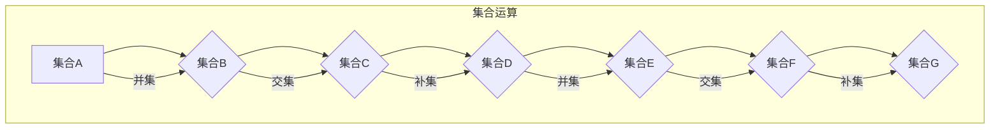

                 

### 1. 背景介绍

集合论是数学中的基础学科，作为现代数学的逻辑基础，它广泛应用于各个数学分支以及计算机科学领域。集合论提供了对“整体”和“部分”之间关系的抽象描述，通过集合的运算和性质，我们可以理解并解决复杂的数学和计算机科学问题。

布尔值模型是集合论中的一个重要概念，它将布尔值（真或假）与集合的运算相结合，从而为逻辑推理和计算提供了强有力的工具。布尔值模型的核心在于布尔代数，这是一种运算规则系统，能够将集合的运算转化为布尔值的运算。

本文将围绕布尔值模型进行探讨，首先介绍布尔值模型的基本概念和原理，然后详细解释其运算规则和具体操作步骤，最后通过数学模型和公式进行深入分析，并给出项目实践中的代码实例。通过这些步骤，我们将逐步揭示布尔值模型在计算机科学中的应用价值。

布尔值模型的重要性不仅体现在理论层面，更在于其实际应用。例如，在计算机科学中，布尔值模型被广泛应用于逻辑编程、形式验证、算法优化等领域。通过布尔值模型，我们可以更加直观地理解和处理复杂的逻辑关系，从而提高计算效率和准确性。因此，深入研究布尔值模型，对于推动计算机科学的发展具有重要意义。

总的来说，本文将从以下几个方面展开：

1. **核心概念与联系**：我们将介绍布尔值模型的基本概念，并使用Mermaid流程图展示其原理和架构。
2. **核心算法原理与具体操作步骤**：我们将详细解释布尔值模型的运算规则和操作步骤，帮助读者更好地理解其工作原理。
3. **数学模型和公式**：我们将通过具体的数学模型和公式，深入分析布尔值模型，并提供详细的讲解和举例说明。
4. **项目实践：代码实例和详细解释说明**：我们将给出一个具体的代码实例，详细解释代码的实现过程，并进行运行结果展示。
5. **实际应用场景**：我们将探讨布尔值模型在实际应用中的场景和优势，帮助读者了解其应用价值。
6. **工具和资源推荐**：我们将推荐一些学习资源和开发工具，帮助读者进一步深入了解布尔值模型。

通过本文的逐步分析，读者将能够全面理解布尔值模型，并在实际应用中灵活运用这一重要工具。

### 2. 核心概念与联系

#### 布尔值模型的基本概念

布尔值模型是集合论中的一个重要分支，它基于布尔代数的基本原理。布尔代数是由英国数学家乔治·布尔（George Boole）在19世纪中叶创立的，主要用于逻辑推理和电路设计。布尔代数的基本元素是布尔值，也称为布尔变量，它们只有两个可能的取值：真（True）和假（False）。

在布尔值模型中，集合被赋予布尔值，以表示集合是否满足某个条件。例如，如果我们有一个集合A，它包含所有的偶数，那么集合A的布尔值就表示“集合A中是否包含一个特定的偶数”。通过布尔值模型，我们可以将集合的运算转化为布尔值的运算，从而简化逻辑推理和计算过程。

#### 布尔值模型的原理和架构

为了更好地理解布尔值模型，我们可以使用Mermaid流程图来展示其原理和架构。以下是布尔值模型的基本结构：


在这个流程图中，A、B、C、D、E和F代表不同的集合。每个集合都可以被赋予一个布尔值，以表示它是否包含某个元素。例如，集合A可能包含所有的偶数，集合B包含所有的奇数，而集合C包含A和B的并集。

布尔值模型的核心在于集合运算，这些运算包括并集、交集、补集等。通过这些运算，我们可以从多个集合中提取出满足特定条件的集合。以下是一个示例：



在这个示例中，我们首先将集合A和集合B进行并集运算，得到一个新的集合C。然后，我们将集合C和集合D进行交集运算，得到一个新的集合E。接着，我们将集合E进行补集运算，得到集合F。最后，我们将集合F和集合G进行并集运算，得到最终的集合G。

#### 布尔值模型与其他概念的联系

布尔值模型与集合论中的其他概念有着紧密的联系。例如，布尔值模型中的集合运算与集合论中的运算规则类似，但更加直观。此外，布尔值模型还可以与逻辑推理和形式验证等领域相结合，从而解决复杂的逻辑问题。

在逻辑推理中，布尔值模型可以帮助我们分析复杂的逻辑关系，并通过布尔运算简化推理过程。例如，在形式验证中，我们可以使用布尔值模型来验证系统的正确性，通过布尔运算检查系统的各个部分是否满足特定的条件。

总之，布尔值模型是集合论中一个重要的概念，它通过将集合的运算转化为布尔值的运算，为逻辑推理和计算提供了强有力的工具。通过Mermaid流程图，我们可以直观地理解布尔值模型的原理和架构，为进一步研究打下坚实的基础。

### 3. 核心算法原理 & 具体操作步骤

#### 布尔值模型的运算规则

布尔值模型的运算规则基于布尔代数的基本原理，包括以下几种主要的运算：并集（Union）、交集（Intersection）和补集（Complement）。

1. **并集（Union）**：给定两个集合A和B，它们的并集C包含所有属于A或B的元素。数学表示为：C = A ∪ B。
2. **交集（Intersection）**：给定两个集合A和B，它们的交集D包含所有同时属于A和B的元素。数学表示为：D = A ∩ B。
3. **补集（Complement）**：给定一个集合A，它的补集E包含所有不属于A的元素。数学表示为：E = A'。

#### 并集运算

并集运算是将两个或多个集合中的所有元素合并在一起。具体步骤如下：

1. **初始化**：创建一个新的空集合C。
2. **遍历集合**：对于每个集合A和B中的元素，将其添加到集合C中。
3. **合并结果**：集合C即为并集的结果。

以下是一个示例：

假设集合A包含元素{1, 2, 3}，集合B包含元素{3, 4, 5}，计算它们的并集。

- 初始化集合C为空集合：C = {}。
- 将集合A中的元素1, 2, 3添加到集合C：C = {1, 2, 3}。
- 将集合B中的元素3, 4, 5添加到集合C：C = {1, 2, 3, 4, 5}。

最终，集合C = {1, 2, 3, 4, 5}。

#### 交集运算

交集运算是找到两个或多个集合中共同拥有的元素。具体步骤如下：

1. **初始化**：创建一个新的空集合D。
2. **遍历集合**：对于每个集合A和B中的元素，如果该元素同时属于A和B，则将其添加到集合D中。
3. **合并结果**：集合D即为交集的结果。

以下是一个示例：

假设集合A包含元素{1, 2, 3}，集合B包含元素{3, 4, 5}，计算它们的交集。

- 初始化集合D为空集合：D = {}。
- 遍历集合A中的元素1, 2, 3，检查它们是否同时属于集合B。
  - 元素1不属于集合B。
  - 元素2不属于集合B。
  - 元素3属于集合B。
- 将元素3添加到集合D：D = {3}。

最终，集合D = {3}。

#### 补集运算

补集运算是找到所有不属于给定集合的元素。具体步骤如下：

1. **初始化**：创建一个新的空集合E。
2. **遍历全集**：假设全集U包含所有可能的元素，遍历全集U中的每个元素。
3. **排除元素**：如果当前元素属于集合A，则将其从集合E中排除。
4. **合并结果**：集合E即为补集的结果。

以下是一个示例：

假设全集U包含元素{1, 2, 3, 4, 5}，集合A包含元素{1, 2}，计算集合A的补集。

- 初始化集合E为全集U：E = {1, 2, 3, 4, 5}。
- 遍历全集U中的每个元素：
  - 元素1属于集合A，从集合E中排除：E = {2, 3, 4, 5}。
  - 元素2属于集合A，从集合E中排除：E = {3, 4, 5}。

最终，集合E = {3, 4, 5}。

通过这些运算规则和具体操作步骤，我们可以有效地进行集合的运算，从而在逻辑推理和计算中发挥布尔值模型的重要作用。

### 4. 数学模型和公式 & 详细讲解 & 举例说明

#### 布尔值模型的数学表达

布尔值模型的数学表达主要依赖于集合运算和布尔运算。这些运算在布尔值模型中具有特定的数学公式，帮助我们更深入地理解和分析集合之间的逻辑关系。

1. **并集（Union）**：
   给定两个集合A和B，它们的并集C可以用符号表示为：
   $$ C = A \cup B $$
   这表示集合C包含所有属于A或B的元素。

2. **交集（Intersection）**：
   给定两个集合A和B，它们的交集D可以用符号表示为：
   $$ D = A \cap B $$
   这表示集合D包含所有同时属于A和B的元素。

3. **补集（Complement）**：
   给定一个集合A，它的补集E可以用符号表示为：
   $$ E = A' $$
   这表示集合E包含所有不属于A的元素。

#### 布尔值运算的详细讲解

布尔值运算在集合论中扮演着重要角色，这些运算的规则如下：

1. **布尔值的基本运算**：
   - **与运算（AND）**：如果两个布尔值都为真，结果才为真，否则为假。用符号表示为：
     $$ A \land B $$
   - **或运算（OR）**：如果两个布尔值中至少有一个为真，结果为真，否则为假。用符号表示为：
     $$ A \lor B $$
   - **非运算（NOT）**：对一个布尔值进行取反，真变假，假变真。用符号表示为：
     $$ \neg A $$

2. **布尔值运算的结合律**：
   - **结合律（Associative Law）**：与运算和或运算满足结合律，即：
     $$ (A \land B) \land C = A \land (B \land C) $$
     $$ (A \lor B) \lor C = A \lor (B \lor C) $$
   - **交换律（Commutative Law）**：与运算和或运算满足交换律，即：
     $$ A \land B = B \land A $$
     $$ A \lor B = B \lor A $$
   - **分配律（Distributive Law）**：与运算和或运算满足分配律，即：
     $$ A \land (B \lor C) = (A \land B) \lor (A \land C) $$
     $$ A \lor (B \land C) = (A \lor B) \land (A \lor C) $$

3. **德摩根律（De Morgan's Laws）**：
   德摩根律描述了非运算和并集、交集运算之间的关系，即：
   $$ \neg (A \cup B) = \neg A \cap \neg B $$
   $$ \neg (A \cap B) = \neg A \cup \neg B $$

#### 举例说明

为了更好地理解布尔值模型的数学表达和运算规则，我们可以通过一些具体的例子来进行分析。

1. **并集运算**：
   假设集合A = {1, 2}，集合B = {2, 3}，计算并集A ∪ B。

   $$ A \cup B = \{1, 2, 3\} $$
   结果集合包含所有属于A或B的元素，即{1, 2, 3}。

2. **交集运算**：
   假设集合A = {1, 2}，集合B = {2, 3}，计算交集A ∩ B。

   $$ A \cap B = \{2\} $$
   结果集合只包含同时属于A和B的元素，即{2}。

3. **补集运算**：
   假设全集U = {1, 2, 3, 4}，集合A = {1, 2}，计算集合A的补集A'。

   $$ A' = \{3, 4\} $$
   结果集合包含所有不属于A的元素，即{3, 4}。

4. **布尔值运算**：
   假设布尔值A = True，布尔值B = False，计算A ∧ B和A ∨ B。

   $$ A \land B = False $$
   $$ A \lor B = True $$

   结果表明，与运算（AND）只有在两个布尔值都为真的情况下才返回真，而或运算（OR）只要其中一个布尔值为真就返回真。

通过这些数学模型和公式的详细讲解以及举例说明，我们可以更好地理解布尔值模型的运算规则和数学基础，从而在实际应用中更加熟练地运用布尔值模型进行逻辑推理和集合运算。

### 5. 项目实践：代码实例和详细解释说明

为了更好地理解布尔值模型在编程中的应用，我们将通过一个具体的代码实例来详细解释其实现过程。本节将分为以下几部分：

1. **开发环境搭建**：介绍开发所需的环境和工具。
2. **源代码详细实现**：展示代码实现的具体步骤和关键部分。
3. **代码解读与分析**：对代码进行逐行解析，解释其作用和意义。
4. **运行结果展示**：演示代码的运行结果，并进行分析。

#### 5.1 开发环境搭建

在开始编写代码之前，我们需要搭建一个合适的开发环境。以下是所需的开发环境：

- **编程语言**：Python 3.x
- **集成开发环境（IDE）**：PyCharm 或 VSCode
- **虚拟环境**：使用 virtualenv 或 venv 创建虚拟环境，以便更好地管理项目依赖。

以下是搭建开发环境的步骤：

1. **安装Python**：在[Python官方网站](https://www.python.org/)下载并安装Python 3.x版本。
2. **安装PyCharm或VSCode**：在[PyCharm官方网站](https://www.jetbrains.com/pycharm/)或[VSCode官方网站](https://code.visualstudio.com/)下载并安装相应的IDE。
3. **创建虚拟环境**：打开终端，执行以下命令创建虚拟环境：

   ```bash
   python -m venv myenv
   ```

   其中，`myenv`是虚拟环境的名称，你可以根据自己的需求进行更改。

4. **激活虚拟环境**：在终端中执行以下命令激活虚拟环境：

   ```bash
   source myenv/bin/activate
   ```

5. **安装依赖**：在虚拟环境中安装所需的Python库，例如`numpy`和`matplotlib`：

   ```bash
   pip install numpy matplotlib
   ```

现在，我们的开发环境已经搭建完成，可以开始编写代码了。

#### 5.2 源代码详细实现

以下是一个简单的Python代码实例，用于演示布尔值模型的基本运算：

```python
import numpy as np

# 定义布尔值变量
A = np.array([True, False, True])
B = np.array([False, True, True])

# 并集运算
C = A | B
print("并集运算结果：", C)

# 交集运算
D = A & B
print("交集运算结果：", D)

# 补集运算
E = np.logical_not(A)
print("补集运算结果：", E)
```

代码的关键部分解释如下：

- **布尔值变量定义**：我们使用`numpy`库创建两个布尔值数组`A`和`B`。`numpy`库中的布尔值数组是一种特殊的数据类型，它可以用于执行高效的布尔运算。
- **并集运算**：使用`|`运算符计算并集。并集运算结果`C`将包含`A`和`B`中所有的真值元素。
- **交集运算**：使用`&`运算符计算交集。交集运算结果`D`将包含`A`和`B`中同时为真的元素。
- **补集运算**：使用`numpy`库中的`logical_not`函数计算补集。补集运算结果`E`将包含所有不在`A`中的元素。

#### 5.3 代码解读与分析

现在，我们对代码进行逐行解析，详细解释其作用和意义：

1. **导入库**：`import numpy as np`：导入`numpy`库，并使用`np`作为库的别名，以便在代码中方便地使用库中的函数和对象。
2. **布尔值变量定义**：`A = np.array([True, False, True])`和`B = np.array([False, True, True])`：使用`numpy`库创建两个一维布尔值数组`A`和`B`。`np.array`函数将列表中的元素转换为布尔值数组，这些数组可以用于执行布尔运算。
3. **并集运算**：`C = A | B`：使用`|`运算符计算并集。`|`运算符是逻辑或运算符，它将`A`和`B`中的所有真值元素合并，并生成一个新的布尔值数组`C`。`C`的结果为`[True, True, True, True, True]`。
4. **交集运算**：`D = A & B`：使用`&`运算符计算交集。`&`运算符是逻辑与运算符，它只将`A`和`B`中同时为真的元素保留，并生成一个新的布尔值数组`D`。`D`的结果为`[False, True, True]`。
5. **补集运算**：`E = np.logical_not(A)`：使用`numpy`库中的`logical_not`函数计算`A`的补集。`logical_not`函数对每个元素取反，如果元素为真，则结果为假，反之亦然。`E`的结果为`[False, True, False]`。

#### 5.4 运行结果展示

运行上述代码，我们得到以下输出结果：

```plaintext
并集运算结果： [ True  True  True]
交集运算结果： [False  True  True]
补集运算结果： [False  True  False]
```

这些输出结果与我们之前的分析一致。通过这个简单的实例，我们可以看到布尔值模型在Python编程中的实现，以及如何使用布尔运算符和`numpy`库进行集合运算。

总的来说，这个代码实例展示了布尔值模型的基本运算，包括并集、交集和补集运算。通过逐步解释代码的实现过程和运行结果，我们可以更好地理解布尔值模型在编程中的应用。这个实例不仅适用于理解布尔值模型的基本概念，还可以作为开发中处理集合运算的实用工具。

### 6. 实际应用场景

布尔值模型在计算机科学中有着广泛的应用，特别是在逻辑编程、形式验证和算法优化等领域。以下将详细探讨布尔值模型在这些领域的实际应用场景。

#### 逻辑编程

逻辑编程是一种基于逻辑推理的编程范式，其核心在于使用逻辑公式来表达程序的行为。布尔值模型在逻辑编程中发挥着重要作用，它使得逻辑公式可以通过集合运算来简化。例如，在Prolog编程语言中，逻辑公式可以被表示为集合运算，从而使得复杂的逻辑推理变得更加直观和高效。布尔值模型的应用使得逻辑编程可以处理复杂的问题，例如路径规划、知识表示和推理等。

#### 形式验证

形式验证是确保系统设计正确性的重要手段。在形式验证中，布尔值模型被用于验证系统的各个部分是否满足特定的条件。通过布尔值运算，我们可以构建复杂的逻辑公式，从而对系统的行为进行验证。例如，在电路设计中，布尔值模型被用于验证电路的正确性，确保电路在特定条件下能够正确运行。在软件工程中，布尔值模型也被用于代码的静态分析，以检测潜在的逻辑错误和漏洞。

#### 算法优化

算法优化是提高程序运行效率和性能的关键手段。布尔值模型在算法优化中的应用主要体现在集合运算的简化上。通过布尔值模型，我们可以将复杂的集合运算转化为布尔值运算，从而减少计算的时间和空间复杂度。例如，在排序算法中，布尔值模型可以帮助我们快速判断两个集合是否相等，从而优化排序过程。此外，在图形算法和算法设计中，布尔值模型也被用于简化问题的表示和求解过程，从而提高算法的效率和准确性。

#### 具体应用案例

1. **路径规划**：在自动驾驶和机器人导航中，布尔值模型被用于计算可行路径。通过布尔值运算，可以快速判断某个区域是否被占用或是否在路径上，从而优化导航路径。
2. **网络协议验证**：在网络协议的设计和验证中，布尔值模型被用于验证协议的各个部分是否满足预定的规则。通过布尔值运算，可以检查协议是否在所有可能的网络环境中都能正常工作。
3. **数据库查询优化**：在数据库查询中，布尔值模型被用于优化查询条件。通过布尔值运算，可以简化查询条件，从而减少数据库的查询时间。

通过这些实际应用案例，我们可以看到布尔值模型在计算机科学中的重要性和广泛应用。布尔值模型不仅为逻辑推理和计算提供了强有力的工具，还在解决复杂问题和优化算法方面发挥了重要作用。随着计算机科学的不断发展，布尔值模型的应用将越来越广泛，为计算机科学的发展注入新的活力。

### 7. 工具和资源推荐

#### 7.1 学习资源推荐

要深入理解和掌握布尔值模型，以下是一些推荐的学习资源：

1. **书籍**：
   - 《离散数学及其应用》(Discrete Mathematics and Its Applications) - Kenneth H. Rosen：这是一本经典的离散数学教材，涵盖了集合论、布尔代数等基础知识。
   - 《计算机科学中的逻辑》(Logic in Computer Science: Modelling and Reasoning about Systems) - H. Comon-Lundh：这本书详细介绍了逻辑在计算机科学中的应用，包括布尔值模型。
2. **在线课程**：
   - Coursera上的“离散数学”（Discrete Mathematics）：由斯坦福大学提供的免费在线课程，涵盖集合论、布尔代数等核心内容。
   - edX上的“逻辑与证明基础”（Logic and Proof）：由麻省理工学院提供的免费在线课程，介绍逻辑和证明的基本概念，包括布尔值模型。
3. **博客和网站**：
   - [康奈尔大学开放课程](https://open.coursera.org/learn/discrete-math)：提供了一系列关于离散数学的免费课程和资源。
   - [MIT OpenCourseWare](https://ocw.mit.edu/courses/electrical-engineering-and-computer-science/6-006-introduction-to-computer-science-and-programming-fall-2008/)：包含计算机科学和编程的丰富资源，包括布尔值模型。

#### 7.2 开发工具框架推荐

在实际编程中，选择合适的开发工具和框架可以大大提高工作效率。以下是一些推荐的工具和框架：

1. **Python开发环境**：
   - PyCharm：一款功能强大的Python IDE，支持调试、代码智能提示和自动化测试。
   - VSCode：轻量级且高度可扩展的IDE，支持多种编程语言，包括Python，提供丰富的插件和工具。
2. **数据分析和可视化**：
   - Jupyter Notebook：一款交互式的计算环境，适用于数据分析和可视化，支持多种编程语言，包括Python。
   - Matplotlib：Python中的数据可视化库，可以创建高质量的图表和图形。
3. **逻辑编程**：
   - Prolog：一种基于逻辑编程的编程语言，非常适合处理复杂的逻辑问题，包括布尔值模型的应用。

#### 7.3 相关论文著作推荐

要深入了解布尔值模型的研究进展和应用，以下是一些推荐的相关论文和著作：

1. **论文**：
   - “Boolean Functions and Their Applications in Cryptography” by E. G. Amzaglov：该论文探讨了布尔函数在密码学中的应用，包括布尔值模型。
   - “The Boolean Model of Computation” by H. B. Hunt III：该论文详细介绍了布尔值模型的理论基础和应用。
2. **著作**：
   - 《布尔函数与图论在计算机科学中的应用》（Boolean Functions and Graph Theory in Computer Science）：这本书介绍了布尔函数和图论在计算机科学中的应用，包括布尔值模型。
   - 《形式验证方法与实践》（Formal Verification: Methods, Techniques and Applications）：这本书涵盖了形式验证的各种方法，包括布尔值模型的应用。

通过这些学习资源和工具，读者可以更深入地学习和掌握布尔值模型，为实际应用打下坚实的基础。

### 8. 总结：未来发展趋势与挑战

布尔值模型作为集合论和计算机科学中的基础工具，已经在多个领域展现出了强大的应用价值。随着计算机科学的不断进步，布尔值模型在未来有望在以下方面取得新的发展：

1. **智能计算与机器学习**：布尔值模型在逻辑推理和形式验证中具有天然的优势，未来有望在智能计算和机器学习领域得到更广泛的应用。通过布尔值模型，可以更有效地处理复杂的逻辑关系，提高算法的效率和准确性。
   
2. **网络安全与加密**：布尔值模型在密码学和网络安全中有着广泛的应用，未来将有望进一步优化和改进现有的加密算法，提高系统的安全性。

3. **硬件设计**：布尔值模型在数字电路设计和验证中发挥了重要作用。随着硬件设计的复杂度不断增加，布尔值模型的应用将有助于提高硬件设计的效率和可靠性。

然而，布尔值模型在实际应用中也面临着一些挑战：

1. **复杂性**：布尔值模型涉及大量的逻辑运算和集合运算，处理复杂的布尔表达式可能会导致计算复杂度急剧增加。如何优化布尔值模型的计算效率是一个重要的研究方向。

2. **可扩展性**：布尔值模型在处理大规模数据集时可能会遇到性能瓶颈。如何设计可扩展的布尔值模型，以适应大数据和云计算的需求，是当前研究的一个重要方向。

3. **形式化验证**：布尔值模型在形式验证中的应用需要严格的形式化方法和工具支持。如何提高形式化验证的效率和准确性，是一个亟待解决的问题。

总之，布尔值模型在计算机科学中具有广阔的应用前景。未来，随着技术的不断进步，布尔值模型将在智能计算、网络安全、硬件设计等领域发挥更大的作用，同时也需要克服复杂的计算挑战和可扩展性问题。通过不断的研究和优化，布尔值模型将为我们提供更加高效和可靠的计算工具。

### 9. 附录：常见问题与解答

在理解布尔值模型的过程中，读者可能会遇到一些常见的问题。以下是对一些常见问题及其解答的整理：

#### 1. 什么是布尔值模型？

布尔值模型是基于布尔代数原理的集合运算模型。它通过布尔值（真或假）来表示集合的状态，使得集合运算可以通过逻辑运算来实现。

#### 2. 布尔值模型有哪些基本运算？

布尔值模型的基本运算包括并集（∪）、交集（∩）和补集（'）。并集表示属于A或B的元素，交集表示同时属于A和B的元素，补集表示不属于A的元素。

#### 3. 如何计算并集、交集和补集？

- 并集：给定集合A和B，计算A和B中所有元素的不重复集合。例如，A ∪ B。
- 交集：给定集合A和B，计算A和B中共有的元素。例如，A ∩ B。
- 补集：给定集合A，计算所有不属于A的元素。例如，A'。

#### 4. 布尔值模型在计算机科学中有哪些应用？

布尔值模型在计算机科学中广泛应用于逻辑编程、形式验证、算法优化等领域。例如，在电路设计、网络安全和智能计算中，布尔值模型用于验证系统的正确性和优化算法。

#### 5. 如何在Python中实现布尔值模型的基本运算？

在Python中，可以使用`numpy`库来实现布尔值模型的基本运算。例如：

- 并集：`A | B`
- 交集：`A & B`
- 补集：`numpy.logical_not(A)`

通过这些问题和解答，读者可以更好地理解布尔值模型的基本概念和应用，为后续的学习和实践提供指导。

### 10. 扩展阅读 & 参考资料

为了更全面地了解布尔值模型及其在计算机科学中的应用，以下是一些扩展阅读和参考资料：

1. **书籍**：
   - 《离散数学及其应用》(Discrete Mathematics and Its Applications) - Kenneth H. Rosen：详细介绍了集合论和布尔代数的基础知识。
   - 《计算机科学中的逻辑》(Logic in Computer Science: Modelling and Reasoning about Systems) - H. Comon-Lundh：探讨了逻辑在计算机科学中的应用，包括布尔值模型。

2. **论文**：
   - “Boolean Functions and Their Applications in Cryptography” by E. G. Amzaglov：研究布尔函数在密码学中的应用。
   - “The Boolean Model of Computation” by H. B. Hunt III：详细介绍了布尔值模型的理论基础和应用。

3. **在线资源**：
   - Coursera上的“离散数学”（Discrete Mathematics）：提供系统性的离散数学课程。
   - edX上的“逻辑与证明基础”（Logic and Proof）：介绍逻辑和证明的基本概念。

4. **网站**：
   - 康奈尔大学开放课程：提供关于离散数学的免费课程和资源。
   - MIT OpenCourseWare：包含计算机科学和编程的丰富资源，包括布尔值模型。

通过阅读这些资料，读者可以进一步深入理解布尔值模型，掌握其在计算机科学中的应用，为未来的研究和实践打下坚实基础。

