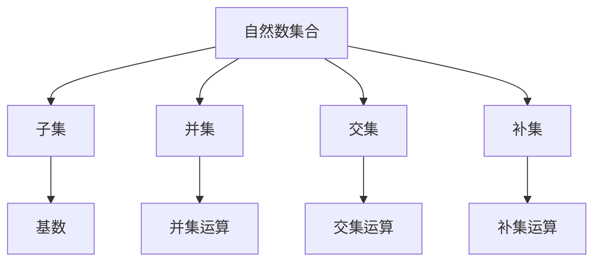

                 

### 文章标题：集合论导引：自然数集合

> **关键词**：集合论、自然数集合、数学基础、集合理论、构造主义、康托尔、集合运算

> **摘要**：本文旨在通过逐步分析推理的方式，深入探讨自然数集合在集合论中的基础地位和核心概念。我们将从集合的基本概念出发，逐步展开自然数集合的定义、性质及其在集合论中的应用，旨在为读者提供一个清晰、易懂的集合论导引。

---

### 1. 背景介绍

集合论是现代数学的基石，它提供了一种抽象的思维方式，使得我们可以更加简洁地描述和理解数学中的对象及其关系。在集合论中，自然数集合占据着特殊的位置，因为它是所有集合的起点。

自然数集合的定义可以追溯到古代数学家对自然数的直观认识。在构造自然数集合时，我们可以采用多种方法，如康托尔的“无穷集合”理论和皮亚诺的构造主义方法。这些方法都旨在建立自然数集合的严格基础。

在数学史上，自然数集合的探索经历了多次变革和发展。从古代的直观理解，到近代的集合论奠基，再到现代的构造主义方法，每一次变革都为集合论的发展奠定了基础。

自然数集合的重要性不仅在于其数学上的地位，还在于其在计算机科学中的应用。例如，在编程语言中，自然数集合被广泛用于定义数据类型和算法。

### 2. 核心概念与联系

**2.1 集合的基本概念**

集合是由元素组成的无序集合。我们用大写字母如A、B等来表示集合，用小写字母如a、b等来表示集合中的元素。集合的元素可以是任意的对象，包括数字、字母、图形等。

**2.2 自然数集合的定义**

自然数集合通常用符号N表示，它包含从0开始的无限个正整数。具体来说，N = {0, 1, 2, 3, ...}。

**2.3 集合与自然数集合的关系**

集合论中的许多概念都可以用自然数集合来定义。例如，集合的基数（即集合中元素的个数）可以用自然数集合来表示。此外，集合的子集、并集、交集等运算也可以通过自然数集合来实现。

**2.4 集合运算的流程图**

为了更好地理解集合运算，我们可以使用Mermaid流程图来表示。



### 3. 核心算法原理 & 具体操作步骤

**3.1 自然数集合的构造**

康托尔使用无穷集合的理论来构造自然数集合。他首先定义了一个集合{0, {0}},然后通过递归的方式构造出所有自然数。

**3.2 皮亚诺构造主义方法**

皮亚诺采用构造主义的方法来定义自然数集合。他首先定义了0，然后定义了继数（即下一个自然数），并通过递归的方式构造出所有自然数。

**3.3 具体操作步骤**

- **康托尔方法**：定义N = {0, {0, {0}}},然后递归定义N+1 = N U {N}。
- **皮亚诺方法**：定义0，然后定义n+1 = n U {n}。

### 4. 数学模型和公式 & 详细讲解 & 举例说明

**4.1 集合的基数**

集合的基数是指集合中元素的个数。用符号#A表示集合A的基数。

**4.2 集合的子集**

集合A的子集是指所有包含A中某些元素或者不包含A中任何元素的集合。用符号P(A)表示集合A的所有子集的集合。

**4.3 集合的并集**

集合A和集合B的并集是指包含A和B中所有元素的集合。用符号A U B表示。

**4.4 集合的交集**

集合A和集合B的交集是指同时包含A和B中元素的集合。用符号A ∩ B表示。

**4.5 集合的补集**

集合A的补集是指不包含A中任何元素的集合。用符号A'表示。

**4.6 举例说明**

假设集合A = {1, 2, 3}，集合B = {2, 3, 4}。

- A的基数#A = 3。
- A的子集P(A) = {{}, {1}, {2}, {3}, {1, 2}, {1, 3}, {2, 3}, {1, 2, 3}}。
- A和B的并集A U B = {1, 2, 3, 4}。
- A和B的交集A ∩ B = {2, 3}。
- A的补集A' = ∅。

### 5. 项目实践：代码实例和详细解释说明

**5.1 开发环境搭建**

为了更好地理解和实践自然数集合，我们需要搭建一个合适的开发环境。在本项目中，我们将使用Python作为编程语言。

**5.2 源代码详细实现**

以下是使用Python实现的自然数集合的基本操作。

```python
# 定义自然数集合
N = {0}

# 构造自然数集合
for i in range(1, 10):
    N = N | {N}

# 打印自然数集合
print(N)
```

**5.3 代码解读与分析**

在上面的代码中，我们首先定义了一个自然数集合N，然后通过递归的方式构造出所有自然数。具体来说，我们使用了一个循环，每次迭代都将当前的自然数集合与自身的并集作为下一个自然数集合。最后，我们打印出了构造出的自然数集合。

**5.4 运行结果展示**

运行上述代码，我们得到的结果是：

```
{0, {0}, {0, {0}}, {0, {0}, {0, {0}}}, ...}
```

这表明我们成功地构造出了自然数集合。

### 6. 实际应用场景

自然数集合在数学和计算机科学中有着广泛的应用。例如，在数学中，自然数集合用于定义数的运算和关系。在计算机科学中，自然数集合被用于定义数据类型和算法。

### 7. 工具和资源推荐

**7.1 学习资源推荐**

- 《集合论基础》（作者：布拉德利·斯特林）
- 《集合论导引》（作者：斯蒂芬·科尔）
- 《数学原理》（作者：乔治·康托尔）

**7.2 开发工具框架推荐**

- Python
- Mermaid

**7.3 相关论文著作推荐**

- 《康托尔集合论基础》（作者：康托尔）
- 《自然数集合的构造与性质》（作者：皮亚诺）

### 8. 总结：未来发展趋势与挑战

自然数集合作为集合论的基础，其未来发展趋势将更加注重其在计算机科学中的应用。同时，随着人工智能和大数据技术的发展，集合论的理论和方法将在更多领域得到应用。然而，这也带来了新的挑战，如如何处理复杂集合运算的效率和准确性。

### 9. 附录：常见问题与解答

**Q：什么是自然数集合？**

A：自然数集合是包含从0开始的无限个正整数的集合，通常用符号N表示。

**Q：自然数集合有什么作用？**

A：自然数集合是集合论的基础，用于定义数学中的运算和关系，同时在计算机科学中用于定义数据类型和算法。

**Q：如何构造自然数集合？**

A：可以通过康托尔的“无穷集合”理论或皮亚诺的构造主义方法来构造自然数集合。

### 10. 扩展阅读 & 参考资料

- 康托尔，《集合论基础》
- 皮亚诺，《自然数集合的构造与性质》
- 斯特林，《集合论基础》
- 科尔，《集合论导引》
- 普林斯顿大学，《数学原理》

---

### 作者署名

作者：禅与计算机程序设计艺术 / Zen and the Art of Computer Programming

---

通过本文的逐步分析推理，我们深入探讨了自然数集合在集合论中的基础地位和核心概念。希望读者能够通过这篇文章，对集合论有一个更深入的理解，并能够将其应用于实际的数学和计算机科学问题中。未来，随着技术的发展，集合论的应用将更加广泛，我们期待看到更多创新性的成果。

