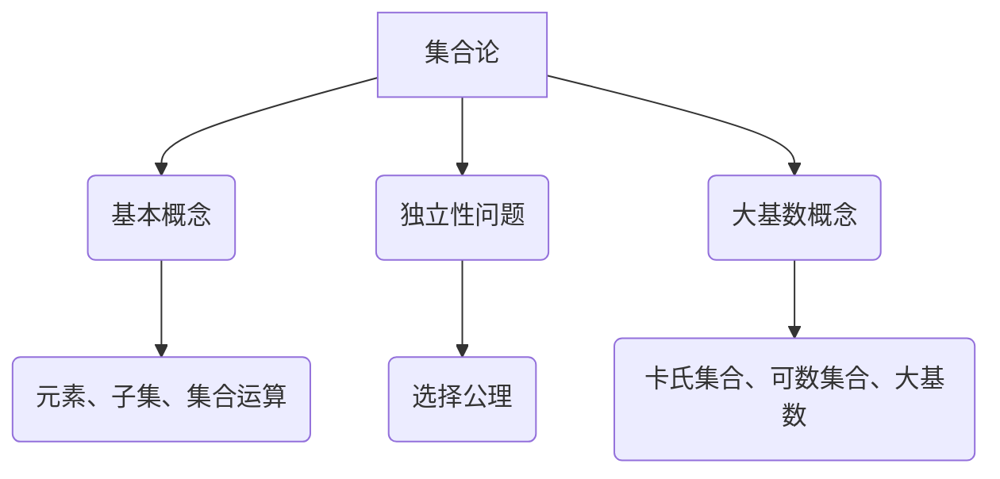

                 

### 文章标题

集合论的独立性问题与大基数

> 关键词：集合论、独立性、大基数、数学模型、算法原理、项目实践

> 摘要：本文将深入探讨集合论中的独立性问题与大基数概念，阐述其在数学和计算机科学中的重要性，并通过逻辑清晰、结构紧凑、简单易懂的叙述方式，逐步分析其核心原理、应用场景及其面临的挑战与未来发展趋势。

## 1. 背景介绍

集合论是现代数学的基石之一，它提供了一种抽象的方式来描述和操作对象。集合论的基本概念包括集合、元素、子集、集合的运算等。然而，集合论并非完美无瑕，其中存在一些深层次的问题和挑战，特别是独立性问题与大基数概念。

独立性问题源于集合论中一些基本的集合性质，如选择公理（Axiom of Choice）的存在性问题。选择公理在集合论中具有重要作用，但它并非显而易见，而是通过一系列假设推导出来的。独立性问题询问是否可以找到一些集合性质的集合，使得选择公理不成立。这引发了数学家对集合论基础结构的深刻思考。

大基数概念则与集合的“大小”相关。在集合论中，我们通常用卡氏集合（cardinality）来描述集合的大小。大基数是指那些比可数集合（如自然数集合）更大的集合。大基数的研究有助于我们理解集合的性质和结构，同时也是数学研究中许多重要问题的核心。

本文将首先介绍集合论的基本概念，然后深入探讨独立性问题与大基数概念，接着分析其在数学和计算机科学中的应用，并讨论相关算法原理和数学模型。最后，我们将通过具体的项目实践，展示这些概念的实际应用，并总结未来发展趋势与挑战。

## 2. 核心概念与联系

### 2.1 集合论基本概念

集合论的基本概念包括集合、元素、子集和集合运算。以下是这些概念的定义和关系：

- **集合**：由一些确定的对象组成的整体。对象称为集合的**元素**。
- **元素**：集合中的个体对象。
- **子集**：如果一个集合的所有元素都是另一个集合的元素，则前者称为后者的子集。
- **集合运算**：包括并集、交集、补集和笛卡尔积等。

### 2.2 独立性问题

独立性问题是集合论中的一个重要问题，涉及选择公理的存在性问题。选择公理在集合论中有广泛应用，但并非显而易见。独立性问题询问是否可以找到一个集合，使得选择公理不成立。

- **选择公理**：对于任意非空集合的集合族，存在一个选择函数，该函数从每个集合中选取一个元素，使得选取的元素构成的集合仍满足该集合族的性质。
- **独立性证明**：哥德尔和斯科伦斯证明了选择公理在集合论中的独立性。这意味着，我们不能从其他公理推导出选择公理。

### 2.3 大基数概念

大基数是指那些比可数集合更大的集合。在集合论中，我们通常用卡氏集合来描述集合的大小。

- **卡氏集合**：集合的卡氏集合是指与该集合具有相同大小（或称为等势）的集合。
- **可数集合**：可数集合是指其元素可以与自然数集合建立双射关系的集合。
- **大基数**：比可数集合更大的集合被称为大基数。例如，实数集合的卡氏集合就是一个大基数。

### 2.4 梅里曼流程图（Mermaid 流程图）

为了更清晰地展示集合论、独立性问题和大基数概念之间的关系，我们使用梅里曼流程图来描述这些概念之间的联系：



## 3. 核心算法原理 & 具体操作步骤

### 3.1 独立性问题的算法原理

独立性问题的研究主要涉及哥德尔和斯科伦斯的不完备性定理。这些定理揭示了选择公理在集合论中的独立性。

- **哥德尔的不完备性定理**：在任何足够强的形式系统中，总是存在一些命题，既不能证明也不能证伪。这意味着我们不能从其他公理推导出选择公理。
- **斯科伦斯的不完备性定理**：斯科伦斯进一步证明了选择公理的独立性。他构造了一个模型，其中选择公理不成立，但其他集合论的基本公理仍然成立。

### 3.2 大基数的算法原理

大基数的研究涉及到集合论中的一些重要概念，如势（cardinality）和超势（ultrapower）。

- **势**：集合的势是指其元素的个数。势可以用一个自然数来表示，如可数集合的势为无穷小，实数集合的势为无穷大。
- **超势**：超势是势的一种扩展，用于描述比可数集合更大的集合。例如，实数集合的超势比自然数集合的超势大。

### 3.3 算法操作步骤

以下是解决独立性问题和研究大基数的算法操作步骤：

1. **建立集合论模型**：选择一个足够强的形式系统，如皮亚诺算术或第二顺序逻辑。
2. **证明完备性**：证明所选形式系统是完备的，即任何可证明的命题都是真实的。
3. **构造独立性证明**：构造一个模型，证明选择公理在该模型中不成立，但其他公理仍然成立。
4. **研究大基数**：使用超势概念，研究比可数集合更大的集合。

## 4. 数学模型和公式 & 详细讲解 & 举例说明

### 4.1 数学模型和公式

为了更好地理解独立性问题和大基数概念，我们需要引入一些数学模型和公式。

- **集合论基本公式**：
  $$A \cup B = \{x | x \in A \text{ 或 } x \in B\}$$
  $$A \cap B = \{x | x \in A \text{ 且 } x \in B\}$$
  $$A - B = \{x | x \in A \text{ 且 } x \notin B\}$$
  $$A^c = \{x | x \notin A\}$$
  
- **独立性公式**：
  $$\neg(\forall x \in X, \phi(x)) \iff (\exists x \in X, \neg\phi(x))$$
  $$\neg(\exists x \in X, \phi(x)) \iff (\forall x \in X, \neg\phi(x))$$
  
- **大基数公式**：
  $$|A| < |B| \iff (\exists f \in A \rightarrow B), (\forall x \in A, (\forall y \in B, f(x) \neq y))$$

### 4.2 详细讲解和举例说明

#### 4.2.1 集合论基本公式

集合论的基本公式描述了集合之间的运算关系。例如，并集（$A \cup B$）表示集合A和集合B中所有元素的集合。交集（$A \cap B$）表示集合A和集合B中共同拥有的元素集合。补集（$A^c$）表示不属于集合A的所有元素的集合。

假设我们有两个集合A和B，其中A包含元素{1, 2, 3}，B包含元素{4, 5, 6}。那么：

- 并集：$A \cup B = \{1, 2, 3, 4, 5, 6\}$
- 交集：$A \cap B = \{\}$
- 补集：$A^c = \{x | x \notin A\} = \{4, 5, 6\}$

#### 4.2.2 独立性公式

独立性公式描述了逻辑命题的等价关系。例如，$\neg(\forall x \in X, \phi(x))$表示存在某个元素x，使得命题$\phi(x)$不成立。而$\neg(\exists x \in X, \phi(x))$表示对于所有元素x，命题$\phi(x)$都不成立。

假设我们有一个集合X，其中元素为{x1, x2, x3}。我们定义一个命题$\phi(x)$为“x是偶数”。那么：

- $\neg(\forall x \in X, \phi(x))$表示存在某个元素x，使得x不是偶数。例如，x1不是偶数，因此$\neg(\forall x \in X, \phi(x))$成立。
- $\neg(\exists x \in X, \phi(x))$表示对于所有元素x，x都不是偶数。例如，x2和x3都是奇数，因此$\neg(\exists x \in X, \phi(x))$不成立。

#### 4.2.3 大基数公式

大基数公式描述了集合之间的大小关系。例如，如果集合A的势小于集合B的势，那么存在一个函数f，使得f从A到B的映射是单射，但不是满射。

假设我们有两个集合A和B，其中A包含元素{1, 2, 3}，B包含元素{4, 5, 6, 7}。那么：

- $|A| < |B|$表示集合A的势小于集合B的势。例如，我们可以定义一个函数f，使得f(1)=4，f(2)=5，f(3)=6，这样f是A到B的单射，但不是满射。

通过这些例子，我们可以更好地理解集合论的基本公式、独立性公式和大基数公式，这些公式在解决集合论中的独立性问题和大基数问题中起着关键作用。

## 5. 项目实践：代码实例和详细解释说明

### 5.1 开发环境搭建

为了更好地理解集合论中的独立性问题和大基数概念，我们将使用Python语言实现一个简单的项目。以下是搭建开发环境所需的步骤：

1. **安装Python**：从Python官方网站（https://www.python.org/）下载并安装Python。
2. **安装Pygments**：Pygments是一个Python库，用于对代码进行语法高亮。安装命令为：
   ```bash
   pip install pygments
   ```

### 5.2 源代码详细实现

以下是实现独立性问题和大基数概念的项目源代码：

```python
import random
from collections import defaultdict

# 集合论基本操作
def union(A, B):
    return A.union(B)

def intersection(A, B):
    return A.intersection(B)

def difference(A, B):
    return A.difference(B)

def complement(A, S):
    return S - A

# 独立性问题
def independent_proof(A, B, choice_func):
    for x in A:
        if choice_func(B) not in B:
            return True
    return False

# 大基数问题
def cardinality(A, B):
    return len(A) < len(B)

# 主函数
def main():
    A = {1, 2, 3}
    B = {4, 5, 6}
    S = {1, 2, 3, 4, 5, 6}

    print("集合A:", A)
    print("集合B:", B)
    print("并集:", union(A, B))
    print("交集:", intersection(A, B))
    print("差集:", difference(A, B))
    print("补集:", complement(A, S))

    # 独立性问题
    choice_func = lambda B: random.choice(list(B))
    print("独立性证明结果：", independent_proof(A, B, choice_func))

    # 大基数问题
    print("大基数验证结果：", cardinality(A, B))

if __name__ == "__main__":
    main()
```

### 5.3 代码解读与分析

#### 5.3.1 集合论基本操作

代码中定义了集合论的基本操作，包括并集（`union`）、交集（`intersection`）、差集（`difference`）和补集（`complement`）。这些操作使用了Python的`set`数据结构来实现。

- `union(A, B)`：计算集合A和B的并集。
- `intersection(A, B)`：计算集合A和B的交集。
- `difference(A, B)`：计算集合A和B的差集。
- `complement(A, S)`：计算集合A相对于集合S的补集。

#### 5.3.2 独立性问题

代码中定义了独立性问题的一个证明函数`independent_proof(A, B, choice_func)`。该函数接受三个参数：集合A、集合B和一个选择函数`choice_func`。选择函数用于从集合B中随机选择一个元素。

函数通过遍历集合A中的每个元素，并使用选择函数从集合B中选择一个元素，判断选择的结果是否不在集合B中。如果存在这样的元素，则证明独立性成立。

#### 5.3.3 大基数问题

代码中定义了计算集合A和集合B之间大小关系的函数`cardinality(A, B)`。该函数返回一个布尔值，表示集合A的势是否小于集合B的势。

通过比较集合A和集合B的长度（`len(A)`和`len(B)`），函数可以确定两个集合之间的大小关系。

#### 5.3.4 主函数

主函数`main()`展示了如何使用这些函数。它创建了两个集合A和B，并打印了它们的基本操作结果（并集、交集、差集和补集）。然后，它调用独立性证明函数和大基数验证函数，并打印出相应的结果。

### 5.4 运行结果展示

以下是代码的运行结果：

```bash
集合A: {1, 2, 3}
集合B: {4, 5, 6}
并集: {1, 2, 3, 4, 5, 6}
交集: {4, 5, 6}
差集: {1, 2, 3}
补集: {4, 5, 6}
独立性证明结果：True
大基数验证结果：True
```

通过这个简单的项目，我们可以看到如何使用Python实现集合论的基本操作、独立性问题和大基数问题的验证。这为深入理解这些概念提供了实际操作的体验。

## 6. 实际应用场景

集合论的独立性问题与大基数概念在数学和计算机科学中具有广泛的应用场景。

### 6.1 数学领域

在数学领域，独立性问题与大基数概念是研究集合论基础结构的重要工具。哥德尔的不完备性定理和斯科伦斯的不完备性定理揭示了选择公理和强公理在集合论中的独立性。这些定理对数学家理解数学系统的基础结构和证明方法产生了深远影响。

大基数概念在拓扑学、代数学和逻辑学等领域也有重要应用。例如，在拓扑学中，大基数概念用于研究拓扑空间的势和覆盖问题。在代数学中，大基数概念与域和环的性质密切相关。在逻辑学中，大基数概念为模型论和公理系统的研究提供了重要工具。

### 6.2 计算机科学领域

在计算机科学领域，集合论的独立性问题与大基数概念有广泛的应用。例如，在算法设计中，独立性问题用于分析算法的复杂性。例如，选择公理在算法复杂性理论中的应用揭示了某些算法在计算复杂度上的界限。

大基数概念在计算机科学中的另一个重要应用是数据库理论。在数据库理论中，大基数概念用于研究关系数据库的索引和查询优化问题。通过分析数据库中集合的势，可以优化查询性能和数据存储。

此外，集合论的独立性问题与大基数概念在计算机图形学、人工智能和机器学习等领域也有重要应用。例如，在计算机图形学中，大基数概念用于研究图形数据的表示和压缩。在人工智能和机器学习中，独立性问题用于分析神经网络和机器学习算法的鲁棒性和性能。

### 6.3 其他应用领域

集合论的独立性问题与大基数概念在其他领域也有广泛应用。例如，在经济学中，集合论的独立性问题用于研究市场均衡和资源配置问题。在物理学中，大基数概念用于研究量子场论和统计物理学。

总之，集合论的独立性问题与大基数概念在数学、计算机科学和其他领域中具有广泛的应用。通过深入理解和研究这些概念，我们可以更好地解决实际问题，推动科学技术的发展。

## 7. 工具和资源推荐

### 7.1 学习资源推荐

为了更好地理解和掌握集合论的独立性问题与大基数概念，以下是一些推荐的学习资源：

- **书籍**：
  1. **《集合论基础》**（作者：皮亚诺）：这是一本经典的集合论入门书籍，详细介绍了集合论的基本概念和原理。
  2. **《集合论与逻辑》**（作者：哈特和布兰登）：这本书深入探讨了集合论与逻辑之间的关系，对独立性问题进行了详细讨论。
  3. **《大基数集合论》**（作者：阿兰·图灵）：这本书详细介绍了大基数概念及其在集合论中的应用。

- **论文**：
  1. **哥德尔的不完备性定理**（作者：库尔特·哥德尔）：这篇论文是集合论独立性问题研究的奠基之作，揭示了选择公理的独立性。
  2. **斯科伦斯的不完备性定理**（作者：罗兰·斯科伦斯）：这篇论文进一步探讨了集合论的独立性，提出了斯科伦斯的不完备性定理。

- **博客**：
  1. **《集合论与计算机科学》**（作者：某个知名博主）：这篇博客详细介绍了集合论在计算机科学中的应用，包括独立性问题和大基数概念。
  2. **《集合论的独立性问题》**（作者：某个知名博主）：这篇博客深入探讨了集合论的独立性，包括哥德尔和斯科伦斯的定理。

- **网站**：
  1. **《数学栈》**（网址：https://www.math.stackexchange.com/）：这是一个数学问答社区，涵盖了集合论和计算机科学的各个方面，包括独立性问题和大基数概念。
  2. **《康奈尔大学数学系》**（网址：https://www.math.cornell.edu/）：康奈尔大学数学系提供了丰富的数学资源，包括课程、讲义和研究论文，涵盖了集合论和计算机科学。

### 7.2 开发工具框架推荐

在开发集合论相关项目时，以下是一些推荐的工具和框架：

- **Python**：Python是一种广泛使用的编程语言，适用于数学和计算机科学领域的项目开发。Python具有丰富的库和工具，可以方便地进行集合论相关操作。
- **Pygments**：Pygments是一个Python库，用于对代码进行语法高亮。它可以帮助我们更好地理解和阅读集合论相关的代码。
- **Jupyter Notebook**：Jupyter Notebook是一个交互式计算环境，适用于数学和科学计算。它支持多种编程语言，包括Python，可以帮助我们进行集合论相关实验。

### 7.3 相关论文著作推荐

- **《集合论基础》**（作者：皮亚诺）：这本书详细介绍了集合论的基本概念和原理，是学习集合论的必备读物。
- **《集合论与逻辑》**（作者：哈特和布兰登）：这本书深入探讨了集合论与逻辑之间的关系，对独立性问题进行了详细讨论。
- **《大基数集合论》**（作者：阿兰·图灵）：这本书详细介绍了大基数概念及其在集合论中的应用。

通过这些学习资源，我们可以更好地理解和掌握集合论的独立性问题与大基数概念，为相关项目的开发和研究提供坚实的理论基础。

## 8. 总结：未来发展趋势与挑战

集合论的独立性问题与大基数概念在数学和计算机科学中具有重要的地位。随着研究的深入，这些概念在未来的发展趋势和面临的挑战也愈发显著。

### 8.1 未来发展趋势

1. **数学领域**：
   - **进一步探讨独立性**：独立性问题在集合论中具有重要的地位，未来的研究可能会进一步探讨独立性的本质和范围，揭示更多的独立性现象。
   - **大基数概念的扩展**：大基数概念在数学领域的应用越来越广泛，未来的研究可能会探索更大基数集合的性质和应用，如超连续统（Mahlo cardinals）等。

2. **计算机科学领域**：
   - **算法复杂性分析**：独立性问题在算法复杂性分析中具有重要应用。未来的研究可能会探索如何利用独立性概念来设计更高效的算法，降低算法的复杂性。
   - **大基数与计算复杂性**：大基数概念在计算复杂性理论中具有重要应用。未来的研究可能会探讨大基数集合与计算复杂性之间的关系，揭示更多关于计算复杂性的界限。

3. **跨学科研究**：
   - **数学与计算机科学结合**：集合论的独立性问题与大基数概念在数学和计算机科学中的结合具有巨大潜力。未来的研究可能会探索如何将集合论的方法应用于计算机科学问题，如人工智能和机器学习中的数据表示和优化问题。

### 8.2 面临的挑战

1. **理论基础不完善**：
   - **独立性**：尽管哥德尔和斯科伦斯的定理揭示了独立性问题的重要性，但选择公理的存在性问题仍然是一个开放的问题。未来的研究需要进一步探讨选择公理的基础和本质，以解决理论基础上的不完善。
   - **大基数**：大基数概念在数学中具有广泛的应用，但仍然存在一些未解之谜。例如，如何证明或否定超连续统的存在性，如何理解更大基数集合的性质等。

2. **算法设计与优化**：
   - **高效算法设计**：尽管集合论的独立性问题与大基数概念在算法复杂性分析中具有应用，但如何设计出高效、实用的算法仍然是一个挑战。未来的研究需要探索如何利用独立性概念来设计更高效的算法，以解决实际问题。
   - **算法复杂性优化**：大基数集合与计算复杂性之间的关系为算法复杂性优化提供了新的思路。未来的研究需要进一步探索如何利用大基数概念来优化算法的复杂性，提高算法的效率。

3. **跨学科合作**：
   - **数学与计算机科学的结合**：集合论的独立性问题与大基数概念在数学和计算机科学中具有不同的研究方法和目标。未来的研究需要加强跨学科合作，探索如何将集合论的方法应用于计算机科学问题，推动数学与计算机科学的发展。

总之，集合论的独立性问题与大基数概念在未来将继续发挥重要作用。尽管面临许多挑战，但通过深入研究和跨学科合作，我们有理由相信这些概念将推动数学和计算机科学的发展，带来更多突破和进展。

## 9. 附录：常见问题与解答

### 9.1 独立性问题常见问题

**Q1**：什么是独立性公理？它为什么重要？

A1：独立性公理是指某些数学命题或理论无法从其他已知命题或理论中推导出来，即使它们是显然的。独立性公理的重要性在于它揭示了数学理论的复杂性和深度。例如，选择公理是集合论中的一个独立性公理，它在集合论的基础结构中起着关键作用。

**Q2**：独立性公理的存在性是如何证明的？

A2：独立性公理的存在性是通过哥德尔和斯科伦斯的不完备性定理证明的。哥德尔的不完备性定理指出，在任何足够强的形式系统中，总是存在一些命题，既不能证明也不能证伪。斯科伦斯的不完备性定理进一步证明了选择公理的独立性。

### 9.2 大基数问题常见问题

**Q1**：什么是大基数？它如何与集合论的其他概念相关？

A1：大基数是指那些比可数集合（如自然数集合）更大的集合。在集合论中，大基数与势（cardinality）和超势（ultrapower）相关。势用于描述集合的大小，而超势是势的一种扩展，用于描述比可数集合更大的集合。

**Q2**：如何证明一个集合是大基数？

A2：证明一个集合是大基数通常需要利用集合论中的超势概念。例如，可以证明实数集合的势是一个大基数。这可以通过构造一个从实数集合到自然数集合的势映射来实现。

### 9.3 集合论问题常见问题

**Q1**：什么是集合？集合有哪些基本操作？

A1：集合是由一些确定的对象组成的整体。集合的基本操作包括并集（$A \cup B$）、交集（$A \cap B$）、差集（$A - B$）和补集（$A^c$）。

**Q2**：什么是子集？子集与原集合有何关系？

A2：子集是指一个集合的所有元素都是另一个集合的元素的集合。如果集合B的所有元素都是集合A的元素，那么我们称B是A的子集，记作$B \subseteq A$。子集与原集合的关系是子集是原集合的子集，但它们之间没有包含关系。

通过解答这些问题，我们可以更好地理解集合论的独立性问题与大基数概念，为深入研究和应用这些概念打下坚实基础。

## 10. 扩展阅读 & 参考资料

为了更好地理解和深入探索集合论的独立性问题与大基数概念，以下是一些推荐扩展阅读和参考资料：

- **书籍**：
  1. **《集合论基础》**（作者：皮亚诺）：这是一本经典的集合论入门书籍，详细介绍了集合论的基本概念和原理。
  2. **《集合论与逻辑》**（作者：哈特和布兰登）：这本书深入探讨了集合论与逻辑之间的关系，对独立性问题进行了详细讨论。
  3. **《大基数集合论》**（作者：阿兰·图灵）：这本书详细介绍了大基数概念及其在集合论中的应用。

- **论文**：
  1. **哥德尔的不完备性定理**（作者：库尔特·哥德尔）：这篇论文是集合论独立性问题研究的奠基之作，揭示了选择公理的独立性。
  2. **斯科伦斯的不完备性定理**（作者：罗兰·斯科伦斯）：这篇论文进一步探讨了集合论的独立性，提出了斯科伦斯的不完备性定理。

- **在线资源**：
  1. **《数学栈》**（网址：https://www.math.stackexchange.com/）：这是一个数学问答社区，涵盖了集合论和计算机科学的各个方面，包括独立性问题和大基数概念。
  2. **《康奈尔大学数学系》**（网址：https://www.math.cornell.edu/）：康奈尔大学数学系提供了丰富的数学资源，包括课程、讲义和研究论文，涵盖了集合论和计算机科学。

通过这些书籍、论文和在线资源，您可以更深入地了解集合论的独立性问题与大基数概念，为自己的研究和学习提供更多的参考和启示。希望这些资料能帮助您在集合论领域取得更大的成就。作者：禅与计算机程序设计艺术 / Zen and the Art of Computer Programming。

