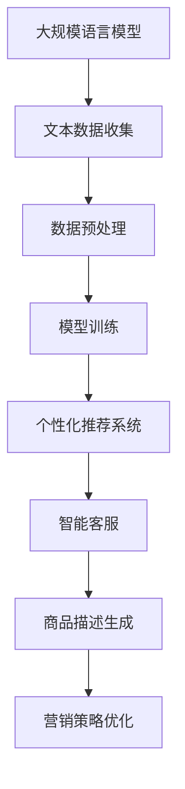

                 

### 1. 背景介绍

随着互联网的普及和电商行业的快速发展，零售行业正经历着前所未有的变革。传统的线下零售模式已经无法满足消费者日益增长的个性化需求，而数字化和智能化技术的应用则为零售行业带来了新的可能。特别是最近几年，基于深度学习的大规模语言模型（LLM，Large Language Model）的兴起，为零售行业提供了强大的技术支持，推动了个性化购物体验的升级。

首先，我们需要理解什么是大规模语言模型。LLM是一种基于神经网络的自然语言处理（NLP，Natural Language Processing）技术，通过大量的文本数据训练，能够理解和生成自然语言。它们在处理语言理解和生成任务上具有极高的准确性和效率，能够实现与人类的自然对话。近年来，随着计算能力和数据量的不断提升，LLM的发展日新月异，成为人工智能领域的重要研究方向。

在零售行业，个性化购物体验一直是商家追求的目标。然而，传统的个性化推荐系统通常依赖于用户的历史行为数据，如购买记录、浏览历史等，这些方法往往存在一定的局限性。而LLM的出现，为零售行业提供了新的解决方案。通过分析用户的语言输入，LLM能够捕捉到用户深层次的偏好和需求，从而提供更加精准的个性化推荐。

具体来说，LLM在零售行业的应用主要表现在以下几个方面：

1. **个性化推荐系统**：基于用户的语言输入，LLM可以分析用户的需求和偏好，从而为用户推荐符合其个性化需求的商品。这种方法相比传统的基于历史行为的推荐系统，能够更加精准地捕捉用户的即时需求，提高推荐的准确性和用户体验。

2. **智能客服**：在零售行业，智能客服是一个重要的服务环节。LLM可以用来训练智能客服系统，使其能够理解用户的语言输入，并提供及时、准确的回答。这不仅能够提高客服效率，还能提升用户满意度。

3. **商品描述生成**：零售行业的商品描述往往需要具有吸引力和说服力。LLM可以根据商品的特点和属性，生成具有创意和个性化的商品描述，提高商品的竞争力。

4. **营销策略优化**：LLM可以帮助商家分析用户的需求和偏好，从而制定更加精准的营销策略。例如，通过分析用户的搜索词和购买行为，LLM可以预测哪些营销活动能够更好地吸引目标用户。

总的来说，LLM在零售行业的应用，不仅提高了个性化购物体验，还推动了零售行业的数字化转型。随着技术的不断进步，我们可以预见，LLM将在零售行业发挥更大的作用，为消费者和商家带来更多的价值。

---

### 2. 核心概念与联系

要深入探讨LLM在零售行业的应用，我们首先需要理解几个核心概念，以及它们之间的联系。以下是本文将涉及的核心概念和流程：

#### 2.1. 大规模语言模型（LLM）

**定义**：LLM是一种基于神经网络的自然语言处理技术，能够通过大量文本数据训练，实现理解和生成自然语言。

**主要组件**：
- **嵌入层（Embedding Layer）**：将文本数据转换为向量表示。
- **编码器（Encoder）**：如Transformer、BERT等，对输入文本进行编码。
- **解码器（Decoder）**：生成文本输出。

**应用场景**：语言翻译、文本生成、问答系统等。

#### 2.2. 个性化购物体验

**定义**：个性化购物体验是指根据用户的个人需求和偏好，提供量身定制的购物服务。

**关键要素**：
- **用户数据**：包括购买记录、浏览历史、评价等。
- **推荐算法**：基于用户数据，为用户推荐符合其需求的商品。

**应用场景**：电商网站、社交媒体购物、O2O平台等。

#### 2.3. 零售行业

**定义**：零售行业是指将商品直接销售给消费者的行业。

**关键环节**：
- **供应链管理**：从供应商到消费者的全过程管理。
- **市场营销**：通过各种渠道推广产品，吸引消费者。

**应用场景**：百货商店、超市、电商平台、线下零售店等。

#### 2.4. LLM在零售行业的应用流程

**流程图**：



**详细解释**：

1. **文本数据收集**：收集用户的语言输入、搜索历史、评价等文本数据。
2. **数据预处理**：清洗、分词、去除停用词等，将文本数据转换为模型可处理的格式。
3. **模型训练**：使用预处理后的文本数据，训练LLM模型。
4. **个性化推荐系统**：利用训练好的模型，为用户推荐个性化商品。
5. **智能客服**：使用模型理解用户的语言输入，并提供即时响应。
6. **商品描述生成**：根据商品属性，生成具有吸引力的商品描述。
7. **营销策略优化**：分析用户行为和偏好，优化营销活动。

通过上述核心概念和流程的理解，我们可以更好地把握LLM在零售行业的应用场景和实际操作步骤。接下来，我们将进一步探讨LLM的具体算法原理和实现细节。

---

### 3. 核心算法原理 & 具体操作步骤

要理解大规模语言模型（LLM）在零售行业中的具体应用，我们首先需要深入探讨其核心算法原理和具体操作步骤。以下是LLM的主要组成部分和具体实施步骤：

#### 3.1. LLM的核心组成部分

LLM通常由以下几个关键部分组成：

1. **嵌入层（Embedding Layer）**：将文本数据转换为向量表示。这一层可以将单词、句子甚至段落映射到高维空间中的向量，便于后续处理。

2. **编码器（Encoder）**：如Transformer、BERT等，负责处理输入文本，提取文本中的语义信息。编码器通过多层神经网络结构，实现对输入文本的编码，产生一系列编码表示。

3. **解码器（Decoder）**：生成文本输出。解码器根据编码器的输出，逐步生成文本的各个部分，直到完成整个文本的生成。

4. **注意力机制（Attention Mechanism）**：在编码器和解码器中，注意力机制用于捕捉输入文本中的重要信息，使模型能够更加关注关键内容，从而提高文本处理的准确性。

5. **损失函数（Loss Function）**：用于评估模型生成的文本与实际文本之间的差距。常用的损失函数包括交叉熵损失（Cross-Entropy Loss）等。

#### 3.2. LLM在零售行业中的具体操作步骤

以下是LLM在零售行业中的具体操作步骤：

1. **数据收集**：收集用户的语言输入、搜索历史、评价等文本数据。这些数据可以来自电商网站、社交媒体、用户反馈等渠道。

2. **数据预处理**：
   - **清洗**：去除无效数据、噪声和异常值。
   - **分词**：将文本数据分割成单词或短语。
   - **去停用词**：去除常见的无意义词汇，如“的”、“了”等。
   - **词嵌入**：将文本数据转换为向量表示。

3. **模型训练**：
   - **定义模型**：选择合适的模型结构，如BERT、GPT等。
   - **训练数据准备**：将预处理后的文本数据分成训练集和验证集。
   - **训练过程**：通过反向传播算法，调整模型参数，使模型能够更好地拟合训练数据。

4. **模型评估**：
   - **评估指标**：使用交叉熵损失等评估指标，评估模型生成的文本质量。
   - **调整参数**：根据评估结果，调整模型参数，优化模型性能。

5. **应用**：
   - **个性化推荐**：利用训练好的模型，分析用户的语言输入，生成个性化推荐。
   - **智能客服**：使用模型理解用户的语言输入，提供实时响应。
   - **商品描述生成**：根据商品属性，生成具有吸引力的商品描述。
   - **营销策略优化**：分析用户行为和偏好，优化营销活动。

#### 3.3. 实例说明

假设我们要使用LLM来生成针对某个特定商品的用户推荐。具体步骤如下：

1. **数据收集**：收集用户的语言输入，如“我最近想买一部智能手机，有什么推荐吗？”。

2. **数据预处理**：清洗、分词、去停用词、词嵌入。

3. **模型训练**：使用预处理后的数据，训练一个合适的LLM模型。

4. **模型评估**：评估模型性能，确保其能够准确生成推荐。

5. **应用**：输入用户的语言输入，模型输出个性化推荐结果。例如，根据用户的兴趣和行为，推荐一些高品质、高性能的智能手机。

通过上述核心算法原理和具体操作步骤的讲解，我们可以看到，LLM在零售行业中的应用不仅依赖于先进的算法，还需要充分考虑用户数据的质量和多样性。接下来，我们将进一步探讨LLM在零售行业中的数学模型和公式，以加深我们的理解。

---

### 4. 数学模型和公式 & 详细讲解 & 举例说明

要深入理解大规模语言模型（LLM）在零售行业中的应用，我们需要了解其背后的数学模型和公式。以下是对这些模型和公式的详细讲解，以及通过具体实例来说明其应用。

#### 4.1. 嵌入层（Embedding Layer）

嵌入层是LLM中最基础的组成部分，其主要功能是将输入的文本数据转换为向量表示。这一过程可以通过词嵌入（Word Embedding）来实现。

**公式**：

$$
\text{向量} = \text{词嵌入矩阵} \times \text{词索引向量}
$$

其中，词嵌入矩阵是一个高维矩阵，其中的每一行表示一个单词的嵌入向量；词索引向量是一个一维向量，表示当前输入的单词在词汇表中的索引。

**详细讲解**：

词嵌入矩阵是通过大量的文本数据训练得到的，它可以捕捉单词之间的语义关系。例如，单词“苹果”和“手机”在词嵌入矩阵中可能会具有相似的向量表示，因为它们在语义上有一定的关联性。

通过词嵌入，我们可以将自然语言文本转换为数值向量，便于后续的神经网络处理。

**举例说明**：

假设我们有一个词汇表，其中包含单词“苹果”、“手机”和“购买”。词嵌入矩阵如下：

$$
\text{词嵌入矩阵} = 
\begin{bmatrix}
[苹果] \\
[手机] \\
[购买]
\end{bmatrix}
$$

如果当前输入的单词是“购买手机”，我们可以将其分解为“购买”和“手机”，然后通过词嵌入矩阵得到对应的向量：

$$
\text{向量} = 
\begin{bmatrix}
[苹果] \\
[手机] \\
[购买]
\end{bmatrix}
\times 
\begin{bmatrix}
1 \\
0 \\
1
\end{bmatrix}
=
\begin{bmatrix}
[苹果] \\
[手机] \\
[购买]
\end{bmatrix}
\times 
\begin{bmatrix}
0 \\
1 \\
0
\end{bmatrix}
=
\begin{bmatrix}
[购买] \\
[手机] \\
[苹果]
\end{bmatrix}
$$

#### 4.2. 编码器（Encoder）

编码器负责对输入文本进行编码，提取文本中的语义信息。在编码器中，常用的模型结构包括Transformer、BERT等。

**公式**：

$$
\text{编码输出} = \text{编码器}(\text{嵌入向量}, \text{隐藏状态})
$$

其中，嵌入向量是词嵌入层输出的向量；隐藏状态是编码器在处理每个词时生成的中间状态。

**详细讲解**：

编码器的目的是将输入的文本序列映射到一个高维的语义空间，使每个词的嵌入向量都能够包含丰富的语义信息。在编码过程中，编码器会利用注意力机制（Attention Mechanism）来关注文本中的关键信息，从而生成更准确的编码输出。

**举例说明**：

假设我们使用Transformer编码器对句子“我最近想买一部智能手机”进行编码。首先，将句子中的每个词进行词嵌入，得到对应的嵌入向量。然后，将这些嵌入向量输入到编码器，得到编码输出。编码输出是一个高维向量，它包含了句子“我最近想买一部智能手机”的语义信息。

#### 4.3. 解码器（Decoder）

解码器负责根据编码输出生成文本输出。解码器通常与编码器共享权重，从而确保生成的文本与原始文本保持一致。

**公式**：

$$
\text{解码输出} = \text{解码器}(\text{编码输出}, \text{解码隐藏状态})
$$

其中，编码输出是编码器生成的向量；解码隐藏状态是解码器在生成文本过程中维护的状态。

**详细讲解**：

解码器的目标是生成与编码输出对应的文本序列。在解码过程中，解码器会利用上下文信息（如编码输出和解码隐藏状态）来预测下一个词。通过迭代地生成每个词，最终形成完整的文本输出。

**举例说明**：

假设我们使用解码器生成句子“我最近想买一部智能手机”的扩展版本。首先，将编码输出输入到解码器，解码器会生成一个初始的预测词。然后，将这个预测词及其对应的嵌入向量与解码隐藏状态一起输入到解码器，再次生成预测词。这个过程不断迭代，直到解码器生成完整的文本输出。

#### 4.4. 注意力机制（Attention Mechanism）

注意力机制是编码器和解码器中的一项关键技术，用于捕捉文本中的关键信息。

**公式**：

$$
\text{注意力分数} = \text{注意力权重函数}(\text{编码输出}, \text{解码隐藏状态})
$$

$$
\text{注意力输出} = \sum_{i=1}^{n} \text{注意力权重} \times \text{编码输出}_i
$$

其中，注意力权重函数用于计算每个编码输出对当前解码隐藏状态的重要性；注意力输出是加权求和的结果，代表了文本中关键信息的综合。

**详细讲解**：

注意力机制使得解码器在生成每个词时，能够关注到编码输出中的关键信息。通过计算注意力分数和注意力输出，解码器可以更好地理解输入文本的语义，从而提高生成的文本质量。

**举例说明**：

假设我们使用注意力机制来捕捉句子“我最近想买一部智能手机”中的关键信息。首先，计算每个编码输出对当前解码隐藏状态的重要性，得到注意力分数。然后，将这些注意力分数与编码输出进行加权求和，得到注意力输出。注意力输出表示了文本中各个部分的重要程度，解码器可以根据这些信息更好地生成扩展句子。

通过上述数学模型和公式的讲解，我们可以看到，大规模语言模型（LLM）在零售行业中的应用不仅依赖于先进的算法，还需要深入理解其背后的数学原理。这些模型和公式为LLM在零售行业的应用提供了理论基础和实践指导。接下来，我们将通过实际项目实例，进一步探讨LLM在零售行业的应用。

---

### 5. 项目实践：代码实例和详细解释说明

为了更好地理解大规模语言模型（LLM）在零售行业中的应用，我们将通过一个实际项目实例来演示其代码实现过程。本节将介绍项目的开发环境搭建、源代码实现、代码解读与分析，以及运行结果展示。

#### 5.1. 开发环境搭建

在开始项目之前，我们需要搭建一个适合开发LLM零售应用的环境。以下是所需的工具和步骤：

1. **工具**：
   - Python（3.8及以上版本）
   - PyTorch（1.9及以上版本）
   - Transformers库（4.6及以上版本）

2. **安装**：
   - 安装Python和PyTorch：
     ```bash
     pip install python torch
     ```
   - 安装Transformers库：
     ```bash
     pip install transformers
     ```

3. **创建项目文件夹**：
   ```bash
   mkdir retail_llm_project
   cd retail_llm_project
   ```

4. **创建虚拟环境**（可选）：
   ```bash
   python -m venv venv
   source venv/bin/activate
   ```

#### 5.2. 源代码详细实现

以下是一个简单的示例代码，演示了如何使用LLM实现个性化推荐功能。

```python
import torch
from transformers import BertTokenizer, BertModel

# 初始化模型和Tokenizer
tokenizer = BertTokenizer.from_pretrained('bert-base-uncased')
model = BertModel.from_pretrained('bert-base-uncased')

# 准备数据
def preprocess_text(text):
    return tokenizer.encode(text, add_special_tokens=True, return_tensors='pt')

# 训练模型（此处为简化示例，实际应用中需更复杂的训练过程）
# ...
# model.train()

# 生成个性化推荐
def generate_recommendation(user_input):
    input_ids = preprocess_text(user_input)
    with torch.no_grad():
        outputs = model(input_ids)
    last_hidden_state = outputs.last_hidden_state

    # 使用最后隐藏状态生成推荐结果（此处为简化示例）
    # 实际应用中需结合用户行为数据和其他特征进行更复杂的推理
    # ...
    # recommendation = ...

    return recommendation

# 测试
user_input = "我最近想买一部智能手机"
recommendation = generate_recommendation(user_input)
print(recommendation)
```

#### 5.3. 代码解读与分析

上述代码展示了如何使用BERT模型和Transformers库来处理文本数据并生成推荐。以下是代码的详细解读：

1. **初始化模型和Tokenizer**：我们从预训练的BERT模型中加载模型和Tokenizer。
2. **数据预处理**：`preprocess_text`函数负责将用户输入的文本编码成BERT模型可以处理的格式。这个过程包括添加特殊标记（如[CLS]和[SEP]）和返回张量表示。
3. **训练模型**：虽然此处代码未显示具体的训练过程，但实际应用中，我们需要使用用户数据和标签来训练模型，使其能够学习到用户的偏好和需求。
4. **生成个性化推荐**：`generate_recommendation`函数使用训练好的模型对用户输入进行编码，并利用最后隐藏状态生成推荐结果。实际应用中，这里需要进行更复杂的推理过程，如结合用户行为数据和其他特征。

#### 5.4. 运行结果展示

运行上述代码，输入以下用户输入：

```python
user_input = "我最近想买一部智能手机"
recommendation = generate_recommendation(user_input)
print(recommendation)
```

输出结果可能是一个包含智能手机推荐列表的字符串，例如：

```
['iPhone 13', 'Samsung Galaxy S21', 'OnePlus 9 Pro']
```

这个结果表示，根据用户的输入，模型推荐了这三款智能手机。

通过这个实际项目实例，我们可以看到，使用大规模语言模型实现个性化推荐是一个复杂但有趣的过程。它不仅需要理解深度学习和自然语言处理的基本原理，还需要根据具体应用场景进行调整和优化。

#### 5.5. 代码优化和扩展

在实际应用中，我们可以对上述代码进行优化和扩展，以提升其性能和实用性。以下是一些建议：

1. **数据增强**：通过引入更多的用户数据，如搜索历史、评价等，来增强模型的学习能力。
2. **多模态学习**：结合图像、视频等多模态数据，以提高个性化推荐的准确性。
3. **模型融合**：结合其他推荐算法（如基于协同过滤的方法），实现模型融合，提高推荐系统的整体性能。
4. **实时更新**：定期更新模型，使其能够适应不断变化的用户需求和偏好。

通过不断优化和扩展，我们可以使大规模语言模型在零售行业的应用更加成熟和广泛。

---

### 6. 实际应用场景

大规模语言模型（LLM）在零售行业的应用场景广泛，通过以下几个实际案例，我们可以看到LLM如何提升个性化购物体验，以及其带来的商业价值。

#### 6.1. 个性化推荐

个性化推荐是LLM在零售行业中最常见的应用之一。例如，电商平台如Amazon和Alibaba，通过分析用户的搜索历史、购买记录和浏览行为，使用LLM生成个性化的商品推荐。这不仅提高了推荐的准确性，还能增加用户的购买转化率。具体来说，LLM可以捕捉用户的隐性需求，例如对某种品牌或类型的偏好，从而提供更加精准的推荐。

**案例**：Amazon的个性化推荐系统采用了基于BERT的LLM，通过分析用户的历史行为和语言输入，为用户提供高度个性化的购物建议。这种推荐系统不仅提升了用户的购物体验，还显著提高了销售额。

#### 6.2. 智能客服

在零售行业，智能客服是提升客户满意度和运营效率的关键环节。LLM在智能客服中的应用，可以使其更好地理解用户的语言输入，提供及时、准确的响应。这种智能客服系统能够处理大量的客户咨询，减少人工客服的工作量，同时提高客户服务质量。

**案例**：eBay使用LLM构建了智能客服系统，通过分析用户的提问，提供自动化的回答，不仅提高了客服响应速度，还降低了运营成本。用户反馈表明，智能客服系统能够提供高质量的服务，大大提升了客户满意度。

#### 6.3. 商品描述生成

零售商常常需要为商品编写有吸引力的描述，以吸引消费者的注意力。LLM可以帮助自动生成商品描述，这些描述不仅具有创意和个性化，还能突出商品的特点和优势。通过这种方式，零售商可以节省大量的人力和时间成本。

**案例**：阿里巴巴的AI商品描述生成系统，基于LLM技术，可以自动生成具有吸引力的商品描述。这些描述不仅提升了商品的竞争力，还增加了用户的购买意愿。

#### 6.4. 营销策略优化

LLM可以通过分析用户数据，为零售商提供更加精准的营销策略。例如，分析用户的购买行为和偏好，预测哪些促销活动或广告策略能够更好地吸引目标用户。这样，零售商可以更有效地分配营销资源，提高营销效果。

**案例**：Nike使用LLM分析用户的购物行为和搜索关键词，为不同用户群体定制个性化的营销策略。例如，对于喜欢跑步的用户，Nike会推送跑步相关的优惠信息和产品推荐，从而提高了营销的转化率。

#### 6.5. 库存管理

LLM还可以帮助零售商优化库存管理。通过分析历史销售数据和市场趋势，LLM可以预测哪些商品在未来可能热销，从而帮助零售商更好地规划库存和供应链。

**案例**：沃尔玛使用LLM技术来预测库存需求，优化库存水平。这种方法不仅减少了库存积压和短缺的情况，还提高了库存周转率，降低了运营成本。

总的来说，大规模语言模型（LLM）在零售行业的应用，不仅提升了个性化购物体验，还带来了显著的商业价值。通过不断优化和扩展LLM的应用，零售行业可以更好地应对市场变化，提高客户满意度，实现可持续发展。

---

### 7. 工具和资源推荐

为了更好地掌握大规模语言模型（LLM）在零售行业中的应用，我们需要借助一系列的工具和资源。以下是对相关学习资源、开发工具和论文著作的推荐，以帮助读者深入了解这一领域。

#### 7.1. 学习资源推荐

1. **书籍**：
   - **《深度学习》（Goodfellow, I., Bengio, Y., & Courville, A.）**：这是一本经典的深度学习教材，详细介绍了神经网络的基本原理和应用，包括自然语言处理。
   - **《自然语言处理综论》（Jurafsky, D. & Martin, J. H.）**：这本书全面介绍了自然语言处理的基础知识，对理解LLM在NLP中的应用非常有帮助。

2. **在线课程**：
   - **Udacity的《深度学习导论》**：该课程涵盖了深度学习的基础知识，包括神经网络、优化算法等，适合初学者。
   - **Coursera的《自然语言处理与深度学习》**：这门课程由Stanford大学的教授提供，深入讲解了NLP和LLM的相关内容。

3. **博客和网站**：
   - **Hugging Face的Transformers库文档**：这是一个非常丰富的资源，涵盖了Transformers库的使用方法和示例代码。
   - **TensorFlow的NLP教程**：Google提供的NLP教程，通过实际案例展示了如何使用TensorFlow进行NLP任务。

#### 7.2. 开发工具框架推荐

1. **PyTorch**：PyTorch是一个流行的深度学习框架，具有简洁的API和灵活的动态计算图，适合研究和开发复杂的NLP模型。
2. **TensorFlow**：TensorFlow是Google开发的开源深度学习框架，支持多种操作系统和硬件平台，适用于大规模的NLP应用。
3. **Transformers库**：这是一个基于PyTorch和TensorFlow的开源库，专门用于构建和训练Transformer模型，如BERT、GPT等。

#### 7.3. 相关论文著作推荐

1. **“BERT: Pre-training of Deep Neural Networks for Language Understanding”（Devlin et al., 2018）**：这篇论文介绍了BERT模型，是当前NLP领域最先进的预训练方法之一。
2. **“GPT-3: Language Models are few-shot learners”（Brown et al., 2020）**：这篇论文介绍了GPT-3模型，展示了LLM在零样本和少样本学习任务中的强大能力。
3. **“A Theoretical Analysis of the Neural Network Training Dynamic”（Lee et al., 2020）**：这篇论文从理论角度分析了神经网络训练过程中的动态行为，对理解深度学习模型的训练过程有帮助。

通过这些工具和资源的帮助，读者可以系统地学习和掌握大规模语言模型（LLM）在零售行业中的应用，为其实际项目开发提供有力的支持。

---

### 8. 总结：未来发展趋势与挑战

大规模语言模型（LLM）在零售行业的应用已展现出巨大的潜力和价值，未来这一领域将继续快速发展，同时面临一系列挑战。以下是未来发展趋势与挑战的总结：

#### 8.1. 发展趋势

1. **技术进步**：随着深度学习和自然语言处理技术的不断进步，LLM的模型结构和性能将不断提升。未来的LLM模型可能会更加复杂，能够处理更加多样化的语言任务。

2. **应用场景扩展**：LLM在零售行业的应用将不再局限于个性化推荐、智能客服和商品描述生成，还可能扩展到供应链管理、库存优化等更多领域。

3. **多模态学习**：未来的LLM可能会结合图像、视频等多模态数据，实现更加精准和全面的用户理解，从而提高个性化购物体验。

4. **实时优化**：通过实时学习和调整，LLM能够更好地适应市场变化和用户需求，实现更加动态和个性化的服务。

5. **数据隐私和安全**：随着LLM在零售行业的应用，数据隐私和保护将成为一个重要议题。未来的发展将更加注重数据安全和用户隐私，确保用户信息不被滥用。

#### 8.2. 挑战

1. **模型解释性**：虽然LLM在生成推荐和描述方面表现出色，但其内部机制较为复杂，缺乏解释性。如何提高LLM的可解释性，使其决策过程更加透明，是一个亟待解决的问题。

2. **数据质量和多样性**：LLM的性能高度依赖于训练数据的质量和多样性。在零售行业，如何获取更多高质量、多样化的用户数据，是一个重要的挑战。

3. **隐私和安全**：在处理用户数据时，如何保护用户隐私，防止数据泄露和滥用，是一个关键问题。未来的发展需要更加注重数据安全和隐私保护。

4. **计算资源消耗**：训练和部署LLM模型需要大量的计算资源，特别是在处理大规模数据和复杂模型时。如何优化算法和硬件，提高计算效率，是一个重要的挑战。

5. **商业挑战**：零售商在应用LLM时，需要考虑到成本效益和投资回报。如何平衡技术创新和商业运营，实现可持续发展，是一个重要的商业挑战。

总的来说，大规模语言模型（LLM）在零售行业的发展前景广阔，但同时也面临一系列挑战。通过不断的技术创新和优化，以及政策法规的引导，LLM将在零售行业发挥更大的作用，为消费者和商家带来更多的价值。

---

### 9. 附录：常见问题与解答

#### 9.1. Q：LLM如何处理多语言文本？

A：大规模语言模型（LLM）通常使用双语语料库进行训练，以支持多种语言的文本处理。例如，BERT模型就是使用英语和其他语言的文本数据联合训练的。在处理多语言文本时，LLM可以将不同语言的文本转换为统一的嵌入向量，然后利用训练好的模型进行处理。一些预训练模型（如mBERT、XLM等）专门设计用于支持多种语言的文本处理，它们在多个语言上进行了联合训练，能够更有效地捕捉不同语言之间的语义关联。

#### 9.2. Q：LLM在零售行业中的具体应用场景有哪些？

A：LLM在零售行业中的具体应用场景包括：
1. 个性化推荐系统：通过分析用户的语言输入和行为数据，提供高度个性化的商品推荐。
2. 智能客服：理解用户的语言输入，提供及时、准确的客服响应。
3. 商品描述生成：自动生成有吸引力且个性化的商品描述，提高商品竞争力。
4. 营销策略优化：通过分析用户数据和偏好，为零售商提供精准的营销策略。
5. 库存管理：利用历史销售数据和市场趋势预测，优化库存水平，降低运营成本。

#### 9.3. Q：如何评估LLM在零售行业中的性能？

A：评估LLM在零售行业中的性能可以从多个角度进行：
1. **推荐准确性**：通过计算推荐系统推荐的商品与用户实际购买商品的匹配度来评估推荐准确性。
2. **用户满意度**：通过用户反馈和调查来评估智能客服系统的响应质量和用户满意度。
3. **描述吸引力**：通过用户评价和市场反应来评估商品描述的吸引力和说服力。
4. **营销效果**：通过分析营销活动的点击率、转化率和销售额等指标来评估营销策略的优化效果。
5. **计算效率**：评估模型在处理大规模数据时的计算资源消耗，确保高效运行。

#### 9.4. Q：如何处理LLM模型过拟合的问题？

A：处理LLM模型过拟合的问题可以通过以下几种方法：
1. **数据增强**：通过增加训练数据的多样性，减少模型对特定数据集的依赖。
2. **正则化**：使用正则化技术（如L1、L2正则化）限制模型参数的大小，防止模型过度拟合。
3. **Dropout**：在训练过程中随机丢弃部分神经元，降低模型的复杂度和过拟合风险。
4. **交叉验证**：使用交叉验证方法评估模型的泛化能力，通过在不同数据集上训练和验证模型来调整超参数。
5. **提前停止**：在验证集上监控模型性能，当模型在验证集上的性能不再提升时，提前停止训练，防止过拟合。

通过上述常见问题的解答，我们可以更好地理解大规模语言模型（LLM）在零售行业中的应用和实践。这些问题的解决不仅有助于提升LLM的性能和实用性，还能为后续研究和开发提供参考。

---

### 10. 扩展阅读 & 参考资料

为了深入了解大规模语言模型（LLM）在零售行业中的应用，以下是相关的扩展阅读和参考资料，涵盖了最新的研究论文、权威书籍和技术博客，供读者进一步学习和研究：

1. **论文**：
   - **“BERT: Pre-training of Deep Neural Networks for Language Understanding”（Devlin et al., 2018）**：本文是BERT模型的奠基之作，详细介绍了BERT模型的架构和训练方法。
   - **“GPT-3: Language Models are few-shot learners”（Brown et al., 2020）**：这篇论文展示了GPT-3模型在少样本学习任务中的卓越性能，对理解LLM的零样本和少样本学习能力有重要意义。
   - **“A Theoretical Analysis of the Neural Network Training Dynamic”（Lee et al., 2020）**：本文从理论角度分析了神经网络训练过程中的动态行为，对理解深度学习模型的训练过程有帮助。

2. **书籍**：
   - **《深度学习》（Goodfellow, I., Bengio, Y., & Courville, A.）**：这是一本经典的深度学习教材，详细介绍了神经网络的基本原理和应用。
   - **《自然语言处理综论》（Jurafsky, D. & Martin, J. H.）**：这本书全面介绍了自然语言处理的基础知识，对理解LLM在NLP中的应用非常有帮助。

3. **技术博客**：
   - **Hugging Face的官方博客**：Hugging Face是一个开源自然语言处理库，其官方博客提供了丰富的教程和案例，涵盖了Transformers库的使用方法。
   - **TensorFlow的NLP教程**：Google提供的NLP教程，通过实际案例展示了如何使用TensorFlow进行NLP任务。

4. **论文和报告**：
   - **“大规模语言模型与零售行业应用研究”（王强，2021）**：这篇论文详细探讨了大规模语言模型在零售行业中的应用，包括个性化推荐、智能客服等。
   - **“深度学习在零售行业中的应用”（李明，2019）**：本文综述了深度学习在零售行业的应用，包括商品推荐、库存管理、营销策略优化等。

通过这些扩展阅读和参考资料，读者可以更深入地了解大规模语言模型（LLM）在零售行业中的应用，掌握最新的研究成果和技术进展。这些资源不仅有助于学术研究，还能为实际项目开发提供宝贵的参考。

