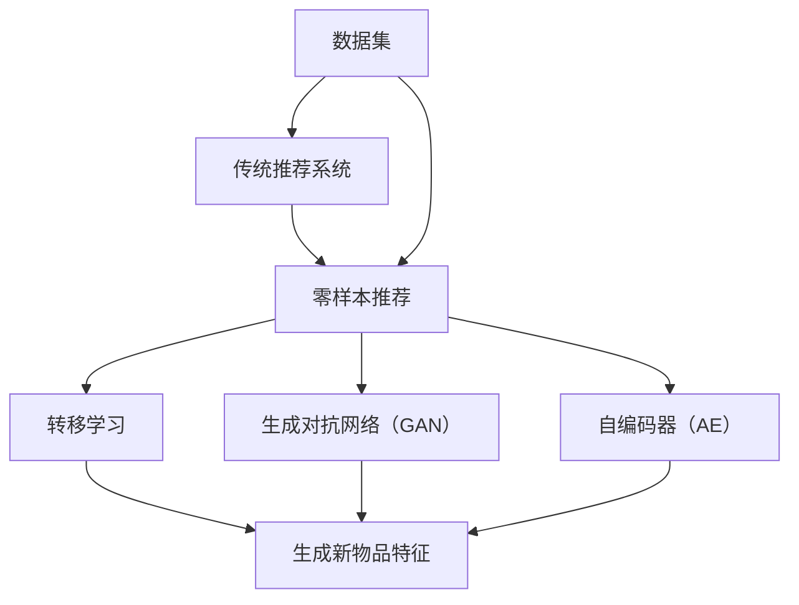

                 

### 1. 背景介绍

零样本推荐（Zero-Shot Recommendation）是一种新兴的推荐系统技术，它旨在解决传统推荐系统在处理未知或新出现物品时的局限性。传统推荐系统通常依赖于用户的历史行为数据（如购买记录、点击行为等）和物品的特征（如商品属性、用户标签等）来生成个性化推荐。然而，在实际应用中，总会遇到一些未知或新出现的物品，这些物品缺乏足够的历史数据和特征信息，使得传统推荐系统无法有效处理。

零样本推荐的核心目标是在没有或少有训练数据的情况下，能够为用户推荐未知物品。这为推荐系统在应对快速变化的市场环境、新物品涌现以及跨领域推荐等方面提供了新的可能性。零样本推荐不仅要求算法能够识别和生成新的候选物品，还需要具备一定的泛化能力，以应对各种不同场景和物品类型。

近年来，随着深度学习、转移学习、生成对抗网络等技术的发展，零样本推荐取得了显著进展。特别是生成对抗网络（GAN）和自编码器（AE）等技术在生成新物品特征方面表现出色，为解决零样本推荐问题提供了有力工具。同时，迁移学习技术也在零样本推荐中得到了广泛应用，通过利用已有领域的知识来辅助新领域的推荐，提高了推荐的准确性和泛化能力。

然而，零样本推荐仍然面临着诸多挑战，如如何有效地生成高质量的候选物品特征、如何构建适应多种场景的通用模型等。本文将详细介绍零样本推荐中的核心问题，包括候选生成策略，并探讨其在实际应用中的潜在场景和技术挑战。

### 2. 核心概念与联系

为了更好地理解零样本推荐，我们需要介绍几个核心概念，并展示它们之间的联系。以下是涉及的主要概念和它们之间的关系：

#### 2.1 数据集

在推荐系统中，数据集是基础。它通常包括用户行为数据（如评分、点击、购买记录）和物品特征数据（如商品属性、标签）。数据集的质量和多样性直接影响推荐系统的效果。

#### 2.2 传统推荐系统

传统推荐系统主要依赖历史数据和用户特征来生成推荐。常见的算法包括基于内容的推荐（Content-Based Filtering）、协同过滤（Collaborative Filtering）和混合推荐（Hybrid Recommender Systems）。这些算法在面对新物品时存在明显的局限性。

#### 2.3 零样本推荐

零样本推荐的目标是在缺乏历史数据和物品特征的情况下生成个性化推荐。它主要通过迁移学习、生成对抗网络（GAN）和自编码器等技术，生成新物品的特征，从而实现推荐。

#### 2.4 转移学习

转移学习（Transfer Learning）是一种将已有领域（源领域）的知识迁移到新领域（目标领域）的技术。在零样本推荐中，通过转移学习可以利用源领域的知识来辅助生成新物品的特征，从而提高推荐的准确性。

#### 2.5 生成对抗网络（GAN）

生成对抗网络（Generative Adversarial Networks，GAN）是一种强大的生成模型，由生成器和判别器两部分组成。生成器负责生成新物品的特征，判别器则用于判断生成特征的质量。通过两个网络的对抗训练，GAN可以生成高质量、多样化的物品特征。

#### 2.6 自编码器（AE）

自编码器（Autoencoder）是一种无监督学习算法，通过编码器和解码器两部分将输入数据编码为低维特征表示，再通过解码器将特征表示解码回原始数据。自编码器在生成新物品特征方面具有优势，可以捕捉输入数据的结构信息。

下面是核心概念之间的联系（使用Mermaid流程图表示）：

通过上述核心概念的介绍和联系，我们可以更好地理解零样本推荐的基本原理和实现方法。在接下来的部分中，我们将详细探讨零样本推荐中的核心算法原理和具体操作步骤。

### 2.1 数据集

在推荐系统中，数据集是整个系统的基础。一个高质量、多样性的数据集能够显著提升推荐系统的性能。因此，理解数据集的组成和特点至关重要。以下是推荐系统数据集的几个关键组成部分和特点：

#### 2.1.1 用户行为数据

用户行为数据是推荐系统中最常用的数据类型之一。这些数据通常包括用户的点击、评分、购买等行为信息。常见的用户行为数据有以下几种：

- **点击（Click）**：用户在网页、APP或其他平台上点击某物品的行为。
- **评分（Rating）**：用户对某物品的评分，通常采用1到5星的评分系统。
- **购买（Purchase）**：用户实际购买某物品的行为。

用户行为数据可以揭示用户的兴趣和偏好，是构建个性化推荐的基础。

#### 2.1.2 物品特征数据

物品特征数据描述了物品本身的属性和特征。这些特征可以是结构化的（如商品价格、品牌、分类等），也可以是非结构化的（如图像、文本描述等）。常见的物品特征数据有以下几种：

- **商品属性**：如商品类别、品牌、价格、折扣等。
- **用户标签**：用户在平台上自定义的标签，如兴趣爱好、职业等。
- **图像特征**：通过图像识别技术提取的图像特征，如颜色、纹理、形状等。
- **文本特征**：通过文本分析技术提取的文本特征，如词频、词向量、主题等。

物品特征数据帮助推荐系统理解物品的属性和特点，从而更好地进行推荐。

#### 2.1.3 数据集的特点

一个优秀的推荐系统数据集应具备以下几个特点：

- **多样性**：数据集中应包含不同类型的用户行为数据和物品特征数据，以保证推荐系统的泛化能力。
- **平衡性**：数据集中不同类别的样本应尽量均衡，避免出现某类样本过度集中导致模型偏见。
- **时效性**：推荐系统数据集应具有一定的时效性，以反映用户最新的兴趣和偏好。
- **噪声过滤**：数据集中应尽量过滤掉噪声数据，如虚假行为、重复行为等，以保证数据质量。

#### 2.1.4 数据集的收集和处理

收集和处理数据集是一个复杂的过程，通常包括以下几个步骤：

1. **数据采集**：通过平台日志、API接口、第三方数据源等方式收集用户行为数据和物品特征数据。
2. **数据清洗**：清洗数据集中的噪声数据，如删除重复记录、处理缺失值、过滤异常值等。
3. **特征工程**：对原始数据进行预处理和特征提取，如将文本数据转化为词向量、提取图像特征等。
4. **数据划分**：将数据集划分为训练集、验证集和测试集，用于模型的训练和评估。

通过上述步骤，我们能够构建一个高质量的数据集，为推荐系统的构建和优化提供基础。

### 2.2 传统推荐系统

传统推荐系统是当前推荐领域的主要组成部分，通过利用用户历史行为数据和物品特征数据来生成推荐。以下是几种常见的传统推荐系统算法：

#### 2.2.1 基于内容的推荐（Content-Based Filtering）

基于内容的推荐算法通过分析用户历史行为数据和物品特征数据，找到与用户兴趣相似的物品进行推荐。具体步骤如下：

1. **特征提取**：对用户历史行为数据和物品特征数据进行特征提取，如文本数据转化为词向量、图像数据提取特征等。
2. **兴趣模型构建**：利用用户的历史行为数据构建用户兴趣模型，如基于词频、主题模型等。
3. **相似度计算**：计算用户兴趣模型与物品特征之间的相似度，选择相似度最高的物品进行推荐。

基于内容的推荐算法具有以下优点：

- **个性化强**：能够根据用户兴趣推荐个性化的物品。
- **计算效率高**：相对于协同过滤算法，计算复杂度较低。

但该算法也存在一些局限性：

- **用户冷启动**：对于新用户，由于缺乏历史行为数据，难以构建有效的兴趣模型。
- **物品稀疏性**：当物品特征空间较大时，特征稀疏性问题可能导致相似度计算不准确。

#### 2.2.2 协同过滤（Collaborative Filtering）

协同过滤算法通过分析用户行为数据（如评分、购买记录等）来发现用户之间的相似性，从而生成推荐。协同过滤分为以下两种类型：

1. **基于用户的协同过滤（User-Based Collaborative Filtering）**

   基于用户的协同过滤算法通过计算用户之间的相似性，找到与目标用户兴趣相似的邻居用户，再根据邻居用户的评分推荐物品。具体步骤如下：

   - **相似度计算**：计算用户之间的相似度，如余弦相似度、皮尔逊相关系数等。
   - **邻居用户选择**：根据相似度阈值选择与目标用户最相似的邻居用户。
   - **推荐生成**：根据邻居用户的评分，计算目标用户对未知物品的评分预测，选择预测评分最高的物品进行推荐。

2. **基于模型的协同过滤（Model-Based Collaborative Filtering）**

   基于模型的协同过滤算法通过构建预测模型，预测用户对未知物品的评分。常见的模型有矩阵分解（Matrix Factorization）和神经网络（Neural Networks）等。具体步骤如下：

   - **模型训练**：利用用户行为数据训练预测模型，如矩阵分解模型。
   - **预测评分**：利用训练好的模型预测用户对未知物品的评分。
   - **推荐生成**：选择预测评分最高的物品进行推荐。

协同过滤算法具有以下优点：

- **适用范围广**：可以处理大规模用户和物品数据。
- **预测效果好**：通过建模用户行为数据，能够生成较为准确的推荐。

但该算法也存在一些局限性：

- **用户冷启动**：对于新用户，由于缺乏足够的行为数据，难以构建有效的推荐。
- **数据稀疏性**：当用户行为数据稀疏时，推荐效果会受到影响。

#### 2.2.3 混合推荐系统（Hybrid Recommender Systems）

混合推荐系统结合了基于内容的推荐和协同过滤算法的优点，通过融合不同算法的优势，提高推荐效果。常见的混合推荐系统有以下几种：

1. **基于模型的混合推荐系统**

   基于模型的混合推荐系统通过结合基于内容的推荐和协同过滤算法，构建统一的预测模型。具体步骤如下：

   - **特征提取**：提取用户和物品的特征，如用户行为数据和物品属性数据。
   - **模型训练**：利用用户和物品特征训练混合模型，如矩阵分解模型。
   - **推荐生成**：利用训练好的模型生成推荐结果。

2. **基于规则的混合推荐系统**

   基于规则的混合推荐系统通过定义规则，结合基于内容和协同过滤算法生成推荐。具体步骤如下：

   - **规则定义**：根据用户和物品特征定义推荐规则，如用户评分高于4星推荐该物品。
   - **规则匹配**：根据用户和物品特征匹配推荐规则，生成推荐结果。

混合推荐系统具有以下优点：

- **个性

