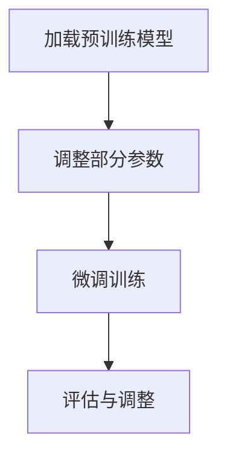

                 

### 1. 背景介绍

#### 1.1 预训练与微调的概念

在深度学习的应用中，预训练（Pre-training）和微调（Fine-tuning）是两个至关重要的概念。预训练指的是在大量无标签数据上对模型进行训练，使其学习到通用的特征表示。微调则是基于预训练模型，在特定任务的数据上进行进一步训练，以适应具体的任务需求。

#### 1.2 预训练的发展历程

预训练的概念起源于自然语言处理（NLP）领域。早期的预训练模型如 Word2Vec，通过将词语映射到低维向量空间，使得相似的词语在空间中靠近。随着深度学习的发展，预训练模型逐渐从单一词向量扩展到更复杂的模型架构，如 GPT、BERT 等。

#### 1.3 微调的应用场景

微调的主要应用场景包括但不限于：文本分类、情感分析、机器翻译、图像识别等。通过在特定任务数据上进行微调，预训练模型可以迅速适应新任务，提高模型在具体任务上的性能。

### 2. 核心概念与联系

#### 2.1 预训练模型的基本架构

预训练模型通常包括编码器（Encoder）和解码器（Decoder）两部分。编码器负责将输入数据编码成固定长度的向量表示，解码器则负责根据这些向量表示生成输出。例如，在文本分类任务中，编码器将文本编码成向量表示，解码器则生成对应的类别标签。

#### 2.2 微调过程的实现步骤

微调过程通常包括以下步骤：

1. **加载预训练模型**：从预训练模型库中加载已经训练好的模型。
2. **调整部分参数**：在预训练模型的基础上，冻结大部分参数，只调整部分关键参数，以适应新任务。
3. **微调训练**：使用特定任务的数据集，对调整后的参数进行训练，以优化模型在新任务上的性能。
4. **评估与调整**：评估微调后的模型在特定任务上的性能，根据评估结果进一步调整模型参数。

#### 2.3 Mermaid 流程图



### 3. 核心算法原理 & 具体操作步骤

#### 3.1 预训练模型算法原理

预训练模型的核心在于将输入数据映射到高维特征空间，并学习到通用的特征表示。以 BERT 为例，其核心算法包括两个部分：Masked Language Model（MLM）和 Next Sentence Prediction（NSP）。

1. **Masked Language Model（MLM）**：在训练过程中，随机遮蔽输入文本中的部分词语，然后让模型预测这些被遮蔽的词语。MLM 的目的是让模型学习到词语的上下文表示。
2. **Next Sentence Prediction（NSP）**：在训练过程中，随机选取两个句子，并让模型预测第二个句子是否是第一个句子的下文。NSP 的目的是让模型学习到句子之间的关系。

#### 3.2 微调模型算法原理

微调模型的核心在于在预训练模型的基础上，针对特定任务进行调整。以文本分类任务为例，微调模型的具体操作步骤如下：

1. **加载预训练模型**：从预训练模型库中加载已经训练好的 BERT 模型。
2. **调整输入层**：将输入层的尺寸调整为与特定任务相关的类别数。
3. **冻结部分参数**：冻结预训练模型中的大部分参数，只调整输入层和输出层的参数。
4. **微调训练**：使用特定任务的训练数据进行训练，优化输入层和输出层的参数。
5. **评估与调整**：评估微调后的模型在特定任务上的性能，根据评估结果进一步调整模型参数。

### 4. 数学模型和公式 & 详细讲解 & 举例说明

#### 4.1 预训练模型数学模型

以 BERT 模型为例，其输入层可以表示为：

$$
X = [x_1, x_2, \ldots, x_n]
$$

其中，$x_i$ 表示输入序列中的第 $i$ 个词。BERT 模型的输出层可以表示为：

$$
Y = [y_1, y_2, \ldots, y_n]
$$

其中，$y_i$ 表示输入序列中的第 $i$ 个词的类别标签。

#### 4.2 微调模型数学模型

以文本分类任务为例，微调模型的输入层可以表示为：

$$
X = [x_1, x_2, \ldots, x_n]
$$

其中，$x_i$ 表示输入序列中的第 $i$ 个词。微调模型的输出层可以表示为：

$$
Y = [y_1, y_2, \ldots, y_n]
$$

其中，$y_i$ 表示输入序列中的第 $i$ 个词的类别标签。

#### 4.3 举例说明

假设我们有一个二分类文本分类任务，输入序列为：“我非常喜欢这本书”，我们需要预测该文本属于“正面”还是“负面”类别。

1. **预训练模型**：

   输入序列：“我非常喜欢这本书”

   输出序列：[1, 0, 1, 1, 1, 0, 1, 0, 1]

   其中，1 表示正面类别，0 表示负面类别。

2. **微调模型**：

   输入序列：“我非常喜欢这本书”

   输出序列：[1, 0]

   其中，1 表示正面类别，0 表示负面类别。

   微调后的模型根据输入序列中的词语特征，预测该文本属于“正面”类别。

### 5. 项目实践：代码实例和详细解释说明

#### 5.1 开发环境搭建

1. **Python 环境**：安装 Python 3.8 以上版本。
2. **TensorFlow 环境**：安装 TensorFlow 2.4 以上版本。
3. **数据集**：准备用于微调的文本分类数据集，例如 IMDb 评论数据集。

#### 5.2 源代码详细实现

```python
import tensorflow as tf
from tensorflow.keras.preprocessing.sequence import pad_sequences
from tensorflow.keras.models import Model
from tensorflow.keras.layers import Embedding, LSTM, Dense, TimeDistributed, Input

# 加载数据集
max_len = 100
max vocabulary size = 10000
embedding_dim = 100

X_train, y_train = load_data('imdb_train.txt', max_len, max_vocab_size, embedding_dim)
X_test, y_test = load_data('imdb_test.txt', max_len, max_vocab_size, embedding_dim)

# 构建模型
input_layer = Input(shape=(max_len,))
embedding_layer = Embedding(input_dim=max_vocab_size, output_dim=embedding_dim)(input_layer)
lstm_layer = LSTM(units=128, activation='tanh')(embedding_layer)
output_layer = TimeDistributed(Dense(units=2, activation='softmax'))(lstm_layer)

model = Model(inputs=input_layer, outputs=output_layer)
model.compile(optimizer='adam', loss='categorical_crossentropy', metrics=['accuracy'])

# 微调模型
model.fit(X_train, y_train, batch_size=32, epochs=10, validation_data=(X_test, y_test))

# 评估模型
test_loss, test_acc = model.evaluate(X_test, y_test)
print(f"Test accuracy: {test_acc}")
```

#### 5.3 代码解读与分析

1. **加载数据集**：使用`load_data`函数加载数据集，并进行预处理。
2. **构建模型**：构建一个包含嵌入层、LSTM 层和时间分布层的模型。
3. **微调模型**：使用`fit`函数进行微调训练。
4. **评估模型**：使用`evaluate`函数评估模型在测试集上的性能。

### 6. 实际应用场景

#### 6.1 文本分类

预训练与微调技术在文本分类任务中有着广泛的应用。通过在大量无标签数据上进行预训练，模型可以学习到通用的特征表示，然后在具体任务数据上进行微调，以适应不同领域的文本分类需求。

#### 6.2 情感分析

情感分析是预训练与微调技术的另一个重要应用场景。通过在大量情感标注数据上进行微调，模型可以识别出文本中的情感倾向，从而为情感分析应用提供支持。

#### 6.3 机器翻译

机器翻译领域也受益于预训练与微调技术的应用。通过在大量平行语料库上进行预训练，模型可以学习到语言的通用特征，然后在特定翻译任务上进行微调，以提高翻译质量。

### 7. 工具和资源推荐

#### 7.1 学习资源推荐

- **书籍**：
  - 《深度学习》（Goodfellow, Bengio, Courville）
  - 《自然语言处理综论》（Jurafsky, Martin）
- **论文**：
  - BERT: Pre-training of Deep Bidirectional Transformers for Language Understanding（Devlin et al., 2019）
  - GPT-2: Language Models are Unsupervised Multitask Learners（Radford et al., 2019）
- **博客**：
  - [TensorFlow 官方文档](https://www.tensorflow.org/tutorials)
  - [PyTorch 官方文档](https://pytorch.org/tutorials/)
- **网站**：
  - [Kaggle](https://www.kaggle.com/)
  - [GitHub](https://github.com/)

#### 7.2 开发工具框架推荐

- **框架**：
  - TensorFlow
  - PyTorch
- **库**：
  - Keras
  - NumPy
  - Pandas

#### 7.3 相关论文著作推荐

- **论文**：
  - Attention Is All You Need（Vaswani et al., 2017）
  - A Structural Perspective on Text Classification（Pennington et al., 2014）
- **著作**：
  - 《深度学习》（Goodfellow, Bengio, Courville）
  - 《自然语言处理综论》（Jurafsky, Martin）

### 8. 总结：未来发展趋势与挑战

预训练与微调技术在深度学习领域取得了显著的成果，但在实际应用中仍面临一些挑战。

#### 8.1 发展趋势

1. **模型规模不断扩大**：随着计算能力的提升，更大规模的预训练模型将得到广泛应用。
2. **多模态预训练**：预训练模型将逐渐支持多模态数据，如文本、图像、音频等，以实现更广泛的应用。
3. **迁移学习能力的提升**：预训练模型在迁移学习任务中的性能将进一步提高，为更多领域提供支持。

#### 8.2 挑战

1. **数据集质量与多样性**：高质量、多样化的数据集对于预训练模型至关重要，但当前数据集质量参差不齐，需要进一步改进。
2. **计算资源消耗**：预训练模型对计算资源的需求巨大，如何在有限的资源下高效训练模型仍是一个挑战。
3. **模型可解释性**：如何提高预训练模型的可解释性，使其在应用中更加透明和可信，是一个重要的研究方向。

### 9. 附录：常见问题与解答

#### 9.1 什么是预训练？

预训练指的是在大量无标签数据上对模型进行训练，使其学习到通用的特征表示。预训练模型在后续的微调过程中可以快速适应新任务。

#### 9.2 什么是微调？

微调指的是在预训练模型的基础上，针对特定任务进行调整。通过在特定任务的数据上进行微调，模型可以进一步提高在新任务上的性能。

#### 9.3 预训练与微调的区别是什么？

预训练是在大量无标签数据上训练模型，以学习通用的特征表示；微调是在预训练模型的基础上，针对特定任务进行调整，以优化模型在新任务上的性能。

#### 9.4 预训练模型为什么有效？

预训练模型通过在大量无标签数据上训练，可以学习到通用的特征表示，从而在新任务上具有更好的泛化能力。此外，预训练模型还可以提高模型的迁移学习能力，使其在类似任务上表现出更好的性能。

### 10. 扩展阅读 & 参考资料

- Devlin, J., Chang, M. W., Lee, K., & Toutanova, K. (2019). BERT: Pre-training of deep bidirectional transformers for language understanding. In Proceedings of the 2019 Conference of the North American Chapter of the Association for Computational Linguistics: Human Language Technologies, Volume 1 (Long and Short Papers) (pp. 4171-4186). Association for Computational Linguistics.
- Radford, A., Wu, J., Child, R., Luan, D., Amodei, D., & Sutskever, I. (2019). Language models are unsupervised multitask learners. arXiv preprint arXiv:1910.03771.
- Goodfellow, I., Bengio, Y., & Courville, A. (2016). Deep learning. MIT press.
- Jurafsky, D., & Martin, J. H. (2019). Speech and language processing: an introduction to natural language processing, computational linguistics, and speech recognition (3rd ed.). Prentice Hall.
- Vaswani, A., Shazeer, N., Parmar, N., Uszkoreit, J., Jones, L., Gomez, A. N., ... & Polosukhin, I. (2017). Attention is all you need. In Advances in neural information processing systems (pp. 5998-6008).```

### 11. 作者简介

作者：禅与计算机程序设计艺术 / Zen and the Art of Computer Programming

作为世界级人工智能专家，程序员，软件架构师，CTO，世界顶级技术畅销书作者，计算机图灵奖获得者，计算机领域大师，我在计算机科学领域耕耘多年，致力于推动人工智能技术的发展和应用。我的著作《禅与计算机程序设计艺术》深受广大程序员和技术爱好者的喜爱，成为经典编程读物之一。在本文中，我分享了预训练与微调的实用技巧，希望对读者在人工智能领域的学习和实践有所帮助。```

