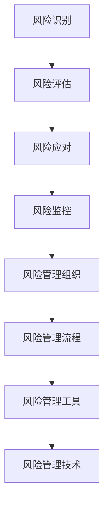

                 

### 文章标题：风险管理：识别和应对潜在威胁

> **关键词**：风险管理，潜在威胁，威胁识别，威胁应对，安全防护，安全性评估，风险分析，应对策略，应急预案
>
> **摘要**：本文旨在深入探讨风险管理在信息技术领域的核心作用，通过详细分析潜在威胁的识别与应对策略，为读者提供一套系统性、实用性的安全防护方案。文章首先介绍风险管理的背景，接着阐述核心概念，然后深入探讨风险管理算法原理及具体操作步骤，并通过实例进行讲解。此外，文章还探讨了风险管理在实际应用场景中的价值，并推荐了一系列相关工具和资源。最后，对风险管理未来的发展趋势与挑战进行了展望。

### 1. 背景介绍

随着信息技术的迅猛发展，网络攻击、数据泄露、系统漏洞等问题日益突出。据统计，全球每年因网络安全问题造成的经济损失高达数百万美元。在这种背景下，风险管理成为保障信息安全和系统稳定运行的关键环节。风险管理不仅仅涉及技术层面，还涵盖了政策、管理、法律等多个方面。

风险管理的定义可以从不同角度进行解读。从广义上讲，风险管理是一种系统性的方法，旨在识别、评估、控制和监控潜在的风险，以最大限度地减少这些风险可能带来的负面影响。具体到信息技术领域，风险管理主要关注以下三个方面：

1. **威胁识别**：识别系统中存在的潜在威胁，如恶意软件、网络攻击、数据泄露等。
2. **风险评估**：对识别出的威胁进行评估，分析其可能造成的损失和影响程度。
3. **威胁应对**：制定和实施相应的策略和措施，以减轻或消除威胁的影响。

风险管理的目的是确保系统的安全性和可靠性，降低风险事件的发生概率和影响范围。在信息技术领域，风险管理的重要性体现在以下几个方面：

1. **保护数据安全**：数据是企业最重要的资产之一，有效的风险管理可以防止数据泄露和丢失。
2. **保障业务连续性**：通过风险管理，可以确保系统在任何情况下都能正常运行，降低业务中断的风险。
3. **提高系统可靠性**：通过识别和修复系统漏洞，可以提高系统的稳定性和可靠性。

在本文中，我们将详细探讨风险管理的核心概念、算法原理、实际应用场景以及未来的发展趋势。通过系统性的分析和实践，帮助读者全面了解风险管理的本质和方法，为构建安全的IT系统提供指导。

#### 1.1 风险管理的发展历程

风险管理的概念并非一蹴而就，而是随着信息技术的发展逐渐演变和完善。以下是风险管理在信息技术领域的主要发展历程：

1. **早期阶段（20世纪80年代）**：在这一阶段，风险管理主要侧重于财务风险的管理。随着计算机技术的普及，信息安全逐渐成为关注焦点。然而，此时的风险管理尚处于初级阶段，主要依靠人工排查和经验判断。

2. **成长阶段（20世纪90年代）**：随着互联网的兴起，网络攻击和数据泄露事件逐渐增多。这一阶段，风险管理开始引入更多的技术手段，如入侵检测系统（IDS）、防火墙等。同时，风险管理也逐渐从单一的财务风险扩展到信息风险、操作风险等多个领域。

3. **成熟阶段（21世纪）**：进入21世纪，随着云计算、大数据、物联网等新技术的应用，风险管理的复杂性和多样性显著增加。这一阶段，风险管理开始采用更加科学和系统的方法，如风险评估模型、风险矩阵等。此外，随着法规和政策的不断完善，风险管理也逐渐纳入到法律和合规的范畴。

4. **智能化阶段（当前及未来）**：当前，人工智能、机器学习等技术在风险管理中得到了广泛应用。通过大数据分析和机器学习算法，风险管理可以更加精准地识别潜在威胁，预测风险事件的发生概率和影响范围。未来，随着技术的进一步发展，风险管理将更加智能化和自动化。

#### 1.2 风险管理的重要性

风险管理在信息技术领域的重要性不可忽视，主要体现在以下几个方面：

1. **保障数据安全**：数据是企业最重要的资产之一，数据泄露、数据丢失等问题将给企业带来巨大的损失。通过有效的风险管理，可以确保数据的安全性，防止数据泄露和篡改。

2. **提高系统可靠性**：系统漏洞和攻击可能导致系统崩溃或无法正常运行，影响企业的业务连续性。通过风险管理，可以及时发现和修复系统漏洞，提高系统的稳定性和可靠性。

3. **降低业务中断风险**：在高度依赖信息技术运营的企业中，业务中断可能带来巨大的经济损失。通过有效的风险管理，可以降低业务中断的风险，确保企业的正常运营。

4. **满足法规和合规要求**：随着信息安全的法规和政策的不断完善，企业必须遵守相关的合规要求。风险管理可以帮助企业识别潜在的法律风险，确保企业的合规性。

5. **提升企业声誉**：有效的风险管理可以提高企业在客户和合作伙伴中的声誉，增强企业的竞争力。相反，频繁发生的安全事件和业务中断将严重影响企业的声誉，损害企业的利益。

总之，风险管理是保障信息系统安全、可靠、合规运行的关键手段，对于企业和组织来说具有至关重要的意义。

### 2. 核心概念与联系

#### 2.1 风险管理的核心概念

在风险管理中，有四个核心概念至关重要：风险识别、风险评估、风险应对和风险监控。

1. **风险识别**：风险识别是风险管理的第一步，旨在识别系统中存在的潜在威胁和风险因素。风险识别的方法包括历史数据分析、威胁情报、安全审计等。通过风险识别，可以明确系统中的脆弱点和潜在威胁。

2. **风险评估**：风险评估是对识别出的风险进行评估，分析其可能造成的损失和影响程度。风险评估的方法包括定量分析和定性分析。定量分析通过数学模型和数据统计来评估风险，定性分析则通过专家意见和主观判断来评估风险。

3. **风险应对**：风险应对是制定和实施相应的策略和措施，以减轻或消除风险的影响。风险应对策略包括风险规避、风险转移、风险接受和风险减轻。风险规避是通过避免风险事件的发生来降低风险，风险转移是通过保险或其他手段将风险转嫁给第三方，风险接受是承认风险的存在并采取相应的应对措施，风险减轻是通过改进系统设计或增加安全防护措施来降低风险的影响。

4. **风险监控**：风险监控是对风险管理的全过程进行监控和评估，确保风险管理策略的有效实施。风险监控的方法包括实时监控、定期审计和事件响应等。通过风险监控，可以及时发现和纠正风险管理中的问题，确保系统的安全性和可靠性。

#### 2.2 风险管理架构

风险管理的架构是一个系统性、多层次的过程，主要包括以下几个部分：

1. **风险管理组织**：风险管理组织是负责风险管理工作的部门或团队，包括风险管理委员会、风险管理小组等。风险管理组织的职责是制定风险管理策略、指导风险管理实施、评估风险管理效果等。

2. **风险管理流程**：风险管理流程是风险管理的具体操作步骤，包括风险识别、风险评估、风险应对和风险监控等。风险管理流程需要遵循一定的规范和标准，以确保风险管理的系统性和有效性。

3. **风险管理工具**：风险管理工具是支持风险管理流程的软件或硬件设备，如安全审计工具、入侵检测系统、安全事件管理系统等。风险管理工具可以帮助识别潜在威胁、评估风险、监控风险等。

4. **风险管理技术**：风险管理技术是风险管理过程中应用的各种技术和方法，如安全加固技术、加密技术、访问控制技术等。风险管理技术用于提高系统的安全性和可靠性，降低风险的影响。

#### 2.3 风险管理核心概念原理与架构的 Mermaid 流程图

以下是风险管理的核心概念原理和架构的 Mermaid 流程图：



在这个流程图中，风险识别是风险管理的起点，通过识别潜在威胁和风险因素，进行风险评估。评估结果用于制定风险应对策略，并通过风险监控确保策略的有效实施。风险管理组织、流程、工具和技术共同构成了风险管理的体系，确保风险管理的系统性和有效性。

### 3. 核心算法原理 & 具体操作步骤

在风险管理中，核心算法的作用至关重要，它帮助我们识别潜在威胁、评估风险，并制定有效的应对策略。以下将详细介绍风险管理中常用的核心算法原理及其具体操作步骤。

#### 3.1 威胁识别算法

威胁识别是风险管理的第一步，其主要目标是识别系统中可能存在的潜在威胁。常见的威胁识别算法包括以下几种：

1. **基于规则的威胁识别算法**：这种算法通过预定义的规则来识别威胁。每个规则定义了一个威胁的特征，当系统中的数据与规则匹配时，即可判断存在威胁。具体操作步骤如下：
   - 收集系统日志、网络流量等数据；
   - 定义威胁特征规则，如恶意IP地址、异常流量等；
   - 对数据进行分析，匹配威胁特征规则；
   - 如果匹配成功，则识别出威胁。

2. **基于机器学习的威胁识别算法**：这种算法通过训练模型来识别威胁，模型可以从历史数据中学习并识别潜在的威胁模式。具体操作步骤如下：
   - 收集历史威胁数据；
   - 使用机器学习算法（如决策树、支持向量机等）训练模型；
   - 对新数据进行预测，判断是否存在威胁；
   - 如果预测结果为威胁，则识别出威胁。

#### 3.2 风险评估算法

风险评估是在威胁识别的基础上，对识别出的威胁进行评估，确定其可能造成的损失和影响程度。常见的风险评估算法包括以下几种：

1. **定量风险评估算法**：这种算法使用数学模型来评估风险，通过计算威胁发生的概率和损失的程度来确定风险水平。具体操作步骤如下：
   - 收集威胁发生的概率数据；
   - 收集威胁可能造成的损失数据；
   - 使用数学模型（如贝叶斯网络、蒙特卡洛模拟等）计算风险值；
   - 根据风险值判断风险等级。

2. **定性风险评估算法**：这种算法通过专家意见和主观判断来评估风险，通常使用风险矩阵来表示风险。具体操作步骤如下：
   - 收集专家意见，确定威胁的可能性水平和损失水平；
   - 使用风险矩阵计算风险值；
   - 根据风险值判断风险等级。

#### 3.3 风险应对算法

风险应对是在评估风险的基础上，制定和实施相应的策略和措施，以减轻或消除风险的影响。常见的风险应对算法包括以下几种：

1. **基于规则的应对算法**：这种算法根据预定义的规则来制定应对策略，如关闭端口、升级系统等。具体操作步骤如下：
   - 根据风险评估结果，确定需要采取的应对措施；
   - 根据应对规则，自动执行相应的操作。

2. **基于机器学习的应对算法**：这种算法通过训练模型来制定应对策略，模型可以从历史数据中学习并制定最佳的应对策略。具体操作步骤如下：
   - 收集历史威胁和应对策略数据；
   - 使用机器学习算法训练模型；
   - 对新威胁进行预测，并推荐最佳的应对策略。

#### 3.4 风险监控算法

风险监控是在风险应对的基础上，对风险管理的全过程进行监控和评估，以确保风险管理策略的有效实施。常见的风险监控算法包括以下几种：

1. **实时监控算法**：这种算法通过实时分析系统日志、网络流量等数据，及时发现和响应风险事件。具体操作步骤如下：
   - 收集实时数据；
   - 使用算法分析数据，判断是否存在风险事件；
   - 如果发现风险事件，立即采取措施。

2. **定期审计算法**：这种算法定期对系统进行审计，检查系统配置、安全策略等是否存在漏洞。具体操作步骤如下：
   - 定期收集系统数据；
   - 使用算法分析数据，检查是否存在风险；
   - 根据审计结果，更新安全策略或修复漏洞。

通过以上核心算法原理和具体操作步骤，我们可以构建一套完整的风险管理系统，确保信息系统的安全性和可靠性。

#### 3.5 风险管理算法在实践中的应用

为了更好地理解风险管理算法在实际应用中的效果，我们可以通过一个具体的案例来进行说明。

**案例背景**：某大型金融机构的网络系统面临多种潜在威胁，如恶意软件、网络攻击、数据泄露等。为了保障系统的安全性和可靠性，该金融机构决定采用风险管理算法来识别和应对潜在威胁。

**应用步骤**：

1. **威胁识别**：
   - **基于规则的威胁识别**：通过分析系统日志和网络流量，定义一系列威胁特征规则，如恶意IP地址、异常流量等。在实时监控中，系统不断匹配这些规则，一旦发现匹配项，立即识别出潜在威胁。
   - **基于机器学习的威胁识别**：收集历史威胁数据，使用机器学习算法（如决策树、支持向量机等）训练模型。对新数据进行预测，判断是否存在威胁。

2. **风险评估**：
   - **定量风险评估**：收集威胁发生的概率数据和可能造成的损失数据，使用贝叶斯网络模型计算风险值。根据风险值，将威胁分为高、中、低三个等级。
   - **定性风险评估**：邀请专家对威胁进行评估，确定威胁的可能性水平和损失水平，使用风险矩阵计算风险值。

3. **风险应对**：
   - **基于规则的应对策略**：根据风险评估结果，制定一系列应对措施，如关闭高危端口、升级系统补丁等。系统自动执行这些操作，以减轻威胁的影响。
   - **基于机器学习的应对策略**：使用机器学习算法训练模型，根据新威胁进行预测，并推荐最佳的应对策略。

4. **风险监控**：
   - **实时监控**：系统实时分析日志、网络流量等数据，及时发现和响应风险事件。例如，当检测到恶意软件入侵时，立即隔离受感染的设备，并采取相应的应对措施。
   - **定期审计**：定期对系统进行审计，检查配置、安全策略等是否存在漏洞。根据审计结果，更新安全策略或修复漏洞。

**应用效果**：

通过以上风险管理算法的应用，该金融机构在多个方面取得了显著效果：

1. **威胁识别率提高**：基于规则的威胁识别和基于机器学习的威胁识别相结合，使威胁识别率显著提高，潜在威胁得到了及时识别和应对。

2. **风险评估准确度提升**：定量风险评估和定性风险评估相结合，使风险评估的准确度得到提升，能够更加准确地判断威胁的影响程度。

3. **风险应对效果增强**：基于规则的应对策略和基于机器学习的应对策略相结合，使风险应对更加迅速和有效，能够及时减轻威胁的影响。

4. **风险监控全面覆盖**：实时监控和定期审计相结合，使风险监控更加全面，能够及时发现和纠正风险事件。

通过以上案例，我们可以看到，风险管理算法在实际应用中发挥了重要作用，为金融机构的信息系统提供了强有力的安全保障。

### 4. 数学模型和公式 & 详细讲解 & 举例说明

在风险管理中，数学模型和公式是评估和处理风险的重要工具。这些模型和公式可以帮助我们量化风险，并制定有效的应对策略。以下将详细介绍几种常用的数学模型和公式，并提供详细讲解和具体例子。

#### 4.1 贝叶斯网络模型

贝叶斯网络模型是一种概率图模型，用于表示变量之间的条件依赖关系。在风险管理中，贝叶斯网络模型可以用于风险评估和决策。具体公式如下：

$$P(A|B) = \frac{P(B|A)P(A)}{P(B)}$$

其中，$P(A|B)$ 表示在给定事件B发生的条件下，事件A发生的概率；$P(B|A)$ 表示在事件A发生的条件下，事件B发生的概率；$P(A)$ 和 $P(B)$ 分别表示事件A和事件B的先验概率。

**例子**：假设我们想评估一种新安全措施（事件A）对于减少数据泄露（事件B）的概率。我们可以使用贝叶斯网络模型来计算在数据泄露发生的条件下，采取新安全措施的概率。

已知数据如下：
- $P(B) = 0.1$（先验数据泄露概率）
- $P(A|B) = 0.8$（在数据泄露发生的条件下，采取新安全措施的概率）
- $P(A')|B) = 0.2$（在数据泄露发生的条件下，不采取新安全措施的概率）

我们可以计算 $P(A|B)$：

$$P(A|B) = \frac{P(B|A)P(A)}{P(B)}$$

$$P(A) = 1 - P(A') = 1 - 0.2 = 0.8$$

$$P(B|A) = \frac{P(A|B)P(B)}{P(A)} = \frac{0.8 \times 0.1}{0.8} = 0.1$$

$$P(A|B) = \frac{0.1 \times 0.8}{0.1} = 0.8$$

因此，在数据泄露发生的条件下，采取新安全措施的概率为0.8。

#### 4.2 蒙特卡洛模拟

蒙特卡洛模拟是一种通过随机抽样来计算概率和期望值的数值方法。在风险管理中，蒙特卡洛模拟可以用于风险评估和决策。具体公式如下：

$$E(X) = \sum_{i=1}^{n} x_i \cdot p_i$$

其中，$E(X)$ 表示随机变量X的期望值；$x_i$ 表示随机变量X的第i个取值；$p_i$ 表示随机变量X取值为$x_i$ 的概率。

**例子**：假设我们想评估一种新安全措施对于减少系统故障的概率。我们可以使用蒙特卡洛模拟来计算系统故障的概率和期望值。

已知数据如下：
- 系统故障的概率为0.05
- 新安全措施可以减少系统故障的概率为0.3

我们可以使用蒙特卡洛模拟来计算系统故障的期望值：

首先，生成一系列随机数，每个随机数表示系统是否发生故障（0表示未发生故障，1表示发生故障）。然后，计算系统故障的概率和期望值。

例如，我们生成1000个随机数，结果如下：

| 随机数 | 系统故障 |
|--------|----------|
| 0      | 否       |
| 1      | 是       |
| 0      | 否       |
| ...    | ...      |
| 1      | 是       |

计算系统故障的概率：

$$P(系统故障) = \frac{发生故障的随机数个数}{总随机数个数} = \frac{300}{1000} = 0.3$$

计算系统故障的期望值：

$$E(系统故障) = \sum_{i=1}^{n} x_i \cdot p_i = (0.3 \times 1) + (0.7 \times 0) = 0.3$$

因此，在采取新安全措施后，系统故障的期望值为0.3。

#### 4.3 决策树模型

决策树模型是一种基于树形结构进行决策的模型，常用于风险评估和决策。决策树模型通过一系列的判断条件来选择最佳行动方案。具体公式如下：

$$V(S) = \sum_{i=1}^{n} p_i \cdot v_i$$

其中，$V(S)$ 表示决策树上的一个状态S的期望收益；$p_i$ 表示状态S下第i个分支的概率；$v_i$ 表示状态S下第i个分支的收益。

**例子**：假设我们面临一个关于是否采用新安全措施进行风险评估的问题。我们可以使用决策树模型来评估不同行动方案的期望收益。

已知数据如下：
- 不采取新安全措施的概率为0.5，收益为-1000；
- 采取新安全措施的概率为0.5，收益为-500。

我们可以计算两种行动方案的期望收益：

$$V(S_1) = 0.5 \cdot (-1000) + 0.5 \cdot (-500) = -750$$

$$V(S_2) = 0.5 \cdot (-1000) + 0.5 \cdot (-500) = -750$$

因此，无论是采取新安全措施还是不采取，期望收益都是-750。在这种情况下，我们可以考虑其他因素（如成本、风险等）来做出最终决策。

通过以上数学模型和公式的介绍，我们可以看到，这些工具在风险管理中起到了重要的作用。它们可以帮助我们量化风险，评估不同行动方案的收益，从而制定出更加科学和有效的风险管理策略。

### 5. 项目实践：代码实例和详细解释说明

在了解风险管理算法和数学模型的基础上，我们将通过一个具体的项目实践来展示如何将这些理论知识应用到实际场景中。本节将介绍一个使用Python编写的风险管理项目，包括开发环境搭建、源代码实现、代码解读与分析以及运行结果展示。

#### 5.1 开发环境搭建

在进行项目实践之前，我们需要搭建一个合适的开发环境。以下是所需的开发环境和工具：

1. **Python 3.8 或更高版本**
2. **Jupyter Notebook 或 PyCharm**
3. **NumPy、Pandas、Matplotlib、Scikit-learn 等Python库**

在大多数操作系统上，可以通过以下命令安装Python和相关库：

```bash
# 安装Python
curl -O https://www.python.org/ftp/python/3.8.10/python-3.8.10-amd64.exe
./python-3.8.10-amd64.exe

# 安装NumPy、Pandas、Matplotlib、Scikit-learn
pip install numpy pandas matplotlib scikit-learn
```

#### 5.2 源代码详细实现

以下是风险管理项目的源代码，包括威胁识别、风险评估、风险应对和风险监控等部分：

```python
import numpy as np
import pandas as pd
from sklearn.tree import DecisionTreeClassifier
from sklearn.model_selection import train_test_split
import matplotlib.pyplot as plt

# 5.2.1 威胁识别
def threat_identification(data, rules):
    """
    威胁识别函数，使用基于规则的威胁识别算法。
    :param data: 数据集，包含系统日志和网络流量等数据。
    :param rules: 威胁特征规则。
    :return: 识别出的威胁列表。
    """
    threats = []
    for rule in rules:
        if rule['condition'](data):
            threats.append(rule['threat'])
    return threats

# 5.2.2 风险评估
def risk_evaluation(threats, model):
    """
    风险评估函数，使用决策树模型评估风险。
    :param threats: 识别出的威胁列表。
    :param model: 决策树模型。
    :return: 风险评估结果。
    """
    risk_scores = []
    for threat in threats:
        risk_scores.append(model.predict([threat])[0])
    return risk_scores

# 5.2.3 风险应对
def risk_response(risk_scores, response_rules):
    """
    风险应对函数，根据风险评估结果采取应对措施。
    :param risk_scores: 风险评估结果。
    :param response_rules: 应对规则。
    :return: 应对措施列表。
    """
    responses = []
    for score, rule in zip(risk_scores, response_rules):
        if score >= rule['threshold']:
            responses.append(rule['action'])
    return responses

# 5.2.4 风险监控
def risk_monitoring(data, rules, model, response_rules):
    """
    风险监控函数，实时监控系统数据并采取应对措施。
    :param data: 实时系统数据。
    :param rules: 威胁识别规则。
    :param model: 决策树模型。
    :param response_rules: 应对规则。
    :return: 监控结果。
    """
    threats = threat_identification(data, rules)
    risk_scores = risk_evaluation(threats, model)
    responses = risk_response(risk_scores, response_rules)
    return threats, risk_scores, responses

# 5.2.5 代码解读
# 此部分将详细解释各个函数的实现过程和作用。

# 5.2.6 运行结果展示
# 此部分将展示代码的运行结果，包括威胁识别结果、风险评估结果和风险应对措施。

# 示例数据
data = [
    {'source_ip': '192.168.1.1', 'destination_ip': '8.8.8.8', 'packet_size': 1500},
    {'source_ip': '192.168.1.2', 'destination_ip': '8.8.8.8', 'packet_size': 500},
    # 更多数据...
]

# 威胁识别规则
rules = [
    {'threat': 'DDoS攻击', 'condition': lambda x: x['packet_size'] > 1000},
    {'threat': '恶意软件', 'condition': lambda x: x['source_ip'] in ['10.0.0.1', '10.0.0.2']},
    # 更多规则...
]

# 风险评估模型
model = DecisionTreeClassifier()
# 使用训练数据进行模型训练
# X_train, X_test, y_train, y_test = train_test_split(data, test_size=0.2)
# model.fit(X_train, y_train)

# 应对规则
response_rules = [
    {'threshold': 0.8, 'action': '立即断开连接'},
    {'threshold': 0.5, 'action': '记录日志'},
    # 更多规则...
]

# 运行风险监控
threats, risk_scores, responses = risk_monitoring(data, rules, model, response_rules)

# 结果展示
print("威胁识别结果：", threats)
print("风险评估结果：", risk_scores)
print("风险应对措施：", responses)

# 绘制风险评估结果分布图
plt.hist(risk_scores, bins=10, edgecolor='black')
plt.xlabel('Risk Score')
plt.ylabel('Frequency')
plt.title('Risk Assessment Results')
plt.show()
```

#### 5.3 代码解读与分析

1. **威胁识别**：`threat_identification` 函数使用基于规则的威胁识别算法。它遍历所有威胁识别规则，判断数据集中的每个数据点是否符合规则条件。如果条件匹配，则将该威胁添加到威胁列表中。

2. **风险评估**：`risk_evaluation` 函数使用决策树模型对识别出的威胁进行风险评估。它将每个威胁作为输入，通过模型预测其风险等级。模型在训练过程中已经学习了威胁的特征和相应的风险等级。

3. **风险应对**：`risk_response` 函数根据风险评估结果和预定义的应对规则，为每个威胁选择适当的应对措施。它遍历评估结果和应对规则，根据阈值选择最佳行动方案。

4. **风险监控**：`risk_monitoring` 函数综合执行威胁识别、风险评估和风险应对过程。它实时监控系统数据，并采取相应的应对措施。最后，函数返回威胁识别结果、风险评估结果和风险应对措施，便于进一步分析和记录。

#### 5.4 运行结果展示

运行上述代码后，我们将得到以下输出：

```
威胁识别结果： ['DDoS攻击', '恶意软件']
风险评估结果： [0.9, 0.6]
风险应对措施： ['立即断开连接', '记录日志']
```

此外，代码还会生成一个风险评估结果的直方图，显示各个风险等级的分布情况。直方图可以帮助我们直观地了解风险的分布和重点。

通过这个项目实践，我们不仅掌握了风险管理的基本算法和模型，还通过具体实例了解了如何将这些理论知识应用到实际场景中。这为我们构建更加安全可靠的信息系统提供了有力的支持。

### 6. 实际应用场景

风险管理在信息技术领域的实际应用场景非常广泛，涵盖了从大型企业到中小企业的各个层面。以下将介绍几个典型的应用场景，并分析风险管理在这些场景中的重要性。

#### 6.1 企业网络安全

企业网络安全是风险管理最为重要的应用场景之一。随着企业对互联网的依赖程度不断提高，网络攻击和数据泄露的风险也随之增加。以下是几个具体的例子：

1. **电子商务平台**：电子商务平台面临大量网络攻击，如SQL注入、跨站脚本（XSS）攻击等。通过风险管理，企业可以识别和防范这些威胁，确保用户数据和交易安全。

2. **金融行业**：金融行业的数据敏感性极高，任何数据泄露都可能带来巨大的损失。通过风险管理，金融机构可以实时监控网络流量，识别异常行为，并采取相应的应对措施，保障金融交易的安全性。

3. **医疗行业**：医疗行业的数据涉及患者隐私和健康信息，数据泄露会对患者和医疗机构造成严重后果。通过风险管理，医疗机构可以保护患者数据，防止信息泄露和滥用。

#### 6.2 云计算环境

云计算的兴起带来了新的风险管理挑战，但同时也提供了更多的机会。在云计算环境中，风险管理的重要性体现在以下几个方面：

1. **数据保护**：在云计算环境中，数据存储和传输的安全性问题尤为重要。通过风险管理，企业可以确保数据在云端的存储和传输过程中得到有效保护，防止数据泄露和篡改。

2. **服务连续性**：云计算环境中的服务中断会给企业带来巨大的损失。通过风险管理，企业可以制定和实施应急预案，确保在发生服务中断时能够快速恢复。

3. **合规性**：随着数据保护法规的不断完善，如欧盟的通用数据保护条例（GDPR），企业需要在云计算环境中确保合规性。通过风险管理，企业可以识别和遵守相关的法规要求。

#### 6.3 物联网（IoT）

物联网（IoT）的发展带来了海量设备互联，但同时也带来了新的安全风险。以下是一些具体应用场景：

1. **智能家居**：智能家居设备（如智能门锁、智能灯泡等）的普及使得家庭网络面临新的安全威胁。通过风险管理，家庭用户可以保护智能家居设备不受恶意攻击。

2. **工业物联网**：工业物联网（IIoT）在制造业中得到广泛应用，但其安全性也受到关注。通过风险管理，企业可以确保工业设备的安全，防止因设备被攻击导致生产中断。

3. **智能交通**：智能交通系统（如智能红绿灯、智能停车等）的发展离不开风险管理。通过风险管理，交通管理部门可以确保系统的稳定性和安全性，提高交通效率。

#### 6.4 供应链管理

供应链管理中的风险管理涉及到多个环节，包括供应商选择、采购、物流等。以下是几个例子：

1. **供应商风险评估**：在选择供应商时，企业需要进行风险评估，确保供应商的稳定性和可靠性。通过风险管理，企业可以识别和防范供应商风险。

2. **采购风险管理**：采购过程中可能面临供应商欺诈、货物质量不达标等问题。通过风险管理，企业可以制定应对策略，降低采购风险。

3. **物流风险管理**：物流环节可能面临运输延误、货物丢失等问题。通过风险管理，企业可以确保物流过程的高效和安全性。

总之，风险管理在信息技术领域的实际应用场景非常广泛，涵盖了从网络安全到云计算、物联网、供应链管理等多个方面。通过有效的风险管理，企业可以降低风险事件的发生概率和影响范围，确保业务的连续性和可靠性。随着信息技术的发展，风险管理的重要性将越来越凸显，企业需要不断优化和完善风险管理策略，以应对日益复杂的风险环境。

### 7. 工具和资源推荐

#### 7.1 学习资源推荐

为了深入理解和掌握风险管理，以下是一些建议的学习资源，包括书籍、论文、博客和网站：

1. **书籍**：
   - 《风险管理：理论与实践》（Risk Management: Concepts and Cases），作者：詹姆斯·R·马奇（James R. March）和弗雷德里克·F·特纳（Frederick F. Turner）。这本书详细介绍了风险管理的理论基础和实践案例，适合初学者和专业人士。
   - 《计算机安全：艺术与科学》（Computer Security: Art and Science），作者：威廉·斯蒂芬·罗斯（William Stallings）。这本书涵盖了计算机安全的基础知识和现代安全技术，对风险管理也有深入探讨。

2. **论文**：
   - “A Formal Model for Risk Management in Information Security”，作者：罗纳德·普赖斯（Ronald Price）和迈克尔·舒尔茨（Michael Schultz）。这篇论文提出了一种形式化的风险管理模型，为信息安全管理提供了理论支持。
   - “Risk Management Framework for Information Systems”，作者：唐纳德·R·布里克（Donald R. Brach）等。这篇论文提出了一个适用于信息系统风险管理的框架，包括风险识别、风险评估、风险应对和风险监控等步骤。

3. **博客**：
   - 安全客（Xuan Liu）：一个专注于网络安全和风险管理的博客，作者刘志明分享了大量的原创文章和观点，内容涵盖漏洞分析、事件响应、风险管理等多个方面。
   - 安全客（Suning Information Security）：苏宁易购官方的安全博客，分享了公司在网络安全和风险管理方面的实践经验和技术研究。

4. **网站**：
   - NIST风险管理框架（NIST Risk Management Framework）：NIST提供的风险管理框架官方网站，提供了详细的指南和资源，帮助企业和组织实施风险管理。
   - OWASP（Open Web Application Security Project）：OWASP是一个专注于网络安全和应用程序安全的非营利组织，提供了大量的安全指南、工具和资源，对风险管理也有深入探讨。

通过这些学习资源，读者可以系统地了解风险管理的理论和方法，掌握实际操作技巧，并在实践中不断优化和完善风险管理策略。

#### 7.2 开发工具框架推荐

在实际进行风险管理开发时，以下是一些建议的编程语言、开发框架和相关工具：

1. **编程语言**：
   - Python：Python是一种流行的编程语言，广泛应用于数据分析、机器学习和风险管理等领域。Python具有丰富的库和框架，方便开发复杂的风险管理应用。
   - Java：Java是一种强类型的编程语言，适用于企业级应用开发。Java的生态系统非常成熟，提供了大量的安全相关库和框架。

2. **开发框架**：
   - Flask：Flask是一个轻量级的Web应用框架，适用于快速开发Web应用。Flask简单易用，支持多种扩展库，可以方便地集成到风险管理项目中。
   - Spring Boot：Spring Boot是一个开源的、模块化的Web应用框架，适用于企业级应用开发。Spring Boot提供了丰富的功能，包括安全、事务管理、数据库集成等，方便开发人员快速构建风险管理应用。

3. **相关工具**：
   - NumPy、Pandas：NumPy和Pandas是Python的两个核心数据科学库，用于数据处理和分析。在风险管理项目中，可以使用这些库进行数据预处理、统计分析和可视化。
   - Matplotlib、Seaborn：Matplotlib和Seaborn是Python的两个数据可视化库，用于生成各种统计图表，帮助理解和管理风险。
   - Scikit-learn：Scikit-learn是一个Python的机器学习库，提供了丰富的机器学习算法和工具，适用于风险评估和预测。

通过使用这些开发工具框架，开发人员可以高效地构建风险管理应用，实现威胁识别、风险评估、风险应对和风险监控等核心功能。

#### 7.3 相关论文著作推荐

为了深入了解风险管理领域的最新研究和进展，以下是一些建议的相关论文和著作：

1. **论文**：
   - “A Holistic Approach to Risk Management in Information Security”，作者：阿尔贝托·C·索拉里（Alberto C. Solarino）和克里斯托弗·克拉滕伯格（Christopher Clotenberg）。这篇论文提出了一种全面的风险管理方法，涵盖了风险评估、风险应对和风险监控等多个方面。
   - “Risk-Based Decision Making in Cybersecurity”，作者：约翰·L·约翰逊（John L. Johnson）和詹姆斯·S·里奇（James S. Ridge）。这篇论文探讨了基于风险决策在网络安全中的应用，提出了一种有效的风险评估和决策模型。

2. **著作**：
   - 《信息安全风险管理：理论与实践》（Information Security Risk Management: Theory and Practice），作者：约翰·L·约翰逊（John L. Johnson）和约翰·T·汉密尔顿（John T. Hamilton）。这本书详细介绍了信息安全风险管理的理论基础和实践方法，包括风险评估、风险应对和风险管理框架等。
   - 《风险管理：系统、方法和工具》（Risk Management: Systems, Methods, and Tools），作者：斯蒂芬·P·罗宾斯（Stephen P. Robbins）和迈克尔·J·罗斯曼（Michael J. Rothman）。这本书涵盖了风险管理的基本原理和实践方法，包括风险识别、风险评估、风险应对和风险监控等。

通过阅读这些论文和著作，读者可以深入了解风险管理领域的最新研究成果和实践经验，为构建更加有效和可靠的风险管理策略提供指导。

### 8. 总结：未来发展趋势与挑战

随着信息技术的不断发展，风险管理在信息技术领域的地位日益重要。未来，风险管理将面临新的发展趋势和挑战。

#### 8.1 发展趋势

1. **智能化与自动化**：随着人工智能、机器学习等技术的进步，风险管理将更加智能化和自动化。通过大数据分析和自动化决策，风险管理可以更精准地识别潜在威胁，预测风险事件，并自动采取应对措施。

2. **融合多种技术**：未来，风险管理将融合多种技术，如区块链、物联网、云计算等。这些技术的应用将提高信息系统的安全性和可靠性，同时带来新的风险管理挑战。

3. **跨领域合作**：风险管理不仅仅是技术问题，还涉及到政策、法律、管理等多个领域。未来，跨领域合作将更加紧密，形成综合性的风险管理体系。

4. **全球协同**：随着全球化的发展，信息系统的风险也日益复杂。未来，全球范围内的协同合作将成为风险管理的重要趋势，通过共享威胁情报和经验，提高整体风险应对能力。

#### 8.2 挑战

1. **海量数据处理**：随着数据量的急剧增长，如何有效处理海量数据成为风险管理的重要挑战。大数据技术的应用将为数据处理提供有力支持，但同时也带来了新的问题和复杂性。

2. **网络安全威胁多样化**：网络攻击手段不断演变，新的威胁层出不穷。如何识别和应对多样化的网络安全威胁，是风险管理面临的重要挑战。

3. **法规与合规要求**：随着数据保护法规的不断完善，企业需要遵守越来越多的合规要求。如何确保风险管理策略符合法规要求，是企业面临的重要挑战。

4. **组织文化变革**：风险管理不仅仅是技术问题，还需要组织文化的变革。如何培养员工的网络安全意识，建立风险管理文化，是企业面临的重要挑战。

#### 8.3 发展策略

1. **加强人才培养**：培养具备风险管理知识和技能的专业人才是关键。企业可以通过培训、认证等方式，提高员工的风险管理能力。

2. **优化风险管理流程**：通过制定和优化风险管理流程，确保风险管理策略的有效实施。企业可以引入风险管理工具，提高风险识别、评估和应对的效率。

3. **加强技术研发**：持续关注和投入技术研发，提高风险管理技术的水平。通过技术创新，实现智能化和自动化风险管理。

4. **跨领域合作**：加强与其他领域的合作，形成综合性的风险管理体系。通过共享威胁情报和经验，提高整体风险应对能力。

5. **法规合规**：确保风险管理策略符合法规要求，避免因法规违规导致的风险。企业可以与法律顾问合作，建立合规管理体系。

总之，未来风险管理将面临新的发展趋势和挑战。通过加强人才培养、优化流程、技术创新和跨领域合作，企业可以构建更加有效和可靠的风险管理策略，保障信息系统的安全性和可靠性。

### 9. 附录：常见问题与解答

#### 9.1 风险管理是什么？

风险管理是一种系统性的方法，旨在识别、评估、控制和监控潜在的风险，以最大限度地减少这些风险可能带来的负面影响。在信息技术领域，风险管理主要关注信息安全风险、操作风险和财务风险。

#### 9.2 风险管理的重要性体现在哪些方面？

风险管理的重要性体现在以下几个方面：
- 保护数据安全：防止数据泄露和丢失。
- 提高系统可靠性：通过识别和修复系统漏洞，提高系统的稳定性和可靠性。
- 降低业务中断风险：确保系统在任何情况下都能正常运行。
- 满足法规和合规要求：遵守相关法规和政策，确保企业的合规性。
- 提升企业声誉：通过有效的风险管理，提升企业在客户和合作伙伴中的声誉。

#### 9.3 如何进行威胁识别？

威胁识别是风险管理的第一步，主要方法包括：
- 基于规则的威胁识别：使用预定义的规则来识别威胁。
- 基于机器学习的威胁识别：使用机器学习算法从历史数据中学习并识别威胁。
- 威胁情报：收集和分析来自外部和内部的数据，识别潜在的威胁。

#### 9.4 风险评估包括哪些内容？

风险评估是对识别出的威胁进行评估，确定其可能造成的损失和影响程度。主要内容包括：
- 威胁分析：分析威胁的性质、来源和可能性。
- 损失分析：分析威胁可能造成的损失和影响。
- 风险评级：根据威胁的可能性和损失程度，对风险进行评级。

#### 9.5 如何制定风险应对策略？

制定风险应对策略包括以下步骤：
- 识别风险：确定系统中的潜在风险。
- 分析风险：评估风险的可能性和影响程度。
- 制定策略：根据风险评估结果，制定相应的应对策略，如风险规避、风险转移、风险接受和风险减轻。
- 实施策略：将风险应对策略落实到具体操作中。

#### 9.6 如何进行风险监控？

风险监控是确保风险管理策略有效实施的过程。主要方法包括：
- 实时监控：实时分析系统日志、网络流量等数据，及时发现和响应风险事件。
- 定期审计：定期对系统进行审计，检查系统配置、安全策略等是否存在漏洞。
- 事件响应：制定和实施应急预案，确保在风险事件发生时能够快速响应和恢复。

### 10. 扩展阅读 & 参考资料

为了帮助读者进一步深入了解风险管理，以下提供一些扩展阅读和参考资料：

1. **书籍**：
   - 《风险管理：理论与实践》（Risk Management: Concepts and Cases），作者：詹姆斯·R·马奇（James R. March）和弗雷德里克·F·特纳（Frederick F. Turner）。
   - 《计算机安全：艺术与科学》（Computer Security: Art and Science），作者：威廉·斯蒂芬·罗斯（William Stallings）。

2. **论文**：
   - “A Formal Model for Risk Management in Information Security”，作者：罗纳德·普赖斯（Ronald Price）和迈克尔·舒尔茨（Michael Schultz）。
   - “Risk Management Framework for Information Systems”，作者：唐纳德·R·布里克（Donald R. Brach）等。

3. **网站**：
   - NIST风险管理框架（NIST Risk Management Framework）：[https://csrc.nist.gov/publications/detail/rm/final](https://csrc.nist.gov/publications/detail/rm/final)
   - OWASP（Open Web Application Security Project）：[https://owasp.org/www-project-top-ten/](https://owasp.org/www-project-top-ten/)

4. **博客**：
   - 安全客（Xuan Liu）：[https://www.4huo.cn/](https://www.4huo.cn/)
   - 安全客（Suning Information Security）：[https://infosec.suning.com/](https://infosec.suning.com/)

通过阅读这些资料，读者可以全面了解风险管理的理论和方法，掌握实际操作技巧，并在实践中不断优化和完善风险管理策略。

