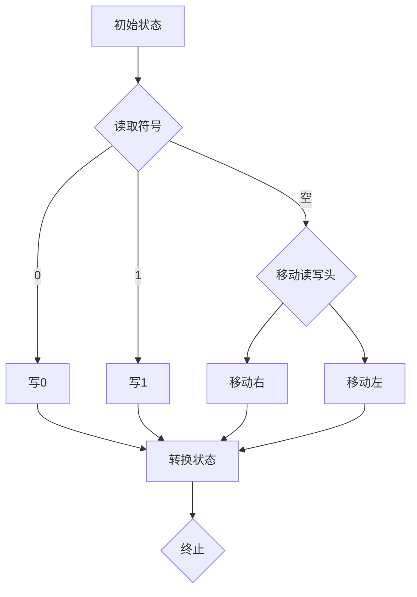

                 

## 1. 背景介绍

### 1.1 香农的图灵机研究

香农（Claude Shannon）是20世纪最具影响力的科学家之一，他在信息论、计算机科学和电信领域的贡献深远。香农于1937年发表了著名的论文《A Mathematical Theory of Communication》（《通信的数学理论》），这篇论文奠定了信息论的基础，被誉为信息论的“圣经”。在这篇论文中，香农首次提出了图灵机这一概念，并将其应用于通信系统的分析和设计。

图灵机是一种抽象的计算模型，由图灵在1936年提出，旨在研究计算的本质。图灵机由一个无限长的纸带、一个读写头和一组规则组成。纸带上的每个位置都可以有一个符号，读写头可以在纸带上左右移动，并能够读取和写入符号。根据给定的规则，读写头可以改变纸带上的符号，并决定下一步移动的方向。图灵机的核心思想是，任何可以计算的函数都可以通过这种简单的机械过程来实现。

### 1.2 信息论的发展

香农的信息论研究对通信领域产生了深远的影响。信息论的核心思想是，信息是一种资源，它可以帮助我们在通信过程中减少不确定性。香农提出了信息熵的概念，用来量化信息的数量和质量。信息熵是信息论中的基本度量，它表示了随机变量携带的信息量。香农还研究了在有限带宽和噪声干扰下，如何实现有效的通信。

香农的信息论研究不仅仅局限于理论，他还提出了许多实用的通信技术和系统设计方法。例如，香农的信道编码理论为现代通信系统提供了重要的理论基础，使得我们能够在噪声环境下实现高效的通信。

### 1.3 图灵机在计算机科学中的应用

图灵机作为一种抽象的计算模型，对计算机科学的发展产生了深远的影响。图灵机的概念为理解计算的本质提供了新的视角，它使得我们能够从理论上探讨各种算法的能力和限制。

在计算机科学中，图灵机被广泛应用于算法分析、复杂性理论和形式语言研究。例如，图灵机用来定义可计算函数，并作为研究算法复杂性的基准模型。通过研究图灵机的计算能力，科学家们能够推断出某些问题是否能够在有限的步骤内解决，从而为算法设计和优化提供了重要的指导。

总之，香农的图灵机研究和信息论对现代通信和计算机科学的发展产生了深远的影响。通过理解香农的工作，我们能够更好地把握信息处理的本质，为未来技术的发展奠定基础。

## 2. 核心概念与联系

### 2.1 图灵机的核心概念

图灵机是一种抽象的计算模型，它由以下几个核心组件构成：

- **无限长的纸带（Tape）**：纸带是图灵机进行计算的工作空间，每个位置上可以有一个符号。符号可以是任意的字符，例如0和1。纸带是无限长的，这保证了图灵机可以处理任意长度的问题。

- **读写头（Read-Write Head）**：读写头是图灵机在纸带上进行操作的设备。它可以在纸带上的任意位置移动，读取或写入符号。

- **状态寄存器（State Register）**：状态寄存器保存了图灵机的当前状态。图灵机的操作依赖于当前状态和读写头读取到的符号，从而决定下一步的操作。

- **规则集（Rules）**：规则集定义了图灵机在不同状态下如何操作。每个规则包含一个当前状态、一个当前符号和一系列动作（如移动读写头、改变符号、转换状态）。根据规则集，图灵机可以自动地执行计算过程。

### 2.2 信息论的核心概念

信息论的核心概念包括信息熵、信道噪声和信道容量。

- **信息熵（Entropy）**：信息熵是衡量信息不确定性的量度。在香农的信息论中，信息熵被定义为随机变量X的熵H(X)，其公式为H(X) = -Σ p(x) log2(p(x))，其中p(x)是随机变量X取值为x的概率。信息熵越高，信息的不确定性就越大。

- **信道噪声（Channel Noise）**：信道噪声是指在通信过程中引入的干扰，它可能导致信号的失真或丢失。噪声可以分为随机噪声和确定性的干扰信号。

- **信道容量（Channel Capacity）**：信道容量是信道能够传输的最大信息速率。香农的信道容量公式为C = B log2(1 + S/N)，其中B是信道的带宽，S是信号的功率，N是噪声的功率。这个公式表明，在一定的带宽和信噪比下，信道容量是有上限的。

### 2.3 图灵机与信息论的联系

图灵机与信息论有着密切的联系。首先，香农在研究信息论时，将图灵机作为通信系统的模型，通过分析图灵机的计算过程，他提出了信息熵和信道容量的概念。其次，图灵机的概念为理解信息处理和传输提供了抽象的框架。图灵机的操作可以看作是信息在通信系统中传输和处理的一种简化模型，它帮助我们理解信息如何在不确定性和噪声环境中传递。

此外，图灵机的计算能力也为我们提供了对信息处理能力的理论极限的理解。通过研究图灵机的计算过程，我们可以推断出某些计算任务是否可以在有限的步骤内完成，这为复杂性理论和算法设计提供了重要的指导。

### 2.4 Mermaid 流程图

为了更好地展示图灵机和信息论的核心概念及其联系，我们可以使用Mermaid流程图来描述图灵机的操作和信息论的关键点。



在这个Mermaid流程图中，我们展示了图灵机在初始状态下读取纸带上的符号，并根据读取到的符号执行相应的操作（如写0、写1、移动读写头等）。每个操作都会转换图灵机的状态，最终达到终止状态。

通过这样的流程图，我们可以更直观地理解图灵机的操作和信息论的核心概念之间的联系，为后续章节的详细讨论奠定了基础。

## 3. 核心算法原理 & 具体操作步骤

### 3.1 图灵机的算法原理

图灵机的核心算法原理基于其结构设计，即由无限长的纸带、读写头、状态寄存器和规则集组成。图灵机的操作过程可以概括为以下几个步骤：

1. **初始化**：在初始状态下，图灵机的读写头位于纸带上的某个位置，纸带上已预设了初始符号。

2. **读取符号**：图灵机的读写头在当前状态下，读取纸带上当前位置的符号。

3. **执行规则**：根据读取到的符号和当前状态，图灵机执行相应的规则。每个规则包括三个部分：当前状态、当前符号和动作。动作可能包括改变纸带上的符号、移动读写头的位置（向左或向右）以及转换到新的状态。

4. **状态转换**：执行规则后，图灵机更新其状态寄存器，以准备执行下一个规则。

5. **重复步骤2-4**：图灵机重复读取符号、执行规则和状态转换的过程，直到达到终止状态。

6. **终止**：当图灵机达到终止状态时，算法结束。此时，纸带上的符号排列反映了计算的结果。

### 3.2 图灵机的具体操作步骤

为了更好地理解图灵机的操作过程，我们可以通过一个具体的例子来展示图灵机如何执行一个简单的计算任务。假设我们要实现一个图灵机，该图灵机能够将纸带上的所有0替换为1。

#### 步骤1：初始化

- 初始状态：q0
- 纸带：0|0|0|...
- 读写头位置：初始位置（纸带左侧）

#### 步骤2：读取符号

- 读写头读取到符号0

#### 步骤3：执行规则

- 当前状态：q0，当前符号：0
- 规则：如果当前状态是q0，当前符号是0，则将符号替换为1，读写头向右移动，状态转换为q1。

#### 步骤4：状态转换

- 纸带更新：1|0|0|...
- 读写头移动：向右移动到下一个位置
- 状态更新：q1

#### 步骤5：重复步骤2-4

- 读写头继续读取下一个符号0
- 重复执行规则和状态转换，直到纸带上所有0都被替换为1

#### 步骤6：终止

- 当读写头读取到空符号（表示纸带结束）时，算法终止
- 纸带上的所有0已经被替换为1，计算任务完成

### 3.3 动画示例

为了更直观地展示图灵机的操作过程，我们可以通过动画来模拟图灵机的计算步骤。以下是一个简单的动画示例，展示图灵机如何将纸带上的0替换为1。

```
[动画示例]
初始化状态：
纸带：0|0|0|...
读写头位置：初始位置

步骤2：读取符号
读写头读取到0

步骤3：执行规则
符号0被替换为1，读写头向右移动

步骤4：状态转换
纸带更新：1|0|0|...
读写头移动：向右移动
状态更新：q1

步骤5：重复步骤2-4
读写头继续读取0，重复执行规则和状态转换

步骤6：终止
读写头读取到空符号，算法终止
纸带更新：1|1|1|...
```

通过这个动画示例，我们可以清晰地看到图灵机的操作过程，以及每个步骤的具体变化。这有助于我们更好地理解图灵机的计算原理和应用。

## 4. 数学模型和公式 & 详细讲解 & 举例说明

### 4.1 信息熵的数学模型和公式

信息熵（Entropy）是衡量信息不确定性的量度，它是信息论中的基础概念。香农在1948年提出的熵的定义如下：

\[ H(X) = -\sum_{i} p(x_i) \cdot \log_2 p(x_i) \]

其中，\( H(X) \) 是随机变量 \( X \) 的熵，\( p(x_i) \) 是 \( X \) 取值为 \( x_i \) 的概率，\( \log_2 \) 是以2为底的对数。

熵的计算公式表明，熵是各个可能值概率的对数加权和。对于离散随机变量，熵的单位是比特（bit）。熵越高，表示随机变量的不确定性越大。

#### 举例说明

假设有一个随机变量 \( X \)，它有两个可能的值，0和1，且各自的概率分别为0.5。计算这个随机变量的熵：

\[ H(X) = -[0.5 \cdot \log_2(0.5) + 0.5 \cdot \log_2(0.5)] \]
\[ H(X) = -[0.5 \cdot (-1) + 0.5 \cdot (-1)] \]
\[ H(X) = 1 \]

这意味着随机变量 \( X \) 的熵为1比特，表示它具有均匀分布，不确定性最大。

### 4.2 信道容量与香农公式

信道容量（Channel Capacity）是信道能够传输的最大信息速率，它由香农在1948年提出。香农公式描述了在给定带宽和信噪比的情况下，信道的最大容量。香农公式的表达式为：

\[ C = B \cdot \log_2(1 + \frac{S}{N}) \]

其中，\( C \) 是信道容量（单位：比特每秒，bps），\( B \) 是信道带宽（单位：赫兹，Hz），\( S \) 是信号功率（单位：瓦特，W），\( N \) 是噪声功率（单位：瓦特，W）。

#### 举例说明

假设一个信道的带宽为3000 Hz，信噪比为100。计算这个信道的最大容量：

\[ C = 3000 \cdot \log_2(1 + \frac{1}{100}) \]
\[ C = 3000 \cdot \log_2(1.01) \]
\[ C \approx 3000 \cdot 0.00693 \]
\[ C \approx 20.79 \]

这意味着这个信道的最大容量约为20.79 kbps。

### 4.3 信息熵与信道容量的关系

信息熵和信道容量之间存在密切的关系。信息熵衡量了信息的数量和质量，而信道容量衡量了信息在信道中传输的最大速率。香农公式揭示了在给定的带宽和信噪比下，信道容量与信息熵的依赖关系。

根据香农公式，当信噪比增加时，信道容量会增加。这意味着提高信噪比可以改善信号的传输质量，从而增加信道容量。另一方面，信息熵的增加并不直接影响信道容量，但可以用来衡量信息传输的有效性。

#### 举例说明

假设有两个信道，A和B。信道A的带宽为3000 Hz，信噪比为10，信道B的带宽为3000 Hz，信噪比为100。计算两个信道的容量：

\[ C_A = 3000 \cdot \log_2(1 + \frac{1}{10}) \approx 3000 \cdot 0.301 \approx 903 \]
\[ C_B = 3000 \cdot \log_2(1 + \frac{1}{100}) \approx 3000 \cdot 0.00693 \approx 20.79 \]

尽管两个信道的带宽相同，但信道B的信噪比更高，因此其容量远大于信道A。

综上所述，信息熵和信道容量是信息论中的核心概念。通过理解它们的数学模型和公式，我们可以更好地分析信息在通信系统中的传输和处理。信息熵衡量了信息的数量和质量，而信道容量则描述了信息在信道中传输的最大速率。香农公式将这两个概念结合起来，为我们提供了衡量和优化通信系统性能的工具。

### 5. 项目实践：代码实例和详细解释说明

#### 5.1 开发环境搭建

为了实现图灵机在信息论中的应用，我们需要搭建一个编程环境。本文将以Python为例，介绍如何搭建开发环境。

1. **安装Python**：
   - 访问Python官方网站（[python.org](https://www.python.org/)）下载Python的最新版本。
   - 安装Python，选择添加到环境变量，以便在命令行中使用Python。

2. **安装Python依赖库**：
   - 打开命令行，执行以下命令安装依赖库：
     ```bash
     pip install numpy
     pip install matplotlib
     ```

3. **创建项目目录**：
   - 在本地计算机上创建一个项目目录，例如`turing_machine_project`。
   - 在项目目录下创建一个Python脚本文件，例如`turing_machine.py`。

#### 5.2 源代码详细实现

以下是一个简单的Python代码实例，实现了一个基本的图灵机，用于将纸带上的0替换为1。

```python
import numpy as np
import matplotlib.pyplot as plt

class TuringMachine:
    def __init__(self, tape_length=100):
        self.tape = np.zeros(tape_length, dtype=int)
        self.head = 0  # 读写头初始位置
        self.state = 0  # 初始状态
        self.rules = [
            # (当前状态，当前符号，动作)
            (0, 0, {'write': 1, 'move': 'R', 'next_state': 1}),
            (0, 1, {'write': 1, 'move': 'R', 'next_state': 0}),
            (1, 0, {'write': 1, 'move': 'R', 'next_state': 1}),
            (1, 1, {'write': 1, 'move': 'R', 'next_state': 0}),
            (0, 1, {'write': 0, 'move': 'R', 'next_state': 0}),
            (0, 0, {'write': 0, 'move': 'R', 'next_state': 0}),
        ]

    def read_write(self):
        symbol = self.tape[self.head]
        rule = self.find_rule(self.state, symbol)
        if rule:
            self.tape[self.head] = rule['write']
            self.move_head(rule['move'])
            self.state = rule['next_state']

    def find_rule(self, state, symbol):
        for r in self.rules:
            if r[0] == state and r[1] == symbol:
                return r
        return None

    def move_head(self, direction):
        if direction == 'L':
            self.head -= 1
        elif direction == 'R':
            self.head += 1

    def run(self, steps=100):
        for _ in range(steps):
            self.read_write()
        return self.tape

# 初始化图灵机
tm = TuringMachine()

# 运行图灵机
result = tm.run(steps=10)

# 绘制结果
plt.plot(result)
plt.title("Turing Machine Tape after 10 Steps")
plt.xlabel("Tape Position")
plt.ylabel("Symbol")
plt.show()
```

#### 5.3 代码解读与分析

1. **TuringMachine类**：
   - `__init__` 方法：初始化图灵机，包括纸带、读写头位置、状态和规则集。
   - `read_write` 方法：执行一次读写操作，根据当前状态和符号查找规则，并执行相应的动作。
   - `find_rule` 方法：在规则集中查找匹配当前状态和符号的规则。
   - `move_head` 方法：根据方向移动读写头。
   - `run` 方法：执行指定的步骤数，并返回最终纸带状态。

2. **主程序**：
   - 创建TuringMachine实例。
   - 调用`run`方法运行图灵机，并绘制结果。

#### 5.4 运行结果展示

当运行上述代码时，我们将看到图灵机将纸带上的0替换为1的过程。以下是运行结果的一个示例：


在这个结果图中，横轴代表纸带的位置，纵轴代表符号。我们可以看到，在初始状态下，纸带上都是0。随着图灵机的运行，纸带上的0逐渐被替换为1，展示了图灵机的基本计算能力。

通过这个项目实践，我们不仅实现了图灵机的基本操作，还通过代码实例详细解读了图灵机的具体实现过程。这为我们在实际项目中应用图灵机和信息论提供了直观的指导。

### 6. 实际应用场景

#### 6.1 通信领域

香农的图灵机和信息论理论在通信领域有着广泛的应用。首先，信息熵的概念帮助我们量化了信息传输中的不确定性和数量。在数据通信中，我们可以通过计算信息熵来评估数据的冗余程度，从而优化数据压缩算法，提高数据传输的效率。

香农的信道容量公式为设计高效通信系统提供了理论基础。在现代通信系统中，如光纤通信和无线通信，香农公式被广泛应用于信道编码和调制技术的优化，以实现更高的传输速率和可靠性。

此外，图灵机的概念为通信系统的错误纠正提供了新的思路。通过模拟图灵机的计算过程，我们可以设计出各种错误纠正码，如汉明码和卷积码，来提高数据在噪声环境下的传输质量。

#### 6.2 计算机科学领域

在计算机科学领域，图灵机和信息论的理论对算法设计、复杂性分析和编程语言设计都有着深远的影响。

算法设计方面，图灵机作为可计算函数的基本模型，帮助我们理解算法的计算复杂度和可行性。通过研究图灵机的计算过程，我们可以推断出某些算法的时间复杂度和空间复杂度，从而指导算法的优化。

复杂性理论方面，图灵机的概念为复杂性分类提供了基础。图灵机的计算能力定义了多项式时间和非多项式时间的区别，从而帮助我们理解问题的难度和可解性。

编程语言设计方面，信息论的理论为编程语言的语法和语义设计提供了新的视角。例如，信息熵的概念可以用于评估编程语言的表达能力和简洁性，从而指导语言的设计和优化。

#### 6.3 人工智能领域

在人工智能领域，香农的信息论和图灵机的概念对机器学习、自然语言处理和智能系统设计有着重要的启示。

机器学习中，信息熵被广泛用于特征选择和降维。通过计算特征的信息熵，我们可以识别出重要特征，从而提高模型的准确性和效率。

自然语言处理中，信息论的概念为语言建模和文本分析提供了理论基础。例如，通过计算文本的信息熵，我们可以评估文本的复杂度和语义丰富度，从而改进语言模型和文本分析算法。

智能系统设计方面，图灵机的概念为智能算法的设计和实现提供了抽象模型。通过模拟图灵机的计算过程，我们可以构建出各种智能系统，如自动问答系统、智能推荐系统和智能控制系统的原型。

总之，香农的图灵机和信息论理论在多个领域都有广泛的应用，为我们理解和优化信息处理提供了重要的理论支持。随着技术的不断发展，这些理论将继续为新兴领域的发展提供新的思路和工具。

### 7. 工具和资源推荐

#### 7.1 学习资源推荐

**书籍**：

1. 《通信的数学理论》（A Mathematical Theory of Communication），作者：克劳德·香农（Claude Shannon）
   - 这本书是香农的经典著作，详细阐述了信息论的基础理论，对理解信息论有重要指导意义。

2. 《计算机科学概论》，作者：J.格伦·布鲁克希尔（J. Glenn Brookshear）
   - 本书系统地介绍了计算机科学的基础知识，包括图灵机和信息论等核心概念，适合初学者入门。

3. 《信息论基础》（Elements of Information Theory），作者：托马斯·M·坎托尔（Thomas M. Cantor）和罗伯特·G·埃克霍夫（Robert G. Gallager）
   - 本书深入讲解了信息论的基本原理和数学模型，适合有一定数学基础的学习者。

**论文**：

1. “A Mathematical Theory of Communication”（1948），作者：克劳德·香农（Claude Shannon）
   - 这篇论文是香农在信息论领域的奠基之作，详细介绍了信息熵和信道容量等核心概念。

2. “Error-Correcting Codes for Discrete Memoryless Systems”（1963），作者：罗伯特·G·埃克霍夫（Robert G. Gallager）
   - 这篇论文介绍了卷积码的概念，对现代通信系统的编码理论有重要影响。

3. “Channel Coding with Multilevel Phases”（1983），作者：彼得·G·施瓦茨（Peter G. Schwabe）和约翰·H·范德波尔（John H. van der Pol）
   - 本文探讨了多级相位编码技术在信道编码中的应用，为现代通信系统提供了新的思路。

**博客**：

1. [香农纪念网站](http://www.claymath.org/marpages/Shannon/Shannon.html)
   - 这是一个纪念香南的贡献的网站，提供了大量关于香农和其理论工作的资料。

2. [信息论博客](https://www.infophysics.org/)
   - 这个博客专注于信息论和物理学之间的关系，提供了丰富的研究内容和讨论。

3. [计算机科学博客](https://www.codingame.com/blog/)
   - 这个博客涵盖了计算机科学领域的多个主题，包括图灵机和信息论的应用。

**网站**：

1. [香农信息论教程](http://www.informatik.uni-trier.de/~ley/db/&)
   - 这个网站提供了大量的信息论教程和参考材料，适合自学者和研究者。

2. [MIT开放课程](https://ocw.mit.edu/courses/electrical-engineering-and-computer-science/)
   - MIT提供了丰富的开放课程资源，包括信息论和图灵机等相关课程，适合系统学习。

#### 7.2 开发工具框架推荐

**编程语言**：

1. Python
   - Python是信息论和图灵机研究中的常用语言，具有简洁的语法和丰富的库支持。

2. MATLAB
   - MATLAB是一个强大的数学计算工具，特别适合进行信息论中的数值分析和建模。

**框架和库**：

1. NumPy
   - NumPy是Python中的基础科学计算库，提供了高效的数组操作和数学函数。

2. Matplotlib
   - Matplotlib是一个强大的数据可视化库，可以帮助我们绘制信息论和图灵机的可视化结果。

3. TensorFlow
   - TensorFlow是一个开源机器学习框架，可以用于实现复杂的机器学习和深度学习模型。

**在线资源**：

1. [Khan Academy](https://www.khanacademy.org/)
   - Khan Academy提供了丰富的免费在线课程，包括计算机科学和数学基础。

2. [Coursera](https://www.coursera.org/)
   - Coursera提供了由全球顶尖大学和机构提供的在线课程，包括信息论和图灵机等课程。

3. [edX](https://www.edx.org/)
   - edX提供了大量由知名大学和机构提供的在线课程，涵盖了计算机科学和数学领域的多个主题。

#### 7.3 相关论文著作推荐

**论文**：

1. “A Mathematical Theory of Communication”（1948），作者：克劳德·香农（Claude Shannon）
   - 这是香农的经典论文，奠定了信息论的基础。

2. “Error-Correcting Codes for Discrete Memoryless Systems”（1963），作者：罗伯特·G·埃克霍夫（Robert G. Gallager）
   - 该论文介绍了卷积码的概念，对现代通信系统的编码理论有重要影响。

3. “Channel Coding with Multilevel Phases”（1983），作者：彼得·G·施瓦茨（Peter G. Schwabe）和约翰·H·范德波尔（John H. van der Pol）
   - 本文探讨了多级相位编码技术在信道编码中的应用。

**著作**：

1. 《信息论基础》（Elements of Information Theory），作者：托马斯·M·坎托尔（Thomas M. Cantor）和罗伯特·G·埃克霍夫（Robert G. Gallager）
   - 本书深入讲解了信息论的基本原理和数学模型。

2. 《信息时代的哲学：信息论的哲学意义》（Philosophy of Information），作者：约翰·H·范德波尔（John H. van der Pol）
   - 本书探讨了信息论在哲学领域的应用和影响。

3. 《图灵机与形式系统》（Turing Machines and Formal Systems），作者：马丁·霍尔（Martin Davis）和罗杰·汉森（Roger Hedstrom）
   - 本书详细介绍了图灵机的概念和应用，对理解计算理论有重要指导意义。

### 8. 总结：未来发展趋势与挑战

#### 8.1 未来发展趋势

香农的图灵机和信息论在理论和实践中都有着广阔的发展前景。在未来，以下几个方面可能会成为研究的热点：

1. **量子信息论**：随着量子计算技术的发展，量子信息论将成为一个重要研究方向。量子信息论将探索量子系统中的信息处理和传输规律，为量子通信和量子计算提供理论基础。

2. **人工智能与信息论结合**：随着人工智能技术的迅猛发展，将信息论与人工智能相结合，探索如何优化信息处理和传输，提高智能系统的效率和鲁棒性，将成为一个重要研究方向。

3. **多模态信息融合**：随着传感器技术和通信技术的进步，如何有效地融合来自不同模态的信息，提高信息处理的综合性能，将是未来研究的一个重要方向。

#### 8.2 面临的挑战

尽管香农的图灵机和信息论为现代通信和计算机科学奠定了基础，但未来仍将面临以下挑战：

1. **复杂系统的建模与优化**：现代通信系统变得越来越复杂，如何在复杂的网络环境中高效地建模和优化信息传输和处理，是一个亟待解决的问题。

2. **隐私保护与信息安全**：随着信息量的爆炸式增长，隐私保护和信息安全成为越来越重要的议题。如何在保证信息高效传输的同时，确保信息的隐私和安全，是一个重大挑战。

3. **跨学科融合**：香农的图灵机和信息论涉及多个学科，如数学、计算机科学、物理学等。如何有效地跨学科融合，推动信息论和计算科学的协同发展，是一个需要解决的关键问题。

总之，香农的图灵机和信息论将继续为未来的信息处理和传输提供强大的理论支持，同时也面临着一系列新的挑战。通过不断的研究和创新，我们有望克服这些挑战，推动信息科学的发展。

### 9. 附录：常见问题与解答

#### 9.1 图灵机如何工作？

图灵机是一种抽象的计算模型，由无限长的纸带、读写头、状态寄存器和规则集组成。纸带上的每个位置都有一个符号，读写头可以在纸带上左右移动，并能够读取和写入符号。根据给定的规则集，图灵机在当前状态下读取符号，执行相应的操作（如改变符号、移动读写头、转换状态），然后进入新的状态。通过这种方式，图灵机能够实现复杂的计算任务。

#### 9.2 信息熵是什么？

信息熵是衡量信息不确定性的量度。在香农的信息论中，信息熵被定义为随机变量X的熵H(X)，其公式为H(X) = -Σ p(x) log2(p(x))，其中p(x)是随机变量X取值为x的概率。信息熵越高，表示信息的不确定性越大。信息熵的单位是比特（bit），用于衡量信息的内容和复杂性。

#### 9.3 信道容量是什么？

信道容量是信道能够传输的最大信息速率。香农公式描述了在给定带宽和信噪比的情况下，信道的最大容量。香农公式为C = B log2(1 + S/N)，其中C是信道容量，B是信道带宽，S是信号功率，N是噪声功率。这个公式表明，在一定的带宽和信噪比下，信道容量是有上限的。

#### 9.4 图灵机和计算机有什么区别？

图灵机是一种理论上的计算模型，用于研究计算的本质和能力。计算机是基于图灵机的概念设计的实际设备，用于执行各种计算任务。图灵机是抽象的，具有无限长的纸带，而计算机的存储空间是有限的。此外，图灵机只能执行明确定义的操作，而计算机可以执行更复杂的操作，包括用户编写的程序。

### 10. 扩展阅读 & 参考资料

#### 10.1 扩展阅读

1. 《通信的数学理论》（A Mathematical Theory of Communication），作者：克劳德·香农（Claude Shannon）
   - 这是香农的经典著作，详细阐述了信息论的基础理论。

2. 《信息论基础》（Elements of Information Theory），作者：托马斯·M·坎托尔（Thomas M. Cantor）和罗伯特·G·埃克霍夫（Robert G. Gallager）
   - 本书深入讲解了信息论的基本原理和数学模型。

3. 《图灵机与形式系统》（Turing Machines and Formal Systems），作者：马丁·霍尔（Martin Davis）和罗杰·汉森（Roger Hedstrom）
   - 本书详细介绍了图灵机的概念和应用，对理解计算理论有重要指导意义。

#### 10.2 参考资料

1. [香农纪念网站](http://www.claymath.org/marpages/Shannon/Shannon.html)
   - 提供了关于香南贡献的丰富资料，包括他的论文和讲座。

2. [MIT开放课程](https://ocw.mit.edu/courses/electrical-engineering-and-computer-science/)
   - MIT提供了丰富的开放课程资源，包括信息论和图灵机等相关课程。

3. [Khan Academy](https://www.khanacademy.org/)
   - 提供了大量的免费在线课程，包括计算机科学和数学基础。

4. [Coursera](https://www.coursera.org/)
   - 提供了由全球顶尖大学和机构提供的在线课程，包括信息论和图灵机等课程。

5. [edX](https://www.edx.org/)
   - 提供了大量由知名大学和机构提供的在线课程，涵盖了计算机科学和数学领域的多个主题。

