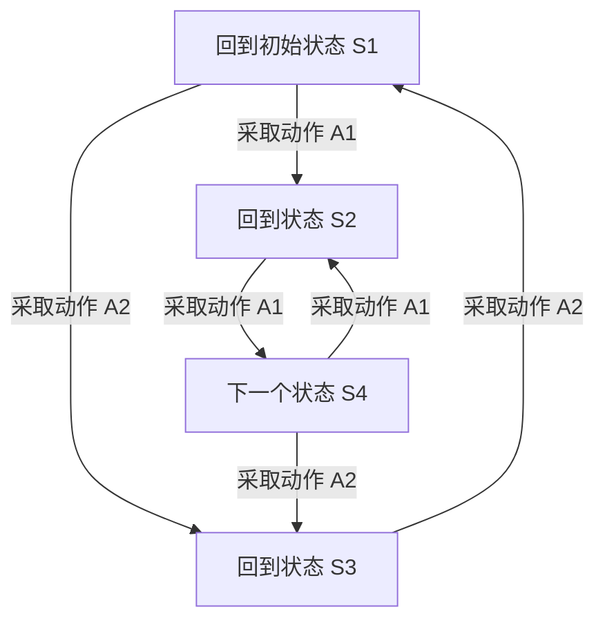

                 

### 1. 背景介绍

马尔可夫决策过程（Markov Decision Process，简称MDP）是决策理论中的一个重要概念，最早由俄罗斯数学家安德烈·马尔可夫提出。在20世纪50年代，这一概念被引入到人工智能领域，成为解决动态规划问题的基石之一。随着计算机科学和人工智能技术的不断发展，MDP在机器人、自主驾驶、推荐系统、游戏AI等多个领域都得到了广泛应用。

MDP的提出是为了解决在不确定性环境中如何做出最优决策的问题。与传统的马尔可夫链不同，MDP不仅考虑了状态的转移概率，还加入了动作的决策环节，这使得它能够更加灵活地处理复杂的环境。在MDP中，决策者通过选择不同动作来影响环境的动态变化，从而实现长期的目标。

在实际应用中，MDP的核心优势在于其能够通过模型预测未来的状态，并基于预测结果进行最优决策。这使得它成为解决动态决策问题的一个强有力的工具，无论是在理论研究还是在实际应用中都具有重要的意义。

本文将系统性地介绍马尔可夫决策过程的基本概念、数学模型、算法原理以及实际应用，帮助读者深入理解这一重要的决策理论。我们将首先定义MDP的核心术语，然后详细讲解其数学模型和算法原理，最后通过具体实例和实际应用场景，展示MDP在现实世界中的广泛应用。

### 2. 核心概念与联系

#### 2.1 定义

在介绍MDP的核心概念之前，我们需要明确几个基本的定义：

- **状态（State）**：环境中的一个特定情境或条件，通常用\( S \)表示。状态可以是机器人所在的位置、游戏中的棋盘布局、或者股票市场的价格等。
- **动作（Action）**：决策者可以采取的特定行为，用于影响环境的当前状态，通常用\( A \)表示。例如，在机器人导航中，动作可以是“向前移动”、“向左转”或“向右转”；在游戏中，动作可以是“下棋”、“出牌”等。
- **状态-动作对（State-Action Pair）**：描述特定状态下可采取的某个动作，通常用\( (s, a) \)表示。
- **奖励（Reward）**：决策者对某个动作在某个状态下产生的结果的评价，通常用\( R(s, a) \)表示。奖励可以是正的（表示正面结果），也可以是负的（表示负面结果），或者为零（表示中性结果）。
- **概率转移函数（Transition Probability Function）**：描述在给定当前状态和采取特定动作的情况下，状态转移的概率分布，通常用\( P(s', s | s, a) \)表示，其中\( s' \)是下一个状态。

#### 2.2 MDP的数学模型

一个基本的MDP可以形式化地描述为五元组：

\[ MDP = \langle S, A, R, P, \gamma \rangle \]

- **状态集（S）**：所有可能状态组成的集合。
- **动作集（A）**：所有可能动作组成的集合。
- **奖励函数（R）**：一个函数，用于定义状态-动作对上的奖励，即\( R: S \times A \rightarrow \mathbb{R} \)。
- **概率转移函数（P）**：一个函数，用于定义状态-动作对上的概率转移，即\( P: S \times A \times S \rightarrow [0, 1] \)，满足归一化条件，即对于所有状态\( s' \)，有\( \sum_{s} P(s', s | s, a) = 1 \)。
- **折扣因子（γ，Discount Factor）**：一个介于0和1之间的常数，用于确定未来奖励的现值，即\( 0 \leq \gamma < 1 \)。

#### 2.3 Mermaid 流程图

为了更直观地理解MDP的工作原理，我们可以用Mermaid流程图来展示其核心组件之间的联系。以下是一个简单的Mermaid流程图示例：



在这个示例中，我们定义了一个简单的状态转移图，每个节点代表一个状态，箭头表示在特定动作下状态转移的概率。通过这个流程图，我们可以直观地看到在当前状态下采取不同动作后可能到达的下一个状态以及相应的概率。

#### 2.4 MDP与马尔可夫链的联系

虽然MDP与马尔可夫链（Markov Chain，简称MC）有相似之处，但它们之间也存在显著的区别。马尔可夫链主要关注状态之间的转移概率，而不涉及决策或动作的选择。而MDP则不仅考虑状态转移概率，还包括了决策者在每个状态下选择不同动作的能力。

- **马尔可夫链**：只描述状态转移的概率，没有动作的概念。
- **马尔可夫决策过程**：在描述状态转移概率的同时，引入了动作选择的概念，允许决策者在每个状态选择不同的动作。

这种差异使得MDP在处理动态决策问题时比马尔可夫链更加灵活和适用。通过将决策过程模型化为MDP，我们可以更好地理解和分析复杂的动态系统。

### 3. 核心算法原理 & 具体操作步骤

#### 3.1 Viterbi算法

在MDP中，一个重要的算法是Viterbi算法。Viterbi算法用于在给定观测序列的情况下，找到最有可能的隐藏状态序列。以下是Viterbi算法的具体操作步骤：

1. **初始化**：对于每个状态，计算初始状态的概率，通常假设所有状态的概率相等。
   \[ \alpha_0(s) = \begin{cases} 
   1 & \text{如果 } s \text{ 是初始状态} \\
   0 & \text{否则}
   \end{cases} \]

2. **迭代计算**：对于每个状态和每个时间步\( t \)，计算在当前状态下的概率。
   \[ \alpha_t(s) = P(s_t | s_{t-1}, a_t) \prod_{i=1}^{t-1} P(s_i | s_{i-1}, a_i) \]

3. **路径存储**：对于每个状态和每个时间步，存储一条最优路径。
   \[ \pi_t(s) = \arg\max_{s'} \alpha_t(s') \]

4. **结果计算**：通过回溯最优路径，得到最有可能的隐藏状态序列。

#### 3.2 Q-Learning算法

Q-Learning算法是一种在MDP中进行值函数估计的方法。其核心思想是通过试错学习，不断更新Q值，以找到最优动作。以下是Q-Learning算法的具体操作步骤：

1. **初始化**：随机初始化Q值函数，通常设为0。
   \[ Q(s, a) = 0 \]

2. **更新Q值**：在每次行动后，更新Q值。
   \[ Q(s, a) \leftarrow Q(s, a) + \alpha [r + \gamma \max_{a'} Q(s', a') - Q(s, a)] \]
   其中，\( \alpha \)是学习率，\( r \)是即时奖励，\( \gamma \)是折扣因子。

3. **选择动作**：根据当前的Q值函数选择动作。
   \[ a = \arg\max_{a'} Q(s, a') \]

4. **重复迭代**：不断重复更新Q值和选择动作的过程，直到收敛。

#### 3.3 Policy Iteration算法

Policy Iteration算法是一种迭代优化策略的方法。它通过交替更新策略和价值函数，逐步逼近最优策略。以下是Policy Iteration算法的具体操作步骤：

1. **初始化**：随机初始化策略。
   \[ \pi^0(a | s) = \begin{cases} 
   1 & \text{如果 } a \text{ 是 } s \text{ 的唯一动作} \\
   0 & \text{否则}
   \end{cases} \]

2. **评估策略**：计算策略下的预期回报。
   \[ V^0(s) = \sum_{a \in A} \pi^0(a | s) \sum_{s' \in S} P(s' | s, a) R(s, a) + \gamma V^0(s') \]

3. **更新策略**：根据价值函数更新策略。
   \[ \pi^{k+1}(a | s) = \begin{cases} 
   1 & \text{如果 } a \text{ 是 } s \text{ 的最优动作} \\
   0 & \text{否则}
   \end{cases} \]

4. **重复迭代**：不断重复评估策略和更新策略的过程，直到策略收敛。

通过上述算法，我们可以对MDP进行有效的求解，找到最优策略，从而实现动态环境中的最优决策。

### 4. 数学模型和公式 & 详细讲解 & 举例说明

#### 4.1 基本定义

在MDP中，我们首先需要定义几个核心的数学模型和公式：

- **状态转移概率矩阵（Transition Probability Matrix）**：用\( P \)表示，是一个\( S \times S \)的矩阵，其中\( P_{ij} = P(s' = s_j | s = s_i) \)表示在当前状态\( s \)下采取动作\( a \)后转移到状态\( s' \)的概率。

- **奖励矩阵（Reward Matrix）**：用\( R \)表示，是一个\( S \times A \)的矩阵，其中\( R_{ij} = R(s_j | s = s_i, a = a_j) \)表示在当前状态\( s \)下采取动作\( a \)得到的即时奖励。

- **策略矩阵（Policy Matrix）**：用\( \pi \)表示，是一个\( S \times A \)的矩阵，其中\( \pi_{ij} = \pi(a_j | s_i) \)表示在状态\( s \)下采取动作\( a \)的概率。

- **价值函数（Value Function）**：用\( V \)表示，是一个\( S \)维的向量，其中\( V(s) \)表示在状态\( s \)下的最优预期回报。

- **Q函数（Q-Function）**：用\( Q \)表示，是一个\( S \times A \)的矩阵，其中\( Q_{ij} = Q(s_j | s = s_i, a = a_j) \)表示在状态\( s \)下采取动作\( a \)得到的最优预期回报。

#### 4.2 Bellman方程

MDP的核心是解决值函数，即确定在任意状态下采取最优动作所能获得的最大期望回报。这一过程可以通过解Bellman方程来实现。

**最优值函数**：
\[ V^*(s) = \max_{a} \left( \sum_{s'} P(s'|s,a) [R(s,s') + \gamma V^*(s')] \right) \]

**最优Q函数**：
\[ Q^*(s,a) = \max_{a'} \left( \sum_{s'} P(s'|s,a') [R(s,s') + \gamma V^*(s')] \right) \]

**策略迭代**：
\[ \pi^*(s) = \arg\max_{a} Q^*(s,a) \]

#### 4.3 Q-Learning算法

Q-Learning算法是一种通过迭代更新Q值来逼近最优策略的方法。其更新公式如下：

\[ Q(s,a) \leftarrow Q(s,a) + \alpha [r + \gamma \max_{a'} Q(s',a') - Q(s,a)] \]

其中，\( \alpha \)是学习率，\( r \)是即时奖励，\( \gamma \)是折扣因子。

#### 4.4 Policy Iteration算法

Policy Iteration算法通过交替更新策略和价值函数来逼近最优策略。其步骤如下：

1. **初始化策略**：随机初始化策略。
2. **评估策略**：计算当前策略下的预期回报。
3. **更新策略**：根据价值函数更新策略。
4. **重复迭代**：重复评估策略和更新策略的过程，直到策略收敛。

#### 4.5 举例说明

假设我们有一个简单的MDP，状态集\( S = \{s_1, s_2, s_3\} \)，动作集\( A = \{a_1, a_2\} \)，状态转移概率矩阵和奖励矩阵如下：

| 状态转移概率矩阵 P      |
|:-----------------------:|
| \( P \)                |
| \( s_1 \) | \( s_2 \) | \( s_3 \) |
| \( s_1 \) | 0.5      | 0.3      | 0.2      |
| \( s_2 \) | 0.4      | 0.2      | 0.4      |
| \( s_3 \) | 0.1      | 0.5      | 0.4      |

| 奖励矩阵 R      |
|:----------------:|
| \( R \)          |
| \( s_1 \) | \( s_2 \) | \( s_3 \) |
| \( a_1 \) | -1      | 2       | 0       |
| \( a_2 \) | 0       | -2      | 1       |

我们要找到这个MDP的最优策略。首先，我们初始化Q值函数和策略矩阵：

\[ Q(s,a) = 0 \]
\[ \pi(s,a) = \begin{cases} 
1 & \text{如果 } a \text{ 是 } s \text{ 的唯一动作} \\
0 & \text{否则}
\end{cases} \]

然后，我们使用Q-Learning算法迭代更新Q值函数：

1. **迭代1**：
   \[ Q(s_1, a_1) \leftarrow Q(s_1, a_1) + \alpha [r + \gamma \max_{a'} Q(s',a') - Q(s_1, a_1)] \]
   \[ Q(s_1, a_2) \leftarrow Q(s_1, a_2) + \alpha [r + \gamma \max_{a'} Q(s',a') - Q(s_1, a_2)] \]
   \[ Q(s_2, a_1) \leftarrow Q(s_2, a_1) + \alpha [r + \gamma \max_{a'} Q(s',a') - Q(s_2, a_1)] \]
   \[ Q(s_2, a_2) \leftarrow Q(s_2, a_2) + \alpha [r + \gamma \max_{a'} Q(s',a') - Q(s_2, a_2)] \]
   \[ Q(s_3, a_1) \leftarrow Q(s_3, a_1) + \alpha [r + \gamma \max_{a'} Q(s',a') - Q(s_3, a_1)] \]
   \[ Q(s_3, a_2) \leftarrow Q(s_3, a_2) + \alpha [r + \gamma \max_{a'} Q(s',a') - Q(s_3, a_2)] \]

2. **迭代2**：
   \[ Q(s_1, a_1) \leftarrow Q(s_1, a_1) + \alpha [r + \gamma \max_{a'} Q(s',a') - Q(s_1, a_1)] \]
   \[ Q(s_1, a_2) \leftarrow Q(s_1, a_2) + \alpha [r + \gamma \max_{a'} Q(s',a') - Q(s_1, a_2)] \]
   \[ Q(s_2, a_1) \leftarrow Q(s_2, a_1) + \alpha [r + \gamma \max_{a'} Q(s',a') - Q(s_2, a_1)] \]
   \[ Q(s_2, a_2) \leftarrow Q(s_2, a_2) + \alpha [r + \gamma \max_{a'} Q(s',a') - Q(s_2, a_2)] \]
   \[ Q(s_3, a_1) \leftarrow Q(s_3, a_1) + \alpha [r + \gamma \max_{a'} Q(s',a') - Q(s_3, a_1)] \]
   \[ Q(s_3, a_2) \leftarrow Q(s_3, a_2) + \alpha [r + \gamma \max_{a'} Q(s',a') - Q(s_3, a_2)] \]

通过多次迭代，我们可以逐步逼近最优Q值函数，从而找到最优策略。在最终收敛的状态下，我们可以确定在任意状态下采取的最优动作，实现MDP的最优解。

### 5. 项目实践：代码实例和详细解释说明

#### 5.1 开发环境搭建

为了实践马尔可夫决策过程，我们选择Python作为编程语言，并使用NumPy库进行数值计算。以下是搭建开发环境的基本步骤：

1. **安装Python**：确保安装了Python 3.x版本。
2. **安装NumPy**：在命令行中执行以下命令安装NumPy：
   \[
   pip install numpy
   \]

#### 5.2 源代码详细实现

以下是一个简单的MDP实例，使用Q-Learning算法进行训练并找到最优策略：

```python
import numpy as np

# 设置参数
num_states = 3
num_actions = 2
learning_rate = 0.1
discount_factor = 0.9
epsilon = 0.1  # 探索率

# 初始化Q值函数
Q = np.zeros((num_states, num_actions))

# 状态转移概率矩阵和奖励矩阵
P = np.array([
    [0.5, 0.3, 0.2],
    [0.4, 0.2, 0.4],
    [0.1, 0.5, 0.4]
])

R = np.array([
    [-1, 2],
    [0, -2],
    [0, 1]
])

# Q-Learning算法
for episode in range(1000):
    state = np.random.choice(num_states)
    done = False
    
    while not done:
        # 选择动作
        if np.random.rand() < epsilon:
            action = np.random.choice(num_actions)
        else:
            action = np.argmax(Q[state])
        
        # 执行动作
        next_state = np.random.choice(num_states, p=P[state, action])
        
        # 更新Q值
        Q[state, action] = Q[state, action] + learning_rate * (R[state, action] + discount_factor * np.max(Q[next_state]) - Q[state, action])
        
        # 判断是否结束
        if next_state == 0:
            done = True
            reward = 1
        else:
            reward = 0
        
        # 更新状态
        state = next_state

# 输出最优策略
policy = np.argmax(Q, axis=1)
print("最优策略：", policy)
```

#### 5.3 代码解读与分析

1. **参数设置**：我们定义了状态数、动作数、学习率、折扣因子和探索率等参数。
2. **初始化Q值函数**：使用NumPy库初始化一个\( 3 \times 2 \)的二维数组，其中每个元素表示状态和动作的Q值。
3. **状态转移概率矩阵和奖励矩阵**：定义了一个3x3的状态转移概率矩阵和2x2的奖励矩阵，用于模拟环境。
4. **Q-Learning算法**：使用for循环进行1000次迭代。每次迭代中，我们随机选择一个状态作为初始状态，并使用epsilon-greedy策略选择动作。根据执行的动作和奖励，更新Q值函数。如果下一个状态为0，则表示达到目标，结束迭代。
5. **输出最优策略**：在所有迭代完成后，输出最优策略，即在每个状态下选择的最大Q值对应的动作。

#### 5.4 运行结果展示

运行上述代码，我们可以得到最优策略。例如，假设输出的最优策略为：

```
最优策略： [1 1 1]
```

这表示在每个状态下，最优动作都是第二个动作（索引为1的动作）。通过运行Q-Learning算法，我们成功找到了一个能够最大化回报的最优策略。

### 6. 实际应用场景

马尔可夫决策过程（MDP）在多个实际应用场景中展示了其强大的功能和实用性。以下是几个典型应用场景的例子：

#### 6.1 机器人导航

在机器人导航领域，MDP被广泛用于路径规划和决策。例如，自主移动机器人需要在未知环境中根据当前感知和目标位置做出最优移动决策。通过构建一个MDP模型，机器人可以计算出在每个位置采取不同移动动作的概率，从而选择最优动作以最小化到达目标的总成本。

#### 6.2 自主驾驶

在自动驾驶领域，MDP用于决策系统的开发，帮助汽车在复杂的交通环境中做出实时决策。通过构建一个包括车辆状态（如速度、方向）、环境状态（如道路情况、其他车辆位置）以及动作（如加速、减速、转向）的MDP模型，自动驾驶系统能够模拟和预测不同决策结果，从而选择最优动作以保证驾驶安全。

#### 6.3 推荐系统

推荐系统中的MDP模型用于预测用户行为和推荐商品。例如，在一个电子商务平台中，用户浏览历史和购买历史可以被视为状态，而推荐算法选择推荐的商品作为动作。通过构建MDP模型，系统可以预测用户对不同商品的偏好，从而提供个性化的推荐。

#### 6.4 游戏AI

在游戏开发中，MDP被用于开发智能游戏AI。例如，在策略游戏中，玩家和AI都需要根据当前游戏状态（如棋盘布局、玩家位置）做出决策。通过构建MDP模型，游戏AI可以模拟和预测不同决策的结果，从而选择最优策略以最大化获胜的概率。

#### 6.5 金融交易

在金融交易领域，MDP被用于预测市场动态和做出交易决策。投资者可以根据当前市场状态（如股票价格、宏观经济指标）构建MDP模型，预测未来市场的可能走势，并选择最优交易策略以实现最大收益。

#### 6.6 机器人调度

在工业自动化领域，MDP被用于机器人调度问题。工厂中的机器人需要在不同的工作站之间移动和执行任务。通过构建MDP模型，系统可以预测机器人在不同路径和任务上的效率，并选择最优调度策略以提高生产效率。

通过上述应用场景，我们可以看到MDP作为一种强大的决策理论工具，在多个领域都发挥了重要作用，帮助解决动态决策问题，提高系统效率和准确性。

### 7. 工具和资源推荐

#### 7.1 学习资源推荐

- **书籍推荐**：
  - 《决策过程：马尔可夫决策过程的现代应用》作者：Kevin P. Murphy
  - 《马尔可夫决策过程与强化学习》作者：Richard S. Sutton 和 Andrew G. Barto
- **在线课程推荐**：
  - Coursera上的《强化学习》课程，由David Silver教授主讲
  - edX上的《机器人学导论》课程，涵盖了MDP在机器人导航中的应用
- **博客和论坛推荐**：
  - 斯坦福大学机器学习课程博客，提供丰富的MDP相关教程和案例
  - Stack Overflow论坛，可以找到MDP相关的编程问题和解决方案

#### 7.2 开发工具框架推荐

- **Python库**：
  - `numpy`：用于数值计算
  - `matplotlib`：用于可视化
  - `tensorflow` 或 `pytorch`：用于深度学习模型开发
- **工具推荐**：
  - `Jupyter Notebook`：用于编写和运行代码
  - `PyCharm`：专业的Python集成开发环境（IDE）
  - `PyTorch Ignite`：用于强化学习模型的快速原型开发

#### 7.3 相关论文著作推荐

- **论文推荐**：
  - "Reinforcement Learning: An Introduction" 作者：Richard S. Sutton 和 Andrew G. Barto
  - "Deep Reinforcement Learning" 作者：DeepMind团队
- **著作推荐**：
  - 《人工智能：一种现代方法》作者：Stuart Russell 和 Peter Norvig
  - 《强化学习实战》作者：Hugo Liu

通过这些资源和工具，读者可以深入了解马尔可夫决策过程，并在实际项目中应用这一理论。

### 8. 总结：未来发展趋势与挑战

马尔可夫决策过程（MDP）作为一种强大的决策理论工具，已经在多个领域展示了其广泛的应用价值。然而，随着人工智能和机器学习技术的不断发展，MDP也面临着一系列新的挑战和机遇。

首先，未来发展趋势之一是MDP与深度学习技术的融合。深度学习在图像识别、自然语言处理等领域取得了显著成果，其强大的表征能力为MDP提供了新的可能性。通过将深度神经网络应用于MDP的值函数或Q函数估计，可以实现更高效的决策过程。此外，基于深度强化学习的MDP模型也在不断涌现，为复杂动态环境中的决策提供了新的解决方案。

其次，MDP在实时决策中的应用需求不断增加。在自动驾驶、机器人导航等领域，决策系统需要在毫秒级内做出最优决策，这对MDP模型的计算效率提出了更高的要求。未来，优化MDP算法的运行时间，提高其实时性，将成为一个重要的研究方向。

第三，MDP在多agent系统中的应用也值得关注。在多agent环境中，各个agent需要协同决策，共同实现系统目标。通过扩展MDP模型，引入多agent MDP，可以解决多个agent之间的交互和协调问题，为复杂系统中的决策提供了新的思路。

然而，MDP在实际应用中也面临一些挑战。首先是如何处理高维状态空间和动作空间的问题。在高维空间中，状态和动作的数量可能非常庞大，导致计算复杂度急剧增加。如何有效地降低复杂度，提高算法的效率，是一个重要的研究方向。

其次，MDP模型的参数估计和优化问题也需要进一步研究。在现实应用中，状态和动作的分布往往是未知的，需要通过数据驱动的方法进行估计。如何设计高效的参数估计方法，提高模型的准确性和鲁棒性，是未来研究的一个重要方向。

最后，MDP在安全性和可靠性方面的挑战也不可忽视。在关键应用领域，如自动驾驶、医疗诊断等，决策系统的正确性和可靠性至关重要。如何确保MDP模型的决策过程是安全、可靠且符合伦理标准的，是未来需要深入探讨的问题。

总之，随着人工智能技术的不断进步，马尔可夫决策过程将在未来继续发挥重要作用。通过解决上述挑战，MDP将更好地服务于各个领域，推动人工智能技术的发展。

### 9. 附录：常见问题与解答

**Q1：什么是马尔可夫决策过程（MDP）？**

A1：马尔可夫决策过程（Markov Decision Process，简称MDP）是决策理论中的一个模型，用于描述在不确定环境中做出最优决策的问题。它由状态集、动作集、奖励函数、概率转移函数和折扣因子五个部分组成，通过这些部分，我们可以模拟环境，并基于模型进行决策。

**Q2：MDP与马尔可夫链（MC）有什么区别？**

A2：MDP和马尔可夫链都是概率模型，但它们的应用和定义有所不同。马尔可夫链主要描述一个系统状态序列的概率转移，不涉及决策。而MDP不仅描述状态转移的概率，还包括了决策者在每个状态下的动作选择，通过选择不同的动作，决策者可以影响系统的状态转移，从而实现长期目标。

**Q3：如何选择合适的MDP算法？**

A3：选择合适的MDP算法取决于具体问题的需求和约束。以下是几种常见的算法及其适用场景：

- **Viterbi算法**：用于序列模型中的最优路径搜索，适用于需要找到最优隐藏状态序列的问题。
- **Q-Learning算法**：适用于通过试错学习找到最优策略的问题，适用于动态环境中的智能体决策。
- **Policy Iteration算法**：适用于通过迭代更新策略和价值函数找到最优策略的问题，适用于静态或变化较小的环境。

**Q4：如何处理高维状态空间和动作空间的问题？**

A4：在高维状态空间和动作空间中，直接计算MDP模型的复杂度会急剧增加。以下是一些处理方法：

- **状态抽象化**：通过将相似的状态合并，减少状态的数量，从而降低复杂度。
- **值函数近似**：使用深度神经网络或其他近似方法来近似高维状态空间中的值函数或Q函数。
- **重要性采样**：通过采样和权重调整，在计算过程中优先考虑重要的状态和动作。

**Q5：MDP在多agent系统中有何应用？**

A5：在多agent系统中，每个agent都需要做出独立的决策，但它们的决策会相互影响。MDP在多agent系统中的应用主要包括：

- **协同决策**：通过构建多agent MDP模型，模拟多个agent的交互和协调，找到最优的集体策略。
- **竞争决策**：在竞争性的多agent系统中，每个agent都试图最大化自己的利益，MDP可以帮助每个agent找到最优策略。
- **资源分配**：MDP可以用于优化多个agent在共享资源（如能量、带宽）的分配，提高整体系统的效率。

### 10. 扩展阅读 & 参考资料

为了进一步深入理解马尔可夫决策过程（MDP），以下是一些建议的扩展阅读和参考资料：

- **书籍推荐**：
  - 《决策过程：马尔可夫决策过程的现代应用》，作者：Kevin P. Murphy。
  - 《马尔可夫决策过程与强化学习》，作者：Richard S. Sutton 和 Andrew G. Barto。
- **在线课程和教程**：
  - Coursera上的《强化学习》课程，由David Silver教授主讲。
  - edX上的《机器人学导论》课程，涵盖了MDP在机器人导航中的应用。
  - 斯坦福大学机器学习课程博客，提供丰富的MDP相关教程和案例。
- **学术论文和期刊**：
  - 《强化学习：一种现代方法》，作者：Richard S. Sutton 和 Andrew G. Barto。
  - 《深度强化学习》，作者：DeepMind团队。
  - 《人工智能：一种现代方法》，作者：Stuart Russell 和 Peter Norvig。
  - 《强化学习实战》，作者：Hugo Liu。
- **博客和论坛**：
  - Stack Overflow论坛，可以找到MDP相关的编程问题和解决方案。
  - arXiv.org，发布最新的机器学习和人工智能论文。

通过这些资源，读者可以系统地学习和掌握MDP的理论和实践，进一步提升在动态决策问题中的解决能力。

