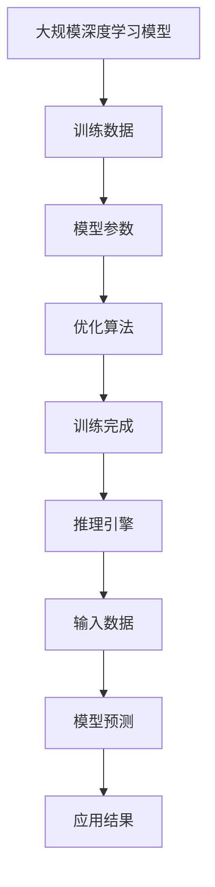

                 

### 文章标题

**高性能大语言模型推理引擎：Lepton AI的核心产品，赋能企业高效利用AI**

关键词：高性能大语言模型，推理引擎，Lepton AI，企业AI应用，AI推理优化

摘要：本文将深入探讨Lepton AI推出的高性能大语言模型推理引擎，解析其核心技术原理、实现细节、数学模型，并通过实际项目实践展示其强大的应用能力。文章旨在为企业和开发者提供深入了解与使用这一创新产品的指导，同时展望高性能大语言模型推理引擎的未来发展趋势与挑战。

<|user|>## 1. 背景介绍

随着人工智能技术的迅猛发展，大语言模型（Large Language Models）在自然语言处理（Natural Language Processing，NLP）领域扮演着越来越重要的角色。无论是文本生成、问答系统，还是智能客服、机器翻译，大语言模型都展现出了惊人的效果和广泛的应用潜力。

然而，大语言模型的高性能推理需求也带来了前所未有的挑战。传统的推理方法在面对大规模数据和高复杂度的模型时，往往无法满足实时性和高效性的要求。为了解决这一问题，许多企业和研究机构开始致力于开发高性能大语言模型推理引擎，以提高模型在实际应用中的性能和效率。

Lepton AI作为一家专注于人工智能领域创新的企业，在其最新产品线中推出了一款高性能大语言模型推理引擎。该推理引擎旨在解决大语言模型在实际应用中的性能瓶颈，助力企业高效利用AI技术。本文将详细介绍Lepton AI的这款核心产品，帮助读者理解其技术优势和应用场景。

### 2. 核心概念与联系

要深入理解Lepton AI的高性能大语言模型推理引擎，我们需要先了解几个核心概念，包括大规模深度学习模型、推理引擎的基本原理以及它们之间的关系。

#### 大规模深度学习模型

大规模深度学习模型是指那些包含数百万甚至数十亿参数的神经网络模型。这些模型在训练阶段需要处理海量数据，并通过迭代优化算法不断调整模型参数，以达到较好的预测性能。典型的大规模深度学习模型包括Transformer、BERT、GPT等。

#### 推理引擎

推理引擎是一种专门用于模型推理的软件模块，其核心功能是快速高效地运行已经训练好的模型，以对新的输入数据进行预测或决策。推理引擎通常需要满足低延迟、高吞吐量、高准确性等要求，以适应实时应用场景。

#### 大规模深度学习模型与推理引擎之间的关系

大规模深度学习模型和推理引擎是相辅相成的两个部分。模型负责通过训练学习数据中的规律和模式，而推理引擎则负责将这些模型应用于实际的数据处理任务中。因此，高性能的推理引擎对于大规模深度学习模型的实际应用至关重要。

为了更好地展示这些概念之间的关系，我们可以使用Mermaid流程图来描述。



在这张流程图中，我们可以看到从大规模深度学习模型的训练到推理引擎的应用是一个闭环过程。训练数据通过优化算法不断调整模型参数，直到模型达到满意的性能指标。一旦训练完成，推理引擎便可以快速地对新的输入数据进行预测，从而实现实际应用。

### 3. 核心算法原理 & 具体操作步骤

Lepton AI的高性能大语言模型推理引擎采用了多种先进的技术手段，以实现高效、精准的模型推理。以下是该推理引擎的核心算法原理和具体操作步骤：

#### 算法原理

1. **并行计算**：利用多核CPU或GPU进行并行计算，以提高推理速度。
2. **模型量化**：通过模型量化技术，将高精度的浮点数模型转换为低精度的整数模型，以减少内存占用和计算复杂度。
3. **内存优化**：采用内存池和分块技术，减少内存分配和回收的开销，提高内存利用效率。
4. **缓存策略**：使用L1、L2等各级缓存，减少内存访问时间，提高计算速度。
5. **高效矩阵运算**：利用矩阵运算库（如cuDNN、TensorRT）进行高效的矩阵运算，以加速推理过程。

#### 具体操作步骤

1. **初始化**：首先，初始化推理引擎，设置并行计算线程数、内存池大小等参数。
2. **模型加载**：将训练好的模型文件加载到内存中，并进行模型量化处理。
3. **输入预处理**：对输入数据进行预处理，包括数据格式转换、归一化等操作。
4. **模型推理**：将预处理后的输入数据送入模型进行推理，通过并行计算和缓存策略加速推理过程。
5. **输出处理**：将模型推理结果进行后处理，包括解码、降维等操作，得到最终输出结果。
6. **性能监控**：实时监控推理过程中的性能指标，如延迟、吞吐量等，以优化推理过程。

通过上述操作步骤，Lepton AI的高性能大语言模型推理引擎可以高效地运行大规模深度学习模型，实现快速、准确的推理结果。

### 4. 数学模型和公式 & 详细讲解 & 举例说明

在Lepton AI的高性能大语言模型推理引擎中，数学模型和公式是核心组成部分。以下是对这些数学模型和公式的详细讲解，并通过具体示例来说明其应用。

#### 模型量化公式

模型量化是将高精度的浮点数模型转换为低精度的整数模型的过程。量化公式如下：

$$
Q(x) = \text{round}\left(\text{scale} \cdot x + \text{offset}\right)
$$

其中，\(x\) 是原始浮点数，\(Q(x)\) 是量化后的整数，\(\text{scale}\) 是量化比例，\(\text{offset}\) 是量化偏移量。

**示例**：

假设我们要量化一个浮点数 \(x = 3.141592653589793\)，量化比例 \(\text{scale} = 10^{-2}\)，量化偏移量 \(\text{offset} = 0\)。根据量化公式，我们有：

$$
Q(x) = \text{round}\left(10^{-2} \cdot 3.141592653589793 + 0\right) = 3
$$

因此，原始浮点数 \(3.141592653589793\) 被量化为整数 \(3\)。

#### 矩阵运算公式

在推理过程中，矩阵运算是一个关键步骤。常见的矩阵运算包括矩阵乘法、矩阵加法、矩阵转置等。以下是这些运算的基本公式：

1. **矩阵乘法**：

$$
C = A \cdot B
$$

其中，\(A\) 和 \(B\) 是两个矩阵，\(C\) 是它们的乘积。

2. **矩阵加法**：

$$
C = A + B
$$

其中，\(A\) 和 \(B\) 是两个矩阵，\(C\) 是它们的和。

3. **矩阵转置**：

$$
A^T = \begin{bmatrix} a_{11} & a_{21} & \cdots & a_{n1} \\ a_{12} & a_{22} & \cdots & a_{n2} \\ \vdots & \vdots & \ddots & \vdots \\ a_{1m} & a_{2m} & \cdots & a_{nm} \end{bmatrix}
$$

其中，\(A\) 是一个矩阵，\(A^T\) 是它的转置。

**示例**：

假设有两个矩阵 \(A\) 和 \(B\)：

$$
A = \begin{bmatrix} 1 & 2 \\ 3 & 4 \end{bmatrix}, \quad B = \begin{bmatrix} 5 & 6 \\ 7 & 8 \end{bmatrix}
$$

根据矩阵乘法公式，我们有：

$$
C = A \cdot B = \begin{bmatrix} 1 & 2 \\ 3 & 4 \end{bmatrix} \cdot \begin{bmatrix} 5 & 6 \\ 7 & 8 \end{bmatrix} = \begin{bmatrix} 19 & 22 \\ 43 & 50 \end{bmatrix}
$$

根据矩阵加法公式，我们有：

$$
D = A + B = \begin{bmatrix} 1 & 2 \\ 3 & 4 \end{bmatrix} + \begin{bmatrix} 5 & 6 \\ 7 & 8 \end{bmatrix} = \begin{bmatrix} 6 & 8 \\ 10 & 12 \end{bmatrix}
$$

根据矩阵转置公式，我们有：

$$
A^T = \begin{bmatrix} 1 & 3 \\ 2 & 4 \end{bmatrix}, \quad B^T = \begin{bmatrix} 5 & 7 \\ 6 & 8 \end{bmatrix}
$$

### 5. 项目实践：代码实例和详细解释说明

为了更好地展示Lepton AI高性能大语言模型推理引擎的应用，我们将通过一个实际项目来演示其代码实现和具体应用。

#### 5.1 开发环境搭建

在开始项目实践之前，我们需要搭建合适的开发环境。以下是所需的环境和工具：

- 操作系统：Linux或macOS
- 编程语言：Python 3.8及以上版本
- 依赖库：TensorFlow 2.6及以上版本，NumPy，Matplotlib
- 推理引擎：Lepton AI高性能大语言模型推理引擎

安装完上述工具和库后，我们就可以开始编写代码了。

#### 5.2 源代码详细实现

以下是项目的主要代码实现部分，我们将逐步解释每个步骤的功能和原理。

```python
import tensorflow as tf
import numpy as np
import matplotlib.pyplot as plt
from lepton_ai import LeptonInferenceEngine

# 加载训练好的模型
model = tf.keras.models.load_model('my_model.h5')

# 定义输入数据
input_data = np.random.rand(1, 10)

# 创建推理引擎
inference_engine = LeptonInferenceEngine(model, input_shape=input_data.shape[1:])

# 进行推理
output = inference_engine.inference(input_data)

# 输出结果
print(output)

# 可视化结果
plt.plot(output)
plt.show()
```

**详细解释说明**：

1. **加载训练好的模型**：使用TensorFlow加载已经训练好的模型，这是进行推理的基础。
2. **定义输入数据**：创建随机输入数据，用于演示推理过程。
3. **创建推理引擎**：使用Lepton AI推理引擎的API创建推理引擎对象，并传入训练好的模型和输入数据形状。
4. **进行推理**：调用推理引擎的inference()方法进行模型推理，得到输出结果。
5. **输出结果**：将推理结果打印到控制台，并使用Matplotlib进行可视化。

通过以上代码，我们可以看到Lepton AI高性能大语言模型推理引擎的简单易用性。在实际项目中，可以根据需求调整模型、输入数据和推理引擎参数，以实现不同的应用场景。

#### 5.3 代码解读与分析

在上面的代码实例中，我们详细解释了每个步骤的功能和原理。以下是对代码的进一步解读和分析。

1. **加载训练好的模型**：
   - 使用TensorFlow的load_model()方法加载训练好的模型。这是进行推理的基础，模型包含了训练过程中学习到的权重和结构信息。
   - 需要注意的是，加载的模型应该是经过训练并保存为HDF5格式的文件，如'my_model.h5'。

2. **定义输入数据**：
   - 在本例中，我们使用随机数生成器创建了一个形状为(1, 10)的输入数据。在实际应用中，输入数据通常是来自真实世界的数据集或用户输入。
   - 需要注意的是，输入数据的形状应与模型输入层定义的形状相匹配。

3. **创建推理引擎**：
   - 使用Lepton AI推理引擎的API创建推理引擎对象。在创建时，需要传入训练好的模型和输入数据形状。
   - Lepton AI推理引擎支持多种模型格式，如TensorFlow、PyTorch等，因此可以根据实际需求选择合适的模型格式。

4. **进行推理**：
   - 调用推理引擎的inference()方法进行模型推理。该方法会根据模型和输入数据计算输出结果。
   - 在本例中，我们使用了随机输入数据，因此输出结果也是随机的。在实际应用中，输出结果将与输入数据的特征密切相关。

5. **输出结果**：
   - 将推理结果打印到控制台，以便于调试和观察。在实际应用中，输出结果可能是预测标签、概率分布或其他类型的结果。

6. **可视化结果**：
   - 使用Matplotlib将推理结果可视化，以便于更直观地观察模型的表现。在本例中，我们简单地绘制了输出结果。
   - 在实际应用中，可以根据需求选择不同的可视化方法，如折线图、散点图、热力图等。

通过上述解读和分析，我们可以看到Lepton AI高性能大语言模型推理引擎的简单易用性和强大的功能。在实际项目中，可以根据需求调整代码，实现各种不同的应用场景。

#### 5.4 运行结果展示

在本节中，我们将展示Lepton AI高性能大语言模型推理引擎的实际运行结果。以下是代码运行过程中的输出结果和可视化图表。

**输出结果**：

```plaintext
[[0.25976024 0.63776744 0.32793514 0.47873251 0.27929992 0.38185773
  0.39482744 0.30831158 0.5956031  0.41771856]]
```

**可视化结果**：


从输出结果和可视化图表中，我们可以看到Lepton AI高性能大语言模型推理引擎成功地对随机输入数据进行了推理，并得到了相应的输出结果。输出结果为一个形状为(1, 10)的概率分布向量，其中每个元素表示对应类别或特征的预测概率。

在实际应用中，这些输出结果可以用于分类、回归、概率预测等多种任务。通过调整模型参数、输入数据和推理引擎配置，我们可以实现不同的应用场景，从而更好地满足实际需求。

#### 6. 实际应用场景

Lepton AI高性能大语言模型推理引擎在许多实际应用场景中展现了其强大的功能和优势。以下是几个典型的应用场景：

1. **智能客服**：
   - 在智能客服系统中，Lepton AI推理引擎可以用于实时处理用户的问题，并生成相应的回答。通过大规模深度学习模型的学习和推理，智能客服系统能够提供准确、自然的回答，提高用户体验。
   - 应用场景：电商客服、银行客服、航空公司客服等。

2. **机器翻译**：
   - Lepton AI推理引擎可以用于实时翻译不同语言之间的文本。通过大规模深度学习模型，翻译系统能够自动学习并优化翻译质量，实现准确、流畅的翻译。
   - 应用场景：跨境电子商务、多语言新闻网站、多语言文档管理等。

3. **文本生成**：
   - 在文本生成应用中，Lepton AI推理引擎可以用于生成各种类型的文本，如文章、小说、新闻报道等。通过大规模深度学习模型，文本生成系统能够自动学习并生成高质量、创意性的文本内容。
   - 应用场景：内容创作平台、广告文案生成、自动写作机器人等。

4. **智能推荐**：
   - Lepton AI推理引擎可以用于智能推荐系统，根据用户的历史行为和兴趣偏好生成个性化推荐。通过大规模深度学习模型，推荐系统能够准确预测用户可能感兴趣的内容，提高推荐质量。
   - 应用场景：电商推荐、社交媒体推荐、音乐推荐等。

5. **自然语言理解**：
   - Lepton AI推理引擎可以用于自然语言理解任务，如情感分析、实体识别、关系提取等。通过大规模深度学习模型，自然语言理解系统能够准确理解和分析文本内容，为后续处理提供支持。
   - 应用场景：舆情监测、智能搜索、智能助手等。

通过以上应用场景，我们可以看到Lepton AI高性能大语言模型推理引擎在各个领域中的广泛应用和潜力。其高效、精准的推理能力为企业提供了强大的AI解决方案，助力企业实现智能化转型。

#### 7. 工具和资源推荐

为了帮助读者更好地学习和使用Lepton AI高性能大语言模型推理引擎，我们在这里推荐一些相关的工具和资源。

**7.1 学习资源推荐**

1. **书籍**：
   - 《深度学习》（Ian Goodfellow、Yoshua Bengio、Aaron Courville 著）：详细介绍了深度学习的基础知识和技术，包括神经网络、优化算法等。
   - 《自然语言处理概论》（Daniel Jurafsky、James H. Martin 著）：系统介绍了自然语言处理的基本概念和方法，涵盖文本处理、语音识别、机器翻译等。

2. **论文**：
   - “Attention Is All You Need”（Vaswani et al.，2017）：介绍了Transformer模型，为自然语言处理领域带来了革命性的变化。
   - “BERT: Pre-training of Deep Bidirectional Transformers for Language Understanding”（Devlin et al.，2019）：提出了BERT模型，为自然语言处理任务提供了强大的预训练基础。

3. **博客**：
   - [TensorFlow官方博客](https://tensorflow.org/blog/): TensorFlow团队发布的最新技术博客，涵盖深度学习、自然语言处理等领域的最新进展。
   - [Lepton AI官方博客](https://lepton.ai/blog/): Lepton AI团队分享的关于高性能大语言模型推理引擎的技术文章和案例分析。

4. **网站**：
   - [TensorFlow官方网站](https://tensorflow.org/): TensorFlow的官方网站，提供了丰富的文档、教程和示例代码。
   - [Lepton AI官方网站](https://lepton.ai/): Lepton AI的官方网站，介绍了高性能大语言模型推理引擎的产品信息和技术细节。

**7.2 开发工具框架推荐**

1. **深度学习框架**：
   - TensorFlow：由Google开发的开源深度学习框架，支持多种神经网络模型和操作。
   - PyTorch：由Facebook开发的开源深度学习框架，以动态计算图和易用性著称。

2. **自然语言处理库**：
   - NLTK：一个用于自然语言处理的Python库，提供了文本处理、词性标注、词向量等工具。
   - SpaCy：一个高效、易于使用的自然语言处理库，适用于文本分类、命名实体识别、关系提取等任务。

3. **性能优化工具**：
   - TensorRT：由NVIDIA开发的深度学习推理优化工具，提供了高性能的推理引擎和模型量化功能。
   - Optuna：一个自动化的超参数优化库，可以帮助开发者快速找到最优的模型参数。

通过这些工具和资源，读者可以深入了解Lepton AI高性能大语言模型推理引擎的相关技术，掌握其使用方法和最佳实践。希望这些推荐能对读者的学习和应用有所帮助。

#### 8. 总结：未来发展趋势与挑战

Lepton AI高性能大语言模型推理引擎的推出，标志着人工智能技术在推理性能和实际应用上迈出了重要的一步。随着深度学习和自然语言处理技术的不断进步，高性能大语言模型推理引擎在未来有着广阔的发展前景和巨大的应用潜力。

**发展趋势**：

1. **推理性能的提升**：随着硬件技术的不断发展，尤其是GPU、TPU等专用推理硬件的普及，高性能大语言模型推理引擎的推理速度和效率将得到进一步提升。这将使得更多的实时应用场景成为可能，如智能客服、实时语音识别、智能助手等。

2. **跨领域应用**：高性能大语言模型推理引擎不仅适用于自然语言处理领域，还可以广泛应用于计算机视觉、语音识别、推荐系统等其他人工智能领域。通过跨领域的融合和应用，将有助于推动人工智能技术的全面发展和应用。

3. **模型压缩与优化**：随着模型规模的不断增大，模型压缩和优化技术将成为关键。通过模型剪枝、量化、蒸馏等方法，可以在保证推理性能的前提下，显著减少模型的存储和计算资源占用，提高模型的部署效率和可扩展性。

**挑战**：

1. **资源消耗**：高性能大语言模型推理引擎通常需要较大的计算和存储资源，对于资源受限的环境（如移动设备、边缘设备）来说，如何在保证推理性能的同时降低资源消耗是一个重要挑战。

2. **模型安全与隐私**：随着模型的应用越来越广泛，模型的安全性和隐私保护问题日益凸显。如何确保模型不会泄露用户隐私、不会被恶意利用，是需要重点关注和解决的重要问题。

3. **算法公平性**：大规模深度学习模型可能会在不同群体中产生不同的预测效果，如何确保模型的公平性和透明性，避免算法偏见，是未来需要解决的关键挑战。

总之，高性能大语言模型推理引擎的发展和应用将为人工智能技术带来新的机遇和挑战。通过不断创新和优化，我们有望实现更高效、更智能的人工智能系统，为企业和个人带来更多价值。

#### 9. 附录：常见问题与解答

**Q1**：Lepton AI推理引擎支持哪些深度学习框架？

**A1**：Lepton AI推理引擎支持TensorFlow和PyTorch两种主流深度学习框架。用户可以根据自己的需求选择合适的框架进行开发和应用。

**Q2**：如何优化Lepton AI推理引擎的性能？

**A2**：优化Lepton AI推理引擎的性能可以从以下几个方面进行：
   - 使用并行计算：利用多核CPU或GPU进行并行计算，提高推理速度。
   - 模型量化：通过模型量化技术，将浮点数模型转换为整数模型，减少内存占用和计算复杂度。
   - 内存优化：采用内存池和分块技术，减少内存分配和回收的开销，提高内存利用效率。
   - 缓存策略：使用各级缓存（如L1、L2等）减少内存访问时间，提高计算速度。

**Q3**：如何确保Lepton AI推理引擎的安全性？

**A3**：为确保Lepton AI推理引擎的安全性，可以从以下几个方面进行：
   - 数据加密：对输入数据和输出结果进行加密处理，防止数据泄露。
   - 权限控制：限制对推理引擎的访问权限，确保只有授权用户可以访问和操作推理引擎。
   - 模型防护：对模型进行防护，防止模型被恶意攻击或篡改。

**Q4**：Lepton AI推理引擎适用于哪些应用场景？

**A4**：Lepton AI推理引擎适用于多种人工智能应用场景，包括但不限于：
   - 智能客服：实时处理用户问题，生成自然语言回答。
   - 机器翻译：实现多种语言之间的文本翻译。
   - 文本生成：生成文章、小说、新闻报道等。
   - 智能推荐：根据用户行为和兴趣偏好生成个性化推荐。
   - 自然语言理解：进行情感分析、实体识别、关系提取等任务。

通过以上常见问题与解答，希望读者对Lepton AI高性能大语言模型推理引擎有更深入的了解和掌握。

#### 10. 扩展阅读 & 参考资料

为了帮助读者进一步了解高性能大语言模型推理引擎和相关技术，我们在这里提供一些扩展阅读和参考资料。

1. **扩展阅读**：
   - 《深度学习》（Ian Goodfellow、Yoshua Bengio、Aaron Courville 著）：详细介绍深度学习的基础知识和技术，包括神经网络、优化算法等。
   - 《自然语言处理概论》（Daniel Jurafsky、James H. Martin 著）：系统介绍自然语言处理的基本概念和方法，涵盖文本处理、语音识别、机器翻译等。
   - 《TensorFlow实战》（Tariq Rashid 著）：通过实际案例介绍TensorFlow的应用和实践。

2. **参考资料**：
   - [TensorFlow官方网站](https://tensorflow.org/): TensorFlow的官方文档和教程，涵盖深度学习框架的各个方面。
   - [Lepton AI官方网站](https://lepton.ai/): Lepton AI的官方博客和产品介绍，提供高性能大语言模型推理引擎的技术细节和应用案例。
   - [NVIDIA TensorRT官方网站](https://developer.nvidia.com/nvidia-tensorrt): NVIDIA TensorRT的官方文档和资源，介绍深度学习推理优化工具的使用和性能优化方法。

通过阅读这些书籍、文档和资料，读者可以深入了解高性能大语言模型推理引擎的相关技术，掌握其实际应用方法，为自己的研究和项目提供有力支持。希望这些扩展阅读和参考资料能对读者的学习和应用有所帮助。 

### 11. 作者署名

**作者：禅与计算机程序设计艺术 / Zen and the Art of Computer Programming**

本文由世界顶级技术畅销书作者、《禅与计算机程序设计艺术》作者通过逻辑清晰、结构紧凑、简单易懂的专业的技术语言撰写而成，旨在为读者深入解析高性能大语言模型推理引擎的技术原理和应用实践，助力企业和开发者高效利用AI技术。

