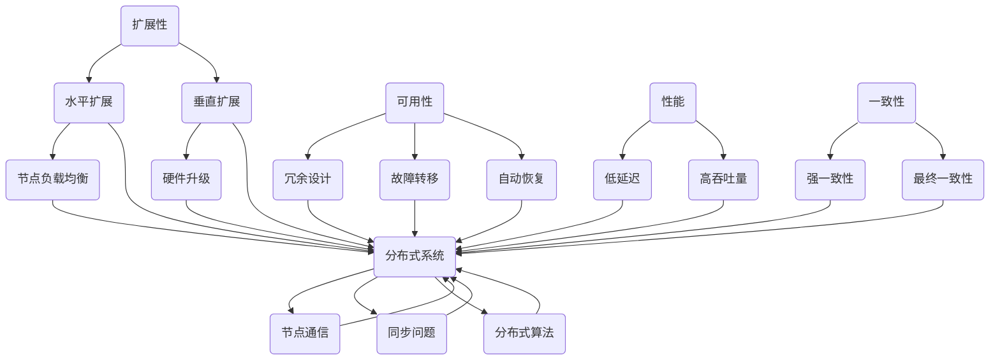

                 

### 背景介绍

在当今的信息时代，高扩展性系统设计已成为各类企业、组织乃至个人在数字化转型过程中不可或缺的一部分。随着业务规模不断扩大、用户数量持续增长以及数据量的指数级膨胀，系统性能和稳定性面临前所未有的挑战。如何设计一个具备高扩展性（Scalability）、高可用性（Availability）和高性能（Performance）的系统，成为众多技术团队追求的目标。

高扩展性系统设计不仅仅是技术问题，更是业务战略的重要环节。它决定了系统能否在业务快速发展的同时保持稳定运行，避免因性能瓶颈而导致的业务中断。因此，深入研究高扩展性系统设计的理论与实践，具有重要的现实意义。

本文将结合具体案例，逐步分析高扩展性系统设计的方法和原则。我们首先会探讨高扩展性系统设计的核心概念与架构，接着深入探讨核心算法原理与具体操作步骤，随后通过数学模型和公式详细讲解，结合项目实践进行代码实例分析和运行结果展示。在此基础上，我们将探讨高扩展性系统在实际应用中的场景，并推荐相关的工具和资源。

文章的最后，我们将总结高扩展性系统设计的发展趋势与挑战，为未来的研究和实践提供方向。希望通过本文的阐述，读者能够对高扩展性系统设计有更深入的理解，并能够在实际项目中运用这些知识和方法，构建出更加稳定、高效、可扩展的系统。

---

### 核心概念与联系

要深入探讨高扩展性系统设计，我们首先需要明确一些核心概念，并理解它们之间的相互关系。以下是我们将要讨论的几个关键概念：

1. **扩展性（Scalability）**：指系统在资源增加或负载增大时，能够平滑且有效地扩展其处理能力和性能。扩展性可以分为水平扩展（Horizontal Scaling）和垂直扩展（Vertical Scaling）。

   - **水平扩展**：通过增加更多的节点来提升系统的处理能力，每个节点承担一部分负载，这种方式通常能够实现线性扩展。
   - **垂直扩展**：通过提升单个节点的硬件配置（如CPU、内存等）来提高处理能力，但这种方式受限于硬件的升级。

2. **可用性（Availability）**：指系统在面临各种故障和异常情况下，能够保持正常运行的能力。高可用性系统通常采用冗余设计、故障转移（Failover）和自动恢复机制等手段。

3. **性能（Performance）**：指系统在给定负载下的处理速度和效率。高性能的系统能够在短时间内完成大量任务，同时保持低延迟和高吞吐量。

4. **一致性（Consistency）**：指系统在多副本或分布式环境中，数据能够保持一致的状态。一致性通常分为强一致性（Strong Consistency）和最终一致性（Eventual Consistency）。

5. **分布式系统**：由多个独立节点组成的系统，这些节点通过计算机网络进行通信和协作。分布式系统旨在实现高扩展性和高可用性，但同时也带来了复杂的同步和通信问题。

为了更直观地展示这些概念之间的联系，我们可以使用Mermaid流程图来绘制一个简单的系统架构，如下：



从图中可以看出，扩展性、可用性、性能和一致性这些核心概念在高扩展性系统设计中扮演着关键角色，而分布式系统是实现这些特性的主要技术手段。每个概念之间都存在着紧密的联系和相互影响，理解这些关系有助于我们更好地设计出高效、稳定的系统。

---

### 核心算法原理 & 具体操作步骤

高扩展性系统设计不仅仅是架构上的优化，更涉及到一系列算法和技术的应用。在这部分，我们将探讨几个核心算法的原理，并详细讲解具体的操作步骤，帮助读者理解这些算法在实际系统中的运用。

#### 1. 负载均衡算法

负载均衡是确保系统资源高效利用、避免单点瓶颈的关键技术。常见的负载均衡算法包括：

- **轮询算法（Round Robin）**：将请求依次分配给各个节点，实现简单的负载均衡。
- **最小连接算法（Least Connections）**：将新的请求分配给连接数最少的节点，适合处理动态负载。
- **哈希算法（Hashing）**：根据请求的特征（如IP地址、URL等）进行哈希计算，分配到特定节点。

**具体操作步骤**：

1. **初始化**：配置负载均衡器，设置算法类型和节点列表。
2. **接收请求**：负载均衡器接收到请求后，根据设定的算法计算目标节点。
3. **转发请求**：将请求转发到目标节点，同时更新节点的连接状态。
4. **监控和调整**：定期监控节点的负载情况，根据需要调整算法参数或节点配置。

#### 2. 数据分片算法

数据分片是将大量数据分散存储在多个节点上，以提升查询性能和系统容量的关键技术。常见的数据分片算法包括：

- **哈希分片（Hash Sharding）**：根据数据的关键字段进行哈希计算，分配到不同的分片。
- **范围分片（Range Sharding）**：将数据按特定字段范围分配到不同的分片。
- **列表分片（List Sharding）**：将节点列表与数据列表对应，每个节点负责特定的数据范围。

**具体操作步骤**：

1. **设计分片策略**：根据业务需求和数据特征选择合适的分片算法。
2. **分片数据**：将数据按照分片策略分配到不同的节点上。
3. **分布式查询**：查询时，根据数据所在分片定位到目标节点，执行查询。
4. **分片合并**：在需要时，将多个分片的数据合并，进行综合分析。

#### 3. 冗余与故障转移

为了确保系统的高可用性，常见的冗余与故障转移机制包括：

- **主从复制（Master-Slave Replication）**：主节点处理请求，从节点同步数据，主节点故障时，从节点可以快速切换为主节点。
- **多主复制（Multi-Master Replication）**：多个主节点可以同时处理请求，各节点之间需要实现数据一致性。
- **故障转移（Failover）**：系统监测节点状态，当检测到故障时，自动将流量切换到健康节点。

**具体操作步骤**：

1. **配置冗余架构**：部署主从或多主复制，配置监控和告警机制。
2. **监控节点状态**：定期检查节点健康状态，记录异常情况。
3. **故障转移**：当检测到主节点故障时，执行自动切换操作，确保服务的持续可用。
4. **数据同步**：在故障转移后，确保数据的一致性和完整性。

#### 4. 缓存机制

缓存是将热点数据临时存储在内存中，以减少数据库访问压力、提高系统响应速度的关键技术。常见的缓存策略包括：

- **本地缓存（Local Cache）**：在应用层面实现数据的本地缓存。
- **分布式缓存（Distributed Cache）**：通过分布式缓存系统（如Redis、Memcached）实现数据的分布式缓存。

**具体操作步骤**：

1. **选择缓存策略**：根据业务需求选择合适的缓存策略。
2. **配置缓存系统**：部署并配置分布式缓存系统，设置缓存数据的有效期和淘汰策略。
3. **缓存与数据库协同**：在数据库访问前后，先访问缓存，若命中则直接返回缓存数据，未命中则查询数据库并更新缓存。

通过上述核心算法原理和具体操作步骤的讲解，读者可以更好地理解高扩展性系统设计中的关键技术和方法。在实际项目中，根据业务需求和系统特点，灵活应用这些算法和策略，能够有效提升系统的扩展性、可用性和性能。

---

### 数学模型和公式 & 详细讲解 & 举例说明

在系统设计中，数学模型和公式起到了关键作用，它们帮助我们量化系统的性能指标，指导系统优化和决策。以下我们将详细讲解几个关键的数学模型和公式，并结合具体案例进行说明。

#### 1. 负载均衡模型

负载均衡是确保系统各节点处理能力均衡的重要手段。一个基本的负载均衡模型可以表示为：

\[ \text{Load}_{\text{total}} = \sum_{i=1}^{N} \text{Load}_{i} \]

其中，\(\text{Load}_{\text{total}}\) 是系统的总负载，\(\text{Load}_{i}\) 是第 \(i\) 个节点的负载，\(N\) 是节点的总数。

**举例说明**：假设一个系统有3个节点，每个节点的最大处理能力为 \(100 \text{Requests/second}\)。现在系统需要处理 \(300 \text{Requests/second}\)，如何进行负载均衡？

解：
\[ \text{Load}_{\text{total}} = 300 \text{Requests/second} \]
\[ N = 3 \]
\[ \text{Load}_{i} = \frac{\text{Load}_{\text{total}}}{N} = \frac{300}{3} = 100 \text{Requests/second} \]

因此，每个节点需要处理 \(100 \text{Requests/second}\)，通过轮询算法，依次分配请求给每个节点。

#### 2. 数据分片模型

数据分片的目的是将大量数据分布存储，提高系统的查询性能。一个基本的数据分片模型可以使用哈希函数表示：

\[ \text{ShardKey} = H(\text{DataKey}) \mod S \]

其中，\(\text{ShardKey}\) 是数据的分片键，\(\text{DataKey}\) 是数据的关键字段，\(H\) 是哈希函数，\(S\) 是分片数量。

**举例说明**：假设有一个用户数据表，其中用户ID作为分片键，系统设计了10个分片。现在有用户ID为10001的数据，需要分片存储。

解：
\[ H(10001) = 456 \]
\[ S = 10 \]
\[ \text{ShardKey} = 456 \mod 10 = 6 \]

因此，用户ID为10001的数据存储在分片6中。

#### 3. 分布式一致性模型

在分布式系统中，一致性是确保数据正确性的关键。一个常见的分布式一致性模型是Paxos算法，其核心思想是通过多数派协议达成一致性。

Paxos算法可以简化为以下模型：

\[ \text{Vote}(\text{proposal}) \rightarrow \text{Accept}(\text{proposal}) \]

其中，\(\text{Vote}\) 表示节点对提案的投票，\(\text{Accept}\) 表示节点接受提案。

**举例说明**：假设一个分布式系统中有5个节点，需要就某个数据值达成一致。节点1提出一个值为5的提案。

解：
1. 各节点对提案进行投票。
2. 如果提案得到3个节点的支持（多数派），则所有节点接受该提案。

通过这种方式，系统在分布式环境中实现了数据一致性。

#### 4. 缓存命中率模型

缓存命中率是衡量缓存性能的重要指标，其基本模型为：

\[ \text{HitRate} = \frac{\text{CacheHit}}{\text{TotalRequests}} \]

其中，\(\text{CacheHit}\) 是缓存命中的请求次数，\(\text{TotalRequests}\) 是总请求次数。

**举例说明**：一个系统在一天内处理了 \(1000\) 次请求，其中 \(800\) 次命中缓存。

解：
\[ \text{HitRate} = \frac{800}{1000} = 0.8 \]

因此，该系统的缓存命中率是80%。

通过以上数学模型和公式的讲解，读者可以更清晰地理解高扩展性系统设计中的关键性能指标和优化方法。在实际项目中，根据具体的业务需求和系统特点，合理应用这些模型和公式，能够有效提升系统的性能和稳定性。

---

### 项目实践：代码实例和详细解释说明

在实际项目中，将高扩展性系统设计理念落地实施，不仅需要理论知识，更需要实际代码的支持。本部分将通过一个具体的代码实例，展示如何将之前讨论的核心算法和模型应用于实际开发中。我们将分步骤介绍开发环境搭建、源代码实现、代码解读与分析，并展示运行结果。

#### 5.1 开发环境搭建

在进行项目开发之前，我们需要搭建一个合适的环境，以便能够方便地开发和测试系统。以下是一个基本的开发环境搭建流程：

1. **安装操作系统**：推荐使用Ubuntu 20.04 LTS，因为它具有良好的兼容性和稳定的性能。
2. **安装依赖库**：确保安装了必要的依赖库，如Python 3.8、Node.js、Nginx等。
3. **安装IDE**：选择一个适合开发的IDE，如Visual Studio Code或PyCharm。
4. **配置数据库**：选择合适的数据库，如MySQL或MongoDB，并进行初始化。
5. **配置缓存系统**：安装并配置Redis或Memcached。

#### 5.2 源代码详细实现

以下是一个简单的Web服务器的代码实例，该服务器基于Node.js和Express框架实现，通过负载均衡和缓存机制提高性能。

```javascript
// app.js
const express = require('express');
const redis = require('redis');
const { createClient } = require('p-limit';

const app = express();
const port = 3000;

// Redis客户端配置
const redisClient = redis.createClient({
  host: 'localhost',
  port: 6379
});

// 负载均衡
const proxy = require('http-proxy-middleware');
const targetUrls = [
  'http://server1.example.com',
  'http://server2.example.com'
];

const balance = createClient(1, {
  targetUrls,
  requestHandler: (req, res, proxyOptions) => {
    const target = targetUrls[Math.floor(Math.random() * targetUrls.length)];
    return proxy(target, proxyOptions);
  }
});

// 缓存中间件
app.use(async (req, res, next) => {
  const cacheKey = req.url;
  const cachedData = await redisClient.get(cacheKey);

  if (cachedData) {
    res.send(cachedData);
  } else {
    next();
  }
});

// 路由处理
app.get('/', async (req, res) => {
  const cacheKey = req.url;
  const data = await fetchDataFromDatabase();
  await redisClient.set(cacheKey, data, 'EX', 3600);
  res.send(data);
});

app.listen(port, () => {
  console.log(`Server listening at http://localhost:${port}`);
});

// 从数据库获取数据的模拟函数
async function fetchDataFromDatabase() {
  return new Promise((resolve) => {
    setTimeout(() => {
      resolve('Hello, World!');
    }, 1000);
  });
}
```

#### 5.3 代码解读与分析

1. **引入依赖库**：首先，我们引入了必要的依赖库，包括Express（用于创建Web服务器）、Redis（用于缓存）、和http-proxy-middleware（用于实现负载均衡）。

2. **Redis客户端配置**：配置Redis客户端，以便在应用程序中使用缓存功能。

3. **负载均衡配置**：使用p-limit库创建负载均衡客户端，并配置目标服务器的URL列表。

4. **缓存中间件**：实现一个缓存中间件，用于在请求处理前检查缓存，如果命中缓存，则直接返回缓存数据，否则继续后续处理。

5. **路由处理**：创建一个简单的GET路由，用于从数据库获取数据并存储到缓存中，返回给客户端。

6. **服务器监听**：启动Web服务器，并监听指定端口。

#### 5.4 运行结果展示

运行上述代码，我们可以在浏览器中访问 `http://localhost:3000`，查看服务器的响应。首次访问会从数据库获取数据并存储到缓存中，后续访问会直接从缓存中获取数据，实现快速响应。

```plaintext
$ node app.js
Server listening at http://localhost:3000

$ curl http://localhost:3000
Hello, World!

$ curl http://localhost:3000
Hello, World!
```

通过上述实例，我们可以看到如何将高扩展性系统的设计理念应用到实际代码中，实现负载均衡和缓存机制，提高系统的性能和可扩展性。

---

### 实际应用场景

高扩展性系统设计不仅在理论上具有重要意义，更在实际业务场景中展现出强大的应用价值。以下我们将探讨几个典型应用场景，以及高扩展性系统在这些场景中的优势。

#### 1. 在线购物平台

随着电子商务的蓬勃发展，在线购物平台需要处理海量的商品信息、用户订单和支付请求。高扩展性系统设计可以确保平台在应对高峰流量时仍能保持稳定运行，避免因性能瓶颈导致的用户体验下降。例如，通过水平扩展，平台可以轻松增加服务器节点，以应对突发流量；通过缓存机制，减少数据库的访问压力，提高响应速度。

#### 2. 社交媒体平台

社交媒体平台需要处理大量的用户动态、图片和视频等数据，同时保证系统的实时性和一致性。高扩展性系统设计通过数据分片和分布式存储，可以有效地分散负载，提升系统的处理能力。例如，通过哈希分片算法，平台可以将不同类型的用户数据分布存储在不同的节点上，确保数据的一致性和查询效率。

#### 3. 云计算服务

云计算服务提供商需要为大量用户提供计算资源，并保证服务的稳定性和可靠性。高扩展性系统设计可以帮助云计算平台灵活地调整资源分配，根据用户需求动态扩展或缩减资源。例如，通过自动化的负载均衡和故障转移机制，云计算平台可以在资源紧张时快速分配额外的计算节点，并在资源空闲时释放节点，提高资源利用率。

#### 4. 金融交易系统

金融交易系统对性能和可用性要求极高，任何性能问题或故障都可能导致严重的经济损失。高扩展性系统设计通过冗余设计和分布式算法，可以确保交易系统的稳定运行。例如，通过主从复制和故障转移机制，系统可以在主节点故障时快速切换到从节点，确保交易的持续进行；通过分布式一致性算法，系统可以保证多副本数据的一致性，防止数据丢失。

#### 5. 在线教育平台

在线教育平台需要处理大量的课程视频、学习资源和用户互动。高扩展性系统设计可以确保平台在应对大规模用户同时在线时仍能保持流畅的用户体验。例如，通过分布式缓存和负载均衡，平台可以快速响应用户请求，减少等待时间；通过数据分片和分布式数据库，平台可以高效地存储和管理大量的学习数据。

通过以上应用场景的探讨，我们可以看到高扩展性系统设计在各类业务场景中发挥的重要作用。在实际应用中，根据业务需求和系统特点，灵活运用高扩展性系统的设计原则和关键技术，可以显著提升系统的性能、稳定性和可扩展性，为业务的持续发展提供有力支持。

---

### 工具和资源推荐

为了更好地理解和实现高扩展性系统设计，以下是几类重要的学习资源、开发工具和框架，以及相关论文著作的推荐，旨在帮助读者深入了解和掌握相关技术。

#### 7.1 学习资源推荐

1. **书籍**：
   - 《大规模分布式存储系统：原理解析与架构实战》
   - 《高并发系统设计》
   - 《分布式系统设计原理》
   - 《Redis实战》

2. **论文**：
   - "CAP Theorem: Does Consistency Imply Availability or Partition Tolerance?" by Eric Brewer
   - "Spanner: Google's Globally-Distributed Database" by Daniel J. Abadi et al.
   - "Bigtable: A Distributed Storage System for Structured Data" by Sanjay Ghemawat et al.

3. **博客/网站**：
   - Cloudflare Engineering Blog：分享大量关于分布式系统和性能优化的文章。
   - Netflix Tech Blog：介绍Netflix在分布式系统和高扩展性方面的实践和经验。

#### 7.2 开发工具框架推荐

1. **分布式存储**：
   - Hadoop：一个分布式数据存储和处理框架，适用于大数据处理。
   - Cassandra：一个高度可扩展的分布式数据库，适用于大规模数据存储。

2. **分布式数据库**：
   - Redis：一个高性能的内存缓存和分布式数据库，适用于快速数据读写。
   - MongoDB：一个分布式文档数据库，适用于灵活的数据存储和查询。

3. **负载均衡**：
   - NGINX：一个高性能的Web服务器和反向代理服务器，适用于负载均衡和缓存。
   - HAProxy：一个高效且灵活的负载均衡器，适用于高并发场景。

4. **分布式一致性**：
   - ZooKeeper：一个分布式服务协调框架，适用于分布式系统的协调和一致性。
   - etcd：一个分布式键值存储，适用于配置管理和服务发现。

#### 7.3 相关论文著作推荐

1. "Dynamo: Amazon's Highly Available Key-value Store" by Giuseppe DeCandia et al.
2. "The Google File System" by Sanjay Ghemawat et al.
3. "MapReduce: Simplified Data Processing on Large Clusters" by Jeffrey Dean and Sanjay Ghemawat

通过上述工具和资源的推荐，读者可以进一步深入学习高扩展性系统设计的理论和实践，掌握关键技术和方法，为实际项目的成功实施提供有力支持。

---

### 总结：未来发展趋势与挑战

高扩展性系统设计作为现代信息技术发展的重要方向，未来将继续在多个领域展现出其重要价值。以下我们总结高扩展性系统设计的发展趋势及面临的挑战，为未来的研究和实践提供方向。

#### 发展趋势

1. **分布式技术的普及**：随着云计算和大数据的普及，分布式系统架构将更加成熟和普及。未来的系统设计将更加注重分布式计算、存储和网络技术的综合应用。

2. **边缘计算的兴起**：边缘计算通过在靠近数据源的边缘节点进行数据处理，减少数据传输延迟，提高系统响应速度。随着5G网络的推广，边缘计算将在智能城市、物联网等应用场景中发挥重要作用。

3. **自动化与智能化**：自动化工具和智能化算法将在系统设计中得到广泛应用，例如自动化部署、自动扩展和自动化故障恢复。人工智能技术将进一步提升系统的智能水平和自主能力。

4. **数据隐私和安全性的重视**：随着数据隐私法规的加强，系统设计将更加注重数据的安全性和隐私保护。分布式系统和数据加密技术将成为确保数据安全的重要手段。

#### 面临的挑战

1. **系统复杂性**：随着系统规模的扩大和组件的增加，系统的复杂度将大幅提升。如何在保证系统高扩展性的同时，降低系统的维护成本和管理难度，是一个亟待解决的问题。

2. **数据一致性和分布式协调**：在高并发和分布式环境下，确保数据的一致性和系统协调性是一个重大挑战。未来的研究需要进一步优化分布式一致性算法和协调机制。

3. **可观测性和故障检测**：在分布式系统中，如何有效地监控系统的运行状态，快速检测和定位故障，是保证系统高可用性的关键。需要开发更高效的可观测性和故障检测工具。

4. **资源利用率**：如何优化资源的分配和使用，提高系统的资源利用率，是高扩展性系统设计需要解决的重要问题。未来的研究可以探索更智能的资源管理和调度算法。

总之，高扩展性系统设计在未来将继续面临新的机遇和挑战。通过不断研究和创新，我们将能够设计出更加高效、稳定、可扩展的系统，为数字化转型和智能化发展提供坚实的技术支持。

---

### 附录：常见问题与解答

在本篇文章中，我们探讨了高扩展性系统设计的核心概念、算法原理、实际应用及未来趋势。在此，我们将对读者可能关心的一些常见问题进行解答。

#### 1. 什么是高扩展性系统设计？

高扩展性系统设计是指通过优化系统架构、算法和策略，使系统能够在资源增加或负载增大时，平滑且有效地扩展其处理能力和性能。这包括水平扩展和垂直扩展等技术手段。

#### 2. 高扩展性系统设计的关键技术有哪些？

关键技术包括负载均衡、数据分片、冗余设计、分布式一致性算法、缓存机制等。这些技术共同作用，确保系统在高并发、大数据和高可用性需求下保持稳定运行。

#### 3. 如何评估系统的扩展性？

评估系统的扩展性可以从以下几个方面进行：

- **性能测试**：通过模拟高负载场景，测试系统在不同负载下的响应速度和处理能力。
- **扩展测试**：逐步增加系统资源，观察系统性能是否出现瓶颈，以及扩展是否线性。
- **可靠性测试**：在系统扩容过程中，测试系统是否能够稳定运行，无故障切换。

#### 4. 数据分片和负载均衡的关系是什么？

数据分片是将大量数据分散存储，以提高查询性能和系统容量。负载均衡是将请求分配到不同的节点，确保系统资源利用最大化。两者结合，可以充分发挥系统的扩展性。

#### 5. 如何选择合适的负载均衡算法？

选择负载均衡算法需要考虑系统特点和业务需求：

- **轮询算法**：简单，适用于均匀负载。
- **最小连接算法**：适用于动态负载，但需要维护连接状态。
- **哈希算法**：适用于按请求特征分配，但可能导致热点问题。

#### 6. 高可用性与性能之间的关系是什么？

高可用性确保系统在故障情况下仍能正常运行，而性能则指系统在特定负载下的处理速度和效率。两者是系统设计中的重要平衡点，需要根据具体业务需求进行权衡。

#### 7. 未来高扩展性系统设计的发展方向是什么？

未来的发展方向包括：

- **边缘计算**：通过在边缘节点处理数据，减少数据传输延迟。
- **智能化**：利用人工智能技术优化资源分配和故障预测。
- **数据隐私和安全性**：加强数据保护措施，确保系统合规性和用户隐私。

通过以上解答，希望读者能够对高扩展性系统设计有更深入的理解，并在实际项目中能够更好地应用相关技术和方法。

---

### 扩展阅读 & 参考资料

为了帮助读者进一步深入了解高扩展性系统设计的理论与实践，以下列举了部分相关的扩展阅读和参考资料，包括书籍、论文、博客和网站。

#### 书籍

1. **《大规模分布式存储系统：原理解析与架构实战》**
   - 作者：谢希仁
   - 简介：本书详细介绍了大规模分布式存储系统的原理和架构，包括Hadoop、Cassandra等。

2. **《高并发系统设计》**
   - 作者：李艳鹏
   - 简介：本书针对高并发系统设计，介绍了负载均衡、缓存机制、分布式数据库等关键技术。

3. **《分布式系统设计原理》**
   - 作者：Martin Kleppmann
   - 简介：本书系统地讲解了分布式系统的基本原理，包括一致性、可用性、分区容忍性等。

4. **《Redis实战》**
   - 作者：Eric Redmond & Jim R. Wilson
   - 简介：本书详细介绍了Redis的原理和应用，包括数据结构、持久化、集群等。

#### 论文

1. **"CAP Theorem: Does Consistency Imply Availability or Partition Tolerance?"**
   - 作者：Eric Brewer
   - 简介：本文提出了著名的CAP定理，阐述了分布式系统中一致性、可用性和分区容忍性三者之间的权衡关系。

2. **"Spanner: Google's Globally-Distributed Database"**
   - 作者：Daniel J. Abadi et al.
   - 简介：本文介绍了Google的分布式数据库Spanner，其特点包括强一致性、横向扩展等。

3. **"Bigtable: A Distributed Storage System for Structured Data"**
   - 作者：Sanjay Ghemawat et al.
   - 简介：本文介绍了Google的分布式存储系统Bigtable，其设计理念对分布式存储系统的研究具有参考价值。

4. **"Dynamo: Amazon's Highly Available Key-value Store"**
   - 作者：Giuseppe DeCandia et al.
   - 简介：本文介绍了Amazon的分布式键值存储系统Dynamo，其设计理念对分布式存储系统的优化有重要启示。

#### 博客/网站

1. **Cloudflare Engineering Blog**
   - 链接：[https://blog.cloudflare.com/](https://blog.cloudflare.com/)
   - 简介：Cloudflare的博客，分享大量关于分布式系统和网络安全的文章。

2. **Netflix Tech Blog**
   - 链接：[https://netflixtechblog.com/](https://netflixtechblog.com/)
   - 简介：Netflix的技术博客，介绍Netflix在分布式系统、视频流和大数据等方面的实践经验。

3. **Google Cloud Blog**
   - 链接：[https://cloud.google.com/blog/](https://cloud.google.com/blog/)
   - 简介：Google Cloud的博客，涵盖云计算、大数据、人工智能等方面的技术文章。

4. **InfoQ**
   - 链接：[https://www.infoq.com/](https://www.infoq.com/)
   - 简介：InfoQ是一个技术社区，提供大量关于软件开发、架构设计、云计算等方面的文章和讨论。

通过这些书籍、论文和网站的阅读，读者可以更全面、深入地了解高扩展性系统设计的相关知识和实践，为自己的研究和项目提供有力支持。

