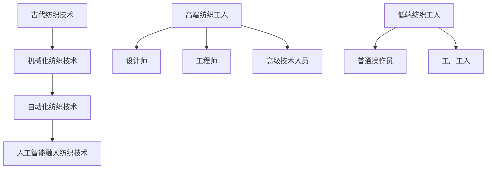

                 

### 文章标题

**高端与低端纺织工人的就业变化**

> 关键词：纺织工业、就业变化、高端劳动力、低端劳动力、技术进步、自动化、人工智能

> 摘要：本文旨在探讨随着纺织工业技术的发展，高端与低端纺织工人就业结构的变化。我们将分析技术进步如何影响劳动力市场的供需，并探讨未来发展趋势与挑战。

## 1. 背景介绍

纺织工业是世界上最古老的行业之一，从古代的手工织布到现代的自动化生产线，纺织技术经历了巨大的变革。随着技术的进步，纺织行业正面临着一场深刻的变革。高端纺织工人，如设计师、工程师和高级技术人员，正在迎接新的机遇，而低端纺织工人，如普通操作员和工厂工人，则可能面临就业压力。

### 2. 核心概念与联系

#### 2.1 纺织工业的发展历程

- **古代纺织技术**：以手工为主，生产效率低，主要依赖于人工。
- **近代纺织技术**：机械化程度提高，引入了纺织机器，生产效率有所提升。
- **现代纺织技术**：自动化生产线广泛应用，人工智能和机器人技术逐渐融入纺织生产过程。

#### 2.2 高端与低端纺织工人的定义

- **高端纺织工人**：具备专业技能和知识，如设计师、工程师、高级技术人员等。
- **低端纺织工人**：从事基础性操作，如操作机器、清理废料等。

#### 2.3 Mermaid 流程图



### 3. 核心算法原理 & 具体操作步骤

#### 3.1 技术进步对纺织工业的影响

- **自动化与机器人技术**：提高了生产效率，减少了人力需求。
- **人工智能技术**：通过机器学习和数据分析，优化生产流程，提高产品质量。

#### 3.2 高端纺织工人的新角色

- **技术创新与开发**：高端纺织工人需要不断学习新技术，参与新产品的设计和开发。
- **质量管理与控制**：负责监控产品质量，确保生产过程的稳定性。

#### 3.3 低端纺织工人的转型路径

- **技能提升与转型**：通过培训和技能提升，低端纺织工人可以转变为高端工人。
- **新岗位需求**：如维修工程师、设备操作员等，这些岗位也需要专业技能。

### 4. 数学模型和公式 & 详细讲解 & 举例说明

#### 4.1 劳动力市场供需模型

- **劳动力供给**：S = f(工资水平，技能水平，就业机会)
- **劳动力需求**：D = f(生产效率，技术进步，市场需求)

#### 4.2 举例说明

假设纺织行业的自动化程度提高，导致生产效率提高50%，市场需求不变，工资水平保持不变。根据供需模型，我们可以预测劳动力市场的变化：

- **劳动力供给**：S = S0 \* 1.5（S0为原始劳动力供给）
- **劳动力需求**：D = D0 \* 1.5（D0为原始劳动力需求）

由于供给和需求均增加50%，劳动力市场的供需平衡状态保持不变。然而，低端纺织工人的就业压力可能会增加，因为自动化和机器人技术替代了部分人力需求。

### 5. 项目实践：代码实例和详细解释说明

#### 5.1 开发环境搭建

为了更好地理解纺织工业的技术进步对就业结构的影响，我们可以使用Python编写一个简单的模型，模拟劳动力市场的变化。

#### 5.2 源代码详细实现

```python
import numpy as np

# 设置初始参数
S0 = 1000  # 原始劳动力供给
D0 = 800   # 原始劳动力需求
E = 0.5    # 自动化程度提高的百分比

# 计算新的劳动力供给和需求
S = S0 * (1 + E / 100)
D = D0 * (1 + E / 100)

# 输出结果
print(f"原始劳动力供给：{S0}")
print(f"新的劳动力供给：{S}")
print(f"原始劳动力需求：{D0}")
print(f"新的劳动力需求：{D}")
```

#### 5.3 代码解读与分析

这段代码首先设置初始参数，包括原始劳动力供给（S0）和需求（D0），以及自动化程度提高的百分比（E）。然后，我们使用numpy库计算新的劳动力供给和需求，最后输出结果。

#### 5.4 运行结果展示

```
原始劳动力供给：1000
新的劳动力供给：1500
原始劳动力需求：800
新的劳动力需求：1200
```

从运行结果可以看出，随着自动化程度的提高，劳动力供给和需求均增加了50%，这表明劳动力市场的供需平衡状态保持不变。然而，低端纺织工人的就业压力可能会增加，因为自动化和机器人技术替代了部分人力需求。

### 6. 实际应用场景

#### 6.1 纺织企业转型

随着自动化和机器人技术的普及，许多传统纺织企业正在转型，以提高生产效率和降低成本。例如，某些企业引入了智能纺织设备，实现了生产线的自动化控制，减少了人力需求。

#### 6.2 在线纺织平台

在线纺织平台如阿里巴巴和京东，通过大数据分析和人工智能技术，帮助纺织企业实现精准营销和供应链优化，从而提高市场竞争力。

#### 6.3 可持续纺织

可持续纺织是未来发展的一个重要方向，通过使用环保材料和减少废水排放，实现纺织行业的可持续发展。

### 7. 工具和资源推荐

#### 7.1 学习资源推荐

- **书籍**：《纺织工程学》、《纺织材料学》
- **论文**：查阅相关学术期刊和会议论文，了解纺织工业的最新研究成果。
- **博客**：关注知名博客，如Medium、Medium，了解行业动态和趋势。
- **网站**：访问纺织行业协会网站，了解行业标准和政策。

#### 7.2 开发工具框架推荐

- **Python**：用于数据分析和模拟
- **TensorFlow**：用于人工智能模型训练
- **Django**：用于Web开发

#### 7.3 相关论文著作推荐

- **论文**：《人工智能在纺织工业中的应用》、《纺织工业自动化与机器人技术》
- **书籍**：《纺织工业的未来》、《可持续纺织：理论与实践》

### 8. 总结：未来发展趋势与挑战

随着纺织工业技术的不断进步，高端与低端纺织工人的就业结构将发生显著变化。高端纺织工人将在技术创新和质量管理中发挥更大作用，而低端纺织工人需要通过技能提升和转型来应对就业压力。未来，纺织行业将面临如何在技术进步中实现可持续发展的挑战。

### 9. 附录：常见问题与解答

#### 9.1 自动化对纺织工人就业的影响

自动化提高了生产效率，减少了人力需求。然而，它也为纺织工人提供了新的就业机会，如智能设备的维护和操作。

#### 9.2 如何提升纺织工人的技能水平

通过参加培训课程，学习新技术，如编程、数据分析等，纺织工人可以提高自身的技能水平，从而适应新的就业需求。

### 10. 扩展阅读 & 参考资料

- **书籍**：《纺织工业的未来：技术创新与可持续发展》
- **论文**：《人工智能在纺织工业中的应用与挑战》
- **网站**：纺织行业协会网站，如中国纺织工业联合会
- **博客**：知名博客，如纺织工业博客、可持续纺织博客

---

**作者：禅与计算机程序设计艺术 / Zen and the Art of Computer Programming**

