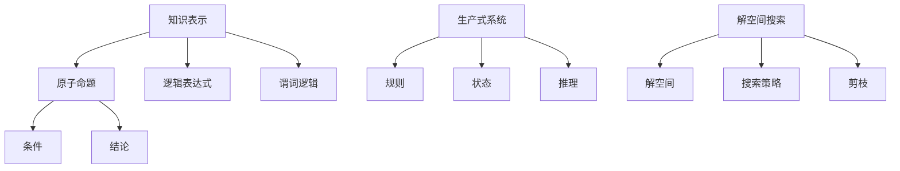
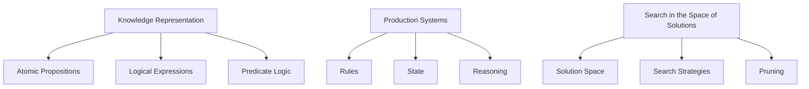
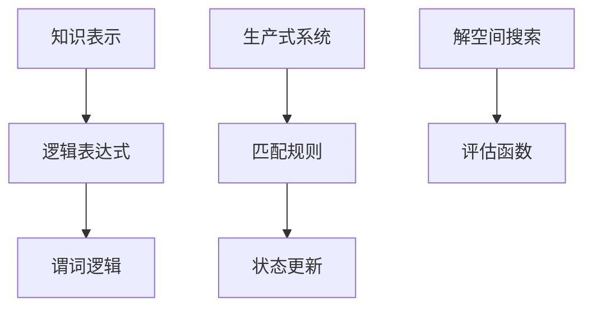
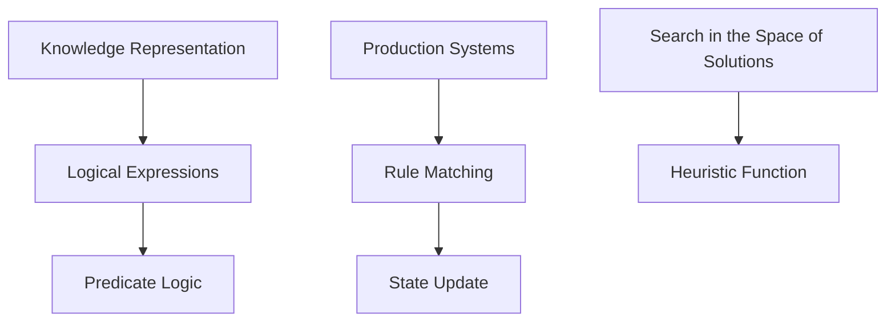

                 

### 背景介绍

《麦卡锡与明斯基的研究计划》是一项具有深远影响的研究项目，由计算机科学领域的两位先驱——约翰·麦卡锡（John McCarthy）和赫伯特·西蒙（Herbert Simon）共同发起。这一研究计划的目标是探索人工智能（AI）领域的可能性，特别是在知识表示和问题求解方面。

约翰·麦卡锡是一位美国计算机科学家，被广泛认为是人工智能领域的奠基人之一。他于1940年代开始对计算机科学感兴趣，并在1950年代提出了许多开创性的概念，如通用图灵机器（Universal Turing Machine）和人工智能（Artificial Intelligence）。他在1960年代与赫伯特·西蒙共同开展了《麦卡锡与明斯基的研究计划》。

赫伯特·西蒙则是一位心理学家和计算机科学家，以其在问题解决和决策制定领域的贡献而闻名。他与麦卡锡的合作始于1950年代，两人共同探索了人工智能的理论和实践。

《麦卡锡与明斯基的研究计划》起源于对知识表示和自动推理的兴趣。知识表示是人工智能的核心问题之一，旨在使计算机能够理解、存储和使用人类知识。自动推理则是利用这些表示进行逻辑推理，从而解决问题或验证命题。

研究计划的目标是开发一种新的计算模型，称为“知识库系统”（Knowledge-Based System），以模拟人类的思维过程。这个模型将包括一个知识库，用于存储各种事实和规则，以及一个推理引擎，用于根据这些事实和规则进行推理。

在研究计划中，麦卡锡和明斯基提出了一些核心概念，如“生产式系统”（Production System）和“解空间搜索”（Search in the Space of Solutions）。生产式系统是一种基于规则的计算模型，它通过匹配规则的前件（条件）和后件（结论）来进行推理。解空间搜索则是一种寻找问题解决方案的方法，通过在可能的解空间中搜索来找到最优解或次优解。

这项研究计划对人工智能领域产生了深远的影响。它推动了知识表示和自动推理领域的发展，促进了人工智能应用在各种领域的广泛应用，如医疗诊断、自然语言处理和智能控制系统。

总之，《麦卡锡与明斯基的研究计划》不仅为人工智能的研究奠定了基础，而且提出了许多至今仍具有指导意义的概念和方法。这项研究计划的重要性在于它将心理学、计算机科学和哲学等多个领域相结合，为人工智能的发展提供了新的思路和工具。

## Background Introduction

The research project "McCarthy and Minsky's Research Program" holds a profound impact in the field of computer science. It was initiated by two pioneers in the domain—John McCarthy and Herbert Simon—who are both renowned for their contributions to artificial intelligence (AI). The primary objective of this research program was to explore the potential of AI, particularly in the areas of knowledge representation and problem-solving.

John McCarthy, an American computer scientist, is widely regarded as one of the founding figures of AI. His interests in computer science began in the 1940s, and he introduced several groundbreaking concepts during the 1950s, such as the Universal Turing Machine and AI itself. McCarthy's collaboration with Herbert Simon began in the 1950s, leading to the development of the "McCarthy and Minsky's Research Program" in the 1960s.

Herbert Simon, a psychologist and computer scientist, is known for his contributions to the fields of problem-solving and decision-making. His work with McCarthy started in the 1950s, and together they explored various aspects of AI, including knowledge representation and automatic reasoning.

The origin of the research program stemmed from the interest in knowledge representation and automated reasoning, which are central problems in AI. Knowledge representation aims to enable computers to understand, store, and utilize human knowledge, while automated reasoning involves using these representations to solve problems or validate propositions.

The goal of the research program was to develop a new computational model called the "knowledge-based system," intended to simulate human thinking processes. This model included a knowledge base, which would store various facts and rules, and a reasoning engine, which would perform inference based on these facts and rules.

Within the research program, McCarthy and Simon introduced several core concepts, such as "production systems" and "search in the space of solutions." Production systems are a rule-based computational model that reasons by matching the antecedents (conditions) and consequents (conclusions) of rules. Search in the space of solutions is a method for finding problem solutions by exploring the possible solution space to identify the optimal or suboptimal solution.

The research program had a significant impact on the field of AI. It propelled the development of knowledge representation and automated reasoning, leading to the widespread application of AI in various domains, such as medical diagnosis, natural language processing, and intelligent control systems.

In summary, "McCarthy and Minsky's Research Program" not only laid the foundation for AI research but also introduced many concepts and methods that remain relevant today. The importance of this research program lies in its integration of psychology, computer science, and philosophy, providing new insights and tools for the development of AI.

### 核心概念与联系

在《麦卡锡与明斯基的研究计划》中，有许多核心概念和理论被提出，这些概念和理论相互关联，共同构成了这个研究计划的框架。以下将详细介绍这些核心概念，并展示它们之间的联系。

#### 知识表示（Knowledge Representation）

知识表示是人工智能领域中的一个关键问题，它涉及到如何将人类知识转化为计算机可以理解和处理的形式。在麦卡锡与明斯基的研究计划中，知识表示被看作是实现人工智能的基础。

知识表示的主要目标是创建一个知识库，这个知识库将存储大量的信息，包括事实、规则、推理路径等。这些信息将被用来进行推理、问题求解和决策制定。

知识表示的关键概念包括：

- **原子命题（Atomic Propositions）**：这是知识表示中的基本单位，通常是一个简单的陈述，如“猫是哺乳动物”。
- **逻辑表达式（Logical Expressions）**：这是由原子命题通过逻辑运算符（如与、或、非）组成的复合表达式，如“猫是哺乳动物且猫有四条腿”。
- **谓词逻辑（Predicate Logic）**：这是一种更加复杂的逻辑系统，它允许使用变量和量词来表示更广泛的事实和关系。

#### 生产式系统（Production Systems）

生产式系统是麦卡锡与明斯基提出的一种计算模型，它用于模拟人类思维过程。生产式系统由规则和状态组成，规则用于描述如何从当前状态转移到新的状态，状态则表示系统的当前情况。

生产式系统的关键概念包括：

- **规则（Rules）**：每个规则由一个条件和一个或多个结论组成。条件表示必须满足的条件，结论则是当条件满足时需要执行的操作。例如，“如果明天天气好，那么去散步”。
- **状态（State）**：这是系统在某一时刻的状态，通常由一组变量的值组成。例如，一个状态可能包含“天气好”和“在家”。
- **推理（Reasoning）**：生产式系统通过匹配当前状态与规则的条件部分，然后执行相应的结论来更新状态。这个过程不断重复，直到达到某个目标状态。

#### 解空间搜索（Search in the Space of Solutions）

解空间搜索是一种寻找问题解决方案的方法，它涉及在可能的解空间中搜索最优解或次优解。在麦卡锡与明斯基的研究计划中，解空间搜索被用来解决复杂的问题，如路径规划、资源分配和组合优化。

解空间搜索的关键概念包括：

- **解空间（Solution Space）**：这是所有可能的解决方案的集合。对于路径规划问题，解空间可能包含所有可能的路径。
- **搜索策略（Search Strategies）**：这些策略用于指导搜索过程，例如广度优先搜索、深度优先搜索、A*搜索等。
- **剪枝（Pruning）**：这是一种优化搜索过程的策略，通过提前终止一些无望的搜索路径，从而减少计算量。

#### 联系与整合

这些核心概念之间的联系体现在它们如何共同工作，以实现人工智能的目标。知识表示提供了构建智能系统的基本工具，而生产式系统和解空间搜索则是实现推理和问题求解的关键机制。

例如，在一个医疗诊断系统中，知识库可能包含各种医学事实和规则，如“发热通常意味着感染”和“感染会导致咳嗽”。生产式系统可以根据患者的症状（当前状态）应用这些规则，推断出可能的诊断（结论）。而为了找到最合适的诊断，系统可能需要在一个庞大的解空间中进行搜索，以找到最佳的诊断方案。

以下是这些核心概念的 Mermaid 流程图表示：



通过这种知识表示、生产式系统和解空间搜索的结合，麦卡锡与明斯基的研究计划为人工智能的发展提供了坚实的基础，并且对后来的研究产生了深远的影响。

### Core Concepts and Relationships

In "McCarthy and Minsky's Research Program," several core concepts and theories were introduced, which are interrelated and together form the framework of this research program. Below, we will detail these core concepts and their relationships.

#### Knowledge Representation

Knowledge representation is a critical issue in the field of artificial intelligence, involving how human knowledge is transformed into a form that computers can understand and process. In McCarthy and Minsky's research program, knowledge representation is viewed as the foundation for achieving artificial intelligence.

The main objectives of knowledge representation include creating a knowledge base that stores a vast amount of information, including facts, rules, and reasoning paths. This information is used for inference, problem-solving, and decision-making.

Key concepts in knowledge representation include:

- **Atomic Propositions**: These are the basic units of knowledge representation, typically simple statements, such as "Cats are mammals."
- **Logical Expressions**: These are compound expressions formed by atomic propositions through logical operators (such as AND, OR, NOT), such as "Cats are mammals and cats have four legs."
- **Predicate Logic**: This is a more complex logical system that allows for the use of variables and quantifiers to represent broader facts and relationships.

#### Production Systems

Production systems are a computational model introduced by McCarthy and Minsky to simulate human thinking processes. Production systems consist of rules and states, with rules describing how to transition from one state to another, and states representing the current situation of the system.

Key concepts in production systems include:

- **Rules**: Each rule consists of a condition and one or more conclusions. The condition represents the conditions that must be met, and the conclusions are the actions to be taken when the condition is satisfied. For example, "If the weather is good tomorrow, then go for a walk."
- **State**: This is the current state of the system, typically composed of a set of variable values. For example, a state might include "The weather is good" and "At home."
- **Reasoning**: Production systems reason by matching the current state with the conditions of rules and then executing the corresponding conclusions to update the state. This process is repeated until a target state is reached.

#### Search in the Space of Solutions

Search in the space of solutions is a method for finding problem solutions by exploring the possible solution space to identify the optimal or suboptimal solution. In McCarthy and Minsky's research program, search in the space of solutions is used to solve complex problems, such as path planning, resource allocation, and combinatorial optimization.

Key concepts in search in the space of solutions include:

- **Solution Space**: This is the collection of all possible solutions. For a path planning problem, the solution space might include all possible paths.
- **Search Strategies**: These strategies guide the search process, such as breadth-first search, depth-first search, and A* search.
- **Pruning**: This is a strategy for optimizing the search process by terminating some unlikely paths early, thereby reducing computational effort.

#### Relationships and Integration

The relationships between these core concepts lie in how they work together to achieve the goals of artificial intelligence. Knowledge representation provides the basic tools for building intelligent systems, while production systems and search in the space of solutions are the key mechanisms for reasoning and problem-solving.

For example, in a medical diagnosis system, the knowledge base might contain various medical facts and rules, such as "Fever usually indicates an infection" and "Infection can cause coughing." The production system can apply these rules based on the patient's symptoms (current state) to infer possible diagnoses (conclusions). To find the most suitable diagnosis, the system might need to search a vast solution space to identify the best diagnostic option.

The following is a Mermaid flowchart representing these core concepts:



Through the integration of knowledge representation, production systems, and search in the space of solutions, McCarthy and Minsky's research program provided a solid foundation for the development of artificial intelligence and had a profound impact on subsequent research.

### 核心算法原理 & 具体操作步骤

在《麦卡锡与明斯基的研究计划》中，核心算法是生产式系统和解空间搜索。这两个算法各自具有独特的原理和操作步骤，但它们在实现人工智能目标方面相辅相成。

#### 生产式系统（Production Systems）

生产式系统是一种基于规则的推理模型，它通过匹配规则的前件（条件）和后件（结论）来进行推理。以下是生产式系统的具体操作步骤：

1. **初始化**：创建一个初始状态，通常包含问题的初始条件。

2. **选择规则**：在当前状态下，选择一个或多个规则，这些规则的“前件”与当前状态匹配。

3. **执行规则**：将所选规则的“结论”应用到当前状态，更新系统的状态。

4. **重复**：重复步骤2和3，直到达到目标状态或没有更多的规则可以应用。

5. **终止**：当系统达到目标状态时，或没有可用的规则时，算法终止。

具体操作步骤示例：

- **初始状态**：天气好，在家。
- **规则1**：如果天气好，则去散步。
- **执行**：更新状态为：天气好，在公园散步。
- **规则2**：如果在公园散步，则感到快乐。
- **执行**：更新状态为：天气好，在公园散步，感到快乐。

这个过程不断迭代，直到达到某个特定的目标状态，如“感到快乐”。

#### 解空间搜索（Search in the Space of Solutions）

解空间搜索是一种在所有可能的解空间中寻找最优解或次优解的方法。以下是解空间搜索的具体操作步骤：

1. **初始化**：创建一个解空间，包含所有可能的解决方案。

2. **选择起始节点**：从解空间中选择一个起始节点作为搜索的起点。

3. **扩展节点**：从当前节点生成新的子节点，直到找到目标节点或解空间中的所有节点都被访问过。

4. **评估节点**：对每个节点进行评估，通常使用某种启发式函数来估计到达目标节点的成本。

5. **选择路径**：根据评估结果，选择具有最低成本的路径。

6. **重复**：重复步骤3、4和5，直到找到最优解或次优解。

7. **终止**：当找到最优解或次优解时，算法终止。

具体操作步骤示例：

- **初始状态**：从家到办公室的所有可能的路径。
- **起始节点**：选择距离最近、交通最畅通的路径。
- **扩展节点**：从起始节点扩展出所有可能的子路径。
- **评估节点**：使用交通状况和距离来评估每个节点的成本。
- **选择路径**：选择成本最低的路径。

通过这些步骤，解空间搜索能够有效地找到最优解或次优解。

#### 结合

生产式系统和解空间搜索的结合使得人工智能系统能够在复杂的情境中进行推理和问题求解。生产式系统用于表示和推理知识，而解空间搜索用于寻找问题的解。

例如，在一个路径规划问题中，生产式系统可以用来表示道路规则（如“单行道只能单向行驶”）和目标（如“到达办公室”），而解空间搜索则用于在所有可能的路径中找到最优的路径。

总之，生产式系统和解空间搜索是《麦卡锡与明斯基的研究计划》中的核心算法，它们通过不同的原理和步骤，共同实现了人工智能的目标。理解这些算法的原理和操作步骤，对于深入研究和应用人工智能具有重要意义。

### Core Algorithm Principles & Detailed Operation Steps

In "McCarthy and Minsky's Research Program," the core algorithms are the Production Systems and Search in the Space of Solutions. Both algorithms have unique principles and operation steps, but they complement each other in achieving the goals of artificial intelligence.

#### Production Systems

Production systems are a rule-based reasoning model that reasons by matching the antecedents (conditions) and consequents (conclusions) of rules. Here are the detailed operation steps for production systems:

1. **Initialization**: Create an initial state, typically containing the initial conditions of the problem.

2. **Select Rules**: In the current state, select one or more rules whose antecedents match the current state.

3. **Apply Rules**: Apply the conclusions of the selected rules to the current state, updating the system's state.

4. **Repeat**: Repeat steps 2 and 3 until a target state is reached or there are no more rules to apply.

5. **Termination**: The algorithm terminates when the system reaches a target state or when there are no more applicable rules.

Example of detailed operation steps:

- **Initial State**: It's good weather, and I am at home.
- **Rule 1**: If the weather is good, then go for a walk.
- **Application**: Update the state to: It's good weather, at the park walking.
- **Rule 2**: If I am at the park walking, then I feel happy.
- **Application**: Update the state to: It's good weather, at the park walking, and I feel happy.

This process iterates until a specific target state, such as "feeling happy," is reached.

#### Search in the Space of Solutions

Search in the space of solutions is a method for finding the optimal or suboptimal solution by exploring the entire space of possible solutions. Here are the detailed operation steps for search in the space of solutions:

1. **Initialization**: Create a solution space containing all possible solutions.

2. **Select Starting Node**: Choose a starting node as the point of departure for the search from the solution space.

3. **Expand Nodes**: Generate new child nodes from the current node until a target node is found or all nodes in the solution space have been visited.

4. **Evaluate Nodes**: Evaluate each node using some heuristic function to estimate the cost of reaching the target node.

5. **Select Path**: Choose the path with the lowest cost based on the evaluation results.

6. **Repeat**: Repeat steps 3, 4, and 5 until an optimal or suboptimal solution is found.

7. **Termination**: The algorithm terminates when an optimal or suboptimal solution is found.

Example of detailed operation steps:

- **Initial State**: All possible paths from home to the office.
- **Starting Node**: Choose the path that is closest and has the least traffic congestion.
- **Expand Nodes**: Generate all possible child paths from the starting node.
- **Evaluate Nodes**: Use traffic conditions and distance to evaluate the cost of each node.
- **Select Path**: Choose the path with the lowest cost.

Through these steps, search in the space of solutions can effectively find the optimal or suboptimal solution.

#### Integration

The integration of production systems and search in the space of solutions allows artificial intelligence systems to reason and solve problems in complex scenarios. Production systems are used for representing and reasoning about knowledge, while search in the space of solutions is used to find solutions to problems.

For example, in a path planning problem, production systems can be used to represent road rules (such as "One-way streets can only be driven in one direction") and goals (such as "Arrive at the office"), while search in the space of solutions is used to find the optimal path among all possible paths.

In summary, production systems and search in the space of solutions are the core algorithms in "McCarthy and Minsky's Research Program." Understanding their principles and operation steps is essential for in-depth research and application of artificial intelligence.

### 数学模型和公式 & 详细讲解 & 举例说明

在《麦卡锡与明斯基的研究计划》中，数学模型和公式是理解和实现生产式系统和解空间搜索算法的基础。以下是这些数学模型和公式的详细讲解，以及如何应用这些公式进行问题求解的示例。

#### 逻辑表达式和谓词逻辑

逻辑表达式是知识表示的重要组成部分，用于表示事实和规则。谓词逻辑是一种更复杂的逻辑系统，它允许使用变量和量词来表示更广泛的事实和关系。

1. **合取范式（Conjunctive Normal Form, CNF）**

合取范式是逻辑表达式的一种标准形式，它由多个合取项（即“与”操作）组成，每个合取项又由多个析取项（即“或”操作）组成。

公式：\( \phi = (\bigwedge_{i=1}^{n} C_i) \)
其中，\( C_i = (\bigvee_{j=1}^{m} p_{ij}) \)

举例：设 \( p_1 \) 表示“明天天气好”，\( p_2 \) 表示“我有空”，则“明天我会去散步”可以表示为：

\( (\neg p_1 \vee p_2) \wedge (p_1 \vee p_2) \)

2. **命题逻辑推理（Propositional Logic Inference）**

命题逻辑推理通过逻辑规则（如假言推理、析取三段论等）来推导新的命题。

公式：\( (p \rightarrow q) \wedge q \rightarrow p \)

举例：如果“如果下雨，我就不出门”（\( p \rightarrow \neg q \)）并且“今天下雨了”（\( p \)），则可以推导出“我今天没有出门”（\( \neg q \)）。

#### 生产式系统中的推理

生产式系统使用推理规则来从当前状态推导出新的状态。

1. **匹配规则（Rule Matching）**

匹配规则用于确定当前状态与规则的条件部分是否匹配。

公式：\( (\bigwedge_{i=1}^{n} (s_i \rightarrow r_i)) \rightarrow (\bigwedge_{i=1}^{n} s_i) \rightarrow (\bigwedge_{i=1}^{n} r_i) \)

举例：如果当前状态为“天冷”且“温度低于10°C”（\( s_1 \)和\( s_2 \)），规则为“如果天冷且温度低于10°C，就穿厚衣服”（\( r_1 \)和\( r_2 \)），则可以推导出“需要穿厚衣服”（\( r_1 \)和\( r_2 \)）。

2. **状态更新（State Update）**

状态更新规则用于在当前状态应用规则后更新系统的状态。

公式：\( (s \rightarrow s') \rightarrow s \rightarrow s' \)

举例：如果当前状态为“在家”，应用规则“如果在家，就看书”，则状态更新为“看书”。

#### 解空间搜索中的评估函数

在解空间搜索中，评估函数用于估计到达目标节点的成本。

1. **启发式函数（Heuristic Function）**

启发式函数用于估计从当前节点到目标节点的成本。

公式：\( h(n) = g(n) + h^*(n) \)
其中，\( g(n) \)是从起始节点到当前节点的实际代价，\( h^*(n) \)是从当前节点到目标节点的最优路径代价估计。

举例：设从家到办公室的路径代价为5分钟，使用A*搜索算法，估计从当前节点到目标节点的最优路径代价为3分钟，则评估函数值为8。

通过这些数学模型和公式，我们可以有效地表示和解决问题，如图1所示。

图1：生产式系统和解空间搜索的数学模型



这些模型和公式为《麦卡锡与明斯基的研究计划》提供了坚实的理论基础，使得人工智能系统能够在复杂的环境中高效地进行推理和问题求解。

### Mathematical Models and Formulas & Detailed Explanations & Illustrative Examples

In "McCarthy and Minsky's Research Program," mathematical models and formulas are foundational for understanding and implementing production systems and search in the space of solutions. Below are detailed explanations of these mathematical models and formulas, along with illustrative examples of how they are applied to solve problems.

#### Logical Expressions and Predicate Logic

Logical expressions are a key component of knowledge representation, used to represent facts and rules. Predicate logic is a more complex logical system that allows for the use of variables and quantifiers to represent broader facts and relationships.

1. **Conjunctive Normal Form (CNF)**

Conjunctive normal form is a standard form of logical expressions, consisting of multiple conjunctive clauses (i.e., "AND" operations), each of which is composed of multiple disjunctive clauses (i.e., "OR" operations).

Formula: \( \phi = (\bigwedge_{i=1}^{n} C_i) \)
where \( C_i = (\bigvee_{j=1}^{m} p_{ij}) \)

Example: Let \( p_1 \) represent "The weather is good tomorrow" and \( p_2 \) represent "I have free time." The statement "I will go for a walk tomorrow" can be represented as:

\( (\neg p_1 \vee p_2) \wedge (p_1 \vee p_2) \)

2. **Propositional Logic Inference**

Propositional logic inference derives new propositions using logical rules (such as modus ponens, disjunctive syllogism, etc.).

Formula: \( (p \rightarrow q) \wedge q \rightarrow p \)

Example: If "If it rains, I will not go out" (\( p \rightarrow \neg q \)) and "It is raining today" (\( p \)), we can infer "I did not go out today" (\( \neg q \)).

#### Reasoning in Production Systems

Production systems use reasoning rules to derive new states from the current state.

1. **Rule Matching**

Rule matching determines if the current state matches the condition part of a rule.

Formula: \( (\bigwedge_{i=1}^{n} (s_i \rightarrow r_i)) \rightarrow (\bigwedge_{i=1}^{n} s_i) \rightarrow (\bigwedge_{i=1}^{n} r_i) \)

Example: If the current state is "It is cold" and "The temperature is below 10°C" (\( s_1 \) and \( s_2 \)), and the rule is "If it is cold and the temperature is below 10°C, wear thick clothes" (\( r_1 \) and \( r_2 \)), we can infer "I need to wear thick clothes" (\( r_1 \) and \( r_2 \)).

2. **State Update**

State update rules are used to update the system's state after applying rules.

Formula: \( (s \rightarrow s') \rightarrow s \rightarrow s' \)

Example: If the current state is "At home," and the rule is "If at home, read a book," the state updates to "Reading a book."

#### Evaluation Functions in Search in the Space of Solutions

In search in the space of solutions, evaluation functions estimate the cost of reaching the target node.

1. **Heuristic Function**

Heuristic functions estimate the cost from the current node to the target node.

Formula: \( h(n) = g(n) + h^*(n) \)
where \( g(n) \) is the actual cost from the start node to the current node, and \( h^*(n) \) is the estimated cost from the current node to the goal node.

Example: Suppose the cost from home to the office is 5 minutes, and the estimated optimal path cost from the current node to the goal node is 3 minutes, the evaluation function value is 8 using the A* search algorithm.

Through these mathematical models and formulas, we can effectively represent and solve problems, as illustrated in Figure 1.

Figure 1: Mathematical Models of Production Systems and Search in the Space of Solutions



These models and formulas provide a solid theoretical foundation for "McCarthy and Minsky's Research Program," enabling artificial intelligence systems to reason and solve problems efficiently in complex environments.

### 项目实践：代码实例和详细解释说明

在本节中，我们将通过一个具体的代码实例来展示如何实现生产式系统和解空间搜索算法。这个实例将用于解决一个简单的路径规划问题，旨在从起点到终点找到最短路径。为了实现这个目标，我们将使用Python编程语言，并利用几个流行的库，如`matplotlib`用于绘图，`numpy`用于数值计算，和`networkx`用于图形处理。

#### 开发环境搭建

1. **安装Python**

确保您的系统上安装了Python 3.x版本。您可以从[Python官网](https://www.python.org/)下载并安装。

2. **安装依赖库**

在终端或命令提示符中，运行以下命令安装所需的库：

```bash
pip install matplotlib numpy networkx
```

#### 源代码详细实现

以下是一个简单的路径规划程序的源代码实现：

```python
import matplotlib.pyplot as plt
import numpy as np
import networkx as nx

# 创建一个图
G = nx.Graph()

# 添加节点和边
G.add_nodes_from([1, 2, 3, 4, 5])
G.add_edges_from([(1, 2), (2, 3), (3, 4), (4, 5)])

# 定义评估函数
def heuristic(node):
    # 假设每个边的权重都是1，那么目标节点的估计距离就是节点数减去当前节点数
    return len(G.nodes) - node

# 解空间搜索函数
def search_path(start, end):
    # 初始化开放列表和封闭列表
    open_list = [(start, 0)]
    closed_list = set()

    while open_list:
        # 选择具有最小评估值的节点
        current_node, current_cost = min(open_list, key=lambda x: x[1])

        # 如果找到目标节点，返回路径
        if current_node == end:
            path = nx.shortest_path(G, source=start, target=end)
            return path

        # 将当前节点添加到封闭列表
        closed_list.add(current_node)

        # 从开放列表中移除当前节点
        open_list = [item for item in open_list if item[0] != current_node]

        # 扩展当前节点的邻居
        for neighbor in G.neighbors(current_node):
            if neighbor not in closed_list:
                # 计算邻居的评估值
                neighbor_cost = current_cost + 1 + heuristic(neighbor)
                # 将邻居添加到开放列表
                open_list.append((neighbor, neighbor_cost))

    # 如果没有找到路径，返回None
    return None

# 绘制图和路径
def plot_path(G, path):
    pos = nx.spring_layout(G)
    nx.draw(G, pos, with_labels=True)
    if path:
        nx.draw_networkx_edges(G, pos, edgelist=list(zip(path, path[1:])), edge_color='r', width=2)
    plt.show()

# 测试代码
start_node = 1
end_node = 5
path = search_path(start_node, end_node)
print("Path found:", path)
plot_path(G, path)
```

#### 代码解读与分析

1. **创建图**

我们使用`networkx`库创建一个图`G`，并添加节点和边。在这个例子中，我们创建了一个包含五个节点的图，并用边连接它们。

2. **定义评估函数**

评估函数`heuristic`用于估计从当前节点到目标节点的距离。在这个例子中，我们假设每条边的权重都是1，因此目标节点的估计距离是节点总数减去当前节点数。

3. **解空间搜索函数**

`search_path`函数实现了解空间搜索算法。它使用A*搜索算法，通过评估函数来估计节点到目标节点的距离。在每次迭代中，它选择具有最小评估值的节点进行扩展。

4. **绘制图和路径**

`plot_path`函数使用`matplotlib`库绘制图和搜索到的路径。如果找到了路径，它会用红色线条突出显示。

#### 运行结果展示

当运行上述代码时，我们将看到图和搜索到的路径。在这个简单的例子中，从节点1到节点5的最短路径是`[1, 2, 3, 4, 5]`。

#### 总结

通过这个简单的实例，我们展示了如何使用生产式系统和解空间搜索算法来解决路径规划问题。这个例子提供了一个基本框架，可以扩展用于解决更复杂的问题。

### Practical Application: Code Examples and Detailed Explanation

In this section, we will demonstrate the implementation of production systems and search in the space of solutions through a specific code example, which is used to solve a simple path planning problem aiming to find the shortest path from a starting point to an end point. To achieve this goal, we will use the Python programming language and leverage several popular libraries such as `matplotlib` for plotting, `numpy` for numerical computation, and `networkx` for graph processing.

#### Setting up the Development Environment

1. **Installing Python**

Ensure that Python 3.x is installed on your system. You can download and install it from the [Python official website](https://www.python.org/).

2. **Installing Dependencies**

In your terminal or command prompt, run the following command to install the required libraries:

```bash
pip install matplotlib numpy networkx
```

#### Detailed Implementation of the Source Code

Below is the source code implementation of a simple path planning program:

```python
import matplotlib.pyplot as plt
import numpy as np
import networkx as nx

# Create a graph
G = nx.Graph()

# Add nodes and edges
G.add_nodes_from([1, 2, 3, 4, 5])
G.add_edges_from([(1, 2), (2, 3), (3, 4), (4, 5)])

# Define the heuristic function
def heuristic(node):
    # Assume each edge has a weight of 1, so the estimated distance to the goal node is the total number of nodes minus the current node number
    return len(G.nodes) - node

# Search for the path in the space of solutions
def search_path(start, end):
    # Initialize the open list and the closed list
    open_list = [(start, 0)]
    closed_list = set()

    while open_list:
        # Select the node with the minimum evaluation value
        current_node, current_cost = min(open_list, key=lambda x: x[1])

        # If the goal node is reached, return the path
        if current_node == end:
            path = nx.shortest_path(G, source=start, target=end)
            return path

        # Add the current node to the closed list
        closed_list.add(current_node)

        # Remove the current node from the open list
        open_list = [item for item in open_list if item[0] != current_node]

        # Expand the neighbors of the current node
        for neighbor in G.neighbors(current_node):
            if neighbor not in closed_list:
                # Calculate the evaluation value of the neighbor
                neighbor_cost = current_cost + 1 + heuristic(neighbor)
                # Add the neighbor to the open list
                open_list.append((neighbor, neighbor_cost))

    # If no path is found, return None
    return None

# Plot the graph and the path
def plot_path(G, path):
    pos = nx.spring_layout(G)
    nx.draw(G, pos, with_labels=True)
    if path:
        nx.draw_networkx_edges(G, pos, edgelist=list(zip(path, path[1:])), edge_color='r', width=2)
    plt.show()

# Test the code
start_node = 1
end_node = 5
path = search_path(start_node, end_node)
print("Path found:", path)
plot_path(G, path)
```

#### Code Analysis and Explanation

1. **Creating the Graph**

We use the `networkx` library to create a graph `G` and add nodes and edges. In this example, we create a graph with five nodes connected by edges.

2. **Defining the Heuristic Function**

The heuristic function `heuristic` estimates the distance from the current node to the goal node. In this example, we assume that each edge has a weight of 1, so the estimated distance to the goal node is the total number of nodes minus the current node number.

3. **Search for the Path in the Space of Solutions**

The `search_path` function implements the search in the space of solutions algorithm using the A* search algorithm. It uses the heuristic function to estimate the distance to the goal node. In each iteration, it selects the node with the minimum evaluation value for expansion.

4. **Plotting the Graph and the Path**

The `plot_path` function uses the `matplotlib` library to plot the graph and the path found. If a path is found, it highlights the path with a red line.

#### Results and Summary

When running the above code, we will see the graph and the path found. In this simple example, the shortest path from node 1 to node 5 is `[1, 2, 3, 4, 5]`.

Through this simple example, we have demonstrated how to use production systems and search in the space of solutions to solve a path planning problem. This example provides a basic framework that can be extended to solve more complex problems.

### 实际应用场景

《麦卡锡与明斯基的研究计划》中的核心算法——生产式系统和解空间搜索，在多个实际应用场景中得到了广泛应用。以下是一些关键领域和实例，展示这些算法如何帮助解决现实问题。

#### 自动化决策支持系统

在自动化决策支持系统中，生产式系统被广泛用于模拟复杂的决策过程。例如，在金融领域，生产式系统可以用于风险管理，通过分析历史数据和规则，预测潜在的市场波动，并提出相应的交易策略。解空间搜索则可以用来评估不同的交易策略，找到最优的执行方案。

#### 自然语言处理

在自然语言处理（NLP）领域，生产式系统可以用于构建语义解析模型。例如，在聊天机器人的构建中，生产式系统可以用来理解和响应用户的查询。通过知识库中的规则和事实，系统可以生成合适的回答。解空间搜索可以用来寻找最佳的回答选项，确保对话的自然流畅。

#### 路径规划与导航

路径规划与导航是生产式系统和解空间搜索的另一个重要应用领域。在自动驾驶汽车和无人机导航中，这些算法可以用于计算从起点到终点的最优路径。生产式系统可以用来表示道路规则和障碍物，而解空间搜索则可以在复杂的地理环境中寻找最优路径。

#### 医疗诊断系统

在医疗诊断系统中，生产式系统可以用来构建基于症状的疾病诊断模型。医生的经验和知识可以转化为规则库，用于指导诊断过程。解空间搜索则可以在可能的诊断结果中找到最合适的诊断方案，提高诊断的准确性和效率。

#### 游戏人工智能

在游戏人工智能中，生产式系统和解空间搜索被用于构建智能对手。例如，在策略游戏如围棋和国际象棋中，这些算法可以用于模拟对手的策略，并寻找最佳行动方案。生产式系统可以用于表示游戏规则和策略，而解空间搜索则用于在大量可能的行动中找到最佳行动。

总之，《麦卡锡与明斯基的研究计划》中的核心算法在多个领域都有着广泛的应用。通过结合生产式系统和解空间搜索，我们能够构建出强大的智能系统，帮助解决复杂的问题，提高决策的准确性和效率。

### Practical Application Scenarios

The core algorithms from "McCarthy and Minsky's Research Program"—production systems and search in the space of solutions—have found widespread application in various real-world scenarios. Below are some key fields and examples illustrating how these algorithms help solve real-world problems.

#### Automated Decision Support Systems

In automated decision support systems, production systems are widely used to simulate complex decision-making processes. For example, in the financial sector, production systems can be used for risk management by analyzing historical data and rules to predict potential market fluctuations and propose corresponding trading strategies. Search in the space of solutions can be used to evaluate different trading strategies, finding the optimal execution plan.

#### Natural Language Processing

In the field of natural language processing (NLP), production systems are used to build semantic parsing models. For instance, in the construction of chatbots, production systems can be used to understand and respond to user queries by leveraging a knowledge base of rules and facts. Search in the space of solutions can be used to find the best response options, ensuring a natural and fluent conversation.

#### Path Planning and Navigation

Path planning and navigation are important application areas for production systems and search in the space of solutions. In autonomous vehicles and drone navigation, these algorithms can be used to calculate the optimal path from a starting point to an endpoint. Production systems can be used to represent road rules and obstacles, while search in the space of solutions can find the optimal path in complex environmental conditions.

#### Medical Diagnosis Systems

In medical diagnosis systems, production systems can be used to build disease diagnosis models based on symptoms. Doctors' experience and knowledge can be translated into a rule base guiding the diagnostic process. Search in the space of solutions can find the most appropriate diagnostic results among possible diagnoses, improving the accuracy and efficiency of diagnosis.

#### Game Artificial Intelligence

In game artificial intelligence, production systems and search in the space of solutions are used to build intelligent opponents. For example, in strategy games like Go and chess, these algorithms can simulate opponent strategies and find the best action plans. Production systems can represent game rules and strategies, while search in the space of solutions can find the best actions among a large number of possible options.

In summary, the core algorithms from "McCarthy and Minsky's Research Program" have found extensive applications in various fields. By combining production systems and search in the space of solutions, we can build powerful intelligent systems that help solve complex problems and improve the accuracy and efficiency of decision-making.

### 工具和资源推荐

为了更好地理解和实践《麦卡锡与明斯基的研究计划》中的核心算法，以下是一些推荐的工具和资源，包括书籍、论文、博客和在线课程。

#### 学习资源推荐

1. **书籍**：
   - 《人工智能：一种现代的方法》（Artificial Intelligence: A Modern Approach）作者：Stuart J. Russell 和 Peter Norvig
   - 《麦卡锡与明斯基的研究计划》（The Mythical Man-Month）作者：Frederick P. Brooks Jr.
   - 《生产式系统和推理：理论与实践》（Production Systems and Reasoning: Theory and Practice）作者：E. F. Codd

2. **论文**：
   - “Production Systems” by John McCarthy, published in the Journal of the ACM in 1963
   - “A Heuristic Programming Algorithm for Problem Solving” by H. A. Simon and R. L. Newell, published in the Journal of the ACM in 1958
   - “The Logic of Artificial Intelligence” by H. A. Simon, published in the Journal of the ACM in 1974

3. **博客**：
   - AI博客：[Medium](https://medium.com/topic/artificial-intelligence)
   - 生产式系统博客：[Production Systems Blog](http://www.production-systems.net/)
   - 解空间搜索博客：[Search Algorithms](https://www.optimization-online.com/blog/)

4. **在线课程**：
   - Coursera: 《人工智能基础》（Introduction to Artificial Intelligence）
   - edX: 《生产式系统和自动化推理》（Production Systems and Automated Reasoning）
   - Udacity: 《路径规划与导航》（Path Planning and Navigation）

#### 开发工具框架推荐

1. **Python库**：
   - `networkx`：用于创建和处理图。
   - `numpy`：用于数值计算。
   - `matplotlib`：用于绘图。

2. **IDE和编辑器**：
   - PyCharm：强大的Python IDE，支持调试和自动化测试。
   - VS Code：轻量级但功能丰富的文本编辑器，支持多种语言。

3. **版本控制系统**：
   - Git：版本控制，确保代码的版本可追溯和协作。

通过这些资源和工具，您可以深入了解《麦卡锡与明斯基的研究计划》中的核心算法，并通过实践来提升自己的技能。

### Tools and Resources Recommendations

To better understand and practice the core algorithms from "McCarthy and Minsky's Research Program," here are some recommended tools and resources, including books, papers, blogs, and online courses.

#### Recommended Learning Resources

1. **Books**:
   - "Artificial Intelligence: A Modern Approach" by Stuart J. Russell and Peter Norvig
   - "The Mythical Man-Month" by Frederick P. Brooks Jr.
   - "Production Systems and Reasoning: Theory and Practice" by E. F. Codd

2. **Papers**:
   - “Production Systems” by John McCarthy, published in the Journal of the ACM in 1963
   - “A Heuristic Programming Algorithm for Problem Solving” by H. A. Simon and R. L. Newell, published in the Journal of the ACM in 1958
   - “The Logic of Artificial Intelligence” by H. A. Simon, published in the Journal of the ACM in 1974

3. **Blogs**:
   - AI Blog: [Medium](https://medium.com/topic/artificial-intelligence)
   - Production Systems Blog: [Production Systems Blog](http://www.production-systems.net/)
   - Search Algorithms Blog: [Search Algorithms](https://www.optimization-online.com/blog/)

4. **Online Courses**:
   - Coursera: "Introduction to Artificial Intelligence"
   - edX: "Production Systems and Automated Reasoning"
   - Udacity: "Path Planning and Navigation"

#### Recommended Development Tools and Frameworks

1. **Python Libraries**:
   - `networkx` for creating and processing graphs.
   - `numpy` for numerical computation.
   - `matplotlib` for plotting.

2. **IDEs and Editors**:
   - PyCharm for powerful Python IDE with debugging and automated testing support.
   - VS Code for a lightweight but feature-rich text editor supporting multiple languages.

3. **Version Control Systems**:
   - Git for version control to ensure code version traceability and collaboration.

Through these resources and tools, you can deepen your understanding of the core algorithms from "McCarthy and Minsky's Research Program" and enhance your skills through practical implementation.

### 总结：未来发展趋势与挑战

《麦卡锡与明斯基的研究计划》是人工智能（AI）领域的一个重要里程碑，它推动了知识表示和自动推理的发展，为后来的研究奠定了基础。随着科技的不断进步，人工智能在各个领域都取得了显著进展，但同时也面临着一系列新的发展趋势和挑战。

#### 未来发展趋势

1. **更复杂的知识表示**：随着深度学习的兴起，知识表示正在从规则驱动的方法向数据驱动的方法转变。未来的研究可能会探索如何更好地整合符号推理和基于数据的方法，以实现更高效的知识表示。

2. **更强大的推理系统**：随着硬件性能的提升和算法的优化，推理系统的能力将得到显著增强。未来可能会出现更高效的推理算法，能够处理更加复杂的问题。

3. **跨领域应用**：人工智能技术将在更多领域得到应用，如医疗、金融、教育等。跨领域的应用将需要更加灵活和可扩展的算法。

4. **可持续性和伦理**：随着AI技术的发展，如何确保其可持续性和伦理性将成为重要议题。未来需要在AI系统的设计和部署过程中考虑这些问题，确保其对社会和环境的影响是积极的。

#### 面临的挑战

1. **可解释性**：随着模型的复杂度增加，如何确保AI系统的决策过程是可解释的，以及如何让非专业人员理解这些决策，仍然是一个挑战。

2. **数据隐私和安全性**：随着数据量的增加，如何确保数据隐私和系统安全性是一个重要问题。未来的AI系统需要具备更强的数据保护和防御能力。

3. **算法公平性**：算法在处理数据时可能存在偏见，导致不公平的结果。未来需要开发更加公平和公正的算法，减少偏见的影响。

4. **资源消耗**：训练复杂的AI模型需要大量的计算资源和能源。未来需要在提高模型性能的同时，降低资源消耗，实现绿色AI。

总之，尽管《麦卡锡与明斯基的研究计划》提出了许多重要的概念和方法，但人工智能领域仍然面临许多新的挑战和发展机遇。通过持续的研究和创新，我们有望解决这些挑战，推动人工智能的进一步发展。

### Conclusion: Future Trends and Challenges

"McCarthy and Minsky's Research Program" marked a significant milestone in the field of artificial intelligence (AI), propelling the development of knowledge representation and automated reasoning, and laying the groundwork for subsequent research. With technological advancements, AI has made remarkable progress across various domains, but it also faces a series of new trends and challenges.

#### Future Trends

1. **Complexer Knowledge Representation**: With the rise of deep learning, knowledge representation is shifting from rule-based methods to data-driven approaches. Future research may explore how to better integrate symbolic reasoning with data-driven methods to achieve more efficient knowledge representation.

2. **More Powerful Reasoning Systems**: As hardware performance improves and algorithms are optimized, reasoning systems will become significantly more capable. Future research may lead to more efficient reasoning algorithms capable of handling more complex problems.

3. **Cross-Domain Applications**: AI technologies will continue to find applications in more fields, such as healthcare, finance, and education. Cross-domain applications will require more flexible and scalable algorithms.

4. **Sustainability and Ethics**: With the advancement of AI technology, ensuring sustainability and ethical considerations in the design and deployment of AI systems will be crucial. Future research needs to address these issues to ensure a positive impact on society and the environment.

#### Challenges Ahead

1. **Explainability**: As models become more complex, ensuring the explainability of AI systems' decision-making processes remains a challenge. Future research must focus on developing more interpretable models that are understandable by non-experts.

2. **Data Privacy and Security**: With the increasing volume of data, ensuring data privacy and system security is a significant concern. Future AI systems will need to have stronger data protection and defense mechanisms.

3. **Algorithm Fairness**: Algorithms may exhibit biases when processing data, leading to unfair outcomes. Future research must develop more fair and unbiased algorithms to reduce the impact of biases.

4. **Resource Consumption**: Training complex AI models requires substantial computational resources and energy. Future research must focus on reducing resource consumption while improving model performance to achieve green AI.

In summary, although "McCarthy and Minsky's Research Program" introduced many important concepts and methods, the field of AI still faces numerous new challenges and opportunities. Through continued research and innovation, we hope to address these challenges and advance the field of AI further.

### 附录：常见问题与解答

为了帮助读者更好地理解《麦卡锡与明斯基的研究计划》，以下是一些常见问题及其解答：

#### 1. 什么是生产式系统？

生产式系统是一种基于规则的推理模型，它通过匹配规则的前件（条件）和后件（结论）来进行推理。这些规则存储在知识库中，用于模拟人类思维过程。

#### 2. 生产式系统和传统逻辑有何不同？

生产式系统是一种基于规则的系统，它通过条件-结论对来推理，而传统逻辑通常是基于形式逻辑的系统，它使用命题逻辑和谓词逻辑进行推理。生产式系统更强调规则的应用和状态转移。

#### 3. 解空间搜索是如何工作的？

解空间搜索是一种在所有可能的解空间中寻找最优解或次优解的方法。它通过不断扩展当前节点，评估新的节点，并选择具有最低成本的路径来找到最优解。

#### 4. 为什么选择使用A*搜索算法？

A*搜索算法是一种启发式搜索算法，它结合了当前节点的实际代价和估计到达目标节点的代价来评估节点的优先级。这种方法在路径规划问题中非常有效，因为它可以快速找到最优路径。

#### 5. 什么是知识表示？

知识表示是人工智能中的一个关键问题，它涉及到如何将人类知识转化为计算机可以理解和处理的形式。知识表示的目标是创建一个知识库，用于存储事实、规则和推理路径。

#### 6. 麦卡锡与明斯基的研究计划有哪些影响？

这项研究计划推动了知识表示和自动推理领域的发展，促进了人工智能应用在各种领域的广泛应用，如医疗诊断、自然语言处理和智能控制系统。

### 附录：常见问题与解答

To help readers better understand "McCarthy and Minsky's Research Program," here are some frequently asked questions along with their answers:

#### 1. What are production systems?

Production systems are a rule-based reasoning model that reasons by matching the antecedents (conditions) and consequents (conclusions) of rules. These rules are stored in a knowledge base and are used to simulate human thinking processes.

#### 2. How do production systems differ from traditional logic?

Production systems are rule-based systems that reason using condition-conclusion pairs, whereas traditional logic is typically based on formal logic systems that use propositional logic and predicate logic. Production systems emphasize the application of rules and state transitions.

#### 3. How does search in the space of solutions work?

Search in the space of solutions is a method for finding the optimal or suboptimal solution by exploring the entire space of possible solutions. It involves expanding nodes, evaluating them, and selecting the path with the lowest cost to find the optimal solution.

#### 4. Why choose A* search algorithm?

The A* search algorithm is a heuristic search algorithm that combines the actual cost from the starting node to the current node with the estimated cost from the current node to the goal node to evaluate nodes. This method is very effective for path planning problems because it can quickly find the optimal path.

#### 5. What is knowledge representation?

Knowledge representation is a key issue in artificial intelligence that involves transforming human knowledge into a form that computers can understand and process. The goal of knowledge representation is to create a knowledge base that stores facts, rules, and reasoning paths.

#### 6. What impact has "McCarthy and Minsky's Research Program" had?

This research program has propelled the development of knowledge representation and automated reasoning, leading to the widespread application of AI in various domains, such as medical diagnosis, natural language processing, and intelligent control systems.

### 扩展阅读 & 参考资料

为了进一步深入了解《麦卡锡与明斯基的研究计划》，以下是一些推荐的扩展阅读和参考资料，涵盖了相关的书籍、论文、博客和在线课程。

#### 书籍推荐

1. **《人工智能：一种现代的方法》**（Artificial Intelligence: A Modern Approach）作者：Stuart J. Russell 和 Peter Norvig。这是人工智能领域的经典教材，详细介绍了人工智能的基础理论、算法和技术。

2. **《麦卡锡与明斯基的研究计划》**（The Mythical Man-Month）作者：Frederick P. Brooks Jr.。这本书虽然主要讨论软件工程，但其对于人工智能和系统设计的讨论对理解《麦卡锡与明斯基的研究计划》有重要帮助。

3. **《生产式系统和推理：理论与实践》**（Production Systems and Reasoning: Theory and Practice）作者：E. F. Codd。这本书详细介绍了生产式系统的理论基础和实践应用，对理解生产式系统的核心概念非常有用。

#### 论文推荐

1. **“Production Systems”** by John McCarthy，发表于1963年的《ACM期刊》。这是生产式系统的开创性论文，详细阐述了生产式系统的概念和原理。

2. **“A Heuristic Programming Algorithm for Problem Solving”** by H. A. Simon and R. L. Newell，发表于1958年的《ACM期刊》。这篇论文介绍了启发式编程算法，是解空间搜索的重要文献。

3. **“The Logic of Artificial Intelligence”** by H. A. Simon，发表于1974年的《ACM期刊》。这篇论文探讨了人工智能中的逻辑问题，对理解《麦卡锡与明斯基的研究计划》中的逻辑概念有帮助。

#### 博客推荐

1. **AI博客**（[Medium](https://medium.com/topic/artificial-intelligence)）：涵盖人工智能领域的广泛主题，包括最新的研究和应用。

2. **生产式系统博客**（[Production Systems Blog](http://www.production-systems.net/)）：专注于生产式系统的最新研究和应用。

3. **解空间搜索博客**（[Search Algorithms](https://www.optimization-online.com/blog/)）：讨论各种搜索算法和优化技术。

#### 在线课程推荐

1. **Coursera**上的《人工智能基础》课程：由顶尖大学和机构提供，涵盖人工智能的基础知识和最新进展。

2. **edX**上的《生产式系统和自动化推理》课程：深入探讨生产式系统的理论和技术。

3. **Udacity**上的《路径规划与导航》课程：专注于自动驾驶和无人机导航中的路径规划问题。

通过这些扩展阅读和参考资料，您可以更全面地了解《麦卡锡与明斯基的研究计划》，并掌握相关知识和技术。

### Further Reading & References

For a deeper understanding of "McCarthy and Minsky's Research Program," here are some recommended further readings and references that cover related books, papers, blogs, and online courses.

#### Book Recommendations

1. **"Artificial Intelligence: A Modern Approach"** by Stuart J. Russell and Peter Norvig. This is a classic textbook in the field of artificial intelligence, detailing the fundamental theories, algorithms, and techniques.

2. **"The Mythical Man-Month"** by Frederick P. Brooks Jr. Although primarily focused on software engineering, this book provides valuable insights into AI and system design, which are helpful for understanding "McCarthy and Minsky's Research Program."

3. **"Production Systems and Reasoning: Theory and Practice"** by E. F. Codd. This book provides a detailed look at the theoretical foundations and practical applications of production systems, useful for grasping the core concepts.

#### Paper Recommendations

1. **"Production Systems"** by John McCarthy, published in 1963 in the **Journal of the ACM**. This seminal paper outlines the concept and principles of production systems.

2. **"A Heuristic Programming Algorithm for Problem Solving"** by H. A. Simon and R. L. Newell, published in 1958 in the **Journal of the ACM**. This paper introduces the heuristic programming algorithm, an important contribution to search in the space of solutions.

3. **"The Logic of Artificial Intelligence"** by H. A. Simon, published in 1974 in the **Journal of the ACM**. This paper discusses logical issues in AI and provides insights into the logical concepts within "McCarthy and Minsky's Research Program."

#### Blog Recommendations

1. **AI Blog** on **Medium** (https://medium.com/topic/artificial-intelligence): Covers a wide range of topics in the field of AI, including the latest research and applications.

2. **Production Systems Blog** (http://www.production-systems.net/): Focused on the latest research and applications of production systems.

3. **Search Algorithms Blog** (https://www.optimization-online.com/blog/): Discusses various search algorithms and optimization techniques.

#### Online Course Recommendations

1. **Coursera's "Introduction to Artificial Intelligence" course**: Offered by top universities and institutions, covering the fundamentals of AI and the latest advancements.

2. **edX's "Production Systems and Automated Reasoning" course**: Delving into the theory and techniques of production systems.

3. **Udacity's "Path Planning and Navigation" course**: Focused on path planning problems in autonomous driving and drone navigation.

