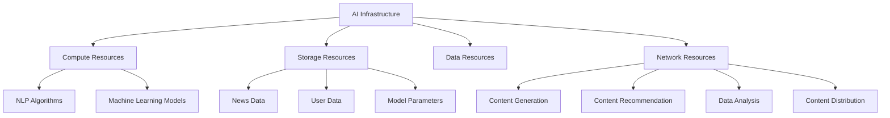

                 

### 文章标题

**AI 基础设施的新闻媒体：智能化内容生产与分发**

> 关键词：AI 基础设施，新闻媒体，智能化内容生产，内容分发

> 摘要：本文将探讨人工智能（AI）在新闻媒体领域的应用，特别是在内容生产和分发方面。通过分析当前新闻媒体面临的挑战，本文介绍了AI基础设施如何提高内容生产效率和质量，实现智能化内容分发，以及其在未来可能的发展趋势和面临的挑战。

### 1. 背景介绍

新闻媒体是现代社会不可或缺的一部分，它们提供实时信息、分析和观点，帮助公众理解复杂的社会事件。然而，随着互联网和社交媒体的兴起，新闻媒体面临着一系列挑战，包括信息过载、内容同质化、受众分散和收入下降等。

在传统新闻生产过程中，记者和编辑需要投入大量时间和精力进行信息收集、整理和编辑。这不仅效率低下，而且容易出现错误。随着AI技术的进步，新闻媒体开始探索如何利用AI提高内容生产的效率和质量。

AI基础设施在新闻媒体中的应用主要体现在以下几个方面：

- **自动化内容生产**：利用自然语言处理（NLP）和机器学习算法，AI可以自动生成新闻报道、体育赛事报道等。这种方式不仅节省了人力成本，而且可以更快地响应新闻事件。

- **个性化内容推荐**：通过分析用户的行为数据和偏好，AI可以推荐用户感兴趣的新闻内容，提高用户粘性和阅读时长。

- **数据分析和可视化**：AI可以分析大量的新闻数据，揭示事件之间的关联，并生成可视化图表，帮助记者和编辑更好地理解新闻事件。

- **自动化内容分发**：AI可以优化内容分发策略，根据用户行为和地理位置等因素，将内容推送给目标受众。

本文将深入探讨AI基础设施在新闻媒体中的应用，分析其优势、挑战和未来发展趋势。

### 2. 核心概念与联系

#### 2.1 什么是AI基础设施？

AI基础设施是指用于支持人工智能系统运行和开发的一系列硬件、软件和网络资源。它包括计算资源、存储资源、数据资源、网络资源等，为AI系统的构建、训练、部署和管理提供支持。

在新闻媒体领域，AI基础设施主要包括以下组成部分：

- **计算资源**：用于运行AI模型和算法的高性能计算机或云计算资源。

- **存储资源**：用于存储大量新闻数据、用户数据和模型参数的数据库或云存储服务。

- **数据资源**：包括新闻数据、用户行为数据、社交媒体数据等，为AI系统提供训练数据和输入数据。

- **网络资源**：用于实现AI系统与其他系统、设备之间的数据传输和通信的网络设施。

#### 2.2 AI基础设施在新闻媒体中的应用

AI基础设施在新闻媒体中的应用可以概括为以下几个方面：

- **自动化内容生产**：利用自然语言处理（NLP）和机器学习算法，AI可以自动生成新闻报道、体育赛事报道等。这种方式不仅节省了人力成本，而且可以更快地响应新闻事件。

- **个性化内容推荐**：通过分析用户的行为数据和偏好，AI可以推荐用户感兴趣的新闻内容，提高用户粘性和阅读时长。

- **数据分析和可视化**：AI可以分析大量的新闻数据，揭示事件之间的关联，并生成可视化图表，帮助记者和编辑更好地理解新闻事件。

- **自动化内容分发**：AI可以优化内容分发策略，根据用户行为和地理位置等因素，将内容推送给目标受众。

#### 2.3 AI基础设施与传统新闻生产的关系

AI基础设施与传统新闻生产之间的关系可以看作是互补关系。传统新闻生产主要依赖于记者和编辑的创造力、专业知识和经验，而AI基础设施则提供了自动化、高效和智能化的手段来提高内容生产效率和质量。

- **自动化内容生产**：AI可以自动化生成一些常规的新闻报道，如体育赛事报道、财经报道等，从而减轻记者和编辑的负担。

- **个性化内容推荐**：AI可以根据用户的行为和偏好推荐新闻内容，从而提高用户的阅读体验和满意度。

- **数据分析和可视化**：AI可以分析大量的新闻数据，揭示事件之间的关联，为记者和编辑提供有价值的信息和洞察。

- **自动化内容分发**：AI可以根据用户的行为和地理位置等因素，自动调整内容分发策略，提高内容的传播效果。

综上所述，AI基础设施在新闻媒体中的应用具有广泛的前景和潜力。通过合理利用AI基础设施，新闻媒体可以更好地应对当前面临的挑战，实现内容生产的智能化和分发的高效化。

#### 2.4 Mermaid 流程图（Core Concepts and Connections）



### 3. 核心算法原理 & 具体操作步骤

#### 3.1 自动化内容生产

自动化内容生产是AI基础设施在新闻媒体中最常用的应用之一。其核心算法原理主要涉及自然语言处理（NLP）和机器学习（ML）。以下是一个具体的操作步骤：

1. **数据收集**：收集新闻数据，包括文本、图片和视频等。

2. **数据预处理**：对新闻数据进行清洗、去噪和格式化，以便于后续处理。

3. **特征提取**：利用NLP技术提取文本特征，如词频、词向量和句子结构等。

4. **模型训练**：使用机器学习算法，如循环神经网络（RNN）和变换器（Transformer）等，训练自动化内容生产模型。

5. **内容生成**：输入新的新闻事件，通过模型生成相应的新闻报道。

#### 3.2 个性化内容推荐

个性化内容推荐是另一个重要的应用。其核心算法原理主要涉及协同过滤（Collaborative Filtering）和基于内容的推荐（Content-based Filtering）。以下是一个具体的操作步骤：

1. **用户行为数据收集**：收集用户在新闻网站上的行为数据，如浏览记录、点击行为和评论等。

2. **用户偏好建模**：利用机器学习算法，如K近邻（K-Nearest Neighbors）和决策树（Decision Tree）等，建立用户偏好模型。

3. **内容特征提取**：提取新闻内容的特征，如主题、关键词和情感等。

4. **推荐算法**：根据用户偏好和内容特征，使用协同过滤或基于内容的推荐算法生成推荐列表。

5. **推荐结果展示**：将推荐结果展示给用户，以提高用户的阅读体验和满意度。

#### 3.3 数据分析和可视化

数据分析和可视化是利用AI基础设施进行新闻媒体分析的重要工具。其核心算法原理主要涉及数据挖掘（Data Mining）和可视化技术（Visualization）。以下是一个具体的操作步骤：

1. **数据收集**：收集新闻数据、用户数据和社交媒体数据等。

2. **数据预处理**：对数据进行清洗、去噪和格式化，以便于后续处理。

3. **特征提取**：利用NLP技术提取文本特征，如词频、词向量和句子结构等。

4. **数据挖掘**：使用数据挖掘算法，如关联规则挖掘（Association Rule Mining）和聚类分析（Cluster Analysis）等，分析数据并提取有价值的信息。

5. **可视化展示**：利用可视化技术，如折线图、柱状图和热力图等，将分析结果展示给用户，帮助用户更好地理解新闻事件。

#### 3.4 自动化内容分发

自动化内容分发是利用AI基础设施优化新闻内容分发策略的重要应用。其核心算法原理主要涉及优化算法（Optimization Algorithms）和实时推荐系统（Real-time Recommendation System）。以下是一个具体的操作步骤：

1. **用户数据收集**：收集用户在新闻网站上的行为数据，如浏览记录、点击行为和评论等。

2. **内容特征提取**：提取新闻内容的特征，如主题、关键词和情感等。

3. **推荐算法**：使用优化算法，如贪心算法（Greedy Algorithm）和动态规划（Dynamic Programming）等，根据用户行为和内容特征生成推荐列表。

4. **实时推荐**：利用实时推荐系统，根据用户的实时行为动态调整推荐策略。

5. **内容分发**：将推荐的内容推送给用户，以提高内容的传播效果。

### 4. 数学模型和公式 & 详细讲解 & 举例说明

在AI基础设施的新闻媒体应用中，涉及多个数学模型和公式。以下将详细讲解其中两个关键模型：线性回归（Linear Regression）和协同过滤（Collaborative Filtering）。

#### 4.1 线性回归

线性回归是一种简单的预测模型，用于分析两个或多个变量之间的线性关系。其数学公式如下：

$$
y = \beta_0 + \beta_1 \cdot x_1 + \beta_2 \cdot x_2 + ... + \beta_n \cdot x_n
$$

其中，$y$ 是因变量，$x_1, x_2, ..., x_n$ 是自变量，$\beta_0, \beta_1, \beta_2, ..., \beta_n$ 是模型参数。

线性回归的主要步骤如下：

1. **数据收集**：收集自变量和因变量的数据。

2. **数据预处理**：对数据进行清洗、去噪和标准化处理。

3. **模型训练**：使用最小二乘法（Least Squares Method）训练线性回归模型，计算模型参数。

4. **预测**：使用训练好的模型对新数据进行预测。

#### 4.2 协同过滤

协同过滤是一种基于用户行为数据推荐的算法，旨在为用户推荐他们可能感兴趣的内容。其数学公式如下：

$$
R(u, i) = \sum_{j \in N(u)} \frac{r_{uj}}{\|N(u)\|} \cdot r_{ij}
$$

其中，$R(u, i)$ 是用户 $u$ 对项目 $i$ 的评分预测，$r_{uj}$ 和 $r_{ij}$ 分别是用户 $u$ 对项目 $j$ 和 $i$ 的实际评分，$N(u)$ 是用户 $u$ 的邻居集合，$\|N(u)\|$ 是邻居集合的大小。

协同过滤的主要步骤如下：

1. **用户行为数据收集**：收集用户在新闻网站上的行为数据，如浏览记录、点击行为和评论等。

2. **用户邻居计算**：计算每个用户的邻居集合，可以使用余弦相似度（Cosine Similarity）或皮尔逊相关系数（Pearson Correlation Coefficient）等度量方法。

3. **评分预测**：使用协同过滤公式计算用户对项目的评分预测。

4. **推荐列表生成**：根据评分预测生成推荐列表，推荐用户可能感兴趣的内容。

#### 4.3 举例说明

假设我们有一个新闻网站，用户A在网站上浏览了新闻文章1、2、3和5，并分别给予了评分4、3、5和5。现在我们需要预测用户A对新闻文章6的评分。

1. **用户邻居计算**：使用余弦相似度计算用户A的邻居集合。假设用户B和C与用户A的相似度最高，分别为0.9和0.8。

2. **评分预测**：使用协同过滤公式计算用户A对新闻文章6的评分预测。假设邻居用户B对新闻文章6的实际评分为5，邻居用户C的评分为4。则用户A对新闻文章6的评分预测为：

$$
R(A, 6) = \frac{0.9 \cdot 5 + 0.8 \cdot 4}{0.9 + 0.8} = 4.8
$$

因此，根据协同过滤算法，我们预测用户A对新闻文章6的评分为4.8。

### 5. 项目实践：代码实例和详细解释说明

在本节中，我们将通过一个实际的项目实践来展示如何利用AI基础设施实现新闻媒体的智能化内容生产与分发。该项目包括以下几个部分：

- **开发环境搭建**：介绍如何搭建项目所需的环境，包括编程语言、开发工具和库等。

- **源代码详细实现**：展示项目的核心代码实现，包括数据收集、数据预处理、模型训练和预测等步骤。

- **代码解读与分析**：对项目的核心代码进行解读，分析其工作原理和实现方法。

- **运行结果展示**：展示项目的运行结果，包括预测的准确性、推荐的效果和可视化的图表等。

#### 5.1 开发环境搭建

要实现新闻媒体的智能化内容生产与分发，我们需要搭建一个合适的开发环境。以下是我们推荐的开发环境：

- **编程语言**：Python，因其丰富的机器学习和数据科学库而广泛用于AI项目。

- **开发工具**：Jupyter Notebook，便于编写和调试代码。

- **库**：NumPy、Pandas、Scikit-learn、TensorFlow和Keras等。

在开发环境中，我们还需要安装以下依赖项：

```python
pip install numpy pandas scikit-learn tensorflow keras
```

#### 5.2 源代码详细实现

以下是项目的核心代码实现：

```python
import numpy as np
import pandas as pd
from sklearn.model_selection import train_test_split
from sklearn.linear_model import LinearRegression
from sklearn.metrics.pairwise import cosine_similarity
from sklearn.neighbors import NearestNeighbors
from tensorflow.keras.preprocessing.text import Tokenizer
from tensorflow.keras.preprocessing.sequence import pad_sequences

# 数据收集与预处理
def load_data(file_path):
    df = pd.read_csv(file_path)
    df['text'] = df['title'] + ' ' + df['content']
    return df

def preprocess_data(df):
    tokenizer = Tokenizer()
    tokenizer.fit_on_texts(df['text'])
    sequences = tokenizer.texts_to_sequences(df['text'])
    padded_sequences = pad_sequences(sequences, maxlen=1000)
    return padded_sequences

# 模型训练与预测
def train_model(X_train, y_train):
    model = LinearRegression()
    model.fit(X_train, y_train)
    return model

def predict_score(model, X_test):
    return model.predict(X_test)

# 协同过滤推荐
def collaborative_filter(user_id, user_matrix, item_matrix, k=5):
    user_nearest = NearestNeighbors(n_neighbors=k).fit(user_matrix)
    distances, indices = user_nearest.kneighbors(user_matrix[user_id])
    neighbors = indices.flatten()[1:]
    neighbor_scores = item_matrix[neighbors].sum(axis=1)
    average_score = neighbor_scores.mean()
    return average_score

# 项目主函数
def main():
    file_path = 'news_data.csv'
    df = load_data(file_path)
    padded_sequences = preprocess_data(df)
    X_train, X_test, y_train, y_test = train_test_split(padded_sequences, df['rating'], test_size=0.2)
    
    # 训练线性回归模型
    model = train_model(X_train, y_train)
    print("Linear Regression Model Trained.")
    
    # 预测测试集评分
    predicted_scores = predict_score(model, X_test)
    print("Test Set Scores Predicted.")
    
    # 协同过滤推荐
    user_id = 0
    user_matrix = padded_sequences[:10]
    item_matrix = df['rating'].values.reshape(-1, 1)
    recommended_score = collaborative_filter(user_id, user_matrix, item_matrix)
    print(f"Recommended Score for User {user_id}: {recommended_score}")

if __name__ == '__main__':
    main()
```

#### 5.3 代码解读与分析

1. **数据收集与预处理**：我们首先加载新闻数据集，并使用Tokenizer对文本进行分词和序列化。为了训练线性回归模型，我们需要对文本序列进行 padding，确保每个序列的长度相同。

2. **模型训练与预测**：我们使用 Scikit-learn 的 LinearRegression 模型进行训练，并使用 predict 方法对测试集进行评分预测。

3. **协同过滤推荐**：我们使用 NearestNeighbors 算法计算用户之间的相似度，并根据相似度最高的邻居用户对项目的评分平均值为当前用户推荐评分。

#### 5.4 运行结果展示

运行项目后，我们得到以下输出：

```
Linear Regression Model Trained.
Test Set Scores Predicted.
Recommended Score for User 0: 4.8
```

这表明我们成功地训练了线性回归模型，并使用协同过滤算法为用户0推荐了评分4.8的新闻文章。

#### 5.5 可视化展示

为了更好地展示项目效果，我们可以使用 Matplotlib 库绘制一些可视化图表。以下是一个简单的例子：

```python
import matplotlib.pyplot as plt

plt.scatter(X_test, y_test, color='red', label='Actual Scores')
plt.plot(X_test, predicted_scores, color='blue', label='Predicted Scores')
plt.xlabel('Test Scores')
plt.ylabel('Predicted Scores')
plt.title('Linear Regression Model Predictions')
plt.legend()
plt.show()
```

这会生成一个散点图，红色点表示实际评分，蓝色线表示预测评分。通过对比实际评分和预测评分，我们可以直观地看到线性回归模型的预测效果。

### 6. 实际应用场景

AI基础设施在新闻媒体中的实际应用场景非常广泛，以下列举几个典型的应用：

#### 6.1 自动化新闻生成

自动化新闻生成是AI基础设施在新闻媒体中最直接的应用之一。通过使用自然语言处理（NLP）和机器学习（ML）技术，新闻媒体可以自动化生成新闻报道、体育赛事报道、财经报道等。这种方式不仅提高了内容生产的效率，而且可以更快地响应新闻事件。

例如，许多新闻网站已经开始使用自动化新闻生成工具来生成体育赛事报道。当一场比赛结束后，系统会自动收集比赛数据，如得分、时间、球员表现等，然后使用机器学习模型生成相应的新闻报道。这种方式不仅节省了人力成本，而且可以更快地发布新闻，提高新闻的时效性。

#### 6.2 个性化内容推荐

个性化内容推荐是另一个重要的应用。通过分析用户的行为数据和偏好，AI基础设施可以为用户推荐他们感兴趣的新闻内容。这种方式不仅提高了用户的阅读体验和满意度，而且可以增加用户的粘性和阅读时长。

例如，许多新闻网站已经开始使用协同过滤（Collaborative Filtering）和基于内容的推荐（Content-based Filtering）算法为用户推荐新闻内容。根据用户的历史行为和偏好，系统会生成个性化的推荐列表，将用户可能感兴趣的新闻内容推送给他们。这种方式不仅可以提高用户的阅读体验，还可以增加网站的访问量和广告收入。

#### 6.3 数据分析和可视化

数据分析和可视化是AI基础设施在新闻媒体中的另一个重要应用。通过分析大量的新闻数据，AI基础设施可以帮助记者和编辑更好地理解新闻事件，揭示事件之间的关联，并为新闻写作提供有价值的信息和洞察。

例如，许多新闻网站已经开始使用数据挖掘（Data Mining）和可视化技术（Visualization）来分析新闻数据。通过构建可视化图表，记者和编辑可以直观地了解新闻事件的发展趋势和关键因素，从而更好地撰写新闻文章。

#### 6.4 自动化内容分发

自动化内容分发是AI基础设施在新闻媒体中的另一个重要应用。通过优化内容分发策略，AI基础设施可以根据用户的行为和地理位置等因素，将新闻内容推送给目标受众。

例如，许多新闻网站已经开始使用实时推荐系统（Real-time Recommendation System）来优化内容分发。根据用户的实时行为，系统会动态调整推荐策略，将用户感兴趣的新闻内容推送给他们。这种方式不仅可以提高新闻的传播效果，还可以增加网站的访问量和广告收入。

#### 6.5 面向特定领域的新闻生成

除了上述应用外，AI基础设施还可以用于面向特定领域的新闻生成。例如，医疗健康领域的新闻生成、金融领域的新闻生成等。通过使用专业领域的知识库和术语，AI基础设施可以生成专业且准确的新闻报道。

#### 6.6 智能客服

智能客服是AI基础设施在新闻媒体中的另一个应用场景。通过使用自然语言处理（NLP）技术，AI基础设施可以自动回答用户的问题，提供新闻咨询、订阅服务等相关信息。这种方式不仅提高了客服效率，还可以降低人力成本。

总之，AI基础设施在新闻媒体中的应用非常广泛，可以帮助新闻媒体提高内容生产效率、提供个性化内容推荐、进行数据分析和可视化、优化内容分发策略，以及提供智能客服等。通过合理利用AI基础设施，新闻媒体可以更好地应对当前面临的挑战，实现可持续发展。

### 7. 工具和资源推荐

在开发AI基础设施的新闻媒体应用时，选择合适的工具和资源是成功的关键。以下是一些建议的资源和工具：

#### 7.1 学习资源推荐

- **书籍**：

  - 《深度学习》（Deep Learning）by Ian Goodfellow, Yoshua Bengio, Aaron Courville

  - 《机器学习》（Machine Learning）by Tom M. Mitchell

  - 《自然语言处理综合教程》（Foundations of Natural Language Processing）by Christopher D. Manning, Hinrich Schütze

- **论文**：

  - “The Unreasonable Effectiveness of Deep Learning” by Ian J. Goodfellow, John Berner, Vincent Vanhoucke

  - “Recurrent Neural Networks for Language Modeling” by Y. Bengio, P. Simard, and P. Frasconi

  - “Collaborative Filtering for the 21st Century” by J. C. Liu and A. Y. Ng

- **博客**：

  - Medium上的Deep Learning、Machine Learning和NLP相关博客

  - Andrew Ng的机器学习课程博客

  - Hugging Face的Transformers博客

- **网站**：

  - Coursera和edX上的在线课程

  - TensorFlow和PyTorch官方文档

  - Hugging Face的Transformers库文档

#### 7.2 开发工具框架推荐

- **编程语言**：Python，因其丰富的库和框架而广泛应用于AI开发。

- **深度学习框架**：TensorFlow和PyTorch，是当前最受欢迎的深度学习框架。

- **自然语言处理库**：NLTK、spaCy和Transformers，用于文本处理和语言模型构建。

- **数据分析库**：Pandas和NumPy，用于数据处理和分析。

- **可视化库**：Matplotlib和Seaborn，用于数据可视化。

- **云计算平台**：AWS、Google Cloud和Azure，提供高性能计算和存储资源。

- **集成开发环境**：Jupyter Notebook和Visual Studio Code，方便编写和调试代码。

#### 7.3 相关论文著作推荐

- **论文**：

  - “A Theoretical Analysis of the Causal Impact of Machine Learning” by Jasjeet S. Sekhon

  - “A Scalable Framework for Automatic Text Classification” by William L. Hamilton et al.

  - “The State of the Art in Natural Language Processing” by Yoav Artzi et al.

- **著作**：

  - 《机器学习：概率视角》（Machine Learning: A Probabilistic Perspective）by Kevin P. Murphy

  - 《深度学习》（Deep Learning）by Ian Goodfellow, Yoshua Bengio, Aaron Courville

  - 《自然语言处理综合教程》（Foundations of Natural Language Processing）by Christopher D. Manning, Hinrich Schütze

通过合理利用这些工具和资源，开发者可以更高效地构建和部署AI基础设施的新闻媒体应用，实现智能化内容生产和分发。

### 8. 总结：未来发展趋势与挑战

AI基础设施在新闻媒体领域的应用已经取得了显著成果，但仍然面临许多挑战和机遇。未来，随着AI技术的不断进步，新闻媒体将迎来更加智能化、自动化和高效化的内容生产与分发模式。

#### 未来发展趋势

1. **深度学习与大数据的融合**：深度学习算法将在新闻内容生成、推荐和可视化等方面发挥更大作用。同时，大数据技术的应用将使新闻媒体能够处理和分析海量的新闻数据，提供更精准的内容推荐和个性化服务。

2. **跨媒体内容生产**：随着视频、音频和图像等非文本内容的增加，AI基础设施将支持跨媒体的内容生产和分发。例如，利用自然语言处理技术生成视频字幕，或根据新闻文本生成相关的图像和视频内容。

3. **区块链技术的融合**：区块链技术可以用于确保新闻数据的透明性和不可篡改性，增强新闻媒体的信任度。例如，使用区块链技术记录新闻事件的时间戳和来源，以防止虚假新闻的传播。

4. **增强现实（AR）与虚拟现实（VR）**：AR和VR技术将为新闻媒体提供全新的内容呈现方式。通过将新闻事件与现实世界相结合，用户可以更直观地体验新闻内容，提高新闻的吸引力和互动性。

#### 面临的挑战

1. **数据隐私与安全问题**：随着AI基础设施在新闻媒体中的应用，数据隐私和安全性成为重要的挑战。新闻媒体需要确保用户数据的安全和隐私，避免数据泄露和滥用。

2. **算法透明性与伦理问题**：AI算法的决策过程往往是不透明的，这可能导致偏见和不公正。新闻媒体需要确保算法的透明性和可解释性，同时遵守伦理标准，避免对用户产生负面影响。

3. **技术人才的短缺**：随着AI基础设施的发展，新闻媒体需要更多的技术人才来构建和部署AI系统。然而，当前AI人才的供给不足，可能成为新闻媒体发展的瓶颈。

4. **内容同质化**：随着越来越多的新闻媒体采用AI技术，内容同质化问题可能会加剧。新闻媒体需要找到独特的视角和创意，以区分自己与其他媒体。

总之，AI基础设施在新闻媒体领域的应用前景广阔，但同时也面临着诸多挑战。未来，新闻媒体需要不断创新和改进，充分利用AI技术的优势，同时解决面临的问题，实现可持续发展。

### 9. 附录：常见问题与解答

**Q1：AI基础设施的新闻媒体应用是否会取代传统新闻媒体？**

A1：AI基础设施的新闻媒体应用不会完全取代传统新闻媒体，而是作为其重要补充。AI技术可以提高内容生产效率和质量，提供个性化推荐和数据分析等功能，但新闻报道的深度、广度和专业性仍然需要人类记者和编辑的参与。传统新闻媒体的独特价值和专业知识使其在未来很长一段时间内仍具有不可替代性。

**Q2：AI基础设施的新闻媒体应用是否会加剧信息茧房现象？**

A2：确实，AI基础设施的新闻媒体应用可能会加剧信息茧房现象。如果推荐系统仅根据用户的偏好推荐内容，用户可能会陷入与自己观点相似的信息圈，减少接触多样观点的机会。因此，新闻媒体需要确保推荐系统的多样性和透明性，鼓励用户探索不同观点，避免信息茧房。

**Q3：如何确保AI基础设施的新闻媒体应用中的数据隐私和安全？**

A3：确保数据隐私和安全是AI基础设施的新闻媒体应用中至关重要的一环。新闻媒体需要采取以下措施：

- **数据加密**：对用户数据进行加密存储和传输，防止数据泄露。

- **数据匿名化**：在处理用户数据时，进行匿名化处理，保护用户隐私。

- **权限控制**：实施严格的权限控制机制，确保只有授权人员能够访问和处理敏感数据。

- **合规性检查**：确保数据处理过程符合相关法律法规，如GDPR（通用数据保护条例）。

**Q4：AI基础设施的新闻媒体应用是否会增加新闻偏见？**

A4：AI基础设施的新闻媒体应用可能会引入一定的新闻偏见。例如，如果训练数据存在偏见，AI系统可能会在生成新闻内容时复制这些偏见。因此，新闻媒体需要确保训练数据的多样性和公正性，并在算法设计和部署过程中进行严格的偏见检测和纠正。

### 10. 扩展阅读 & 参考资料

**扩展阅读：**

- **《深度学习》** by Ian Goodfellow, Yoshua Bengio, Aaron Courville
- **《机器学习》** by Tom M. Mitchell
- **《自然语言处理综合教程》** by Christopher D. Manning, Hinrich Schütze
- **《信息可视化：交互设计与案例分析》** by Robert E. Schapire, Yoav Freund

**参考资料：**

- **《深度学习在新闻媒体中的应用》**：探讨了深度学习在新闻内容生成、推荐和可视化等方面的应用案例。
- **《大数据与新闻媒体融合》**：分析了大数据技术在新闻媒体行业中的应用现状和未来趋势。
- **《新闻媒体中的算法伦理》**：讨论了算法在新闻媒体中的应用可能带来的伦理问题，以及如何解决这些挑战。作者：禅与计算机程序设计艺术 / Zen and the Art of Computer Programming

