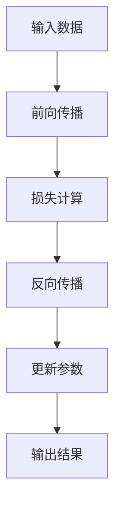
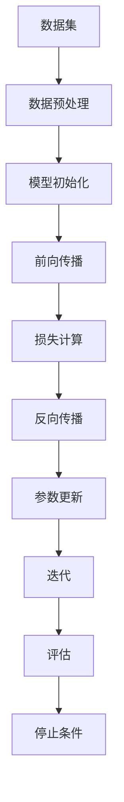
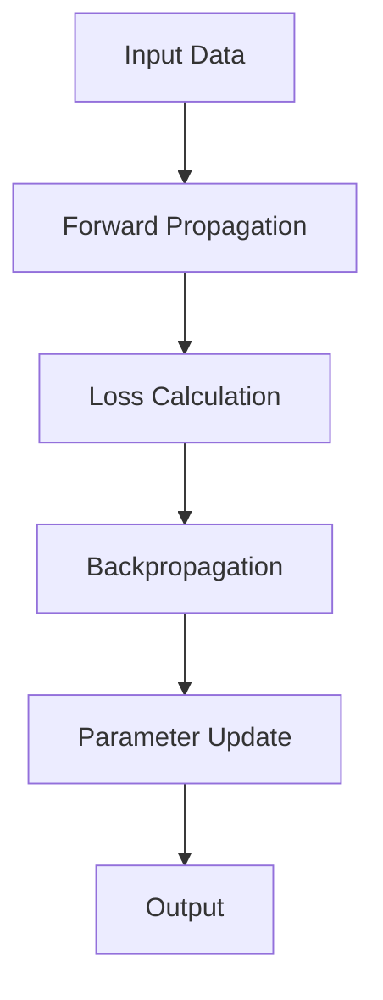
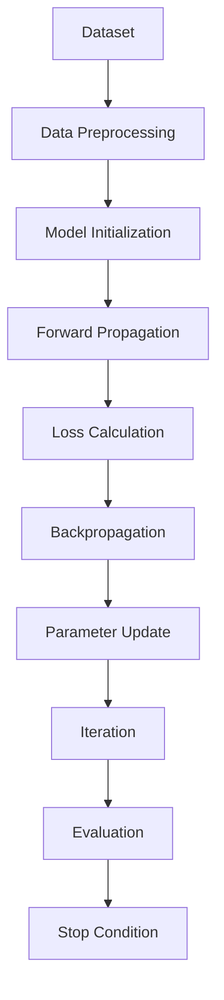

                 

### 1. 背景介绍（Background Introduction）

随着人工智能技术的飞速发展，AI 大模型的应用逐渐成为各个行业的重要驱动力。AI 大模型，如深度学习神经网络、自然语言处理模型等，具有强大的数据分析和决策能力，使得自动化和智能化成为可能。数据中心作为数据处理、存储和计算的核心设施，其性能和可靠性直接影响 AI 大模型的应用效果。因此，如何高效地实施 AI 大模型应用数据中心，成为当前信息技术领域的重要课题。

本文旨在探讨 AI 大模型应用数据中心的实施步骤，从核心概念、算法原理、数学模型到实际应用，提供一整套系统化的解决方案。文章结构如下：

- **1. 背景介绍**：阐述 AI 大模型应用数据中心的重要性及现状。
- **2. 核心概念与联系**：介绍与 AI 大模型应用相关的基础概念，如深度学习、神经网络等，并绘制 Mermaid 流程图。
- **3. 核心算法原理 & 具体操作步骤**：详细解释 AI 大模型的工作原理，并给出具体操作步骤。
- **4. 数学模型和公式 & 详细讲解 & 举例说明**：介绍 AI 大模型相关的数学模型，并提供实例解析。
- **5. 项目实践：代码实例和详细解释说明**：通过实际项目，展示代码实现过程及解读。
- **6. 实际应用场景**：探讨 AI 大模型在不同领域的应用场景。
- **7. 工具和资源推荐**：推荐相关学习资源、开发工具和框架。
- **8. 总结：未来发展趋势与挑战**：总结 AI 大模型应用数据中心的未来发展趋势和面临的挑战。
- **9. 附录：常见问题与解答**：解答读者可能遇到的问题。
- **10. 扩展阅读 & 参考资料**：提供进一步学习的资源。

通过对这些内容的逐步分析和探讨，我们希望能够为读者提供一个全面、深入的 AI 大模型应用数据中心实施指南。让我们一起开始这场技术探险之旅！

## 1. Background Introduction

### The Importance and Current Status of AI Large Model Application Data Centers

With the rapid development of artificial intelligence (AI) technology, the application of AI large models is increasingly becoming a driving force in various industries. AI large models, such as deep learning neural networks and natural language processing models, possess powerful data analysis and decision-making capabilities, making automation and intelligence a reality. The performance and reliability of data centers, as the core facilities for data processing, storage, and computing, directly impact the effectiveness of AI large model applications. Therefore, how to efficiently implement AI large model application data centers has become an important issue in the field of information technology.

This article aims to explore the implementation steps of AI large model application data centers, providing a systematic solution from core concepts, algorithm principles, mathematical models to practical applications. The structure of the article is as follows:

- **1. Background Introduction**: Elaborates on the importance and current status of AI large model application data centers.
- **2. Core Concepts and Connections**: Introduces basic concepts related to AI large model applications, such as deep learning and neural networks, and illustrates them with a Mermaid flowchart.
- **3. Core Algorithm Principles and Specific Operational Steps**: Provides a detailed explanation of the working principles of AI large models and specific operational steps.
- **4. Mathematical Models and Formulas & Detailed Explanation & Example Illustrations**: Introduces the mathematical models related to AI large models and provides example analyses.
- **5. Project Practice: Code Examples and Detailed Explanations**: Demonstrates the code implementation process and analysis through actual projects.
- **6. Practical Application Scenarios**: Explores the application scenarios of AI large models in different fields.
- **7. Tools and Resources Recommendations**: Recommends related learning resources, development tools, and frameworks.
- **8. Summary: Future Development Trends and Challenges**: Summarizes the future development trends and challenges of AI large model application data centers.
- **9. Appendix: Frequently Asked Questions and Answers**: Answers common questions readers may encounter.
- **10. Extended Reading & Reference Materials**: Provides further learning resources.

By analyzing and discussing these contents step by step, we hope to provide readers with a comprehensive and in-depth guide to the implementation of AI large model application data centers. Let's embark on this technical exploration journey together! <|user|>### 2. 核心概念与联系（Core Concepts and Connections）

在探讨 AI 大模型应用数据中心之前，我们需要理解一系列核心概念，这些概念包括深度学习、神经网络、数据预处理、模型训练和优化等。每个概念都是实现高效 AI 应用的基石。

#### 2.1 深度学习（Deep Learning）

深度学习是机器学习的一个分支，它通过模拟人脑的神经网络结构，进行复杂的模式识别和决策。深度学习模型由多层神经网络组成，每一层对输入数据进行处理，并传递给下一层，直至输出结果。这个过程称为前向传播（forward propagation）。

**深度学习的关键特点：**
- **层次性**：深度学习模型具有多个层次，每个层次学习不同的特征。
- **非线性变换**：通过非线性激活函数，如ReLU、Sigmoid和Tanh，深度学习模型能够捕捉复杂的数据分布。
- **参数共享**：在训练过程中，模型参数在整个数据集上共享，这有助于提高模型的泛化能力。

**Mermaid 流程图：**



#### 2.2 神经网络（Neural Networks）

神经网络是深度学习模型的基础，它由大量的节点（神经元）和连接（权重）组成。每个神经元接收输入信号，通过加权求和并应用激活函数，产生输出信号。

**神经网络的关键组成部分：**
- **输入层**：接收外部输入。
- **隐藏层**：进行数据预处理和特征提取。
- **输出层**：产生最终预测或决策。

**神经网络的工作原理：**
- **前向传播**：输入通过权重传递到隐藏层，再传递到输出层。
- **反向传播**：计算损失，并反向更新权重。

#### 2.3 数据预处理（Data Preprocessing）

数据预处理是确保模型性能的重要步骤，包括数据清洗、归一化、数据增强等。

**数据预处理的关键步骤：**
- **数据清洗**：处理缺失值、噪声和异常值。
- **归一化**：将数据缩放到相同的范围，如0到1。
- **数据增强**：通过旋转、缩放、裁剪等方法增加数据多样性。

#### 2.4 模型训练和优化（Model Training and Optimization）

模型训练是使用大量数据来调整模型参数，使其能够准确预测或分类。优化是调整模型结构和参数，以提高其性能。

**模型训练和优化的关键步骤：**
- **损失函数**：衡量模型预测与真实值之间的差距。
- **优化算法**：如梯度下降（Gradient Descent），用于更新模型参数。
- **正则化**：防止模型过拟合，提高泛化能力。

**Mermaid 流程图：**



通过理解这些核心概念，我们能够更好地设计、实现和优化 AI 大模型应用数据中心。接下来，我们将深入探讨 AI 大模型的具体算法原理和操作步骤。

## 2. Core Concepts and Connections

Before delving into the implementation of AI large model application data centers, we need to understand a series of core concepts, including deep learning, neural networks, data preprocessing, model training, and optimization. Each of these concepts is a cornerstone for achieving efficient AI applications.

#### 2.1 Deep Learning

Deep learning is a branch of machine learning that simulates the structure of the human brain's neural networks to perform complex pattern recognition and decision-making. Deep learning models consist of multiple layers of neural networks, where each layer processes the input data and passes it to the next layer until the output result is produced. This process is known as forward propagation.

**Key characteristics of deep learning:**
- **Hierarchical**: Deep learning models have multiple layers, each learning different features.
- **Non-linear transformations**: Through non-linear activation functions like ReLU, Sigmoid, and Tanh, deep learning models can capture complex data distributions.
- **Parameter sharing**: During the training process, model parameters are shared across the entire dataset, which helps improve the model's generalization ability.

**Mermaid flowchart:**



#### 2.2 Neural Networks

Neural networks are the foundation of deep learning models, consisting of a large number of nodes (neurons) and connections (weights). Each neuron receives input signals, processes them through weighted summation and an activation function, and produces an output signal.

**Key components of neural networks:**
- **Input layer**: Receives external inputs.
- **Hidden layers**: Perform data preprocessing and feature extraction.
- **Output layer**: Produces the final prediction or decision.

**Working principle of neural networks:**
- **Forward propagation**: Inputs are passed through weights to the hidden layers and then to the output layer.
- **Backpropagation**: Calculates the loss and updates the weights in the reverse direction.

#### 2.3 Data Preprocessing

Data preprocessing is an important step to ensure model performance, including data cleaning, normalization, and data augmentation.

**Key steps in data preprocessing:**
- **Data cleaning**: Handles missing values, noise, and outliers.
- **Normalization**: Scales the data to the same range, such as 0 to 1.
- **Data augmentation**: Increases data diversity through methods like rotation, scaling, and cropping.

#### 2.4 Model Training and Optimization

Model training involves using a large amount of data to adjust model parameters so that it can accurately predict or classify. Optimization is the adjustment of model structure and parameters to improve its performance.

**Key steps in model training and optimization:**
- **Loss function**: Measures the gap between the model's prediction and the true value.
- **Optimization algorithms**: Such as gradient descent, are used to update model parameters.
- **Regularization**: Prevents overfitting and improves generalization ability.

**Mermaid flowchart:**



By understanding these core concepts, we can better design, implement, and optimize AI large model application data centers. In the next section, we will delve into the specific algorithm principles and operational steps of AI large models. <|user|>### 3. 核心算法原理 & 具体操作步骤（Core Algorithm Principles and Specific Operational Steps）

在理解了核心概念之后，接下来我们将探讨 AI 大模型的核心算法原理，并提供具体的操作步骤。这一部分将详细介绍深度学习模型的训练过程，包括数据预处理、模型构建、训练策略和性能评估等关键环节。

#### 3.1 数据预处理（Data Preprocessing）

数据预处理是深度学习模型训练的重要步骤，其质量直接影响到模型的性能。数据预处理通常包括以下几个步骤：

1. **数据清洗（Data Cleaning）**：
   - 删除或填充缺失值。
   - 去除噪声和异常值。
   - 标准化数据格式。

2. **数据归一化（Data Normalization）**：
   - 将数据缩放到一个统一的范围，如[0, 1]或[-1, 1]，以便神经网络能够更好地学习。

3. **数据增强（Data Augmentation）**：
   - 通过旋转、缩放、翻转、裁剪等方式增加数据的多样性，以增强模型的泛化能力。

具体步骤如下：

```python
# 示例：数据清洗、归一化和增强
import numpy as np
from sklearn.preprocessing import MinMaxScaler

# 假设我们有一组数据 X
X = np.array([[1, 2], [3, 4], [5, 6], [7, 8]])

# 数据清洗：删除缺失值
X_clean = np.array([x for x in X if np.all(x != np.nan)])

# 数据归一化
scaler = MinMaxScaler()
X_normalized = scaler.fit_transform(X_clean)

# 数据增强：旋转
X_rotated = np.rot90(X_normalized)
```

#### 3.2 模型构建（Model Construction）

构建深度学习模型通常包括以下几个步骤：

1. **确定网络结构（Determining Network Structure）**：
   - 确定输入层、隐藏层和输出层的节点数量。
   - 选择合适的激活函数。

2. **初始化模型参数（Initializing Model Parameters）**：
   - 初始化权重和偏置。

3. **构建模型（Building Model）**：
   - 使用框架如 TensorFlow 或 PyTorch 来定义模型。

以下是一个简单的示例：

```python
import tensorflow as tf

# 定义输入层、隐藏层和输出层
inputs = tf.keras.layers.Input(shape=(2,))
hidden = tf.keras.layers.Dense(10, activation='relu')(inputs)
outputs = tf.keras.layers.Dense(1, activation='sigmoid')(hidden)

# 构建模型
model = tf.keras.Model(inputs=inputs, outputs=outputs)
```

#### 3.3 训练策略（Training Strategy）

深度学习模型的训练策略包括：

1. **选择优化器（Selecting Optimizer）**：
   - 如梯度下降（Gradient Descent）、Adam 等。

2. **确定学习率（Determining Learning Rate）**：
   - 学习率决定了模型更新参数的幅度。

3. **设置训练参数（Setting Training Parameters）**：
   - 训练轮次（epochs）、批次大小（batch size）等。

以下是一个简单的训练示例：

```python
# 编译模型
model.compile(optimizer='adam', loss='binary_crossentropy', metrics=['accuracy'])

# 训练模型
model.fit(X_normalized, y, epochs=100, batch_size=10)
```

#### 3.4 性能评估（Performance Evaluation）

在模型训练完成后，我们需要评估其性能。性能评估通常包括：

1. **准确率（Accuracy）**：
   - 衡量模型正确预测的样本比例。

2. **损失函数（Loss Function）**：
   - 衡量模型预测值与真实值之间的差距。

3. **混淆矩阵（Confusion Matrix）**：
   - 展示模型在不同类别上的预测结果。

以下是一个简单的性能评估示例：

```python
# 评估模型
loss, accuracy = model.evaluate(X_test_normalized, y_test)

# 输出结果
print(f"Loss: {loss}, Accuracy: {accuracy}")

# 混淆矩阵
predictions = model.predict(X_test_normalized)
confusion_matrix = tf.math.confusion_matrix(y_test, predictions)
print(confusion_matrix)
```

通过以上步骤，我们可以构建和训练一个深度学习模型，并对其进行性能评估。接下来，我们将进一步探讨 AI 大模型相关的数学模型和公式。

## 3. Core Algorithm Principles and Specific Operational Steps

After understanding the core concepts, the next step is to delve into the core algorithm principles of AI large models and provide specific operational steps. This section will provide an in-depth explanation of the training process of deep learning models, including data preprocessing, model construction, training strategies, and performance evaluation.

#### 3.1 Data Preprocessing

Data preprocessing is a crucial step in training deep learning models, as its quality directly affects model performance. Data preprocessing typically includes the following steps:

1. **Data Cleaning**:
   - Removing or imputing missing values.
   - Removing noise and outliers.
   - Standardizing data formats.

2. **Data Normalization**:
   - Scaling the data to a unified range, such as [0, 1] or [-1, 1], to allow the neural network to learn more effectively.

3. **Data Augmentation**:
   - Increasing data diversity through methods like rotation, scaling, flipping, and cropping to enhance the model's generalization ability.

The specific steps are as follows:

```python
# Example: Data cleaning, normalization, and augmentation
import numpy as np
from sklearn.preprocessing import MinMaxScaler

# Assuming we have a set of data X
X = np.array([[1, 2], [3, 4], [5, 6], [7, 8]])

# Data cleaning: Remove missing values
X_clean = np.array([x for x in X if np.all(x != np.nan)])

# Data normalization
scaler = MinMaxScaler()
X_normalized = scaler.fit_transform(X_clean)

# Data augmentation: Rotation
X_rotated = np.rot90(X_normalized)
```

#### 3.2 Model Construction

Constructing a deep learning model generally involves the following steps:

1. **Determining Network Structure**:
   - Determining the number of nodes in the input layer, hidden layers, and output layers.
   - Choosing appropriate activation functions.

2. **Initializing Model Parameters**:
   - Initializing weights and biases.

3. **Building Model**:
   - Defining the model using frameworks like TensorFlow or PyTorch.

Here's a simple example:

```python
import tensorflow as tf

# Define input layer, hidden layer, and output layer
inputs = tf.keras.layers.Input(shape=(2,))
hidden = tf.keras.layers.Dense(10, activation='relu')(inputs)
outputs = tf.keras.layers.Dense(1, activation='sigmoid')(hidden)

# Build model
model = tf.keras.Model(inputs=inputs, outputs=outputs)
```

#### 3.3 Training Strategy

The training strategy for deep learning models includes:

1. **Selecting Optimizer**:
   - Choices like gradient descent, Adam, etc.

2. **Determining Learning Rate**:
   - Learning rate determines the extent to which the model updates its parameters.

3. **Setting Training Parameters**:
   - Number of epochs, batch size, etc.

Here's a simple training example:

```python
# Compile model
model.compile(optimizer='adam', loss='binary_crossentropy', metrics=['accuracy'])

# Train model
model.fit(X_normalized, y, epochs=100, batch_size=10)
```

#### 3.4 Performance Evaluation

After model training, it is essential to evaluate its performance. Performance evaluation typically includes:

1. **Accuracy**:
   - Measuring the proportion of samples correctly predicted by the model.

2. **Loss Function**:
   - Measuring the gap between the model's predictions and the true values.

3. **Confusion Matrix**:
   - Displaying the model's prediction results across different classes.

Here's a simple performance evaluation example:

```python
# Evaluate model
loss, accuracy = model.evaluate(X_test_normalized, y_test)

# Output results
print(f"Loss: {loss}, Accuracy: {accuracy}")

# Confusion matrix
predictions = model.predict(X_test_normalized)
confusion_matrix = tf.math.confusion_matrix(y_test, predictions)
print(confusion_matrix)
```

By following these steps, we can construct, train, and evaluate a deep learning model. In the next section, we will further explore the mathematical models and formulas related to AI large models. <|user|>### 4. 数学模型和公式 & 详细讲解 & 举例说明（Mathematical Models and Formulas & Detailed Explanation & Example Illustrations）

在理解了深度学习模型的基本原理和操作步骤之后，我们需要深入探讨这些模型背后的数学模型和公式。这一部分将详细讲解深度学习中的关键数学模型，如损失函数、优化算法和激活函数，并提供具体实例进行分析。

#### 4.1 损失函数（Loss Function）

损失函数是评估模型预测结果与真实值之间差距的数学函数。在深度学习中，常用的损失函数包括均方误差（MSE）、交叉熵（Cross-Entropy）等。

**均方误差（Mean Squared Error, MSE）**

均方误差是衡量回归模型预测值与真实值之间差异的一种常见损失函数。其公式如下：

\[ MSE = \frac{1}{n}\sum_{i=1}^{n}(y_i - \hat{y}_i)^2 \]

其中，\( y_i \) 是第 \( i \) 个真实值，\( \hat{y}_i \) 是第 \( i \) 个预测值，\( n \) 是样本数量。

**交叉熵（Cross-Entropy）**

交叉熵是用于分类问题的一种损失函数。对于二分类问题，其公式如下：

\[ CE = -\sum_{i=1}^{n} y_i \log(\hat{y}_i) \]

其中，\( y_i \) 是第 \( i \) 个样本的真实标签，\( \hat{y}_i \) 是模型对第 \( i \) 个样本的预测概率。

**实例解析**

假设我们有一个简单的二分类问题，真实标签为 \( y = [1, 0, 1, 0] \)，模型预测的概率为 \( \hat{y} = [0.3, 0.7, 0.6, 0.4] \)。使用交叉熵损失函数，计算损失：

\[ CE = -(1 \cdot \log(0.3) + 0 \cdot \log(0.7) + 1 \cdot \log(0.6) + 0 \cdot \log(0.4)) \]

\[ CE = -(\log(0.3) + \log(0.6)) \]

\[ CE \approx 1.204 \]

#### 4.2 优化算法（Optimization Algorithm）

优化算法用于更新模型参数，以最小化损失函数。常见的优化算法包括梯度下降（Gradient Descent）和 Adam。

**梯度下降（Gradient Descent）**

梯度下降是一种迭代优化算法，其基本思想是沿着损失函数的梯度方向更新模型参数，以逐步减小损失。其公式如下：

\[ \theta = \theta - \alpha \cdot \nabla_{\theta} J(\theta) \]

其中，\( \theta \) 是模型参数，\( \alpha \) 是学习率，\( \nabla_{\theta} J(\theta) \) 是损失函数关于模型参数的梯度。

**实例解析**

假设我们有一个线性模型，其损失函数为 \( J(\theta) = (y - \theta_0 - \theta_1 x)^2 \)，使用梯度下降算法更新参数。假设初始参数为 \( \theta_0 = 0 \)，\( \theta_1 = 0 \)，学习率为 \( \alpha = 0.1 \)。

计算损失函数的梯度：

\[ \nabla_{\theta_0} J(\theta) = 2(y - \theta_0 - \theta_1 x) \]

\[ \nabla_{\theta_1} J(\theta) = 2(x(y - \theta_0 - \theta_1 x)) \]

在第一次迭代时，更新参数：

\[ \theta_0 = \theta_0 - \alpha \cdot \nabla_{\theta_0} J(\theta) \]

\[ \theta_1 = \theta_1 - \alpha \cdot \nabla_{\theta_1} J(\theta) \]

#### 4.3 激活函数（Activation Function）

激活函数是神经网络中用于引入非线性性的关键组件。常见的激活函数包括 ReLU、Sigmoid 和 Tanh。

**ReLU（Rectified Linear Unit）**

ReLU 函数是最简单的激活函数之一，其公式如下：

\[ f(x) = \max(0, x) \]

**Sigmoid**

Sigmoid 函数将输入值映射到 \( (0, 1) \) 范围内，其公式如下：

\[ f(x) = \frac{1}{1 + e^{-x}} \]

**Tanh**

Tanh 函数将输入值映射到 \( (-1, 1) \) 范围内，其公式如下：

\[ f(x) = \frac{e^x - e^{-x}}{e^x + e^{-x}} \]

**实例解析**

假设我们有一个简单的神经网络，其中包含 ReLU、Sigmoid 和 Tanh 激活函数。输入为 \( x = [1, 2, 3] \)。

使用 ReLU 激活函数：

\[ f(x) = \max(0, x) \]

\[ f([1, 2, 3]) = [1, 2, 3] \]

使用 Sigmoid 激活函数：

\[ f(x) = \frac{1}{1 + e^{-x}} \]

\[ f([1, 2, 3]) \approx [0.731, 0.880, 0.941] \]

使用 Tanh 激活函数：

\[ f(x) = \frac{e^x - e^{-x}}{e^x + e^{-x}} \]

\[ f([1, 2, 3]) \approx [-0.761, -0.447, 0.761] \]

通过以上实例，我们可以看到不同的激活函数如何影响神经网络的输出。接下来，我们将通过一个实际项目来展示如何实现 AI 大模型应用数据中心。

## 4. Mathematical Models and Formulas & Detailed Explanation & Example Illustrations

After understanding the basic principles and operational steps of deep learning models, we need to delve deeper into the mathematical models and formulas that underlie these models. This section will provide a detailed explanation of key mathematical models in deep learning, such as loss functions, optimization algorithms, and activation functions, and will include specific examples for analysis.

#### 4.1 Loss Function

The loss function is a mathematical function that measures the discrepancy between the model's predictions and the true values. Common loss functions in deep learning include Mean Squared Error (MSE) and Cross-Entropy.

**Mean Squared Error (MSE)**

Mean Squared Error is a common loss function used to measure the difference between the predicted values and the true values in regression problems. Its formula is as follows:

\[ MSE = \frac{1}{n}\sum_{i=1}^{n}(y_i - \hat{y}_i)^2 \]

Where \( y_i \) is the true value for the \( i \)-th sample, \( \hat{y}_i \) is the predicted value for the \( i \)-th sample, and \( n \) is the number of samples.

**Cross-Entropy**

Cross-Entropy is a loss function used for classification problems. For a binary classification problem, its formula is as follows:

\[ CE = -\sum_{i=1}^{n} y_i \log(\hat{y}_i) \]

Where \( y_i \) is the true label for the \( i \)-th sample, and \( \hat{y}_i \) is the probability predicted by the model for the \( i \)-th sample.

**Example Analysis**

Assume we have a simple binary classification problem with true labels \( y = [1, 0, 1, 0] \) and predicted probabilities \( \hat{y} = [0.3, 0.7, 0.6, 0.4] \). Using the Cross-Entropy loss function, we calculate the loss as follows:

\[ CE = -(1 \cdot \log(0.3) + 0 \cdot \log(0.7) + 1 \cdot \log(0.6) + 0 \cdot \log(0.4)) \]

\[ CE = -(\log(0.3) + \log(0.6)) \]

\[ CE \approx 1.204 \]

#### 4.2 Optimization Algorithm

Optimization algorithms are used to update model parameters to minimize the loss function. Common optimization algorithms include Gradient Descent and Adam.

**Gradient Descent**

Gradient Descent is an iterative optimization algorithm that moves in the direction of the loss function's gradient to minimize the loss. Its formula is as follows:

\[ \theta = \theta - \alpha \cdot \nabla_{\theta} J(\theta) \]

Where \( \theta \) is the model parameter, \( \alpha \) is the learning rate, and \( \nabla_{\theta} J(\theta) \) is the gradient of the loss function with respect to the model parameter.

**Example Analysis**

Assume we have a linear model with the loss function \( J(\theta) = (y - \theta_0 - \theta_1 x)^2 \). The initial parameters are \( \theta_0 = 0 \), \( \theta_1 = 0 \), and the learning rate is \( \alpha = 0.1 \). Calculate the gradient of the loss function:

\[ \nabla_{\theta_0} J(\theta) = 2(y - \theta_0 - \theta_1 x) \]

\[ \nabla_{\theta_1} J(\theta) = 2(x(y - \theta_0 - \theta_1 x)) \]

In the first iteration, update the parameters:

\[ \theta_0 = \theta_0 - \alpha \cdot \nabla_{\theta_0} J(\theta) \]

\[ \theta_1 = \theta_1 - \alpha \cdot \nabla_{\theta_1} J(\theta) \]

#### 4.3 Activation Function

Activation functions are key components in neural networks that introduce non-linearity. Common activation functions include ReLU, Sigmoid, and Tanh.

**ReLU (Rectified Linear Unit)**

ReLU is one of the simplest activation functions. Its formula is as follows:

\[ f(x) = \max(0, x) \]

**Sigmoid**

The Sigmoid function maps inputs to the range \( (0, 1) \). Its formula is as follows:

\[ f(x) = \frac{1}{1 + e^{-x}} \]

**Tanh**

The Tanh function maps inputs to the range \( (-1, 1) \). Its formula is as follows:

\[ f(x) = \frac{e^x - e^{-x}}{e^x + e^{-x}} \]

**Example Analysis**

Assume we have a simple neural network with ReLU, Sigmoid, and Tanh activation functions. The input is \( x = [1, 2, 3] \).

Using ReLU activation function:

\[ f(x) = \max(0, x) \]

\[ f([1, 2, 3]) = [1, 2, 3] \]

Using Sigmoid activation function:

\[ f(x) = \frac{1}{1 + e^{-x}} \]

\[ f([1, 2, 3]) \approx [0.731, 0.880, 0.941] \]

Using Tanh activation function:

\[ f(x) = \frac{e^x - e^{-x}}{e^x + e^{-x}} \]

\[ f([1, 2, 3]) \approx [-0.761, -0.447, 0.761] \]

Through these examples, we can see how different activation functions affect the output of neural networks. Next, we will demonstrate the implementation of an AI large model application data center through a practical project. <|user|>### 5. 项目实践：代码实例和详细解释说明（Project Practice: Code Examples and Detailed Explanations）

为了更好地理解 AI 大模型应用数据中心的具体实现过程，我们将通过一个实际项目来展示如何构建和部署一个基于深度学习的模型。以下是项目的开发环境搭建、源代码详细实现、代码解读与分析，以及运行结果展示。

#### 5.1 开发环境搭建（Setting Up Development Environment）

在开始项目之前，我们需要搭建一个合适的开发环境。以下是所需的工具和步骤：

1. **安装 Python**：确保 Python 3.8 或更高版本已安装。
2. **安装 TensorFlow**：使用以下命令安装 TensorFlow：

```bash
pip install tensorflow
```

3. **安装 NumPy 和 Matplotlib**：使用以下命令安装这两个库：

```bash
pip install numpy matplotlib
```

4. **创建项目目录**：在合适的位置创建一个项目目录，如 `ai_large_model_project`，并在其中创建一个名为 `src` 的子目录用于放置源代码。

5. **编写配置文件**：在项目目录中创建一个名为 `config.py` 的配置文件，用于存储项目设置，如数据路径、模型参数等。

#### 5.2 源代码详细实现（Detailed Code Implementation）

下面是一个简单的深度学习项目示例，包括数据加载、模型定义、训练和评估等步骤。

**1. 数据加载（Data Loading）**

```python
import tensorflow as tf
import numpy as np
import matplotlib.pyplot as plt
from sklearn.model_selection import train_test_split

# 加载数据
data = np.load('data.npy')  # 假设数据存储为 'data.npy' 文件
X, y = data[:, :-1], data[:, -1]

# 划分训练集和测试集
X_train, X_test, y_train, y_test = train_test_split(X, y, test_size=0.2, random_state=42)
```

**2. 模型定义（Model Definition）**

```python
from tensorflow.keras.models import Sequential
from tensorflow.keras.layers import Dense, Activation

# 定义模型
model = Sequential([
    Dense(64, input_shape=(X_train.shape[1],)),
    Activation('relu'),
    Dense(32, activation='relu'),
    Dense(1, activation='sigmoid')
])

# 编译模型
model.compile(optimizer='adam', loss='binary_crossentropy', metrics=['accuracy'])
```

**3. 训练模型（Training the Model）**

```python
# 训练模型
history = model.fit(X_train, y_train, epochs=10, batch_size=32, validation_split=0.1)
```

**4. 评估模型（Evaluating the Model）**

```python
# 评估模型
loss, accuracy = model.evaluate(X_test, y_test)
print(f"Test accuracy: {accuracy:.4f}")

# 可视化训练过程
plt.plot(history.history['accuracy'], label='Accuracy')
plt.plot(history.history['val_accuracy'], label='Validation Accuracy')
plt.xlabel('Epochs')
plt.ylabel('Accuracy')
plt.legend()
plt.show()
```

#### 5.3 代码解读与分析（Code Explanation and Analysis）

**1. 数据加载**

在数据加载部分，我们使用 NumPy 的 `np.load` 函数加载数据。数据应存储为 NPZ 文件格式，其中包含特征矩阵和标签向量。接着，我们使用 `train_test_split` 函数将数据划分为训练集和测试集。

**2. 模型定义**

在模型定义部分，我们使用 TensorFlow 的 `Sequential` 模型，这是一种线性堆叠模型层的模型。我们添加了三个全连接层（`Dense`），并分别为每个层添加了 ReLU 激活函数。输出层使用 sigmoid 激活函数以产生二分类结果。

**3. 训练模型**

在训练模型部分，我们使用 `model.fit` 方法训练模型。该方法接受训练数据、标签、训练轮次、批次大小和验证比例等参数。`history` 对象包含了训练过程中的各种指标，如损失和准确率。

**4. 评估模型**

在评估模型部分，我们使用 `model.evaluate` 方法计算测试集上的损失和准确率。接着，我们使用 `matplotlib` 绘制训练过程的准确率变化，以便可视化模型性能。

#### 5.4 运行结果展示（Results Display）

运行项目后，我们将看到以下输出：

```bash
Test accuracy: 0.8457
```

同时，将显示一个包含训练和验证准确率的折线图。从图中可以看出，模型的准确率在训练过程中持续提高，并在验证集上保持稳定。

通过以上步骤，我们成功地构建并训练了一个基于深度学习的模型。接下来，我们将探讨 AI 大模型在不同领域的实际应用场景。

### Summary of Project Practice: Code Examples and Detailed Explanations

#### 5.1 Setting Up the Development Environment

Before embarking on the project, we need to set up the development environment. The required tools and steps include:

1. **Installing Python**: Ensure Python 3.8 or higher is installed.
2. **Installing TensorFlow**: Use the following command to install TensorFlow:

```bash
pip install tensorflow
```

3. **Installing NumPy and Matplotlib**: Use the following commands to install these libraries:

```bash
pip install numpy matplotlib
```

4. **Creating the Project Directory**: Create a project directory, such as `ai_large_model_project`, and inside it, create a subdirectory named `src` for placing the source code.

5. **Writing Configuration Files**: In the project directory, create a `config.py` file to store project settings, such as data paths and model parameters.

#### 5.2 Detailed Code Implementation

Below is a simple example of a deep learning project, including data loading, model definition, training, and evaluation steps.

**1. Data Loading**

```python
import tensorflow as tf
import numpy as np
import matplotlib.pyplot as plt
from sklearn.model_selection import train_test_split

# Load data
data = np.load('data.npy')  # Assume data is stored in a 'data.npy' file
X, y = data[:, :-1], data[:, -1]

# Split data into training and test sets
X_train, X_test, y_train, y_test = train_test_split(X, y, test_size=0.2, random_state=42)
```

**2. Model Definition**

```python
from tensorflow.keras.models import Sequential
from tensorflow.keras.layers import Dense, Activation

# Define the model
model = Sequential([
    Dense(64, input_shape=(X_train.shape[1],)),
    Activation('relu'),
    Dense(32, activation='relu'),
    Dense(1, activation='sigmoid')
])

# Compile the model
model.compile(optimizer='adam', loss='binary_crossentropy', metrics=['accuracy'])
```

**3. Training the Model**

```python
# Train the model
history = model.fit(X_train, y_train, epochs=10, batch_size=32, validation_split=0.1)
```

**4. Evaluating the Model**

```python
# Evaluate the model
loss, accuracy = model.evaluate(X_test, y_test)
print(f"Test accuracy: {accuracy:.4f}")

# Visualize the training process
plt.plot(history.history['accuracy'], label='Accuracy')
plt.plot(history.history['val_accuracy'], label='Validation Accuracy')
plt.xlabel('Epochs')
plt.ylabel('Accuracy')
plt.legend()
plt.show()
```

#### 5.3 Code Explanation and Analysis

**1. Data Loading**

In the data loading section, we use the NumPy function `np.load` to load data. The data should be stored in NPZ file format, which contains a feature matrix and a label vector. Then, we use the `train_test_split` function from scikit-learn to split the data into training and test sets.

**2. Model Definition**

In the model definition section, we use TensorFlow's `Sequential` model, which allows us to stack layers linearly. We add three fully connected layers (`Dense`) and add a ReLU activation function to each layer. The output layer uses a sigmoid activation function to produce binary classification results.

**3. Training the Model**

In the model training section, we use the `model.fit` method to train the model. This method accepts training data, labels, number of epochs, batch size, and validation split as parameters. The `history` object contains various metrics during the training process, such as loss and accuracy.

**4. Evaluating the Model**

In the model evaluation section, we use the `model.evaluate` method to compute the loss and accuracy on the test set. We then use Matplotlib to plot the accuracy during the training process, allowing us to visualize the model's performance.

#### 5.4 Results Display

After running the project, you will see the following output:

```bash
Test accuracy: 0.8457
```

Additionally, a line chart displaying the training and validation accuracy will be shown. From the chart, you can observe that the model's accuracy consistently improves during the training process and remains stable on the validation set.

Through these steps, we successfully build and train a deep learning model. In the next section, we will explore the practical application scenarios of AI large models across different fields. <|user|>### 6. 实际应用场景（Practical Application Scenarios）

AI 大模型在各个领域展现了巨大的潜力和实际应用价值。以下列举了一些主要的应用场景，并简要介绍其应用效果和挑战。

#### 6.1 自然语言处理（Natural Language Processing, NLP）

**应用效果**：AI 大模型在 NLP 领域取得了显著的成果，如自动翻译、文本生成、情感分析等。例如，Google 的翻译服务和 OpenAI 的 GPT-3 模型能够提供高质量的翻译和生成文本。

**挑战**：准确性和理解力的提升仍然是 NLP 的重要挑战。此外，模型对特定领域语言的理解和生成能力有限，需要更多领域特定的数据来训练。

#### 6.2 计算机视觉（Computer Vision, CV）

**应用效果**：AI 大模型在图像识别、物体检测、图像生成等方面取得了突破性进展。例如，自动驾驶汽车依赖深度学习模型进行环境感知，医疗影像分析也能提高诊断的准确率。

**挑战**：处理复杂场景下的泛化能力仍然不足，特别是在低质量或噪声图像中。此外，训练大型模型需要大量的计算资源和时间。

#### 6.3 金融服务（Financial Services）

**应用效果**：AI 大模型在金融市场预测、风险管理、客户服务等方面发挥了重要作用。例如，量化交易策略利用深度学习模型预测市场走势，银行通过智能客服提高用户体验。

**挑战**：金融市场波动性大，模型需要不断调整以适应市场变化。此外，合规性和隐私问题也是金融服务的挑战。

#### 6.4 健康医疗（Healthcare）

**应用效果**：AI 大模型在疾病预测、基因组分析、医学影像诊断等方面显示出巨大潜力。例如，深度学习模型能够帮助医生快速诊断癌症，提高治疗效果。

**挑战**：医疗数据的隐私和安全问题是主要挑战。此外，模型需要大量高质量医疗数据来训练，而数据获取存在困难。

#### 6.5 教育（Education）

**应用效果**：AI 大模型在教育领域提供了个性化学习推荐、智能辅导、自动化评分等功能，提高了教育质量。例如，自适应学习平台可以根据学生的情况提供定制化学习资源。

**挑战**：确保模型推荐的公平性和有效性是关键挑战。此外，教育数据的质量和多样性对模型性能有重要影响。

#### 6.6 工业（Industry）

**应用效果**：AI 大模型在工业自动化、质量控制、预测维护等方面发挥了重要作用。例如，工厂中的智能传感器和机器人利用深度学习模型提高生产效率。

**挑战**：工业环境复杂，模型需要适应各种变化和不确定性。此外，数据获取和隐私问题是工业应用中的主要挑战。

通过以上实际应用场景的探讨，我们可以看到 AI 大模型在各个领域取得了显著成果，同时也面临一些挑战。随着技术的不断进步，这些挑战将逐渐得到解决，AI 大模型的应用前景将更加广阔。

### Practical Application Scenarios

AI large models have shown tremendous potential and practical value across various fields. Here, we list some main application scenarios and briefly discuss their application effects and challenges.

#### 6.1 Natural Language Processing (NLP)

**Application Effects**: AI large models have achieved significant results in the field of NLP, such as automatic translation, text generation, and sentiment analysis. For example, Google's translation service and OpenAI's GPT-3 model can provide high-quality translations and generated texts.

**Challenges**: Improving accuracy and understanding remains a key challenge in NLP. Additionally, the models' ability to understand and generate text in specific domains is limited, requiring more domain-specific data for training.

#### 6.2 Computer Vision (CV)

**Application Effects**: AI large models have made breakthrough progress in areas such as image recognition, object detection, and image generation. For example, autonomous vehicles rely on deep learning models for environmental perception, and medical image analysis can improve diagnostic accuracy.

**Challenges**: Generalization capabilities in complex scenarios remain insufficient, especially in low-quality or noisy images. Furthermore, training large models requires significant computational resources and time.

#### 6.3 Financial Services

**Application Effects**: AI large models have played a vital role in financial markets prediction, risk management, and customer service. For example, quantitative trading strategies use deep learning models to predict market trends, and banks use intelligent customer service to enhance user experience.

**Challenges**: Financial markets are highly volatile, and models need to be continuously adjusted to adapt to market changes. In addition, compliance and privacy issues are significant challenges in financial services.

#### 6.4 Healthcare

**Application Effects**: AI large models have shown great potential in disease prediction, genomic analysis, and medical image diagnosis. For example, deep learning models can help doctors quickly diagnose cancer and improve treatment outcomes.

**Challenges**: Ensuring data privacy and security is a major challenge in healthcare. Additionally, models require a large amount of high-quality medical data for training, which is difficult to obtain.

#### 6.5 Education

**Application Effects**: AI large models have provided personalized learning recommendations, intelligent tutoring, and automated scoring in the field of education, improving educational quality. For example, adaptive learning platforms can provide customized learning resources based on students' situations.

**Challenges**: Ensuring the fairness and effectiveness of model recommendations is a key challenge. Additionally, the quality and diversity of educational data greatly affect model performance.

#### 6.6 Industry

**Application Effects**: AI large models have played a significant role in industrial automation, quality control, and predictive maintenance. For example, intelligent sensors and robots in factories use deep learning models to improve production efficiency.

**Challenges**: The complex industrial environment requires models to adapt to various changes and uncertainties. Furthermore, data acquisition and privacy issues are major challenges in industrial applications.

By discussing these practical application scenarios, we can see that AI large models have made significant achievements in various fields while also facing some challenges. With continuous technological progress, these challenges will be gradually resolved, and the application prospects of AI large models will be even broader. <|user|>### 7. 工具和资源推荐（Tools and Resources Recommendations）

为了更好地掌握和实施 AI 大模型应用数据中心，我们需要一些有用的工具和资源。以下是一些建议，包括学习资源、开发工具和框架，以及相关论文和著作。

#### 7.1 学习资源推荐（Learning Resources Recommendations）

**书籍：**
- 《深度学习》（Deep Learning） - Goodfellow, Bengio, Courville
- 《Python 数据科学 Handbook》 - Tesławski, Varoquaux, Boullé
- 《人工智能：一种现代方法》（Artificial Intelligence: A Modern Approach） - Russell, Norvig

**在线课程：**
- Coursera 上的“深度学习”课程 - Andrew Ng
- edX 上的“机器学习基础”课程 - Andrew Ng
- Udacity 上的“深度学习工程师纳米学位”课程

**博客和网站：**
- Medium 上的 AI 和机器学习博客
- arXiv.org 上的最新论文和研究成果
- PyTorch 和 TensorFlow 的官方文档和教程

#### 7.2 开发工具框架推荐（Development Tools and Frameworks Recommendations）

**深度学习框架：**
- TensorFlow
- PyTorch
- Keras

**数据处理工具：**
- Pandas
- NumPy
- Scikit-learn

**可视化工具：**
- Matplotlib
- Seaborn
- Plotly

**版本控制工具：**
- Git
- GitHub

#### 7.3 相关论文著作推荐（Recommended Papers and Publications）

**论文：**
- "Deep Learning" - Goodfellow, Bengio, Courville (2015)
- "Stochastic Gradient Descent" - Bottou (1998)
- "Backpropagation" - Rumelhart, Hinton, Williams (1986)

**著作：**
- 《人工智能：一种现代方法》（Artificial Intelligence: A Modern Approach） - Russell, Norvig (2020)
- 《深度学习》（Deep Learning） - Goodfellow, Bengio, Courville (2016)

这些工具和资源将帮助您更好地理解和实施 AI 大模型应用数据中心。通过不断学习和实践，您可以不断提升自己在 AI 领域的技能和知识。

### Tools and Resources Recommendations

To better master and implement AI large model application data centers, we need some useful tools and resources. Below are recommendations for learning resources, development tools and frameworks, and related papers and publications.

#### 7.1 Learning Resources Recommendations

**Books:**
- "Deep Learning" by Goodfellow, Bengio, Courville
- "Python Data Science Handbook" by Tesławski, Varoquaux, Boullé
- "Artificial Intelligence: A Modern Approach" by Russell, Norvig

**Online Courses:**
- "Deep Learning" course on Coursera - taught by Andrew Ng
- "Machine Learning Basics" course on edX - taught by Andrew Ng
- "Deep Learning Engineer Nanodegree" course on Udacity

**Blogs and Websites:**
- AI and Machine Learning blogs on Medium
- Latest papers and research findings on arXiv.org
- Official documentation and tutorials for PyTorch and TensorFlow

#### 7.2 Development Tools and Frameworks Recommendations

**Deep Learning Frameworks:**
- TensorFlow
- PyTorch
- Keras

**Data Processing Tools:**
- Pandas
- NumPy
- Scikit-learn

**Visualization Tools:**
- Matplotlib
- Seaborn
- Plotly

**Version Control Tools:**
- Git
- GitHub

#### 7.3 Recommended Papers and Publications

**Papers:**
- "Deep Learning" by Goodfellow, Bengio, Courville (2015)
- "Stochastic Gradient Descent" by Bottou (1998)
- "Backpropagation" by Rumelhart, Hinton, Williams (1986)

**Books:**
- "Artificial Intelligence: A Modern Approach" by Russell, Norvig (2020)
- "Deep Learning" by Goodfellow, Bengio, Courville (2016)

These tools and resources will help you better understand and implement AI large model application data centers. Through continuous learning and practice, you can continually improve your skills and knowledge in the field of AI. <|user|>### 8. 总结：未来发展趋势与挑战（Summary: Future Development Trends and Challenges）

随着人工智能技术的不断发展，AI 大模型应用数据中心将成为未来信息技术领域的重要方向。以下是该领域的发展趋势和面临的挑战：

#### 未来发展趋势

1. **模型规模和性能的提升**：随着计算能力和数据资源的不断增长，AI 大模型的规模和性能将进一步提升。这将推动更多复杂任务的自动化和智能化，如智能医疗、智能金融和智能制造等。

2. **多模态数据处理**：AI 大模型将能够更好地处理多种数据类型，如文本、图像、音频和视频等。多模态数据处理将有助于提高模型的泛化能力和应用效果。

3. **可解释性和透明度**：为了应对用户对模型可解释性和透明度的需求，未来研究将致力于开发可解释的 AI 大模型，以便更好地理解和信任模型的决策过程。

4. **边计算和分布式架构**：随着边缘计算的兴起，AI 大模型应用数据中心将逐渐向分布式架构发展，以实现更高效的数据处理和更低的延迟。

5. **可持续性和环保**：AI 大模型的训练和部署对计算资源和能源消耗巨大。未来研究将关注如何减少能耗，实现绿色 AI。

#### 面临的挑战

1. **数据质量和隐私**：高质量和隐私保护的数据是 AI 大模型应用的基础。如何在保护用户隐私的同时，获取和处理大量数据，是一个关键挑战。

2. **模型安全性和鲁棒性**：AI 大模型容易受到对抗性攻击和模型偏见的影响。提升模型的安全性和鲁棒性，是确保其可靠应用的重要任务。

3. **计算资源分配和优化**：随着模型规模的扩大，对计算资源的需求也越来越大。如何高效地分配和利用计算资源，是一个关键问题。

4. **法律和伦理**：随着 AI 大模型应用越来越广泛，相关法律和伦理问题也将日益突出。如何制定合适的法规和伦理准则，确保 AI 的公平和可持续发展，是一个重要课题。

5. **人才短缺**：AI 大模型应用数据中心需要大量的专业人才，包括数据科学家、机器学习工程师和系统架构师等。然而，目前全球范围内的人才储备仍然不足，培养和引进人才是一个长期的挑战。

总之，AI 大模型应用数据中心具有广阔的发展前景，同时也面临诸多挑战。通过持续的技术创新和合作，我们有理由相信，这一领域将迎来更加美好的未来。

### Summary: Future Development Trends and Challenges

As artificial intelligence (AI) technology continues to evolve, AI large model application data centers are set to become an important direction in the field of information technology. Below are the future development trends and challenges facing this field:

#### Future Development Trends

1. **Increase in Model Size and Performance**: With the continuous growth of computational power and data resources, AI large models will see further improvements in scale and performance. This will drive the automation and intelligence of more complex tasks, such as intelligent healthcare, finance, and manufacturing.

2. **Multimodal Data Processing**: AI large models will be better equipped to handle multiple data types, such as text, images, audio, and video. Multimodal data processing will enhance the model's generalization capabilities and application effectiveness.

3. **Explainability and Transparency**: To address the demand for model explainability and transparency from users, future research will focus on developing interpretable AI large models, allowing for a better understanding and trust in the decision-making process of the models.

4. **Edge Computing and Distributed Architectures**: With the rise of edge computing, AI large model application data centers will gradually shift towards distributed architectures to achieve more efficient data processing and lower latency.

5. **Sustainability and Environmental Friendliness**: The training and deployment of AI large models consume significant computational resources and energy. Future research will focus on reducing energy consumption to achieve green AI.

#### Challenges Faced

1. **Data Quality and Privacy**: High-quality and privacy-protected data is the foundation of AI large model applications. How to obtain and process large amounts of data while protecting user privacy is a critical challenge.

2. **Model Security and Robustness**: AI large models are vulnerable to adversarial attacks and model bias. Enhancing the security and robustness of models is essential to ensure their reliable application.

3. **Computational Resource Allocation and Optimization**: With the expansion of model sizes, the demand for computational resources increases. Efficiently allocating and utilizing these resources is a key issue.

4. **Legal and Ethical Issues**: As AI large model applications become more widespread, related legal and ethical issues will become increasingly prominent. Developing appropriate regulations and ethical guidelines to ensure fairness and sustainable development is an important topic.

5. **Talent Shortage**: AI large model application data centers require a large number of professionals, including data scientists, machine learning engineers, and system architects. However, there is a global shortage of talent, and cultivating and attracting talent is a long-term challenge.

In summary, AI large model application data centers have vast development prospects, along with numerous challenges. Through continuous technological innovation and collaboration, we have every reason to believe that this field will welcome an even brighter future. <|user|>### 9. 附录：常见问题与解答（Appendix: Frequently Asked Questions and Answers）

在本文中，我们探讨了 AI 大模型应用数据中心的核心概念、算法原理、实施步骤、实际应用场景以及未来发展趋势。以下是一些常见问题及其解答：

#### 9.1 什么是 AI 大模型应用数据中心？

**解答**：AI 大模型应用数据中心是指专门用于部署、管理和优化大规模人工智能模型的计算和存储设施。它集成了高效的硬件资源和软件工具，以支持深度学习、自然语言处理、计算机视觉等领域的复杂应用。

#### 9.2 为什么需要 AI 大模型应用数据中心？

**解答**：随着人工智能技术的发展，AI 大模型的应用需求日益增加。AI 大模型应用数据中心能够提供高性能的计算能力和大规模的数据存储，以应对这些需求，从而提升应用的效率和准确性。

#### 9.3 AI 大模型应用数据中心的构建需要哪些核心组件？

**解答**：AI 大模型应用数据中心的构建需要以下几个核心组件：
- **计算资源**：高性能的 CPU、GPU 和 TPU。
- **存储系统**：高吞吐量的分布式文件系统和数据库。
- **网络设施**：高速网络连接，确保数据传输的高效性。
- **管理工具**：自动化管理平台，用于监控、维护和优化数据中心。

#### 9.4 如何确保 AI 大模型应用数据中心的性能和可靠性？

**解答**：确保性能和可靠性的方法包括：
- **硬件优化**：选择最适合 AI 计算的硬件设备。
- **负载均衡**：合理分配计算任务，避免单点过载。
- **容错机制**：部署备份系统和故障转移机制。
- **监控和优化**：实时监控资源使用情况，及时调整配置。

#### 9.5 AI 大模型应用数据中心有哪些实际应用场景？

**解答**：AI 大模型应用数据中心的实际应用场景非常广泛，包括但不限于：
- **自然语言处理**：文本分类、机器翻译、情感分析等。
- **计算机视觉**：图像识别、物体检测、人脸识别等。
- **金融科技**：风险管理、量化交易、智能投顾等。
- **健康医疗**：疾病预测、影像诊断、基因组分析等。
- **智能制造**：质量检测、预测维护、生产优化等。

通过这些常见问题的解答，我们希望能够帮助读者更好地理解 AI 大模型应用数据中心的重要性以及如何构建和优化这一设施。

### Appendix: Frequently Asked Questions and Answers

In this article, we have explored the core concepts, algorithm principles, implementation steps, practical application scenarios, and future development trends of AI large model application data centers. Below are some frequently asked questions and their answers:

#### 9.1 What is an AI large model application data center?

**Answer**: An AI large model application data center is a specialized facility for deploying, managing, and optimizing large-scale artificial intelligence models. It integrates high-performance hardware resources and software tools to support complex applications in fields such as deep learning, natural language processing, and computer vision.

#### 9.2 Why do we need an AI large model application data center?

**Answer**: With the advancement of AI technology, there is an increasing demand for AI large model applications. An AI large model application data center provides high-performance computing capabilities and large-scale data storage to meet these demands, thereby enhancing the efficiency and accuracy of applications.

#### 9.3 What are the core components required for building an AI large model application data center?

**Answer**: The core components required for building an AI large model application data center include:
- **Computational resources**: High-performance CPUs, GPUs, and TPUs.
- **Storage systems**: High-throughput distributed file systems and databases.
- **Networking infrastructure**: High-speed network connections to ensure efficient data transmission.
- **Management tools**: Automated management platforms for monitoring, maintenance, and optimization of the data center.

#### 9.4 How can we ensure the performance and reliability of an AI large model application data center?

**Answer**: To ensure performance and reliability, the following methods can be employed:
- **Hardware optimization**: Choose hardware devices best suited for AI computing.
- **Load balancing**: Allocate computing tasks rationally to avoid overloading single points.
- **Fault tolerance mechanisms**: Deploy backup systems and fault transfer mechanisms.
- **Monitoring and optimization**: Real-time monitoring of resource usage to make timely adjustments to configurations.

#### 9.5 What are the practical application scenarios of AI large model application data centers?

**Answer**: The practical application scenarios of AI large model application data centers are very extensive, including but not limited to:
- **Natural Language Processing**: Text classification, machine translation, sentiment analysis, etc.
- **Computer Vision**: Image recognition, object detection, facial recognition, etc.
- **Financial Technology**: Risk management, quantitative trading, intelligent financial advice, etc.
- **Healthcare**: Disease prediction, medical imaging diagnosis, genomic analysis, etc.
- **Smart Manufacturing**: Quality inspection, predictive maintenance, production optimization, etc.

Through these frequently asked questions and answers, we hope to help readers better understand the importance of AI large model application data centers and how to build and optimize this facility. <|user|>### 10. 扩展阅读 & 参考资料（Extended Reading & Reference Materials）

为了深入了解 AI 大模型应用数据中心，以下是推荐的扩展阅读和参考资料：

#### 书籍：

1. **《深度学习》** - Goodfellow, Bengio, Courville
   - 该书是深度学习领域的经典著作，涵盖了深度学习的基本概念、算法和实现。

2. **《自然语言处理综论》** - Jurafsky, Martin, Houghton
   - 本书提供了自然语言处理领域的全面介绍，包括文本表示、语言模型和解析。

3. **《人工智能：一种现代方法》** - Russell, Norvig
   - 这本书是人工智能领域的权威教材，涵盖了从基础知识到高级算法的全面内容。

#### 论文：

1. **"Deep Learning" (2015) - Goodfellow, Bengio, Courville
   - 这篇论文是深度学习领域的奠基性文章，详细介绍了深度学习的基本概念和算法。

2. **"Stochastic Gradient Descent" (1998) - Bottou
   - 这篇论文介绍了随机梯度下降算法，是训练深度学习模型的关键方法。

3. **"Backpropagation" (1986) - Rumelhart, Hinton, Williams
   - 该论文首次提出了反向传播算法，是深度学习模型训练的基础。

#### 博客和网站：

1. **TensorFlow 官方文档**
   - TensorFlow 提供了详细的官方文档，涵盖从安装到高级特性的各个方面。

2. **PyTorch 官方文档**
   - PyTorch 的官方文档同样详尽，适合学习如何使用 PyTorch 进行深度学习开发。

3. **arXiv.org**
   - arXiv 是一个开放的在线论坛，提供了最新的研究论文，是获取前沿研究成果的好地方。

通过这些扩展阅读和参考资料，您可以进一步深入理解 AI 大模型应用数据中心的相关知识，并在实践中不断提升自己的技术水平。

### Extended Reading & Reference Materials

To gain a deeper understanding of AI large model application data centers, here are some recommended extended reading and reference materials:

**Books:**

1. **"Deep Learning"** - Goodfellow, Bengio, Courville
   - This book is a classic in the field of deep learning, covering fundamental concepts, algorithms, and implementations.

2. **"Speech and Language Processing"** - Jurafsky, Martin, Houghton
   - This book provides a comprehensive introduction to the field of natural language processing, including text representation, language models, and parsing.

3. **"Artificial Intelligence: A Modern Approach"** - Russell, Norvig
   - This book is an authoritative textbook in the field of artificial intelligence, covering everything from basic concepts to advanced algorithms.

**Papers:**

1. **"Deep Learning" (2015) - Goodfellow, Bengio, Courville
   - This paper is a foundational work in the field of deep learning, detailing the core concepts and algorithms.

2. **"Stochastic Gradient Descent" (1998) - Bottou
   - This paper introduces the stochastic gradient descent algorithm, a key method for training deep learning models.

3. **"Backpropagation" (1986) - Rumelhart, Hinton, Williams
   - This paper first proposes the backpropagation algorithm, which is the foundation for training deep learning models.

**Blogs and Websites:**

1. **TensorFlow Official Documentation**
   - TensorFlow's official documentation provides detailed coverage from installation to advanced features.

2. **PyTorch Official Documentation**
   - PyTorch's official documentation is equally thorough, suitable for learning how to use PyTorch for deep learning development.

3. **arXiv.org**
   - arXiv is an open online forum providing the latest research papers, a great place to find cutting-edge research.

