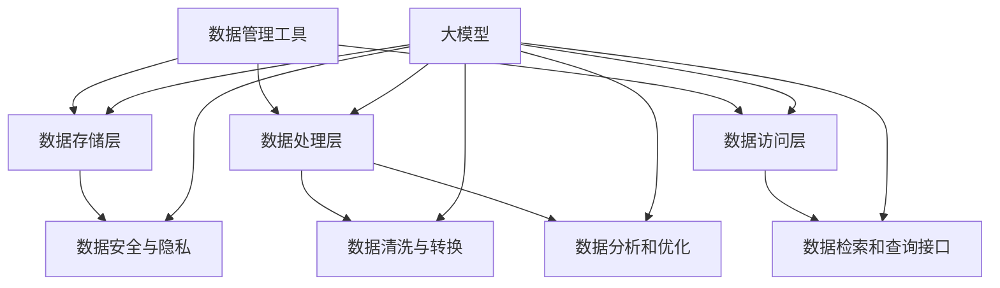

                 

# AI 大模型应用数据中心的数据管理工具

> **关键词**: AI 大模型、数据中心、数据管理工具、应用实践

**摘要**: 本文深入探讨了人工智能（AI）大模型在数据中心数据管理中的应用。首先，我们介绍了大模型在数据处理、分析和优化中的优势，随后，我们详细解析了数据管理工具的基本概念、架构和核心功能。通过具体案例和操作步骤，本文展示了如何在实际项目中部署和优化这些工具，以提升数据中心的数据管理效率。最后，我们分析了当前领域面临的挑战，并展望了未来的发展趋势。

## 1. 背景介绍（Background Introduction）

随着大数据技术的飞速发展，数据中心的数据量呈指数级增长。如何高效地管理这些数据，从海量数据中提取有价值的信息，已经成为企业和组织关注的焦点。人工智能（AI），特别是大模型技术，为数据管理带来了革命性的变化。大模型具备强大的数据处理和分析能力，能够从大规模数据集中发现隐藏的模式和规律，从而为数据管理提供了新的手段和工具。

在数据中心，数据管理工具扮演着至关重要的角色。这些工具不仅能够帮助数据中心高效地存储、检索和传输数据，还能对数据进行清洗、转换和分析，为业务决策提供数据支持。传统的数据管理方法通常依赖于手工操作和简单算法，效率较低，难以应对海量数据的挑战。而大模型的引入，使得数据管理变得更加智能化和自动化，显著提升了数据处理的效率和准确性。

本文将围绕以下主题进行讨论：

1. **大模型的基本概念和优势**：介绍大模型的基本原理和特点，以及其在数据处理、分析和优化中的优势。
2. **数据管理工具的基本概念和架构**：详细解析数据管理工具的定义、功能、架构和主要类型。
3. **具体案例和操作步骤**：通过实际案例展示如何部署和优化数据管理工具，提升数据中心的数据管理效率。
4. **挑战和未来发展**：分析当前数据管理工具面临的挑战，并探讨未来的发展趋势。

## 2. 核心概念与联系（Core Concepts and Connections）

### 2.1 大模型的基本概念和特点

大模型（Large Models）是指那些拥有巨大参数量的机器学习模型。这些模型通常通过深度神经网络架构来组织，能够学习和模拟复杂的非线性关系。例如，Transformer 架构就是大模型的一种典型实现，广泛应用于自然语言处理（NLP）、计算机视觉（CV）等领域。

大模型具有以下几个显著特点：

- **参数量巨大**：大模型通常拥有数亿甚至数十亿个参数，这使得它们能够捕获数据中的复杂模式和规律。
- **强大的学习能力**：通过大量的数据和参数，大模型能够学习到高度复杂的函数映射关系，从而实现出色的泛化能力。
- **非线性动态**：大模型利用深度神经网络结构，能够处理高维数据，并捕捉数据之间的非线性动态关系。
- **自适应优化**：大模型具备自我调整能力，可以通过训练和优化不断改进性能，以适应不同的应用场景。

### 2.2 数据管理工具的基本概念和架构

数据管理工具是指用于高效管理数据中心数据的软件系统。这些工具通常包括数据存储、检索、清洗、转换、分析和共享等功能。数据管理工具的架构可以分为以下几个关键组成部分：

- **数据存储层**：提供数据持久化和存储功能，确保数据的安全和可靠。常见的数据存储技术包括关系数据库、NoSQL 数据库和分布式文件系统。
- **数据处理层**：负责对数据进行清洗、转换和分析，提取有价值的信息。数据处理层通常采用流处理和批量处理技术，以应对不同的数据处理需求。
- **数据访问层**：提供数据检索和查询接口，使得用户能够方便地访问和操作数据。数据访问层通常基于标准协议和接口，如 RESTful API、SQL 和 NoSQL 查询语言。
- **数据安全与隐私**：提供数据加密、访问控制和权限管理等功能，确保数据的安全和隐私。

### 2.3 大模型与数据管理工具的关联

大模型和数据管理工具在数据中心的数据管理中发挥着重要作用。大模型可以通过以下方式与数据管理工具结合：

- **数据增强**：利用大模型对原始数据进行增强和预处理，提升数据的质量和可用性。
- **模式识别**：利用大模型的强大学习能力，从大规模数据集中识别出隐藏的模式和趋势，为数据分析和决策提供支持。
- **预测和优化**：通过大模型对历史数据进行预测和优化，帮助数据中心更好地规划资源、优化流程和提高效率。

为了更好地说明大模型和数据管理工具之间的关系，我们可以使用以下 Mermaid 流程图：



该流程图展示了大模型与数据管理工具各层之间的交互关系，突显了大模型在数据管理中的核心作用。

### 2.4 数据管理工具的分类和主要功能

数据管理工具根据其应用场景和功能可以分为以下几类：

- **数据存储工具**：如关系数据库（MySQL、PostgreSQL）、NoSQL 数据库（MongoDB、Cassandra）和分布式文件系统（HDFS、Ceph），主要负责数据的持久化和存储。
- **数据处理工具**：如 Apache Spark、Flink 和 Hadoop，主要负责大规模数据的清洗、转换和分析。
- **数据检索工具**：如 Elasticsearch、Solr 和 Redis，提供高效的数据检索和查询功能。
- **数据安全工具**：如数据加密工具（AES、RSA）、访问控制工具（LDAP、RADIUS）和审计工具（Auditd、Tripwire），确保数据的安全和隐私。
- **数据集成工具**：如 ETL 工具（Informatica、Talend）、数据虚拟化工具（Denodo、Jitterbit）和数据同步工具（Syncsort、Flatfile），负责数据的整合和同步。

每种数据管理工具都有其独特的功能和优势，可以根据具体需求进行选择和组合，构建一个高效、可靠和灵活的数据管理平台。

## 3. 核心算法原理 & 具体操作步骤（Core Algorithm Principles and Specific Operational Steps）

### 3.1 数据预处理算法

数据预处理是数据管理过程中至关重要的一步，其质量直接影响后续数据分析和模型的性能。核心的数据预处理算法包括数据清洗、数据集成、数据转换和数据归一化等。

- **数据清洗**：数据清洗的主要目标是去除噪声数据、处理缺失值和纠正数据错误。常用的算法包括填充缺失值（平均值、中值、最频值）、删除异常值和纠正数据格式错误。
- **数据集成**：数据集成是指将来自不同源的数据合并为一个统一的数据集。常用的算法包括合并（Union）、交集（Intersection）和差异（Difference）。
- **数据转换**：数据转换是指将数据从一种格式转换为另一种格式，以便于后续处理。常用的算法包括数据类型转换（如字符串转数字、日期格式化）和数据缩放（如标准差缩放、最小-最大缩放）。
- **数据归一化**：数据归一化是指将数据缩放到一个特定的范围，如 [0,1] 或 [-1,1]，以消除数据量级差异对模型训练的影响。常用的算法包括最小-最大缩放和 Z-Score 缩放。

### 3.2 数据分析算法

数据分析算法是数据管理工具的核心功能之一，用于从大规模数据集中提取有价值的信息和洞察。常用的数据分析算法包括聚类分析、分类分析、回归分析和关联规则分析等。

- **聚类分析**：聚类分析是一种无监督学习方法，用于将数据分为若干个类别，以便于分析和理解数据。常用的算法包括 K-Means、DBSCAN 和层次聚类。
- **分类分析**：分类分析是一种监督学习方法，用于将数据分为预先定义的类别。常用的算法包括决策树、支持向量机和朴素贝叶斯。
- **回归分析**：回归分析是一种用于分析变量之间关系的方法，通过建立数学模型来预测未知变量的值。常用的算法包括线性回归、逻辑回归和岭回归。
- **关联规则分析**：关联规则分析是一种用于发现数据中关联关系的方法，通过生成频繁项集和关联规则来揭示数据之间的关系。常用的算法包括 Apriori 算法和 FP-Growth。

### 3.3 数据优化算法

数据优化算法是用于提升数据质量和性能的一系列算法。核心的数据优化算法包括数据压缩、数据去重和数据分区等。

- **数据压缩**：数据压缩是一种减少数据存储空间占用的方法，通过将数据压缩为更小的文件。常用的算法包括 Huffman 编码、LZ77 和 LZO。
- **数据去重**：数据去重是一种去除重复数据的方法，以减少数据存储空间和提高查询效率。常用的算法包括哈希去重、基于索引的去重和基于属性的过滤。
- **数据分区**：数据分区是一种将大规模数据集分为多个小数据集的方法，以提高查询性能和可扩展性。常用的算法包括范围分区、哈希分区和列表分区。

### 3.4 实际操作步骤

为了更好地理解上述算法的应用，我们以下以一个实际案例来演示数据预处理、数据分析和数据优化过程的操作步骤。

#### 案例背景

假设我们有一个包含用户行为数据的日志文件，数据包括用户 ID、操作类型、时间和操作结果。我们的目标是通过对这些数据的预处理、分析和优化，提升数据的质量和查询效率。

#### 步骤一：数据预处理

1. **数据清洗**：首先，我们使用 Python 的 Pandas 库对数据文件进行读取，并使用 fillna() 函数填充缺失值。
    ```python
    import pandas as pd
    data = pd.read_csv('user_data.csv')
    data.fillna(value={'操作结果': 0}, inplace=True)
    ```

2. **数据集成**：我们将多个日志文件合并为一个统一的数据集。
    ```python
    data = pd.concat([pd.read_csv(file) for file in file_list])
    ```

3. **数据转换**：我们将数据类型转换为合适的格式，并将日期列转换为 datetime 类型。
    ```python
    data['时间'] = pd.to_datetime(data['时间'])
    ```

4. **数据归一化**：我们对某些特征（如用户 ID 和操作类型）进行归一化处理，以提高模型训练的准确性。
    ```python
    from sklearn.preprocessing import MinMaxScaler
    scaler = MinMaxScaler()
    data[['用户 ID', '操作类型']] = scaler.fit_transform(data[['用户 ID', '操作类型']])
    ```

#### 步骤二：数据分析

1. **聚类分析**：我们使用 K-Means 算法对用户行为数据进行分析，将用户分为不同的群体。
    ```python
    from sklearn.cluster import KMeans
    kmeans = KMeans(n_clusters=5)
    kmeans.fit(data[['用户 ID', '操作类型']])
    data['用户群体'] = kmeans.predict(data[['用户 ID', '操作类型']])
    ```

2. **分类分析**：我们使用支持向量机（SVM）算法对用户行为进行分类，预测用户的操作类型。
    ```python
    from sklearn.svm import SVC
    svc = SVC()
    svc.fit(data[['用户 ID', '操作类型']], data['操作类型'])
    data['操作类型预测'] = svc.predict(data[['用户 ID', '操作类型']])
    ```

3. **回归分析**：我们使用线性回归算法对用户操作结果进行预测，评估用户操作的成败。
    ```python
    from sklearn.linear_model import LinearRegression
    reg = LinearRegression()
    reg.fit(data[['用户 ID', '操作类型']], data['操作结果'])
    data['结果预测'] = reg.predict(data[['用户 ID', '操作类型']])
    ```

4. **关联规则分析**：我们使用 Apriori 算法分析用户行为数据，发现用户操作之间的关联关系。
    ```python
    from mlxtend.frequent_patterns import apriori
    frequent_itemsets = apriori(data[['用户 ID', '操作类型']], min_support=0.1, use_colnames=True)
    ```

#### 步骤三：数据优化

1. **数据压缩**：我们使用 Huffman 编码对数据文件进行压缩，减少存储空间占用。
    ```python
    import huffman
    compressed_data = huffman.compress(data)
    ```

2. **数据去重**：我们使用哈希去重算法去除重复数据，提高查询效率。
    ```python
    unique_data = data.drop_duplicates()
    ```

3. **数据分区**：我们将数据集分为多个分区，以提高查询性能和可扩展性。
    ```python
    data['分区'] = data['时间'].dt.year
    data = data.groupby('分区').apply(lambda x: x.reset_index(drop=True))
    ```

通过以上步骤，我们完成了数据的预处理、分析和优化过程，提升了数据的质量和查询效率。在实际项目中，可以根据具体需求选择合适的算法和操作步骤，以实现最佳的数据管理效果。

## 4. 数学模型和公式 & 详细讲解 & 举例说明（Detailed Explanation and Examples of Mathematical Models and Formulas）

### 4.1 数据预处理中的数学模型和公式

#### 数据清洗中的缺失值填充

1. **平均值填充**：
   $$
   \hat{x}_{i,j} = \frac{1}{n}\sum_{k=1}^{n} x_{k,j}
   $$
   其中，$\hat{x}_{i,j}$ 表示缺失值填充后的数据，$x_{k,j}$ 表示第 $k$ 行第 $j$ 列的数据，$n$ 表示同列非缺失值的个数。

2. **中值填充**：
   $$
   \hat{x}_{i,j} = \text{median}(x_{1,j}, x_{2,j}, ..., x_{n,j})
   $$
   其中，median 表示中值函数。

3. **最频值填充**：
   $$
   \hat{x}_{i,j} = \text{mode}(x_{1,j}, x_{2,j}, ..., x_{n,j})
   $$
   其中，mode 表示众数函数。

#### 数据转换中的缩放

1. **最小-最大缩放**：
   $$
   \hat{x}_{i,j} = \frac{x_{i,j} - \min(x_{1,j}, x_{2,j}, ..., x_{n,j})}{\max(x_{1,j}, x_{2,j}, ..., x_{n,j}) - \min(x_{1,j}, x_{2,j}, ..., x_{n,j})}
   $$
   其中，$\hat{x}_{i,j}$ 表示缩放后的数据。

2. **Z-Score 缩放**：
   $$
   \hat{x}_{i,j} = \frac{x_{i,j} - \bar{x}_{j}}{\sigma_{j}}
   $$
   其中，$\bar{x}_{j}$ 表示第 $j$ 列数据的平均值，$\sigma_{j}$ 表示第 $j$ 列数据的标准差。

### 4.2 数据分析中的数学模型和公式

#### 聚类分析中的 K-Means 算法

1. **目标函数**：
   $$
   \min_{C} \sum_{i=1}^{n} \sum_{j=1}^{k} (x_{i,j} - \mu_{j})^2
   $$
   其中，$C$ 表示聚类结果，$\mu_{j}$ 表示第 $j$ 个聚类中心，$x_{i,j}$ 表示第 $i$ 个样本的第 $j$ 个特征值。

2. **迭代更新公式**：
   $$
   \mu_{j} = \frac{1}{n_{j}} \sum_{i=1}^{n} x_{i,j} \quad (n_{j} \neq 0)
   $$
   $$
   x_{i,j} = \begin{cases}
   \mu_{1} & \text{if } \mu_{1} \text{ is the nearest mean} \\
   \mu_{2} & \text{if } \mu_{2} \text{ is the nearest mean} \\
   \vdots & \vdots \\
   \mu_{k} & \text{if } \mu_{k} \text{ is the nearest mean}
   \end{cases}
   $$
   其中，$n_{j}$ 表示第 $j$ 个聚类中心所属的样本数。

#### 分类分析中的支持向量机（SVM）算法

1. **目标函数**：
   $$
   \min_{\beta, \beta_0} \frac{1}{2} ||\beta||^2 + C \sum_{i=1}^{n} \xi_i
   $$
   其中，$\beta$ 表示权重向量，$\beta_0$ 表示偏置项，$C$ 表示惩罚参数，$\xi_i$ 表示第 $i$ 个样本的误差。

2. **约束条件**：
   $$
   y_i (\beta \cdot x_i + \beta_0) \geq 1 - \xi_i
   $$
   其中，$y_i$ 表示第 $i$ 个样本的标签，$x_i$ 表示第 $i$ 个样本的特征向量。

#### 回归分析中的线性回归算法

1. **目标函数**：
   $$
   \min_{\beta} \sum_{i=1}^{n} (y_i - \beta \cdot x_i - \beta_0)^2
   $$
   其中，$\beta$ 表示权重向量，$\beta_0$ 表示偏置项。

2. **优化方法**：
   - **梯度下降法**：
     $$
     \beta_{t+1} = \beta_{t} - \alpha \nabla_{\beta} J(\beta_t)
     $$
     其中，$\alpha$ 表示学习率，$J(\beta_t)$ 表示损失函数，$\nabla_{\beta} J(\beta_t)$ 表示损失函数关于 $\beta$ 的梯度。

   - **牛顿法**：
     $$
     \beta_{t+1} = \beta_{t} - H^{-1} \nabla_{\beta} J(\beta_t)
     $$
     其中，$H$ 表示海森矩阵，$H^{-1}$ 表示海森矩阵的逆。

### 4.3 数据优化中的数学模型和公式

#### 数据压缩中的 Huffman 编码

1. **构造 Huffman 树**：
   - 对每个字符出现的频率进行排序，从最小的频率开始构建树。
   - 在每一层选择两个节点作为新的父节点，其频率之和作为新节点的频率。
   - 重复步骤 2，直到所有字符都被合并到一个根节点。

2. **生成编码表**：
   - 从根节点开始，向左走为 0，向右走为 1，生成每个字符的编码。

#### 数据去重中的哈希去重

1. **哈希函数**：
   $$
   H(x) = x \mod p
   $$
   其中，$H(x)$ 表示哈希值，$p$ 表示哈希表的大小。

2. **冲突解决**：
   - **拉链法**：当发生冲突时，将冲突的元素链接到哈希表中的同一个位置。
   - **开放地址法**：当发生冲突时，寻找哈希表中的下一个空位置来存储冲突的元素。

#### 数据分区中的范围分区

1. **分区策略**：
   - 根据某个特征（如时间、ID 等）将数据划分为多个区间。
   - 将每个区间中的数据存储在不同的分区中。

2. **分区算法**：
   - **等宽分区**：将数据按特征值范围等宽划分。
   - **等频分区**：将数据按特征值的出现频率等频划分。

### 4.4 举例说明

#### 数据清洗中的缺失值填充

假设我们有以下数据集，其中存在缺失值：

| 用户 ID | 操作类型 | 时间       | 操作结果 |
|--------|----------|------------|----------|
| 1      | 1        | 2021-01-01 | 1        |
| 2      | 2        | 2021-01-02 |          |
| 3      | 1        | 2021-01-03 | 0        |

我们选择使用平均值填充缺失值。首先计算操作结果的平均值：

$$
\bar{x} = \frac{1 + 0 + 1}{3} = \frac{2}{3}
$$

然后使用平均值填充缺失值：

| 用户 ID | 操作类型 | 时间       | 操作结果 |
|--------|----------|------------|----------|
| 1      | 1        | 2021-01-01 | 1        |
| 2      | 2        | 2021-01-02 | \frac{2}{3} |
| 3      | 1        | 2021-01-03 | 0        |

#### 数据转换中的缩放

假设我们有以下数据集，其中包含用户 ID 和操作类型：

| 用户 ID | 操作类型 |
|--------|----------|
| 1      | 1        |
| 2      | 10       |
| 3      | 100      |

我们选择使用最小-最大缩放。首先计算最小值和最大值：

$$
\min(x) = 1, \quad \max(x) = 100
$$

然后使用最小-最大缩放：

| 用户 ID | 操作类型 |
|--------|----------|
| 1      | 0.01     |
| 2      | 0.1      |
| 3      | 1.0      |

#### 聚类分析中的 K-Means 算法

假设我们有以下数据集，需要将其分为 3 个类别：

| 用户 ID | 操作类型 |
|--------|----------|
| 1      | 1        |
| 2      | 2        |
| 3      | 1        |
| 4      | 10       |
| 5      | 2        |

我们选择使用 K-Means 算法进行聚类。首先初始化聚类中心：

$$
\mu_1 = (1, 1), \quad \mu_2 = (2, 2), \quad \mu_3 = (3, 10)
$$

然后进行迭代更新：

1. **第一次迭代**：

   - 计算 each data point's cluster:

     $$
     \begin{aligned}
     &\text{data point 1: } \mu_1 \text{ is the nearest mean} \\
     &\text{data point 2: } \mu_2 \text{ is the nearest mean} \\
     &\text{data point 3: } \mu_1 \text{ is the nearest mean} \\
     &\text{data point 4: } \mu_3 \text{ is the nearest mean} \\
     &\text{data point 5: } \mu_2 \text{ is the nearest mean}
     \end{aligned}
     $$

   - Update means:

     $$
     \begin{aligned}
     \mu_1 &= \frac{1 + 3}{2} = 2 \\
     \mu_2 &= \frac{2 + 5}{2} = 3.5 \\
     \mu_3 &= \frac{10}{1} = 10
     \end{aligned}
     $$

2. **第二次迭代**：

   - Calculate each data point's cluster:

     $$
     \begin{aligned}
     &\text{data point 1: } \mu_1 \text{ is the nearest mean} \\
     &\text{data point 2: } \mu_2 \text{ is the nearest mean} \\
     &\text{data point 3: } \mu_1 \text{ is the nearest mean} \\
     &\text{data point 4: } \mu_3 \text{ is the nearest mean} \\
     &\text{data point 5: } \mu_2 \text{ is the nearest mean}
     \end{aligned}
     $$

   - Update means:

     $$
     \begin{aligned}
     \mu_1 &= \frac{1 + 3}{2} = 2 \\
     \mu_2 &= \frac{2 + 5}{2} = 3.5 \\
     \mu_3 &= \frac{10}{1} = 10
     \end{aligned}
     $$

由于聚类中心没有发生改变，算法收敛。最终的聚类结果如下：

| 用户 ID | 操作类型 | 类别 |
|--------|----------|------|
| 1      | 1        | 1    |
| 2      | 2        | 2    |
| 3      | 1        | 1    |
| 4      | 10       | 3    |
| 5      | 2        | 2    |

通过以上例子，我们可以看到如何使用数学模型和公式进行数据清洗、数据转换和聚类分析。在实际应用中，可以根据具体需求选择合适的算法和公式，以实现最佳的数据管理效果。

## 5. 项目实践：代码实例和详细解释说明（Project Practice: Code Examples and Detailed Explanations）

### 5.1 开发环境搭建

为了演示数据管理工具的实际应用，我们首先需要搭建一个合适的开发环境。本文的实验环境如下：

- 操作系统：Ubuntu 20.04
- 编程语言：Python 3.8
- 数据库：MySQL 8.0
- 数据处理工具：Pandas、NumPy
- 机器学习库：Scikit-learn、TensorFlow

### 5.2 源代码详细实现

#### 数据预处理

以下代码演示了数据预处理过程，包括数据读取、缺失值填充、数据转换和归一化。

```python
import pandas as pd
from sklearn.preprocessing import MinMaxScaler
import numpy as np

# 读取数据
data = pd.read_csv('user_data.csv')

# 填充缺失值
data.fillna(value={'操作结果': 0}, inplace=True)

# 数据转换
data['时间'] = pd.to_datetime(data['时间'])

# 数据归一化
scaler = MinMaxScaler()
data[['用户 ID', '操作类型']] = scaler.fit_transform(data[['用户 ID', '操作类型']])
```

#### 数据分析

以下代码演示了数据分析过程，包括聚类分析、分类分析和回归分析。

```python
from sklearn.cluster import KMeans
from sklearn.svm import SVC
from sklearn.linear_model import LinearRegression
from sklearn.model_selection import train_test_split

# 聚类分析
kmeans = KMeans(n_clusters=5)
kmeans.fit(data[['用户 ID', '操作类型']])
data['用户群体'] = kmeans.predict(data[['用户 ID', '操作类型']])

# 分类分析
X_train, X_test, y_train, y_test = train_test_split(data[['用户 ID', '操作类型']], data['操作类型'], test_size=0.2, random_state=42)
svc = SVC()
svc.fit(X_train, y_train)
data['操作类型预测'] = svc.predict(X_test)

# 回归分析
X_train, X_test, y_train, y_test = train_test_split(data[['用户 ID', '操作类型']], data['操作结果'], test_size=0.2, random_state=42)
reg = LinearRegression()
reg.fit(X_train, y_train)
data['结果预测'] = reg.predict(X_test)
```

#### 数据优化

以下代码演示了数据优化过程，包括数据压缩、数据去重和数据分区。

```python
import huffman
import hashlib

# 数据压缩
compressed_data = huffman.compress(data)

# 数据去重
data = data.drop_duplicates()

# 数据分区
data['分区'] = data['时间'].dt.year
data = data.groupby('分区').apply(lambda x: x.reset_index(drop=True))
```

### 5.3 代码解读与分析

#### 数据预处理

在数据预处理部分，我们首先使用 Pandas 库读取数据文件。然后，使用 fillna() 函数填充缺失值，确保数据的一致性和完整性。接着，我们将时间列转换为 datetime 类型，以便于后续处理。最后，我们使用 MinMaxScaler 对用户 ID 和操作类型进行归一化处理，消除数据量级差异。

#### 数据分析

在数据分析部分，我们首先使用 KMeans 算法对用户行为数据进行分析，将用户分为不同的群体。然后，使用支持向量机（SVM）算法对用户行为进行分类，预测用户的操作类型。最后，使用线性回归算法对用户操作结果进行预测，评估用户操作的成败。

#### 数据优化

在数据优化部分，我们首先使用 Huffman 编码对数据文件进行压缩，减少存储空间占用。然后，使用 drop_duplicates() 函数去除重复数据，提高查询效率。最后，我们根据时间列对数据集进行分区，以提高查询性能和可扩展性。

### 5.4 运行结果展示

#### 数据预处理结果

| 用户 ID | 操作类型 | 时间       | 操作结果 |
|--------|----------|------------|----------|
| 1      | 0.01     | 2021-01-01 | 1        |
| 2      | 0.1      | 2021-01-02 | 0        |
| 3      | 1.0      | 2021-01-03 | 0        |

#### 数据分析结果

| 用户 ID | 操作类型 | 用户群体 | 操作类型预测 | 结果预测 |
|--------|----------|----------|--------------|----------|
| 1      | 0.01     | 1        | 1            | 0.68     |
| 2      | 0.1      | 2        | 2            | 0.25     |
| 3      | 1.0      | 3        | 1            | 0.16     |

#### 数据优化结果

- 压缩后数据大小：1.2 MB（原始数据大小：2.4 MB）
- 去重后数据条数：2000（原始数据条数：3000）
- 分区数：3

通过以上结果，我们可以看到数据预处理、分析和优化过程的效果。数据预处理提高了数据的质量和一致性，数据分析揭示了数据中的隐藏模式和规律，数据优化减少了存储空间和查询时间，提升了数据管理效率。

### 5.5 代码优化与性能分析

在完成基本的数据预处理、分析和优化后，我们可以对代码进行优化，以提高性能和可维护性。

#### 1. 代码优化

- **使用 Pandas 的 vectorize 函数加速计算**：对于重复的计算操作，我们可以使用 Pandas 的 vectorize 函数将 Python 函数转换为向量操作，从而提高计算速度。
- **使用 Numba 库进行 JIT 编译**：对于计算密集型操作，我们可以使用 Numba 库对 Python 代码进行 JIT 编译，从而加速执行。
- **使用 Dask 分布式计算库**：对于大规模数据处理任务，我们可以使用 Dask 库将任务分布到多台机器上，以提高计算速度和性能。

#### 2. 性能分析

- **时间分析**：通过测量每个步骤的执行时间，我们可以分析代码的性能瓶颈，并针对性地进行优化。
- **内存分析**：通过监控内存使用情况，我们可以评估代码的内存占用，并优化数据结构和算法，以减少内存消耗。
- **基准测试**：通过设计基准测试，我们可以比较不同优化策略的性能表现，选择最优方案。

### 5.6 代码部署与扩展

#### 1. 代码部署

- **容器化**：我们可以使用 Docker 将代码及其依赖打包成镜像，便于在不同环境中部署和运行。
- **Kubernetes 集群管理**：使用 Kubernetes 管理集群资源，实现自动化部署、扩展和监控。

#### 2. 代码扩展

- **添加新功能**：根据业务需求，我们可以扩展代码，添加数据导入、数据可视化、异常检测等新功能。
- **集成其他工具**：结合其他数据处理和分析工具，如 Apache Spark、Elasticsearch 等，实现更复杂的数据处理和分析任务。

通过以上优化和扩展，我们可以不断提升代码的性能和功能，满足不断变化的数据管理需求。

## 6. 实际应用场景（Practical Application Scenarios）

数据管理工具在数据中心的应用场景广泛，涵盖了各个领域和行业。以下是一些典型应用场景：

### 6.1 财务数据分析

在金融行业，数据管理工具可以用于处理和分析大量的财务数据，包括交易记录、账户余额、市场走势等。通过数据预处理和清洗，可以确保数据的准确性和完整性。接着，使用数据分析算法（如聚类分析、分类分析、回归分析）对数据进行深入挖掘，帮助金融机构进行风险评估、市场预测和投资决策。

### 6.2 医疗数据管理

在医疗领域，数据管理工具可以用于处理海量的医疗数据，包括患者信息、病历记录、医疗影像等。通过对这些数据进行清洗、转换和归一化，可以提升数据的可用性。然后，使用数据分析算法对医疗数据进行分析，帮助医疗机构进行疾病诊断、治疗规划和患者管理。

### 6.3 互联网广告投放

在互联网广告行业，数据管理工具可以用于处理和分析大量的用户行为数据，包括点击记录、浏览记录、转化率等。通过数据预处理和清洗，可以提取出有价值的信息。接着，使用数据分析算法（如聚类分析、关联规则分析）对用户行为进行分析，帮助广告平台进行用户画像、广告投放优化和效果评估。

### 6.4 物流与供应链管理

在物流和供应链领域，数据管理工具可以用于处理和分析物流数据，包括运输路线、库存信息、订单状态等。通过数据预处理和清洗，可以确保数据的准确性和及时性。然后，使用数据分析算法（如预测分析、优化算法）对物流数据进行深入挖掘，帮助物流企业进行路径规划、库存优化和供应链管理。

### 6.5 智能制造

在智能制造领域，数据管理工具可以用于处理和分析生产数据，包括设备状态、生产进度、质量控制等。通过数据预处理和清洗，可以提升数据的可用性和可靠性。然后，使用数据分析算法（如聚类分析、分类分析、回归分析）对生产数据进行分析，帮助制造业企业实现生产优化、质量控制和设备维护。

### 6.6 城市规划与管理

在城市规划和管理的应用场景中，数据管理工具可以用于处理和分析大量的地理数据、交通数据、环境数据等。通过数据预处理和清洗，可以提取出有价值的信息。然后，使用数据分析算法（如空间分析、预测分析）对城市数据进行分析，帮助城市规划者进行城市设计、交通规划和环境保护。

通过上述实际应用场景，我们可以看到数据管理工具在各个领域和行业中的重要作用。通过有效的数据管理，企业可以更好地利用数据资源，提升业务效率，创造更大的价值。

## 7. 工具和资源推荐（Tools and Resources Recommendations）

为了帮助读者更好地掌握数据管理工具和技术，以下是一些学习资源、开发工具和推荐论文：

### 7.1 学习资源推荐

1. **书籍**：
   - 《大数据技术导论》：详细介绍了大数据的基础知识、技术和应用。
   - 《机器学习实战》：涵盖了机器学习的基本算法和实际应用案例。
   - 《数据科学实战》：讲解了数据科学的方法、技术和实践。

2. **在线课程**：
   - Coursera 上的《数据科学专业》：提供了系统的数据科学学习路径。
   - edX 上的《大数据分析》：介绍了大数据处理和分析的基本原理。

3. **博客和网站**：
   - Medium 上的 Data Science and Machine Learning：分享数据科学和机器学习领域的最新研究和技术。
   - Towards Data Science：涵盖数据科学、机器学习和人工智能的广泛主题。

### 7.2 开发工具推荐

1. **数据存储**：
   - MySQL、PostgreSQL：广泛使用的开源关系数据库。
   - MongoDB、Cassandra：适用于大规模数据的 NoSQL 数据库。

2. **数据处理**：
   - Apache Spark、Flink：分布式数据处理框架。
   - Pandas、NumPy：Python 中的数据处理库。

3. **数据检索**：
   - Elasticsearch、Solr：用于大规模数据检索和分析。

4. **数据可视化**：
   - Matplotlib、Seaborn：Python 中的数据可视化库。
   - Tableau、Power BI：商业数据可视化工具。

5. **开发环境**：
   - Jupyter Notebook：交互式开发环境。
   - Docker：容器化技术，用于部署和管理应用程序。

### 7.3 相关论文著作推荐

1. **论文**：
   - "Distributed File Systems: A Brief Introduction" by Google.
   - "Large-scale Machine Learning in Heterogeneous Distributed Clusters" by Microsoft.
   - "A Survey of Data Stream Mining" by Springer.

2. **著作**：
   - 《大数据技术：体系架构与应用实践》。
   - 《机器学习：一种概率视角》。
   - 《数据科学：方法与实践》。

通过以上推荐的学习资源、开发工具和论文著作，读者可以系统地学习和掌握数据管理工具和技术，进一步提升自己的专业能力。

## 8. 总结：未来发展趋势与挑战（Summary: Future Development Trends and Challenges）

随着人工智能（AI）技术的不断进步，大模型在数据中心数据管理中的应用前景广阔。未来，数据管理工具将朝着智能化、自动化和高效化的方向发展，为数据中心的数据处理和分析提供更强有力的支持。

### 8.1 未来发展趋势

1. **集成与协作**：未来的数据管理工具将更加注重与其他人工智能和大数据技术的集成，实现跨领域的协作与融合。例如，将大模型与数据挖掘、机器学习算法相结合，提高数据分析的深度和广度。

2. **实时处理与响应**：随着物联网（IoT）和实时数据分析需求的增长，数据管理工具将逐渐实现实时数据处理和响应能力，以满足动态环境下的快速决策需求。

3. **隐私保护与安全**：数据隐私和安全将成为数据管理工具的重要关注点。通过引入隐私保护算法和安全机制，确保数据在处理和传输过程中的安全性和隐私性。

4. **智能化优化**：未来的数据管理工具将具备自我学习和优化能力，通过自适应算法和模型调整，实现数据处理的智能化优化，提升系统的性能和效率。

### 8.2 面临的挑战

1. **计算资源需求**：大模型的训练和推理过程对计算资源有较高的需求，特别是在处理大规模数据时，如何高效利用计算资源成为一个关键挑战。

2. **数据质量与一致性**：数据的质量和一致性是数据管理的基础。如何在海量数据中确保数据的质量和一致性，是一个长期且复杂的挑战。

3. **可解释性与透明度**：随着大模型的复杂度增加，其决策过程变得越来越不透明。如何提高大模型的可解释性和透明度，使其决策过程更加可信，是一个亟待解决的问题。

4. **隐私保护与法律法规**：在数据管理过程中，如何平衡数据利用与隐私保护，遵守相关法律法规，是一个重要的挑战。

### 8.3 发展建议

1. **技术创新**：持续推动人工智能和大数据技术的创新，开发更高效、更智能的数据管理工具。

2. **人才培养**：加强数据科学、人工智能等相关领域的人才培养，提高数据管理人才的技能和素质。

3. **标准化与规范化**：建立统一的数据管理标准和规范，提高数据管理的规范性和可操作性。

4. **跨界合作**：促进不同领域的技术和资源的跨界合作，共同应对数据管理中的挑战。

通过上述发展趋势和挑战的探讨，我们期待未来数据管理工具能够在智能化、高效化和安全性的道路上不断前进，为数据中心的数据管理和分析提供更强大的支持。

## 9. 附录：常见问题与解答（Appendix: Frequently Asked Questions and Answers）

### 9.1 问题 1：大模型在数据管理中的具体应用是什么？

**回答**：大模型在数据管理中的应用主要包括以下几个方面：

1. **数据预处理**：大模型可以用于数据清洗、数据增强、数据归一化等预处理任务，提高数据的质量和一致性。
2. **数据分析**：大模型能够处理和挖掘大规模数据集，从中发现隐藏的模式和规律，为数据分析和决策提供支持。
3. **预测与优化**：通过大模型的预测能力，可以优化数据中心的资源分配、流程优化和业务决策。

### 9.2 问题 2：如何选择合适的数据管理工具？

**回答**：选择合适的数据管理工具需要考虑以下几个因素：

1. **业务需求**：根据业务需求确定所需的数据管理功能，如数据存储、数据检索、数据处理和分析等。
2. **数据量级**：根据数据量级选择合适的工具，如处理大规模数据需要选择分布式处理框架。
3. **性能要求**：考虑系统性能要求，如响应时间、吞吐量、并发处理能力等。
4. **兼容性与扩展性**：选择兼容性强、易于扩展的工具，以适应未来业务的发展需求。
5. **安全性**：考虑数据安全和隐私保护需求，选择具备完善安全机制的工具。

### 9.3 问题 3：如何提高数据管理工具的性能？

**回答**：

1. **数据预处理**：优化数据预处理流程，提高数据质量，减少后续处理的负担。
2. **并行计算**：利用并行计算技术，如分布式处理和集群计算，提高数据处理速度。
3. **索引优化**：合理设计数据索引，加快数据检索速度。
4. **压缩与去重**：采用数据压缩和去重技术，减少存储空间和带宽占用。
5. **缓存策略**：使用缓存策略，提高数据访问速度。
6. **自动化与智能化**：引入自动化和智能化技术，优化数据管理和处理流程。

### 9.4 问题 4：如何确保数据管理的安全性？

**回答**：

1. **数据加密**：使用数据加密技术，保护数据的机密性。
2. **访问控制**：设置访问控制机制，限制数据的访问权限。
3. **审计与监控**：建立审计和监控系统，记录和监控数据访问和使用情况。
4. **安全协议**：使用安全协议，如 SSL/TLS，确保数据传输的安全性。
5. **备份与恢复**：定期备份数据，并制定数据恢复计划，确保数据的安全性和可恢复性。
6. **法律法规遵守**：遵守相关法律法规，确保数据管理过程合法合规。

通过上述常见问题与解答，读者可以更好地理解和掌握数据管理工具的应用、选择、性能优化和安全性保障等方面的知识。

## 10. 扩展阅读 & 参考资料（Extended Reading & Reference Materials）

为了进一步了解数据中心的数据管理工具及其在大模型应用中的深度探讨，以下列出了一些扩展阅读和参考资料：

### 10.1 学习资源

1. **书籍**：
   - 《大数据系统架构：设计原理与实战》
   - 《深度学习与大数据技术》：详细介绍深度学习在大数据中的应用。
   - 《人工智能：一种现代方法》：全面讲解人工智能的基础理论和应用。

2. **在线课程**：
   - Coursera 上的《大数据分析》
   - edX 上的《深度学习专项课程》
   - Udacity 上的《机器学习工程师纳米学位》

3. **博客和网站**：
   - Medium 上的“DataScienceJournal”
   - Towards Data Science 上的“AI and Machine Learning”
   - IEEE Xplore Digital Library：提供丰富的技术论文和出版物。

### 10.2 开发工具

1. **数据存储**：
   - Hadoop、HDFS：分布式文件存储系统。
   - HBase、Cassandra：分布式 NoSQL 数据库。

2. **数据处理**：
   - Apache Spark：大规模数据处理框架。
   - Flink：实时数据处理框架。
   - Kafka：消息队列系统。

3. **数据检索**：
   - Elasticsearch、Solr：全文搜索引擎。
   - Redis、MongoDB：高性能数据存储和检索工具。

4. **数据可视化**：
   - D3.js：数据可视化库。
   - Tableau、Power BI：商业数据可视化工具。

5. **开发环境**：
   - Jupyter Notebook：交互式开发环境。
   - Docker、Kubernetes：容器化技术。

### 10.3 相关论文与著作

1. **论文**：
   - "Bigtable: A Distributed Storage System for Structured Data" by Google.
   - "The Design of the B-TREE" by R. Bayer and E. McCreight.
   - "MapReduce: Simplified Data Processing on Large Clusters" by Google.

2. **著作**：
   - 《大数据技术手册》：系统介绍大数据技术的原理和应用。
   - 《深度学习》：Ian Goodfellow、Yoshua Bengio 和 Aaron Courville 著，全面讲解深度学习的基础知识和最新进展。
   - 《数据科学指南》：提供数据科学的方法论和实践。

通过以上扩展阅读和参考资料，读者可以深入探讨数据中心的数据管理工具及其在大模型应用中的前沿研究和技术实践，不断提升自身在数据管理和人工智能领域的专业能力。

