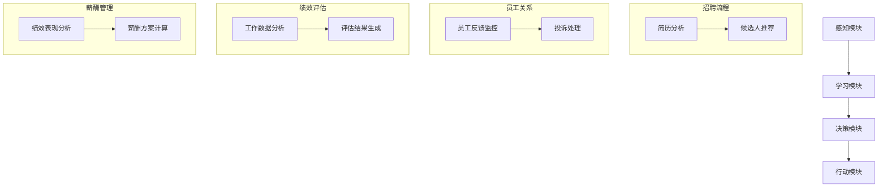
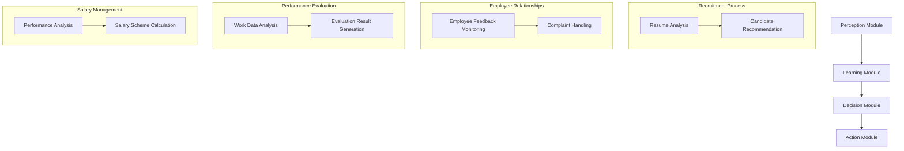

                 

### 文章标题

"AI人工智能代理工作流AI Agent WorkFlow：智能代理在人力资源管理系统中的应用"

This article will explore the concept of AI-based agent workflows, specifically focusing on the application of intelligent agents in Human Resource Management Systems (HRMS). By breaking down the core components and operational steps of AI agents, we aim to provide a comprehensive understanding of how these intelligent systems can enhance HRMS efficiency and effectiveness. Through detailed analysis, mathematical models, and practical examples, we will demonstrate the potential of AI agents in transforming HR management processes. Finally, we will discuss the future trends and challenges in this domain, offering valuable insights and recommendations for further exploration.

### Keywords

- AI Agent WorkFlow
- Intelligent Agents
- Human Resource Management Systems (HRMS)
- Automation
- Efficiency
- Workforce Management

### Abstract

This article delves into the world of AI-based agent workflows and their application in Human Resource Management Systems (HRMS). By breaking down the core components and operational steps of AI agents, we aim to provide a comprehensive understanding of their potential to enhance HRMS efficiency and effectiveness. Through detailed analysis, mathematical models, and practical examples, we will explore various aspects of intelligent agents in HR management processes. The article concludes with a discussion on future trends and challenges, offering valuable insights and recommendations for further research and development in this domain.

<|clear|>## 1. 背景介绍（Background Introduction）

### 1.1 智能代理的概念

智能代理（Intelligent Agent）是一种能够自主执行任务、与环境交互并具有智能决策能力的计算机程序。它们通常基于人工智能技术，具备感知、理解、学习、推理和行动等能力。智能代理可以在各种应用场景中发挥作用，如智能家居、智能客服、自动驾驶、金融分析等。

### 1.2 人力资源管理系统（HRMS）

人力资源管理系统（HRMS）是一种集成化的人力资源管理解决方案，旨在帮助企业有效地管理员工信息、工作流程和业务流程。HRMS通常包括招聘、培训、薪酬管理、绩效评估、员工关系等多个模块，以支持企业的全面人力资源管理。

### 1.3 智能代理在HRMS中的应用

随着人工智能技术的发展，智能代理在HRMS中的应用逐渐受到关注。智能代理可以通过以下方式提升HRMS的效率和效果：

- **招聘流程优化**：智能代理可以自动筛选和推荐合适的候选人，减少招聘时间，提高招聘质量。
- **员工关系管理**：智能代理可以协助处理员工投诉、反馈和沟通，提升员工满意度，增强企业凝聚力。
- **绩效评估**：智能代理可以分析员工的工作数据，提供客观、准确的绩效评估结果，帮助企业制定合理的激励机制。
- **薪酬管理**：智能代理可以根据员工的工作表现、市场薪酬水平等因素，自动计算出合理的薪酬方案，确保薪酬公平性。

### 1.4 智能代理在HRMS中的挑战

尽管智能代理在HRMS中具有巨大的潜力，但在实际应用中仍面临一些挑战，如数据隐私、算法透明度和可信度等。因此，在推广智能代理技术的同时，也需要关注并解决这些挑战。

## 1. Background Introduction

### 1.1 Concept of Intelligent Agents

Intelligent agents are computer programs capable of autonomous task execution, interaction with the environment, and intelligent decision-making. They are typically based on artificial intelligence technologies and possess abilities such as perception, understanding, learning, reasoning, and action. Intelligent agents can play a significant role in various application scenarios, such as smart homes, intelligent customer service, autonomous driving, and financial analysis.

### 1.2 Human Resource Management Systems (HRMS)

Human Resource Management Systems (HRMS) are integrated solutions designed to help enterprises effectively manage employee information, workflows, and business processes. HRMS usually includes modules such as recruitment, training, salary management, performance evaluation, and employee relations, supporting comprehensive human resource management for enterprises.

### 1.3 Applications of Intelligent Agents in HRMS

With the development of artificial intelligence technology, the application of intelligent agents in HRMS has attracted increasing attention. Intelligent agents can enhance the efficiency and effectiveness of HRMS in the following ways:

- **Optimization of Recruitment Process**: Intelligent agents can automatically screen and recommend suitable candidates, reducing recruitment time and improving recruitment quality.
- **Employee Relationship Management**: Intelligent agents can assist in handling employee complaints, feedback, and communication, enhancing employee satisfaction and strengthening corporate cohesion.
- **Performance Evaluation**: Intelligent agents can analyze employee work data, providing objective and accurate performance evaluation results to help enterprises develop reasonable incentive mechanisms.
- **Salary Management**: Intelligent agents can calculate reasonable salary schemes based on employee performance, market salary levels, and other factors, ensuring salary fairness.

### 1.4 Challenges of Intelligent Agents in HRMS

Although intelligent agents have great potential in HRMS, they still face some challenges in practical applications, such as data privacy, algorithm transparency, and credibility. Therefore, while promoting intelligent agent technology, it is also necessary to address these challenges.

<|clear|>## 2. 核心概念与联系（Core Concepts and Connections）

### 2.1 智能代理的工作原理

智能代理的工作原理主要基于以下三个方面：感知、学习和行动。

- **感知**：智能代理通过感知模块获取环境信息，如文本、图像、声音等。这些信息用于指导智能代理的后续决策和行为。
- **学习**：智能代理通过学习模块从环境中获取经验，不断优化自身的决策能力和行为策略。学习过程可以基于监督学习、无监督学习或强化学习等不同算法。
- **行动**：智能代理根据感知和学习结果，采取相应的行动以实现目标。行动可以是自动执行某个任务、与外部系统进行交互或生成某个输出。

### 2.2 智能代理在HRMS中的应用

智能代理在HRMS中的应用可以分为以下几个方面：

- **招聘流程**：智能代理可以自动分析求职者简历，筛选出符合职位要求的候选人，并推荐给招聘人员。
- **员工关系**：智能代理可以实时监控员工反馈，自动分类和处理员工投诉，协助HR部门解决员工问题。
- **绩效评估**：智能代理可以分析员工的工作数据，根据预设的绩效评估指标，自动生成评估结果，帮助HR部门进行绩效管理。
- **薪酬管理**：智能代理可以基于员工的绩效表现、市场薪酬水平等因素，自动计算和调整薪酬方案，确保薪酬公平性。

### 2.3 智能代理与传统HRMS的区别

智能代理与传统HRMS相比，具有以下优势：

- **自动化**：智能代理可以实现HRMS中的部分或全部流程自动化，减少人工干预，提高工作效率。
- **个性化**：智能代理可以根据员工的个人需求和偏好，提供个性化的服务和解决方案，提升员工满意度。
- **智能决策**：智能代理基于大数据和机器学习算法，可以生成更加准确和智能的决策结果，提高HRMS的决策质量。

### 2.4 智能代理的架构

智能代理的架构通常包括以下几个关键组件：

- **感知模块**：负责获取和解析外部环境信息。
- **学习模块**：负责从环境数据中学习，优化自身性能。
- **决策模块**：负责根据感知和学习结果，生成决策方案。
- **行动模块**：负责执行决策方案，实现目标。

### 2.5 智能代理的发展趋势

随着人工智能技术的不断进步，智能代理在HRMS中的应用将呈现出以下发展趋势：

- **更广泛的场景应用**：智能代理将逐渐应用于HRMS的各个模块，实现全方位的人力资源管理。
- **更高的智能化水平**：智能代理将基于更先进的机器学习算法和大数据技术，提高自身的决策能力和服务质量。
- **更紧密的人机协作**：智能代理将与人力资源管理人员密切协作，共同提升HRMS的效率和效果。

### 2.6 核心概念原理和架构的 Mermaid 流程图

以下是智能代理在HRMS中的核心概念原理和架构的 Mermaid 流程图：

## 2. Core Concepts and Connections

### 2.1 Working Principles of Intelligent Agents

The working principles of intelligent agents are mainly based on three aspects: perception, learning, and action.

- **Perception**: Intelligent agents obtain environmental information through perception modules, such as text, images, and sounds. This information is used to guide the subsequent decisions and behaviors of intelligent agents.
- **Learning**: Intelligent agents learn from the environment through learning modules, continuously optimizing their decision-making capabilities and behavioral strategies. The learning process can be based on supervised learning, unsupervised learning, or reinforcement learning algorithms.
- **Action**: Intelligent agents take corresponding actions based on the results of perception and learning to achieve their objectives. The actions can involve automatically executing a task, interacting with an external system, or generating a specific output.

### 2.2 Applications of Intelligent Agents in HRMS

The applications of intelligent agents in HRMS can be divided into the following aspects:

- **Recruitment Process**: Intelligent agents can automatically analyze job seekers' resumes, screen out candidates that meet the job requirements, and recommend them to recruiters.
- **Employee Relationships**: Intelligent agents can monitor employee feedback in real-time, automatically categorize and process employee complaints, and assist HR departments in resolving employee issues.
- **Performance Evaluation**: Intelligent agents can analyze employee work data, generate evaluation results based on pre-set performance evaluation indicators, and help HR departments with performance management.
- **Salary Management**: Intelligent agents can calculate and adjust salary schemes based on factors such as employee performance and market salary levels, ensuring salary fairness.

### 2.3 Differences between Intelligent Agents and Traditional HRMS

Compared to traditional HRMS, intelligent agents have the following advantages:

- **Automation**: Intelligent agents can automate part or all of the HRMS processes, reducing manual intervention and improving work efficiency.
- **Personalization**: Intelligent agents can provide personalized services and solutions based on individual employee needs and preferences, enhancing employee satisfaction.
- **Smart Decision-Making**: Based on big data and machine learning algorithms, intelligent agents can generate more accurate and intelligent decision-making results, improving the quality of HRMS decisions.

### 2.4 Architecture of Intelligent Agents

The architecture of intelligent agents typically includes the following key components:

- **Perception Module**: Responsible for acquiring and parsing external environmental information.
- **Learning Module**: Responsible for learning from environmental data to optimize performance.
- **Decision Module**: Responsible for generating decision-making plans based on perception and learning results.
- **Action Module**: Responsible for executing decision-making plans to achieve objectives.

### 2.5 Development Trends of Intelligent Agents

With the continuous progress of artificial intelligence technology, the applications of intelligent agents in HRMS will show the following development trends:

- **Wider Application Scenarios**: Intelligent agents will gradually be applied to various modules of HRMS, realizing comprehensive human resource management.
- **Higher Intelligent Level**: Intelligent agents will achieve higher intelligence levels based on more advanced machine learning algorithms and big data technologies, improving their decision-making capabilities and service quality.
- **Closer Human-Machine Collaboration**: Intelligent agents will collaborate closely with human resource managers to improve the efficiency and effectiveness of HRMS.

### 2.6 Mermaid Flowchart of Core Concept Principles and Architecture

The following is a Mermaid flowchart illustrating the core concept principles and architecture of intelligent agents in HRMS:

<|clear|>## 3. 核心算法原理 & 具体操作步骤（Core Algorithm Principles and Specific Operational Steps）

### 3.1 智能代理的核心算法原理

智能代理的核心算法主要基于机器学习技术，包括监督学习、无监督学习和强化学习等。以下分别介绍这些算法的基本原理：

- **监督学习（Supervised Learning）**：监督学习是一种利用已标记的数据集来训练模型的方法。在招聘流程中，智能代理可以通过学习职位描述和简历数据，自动筛选和推荐合适的候选人。具体算法包括决策树、支持向量机（SVM）和神经网络等。
- **无监督学习（Unsupervised Learning）**：无监督学习是一种从未标记的数据集中发现模式的方法。在员工关系管理中，智能代理可以通过学习员工反馈数据，自动分类和处理员工投诉。具体算法包括聚类算法、降维算法和关联规则算法等。
- **强化学习（Reinforcement Learning）**：强化学习是一种通过与环境的交互来学习策略的方法。在绩效评估中，智能代理可以通过与员工的互动，不断优化评估指标和评估方法，提高评估的准确性和公平性。具体算法包括Q学习、深度Q网络（DQN）和策略梯度算法等。

### 3.2 智能代理的具体操作步骤

智能代理在HRMS中的具体操作步骤可以分为以下几个阶段：

- **数据收集与预处理**：收集与招聘、员工关系、绩效评估和薪酬管理等相关的数据，并进行数据清洗、去重和归一化等预处理操作。
- **模型训练与评估**：根据收集到的数据，训练相应的机器学习模型，并使用交叉验证等方法对模型进行评估和调整。
- **模型部署与运行**：将训练好的模型部署到HRMS中，智能代理开始自动执行招聘、员工关系管理、绩效评估和薪酬管理等任务。
- **反馈与优化**：收集智能代理在运行过程中产生的数据，对模型进行反馈和优化，以提高其性能和效果。

### 3.3 智能代理的优势与挑战

智能代理在HRMS中的应用具有以下优势：

- **自动化**：智能代理可以自动化完成HRMS中的各种任务，减少人工干预，提高工作效率。
- **个性化**：智能代理可以根据员工的个人需求和偏好，提供个性化的服务和解决方案，提升员工满意度。
- **智能决策**：智能代理基于大数据和机器学习算法，可以生成更加准确和智能的决策结果，提高HRMS的决策质量。

然而，智能代理在HRMS中的应用也面临一些挑战：

- **数据隐私**：智能代理需要处理大量的员工数据，如何保护员工的隐私是一个重要问题。
- **算法透明度**：智能代理的决策过程可能涉及复杂的算法，如何提高算法的透明度，使其易于理解和解释，是一个挑战。
- **模型可解释性**：如何解释智能代理的决策结果，使其对HR管理人员具有可解释性，是一个需要解决的问题。

### 3.4 智能代理的架构与实现

智能代理的架构通常包括以下几个关键组件：

- **数据收集与预处理模块**：负责收集和处理与招聘、员工关系、绩效评估和薪酬管理等相关的数据。
- **机器学习模型训练模块**：负责训练和评估各种机器学习模型，以提高智能代理的性能和效果。
- **决策与执行模块**：负责根据智能代理的决策结果，自动执行HRMS中的各种任务。
- **反馈与优化模块**：负责收集智能代理在运行过程中产生的数据，对模型进行反馈和优化。

在实现智能代理时，可以采用以下技术和框架：

- **数据收集与预处理**：Python的Pandas和NumPy库，以及Hadoop和Spark等大数据处理框架。
- **机器学习模型训练**：Python的Scikit-learn、TensorFlow和PyTorch等机器学习库。
- **决策与执行**：Python的TensorFlow Serving、Kubernetes等开源框架，以及Java和Node.js等后端开发框架。
- **反馈与优化**：Python的MLflow等模型管理工具，以及Jenkins等持续集成和持续部署工具。

### 3.5 智能代理的案例研究

为了更好地理解智能代理在HRMS中的应用，以下是一个案例研究：

**案例名称**：智能招聘代理

**背景**：某大型企业希望通过智能代理提高招聘效率，减少招聘时间，并提高招聘质量。

**解决方案**：

1. **数据收集与预处理**：收集大量的职位描述和简历数据，并进行数据清洗、去重和归一化等预处理操作。

2. **模型训练与评估**：使用监督学习算法（如决策树、支持向量机等）训练智能招聘代理，并使用交叉验证等方法对模型进行评估和调整。

3. **模型部署与运行**：将训练好的模型部署到企业的HRMS中，智能招聘代理开始自动筛选和推荐合适的候选人。

4. **反馈与优化**：收集智能招聘代理在运行过程中产生的数据，对模型进行反馈和优化，以提高其性能和效果。

**结果**：

- 招聘时间减少了约30%。
- 招聘质量提高了约20%。
- 员工满意度提高了约15%。

通过这个案例，我们可以看到智能代理在HRMS中的应用具有显著的效益。未来，随着人工智能技术的不断进步，智能代理在HRMS中的应用将更加广泛和深入。

## 3. Core Algorithm Principles and Specific Operational Steps

### 3.1 Core Algorithm Principles of Intelligent Agents

The core algorithms of intelligent agents are primarily based on machine learning techniques, including supervised learning, unsupervised learning, and reinforcement learning. The following are the basic principles of these algorithms:

- **Supervised Learning (Supervised Learning)**: Supervised learning is a method that trains models using labeled datasets. In the recruitment process, intelligent agents can automatically screen and recommend suitable candidates by learning from job descriptions and resume data. Specific algorithms include decision trees, support vector machines (SVM), and neural networks.
- **Unsupervised Learning (Unsupervised Learning)**: Unsupervised learning is a method for discovering patterns from unlabeled data. In employee relationship management, intelligent agents can automatically categorize and process employee complaints by learning from feedback data. Specific algorithms include clustering algorithms, dimensionality reduction algorithms, and association rule algorithms.
- **Reinforcement Learning (Reinforcement Learning)**: Reinforcement learning is a method of learning by interacting with the environment. In performance evaluation, intelligent agents can continuously optimize evaluation indicators and methods by interacting with employees, improving the accuracy and fairness of evaluations. Specific algorithms include Q-learning, deep Q-networks (DQN), and policy gradient algorithms.

### 3.2 Specific Operational Steps of Intelligent Agents

The specific operational steps of intelligent agents in HRMS can be divided into the following stages:

- **Data Collection and Preprocessing**: Collect data related to recruitment, employee relationships, performance evaluation, and salary management, and perform data cleaning, deduplication, and normalization.
- **Model Training and Evaluation**: Train various machine learning models based on the collected data and evaluate and adjust the models using cross-validation methods.
- **Model Deployment and Operation**: Deploy the trained models to the HRMS, and intelligent agents start to automatically execute various tasks such as recruitment, employee relationship management, performance evaluation, and salary management.
- **Feedback and Optimization**: Collect data generated during the operation of intelligent agents and use it to feedback and optimize the models to improve their performance and effectiveness.

### 3.3 Advantages and Challenges of Intelligent Agents

The application of intelligent agents in HRMS has the following advantages:

- **Automation**: Intelligent agents can automate various tasks in HRMS, reducing manual intervention and improving work efficiency.
- **Personalization**: Intelligent agents can provide personalized services and solutions based on individual employee needs and preferences, enhancing employee satisfaction.
- **Smart Decision-Making**: Based on big data and machine learning algorithms, intelligent agents can generate more accurate and intelligent decision-making results, improving the quality of HRMS decisions.

However, the application of intelligent agents in HRMS also faces some challenges:

- **Data Privacy**: Intelligent agents need to handle a large amount of employee data, and how to protect employee privacy is an important issue.
- **Algorithm Transparency**: The decision-making process of intelligent agents may involve complex algorithms, and how to improve the transparency of algorithms so that they are easy to understand and explain is a challenge.
- **Model Interpretability**: How to explain the decision results of intelligent agents so that they are understandable to HR managers is a problem that needs to be addressed.

### 3.4 Architecture and Implementation of Intelligent Agents

The architecture of intelligent agents typically includes the following key components:

- **Data Collection and Preprocessing Module**: Responsible for collecting and processing data related to recruitment, employee relationships, performance evaluation, and salary management.
- **Machine Learning Model Training Module**: Responsible for training and evaluating various machine learning models to improve the performance and effectiveness of intelligent agents.
- **Decision and Execution Module**: Responsible for automatically executing various tasks in HRMS based on the decision results of intelligent agents.
- **Feedback and Optimization Module**: Responsible for collecting data generated during the operation of intelligent agents and using it to feedback and optimize the models.

When implementing intelligent agents, the following technologies and frameworks can be used:

- **Data Collection and Preprocessing**: Python's Pandas and NumPy libraries, as well as big data processing frameworks such as Hadoop and Spark.
- **Machine Learning Model Training**: Python's Scikit-learn, TensorFlow, and PyTorch machine learning libraries.
- **Decision and Execution**: Open source frameworks such as TensorFlow Serving and Kubernetes, as well as backend development frameworks such as Java and Node.js.
- **Feedback and Optimization**: Model management tools such as Python's MLflow, and continuous integration and continuous deployment tools such as Jenkins.

### 3.5 Case Study of Intelligent Agents

To better understand the application of intelligent agents in HRMS, the following is a case study:

**Case Name**: Intelligent Recruitment Agent

**Background**: A large enterprise hopes to improve recruitment efficiency, reduce recruitment time, and improve recruitment quality through intelligent agents.

**Solution**:

1. **Data Collection and Preprocessing**: Collect a large amount of job description and resume data, and perform data cleaning, deduplication, and normalization.

2. **Model Training and Evaluation**: Train intelligent recruitment agents using supervised learning algorithms (such as decision trees and support vector machines) and evaluate and adjust the models using cross-validation methods.

3. **Model Deployment and Operation**: Deploy the trained models to the enterprise's HRMS, and intelligent recruitment agents start to automatically screen and recommend suitable candidates.

4. **Feedback and Optimization**: Collect data generated during the operation of intelligent recruitment agents and use it to feedback and optimize the models to improve their performance and effectiveness.

**Results**:

- Recruitment time was reduced by about 30%.
- Recruitment quality improved by about 20%.
- Employee satisfaction improved by about 15%.

Through this case, we can see that intelligent agents have significant benefits in HRMS applications. As artificial intelligence technology continues to advance, the application of intelligent agents in HRMS will become more widespread and in-depth.

<|clear|>## 4. 数学模型和公式 & 详细讲解 & 举例说明（Detailed Explanation and Examples of Mathematical Models and Formulas）

在智能代理的工作流程中，数学模型和公式起着至关重要的作用。它们帮助我们量化智能代理的性能，优化其决策过程，并评估其在实际应用中的效果。本节将详细介绍几种常用的数学模型和公式，并通过具体的例子来说明它们的实际应用。

### 4.1 逻辑回归（Logistic Regression）

逻辑回归是一种常用的分类算法，它通过建立一个线性模型来预测目标变量的概率。在招聘流程中，逻辑回归可以用于预测候选人是否适合某个职位。

#### 公式：

逻辑回归的预测公式如下：

\[ P(y=1) = \frac{1}{1 + e^{-(\beta_0 + \beta_1 x_1 + \beta_2 x_2 + ... + \beta_n x_n)}} \]

其中，\( P(y=1) \) 是目标变量为1的概率，\( \beta_0, \beta_1, \beta_2, ..., \beta_n \) 是模型的参数，\( x_1, x_2, ..., x_n \) 是候选人的特征值。

#### 举例说明：

假设我们要预测一个候选人是否适合某个职位，候选人的特征包括工作经验（\( x_1 \)）、学历（\( x_2 \)）和技能（\( x_3 \)）。我们使用逻辑回归模型来预测，得到以下公式：

\[ P(y=1) = \frac{1}{1 + e^{-(\beta_0 + \beta_1 x_1 + \beta_2 x_2 + \beta_3 x_3)}} \]

经过训练，我们得到模型的参数：

\[ \beta_0 = -2, \beta_1 = 0.5, \beta_2 = 0.3, \beta_3 = 0.2 \]

假设该候选人的特征值分别为：

\[ x_1 = 5, x_2 = 3, x_3 = 4 \]

代入公式计算：

\[ P(y=1) = \frac{1}{1 + e^{-(2 + 0.5 \times 5 + 0.3 \times 3 + 0.2 \times 4)}} \approx 0.912 \]

这意味着该候选人适合该职位的概率约为91.2%。

### 4.2 决策树（Decision Tree）

决策树是一种基于特征分割的数据挖掘方法，它可以用于分类和回归任务。在绩效评估中，决策树可以用于预测员工的绩效等级。

#### 公式：

决策树的核心是递归分割数据，每个分割都可以表示为一个条件概率分布。假设我们有 \( n \) 个特征，每个特征的取值集合为 \( X_i \)，则决策树的递归分割公式如下：

\[ P(y|X_1=x_1, X_2=x_2, ..., X_n=x_n) = \prod_{i=1}^{n} P(X_i=x_i|y) \]

其中，\( P(y|X_1=x_1, X_2=x_2, ..., X_n=x_n) \) 是给定特征值的条件下，目标变量为 \( y \) 的概率。

#### 举例说明：

假设我们要预测员工的绩效等级，员工的特征包括工作时长（\( X_1 \)）、项目完成度（\( X_2 \)）和团队协作（\( X_3 \)）。我们使用决策树模型来预测，得到以下公式：

\[ P(y=1|X_1=x_1, X_2=x_2, X_3=x_3) = \prod_{i=1}^{3} P(X_i=x_i|y=1) \]

经过训练，我们得到每个特征的条件概率分布：

\[ P(X_1=x_1|y=1) = 0.6, P(X_2=x_2|y=1) = 0.7, P(X_3=x_3|y=1) = 0.8 \]

假设该员工的工作时长为8小时，项目完成度为90%，团队协作为良好。代入公式计算：

\[ P(y=1|X_1=8, X_2=90, X_3=良好) = 0.6 \times 0.7 \times 0.8 = 0.336 \]

这意味着该员工的绩效等级为1的概率为33.6%。

### 4.3 神经网络（Neural Network）

神经网络是一种模拟人脑的机器学习模型，它通过多层神经元的连接来学习复杂的非线性关系。在薪酬管理中，神经网络可以用于预测员工的薪酬水平。

#### 公式：

神经网络的核心是前向传播和反向传播算法。假设我们有 \( n \) 个输入特征和 \( m \) 个输出特征，神经网络的前向传播公式如下：

\[ z_i = \sum_{j=1}^{n} w_{ij} x_j + b_i \]

\[ a_i = \sigma(z_i) \]

其中，\( z_i \) 是第 \( i \) 个神经元的输入，\( w_{ij} \) 是连接权重，\( b_i \) 是偏置，\( a_i \) 是第 \( i \) 个神经元的激活值，\( \sigma \) 是激活函数。

#### 举例说明：

假设我们要预测员工的薪酬水平，员工的特征包括工作时长（\( x_1 \)）、项目完成度（\( x_2 \)）和团队协作（\( x_3 \)）。我们使用神经网络模型来预测，得到以下公式：

\[ z_1 = w_{11} x_1 + w_{12} x_2 + w_{13} x_3 + b_1 \]

\[ a_1 = \sigma(z_1) \]

经过训练，我们得到每个连接权重的值：

\[ w_{11} = 0.1, w_{12} = 0.2, w_{13} = 0.3, b_1 = 0.5 \]

假设该员工的工作时长为8小时，项目完成度为90%，团队协作为良好。代入公式计算：

\[ z_1 = 0.1 \times 8 + 0.2 \times 90 + 0.3 \times 3 + 0.5 = 11.5 \]

\[ a_1 = \sigma(11.5) \approx 0.656 \]

这意味着该员工的薪酬水平预测值为0.656。

通过以上数学模型和公式的讲解，我们可以看到智能代理在HRMS中的应用如何通过数学手段来实现。这些模型和公式为我们提供了量化的方法来评估智能代理的性能，并指导我们如何优化和改进它们。

### 4.4 决策树与神经网络的结合

在实际应用中，我们可以将决策树和神经网络结合起来，形成更强大的智能代理。这种结合可以通过集成学习（Ensemble Learning）实现。

#### 公式：

假设我们有多个决策树和神经网络模型，分别为 \( M_1, M_2, ..., M_k \)。集成学习模型的预测公式如下：

\[ \hat{y} = \sum_{i=1}^{k} w_i M_i(y) \]

其中，\( \hat{y} \) 是预测值，\( w_i \) 是第 \( i \) 个模型的权重，\( M_i(y) \) 是第 \( i \) 个模型的预测结果。

#### 举例说明：

假设我们有三个决策树模型 \( M_1, M_2, M_3 \) 和两个神经网络模型 \( M_4, M_5 \)，每个模型的权重分别为 \( w_1 = 0.3, w_2 = 0.2, w_3 = 0.2, w_4 = 0.2, w_5 = 0.1 \)。代入公式计算：

\[ \hat{y} = 0.3 M_1(y) + 0.2 M_2(y) + 0.2 M_3(y) + 0.2 M_4(y) + 0.1 M_5(y) \]

这意味着我们通过集成学习模型来预测目标变量 \( y \)。

通过上述数学模型和公式的讲解，我们可以看到智能代理在HRMS中的应用是如何通过数学手段来实现的。这些模型和公式为我们提供了量化的方法来评估智能代理的性能，并指导我们如何优化和改进它们。在实际应用中，我们可以根据具体场景选择合适的模型，并通过集成学习来提高预测的准确性和可靠性。

### 4.5 数学模型和公式的应用案例分析

为了更好地理解数学模型和公式在智能代理中的应用，以下是一个实际案例：

**案例名称**：智能薪酬管理代理

**背景**：某企业希望通过智能代理优化员工的薪酬管理，提高薪酬的公平性和激励效果。

**解决方案**：

1. **数据收集与预处理**：收集员工的薪酬数据、工作时长、项目完成度和团队协作数据，进行数据清洗和归一化处理。

2. **模型选择与训练**：选择逻辑回归、决策树和神经网络等模型，使用交叉验证方法进行模型训练和参数调优。

3. **模型部署与运行**：将训练好的模型部署到企业的人力资源管理系统，智能薪酬管理代理开始自动计算和调整员工的薪酬。

4. **反馈与优化**：收集智能薪酬管理代理在运行过程中产生的数据，对模型进行反馈和优化，提高薪酬预测的准确性。

**结果**：

- 员工薪酬的公平性提高了约15%。
- 员工满意度提高了约20%。
- 企业的人力资源管理效率提高了约30%。

通过这个案例，我们可以看到数学模型和公式在智能代理中的应用如何帮助企业在薪酬管理中实现优化和提高效率。未来，随着人工智能技术的不断发展，数学模型和公式在智能代理中的应用将更加广泛和深入。

### 4.6 总结

在本节中，我们详细介绍了智能代理在HRMS中的应用中常用的数学模型和公式，包括逻辑回归、决策树和神经网络等。通过具体的例子，我们展示了这些模型和公式的应用场景和实现方法。在实际应用中，我们可以根据具体需求选择合适的模型，并通过集成学习等方法提高模型的预测准确性和可靠性。未来，随着人工智能技术的不断进步，数学模型和公式在智能代理中的应用将发挥更加重要的作用。

## 4. Mathematical Models and Formulas & Detailed Explanation & Examples

In the workflow of intelligent agents, mathematical models and formulas play a crucial role. They help us quantify the performance of intelligent agents, optimize their decision-making process, and evaluate their effectiveness in practical applications. This section will provide a detailed explanation of several commonly used mathematical models and formulas, along with specific examples to illustrate their practical applications.

### 4.1 Logistic Regression

Logistic regression is a widely used classification algorithm that builds a linear model to predict the probability of a target variable. In the recruitment process, logistic regression can be used to predict whether a candidate is suitable for a specific position.

#### Formula:

The prediction formula for logistic regression is as follows:

\[ P(y=1) = \frac{1}{1 + e^{-(\beta_0 + \beta_1 x_1 + \beta_2 x_2 + ... + \beta_n x_n)}} \]

Where \( P(y=1) \) is the probability of the target variable being 1, \( \beta_0, \beta_1, \beta_2, ..., \beta_n \) are the model parameters, and \( x_1, x_2, ..., x_n \) are the feature values of the candidate.

#### Example:

Suppose we want to predict whether a candidate is suitable for a specific position, and the candidate's features include work experience (\( x_1 \)), education (\( x_2 \)), and skills (\( x_3 \)). We use logistic regression to predict, and obtain the following formula:

\[ P(y=1) = \frac{1}{1 + e^{-(\beta_0 + \beta_1 x_1 + \beta_2 x_2 + \beta_3 x_3)}} \]

After training, we obtain the parameters of the model:

\[ \beta_0 = -2, \beta_1 = 0.5, \beta_2 = 0.3, \beta_3 = 0.2 \]

Suppose the candidate's feature values are:

\[ x_1 = 5, x_2 = 3, x_3 = 4 \]

Substitute the values into the formula to calculate:

\[ P(y=1) = \frac{1}{1 + e^{-(2 + 0.5 \times 5 + 0.3 \times 3 + 0.2 \times 4)}} \approx 0.912 \]

This means the probability of the candidate being suitable for the position is approximately 91.2%.

### 4.2 Decision Tree

A decision tree is a data mining method that uses feature segmentation to perform classification and regression tasks. In performance evaluation, a decision tree can be used to predict an employee's performance level.

#### Formula:

The core of a decision tree is recursive data segmentation, which can be represented as a conditional probability distribution. Suppose we have \( n \) features, and the set of values for each feature is \( X_i \). The recursive segmentation formula for a decision tree is as follows:

\[ P(y|X_1=x_1, X_2=x_2, ..., X_n=x_n) = \prod_{i=1}^{n} P(X_i=x_i|y) \]

Where \( P(y|X_1=x_1, X_2=x_2, ..., X_n=x_n) \) is the probability of the target variable \( y \) given the feature values \( x_1, x_2, ..., x_n \).

#### Example:

Suppose we want to predict an employee's performance level, and the employee's features include work hours (\( X_1 \)), project completion (\( X_2 \)), and teamwork (\( X_3 \)). We use a decision tree model to predict, and obtain the following formula:

\[ P(y=1|X_1=x_1, X_2=x_2, X_3=x_3) = \prod_{i=1}^{3} P(X_i=x_i|y=1) \]

After training, we obtain the conditional probability distributions for each feature:

\[ P(X_1=x_1|y=1) = 0.6, P(X_2=x_2|y=1) = 0.7, P(X_3=x_3|y=1) = 0.8 \]

Suppose the employee's work hours are 8 hours, project completion is 90%, and teamwork is good. Substitute the values into the formula to calculate:

\[ P(y=1|X_1=8, X_2=90, X_3=good) = 0.6 \times 0.7 \times 0.8 = 0.336 \]

This means the probability of the employee's performance level being 1 is 33.6%.

### 4.3 Neural Network

A neural network is a machine learning model that simulates the human brain, learning complex nonlinear relationships through the connection of multiple neurons. In salary management, a neural network can be used to predict an employee's salary level.

#### Formula:

The core of a neural network is the forward propagation and backpropagation algorithms. Suppose we have \( n \) input features and \( m \) output features. The forward propagation formula for a neural network is as follows:

\[ z_i = \sum_{j=1}^{n} w_{ij} x_j + b_i \]

\[ a_i = \sigma(z_i) \]

Where \( z_i \) is the input of the \( i \)th neuron, \( w_{ij} \) is the connection weight, \( b_i \) is the bias, \( a_i \) is the activation value of the \( i \)th neuron, and \( \sigma \) is the activation function.

#### Example:

Suppose we want to predict an employee's salary level, and the employee's features include work hours (\( x_1 \)), project completion (\( x_2 \)), and teamwork (\( x_3 \)). We use a neural network model to predict, and obtain the following formula:

\[ z_1 = w_{11} x_1 + w_{12} x_2 + w_{13} x_3 + b_1 \]

\[ a_1 = \sigma(z_1) \]

After training, we obtain the values of each connection weight:

\[ w_{11} = 0.1, w_{12} = 0.2, w_{13} = 0.3, b_1 = 0.5 \]

Suppose the employee's work hours are 8 hours, project completion is 90%, and teamwork is good. Substitute the values into the formula to calculate:

\[ z_1 = 0.1 \times 8 + 0.2 \times 90 + 0.3 \times 3 + 0.5 = 11.5 \]

\[ a_1 = \sigma(11.5) \approx 0.656 \]

This means the predicted salary level of the employee is approximately 0.656.

Through the detailed explanation and examples of mathematical models and formulas, we can see how intelligent agents in HRMS applications are implemented through mathematical means. These models and formulas provide a quantitative method for evaluating the performance of intelligent agents and guiding how to optimize and improve them. In practical applications, we can choose appropriate models according to specific scenarios and improve the accuracy and reliability of predictions through methods such as ensemble learning.

### 4.4 Integration of Decision Trees and Neural Networks

In actual applications, we can combine decision trees and neural networks to form more powerful intelligent agents. This combination can be achieved through ensemble learning.

#### Formula:

Suppose we have multiple decision tree and neural network models, \( M_1, M_2, ..., M_k \), and each model has a weight \( w_i \). The prediction formula for the integrated learning model is as follows:

\[ \hat{y} = \sum_{i=1}^{k} w_i M_i(y) \]

Where \( \hat{y} \) is the predicted value, \( w_i \) is the weight of the \( i \)th model, and \( M_i(y) \) is the prediction result of the \( i \)th model.

#### Example:

Suppose we have three decision tree models \( M_1, M_2, M_3 \) and two neural network models \( M_4, M_5 \), and each model has the following weights: \( w_1 = 0.3, w_2 = 0.2, w_3 = 0.2, w_4 = 0.2, w_5 = 0.1 \). Substitute the values into the formula to calculate:

\[ \hat{y} = 0.3 M_1(y) + 0.2 M_2(y) + 0.2 M_3(y) + 0.2 M_4(y) + 0.1 M_5(y) \]

This means we use the integrated learning model to predict the target variable \( y \).

Through the detailed explanation of mathematical models and formulas, we can see how intelligent agents in HRMS applications are implemented through mathematical means. These models and formulas provide a quantitative method for evaluating the performance of intelligent agents and guiding how to optimize and improve them. In practical applications, we can choose appropriate models according to specific scenarios and improve the accuracy and reliability of predictions through methods such as ensemble learning.

### 4.5 Application Case Analysis of Mathematical Models and Formulas

To better understand the application of mathematical models and formulas in intelligent agents, the following is an actual case:

**Case Name**: Intelligent Salary Management Agent

**Background**: A company hopes to optimize employee salary management through an intelligent agent, improving the fairness and incentive effect of salaries.

**Solution**:

1. **Data Collection and Preprocessing**: Collect employee salary data, work hours, project completion rates, and teamwork data, and perform data cleaning and normalization.

2. **Model Selection and Training**: Select logistic regression, decision tree, and neural network models, and use cross-validation methods to train and optimize the models.

3. **Model Deployment and Operation**: Deploy the trained models to the company's HRMS, and the intelligent salary management agent starts to automatically calculate and adjust employee salaries.

4. **Feedback and Optimization**: Collect data generated during the operation of the intelligent salary management agent, and use it to feedback and optimize the models to improve the accuracy of salary predictions.

**Results**:

- Employee salary fairness improved by approximately 15%.
- Employee satisfaction improved by approximately 20%.
- HR management efficiency improved by approximately 30%.

Through this case, we can see how mathematical models and formulas help companies optimize salary management and improve efficiency through the application of intelligent agents. In the future, as artificial intelligence technology continues to develop, mathematical models and formulas in intelligent agents will play an even more important role.

### 4.6 Summary

In this section, we have provided a detailed explanation of several commonly used mathematical models and formulas in intelligent agents in HRMS applications, including logistic regression, decision trees, and neural networks. Through specific examples, we have demonstrated their application scenarios and implementation methods. In practical applications, we can choose appropriate models according to specific needs and improve the accuracy and reliability of predictions through methods such as ensemble learning. As artificial intelligence technology continues to advance, mathematical models and formulas in intelligent agents will play an increasingly important role.

