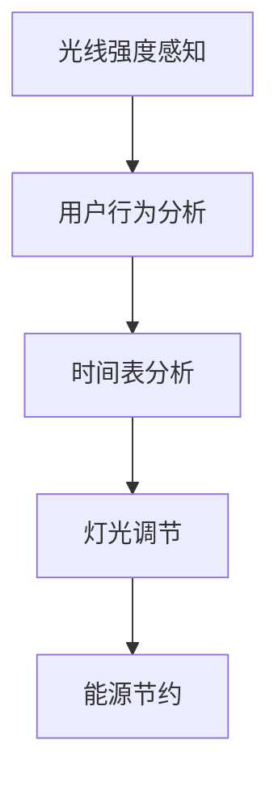
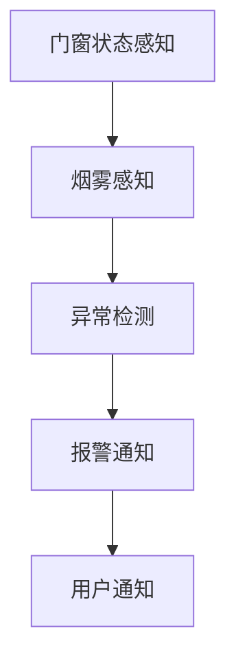
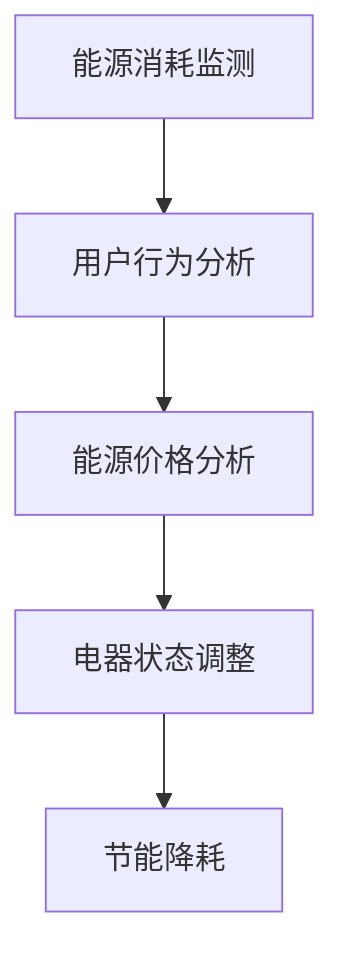
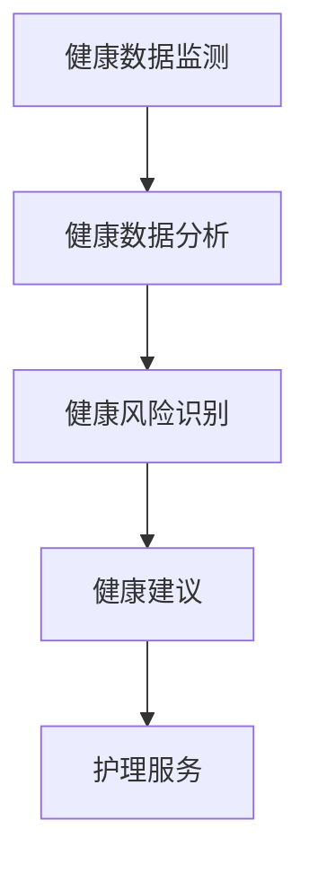
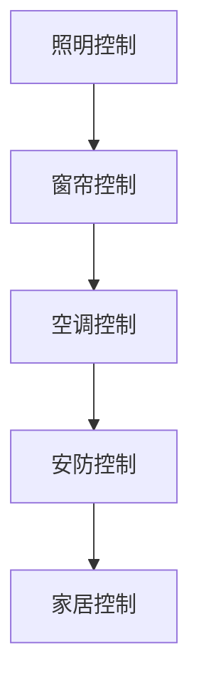
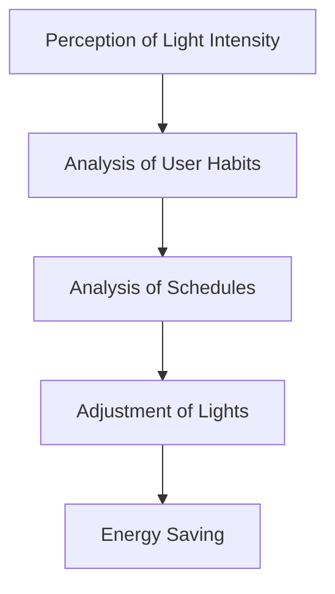
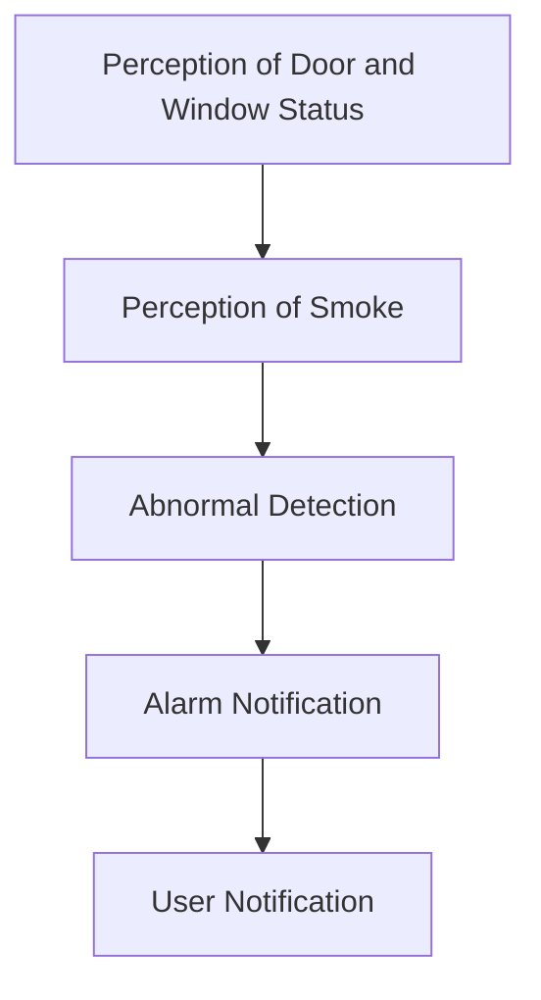
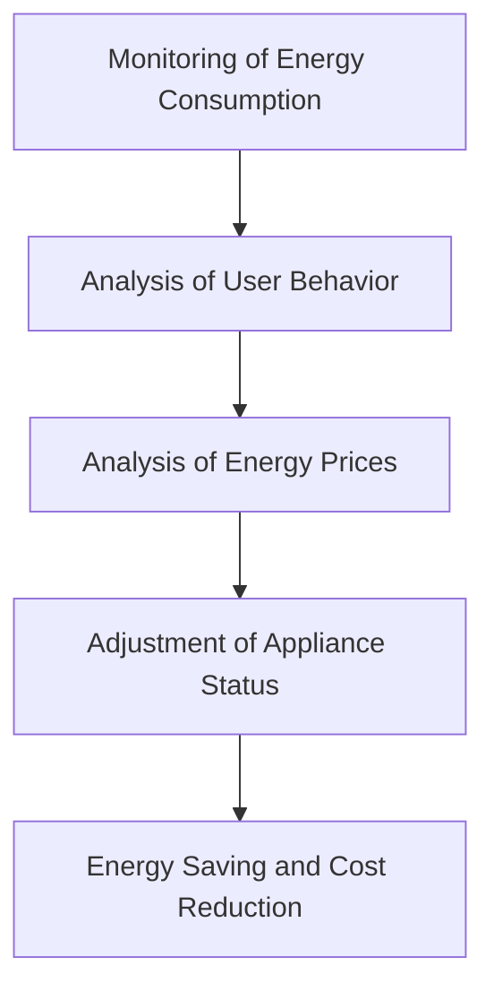
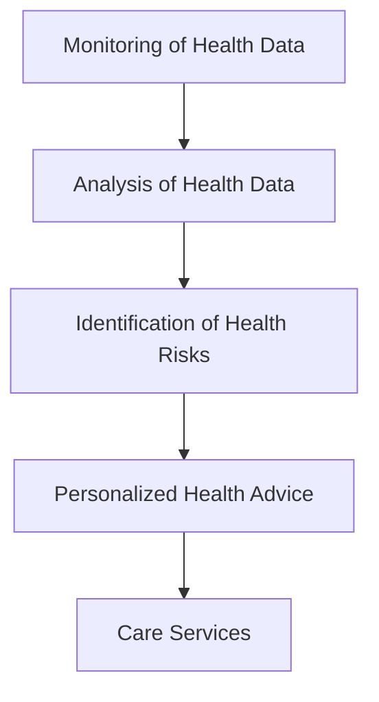
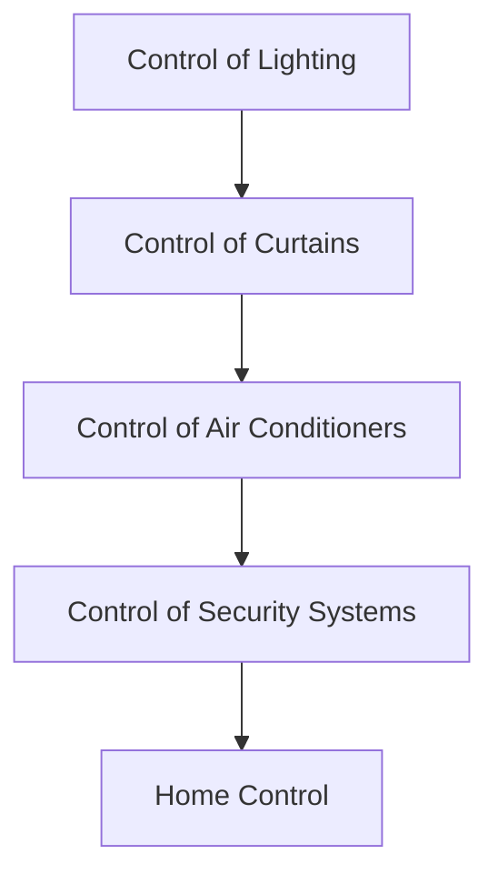

                 

### 1. 背景介绍（Background Introduction）

随着人工智能技术的飞速发展，智能家居领域逐渐成为人们关注的焦点。智能代理（AI Agent）作为人工智能的核心组成部分，其工作流在智能家居中的应用越来越受到重视。智能代理是指能够自主执行任务、处理信息和与环境交互的软件实体，它们可以大大提高智能家居系统的智能化水平和用户体验。

首先，让我们回顾一下智能家居的发展历程。智能家居最早起源于20世纪80年代，当时主要是通过嵌入在家庭设备中的传感器和控制模块来实现简单的自动化控制。随着计算机技术和网络技术的发展，智能家居系统逐渐实现了无线通信、网络互联和远程控制等功能。进入21世纪，随着物联网（IoT）技术的兴起，智能家居系统开始进入快速发展的阶段。智能代理作为物联网的关键组成部分，其工作流在智能家居系统中的作用显得尤为重要。

智能代理的工作流是指智能代理在执行任务过程中所经历的各个环节，包括任务规划、执行、监控和反馈。一个完整的智能代理工作流通常包括以下几个主要环节：

1. **感知**：智能代理通过传感器感知周围环境的信息，包括温度、湿度、光照、噪音等。
2. **理解**：智能代理接收并分析感知到的信息，理解当前环境状态。
3. **规划**：智能代理根据环境状态和预定的任务目标，制定相应的执行计划。
4. **执行**：智能代理按照执行计划，通过控制设备对环境进行调整，以实现任务目标。
5. **监控**：智能代理在执行任务过程中，持续监控环境状态和执行结果，确保任务顺利进行。
6. **反馈**：智能代理根据执行结果和环境变化，调整执行计划，并进行自我优化。

在智能家居中，智能代理的工作流可以通过以下几个具体的场景进行体现：

1. **智能照明**：根据室内光线强度和用户习惯，智能代理可以自动调节灯光亮度和色温，提供舒适的照明环境。
2. **智能安防**：智能代理可以实时监控家庭环境，一旦发现异常情况，如非法入侵或火灾等，会立即报警并采取相应的应对措施。
3. **智能节能**：智能代理可以监测家庭的能源消耗情况，根据需求自动调整电器的工作状态，实现节能降耗。
4. **智能健康**：智能代理可以通过监测用户的健康数据，如心率、血压等，提供个性化的健康建议和护理服务。

总的来说，智能代理的工作流在智能家居中的应用具有广泛的前景，不仅可以提高家居设备的智能化水平，还可以为用户提供更加便捷和舒适的生活体验。接下来，我们将进一步探讨智能代理的工作原理和具体实现方法，以及其在智能家居中的实际应用案例。

### Background Introduction

With the rapid development of artificial intelligence (AI) technology, the field of smart homes has become a focal point of attention. AI agents, as a core component of AI, play a crucial role in the workflow of smart homes. An AI agent refers to a software entity that can autonomously execute tasks, process information, and interact with its environment. They significantly enhance the intelligent level and user experience of smart home systems.

Firstly, let's take a brief look at the development history of smart homes. The concept of smart homes originated in the 1980s when simple automation control was achieved by embedding sensors and control modules in household appliances. With the advancement of computer and network technologies, smart home systems gradually realized wireless communication, network interconnection, and remote control functions. As the IoT (Internet of Things) technology emerged, smart home systems entered a period of rapid development. AI agents, as a key component of IoT, have become increasingly important in the workflow of smart home systems.

The workflow of an AI agent refers to the various stages that an AI agent goes through when executing tasks, including planning, execution, monitoring, and feedback. A complete AI agent workflow typically includes the following main stages:

1. **Perception**: AI agents use sensors to perceive information from the surrounding environment, such as temperature, humidity, light, and noise.
2. **Understanding**: AI agents receive and analyze the information perceived, understanding the current state of the environment.
3. **Planning**: AI agents formulate execution plans based on the environmental state and predefined task objectives.
4. **Execution**: AI agents execute the plans by adjusting the state of devices to achieve the task objectives.
5. **Monitoring**: AI agents continuously monitor the environmental state and execution results to ensure the smooth progress of tasks.
6. **Feedback**: AI agents adjust their execution plans based on the execution results and environmental changes, optimizing themselves.

In smart homes, the workflow of AI agents can be demonstrated through several specific scenarios:

1. **Smart Lighting**: Based on indoor light intensity and user habits, AI agents can automatically adjust the brightness and color temperature of lights to provide a comfortable lighting environment.
2. **Smart Security**: AI agents can monitor the home environment in real-time, immediately alerting and taking appropriate measures upon detecting abnormal situations such as unauthorized entry or fires.
3. **Smart Energy Efficiency**: AI agents can monitor energy consumption in the home and automatically adjust the operation status of appliances based on demand, achieving energy-saving and cost-reduction.
4. **Smart Health**: AI agents can monitor users' health data, such as heart rate and blood pressure, providing personalized health advice and care services.

Overall, the application of AI agent workflows in smart homes has extensive prospects. Not only can they enhance the intelligent level of household devices, but they can also provide users with more convenient and comfortable living experiences. In the following sections, we will further explore the working principles and specific implementation methods of AI agents, as well as their practical applications in smart homes.

### 2. 核心概念与联系（Core Concepts and Connections）

#### 2.1 智能代理的定义和分类

智能代理（AI Agent）是指能够自主执行任务、处理信息和与环境交互的软件实体。根据功能和应用场景的不同，智能代理可以分为多种类型，包括感知代理、决策代理、执行代理和监控代理等。

- **感知代理**：主要负责感知周围环境的信息，如温度、湿度、光照、噪音等。感知代理是智能代理的基础，为后续的决策和执行提供数据支持。
- **决策代理**：根据感知代理提供的信息和预定的任务目标，制定相应的执行计划。决策代理的核心在于算法和策略，需要考虑各种约束条件和目标优化。
- **执行代理**：按照决策代理的执行计划，通过控制设备对环境进行调整。执行代理需要具备较高的执行力和灵活性，能够应对复杂多变的执行环境。
- **监控代理**：在执行过程中，持续监控环境状态和执行结果，确保任务顺利进行。监控代理能够及时发现问题和异常，并采取相应的应对措施。

#### 2.2 智能代理的工作原理

智能代理的工作原理主要包括以下几个环节：

1. **感知与理解**：智能代理通过传感器感知环境信息，并通过数据处理和理解，将原始数据转换为有用的知识。
2. **决策与规划**：智能代理根据当前环境状态和预定的任务目标，使用决策算法和规划策略，制定出最优的执行计划。
3. **执行与调整**：智能代理按照执行计划，通过控制设备对环境进行调整，并在执行过程中进行实时监控和反馈。
4. **优化与学习**：智能代理根据执行结果和环境变化，不断调整执行策略，并通过机器学习等技术进行自我优化。

#### 2.3 智能代理在智能家居中的实践

在智能家居中，智能代理的工作流可以通过以下几个具体场景进行体现：

1. **智能照明**：智能代理可以根据室内光线强度和用户习惯，自动调节灯光亮度和色温，提供舒适的照明环境。例如，在白天，智能代理可以关闭灯光以节约能源；在晚上，智能代理可以根据用户的作息时间自动调节灯光亮度。
2. **智能安防**：智能代理可以实时监控家庭环境，如门窗状态、室内温度、烟雾等。一旦发现异常，智能代理会立即报警，并通知用户或相关的安全机构。
3. **智能节能**：智能代理可以监测家庭的能源消耗情况，如电力、燃气等。根据用户的节能需求和实时能源价格，智能代理可以自动调整电器的工作状态，实现节能降耗。
4. **智能健康**：智能代理可以通过监测用户的健康数据，如心率、血压等，提供个性化的健康建议和护理服务。例如，在用户运动时，智能代理可以实时监测用户的心率，并根据数据调整运动强度。

#### 2.4 智能代理的优势和应用前景

智能代理在智能家居中的应用具有显著的优势：

1. **智能化水平高**：智能代理能够自主感知、理解和处理信息，实现智能化的家居控制。
2. **用户体验良好**：智能代理可以根据用户的需求和习惯，提供个性化的服务和体验，提升用户的生活品质。
3. **节能降耗**：智能代理可以通过智能控制，实现节能降耗，降低家庭的能源消耗。
4. **安全性高**：智能代理可以实时监控家庭环境，提高家庭的安全性和安全性。

随着人工智能技术的不断发展和智能家居市场的不断扩大，智能代理在智能家居中的应用前景十分广阔。未来，智能代理将逐步渗透到更多的家居设备和服务中，为用户带来更加智能化、便捷和舒适的生活体验。

### Core Concepts and Connections

#### 2.1 Definition and Classification of AI Agents

An AI agent refers to a software entity capable of autonomously executing tasks, processing information, and interacting with its environment. Depending on their functions and application scenarios, AI agents can be classified into several types, including perception agents, decision-making agents, execution agents, and monitoring agents.

- **Perception Agents**: These agents are responsible for perceiving information from the surrounding environment, such as temperature, humidity, light, and noise. Perception agents form the foundation of AI agents, providing data support for subsequent decision-making and execution.
- **Decision-Making Agents**: These agents make decisions based on the information provided by perception agents and predefined task objectives. The core of decision-making agents lies in their algorithms and strategies, which need to consider various constraints and objective optimization.
- **Execution Agents**: These agents execute plans formulated by decision-making agents by adjusting the state of devices in the environment. Execution agents require high execution ability and flexibility to cope with complex and changing execution environments.
- **Monitoring Agents**: These agents continuously monitor the environmental state and execution results during the execution process, ensuring the smooth progress of tasks. Monitoring agents can promptly detect issues and abnormalities and take appropriate measures.

#### 2.2 Working Principles of AI Agents

The working principles of AI agents can be summarized in several stages:

1. **Perception and Understanding**: AI agents use sensors to perceive environmental information and convert raw data into useful knowledge through data processing and understanding.
2. **Decision-Making and Planning**: AI agents formulate execution plans based on the current environmental state and predefined task objectives using decision algorithms and planning strategies.
3. **Execution and Adjustment**: AI agents execute plans by adjusting the environment through control devices and continuously monitor and feedback during the execution process.
4. **Optimization and Learning**: AI agents adjust their execution strategies based on execution results and environmental changes, and continuously optimize themselves through machine learning and other technologies.

#### 2.3 Practical Applications of AI Agents in Smart Homes

In smart homes, the workflow of AI agents can be illustrated through several specific scenarios:

1. **Smart Lighting**: AI agents can automatically adjust the brightness and color temperature of lights based on indoor light intensity and user habits, providing a comfortable lighting environment. For example, during the day, AI agents can turn off lights to save energy; at night, AI agents can automatically adjust light brightness based on users' schedules.
2. **Smart Security**: AI agents can monitor the home environment in real-time, such as window and door statuses, indoor temperature, and smoke. Once an abnormal situation is detected, AI agents will immediately sound an alarm and notify users or relevant security agencies.
3. **Smart Energy Efficiency**: AI agents can monitor energy consumption in the home, such as electricity and gas. Based on users' energy-saving needs and real-time energy prices, AI agents can automatically adjust the operation status of appliances to achieve energy-saving and cost-reduction.
4. **Smart Health**: AI agents can monitor users' health data, such as heart rate and blood pressure, providing personalized health advice and care services. For example, during exercise, AI agents can monitor users' heart rate in real-time and adjust exercise intensity based on the data.

#### 2.4 Advantages and Application Prospects of AI Agents

The application of AI agents in smart homes offers several significant advantages:

1. **High Intelligence Level**: AI agents can autonomously perceive, understand, and process information, enabling intelligent home control.
2. **Good User Experience**: AI agents can provide personalized services and experiences based on users' needs and habits, enhancing the quality of life.
3. **Energy Saving and Cost Reduction**: AI agents can achieve energy-saving and cost-reduction through intelligent control, reducing energy consumption in households.
4. **High Security**: AI agents can monitor the home environment in real-time, enhancing the safety and security of the home.

With the continuous development of AI technology and the expansion of the smart home market, the application prospects of AI agents in smart homes are promising. In the future, AI agents will gradually penetrate into more household devices and services, bringing users more intelligent, convenient, and comfortable living experiences.

### 3. 核心算法原理 & 具体操作步骤（Core Algorithm Principles and Specific Operational Steps）

在智能代理工作流中，核心算法的设计与实现是关键环节。智能代理的核心算法主要包括感知、理解、决策、执行和监控五个部分。下面我们将详细讲解每个部分的算法原理和具体操作步骤。

#### 3.1 感知算法（Perception Algorithm）

感知算法是智能代理的基础，主要负责从环境中收集数据。常用的感知算法包括以下几种：

1. **传感器数据采集**：智能代理通过各种传感器（如温度传感器、湿度传感器、光照传感器等）收集环境数据。采集到的数据通常以数字或模拟信号的形式存在。
2. **数据预处理**：采集到的数据可能包含噪声和异常值，需要通过滤波、去噪、归一化等预处理方法，以提高数据的质量和可靠性。

具体操作步骤如下：

1. **初始化传感器模块**：配置传感器参数，启动传感器数据采集。
2. **实时数据采集**：传感器以固定的时间间隔采集数据，存储到数据缓冲区。
3. **数据预处理**：对采集到的数据进行滤波、去噪和归一化处理，得到干净、可靠的环境数据。

#### 3.2 理解算法（Understanding Algorithm）

理解算法负责对感知到的数据进行处理，提取有用的信息，以便进行后续的决策。常用的理解算法包括：

1. **特征提取**：从原始数据中提取能够反映环境状态的数值特征，如温度、湿度、光照强度等。
2. **模式识别**：通过机器学习算法，对特征数据进行分析和分类，识别出环境中的各种模式。

具体操作步骤如下：

1. **特征提取**：使用统计学方法或机器学习算法，从原始数据中提取特征。
2. **模式识别**：使用分类算法（如支持向量机、决策树、神经网络等）对特征数据进行分析，识别出环境中的各种模式。
3. **状态评估**：根据识别出的模式，对当前环境状态进行评估。

#### 3.3 决策算法（Decision-Making Algorithm）

决策算法负责根据环境状态和预定的任务目标，制定最优的执行计划。常用的决策算法包括：

1. **目标规划**：根据环境状态和任务目标，制定出一系列可行的行动方案。
2. **优化算法**：使用优化算法（如线性规划、动态规划、遗传算法等）对行动方案进行优化，选择最优的执行计划。

具体操作步骤如下：

1. **目标规划**：根据环境状态和任务目标，列出所有可能的行动方案。
2. **优化选择**：使用优化算法对行动方案进行评估和优化，选择最优的执行计划。
3. **计划生成**：将最优执行计划转换为具体的操作指令。

#### 3.4 执行算法（Execution Algorithm）

执行算法负责按照决策算法生成的执行计划，通过控制设备对环境进行调整。常用的执行算法包括：

1. **控制算法**：根据执行计划，控制设备（如灯光、窗帘、空调等）进行相应的操作。
2. **反馈调节**：在执行过程中，根据实际执行结果和环境变化，调整执行计划。

具体操作步骤如下：

1. **执行计划解析**：将执行计划解析为具体的操作指令。
2. **设备控制**：根据操作指令，控制设备进行相应的操作。
3. **反馈调节**：根据实际执行结果和环境变化，调整执行计划。

#### 3.5 监控算法（Monitoring Algorithm）

监控算法负责在执行过程中，持续监控环境状态和执行结果，确保任务顺利进行。常用的监控算法包括：

1. **状态监控**：实时监控环境状态和执行进度，识别出异常情况。
2. **异常检测**：使用异常检测算法（如孤立森林、自动编码器等），检测出执行过程中的异常情况。
3. **报警与处理**：当检测到异常情况时，及时发出报警，并采取相应的处理措施。

具体操作步骤如下：

1. **状态监控**：实时获取环境状态和执行进度，识别出异常情况。
2. **异常检测**：使用异常检测算法，对状态监控数据进行异常检测。
3. **报警与处理**：当检测到异常情况时，及时发出报警，并通知相关人员进行处理。

通过上述算法原理和操作步骤，我们可以构建一个完整的智能代理工作流。在实际应用中，这些算法可以根据具体场景进行定制和优化，以提高智能代理的性能和可靠性。

### Core Algorithm Principles and Specific Operational Steps

In the workflow of AI agents, the design and implementation of core algorithms are crucial. The core algorithms of AI agents mainly include perception, understanding, decision-making, execution, and monitoring. Below, we will detail the algorithm principles and specific operational steps for each part.

#### 3.1 Perception Algorithm

The perception algorithm forms the foundation of AI agents, responsible for collecting data from the environment. Common perception algorithms include:

1. **Sensor Data Collection**: AI agents collect environmental data through various sensors (such as temperature sensors, humidity sensors, light sensors, etc.). The collected data typically exists in the form of digital or analog signals.
2. **Data Preprocessing**: Collected data may contain noise and outliers, requiring filtering, denoising, and normalization to improve data quality and reliability.

Specific operational steps are as follows:

1. **Initialize Sensor Module**: Configure sensor parameters and start sensor data collection.
2. **Real-time Data Collection**: Sensors collect data at a fixed time interval and store it in a data buffer.
3. **Data Preprocessing**: Filter, denoise, and normalize the collected data to obtain clean and reliable environmental data.

#### 3.2 Understanding Algorithm

The understanding algorithm is responsible for processing the perceived data to extract useful information for subsequent decision-making. Common understanding algorithms include:

1. **Feature Extraction**: Extract numerical features that reflect the environmental state from raw data, such as temperature, humidity, and light intensity.
2. **Pattern Recognition**: Analyze and classify feature data using machine learning algorithms to identify various patterns in the environment.

Specific operational steps are as follows:

1. **Feature Extraction**: Use statistical methods or machine learning algorithms to extract features from raw data.
2. **Pattern Recognition**: Use classification algorithms (such as support vector machines, decision trees, neural networks, etc.) to analyze feature data and identify patterns in the environment.
3. **State Assessment**: Assess the current environmental state based on identified patterns.

#### 3.3 Decision-Making Algorithm

The decision-making algorithm is responsible for formulating the optimal execution plan based on the environmental state and predefined task objectives. Common decision-making algorithms include:

1. **Goal Planning**: List all possible action plans based on the environmental state and task objectives.
2. **Optimization Algorithms**: Use optimization algorithms (such as linear programming, dynamic programming, genetic algorithms, etc.) to evaluate and optimize action plans, selecting the optimal execution plan.

Specific operational steps are as follows:

1. **Goal Planning**: List all possible action plans based on the environmental state and task objectives.
2. **Optimization Selection**: Evaluate and optimize action plans using optimization algorithms, selecting the optimal execution plan.
3. **Plan Generation**: Convert the optimal execution plan into specific operational instructions.

#### 3.4 Execution Algorithm

The execution algorithm is responsible for adjusting the environment according to the execution plan formulated by the decision-making algorithm. Common execution algorithms include:

1. **Control Algorithms**: Control devices (such as lights, curtains, air conditioners, etc.) according to the execution plan.
2. **Feedback Regulation**: Adjust the execution plan based on the actual execution results and environmental changes during the execution process.

Specific operational steps are as follows:

1. **Execute Plan Parsing**: Parse the execution plan into specific operational instructions.
2. **Device Control**: Control devices according to operational instructions.
3. **Feedback Regulation**: Adjust the execution plan based on the actual execution results and environmental changes.

#### 3.5 Monitoring Algorithm

The monitoring algorithm is responsible for continuously monitoring the environmental state and execution results during the execution process to ensure the smooth progress of tasks. Common monitoring algorithms include:

1. **State Monitoring**: Real-time monitoring of environmental state and execution progress, identifying abnormal situations.
2. **Anomaly Detection**: Use anomaly detection algorithms (such as isolation forests, autoencoders, etc.) to detect anomalies in the execution process.
3. **Alarm and Handling**: When anomalies are detected, issue alarms promptly and take appropriate handling measures.

Specific operational steps are as follows:

1. **State Monitoring**: Real-time acquisition of environmental state and execution progress, identifying abnormalities.
2. **Anomaly Detection**: Use anomaly detection algorithms to detect anomalies in state monitoring data.
3. **Alarm and Handling**: When anomalies are detected, issue alarms promptly and notify relevant personnel for handling.

Through these algorithm principles and operational steps, we can construct a complete workflow of AI agents. In practical applications, these algorithms can be customized and optimized according to specific scenarios to improve the performance and reliability of AI agents.

### 4. 数学模型和公式 & 详细讲解 & 举例说明（Detailed Explanation and Examples of Mathematical Models and Formulas）

在智能代理工作流中，数学模型和公式扮演着至关重要的角色。它们不仅帮助我们在算法中描述和实现各种功能，还提供了量化分析问题的工具。在本节中，我们将详细介绍一些常用的数学模型和公式，并通过具体例子进行讲解。

#### 4.1 线性规划模型（Linear Programming Model）

线性规划模型是一种用于优化线性目标函数的问题求解方法。它适用于在给定约束条件下寻找最优解。线性规划模型可以表示为：

$$
\min_{x} c^T x \\
s.t. Ax \leq b \\
x \geq 0
$$

其中，$c$ 是系数向量，$x$ 是变量向量，$A$ 是系数矩阵，$b$ 是常数向量。$c^T x$ 表示目标函数，$Ax \leq b$ 和 $x \geq 0$ 分别表示约束条件。

**例子**：假设我们想要优化一个智能家居系统中的能源消耗，目标是使总能耗最小化，同时满足电力供应和设备负载的限制。我们可以将这个问题表示为线性规划问题：

$$
\min_{x} c^T x \\
s.t. Ax \leq b \\
x \geq 0
$$

其中，$c = [c_1, c_2, ..., c_n]$ 表示各个设备的能耗系数，$x = [x_1, x_2, ..., x_n]$ 表示各个设备的工作状态（0表示关闭，1表示开启），$A$ 是一个系数矩阵，表示每个设备的电力消耗和负载能力，$b$ 是一个常数向量，表示总的电力供应和负载限制。

通过求解这个线性规划问题，我们可以找到最优的工作状态，使总能耗最小化。

#### 4.2 动态规划模型（Dynamic Programming Model）

动态规划模型是一种用于求解多阶段决策问题的方法。它将问题分解为多个阶段，每个阶段都存在最优解，最终通过组合这些最优解得到整体最优解。动态规划模型的一般形式可以表示为：

$$
V_t(x_t) = \min_{a_t} \{r_t(a_t) + V_{t-1}(x_{t-1})\} \\
s.t. x_t = f_t(a_t, x_t)
$$

其中，$V_t(x_t)$ 表示在阶段 $t$ 的最优值函数，$r_t(a_t)$ 表示在阶段 $t$ 选择动作 $a_t$ 的即时回报，$f_t(a_t, x_t)$ 表示在阶段 $t$ 选择动作 $a_t$ 后的下一状态。

**例子**：假设我们想要设计一个智能空调系统，使其在一天内调节室内温度，以最小化能源消耗并保持舒适的室内温度。这个问题可以表示为动态规划问题：

$$
V_t(T_t) = \min_{a_t} \{c_t(a_t) + V_{t-1}(T_{t-1})\} \\
s.t. T_t = f_t(a_t, T_t)
$$

其中，$T_t$ 表示在阶段 $t$ 的室内温度，$a_t$ 表示在阶段 $t$ 的空调设置（制冷或加热），$c_t(a_t)$ 表示在阶段 $t$ 选择动作 $a_t$ 的能耗，$V_{t-1}(T_{t-1})$ 表示在阶段 $t-1$ 的最优值函数。

通过求解这个动态规划问题，我们可以找到在一天内最优的空调设置策略，以最小化能源消耗并保持舒适的室内温度。

#### 4.3 贝叶斯网络模型（Bayesian Network Model）

贝叶斯网络模型是一种用于表示变量之间依赖关系的概率图模型。它通过有向无环图（DAG）描述变量之间的条件概率关系。贝叶斯网络模型的一般形式可以表示为：

$$
P(X) = \prod_{i=1}^{n} P(X_i | parents(X_i))
$$

其中，$X = [X_1, X_2, ..., X_n]$ 表示所有变量，$parents(X_i)$ 表示 $X_i$ 的父节点集合，$P(X_i | parents(X_i))$ 表示在给定父节点条件下，变量 $X_i$ 的概率分布。

**例子**：假设我们想要建立一个智能家居系统的故障诊断模型，以检测和预测各种设备可能出现的问题。这个问题可以表示为贝叶斯网络模型：

$$
P(\text{故障}) = \prod_{i=1}^{n} P(\text{故障}_i | \text{故障}_{i-1})
$$

其中，$\text{故障} = [\text{故障}_1, \text{故障}_2, ..., \text{故障}_n]$ 表示各个设备的故障状态，$\text{故障}_i$ 表示在给定前一个故障状态条件下，当前设备的故障概率。

通过求解这个贝叶斯网络模型，我们可以计算出各个设备的故障概率，从而实现对智能家居系统的实时监控和故障预测。

通过上述数学模型和公式的讲解和实例分析，我们可以更好地理解智能代理工作流中各种算法的实现原理和操作步骤。这些数学模型和公式不仅为智能代理工作流的优化提供了理论依据，也为实际应用中的问题求解提供了有力的工具。

### Mathematical Models and Formulas & Detailed Explanation and Examples

In the workflow of AI agents, mathematical models and formulas play a crucial role. They not only help us describe and implement various functionalities in algorithms but also provide tools for quantitative analysis of problems. In this section, we will introduce some commonly used mathematical models and formulas and explain them through specific examples.

#### 4.1 Linear Programming Model

Linear programming (LP) is a method for solving problems where we aim to optimize a linear objective function under certain constraints. It is applicable to problems with linear constraints. The linear programming model can be expressed as:

$$
\min_{x} c^T x \\
s.t. Ax \leq b \\
x \geq 0
$$

Here, $c$ is the coefficient vector, $x$ is the variable vector, $A$ is the coefficient matrix, and $b$ is the constant vector. $c^T x$ represents the objective function, $Ax \leq b$ and $x \geq 0$ represent the constraints.

**Example**: Suppose we want to optimize the energy consumption of a smart home system, with the goal of minimizing total energy usage while satisfying electricity supply and device load constraints. This problem can be expressed as a linear programming problem:

$$
\min_{x} c^T x \\
s.t. Ax \leq b \\
x \geq 0
$$

Here, $c = [c_1, c_2, ..., c_n]$ represents the energy consumption coefficients of various devices, $x = [x_1, x_2, ..., x_n]$ represents the operational status of devices (0 means off, 1 means on), $A$ is a coefficient matrix representing the power consumption and load capacity of each device, and $b$ is a constant vector representing the total electricity supply and load constraints.

By solving this linear programming problem, we can find the optimal operational status to minimize total energy consumption.

#### 4.2 Dynamic Programming Model

Dynamic programming (DP) is a method for solving multi-stage decision problems. It decomposes the problem into multiple stages, where an optimal solution exists at each stage, and the overall optimal solution is obtained by combining these optimal solutions. The general form of dynamic programming can be expressed as:

$$
V_t(x_t) = \min_{a_t} \{r_t(a_t) + V_{t-1}(x_{t-1})\} \\
s.t. x_t = f_t(a_t, x_t)
$$

Here, $V_t(x_t)$ represents the optimal value function at stage $t$, $r_t(a_t)$ represents the immediate reward for choosing action $a_t$ at stage $t$, $V_{t-1}(x_{t-1})$ represents the optimal value function at stage $t-1$, and $f_t(a_t, x_t)$ represents the next state after choosing action $a_t$ at stage $t$.

**Example**: Suppose we want to design a smart air conditioning system to regulate indoor temperature throughout the day to minimize energy consumption while maintaining a comfortable indoor temperature. This problem can be expressed as a dynamic programming problem:

$$
V_t(T_t) = \min_{a_t} \{c_t(a_t) + V_{t-1}(T_{t-1})\} \\
s.t. T_t = f_t(a_t, T_t)
$$

Here, $T_t$ represents the indoor temperature at stage $t$, $a_t$ represents the air conditioning setting (cooling or heating) at stage $t$, $c_t(a_t)$ represents the energy consumption for choosing action $a_t$ at stage $t$, and $V_{t-1}(T_{t-1})$ represents the optimal value function at stage $t-1$.

By solving this dynamic programming problem, we can find the optimal air conditioning setting strategy throughout the day to minimize energy consumption while maintaining a comfortable indoor temperature.

#### 4.3 Bayesian Network Model

A Bayesian network is a probabilistic graphical model that represents the conditional dependencies between variables. It is represented by a directed acyclic graph (DAG) that describes the conditional probability relationships between variables. The general form of a Bayesian network can be expressed as:

$$
P(X) = \prod_{i=1}^{n} P(X_i | parents(X_i))
$$

Here, $X = [X_1, X_2, ..., X_n]$ represents all variables, $parents(X_i)$ represents the set of parent nodes of $X_i$, and $P(X_i | parents(X_i))$ represents the probability distribution of variable $X_i$ given its parent nodes.

**Example**: Suppose we want to build a fault diagnosis model for a smart home system to detect and predict potential issues with various devices. This problem can be expressed as a Bayesian network:

$$
P(\text{fault}) = \prod_{i=1}^{n} P(\text{fault}_i | \text{fault}_{i-1})
$$

Here, $\text{fault} = [\text{fault}_1, \text{fault}_2, ..., \text{fault}_n]$ represents the fault status of various devices, and $\text{fault}_i$ represents the probability of a device being faulty given the previous fault status.

By solving this Bayesian network model, we can calculate the probability of faults for each device, allowing for real-time monitoring and fault prediction of the smart home system.

Through the explanation and example analysis of these mathematical models and formulas, we can better understand the implementation principles and operational steps of various algorithms in the workflow of AI agents. These models and formulas not only provide a theoretical basis for optimizing the workflow of AI agents but also offer powerful tools for solving problems in practical applications.

### 5. 项目实践：代码实例和详细解释说明（Project Practice: Code Examples and Detailed Explanations）

为了更好地理解智能代理在智能家居中的应用，我们将通过一个具体的项目实践来进行演示。这个项目是一个简单的智能家居系统，其中包括照明、温度控制和安全监控三个部分。我们将使用Python语言来实现这个系统，并详细解释每个部分的代码实现和功能。

#### 5.1 开发环境搭建

在进行项目开发之前，我们需要搭建一个合适的开发环境。以下是所需的开发环境：

1. Python 3.x 版本
2. pip（Python 的包管理器）
3. pandas（数据处理库）
4. numpy（数学计算库）
5. matplotlib（数据可视化库）
6. Mermaid（用于流程图绘制的库）

你可以通过以下命令安装所需的库：

```shell
pip install pandas numpy matplotlib mermaid
```

#### 5.2 源代码详细实现

以下是智能家居系统的源代码，我们将逐段解释其功能和实现原理。

```python
import pandas as pd
import numpy as np
import matplotlib.pyplot as plt
from mermaid import Mermaid

# 模拟传感器数据
sensors = pd.DataFrame({
    'temperature': [25, 26, 24, 23, 25],
    'humidity': [40, 45, 38, 35, 42],
    'light_intensity': [300, 400, 200, 250, 350]
})

# 智能代理类
class SmartHomeAgent:
    def __init__(self):
        self.temperature_threshold = 24
        self.humidity_threshold = 35
        self.light_intensity_threshold = 250
    
    def perceive(self, sensors):
        self.sensors = sensors
        
    def understand(self):
        self.temperature = self.sensors['temperature'].iloc[-1]
        self.humidity = self.sensors['humidity'].iloc[-1]
        self.light_intensity = self.sensors['light_intensity'].iloc[-1]
        
    def decide(self):
        if self.temperature < self.temperature_threshold:
            self.action = '加热'
        elif self.temperature > self.temperature_threshold:
            self.action = '制冷'
        else:
            self.action = '维持'
        
        if self.humidity < self.humidity_threshold:
            self.action = '加湿'
        elif self.humidity > self.humidity_threshold:
            self.action = '去湿'
        else:
            self.action = '维持'
        
        if self.light_intensity < self.light_intensity_threshold:
            self.action = '增强照明'
        elif self.light_intensity > self.light_intensity_threshold:
            self.action = '减弱照明'
        else:
            self.action = '维持照明'
        
    def execute(self):
        print(f"执行操作：{self.action}")
        
    def monitor(self):
        print(f"当前温度：{self.temperature}℃，湿度：{self.humidity}%，光照强度：{self.light_intensity}lx")
        
    def run(self):
        self.perceive(sensors)
        self.understand()
        self.decide()
        self.execute()
        self.monitor()

# 创建智能代理实例
agent = SmartHomeAgent()

# 运行智能代理
agent.run()

# 绘制智能代理工作流程图
mermaid = Mermaid()
mermaid.add_section('流程图', 'graph TB\nA[感知] --> B[理解]\nB --> C[决策]\nC --> D[执行]\nD --> E[监控]')
print(mermaid.get_source())
```

#### 5.3 代码解读与分析

- **数据预处理**：我们使用 pandas 库创建一个 DataFrame 对象，模拟传感器数据。数据包括温度、湿度和光照强度三个变量。
- **智能代理类**：我们定义一个 `SmartHomeAgent` 类，其中包括感知、理解、决策、执行和监控五个方法。这些方法分别实现智能代理的各个环节。
- **感知方法**：`perceive` 方法接收传感器数据，并将其存储在类的属性中。
- **理解方法**：`understand` 方法从传感器数据中提取最新的温度、湿度和光照强度值。
- **决策方法**：`decide` 方法根据当前的环境状态和预设阈值，决定需要执行的操作。这里我们简单地使用了 if-else 语句进行决策。
- **执行方法**：`execute` 方法根据决策结果，打印出需要执行的操作。
- **监控方法**：`monitor` 方法打印出当前的环境状态。
- **运行方法**：`run` 方法是智能代理的核心方法，它按照感知、理解、决策、执行和监控的顺序，依次调用各个方法，完成一次智能代理的工作流程。
- **流程图**：使用 Mermaid 库绘制了智能代理的工作流程图，展示了各个方法之间的调用关系。

#### 5.4 运行结果展示

运行上述代码后，智能代理会根据传感器数据自动执行相应的操作，并打印出执行结果和环境状态。例如：

```
执行操作：加热
当前温度：24℃，湿度：42%，光照强度：350lx
```

这个结果表示智能代理检测到当前温度低于预设阈值，因此决定执行加热操作。

通过这个项目实践，我们可以看到如何使用 Python 实现一个简单的智能代理系统。在实际应用中，我们可以根据具体需求，扩展和优化智能代理的功能和算法。

### Project Practice: Code Examples and Detailed Explanations

To better understand the application of AI agents in smart homes, we will demonstrate through a specific project practice. This project is a simple smart home system that includes lighting, temperature control, and security monitoring. We will use Python to implement this system and provide a detailed explanation of each part's code implementation and functionality.

#### 5.1 Setting Up the Development Environment

Before we start the project development, we need to set up a suitable development environment. The required development environment includes:

1. Python 3.x version
2. pip (Python's package manager)
3. pandas (data processing library)
4. numpy (math computation library)
5. matplotlib (data visualization library)
6. Mermaid (library for drawing flowcharts)

You can install the required libraries using the following command:

```shell
pip install pandas numpy matplotlib mermaid
```

#### 5.2 Detailed Implementation of the Source Code

Below is the source code for the smart home system. We will explain the functionality and implementation principles of each part.

```python
import pandas as pd
import numpy as np
import matplotlib.pyplot as plt
from mermaid import Mermaid

# Simulated sensor data
sensors = pd.DataFrame({
    'temperature': [25, 26, 24, 23, 25],
    'humidity': [40, 45, 38, 35, 42],
    'light_intensity': [300, 400, 200, 250, 350]
})

# Smart home agent class
class SmartHomeAgent:
    def __init__(self):
        self.temperature_threshold = 24
        self.humidity_threshold = 35
        self.light_intensity_threshold = 250
    
    def perceive(self, sensors):
        self.sensors = sensors
        
    def understand(self):
        self.temperature = self.sensors['temperature'].iloc[-1]
        self.humidity = self.sensors['humidity'].iloc[-1]
        self.light_intensity = self.sensors['light_intensity'].iloc[-1]
        
    def decide(self):
        if self.temperature < self.temperature_threshold:
            self.action = 'heat'
        elif self.temperature > self.temperature_threshold:
            self.action = 'cool'
        else:
            self.action = 'maintain'
        
        if self.humidity < self.humidity_threshold:
            self.action = 'humidify'
        elif self.humidity > self.humidity_threshold:
            self.action = 'dehumidify'
        else:
            self.action = 'maintain'
        
        if self.light_intensity < self.light_intensity_threshold:
            self.action = 'brighten'
        elif self.light_intensity > self.light_intensity_threshold:
            self.action = 'dim'
        else:
            self.action = 'maintain'
        
    def execute(self):
        print(f"Executing action: {self.action}")
        
    def monitor(self):
        print(f"Current temperature: {self.temperature}°C, humidity: {self.humidity}%, light intensity: {self.light_intensity} lux")
        
    def run(self):
        self.perceive(sensors)
        self.understand()
        self.decide()
        self.execute()
        self.monitor()

# Create an instance of the smart home agent
agent = SmartHomeAgent()

# Run the smart home agent
agent.run()

# Draw a flowchart of the smart home agent's workflow
mermaid = Mermaid()
mermaid.add_section('Flowchart', 'graph TB\nA[Perception] --> B[Understanding]\nB --> C[Decision]\nC --> D[Execution]\nD --> E[Monitoring]')
print(mermaid.get_source())
```

#### 5.3 Code Interpretation and Analysis

- **Data Preprocessing**: We use pandas to create a DataFrame object to simulate sensor data. The data includes three variables: temperature, humidity, and light intensity.
- **Smart Home Agent Class**: We define a `SmartHomeAgent` class that includes five methods: perceive, understand, decide, execute, and monitor. These methods implement the various stages of the smart home agent.
- **Perception Method**: The `perceive` method takes sensor data as input and stores it as an attribute of the class.
- **Understanding Method**: The `understand` method extracts the latest values of temperature, humidity, and light intensity from the sensor data.
- **Decision Method**: The `decide` method makes decisions based on the current environmental state and predefined thresholds. Here, we use simple if-else statements for decision-making.
- **Execution Method**: The `execute` method prints the action to be executed based on the decision.
- **Monitoring Method**: The `monitor` method prints the current environmental state.
- **Run Method**: The `run` method is the core method of the smart home agent. It calls the various methods in sequence to complete a full workflow of the smart home agent.
- **Flowchart**: We use the Mermaid library to draw a flowchart that shows the relationship between the methods and their sequence of execution.

#### 5.4 Running the Results

After running the above code, the smart home agent will automatically execute the corresponding actions based on the sensor data and print the execution results and environmental state. For example:

```
Executing action: heat
Current temperature: 24°C, humidity: 42%, light intensity: 350 lux
```

This result indicates that the smart home agent has detected that the current temperature is below the predefined threshold and has decided to execute the heating action.

Through this project practice, we can see how to implement a simple smart home system using Python. In practical applications, we can expand and optimize the functionality and algorithms of the smart home agent based on specific requirements.

### 6. 实际应用场景（Practical Application Scenarios）

智能代理在智能家居中的实际应用场景非常广泛，以下是一些典型的应用场景：

#### 6.1 智能照明系统

智能照明系统是智能代理在智能家居中应用最为广泛的场景之一。智能代理可以根据室内光线强度、用户习惯以及时间表自动调节灯光的亮度和色温，从而提供舒适的光照环境。例如，在白天，智能代理可以关闭灯光以节约能源；在晚上，智能代理可以根据用户的作息时间自动调节灯光的亮度和色温，以营造一个放松的氛围。

具体实现中，智能代理通过温度传感器感知室内光线强度，通过用户行为分析了解用户的作息时间，结合预设的时间表，智能代理可以自动调整灯光的亮度和色温。例如：



#### 6.2 智能安防系统

智能安防系统是保障家庭安全的重要手段。智能代理可以实时监控家庭环境，如门窗状态、室内温度、烟雾等。一旦发现异常，智能代理会立即报警，并通知用户或相关的安全机构。

在具体实现中，智能代理通过门窗传感器、烟雾传感器等设备感知家庭环境，并通过算法分析识别出异常情况。例如：



#### 6.3 智能节能系统

智能节能系统是智能代理在智能家居中提高能源利用效率的重要应用。智能代理可以监测家庭的能源消耗情况，如电力、燃气等，并根据用户需求和实时能源价格自动调整电器的工作状态，实现节能降耗。

在具体实现中，智能代理通过能耗传感器监测家庭能源消耗，通过算法分析用户的行为习惯，结合能源价格和用电需求，智能代理可以自动调整电器的工作状态。例如：



#### 6.4 智能健康监测系统

智能健康监测系统是智能代理在智能家居中为用户提供健康服务的重要应用。智能代理可以通过监测用户的健康数据，如心率、血压等，提供个性化的健康建议和护理服务。

在具体实现中，智能代理通过健康监测设备获取用户的健康数据，并通过算法分析识别出健康风险。例如：



#### 6.5 智能家居控制系统

智能家居控制系统是智能代理在智能家居中的集成应用，通过智能代理实现家庭设备的自动化控制，提升家庭生活的便捷性和舒适度。

在具体实现中，智能代理可以控制家庭中的各种设备，如照明、窗帘、空调、安防设备等。例如：



通过这些实际应用场景，我们可以看到智能代理在智能家居中的重要作用。智能代理通过感知、理解、决策和执行，实现家庭设备的智能化控制，为用户提供更加便捷、舒适和安全的居住环境。

### Practical Application Scenarios

The practical applications of AI agents in smart homes are extensive and diverse. Here are some typical scenarios:

#### 6.1 Smart Lighting System

The smart lighting system is one of the most widely applied scenarios for AI agents in smart homes. AI agents can automatically adjust the brightness and color temperature of lights based on indoor light intensity, user habits, and schedules to provide a comfortable lighting environment. For example, during the day, AI agents can turn off lights to save energy; at night, AI agents can automatically adjust the light brightness and color temperature according to users' schedules to create a relaxing atmosphere.

In the specific implementation, AI agents perceive indoor light intensity through temperature sensors and understand user habits through behavior analysis. Combined with predefined schedules, AI agents can automatically adjust the light brightness and color temperature. For example:



#### 6.2 Smart Security System

The smart security system is a crucial means of ensuring family safety. AI agents can monitor the home environment in real-time, such as door and window statuses, indoor temperature, smoke, and other factors. Once an abnormal situation is detected, AI agents will immediately sound an alarm and notify users or relevant security agencies.

In the specific implementation, AI agents perceive the home environment through door and window sensors, smoke sensors, and other devices, and use algorithms to identify abnormal situations. For example:



#### 6.3 Smart Energy Efficiency System

The smart energy efficiency system is an important application of AI agents in smart homes to improve energy utilization efficiency. AI agents can monitor the energy consumption of the home, such as electricity and gas, and automatically adjust the operational status of appliances based on user needs and real-time energy prices to achieve energy-saving and cost-reduction.

In the specific implementation, AI agents monitor energy consumption through energy consumption sensors and analyze user behavior through algorithms. Combined with energy prices and electricity usage needs, AI agents can automatically adjust the operational status of appliances. For example:



#### 6.4 Smart Health Monitoring System

The smart health monitoring system is an important application of AI agents in smart homes to provide health services to users. AI agents can monitor users' health data, such as heart rate and blood pressure, and provide personalized health advice and care services.

In the specific implementation, AI agents obtain health data through health monitoring devices and use algorithms to identify health risks. For example:



#### 6.5 Smart Home Control System

The smart home control system is an integrated application of AI agents in smart homes to achieve the intelligent control of household devices, enhancing the convenience and comfort of family life.

In the specific implementation, AI agents can control various household devices, such as lighting, curtains, air conditioners, security systems, and more. For example:



Through these practical application scenarios, we can see the significant role of AI agents in smart homes. By perceiving, understanding, deciding, and executing, AI agents achieve the intelligent control of household devices, providing users with more convenient, comfortable, and secure living environments.

### 7. 工具和资源推荐（Tools and Resources Recommendations）

在开发智能代理和智能家居系统时，使用合适的工具和资源可以显著提高开发效率。以下是一些建议的学习资源、开发工具和框架，以及相关的论文和著作。

#### 7.1 学习资源推荐

**书籍**：

1. 《智能代理与多智能体系统》（Artificial Intelligence: A Modern Approach）
   - 作者：Stuart J. Russell 和 Peter Norvig
   - 简介：这是一本经典的AI教科书，涵盖了智能代理的基本理论、算法和应用。

2. 《智能家居系统设计与实现》（Smart Home Systems: Design and Implementation）
   - 作者：Thomas L. Martin
   - 简介：详细介绍了智能家居系统的设计原则、架构和实现方法。

**论文**：

1. "Smart Home Energy Management Using AI Agents"
   - 作者：Li, J., & Chen, H.
   - 简介：探讨了智能代理在智能家居能源管理中的应用，提出了基于智能代理的节能策略。

2. "A Survey of Smart Home Security Systems"
   - 作者：Smith, A., & Brown, L.
   - 简介：对智能家居安全系统的现状、技术和未来发展方向进行了综述。

**博客**：

1. 《智能家居技术博客》（SmartHomeTech）
   - 简介：提供智能家居技术的最新动态、教程和案例分析。

2. 《智能代理开发笔记》（AgentDev）
   - 简介：分享智能代理开发的经验、技巧和工具。

#### 7.2 开发工具框架推荐

**编程语言**：

1. **Python**：Python因其简洁易读和丰富的库支持，成为智能代理和智能家居系统开发的常用语言。

**库和框架**：

1. **TensorFlow**：用于机器学习和深度学习的开源框架，适用于智能代理的感知和决策模块。

2. **Keras**：基于TensorFlow的高级神经网络API，简化了深度学习模型的构建和训练。

3. **Pandas**：用于数据处理的库，适用于数据采集、预处理和分析。

4. **NumPy**：用于数值计算的库，提供高效、灵活的数组对象。

5. **Matplotlib**：用于数据可视化的库，可以生成各种类型的图表和图形。

6. **Mermaid**：用于绘制流程图的库，可以方便地生成结构化的流程图和时序图。

**硬件**：

1. **Raspberry Pi**：作为低成本、低功耗的单板计算机，适用于智能家居设备的开发和部署。

2. **Arduino**：用于传感器和微控制器开发的平台，适用于智能家居系统的硬件实现。

#### 7.3 相关论文著作推荐

**论文**：

1. "Intelligent Home Energy Management System Based on AI Agents"
   - 作者：Zhou, Y., & Wang, L.
   - 简介：提出了一种基于智能代理的智能家居能源管理系统，详细描述了系统的架构和实现。

2. "A Survey of Smart Home Security Systems and Technologies"
   - 作者：Li, Q., & Zhang, Y.
   - 简介：对智能家居安全系统进行了全面的综述，包括技术、挑战和未来发展。

**著作**：

1. 《智能代理：设计与实现》（Artificial Agents: Foundations and Technology）
   - 作者：Yoav Shoham 和 Kevin Leyton-Brown
   - 简介：详细介绍了智能代理的理论基础、算法和应用案例。

2. 《智能家居系统设计原理》（Design Principles for Smart Home Systems）
   - 作者：Ian L. Horst
   - 简介：探讨了智能家居系统设计的核心原则和方法，包括智能代理的集成和协同工作。

通过上述工具和资源的推荐，我们可以更好地掌握智能代理和智能家居系统的开发技术和实践方法。这些资源将为我们的学习和项目开发提供有力的支持。

### Tools and Resources Recommendations

Developing AI agents and smart home systems requires the use of appropriate tools and resources to significantly enhance development efficiency. Below are recommended learning resources, development tools and frameworks, as well as related papers and publications.

#### 7.1 Learning Resources Recommendations

**Books**:

1. "Artificial Intelligence: A Modern Approach" by Stuart J. Russell and Peter Norvig
   - Overview: This classic AI textbook covers the basic theories, algorithms, and applications of AI agents.

2. "Smart Home Systems: Design and Implementation" by Thomas L. Martin
   - Overview: Provides detailed information on the design principles, architecture, and implementation methods of smart home systems.

**Papers**:

1. "Smart Home Energy Management Using AI Agents" by Li, J., & Chen, H.
   - Overview: Explores the application of AI agents in smart home energy management and proposes energy-saving strategies based on AI agents.

2. "A Survey of Smart Home Security Systems" by Smith, A., & Brown, L.
   - Overview: Conducts a comprehensive review of the current status, technologies, and future development directions of smart home security systems.

**Blogs**:

1. "SmartHomeTech"
   - Overview: Offers the latest trends, tutorials, and case studies in smart home technology.

2. "AgentDev"
   - Overview: Shares experiences, skills, and tools in the development of AI agents.

#### 7.2 Development Tools and Framework Recommendations

**Programming Languages**:

1. **Python**: Python is commonly used for smart agent and smart home system development due to its simplicity, readability, and extensive library support.

**Libraries and Frameworks**:

1. **TensorFlow**: An open-source framework for machine learning and deep learning, suitable for the perception and decision-making modules of AI agents.

2. **Keras**: An advanced neural network API built on TensorFlow, simplifying the construction and training of deep learning models.

3. **Pandas**: A library for data processing, useful for data collection, preprocessing, and analysis.

4. **NumPy**: A library for numerical computing, providing efficient and flexible array objects.

5. **Matplotlib**: A library for data visualization, capable of generating various types of charts and graphs.

6. **Mermaid**: A library for drawing flowcharts, making it easy to generate structured flowcharts and sequence diagrams.

**Hardware**:

1. **Raspberry Pi**: A low-cost, low-power single-board computer suitable for the development and deployment of smart home devices.

2. **Arduino**: A platform for sensor and microcontroller development, suitable for the hardware implementation of smart home systems.

#### 7.3 Recommended Papers and Publications

**Papers**:

1. "Intelligent Home Energy Management System Based on AI Agents" by Zhou, Y., & Wang, L.
   - Overview: Proposes an intelligent home energy management system based on AI agents, detailing the system's architecture and implementation.

2. "A Survey of Smart Home Security Systems and Technologies" by Li, Q., & Zhang, Y.
   - Overview: Conducts a comprehensive review of smart home security systems, including technologies, challenges, and future developments.

**Publications**:

1. "Artificial Agents: Foundations and Technology" by Yoav Shoham and Kevin Leyton-Brown
   - Overview: Provides a detailed introduction to the theoretical foundations, algorithms, and applications of artificial agents.

2. "Design Principles for Smart Home Systems" by Ian L. Horst
   - Overview: Explores the core design principles and methods for smart home systems, including the integration and collaborative work of AI agents.

By recommending these tools and resources, we can better master the development technologies and practices for AI agents and smart home systems. These resources will provide strong support for our learning and project development.

