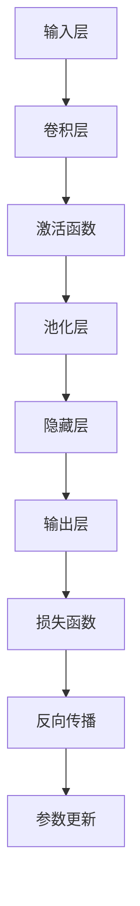

                 

# AI人工智能深度学习算法：在模式识别中的应用

## 摘要

本文将探讨人工智能（AI）领域中的深度学习算法在模式识别中的应用。首先，我们将回顾深度学习的基本概念及其在AI中的重要性。接着，将深入探讨卷积神经网络（CNN）和循环神经网络（RNN）在图像和序列数据模式识别中的应用。然后，我们将分析深度学习算法中的监督学习、无监督学习和半监督学习，并讨论其在模式识别中的不同应用场景。最后，我们将通过一个具体的项目实践实例，展示如何使用深度学习算法进行模式识别，并探讨未来的发展趋势与挑战。

## 1. 背景介绍（Background Introduction）

模式识别是人工智能（AI）的一个核心研究领域，旨在使计算机系统能够识别和理解数据中的模式。模式可以是任何类型的数据结构，如图像中的边缘、语音信号中的语音单元，或者时间序列中的周期性变化。模式识别技术在多种领域具有广泛应用，包括医学诊断、图像处理、语音识别、金融交易分析等。

随着计算机处理能力和数据存储技术的飞速发展，深度学习算法逐渐成为模式识别领域的主流方法。深度学习是一种基于多层神经网络的机器学习技术，通过多层次的非线性变换，从大量数据中自动提取特征，从而实现复杂模式的自动识别。与传统的机器学习方法相比，深度学习在处理大规模数据和复杂任务时表现出更高的准确性和鲁棒性。

本文将首先介绍深度学习的基本概念，然后探讨两种主要的深度学习模型——卷积神经网络（CNN）和循环神经网络（RNN）在图像和序列数据模式识别中的应用。接着，我们将分析深度学习算法中的监督学习、无监督学习和半监督学习，并讨论其在模式识别中的不同应用场景。最后，我们将通过一个具体的项目实践实例，展示如何使用深度学习算法进行模式识别，并探讨未来的发展趋势与挑战。

## 2. 核心概念与联系（Core Concepts and Connections）

### 2.1 深度学习的基本概念

深度学习是一种基于多层神经网络的机器学习技术。它通过一系列的神经元层对输入数据进行处理，每层神经网络都可以提取更高层次的特征。深度学习的关键优势在于其能够自动从大量数据中学习特征，从而实现复杂的模式识别任务。

一个典型的深度学习模型包括以下几个关键组件：

- **输入层（Input Layer）**：接收原始数据，如图像或文本。
- **隐藏层（Hidden Layers）**：通过非线性变换对输入数据进行特征提取和转换。
- **输出层（Output Layer）**：根据训练目标产生输出结果，如图像分类标签或文本摘要。

### 2.2 卷积神经网络（CNN）

卷积神经网络（CNN）是一种专门用于处理图像数据的深度学习模型。它通过卷积操作提取图像中的局部特征，并利用池化操作降低数据的维度。

- **卷积层（Convolutional Layer）**：使用卷积核（filter）在输入图像上滑动，以捕捉局部特征。每个卷积核可以学习到一种特定的特征模式，如边缘、纹理或颜色。
- **激活函数（Activation Function）**：通常使用ReLU（Rectified Linear Unit）作为激活函数，以增加网络的非线性特性。
- **池化层（Pooling Layer）**：通过最大池化或平均池化操作降低数据维度，从而减少模型参数的数量，提高计算效率。

### 2.3 循环神经网络（RNN）

循环神经网络（RNN）是一种用于处理序列数据的深度学习模型。它通过递归结构对序列中的每个元素进行处理，并将信息存储在隐藏状态中，从而捕捉序列中的长期依赖关系。

- **隐藏状态（Hidden State）**：在每个时间步，RNN 使用隐藏状态和当前输入计算新的隐藏状态。
- **循环连接（Recurrence Connection）**：RNN 的当前输出依赖于之前的隐藏状态，从而形成循环结构。
- **门控机制（Gated Mechanism）**：长短期记忆网络（LSTM）和门控循环单元（GRU）通过引入门控机制，解决了 RNN 中梯度消失和梯度爆炸的问题。

### 2.4 深度学习算法中的监督学习、无监督学习和半监督学习

- **监督学习（Supervised Learning）**：监督学习是深度学习中最常见的类型，它使用带有标签的训练数据来训练模型。标签提供了模型预期的输出，使模型能够学习到正确的特征表示。
- **无监督学习（Unsupervised Learning）**：无监督学习不使用标签数据，而是从未标记的数据中学习特征表示。自编码器（Autoencoders）和聚类算法是常用的无监督学习方法。
- **半监督学习（Semi-Supervised Learning）**：半监督学习结合了监督学习和无监督学习的优势，利用少量的有标签数据和大量的无标签数据来训练模型。这种学习方法在数据标签稀缺的情况下特别有用。

### 2.5 Mermaid 流程图

以下是一个简化的 Mermaid 流程图，展示了深度学习模型的基本架构和流程：



通过以上对深度学习的基本概念、卷积神经网络、循环神经网络以及监督学习、无监督学习和半监督学习的介绍，我们可以更好地理解深度学习在模式识别中的应用。

## 3. 核心算法原理 & 具体操作步骤（Core Algorithm Principles and Specific Operational Steps）

### 3.1 卷积神经网络（CNN）的工作原理

卷积神经网络（CNN）是深度学习领域中最常用的模型之一，特别适用于处理图像数据。CNN 通过卷积层、激活函数、池化层和全连接层等组件来提取图像中的特征，并最终实现分类或回归任务。

- **卷积层（Convolutional Layer）**：卷积层是 CNN 的核心组件，通过卷积操作从原始图像中提取特征。卷积操作使用多个卷积核（filter）在图像上滑动，以捕捉图像中的局部特征。每个卷积核对图像的一个局部区域进行卷积操作，产生一个特征图（feature map）。卷积层的输出是一个特征图集合，包含了图像的多种特征。

  ```math
  O_{ij} = \sum_{k=1}^{m} W_{ik,j} \cdot I_{ij} + b_{j}
  ```

  其中，\(O_{ij}\) 表示第 \(i\) 行第 \(j\) 列的特征图值，\(W_{ik,j}\) 表示卷积核的权重，\(I_{ij}\) 表示输入图像的第 \(i\) 行第 \(j\) 列的像素值，\(b_{j}\) 表示偏置项。

- **激活函数（Activation Function）**：激活函数用于引入非线性特性，常用的激活函数包括 ReLU（Rectified Linear Unit）和 sigmoid 函数。ReLU 函数具有简单的形式，可以加速网络的训练过程，同时避免梯度消失问题。

  ```math
  f(x) = \max(0, x)
  ```

- **池化层（Pooling Layer）**：池化层用于降低特征图的维度，提高计算效率。常用的池化操作包括最大池化和平均池化。最大池化选取每个特征图窗口内的最大值，而平均池化则计算窗口内所有值的平均值。

  ```math
  P_{ij} = \max(I_{i \cdot w, j \cdot h})
  ```

  其中，\(P_{ij}\) 表示第 \(i\) 行第 \(j\) 列的池化值，\(I_{i \cdot w, j \cdot h}\) 表示窗口内的像素值，\(w\) 和 \(h\) 分别表示窗口的大小。

- **全连接层（Fully Connected Layer）**：全连接层将卷积层和池化层输出的特征图展平为一维向量，并通过线性变换产生最终的分类或回归结果。全连接层中的每个神经元都与上一层的所有神经元相连，从而实现复杂的非线性映射。

  ```math
  O_j = \sum_{i=1}^{n} W_{ij} \cdot X_i + b_j
  ```

  其中，\(O_j\) 表示第 \(j\) 个神经元的输出值，\(X_i\) 表示上一层的第 \(i\) 个特征值，\(W_{ij}\) 表示连接权重，\(b_j\) 表示偏置项。

- **损失函数（Loss Function）**：损失函数用于衡量模型预测值与真实标签之间的差距。常用的损失函数包括均方误差（MSE）和交叉熵（Cross-Entropy）。通过最小化损失函数，模型可以不断调整权重和偏置，以达到更好的分类效果。

  ```math
  L = \frac{1}{2} \sum_{i=1}^{n} (y_i - \hat{y}_i)^2
  ```

  其中，\(L\) 表示损失值，\(y_i\) 表示真实标签，\(\hat{y}_i\) 表示模型预测值。

- **反向传播（Backpropagation）**：反向传播是一种用于训练深度学习模型的方法，通过计算损失函数关于模型参数的梯度，并使用梯度下降（Gradient Descent）算法更新参数。反向传播过程分为两个阶段：前向传播（Forward Propagation）和后向传播（Back Propagation）。

  - **前向传播**：计算模型输出和损失函数。
  - **后向传播**：从输出层开始，反向计算每个神经元的梯度，并更新权重和偏置。

  ```math
  \frac{\partial L}{\partial W} = \frac{\partial L}{\partial O} \cdot \frac{\partial O}{\partial Z} \cdot \frac{\partial Z}{\partial W}
  \frac{\partial L}{\partial b} = \frac{\partial L}{\partial O} \cdot \frac{\partial O}{\partial Z} \cdot \frac{\partial Z}{\partial b}
  ```

  其中，\(\frac{\partial L}{\partial W}\) 和 \(\frac{\partial L}{\partial b}\) 分别表示权重和偏置的梯度。

### 3.2 循环神经网络（RNN）的工作原理

循环神经网络（RNN）是一种用于处理序列数据的深度学习模型，特别适用于时间序列预测、语言模型和机器翻译等任务。RNN 通过递归结构对序列中的每个元素进行处理，并利用隐藏状态存储历史信息。

- **隐藏状态（Hidden State）**：隐藏状态是 RNN 的核心组件，用于存储序列中的信息。在 RNN 的每个时间步，隐藏状态通过当前输入和上一个时间步的隐藏状态计算得到。

  ```math
  h_t = \sigma(W_h \cdot [h_{t-1}, x_t] + b_h)
  ```

  其中，\(h_t\) 表示第 \(t\) 个时间步的隐藏状态，\(\sigma\) 表示激活函数，\(W_h\) 和 \(b_h\) 分别表示权重和偏置。

- **递归结构（Recurrence Connection）**：RNN 的当前输出依赖于之前的隐藏状态，从而形成递归结构。递归结构使得 RNN 能够捕捉序列中的长期依赖关系。

  ```math
  o_t = \sigma(W_o \cdot h_t + b_o)
  ```

  其中，\(o_t\) 表示第 \(t\) 个时间步的输出，\(W_o\) 和 \(b_o\) 分别表示权重和偏置。

- **门控机制（Gated Mechanism）**：为了解决 RNN 中梯度消失和梯度爆炸的问题，引入了门控机制。门控机制包括输入门（Input Gate）、遗忘门（Forget Gate）和输出门（Output Gate），用于控制信息的流入、保留和流出。

  - **输入门（Input Gate）**：输入门用于控制当前输入对隐藏状态的影响。

    ```math
    i_t = \sigma(W_i \cdot [h_{t-1}, x_t] + b_i)
    h_t = \tanh(W_h \cdot [i_t \odot h_{t-1}, x_t] + b_h)
    ```

    其中，\(i_t\) 表示输入门的状态，\(\odot\) 表示元素乘。

  - **遗忘门（Forget Gate）**：遗忘门用于控制过去隐藏状态中信息的保留。

    ```math
    f_t = \sigma(W_f \cdot [h_{t-1}, x_t] + b_f)
    h_t = f_t \odot h_{t-1} + i_t \odot h_t
    ```

    其中，\(f_t\) 表示遗忘门的状态。

  - **输出门（Output Gate）**：输出门用于控制当前隐藏状态对输出的影响。

    ```math
    o_t = \sigma(W_o \cdot [h_t, x_t] + b_o)
    y_t = o_t \odot \tanh(h_t)
    ```

    其中，\(o_t\) 表示输出门的状态。

通过以上对卷积神经网络（CNN）和循环神经网络（RNN）的工作原理的详细介绍，我们可以更好地理解深度学习在模式识别中的应用。

## 4. 数学模型和公式 & 详细讲解 & 举例说明（Detailed Explanation and Examples of Mathematical Models and Formulas）

### 4.1 卷积神经网络（CNN）的数学模型

卷积神经网络（CNN）的核心在于其卷积层，通过卷积操作从输入图像中提取特征。以下是一个简单的卷积神经网络的数学模型，包括卷积层、激活函数和池化层。

#### 卷积层

卷积层通过卷积操作提取图像特征。卷积操作可以表示为：

$$
O_{ij} = \sum_{k=1}^{m} W_{ik,j} \cdot I_{ij} + b_{j}
$$

其中，\(O_{ij}\) 是卷积层输出的特征图值，\(W_{ik,j}\) 是卷积核权重，\(I_{ij}\) 是输入图像的像素值，\(b_{j}\) 是偏置项，\(m\) 是卷积核的大小。

#### 激活函数

激活函数用于引入非线性特性。常用的激活函数是 ReLU（Rectified Linear Unit），其公式为：

$$
f(x) = \max(0, x)
$$

#### 池化层

池化层用于降低特征图的维度，提高计算效率。最大池化公式为：

$$
P_{ij} = \max(I_{i \cdot w, j \cdot h})
$$

其中，\(P_{ij}\) 是池化层输出的值，\(I_{i \cdot w, j \cdot h}\) 是窗口内的像素值，\(w\) 和 \(h\) 是窗口的大小。

### 4.2 循环神经网络（RNN）的数学模型

循环神经网络（RNN）适用于处理序列数据，其核心在于递归结构。以下是一个简单的 RNN 的数学模型，包括隐藏状态和输出。

#### 隐藏状态

隐藏状态用于存储序列中的信息。在 RNN 的每个时间步，隐藏状态通过当前输入和上一个时间步的隐藏状态计算得到：

$$
h_t = \sigma(W_h \cdot [h_{t-1}, x_t] + b_h)
$$

其中，\(h_t\) 是第 \(t\) 个时间步的隐藏状态，\(\sigma\) 是激活函数，\(W_h\) 和 \(b_h\) 分别是权重和偏置。

#### 输出

RNN 的输出可以通过隐藏状态和当前输入计算得到：

$$
o_t = \sigma(W_o \cdot h_t + b_o)
$$

其中，\(o_t\) 是第 \(t\) 个时间步的输出，\(W_o\) 和 \(b_o\) 分别是权重和偏置。

### 4.3 LSTM 的数学模型

长短期记忆网络（LSTM）是 RNN 的一种改进，用于解决 RNN 中梯度消失和梯度爆炸的问题。以下是一个简单的 LSTM 的数学模型。

#### 隐藏状态

LSTM 的隐藏状态通过输入门、遗忘门和输出门计算得到：

$$
i_t = \sigma(W_i \cdot [h_{t-1}, x_t] + b_i) \\
f_t = \sigma(W_f \cdot [h_{t-1}, x_t] + b_f) \\
o_t = \sigma(W_o \cdot [h_{t-1}, x_t] + b_o) \\
h_t = f_t \odot \hat{h_t} + i_t \odot \tanh(\hat{h_t})
$$

其中，\(\hat{h_t}\) 是上一个时间步的候选隐藏状态，其他符号与 RNN 相同。

#### 遗忘门

遗忘门用于控制过去隐藏状态中信息的保留：

$$
g_t = \sigma(W_g \cdot [h_{t-1}, x_t] + b_g)
$$

#### 输入门

输入门用于控制当前输入对隐藏状态的影响：

$$
\hat{h_t} = \tanh(W_h \cdot [h_{t-1}, x_t] + b_h)
$$

### 4.4 举例说明

#### 卷积层

假设输入图像为 32x32 的像素矩阵，卷积核大小为 3x3，步长为 1。卷积核的权重为：

$$
W = \begin{bmatrix}
0 & 1 & 0 \\
1 & 0 & 1 \\
0 & 1 & 0
\end{bmatrix}
$$

输入图像为：

$$
I = \begin{bmatrix}
1 & 0 & 1 \\
0 & 1 & 0 \\
1 & 0 & 1
\end{bmatrix}
$$

卷积操作计算特征图值：

$$
O = W \cdot I = \begin{bmatrix}
0 & 1 & 0 \\
1 & 0 & 1 \\
0 & 1 & 0
\end{bmatrix}
\begin{bmatrix}
1 & 0 & 1 \\
0 & 1 & 0 \\
1 & 0 & 1
\end{bmatrix}
=
\begin{bmatrix}
0 & 1 & 0 \\
1 & 1 & 1 \\
0 & 1 & 0
\end{bmatrix}
$$

#### 激活函数

使用 ReLU 激活函数，对特征图进行非线性变换：

$$
O = \max(0, O) =
\begin{bmatrix}
0 & 1 & 0 \\
1 & 1 & 1 \\
0 & 1 & 0
\end{bmatrix}
$$

#### 池化层

使用最大池化，窗口大小为 2x2，对特征图进行下采样：

$$
P = \max(O[::2, ::2]) =
\begin{bmatrix}
1 & 1
\end{bmatrix}
$$

通过以上示例，我们可以直观地看到卷积层、激活函数和池化层的计算过程。

## 5. 项目实践：代码实例和详细解释说明（Project Practice: Code Examples and Detailed Explanations）

### 5.1 开发环境搭建

在开始项目实践之前，我们需要搭建一个合适的开发环境。以下是搭建基于 TensorFlow 和 Keras 的深度学习开发环境的基本步骤：

1. 安装 Python（建议使用 Python 3.6 或以上版本）。
2. 安装 TensorFlow：使用以下命令安装 TensorFlow：

   ```bash
   pip install tensorflow
   ```

3. 安装 Keras：Keras 是 TensorFlow 的高级接口，可以简化深度学习模型的构建。使用以下命令安装 Keras：

   ```bash
   pip install keras
   ```

### 5.2 源代码详细实现

下面我们将使用 TensorFlow 和 Keras 实现一个简单的卷积神经网络（CNN）模型，用于对 MNIST 数据集进行手写数字识别。

#### 数据预处理

首先，我们需要导入所需的库并加载数据集：

```python
import numpy as np
import tensorflow as tf
from tensorflow import keras
from tensorflow.keras import layers

# 加载 MNIST 数据集
(x_train, y_train), (x_test, y_test) = keras.datasets.mnist.load_data()

# 数据预处理
x_train = x_train.astype('float32') / 255
x_test = x_test.astype('float32') / 255
x_train = np.expand_dims(x_train, -1)
x_test = np.expand_dims(x_test, -1)

# 将标签转换为 one-hot 编码
num_classes = 10
y_train = keras.utils.to_categorical(y_train, num_classes)
y_test = keras.utils.to_categorical(y_test, num_classes)
```

#### 构建模型

接下来，我们使用 Keras 的 Sequential 模型构建一个简单的卷积神经网络：

```python
# 构建模型
model = keras.Sequential()

# 第一个卷积层
model.add(layers.Conv2D(32, (3, 3), activation='relu', input_shape=(28, 28, 1)))
model.add(layers.MaxPooling2D((2, 2)))

# 第二个卷积层
model.add(layers.Conv2D(64, (3, 3), activation='relu'))
model.add(layers.MaxPooling2D((2, 2)))

# 全连接层
model.add(layers.Flatten())
model.add(layers.Dense(128, activation='relu'))
model.add(layers.Dense(num_classes, activation='softmax'))
```

#### 训练模型

现在，我们使用训练数据训练模型：

```python
# 编译模型
model.compile(optimizer='adam', loss='categorical_crossentropy', metrics=['accuracy'])

# 训练模型
model.fit(x_train, y_train, epochs=10, batch_size=64, validation_split=0.1)
```

#### 评估模型

最后，我们使用测试数据评估模型的性能：

```python
# 评估模型
test_loss, test_acc = model.evaluate(x_test, y_test, verbose=2)
print('Test accuracy:', test_acc)
```

### 5.3 代码解读与分析

#### 数据预处理

在数据预处理部分，我们首先将 MNIST 数据集加载到内存中。MNIST 数据集包含 60,000 个训练图像和 10,000 个测试图像，每幅图像是一个 28x28 的灰度图像。我们使用 `keras.datasets.mnist.load_data()` 函数加载数据集，并将图像的像素值缩放到 [0, 1] 范围内，以便模型训练时能够更好地收敛。

为了使卷积神经网络能够接受图像数据，我们需要将图像的高度和宽度增加一个维度，将每个像素值作为图像的一个通道。因此，我们使用 `np.expand_dims()` 函数将输入数据的维度从 (60000, 28, 28) 调整为 (60000, 28, 28, 1)。

接下来，我们将标签转换为 one-hot 编码，以便模型能够计算分类损失。使用 `keras.utils.to_categorical()` 函数，我们将标签从整数转换为每个标签对应一个长度为 10 的二进制向量。

#### 构建模型

在构建模型部分，我们使用 Keras 的 `Sequential` 模型构建了一个简单的卷积神经网络，包括两个卷积层、两个最大池化层、一个全连接层和两个输出层。

第一个卷积层包含 32 个 3x3 的卷积核，使用 ReLU 激活函数。卷积层通过卷积操作提取图像的局部特征，并将特征图传递给最大池化层，以降低数据的维度。

第二个卷积层包含 64 个 3x3 的卷积核，也使用 ReLU 激活函数。这一层进一步提取图像的复杂特征。

在两个卷积层之后，我们使用 `Flatten` 层将多维特征图展平为一维向量，以便全连接层能够处理。

全连接层包含 128 个神经元，使用 ReLU 激活函数。这一层通过线性变换对输入数据进行分类。

最后，输出层包含 10 个神经元，每个神经元对应一个数字类别，使用 softmax 激活函数输出每个数字类别的概率分布。

#### 训练模型

在训练模型部分，我们使用 `model.compile()` 方法编译模型，指定优化器、损失函数和性能指标。在本例中，我们使用 Adam 优化器，损失函数是分类交叉熵（categorical_crossentropy），性能指标是分类准确率（accuracy）。

使用 `model.fit()` 方法训练模型，我们指定训练数据、训练轮数（epochs）、批量大小（batch_size）和验证数据。在每次训练迭代中，模型会根据训练数据的反馈调整权重和偏置，以优化分类性能。

#### 评估模型

在评估模型部分，我们使用 `model.evaluate()` 方法计算模型在测试数据上的性能。该方法返回损失值和性能指标，我们使用测试准确率（test_acc）来评估模型的性能。

通过以上步骤，我们可以构建并训练一个简单的卷积神经网络，用于手写数字识别。这个示例展示了如何使用 TensorFlow 和 Keras 实现深度学习模型的基本流程，包括数据预处理、模型构建、模型训练和模型评估。

## 6. 实际应用场景（Practical Application Scenarios）

深度学习算法在模式识别领域的应用已经渗透到了多个行业和领域，以下是一些典型的实际应用场景：

### 6.1 图像识别

在图像识别领域，深度学习算法，尤其是卷积神经网络（CNN），已经取得了显著的成果。例如，在人脸识别、车牌识别、医疗图像分析等应用中，CNN 能够有效地提取图像特征，从而实现高精度的识别。

- **人脸识别**：利用 CNN 的强大特征提取能力，人脸识别系统能够在各种光照、姿态和遮挡条件下准确识别人脸。
- **车牌识别**：通过训练卷积神经网络，系统能够自动识别车辆车牌，并在交通监控和管理中发挥重要作用。
- **医疗图像分析**：CNN 在医学图像中提取病变区域和特征，有助于早期诊断和疾病监测，如乳腺癌、肺癌等。

### 6.2 语音识别

在语音识别领域，循环神经网络（RNN）和其变体，如 LSTM 和 GRU，已经成为了主要的技术手段。RNN 能够捕捉语音信号的序列特征，从而实现高效的语音识别。

- **语音助手**：如 Siri、Alexa 和 Google Assistant，这些语音助手利用深度学习技术，能够理解用户的语音指令，并提供相应的服务。
- **语音合成**：深度学习算法，特别是 WaveNet 和 Transformer，能够生成自然流畅的语音，应用在自动语音响应系统和智能语音助手等领域。
- **语音翻译**：通过 RNN 和注意力机制，深度学习技术能够实现高质量的实时语音翻译，促进跨语言沟通。

### 6.3 自然语言处理

自然语言处理（NLP）是深度学习的重要应用领域。在 NLP 中，深度学习算法能够对文本数据进行建模，从而实现文本分类、情感分析、机器翻译等多种任务。

- **文本分类**：通过训练卷积神经网络或 Transformer 模型，系统能够自动将文本分类到预定义的类别中，如新闻分类、垃圾邮件检测等。
- **情感分析**：利用深度学习模型，可以自动分析文本中的情感倾向，应用在社交媒体监测、产品评论分析等领域。
- **机器翻译**：深度学习算法，特别是 Transformer 模型，在机器翻译领域取得了显著的进展，能够实现高质量的跨语言文本翻译。

### 6.4 金融市场分析

在金融市场分析中，深度学习算法被用于预测市场趋势、股票价格分析等任务。

- **市场趋势预测**：通过分析大量的历史交易数据，深度学习模型能够预测市场未来的趋势，帮助投资者制定交易策略。
- **股票价格分析**：利用深度学习算法，可以自动提取股票市场的复杂模式，从而实现股票价格预测，辅助投资决策。

通过以上实际应用场景，我们可以看到深度学习算法在模式识别中的广泛应用和巨大潜力。随着技术的不断进步和应用场景的拓展，深度学习算法将在更多领域发挥重要作用。

## 7. 工具和资源推荐（Tools and Resources Recommendations）

### 7.1 学习资源推荐

对于希望深入了解深度学习和模式识别的学习者，以下是一些推荐的学习资源：

- **书籍**：
  - 《深度学习》（Goodfellow, Ian, et al.）
  - 《模式识别与机器学习》（Bischof, Hans, et al.）
  - 《深度学习实践指南》（Chollet, François）
- **在线课程**：
  - Coursera 的“Deep Learning Specialization”系列课程
  - edX 的“深度学习基础”课程
  - Udacity 的“深度学习工程师纳米学位”
- **博客和网站**：
  - Medium 上的深度学习和模式识别相关博客
  - fast.ai 的博客和课程
  - ArXiv.org，获取最新的深度学习研究论文

### 7.2 开发工具框架推荐

在实际开发和研究中，以下工具和框架是非常有用的：

- **TensorFlow**：一个开源的深度学习框架，适用于各种深度学习应用。
- **PyTorch**：另一个流行的开源深度学习框架，具有良好的灵活性和动态计算能力。
- **Keras**：一个高层神经网络API，可以与 TensorFlow 和 PyTorch 兼容，简化了深度学习模型的构建。
- **Scikit-learn**：一个开源的机器学习库，提供了丰富的机器学习算法和工具。

### 7.3 相关论文著作推荐

对于希望深入研究深度学习和模式识别的研究者，以下是一些经典和前沿的论文和著作：

- **论文**：
  - “A Learning Algorithm for Continually Running Fully Recurrent Neural Networks” (1982) by John Hopfield
  - “Convolutional Neural Networks for Visual Recognition” (2012) by Alex Krizhevsky, Ilya Sutskever, and Geoffrey Hinton
  - “Long Short-Term Memory” (1997) by Sepp Hochreiter and Jürgen Schmidhuber
  - “Attention Is All You Need” (2017) by Vaswani et al.
- **著作**：
  - “Deep Learning” (2016) by Ian Goodfellow, Yoshua Bengio, and Aaron Courville
  - “Artificial Intelligence: A Modern Approach” (2016) by Stuart Russell and Peter Norvig

通过这些资源，学习者可以系统地掌握深度学习和模式识别的理论与实践，并跟踪该领域的最新研究进展。

## 8. 总结：未来发展趋势与挑战（Summary: Future Development Trends and Challenges）

随着深度学习技术的不断进步，未来在模式识别领域将出现以下几个发展趋势和挑战：

### 8.1 发展趋势

1. **算法的自动化和优化**：自动机器学习（AutoML）和优化算法将帮助研究人员和开发者更高效地构建和优化深度学习模型。
2. **跨模态学习**：深度学习算法将能够处理多种类型的数据，如文本、图像和语音，实现跨模态的信息融合和协同学习。
3. **增强现实和虚拟现实**：随着增强现实（AR）和虚拟现实（VR）技术的发展，深度学习将在交互式应用和沉浸式体验中发挥重要作用。
4. **边缘计算**：为了减少延迟和提高效率，深度学习算法将更多地部署在边缘设备上，实现实时数据处理和决策。

### 8.2 挑战

1. **数据隐私和安全**：随着数据隐私法规的加强，如何在保护用户隐私的同时进行深度学习训练和数据共享将成为一个重要挑战。
2. **算法解释性**：深度学习模型的黑箱特性使得其决策过程难以解释，提高模型的解释性和透明度是一个亟待解决的问题。
3. **计算资源消耗**：深度学习模型通常需要大量的计算资源和存储空间，如何优化算法以减少资源消耗是一个重要的研究方向。
4. **公平性和可解释性**：深度学习算法在处理不同群体数据时可能存在偏见，确保算法的公平性和可解释性是一个重要挑战。

通过解决这些挑战，深度学习在模式识别领域将能够更好地服务于各个行业，推动人工智能技术的持续发展。

## 9. 附录：常见问题与解答（Appendix: Frequently Asked Questions and Answers）

### 9.1 深度学习算法在模式识别中的优势是什么？

深度学习算法在模式识别中的主要优势在于其能够自动从大量数据中提取高层次的抽象特征，从而实现复杂的模式识别任务。与传统机器学习方法相比，深度学习具有以下优势：

- **高准确性**：深度学习模型能够处理大规模和复杂的数据集，从而实现更高的识别准确率。
- **自适应性和灵活性**：深度学习模型能够根据不同的任务和数据自动调整结构和参数，从而适应不同的模式识别需求。
- **可扩展性**：深度学习模型可以轻松扩展到新的任务和数据集，从而实现跨领域的应用。

### 9.2 什么是卷积神经网络（CNN）？

卷积神经网络（CNN）是一种专门用于处理图像数据的深度学习模型。它通过卷积层、激活函数、池化层和全连接层等组件，从原始图像中提取特征，并实现分类、回归等任务。CNN 具有以下特点：

- **局部连接**：CNN 通过卷积操作在图像上滑动，从而捕捉局部特征，而不是全局特征。
- **平移不变性**：卷积操作具有平移不变性，使得 CNN 能够在不同位置的图像上提取相同的特征。
- **减少参数数量**：通过使用卷积操作和池化层，CNN 可以减少模型参数的数量，从而提高计算效率。

### 9.3 什么是循环神经网络（RNN）？

循环神经网络（RNN）是一种用于处理序列数据的深度学习模型。它通过递归结构对序列中的每个元素进行处理，并利用隐藏状态存储历史信息。RNN 具有以下特点：

- **递归结构**：RNN 的当前输出依赖于之前的隐藏状态，从而形成递归结构，能够捕捉序列中的长期依赖关系。
- **隐藏状态**：隐藏状态用于存储序列中的信息，使得 RNN 能够处理变长序列。
- **门控机制**：为了解决 RNN 中梯度消失和梯度爆炸的问题，引入了门控机制，如 LSTM 和 GRU，提高了 RNN 的训练效果和泛化能力。

### 9.4 深度学习算法在模式识别中的不同应用场景有哪些？

深度学习算法在模式识别中具有广泛的应用场景，包括但不限于以下方面：

- **图像识别**：如人脸识别、车牌识别、医疗图像分析等。
- **语音识别**：如语音助手、语音合成、语音翻译等。
- **自然语言处理**：如文本分类、情感分析、机器翻译等。
- **金融市场分析**：如市场趋势预测、股票价格分析等。
- **自动驾驶**：如车辆检测、行人检测、道路识别等。

通过以上常见问题与解答，我们希望能够帮助读者更好地理解深度学习算法在模式识别中的应用及其优势。

## 10. 扩展阅读 & 参考资料（Extended Reading & Reference Materials）

对于希望进一步深入了解深度学习和模式识别的读者，以下是一些扩展阅读和参考资料：

- **书籍**：
  - 《深度学习》（Goodfellow, Ian, et al.）
  - 《深度学习入门：基于 Python 的实践》（邱锡鹏）
  - 《模式识别》（Bishop, Christopher M.）
  - 《机器学习》（周志华）
- **论文**：
  - “Deep Learning” (2012) by Yoshua Bengio, Ian Goodfellow, and Aaron Courville
  - “Convolutional Neural Networks for Visual Recognition” (2012) by Alex Krizhevsky, Ilya Sutskever, and Geoffrey Hinton
  - “Recurrent Neural Networks for Language Modeling” (2014) by Yared A. Maron and Ronan Collobert
  - “Attention Is All You Need” (2017) by Vaswani et al.
- **在线资源**：
  - TensorFlow 官方文档（https://www.tensorflow.org/）
  - PyTorch 官方文档（https://pytorch.org/）
  - Keras 官方文档（https://keras.io/）
  - Scikit-learn 官方文档（https://scikit-learn.org/stable/）
- **教程和课程**：
  - Coursera 上的“深度学习”课程（https://www.coursera.org/specializations/deeplearning）
  - edX 上的“深度学习基础”课程（https://www.edx.org/course/deep-learning-0）
  - Udacity 上的“深度学习工程师纳米学位”课程（https://www.udacity.com/course/deep-learning-nanodegree）

通过阅读这些书籍、论文和在线资源，读者可以系统地掌握深度学习和模式识别的理论与实践，并跟踪该领域的最新研究进展。

