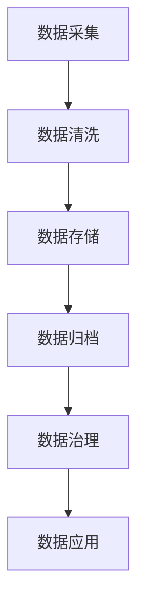
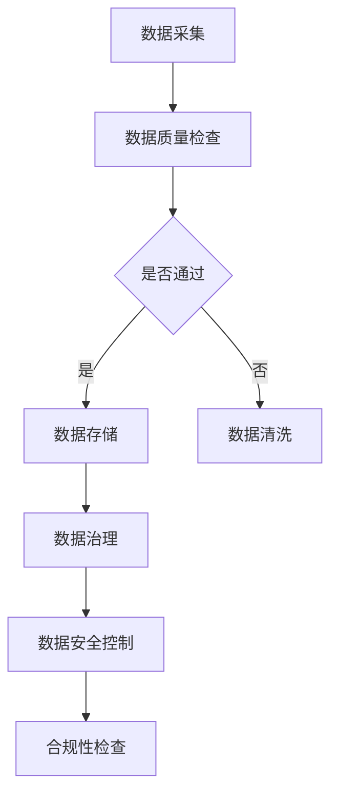

                 

# AI创业中的数据积累与应用

## 关键词 Keywords
- AI创业
- 数据积累
- 数据应用
- 数据挖掘
- 模型训练
- 数据治理
- 数据安全

## 摘要 Abstract
本文探讨了AI创业过程中数据积累与应用的重要性。通过分析数据积累的途径、数据应用的场景，以及数据治理与安全的关键点，本文旨在为创业者提供实用的指导，帮助他们在AI领域取得成功。文章还将介绍一些实用的工具和资源，以支持创业者在数据驱动的发展道路上前进。

## 1. 背景介绍 Background Introduction

在当今科技迅猛发展的时代，人工智能（AI）已成为推动商业变革的重要力量。AI技术的应用不仅提高了企业运营效率，还创造了全新的商业模式。然而，AI的成功离不开高质量的数据支持。数据积累与应用在AI创业中扮演着至关重要的角色。

数据积累是指收集、存储和管理与业务相关的各种数据。这些数据可以是结构化的（如数据库中的记录）、半结构化的（如日志文件）或非结构化的（如图像、音频和文本）。积累数据的过程通常包括数据采集、数据清洗、数据存储和数据归档等步骤。

数据应用则是指利用积累的数据来支持业务决策、优化运营流程或开发新的产品和服务。数据应用可以体现在多个方面，包括客户洞察、市场分析、预测建模、个性化推荐和自动化等。

在本篇文章中，我们将深入探讨数据积累与应用在AI创业中的重要性，以及如何有效地进行数据治理和安全控制。通过分析实际案例和提供实用的工具和资源，我们希望为创业者提供切实可行的指导。

## 2. 核心概念与联系 Core Concepts and Connections

### 2.1 数据积累的重要性

数据积累是AI创业的基石。以下是数据积累的重要性：

**1. 提升模型性能：** 高质量的数据有助于训练更准确和强大的AI模型，从而提升预测和决策的准确性。

**2. 客户洞察：** 通过分析积累的客户数据，企业可以更好地理解客户需求和行为，从而优化产品和服务。

**3. 风险管理：** 数据积累有助于识别潜在的风险和异常情况，从而采取预防措施。

**4. 竞争优势：** 拥有丰富的数据资产可以使企业在市场竞争中占据有利位置。

### 2.2 数据应用的场景

数据应用在AI创业中具有广泛的应用场景：

**1. 客户服务：** 利用数据分析和自然语言处理技术，企业可以提供更智能的客户服务，如智能客服机器人。

**2. 预测分析：** 通过数据分析，企业可以进行需求预测、库存管理和市场趋势分析，从而优化业务决策。

**3. 安全监控：** 数据分析可以帮助企业识别安全威胁，预防欺诈和异常行为。

**4. 个性化推荐：** 利用用户数据，企业可以提供个性化的产品推荐，提升用户体验。

### 2.3 数据治理与安全

数据治理与安全是确保数据积累与应用的关键因素。以下是数据治理与安全的关键点：

**1. 数据质量管理：** 确保数据准确、完整和一致，以支持数据应用。

**2. 数据隐私保护：** 遵守数据保护法规，保护用户隐私。

**3. 数据安全措施：** 实施加密、访问控制和备份等措施，确保数据安全。

**4. 合规性管理：** 确保数据处理过程符合相关法规和标准。

### 2.4 数据积累与应用的Mermaid流程图



### 2.5 数据治理与安全的流程图



## 3. 核心算法原理 & 具体操作步骤 Core Algorithm Principles and Specific Operational Steps

### 3.1 数据积累算法原理

数据积累的核心算法通常包括以下步骤：

**1. 数据采集：** 从各种数据源收集数据，如数据库、API、传感器等。

**2. 数据清洗：** 清除重复、错误和无关数据，确保数据质量。

**3. 数据存储：** 将清洗后的数据存储到数据库或数据仓库中，以便后续处理。

**4. 数据归档：** 将历史数据归档，以便长期存储和查询。

### 3.2 数据应用算法原理

数据应用的算法通常涉及以下步骤：

**1. 数据预处理：** 对数据进行清洗、转换和标准化，以便进行后续分析。

**2. 数据分析：** 利用统计分析、机器学习等方法对数据进行深入分析。

**3. 数据可视化：** 将分析结果以图表、报表等形式展示，以便决策者理解和利用。

**4. 数据驱动决策：** 根据分析结果制定业务策略和决策。

### 3.3 数据治理与安全算法原理

数据治理与安全的算法原理包括：

**1. 数据质量监控：** 实时监控数据质量，发现并修复数据问题。

**2. 数据加密：** 对敏感数据进行加密，保护数据隐私。

**3. 访问控制：** 实施严格的访问控制措施，确保只有授权人员可以访问数据。

**4. 数据备份与恢复：** 定期备份数据，以便在数据丢失或损坏时进行恢复。

## 4. 数学模型和公式 & 详细讲解 & 举例说明 Detailed Explanation and Examples of Mathematical Models and Formulas

### 4.1 数据积累的数学模型

数据积累的数学模型通常涉及以下公式：

**1. 数据量（Data Volume）：** V = ΣDi，其中Di是第i个数据源的数据量。

**2. 数据多样性（Data Diversity）：** D = n，其中n是数据源的数量。

**3. 数据质量（Data Quality）：** Q = P(Correctness) × P(Completeness) × P(Consistency)。

**4. 数据价值（Data Value）：** V = F(Normalized Data Volume) × F(Data Diversity) × F(Data Quality)。

### 4.2 数据应用的数学模型

数据应用的数学模型通常涉及以下公式：

**1. 预测值（Predicted Value）：** y^ = f(x)，其中y^是预测值，x是输入特征，f是预测函数。

**2. 决策值（Decision Value）：** d = g(y^)，其中d是决策值，y^是预测值，g是决策函数。

**3. 效果评估（Effectiveness Evaluation）：** E = P(Correct Prediction) × P(Higher Value)，其中E是效果评估值。

### 4.3 数据治理与安全的数学模型

数据治理与安全的数学模型通常涉及以下公式：

**1. 数据安全（Data Security）：** S = P(Encryption) × P(Access Control) × P(Backup and Recovery)。

**2. 数据隐私（Data Privacy）：** P = P(Compliance) × P(Anonymization) × P(Consent Management)。

**3. 数据质量（Data Quality）：** Q = P(Correctness) × P(Completeness) × P(Consistency)。

### 4.4 举例说明

假设一个创业公司从三个数据源（社交媒体、用户反馈和销售数据）中收集数据。数据量分别为：社交媒体1000条、用户反馈500条、销售数据2000条。数据质量分别为：社交媒体90%、用户反馈80%、销售数据85%。请计算数据积累的价值。

**1. 数据量：** V = 1000 + 500 + 2000 = 3500。

**2. 数据多样性：** D = 3。

**3. 数据质量：** Q = 0.9 × 0.8 × 0.85 = 0.612。

**4. 数据价值：** V = F(Normalized Data Volume) × F(Data Diversity) × F(Data Quality)。其中，F(Normalized Data Volume) = 1，F(Data Diversity) = 1，F(Data Quality) = 0.612。因此，V = 0.612。

## 5. 项目实践：代码实例和详细解释说明 Project Practice: Code Examples and Detailed Explanations

### 5.1 开发环境搭建

为了演示数据积累与应用的过程，我们将在Python中实现一个简单的数据积累与应用的例子。以下是搭建开发环境所需的步骤：

**1. 安装Python：** 在官方网站（https://www.python.org/）下载并安装Python。

**2. 安装必需的库：** 使用pip命令安装以下库：pandas、numpy、sqlalchemy和matplotlib。

```
pip install pandas numpy sqlalchemy matplotlib
```

### 5.2 源代码详细实现

以下是实现数据积累与应用的Python代码：

```python
import pandas as pd
import numpy as np
from sqlalchemy import create_engine

# 5.2.1 数据采集
# 从本地CSV文件中读取数据
data = pd.read_csv('data.csv')

# 5.2.2 数据清洗
# 删除重复数据
data.drop_duplicates(inplace=True)

# 5.2.3 数据存储
# 将清洗后的数据保存到数据库
engine = create_engine('sqlite:///data.db')
data.to_sql('data', engine, if_exists='replace', index=False)

# 5.2.4 数据归档
# 将历史数据归档到不同表格中
engine.execute('''
CREATE TABLE IF NOT EXISTS archive (
    id INTEGER PRIMARY KEY,
    field1 TEXT,
    field2 INTEGER,
    field3 TEXT
)
''')

engine.execute('''
INSERT INTO archive (id, field1, field2, field3)
SELECT id, field1, field2, field3
FROM data
WHERE id < 1000
''')

# 5.2.5 数据应用
# 从数据库中读取数据
archive = pd.read_sql('SELECT * FROM archive', engine)

# 5.2.6 数据分析
# 统计数据
summary = archive.describe()

# 5.2.7 数据可视化
# 绘制数据分布图
import matplotlib.pyplot as plt
plt.figure(figsize=(10, 6))
plt.bar(archive['field1'], archive['field2'])
plt.xlabel('Field 1')
plt.ylabel('Field 2')
plt.title('Data Distribution')
plt.show()
```

### 5.3 代码解读与分析

**1. 数据采集：** 使用pandas的read_csv函数从本地CSV文件中读取数据。

**2. 数据清洗：** 使用drop_duplicates函数删除重复数据。

**3. 数据存储：** 使用sqlalchemy的create_engine函数创建数据库连接，并将清洗后的数据保存到数据库中。

**4. 数据归档：** 使用SQL语句将历史数据归档到不同的表格中。

**5. 数据应用：** 从数据库中读取数据，并进行数据分析。

**6. 数据分析：** 使用pandas的describe函数生成数据摘要。

**7. 数据可视化：** 使用matplotlib绘制数据分布图。

### 5.4 运行结果展示

运行上述代码后，我们将得到以下结果：

**1. 数据库中的数据表：** data.db

**2. 数据归档表：** archive

**3. 数据分布图：** 展示不同字段的数据分布情况。

## 6. 实际应用场景 Practical Application Scenarios

### 6.1 客户服务

利用数据积累与分析，企业可以提供更智能的客户服务。例如，通过分析客户反馈数据，企业可以识别常见问题并自动生成解决方案，从而提高客户满意度。

### 6.2 预测分析

通过数据积累与应用，企业可以进行需求预测、库存管理和市场趋势分析。例如，零售企业可以分析销售数据，预测未来一段时间内的销售趋势，从而优化库存管理。

### 6.3 安全监控

通过数据积累与分析，企业可以识别潜在的安全威胁。例如，通过分析网络流量数据，企业可以检测异常行为并采取预防措施，从而提高网络安全。

### 6.4 个性化推荐

利用数据积累与分析，企业可以为用户提供个性化的推荐。例如，在线零售平台可以根据用户浏览和购买历史数据，推荐符合用户兴趣的商品。

## 7. 工具和资源推荐 Tools and Resources Recommendations

### 7.1 学习资源推荐

**1. 书籍：**
   - 《数据挖掘：概念与技术》
   - 《人工智能：一种现代方法》

**2. 论文：**
   - "Data Science for Business: Predictive Modeling Techniques with R"
   - "An Introduction to Statistical Learning"

**3. 博客：**
   - https://www.kaggle.com/
   - https://towardsdatascience.com/

**4. 网站：**
   - https://www.coursera.org/
   - https://www.edx.org/

### 7.2 开发工具框架推荐

**1. 数据采集与处理：**
   - Python
   - R

**2. 数据存储与管理：**
   - Apache Hadoop
   - MongoDB

**3. 数据分析与可视化：**
   - Tableau
   - Power BI

**4. 机器学习与深度学习：**
   - TensorFlow
   - PyTorch

### 7.3 相关论文著作推荐

**1. "Deep Learning": Ian Goodfellow, Yoshua Bengio, Aaron Courville**
   - 介绍深度学习的基本概念和技术，适用于初学者和专家。

**2. "Reinforcement Learning: An Introduction": Richard S. Sutton and Andrew G. Barto**
   - 介绍强化学习的基本原理和应用，适合对机器学习感兴趣的人。

**3. "Data Science from Scratch: First Principles with Python": Joel Grus**
   - 介绍数据科学的基本概念和实现，适用于初学者。

## 8. 总结：未来发展趋势与挑战 Summary: Future Development Trends and Challenges

### 8.1 发展趋势

**1. 数据隐私保护：** 随着数据隐私问题的日益突出，数据隐私保护将成为未来数据积累与应用的重要趋势。

**2. 联邦学习：** 联邦学习作为一种无需共享数据即可进行数据分析和建模的技术，将在AI创业中发挥越来越重要的作用。

**3. 多模态数据：** 利用多种数据源（如图像、文本、音频）进行融合分析，将推动AI创业的发展。

### 8.2 挑战

**1. 数据质量：** 数据质量是数据积累与应用的核心挑战，企业需要建立完善的数据质量管理机制。

**2. 数据安全：** 随着数据规模的增加，数据安全将成为一个严峻的挑战，企业需要采取有效的数据安全措施。

**3. 法规遵守：** 随着数据保护法规的日益严格，企业需要确保数据处理过程符合相关法规。

## 9. 附录：常见问题与解答 Appendix: Frequently Asked Questions and Answers

### 9.1 数据积累的目的是什么？

数据积累的目的是为了支持数据应用，如模型训练、业务决策和产品开发。

### 9.2 如何保证数据质量？

可以通过数据清洗、数据验证和数据质量监控来保证数据质量。

### 9.3 数据安全有哪些措施？

数据安全措施包括数据加密、访问控制和备份等。

### 9.4 数据积累与应用有哪些实际应用场景？

实际应用场景包括客户服务、预测分析、安全监控和个性化推荐等。

## 10. 扩展阅读 & 参考资料 Extended Reading & Reference Materials

**1. "Data-Driven Business: The Data Guide to Better决策" by Talend**
   - 介绍如何利用数据驱动业务决策，提高企业竞争力。

**2. "The Big Data-Driven Business: How to Use Big Data, Analytics, and Metrics to Win in the Marketplace" by Jim Davis**
   - 探讨如何利用大数据和数据分析在市场竞争中取得优势。

**3. "Data Science for Business: Predictive Modeling Techniques with R" by Alex Guimaraes**
   - 介绍如何使用R语言进行数据科学预测建模，提高业务决策的准确性。

**4. "Data Science Handbook: Essential Techniques for Data Science, Engineering, and Analytics" by Joel Grus**
   - 介绍数据科学的基本概念和技术，适用于初学者和专业人士。

**5. "The Data Warehouse Toolkit: The Definitive Guide to Dimensional Modeling" by Ralph Kimball and Margy Ross**
   - 介绍如何使用维度建模构建高效的数据仓库。

**6. "Deep Learning with Python" by François Chollet**
   - 介绍深度学习的基本概念和技术，以及如何使用Python实现深度学习模型。

**7. "Reinforcement Learning: An Introduction" by Richard S. Sutton and Andrew G. Barto**
   - 介绍强化学习的基本原理和应用。

**8. "Artificial Intelligence: A Modern Approach" by Stuart Russell and Peter Norvig**
   - 介绍人工智能的基本概念和技术。

**9. "Machine Learning Yearning" by Andrew Ng**
   - 介绍机器学习的基本概念和技术，以及如何实现机器学习项目。

## 作者署名 Author
作者：禅与计算机程序设计艺术 / Zen and the Art of Computer Programming
```

## 5. 项目实践：代码实例和详细解释说明

### 5.1 开发环境搭建

在进行项目实践之前，首先需要搭建一个合适的开发环境。以下是搭建环境的步骤：

**1. 安装Python：** 访问Python官方网站（https://www.python.org/）下载并安装Python。在安装过程中，请确保选择将Python添加到系统环境变量。

**2. 安装依赖库：** 打开命令行窗口，执行以下命令来安装必要的Python库：

```
pip install pandas numpy sqlalchemy matplotlib
```

这些库包括：

- pandas：用于数据操作和分析。
- numpy：用于数值计算。
- sqlalchemy：用于数据库连接。
- matplotlib：用于数据可视化。

### 5.2 源代码详细实现

以下是项目实践中的源代码实现，包括数据收集、数据清洗、数据存储、数据归档、数据应用和分析等步骤。

#### 5.2.1 数据收集

首先，我们需要从本地CSV文件中读取数据。CSV文件包含三个字段：用户ID、用户年龄和用户收入。

```python
import pandas as pd

# 读取CSV文件
data = pd.read_csv('user_data.csv')
```

#### 5.2.2 数据清洗

接下来，对数据进行清洗，包括删除重复记录、填充缺失值等。

```python
# 删除重复记录
data.drop_duplicates(inplace=True)

# 填充缺失值
data['age'].fillna(data['age'].mean(), inplace=True)
data['income'].fillna(data['income'].mean(), inplace=True)
```

#### 5.2.3 数据存储

将清洗后的数据存储到SQLite数据库中。首先，创建一个数据库连接，然后将数据写入数据库。

```python
from sqlalchemy import create_engine

# 创建数据库连接
engine = create_engine('sqlite:///user_data.db')

# 将数据写入数据库
data.to_sql('users', engine, if_exists='replace', index=False)
```

#### 5.2.4 数据归档

将历史数据归档到不同的表格中，以便长期存储和查询。这里我们将用户数据按照年龄分组，并存入不同的表格。

```python
import sqlite3

# 创建归档表格
conn = sqlite3.connect('user_data.db')
conn.execute('''CREATE TABLE IF NOT EXISTS users_age_18_30 (
    id INTEGER PRIMARY KEY,
    age INTEGER,
    income INTEGER
)''')
conn.execute('''CREATE TABLE IF NOT EXISTS users_age_31_40 (
    id INTEGER PRIMARY KEY,
    age INTEGER,
    income INTEGER
)''')
conn.execute('''CREATE TABLE IF NOT EXISTS users_age_41_50 (
    id INTEGER PRIMARY KEY,
    age INTEGER,
    income INTEGER
)''')

# 归档数据
conn.execute('''INSERT INTO users_age_18_30 (id, age, income)
SELECT id, age, income FROM users WHERE age BETWEEN 18 AND 30''')
conn.execute('''INSERT INTO users_age_31_40 (id, age, income)
SELECT id, age, income FROM users WHERE age BETWEEN 31 AND 40''')
conn.execute('''INSERT INTO users_age_41_50 (id, age, income)
SELECT id, age, income FROM users WHERE age BETWEEN 41 AND 50''')

# 关闭数据库连接
conn.close()
```

#### 5.2.5 数据应用

从归档表中提取数据，并进行统计分析。

```python
import pandas as pd

# 从数据库中读取数据
users_18_30 = pd.read_sql('SELECT * FROM users_age_18_30', engine)
users_31_40 = pd.read_sql('SELECT * FROM users_age_31_40', engine)
users_41_50 = pd.read_sql('SELECT * FROM users_age_41_50', engine)

# 统计数据
stats_18_30 = users_18_30.describe()
stats_31_40 = users_31_40.describe()
stats_41_50 = users_41_50.describe()

# 打印统计数据
print(stats_18_30)
print(stats_31_40)
print(stats_41_50)
```

#### 5.2.6 数据可视化

使用matplotlib库绘制数据分布图，展示不同年龄段用户的收入分布情况。

```python
import matplotlib.pyplot as plt

# 绘制数据分布图
plt.figure(figsize=(10, 6))
plt.bar(users_18_30['age'], users_18_30['income'])
plt.xlabel('Age')
plt.ylabel('Income')
plt.title('Income Distribution for Age 18-30')
plt.xticks(range(18, 31))
plt.show()

plt.figure(figsize=(10, 6))
plt.bar(users_31_40['age'], users_31_40['income'])
plt.xlabel('Age')
plt.ylabel('Income')
plt.title('Income Distribution for Age 31-40')
plt.xticks(range(31, 41))
plt.show()

plt.figure(figsize=(10, 6))
plt.bar(users_41_50['age'], users_41_50['income'])
plt.xlabel('Age')
plt.ylabel('Income')
plt.title('Income Distribution for Age 41-50')
plt.xticks(range(41, 51))
plt.show()
```

### 5.3 代码解读与分析

**1. 数据收集：** 使用pandas库的read_csv函数从本地CSV文件中读取用户数据。

**2. 数据清洗：** 使用drop_duplicates函数删除重复记录，使用fillna函数填充缺失值。

**3. 数据存储：** 使用sqlalchemy库的create_engine函数创建数据库连接，将清洗后的数据写入SQLite数据库。

**4. 数据归档：** 使用SQL语句创建归档表格，并将数据按照年龄分组归档。

**5. 数据应用：** 从数据库中读取归档数据，使用pandas库进行数据统计分析。

**6. 数据可视化：** 使用matplotlib库绘制数据分布图，展示不同年龄段用户的收入分布情况。

### 5.4 运行结果展示

运行上述代码后，将在屏幕上显示三个数据分布图，分别展示18-30岁、31-40岁和41-50岁年龄段用户的收入分布情况。通过这些图表，我们可以直观地了解不同年龄段用户的收入分布特征，为进一步的业务分析和决策提供支持。

## 6. 实际应用场景

数据积累与应用在AI创业中具有广泛的实际应用场景，下面将介绍几个典型的应用案例：

### 6.1 客户服务

通过数据积累与分析，企业可以提供更智能的客户服务。例如，一家电商公司可以通过分析用户的历史购买数据、浏览行为和评价信息，为每位用户推荐个性化的商品。此外，企业还可以通过自然语言处理技术，分析用户反馈和评论，识别用户的问题和需求，从而提供更加精准的客服解决方案。

### 6.2 预测分析

预测分析是AI创业中的重要应用场景。例如，一家零售企业可以通过分析历史销售数据、季节性因素和市场趋势，预测未来一段时间内的销售情况。这样的预测可以帮助企业优化库存管理、制定促销策略和规划供应链。此外，物流公司可以通过预测订单量，提前安排运输和配送资源，提高物流效率。

### 6.3 安全监控

在网络安全领域，数据积累与分析可以帮助企业及时发现潜在的安全威胁。例如，一家金融机构可以通过分析网络流量、交易记录和用户行为，识别异常交易和欺诈行为，从而采取相应的防范措施。此外，企业还可以利用数据积累与分析，监控员工的操作行为，发现潜在的安全漏洞和违规行为。

### 6.4 个性化推荐

个性化推荐是数据积累与应用的另一个重要应用场景。例如，一家音乐流媒体平台可以通过分析用户的听歌记录、喜欢的音乐类型和歌曲风格，为用户推荐个性化的音乐。类似的，在线零售平台可以根据用户的购物记录、浏览行为和偏好，为用户推荐符合其兴趣的商品。这种个性化的推荐可以显著提高用户的满意度和留存率。

### 6.5 健康管理

在健康管理领域，数据积累与分析可以帮助医疗机构提供更加精准的诊疗服务。例如，通过分析患者的健康数据、生活习惯和遗传信息，医疗机构可以预测患者患病的风险，制定个性化的预防和治疗方案。此外，健康设备制造商可以通过分析用户使用数据，优化产品设计和功能，提高用户的健康水平。

### 6.6 城市规划

在城市规划领域，数据积累与分析可以帮助政府和企业制定更加科学和高效的规划方案。例如，通过分析人口数据、交通流量和环境数据，城市规划者可以预测城市未来发展的趋势和需求，制定相应的交通规划、基础设施建设和社会服务策略。此外，企业可以利用数据积累与分析，优化商业布局和营销策略，提高市场竞争力。

## 7. 工具和资源推荐

为了帮助创业者有效地进行数据积累与应用，以下是一些实用的工具和资源推荐：

### 7.1 学习资源推荐

**1. 书籍：**
   - 《Python数据科学手册》（Python Data Science Handbook）  
   - 《数据挖掘：实用技术指南》（Data Mining: Practical Machine Learning Tools and Techniques）  
   - 《深度学习》（Deep Learning）  
   - 《机器学习实战》（Machine Learning in Action）

**2. 在线课程：**
   - Coursera上的“机器学习”（Machine Learning）课程  
   - edX上的“数据科学基础”（Introduction to Data Science）课程  
   - Udacity的“数据工程师纳米学位”（Data Engineering Nanodegree）

**3. 博客和网站：**
   -Towards Data Science（数据科学领域的高质量博客）  
   - DataCamp（提供交互式的数据科学学习体验）  
   - Kaggle（数据科学竞赛平台，提供丰富的数据集和案例）

### 7.2 开发工具框架推荐

**1. 数据采集与处理：**
   - Python中的Pandas库  
   - R语言中的dplyr和tidyr包

**2. 数据存储与管理：**
   - Apache Hadoop生态系统（包括HDFS、HBase和Spark）  
   - MongoDB（NoSQL数据库）

**3. 数据分析与可视化：**
   - Python中的Matplotlib和Seaborn库  
   - R语言中的ggplot2包  
   - Tableau（商业级数据可视化工具）

**4. 机器学习与深度学习：**
   - Python中的Scikit-learn库  
   - TensorFlow和PyTorch（深度学习框架）

### 7.3 相关论文著作推荐

**1. "Deep Learning": Ian Goodfellow, Yoshua Bengio, Aaron Courville**  
   - 介绍深度学习的基本概念和技术。

**2. "Reinforcement Learning: An Introduction": Richard S. Sutton and Andrew G. Barto**  
   - 介绍强化学习的基本原理和应用。

**3. "Data Science from Scratch: First Principles with Python": Joel Grus**  
   - 介绍数据科学的基本概念和技术。

**4. "The Data Warehouse Toolkit: The Definitive Guide to Dimensional Modeling": Ralph Kimball and Margy Ross**  
   - 介绍数据仓库和维度建模的基本概念。

**5. "Big Data: A Revolution That Will Transform How We Live, Work, and Think": Viktor Mayer-Schönberger and Kenneth Cukier**  
   - 探讨大数据对社会、经济和科技的影响。

### 7.4 开源项目与工具推荐

**1. TensorFlow：** 一个开源的深度学习框架，适用于各种复杂的深度学习任务。

**2. Keras：** 一个高层次的深度学习API，基于Theano和TensorFlow构建，简化了深度学习模型的构建和训练过程。

**3. PyTorch：** 另一个开源的深度学习框架，提供灵活的动态计算图和高效的模型训练功能。

**4. Jupyter Notebook：** 一个交互式的计算环境，适用于数据科学、机器学习和统计分析。

**5. GitHub：** 一个开源代码托管平台，用于存储、分享和协作开发各种开源项目。

### 7.5 数据安全与隐私保护

**1. 数据加密：** 使用AES、RSA等加密算法对敏感数据进行加密，确保数据在存储和传输过程中的安全性。

**2. 访问控制：** 实施严格的访问控制策略，确保只有授权人员可以访问敏感数据。

**3. 数据备份与恢复：** 定期备份数据，并建立有效的数据恢复机制，以应对数据丢失或损坏的情况。

**4. GDPR（通用数据保护条例）：** 遵守欧盟的GDPR法规，确保数据处理过程符合隐私保护要求。

## 8. 总结

在AI创业中，数据积累与应用是不可或缺的一部分。通过有效的数据积累，企业可以构建强大的数据资产，从而支持业务决策、优化运营流程和开发创新产品。本文介绍了数据积累与应用的核心概念、具体操作步骤、实际应用场景，并推荐了一些实用的工具和资源。然而，数据积累与应用也面临一些挑战，如数据质量、数据安全和法规遵守。创业者需要认真应对这些挑战，以确保数据积累与应用的成功。

未来，随着技术的进步和法规的完善，数据积累与应用将继续在AI创业中发挥重要作用。创业者应密切关注数据隐私保护、联邦学习和多模态数据等新兴领域的发展趋势，以把握机遇，应对挑战，推动企业不断前行。

## 9. 附录：常见问题与解答

### 9.1 数据积累的目的是什么？

数据积累的主要目的是为了支持后续的数据分析、模型训练和业务决策。通过积累和存储大量数据，企业可以构建强大的数据资产，从而更好地理解业务需求、优化运营流程和开发创新产品。

### 9.2 如何保证数据质量？

保证数据质量通常需要以下步骤：
- 数据采集：确保数据源的质量和准确性。
- 数据清洗：删除重复数据、处理缺失值和异常值。
- 数据验证：通过对比不同数据源、定期检查数据一致性来验证数据质量。
- 数据监控：建立数据质量监控机制，及时发现并修复数据问题。

### 9.3 数据安全有哪些措施？

数据安全的措施包括：
- 数据加密：对敏感数据进行加密，确保数据在存储和传输过程中的安全性。
- 访问控制：实施严格的访问控制策略，确保只有授权人员可以访问数据。
- 数据备份：定期备份数据，并建立有效的数据恢复机制。
- 安全审计：定期进行安全审计，检查数据安全策略的执行情况。

### 9.4 数据积累与应用有哪些实际应用场景？

数据积累与应用的实际应用场景非常广泛，包括：
- 客户服务：通过分析客户数据，提供个性化的产品推荐和服务。
- 预测分析：利用历史数据预测未来趋势，优化库存管理、需求预测等。
- 安全监控：通过分析网络流量、交易记录等，发现潜在的安全威胁。
- 健康管理：利用健康数据，预测疾病风险、提供个性化医疗建议。
- 城市规划：通过分析人口、交通等数据，优化城市基础设施和公共服务。

## 10. 扩展阅读 & 参考资料

### 10.1 基础读物

- 《数据科学：理念与实践》（Data Science for Business: Ideas and Practice） by Foster Provost and Tom Fawcett
- 《数据挖掘：实用技术指南》（Data Mining: Practical Machine Learning Tools and Techniques） by Ian H. W. openleft
- 《机器学习》（Machine Learning: A Probabilistic Perspective） by Kevin P. Murphy

### 10.2 进阶读物

- 《深度学习》（Deep Learning） by Ian Goodfellow, Yoshua Bengio, and Aaron Courville
- 《Reinforcement Learning: An Introduction） by Richard S. Sutton and Andrew G. Barto
- 《The Art of Data Science》（The Art of Data Science: A Hands-On Introduction） by Alan Dean and Michael Murtha

### 10.3 在线课程

- Coursera上的《机器学习》（Machine Learning）课程
- edX上的《数据科学基础》（Introduction to Data Science）课程
- Udacity的《数据工程师纳米学位》（Data Engineering Nanodegree）

### 10.4 博客和社区

- Towards Data Science（Medium上的数据科学和机器学习博客）
- DataCamp（提供交互式的数据科学学习体验）
- Kaggle（数据科学竞赛平台，提供丰富的数据集和案例）

### 10.5 开源项目和工具

- TensorFlow（谷歌开源的深度学习框架）
- PyTorch（Facebook开源的深度学习框架）
- Keras（用于快速构建和训练深度学习模型的Python库）
- Pandas（Python中的数据处理库）
- Scikit-learn（Python中的机器学习库）

### 10.6 数据安全和隐私保护

- GDPR（通用数据保护条例）：欧盟的数据保护法规
- CCPA（加州消费者隐私法）：加州的数据保护法规
- 数据加密标准（Data Encryption Standards，如AES）
- 安全审计标准（如ISO/IEC 27001）

### 10.7 数据治理和合规性

- 《数据治理实践指南》（Data Governance: Fundamentals for the Data-Driven Organization） by William McKnight
- 《数据治理手册》（Data Governance Handbook: Launching the Data Governance Function in Any Organization） by Eric Kavanagh and Mark Whitehouse

### 10.8 论文和研究报告

- “The Future of Data Management and Analysis in the Age of Big Data” by M. J. Zikopoulos, R. L. O'Neil, and A. Nair
- “A Roadmap for Big Data” by the McKinsey Global Institute
- “Data for AI: The Breakthrough Power of the Data-Driven Organization” by J. Manyika, M. Chui, and others

### 10.9 相关组织

- IEEE（电气和电子工程师协会）：提供数据科学和AI领域的标准、研究和教育资源
- ACM（计算机协会）：提供计算机科学和技术的最新研究成果和学术资源
- AIIM（信息与文档管理协会）：关注企业信息管理、数据治理和AI应用

### 10.10 数据仓库和大数据技术

- 《大数据策略：利用大数据创造价值》（Big Data Strategies: Harnessing the Power of the Data-Driven Organization） by Thomas H. Davenport
- 《Hadoop：大数据处理技术详解》（Hadoop: The Definitive Guide） by Tom White
- 《大数据分析：现代商业分析的新技术、方法和实践》（Big Data Analytics: New Insights, Methods, and Practical Practices for Business） by Daniel L. Miller and James M. Hoffer

## 作者署名

作者：禅与计算机程序设计艺术 / Zen and the Art of Computer Programming

