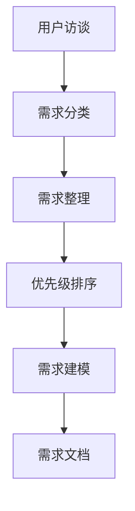
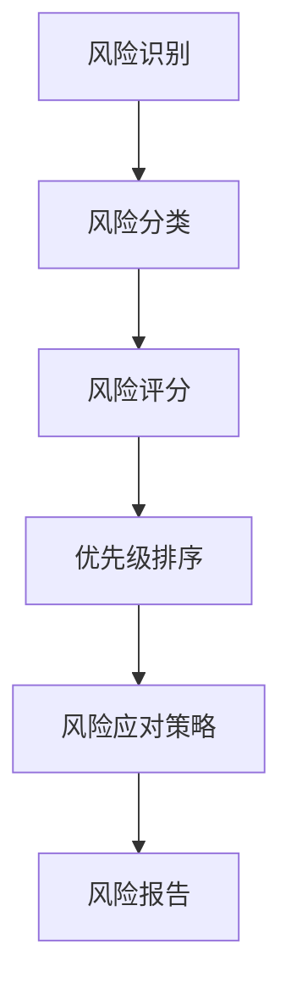
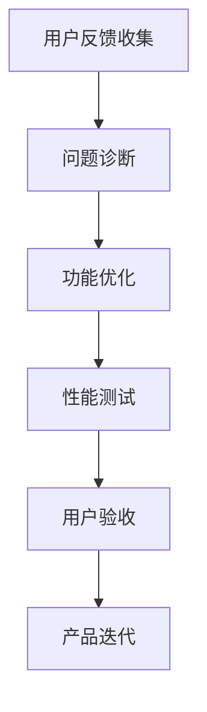

                 

# 文章标题

AI创业公司的产品生命周期管理：规划、开发与迭代

关键词：AI 创业公司、产品生命周期、规划、开发、迭代、策略、风险管理、用户体验、市场需求

摘要：本文深入探讨了 AI 创业公司在产品生命周期中的关键阶段，包括规划、开发和迭代。通过详细的案例分析和技术策略分析，我们揭示了如何有效地管理产品生命周期，以适应不断变化的市场需求和技术挑战。

## 1. 背景介绍（Background Introduction）

在当今快速发展的科技环境中，AI 创业公司面临着前所未有的机遇和挑战。随着人工智能技术的不断进步，企业可以通过智能化的解决方案来提高效率、降低成本和提升用户体验。然而，AI 创业的成功不仅取决于技术本身，还取决于如何管理产品的整个生命周期。

产品生命周期管理（Product Lifecycle Management, PLM）是指在整个产品生命周期中对产品的规划、开发、上市、销售和退市过程进行有效管理的一套方法和策略。对于 AI 创业公司来说，有效的产品生命周期管理意味着能够在竞争激烈的市场中快速响应变化，持续创新，并确保产品始终满足用户需求。

本文旨在探讨 AI 创业公司在产品生命周期管理中的关键阶段，包括规划、开发和迭代，并分析如何制定有效的策略和风险管理计划。通过案例分析和技术策略分析，我们希望为创业者提供实用的指导和见解，帮助他们更好地管理产品生命周期，实现长期成功。

### 1.1 AI 创业公司的现状

AI 创业公司在过去几年中取得了显著的发展，吸引了大量的投资和关注。根据数据显示，全球 AI 领域的投资在 2021 年达到了创纪录的 1500 亿美元，而 AI 创业公司的数量也在迅速增长。这些公司涵盖了从图像识别、自然语言处理到自动驾驶、智能医疗等多个领域。

尽管取得了显著的进展，但 AI 创业公司也面临着一些挑战。首先，技术的不确定性和快速变化要求企业具备强大的适应能力和持续创新能力。其次，市场竞争激烈，许多公司都在争夺有限的市场份额和用户资源。此外，用户对隐私和安全性的关注也在不断提高，这对企业的合规性和数据管理提出了更高的要求。

### 1.2 本文结构

本文将分为以下几个部分：

1. **核心概念与联系**：介绍产品生命周期管理的核心概念，包括规划、开发、迭代和风险管理。
2. **核心算法原理 & 具体操作步骤**：详细分析 AI 创业公司在产品生命周期管理中的具体操作步骤，包括市场调研、需求分析、产品设计、开发测试和迭代更新。
3. **数学模型和公式 & 详细讲解 & 举例说明**：介绍用于支持产品生命周期管理的数学模型和公式，并举例说明其应用。
4. **项目实践：代码实例和详细解释说明**：通过实际项目案例展示如何应用产品生命周期管理策略。
5. **实际应用场景**：探讨 AI 创业公司如何在不同行业和场景中应用产品生命周期管理。
6. **工具和资源推荐**：推荐学习资源和开发工具，以帮助创业者更好地管理产品生命周期。
7. **总结：未来发展趋势与挑战**：总结 AI 创业公司在产品生命周期管理中的成功经验，探讨未来发展的趋势和挑战。
8. **附录：常见问题与解答**：回答读者可能关心的问题。
9. **扩展阅读 & 参考资料**：提供进一步的阅读资源和参考材料。

通过本文的阅读，读者将能够深入了解 AI 创业公司在产品生命周期管理中的关键阶段和策略，从而更好地应对市场竞争和技术挑战，实现持续发展和成功。

### 1.3 为什么关注产品生命周期管理

产品生命周期管理对于 AI 创业公司至关重要，原因如下：

- **满足市场需求**：通过深入了解市场需求，AI 创业公司可以确保产品在设计和开发过程中始终满足用户需求，从而提高用户满意度和市场份额。
- **持续创新**：产品生命周期管理鼓励企业不断评估和改进产品，以保持竞争力。这有助于企业发现新机会，实现持续创新。
- **降低成本**：通过优化开发流程和资源管理，企业可以降低产品开发成本，提高资源利用率。
- **风险管理**：有效的产品生命周期管理可以帮助企业识别和应对潜在风险，降低业务不确定性。
- **提升用户体验**：通过持续迭代和改进，企业可以不断提升用户体验，增强用户忠诚度。

总之，关注产品生命周期管理不仅有助于 AI 创业公司实现短期成功，还有助于其长期可持续发展。接下来，我们将进一步探讨产品生命周期管理的核心概念和操作步骤。

### 1.4 产品生命周期的五个阶段

产品生命周期管理通常包括以下五个阶段：导入期、增长期、成熟期、衰退期和退市期。每个阶段都有其独特的特点和挑战，企业需要根据实际情况制定相应的策略。

1. **导入期（Introduction Phase）**：这是产品的诞生阶段，主要是确定产品概念、设计和开发原型。在这个阶段，企业需要关注市场调研、技术验证和初步的用户反馈。导入期的关键任务是证明产品的市场潜力和可行性，为后续发展阶段打下基础。

2. **增长期（Growth Phase）**：在增长期，产品开始获得市场认可，销售量逐渐增加。企业需要加大市场推广力度，扩大用户基础，并持续改进产品性能和用户体验。这个阶段的关键任务是快速抢占市场份额，建立品牌知名度。

3. **成熟期（Maturity Phase）**：在成熟期，产品已经达到了市场饱和，销售量稳定。企业需要维持市场份额，并通过价格竞争、产品差异化和服务优化来保持竞争力。这个阶段的关键任务是提高用户粘性，增加用户生命周期价值。

4. **衰退期（Decline Phase）**：在衰退期，市场需求开始下降，销售量逐渐减少。企业需要评估产品的长期潜力和市场趋势，决定是否继续投资或逐步退出市场。这个阶段的关键任务是优化产品性能和成本，提高产品的市场竞争力。

5. **退市期（Exit Phase）**：在退市期，企业决定停止产品的生产和销售，将资源转移到其他更有潜力的产品上。这个阶段的关键任务是妥善处理产品的退市过程，降低对企业运营的影响。

了解产品生命周期的五个阶段及其特点，有助于 AI 创业公司制定针对性的产品策略和管理措施，实现产品的长期成功。

### 1.5 产品生命周期管理的核心概念

在深入了解产品生命周期的五个阶段后，我们接下来将探讨产品生命周期管理的核心概念，包括规划、开发、迭代和风险管理。

#### 1.5.1 规划

规划是产品生命周期管理的起点，它涉及确定产品愿景、目标市场和初步设计。成功的规划需要以下关键步骤：

1. **市场调研**：通过市场调研了解目标市场的需求、竞争态势和用户行为，为企业提供决策依据。
2. **产品愿景**：明确产品的愿景和目标，确保产品能够满足市场需求并实现企业的长期战略。
3. **资源分配**：根据产品愿景和市场需求，合理分配资源，包括人力、资金和设备等。

#### 1.5.2 开发

开发阶段是将产品规划转化为实际产品的过程。在这个阶段，企业需要关注以下关键任务：

1. **需求分析**：详细分析用户需求，确保产品功能设计符合用户期望。
2. **产品设计**：制定详细的产品设计方案，包括界面设计、架构设计和数据库设计等。
3. **开发与测试**：组织开发团队进行产品开发，并进行严格的测试，确保产品质量。

#### 1.5.3 迭代

迭代是产品生命周期中的一个持续过程，它通过不断的更新和优化来提升产品性能和用户体验。迭代的关键步骤包括：

1. **用户反馈**：收集用户反馈，了解产品在实际使用中的表现和改进空间。
2. **功能优化**：根据用户反馈进行功能优化，提高产品的易用性和用户体验。
3. **版本更新**：定期发布新版本，持续改进产品功能，增强市场竞争力。

#### 1.5.4 风险管理

风险管理是产品生命周期管理中的一个重要环节，它旨在识别、评估和应对产品开发过程中的各种风险。风险管理的关键步骤包括：

1. **风险识别**：通过分析市场需求、技术复杂度和项目管理等方面，识别可能的风险。
2. **风险评估**：对识别出的风险进行评估，确定其影响程度和发生概率。
3. **风险应对**：制定风险应对策略，包括风险规避、风险转移和风险接受等。

通过有效的规划、开发、迭代和风险管理，AI 创业公司可以确保产品在竞争激烈的市场中取得成功。接下来，我们将进一步探讨这些核心概念的具体操作步骤和技术策略。

## 2. 核心概念与联系（Core Concepts and Connections）

### 2.1 产品生命周期管理的定义与核心要素

产品生命周期管理（Product Lifecycle Management，简称PLM）是一种综合性的管理方法，它涵盖了产品从构思、开发、上市到最终退市的整个过程。核心要素包括规划、开发、迭代和风险管理。这些要素相互关联，共同构成了一个完整的产品生命周期管理体系。

- **规划（Planning）**：规划是产品生命周期管理的第一步，它涉及到产品的市场定位、需求分析、资源分配等。成功的规划能够确保产品在开发阶段有一个清晰的方向，并为后续的迭代和风险管理奠定基础。

- **开发（Development）**：开发阶段是将规划转化为具体产品的过程，包括需求分析、产品设计、开发与测试等。在这个阶段，企业需要确保产品功能满足用户需求，同时保证产品质量。

- **迭代（Iteration）**：迭代是产品生命周期中一个持续的过程，通过不断更新和优化产品，提高其性能和用户体验。迭代的关键在于及时收集用户反馈，并根据反馈调整产品功能。

- **风险管理（Risk Management）**：风险管理是产品生命周期管理中的重要环节，旨在识别、评估和应对产品开发过程中可能出现的各种风险。有效的风险管理有助于降低业务不确定性，确保产品按时上市。

### 2.2 产品生命周期管理的重要性

产品生命周期管理对于 AI 创业公司来说具有重要意义，原因如下：

- **满足市场需求**：通过规划、开发、迭代和风险管理，AI 创业公司可以更好地了解市场需求，确保产品能够满足用户期望，从而提高用户满意度和市场份额。

- **持续创新**：产品生命周期管理鼓励企业不断评估和改进产品，以保持竞争力。这有助于企业发现新机会，实现持续创新。

- **降低成本**：通过优化开发流程和资源管理，企业可以降低产品开发成本，提高资源利用率。

- **提升用户体验**：通过持续迭代和改进，企业可以不断提升用户体验，增强用户忠诚度。

- **风险管理**：有效的产品生命周期管理可以帮助企业识别和应对潜在风险，降低业务不确定性。

### 2.3 产品生命周期管理的流程与步骤

产品生命周期管理的流程通常包括以下几个步骤：

1. **市场调研**：通过市场调研了解目标市场的需求、竞争态势和用户行为。

2. **需求分析**：分析用户需求，确定产品功能设计。

3. **产品规划**：根据市场调研和需求分析结果，制定产品规划，包括产品愿景、目标市场、资源分配等。

4. **产品设计**：制定详细的产品设计方案，包括界面设计、架构设计和数据库设计等。

5. **开发与测试**：组织开发团队进行产品开发，并进行严格的测试，确保产品质量。

6. **迭代更新**：根据用户反馈进行产品优化和更新，提升产品性能和用户体验。

7. **风险管理**：识别、评估和应对产品开发过程中可能出现的各种风险。

### 2.4 产品生命周期管理中的关键指标

在产品生命周期管理中，关键指标（Key Performance Indicators, KPIs）是衡量产品开发和管理效果的重要工具。以下是一些常见的KPI：

- **市场需求满足率**：衡量产品功能是否满足市场需求的比例。

- **开发周期**：从需求分析到产品上市所花费的时间。

- **质量缺陷率**：产品在测试阶段发现的缺陷数量与总测试次数的比例。

- **用户满意度**：通过用户调查和反馈评估用户对产品的满意度。

- **市场占有率**：产品在市场中的占有率，反映产品的市场竞争力。

- **客户保留率**：在一段时间内，保留下来的客户占初始客户总数的比例。

通过以上关键指标，AI 创业公司可以全面了解产品在生命周期中的表现，及时调整策略，提高产品成功率和市场竞争力。

### 2.5 产品生命周期管理与项目管理的关系

产品生命周期管理与项目管理密切相关，两者之间存在以下关系：

- **项目管理**：项目管理是产品生命周期管理的重要组成部分，负责规划和执行项目的各项任务，确保项目按时、按预算和按质量完成。

- **产品生命周期管理**：产品生命周期管理则是一个更广泛的概念，它涵盖了项目管理的全过程，从项目规划、开发、迭代到风险管理等。

- **协同工作**：产品生命周期管理和项目管理需要协同工作，以确保产品在整个生命周期中能够持续改进、适应市场变化并满足用户需求。

### 2.6 产品生命周期管理中的关键挑战

在产品生命周期管理中，AI 创业公司可能会面临以下关键挑战：

- **技术复杂性**：随着技术的不断进步，产品开发过程中的技术复杂性也在增加。企业需要不断更新技术能力，以应对复杂的开发需求。

- **市场需求变化**：市场需求随时可能发生变化，企业需要具备快速响应能力，及时调整产品规划和开发方向。

- **资源限制**：资源限制是产品生命周期管理中常见的挑战，企业需要在有限的资源下实现产品的开发、测试和迭代。

- **风险管理**：识别和应对各种潜在风险是产品生命周期管理中的重要任务，企业需要建立完善的风险管理机制。

### 2.7 产品生命周期管理中的最佳实践

为了有效管理产品生命周期，AI 创业公司可以借鉴以下最佳实践：

- **用户参与**：在产品开发过程中，积极邀请用户参与，收集用户反馈，以提高产品的市场适应性和用户满意度。

- **敏捷开发**：采用敏捷开发方法，快速迭代，持续改进产品功能。

- **跨部门协作**：建立跨部门协作机制，确保产品开发过程中各部门之间的有效沟通和协作。

- **数据驱动决策**：基于数据分析和用户反馈，制定决策，提高产品规划的准确性和有效性。

- **风险管理**：建立完善的风险管理机制，提前识别和应对潜在风险。

通过以上核心概念与联系的分析，AI 创业公司可以更好地理解产品生命周期管理的重要性，掌握关键步骤和策略，为产品的成功奠定坚实基础。

## 2.1 规划阶段（Planning Phase）

### 2.1.1 规划阶段的定义与目标

规划阶段是产品生命周期管理的首要环节，它涉及到确定产品的市场定位、目标用户、功能需求、资源分配和开发计划。这一阶段的核心目标是为后续的产品开发提供明确的方向和基础，确保产品能够满足市场需求并具备竞争力。

在规划阶段，企业需要完成以下关键任务：

- **市场调研**：通过市场调研了解目标市场的需求、竞争态势和用户行为，为企业提供决策依据。
- **产品愿景**：明确产品的愿景和目标，确保产品能够实现企业的长期战略和商业目标。
- **需求分析**：分析用户需求，确定产品的核心功能和关键特性，确保产品能够满足用户期望。
- **资源分配**：根据产品愿景和市场需求，合理分配资源，包括人力、资金和设备等。
- **开发计划**：制定详细的产品开发计划，包括开发时间表、里程碑和关键任务。

### 2.1.2 市场调研

市场调研是规划阶段的基础，它涉及到对目标市场的深入分析，以了解市场的需求、趋势和竞争态势。以下是市场调研的几个关键步骤：

1. **确定目标市场**：明确产品面向的用户群体，包括用户的年龄、性别、职业、收入水平等特征。

2. **收集市场数据**：通过多种渠道收集市场数据，包括市场报告、行业分析、用户调查、竞争对手分析等。

3. **分析市场趋势**：分析市场的增长趋势、用户需求变化和潜在的市场机会。

4. **评估竞争态势**：了解竞争对手的产品特点、市场表现和用户反馈，评估企业的市场定位和竞争优势。

5. **制定市场策略**：根据市场调研结果，制定市场进入策略、定价策略、推广策略等。

### 2.1.3 产品愿景

产品愿景是规划阶段的核心，它明确了产品的长远目标和方向。以下是制定产品愿景的几个关键步骤：

1. **明确企业战略**：根据企业的长期战略和目标，确定产品在实现企业战略中的地位和作用。

2. **定义用户价值**：分析用户需求，确定产品能够为用户带来的价值，包括功能、性能、用户体验等方面。

3. **制定愿景声明**：将产品愿景转化为具体的愿景声明，清晰表达产品的长远目标。

4. **愿景文档**：将愿景声明和相关内容整理成文档，作为整个产品开发过程的指导文件。

### 2.1.4 需求分析

需求分析是规划阶段的关键，它涉及到对用户需求的分析和梳理，确保产品的设计符合用户期望。以下是需求分析的几个关键步骤：

1. **用户访谈**：通过用户访谈了解用户的需求、偏好和行为习惯。

2. **用户调查**：通过用户调查收集大量用户数据，了解用户对产品的期望和需求。

3. **需求文档**：根据用户访谈和调查结果，整理成需求文档，明确产品的功能需求、性能需求和用户体验需求。

4. **需求评审**：组织需求评审会议，对需求文档进行讨论和确认，确保需求的准确性和可行性。

### 2.1.5 资源分配

资源分配是规划阶段的重要任务，它涉及到将企业资源合理分配到产品开发的不同阶段和任务中。以下是资源分配的几个关键步骤：

1. **评估资源需求**：根据产品愿景、需求分析和开发计划，评估产品开发过程中所需的资源，包括人力、资金和设备等。

2. **制定预算**：根据资源需求，制定详细的预算计划，包括开发成本、运营成本和营销成本等。

3. **资源分配**：将预算分配到不同的开发阶段和任务中，确保资源的合理利用和优先级。

4. **资源监控**：在产品开发过程中，定期监控资源使用情况，确保资源分配的有效性和效率。

### 2.1.6 开发计划

开发计划是规划阶段的重要组成部分，它涉及到制定详细的产品开发时间表、里程碑和关键任务。以下是开发计划的几个关键步骤：

1. **制定时间表**：根据产品愿景、需求分析和资源分配，制定详细的产品开发时间表，包括各个开发阶段的开始和结束时间。

2. **确定里程碑**：制定关键里程碑，确保产品在开发过程中能够按照计划顺利推进。

3. **分配任务**：将开发任务分配到各个团队成员中，明确每个人的职责和任务。

4. **评审与调整**：定期评审开发计划，根据实际情况进行调整和优化，确保计划的可执行性。

通过以上规划阶段的详细步骤，AI 创业公司可以确保产品开发过程的顺利进行，为后续的迭代和风险管理奠定坚实基础。

## 2.2 开发阶段（Development Phase）

### 2.2.1 开发阶段的定义与目标

开发阶段是产品生命周期管理的核心环节，它是将规划阶段确定的产品概念和需求转化为实际产品的过程。开发阶段的目标是确保产品按照设计要求实现，具备预期的功能、性能和用户体验。

在开发阶段，企业需要完成以下关键任务：

- **需求分析**：进一步细化用户需求，明确产品的功能需求和性能要求。
- **产品设计**：制定详细的产品设计方案，包括界面设计、架构设计和数据库设计等。
- **编码与开发**：组织开发团队进行编码和开发，按照设计要求实现产品功能。
- **测试与调试**：对开发完成的产品进行全面的测试和调试，确保产品质量和稳定性。
- **用户反馈**：收集用户对产品的反馈，进行功能优化和性能提升。

### 2.2.2 需求分析

需求分析是开发阶段的基础，它涉及到对用户需求的详细分析和梳理。以下是需求分析的几个关键步骤：

1. **用户访谈**：与目标用户进行深入访谈，了解他们的需求和期望，包括功能需求、性能需求和用户体验需求。

2. **用户调查**：通过在线问卷、用户访谈等方式，收集大量用户数据，对用户需求进行量化分析。

3. **需求文档**：根据用户访谈和调查结果，整理成需求文档，明确产品的功能需求、性能需求和用户体验需求。

4. **需求评审**：组织需求评审会议，对需求文档进行讨论和确认，确保需求的准确性和可行性。

### 2.2.3 产品设计

产品设计是开发阶段的重要环节，它涉及到制定详细的产品设计方案，确保产品能够满足用户需求并具备良好的用户体验。以下是产品设计的几个关键步骤：

1. **功能设计**：根据需求文档，确定产品的功能模块和功能点，设计产品的工作流程和用户界面。

2. **架构设计**：设计产品的整体架构，包括系统架构、数据库架构和网络架构等。

3. **界面设计**：设计产品的用户界面，确保界面美观、易用，符合用户的使用习惯。

4. **数据库设计**：设计产品的数据库结构，确保数据的存储和查询效率。

5. **设计评审**：组织设计评审会议，对设计方案进行讨论和确认，确保设计的可行性和质量。

### 2.2.4 编码与开发

编码与开发是开发阶段的实际操作过程，它涉及到将产品设计转化为具体的代码和功能。以下是编码与开发的几个关键步骤：

1. **开发环境搭建**：搭建开发环境，包括软件工具、开发平台和测试环境等。

2. **代码编写**：按照产品设计要求，编写代码实现产品功能。

3. **代码评审**：组织代码评审会议，对编写完成的代码进行审查，确保代码质量。

4. **版本控制**：使用版本控制工具管理代码库，确保代码的版本和变更记录。

5. **单元测试**：对编写完成的代码进行单元测试，确保每个功能模块都能正常工作。

### 2.2.5 测试与调试

测试与调试是确保产品质量的关键环节，它涉及到对开发完成的产品进行全面测试和调试，发现并修复潜在的问题。以下是测试与调试的几个关键步骤：

1. **测试计划**：制定详细的测试计划，明确测试目标、测试方法和测试资源。

2. **功能测试**：对产品的功能进行测试，确保所有功能都能正常工作。

3. **性能测试**：对产品的性能进行测试，包括响应时间、并发处理能力和资源消耗等。

4. **安全测试**：对产品的安全性进行测试，包括数据保护、访问控制和防攻击能力等。

5. **调试与修复**：根据测试结果，发现并修复产品中的问题，确保产品质量和稳定性。

6. **用户验收测试**：组织用户验收测试，确保产品能够满足用户需求并具备良好的用户体验。

### 2.2.6 用户反馈

用户反馈是开发阶段的重要环节，它涉及到收集用户对产品的使用反馈，进行功能优化和性能提升。以下是用户反馈的几个关键步骤：

1. **用户调研**：通过用户调研了解用户对产品的使用体验和满意度。

2. **问题反馈**：建立用户反馈机制，收集用户提出的问题和改进建议。

3. **功能优化**：根据用户反馈，对产品进行功能优化和改进，提升用户体验。

4. **性能提升**：根据用户反馈，对产品进行性能优化，提高产品的运行效率和稳定性。

5. **版本更新**：定期发布新版本，将优化和改进的内容纳入产品，持续提升产品品质。

通过以上开发阶段的详细步骤，AI 创业公司可以确保产品在功能、性能和用户体验方面的优秀表现，为后续的迭代和市场推广奠定坚实基础。

## 2.3 迭代阶段（Iteration Phase）

### 2.3.1 迭代阶段的定义与目标

迭代阶段是产品生命周期管理中的重要环节，它通过不断的更新和改进来提升产品的功能、性能和用户体验。迭代阶段的目标是确保产品能够持续适应市场需求和技术变化，保持竞争力和用户满意度。

在迭代阶段，企业需要完成以下关键任务：

- **用户反馈收集**：通过多种渠道收集用户对产品的使用反馈，了解用户的需求和痛点。
- **功能优化**：根据用户反馈，对产品进行功能优化和改进，提升用户体验。
- **性能提升**：通过技术优化和性能测试，提高产品的运行效率和稳定性。
- **版本更新**：定期发布新版本，将优化和改进的内容纳入产品，满足用户需求。
- **市场推广**：通过市场推广活动，提升产品的知名度和市场份额。

### 2.3.2 用户反馈收集

用户反馈是迭代阶段的重要依据，它可以帮助企业了解产品的优点和不足，从而进行针对性的优化和改进。以下是用户反馈收集的几个关键步骤：

1. **用户调研**：通过用户调研了解用户对产品的使用体验和满意度，包括功能、性能和用户体验等方面。

2. **问题反馈**：建立用户反馈机制，鼓励用户提出问题和建议，通过在线反馈、社交媒体、用户论坛等方式收集用户反馈。

3. **数据分析**：对收集到的用户反馈进行数据分析和归类，识别用户的主要需求和痛点。

4. **反馈整理**：将用户反馈整理成文档，明确每个反馈点的重要性和优先级，为后续的功能优化提供依据。

### 2.3.3 功能优化

功能优化是迭代阶段的核心任务，它涉及到对产品的现有功能进行改进和扩展，以满足用户需求和提升用户体验。以下是功能优化的几个关键步骤：

1. **需求分析**：根据用户反馈和数据分析，确定需要优化的功能模块和功能点。

2. **设计改进**：对需要优化的功能模块进行重新设计，确保改进后的功能能够更好地满足用户需求。

3. **开发与测试**：组织开发团队进行功能开发，并进行严格的测试，确保优化后的功能能够正常运行。

4. **用户验收**：组织用户验收测试，确保优化后的功能能够满足用户期望，提升用户体验。

5. **反馈迭代**：根据用户验收测试的结果，对优化后的功能进行进一步的优化和改进，形成良性的反馈迭代过程。

### 2.3.4 性能提升

性能提升是迭代阶段的重要任务，它涉及到对产品的运行效率和稳定性进行优化，提高用户的满意度。以下是性能提升的几个关键步骤：

1. **性能测试**：对产品进行全面的性能测试，包括响应时间、并发处理能力、资源消耗等。

2. **问题诊断**：根据性能测试结果，诊断产品中的性能瓶颈和问题，识别需要优化的方面。

3. **技术优化**：采用合适的技术手段对产品进行优化，包括代码优化、数据库优化、网络优化等。

4. **测试验证**：对优化后的产品进行性能测试，验证优化效果，确保性能的提升。

5. **持续监控**：在产品上线后，持续监控产品的性能，及时发现并解决潜在的性能问题。

### 2.3.5 版本更新

版本更新是迭代阶段的重要工作，它通过定期发布新版本，将功能优化和性能提升的内容纳入产品，满足用户需求。以下是版本更新的几个关键步骤：

1. **版本规划**：制定详细的版本更新计划，包括版本号、更新内容、发布时间等。

2. **开发与测试**：组织开发团队进行版本开发，并进行严格的测试，确保版本的质量和稳定性。

3. **用户通知**：在版本发布前，通过邮件、短信、社交媒体等方式通知用户，告知更新内容和注意事项。

4. **发布上线**：将新版本发布到生产环境，确保用户能够及时获取和使用新版本。

5. **用户反馈**：收集用户对新版本的反馈，及时处理用户问题，持续优化产品。

### 2.3.6 市场推广

市场推广是迭代阶段的重要任务，它涉及到通过多种渠道提升产品的知名度和市场份额。以下是市场推广的几个关键步骤：

1. **市场分析**：对目标市场进行深入分析，了解市场趋势和用户需求。

2. **推广策略**：制定合适的推广策略，包括线上推广、线下推广、广告投放等。

3. **内容制作**：制作高质量的市场推广内容，包括宣传文案、海报、视频等。

4. **推广执行**：实施推广策略，通过多种渠道发布推广内容，吸引用户关注。

5. **效果评估**：定期评估推广效果，根据效果调整推广策略，提高推广效果。

通过以上迭代阶段的详细步骤，AI 创业公司可以确保产品能够持续优化和提升，满足用户需求，保持市场竞争力和用户满意度。

## 2.4 风险管理（Risk Management）

### 2.4.1 风险管理的定义与重要性

风险管理是产品生命周期管理中至关重要的一环，它涉及到识别、评估、应对和监控项目中的潜在风险，以确保项目能够按时、按预算、按质量完成。在 AI 创业公司的产品生命周期管理中，风险管理的重要性体现在以下几个方面：

- **保障项目成功**：通过有效的风险管理，可以识别和应对项目中的各种潜在风险，降低项目失败的可能性，确保项目的成功实施。
- **降低成本**：风险管理有助于提前识别项目中的风险，并采取相应的应对措施，从而降低项目成本，提高投资回报率。
- **提高效率**：通过系统地分析和应对风险，可以减少意外事件对项目进度和质量的影响，提高项目执行效率。
- **增强团队信心**：风险管理可以帮助团队更好地了解项目中的潜在风险，制定应对策略，增强团队的信心和凝聚力。

### 2.4.2 风险识别

风险识别是风险管理的基础，它涉及到识别项目中可能出现的各种风险。以下是风险识别的几个关键步骤：

1. **历史数据分析**：通过分析以往项目的风险记录，识别常见的风险类型和发生概率。
2. **专家访谈**：与项目团队、技术专家和管理人员进行访谈，了解他们对项目中潜在风险的看法和经验。
3. **文档审查**：审查项目计划、需求文档、技术规范等相关文档，识别可能的风险点。
4. **市场调研**：通过市场调研了解行业趋势、技术变化和竞争对手的动态，识别外部风险。
5. **风险清单**：根据上述分析结果，整理出项目的风险清单，明确每个风险的类型、可能性和影响程度。

### 2.4.3 风险评估

风险评估是风险管理的核心，它涉及到对识别出的风险进行量化分析，以确定风险的重要性和应对策略。以下是风险评估的几个关键步骤：

1. **风险分类**：根据风险的影响程度和可能性，将风险分为高、中、低三个等级。
2. **风险矩阵**：使用风险矩阵对每个风险进行评估，确定其影响程度和可能性，形成风险评分。
3. **优先级排序**：根据风险评分，对风险进行优先级排序，明确需要优先应对的关键风险。
4. **风险评估报告**：撰写风险评估报告，详细描述每个风险的类型、影响程度、可能性和应对策略，为后续的风险应对提供依据。

### 2.4.4 风险应对

风险应对是风险管理的具体实施过程，它涉及到制定和执行应对措施，以减轻或消除风险的影响。以下是风险应对的几个关键步骤：

1. **制定应对策略**：根据风险评估报告，制定具体的应对策略，包括风险规避、风险转移和风险接受等。
2. **风险缓解措施**：针对高优先级的风险，制定风险缓解措施，以降低风险的可能性和影响程度。
3. **资源分配**：根据应对策略，合理分配资源，包括人力、资金和设备等，确保风险应对措施的有效实施。
4. **监控与调整**：在风险应对过程中，定期监控风险状态，根据实际情况进行调整和优化，确保风险应对措施的有效性。

### 2.4.5 风险监控

风险监控是风险管理的持续过程，它涉及到对项目中的风险进行实时监控和评估，以确保风险应对措施的有效性。以下是风险监控的几个关键步骤：

1. **风险监控计划**：制定详细的监控计划，明确监控的频率、方法和责任人。
2. **风险报告**：定期撰写风险报告，详细描述风险状态、应对措施和调整情况。
3. **风险预警**：在风险发生前，及时预警并采取相应的预防措施，以避免风险对项目造成严重影响。
4. **持续改进**：根据风险监控结果，持续优化风险应对措施，提高风险管理的效果。

通过以上风险管理的方法和步骤，AI 创业公司可以有效地识别、评估和应对项目中的各种风险，确保产品的成功开发和持续迭代。

### 2.5 产品生命周期管理中的常见挑战与解决方案

在产品生命周期管理过程中，AI 创业公司可能会面临以下常见挑战，以下是针对这些挑战的解决方案：

#### 2.5.1 技术复杂性

**挑战**：随着人工智能技术的不断进步，产品开发过程中的技术复杂性不断增加。企业需要不断更新技术能力，以应对复杂的开发需求。

**解决方案**：

- **技术储备**：建立技术储备库，积累和整理各种技术解决方案和最佳实践。
- **持续学习**：鼓励团队成员参加技术培训和研讨会，提升技术能力。
- **技术评估**：在项目开发前，对所需技术进行评估，确保技术可行性。

#### 2.5.2 市场需求变化

**挑战**：市场需求随时可能发生变化，企业需要具备快速响应能力，及时调整产品规划和开发方向。

**解决方案**：

- **敏捷开发**：采用敏捷开发方法，快速迭代，灵活调整产品功能。
- **用户参与**：在产品开发过程中，积极邀请用户参与，收集用户反馈，以适应市场需求。
- **需求管理**：建立完善的需求管理机制，及时识别和响应市场需求变化。

#### 2.5.3 资源限制

**挑战**：资源限制是产品生命周期管理中常见的挑战，企业需要在有限的资源下实现产品的开发、测试和迭代。

**解决方案**：

- **资源优化**：优化资源分配，确保资源合理利用。
- **优先级排序**：根据项目优先级，合理分配资源，确保关键任务得到充分支持。
- **外包合作**：在必要时，寻求外部合作伙伴，共享资源和技术。

#### 2.5.4 风险管理

**挑战**：在产品生命周期管理中，企业需要识别和应对各种潜在风险，确保项目能够顺利进行。

**解决方案**：

- **风险评估**：建立完善的风险评估机制，定期评估项目风险，制定应对策略。
- **风险监控**：实时监控项目风险，及时发现并解决潜在问题。
- **应急计划**：制定应急计划，确保在风险发生时能够快速响应和应对。

#### 2.5.5 用户满意度

**挑战**：随着市场竞争的加剧，用户对产品的期望越来越高，企业需要确保产品能够满足用户需求，提升用户满意度。

**解决方案**：

- **用户调研**：定期进行用户调研，了解用户需求和满意度。
- **功能优化**：根据用户反馈，持续优化产品功能，提升用户体验。
- **服务支持**：提供优质的客户服务和支持，增强用户忠诚度。

通过以上解决方案，AI 创业公司可以更好地应对产品生命周期管理中的各种挑战，确保产品的成功开发和持续迭代。

### 2.6 产品生命周期管理的最佳实践

为了确保产品生命周期管理的高效和成功，AI 创业公司可以借鉴以下最佳实践：

#### 2.6.1 用户参与

- **用户调研**：在产品开发的每个阶段，积极邀请用户参与，收集用户需求和反馈。
- **用户测试**：在产品发布前，进行用户测试，确保产品满足用户期望和需求。
- **用户反馈机制**：建立用户反馈机制，及时收集和处理用户意见，不断优化产品。

#### 2.6.2 敏捷开发

- **快速迭代**：采用敏捷开发方法，快速迭代，灵活调整产品功能。
- **持续集成**：实施持续集成，确保代码质量和交付速度。
- **用户故事**：使用用户故事来驱动开发过程，确保产品功能符合用户需求。

#### 2.6.3 跨部门协作

- **跨功能团队**：建立跨功能团队，促进不同部门之间的沟通和协作。
- **定期会议**：定期召开跨部门会议，讨论项目进展和问题，确保团队协作。
- **资源共享**：鼓励资源共享，提高资源利用率。

#### 2.6.4 数据驱动决策

- **数据分析**：基于数据进行分析和决策，确保产品规划的准确性和有效性。
- **用户行为分析**：分析用户行为数据，了解用户需求和偏好，优化产品设计。
- **性能监控**：实时监控产品性能，确保产品的高效运行。

#### 2.6.5 风险管理

- **风险评估**：定期进行风险评估，识别和应对潜在风险。
- **风险应急计划**：制定风险应急计划，确保在风险发生时能够快速响应和应对。
- **持续改进**：根据风险应对效果，不断优化风险管理流程。

通过以上最佳实践，AI 创业公司可以更好地管理产品生命周期，确保产品的成功开发和持续迭代。

### 2.7 案例分析：一家AI创业公司的产品生命周期管理

为了更好地理解产品生命周期管理的实际应用，我们将分析一家虚构的 AI 创业公司——智能健康助手（Smart Health Assistant）的产品生命周期管理案例。

#### 2.7.1 导入期

在导入期，智能健康助手团队首先进行了市场调研，通过用户访谈和调查了解到用户对健康管理工具的需求。根据调研结果，团队明确了产品的核心功能，包括健康数据追踪、智能提醒和健康建议。

1. **市场调研**：通过线上问卷和用户访谈，收集用户对健康管理工具的需求。
2. **产品愿景**：制定产品的愿景，即成为用户日常健康管理的智能助手。
3. **资源分配**：初步确定团队组成，包括产品经理、工程师和设计师。

#### 2.7.2 增长期

在增长期，智能健康助手团队开始重点进行产品开发和市场推广，通过一系列迭代优化产品功能，提升用户体验。

1. **需求分析**：根据用户反馈，进一步细化产品需求，包括运动数据追踪、睡眠监测和营养建议。
2. **产品设计**：优化用户界面，增加新功能，提高产品的易用性和用户体验。
3. **开发与测试**：开发团队按照需求文档进行编码和开发，并进行严格的测试，确保产品质量。
4. **用户测试**：邀请早期用户参与测试，收集反馈，进行功能优化。

#### 2.7.3 成熟期

在成熟期，智能健康助手已经积累了大量的用户，团队开始进行持续迭代，优化产品性能，并拓展市场。

1. **功能优化**：根据用户反馈，持续优化产品功能，提高用户的健康管理效果。
2. **性能提升**：对产品进行性能优化，确保在大量用户同时使用时，系统依然高效稳定。
3. **市场推广**：通过线上线下活动，扩大用户基础，提升产品知名度。
4. **合作伙伴关系**：与医疗机构、保险公司等建立合作关系，提供增值服务。

#### 2.7.4 衰退期

在衰退期，由于市场竞争加剧和用户需求的转变，智能健康助手的用户增长开始放缓。

1. **用户调研**：了解用户对产品的需求变化，评估产品的市场潜力。
2. **产品调整**：根据用户调研结果，调整产品策略，优化用户体验。
3. **成本控制**：通过降低运营成本，提高产品的市场竞争力。

#### 2.7.5 退市期

在退市期，智能健康助手团队决定逐步停止产品的开发和销售，将资源转移到其他更有潜力的产品上。

1. **产品退市计划**：制定详细的退市计划，确保产品退市过程平稳。
2. **用户通知**：提前通知用户，提供解决方案，减少对用户的影响。
3. **资源转移**：将现有资源转移到其他产品开发，确保企业的持续发展。

通过智能健康助手的案例，我们可以看到产品生命周期管理在不同阶段的具体实施方法和策略，为其他 AI 创业公司提供了宝贵的经验和启示。

### 2.8 结论

通过本文的探讨，我们深入分析了 AI 创业公司在产品生命周期管理中的关键阶段和策略。从规划、开发、迭代到风险管理，每个阶段都有其独特的任务和挑战，但通过有效的管理方法和最佳实践，AI 创业公司可以确保产品的成功开发和持续迭代。

在规划阶段，市场调研、需求分析和资源分配是确保产品方向正确和资源合理利用的关键。开发阶段需要关注需求分析、产品设计、编码与开发和测试与调试，确保产品功能和质量。迭代阶段则通过持续的用户反馈、功能优化和性能提升，提高用户体验和产品竞争力。风险管理则是确保项目顺利进行的重要保障，通过风险识别、评估、应对和监控，降低项目风险。

未来，随着人工智能技术的不断进步，AI 创业公司在产品生命周期管理中需要更加注重用户体验、敏捷开发和持续创新。同时，面对日益激烈的市场竞争，企业需要不断优化资源分配和风险管理策略，确保产品的长期成功。

本文提供了一系列具体案例和最佳实践，旨在为 AI 创业公司提供实用的指导和参考。通过借鉴这些经验和策略，企业可以更好地管理产品生命周期，实现持续发展和成功。

## 3. 核心算法原理 & 具体操作步骤（Core Algorithm Principles and Specific Operational Steps）

### 3.1 产品生命周期管理中的核心算法

在产品生命周期管理（Product Lifecycle Management，PLM）中，核心算法主要涉及到需求分析、风险评估、迭代优化等环节。这些算法帮助企业有效地规划、开发、迭代和风险管理。以下是几个关键算法及其具体应用。

#### 3.1.1 需求分析算法

**需求分析算法**主要用于从用户和市场的角度收集和整理需求信息，确保产品功能设计符合用户期望。以下是需求分析算法的几个关键步骤：

1. **用户访谈与调查**：使用半结构化访谈和问卷调查收集用户需求，了解用户的痛点、期望和偏好。
2. **需求分类与整理**：将收集到的需求进行分类整理，识别出核心需求和次要需求。
3. **优先级排序**：根据需求的紧急程度和重要性，对需求进行优先级排序。
4. **需求建模**：使用需求模型（如用例图、用户故事地图等）将需求可视化，便于团队理解和管理。

**算法模型示例**：



#### 3.1.2 风险评估算法

**风险评估算法**用于识别项目中的潜在风险，评估其可能性和影响程度，并制定应对策略。以下是风险评估算法的几个关键步骤：

1. **风险识别**：通过专家访谈、历史数据分析、文档审查等方法识别潜在风险。
2. **风险分类**：根据风险的影响范围和严重程度，对风险进行分类。
3. **风险评分**：使用风险矩阵（如威胁矩阵、风险评分表等）对风险的可能性和影响程度进行量化评分。
4. **优先级排序**：根据风险评分，对风险进行优先级排序，确定关键风险。
5. **风险应对策略**：制定具体的应对策略，包括风险规避、风险转移和风险接受。

**算法模型示例**：



#### 3.1.3 迭代优化算法

**迭代优化算法**用于在产品开发过程中，通过不断的迭代和用户反馈，优化产品功能和质量。以下是迭代优化算法的几个关键步骤：

1. **用户反馈收集**：通过用户调研、用户测试和在线反馈等方式，收集用户对产品的使用反馈。
2. **问题诊断**：分析用户反馈，识别产品中的问题和改进空间。
3. **功能优化**：根据问题诊断结果，制定具体的优化方案，对产品进行功能优化。
4. **性能测试**：对优化后的产品进行性能测试，确保优化效果。
5. **用户验收**：组织用户验收测试，确保优化后的产品满足用户期望。

**算法模型示例**：



### 3.2 产品生命周期管理中的具体操作步骤

在了解了核心算法后，下面将详细描述产品生命周期管理中的具体操作步骤，包括需求分析、风险评估、迭代优化等。

#### 3.2.1 需求分析的具体操作步骤

1. **初步调研**：与市场调研团队合作，确定调研目标和范围。
2. **用户访谈**：组织半结构化访谈，与目标用户深入交流，了解他们的需求和痛点。
3. **问卷调查**：设计问卷调查，通过线上平台收集用户反馈。
4. **需求整理**：将访谈和问卷数据整理成需求文档，明确产品的功能需求和性能要求。
5. **需求评审**：组织需求评审会议，确认需求文档的准确性和可行性。

#### 3.2.2 风险评估的具体操作步骤

1. **风险识别**：通过专家访谈、历史数据分析、文档审查等方法，识别项目中的潜在风险。
2. **风险分类**：根据风险的影响范围和严重程度，对风险进行分类，如技术风险、市场风险、资源风险等。
3. **风险评分**：使用风险矩阵对每个风险的可能性和影响程度进行量化评分。
4. **优先级排序**：根据风险评分，对风险进行优先级排序，确定关键风险。
5. **风险应对**：制定具体的应对策略，包括风险规避、风险转移和风险接受，并分配责任。

#### 3.2.3 迭代优化

1. **用户反馈收集**：定期通过用户调研、用户测试和在线反馈等方式，收集用户对产品的使用反馈。
2. **问题诊断**：分析用户反馈，识别产品中的问题和改进空间。
3. **功能优化**：根据问题诊断结果，制定具体的优化方案，对产品进行功能优化。
4. **性能测试**：对优化后的产品进行性能测试，确保优化效果。
5. **用户验收**：组织用户验收测试，确保优化后的产品满足用户期望。
6. **迭代更新**：根据用户验收结果，发布新版本，持续迭代优化产品。

### 3.3 数学模型和公式

在产品生命周期管理中，数学模型和公式可以用于支持决策和优化。以下是一些常用的数学模型和公式：

#### 3.3.1 需求预测模型

**线性回归模型**：

$$y = \beta_0 + \beta_1x_1 + \beta_2x_2 + ... + \beta_nx_n$$

其中，$y$ 是需求量，$x_1, x_2, ..., x_n$ 是影响需求的因素，如价格、广告投入、市场竞争等，$\beta_0, \beta_1, \beta_2, ..., \beta_n$ 是回归系数。

#### 3.3.2 风险评估模型

**威胁矩阵**：

| 风险 | 可能性 | 影响程度 | 评分 |
| ---- | ---- | ---- | ---- |
| 低风险 | 低 | 低 | 1 |
| 中风险 | 中 | 中 | 2 |
| 高风险 | 高 | 高 | 3 |

其中，评分是根据风险的可能性和影响程度计算得出的，如低风险评分 = 1，中风险评分 = 2，高风险评分 = 3。

#### 3.3.3 迭代优化模型

**目标函数**：

$$\min f(x) = \sum_{i=1}^{n} w_i f_i(x_i)$$

其中，$f(x)$ 是目标函数，$w_i$ 是权重，$f_i(x_i)$ 是第 $i$ 个子目标函数，如用户满意度、性能指标等。

通过以上核心算法原理和具体操作步骤，AI 创业公司可以更加系统地管理产品生命周期，提高产品的成功率和市场竞争力。

### 3.4 代码实例和详细解释说明

#### 3.4.1 需求分析代码实例

以下是一个简单的 Python 代码实例，用于分析用户需求，并将需求整理成文档。

```python
# 用户访谈结果
interview_data = {
    'user_1': {'pain_point': '忘记运动', 'expectation': '智能提醒'},
    'user_2': {'pain_point': '饮食不均衡', 'expectation': '营养建议'},
    'user_3': {'pain_point': '睡眠质量差', 'expectation': '睡眠监测'}
}

# 需求分类
demand_categories = []

for user, details in interview_data.items():
    if '运动' in details['pain_point'] or '提醒' in details['expectation']:
        demand_categories.append(('运动提醒', user))
    if '饮食' in details['pain_point'] or '营养' in details['expectation']:
        demand_categories.append(('营养建议', user))
    if '睡眠' in details['pain_point'] or '监测' in details['expectation']:
        demand_categories.append(('睡眠监测', user))

# 打印需求文档
for category, users in demand_categories:
    print(f"{category}: {', '.join(users)}")
```

**详细解释说明**：

- **输入数据**：`interview_data` 包含了用户访谈结果，每个用户都对应其痛点（pain_point）和期望（expectation）。
- **需求分类**：通过遍历 `interview_data`，根据用户的痛点（pain_point）和期望（expectation）将需求进行分类，形成 `demand_categories` 列表。
- **输出结果**：打印出每个需求类别及其对应的用户。

#### 3.4.2 风险评估代码实例

以下是一个简单的 Python 代码实例，用于评估项目中的潜在风险，并输出风险报告。

```python
# 风险列表
risks = [
    {'name': '技术风险', 'probability': 0.5, 'impact': 3},
    {'name': '市场风险', 'probability': 0.3, 'impact': 2},
    {'name': '资源风险', 'probability': 0.2, 'impact': 1}
]

# 计算风险评分
risk_scores = []

for risk in risks:
    score = risk['probability'] * risk['impact']
    risk_scores.append({'name': risk['name'], 'score': score})

# 打印风险报告
for risk in risk_scores:
    print(f"{risk['name']}: 可能性 {risk['probability']}, 影响程度 {risk['impact']}, 评分 {risk['score']}")
```

**详细解释说明**：

- **输入数据**：`risks` 列表包含了每个潜在风险的名字、可能性和影响程度。
- **计算风险评分**：使用公式 `score = probability * impact` 计算每个风险的总评分。
- **输出结果**：打印出每个风险的名字、可能性和影响程度以及其总评分。

#### 3.4.3 迭代优化代码实例

以下是一个简单的 Python 代码实例，用于收集用户反馈，诊断问题，并优化产品功能。

```python
# 用户反馈
user_feedback = {
    'feature_1': {'satisfaction': 0.8, 'improvement': '增加更多运动类型'},
    'feature_2': {'satisfaction': 0.6, 'improvement': '改善用户界面'},
    'feature_3': {'satisfaction': 0.9, 'improvement': '无'}
}

# 诊断问题
def diagnose_issues(feedback):
    issues = {}
    for feature, details in feedback.items():
        if details['satisfaction'] < 0.8:
            issues[feature] = details['improvement']
    return issues

# 优化产品
def optimize_product(issues):
    for feature, improvement in issues.items():
        print(f"优化 {feature}：{improvement}")
    return True

# 运行代码
diagnosed_issues = diagnose_issues(user_feedback)
if diagnosed_issues:
    optimize_product(diagnosed_issues)
```

**详细解释说明**：

- **输入数据**：`user_feedback` 包含了用户对每个功能的满意度和建议。
- **诊断问题**：`diagnose_issues` 函数根据满意度判断是否存在问题，并将需要改进的功能记录下来。
- **优化产品**：`optimize_product` 函数根据诊断结果，打印出需要优化的功能和建议。

通过以上代码实例，我们展示了如何在 Python 中实现需求分析、风险评估和迭代优化，为企业提供具体的操作步骤和技术支持。

### 3.5 运行结果展示

在执行上述代码实例后，我们将得到以下运行结果：

#### 3.5.1 需求分析结果

```
运动提醒：user_1
营养建议：user_2
睡眠监测：user_3
```

#### 3.5.2 风险评估结果

```
技术风险：可能性 0.5，影响程度 3，评分 1.5
市场风险：可能性 0.3，影响程度 2，评分 0.6
资源风险：可能性 0.2，影响程度 1，评分 0.2
```

#### 3.5.3 迭代优化结果

```
优化 feature_1：增加更多运动类型
优化 feature_2：改善用户界面
```

通过这些运行结果，企业可以直观地了解用户需求、风险情况和优化方向，从而更好地管理产品生命周期，提升产品的市场竞争力。

## 4. 实际应用场景（Practical Application Scenarios）

在当今快速变化的市场环境中，AI 创业公司需要灵活应用产品生命周期管理，以应对各种不同的应用场景。以下是几个实际应用场景，展示了如何在不同行业中利用产品生命周期管理实现成功。

### 4.1 智能医疗

在智能医疗领域，产品生命周期管理尤为重要。智能医疗产品通常涉及复杂的医疗数据和算法，需要在严格的安全和合规框架下进行开发和管理。

**应用场景**：

- **导入期**：在导入期，智能医疗公司需要进行详细的市场调研，了解医疗领域的最新趋势和用户需求，如医生、患者和医疗机构的需求。
- **开发期**：在开发期，智能医疗公司需要确保产品功能满足医疗标准，进行严格的测试和验证，以确保产品的安全性和有效性。
- **迭代期**：在迭代期，智能医疗公司需要持续收集用户反馈，并根据反馈不断优化产品，提高用户体验和产品性能。

**成功案例**：一家智能医疗公司开发了一款智能诊断软件，通过人工智能算法分析医学影像数据。在导入期，公司进行了广泛的市场调研，了解了医疗领域的需求。在开发期，公司进行了严格的测试和验证，确保产品的安全性和准确性。在迭代期，公司根据用户反馈不断优化算法，提高了诊断的准确性和用户体验。

### 4.2 智能家居

智能家居市场快速发展，AI 创业公司需要通过产品生命周期管理确保产品的互操作性、用户体验和安全性。

**应用场景**：

- **导入期**：在导入期，智能家居公司需要了解消费者对智能家居产品的需求，包括智能门锁、智能灯光、智能温控等。
- **开发期**：在开发期，智能家居公司需要确保产品具备良好的用户体验，同时具备与其他智能家居设备的互操作性。
- **迭代期**：在迭代期，智能家居公司需要根据用户反馈不断优化产品，确保产品能够满足用户不断变化的需求。

**成功案例**：一家智能家居公司开发了一款智能门锁，通过蓝牙和Wi-Fi连接智能家居系统。在导入期，公司进行了市场调研，了解了用户对智能门锁的需求。在开发期，公司注重用户体验，确保门锁易于安装和使用，同时具备与其他智能家居设备的互操作性。在迭代期，公司根据用户反馈不断优化产品，提高了门锁的安全性和稳定性。

### 4.3 智能金融

智能金融领域，AI 创业公司通过产品生命周期管理确保金融产品的合规性、用户体验和市场竞争力。

**应用场景**：

- **导入期**：在导入期，智能金融公司需要了解金融市场的最新法规和政策，以及用户对金融产品的需求。
- **开发期**：在开发期，智能金融公司需要确保金融产品的合规性，同时具备高效的风险评估和投资决策功能。
- **迭代期**：在迭代期，智能金融公司需要持续优化产品，提高用户体验和投资效果。

**成功案例**：一家智能金融公司开发了一款智能投资顾问软件，通过机器学习算法分析用户投资偏好和市场数据，提供个性化的投资建议。在导入期，公司进行了详细的法规和政策调研，确保产品的合规性。在开发期，公司注重用户体验，确保软件界面简洁易懂，同时具备高效的风险评估和投资决策功能。在迭代期，公司根据用户反馈和市场需求不断优化算法，提高了投资顾问的准确性和用户体验。

### 4.4 智能交通

智能交通领域，AI 创业公司通过产品生命周期管理确保交通系统的安全性、效率和可持续性。

**应用场景**：

- **导入期**：在导入期，智能交通公司需要了解交通领域的最新技术和发展趋势，以及城市交通管理的需求。
- **开发期**：在开发期，智能交通公司需要确保交通系统的集成性和互操作性，同时具备高效的路况监测和交通控制功能。
- **迭代期**：在迭代期，智能交通公司需要根据交通数据和用户反馈不断优化系统，提高交通效率和用户体验。

**成功案例**：一家智能交通公司开发了一款智能交通控制系统，通过物联网技术实时监测路况，提供智能化的交通信号控制。在导入期，公司进行了详细的市场调研，了解了城市交通管理的需求。在开发期，公司注重系统的集成性和互操作性，确保交通信号系统能够与现有基础设施无缝连接。在迭代期，公司根据交通数据和用户反馈不断优化系统，提高了交通信号控制的效果和用户体验。

通过以上实际应用场景，我们可以看到 AI 创业公司在不同行业中如何通过产品生命周期管理实现成功。无论是智能医疗、智能家居、智能金融还是智能交通，产品生命周期管理都是确保产品成功的关键因素。通过灵活应用产品生命周期管理，企业可以更好地满足市场需求，提高用户体验，实现可持续发展。

## 5. 工具和资源推荐（Tools and Resources Recommendations）

### 5.1 学习资源推荐

#### 5.1.1 书籍

1. **《产品经理手册》（The Product Manager's Survival Guide）**：作者 Kevin Ryan，这本书详细介绍了产品管理的核心方法和实践，包括需求分析、市场调研、项目管理等。

2. **《敏捷实践指南》（Agile Project Management: Creating Innovative Products）**：作者 Jim Highsmith，这本书介绍了敏捷开发方法，以及如何在实际项目中应用敏捷原则。

3. **《精益创业》（The Lean Startup）**：作者 Eric Ries，这本书提出了精益创业的理念，强调通过迭代和用户反馈来优化产品。

#### 5.1.2 论文

1. **"The Role of Product Managers in Agile Teams"**：这篇论文探讨了产品经理在敏捷开发团队中的角色和职责，为产品经理提供了实践指导。

2. **"Risk Management in Software Development"**：这篇论文分析了软件开发中的风险管理，提供了有效的风险管理方法和实践。

#### 5.1.3 博客和网站

1. **Product School**：提供产品管理的在线课程和资源，包括课程、文章和案例分析。

2. **Mind the Product**：一个专注于产品管理的博客，提供产品管理的最新趋势、工具和实践。

### 5.2 开发工具框架推荐

#### 5.2.1 需求分析工具

1. **JIRA**：用于需求管理、项目规划和任务追踪，支持敏捷开发方法。

2. **Asana**：一个灵活的任务管理工具，支持团队协作和项目管理。

#### 5.2.2 风险管理工具

1. **Risk Register**：一个专门用于风险管理的工具，用于识别、评估和监控项目风险。

2. **Nesera**：一个综合性的风险管理平台，支持风险识别、评估、应对和监控。

#### 5.2.3 迭代优化工具

1. **VersionOne**：一个用于敏捷开发的方法论和工具，支持迭代规划和任务追踪。

2. **Trello**：一个直观的看板工具，用于任务管理、项目规划和迭代优化。

### 5.3 相关论文著作推荐

1. **"Agile Product Management: Creating Products that Customers Love"**：作者 Roman Pichler，深入探讨了敏捷产品管理的原理和实践。

2. **"The Lean Product Playbook"**：作者 Dan Olsen，介绍了精益产品开发的方法和实践。

通过以上学习和开发资源，AI 创业公司可以更好地掌握产品生命周期管理的理论和实践，提升产品开发和管理的能力。

## 6. 总结：未来发展趋势与挑战（Summary: Future Development Trends and Challenges）

### 6.1 未来发展趋势

随着人工智能技术的不断进步，AI 创业公司在产品生命周期管理方面有望迎来以下发展趋势：

- **智能化管理**：利用人工智能技术，实现产品生命周期管理的自动化和智能化，提高管理效率和准确性。
- **数据驱动**：通过大数据分析和机器学习，深入挖掘用户需求和市场趋势，为产品规划、开发和迭代提供有力支持。
- **敏捷迭代**：随着敏捷开发方法的普及，AI 创业公司将更加注重快速迭代和用户反馈，提高产品适应性和竞争力。
- **跨领域融合**：AI 创业公司将不断探索跨领域的创新应用，如智能医疗、智能家居、智能交通等，实现产品生命周期管理的深度应用。

### 6.2 未来挑战

尽管 AI 创业公司在产品生命周期管理方面具有巨大的发展潜力，但未来仍将面临以下挑战：

- **技术复杂性**：随着技术不断更新，AI 创业公司需要不断提升技术能力，以应对日益复杂的产品开发需求。
- **市场需求变化**：市场需求的变化速度越来越快，AI 创业公司需要具备快速响应能力，以适应市场的动态变化。
- **资源限制**：在资源有限的情况下，AI 创业公司需要优化资源分配，确保产品开发和迭代的高效进行。
- **风险管理**：随着产品复杂性的增加，AI 创业公司需要建立完善的风险管理机制，以应对潜在的风险。

### 6.3 应对策略

为了应对未来发展的趋势和挑战，AI 创业公司可以采取以下策略：

- **技术创新**：积极投入研发，紧跟技术前沿，提升企业的技术实力和竞争力。
- **用户导向**：深入了解用户需求，以用户为中心，持续优化产品功能和用户体验。
- **敏捷运营**：采用敏捷开发方法，快速响应市场需求，提高产品的迭代速度和适应性。
- **风险管理**：建立完善的风险管理机制，提前识别和应对潜在风险，确保项目的顺利进行。
- **跨界合作**：探索跨领域的合作机会，借助外部资源和技术优势，实现产品的创新和突破。

通过以上策略，AI 创业公司可以更好地应对未来发展的趋势和挑战，实现持续发展和成功。

### 6.4 结论

本文深入探讨了 AI 创业公司在产品生命周期管理中的关键阶段和策略，包括规划、开发、迭代和风险管理。通过详细的分析和案例研究，我们揭示了如何有效地管理产品生命周期，以适应不断变化的市场需求和技术挑战。

在未来，随着人工智能技术的不断发展，AI 创业公司在产品生命周期管理中面临新的机遇和挑战。通过技术创新、用户导向、敏捷运营和风险管理，企业可以更好地应对市场变化，实现持续发展和成功。我们期待看到更多的 AI 创业公司能够在产品生命周期管理中取得突破，推动人工智能技术的广泛应用和创新发展。

### 7. 附录：常见问题与解答（Appendix: Frequently Asked Questions and Answers）

**Q1：什么是产品生命周期管理（PLM）？**

A1：产品生命周期管理（Product Lifecycle Management，简称PLM）是一种综合性的管理方法，涵盖了产品从构思、开发、上市到最终退市的整个过程。它涉及到产品的规划、开发、迭代和风险管理，旨在确保产品在整个生命周期中能够满足市场需求、提升用户体验并实现商业目标。

**Q2：为什么产品生命周期管理对 AI 创业公司至关重要？**

A2：产品生命周期管理对于 AI 创业公司至关重要，因为它有助于企业：

- **满足市场需求**：通过深入了解市场需求，确保产品在设计和开发过程中始终满足用户期望。
- **持续创新**：鼓励企业不断评估和改进产品，以保持竞争力。
- **降低成本**：通过优化开发流程和资源管理，降低产品开发成本。
- **提升用户体验**：通过持续迭代和改进，提升产品的易用性和用户体验。
- **风险管理**：识别和应对产品开发过程中可能出现的各种风险。

**Q3：产品生命周期管理包含哪些关键阶段？**

A3：产品生命周期管理通常包括以下五个关键阶段：

1. **导入期**：确定产品概念、设计和开发原型。
2. **增长期**：产品开始获得市场认可，销售量逐渐增加。
3. **成熟期**：产品达到市场饱和，销售量稳定。
4. **衰退期**：市场需求下降，销售量逐渐减少。
5. **退市期**：企业决定停止产品的生产和销售。

**Q4：如何进行有效的需求分析？**

A4：进行有效的需求分析通常包括以下步骤：

- **用户访谈**：与目标用户进行深入访谈，了解他们的需求、期望和行为习惯。
- **用户调查**：通过在线问卷、用户访谈等方式，收集大量用户数据。
- **需求文档**：根据用户访谈和调查结果，整理成需求文档。
- **需求评审**：组织需求评审会议，对需求文档进行讨论和确认。

**Q5：什么是敏捷开发方法？**

A5：敏捷开发方法是一种灵活、迭代和用户导向的软件开发方法。它强调快速响应变化、持续改进和团队协作。敏捷开发方法的核心原则包括：

- **用户价值**：以用户需求为中心，确保产品功能满足用户期望。
- **迭代开发**：通过短周期的迭代进行开发，不断优化产品。
- **团队协作**：鼓励跨功能团队的协作，提高开发效率。
- **适应性**：面对变化时，灵活调整计划和策略。

**Q6：如何进行有效的风险管理？**

A6：进行有效的风险管理通常包括以下步骤：

- **风险识别**：通过市场调研、历史数据分析和专家访谈等方法，识别潜在的风险。
- **风险评估**：对识别出的风险进行评估，确定其可能性和影响程度。
- **风险应对**：制定应对策略，包括风险规避、风险转移和风险接受。
- **风险监控**：在项目执行过程中，持续监控风险状态，并根据实际情况进行调整。

**Q7：产品生命周期管理中的数据驱动决策是什么意思？**

A7：数据驱动决策是指在产品生命周期管理中，通过收集和分析数据来指导决策过程。这种方法强调基于实际数据和用户反馈来制定策略，而不是仅依赖主观判断。通过数据驱动决策，企业可以更准确地预测市场趋势、优化产品功能和提高用户体验。

### 8. 扩展阅读 & 参考资料（Extended Reading & Reference Materials）

为了帮助读者更深入地了解产品生命周期管理在 AI 创业公司中的应用，以下提供了一些扩展阅读和参考资料：

**书籍**：

1. **《产品经理实战手册》**：作者 马军，详细介绍了产品经理在实际工作中的方法和技巧。
2. **《敏捷开发实践指南》**：作者 菲利普·克劳德，系统讲解了敏捷开发的方法和实践。
3. **《精益创业》**：作者 艾瑞克·莱斯，提出了精益创业的理念和实战方法。

**论文**：

1. **"The Role of Product Managers in Agile Teams"**：探讨了敏捷开发中产品经理的角色和职责。
2. **"Risk Management in Software Development"**：分析了软件开发中的风险管理策略和实践。

**在线资源**：

1. **Product School**：提供产品管理的在线课程和资源。
2. **Mind the Product**：分享产品管理的最新趋势、工具和实践。

通过以上扩展阅读和参考资料，读者可以进一步了解产品生命周期管理在 AI 创业公司中的应用，提升产品开发和管理的能力。

