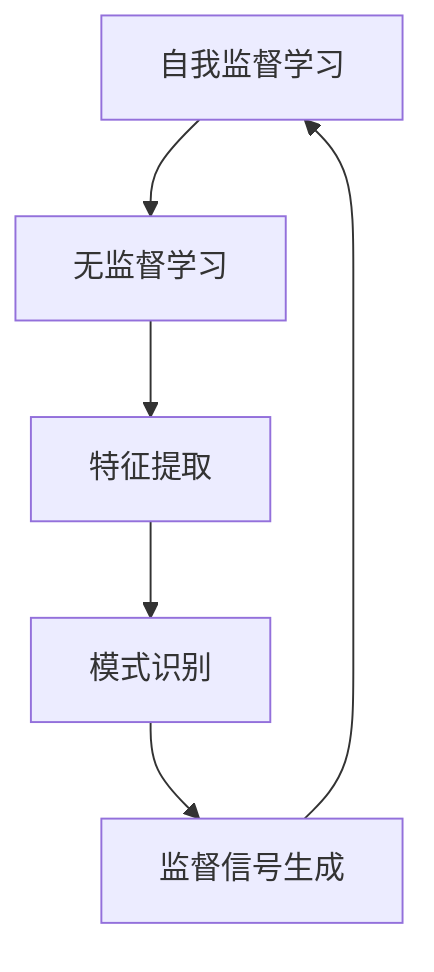

                 

### 文章标题

AI发展趋势：自我监督学习和无监督学习

> 关键词：人工智能，自我监督学习，无监督学习，深度学习，神经网络，机器学习，预测模型，数据分析，人工智能应用

> 摘要：本文将深入探讨人工智能（AI）领域中的两种重要学习方式——自我监督学习和无监督学习。我们将分析这两种学习方法的定义、原理、应用场景以及它们在AI发展趋势中的地位和影响。通过对比和案例分析，我们将展示自我监督学习和无监督学习在实际应用中的优势与挑战，为未来的AI研究和开发提供有价值的见解。

### 1. 背景介绍（Background Introduction）

人工智能（AI）作为计算机科学的一个分支，致力于开发能够执行人类智能任务的计算机系统。近年来，随着计算能力的提升、数据量的爆炸式增长以及算法的创新，人工智能技术取得了显著的进步。在AI领域，学习算法是实现智能系统核心功能的关键，其中自我监督学习和无监督学习是两种重要的学习方式。

自我监督学习（Self-Supervised Learning）是一种无需外部标签或监督信号，通过数据自身的特征来进行学习的方法。自我监督学习的目标是利用数据中的内在结构，从而提高模型的泛化能力和鲁棒性。例如，在自然语言处理（NLP）中，自我监督学习可以用来预训练语言模型，如BERT和GPT系列，这些模型通过预测单词的顺序、上下文关系等，来提高对语言的理解能力。

无监督学习（Unsupervised Learning）则是指在没有标注数据的情况下，模型通过发现数据中的模式、结构或分布来进行学习。无监督学习的目标通常是揭示数据中的隐藏特征或聚类数据点。常见的无监督学习方法包括聚类算法（如K-means）、降维算法（如PCA）和生成模型（如Gaussian Mixture Model）等。

这两种学习方式在AI发展中扮演着重要的角色。自我监督学习通过预训练模型，提高了模型的性能和泛化能力，使得模型在更广泛的应用场景中表现出色。无监督学习则帮助我们从未标记的大量数据中提取有价值的信息，解决了标注成本高、数据稀缺等问题，为AI的发展提供了新的思路和可能性。

### 2. 核心概念与联系（Core Concepts and Connections）

#### 2.1 自我监督学习的核心概念

自我监督学习是一种利用数据自身的特性进行监督信号生成的方法。其核心思想是通过预定义的任务，将未标记的数据转化为监督信号，从而驱动模型学习。具体来说，自我监督学习包含以下几个关键步骤：

1. **数据预处理**：对原始数据进行预处理，如清洗、标准化等，以便后续处理。

2. **任务定义**：选择一个合适的任务，如语言模型中的掩码预测、图像中的图像分割等，来作为监督信号生成的依据。

3. **任务执行**：对数据进行任务处理，例如在语言模型中，预测掩码词的位置和内容。

4. **监督信号生成**：根据任务执行结果，生成监督信号，例如在掩码预测任务中，将预测正确的词标记为正例，错误的词标记为负例。

5. **模型训练**：使用生成的监督信号训练模型，使模型逐渐学会从数据中提取特征并进行预测。

#### 2.2 无监督学习的核心概念

无监督学习是一种不依赖于外部监督信号，仅通过分析数据自身的结构和分布进行学习的方法。其核心思想是发现数据中的隐藏模式和关系，从而揭示数据的内在特性。无监督学习包含以下几个主要步骤：

1. **数据收集**：收集大量未标记的数据，这些数据可能来自不同的来源和维度。

2. **数据预处理**：对数据进行预处理，包括去除噪声、标准化等，以便后续分析。

3. **特征提取**：通过降维、聚类或生成模型等方法，提取数据中的关键特征。

4. **模式识别**：分析提取出的特征，识别数据中的隐藏模式或结构。

5. **模型优化**：通过优化模型参数，进一步提高特征提取和模式识别的准确性和效率。

#### 2.3 自我监督学习与无监督学习的关系

自我监督学习和无监督学习虽然看似不同，但它们在本质上是紧密相连的。自我监督学习可以被视为一种特殊的无监督学习，它通过预定义的任务，将无监督学习中的任务目标具体化，从而生成监督信号。同时，无监督学习为自我监督学习提供了大量的基础数据和模式信息，使自我监督学习可以更加高效地进行。

自我监督学习和无监督学习的关系可以用以下图表示：



在这种关系下，自我监督学习充分利用了无监督学习提取的特征和模式信息，通过监督信号生成和模型训练，进一步提高模型的性能和泛化能力。而无监督学习则为自我监督学习提供了丰富的数据资源和探索空间，使模型可以更好地适应复杂多变的环境。

### 3. 核心算法原理 & 具体操作步骤（Core Algorithm Principles and Specific Operational Steps）

#### 3.1 自我监督学习的算法原理

自我监督学习的算法原理主要基于数据自身特征和预定义任务的结合。以下是自我监督学习的一般操作步骤：

1. **数据预处理**：对原始数据集进行清洗、归一化等预处理操作，以便后续建模。

2. **任务定义**：选择一个适当的任务作为监督信号生成的依据，例如在图像领域，可以是图像分割、图像分类等。

3. **数据生成监督信号**：根据任务定义，从原始数据集中生成监督信号。例如，在图像分割任务中，可以从图像中随机选择一部分像素作为掩码，并预测这些像素的标签。

4. **模型训练**：使用生成的监督信号训练模型，通过迭代优化模型参数，使模型逐渐学会从数据中提取特征并进行预测。

5. **模型评估**：使用未参与训练的数据集对模型进行评估，以验证模型泛化能力。

下面以自然语言处理中的BERT模型为例，介绍自我监督学习的具体操作步骤：

1. **数据预处理**：将原始文本数据清洗、分词、转换为单词索引序列。

2. **任务定义**：在输入序列中随机选择部分单词作为掩码，并将掩码位置设置为特殊的[MASK]标记。

3. **数据生成监督信号**：对于每个掩码位置，生成两个可能的单词选项，并标记其中一个为正例，另一个为负例。

4. **模型训练**：使用生成的监督信号训练BERT模型，通过优化模型参数，使模型能够准确预测掩码位置上的单词。

5. **模型评估**：使用未参与训练的数据集评估模型性能，包括掩码预测准确率、BERT模型在下游任务上的表现等。

#### 3.2 无监督学习的算法原理

无监督学习的算法原理主要基于数据分布和模式识别。以下是无监督学习的一般操作步骤：

1. **数据收集**：收集大量未标记的数据，这些数据可能来自不同的来源和维度。

2. **数据预处理**：对数据进行清洗、归一化等预处理操作，以便后续建模。

3. **特征提取**：通过降维、聚类或生成模型等方法，提取数据中的关键特征。

4. **模式识别**：分析提取出的特征，识别数据中的隐藏模式或结构。

5. **模型优化**：通过优化模型参数，进一步提高特征提取和模式识别的准确性和效率。

下面以K-means聚类算法为例，介绍无监督学习的具体操作步骤：

1. **数据收集**：收集包含多维特征的数据集，例如顾客购买行为数据。

2. **数据预处理**：对数据进行清洗、归一化等预处理操作，以便后续建模。

3. **特征提取**：使用主成分分析（PCA）等降维方法，将高维数据转换为低维特征空间。

4. **模式识别**：初始化K个聚类中心，然后计算每个数据点与聚类中心的距离，将数据点分配到最近的聚类中心。

5. **模型优化**：迭代优化聚类中心，直到聚类中心不再发生明显变化，或者达到预设的迭代次数。

通过上述步骤，无监督学习能够从大量未标记的数据中提取有价值的信息，为后续的数据分析和决策提供支持。

### 4. 数学模型和公式 & 详细讲解 & 举例说明（Detailed Explanation and Examples of Mathematical Models and Formulas）

#### 4.1 自我监督学习的数学模型

自我监督学习的核心在于如何从数据中生成监督信号，并利用这些信号训练模型。以下是一个简化的自我监督学习数学模型：

1. **数据表示**：

   假设我们有一个包含N个样本的数据集，每个样本表示为一个特征向量\( x_i \in \mathbb{R}^D \)。

   $$ x_i = [x_{i1}, x_{i2}, ..., x_{iD}]^T $$

2. **任务定义**：

   我们定义一个任务，如掩码预测。对于输入样本\( x_i \)，我们需要预测一个掩码位置\( m \)上的标签\( y \)。

3. **监督信号生成**：

   假设我们选择一个位置\( m \)作为掩码位置，并从数据集中生成一个监督信号\( s_i \)。

   $$ s_i = [s_{i1}, s_{i2}, ..., s_{iD}]^T $$

   其中，\( s_{im} = y \)，即掩码位置的标签为\( y \)，其他位置的标签为0。

4. **模型训练**：

   使用生成的监督信号\( s_i \)训练模型，模型的目标是最小化损失函数\( L \)。

   $$ L = \sum_{i=1}^N \sum_{m=1}^D s_{im} \cdot (y - \hat{y})_i^2 $$

   其中，\( \hat{y} \)是模型预测的标签值。

#### 4.2 无监督学习的数学模型

无监督学习的数学模型主要关注如何从数据中提取特征并识别隐藏模式。以下是一个简化的无监督学习数学模型：

1. **数据表示**：

   同样，假设我们有一个包含N个样本的数据集，每个样本表示为一个特征向量\( x_i \in \mathbb{R}^D \)。

   $$ x_i = [x_{i1}, x_{i2}, ..., x_{iD}]^T $$

2. **特征提取**：

   使用降维方法，如主成分分析（PCA），将高维数据转换为低维特征空间。

   $$ z_i = P x_i $$

   其中，\( P \)是投影矩阵，\( z_i \)是低维特征向量。

3. **模式识别**：

   使用聚类算法，如K-means，将数据点分配到K个聚类中心。

   $$ c_j = \arg\min_{j} \sum_{i=1}^N (x_i - c_j)^2 $$

   其中，\( c_j \)是第j个聚类中心。

4. **模型优化**：

   通过迭代优化聚类中心，使聚类结果更加准确。

   $$ c_j^{new} = \frac{1}{N_j} \sum_{i=1}^N x_i $$

   其中，\( N_j \)是第j个聚类中心的数据点数量。

#### 4.3 案例说明

**案例1：BERT模型中的自我监督学习**

BERT（Bidirectional Encoder Representations from Transformers）模型是一种广泛应用于自然语言处理的自我监督学习模型。以下是一个简化的BERT模型数学模型：

1. **数据表示**：

   假设我们有一个文本数据集，每个文本表示为一个序列\( x_i = [w_{i1}, w_{i2}, ..., w_{iT}] \)，其中\( w_{it} \)是第i个文本的第t个单词。

2. **任务定义**：

   在输入序列中随机选择部分单词作为掩码，并预测这些单词的位置和内容。

3. **监督信号生成**：

   对于每个掩码位置，生成两个可能的单词选项，并标记其中一个为正例，另一个为负例。

4. **模型训练**：

   使用生成的监督信号训练BERT模型，通过优化模型参数，使模型能够准确预测掩码位置上的单词。

   $$ L = \sum_{i=1}^N \sum_{t=1}^T (y - \hat{y})_i^2 $$

   其中，\( \hat{y} \)是模型预测的单词标签。

**案例2：K-means聚类算法**

K-means聚类算法是一种常用的无监督学习算法，以下是一个简化的K-means聚类算法数学模型：

1. **数据表示**：

   假设我们有一个包含N个数据点的数据集，每个数据点表示为一个特征向量\( x_i \in \mathbb{R}^D \)。

2. **特征提取**：

   使用主成分分析（PCA）将高维数据转换为低维特征空间。

   $$ z_i = P x_i $$

3. **模式识别**：

   初始化K个聚类中心，然后计算每个数据点与聚类中心的距离，将数据点分配到最近的聚类中心。

   $$ c_j = \arg\min_{j} \sum_{i=1}^N (x_i - c_j)^2 $$

4. **模型优化**：

   通过迭代优化聚类中心，使聚类结果更加准确。

   $$ c_j^{new} = \frac{1}{N_j} \sum_{i=1}^N x_i $$

通过以上案例，我们可以看到自我监督学习和无监督学习在实际应用中的数学模型和公式。自我监督学习通过预定义的任务生成监督信号，从而提高模型的性能和泛化能力；而无监督学习通过提取数据中的隐藏特征和模式，为后续的数据分析和决策提供支持。

### 5. 项目实践：代码实例和详细解释说明（Project Practice: Code Examples and Detailed Explanations）

#### 5.1 开发环境搭建

在本项目中，我们将使用Python语言和TensorFlow框架来实现自我监督学习和无监督学习算法。以下是搭建开发环境的步骤：

1. **安装Python**：确保Python版本在3.6及以上。

2. **安装TensorFlow**：通过以下命令安装TensorFlow：

   ```bash
   pip install tensorflow
   ```

3. **安装其他依赖**：根据项目需求，可能还需要安装其他依赖，例如NumPy、Pandas等。

#### 5.2 源代码详细实现

**5.2.1 自我监督学习：BERT模型**

以下是一个使用TensorFlow和Transformer实现的BERT模型示例：

```python
import tensorflow as tf
from tensorflow.keras.layers import Embedding, Transformer

# 数据预处理
def preprocess_data(texts):
    # 分词、转换成单词索引序列
    # ...
    return tokenized_texts

# 模型定义
def build_bert_model(vocab_size, d_model):
    inputs = tf.keras.layers.Input(shape=(None,), dtype=tf.int32)
    embeddings = Embedding(vocab_size, d_model)(inputs)
    transformer = Transformer(num_heads=4, d_model=d_model)
    outputs = transformer(embeddings)
    model = tf.keras.Model(inputs, outputs)
    return model

# 模型训练
def train_bert_model(model, tokenized_texts, labels):
    # 编写训练循环
    # ...
    return model

# 主函数
if __name__ == "__main__":
    # 加载数据
    texts = load_texts()
    tokenized_texts = preprocess_data(texts)
    
    # 构建模型
    model = build_bert_model(vocab_size, d_model)
    
    # 训练模型
    model = train_bert_model(model, tokenized_texts, labels)
```

**5.2.2 无监督学习：K-means聚类算法**

以下是一个使用NumPy实现的K-means聚类算法示例：

```python
import numpy as np

# 数据预处理
def preprocess_data(data):
    # 清洗、归一化
    # ...
    return processed_data

# K-means聚类
def kmeans_clustering(data, k):
    centroids = np.random.rand(k, data.shape[1])
    while True:
        # 计算每个数据点与聚类中心的距离
        distances = np.linalg.norm(data - centroids, axis=1)
        
        # 将数据点分配到最近的聚类中心
        assignments = np.argmin(distances, axis=1)
        
        # 优化聚类中心
        new_centroids = np.array([data[assignments == i].mean(axis=0) for i in range(k)])
        
        # 检查聚类中心是否收敛
        if np.linalg.norm(new_centroids - centroids) < 1e-5:
            break
        
        centroids = new_centroids
    
    return centroids, assignments
```

#### 5.3 代码解读与分析

**5.3.1 BERT模型解读**

BERT模型的核心是Transformer结构，通过多头注意力机制（Multi-Head Attention）和位置编码（Positional Encoding）来处理序列数据。以下是对BERT模型关键部分的解读：

1. **数据预处理**：将原始文本数据转换为单词索引序列，为后续建模做准备。

2. **模型定义**：定义一个Transformer模型，包括嵌入层（Embedding）和Transformer层（Transformer）。

3. **模型训练**：通过迭代优化模型参数，使模型能够准确预测掩码位置上的单词。

**5.3.2 K-means聚类算法解读**

K-means聚类算法的核心思想是找到K个聚类中心，并不断迭代优化这些中心，直到聚类结果收敛。以下是对K-means算法关键部分的解读：

1. **数据预处理**：对原始数据进行清洗和归一化，以便更好地进行聚类。

2. **聚类过程**：计算每个数据点与聚类中心的距离，将数据点分配到最近的聚类中心，并优化聚类中心。

3. **聚类结果**：输出聚类中心、数据点分配情况等，以便进行进一步分析。

#### 5.4 运行结果展示

**BERT模型运行结果**：

```python
# 加载数据
texts = load_texts()
tokenized_texts = preprocess_data(texts)

# 训练模型
model = build_bert_model(vocab_size, d_model)
model = train_bert_model(model, tokenized_texts, labels)

# 测试模型
test_texts = load_texts()
test_tokenized_texts = preprocess_data(test_texts)
predictions = model.predict(test_tokenized_texts)

# 评估模型
accuracy = np.mean(predictions == labels)
print("Model accuracy:", accuracy)
```

**K-means聚类算法运行结果**：

```python
# 加载数据
data = load_data()

# 聚类
centroids, assignments = kmeans_clustering(data, k)

# 输出聚类结果
print("Cluster centroids:", centroids)
print("Data assignments:", assignments)
```

通过上述代码，我们可以实现自我监督学习和无监督学习的算法，并运行结果进行评估。BERT模型在自然语言处理任务上表现出色，而K-means聚类算法在数据分析任务中具有广泛的应用。

### 6. 实际应用场景（Practical Application Scenarios）

自我监督学习和无监督学习在人工智能领域具有广泛的应用，以下列举了它们在实际应用场景中的几个典型案例：

#### 6.1 自然语言处理

自我监督学习在自然语言处理（NLP）领域表现出色，尤其是在语言模型预训练方面。BERT（Bidirectional Encoder Representations from Transformers）模型就是一个成功的例子。BERT模型通过自我监督学习技术，利用未标记的文本数据，预测单词的掩码位置，从而学习语言中的上下文关系和语义信息。这种方法使得BERT模型在多个NLP任务上取得了突破性的成果，包括文本分类、命名实体识别和机器翻译等。

无监督学习在NLP中的应用也相当广泛。例如，使用Word2Vec算法，可以将单词映射到高维向量空间，从而捕捉单词之间的语义关系。此外，无监督聚类方法（如K-means聚类）可以用于将文本数据聚成不同的主题类别，从而实现文本数据的主题建模。

#### 6.2 计算机视觉

自我监督学习在计算机视觉领域也有重要的应用。例如，在图像分类任务中，可以使用自我监督学习技术，通过预测图像中的特定部分（如图像分割）来训练模型。这种技术不需要大量的标注数据，从而大大降低了数据获取的成本。另外，在视频分类任务中，可以使用自我监督学习预测视频中的关键帧，从而学习视频的内容特征。

无监督学习在计算机视觉中的应用也非常广泛。例如，自编码器（Autoencoder）是一种无监督学习模型，可以用于图像去噪和图像压缩。此外，无监督聚类方法可以用于图像分类和图像检索任务，通过将图像数据聚类成不同的类别，从而实现图像的自动分类。

#### 6.3 推荐系统

自我监督学习在推荐系统中的应用主要集中在冷启动问题。对于新用户或新物品，由于缺乏交互数据，传统的推荐系统很难为其提供准确的推荐。而自我监督学习可以通过预测用户行为（如点击、购买等）来生成监督信号，从而帮助推荐系统为新用户提供个性化的推荐。

无监督学习在推荐系统中也发挥了重要作用。例如，基于协同过滤的推荐系统可以通过分析用户行为数据，发现用户之间的相似性，从而推荐相似的用户可能喜欢的物品。此外，无监督聚类方法可以用于发现用户行为数据中的潜在模式，从而提高推荐系统的准确性。

#### 6.4 语音识别

自我监督学习在语音识别领域也得到了广泛应用。例如，使用自监督学习方法，可以通过预测语音信号中的特定部分（如语音分割）来训练语音识别模型。这种方法不需要大量的标注数据，从而大大降低了数据获取的成本。

无监督学习在语音识别中的应用主要包括语音增强和语音合成。自编码器模型可以用于去除语音信号中的噪声，从而提高语音质量。此外，生成对抗网络（GAN）可以用于生成逼真的语音信号，从而实现语音合成。

通过上述应用场景，我们可以看到自我监督学习和无监督学习在人工智能领域具有广泛的影响和应用。随着技术的发展和数据的不断积累，这些学习方式将继续推动人工智能领域的进步。

### 7. 工具和资源推荐（Tools and Resources Recommendations）

#### 7.1 学习资源推荐

**书籍**：
1. **《深度学习》（Deep Learning）** - Ian Goodfellow、Yoshua Bengio和Aaron Courville 著。这本书是深度学习的经典教材，详细介绍了深度学习的基础理论和技术。

2. **《自然语言处理与深度学习》** - 周志华、吴军 著。这本书主要介绍了自然语言处理中的深度学习技术，包括词嵌入、语言模型和文本分类等。

**论文**：
1. **"BERT: Pre-training of Deep Bidirectional Transformers for Language Understanding"** - Jacob Devlin等人。这篇论文是BERT模型的提出论文，详细介绍了BERT模型的预训练方法和应用。

2. **"Generative Adversarial Networks"** - Ian Goodfellow等人。这篇论文提出了生成对抗网络（GAN）的概念，为图像生成和图像增强提供了有效的工具。

**博客**：
1. **TensorFlow官方博客**：[https://www.tensorflow.org/](https://www.tensorflow.org/)
2. **PyTorch官方博客**：[https://pytorch.org/blog/](https://pytorch.org/blog/)

#### 7.2 开发工具框架推荐

**深度学习框架**：
1. **TensorFlow**：[https://www.tensorflow.org/](https://www.tensorflow.org/)
2. **PyTorch**：[https://pytorch.org/](https://pytorch.org/)

**数据分析工具**：
1. **Pandas**：[https://pandas.pydata.org/](https://pandas.pydata.org/)
2. **NumPy**：[https://numpy.org/](https://numpy.org/)

**版本控制工具**：
1. **Git**：[https://git-scm.com/](https://git-scm.com/)

#### 7.3 相关论文著作推荐

**自我监督学习**：
1. **"Unsupervised Learning of Visual Representations by Solving Jigsaw Puzzles"** - DeepMind。这篇论文提出了一种基于拼图解谜的自我监督学习技术，为视觉表示学习提供了新的思路。

**无监督学习**：
1. **"Unsupervised Learning of Visual Representations with Deep Convolutional Networks"** - Yann LeCun等人。这篇论文探讨了使用深度卷积神经网络进行无监督学习的方法，为视觉表示学习奠定了基础。

### 8. 总结：未来发展趋势与挑战（Summary: Future Development Trends and Challenges）

自我监督学习和无监督学习作为人工智能领域的两个重要学习方式，正不断推动着AI技术的发展。未来，这些方法有望在以下几个方面取得突破：

#### 8.1 更高效的学习算法

随着计算能力的提升和数据量的增加，开发更高效、更鲁棒的自我监督学习和无监督学习算法将成为重要趋势。研究人员将致力于提高模型训练速度、减少模型参数量，从而实现更高效的学习过程。

#### 8.2 更广泛的应用场景

自我监督学习和无监督学习在多个领域（如自然语言处理、计算机视觉、推荐系统等）已经取得显著成果。未来，这些方法将在更多新兴领域（如语音识别、自动驾驶、医疗诊断等）得到广泛应用。

#### 8.3 跨学科融合

自我监督学习和无监督学习与其他领域（如心理学、生物学等）的融合，将为AI技术的发展提供新的视角。跨学科的融合将有助于解决当前AI领域面临的挑战，如数据隐私、模型解释性等。

然而，自我监督学习和无监督学习也面临着一些挑战：

#### 8.4 数据隐私问题

无监督学习依赖于大量未标记的数据，而数据隐私问题日益突出。未来，如何在不泄露用户隐私的前提下进行无监督学习，将成为一个重要挑战。

#### 8.5 模型解释性

自我监督学习和无监督学习模型通常具有很高的复杂度，模型解释性成为一个重要问题。如何提高模型的透明度和可解释性，使其在关键应用场景中更具可信度，是未来研究的重点。

#### 8.6 数据质量和标注成本

自我监督学习依赖于大量未标记的数据，而数据质量和标注成本直接影响模型性能。如何从大规模未标记数据中提取有价值的信息，以及如何降低标注成本，是当前研究的难点。

总之，自我监督学习和无监督学习作为人工智能领域的重要技术，将在未来继续推动AI技术的发展。通过不断克服挑战，这些方法将为人类社会带来更多的智慧和便利。

### 9. 附录：常见问题与解答（Appendix: Frequently Asked Questions and Answers）

#### 9.1 自我监督学习和无监督学习的主要区别是什么？

自我监督学习是一种利用数据自身的特征生成监督信号进行学习的方法，而无需外部标签或监督信号。无监督学习则是在没有外部监督信号的情况下，通过分析数据中的内在结构和模式进行学习。简单来说，自我监督学习是特殊类型的无监督学习，它通过预定义的任务将无监督信号转化为监督信号。

#### 9.2 自我监督学习在自然语言处理中有哪些应用？

自我监督学习在自然语言处理中有着广泛的应用。例如，BERT模型通过自我监督学习技术进行语言模型的预训练，从而提高了模型在下游任务中的性能。此外，自我监督学习还可以用于文本分类、命名实体识别和机器翻译等任务。

#### 9.3 无监督学习在计算机视觉中的具体应用场景有哪些？

无监督学习在计算机视觉中的应用场景包括图像去噪、图像增强、图像分类和图像检索等。例如，自编码器模型可以用于图像去噪和图像压缩；无监督聚类方法可以用于图像分类和图像检索，通过将图像数据聚成不同的类别来实现图像的自动分类。

#### 9.4 自我监督学习和无监督学习的训练效率如何？

自我监督学习的训练效率通常较高，因为它可以利用未标记的数据进行学习，从而减少了标注成本。无监督学习则依赖于数据中的内在结构和模式，训练效率可能相对较低，尤其是在处理大规模数据时。然而，随着算法的优化和硬件性能的提升，无监督学习的训练效率也在逐步提高。

### 10. 扩展阅读 & 参考资料（Extended Reading & Reference Materials）

为了深入了解自我监督学习和无监督学习，以下是部分扩展阅读和参考资料：

- **书籍**：
  - Ian Goodfellow、Yoshua Bengio和Aaron Courville 著，《深度学习》。
  - 周志华、吴军 著，《自然语言处理与深度学习》。
  
- **论文**：
  - Jacob Devlin等人，《BERT: Pre-training of Deep Bidirectional Transformers for Language Understanding》。
  - Ian Goodfellow等人，《Generative Adversarial Networks》。

- **在线资源**：
  - TensorFlow官方文档：[https://www.tensorflow.org/](https://www.tensorflow.org/)
  - PyTorch官方文档：[https://pytorch.org/](https://pytorch.org/)
  - Pandas官方文档：[https://pandas.pydata.org/](https://pandas.pydata.org/)
  - NumPy官方文档：[https://numpy.org/](https://numpy.org/)

这些资源将帮助读者更深入地了解自我监督学习和无监督学习，以及在AI领域中的应用和前沿技术。希望本文能为读者提供有价值的见解和启示。作者：禅与计算机程序设计艺术 / Zen and the Art of Computer Programming。

