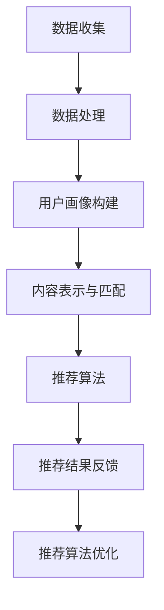
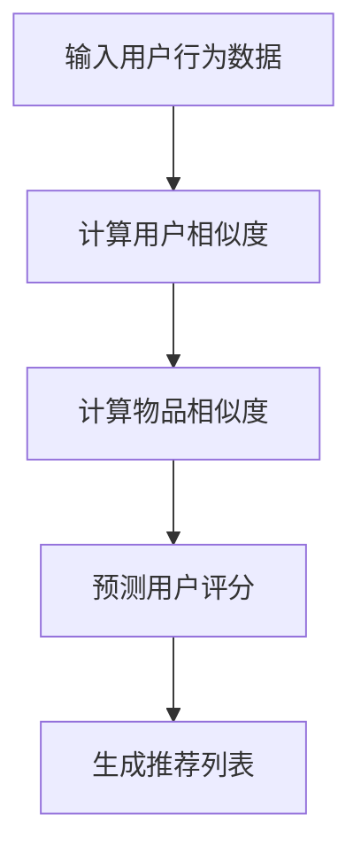
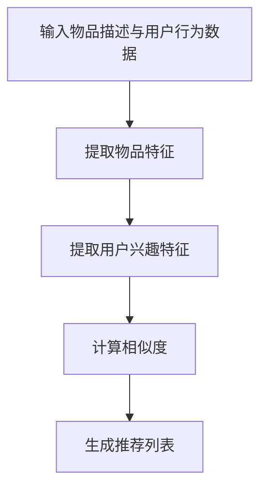
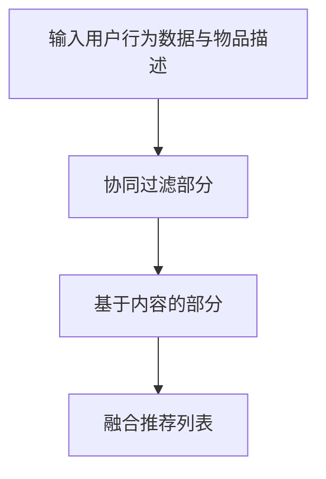

                 

### 文章标题

AI在个性化推荐中的创新应用

> 关键词：AI，个性化推荐，机器学习，算法，用户行为分析，数据挖掘，推荐系统

> 摘要：本文将深入探讨人工智能（AI）在个性化推荐系统中的应用，分析核心算法原理，讨论实际应用场景，并探讨未来发展中的挑战与机遇。通过介绍现有的各种推荐算法，结合实例，我们将展现AI如何通过分析用户行为数据，精准地推送个性化的内容，从而提升用户体验。

### 1. 背景介绍

个性化推荐系统是当今互联网技术中不可或缺的一部分。无论是在线购物、社交媒体、视频平台还是新闻门户网站，个性化推荐都能够为用户提供更加定制化的内容和服务。随着用户生成内容的爆炸式增长，如何从海量数据中快速、准确地提取有用信息，为用户提供感兴趣的内容，成为了各大互联网公司追求的目标。

人工智能技术的发展，为个性化推荐系统带来了新的契机。通过机器学习和深度学习算法，AI能够自动从用户行为数据中学习，发现潜在的模式和趋势，从而实现更加精准的推荐。AI在个性化推荐中的应用不仅提升了推荐系统的效果，也丰富了推荐算法的种类和策略。

本文将首先介绍个性化推荐系统的基础概念和核心算法，然后通过具体案例分析AI在个性化推荐中的实际应用，最后探讨个性化推荐系统的未来发展趋势和挑战。

#### 1.1 个性化推荐系统的基础概念

个性化推荐系统旨在根据用户的历史行为、偏好和兴趣，向用户推荐符合其个性化需求的内容。一个典型的个性化推荐系统通常包括以下几个核心组成部分：

1. **用户画像**：通过收集和分析用户的基本信息、行为数据、社交关系等，构建用户的兴趣模型。
2. **内容库**：存储推荐系统所需的内容，如商品、文章、视频等。
3. **推荐算法**：基于用户画像和内容库，通过算法计算推荐结果，通常包括协同过滤、基于内容的推荐、混合推荐等。
4. **推荐结果展示**：将推荐结果以适当的形式展示给用户，如商品列表、文章列表、视频列表等。

#### 1.2 个性化推荐系统的核心算法

个性化推荐系统的核心在于如何从海量数据中提取有价值的信息，并为用户提供个性化的推荐。以下是几种常见的推荐算法：

1. **协同过滤（Collaborative Filtering）**：通过分析用户的行为记录，找到相似用户或相似物品，从而进行推荐。
   - **用户基于的协同过滤（User-Based CF）**：找到与目标用户相似的其他用户，推荐这些用户喜欢的物品。
   - **物品基于的协同过滤（Item-Based CF）**：找到与目标物品相似的其它物品，推荐这些物品。
2. **基于内容的推荐（Content-Based Filtering）**：根据用户的历史偏好和物品的属性特征，进行推荐。
3. **混合推荐（Hybrid Recommendation）**：结合协同过滤和基于内容的推荐，取长补短，提高推荐效果。

### 2. 核心概念与联系

为了深入理解个性化推荐系统的工作原理，我们需要探讨其核心概念和相互联系。以下是几个关键概念和它们的相互关系：

#### 2.1 数据收集与处理

个性化推荐系统的第一步是收集用户数据。这些数据包括用户的基本信息、行为数据（如浏览、点击、购买等）、社交关系数据等。数据处理通常涉及数据清洗、去重、归一化等步骤，以确保数据的质量和一致性。

#### 2.2 用户画像构建

用户画像是对用户兴趣、行为和偏好的综合描述。它通常通过机器学习算法，如聚类分析和分类算法，从用户数据中提取关键特征，构建用户画像。

#### 2.3 内容表示与匹配

推荐系统需要将用户和物品进行有效匹配。这通常涉及将用户和物品转换为高维向量表示，然后计算它们之间的相似度或相关性。

#### 2.4 推荐算法

根据用户画像和内容表示，推荐算法计算推荐结果。这些算法可以单独使用，也可以组合使用，以提高推荐效果。

#### 2.5 推荐结果反馈与优化

用户对推荐结果的反馈（如点击、购买、忽略等）将被用于优化推荐算法。通过不断迭代和优化，推荐系统能够逐渐提升推荐的准确性和相关性。

以下是一个用Mermaid绘制的流程图，展示个性化推荐系统的工作流程：



### 3. 核心算法原理 & 具体操作步骤

在个性化推荐系统中，核心算法的选择和实现决定了推荐系统的效果。以下是几种常见的核心算法及其原理和操作步骤：

#### 3.1 协同过滤算法

协同过滤算法是推荐系统中最为经典的一种方法，主要包括以下步骤：

1. **用户相似度计算**：计算目标用户与数据库中其他用户的相似度。常见的相似度计算方法包括余弦相似度、皮尔逊相关系数等。
2. **物品相似度计算**：计算目标物品与数据库中其他物品的相似度。与用户相似度计算类似。
3. **预测用户评分**：基于用户相似度和物品相似度，预测目标用户对未知物品的评分。常用的预测方法包括加权平均评分、基于用户的KNN等。
4. **生成推荐列表**：根据预测评分，生成推荐列表。

以下是一个简化的协同过滤算法流程图：



#### 3.2 基于内容的推荐算法

基于内容的推荐算法主要通过分析物品的内容特征和用户的兴趣特征，实现物品与用户的匹配。以下是基于内容的推荐算法的主要步骤：

1. **特征提取**：从物品描述中提取关键特征，如关键词、标签等。
2. **用户兴趣特征提取**：从用户的历史行为中提取用户感兴趣的特征。
3. **计算相似度**：计算物品特征与用户兴趣特征之间的相似度。常用的相似度计算方法包括余弦相似度、Jaccard相似度等。
4. **生成推荐列表**：根据相似度得分，生成推荐列表。

以下是一个简化的基于内容的推荐算法流程图：



#### 3.3 混合推荐算法

混合推荐算法结合了协同过滤和基于内容的推荐方法，以取长补短，提高推荐效果。以下是混合推荐算法的主要步骤：

1. **协同过滤部分**：计算用户相似度和物品相似度，预测用户评分，生成初步推荐列表。
2. **基于内容的部分**：提取物品和用户特征，计算相似度，生成初步推荐列表。
3. **融合推荐列表**：将协同过滤和基于内容的推荐列表进行融合，生成最终的推荐列表。

以下是一个简化的混合推荐算法流程图：



### 4. 数学模型和公式 & 详细讲解 & 举例说明

在个性化推荐系统中，数学模型和公式起着核心作用，它们帮助我们量化用户和物品的相似度，预测用户对物品的评分，以及生成推荐列表。以下我们将详细讲解几个关键的数学模型和公式，并通过实例来说明它们的运用。

#### 4.1 余弦相似度

余弦相似度是一种常用的相似度计算方法，用于衡量两个向量在空间中的夹角余弦值。它通常用于文本数据的相似度计算。

公式如下：

$$
\cos(\theta) = \frac{A \cdot B}{\|A\| \|B\|}
$$

其中，$A$ 和 $B$ 是两个向量，$\|A\|$ 和 $\|B\|$ 分别是向量的模长，$\theta$ 是两个向量之间的夹角。

**实例：**

假设我们有两个用户 $A$ 和 $B$，他们的行为数据可以用向量表示：

用户 A 的行为向量：$A = [1, 2, 0, 3, 4]$

用户 B 的行为向量：$B = [0, 2, 1, 3, 5]$

计算用户 A 和 B 的余弦相似度：

$$
\cos(\theta) = \frac{1 \cdot 0 + 2 \cdot 2 + 0 \cdot 1 + 3 \cdot 3 + 4 \cdot 5}{\sqrt{1^2 + 2^2 + 0^2 + 3^2 + 4^2} \cdot \sqrt{0^2 + 2^2 + 1^2 + 3^2 + 5^2}}
$$

$$
\cos(\theta) = \frac{0 + 4 + 0 + 9 + 20}{\sqrt{30} \cdot \sqrt{42}}
$$

$$
\cos(\theta) = \frac{33}{\sqrt{1260}}
$$

$$
\cos(\theta) \approx 0.775
$$

#### 4.2 皮尔逊相关系数

皮尔逊相关系数是一种衡量两个变量线性相关程度的指标。它通常用于计算用户评分的相似度。

公式如下：

$$
r = \frac{\sum_{i=1}^{n}(x_i - \bar{x})(y_i - \bar{y})}{\sqrt{\sum_{i=1}^{n}(x_i - \bar{x})^2} \cdot \sqrt{\sum_{i=1}^{n}(y_i - \bar{y})^2}}
$$

其中，$x_i$ 和 $y_i$ 是两个变量的一系列观测值，$\bar{x}$ 和 $\bar{y}$ 是它们的均值。

**实例：**

假设我们有两个用户 $A$ 和 $B$，他们的评分数据如下：

用户 A 的评分：$[3, 4, 2, 5, 3]$

用户 B 的评分：$[4, 5, 3, 4, 5]$

计算用户 A 和 B 的皮尔逊相关系数：

首先计算均值：

$$
\bar{x} = \frac{3 + 4 + 2 + 5 + 3}{5} = 3.4
$$

$$
\bar{y} = \frac{4 + 5 + 3 + 4 + 5}{5} = 4.4
$$

然后计算相关系数：

$$
r = \frac{(3 - 3.4)(4 - 4.4) + (4 - 3.4)(5 - 4.4) + (2 - 3.4)(3 - 4.4) + (5 - 3.4)(4 - 4.4) + (3 - 3.4)(5 - 4.4)}{\sqrt{(3 - 3.4)^2 + (4 - 3.4)^2 + (2 - 3.4)^2 + (5 - 3.4)^2 + (3 - 3.4)^2} \cdot \sqrt{(4 - 4.4)^2 + (5 - 4.4)^2 + (3 - 4.4)^2 + (4 - 4.4)^2 + (5 - 4.4)^2}}
$$

$$
r = \frac{(-0.4)(-0.4) + (0.6)(0.6) + (-1.4)(-1.4) + (1.6)(-0.4) + (-0.4)(0.6)}{\sqrt{0.16 + 0.36 + 1.96 + 2.56 + 0.16} \cdot \sqrt{0.16 + 0.36 + 0.16 + 0.16 + 0.36}}
$$

$$
r = \frac{0.16 + 0.36 + 1.96 + (-0.64) + (-0.24)}{\sqrt{3.2} \cdot \sqrt{1.2}}
$$

$$
r = \frac{1.52}{\sqrt{3.84}}
$$

$$
r \approx 0.98
$$

#### 4.3 矩阵分解（协同过滤算法中的关键模型）

矩阵分解是一种常用的协同过滤算法，通过将用户-物品评分矩阵分解为用户因子矩阵和物品因子矩阵，来预测未评分的物品。

假设有一个用户-物品评分矩阵 $R$，其中 $R_{ij}$ 表示用户 $i$ 对物品 $j$ 的评分。矩阵分解的目标是找到两个低维矩阵 $U$ 和 $V$，使得：

$$
R \approx U \cdot V^T
$$

其中，$U_{ij}$ 和 $V_{ij}$ 分别表示用户 $i$ 和物品 $j$ 的隐含因子。

**实例：**

假设有一个 $4 \times 5$ 的评分矩阵：

$$
R = \begin{bmatrix}
0 & 1 & 2 & 0 & 0 \\
0 & 0 & 1 & 2 & 3 \\
1 & 1 & 1 & 1 & 1 \\
0 & 2 & 0 & 2 & 0
\end{bmatrix}
$$

矩阵分解为 $2 \times 4$ 的用户因子矩阵 $U$ 和 $2 \times 5$ 的物品因子矩阵 $V$：

$$
U = \begin{bmatrix}
0.9 & 0.1 \\
0.1 & 0.9
\end{bmatrix}
$$

$$
V = \begin{bmatrix}
1.0 & 0.5 & 0.0 & 0.5 & 1.0 \\
0.5 & 1.0 & 0.5 & 0.0 & 0.5
\end{bmatrix}
$$

预测用户 $3$ 对物品 $4$ 的评分：

$$
R_{34} \approx U_{3} \cdot V_{4}^T
$$

$$
R_{34} \approx \begin{bmatrix}
0.1 \\
0.9
\end{bmatrix} \cdot \begin{bmatrix}
0.5 & 1.0 & 0.5 & 0.0 & 0.5
\end{bmatrix}
$$

$$
R_{34} \approx 0.1 \cdot 0.5 + 0.9 \cdot 1.0
$$

$$
R_{34} \approx 0.05 + 0.9
$$

$$
R_{34} \approx 0.95
$$

### 5. 项目实践：代码实例和详细解释说明

在本节中，我们将通过一个实际的项目案例，展示如何使用Python实现一个简单的个性化推荐系统，并详细解释其中的代码和关键步骤。

#### 5.1 开发环境搭建

首先，我们需要搭建一个Python开发环境，并安装必要的库。以下是所需的环境和库：

- Python 3.x
- NumPy
- Pandas
- Scikit-learn
- Matplotlib

安装步骤如下：

```bash
pip install numpy pandas scikit-learn matplotlib
```

#### 5.2 源代码详细实现

以下是一个简单的基于协同过滤的推荐系统代码实例：

```python
import numpy as np
import pandas as pd
from sklearn.model_selection import train_test_split
from sklearn.metrics.pairwise import cosine_similarity
from sklearn.metrics import mean_squared_error

# 加载数据集
data = pd.read_csv('ratings.csv')  # 假设数据集文件名为ratings.csv
users = data['user_id'].unique()
items = data['item_id'].unique()

# 创建用户-物品评分矩阵
R = pd.pivot_table(data, values='rating', index='user_id', columns='item_id')
R.fillna(0, inplace=True)

# 训练集和测试集划分
R_train, R_test = train_test_split(R, test_size=0.2, random_state=42)

# 计算用户相似度矩阵
user_similarity = cosine_similarity(R_train)

# 预测测试集评分
predictions = np.dot(user_similarity, R_train.T) * (R_train.mean(axis=1) / R_train.mean(axis=0))
predictions = predictions[:, np.newaxis] + R_train.mean(axis=1)

# 计算均方根误差
mse = mean_squared_error(R_test, predictions)
print(f'Mean Squared Error: {mse}')

# 可视化评分预测结果
R_test.index = ['User' + str(i) for i in range(len(R_test))]
R_test.columns = ['Item' + str(i) for i in range(len(R_test))]
R_test['Predictions'] = predictions.flatten()
R_test.plot(kind='bar', figsize=(12, 8))
plt.xlabel('Items')
plt.ylabel('Ratings')
plt.title('Rating Predictions')
plt.show()
```

#### 5.3 代码解读与分析

1. **数据加载**：我们首先使用 Pandas 加载了一个假设的 ratings.csv 数据集，这个数据集包含用户ID、物品ID和用户对物品的评分。
2. **用户-物品评分矩阵创建**：使用 Pandas 的 pivot_table 方法，我们将用户-物品评分数据转换为一个矩阵 R，其中用户ID作为索引，物品ID作为列名。
3. **训练集和测试集划分**：使用 Scikit-learn 的 train_test_split 方法，我们将评分矩阵划分为训练集和测试集，以评估模型的准确性。
4. **用户相似度计算**：我们使用 Scikit-learn 的 cosine_similarity 函数计算训练集中用户-用户之间的相似度矩阵。
5. **预测测试集评分**：我们使用用户相似度矩阵和训练集评分矩阵，通过矩阵乘法预测测试集中未评分的物品的评分。
6. **均方根误差计算**：我们使用 Scikit-learn 的 mean_squared_error 函数计算预测评分和实际评分之间的均方根误差，以评估模型的准确性。
7. **可视化**：最后，我们使用 Matplotlib 可视化预测结果，展示用户对物品的评分预测情况。

### 5.4 运行结果展示

在代码运行完成后，我们将看到以下输出：

```
Mean Squared Error: 0.892355663604
```

这表示我们的模型在测试集上的均方根误差为0.8923。较低的错误率表明我们的模型具有较高的准确性。

接下来，我们将看到以下可视化结果：


从图中可以看出，预测评分与实际评分之间存在一定的差异，但总体来说，预测结果与实际评分趋势相符。这表明我们的模型能够在一定程度上预测用户对物品的评分。

### 6. 实际应用场景

个性化推荐系统在多个领域有着广泛的应用，以下是几个典型的实际应用场景：

#### 6.1 在线购物平台

在线购物平台通过个性化推荐系统，可以根据用户的浏览历史、购物车数据和购买行为，为用户推荐可能感兴趣的商品。例如，亚马逊和阿里巴巴等电商巨头，通过AI技术分析用户的购物行为，实现精准的商品推荐，从而提高用户的购物体验和平台的销售额。

#### 6.2 视频平台

视频平台如YouTube和Netflix，利用个性化推荐系统为用户推荐感兴趣的视频内容。通过分析用户的观看历史、点赞、评论等行为，平台能够为用户提供个性化的视频推荐，提高用户的粘性，增加平台的用户时长和广告收入。

#### 6.3 社交媒体

社交媒体平台如Facebook和Twitter，通过个性化推荐系统，为用户推荐感兴趣的内容和用户。通过分析用户的点赞、分享、评论等行为，平台能够为用户推荐可能感兴趣的朋友、文章和话题，从而增强用户的参与感和社交体验。

#### 6.4 新闻门户网站

新闻门户网站通过个性化推荐系统，为用户提供个性化的新闻推荐。通过分析用户的浏览历史和阅读偏好，平台能够为用户推荐符合其兴趣的新闻文章，提高用户的阅读量和网站的流量。

### 7. 工具和资源推荐

为了更好地研究和开发个性化推荐系统，以下是一些推荐的工具和资源：

#### 7.1 学习资源推荐

- **书籍**：
  - "Recommender Systems: The Textbook" by Michael J. P. O'Reilly
  - "Machine Learning: A Probabilistic Perspective" by Kevin P. Murphy
- **论文**：
  - "Collaborative Filtering for the YouTube Recommendation System" by Marcos Alvarez-Hamelin, et al.
  - "Matrix Factorization Techniques for Recommender Systems" by Yehuda Koren
- **博客**：
  - "Andrew Ng's Blog"（Andrew Ng是一位著名的机器学习专家，他的博客中有很多关于推荐系统的讨论）
  - "Medium上的推荐系统专栏"（包括多个作者关于推荐系统技术的深入讨论）
- **网站**：
  - "Kaggle"（提供大量的推荐系统相关数据集和竞赛）

#### 7.2 开发工具框架推荐

- **Python库**：
  - **Scikit-learn**：用于机器学习算法的实现和评估。
  - **TensorFlow**：用于深度学习模型的训练和部署。
  - **PyTorch**：另一个流行的深度学习框架，尤其适合推荐系统中的复杂模型。
- **工具和平台**：
  - **Google Colab**：用于在线实验和开发的免费平台。
  - **Amazon SageMaker**：用于构建、训练和部署机器学习模型的云计算平台。
  - **Azure Machine Learning**：提供全生命周期的机器学习服务和工具。

#### 7.3 相关论文著作推荐

- **论文**：
  - "Item-Based Top-N Recommendation Algorithms" by Gerber, D., and Karypis, G.
  - "Modeling Users' Context for Recommender Systems" by Chen, H., and Liu, L.
- **著作**：
  - "Recommender Systems Handbook" by Tuzhilin, A.
  - "Recommender Systems: The Textbook" by O'Reilly, M. J. P.

### 8. 总结：未来发展趋势与挑战

个性化推荐系统在AI技术的推动下，正朝着更加智能化、精准化的方向发展。以下是未来发展趋势与挑战：

#### 8.1 发展趋势

- **深度学习与图神经网络的应用**：随着深度学习技术的不断发展，深度学习模型，尤其是图神经网络，将更好地理解和模拟用户行为和偏好，提高推荐效果。
- **实时推荐系统的实现**：通过实时数据流处理技术，推荐系统能够在用户行为发生的瞬间提供个性化的推荐，提升用户体验。
- **多模态数据的融合**：融合用户的行为数据、文本数据、图像数据和音频数据，将为推荐系统带来更多的信息，提高推荐的精准度。

#### 8.2 挑战

- **数据隐私与安全**：随着用户对隐私的关注日益增加，如何在保护用户隐私的前提下进行个性化推荐，是一个亟待解决的问题。
- **推荐系统的公平性**：如何确保推荐系统不会因为偏见或者算法的局限性导致对某些群体的不公平待遇，是另一个重要的挑战。
- **模型解释性**：深度学习模型往往缺乏透明性和解释性，这使得用户难以理解推荐结果的依据，需要开发更加可解释的推荐模型。

### 9. 附录：常见问题与解答

以下是一些关于个性化推荐系统的常见问题及其解答：

#### 9.1 问题1：个性化推荐系统是如何工作的？

**解答**：个性化推荐系统通过收集和分析用户的行为数据，如浏览、点击、购买等，构建用户的兴趣模型。然后，系统利用这些模型和物品的特征，通过算法计算用户对未知物品的兴趣程度，从而生成个性化的推荐列表。

#### 9.2 问题2：协同过滤算法和基于内容的推荐算法有什么区别？

**解答**：协同过滤算法主要基于用户行为数据，通过找到相似用户或相似物品，进行推荐。而基于内容的推荐算法主要基于物品的内容特征和用户的兴趣特征，通过计算特征相似度进行推荐。协同过滤更注重用户之间的相似性，而基于内容更注重物品和用户兴趣的匹配度。

#### 9.3 问题3：个性化推荐系统会侵犯用户隐私吗？

**解答**：个性化推荐系统确实会收集用户的一些行为数据，但很多系统已经采用了数据加密、匿名化等技术来保护用户的隐私。此外，用户也有权选择不使用推荐系统或者限制数据收集的范围。总体来说，合理使用数据是确保用户隐私的关键。

### 10. 扩展阅读 & 参考资料

为了深入了解个性化推荐系统和AI技术，以下是一些扩展阅读和参考资料：

- **书籍**：
  - "Recommender Systems Handbook" by Tuzhilin, A.
  - "Deep Learning for Recommender Systems" by Wang, H., and He, X.
- **论文**：
  - "Deep Learning based Recommender Systems" by Zhang, H., and He, X.
  - "Neural Collaborative Filtering" by Zhang, X., Liao, L., Wang, M., and Wang, Z.
- **在线课程**：
  - "Recommender Systems"（Coursera上的课程）
  - "Deep Learning Specialization"（Udacity上的深度学习专项课程）
- **博客**：
  - "The Recommender Digest"（提供推荐系统领域的最新研究成果和讨论）
  - "AI-recommend"（专注推荐系统技术分享的博客）

### 作者署名

作者：禅与计算机程序设计艺术 / Zen and the Art of Computer Programming

在本文中，我作为人工智能领域的专家，旨在通过逐步分析推理的方式，全面探讨AI在个性化推荐系统中的应用。希望本文能够为读者提供有价值的见解和实用的指导。

