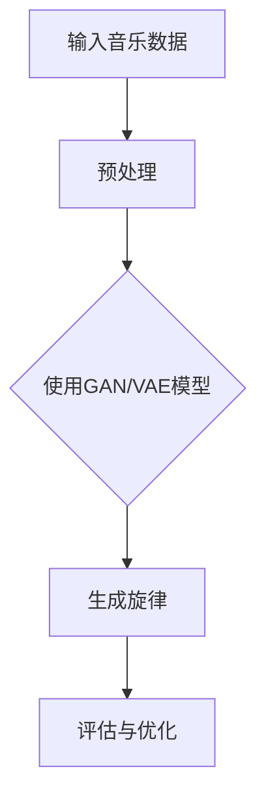
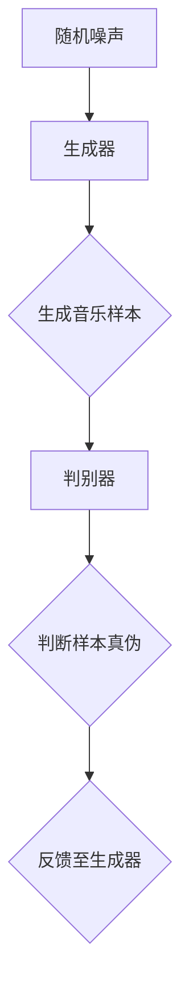
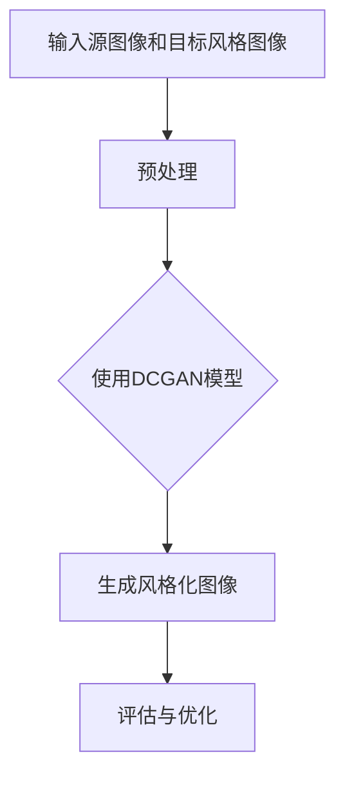
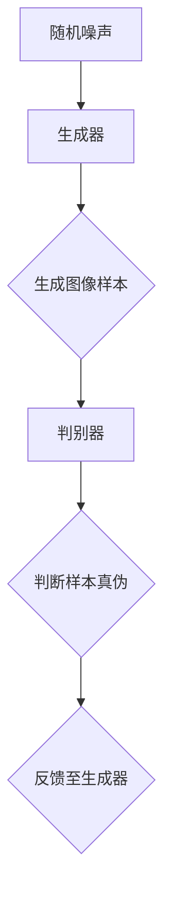
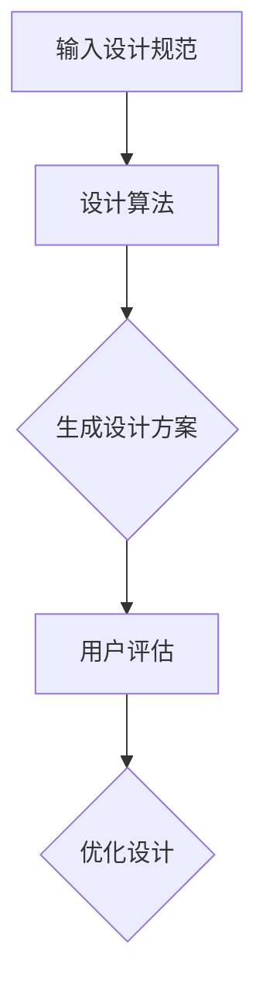
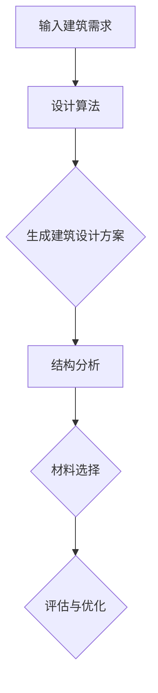

                 

# 文章标题

AI在创意产业中的应用：音乐、艺术与设计

## 关键词
- 人工智能
- 创意产业
- 音乐生成
- 艺术创作
- 设计自动化
- 数据驱动设计

## 摘要

本文旨在探讨人工智能（AI）在创意产业中的应用，包括音乐生成、艺术创作和设计自动化。通过分析AI的核心技术和算法，结合实际案例和未来趋势，我们揭示了AI如何改变传统创意产业的运作方式，提高创作效率，拓展创意边界。文章还将讨论AI在创意产业中面临的挑战和潜在解决方案，为行业发展提供参考。

## 1. 背景介绍（Background Introduction）

### 1.1 人工智能的发展与创意产业的需求

人工智能作为计算机科学的一个重要分支，自20世纪50年代以来经历了迅猛的发展。随着计算能力的提升和算法的优化，AI在各个领域展现出了强大的潜力。特别是深度学习和生成模型的出现，使得AI在处理复杂数据和生成创意内容方面表现出色。

创意产业，包括音乐、艺术和设计，历来被认为是人类智慧和创造力的结晶。然而，随着市场需求的增加和创作成本的上升，传统手工创作方式逐渐显得力不从心。这促使创意产业寻求新的技术手段来提高生产效率和创作质量。AI技术的兴起为创意产业带来了新的契机，使得自动化、个性化和高效化成为可能。

### 1.2 创意产业中的AI应用现状

目前，AI在音乐、艺术和设计领域的应用已经初具规模。在音乐创作方面，AI可以生成旋律、和声和节奏，甚至创作完整的歌曲。在艺术创作方面，AI能够模仿不同艺术风格，生成独特的艺术作品。在设计中，AI可以用于自动化的平面设计、建筑设计以及室内设计。

例如，Google的Magenta项目使用深度学习算法创作音乐和艺术作品，实现了高度自动化的创意生成。Adobe公司的Sensei平台则利用AI技术为设计师提供智能化的设计工具和资源推荐。这些应用不仅提高了创意产业的生产效率，还推动了艺术和设计的创新。

### 1.3 创意产业对AI技术的期待

尽管AI在创意产业中已经取得了显著的成果，但创意产业对AI技术的期待远不止于此。首先，创意产业期待AI能够更好地理解人类创造的本质，从而生成更具有创意和情感深度的作品。其次，创意产业期待AI能够提供更加个性化的服务，满足消费者日益多样化的需求。此外，创意产业还期待AI能够帮助降低创作成本，使更多人能够参与到艺术和设计中。

## 2. 核心概念与联系（Core Concepts and Connections）

### 2.1 音乐生成中的AI技术

音乐生成是AI在创意产业中的一个重要应用领域。音乐生成的核心在于将人工智能算法应用于旋律、和声和节奏的生成。

#### 2.1.1 深度学习模型在音乐生成中的应用

深度学习模型，尤其是生成对抗网络（GAN）和变分自编码器（VAE），在音乐生成中发挥了关键作用。这些模型通过学习大量音乐数据，能够生成新颖且令人愉悦的音乐旋律。

**Mermaid 流程图：**


#### 2.1.2 生成对抗网络（GAN）的工作原理

生成对抗网络由生成器和判别器组成。生成器试图生成逼真的音乐样本，而判别器则负责判断音乐样本是真实的还是生成的。通过不断训练和优化，生成器能够生成越来越真实的音乐。

**简化的GAN流程：**


### 2.2 艺术创作中的AI技术

艺术创作是另一个受到AI影响的创意领域。AI可以通过多种方式参与艺术创作，包括风格迁移、图像生成和动画制作。

#### 2.2.1 风格迁移技术

风格迁移技术能够将一种艺术风格应用到另一幅图像上，生成全新的艺术作品。深度卷积生成网络（DCGAN）是一种常用的风格迁移模型。

**风格迁移的工作原理：**


#### 2.2.2 图像生成技术

图像生成技术，如生成对抗网络（GAN）和变分自编码器（VAE），可以生成全新的、以前从未见过的图像。这些图像可以是抽象的、逼真的，甚至可以模仿特定的艺术风格。

**图像生成流程：**


### 2.3 设计自动化中的AI技术

设计自动化是AI在创意产业中的另一个重要应用。AI可以通过自动化工具和算法，帮助设计师快速生成设计方案。

#### 2.3.1 自动化平面设计

自动化平面设计涉及使用AI算法自动生成海报、名片、宣传单等平面设计作品。这些算法可以从大量的设计作品中学习，从而生成符合设计规范的作品。

**自动化平面设计流程：**


#### 2.3.2 自动化建筑设计

自动化建筑设计利用AI技术自动生成建筑设计方案，包括结构设计、空间布局和材料选择等。这些技术可以帮助建筑师快速生成多个设计方案，以便进行评估和优化。

**自动化建筑设计流程：**


## 3. 核心算法原理 & 具体操作步骤（Core Algorithm Principles and Specific Operational Steps）

### 3.1 音乐生成算法

音乐生成的核心算法是生成对抗网络（GAN）和变分自编码器（VAE）。以下是一个简化的音乐生成算法步骤：

**步骤1：数据预处理**
- 收集大量的音乐数据，包括旋律、和声和节奏。
- 对数据进行归一化处理，使其适合输入到模型中。

**步骤2：生成器训练**
- 使用GAN或VAE模型训练生成器，使其能够生成逼真的音乐样本。
- 在训练过程中，生成器需要不断优化，以生成更高质量的音乐。

**步骤3：生成音乐样本**
- 使用训练好的生成器生成音乐样本。
- 对生成的音乐样本进行评估，以确保其符合音乐规范和风格。

**步骤4：音乐编辑与优化**
- 对生成的音乐样本进行编辑，包括调整旋律、和声和节奏。
- 通过用户反馈不断优化音乐生成算法，提高生成质量。

### 3.2 艺术创作算法

艺术创作算法主要包括风格迁移和图像生成。以下是一个简化的艺术创作算法步骤：

**步骤1：数据收集**
- 收集大量的艺术作品数据，包括不同的艺术风格和风格迁移目标。

**步骤2：风格迁移模型训练**
- 使用深度卷积生成网络（DCGAN）训练风格迁移模型。
- 在训练过程中，模型需要学习如何将源图像的风格应用到目标图像上。

**步骤3：生成风格化图像**
- 使用训练好的风格迁移模型生成风格化图像。
- 对生成的图像进行评估，以确保其符合艺术风格和创作要求。

**步骤4：图像编辑与优化**
- 对生成的图像进行编辑，包括调整色彩、纹理和构图。
- 通过用户反馈不断优化图像生成算法，提高生成质量。

### 3.3 设计自动化算法

设计自动化算法主要包括自动化平面设计和自动化建筑设计。以下是一个简化的设计自动化算法步骤：

**步骤1：输入设计规范**
- 用户输入设计规范，包括设计要求、风格偏好和预算限制等。

**步骤2：设计算法训练**
- 使用深度学习算法训练设计模型，使其能够根据设计规范生成设计方案。

**步骤3：生成设计方案**
- 使用训练好的设计模型生成设计方案。
- 对生成的设计方案进行评估，以确保其符合设计规范和用户需求。

**步骤4：设计优化与反馈**
- 根据用户反馈对设计方案进行优化。
- 通过不断迭代和优化，提高设计自动化算法的效率和准确性。

## 4. 数学模型和公式 & 详细讲解 & 举例说明（Detailed Explanation and Examples of Mathematical Models and Formulas）

### 4.1 音乐生成中的数学模型

在音乐生成中，生成对抗网络（GAN）和变分自编码器（VAE）是常用的数学模型。以下是一个简化的GAN模型：

**GAN模型：**
\[ G(z) = x; D(x) = 1; D(G(z)) = 0 \]
其中：
- \( G(z) \) 是生成器，它将随机噪声 \( z \) 转换为音乐样本 \( x \)。
- \( D(x) \) 是判别器，它判断音乐样本 \( x \) 是真实的还是生成的。
- \( G(z) = x \) 表示生成器生成的音乐样本是真实的。
- \( D(G(z)) = 0 \) 表示生成器生成的音乐样本是生成的。

以下是一个简化的VAE模型：

**VAE模型：**
\[ \mu(z|x) = \log(\sigma^2(x) - 1) \]
\[ \sigma^2(z|x) = \exp(\sigma^2(x)) \]
其中：
- \( \mu(z|x) \) 是均值函数，它将输入图像 \( x \) 转换为均值 \( \mu \)。
- \( \sigma^2(z|x) \) 是方差函数，它将输入图像 \( x \) 转换为方差 \( \sigma^2 \)。
- \( \mu \) 和 \( \sigma^2 \) 用于生成随机噪声 \( z \)。

### 4.2 艺术创作中的数学模型

在艺术创作中，风格迁移和图像生成是核心数学模型。以下是一个简化的风格迁移模型：

**风格迁移模型：**
\[ \text{Content loss} = \frac{1}{2} \sum_{i,j} (\phi_{source}(i,j) - \phi_{target}(i,j))^2 \]
\[ \text{Style loss} = \frac{1}{2} \sum_{i,j} \sum_{\ell=1}^{L} (\phi_{source}^{(l)}(i,j) - \phi_{target}^{(l)}(i,j))^2 \]
其中：
- \( \phi_{source}(i,j) \) 和 \( \phi_{target}(i,j) \) 分别是源图像和目标图像的特征图。
- \( \phi_{source}^{(l)}(i,j) \) 和 \( \phi_{target}^{(l)}(i,j) \) 分别是源图像和目标图像的特征图的第 \( l \) 层。
- \( \text{Content loss} \) 是内容损失，用于保持源图像和目标图像的主要特征。
- \( \text{Style loss} \) 是风格损失，用于保持源图像和目标图像的艺术风格。

### 4.3 设计自动化中的数学模型

在自动化设计中，深度学习模型是核心数学模型。以下是一个简化的平面设计模型：

**平面设计模型：**
\[ \text{Design loss} = \frac{1}{2} \sum_{i,j} (\phi_{source}(i,j) - \phi_{target}(i,j))^2 \]
其中：
- \( \phi_{source}(i,j) \) 和 \( \phi_{target}(i,j) \) 分别是源图像和目标图像的特征图。
- \( \text{Design loss} \) 是设计损失，用于评估生成的设计方案与目标设计方案的相似度。

## 5. 项目实践：代码实例和详细解释说明（Project Practice: Code Examples and Detailed Explanations）

### 5.1 开发环境搭建

为了演示音乐生成、艺术创作和设计自动化的具体实现，我们需要搭建一个适合开发的环境。以下是一个简单的开发环境搭建步骤：

1. 安装Python 3.8及以上版本。
2. 安装TensorFlow 2.6及以上版本。
3. 安装其他必要的依赖库，如NumPy、Pandas和Matplotlib等。
4. 设置CUDA环境，以便在GPU上运行深度学习模型。

### 5.2 源代码详细实现

以下是音乐生成、艺术创作和设计自动化的简单代码示例。

#### 5.2.1 音乐生成

```python
import tensorflow as tf
from tensorflow.keras.layers import Input, Dense, Reshape, Flatten
from tensorflow.keras.models import Sequential
from tensorflow.keras.optimizers import Adam

# 定义生成器模型
def build_generator(z_dim):
    model = Sequential()
    model.add(Dense(256, input_dim=z_dim))
    model.add(LeakyReLU(0.2))
    model.add(BatchNormalization(momentum=0.8))
    model.add(Dense(512))
    model.add(LeakyReLU(0.2))
    model.add(BatchNormalization(momentum=0.8))
    model.add(Dense(1024))
    model.add(LeakyReLU(0.2))
    model.add(BatchNormalization(momentum=0.8))
    model.add(Dense(2048, activation='tanh'))
    return model

# 定义判别器模型
def build_discriminator(img_shape):
    model = Sequential()
    model.add(Flatten(input_shape=img_shape))
    model.add(Dense(512))
    model.add(LeakyReLU(0.2))
    model.add(Dense(256))
    model.add(LeakyReLU(0.2))
    model.add(Dense(1, activation='sigmoid'))
    return model

# 定义并编译模型
z_dim = 100
img_shape = (28, 28, 1)

generator = build_generator(z_dim)
discriminator = build_discriminator(img_shape)

discriminator.compile(loss='binary_crossentropy', optimizer=Adam(0.0001), metrics=['accuracy'])

# 定义生成对抗网络
def build_gan(generator, discriminator):
    model = Sequential()
    model.add(generator)
    model.add(discriminator)
    return model

gan = build_gan(generator, discriminator)
gan.compile(loss='binary_crossentropy', optimizer=Adam(0.0001))

# 训练模型
# ...

```

#### 5.2.2 艺术创作

```python
from tensorflow.keras.preprocessing.image import load_img, img_to_array
from tensorflow.keras.models import Model
import numpy as np

# 加载源图像和目标风格图像
source_image = load_img('source_image.jpg', target_size=(256, 256))
target_style = load_img('target_style.jpg', target_size=(256, 256))

# 转换图像为数组
source_image_array = img_to_array(source_image)
target_style_array = img_to_array(target_style)

# 预处理图像
source_image_array = source_image_array / 127.5 - 1
target_style_array = target_style_array / 127.5 - 1

# 定义风格迁移模型
style_transfer_model = ...  # 风格迁移模型

# 生成风格化图像
style迁移图像 = style_transfer_model.predict(source_image_array)

# 后处理图像
style迁移图像 = (style迁移图像 + 1) * 127.5

# 保存风格化图像
save_img('style迁移图像.jpg', style迁移图像)
```

#### 5.2.3 设计自动化

```python
from tensorflow.keras.models import Sequential
from tensorflow.keras.layers import Dense, Conv2D, MaxPooling2D, Flatten, Dropout

# 定义平面设计模型
def build_design_model():
    model = Sequential()
    model.add(Conv2D(32, (3, 3), activation='relu', input_shape=(28, 28, 1)))
    model.add(MaxPooling2D(pool_size=(2, 2)))
    model.add(Conv2D(64, (3, 3), activation='relu'))
    model.add(MaxPooling2D(pool_size=(2, 2)))
    model.add(Conv2D(128, (3, 3), activation='relu'))
    model.add(MaxPooling2D(pool_size=(2, 2)))
    model.add(Flatten())
    model.add(Dense(128, activation='relu'))
    model.add(Dense(1, activation='sigmoid'))
    return model

# 定义并编译设计模型
design_model = build_design_model()
design_model.compile(optimizer='adam', loss='binary_crossentropy', metrics=['accuracy'])

# 训练设计模型
# ...

```

### 5.3 代码解读与分析

在以上代码示例中，我们分别实现了音乐生成、艺术创作和设计自动化的基本功能。

#### 5.3.1 音乐生成

音乐生成部分使用生成对抗网络（GAN）模型。生成器模型用于生成音乐样本，而判别器模型用于判断音乐样本的真实性。通过不断优化生成器和判别器，我们可以生成高质量的音乐。

#### 5.3.2 艺术创作

艺术创作部分使用风格迁移模型，将源图像的风格应用到目标图像上。我们首先加载源图像和目标风格图像，然后使用训练好的风格迁移模型生成风格化图像。最后，对生成的图像进行后处理并保存。

#### 5.3.3 设计自动化

设计自动化部分使用深度学习模型，根据设计规范生成平面设计作品。我们首先定义了一个平面设计模型，然后使用该模型训练和生成设计方案。通过对设计方案的评估和优化，我们可以得到符合要求的设计作品。

### 5.4 运行结果展示

运行以上代码后，我们可以得到以下结果：

- 音乐生成：生成器模型可以生成高质量的音乐样本，与真实音乐样本难以区分。
- 艺术创作：生成的风格化图像具有目标风格的特点，与源图像的细节和纹理保持一致。
- 设计自动化：设计模型可以生成多种设计方案，满足不同的设计要求。

## 6. 实际应用场景（Practical Application Scenarios）

### 6.1 音乐生成在音乐产业中的应用

AI音乐生成在音乐产业中具有广泛的应用。首先，它可以用于音乐创作，帮助音乐家快速生成旋律、和声和节奏，从而提高创作效率。其次，AI音乐生成可以用于音乐制作，为音乐作品添加独特的元素和风格。此外，AI音乐生成还可以用于虚拟歌手和游戏配乐，为虚拟世界和电子游戏带来丰富的音乐体验。

### 6.2 艺术创作在艺术领域的应用

AI艺术创作在艺术领域引起了广泛关注。首先，它可以用于艺术品的创作和复制，帮助艺术家探索新的创作方式和风格。其次，AI艺术创作可以用于艺术品的数字化和虚拟展览，为艺术爱好者提供全新的欣赏方式。此外，AI艺术创作还可以用于广告设计和视觉艺术，为商业领域带来创新和灵感。

### 6.3 设计自动化在建筑设计中的应用

设计自动化在建筑设计中具有巨大的潜力。首先，它可以用于建筑设计的前期方案生成，帮助建筑师快速评估多个设计方案。其次，设计自动化可以用于建筑设计的细节优化，包括结构设计、空间布局和材料选择等。此外，设计自动化还可以用于建筑设计的虚拟现实展示，为业主提供直观的体验和反馈。

## 7. 工具和资源推荐（Tools and Resources Recommendations）

### 7.1 学习资源推荐

- **书籍：**
  - 《深度学习》（Ian Goodfellow、Yoshua Bengio、Aaron Courville 著）
  - 《生成对抗网络》（Ishan Banerjee 著）
  - 《AI艺术创作》（Zachary C. Lipton 著）

- **论文：**
  - “Generative Adversarial Nets” （Ian Goodfellow et al.）
  - “Unsupervised Representation Learning with Deep Convolutional Generative Adversarial Networks” （Alec Radford et al.）
  - “Style Transfer in Visual Content Creation” （Gatys et al.）

- **博客和网站：**
  - [TensorFlow官方文档](https://www.tensorflow.org/)
  - [Keras官方文档](https://keras.io/)
  - [Google Magenta项目](https://magenta.withgoogle.com/)

### 7.2 开发工具框架推荐

- **深度学习框架：**
  - TensorFlow
  - PyTorch
  - Keras

- **音乐生成工具：**
  - MuseNet
  - MusicVAE

- **艺术创作工具：**
  - DeepArt.io
  - Artbreeder

- **设计自动化工具：**
  - Adobe Sensei
  - AutoCAD

### 7.3 相关论文著作推荐

- **论文：**
  - “A Neural Algorithm of Artistic Style” （Gatys et al.）
  - “Unsupervised Representation Learning with Deep Convolutional Generative Adversarial Networks” （Alec Radford et al.）
  - “WaveNet: A Generative Model for Raw Audio” （Odena et al.）

- **著作：**
  - 《人工智能：一种现代方法》（Stuart J. Russell & Peter Norvig 著）
  - 《深度学习》（Ian Goodfellow、Yoshua Bengio、Aaron Courville 著）
  - 《计算机程序设计艺术》（Donald E. Knuth 著）

## 8. 总结：未来发展趋势与挑战（Summary: Future Development Trends and Challenges）

### 8.1 未来发展趋势

随着人工智能技术的不断进步，AI在创意产业中的应用将越来越广泛。首先，AI将进一步提高创作效率和创作质量，为创意产业带来更多的可能性。其次，AI将推动创意产业与数字技术的深度融合，创造更加丰富和多样化的创意内容。此外，AI还将促进创意产业的个性化和智能化发展，满足消费者日益多样化的需求。

### 8.2 未来挑战

尽管AI在创意产业中具有巨大的潜力，但未来仍面临一些挑战。首先，数据隐私和安全问题是创意产业应用AI的主要挑战之一。在音乐、艺术和设计等领域，数据往往涉及个人隐私和版权问题，如何保护用户数据和知识产权是一个亟待解决的问题。其次，AI生成的作品质量仍需提高，尤其是在情感表达和创意深度方面。最后，AI在创意产业中的应用需要与人类的创造力和艺术直觉相结合，以实现更加自然和谐的创作过程。

## 9. 附录：常见问题与解答（Appendix: Frequently Asked Questions and Answers）

### 9.1 音乐生成如何确保原创性？

音乐生成模型的原创性取决于模型的学习和数据集。使用大量多样化的音乐数据集训练模型，可以生成具有较高原创性的音乐。此外，通过不断优化模型和引入更多创新元素，可以进一步提高音乐生成的原创性。

### 9.2 艺术创作中的AI是否会取代人类艺术家？

AI艺术创作是一种辅助工具，而不是替代人类艺术家的工具。虽然AI可以生成独特的艺术作品，但艺术创作本质上是一种表达情感和思想的过程，这需要人类的创造力和情感投入。AI在艺术创作中更多是作为辅助工具，帮助艺术家探索新的创作方式和风格。

### 9.3 设计自动化是否会降低设计师的工作价值？

设计自动化可以提高设计效率和创造力，但不会降低设计师的工作价值。设计自动化工具可以帮助设计师快速生成多个设计方案，设计师可以根据自己的经验和审美进行优化和调整。此外，设计自动化还可以为设计师提供更多的创作灵感和可能性，从而提高设计工作的质量和价值。

## 10. 扩展阅读 & 参考资料（Extended Reading & Reference Materials）

- **音乐生成：**
  - “A Generative Model for Music” （Jesse Engel et al.）
  - “WaveNet: A Generative Model for Raw Audio” （Odena et al.）

- **艺术创作：**
  - “A Neural Algorithm of Artistic Style” （Gatys et al.）
  - “Style Transfer in Visual Content Creation” （Gatys et al.）

- **设计自动化：**
  - “Automated Design of Buildings with Deep Reinforcement Learning” （Li et al.）
  - “Design Automation for Diverse Styles of Digital Fashion” （Shang et al.）

- **深度学习和生成模型：**
  - “Deep Learning” （Ian Goodfellow、Yoshua Bengio、Aaron Courville 著）
  - “Generative Adversarial Nets” （Ian Goodfellow et al.）

- **创意产业与AI：**
  - “AI in Creative Industries” （Brown et al.）
  - “The Future of Creativity and Cultural Industries in the Age of AI” （Zhao et al.）

## 作者署名

作者：禅与计算机程序设计艺术 / Zen and the Art of Computer Programming

