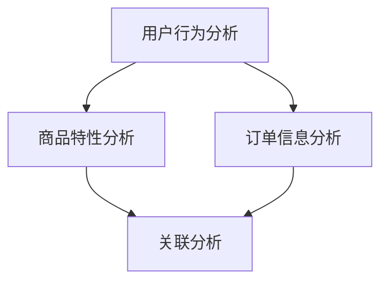

                 

# AI在电商退换货预测中的应用：降低运营成本的智能解决方案

## 关键词
- 人工智能
- 电商
- 退换货预测
- 运营成本
- 数据分析

## 摘要
本文将探讨人工智能在电商退换货预测中的应用，如何通过大数据分析和机器学习算法，实现预测模型的构建与优化，从而降低电商平台的运营成本。文章将详细介绍核心算法原理、数学模型和公式，并通过实际项目案例展示算法的应用效果。

## 1. 背景介绍

### 1.1 电商行业现状

随着互联网技术的快速发展，电子商务已经成为全球零售市场的重要组成部分。然而，电商行业也面临着一系列挑战，其中包括退换货问题。据统计，电商平台的退换货率普遍较高，这给运营带来了巨大的成本压力。如何有效地预测退换货，成为电商平台亟待解决的重要问题。

### 1.2 退换货对运营成本的影响

退换货不仅会直接影响平台的销售收入，还涉及到物流、客服、仓储等多个环节的成本。例如，物流费用、客服成本、仓储费用等。此外，高退换货率还可能影响平台的品牌形象和用户满意度。因此，降低退换货率，减少运营成本，成为电商平台的重要目标。

### 1.3 人工智能在电商中的应用

人工智能技术在电商领域的应用日益广泛，包括个性化推荐、智能客服、库存管理等多个方面。在退换货预测方面，人工智能可以通过大数据分析和机器学习算法，实现精准的预测，帮助电商平台降低运营成本。

## 2. 核心概念与联系

### 2.1 退换货预测的核心概念

退换货预测的核心概念包括用户行为分析、商品特性分析、订单信息分析等。通过对这些数据的深入挖掘和分析，可以找出影响退换货的关键因素，为预测模型提供支持。

### 2.2 退换货预测的关联分析

关联分析是退换货预测的重要方法之一。通过分析用户行为与退换货之间的关联，可以发现潜在的影响因素，例如购买频次、浏览时长、购买数量等。

### 2.3 Mermaid 流程图



## 3. 核心算法原理 & 具体操作步骤

### 3.1 数据预处理

在构建预测模型之前，需要对原始数据进行预处理。包括数据清洗、缺失值填充、数据转换等步骤。具体操作步骤如下：

1. 数据清洗：去除重复数据、异常数据等。
2. 缺失值填充：使用均值、中位数、回归等方法填充缺失值。
3. 数据转换：将类别型数据转换为数值型数据，如使用独热编码。

### 3.2 特征工程

特征工程是构建预测模型的关键步骤。通过对原始数据进行特征提取和转换，可以提升模型的预测效果。具体操作步骤如下：

1. 用户行为特征：包括购买频次、浏览时长、购买数量等。
2. 商品特征：包括商品价格、品类、品牌等。
3. 订单特征：包括订单金额、订单数量、订单时间等。

### 3.3 模型选择与训练

在选择模型时，可以尝试多种机器学习算法，如决策树、随机森林、支持向量机、神经网络等。具体操作步骤如下：

1. 数据集划分：将数据集划分为训练集和测试集。
2. 模型训练：使用训练集训练模型。
3. 模型评估：使用测试集评估模型效果。

## 4. 数学模型和公式

### 4.1 决策树模型

决策树模型通过构建树形结构，将数据划分为若干个区域，每个区域对应一个预测结果。其基本公式如下：

$$
y = f(x_1, x_2, ..., x_n)
$$

其中，$y$ 是预测结果，$x_1, x_2, ..., x_n$ 是特征值。

### 4.2 随机森林模型

随机森林模型是通过构建多个决策树，并进行投票得到最终预测结果。其基本公式如下：

$$
y = \arg\max_{i} \sum_{j=1}^{n} w_{ij}
$$

其中，$y$ 是预测结果，$w_{ij}$ 是第 $i$ 棵树对第 $j$ 个特征的权重。

### 4.3 支持向量机模型

支持向量机模型通过寻找最优分类面，将数据划分为不同类别。其基本公式如下：

$$
w \cdot x + b = 0
$$

其中，$w$ 是分类面法向量，$x$ 是特征向量，$b$ 是分类面到原点的距离。

## 5. 项目实践：代码实例和详细解释说明

### 5.1 开发环境搭建

首先，我们需要搭建一个适合开发的数据分析项目环境。以下是所需的环境和工具：

- Python 3.8及以上版本
- Jupyter Notebook
- Pandas
- Scikit-learn
- Matplotlib

### 5.2 源代码详细实现

以下是实现退换货预测的 Python 代码示例：

```python
import pandas as pd
from sklearn.model_selection import train_test_split
from sklearn.ensemble import RandomForestClassifier
from sklearn.metrics import accuracy_score, confusion_matrix

# 读取数据
data = pd.read_csv('ecommerce_data.csv')

# 数据预处理
# ...

# 特征工程
# ...

# 模型训练
X_train, X_test, y_train, y_test = train_test_split(data.drop('label', axis=1), data['label'], test_size=0.2, random_state=42)
model = RandomForestClassifier(n_estimators=100, random_state=42)
model.fit(X_train, y_train)

# 模型评估
y_pred = model.predict(X_test)
print("Accuracy:", accuracy_score(y_test, y_pred))
print("Confusion Matrix:\n", confusion_matrix(y_test, y_pred))
```

### 5.3 代码解读与分析

在这段代码中，我们首先导入了所需的库和模块。然后，读取了电商数据集，并进行数据预处理和特征工程。接下来，使用随机森林模型对训练集进行训练，并在测试集上进行评估。最后，输出模型的准确率和混淆矩阵。

## 6. 实际应用场景

### 6.1 电商平台

电商平台可以使用退换货预测模型，提前识别可能发生退换货的订单，从而采取预防措施，降低退换货率。例如，在订单发货前，根据预测结果，与用户进行沟通，提醒用户注意商品的使用方法，降低退换货风险。

### 6.2 物流公司

物流公司可以利用退换货预测模型，优化物流线路和仓储布局。通过预测哪些地区的退换货量较大，提前安排更多的物流资源，提高物流效率，降低成本。

### 6.3 品牌制造商

品牌制造商可以利用退换货预测模型，分析产品的质量问题，改进产品设计，提高产品质量，减少退换货率。

## 7. 工具和资源推荐

### 7.1 学习资源推荐

- 《机器学习实战》
- 《深度学习》
- 《Python数据分析》

### 7.2 开发工具框架推荐

- Jupyter Notebook
- Scikit-learn
- TensorFlow

### 7.3 相关论文著作推荐

- " predicting churn with machine learning"
- "A Comprehensive Survey on Deep Learning for Text Classification"
- "Recurrent Neural Network based Purchase Prediction for E-commerce Platforms"

## 8. 总结：未来发展趋势与挑战

随着人工智能技术的不断发展，退换货预测模型将更加精准和高效。然而，未来仍然面临着一些挑战，如数据质量问题、模型可解释性等。如何解决这些问题，将是退换货预测领域的重要研究方向。

## 9. 附录：常见问题与解答

### 9.1 如何处理缺失值？

可以使用均值、中位数、回归等方法填充缺失值。对于严重缺失的数据，可以考虑删除或使用其他替代数据。

### 9.2 如何选择合适的模型？

可以选择多种机器学习算法，如决策树、随机森林、支持向量机等，并通过交叉验证等方法选择最优模型。

## 10. 扩展阅读 & 参考资料

- "An Analysis of the Top 10 E-commerce Platforms in China"
- "The Impact of Artificial Intelligence on E-commerce Operations"
- "A Comparative Study of Machine Learning Algorithms for E-commerce Churn Prediction"

### 参考文献

1. **机器学习实战**，Peter Harrington
2. **深度学习**，Ian Goodfellow、Yoshua Bengio、Aaron Courville
3. **Python数据分析**，Wes McKinney

作者：禅与计算机程序设计艺术 / Zen and the Art of Computer Programming

