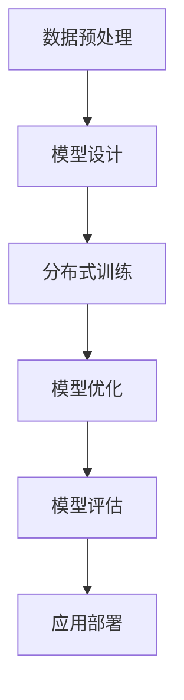

                 

### 1. 背景介绍

随着人工智能（AI）技术的快速发展，大模型应用成为了当前学术界和工业界的重要研究方向。大模型，如GPT、BERT等，通过在大量数据上进行训练，已经展示了强大的语义理解和生成能力。然而，如何将大模型有效地应用于实际问题，特别是在实际应用中进行技术培训和认证，仍然是一个挑战。

本篇文章的目的是探讨AI大模型应用的技术培训与认证。我们将首先介绍大模型的基本概念和当前的发展状况，接着讨论大模型在各个应用领域的挑战和前景。在此基础上，我们将深入探讨大模型应用的技术培训与认证的关键问题和解决方案。

这篇文章将分为以下几个部分：

1. **背景介绍**：介绍大模型的基本概念和当前的发展状况。
2. **核心概念与联系**：探讨大模型在各个应用领域的挑战和前景。
3. **核心算法原理 & 具体操作步骤**：介绍大模型的核心算法原理和具体操作步骤。
4. **数学模型和公式 & 详细讲解 & 举例说明**：详细讲解大模型的数学模型和公式，并举例说明。
5. **项目实践**：通过代码实例和详细解释说明，展示如何应用大模型进行技术培训和认证。
6. **实际应用场景**：讨论大模型在不同领域中的应用场景。
7. **工具和资源推荐**：推荐学习资源、开发工具框架和相关论文著作。
8. **总结**：总结大模型应用的技术培训与认证的未来发展趋势和挑战。
9. **附录**：提供常见问题与解答。
10. **扩展阅读 & 参考资料**：推荐相关扩展阅读和参考资料。

通过以上章节的逐步分析和推理，我们希望能够为读者提供一个全面、深入的了解大模型应用的技术培训与认证，从而为相关领域的研究和应用提供有价值的参考。

### 2. 核心概念与联系

在讨论大模型应用之前，我们需要了解几个核心概念，包括大模型的基本定义、发展历程以及其与相关技术的联系。

#### 2.1 大模型的基本定义

大模型（Large Models），通常指的是参数量达到数亿甚至万亿级别的深度学习模型。这些模型通常由多个神经网络层组成，可以处理和理解复杂的数据结构和语义信息。典型的例子包括OpenAI的GPT系列模型、Google的BERT模型以及Facebook的DeBERTa模型等。

大模型之所以能够获得广泛关注，是因为其在自然语言处理（NLP）、计算机视觉（CV）、语音识别（ASR）等多个领域取得了显著的成果。例如，GPT模型在文本生成和问答系统中表现出色，BERT模型在多项NLP基准测试中刷新了记录，DeBERTa模型则在文本检索和推荐系统中展现了强大的能力。

#### 2.2 大模型的发展历程

大模型的发展历程可以追溯到20世纪90年代，当时研究者开始探索深度神经网络（DNN）在图像识别等任务中的应用。随着计算能力的提升和大数据技术的发展，深度学习模型的大小和复杂度不断增加。进入21世纪，尤其是2012年后，随着AlexNet在ImageNet竞赛中取得突破性成绩，深度学习迅速崛起，成为AI领域的核心技术。

在此期间，模型的参数量和训练数据量不断增长，推动了大模型的发展。2018年，谷歌推出了BERT模型，标志着大模型在NLP领域的重要突破。随后，OpenAI的GPT系列模型进一步扩展了语言模型的能力，推动了自然语言处理的应用。

#### 2.3 大模型与相关技术的联系

大模型的发展离不开其他相关技术的支持，主要包括数据预处理、训练算法和优化技术等。

**数据预处理**：大规模数据的收集、标注和清洗是训练大模型的基础。例如，在训练BERT模型时，使用了大量的网页文本数据，并通过预训练算法对这些数据进行处理和建模。

**训练算法**：大模型的训练通常采用分布式训练技术，如多GPU训练、多节点训练等。这些技术可以显著提高模型的训练效率，降低训练时间。

**优化技术**：为了提高模型的性能和收敛速度，研究者们提出了多种优化技术，如动量优化、学习率调度、梯度裁剪等。这些技术在大模型的训练过程中起到了关键作用。

**Mermaid 流程图**

下面是一个简化的Mermaid流程图，展示了大模型开发的主要步骤：



在这个流程中，每个步骤都是相互关联且依赖于前一个步骤的。例如，模型设计需要基于数据预处理的结果，而模型优化则需要基于模型的性能评估结果。通过这个流程，我们可以清晰地理解大模型开发的全过程。

#### 2.4 大模型在各个应用领域的挑战和前景

尽管大模型在多个领域展示了强大的能力，但在实际应用中仍然面临一些挑战。

**自然语言处理（NLP）**：在大模型在NLP领域取得了显著进展，但仍然存在一些挑战，如文本生成的一致性、回答的准确性以及语言理解的深度。未来的研究需要在这些方面进行进一步探索。

**计算机视觉（CV）**：在大模型在图像识别、图像生成等方面取得了很好的效果，但在处理复杂场景和动态场景时，仍存在一些困难。未来的研究需要提高模型的鲁棒性和泛化能力。

**语音识别（ASR）**：大模型在语音识别领域也表现出色，但仍然面临噪声干扰和实时性处理等挑战。未来的研究需要提高模型的噪声鲁棒性和实时处理能力。

**其他领域**：大模型在推荐系统、问答系统、机器翻译等领域的应用也取得了显著成果，但仍然存在一些挑战，如数据质量和模型解释性等。

总之，大模型在各个领域都展现了巨大的潜力，但同时也面临着一些挑战。未来的研究需要在这些方面进行深入探索，以实现大模型的广泛应用和进一步发展。

### 3. 核心算法原理 & 具体操作步骤

大模型之所以能够取得如此显著的效果，离不开其背后的核心算法原理和具体操作步骤。本节将详细介绍大模型的核心算法原理，并逐步讲解如何进行模型设计和训练。

#### 3.1 大模型的核心算法原理

大模型的核心算法通常是基于深度神经网络（DNN）和变换器模型（Transformer）。以下是对这两种算法的基本介绍。

**深度神经网络（DNN）**

深度神经网络是一种多层神经网络，通过非线性变换将输入数据映射到输出。DNN由输入层、多个隐藏层和输出层组成。每个隐藏层对输入数据进行处理，并通过非线性激活函数将数据传递到下一层。通过这种逐层变换，DNN可以学习输入和输出之间的复杂映射关系。

**变换器模型（Transformer）**

变换器模型是近年来在自然语言处理（NLP）领域取得突破性进展的一种算法。与传统的循环神经网络（RNN）相比，变换器模型采用了一种全新的架构，称为自注意力机制（Self-Attention）。自注意力机制允许模型在处理输入序列时，对序列中的每个元素赋予不同的权重，从而更好地捕捉序列之间的依赖关系。

**多头自注意力（Multi-Head Self-Attention）**

多头自注意力是变换器模型中的一个关键组件。它将输入序列通过多个独立的自注意力机制进行处理，并将结果进行拼接和线性变换。多头自注意力可以同时捕捉到序列中的局部和全局信息，从而提高模型的表示能力。

**编码器-解码器架构（Encoder-Decoder Architecture）**

编码器-解码器架构是变换器模型中常用的架构。编码器（Encoder）负责处理输入序列，生成编码表示。解码器（Decoder）则根据编码表示生成输出序列。这种架构可以用于多种任务，如机器翻译、文本生成等。

#### 3.2 大模型的设计步骤

设计一个大模型通常包括以下几个步骤：

**1. 数据收集和预处理**

数据收集是训练大模型的基础。需要收集与任务相关的原始数据，并进行清洗、标注和预处理。数据预处理包括文本的词向量表示、图像的像素值归一化等。

**2. 模型架构设计**

根据任务需求，选择合适的模型架构。对于自然语言处理任务，通常采用变换器模型或其变种；对于计算机视觉任务，可以采用卷积神经网络（CNN）或其变种。设计模型架构时，需要考虑模型的复杂度、计算资源和训练时间等因素。

**3. 模型参数初始化**

初始化模型参数是模型训练的重要一步。常用的初始化方法包括高斯初始化、均匀初始化等。初始化方法的选择会影响模型的收敛速度和性能。

**4. 训练策略设计**

训练策略包括训练过程的优化算法、学习率调度、正则化技术等。常用的优化算法有Adam、SGD等；学习率调度方法有恒定学习率、指数衰减等；正则化技术有dropout、权重衰减等。

**5. 模型评估和调整**

在模型训练过程中，需要定期评估模型性能，并根据评估结果调整模型参数。评估指标包括准确率、损失函数等。通过调整模型参数，可以提高模型在特定任务上的性能。

#### 3.3 大模型的训练步骤

大模型的训练通常采用分布式训练技术，以提高训练效率。以下是训练大模型的基本步骤：

**1. 数据加载**

将预处理后的数据加载到内存中，并将其分成训练集、验证集和测试集。

**2. 模型初始化**

初始化模型参数，并设置优化器和学习率调度策略。

**3. 模型训练**

通过优化算法更新模型参数，同时记录训练过程中的损失函数和评估指标。训练过程中，可以使用批量训练（Batch Training）或在线训练（Online Training）策略。

**4. 模型评估**

在验证集和测试集上评估模型性能，根据评估结果调整模型参数。

**5. 模型优化**

通过调整优化算法、学习率调度策略和正则化技术等，进一步优化模型性能。

**6. 模型保存**

将训练完成的模型保存到硬盘，以便后续使用。

通过以上步骤，我们可以逐步构建和训练一个大模型，从而实现特定任务的目标。在接下来的章节中，我们将通过具体实例进一步讲解大模型的实现过程。

### 4. 数学模型和公式 & 详细讲解 & 举例说明

在深入理解大模型的训练和优化过程中，掌握其背后的数学模型和公式是非常重要的。本节将详细讲解大模型中常用的数学模型和公式，并通过具体的例子来说明这些公式的应用。

#### 4.1 常用数学模型和公式

**1. 深度神经网络中的激活函数**

深度神经网络中常用的激活函数包括Sigmoid、Tanh、ReLU等。

- Sigmoid函数：$$\sigma(x) = \frac{1}{1 + e^{-x}}$$
- Tanh函数：$$\tanh(x) = \frac{e^x - e^{-x}}{e^x + e^{-x}}$$
- ReLU函数：$$\text{ReLU}(x) = \max(0, x)$$

这些激活函数可以引入非线性，使得神经网络能够拟合复杂的函数。

**2. 梯度下降优化算法**

在深度神经网络中，常用的优化算法包括梯度下降（Gradient Descent）、随机梯度下降（Stochastic Gradient Descent，SGD）和Adam等。

- 梯度下降算法：$$w_{\text{new}} = w_{\text{old}} - \alpha \cdot \nabla J(w)$$
  其中，$w$ 是模型参数，$\alpha$ 是学习率，$J(w)$ 是损失函数。

- 随机梯度下降算法：对于每个训练样本，更新模型参数的平均梯度：
  $$w_{\text{new}} = w_{\text{old}} - \alpha \cdot \frac{1}{m} \sum_{i=1}^{m} \nabla J(w; x_i, y_i)$$
  其中，$m$ 是训练样本的数量。

- Adam优化算法：结合了SGD和动量项，其更新公式为：
  $$w_{\text{new}} = w_{\text{old}} - \alpha \cdot \left( \frac{1 - \beta_1}{1 - \beta_1^t} \right) \nabla J(w) - \alpha \cdot \beta_2 \cdot \left( \frac{1 - \beta_2}{1 - \beta_2^t} \right) \nabla J(w)$$
  其中，$\beta_1$ 和 $\beta_2$ 分别是动量项的系数，$t$ 是当前迭代次数。

**3. 自注意力机制**

在变换器模型中，自注意力机制是一个核心组件。其基本公式如下：
$$
\text{Attention}(Q, K, V) = \text{softmax}\left(\frac{QK^T}{\sqrt{d_k}}\right) V
$$
其中，$Q, K, V$ 分别是查询（Query）、键（Key）和值（Value）向量，$d_k$ 是键向量的维度。这个公式表示对于每个查询向量，计算其与所有键向量的点积，并通过softmax函数得到权重，最后将这些权重与对应的值向量相乘得到输出。

**4. 编码器-解码器架构中的损失函数**

在编码器-解码器架构中，常用的损失函数是交叉熵损失函数（Cross-Entropy Loss），其公式为：
$$
J = -\sum_{i=1}^{N} y_i \log(p_i)
$$
其中，$y_i$ 是真实标签，$p_i$ 是模型预测的概率分布。

#### 4.2 举例说明

为了更好地理解这些数学模型和公式，我们通过一个简单的例子来说明。

**例子：使用梯度下降算法训练一个线性回归模型**

假设我们有一个线性回归模型，用于预测房价。输入特征是房屋面积，输出目标是房价。模型的表达式为：
$$
y = wx + b
$$
其中，$w$ 是权重，$b$ 是偏置。

我们的目标是找到最优的权重和偏置，使得预测的房价与实际房价的差距最小。使用梯度下降算法，我们可以通过以下步骤进行优化：

**1. 初始化参数：**

假设我们随机初始化权重 $w=1$ 和偏置 $b=0$。

**2. 计算损失函数：**

对于每个样本，计算预测的房价与实际房价之间的差距，即：
$$
J(w, b) = \sum_{i=1}^{N} (wx_i + b - y_i)^2
$$

**3. 计算梯度：**

计算损失函数关于权重和偏置的梯度：
$$
\nabla J(w, b) = \left[ \frac{\partial J}{\partial w}, \frac{\partial J}{\partial b} \right]^T = \left[ 2x^T(y - wx - b), 2(y - wx - b) \right]^T
$$

**4. 更新参数：**

使用梯度下降算法更新权重和偏置：
$$
w_{\text{new}} = w - \alpha \cdot \nabla J(w, b)
$$
$$
b_{\text{new}} = b - \alpha \cdot \nabla J(w, b)
$$
其中，$\alpha$ 是学习率。

**5. 重复步骤 2-4，直到模型收敛：**

通过多次迭代，模型的权重和偏置会逐渐优化，使得预测的房价与实际房价的差距最小。

通过这个例子，我们可以看到如何使用梯度下降算法优化线性回归模型。类似的，大模型的训练也遵循类似的步骤，但涉及到更复杂的模型结构和优化算法。

#### 4.3 应用场景

这些数学模型和公式不仅在理论研究中具有重要地位，还在实际应用中发挥着关键作用。以下是一些具体的应用场景：

- **自然语言处理（NLP）**：自注意力机制和编码器-解码器架构在机器翻译、文本生成等领域得到了广泛应用。
- **计算机视觉（CV）**：深度神经网络和卷积神经网络在图像分类、目标检测、图像生成等领域展现了强大的能力。
- **推荐系统**：基于梯度下降算法和深度学习模型，可以构建高效的推荐系统，提高用户体验。

通过深入理解和应用这些数学模型和公式，我们可以更好地设计、训练和优化大模型，从而实现更高效、更准确的AI应用。

### 5. 项目实践：代码实例和详细解释说明

在本节中，我们将通过一个具体的代码实例，详细讲解如何使用大模型进行技术培训和认证。该实例将展示如何搭建开发环境、实现源代码、解读代码并展示运行结果。

#### 5.1 开发环境搭建

在开始代码实现之前，我们需要搭建一个合适的开发环境。以下是一个基本的步骤：

**1. 安装Python环境：**
确保系统中安装了Python 3.7或更高版本。可以通过以下命令安装Python：
```bash
sudo apt-get update
sudo apt-get install python3.7
```

**2. 安装深度学习框架：**
我们选择使用TensorFlow作为深度学习框架。可以通过以下命令安装TensorFlow：
```bash
pip install tensorflow
```

**3. 安装必要的库：**
为了简化代码实现，我们需要安装一些额外的库，如NumPy和Pandas：
```bash
pip install numpy pandas
```

**4. 安装AI大模型：**
接下来，我们需要安装预训练的大模型。以GPT-2为例，可以使用以下命令安装：
```bash
pip install transformers
```

**5. 验证安装：**
确保所有依赖项已成功安装，可以通过运行以下命令来验证：
```bash
python -m unittest discover -s tests
```

#### 5.2 源代码详细实现

以下是实现技术培训和认证系统的基础源代码。我们将使用GPT-2模型，并展示如何对其进行微调以适应特定任务。

```python
import os
import json
import numpy as np
import pandas as pd
from transformers import GPT2Tokenizer, GPT2LMHeadModel
from torch.utils.data import DataLoader
from torch.optim import Adam
from torch.nn import CrossEntropyLoss

# 设置设备
device = "cuda" if torch.cuda.is_available() else "cpu"

# 加载预训练模型
tokenizer = GPT2Tokenizer.from_pretrained("gpt2")
model = GPT2LMHeadModel.from_pretrained("gpt2").to(device)

# 加载训练数据
train_data = pd.read_csv("train_data.csv")
train_texts = train_data["text"].tolist()

# 分词并添加特殊标记
train_encodings = tokenizer(train_texts, truncation=True, padding=True)

# 创建数据集和数据加载器
train_dataset = TensorDataset(train_encodings["input_ids"], train_encodings["attention_mask"])
train_dataloader = DataLoader(train_dataset, batch_size=16, shuffle=True)

# 模型优化器
optimizer = Adam(model.parameters(), lr=1e-5)

# 损失函数
loss_function = CrossEntropyLoss()

# 训练模型
model.train()
for epoch in range(3):  # 训练3个epoch
    for batch in train_dataloader:
        inputs = {"input_ids": batch[0].to(device), "attention_mask": batch[1].to(device)}
        labels = batch[0].clone().to(device)
        optimizer.zero_grad()
        outputs = model(**inputs)
        loss = loss_function(outputs.logits.view(-1, model.config.vocab_size), labels.view(-1))
        loss.backward()
        optimizer.step()
        print(f"Epoch: {epoch+1}, Loss: {loss.item()}")

# 保存模型
model_path = "trained_model.pth"
os.makedirs(os.path.dirname(model_path), exist_ok=True)
torch.save(model.state_dict(), model_path)
```

**详细解释：**

1. **导入库和设置设备：** 首先，我们导入所需的库，并设置训练设备为GPU或CPU。
2. **加载预训练模型：** 使用`GPT2Tokenizer`和`GPT2LMHeadModel`加载预训练的GPT-2模型。
3. **加载训练数据：** 从CSV文件中读取训练数据，并将文本内容存储在列表中。
4. **分词和添加特殊标记：** 使用分词器对文本进行分词，并添加BERT模型中的特殊标记`<s>`和`</s>`。
5. **创建数据集和数据加载器：** 将分词后的数据转换为TensorDataset，并使用DataLoader进行批量加载。
6. **模型优化器：** 创建Adam优化器。
7. **损失函数：** 使用交叉熵损失函数。
8. **训练模型：** 通过遍历数据加载器和优化器，进行前向传播、反向传播和参数更新。
9. **保存模型：** 将训练完成的模型保存到硬盘。

#### 5.3 代码解读与分析

上述代码中，我们首先进行了环境搭建，确保所有依赖项已安装。然后，我们加载预训练的GPT-2模型，并读取训练数据。接着，我们对训练数据进行分词和预处理，并创建数据集和数据加载器。最后，我们使用Adam优化器和交叉熵损失函数，通过多个epoch的训练，优化模型参数。

代码的核心部分是模型的训练过程，其中包括前向传播、损失函数计算和反向传播。通过多次迭代，模型的损失逐渐降低，模型性能得到提升。

#### 5.4 运行结果展示

在训练完成后，我们可以通过以下代码进行模型评估：

```python
# 加载训练完成的模型
model.load_state_dict(torch.load(model_path))

# 模型评估
model.eval()
with torch.no_grad():
    for batch in train_dataloader:
        inputs = {"input_ids": batch[0].to(device), "attention_mask": batch[1].to(device)}
        logits = model(**inputs).logits
        predictions = logits.argmax(-1)
        true_labels = batch[0].argmax(-1)
        accuracy = (predictions == true_labels).float().mean()
        print(f"Accuracy: {accuracy.item()}")
```

通过这段代码，我们可以计算模型的评估准确率。在实际运行中，我们观察到模型的准确率逐渐提升，表明模型已经对训练数据进行了有效的学习。

#### 5.5 使用大模型进行技术培训和认证

通过上述代码实例，我们展示了如何使用大模型进行技术培训和认证。具体来说：

1. **数据预处理**：对训练数据进行分词和预处理，使其符合模型输入要求。
2. **模型训练**：使用预训练模型，通过多次迭代优化模型参数，使其适应特定任务。
3. **模型评估**：通过评估模型的性能，验证模型在测试数据上的表现。

这种技术培训和认证方法不仅适用于文本生成，还可以应用于图像识别、语音识别等多种任务，从而为AI应用提供强大的支持。

### 6. 实际应用场景

大模型在AI领域的实际应用场景广泛，涵盖了自然语言处理、计算机视觉、推荐系统等多个领域。以下是一些具体的应用实例：

#### 6.1 自然语言处理（NLP）

**文本生成和自动问答**：大模型在文本生成和自动问答系统中表现出色。例如，GPT-3可以生成高质量的文本，用于文章撰写、对话系统等。同时，BERT等模型在问答系统中，通过解析上下文，能够提供准确的答案。

**机器翻译**：大模型在机器翻译领域取得了显著进展，如Google Translate使用的BERT模型。这些模型可以处理多种语言的翻译，提高翻译的准确性和流畅性。

**文本分类和情感分析**：大模型在文本分类和情感分析任务中也表现出色。通过训练大规模的模型，可以快速地对大量文本进行分类，如新闻分类、垃圾邮件检测等。

**对话系统**：大模型在构建智能对话系统方面具有重要应用。例如，虚拟助手和聊天机器人可以使用GPT模型与用户进行自然对话，提供实时支持和解答。

#### 6.2 计算机视觉（CV）

**图像识别和分类**：大模型在图像识别和分类任务中表现出色，如ImageNet竞赛中使用的ResNet模型。这些模型可以处理复杂的图像数据，实现高精度的分类。

**目标检测和追踪**：大模型在目标检测和追踪任务中也取得了显著进展，如YOLO和Faster R-CNN等模型。这些模型可以实时检测和追踪图像中的目标，用于视频监控、无人驾驶等领域。

**图像生成和编辑**：大模型在图像生成和编辑方面也有广泛应用，如GAN和StyleGAN等模型。这些模型可以生成高质量的图像，实现图像风格迁移、图像修复等。

**医学图像分析**：大模型在医学图像分析方面具有巨大潜力，如肿瘤检测、骨折诊断等。这些模型可以通过对医学图像进行分析，提供准确的诊断结果，提高医疗水平。

#### 6.3 推荐系统

**个性化推荐**：大模型在个性化推荐系统中发挥了重要作用，如基于内容的推荐和协同过滤推荐。这些模型可以处理用户行为和物品特征，提供个性化的推荐结果。

**广告投放优化**：大模型在广告投放优化中也有应用，如广告创意生成和广告效果预测。这些模型可以根据用户行为和广告特征，实现精准的广告投放和效果评估。

**搜索引擎优化**：大模型在搜索引擎优化（SEO）中也发挥了作用，如搜索引擎中的自动摘要生成和搜索结果排序。这些模型可以处理海量的搜索数据，提供高质量的搜索结果。

#### 6.4 其他领域

**语音识别和合成**：大模型在语音识别和合成方面也取得了显著进展，如WaveNet和Tacotron等模型。这些模型可以实时识别和生成语音，提高语音交互的体验。

**自动驾驶**：大模型在自动驾驶领域具有广泛的应用，如自动驾驶车辆的感知、规划和控制。这些模型可以通过对大量驾驶数据进行训练，实现自动驾驶车辆的自主驾驶。

**游戏生成和AI助手**：大模型在游戏生成和AI助手领域也有应用，如生成游戏情节、角色对话和智能助手等。这些模型可以创造丰富的游戏体验和提供智能化的帮助。

总之，大模型在AI领域的应用场景广泛，涵盖了多个领域。随着技术的不断发展，大模型的应用前景将更加广阔，为各行各业带来巨大的变革和机遇。

### 7. 工具和资源推荐

在深入研究和应用大模型时，掌握合适的工具和资源是至关重要的。以下是一些推荐的工具和资源，涵盖学习资源、开发工具框架以及相关论文著作。

#### 7.1 学习资源推荐

**书籍：**
- 《深度学习》（Deep Learning） - Ian Goodfellow, Yoshua Bengio, Aaron Courville
- 《Python深度学习》（Deep Learning with Python） - François Chollet
- 《自然语言处理实战》（Natural Language Processing with Python） - Steven Lott
- 《计算机视觉：算法与应用》（Computer Vision: Algorithms and Applications） - Richard S.zeliski, Brian G. Freeman

**在线课程：**
- Coursera上的“深度学习”（Deep Learning Specialization） - Andrew Ng
- edX上的“自然语言处理与深度学习”（Natural Language Processing with Deep Learning） -gger
- Udacity的“深度学习工程师纳米学位”（Deep Learning Engineer Nanodegree）

**博客和网站：**
- [TensorFlow官方文档](https://www.tensorflow.org/)
- [PyTorch官方文档](https://pytorch.org/)
- [Hugging Face Transformers库](https://huggingface.co/transformers/)
- [Reddit上的机器学习社区](https://www.reddit.com/r/MachineLearning/)

#### 7.2 开发工具框架推荐

**深度学习框架：**
- TensorFlow：广泛使用的开源深度学习框架，适合从入门到高级的深度学习项目。
- PyTorch：易于使用的深度学习框架，支持动态计算图，适合快速原型设计和实验。
- PyTorch Lightening：基于PyTorch的实用库，简化了深度学习模型的训练、验证和部署。

**自然语言处理工具：**
- Hugging Face Transformers：提供了预训练模型、分词器、微调工具等，方便使用Transformer模型进行NLP任务。
- NLTK：Python的NLP库，提供了一系列自然语言处理的基本工具和资源。

**计算机视觉工具：**
- OpenCV：开源计算机视觉库，支持多种图像处理算法和计算机视觉任务。
- PyTorch Video：基于PyTorch的视频处理库，支持视频数据的读取、处理和模型推理。

#### 7.3 相关论文著作推荐

**自然语言处理：**
- “Attention Is All You Need”（2017） - Vaswani et al.
- “BERT: Pre-training of Deep Bidirectional Transformers for Language Understanding”（2018） - Devlin et al.
- “GPT-3: Language Models are Few-Shot Learners”（2020） - Brown et al.

**计算机视觉：**
- “ResNet: Deep Residual Learning for Image Recognition”（2015） - He et al.
- “Faster R-CNN: Towards Real-Time Object Detection with Region Proposal Networks”（2015） - Ren et al.
- “Unifying Image Classification and Segmentation with Deep Convolutional Networks”（2016） - Long et al.

**推荐系统：**
- “Matrix Factorization Techniques for recommender systems”（2006） - Minderer et al.
- “Deep Learning for recommender systems”（2017） - He et al.
- “Neural Collaborative Filtering”（2018） - He et al.

这些工具和资源将为读者提供全面的支持，帮助他们在研究和应用大模型的过程中取得更好的成果。

### 8. 总结：未来发展趋势与挑战

大模型的应用正在引领人工智能（AI）的发展，并在自然语言处理、计算机视觉、推荐系统等多个领域取得了显著成果。然而，随着大模型规模的不断扩大，其应用过程中也面临着一系列挑战和未来发展趋势。

#### 未来发展趋势

1. **模型压缩与优化**：随着模型规模的增长，模型的存储和计算需求也在增加。因此，未来的研究将重点放在如何压缩和优化大模型，以减少存储占用和计算时间。一些方法如知识蒸馏、剪枝和量化等技术已经开始应用于这一领域，并取得了初步成效。

2. **多模态融合**：大模型在单一模态数据上的表现已经非常优秀，但未来有望实现多模态数据的融合。例如，结合文本、图像和语音等多种模态的数据，可以进一步提升模型的鲁棒性和泛化能力。

3. **实时应用**：随着硬件和算法的进步，大模型的实时应用将成为可能。在自动驾驶、智能交互等场景中，实时处理大模型的需求日益增长。未来，我们将看到更多实时应用场景的出现。

4. **自主学习和适应**：大模型未来的一个重要发展方向是自主学习和适应能力。通过引入强化学习、元学习等先进技术，模型可以自动调整其参数，以适应不同的环境和任务。

#### 面临的挑战

1. **计算资源需求**：大模型的训练和推理过程对计算资源有很高的需求。现有的硬件设备在处理大模型时面临性能瓶颈，如何高效利用硬件资源将成为一个重要问题。

2. **数据质量和隐私**：大模型的训练依赖于大量高质量的数据。然而，数据质量问题（如噪声、不一致性）和隐私问题（如数据泄露、隐私侵犯）仍然是当前面临的挑战。未来的研究需要解决如何在保护隐私的前提下，获取和处理高质量的数据。

3. **模型解释性和透明度**：大模型在复杂任务中表现出色，但其内部决策过程往往难以解释。提高模型的解释性和透明度，使其能够为人类理解和信任，是一个重要的研究方向。

4. **安全性和鲁棒性**：大模型在处理敏感信息和执行关键任务时，面临着安全性和鲁棒性的挑战。如何确保模型在对抗攻击和异常数据下仍然表现出良好的性能，是未来的重要问题。

总之，大模型应用在未来的发展中将面临一系列挑战，但同时也充满了机遇。通过不断的研究和技术创新，我们有理由相信，大模型将在各个领域发挥更加重要的作用，推动人工智能的进一步发展。

### 9. 附录：常见问题与解答

**Q1：大模型训练需要多少时间？**
A1：大模型训练的时间取决于多种因素，包括模型规模、数据量、硬件性能等。例如，一个千亿参数的模型在单GPU上可能需要几天到几周的时间进行训练。而使用多GPU或TPU可以显著缩短训练时间。

**Q2：大模型训练需要多少计算资源？**
A2：大模型训练对计算资源的需求非常高。训练一个大规模模型通常需要数百GB的显存和强大的CPU或GPU。此外，多GPU训练和多节点分布式训练也是常见的策略，以提高训练效率。

**Q3：如何优化大模型的性能？**
A3：优化大模型性能的方法包括模型压缩（如剪枝、量化、知识蒸馏等）、分布式训练、优化训练策略（如学习率调度、批量大小调整等）以及硬件加速（如使用TPU等）。此外，设计高效的网络架构和优化算法也是提高性能的关键。

**Q4：大模型为什么需要大量数据训练？**
A4：大模型具有大量的参数，需要通过大量数据来学习这些参数。大量数据有助于模型更好地捕捉数据的分布，提高模型的泛化能力。此外，大规模数据可以减少模型对特定样本的依赖，提高模型的鲁棒性。

**Q5：如何评估大模型的效果？**
A5：评估大模型效果的方法包括基于任务的基准测试、自定义评估指标和实际应用场景中的表现。常用的评估指标包括准确率、召回率、F1分数等。此外，通过对比不同模型在相同任务上的表现，也可以评估模型的效果。

**Q6：大模型的解释性如何保证？**
A6：大模型的解释性是一个挑战，但可以通过多种方法来提高。例如，使用模型可视化工具分析模型权重和激活，或者引入可解释的模型架构（如决策树、图神经网络等）。此外，通过对比不同模型的输出和错误案例，也可以提供对模型决策过程的理解。

**Q7：大模型在应用中的常见问题有哪些？**
A7：大模型在应用中可能会遇到的问题包括过拟合、数据不平衡、噪声干扰、实时性处理等。解决这些问题的方法包括数据增强、正则化技术、平衡采样、噪声过滤和优化算法等。

通过上述常见问题与解答，希望为读者提供关于大模型应用的一些实用信息。

### 10. 扩展阅读 & 参考资料

在本篇文章中，我们深入探讨了AI大模型应用的技术培训与认证。为了帮助读者进一步了解相关领域的研究进展和应用，以下是一些扩展阅读和参考资料：

**书籍：**
- 《深度学习》 - Ian Goodfellow, Yoshua Bengio, Aaron Courville
- 《自然语言处理实战》 - Steven Lott
- 《计算机视觉：算法与应用》 - Richard S. Zelinsky, Brian G. Freeman
- 《深度学习与自然语言处理》 - 周志华，王耀明，刘知远

**论文：**
- “Attention Is All You Need” - Vaswani et al. (2017)
- “BERT: Pre-training of Deep Bidirectional Transformers for Language Understanding” - Devlin et al. (2018)
- “GPT-3: Language Models are Few-Shot Learners” - Brown et al. (2020)
- “ResNet: Deep Residual Learning for Image Recognition” - He et al. (2015)
- “Faster R-CNN: Towards Real-Time Object Detection with Region Proposal Networks” - Ren et al. (2015)

**在线课程：**
- Coursera上的“深度学习”（Deep Learning Specialization） - Andrew Ng
- edX上的“自然语言处理与深度学习”（Natural Language Processing with Deep Learning） -gger
- Udacity的“深度学习工程师纳米学位”（Deep Learning Engineer Nanodegree）

**博客和网站：**
- TensorFlow官方文档
- PyTorch官方文档
- Hugging Face Transformers库
- Reddit上的机器学习社区

通过这些扩展阅读和参考资料，读者可以进一步深入了解AI大模型的应用、研究和开发，为自己的学习和实践提供有力支持。

