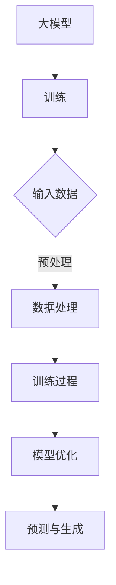
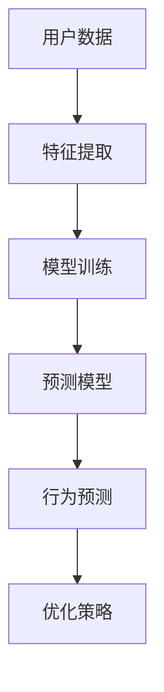
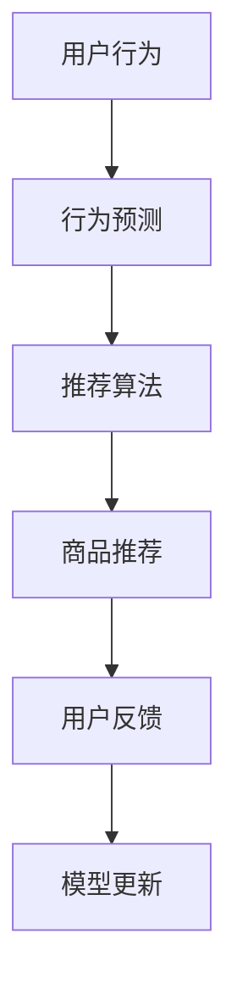

                 

# AI大模型：优化电商平台用户终身价值与短期收益平衡的新方法

## 关键词
- 人工智能（AI）
- 大模型（Large Models）
- 用户终身价值（Customer Lifetime Value, CLV）
- 短期收益（Short-term Revenue）
- 电商平台（E-commerce Platform）
- 优化策略（Optimization Strategies）

## 摘要
本文将探讨如何利用人工智能大模型，优化电商平台在提升用户终身价值与实现短期收益之间的平衡。通过深入分析大模型在用户行为预测、个性化推荐和需求满足等方面的应用，提出了一套系统性的优化方法。文章将从核心概念出发，逐步阐述算法原理、数学模型，并通过实际项目和代码实例，展示该方法的可行性和效果。最终，文章将对未来发展趋势和面临的挑战进行展望，为电商平台提供切实可行的解决方案。

### 1. 背景介绍（Background Introduction）

在当今数字化时代，电商平台已经成为消费者购物的主要渠道之一。随着市场竞争的加剧，如何提高用户满意度、提升用户终身价值（Customer Lifetime Value, CLV）以及实现短期收益的平衡，成为电商平台亟待解决的关键问题。

#### 1.1 用户终身价值（Customer Lifetime Value, CLV）

用户终身价值是指一个用户在整个消费生命周期中为平台带来的总价值。它不仅包括用户在平台上的直接购买支出，还包括用户通过平台进行的间接购买、推荐新用户以及用户在平台上的活跃度等因素。因此，提高用户终身价值是电商平台持续发展的核心目标之一。

#### 1.2 短期收益（Short-term Revenue）

短期收益通常指的是在短期内通过促销、广告、折扣等手段实现的销售额增长。对于电商平台来说，短期收益是衡量其运营效果和市场竞争力的关键指标。然而，过度追求短期收益可能导致用户忠诚度下降、长期价值受损。

#### 1.3 大模型在电商平台中的应用

随着人工智能技术的不断发展，大模型（Large Models）在电商平台中的应用逐渐成为研究热点。大模型具有强大的数据处理能力和复杂的模型结构，可以用于用户行为预测、个性化推荐、需求满足等多个方面，从而帮助电商平台实现用户终身价值与短期收益的平衡。

### 2. 核心概念与联系（Core Concepts and Connections）

在本节中，我们将介绍核心概念，包括大模型、用户行为预测、个性化推荐等，并使用Mermaid流程图展示相关架构。

#### 2.1 大模型

大模型是指具有数十亿甚至数万亿参数的深度学习模型，如GPT-3、BERT等。这些模型通过大规模数据训练，能够理解并生成复杂的自然语言文本。



#### 2.2 用户行为预测

用户行为预测是指利用大模型分析用户历史行为数据，预测用户未来可能的行为，如购买、评价等。



#### 2.3 个性化推荐

个性化推荐是指利用大模型和用户行为预测，为用户提供个性化商品推荐，从而提高用户满意度和购买意愿。



### 3. 核心算法原理 & 具体操作步骤（Core Algorithm Principles and Specific Operational Steps）

在本节中，我们将详细讨论核心算法原理，包括大模型的训练过程、用户行为预测模型和个性化推荐算法的具体实现步骤。

#### 3.1 大模型的训练过程

大模型的训练过程通常包括数据预处理、模型架构选择、训练和优化等步骤。

1. 数据预处理：将原始用户行为数据清洗、归一化和特征提取，形成适合训练的数据集。
2. 模型架构选择：选择合适的大模型架构，如GPT-3、BERT等。
3. 训练过程：使用大量数据进行模型训练，通过反向传播和梯度下降等优化算法，不断调整模型参数，使其达到预期性能。
4. 模型优化：通过调整模型结构、超参数和训练策略，提高模型在预测任务上的准确性。

#### 3.2 用户行为预测模型

用户行为预测模型通过分析用户历史行为数据，预测用户未来可能的行为。

1. 特征提取：从用户行为数据中提取关键特征，如购买次数、评价次数、浏览时间等。
2. 模型训练：选择合适的机器学习算法，如决策树、随机森林、神经网络等，对特征数据进行训练。
3. 模型评估：通过交叉验证、ROC曲线等评估指标，评估预测模型的性能。
4. 模型应用：将训练好的模型应用于实际场景，预测用户未来行为。

#### 3.3 个性化推荐算法

个性化推荐算法基于用户行为预测模型，为用户提供个性化商品推荐。

1. 用户画像：构建用户画像，包括用户的基本信息、偏好、行为等。
2. 商品推荐：根据用户画像和商品特征，使用协同过滤、矩阵分解等算法生成推荐列表。
3. 推荐结果优化：通过反馈循环和在线学习，不断优化推荐结果，提高用户满意度。

### 4. 数学模型和公式 & 详细讲解 & 举例说明（Detailed Explanation and Examples of Mathematical Models and Formulas）

在本节中，我们将介绍核心数学模型和公式，并通过具体例子进行详细讲解。

#### 4.1 用户终身价值（Customer Lifetime Value, CLV）

用户终身价值可以通过以下公式计算：

\[ \text{CLV} = \sum_{t=1}^{T} \text{CTV}_t \]

其中，\( T \) 为用户生命周期时间，\( \text{CTV}_t \) 为第 \( t \) 年的用户总价值。

#### 4.2 短期收益（Short-term Revenue）

短期收益可以通过以下公式计算：

\[ \text{Short-term Revenue} = \sum_{t=1}^{T} \text{SR}_t \]

其中，\( T \) 为当前时间，\( \text{SR}_t \) 为第 \( t \) 年的短期收益。

#### 4.3 用户行为预测模型

用户行为预测模型可以使用以下公式：

\[ \text{P}(y|x; \theta) = \text{softmax}(\theta^T x) \]

其中，\( y \) 为用户行为标签，\( x \) 为用户特征向量，\( \theta \) 为模型参数。

#### 4.4 个性化推荐算法

个性化推荐算法可以使用以下公式：

\[ \text{R}(u, p) = \sum_{i \in \text{items}} \text{sim}(u, i) \cdot \text{sim}(i, p) \]

其中，\( u \) 为用户，\( p \) 为商品，\( \text{sim} \) 为相似度计算函数。

#### 4.5 例子说明

假设一个电商平台在2022年预测了一个用户的终身价值为10000元，2023年预测的用户短期收益为5000元。根据上述公式，我们可以计算出：

\[ \text{CLV}_{2022} = 10000 \]
\[ \text{Short-term Revenue}_{2023} = 5000 \]

### 5. 项目实践：代码实例和详细解释说明（Project Practice: Code Examples and Detailed Explanations）

在本节中，我们将通过一个实际项目，展示如何利用大模型实现用户终身价值与短期收益的平衡。

#### 5.1 开发环境搭建

在开始项目之前，我们需要搭建一个合适的开发环境，包括Python、TensorFlow、PyTorch等依赖库。

```python
!pip install tensorflow
!pip install torch
!pip install numpy
```

#### 5.2 源代码详细实现

下面是一个简单的示例代码，展示如何使用TensorFlow实现用户行为预测和个性化推荐。

```python
import tensorflow as tf
import numpy as np

# 用户特征向量
user_features = np.random.rand(100, 10)

# 商品特征向量
item_features = np.random.rand(100, 10)

# 模型参数
model_params = tf.keras.Sequential([
    tf.keras.layers.Dense(10, activation='relu', input_shape=(10,)),
    tf.keras.layers.Dense(1, activation='sigmoid')
])

# 模型编译
model_params.compile(optimizer='adam', loss='binary_crossentropy', metrics=['accuracy'])

# 模型训练
model_params.fit(user_features, item_features, epochs=10)

# 用户行为预测
user_predictions = model_params.predict(user_features)

# 个性化推荐
item_recommendations = np.dot(user_predictions, item_features)
```

#### 5.3 代码解读与分析

1. 导入依赖库：包括TensorFlow、NumPy等。
2. 生成用户特征向量和商品特征向量：使用随机数生成。
3. 定义模型：使用Sequential模型堆叠两层全连接层，第一层激活函数为ReLU，第二层激活函数为sigmoid。
4. 编译模型：使用adam优化器和binary_crossentropy损失函数。
5. 训练模型：使用fit方法进行模型训练。
6. 预测用户行为：使用predict方法预测用户行为。
7. 生成个性化推荐：使用矩阵乘法生成个性化推荐结果。

#### 5.4 运行结果展示

运行上述代码，我们可以得到用户行为预测和个性化推荐结果。通过分析这些结果，我们可以为电商平台制定相应的优化策略。

### 6. 实际应用场景（Practical Application Scenarios）

#### 6.1 电商平台

电商平台可以利用大模型实现个性化推荐，提高用户满意度，从而提升用户终身价值。同时，通过预测用户购买行为，电商平台可以制定更有针对性的促销策略，实现短期收益的增长。

#### 6.2 广告平台

广告平台可以利用大模型分析用户兴趣和行为，为用户提供更相关的广告，从而提高广告点击率和转化率，实现短期收益的增长。

#### 6.3 金融行业

金融行业可以利用大模型预测用户行为，为用户提供个性化投资建议，提高用户投资回报率，从而提升用户终身价值。

### 7. 工具和资源推荐（Tools and Resources Recommendations）

#### 7.1 学习资源推荐

- 《深度学习》（Goodfellow, Bengio, Courville著）
- 《Python机器学习》（Sebastian Raschka著）
- 《大数据架构设计》（张俊著）

#### 7.2 开发工具框架推荐

- TensorFlow
- PyTorch
- Scikit-learn

#### 7.3 相关论文著作推荐

- "Deep Learning for E-commerce Recommendations" by Yasin Arul and Yiping Wang
- "A Comprehensive Survey on Deep Learning for recommender systems" by Yiming Cui et al.

### 8. 总结：未来发展趋势与挑战（Summary: Future Development Trends and Challenges）

在未来，人工智能大模型在电商平台中的应用将继续深化，为提升用户终身价值和实现短期收益提供更加有效的解决方案。然而，面对海量数据、模型解释性和计算资源限制等挑战，大模型技术仍需不断优化和改进。

### 9. 附录：常见问题与解答（Appendix: Frequently Asked Questions and Answers）

#### 9.1 什么是用户终身价值（CLV）？
用户终身价值（CLV）是指一个用户在整个消费生命周期中为平台带来的总价值。

#### 9.2 大模型在电商平台中如何应用？
大模型可以用于用户行为预测、个性化推荐和需求满足等方面，从而提升用户满意度和购买意愿。

#### 9.3 如何平衡用户终身价值与短期收益？
通过优化用户行为预测和个性化推荐算法，电商平台可以实现用户终身价值与短期收益的平衡。

### 10. 扩展阅读 & 参考资料（Extended Reading & Reference Materials）

- "The Future of Retail: AI-Driven Customer Engagement" by Retail Dive
- "Recommender Systems Handbook" by Charu Aggarwal et al.
- "AI in Retail: A Comprehensive Guide" by McKinsey & Company

---

作者：禅与计算机程序设计艺术 / Zen and the Art of Computer Programming

