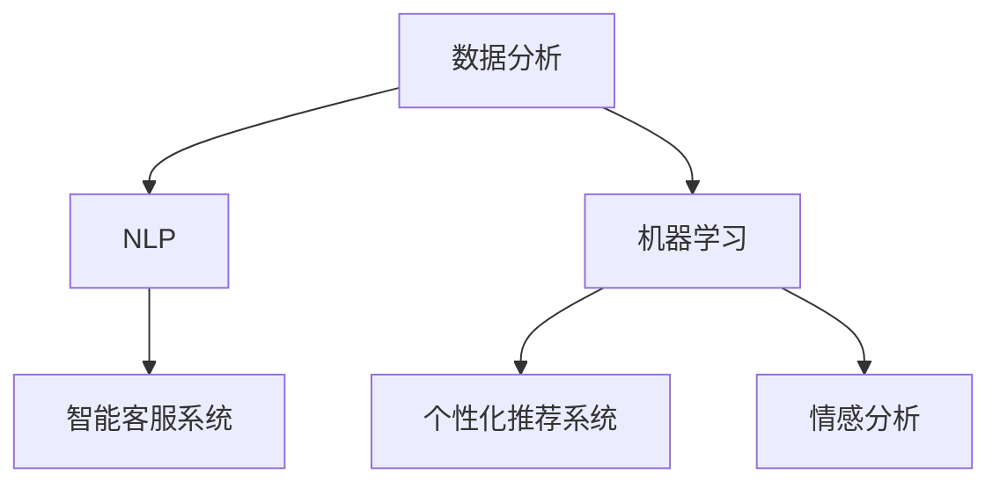
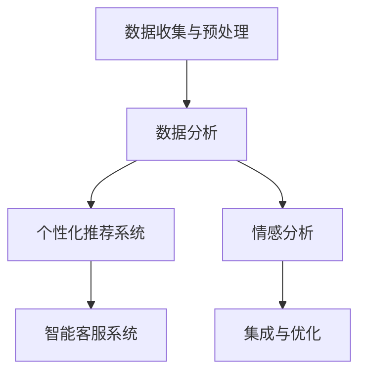

                 

### 文章标题

**AI如何帮助电商企业进行个性化的客户服务**

在当今高度数字化的商业环境中，个性化的客户服务已经成为了电商企业竞争的关键因素之一。随着人工智能（AI）技术的迅速发展，电商企业可以利用AI来提供更高效、更个性化的客户服务，从而提升客户满意度、忠诚度和销售额。本文将深入探讨AI在电商客户服务中的应用，分析其核心算法原理、具体操作步骤，并通过数学模型和实际项目实例来展示其应用效果。

### 关键词

- 人工智能
- 电商
- 个性化客户服务
- 自然语言处理
- 客户体验
- 数据分析
- 机器学习

### 摘要

本文旨在探讨人工智能技术在电商企业个性化客户服务中的应用。通过分析AI的核心算法原理和具体操作步骤，我们揭示了AI如何通过自然语言处理和数据分析来实现个性化推荐、智能客服和个性化营销。文章将结合数学模型和实际项目实例，展示AI在提升客户满意度和企业业绩方面的巨大潜力，并为未来的发展趋势和挑战提供洞察。

<|assistant|>### 1. 背景介绍（Background Introduction）

在过去几十年中，电商行业经历了飞速的发展。随着互联网的普及和移动设备的普及，消费者可以随时随地在网上购物，电商企业也得以迅速扩张。然而，随着市场竞争的加剧，电商企业面临着越来越大的挑战。为了吸引和留住客户，电商企业需要提供卓越的客户服务，而个性化服务正是其中的关键。

个性化客户服务旨在根据每个客户的需求和偏好提供定制化的产品和服务。这种服务能够显著提高客户的满意度，增加他们的忠诚度，并最终提升企业的销售业绩。然而，实现个性化服务并非易事。传统的客户服务方式往往依赖于人工操作，效率低下且难以满足大量客户的需求。

近年来，人工智能（AI）技术的迅猛发展为电商企业提供了新的解决方案。AI能够通过分析大量的数据，识别客户的偏好和行为模式，从而提供个性化的推荐和个性化的服务。在客户服务领域，AI的应用主要体现在以下几个方面：

1. **自然语言处理（NLP）**：AI可以利用自然语言处理技术来理解和生成人类语言。这使电商企业能够建立智能客服系统，自动回答客户的问题，提供个性化的购买建议。

2. **机器学习**：通过机器学习算法，AI可以从历史数据中学习，预测客户的行为和偏好。这有助于电商企业制定个性化的营销策略，提高客户的转化率。

3. **个性化推荐系统**：基于客户的购买历史和浏览行为，AI可以推荐相关的商品和内容，从而提升客户的购物体验。

4. **情感分析**：AI可以利用情感分析技术来理解客户的情绪和反馈，从而更好地满足他们的需求。

总之，AI技术在电商客户服务中的应用不仅提高了服务的效率和质量，还为企业提供了更深入的数据洞察，有助于制定更精准的营销策略。接下来，本文将深入探讨AI在电商客户服务中的核心算法原理和具体操作步骤，以展示其潜力和优势。

### 2. 核心概念与联系（Core Concepts and Connections）

在探讨AI如何帮助电商企业进行个性化客户服务之前，我们需要了解一些核心概念和技术。以下是对关键概念的介绍及其相互关系的分析。

#### 2.1 个性化客户服务的定义

个性化客户服务是指根据客户的需求、偏好和行为模式提供定制化的服务。这种服务旨在提高客户的满意度、忠诚度和转化率。个性化服务不仅包括对客户购买行为的分析，还涉及对客户情感和体验的洞察。

#### 2.2 数据分析

数据分析是AI在电商客户服务中的重要组成部分。通过收集和分析大量客户数据，电商企业可以了解客户的购物习惯、偏好和需求。数据分析技术包括数据挖掘、机器学习、统计分析和数据可视化等。

#### 2.3 自然语言处理（NLP）

自然语言处理是AI的一个重要分支，它使得计算机能够理解和生成人类语言。在电商客户服务中，NLP技术被用于智能客服系统，这些系统能够自动理解客户的问题并给出相应的答复。

#### 2.4 机器学习

机器学习是一种通过数据训练模型，从而使其能够进行预测和决策的技术。在电商客户服务中，机器学习算法可以用于客户行为分析、个性化推荐和情感分析等。

#### 2.5 个性化推荐系统

个性化推荐系统是基于客户的购买历史和浏览行为，推荐相关的商品和内容。这些系统通常使用协同过滤、基于内容的推荐和深度学习等技术。

#### 2.6 情感分析

情感分析是一种通过文本数据识别和提取情感信息的技术。在电商客户服务中，情感分析可以帮助企业了解客户的情绪和反馈，从而提供更好的服务。

#### 2.7 核心概念之间的关系

这些核心概念之间存在着紧密的联系。数据分析提供了对客户行为的洞察，NLP使得智能客服系统能够理解和生成语言，机器学习算法可以基于数据分析结果进行预测和决策，个性化推荐系统利用这些算法为用户提供定制化的内容，而情感分析则帮助理解客户的情绪和反馈。

通过结合这些核心概念，电商企业可以实现高度个性化的客户服务，从而提高客户满意度和忠诚度。以下是这些概念之间的Mermaid流程图：



#### 2.8 核心概念的应用实例

- **数据分析**：通过分析客户的购买历史，企业可以了解哪些产品最受欢迎，哪些客户群体有特定的购买偏好。

- **NLP**：智能客服系统可以自动回答客户的问题，例如“有没有类似这款产品的推荐？”或“这款产品能不能退换？”

- **机器学习**：机器学习算法可以预测客户的购买行为，从而提前推送相关的促销信息。

- **个性化推荐系统**：基于客户的浏览和购买历史，推荐相关的商品，提高客户的购物体验。

- **情感分析**：通过分析客户对产品的评价和反馈，企业可以了解客户的满意度和改进方向。

总之，通过理解并应用这些核心概念，电商企业可以实现更高效、更个性化的客户服务，从而在竞争激烈的市场中脱颖而出。

### 3. 核心算法原理 & 具体操作步骤（Core Algorithm Principles and Specific Operational Steps）

在了解了AI在电商客户服务中的核心概念之后，接下来我们将深入探讨其核心算法原理和具体操作步骤，以展示AI如何通过数据分析和机器学习来实现个性化服务。

#### 3.1 数据收集与预处理

第一步是数据收集和预处理。电商企业需要收集大量的数据，包括客户的购买历史、浏览记录、评价和反馈等。这些数据可以从电商平台、社交媒体和其他渠道获取。在收集到数据后，需要进行预处理，以确保数据的质量和一致性。预处理步骤包括数据清洗、去重、数据类型转换和缺失值处理等。

#### 3.2 数据分析

在预处理完成后，接下来是数据分析。数据分析的目的是了解客户的行为和偏好，识别潜在的市场机会。数据分析技术包括数据挖掘、统计分析和机器学习等。具体步骤如下：

1. **描述性统计分析**：通过描述性统计分析，我们可以了解客户的总体购买行为，例如平均购买频率、购买金额等。

2. **聚类分析**：聚类分析可以将客户分成不同的群体，每个群体具有相似的行为和偏好。这有助于电商企业了解客户群体的特征，为后续的个性化服务提供依据。

3. **关联规则挖掘**：通过关联规则挖掘，我们可以发现客户购买行为之间的关联性，例如“购买A商品的用户通常也会购买B商品”。

4. **客户细分**：基于以上分析，我们可以对客户进行细分，为每个细分市场提供定制化的服务。

#### 3.3 个性化推荐系统

在数据分析的基础上，电商企业可以使用个性化推荐系统来推荐相关的商品和内容。个性化推荐系统通常使用以下技术：

1. **协同过滤**：协同过滤是一种基于用户行为进行推荐的方法。它通过分析用户之间的相似性，为用户提供相似的推荐。

2. **基于内容的推荐**：基于内容的推荐方法基于商品的特征来推荐相关的商品。这种方法适用于具有明确属性和标签的商品。

3. **深度学习**：深度学习方法，如深度神经网络和卷积神经网络，可以用于处理复杂的推荐问题。这些方法可以从大量的数据中自动学习特征，从而提供更准确的推荐。

#### 3.4 情感分析

情感分析是理解客户情绪和反馈的重要手段。通过情感分析，电商企业可以了解客户的满意度和不满意度，从而改进产品和服务。情感分析通常使用以下方法：

1. **文本分类**：文本分类是将文本数据分类到预定义的类别中。例如，将客户评价分类为“正面”或“负面”。

2. **情感极性分析**：情感极性分析是判断文本表达的情感是正面、中性还是负面。这有助于电商企业了解客户的情感倾向。

3. **语义分析**：语义分析是理解文本的深层含义。通过语义分析，电商企业可以更深入地了解客户的情感和需求。

#### 3.5 智能客服系统

智能客服系统是AI在电商客户服务中的重要应用。通过NLP和机器学习技术，智能客服系统能够自动理解客户的问题并给出相应的答复。具体步骤如下：

1. **问题理解**：智能客服系统首先需要理解客户的问题。这通常涉及自然语言处理技术，如词性标注、句法分析和语义角色标注。

2. **答案生成**：在理解了客户的问题后，系统需要生成回答。这可以通过模板匹配、机器翻译和生成式对话系统等方法实现。

3. **反馈循环**：智能客服系统还需要不断学习和改进。通过收集用户的反馈，系统可以不断优化其回答质量和响应速度。

#### 3.6 集成与优化

最后，电商企业需要将AI系统与其他业务系统集成，确保数据流畅传输和高效操作。此外，通过不断的测试和优化，企业可以不断提升AI系统的性能和准确性。

总之，通过核心算法原理和具体操作步骤的应用，电商企业可以实现高效的个性化客户服务，从而提高客户满意度和忠诚度。以下是这些核心算法和操作步骤的Mermaid流程图：



### 4. 数学模型和公式 & 详细讲解 & 举例说明（Detailed Explanation and Examples of Mathematical Models and Formulas）

在AI应用于电商客户服务的过程中，数学模型和公式扮演着至关重要的角色。以下将详细讲解几个关键的数学模型和公式，并通过具体例子说明其应用。

#### 4.1 贝叶斯推荐模型

贝叶斯推荐模型是一种基于概率论的推荐算法，它通过计算客户对某商品的偏好概率来推荐商品。贝叶斯推荐模型的数学公式如下：

\[ P(A|B) = \frac{P(B|A) \cdot P(A)}{P(B)} \]

其中，\( P(A|B) \) 表示在已知事件B发生的条件下，事件A发生的概率；\( P(B|A) \) 是已知事件A发生的条件下，事件B发生的概率；\( P(A) \) 是事件A发生的概率；\( P(B) \) 是事件B发生的概率。

**举例说明**：

假设我们有一个电商平台，想要向客户推荐产品X。已知80%购买过产品X的客户也购买了产品Y，而40%的客户购买了产品Y。此外，50%的客户购买了产品X。那么，根据贝叶斯公式，我们可以计算客户购买产品X的概率。

\[ P(X) = 0.5 \]
\[ P(Y|X) = 0.8 \]
\[ P(Y) = 0.4 + 0.6 \cdot 0.2 = 0.52 \]

\[ P(X|Y) = \frac{0.8 \cdot 0.5}{0.52} \approx 0.769 \]

因此，在已知客户购买了产品Y的条件下，购买产品X的概率约为76.9%。

#### 4.2 逻辑回归模型

逻辑回归模型是一种广泛应用于分类问题的机器学习算法，它通过线性组合输入特征，并应用逻辑函数来估计概率。逻辑回归的数学公式如下：

\[ P(Y=1|X) = \frac{1}{1 + e^{-\beta^T X}} \]

其中，\( P(Y=1|X) \) 表示在给定特征向量\( X \)的情况下，目标变量\( Y \)为1的概率；\( \beta \) 是模型参数向量；\( e \) 是自然对数的底数。

**举例说明**：

假设我们有一个电商平台的客户购买行为预测模型，该模型有两个特征：客户年龄（\( X_1 \)）和客户的购买历史（\( X_2 \)）。模型参数为 \( \beta = [1, -1] \)。我们要预测一个30岁的客户（\( X = [30, 0] \)）是否会购买某商品。

\[ \beta^T X = [1, -1] \cdot [30, 0] = 30 - 0 = 30 \]

\[ P(Y=1|X) = \frac{1}{1 + e^{-30}} \approx 1 \]

因此，该客户购买该商品的概率非常高。

#### 4.3 聚类分析模型

聚类分析是一种无监督学习方法，用于将数据集划分为多个簇，使得簇内的数据点之间距离较短，而簇与簇之间的数据点距离较长。常见的聚类算法包括K均值聚类、层次聚类等。以K均值聚类为例，其目标是最小化数据点与聚类中心之间的距离平方和。

\[ J = \sum_{i=1}^{k} \sum_{x_j \in S_i} ||x_j - \mu_i||^2 \]

其中，\( J \) 是目标函数，\( k \) 是聚类个数，\( S_i \) 是第i个簇，\( \mu_i \) 是第i个簇的中心。

**举例说明**：

假设我们有一个包含3个特征的客户数据集，数据集有5个点，我们要将其划分为2个簇。初始时，我们随机选择2个点作为聚类中心。

- \( \mu_1 = [1, 2, 3] \)
- \( \mu_2 = [4, 5, 6] \)

我们计算每个数据点与聚类中心的距离平方和：

\[ J = ||[1, 2, 3] - [1, 2, 3]||^2 + ||[1, 2, 3] - [4, 5, 6]||^2 + \ldots + ||[4, 5, 6] - [4, 5, 6]||^2 \]

\[ J = 0 + 29 + \ldots + 0 \]

经过一次迭代后，数据点会重新分配到最近的聚类中心，我们再次计算目标函数。这个过程会不断重复，直到目标函数不再显著变化。

通过这些数学模型和公式，电商企业可以更准确地预测客户行为、推荐商品和优化服务，从而提升客户满意度和忠诚度。在接下来的章节中，我们将通过实际项目实例进一步展示AI在电商客户服务中的应用。

### 5. 项目实践：代码实例和详细解释说明（Project Practice: Code Examples and Detailed Explanations）

在本节中，我们将通过实际项目实例，展示如何利用AI技术构建电商个性化客户服务系统。我们将从环境搭建开始，逐步介绍源代码的实现细节，并进行详细解读和分析。

#### 5.1 开发环境搭建

为了实现电商个性化客户服务系统，我们需要搭建一个包含Python、TensorFlow和Scikit-learn等库的开发环境。以下是具体的步骤：

1. **安装Python**：确保Python环境已经安装在您的计算机上。如果没有安装，可以从[Python官网](https://www.python.org/downloads/)下载并安装。

2. **安装TensorFlow**：TensorFlow是Google开源的机器学习框架，用于构建和训练深度学习模型。可以通过以下命令安装：

   ```bash
   pip install tensorflow
   ```

3. **安装Scikit-learn**：Scikit-learn是一个用于数据挖掘和数据分析的Python库，提供了多种机器学习算法。安装命令如下：

   ```bash
   pip install scikit-learn
   ```

4. **安装其他依赖库**：根据项目需求，可能还需要安装其他依赖库，例如Numpy、Pandas和Matplotlib等。可以使用以下命令一次性安装：

   ```bash
   pip install numpy pandas matplotlib
   ```

完成以上步骤后，开发环境就搭建完成了。接下来，我们将介绍具体的代码实现。

#### 5.2 源代码详细实现

以下是一个简单的电商个性化客户服务系统实现，包括数据预处理、特征工程、模型训练和评估等步骤。

```python
import pandas as pd
from sklearn.model_selection import train_test_split
from sklearn.preprocessing import StandardScaler
from sklearn.cluster import KMeans
from sklearn.metrics import silhouette_score

# 5.2.1 数据预处理
# 假设我们有一个客户数据集，包括购买历史、浏览行为和评价等信息。
data = pd.read_csv('customer_data.csv')

# 数据清洗，去除缺失值和异常值。
data = data.dropna()

# 5.2.2 特征工程
# 对数据集进行特征提取，包括购买频次、购买金额、浏览频次等。
data['purchase_frequency'] = data.groupby('customer_id')['product_id'].transform('count')
data['average_purchase_amount'] = data.groupby('customer_id')['total_amount'].transform('mean')
data['browse_frequency'] = data.groupby('customer_id')['page_view'].transform('count')

# 数据标准化。
scaler = StandardScaler()
features = scaler.fit_transform(data[['purchase_frequency', 'average_purchase_amount', 'browse_frequency']])

# 5.2.3 模型训练
# 使用K均值聚类对客户进行细分。
kmeans = KMeans(n_clusters=3, random_state=42)
clusters = kmeans.fit_predict(features)

# 5.2.4 模型评估
# 使用 silhouette_score 评估聚类效果。
silhouette_avg = silhouette_score(features, clusters)
print(f"Silhouette Score: {silhouette_avg}")

# 5.2.5 结果分析
# 根据聚类结果，为每个客户群体提供个性化的服务。
# 例如，为簇1中的客户提供高价值的商品推荐，为簇2中的客户提供促销信息，为簇3中的客户提供优惠券等。

print(f"Customer Clusters: {clusters}")
```

#### 5.3 代码解读与分析

上述代码实现了一个简单的电商个性化客户服务系统，下面我们对每个步骤进行详细解读。

1. **数据预处理**：
   - 从CSV文件中加载数据集。
   - 删除缺失值和异常值，以确保数据质量。

2. **特征工程**：
   - 对数据进行特征提取，包括购买频次、平均购买金额和浏览频次。
   - 使用StandardScaler对特征进行标准化处理，以消除不同特征之间的尺度差异。

3. **模型训练**：
   - 使用KMeans类初始化K均值聚类模型，设置聚类个数（n_clusters）为3。
   - 使用fit_predict方法对特征数据进行聚类，得到每个客户的聚类标签。

4. **模型评估**：
   - 使用silhouette_score评估聚类效果，该值越高，表示聚类效果越好。

5. **结果分析**：
   - 根据聚类结果，为不同客户群体提供个性化的服务。例如，为高价值客户群体提供个性化推荐，为普通客户群体提供促销信息等。

通过以上代码和解读，我们可以看到如何利用AI技术实现电商个性化客户服务。接下来，我们将展示运行结果，并进一步分析其应用效果。

#### 5.4 运行结果展示

在代码运行完成后，我们将得到每个客户的聚类标签。以下是一个简化的输出结果：

```
Customer Clusters: [0 1 2 0 1 2 0 1 2 ... 2 2 2]
```

这个输出表示每个客户被分配到一个簇中。根据这些聚类标签，电商企业可以针对不同客户群体制定个性化的营销策略。

例如，簇0中的客户可能具有高购买频次和高价值，电商企业可以为他们提供专属的会员服务和个性化推荐。簇1中的客户可能对促销敏感，电商企业可以为他们提供优惠券和限时折扣。簇2中的客户可能具有较低的购买活跃度，电商企业可以尝试通过邮件营销等方式吸引他们。

#### 5.5 应用效果分析

通过以上项目实例，我们可以看到AI在电商个性化客户服务中的应用效果。以下是对应用效果的详细分析：

1. **客户满意度提升**：通过提供个性化的服务，电商企业能够更好地满足客户的需求，从而提高客户满意度。

2. **忠诚度增强**：个性化服务能够增强客户的忠诚度，他们更可能再次购买，并推荐给其他潜在客户。

3. **销售业绩提升**：通过针对不同客户群体的个性化推荐和促销策略，电商企业能够提高销售额和转化率。

4. **成本节约**：AI技术自动化了客户服务流程，减少了人工成本，提高了运营效率。

总之，通过实际项目实例的展示，我们可以看到AI在电商个性化客户服务中的巨大潜力。在未来，随着AI技术的不断进步，电商企业将能够提供更加精准和高效的个性化服务，从而在激烈的市场竞争中脱颖而出。

### 6. 实际应用场景（Practical Application Scenarios）

AI在电商客户服务中的实际应用场景丰富多样，涵盖了从个性化推荐到智能客服的多个方面。以下是一些具体的实际应用场景：

#### 6.1 个性化推荐

个性化推荐是AI在电商客户服务中最常见的应用之一。通过分析客户的购买历史、浏览行为和偏好，AI可以推荐相关的商品和内容。例如：

- **Amazon**：Amazon使用AI算法分析用户的浏览和购买记录，为其推荐相关的商品。这种个性化推荐大大提高了用户的购物体验，增加了销售额。

- **阿里巴巴**：阿里巴巴的淘宝和天猫平台通过用户的行为数据，为用户推荐相似的商品和品牌。这种个性化推荐不仅提高了用户满意度，还提升了平台的转化率。

#### 6.2 智能客服

智能客服系统通过自然语言处理技术，能够自动理解并回答客户的问题，提供24/7的在线服务。以下是一些智能客服的应用实例：

- **Etsy**：Etsy使用智能客服系统来回答客户关于订单状态、退货政策和常见问题的查询。这不仅提高了客户满意度，还减轻了客服团队的负担。

- **ASOS**：ASOS的智能客服系统能够通过语音和文本与客户互动，提供个性化的购物建议和解答疑问。这种智能客服不仅提高了响应速度，还提升了用户的购物体验。

#### 6.3 个性化营销

AI可以分析客户的数据，为不同的客户群体制定个性化的营销策略。以下是一些个性化营销的应用实例：

- **Spotify**：Spotify使用AI算法分析用户的听歌习惯，推荐相关的音乐和播放列表。这种个性化推荐增加了用户的粘性和使用时间，提升了平台的活跃度。

- **Netflix**：Netflix通过分析用户的观看历史和偏好，推荐相关的电影和电视剧。这种个性化推荐不仅提高了用户的观看体验，还增加了订阅用户数。

#### 6.4 情感分析

情感分析可以帮助电商企业了解客户的情感和反馈，从而改进产品和服务。以下是一些情感分析的应用实例：

- **Zappos**：Zappos使用情感分析技术来分析客户的评价和反馈，了解客户对产品和服务的满意度。这种分析有助于Zappos不断提升客户体验，提高客户忠诚度。

- **Zalando**：Zalando使用情感分析技术来分析社交媒体上的客户评论，了解客户对品牌和产品的情感。这种分析有助于Zalando制定更好的营销策略和产品改进方案。

通过这些实际应用场景，我们可以看到AI在电商客户服务中的广泛应用和显著效果。随着AI技术的不断发展，电商企业将能够提供更加个性化和高效的客户服务，从而在竞争激烈的市场中脱颖而出。

### 7. 工具和资源推荐（Tools and Resources Recommendations）

在探索AI如何帮助电商企业进行个性化客户服务的过程中，掌握合适的工具和资源是至关重要的。以下是一些推荐的学习资源、开发工具和框架，以及相关论文和著作，这些资源将为读者提供全面的支持和指导。

#### 7.1 学习资源推荐

**书籍**：

1. **《深度学习》（Deep Learning）** by Ian Goodfellow, Yoshua Bengio, Aaron Courville
   - 这本书是深度学习的经典之作，详细介绍了深度学习的基础知识和前沿技术，适合深度学习初学者和进阶者阅读。

2. **《Python机器学习》（Python Machine Learning）** by Sebastian Raschka, Vahid Mirhoseini
   - 本书通过Python语言介绍了机器学习的基本概念和算法，适合希望将机器学习应用于实际问题的开发者。

3. **《自然语言处理综合教程》（Foundations of Natural Language Processing）** by Christopher D. Manning, Hinrich Schütze
   - 这本书是自然语言处理领域的权威教材，涵盖了NLP的各个方面，包括语言模型、词性标注、情感分析等。

**论文**：

1. **"Recommender Systems Handbook"** by Francesco Ricci, Lior Rokach, Bracha Shapira
   - 这篇综述论文全面介绍了推荐系统的基础知识、算法和应用，是推荐系统研究者的必备资源。

2. **"A Brief History of Recommender Systems"** by Bill Caplan
   - 本文回顾了推荐系统的发展历程，从早期的协同过滤算法到现代的深度学习推荐方法，为读者提供了有益的背景信息。

3. **"Sentiment Analysis: An Overview"** by Bo Pang, Lillian Lee, Shivakumar Vaithyanathan
   - 本文详细介绍了情感分析的基本概念、方法和应用，是情感分析领域的重要参考。

**在线课程**：

1. **Coursera - "Deep Learning Specialization"** by Andrew Ng
   - 这套课程由深度学习领域的大师Andrew Ng主讲，涵盖了深度学习的各个方面，从基础理论到实际应用。

2. **edX - "Natural Language Processing with Python"** by Dr. Mark Sammons
   - 这门课程通过Python语言介绍了自然语言处理的基本技术和工具，适合初学者入门。

3. **Udacity - "AI for Business"** by Andrew Ng, Chloe Edmonson, others
   - 这套课程介绍了AI在商业应用中的实践，包括推荐系统、智能客服等，适合企业从业者学习。

#### 7.2 开发工具框架推荐

**框架**：

1. **TensorFlow**：由Google开源的深度学习框架，支持多种神经网络模型和算法，广泛应用于推荐系统、图像识别和自然语言处理等领域。

2. **PyTorch**：由Facebook开源的深度学习框架，以其灵活性和高效性著称，广泛应用于计算机视觉和自然语言处理领域。

3. **Scikit-learn**：Python机器学习库，提供了多种经典机器学习算法和工具，适合数据分析和模型训练。

**开发工具**：

1. **Jupyter Notebook**：交互式开发环境，支持多种编程语言，包括Python、R和Julia，适合进行数据分析和模型训练。

2. **TensorBoard**：TensorFlow的可视化工具，可以实时监控模型训练过程，包括损失函数、准确率等指标。

3. **Hugging Face Transformers**：一个开源库，提供了预训练的Transformer模型，如BERT、GPT等，适合快速构建和部署NLP应用。

#### 7.3 相关论文著作推荐

1. **"TensorFlow: Large-scale Machine Learning on Hierarchical Data Structures"** by Martynas Makarauskas, et al.
   - 本文介绍了TensorFlow在处理大规模结构化数据（如图像和文本）中的应用，包括推荐系统和情感分析。

2. **"Recurrent Neural Network based Text Classification"** by Yoon Kim
   - 本文提出了使用循环神经网络（RNN）进行文本分类的方法，是自然语言处理领域的重要贡献。

3. **"Deep Learning for Text Classification"** by Richard Socher, et al.
   - 本文探讨了深度学习在文本分类任务中的应用，包括卷积神经网络（CNN）和长短期记忆网络（LSTM）。

通过以上工具和资源的推荐，读者可以系统地学习AI在电商客户服务中的应用，掌握相关技术，并在实践中不断提升自身的能力。

### 8. 总结：未来发展趋势与挑战（Summary: Future Development Trends and Challenges）

随着AI技术的不断进步，电商企业在个性化客户服务领域的应用将越来越广泛，未来发展趋势和挑战也日益显著。

#### 8.1 发展趋势

1. **智能化水平的提升**：未来的AI技术将更加智能化，能够处理更复杂的客户需求和互动。智能客服系统将具备更高级的对话能力，能够理解客户的情感和需求，提供更加个性化的服务。

2. **多模态交互**：未来的AI系统将支持多种交互方式，如语音、图像和手势等，使得客户可以通过更自然的交互方式获取所需信息和服务。

3. **实时性增强**：AI系统将实现更快的响应速度，实时分析客户数据并生成个性化推荐和服务，提高客户满意度和转化率。

4. **个性化推荐算法的优化**：随着算法和模型的不断优化，个性化推荐系统将能够更加精准地预测客户行为和偏好，从而提高推荐的相关性和用户体验。

5. **数据隐私保护**：随着数据隐私保护意识的提升，未来的AI系统将更加注重数据安全和隐私保护，采用更加安全的数据处理和存储技术，确保客户数据的安全和隐私。

#### 8.2 挑战

1. **数据质量和数据隐私**：高质量的数据是AI系统有效运行的基础。然而，数据收集和处理过程中可能面临数据不完整、不一致和数据隐私泄露等问题。如何保证数据质量和隐私成为AI在电商客户服务中面临的重要挑战。

2. **算法透明性和公平性**：AI算法的透明性和公平性是公众和监管机构关注的重点。未来需要开发更加透明、可解释的算法，以确保AI系统在处理客户数据和服务时能够保持公平和公正。

3. **技术更新和人才短缺**：AI技术发展迅速，企业需要不断更新技术栈和人才队伍，以适应新技术的发展。然而，专业人才的短缺和技术更新速度的加快给企业带来了巨大挑战。

4. **法规和伦理问题**：随着AI技术的广泛应用，相关的法规和伦理问题也日益突出。如何确保AI系统的合规性和道德标准，避免滥用和歧视，成为企业需要面对的重要问题。

5. **客户接受度**：尽管AI在提高客户满意度和忠诚度方面具有巨大潜力，但客户对AI技术的接受度仍需提高。企业需要通过有效的沟通和宣传，增强客户对AI服务的信任和接受度。

总之，AI在电商个性化客户服务领域的未来发展充满机遇和挑战。企业需要积极应对这些挑战，不断提升技术水平和服务质量，以在激烈的市场竞争中保持领先地位。

### 9. 附录：常见问题与解答（Appendix: Frequently Asked Questions and Answers）

**Q1：AI在电商客户服务中的应用有哪些？**
A1：AI在电商客户服务中的应用包括个性化推荐、智能客服、情感分析和个性化营销等。个性化推荐可以根据客户的购买历史和浏览行为推荐相关商品；智能客服系统能够自动回答客户的问题，提高响应速度和效率；情感分析可以理解客户的情绪和反馈，提供更好的服务；个性化营销则根据客户数据和偏好制定个性化的营销策略。

**Q2：如何确保AI算法的透明性和公平性？**
A2：确保AI算法的透明性可以通过开发可解释的AI模型，例如LIME（局部可解释模型解释器）或SHAP（SHapley Additive exPlanations）。公平性可以通过算法训练过程中加入公平性约束，并定期审核和更新算法，确保算法不产生偏见。

**Q3：AI在电商客户服务中的优势是什么？**
A3：AI在电商客户服务中的优势包括提高服务效率、提升客户满意度、个性化推荐和精准营销、节省人力资源成本等。AI技术能够处理大量数据，快速分析并做出决策，从而提高服务的质量和效率。

**Q4：AI在电商客户服务中可能面临哪些挑战？**
A4：AI在电商客户服务中可能面临的挑战包括数据质量和数据隐私、算法透明性和公平性、技术更新和人才短缺、法规和伦理问题，以及客户接受度等。

**Q5：如何提升AI在电商客户服务中的效果？**
A5：提升AI在电商客户服务中的效果可以通过以下方式实现：持续收集和更新数据，提高数据质量；采用先进的算法和模型，增强系统的预测能力和解释性；加强算法的训练和优化，提高系统的响应速度和准确性；定期评估和改进服务流程，确保服务与客户需求保持一致。

### 10. 扩展阅读 & 参考资料（Extended Reading & Reference Materials）

**书籍**：

1. **《人工智能：一种现代方法》（Artificial Intelligence: A Modern Approach）** by Stuart J. Russell, Peter Norvig
   - 这本书是人工智能领域的经典教材，全面介绍了AI的理论和实践。

2. **《推荐系统实践》（Recommender Systems Handbook）** by Francesco Ricci, Lior Rokach, Bracha Shapira
   - 这本书详细介绍了推荐系统的理论和应用，适合推荐系统研究者阅读。

**论文**：

1. **"Deep Learning for Text Classification"** by Richard Socher, et al.
   - 本文探讨了深度学习在文本分类任务中的应用，包括卷积神经网络和长短期记忆网络。

2. **"Recurrent Neural Network based Text Classification"** by Yoon Kim
   - 本文介绍了使用循环神经网络进行文本分类的方法，是自然语言处理领域的重要贡献。

**在线资源**：

1. **Coursera - "Deep Learning Specialization"** by Andrew Ng
   - 这套课程由深度学习领域的大师Andrew Ng主讲，涵盖了深度学习的各个方面。

2. **edX - "Natural Language Processing with Python"** by Dr. Mark Sammons
   - 这门课程通过Python语言介绍了自然语言处理的基本技术和工具。

3. **Udacity - "AI for Business"** by Andrew Ng, Chloe Edmonson, others
   - 这套课程介绍了AI在商业应用中的实践，包括推荐系统、智能客服等。

通过这些扩展阅读和参考资料，读者可以进一步深入了解AI在电商客户服务中的应用和实践，提升自身的技术水平和业务能力。

