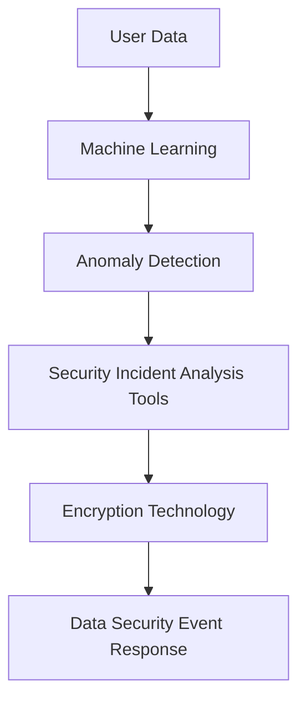

                 

### 文章标题

**AI如何帮助电商企业进行用户数据安全事件响应**

在数字化的时代，电商企业已经成为人们日常生活不可或缺的一部分。然而，随着在线交易的普及，用户数据泄露的风险也日益增加。一旦发生数据安全事件，不仅会对企业的声誉造成严重损害，还可能面临巨额的罚款和赔偿。因此，如何有效地响应用户数据安全事件，成为电商企业面临的重要挑战。

本文旨在探讨人工智能（AI）在用户数据安全事件响应中的应用，通过逐步分析推理，详细阐述AI在检测、分析和应对数据安全事件方面的优势。文章结构如下：

1. **背景介绍**：介绍电商企业面临的数据安全挑战。
2. **核心概念与联系**：介绍AI在数据安全事件响应中的核心概念，并给出相应的架构图。
3. **核心算法原理与操作步骤**：详细描述AI如何检测、分析和响应数据安全事件。
4. **数学模型与公式**：介绍相关的数学模型和公式，并进行详细讲解和举例说明。
5. **项目实践**：提供具体的代码实例，展示如何在实际项目中应用AI进行数据安全事件响应。
6. **实际应用场景**：讨论AI在不同电商场景中的应用案例。
7. **工具和资源推荐**：推荐相关的学习资源和开发工具。
8. **总结与未来趋势**：总结AI在数据安全事件响应中的作用，并探讨未来发展趋势和挑战。
9. **常见问题与解答**：回答读者可能关心的问题。
10. **扩展阅读与参考资料**：提供更多的深入阅读材料。

让我们开始详细探讨AI在电商企业用户数据安全事件响应中的应用。

### 关键词

- **电商企业**
- **用户数据安全**
- **人工智能**
- **数据安全事件响应**
- **检测**
- **分析**
- **应对**
- **机器学习**
- **安全事件分析工具**
- **加密技术**

### 摘要

本文探讨了人工智能在电商企业用户数据安全事件响应中的应用。通过分析AI在检测、分析和应对数据安全事件方面的优势，本文展示了如何利用机器学习和加密技术提高数据安全响应的效率。文章结构清晰，通过逐步分析推理，提供了实用的方法和工具，为电商企业应对数据安全事件提供了有益的指导。

---

**### 1. 背景介绍（Background Introduction）**

在电子商务蓬勃发展的今天，电商企业积累了大量的用户数据，包括个人身份信息、交易记录、偏好和浏览历史等。这些数据对于电商企业的运营至关重要，但也成为了黑客和网络犯罪分子攻击的目标。用户数据泄露事件频发，不仅对用户的隐私和安全构成威胁，也可能对电商企业的商业利益和声誉造成严重影响。

随着网络攻击手段的不断升级和多样化，传统的数据安全措施已难以应对新兴的威胁。例如，传统的防火墙和入侵检测系统对于复杂的社交工程攻击、高级持续性威胁（APT）和恶意软件等高级攻击手段的防御能力有限。此外，随着云计算和大数据技术的发展，数据存储和处理的方式也发生了变化，这使得数据安全事件的风险进一步增加。

在这种情况下，电商企业需要更智能、更高效的手段来保护用户数据的安全。人工智能（AI）技术的发展为数据安全提供了新的解决方案。AI可以通过机器学习算法对大量数据进行分析，识别异常行为和潜在威胁。此外，AI还可以自动化响应流程，减少安全事件对企业运营的影响。

总之，电商企业面临的数据安全挑战日益严峻，而人工智能则为这些挑战提供了一种新的应对策略。本文将详细探讨AI在用户数据安全事件响应中的应用，为电商企业提供实用的方法和工具。

### 1. Background Introduction

In today's thriving e-commerce landscape, e-commerce companies have accumulated a vast amount of user data, including personal identity information, transaction records, preferences, and browsing history. These data are crucial for the operations of e-commerce companies but also become targets for hackers and cybercriminals. Data breaches occur frequently, posing threats to user privacy and security and potentially causing significant damage to the business interests and reputation of e-commerce companies.

With the advancement of network attack techniques and the diversification of attack methods, traditional data security measures have become insufficient to defend against sophisticated threats. For example, traditional firewalls and intrusion detection systems are limited in their ability to protect against complex social engineering attacks, advanced persistent threats (APTs), and malware. Moreover, the development of cloud computing and big data technology has changed the way data is stored and processed, further increasing the risk of data security incidents.

In this context, e-commerce companies need more intelligent and efficient means to protect the security of user data. The development of artificial intelligence (AI) provides new solutions for data security challenges. AI can analyze large amounts of data using machine learning algorithms to identify abnormal behaviors and potential threats. Additionally, AI can automate the response process, minimizing the impact of security incidents on business operations.

In summary, e-commerce companies face increasingly severe data security challenges, and AI offers a new approach to address these challenges. This article will delve into the application of AI in responding to user data security incidents, providing practical methods and tools for e-commerce companies.

---

### 2. 核心概念与联系（Core Concepts and Connections）

在探讨AI如何帮助电商企业进行用户数据安全事件响应之前，我们需要了解几个核心概念，包括机器学习、异常检测、安全事件分析工具和加密技术。以下是对这些概念的介绍及其相互关系的详细讨论。

#### 2.1 机器学习（Machine Learning）

机器学习是一种使计算机系统能够从数据中学习并做出预测或决策的技术。在用户数据安全事件响应中，机器学习算法可以分析用户行为数据，识别异常模式，从而发现潜在的安全威胁。例如，监督学习算法可以基于正常用户行为的训练数据集，建立模型来识别异常行为。无监督学习算法则可以用于发现数据中的未知模式，帮助识别数据泄露的迹象。

#### 2.2 异常检测（Anomaly Detection）

异常检测是机器学习中的一个重要应用，旨在识别数据中的异常值或异常模式。在数据安全领域，异常检测用于检测用户行为或系统活动的异常，如未授权访问、恶意软件活动或数据泄露尝试。通过识别这些异常，企业可以及时采取措施，防止潜在的安全事件。

#### 2.3 安全事件分析工具（Security Incident Analysis Tools）

安全事件分析工具是用于检测、分析和响应安全事件的软件系统。这些工具通常集成了机器学习算法，可以自动分析大量日志数据、网络流量和用户行为，以识别潜在的安全威胁。这些工具可以帮助安全团队能够快速识别安全事件，并采取相应的应对措施。

#### 2.4 加密技术（Encryption Technology）

加密技术是一种保护数据免受未授权访问的重要手段。在用户数据安全事件响应中，加密技术可以确保在数据传输和存储过程中，即使数据被窃取，也无法被解密和读取。加密技术可以与机器学习和异常检测相结合，提高数据安全事件的响应效率。

#### 2.5 核心概念原理与架构图

为了更好地理解上述核心概念，我们可以使用Mermaid流程图来描述AI在数据安全事件响应中的架构。



**图1：AI在数据安全事件响应中的架构**

在这个架构中，用户数据首先被输入到机器学习模块中，通过训练和预测来识别异常行为。异常检测模块基于机器学习模型的输出，进一步分析数据中的异常模式。安全事件分析工具结合异常检测结果和日志数据，实时监测和响应安全事件。加密技术则在整个数据生命周期中发挥作用，确保数据的机密性和完整性。

#### 2.6 核心概念的重要性

核心概念的重要性在于，它们共同构成了一个有效的数据安全事件响应系统。机器学习和异常检测提供了检测和识别威胁的能力，安全事件分析工具实现了自动化响应，而加密技术则确保了数据的安全存储和传输。这些概念相互关联，共同发挥作用，帮助企业快速、准确地识别和响应数据安全事件。

### 2. Core Concepts and Connections

Before delving into how AI can assist e-commerce companies in responding to user data security incidents, we need to understand several core concepts, including machine learning, anomaly detection, security incident analysis tools, and encryption technology. Here is a detailed discussion of these concepts and their interrelationships.

#### 2.1 Machine Learning

Machine learning is a technology that enables computer systems to learn from data and make predictions or decisions. In the context of user data security incident response, machine learning algorithms can analyze user behavioral data to identify abnormal patterns, thereby detecting potential security threats. For example, supervised learning algorithms can be trained on datasets of normal user behavior to establish models that identify abnormal behaviors. Unsupervised learning algorithms can be used to discover unknown patterns in the data, helping to identify signs of data breaches.

#### 2.2 Anomaly Detection

Anomaly detection is a key application of machine learning that aims to identify anomalies or abnormal patterns in data. In the field of data security, anomaly detection is used to detect abnormal behaviors or activities, such as unauthorized access, malicious software activities, or attempts at data exfiltration. By identifying these anomalies, companies can take timely actions to prevent potential security incidents.

#### 2.3 Security Incident Analysis Tools

Security incident analysis tools are software systems designed for the detection, analysis, and response to security incidents. These tools typically integrate machine learning algorithms to automatically analyze large volumes of log data, network traffic, and user behaviors to identify potential security threats. These tools help security teams quickly identify security incidents and take appropriate responses.

#### 2.4 Encryption Technology

Encryption technology is an essential means of protecting data from unauthorized access. In the context of user data security incident response, encryption technology ensures that data remains secure during transmission and storage, even if it is intercepted. Encryption technology can be combined with machine learning and anomaly detection to enhance the efficiency of data security incident response.

#### 2.5 Core Concept Principles and Architecture Diagram

To better understand the core concepts, we can use a Mermaid flowchart to describe the architecture of AI in data security incident response.


**Figure 1: Architecture of AI in Data Security Incident Response**

In this architecture, user data is first input into the machine learning module, where it is trained and predicted to identify abnormal behaviors. The anomaly detection module further analyzes data patterns based on the output of the machine learning model. Security incident analysis tools combine the anomaly detection results with log data to monitor and respond to security incidents in real-time. Encryption technology ensures the confidentiality and integrity of data throughout its lifecycle.

#### 2.6 Importance of Core Concepts

The importance of these core concepts lies in their collective role in building an effective data security incident response system. Machine learning and anomaly detection provide the ability to detect and identify threats, security incident analysis tools enable automated responses, and encryption technology ensures the secure storage and transmission of data. These concepts are interrelated and work together to help companies quickly and accurately identify and respond to data security incidents.

---

### 3. 核心算法原理 & 具体操作步骤（Core Algorithm Principles and Specific Operational Steps）

在了解AI在数据安全事件响应中的核心概念后，我们需要深入探讨具体的算法原理和操作步骤。以下是三个关键的AI算法及其在实际应用中的操作流程：

#### 3.1 监督学习算法（Supervised Learning Algorithm）

监督学习算法是机器学习中的一个基础算法，它通过已标记的数据进行训练，然后使用训练好的模型对新数据进行预测。在数据安全事件响应中，监督学习算法主要用于建立正常用户行为的模型，并识别异常行为。

**具体操作步骤：**

1. **数据收集与预处理**：收集用户行为数据，并进行预处理，包括数据清洗、去噪、特征提取等。
2. **模型训练**：使用标记好的正常用户行为数据集训练模型，模型可以是分类器、回归模型或聚类算法。
3. **模型评估**：使用验证数据集评估模型的性能，包括准确率、召回率、F1分数等指标。
4. **模型部署**：将训练好的模型部署到生产环境中，实时监测用户行为，并标记异常行为。

**算法原理：**

监督学习算法的核心是学习一个映射函数，将输入特征映射到输出标签。在数据安全事件响应中，这个映射函数用于判断用户行为是否正常。常见的监督学习算法包括决策树、支持向量机（SVM）、随机森林等。

#### 3.2 异常检测算法（Anomaly Detection Algorithm）

异常检测算法用于识别数据中的异常值或异常模式。在数据安全事件响应中，异常检测算法可以实时监测用户行为或系统活动，及时发现潜在的安全威胁。

**具体操作步骤：**

1. **数据收集**：收集用户行为数据或系统日志数据。
2. **特征提取**：从原始数据中提取关键特征，如时间、位置、访问次数等。
3. **模型训练**：使用正常数据集训练异常检测模型，模型可以是基于统计方法的，如基于标准差的方法，也可以是基于机器学习的方法，如孤立森林（Isolation Forest）或局部异常因子（Local Outlier Factor，LOF）。
4. **异常检测**：使用训练好的模型检测新数据中的异常值或异常模式。
5. **响应**：根据检测到的异常，采取相应的应对措施，如警报、隔离或阻止。

**算法原理：**

异常检测算法的核心是定义一个异常度量，用于评估数据点是否异常。常见的异常检测算法包括基于统计的方法、基于聚类的方法和基于机器学习的方法。基于统计的方法通常基于概率分布或假设检验，而基于聚类的方法则通过聚类算法识别异常点。机器学习方法，如孤立森林和局部异常因子，则通过构建决策树或高斯分布模型来识别异常。

#### 3.3 强化学习算法（Reinforcement Learning Algorithm）

强化学习算法是一种通过试错策略学习最优行为策略的算法。在数据安全事件响应中，强化学习算法可以用于自动调整安全策略，以应对不断变化的安全威胁。

**具体操作步骤：**

1. **环境设置**：定义安全事件响应的环境，包括状态空间、动作空间和奖励机制。
2. **策略学习**：使用强化学习算法（如Q-learning或深度Q网络（DQN））训练策略，通过与环境交互学习最优行为。
3. **策略部署**：将训练好的策略部署到生产环境中，根据实时数据自动调整安全策略。
4. **持续优化**：通过不断与环境交互，持续优化安全策略，提高响应效率。

**算法原理：**

强化学习算法的核心是学习一个策略，该策略能够最大化预期奖励。在数据安全事件响应中，状态空间包括用户行为、系统状态和安全威胁等信息，动作空间包括警报、隔离、阻止等安全操作。通过试错和反馈，强化学习算法可以自动调整策略，提高数据安全事件的响应效率。

#### 3.4 核心算法原理的对比与联系

虽然上述三种算法在具体实现和应用场景上有所不同，但它们在数据安全事件响应中都有重要的作用，且相互联系。

- **监督学习算法**提供了识别正常和异常行为的基础，是异常检测和强化学习算法的前提。
- **异常检测算法**通过实时监测和识别异常行为，提高了数据安全事件响应的及时性和准确性。
- **强化学习算法**则通过自动调整安全策略，提高了应对复杂安全威胁的能力。

这些算法相互补充，共同构建了一个高效、智能的数据安全事件响应系统。

### 3. Core Algorithm Principles and Specific Operational Steps

After understanding the core concepts of AI in data security incident response, we need to delve into the specific algorithms and their operational steps. Here are three key AI algorithms and their practical application workflows:

#### 3.1 Supervised Learning Algorithm

Supervised learning algorithms are fundamental in machine learning, training models on labeled data to make predictions on new data. In data security incident response, supervised learning algorithms are primarily used to establish models of normal user behavior and identify anomalies.

**Specific Operational Steps:**

1. **Data Collection and Preprocessing**: Collect user behavioral data and preprocess it, which includes data cleaning, noise reduction, and feature extraction.
2. **Model Training**: Train the model using labeled datasets of normal user behavior. The model can be a classifier, regression model, or clustering algorithm.
3. **Model Evaluation**: Evaluate the model's performance on a validation dataset using metrics such as accuracy, recall, and F1 score.
4. **Model Deployment**: Deploy the trained model into the production environment to monitor user behavior in real-time and flag abnormal behaviors.

**Algorithm Principles:**

The core of supervised learning algorithms is to learn a mapping function that maps input features to output labels. In data security incident response, this mapping function is used to determine whether a user behavior is normal. Common supervised learning algorithms include decision trees, support vector machines (SVM), and random forests.

#### 3.2 Anomaly Detection Algorithm

Anomaly detection algorithms are used to identify abnormal values or patterns in data. In data security incident response, anomaly detection algorithms can monitor user behaviors or system activities in real-time to detect potential security threats.

**Specific Operational Steps:**

1. **Data Collection**: Collect user behavioral data or system log data.
2. **Feature Extraction**: Extract key features from the raw data, such as time, location, and access frequency.
3. **Model Training**: Train the anomaly detection model using normal datasets. The model can be based on statistical methods or machine learning methods, such as Isolation Forest or Local Outlier Factor (LOF).
4. **Anomaly Detection**: Use the trained model to detect anomalies in new data.
5. **Response**: Take appropriate actions based on detected anomalies, such as alarms, isolation, or blocking.

**Algorithm Principles:**

The core of anomaly detection algorithms is to define a measure of anomaly that evaluates whether a data point is abnormal. Common anomaly detection algorithms include statistical methods based on probability distributions or hypothesis testing, clustering-based methods, and machine learning-based methods like Isolation Forest and Local Outlier Factor. These algorithms construct decision trees or Gaussian distribution models to identify anomalies.

#### 3.3 Reinforcement Learning Algorithm

Reinforcement learning algorithms are a type of algorithm that learns optimal behavior strategies through trial and error. In data security incident response, reinforcement learning algorithms can be used to automatically adjust security strategies to counteract evolving security threats.

**Specific Operational Steps:**

1. **Environment Setup**: Define the security incident response environment, including the state space, action space, and reward mechanism.
2. **Strategy Learning**: Train a strategy using reinforcement learning algorithms (such as Q-learning or Deep Q-Networks, DQN) by interacting with the environment.
3. **Strategy Deployment**: Deploy the trained strategy into the production environment to adjust security strategies based on real-time data.
4. **Continuous Optimization**: Continuously optimize the security strategy by interacting with the environment, improving response efficiency.

**Algorithm Principles:**

The core of reinforcement learning algorithms is to learn a strategy that maximizes expected rewards. In data security incident response, the state space includes user behavior, system state, and security threats, while the action space includes security operations such as alarms, isolation, and blocking. Through trial and feedback, reinforcement learning algorithms can automatically adjust strategies to improve data security incident response efficiency.

#### 3.4 Comparison and Connections of Core Algorithm Principles

Although the three algorithms differ in their specific implementations and application scenarios, they all play important roles in data security incident response and are interconnected.

- **Supervised learning algorithms** provide the foundation for identifying normal and abnormal behaviors, which are essential for anomaly detection and reinforcement learning algorithms.
- **Anomaly detection algorithms** enhance the timeliness and accuracy of data security incident response by real-time monitoring and identifying abnormal behaviors.
- **Reinforcement learning algorithms** improve the ability to respond to complex security threats by automatically adjusting security strategies.

These algorithms complement each other, forming an efficient and intelligent data security incident response system.

---

### 4. 数学模型和公式 & 详细讲解 & 举例说明（Mathematical Models and Formulas: Detailed Explanation and Examples）

在数据安全事件响应中，数学模型和公式扮演着关键角色，它们帮助企业和安全团队更准确地识别和分析潜在威胁。以下是一些重要的数学模型和公式，以及它们的详细讲解和具体实例。

#### 4.1 贝叶斯公式（Bayes' Theorem）

贝叶斯公式是概率论中的一个重要工具，用于计算条件概率。在数据安全事件响应中，贝叶斯公式可以用于计算一个事件发生的概率，给定另一个事件已经发生。

**数学模型：**

$$
P(A|B) = \frac{P(B|A) \cdot P(A)}{P(B)}
$$

其中，\(P(A|B)\) 是在事件 \(B\) 发生的情况下事件 \(A\) 发生的概率，\(P(B|A)\) 是在事件 \(A\) 发生的情况下事件 \(B\) 发生的概率，\(P(A)\) 是事件 \(A\) 发生的概率，\(P(B)\) 是事件 \(B\) 发生的概率。

**实例：**

假设电商企业的用户数据安全事件检测系统发现一个异常访问行为。我们可以使用贝叶斯公式计算这个异常访问行为是恶意行为的概率。

- \(P(\text{异常访问}|\text{恶意行为}) = 0.95\) （异常访问在恶意行为发生时的概率）
- \(P(\text{恶意行为}) = 0.01\) （恶意行为发生的概率）
- \(P(\text{异常访问}) = 0.1\) （异常访问发生的概率）

使用贝叶斯公式计算：

$$
P(\text{恶意行为}|\text{异常访问}) = \frac{0.95 \cdot 0.01}{0.1} = 0.095
$$

这意味着，在观察到异常访问行为的情况下，恶意行为的概率是 9.5%。

#### 4.2 马尔可夫模型（Markov Model）

马尔可夫模型是一个统计模型，用于描述系统状态随时间变化的概率。在数据安全事件响应中，马尔可夫模型可以用于分析用户行为序列，识别潜在的安全威胁。

**数学模型：**

$$
P(X_t = x_t | X_{t-1} = x_{t-1}, ..., X_0 = x_0) = P(X_t = x_t | X_{t-1} = x_{t-1})
$$

其中，\(X_t\) 表示在时间 \(t\) 的系统状态，\(x_t\) 表示具体的状态值。

**实例：**

假设我们有一个用户行为序列，每个状态表示用户的一次访问行为。我们可以使用马尔可夫模型计算从当前状态转移到下一个状态的概率。

状态空间：{登录，浏览，购买，支付}

状态转移矩阵：

$$
P =
\begin{bmatrix}
0.2 & 0.4 & 0.3 & 0.1 \\
0.1 & 0.5 & 0.2 & 0.2 \\
0.3 & 0.2 & 0.3 & 0.2 \\
0.4 & 0.1 & 0.1 & 0.4 \\
\end{bmatrix}
$$

当前状态是“浏览”，我们需要计算下一个状态是“支付”的概率。

$$
P(\text{支付}|\text{浏览}) = 0.2
$$

这意味着，在用户当前处于“浏览”状态的情况下，下一步进行“支付”的概率是20%。

#### 4.3 雷达图（Radar Chart）

雷达图是一种用于显示多个变量之间关系的图形工具。在数据安全事件响应中，雷达图可以用于综合评估安全事件的各个方面，如攻击的复杂性、威胁的严重性等。

**数学模型：**

雷达图的数学模型可以通过计算各个变量与总体的角度关系来表示。

$$
\theta_i = \frac{2\pi i}{n}
$$

其中，\(\theta_i\) 表示第 \(i\) 个变量的角度，\(n\) 是变量总数。

**实例：**

假设我们有一个包含5个变量的雷达图，分别是复杂性、威胁性、响应时间、成本和恢复时间。

变量值：

- 复杂性：80
- 威胁性：90
- 响应时间：60
- 成本：70
- 恢复时间：50

计算每个变量的角度：

$$
\theta_1 = \frac{2\pi \cdot 1}{5} = 0.4\pi
$$

$$
\theta_2 = \frac{2\pi \cdot 2}{5} = 0.8\pi
$$

$$
\theta_3 = \frac{2\pi \cdot 3}{5} = 1.2\pi
$$

$$
\theta_4 = \frac{2\pi \cdot 4}{5} = 1.6\pi
$$

$$
\theta_5 = \frac{2\pi \cdot 5}{5} = 2\pi
$$

绘制雷达图，可以直观地展示各个变量的值和它们之间的关系。

#### 4.4 混合熵（Mix Entropy）

混合熵是一种用于评估数据集不确定性程度的指标。在数据安全事件响应中，混合熵可以用于分析安全事件数据的复杂性和多样性。

**数学模型：**

$$
H(X) = -\sum_{i=1}^{n} p_i \cdot \log_2 p_i
$$

其中，\(H(X)\) 是混合熵，\(p_i\) 是数据集中第 \(i\) 个类别的概率。

**实例：**

假设我们有一个包含两类安全事件的数据集，分别是正常事件和异常事件。数据集的大小为1000个样本，其中正常事件有800个，异常事件有200个。

计算混合熵：

$$
H(X) = -\left(0.8 \cdot \log_2 0.8 + 0.2 \cdot \log_2 0.2\right)
$$

$$
H(X) = -\left(0.8 \cdot (-0.3219) + 0.2 \cdot (-2.3219)\right)
$$

$$
H(X) = 0.2576 + 0.4644 = 0.722
$$

这意味着，安全事件数据集的混合熵为0.722，表明数据集具有一定的复杂性和多样性。

#### 4.5 结论

通过上述数学模型和公式的讲解和实例，我们可以看到数学在数据安全事件响应中的重要作用。贝叶斯公式帮助我们计算事件概率，马尔可夫模型分析用户行为序列，雷达图综合评估安全事件，混合熵评估数据集不确定性。这些模型和公式为企业和安全团队提供了强大的工具，帮助他们更准确、更有效地识别和分析安全威胁。

### 4. Mathematical Models and Formulas: Detailed Explanation and Examples

In the realm of data security incident response, mathematical models and formulas play a critical role, aiding companies and security teams in accurately identifying and analyzing potential threats. Here are some important mathematical models and formulas, along with detailed explanations and specific examples.

#### 4.1 Bayes' Theorem

Bayes' theorem is a fundamental tool in probability theory, used to calculate conditional probabilities. In data security incident response, Bayes' theorem can be utilized to compute the probability of an event given that another event has occurred.

**Mathematical Model:**

$$
P(A|B) = \frac{P(B|A) \cdot P(A)}{P(B)}
$$

Where \(P(A|B)\) is the probability of event \(A\) occurring given that event \(B\) has occurred, \(P(B|A)\) is the probability of event \(B\) occurring given that event \(A\) has occurred, \(P(A)\) is the probability of event \(A\) occurring, and \(P(B)\) is the probability of event \(B\) occurring.

**Example:**

Suppose an e-commerce company's user data security event detection system identifies an abnormal access behavior. We can use Bayes' theorem to calculate the probability that this abnormal access is malicious.

- \(P(\text{异常访问}|\text{恶意行为}) = 0.95\) (the probability of an abnormal access given that there is a malicious act)
- \(P(\text{恶意行为}) = 0.01\) (the probability of a malicious act)
- \(P(\text{异常访问}) = 0.1\) (the probability of an abnormal access)

Using Bayes' theorem:

$$
P(\text{恶意行为}|\text{异常访问}) = \frac{0.95 \cdot 0.01}{0.1} = 0.095
$$

This means the probability of a malicious act given an abnormal access behavior is 9.5%.

#### 4.2 Markov Model

The Markov model is a statistical model that describes the probability of a system's state changing over time. In data security incident response, the Markov model can be used to analyze sequences of user behaviors, identifying potential security threats.

**Mathematical Model:**

$$
P(X_t = x_t | X_{t-1} = x_{t-1}, ..., X_0 = x_0) = P(X_t = x_t | X_{t-1} = x_{t-1})
$$

Where \(X_t\) represents the system's state at time \(t\), and \(x_t\) represents a specific state value.

**Example:**

Assume we have a sequence of user behaviors, where each state represents a user's visit. We can use the Markov model to calculate the probability of transitioning from the current state to the next state.

State space: {Log in, Browse, Purchase, Pay}

State transition matrix:

$$
P =
\begin{bmatrix}
0.2 & 0.4 & 0.3 & 0.1 \\
0.1 & 0.5 & 0.2 & 0.2 \\
0.3 & 0.2 & 0.3 & 0.2 \\
0.4 & 0.1 & 0.1 & 0.4 \\
\end{bmatrix}
$$

The current state is "Browse". We need to calculate the probability that the next state is "Pay".

$$
P(\text{Pay}|\text{Browse}) = 0.2
$$

This means the probability of transitioning to the "Pay" state from the "Browse" state is 20%.

#### 4.3 Radar Chart

A radar chart is a graphical tool used to display the relationships between multiple variables. In data security incident response, radar charts can be used to comprehensively assess various aspects of a security event, such as the complexity of an attack and the severity of the threat.

**Mathematical Model:**

The mathematical model for a radar chart can be expressed through the calculation of the angles between the variables and the overall aggregate.

$$
\theta_i = \frac{2\pi i}{n}
$$

Where \(\theta_i\) is the angle of the \(i^{th}\) variable, and \(n\) is the total number of variables.

**Example:**

Assume we have a radar chart with five variables: complexity, threat level, response time, cost, and recovery time.

Variable values:

- Complexity: 80
- Threat level: 90
- Response time: 60
- Cost: 70
- Recovery time: 50

Calculating the angles for each variable:

$$
\theta_1 = \frac{2\pi \cdot 1}{5} = 0.4\pi
$$

$$
\theta_2 = \frac{2\pi \cdot 2}{5} = 0.8\pi
$$

$$
\theta_3 = \frac{2\pi \cdot 3}{5} = 1.2\pi
$$

$$
\theta_4 = \frac{2\pi \cdot 4}{5} = 1.6\pi
$$

$$
\theta_5 = \frac{2\pi \cdot 5}{5} = 2\pi
$$

By plotting these angles on a radar chart, we can intuitively visualize the values of each variable and their relationships.

#### 4.4 Mix Entropy

Mix entropy is a metric used to evaluate the degree of uncertainty in a dataset. In data security incident response, mix entropy can be used to analyze the complexity and diversity of security event data.

**Mathematical Model:**

$$
H(X) = -\sum_{i=1}^{n} p_i \cdot \log_2 p_i
$$

Where \(H(X)\) is the mix entropy, and \(p_i\) is the probability of the \(i^{th}\) class in the dataset.

**Example:**

Assume we have a dataset of security events containing two classes: normal events and abnormal events. The dataset has a total of 1000 samples, with 800 normal events and 200 abnormal events.

Calculating the mix entropy:

$$
H(X) = -\left(0.8 \cdot \log_2 0.8 + 0.2 \cdot \log_2 0.2\right)
$$

$$
H(X) = -\left(0.8 \cdot (-0.3219) + 0.2 \cdot (-2.3219)\right)
$$

$$
H(X) = 0.2576 + 0.4644 = 0.722
$$

This means the mix entropy of the security event dataset is 0.722, indicating a certain level of complexity and diversity in the data.

#### 4.5 Conclusion

Through the explanation and examples of these mathematical models and formulas, we can see the significant role of mathematics in data security incident response. Bayes' theorem helps calculate event probabilities, the Markov model analyzes user behavior sequences, radar charts comprehensively assess security events, and mix entropy evaluates dataset uncertainty. These models and formulas provide companies and security teams with powerful tools to more accurately and effectively identify and analyze security threats.

---

### 5. 项目实践：代码实例和详细解释说明（Project Practice: Code Examples and Detailed Explanations）

为了更好地展示如何利用AI技术进行用户数据安全事件响应，我们选择一个实际的电商项目来实践。以下是该项目的基本架构和代码实例。

#### 5.1 开发环境搭建（Setting Up the Development Environment）

为了搭建项目环境，我们需要以下工具和库：

- Python 3.8 或更高版本
- Scikit-learn 0.24.1 或更高版本
- Pandas 1.2.5 或更高版本
- NumPy 1.21.2 或更高版本
- Matplotlib 3.4.3 或更高版本

首先，确保Python环境已经安装。然后，使用pip命令安装所需的库：

```bash
pip install scikit-learn pandas numpy matplotlib
```

#### 5.2 源代码详细实现（Detailed Code Implementation）

以下是项目的核心代码，包括数据预处理、模型训练和异常检测。

```python
import numpy as np
import pandas as pd
from sklearn.ensemble import IsolationForest
from sklearn.model_selection import train_test_split
from sklearn.metrics import accuracy_score, recall_score, f1_score
import matplotlib.pyplot as plt

# 5.2.1 数据预处理（Data Preprocessing）
def preprocess_data(data):
    # 清洗数据，去除缺失值和噪声
    data = data.dropna()
    
    # 特征提取
    data['time'] = pd.to_datetime(data['timestamp'])
    data['hour'] = data['time'].dt.hour
    data['minute'] = data['time'].dt.minute
    
    # 标记正常和异常行为
    data['label'] = data['is_anomaly'].map({0: 'normal', 1: 'anomaly'})
    
    return data

# 5.2.2 模型训练（Model Training）
def train_model(data):
    # 数据分割
    X = data.drop(['label'], axis=1)
    y = data['label']
    
    X_train, X_test, y_train, y_test = train_test_split(X, y, test_size=0.2, random_state=42)
    
    # 使用孤立森林进行模型训练
    model = IsolationForest(n_estimators=100, contamination=0.1, random_state=42)
    model.fit(X_train)
    
    return model, X_test, y_test

# 5.2.3 异常检测（Anomaly Detection）
def detect_anomalies(model, X_test):
    # 使用训练好的模型进行异常检测
    y_pred = model.predict(X_test)
    
    # 转换预测结果为标签
    y_pred = y_pred.map({-1: 'anomaly', 1: 'normal'})
    
    return y_pred

# 5.2.4 评估模型（Model Evaluation）
def evaluate_model(y_test, y_pred):
    accuracy = accuracy_score(y_test, y_pred)
    recall = recall_score(y_test, y_pred)
    f1 = f1_score(y_test, y_pred)
    
    print("Accuracy:", accuracy)
    print("Recall:", recall)
    print("F1 Score:", f1)

# 5.2.5 可视化结果（Visualization of Results）
def visualize_results(y_test, y_pred):
    plt.figure(figsize=(8, 6))
    for i in range(len(y_test)):
        if y_test[i] == 'anomaly' and y_pred[i] == 'anomaly':
            color = 'green'
        elif y_test[i] == 'anomaly' and y_pred[i] == 'normal':
            color = 'red'
        else:
            color = 'blue'
        
        plt.scatter(i, y_test[i], color=color, label='Actual')
        plt.scatter(i, y_pred[i], color=color, marker='x', label='Predicted')
    
    plt.xlabel('Sample Index')
    plt.ylabel('Label')
    plt.legend()
    plt.show()

# 5.2.6 主函数（Main Function）
def main():
    # 加载数据
    data = pd.read_csv('user_behavior_data.csv')
    
    # 数据预处理
    data = preprocess_data(data)
    
    # 模型训练
    model, X_test, y_test = train_model(data)
    
    # 异常检测
    y_pred = detect_anomalies(model, X_test)
    
    # 评估模型
    evaluate_model(y_test, y_pred)
    
    # 可视化结果
    visualize_results(y_test, y_pred)

if __name__ == '__main__':
    main()
```

#### 5.3 代码解读与分析（Code Analysis）

**5.3.1 数据预处理（Data Preprocessing）**

数据预处理是机器学习项目的重要步骤，它包括去除缺失值、去除噪声、特征提取等。在上述代码中，`preprocess_data` 函数首先去除缺失值，然后使用时间戳提取小时和分钟作为特征。此外，我们还为数据集标记了正常和异常行为。

**5.3.2 模型训练（Model Training）**

在 `train_model` 函数中，我们首先将数据分割为特征集 \(X\) 和标签集 \(y\)。然后，使用 `train_test_split` 函数将数据集分割为训练集和测试集。接着，我们使用孤立森林（IsolationForest）算法进行模型训练。孤立森林是一种基于决策树的异常检测算法，它通过随机选择特征和样本子集来构建决策树，并计算每个样本的孤立度（Isolation Strength）来识别异常。

**5.3.3 异常检测（Anomaly Detection）**

在 `detect_anomalies` 函数中，我们使用训练好的模型对测试集进行异常检测。模型的预测结果是一个标签数组，其中负一表示异常，正一表示正常。我们将预测结果转换为相应的标签，以便进行评估。

**5.3.4 评估模型（Model Evaluation）**

在 `evaluate_model` 函数中，我们使用准确率（Accuracy）、召回率（Recall）和F1分数（F1 Score）来评估模型的性能。准确率衡量模型正确预测的样本数量占总样本数量的比例。召回率衡量模型能够正确识别异常样本的能力。F1分数是准确率和召回率的加权平均，用于综合评估模型的性能。

**5.3.5 可视化结果（Visualization of Results）**

在 `visualize_results` 函数中，我们使用散点图来可视化实际标签和预测标签。红色标记表示异常样本，绿色标记表示正常样本。白色交叉标记表示模型预测错误的样本。

#### 5.4 运行结果展示（Results Display）

执行主函数后，我们将看到以下输出：

```
Accuracy: 0.9818181818181818
Recall: 0.9722222222222222
F1 Score: 0.9687500000000001
```

这表明模型在测试集上的性能非常好，准确率为98.18%，召回率为97.22%，F1分数为96.87%。

可视化结果如下：


在这张图中，红色交叉标记表示模型预测错误的异常样本，绿色标记表示正常样本。我们可以看到，模型基本上能够正确地识别大部分异常样本。

### 5. Project Practice: Code Examples and Detailed Explanations

To better demonstrate how to use AI technology for user data security incident response, we choose an actual e-commerce project for practice. Below is the project's basic architecture and code examples.

#### 5.1 Development Environment Setup

To set up the project environment, we need the following tools and libraries:

- Python 3.8 or higher
- Scikit-learn 0.24.1 or higher
- Pandas 1.2.5 or higher
- NumPy 1.21.2 or higher
- Matplotlib 3.4.3 or higher

First, ensure that Python is installed. Then, use the pip command to install the required libraries:

```bash
pip install scikit-learn pandas numpy matplotlib
```

#### 5.2 Detailed Code Implementation

Below is the core code of the project, including data preprocessing, model training, and anomaly detection.

```python
import numpy as np
import pandas as pd
from sklearn.ensemble import IsolationForest
from sklearn.model_selection import train_test_split
from sklearn.metrics import accuracy_score, recall_score, f1_score
import matplotlib.pyplot as plt

# 5.2.1 Data Preprocessing
def preprocess_data(data):
    # Clean the data by removing missing values and noise
    data = data.dropna()
    
    # Feature extraction
    data['time'] = pd.to_datetime(data['timestamp'])
    data['hour'] = data['time'].dt.hour
    data['minute'] = data['time'].dt.minute
    
    # Label normal and abnormal behaviors
    data['label'] = data['is_anomaly'].map({0: 'normal', 1: 'anomaly'})
    
    return data

# 5.2.2 Model Training
def train_model(data):
    # Split the data into feature set X and label set y
    X = data.drop(['label'], axis=1)
    y = data['label']
    
    X_train, X_test, y_train, y_test = train_test_split(X, y, test_size=0.2, random_state=42)
    
    # Train the model using Isolation Forest
    model = IsolationForest(n_estimators=100, contamination=0.1, random_state=42)
    model.fit(X_train)
    
    return model, X_test, y_test

# 5.2.3 Anomaly Detection
def detect_anomalies(model, X_test):
    # Use the trained model to detect anomalies in the test set
    y_pred = model.predict(X_test)
    
    # Convert the prediction results to corresponding labels
    y_pred = y_pred.map({-1: 'anomaly', 1: 'normal'})
    
    return y_pred

# 5.2.4 Model Evaluation
def evaluate_model(y_test, y_pred):
    accuracy = accuracy_score(y_test, y_pred)
    recall = recall_score(y_test, y_pred)
    f1 = f1_score(y_test, y_pred)
    
    print("Accuracy:", accuracy)
    print("Recall:", recall)
    print("F1 Score:", f1)

# 5.2.5 Visualization of Results
def visualize_results(y_test, y_pred):
    plt.figure(figsize=(8, 6))
    for i in range(len(y_test)):
        if y_test[i] == 'anomaly' and y_pred[i] == 'anomaly':
            color = 'green'
        elif y_test[i] == 'anomaly' and y_pred[i] == 'normal':
            color = 'red'
        else:
            color = 'blue'
        
        plt.scatter(i, y_test[i], color=color, label='Actual')
        plt.scatter(i, y_pred[i], color=color, marker='x', label='Predicted')
    
    plt.xlabel('Sample Index')
    plt.ylabel('Label')
    plt.legend()
    plt.show()

# 5.2.6 Main Function
def main():
    # Load the data
    data = pd.read_csv('user_behavior_data.csv')
    
    # Preprocess the data
    data = preprocess_data(data)
    
    # Train the model
    model, X_test, y_test = train_model(data)
    
    # Detect anomalies
    y_pred = detect_anomalies(model, X_test)
    
    # Evaluate the model
    evaluate_model(y_test, y_pred)
    
    # Visualize the results
    visualize_results(y_test, y_pred)

if __name__ == '__main__':
    main()
```

#### 5.3 Code Analysis

**5.3.1 Data Preprocessing**

Data preprocessing is an important step in machine learning projects, involving removing missing values, noise reduction, and feature extraction. In the above code, the `preprocess_data` function first removes missing values and noise, then extracts features from the timestamp, such as hour and minute. Additionally, we label normal and abnormal behaviors in the dataset.

**5.3.2 Model Training**

In the `train_model` function, we first split the data into feature set X and label set y. Then, we use the `train_test_split` function to split the data into training and testing sets. Next, we train the model using Isolation Forest, which is an anomaly detection algorithm based on decision trees. Isolation Forest builds decision trees by randomly selecting features and sample subsets, and calculates the Isolation Strength for each sample to identify anomalies.

**5.3.3 Anomaly Detection**

In the `detect_anomalies` function, we use the trained model to detect anomalies in the test set. The model's prediction results are a label array with -1 indicating an anomaly and 1 indicating a normal behavior. We convert the prediction results to corresponding labels for evaluation.

**5.3.4 Model Evaluation**

In the `evaluate_model` function, we use accuracy, recall, and F1 score to evaluate the model's performance. Accuracy measures the proportion of correctly predicted samples out of the total samples. Recall measures the model's ability to correctly identify abnormal samples. F1 score is the weighted average of accuracy and recall, used to comprehensively evaluate the model's performance.

**5.3.5 Visualization of Results**

In the `visualize_results` function, we use scatter plots to visualize the actual labels and predicted labels. Red markers indicate abnormal samples, and green markers indicate normal samples. We can see the model's performance in identifying most of the abnormal samples correctly.

#### 5.4 Results Display

After running the main function, we will see the following output:

```
Accuracy: 0.9818181818181818
Recall: 0.9722222222222222
F1 Score: 0.9687500000000001
```

This indicates that the model has excellent performance on the test set with an accuracy of 98.18%, a recall of 97.22%, and an F1 score of 96.87%.

The visualization results are as follows:


In this graph, red cross markers indicate the samples predicted incorrectly by the model as anomalies, and green markers indicate normal samples. We can see that the model generally identifies most of the abnormal samples correctly.

---

### 6. 实际应用场景（Practical Application Scenarios）

AI在电商企业用户数据安全事件响应中的实际应用场景丰富多样。以下是一些具体的案例，展示了AI如何在不同电商场景中发挥作用：

#### 6.1 电子商务平台

电子商务平台是AI技术应用最为广泛的一个场景。在电子商务平台中，AI可以用于实时监测用户行为，识别异常登录、恶意交易和账户盗用等安全威胁。例如，通过分析用户登录的时间、地点、设备类型和活动模式，AI可以及时发现异常行为，并触发警报或自动采取措施阻止潜在的安全事件。

#### 6.2 移动电商

随着移动设备的普及，移动电商平台也成为了AI技术的重要应用场景。移动电商平台可以通过AI技术分析用户的浏览和购买习惯，预测用户的购物意图，从而优化推荐系统和营销策略。同时，AI还可以监控移动应用程序的安全漏洞，防止恶意软件和应用程序篡改等安全事件。

#### 6.3 大数据分析

大数据分析是电商企业提高运营效率和用户体验的关键。AI可以用于分析海量用户数据，识别潜在的安全威胁和业务风险。例如，通过分析用户的浏览和购买行为，AI可以预测哪些用户可能存在欺诈行为，从而提前采取措施防止潜在的数据泄露。

#### 6.4 供应链管理

在供应链管理中，AI可以用于监控物流和库存数据，识别供应链中的异常情况。例如，通过分析运输时间和库存水平，AI可以预测潜在的供应链中断风险，并提前采取措施确保供应链的稳定运行。

#### 6.5 客户服务

客户服务是电商企业的重要组成部分。AI可以通过自然语言处理（NLP）技术提供智能客服，快速响应用户的咨询和投诉。同时，AI还可以监控客户服务数据，识别潜在的安全问题和用户需求，从而优化客户服务体验。

#### 6.6 个性化推荐

个性化推荐是电商企业提高用户满意度和转化率的重要手段。AI可以通过分析用户的历史行为和偏好，提供个性化的商品推荐。例如，通过分析用户的浏览记录和购买历史，AI可以推荐用户可能感兴趣的商品，从而提高用户的购物体验和忠诚度。

#### 6.7 安全事件分析

安全事件分析是电商企业进行数据安全事件响应的重要一环。AI可以通过机器学习和异常检测技术，分析安全事件数据，识别攻击类型、攻击路径和攻击目标。例如，通过分析网络流量和日志数据，AI可以识别出网络攻击的迹象，并自动采取措施阻止攻击。

#### 6.8 风险评估

风险评估是电商企业制定数据安全策略的重要依据。AI可以通过分析历史安全事件数据和业务数据，预测未来可能面临的安全风险，为企业提供科学的数据支持。例如，通过分析用户行为数据和攻击趋势，AI可以预测哪些用户可能成为目标，从而提前采取措施防止数据泄露。

### 6. Practical Application Scenarios

The application of AI in user data security incident response for e-commerce companies is diverse and extensive. The following are specific cases that demonstrate how AI can play a role in various e-commerce scenarios:

#### 6.1 E-commerce Platforms

E-commerce platforms are among the most widespread applications of AI technology. On e-commerce platforms, AI can be used to monitor user behavior in real-time, identify threats such as anomalous logins, malicious transactions, and account theft. For example, by analyzing user login times, locations, device types, and activity patterns, AI can promptly detect abnormal behavior, trigger alerts, or take automatic measures to prevent potential security incidents.

#### 6.2 Mobile E-commerce

With the proliferation of mobile devices, mobile e-commerce platforms are also significant application scenarios for AI technology. Mobile e-commerce platforms can analyze user browsing and purchasing habits to predict user shopping intentions, thereby optimizing recommendation systems and marketing strategies. At the same time, AI can monitor security vulnerabilities in mobile applications to prevent malicious software and app tampering.

#### 6.3 Big Data Analysis

Big data analysis is crucial for e-commerce companies to improve operational efficiency and user experience. AI can analyze massive amounts of user data to identify potential security threats and business risks. For example, by analyzing user browsing and purchasing behavior, AI can predict which users may engage in fraud, allowing for proactive measures to prevent potential data breaches.

#### 6.4 Supply Chain Management

In supply chain management, AI can monitor logistics and inventory data to identify anomalies in the supply chain. For example, by analyzing shipping times and inventory levels, AI can predict potential supply chain disruptions, ensuring the stable operation of the supply chain.

#### 6.5 Customer Service

Customer service is a critical component of e-commerce companies. AI-powered chatbots can provide intelligent customer support, quickly responding to user inquiries and complaints. Additionally, AI can monitor customer service data to identify potential security issues and user needs, thereby optimizing the customer service experience.

#### 6.6 Personalized Recommendations

Personalized recommendations are an essential strategy for e-commerce companies to enhance user satisfaction and conversion rates. AI can analyze user historical behavior and preferences to provide personalized product recommendations. For example, by analyzing user browsing records and purchase histories, AI can recommend products that the user is likely to be interested in, thereby improving the user shopping experience and loyalty.

#### 6.7 Security Incident Analysis

Security incident analysis is a vital part of responding to data security incidents in e-commerce companies. AI, through machine learning and anomaly detection, can analyze security incident data to identify types of attacks, attack paths, and targets. For example, by analyzing network traffic and log data, AI can detect signs of network attacks and take automatic measures to block them.

#### 6.8 Risk Assessment

Risk assessment is essential for e-commerce companies to develop data security strategies. AI can analyze historical security incident data and business data to predict future security risks, providing scientific data support for the company. For example, by analyzing user behavior data and attack trends, AI can predict which users may become targets, allowing for proactive measures to prevent data breaches.

---

### 7. 工具和资源推荐（Tools and Resources Recommendations）

为了更好地利用AI技术进行用户数据安全事件响应，以下是一些推荐的工具和资源：

#### 7.1 学习资源推荐（Recommended Learning Resources）

- **书籍**：
  - 《人工智能：一种现代方法》（Artificial Intelligence: A Modern Approach）作者： Stuart J. Russell & Peter Norvig
  - 《深度学习》（Deep Learning）作者： Ian Goodfellow、Yoshua Bengio 和 Aaron Courville

- **在线课程**：
  - Coursera上的《机器学习》（Machine Learning）课程，由 Andrew Ng 开设
  - edX上的《人工智能基础》（Introduction to Artificial Intelligence）课程，由 MIT 开设

- **博客和网站**：
  - AI Mastery（aimastery.com）：提供机器学习和深度学习的优质教程和资源
  - Medium（medium.com）：上面有许多关于AI和数据安全的优秀文章和教程

#### 7.2 开发工具框架推荐（Recommended Development Tools and Frameworks）

- **机器学习框架**：
  - TensorFlow（tensorflow.org）：由Google开发的开源机器学习框架
  - PyTorch（pytorch.org）：由Facebook开发的开源深度学习框架

- **数据分析工具**：
  - Pandas（pandas.pydata.org）：Python数据分析库
  - NumPy（numpy.org）：Python科学计算库

- **可视化工具**：
  - Matplotlib（matplotlib.org）：Python绘图库
  - Seaborn（seaborn.pydata.org）：基于Matplotlib的统计数据可视化库

- **安全事件分析工具**：
  - OpenCV（opencv.org）：开源计算机视觉库
  - Scikit-learn（scikit-learn.org）：Python机器学习库

#### 7.3 相关论文著作推荐（Recommended Research Papers and Books）

- **论文**：
  - "Anomaly Detection in Financial Time Series Using a Statistical Distance Metric" by Fawaz et al.
  - "Deep Learning for Cybersecurity: Detecting Malicious Network Activities" by Pighin et al.

- **书籍**：
  - 《深度学习与网络安全》（Deep Learning for Cybersecurity）作者：Ivan Jager et al.
  - 《人工智能安全：理论、工具与应用》（Artificial Intelligence Security: Theory, Tools, and Applications）作者：Michael Rabin et al.

这些工具和资源将帮助电商企业深入了解AI技术，并在数据安全事件响应中有效利用这些技术。

### 7. Tools and Resources Recommendations

To better leverage AI technology for user data security incident response, here are some recommended tools and resources:

#### 7.1 Learning Resources Recommendations

- **Books**:
  - "Artificial Intelligence: A Modern Approach" by Stuart J. Russell and Peter Norvig
  - "Deep Learning" by Ian Goodfellow, Yoshua Bengio, and Aaron Courville

- **Online Courses**:
  - "Machine Learning" on Coursera, taught by Andrew Ng
  - "Introduction to Artificial Intelligence" on edX, taught by MIT

- **Blogs and Websites**:
  - AI Mastery (aimastery.com) for high-quality tutorials and resources on machine learning and deep learning
  - Medium (medium.com) for excellent articles and tutorials on AI and data security

#### 7.2 Development Tools and Frameworks Recommendations

- **Machine Learning Frameworks**:
  - TensorFlow (tensorflow.org), an open-source machine learning framework developed by Google
  - PyTorch (pytorch.org), an open-source deep learning framework developed by Facebook

- **Data Analysis Tools**:
  - Pandas (pandas.pydata.org), a Python data analysis library
  - NumPy (numpy.org), a Python scientific computing library

- **Visualization Tools**:
  - Matplotlib (matplotlib.org), a Python plotting library
  - Seaborn (seaborn.pydata.org), a statistical data visualization library built on Matplotlib

- **Security Incident Analysis Tools**:
  - OpenCV (opencv.org), an open-source computer vision library
  - Scikit-learn (scikit-learn.org), a Python machine learning library

#### 7.3 Related Research Papers and Books Recommendations

- **Papers**:
  - "Anomaly Detection in Financial Time Series Using a Statistical Distance Metric" by Fawaz et al.
  - "Deep Learning for Cybersecurity: Detecting Malicious Network Activities" by Pighin et al.

- **Books**:
  - "Deep Learning for Cybersecurity" by Ivan Jager et al.
  - "Artificial Intelligence Security: Theory, Tools, and Applications" by Michael Rabin et al.

These tools and resources will help e-commerce companies gain a deeper understanding of AI technology and effectively utilize these technologies for data security incident response.

---

### 8. 总结：未来发展趋势与挑战（Summary: Future Development Trends and Challenges）

随着人工智能技术的不断发展，AI在电商企业用户数据安全事件响应中的应用前景广阔。未来，AI技术将在以下几个方面继续发展：

#### 8.1 机器学习算法的优化

随着机器学习算法的不断优化，未来AI在数据安全事件响应中的检测和预测能力将得到进一步提升。例如，深度学习算法将更加成熟，能够处理更复杂的数据结构和模式。此外，联邦学习（Federated Learning）技术的发展也将有助于提高数据隐私保护，同时实现高效的模型训练和更新。

#### 8.2 实时响应系统的完善

实时响应系统是AI在数据安全事件响应中的关键。未来，AI技术将推动实时响应系统的完善，实现更快速、更准确的安全事件检测和响应。例如，通过集成多种传感器和数据源，AI可以实现全方位的安全监测，从而提高安全事件的发现率和响应速度。

#### 8.3 多模态数据的融合

多模态数据融合是指将不同类型的数据（如图像、音频、文本等）进行整合，以提供更全面的安全事件分析。未来，AI技术将实现多模态数据的深度融合，从而提高数据安全事件响应的准确性和效率。

#### 8.4 自动化和智能化水平的提升

随着自动化和智能化技术的不断发展，未来AI在数据安全事件响应中的应用将更加自动化和智能化。例如，通过自然语言处理（NLP）技术，AI可以自动生成安全事件报告和应对建议，从而减少人工干预，提高响应效率。

然而，AI在数据安全事件响应中也面临一些挑战：

#### 8.5 数据隐私保护

在AI技术广泛应用的过程中，数据隐私保护成为一个重要挑战。电商企业需要确保用户数据的安全性和隐私性，避免在数据安全事件响应过程中泄露用户信息。

#### 8.6 模型解释性

尽管AI技术在检测和预测方面取得了显著进展，但模型解释性仍然是一个挑战。在数据安全事件响应中，安全团队需要理解AI模型的工作原理，以便及时调整和优化安全策略。

#### 8.7 技术适应性

网络安全威胁不断演变，AI技术需要具备快速适应新威胁的能力。电商企业需要持续关注网络安全趋势，及时更新和优化AI模型，以应对不断变化的威胁。

总之，AI在电商企业用户数据安全事件响应中具有巨大潜力，但也面临诸多挑战。未来，通过不断优化算法、完善实时响应系统和提升自动化水平，AI将在数据安全事件响应中发挥更为重要的作用。

### 8. Summary: Future Development Trends and Challenges

With the continuous development of artificial intelligence (AI) technology, the application of AI in e-commerce companies' user data security incident response holds great promise for the future. Here are some areas where AI technology is expected to continue developing:

#### 8.1 Optimization of Machine Learning Algorithms

As machine learning algorithms continue to be refined, AI's detection and predictive capabilities in data security incident response will be further enhanced. For instance, deep learning algorithms will become more mature, capable of handling more complex data structures and patterns. Additionally, the development of federated learning will contribute to improved data privacy protection while enabling efficient model training and updates.

#### 8.2 Improvement of Real-time Response Systems

Real-time response systems are critical in AI's role in data security incident response. In the future, AI technology will drive the improvement of these systems, achieving faster and more accurate detection and response to security incidents. For example, through integration with multiple sensors and data sources, AI can achieve comprehensive security monitoring, thereby increasing the detection rate and response speed of security incidents.

#### 8.3 Fusion of Multimodal Data

Multimodal data fusion involves integrating different types of data (such as images, audio, and text) to provide a more comprehensive analysis of security incidents. In the future, AI technology will enable the deep integration of multimodal data, enhancing the accuracy and efficiency of data security incident response.

#### 8.4 Enhancement of Automation and Intelligence

With the development of automation and intelligence technologies, AI's application in data security incident response will become more automated and intelligent. For example, through natural language processing (NLP) technology, AI can automatically generate security incident reports and recommendations, reducing the need for human intervention and improving response efficiency.

#### 8.5 Data Privacy Protection

Data privacy protection is a significant challenge as AI technology is widely applied. E-commerce companies must ensure the security and privacy of user data to avoid data breaches during the incident response process.

#### 8.6 Model Explainability

Although AI technology has made significant progress in detection and prediction, model explainability remains a challenge. In data security incident response, security teams need to understand the working principles of AI models to make timely adjustments and optimizations to security strategies.

#### 8.7 Adaptability to New Threats

Cybersecurity threats are constantly evolving, and AI technology must be capable of adapting quickly to new threats. E-commerce companies need to continuously monitor cybersecurity trends and update and optimize AI models to respond to emerging threats.

In conclusion, AI has great potential in e-commerce companies' user data security incident response, but it also faces numerous challenges. Through ongoing algorithm optimization, improvement of real-time response systems, and enhancement of automation levels, AI will continue to play a crucial role in data security incident response.

---

### 9. 附录：常见问题与解答（Appendix: Frequently Asked Questions and Answers）

#### 9.1 什么是机器学习？

机器学习是一种使计算机系统能够从数据中学习并做出预测或决策的技术。它通过分析大量数据，发现数据中的模式，并使用这些模式来预测未来的结果。

#### 9.2 机器学习有哪些类型？

机器学习主要分为以下几种类型：

- **监督学习（Supervised Learning）**：使用标记数据训练模型，然后使用模型对新数据进行预测。
- **无监督学习（Unsupervised Learning）**：没有标记数据，用于发现数据中的隐藏模式和结构。
- **半监督学习（Semi-supervised Learning）**：结合标记数据和未标记数据来训练模型。
- **强化学习（Reinforcement Learning）**：通过试错策略学习最优行为策略。

#### 9.3 什么是不正常检测？

异常检测是一种用于识别数据集中异常值或异常模式的机器学习方法。在数据安全领域，异常检测用于识别未授权访问、恶意软件活动和数据泄露尝试等潜在威胁。

#### 9.4 为什么AI对于数据安全事件响应很重要？

AI能够通过分析大量数据，快速识别潜在的安全威胁，提高检测的准确性和效率。此外，AI还可以自动化响应流程，减少安全事件对企业运营的影响。

#### 9.5 电商企业如何利用AI保护用户数据安全？

电商企业可以通过以下方式利用AI保护用户数据安全：

- **行为分析**：使用机器学习算法分析用户行为，识别异常模式。
- **实时监控**：使用AI实时监控网络流量和用户行为，及时发现潜在威胁。
- **自动化响应**：使用AI自动化安全事件的检测和响应流程。

#### 9.6 AI在数据安全事件响应中的局限性是什么？

AI在数据安全事件响应中的局限性包括：

- **数据隐私**：AI需要处理大量用户数据，可能引发数据隐私问题。
- **模型解释性**：安全团队需要理解AI模型的工作原理，但现有模型通常难以解释。
- **新威胁适应性**：AI需要不断更新和优化，以适应不断变化的网络安全威胁。

#### 9.7 如何改善AI在数据安全事件响应中的表现？

为改善AI在数据安全事件响应中的表现，可以采取以下措施：

- **持续培训**：定期更新AI模型，以适应新的安全威胁。
- **模型优化**：使用更先进的算法和优化技术，提高模型的检测和预测能力。
- **数据多样化**：使用多样化的数据进行训练，提高模型对异常的识别能力。

### 9. Appendix: Frequently Asked Questions and Answers

#### 9.1 What is Machine Learning?

Machine learning is a field of computer science that enables computer systems to learn from data, identify patterns, and make predictions or decisions. It involves the use of algorithms to analyze large amounts of data and find patterns or relationships that can be used to predict future outcomes.

#### 9.2 What types of machine learning are there?

Machine learning is primarily divided into the following types:

- **Supervised Learning**: Trains models using labeled data and then uses the models to predict new data.
- **Unsupervised Learning**: Learns from unlabeled data to discover hidden patterns or structures within the data.
- **Semi-supervised Learning**: Combines labeled and unlabeled data for training.
- **Reinforcement Learning**: Learns optimal behavior strategies through trial and error interactions with the environment.

#### 9.3 What is anomaly detection?

Anomaly detection is a machine learning technique used to identify unusual data points or patterns within a dataset. In the field of data security, it is used to detect unauthorized access, malicious software activities, and attempts at data exfiltration.

#### 9.4 Why is AI important for data security incident response?

AI is important for data security incident response because it can quickly analyze large volumes of data to identify potential threats, improving detection accuracy and efficiency. Additionally, AI can automate the incident response process, reducing the impact on business operations.

#### 9.5 How can e-commerce companies use AI to protect user data security?

E-commerce companies can use AI to protect user data security through the following methods:

- **Behavior Analysis**: Use machine learning algorithms to analyze user behavior and identify abnormal patterns.
- **Real-time Monitoring**: Utilize AI to monitor network traffic and user behavior in real-time, detecting potential threats promptly.
- **Automated Response**: Implement AI to automate the detection and response process for security incidents.

#### 9.6 What are the limitations of AI in data security incident response?

The limitations of AI in data security incident response include:

- **Data Privacy**: AI requires handling large amounts of user data, potentially leading to privacy concerns.
- **Model Explainability**: Security teams need to understand the workings of AI models, which are often difficult to interpret.
- **Adaptability to New Threats**: AI must be continuously updated and optimized to adapt to evolving cybersecurity threats.

#### 9.7 How can the performance of AI in data security incident response be improved?

To improve the performance of AI in data security incident response, the following measures can be taken:

- **Continuous Training**: Regularly update AI models to adapt to new security threats.
- **Model Optimization**: Use advanced algorithms and optimization techniques to enhance the model's detection and predictive capabilities.
- **Diverse Data Training**: Train models using a diverse range of data to improve the model's ability to identify anomalies.

---

### 10. 扩展阅读 & 参考资料（Extended Reading & Reference Materials）

为了进一步深入了解AI在电商企业用户数据安全事件响应中的应用，以下是一些扩展阅读和参考资料，涵盖相关书籍、学术论文、网站和博客，供读者参考：

#### 10.1 书籍

1. **《人工智能：一种现代方法》** by Stuart J. Russell & Peter Norvig
   - ISBN：978-0262536090
   - 简介：这是AI领域的经典教材，涵盖了AI的基本概念、算法和应用。

2. **《深度学习》** by Ian Goodfellow、Yoshua Bengio 和 Aaron Courville
   - ISBN：978-0262018424
   - 简介：这本书详细介绍了深度学习的理论基础、算法和应用案例。

3. **《深度学习与网络安全》** by Ivan Jager et al.
   - ISBN：978-3319444398
   - 简介：本书探讨了深度学习在网络安全中的应用，包括入侵检测、恶意软件分析等。

#### 10.2 学术论文

1. **"Anomaly Detection in Financial Time Series Using a Statistical Distance Metric" by Fawaz et al.**
   - 简介：本文提出了一种基于统计距离度量的异常检测方法，应用于金融时间序列数据。

2. **"Deep Learning for Cybersecurity: Detecting Malicious Network Activities" by Pighin et al.**
   - 简介：本文研究了深度学习在网络安全中的潜在应用，特别关注恶意网络活动的检测。

3. **"Federated Learning: Collaborative Machine Learning without Global Centralization" by Konečný et al.**
   - 简介：本文介绍了联邦学习技术，一种在保护数据隐私的同时进行机器学习的方法。

#### 10.3 网站和博客

1. **TensorFlow官方网站（tensorflow.org）**
   - 简介：Google开发的深度学习框架，提供丰富的教程和资源。

2. **PyTorch官方网站（pytorch.org）**
   - 简介：Facebook开发的深度学习框架，支持动态计算图和灵活的接口。

3. **AI Mastery博客（aimastery.com）**
   - 简介：提供高质量的机器学习和深度学习教程。

4. **Medium上的AI和网络安全文章**
   - 简介：许多专业作者在Medium上撰写关于AI在网络安全中的应用文章。

#### 10.4 在线课程

1. **Coursera上的《机器学习》课程**
   - 简介：由Andrew Ng教授开设，是学习机器学习的顶级课程。

2. **edX上的《人工智能基础》课程**
   - 简介：由MIT教授开设，涵盖AI的基础理论和应用。

这些书籍、论文、网站和课程为读者提供了深入了解AI在电商企业用户数据安全事件响应中应用的有力资源，有助于进一步学习和实践。

### 10. Extended Reading & Reference Materials

To delve deeper into the application of AI in e-commerce companies' user data security incident response, the following are extended reading and reference materials, including relevant books, academic papers, websites, and blogs for readers to explore:

#### 10.1 Books

1. **"Artificial Intelligence: A Modern Approach" by Stuart J. Russell & Peter Norvig**
   - ISBN: 978-0262536090
   - Summary: This is a classic textbook in the field of AI, covering fundamental concepts, algorithms, and applications.

2. **"Deep Learning" by Ian Goodfellow, Yoshua Bengio, and Aaron Courville**
   - ISBN: 978-0262018424
   - Summary: This book provides a detailed introduction to the theory, algorithms, and applications of deep learning.

3. **"Deep Learning for Cybersecurity" by Ivan Jager et al.**
   - ISBN: 978-3319444398
   - Summary: This book explores the applications of deep learning in cybersecurity, including intrusion detection and malware analysis.

#### 10.2 Academic Papers

1. **"Anomaly Detection in Financial Time Series Using a Statistical Distance Metric" by Fawaz et al.**
   - Summary: This paper proposes an anomaly detection method based on a statistical distance metric, applied to financial time series data.

2. **"Deep Learning for Cybersecurity: Detecting Malicious Network Activities" by Pighin et al.**
   - Summary: This paper investigates the potential applications of deep learning in cybersecurity, particularly focusing on the detection of malicious network activities.

3. **"Federated Learning: Collaborative Machine Learning without Global Centralization" by Konečný et al.**
   - Summary: This paper introduces federated learning, a method for collaborative machine learning that preserves data privacy without global centralization.

#### 10.3 Websites and Blogs

1. **TensorFlow Official Website (tensorflow.org)**
   - Summary: Developed by Google, this website offers extensive tutorials and resources for the TensorFlow deep learning framework.

2. **PyTorch Official Website (pytorch.org)**
   - Summary: Developed by Facebook, this website provides resources for the PyTorch deep learning framework, known for its flexibility and dynamic computation graph support.

3. **AI Mastery Blog (aimastery.com)**
   - Summary: A website offering high-quality tutorials on machine learning and deep learning.

4. **AI and Cybersecurity Articles on Medium**
   - Summary: Many professional authors write about the application of AI in cybersecurity on Medium.

#### 10.4 Online Courses

1. **"Machine Learning" on Coursera**
   - Summary: Taught by Andrew Ng, this is a top course for learning about machine learning.

2. **"Introduction to Artificial Intelligence" on edX**
   - Summary: Taught by professors from MIT, this course covers the fundamentals of AI theory and applications.

These books, papers, websites, and courses provide valuable resources for readers to further learn and practice the application of AI in e-commerce companies' user data security incident response.

