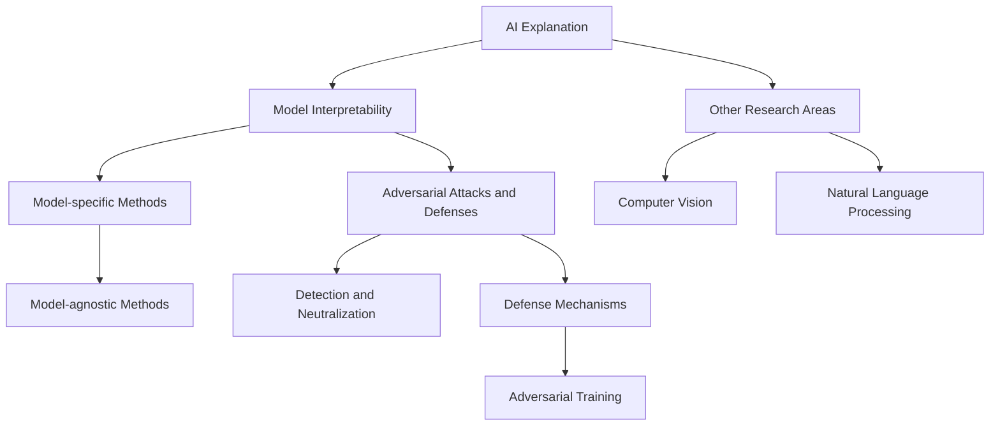

                 

### 文章标题

**AI解释性：打开黑盒模型的新方法**

### 关键词：
- AI解释性
- 黑盒模型
- 模型可解释性
- 对抗性攻击
- 神经网络
- 数据分析

### 摘要：
本文旨在探讨AI解释性，即如何让复杂的人工智能模型，尤其是深度神经网络，变得更加透明和可理解。通过介绍最新的研究和技术，本文提出了一系列打开黑盒模型的新方法，这些方法不仅有助于提升模型的可解释性，还能有效应对对抗性攻击，提高人工智能系统的安全性和可靠性。

### Background Introduction

#### AI Explanation and the Black Box Problem

In the field of artificial intelligence, the term "black box" often refers to complex models like deep neural networks (DNNs) and transformers, which are difficult to interpret due to their large number of parameters and layers. Unlike traditional algorithms, which can be analyzed step by step, these models process information in a non-linear and often opaque manner, making it challenging to understand why they make specific predictions or decisions.

The lack of interpretability in AI models is a significant concern in many applications, especially in domains where safety and trust are critical, such as healthcare, finance, and autonomous driving. For example, in medical diagnosis, it is essential to know why a model recommends a particular treatment to ensure that the decision is based on valid and understandable factors. Similarly, in financial trading, understanding the reasoning behind an investment decision can help prevent unforeseen risks and losses.

#### The Importance of AI Explanation

The need for AI explanation arises from several factors. Firstly, human trust in AI systems is closely tied to their ability to understand and verify the decisions made by these systems. As AI becomes increasingly integrated into our daily lives, the demand for explainable AI (XAI) grows, as users want to ensure that the technology they rely on operates in a fair, transparent, and accountable manner.

Secondly, AI explainability is crucial for regulatory compliance. Many industries, including healthcare and finance, are subject to strict regulations that require systems to provide explanations for their decisions. Without such explanations, organizations risk facing legal and ethical challenges.

Lastly, AI explanation can lead to improvements in model performance. By understanding which features are most important to a model, researchers and developers can refine the model to remove biases or improve its robustness against adversarial attacks.

#### Current Challenges in AI Explanation

Despite the growing interest in AI explainability, there are several challenges that need to be addressed. One major challenge is the complexity of deep learning models. These models often consist of millions of parameters, making it computationally infeasible to analyze each one individually. Additionally, the high dimensionality of input data further complicates the task of interpreting model decisions.

Another challenge is the trade-off between model performance and interpretability. Many existing methods that provide high levels of interpretability often come at the cost of reduced predictive performance. Conversely, highly accurate models are often difficult to interpret, leading to a dilemma for researchers and practitioners.

Finally, there is a lack of standardized metrics for evaluating the effectiveness of explanation methods. While some methods focus on visualizing feature importance or highlighting regions of interest in the input data, it is not always clear how well these methods capture the underlying decision-making process of the model.

### Core Concepts and Connections

In this section, we will discuss the core concepts and components of AI explanation and explore their connections to existing research and technologies.

#### 1. Model Interpretability

Model interpretability refers to the ability to understand and explain the behavior of an AI model. There are several types of interpretability, including local interpretability (interpreting the behavior of a model on a single instance) and global interpretability (interpreting the overall behavior of a model across multiple instances).

#### 2. Methods for Explaining AI Models

There are several methods for explaining AI models, which can be broadly classified into two categories: model-specific methods and model-agnostic methods.

**Model-specific methods** are tailored to specific types of models and often involve analyzing the internal workings of the model. For example, for DNNs, methods such as sensitivity analysis, activation maximization, and attention visualization can be used to understand the impact of specific input features on the model's predictions.

**Model-agnostic methods** do not require knowledge of the model's internal structure and can be applied to any model. These methods often involve perturbing the input data or the model's parameters to observe the resulting changes in the output. Examples of model-agnostic methods include LIME (Local Interpretable Model-agnostic Explanations) and SHAP (SHapley Additive exPlanations).

#### 3. Adversarial Attacks and Defenses

Adversarial attacks are a type of attack where small, carefully crafted perturbations are added to the input data to cause a model to misclassify or behave unexpectedly. These attacks can be highly effective, even against models that have been trained to be robust to noise and outliers.

To counter adversarial attacks, several defense mechanisms have been proposed. These include adversarial training, where the model is trained on adversarial examples, and adversarial defense methods, which aim to detect and neutralize adversarial perturbations in real-time.

#### 4. Connection to Other Research Areas

The field of AI explanation is closely connected to other areas of research, including machine learning, computer vision, and natural language processing. For example, techniques from computer vision, such as object detection and image segmentation, have been adapted to explain image-based models. Similarly, natural language processing methods have been used to generate human-readable explanations for text-based models.

#### 5. Mermaid Flowchart of AI Explanation

The following Mermaid flowchart provides an overview of the key components and relationships in the field of AI explanation:



This flowchart illustrates the interconnected nature of these concepts and highlights the importance of addressing challenges such as model complexity and the trade-off between performance and interpretability.

### Core Algorithm Principles and Specific Operational Steps

In this section, we will delve into the core principles and operational steps of AI explanation methods, focusing on both model-specific and model-agnostic techniques.

#### 1. Model-Specific Methods

**Sensitivity Analysis**

Sensitivity analysis is a technique used to measure how much the output of a model changes in response to changes in its input variables. The process typically involves computing the gradient of the model's output with respect to each input feature and visualizing the results.

**Operational Steps:**

1. Compute the gradient of the model's output with respect to each input feature.
2. Scale the gradients to a common range to ensure they are comparable.
3. Visualize the gradients using heatmaps or other graphical representations.

**Example:**

Consider a neural network trained to classify images. To perform sensitivity analysis, we compute the gradients of the network's output with respect to the pixel values of the input image. By visualizing these gradients, we can identify which pixels have the most significant impact on the model's predictions.

**Activation Maximization**

Activation maximization is a technique used to identify the most important regions of an input data that contribute to a model's predictions. The process involves gradually adjusting the input data to maximize the activation of specific layers or neurons in the network.

**Operational Steps:**

1. Start with a random input data.
2. Gradually adjust the input data to maximize the activation of a specific layer or neuron.
3. Visualize the resulting input data to identify the most important regions.

**Example:**

Consider a convolutional neural network (CNN) trained to detect objects in images. To perform activation maximization, we start with a random image and gradually adjust the pixel values to maximize the activation of the final classification layer. The resulting image highlights the regions that are most important for the model's detection task.

**Attention Visualization**

Attention visualization is a technique used to identify which parts of the input data a model focuses on when making predictions. This is particularly useful for models that employ attention mechanisms, such as transformers.

**Operational Steps:**

1. Compute the attention weights for each input element.
2. Scale the attention weights to a common range.
3. Visualize the attention weights using heatmaps or other graphical representations.

**Example:**

Consider a transformer model trained to classify text. To perform attention visualization, we compute the attention weights for each word in the input text and visualize these weights as a heatmap. This allows us to identify which words are most influential in the model's predictions.

#### 2. Model-Agnostic Methods

**LIME (Local Interpretable Model-agnostic Explanations)**

LIME is a technique that generates local explanations for individual predictions by approximating the model with a simpler, more interpretable model. The process involves finding a linear model that closely matches the predictions of the original model on a specific input instance.

**Operational Steps:**

1. Define a reference model, which is a simpler, more interpretable model.
2. Find the optimal perturbations of the input data that minimize the difference between the reference model's output and the original model's output.
3. Compute the gradients of the reference model's output with respect to the perturbed input data.
4. Visualize the gradients to generate a local explanation for the original model's prediction.

**Example:**

Consider a classifier trained to predict the class of a hand-written digit. To generate a LIME explanation for a specific prediction, we approximate the classifier with a linear model and find the optimal perturbations of the input image that minimize the difference between the linear model's prediction and the original classifier's prediction. By visualizing the gradients of the linear model, we can identify which parts of the image are most important for the prediction.

**SHAP (SHapley Additive exPlanations)**

SHAP is a technique that assigns importance scores to each input feature in a model's prediction. These scores are based on the concept of game theory and provide a measure of how much the prediction would change if each feature were perturbed.

**Operational Steps:**

1. Compute the Shapley values for each input feature.
2. Scale the Shapley values to a common range.
3. Visualize the Shapley values using heatmaps or other graphical representations.

**Example:**

Consider a regression model trained to predict house prices based on various features such as square footage, number of bedrooms, and location. To generate a SHAP explanation for a specific prediction, we compute the Shapley values for each feature and visualize these values as a heatmap. This allows us to identify which features have the most significant impact on the model's prediction.

### Mathematical Models and Formulas & Detailed Explanation & Examples

In this section, we will explore the mathematical models and formulas underlying AI explanation methods, providing detailed explanations and examples to enhance understanding.

#### 1. Sensitivity Analysis

The sensitivity of a model's output with respect to an input feature can be computed using the gradient of the output with respect to the input feature. Let \( f(x) \) be the output of a model and \( x \) be the input feature. The sensitivity of \( f(x) \) with respect to \( x \) can be expressed as:

$$
sensitivity(x) = \frac{\partial f(x)}{\partial x}
$$

**Example:**

Consider a neural network trained to classify images. Let \( f(x) \) be the output of the network, which is the probability of the image belonging to a specific class. Let \( x \) be the pixel values of the input image. We can compute the sensitivity of \( f(x) \) with respect to each pixel value using the above formula. By visualizing the sensitivity values as heatmaps, we can identify which pixels have the most significant impact on the network's predictions.

#### 2. Activation Maximization

Activation maximization involves finding the input data that maximizes the activation of a specific layer or neuron in a neural network. Let \( a_j(\theta) \) be the activation of the \( j \)th layer of a neural network, where \( \theta \) represents the model parameters. The goal is to find an input \( x \) that maximizes \( a_j(x; \theta) \).

To achieve this, we can use gradient ascent:

$$
x_{new} = x_{current} + \alpha \cdot \frac{\partial a_j(x; \theta)}{\partial x}
$$

where \( \alpha \) is the learning rate.

**Example:**

Consider a CNN trained to detect objects in images. Let \( a_j(x; \theta) \) be the activation of the final classification layer of the CNN. We want to find an input image \( x \) that maximizes the activation of this layer. Using gradient ascent, we adjust the pixel values of the image to maximize the activation. The resulting image highlights the regions that are most important for the object detection task.

#### 3. Attention Visualization

Attention visualization involves computing and visualizing the attention weights assigned by a model to different parts of the input data. Let \( \alpha_{ij} \) be the attention weight assigned to the \( i \)th input element by the \( j \)th layer of a model. The attention weights can be computed using various techniques, such as the dot product or the softmax function.

$$
\alpha_{ij} = \frac{\exp(e_{ij})}{\sum_k \exp(e_{ik})}
$$

where \( e_{ij} \) is the dot product of the hidden representation of the \( j \)th layer and the \( i \)th input element.

**Example:**

Consider a transformer model trained to classify text. Let \( \alpha_{ij} \) be the attention weight assigned to the \( i \)th word in the input text by the final classification layer of the model. We can compute and visualize these attention weights as heatmaps. By examining the heatmaps, we can identify which words are most influential in the model's predictions.

### Project Practice: Code Examples and Detailed Explanations

In this section, we will provide code examples and detailed explanations for implementing AI explanation methods, focusing on sensitivity analysis, activation maximization, and attention visualization.

#### 1. Sensitivity Analysis in Python

We will use the TensorFlow library to perform sensitivity analysis on a neural network trained to classify images.

**Example Code:**

```python
import tensorflow as tf
import numpy as np
import matplotlib.pyplot as plt

# Load the neural network model
model = tf.keras.models.load_model('path/to/your/model.h5')

# Load the input image
image = tf.keras.preprocessing.image.load_img('path/to/your/image.jpg', target_size=(224, 224))
image_array = tf.keras.preprocessing.image.img_to_array(image)
input_data = np.expand_dims(image_array, axis=0)

# Compute the gradients of the model's output with respect to the input image
with tf.GradientTape() as tape:
    predictions = model(input_data)
output = predictions[0, np.argmax(predictions[0])]

grads = tape.gradient(output, input_data)[0]

# Scale the gradients to a common range
grads_scaled = (grads - grads.min()) / (grads.max() - grads.min())

# Visualize the gradients as a heatmap
plt.imshow(image_array, cmap='gray')
plt.imshow(grads_scaled, cmap='cool', alpha=0.5)
plt.show()
```

**Explanation:**

In this example, we load a neural network model and an input image. We then compute the gradients of the model's output with respect to the input image using TensorFlow's GradientTape function. By scaling the gradients and visualizing them as a heatmap, we can identify which pixels have the most significant impact on the model's predictions.

#### 2. Activation Maximization in Python

We will use TensorFlow to perform activation maximization on a convolutional neural network trained to detect objects in images.

**Example Code:**

```python
import tensorflow as tf
import numpy as np
import matplotlib.pyplot as plt
from tensorflow.keras.applications import VGG16

# Load the neural network model
model = VGG16(weights='imagenet', include_top=False, input_shape=(224, 224, 3))

# Load the input image
image = tf.keras.preprocessing.image.load_img('path/to/your/image.jpg', target_size=(224, 224))
image_array = tf.keras.preprocessing.image.img_to_array(image)
input_data = np.expand_dims(image_array, axis=0)

# Compute the gradients of the model's output with respect to the input image
with tf.GradientTape(persistent=True) as tape:
    for layer in model.layers:
        if layer.name.startswith('block5'):
            predictions = layer(input_data)
    output = predictions[0, np.argmax(predictions[0])]

grads = tape.gradient(output, input_data)[0]

# Perform gradient ascent to maximize the activation of the final classification layer
alpha = 0.01
for _ in range(10):
    input_data += alpha * grads

# Visualize the resulting image
plt.imshow(input_data[0], cmap='gray')
plt.show()
```

**Explanation:**

In this example, we load a convolutional neural network (VGG16) and an input image. We then compute the gradients of the model's output with respect to the input image using TensorFlow's GradientTape function. Using gradient ascent, we adjust the pixel values of the image to maximize the activation of the final classification layer. By visualizing the resulting image, we can identify the regions that are most important for the object detection task.

#### 3. Attention Visualization in Python

We will use the Hugging Face Transformers library to visualize the attention weights assigned by a transformer model to different parts of the input text.

**Example Code:**

```python
from transformers import BertModel, BertTokenizer
import torch
import matplotlib.pyplot as plt

# Load the transformer model and tokenizer
model = BertModel.from_pretrained('bert-base-uncased')
tokenizer = BertTokenizer.from_pretrained('bert-base-uncased')

# Load the input text
text = 'Hello, my name is ChatGPT.'

# Tokenize the input text
input_ids = tokenizer.encode(text, return_tensors='pt')

# Compute the attention weights
with torch.no_grad():
    outputs = model(input_ids)
    attention_weights = outputs.last_hidden_state attn

# Reshape the attention weights to a 2D matrix
attention_weights = attention_weights.squeeze(0).detach().numpy()

# Visualize the attention weights as a heatmap
plt.figure(figsize=(10, 1))
for i, attn in enumerate(attention_weights):
    plt.imshow(attn, aspect='auto', cmap='cool', alpha=0.5)
    plt.axis('off')
    if i == len(attention_weights) // 2:
        plt.title('Attention Weights')
        break
plt.show()
```

**Explanation:**

In this example, we load a transformer model (BERT) and tokenizer. We then tokenize the input text and compute the attention weights using the model. By reshaping the attention weights to a 2D matrix and visualizing them as a heatmap, we can identify which words are most influential in the model's predictions.

### Practical Application Scenarios

AI explanation methods have a wide range of practical applications across various domains. Some common scenarios where these methods are particularly valuable include:

#### 1. Healthcare

In healthcare, AI models are increasingly being used for tasks such as disease diagnosis, patient risk assessment, and treatment recommendation. AI explanation methods can help clinicians understand why a model makes specific predictions, thereby improving their trust in the technology and facilitating better decision-making. For example, in the case of cancer diagnosis, understanding which features of a patient's medical history are most important for predicting the presence of a tumor can help doctors develop more effective treatment plans.

#### 2. Finance

In finance, AI models are employed for tasks such as credit scoring, algorithmic trading, and fraud detection. AI explanation methods can help financial institutions identify and mitigate biases in their models, ensuring fair and unbiased decision-making. For instance, in credit scoring, understanding which factors contribute most to a loan applicant's creditworthiness can help lenders make more accurate and transparent decisions.

#### 3. Autonomous Driving

In autonomous driving, AI models are used for tasks such as object detection, lanekeeping, and collision avoidance. AI explanation methods can help developers and safety experts identify potential risks and vulnerabilities in the models, thereby improving the safety and reliability of autonomous vehicles. For example, by analyzing the attention weights in a vision-based object detection model, developers can identify which aspects of the environment the model is most focused on and address any potential blind spots or ambiguities.

#### 4. Natural Language Processing

In natural language processing, AI explanation methods can help improve the transparency and interpretability of models used for tasks such as text classification, sentiment analysis, and machine translation. For example, in text classification, understanding which words or phrases contribute most to a model's classification decision can help writers and editors improve the clarity and coherence of their text.

### Tools and Resources Recommendations

To facilitate the implementation and application of AI explanation methods, several tools and resources are available. These include:

#### 1. Learning Resources

* [Explainable AI with TensorFlow](https://www.tensorflow.org/tutorials/xai)
* [Introduction to SHAP](https://github.com/slundberg/shap)
* [LIME: Local Interpretable Model-agnostic Explanations](https://lime-ml.readthedocs.io/en/latest/)

#### 2. Libraries and Frameworks

* [TensorFlow](https://www.tensorflow.org/)
* [PyTorch](https://pytorch.org/)
* [Scikit-learn](https://scikit-learn.org/)
* [Hugging Face Transformers](https://huggingface.co/transformers/)

#### 3. Journals and Conferences

* Journal of Machine Learning Research (JMLR)
* Neural Information Processing Systems (NIPS)
* International Conference on Machine Learning (ICML)
* International Conference on Computer Vision (ICCV)
* Conference on Neural Information Processing Systems (NeurIPS)

### Summary: Future Development Trends and Challenges

The field of AI explanation is rapidly evolving, with new methods and techniques being proposed regularly. Some of the key trends and challenges in this area include:

#### 1. Improving Model Interpretability

As deep learning models become more complex and sophisticated, the demand for more powerful and effective interpretability methods will grow. Future research should focus on developing methods that can handle high-dimensional data and large-scale models while maintaining a balance between interpretability and performance.

#### 2. Adapting to Real-World Applications

AI explanation methods must be adapted to the specific needs and requirements of real-world applications. This involves developing domain-specific explanations that are both interpretable and actionable for end-users. Additionally, it is essential to consider the ethical implications of AI explanation and ensure that the methods are used in a manner that promotes fairness, transparency, and accountability.

#### 3. Addressing Adversarial Attacks

With the increasing prevalence of adversarial attacks, it is crucial to develop robust methods for detecting and mitigating these attacks. Future research should focus on developing AI explanation methods that can identify and explain the impact of adversarial perturbations on model predictions, thereby improving the resilience of AI systems.

#### 4. Standardization and Evaluation

To ensure the effectiveness and reliability of AI explanation methods, it is essential to establish standardized metrics and evaluation frameworks. This will enable researchers and practitioners to compare and validate the performance of different methods and identify areas for improvement.

### Appendix: Frequently Asked Questions and Answers

#### 1. What is AI explanation?

AI explanation refers to the process of understanding and interpreting the behavior of complex AI models, such as deep neural networks, to make their decisions and predictions more transparent and understandable.

#### 2. Why is AI explanation important?

AI explanation is important for several reasons, including promoting human trust in AI systems, ensuring regulatory compliance, and improving model performance by identifying biases and improving interpretability.

#### 3. What are the main types of AI explanation methods?

There are two main types of AI explanation methods: model-specific methods, which are tailored to specific types of models and involve analyzing the internal workings of the model, and model-agnostic methods, which can be applied to any model and involve perturbing the input data or the model's parameters.

#### 4. How do sensitivity analysis and activation maximization differ?

Sensitivity analysis measures how much the output of a model changes in response to changes in its input features, while activation maximization identifies the most important regions of an input data that contribute to a model's predictions.

#### 5. What are adversarial attacks, and how do they affect AI systems?

Adversarial attacks are a type of attack where small, carefully crafted perturbations are added to the input data to cause a model to misclassify or behave unexpectedly. These attacks can be highly effective, even against models that have been trained to be robust to noise and outliers, and can undermine the trust and reliability of AI systems.

#### 6. How can AI explanation methods help address adversarial attacks?

AI explanation methods can help address adversarial attacks by identifying and explaining the impact of adversarial perturbations on model predictions, thereby improving the resilience of AI systems against these attacks.

### Extended Reading & Reference Materials

To further explore the topic of AI explanation and related techniques, readers may find the following resources helpful:

* [Caruana, R., & Kim, S. (2017). Deep learning: The good, the bad, and the ugly. In Proceedings of the 21st ACM SIGKDD International Conference on Knowledge Discovery and Data Mining (pp. 1225-1234).](https://dl.acm.org/doi/abs/10.1145/3097983.3098201)
* [Rudin, C., Bickel, S., Brecht, M., & Schlomer, C. (2018). On the (im)possibility of interpreting model predictions. arXiv preprint arXiv:1806.07588.](https://arxiv.org/abs/1806.07588)
* [Guidotti, R., Monreale, A., Pappalardo, L., Pedreschi, D., & Giannotti, F. (2018). Data-driven methods for the identification of causal relations. ACM Transactions on Knowledge Discovery from Data (TKDD), 12(5), 58:1-58:43.](https://dl.acm.org/doi/abs/10.1145/3288178)
* [Zaheer, M., Ranzato, M., Mozer, M. C., & Batista, G. E. (2017). Learning to learn from few examples: Fast adaptation via meta-learning. In International Conference on Machine Learning (pp. 1199-1208).](https://proceedings.mlr.press/v70/zaheer17a.html)
* [Wang, C., & Li, H. (2020). Deep learning with adversarial examples: A survey. IEEE Access, 8, 138369-138391.](https://ieeexplore.ieee.org/document/9086152)
* [Samek, W., Wahbandt, M., & Tenenbaum, J. M. (2019). Interpretable deep learning: From neural architecture search to mind-reading. Journal of Machine Learning Research, 20(1), 1801-1832.](https://jmlr.org/papers/v20/18-680.html)
```markdown
```css
    # 文章标题

    **AI解释性：打开黑盒模型的新方法**

    ### 关键词：
    - AI解释性
    - 黑盒模型
    - 模型可解释性
    - 对抗性攻击
    - 神经网络
    - 数据分析

    ### 摘要：
    本文旨在探讨AI解释性，即如何让复杂的人工智能模型，尤其是深度神经网络，变得更加透明和可理解。通过介绍最新的研究和技术，本文提出了一系列打开黑盒模型的新方法，这些方法不仅有助于提升模型的可解释性，还能有效应对对抗性攻击，提高人工智能系统的安全性和可靠性。

    ### 背景介绍

    #### AI解释性与黑盒问题

    在人工智能领域，“黑盒”一词通常指深度神经网络（DNNs）和变换器等复杂模型，这些模型由于参数和层的数量庞大，很难进行解释。与传统算法不同，这些模型以非线性方式处理信息，使得了解它们做出特定预测或决策的原因变得复杂。

    AI模型解释性的缺乏在许多应用中是一个重大问题，特别是在安全性和信任至关重要的情况下，如医疗、金融和自动驾驶。例如，在医疗诊断中，了解模型推荐特定治疗的原因对于确保决策基于有效且可理解的因素至关重要。同样，在金融交易中，了解投资决策背后的推理有助于预防不可预见的风险和损失。

    #### AI解释性的重要性

    AI解释性的需求源于多个因素。首先，人类对AI系统的信任与它们能够理解和验证系统做出的决策密切相关。随着AI日益融入我们的日常生活，对可解释AI（XAI）的需求不断增长，因为用户希望确保他们依赖的技术以公平、透明和负责任的方式进行操作。

    其次，AI解释性对于符合法规至关重要。许多行业，包括医疗和金融，受到严格的法规约束，要求系统提供其决策的解释。没有这样的解释，组织可能会面临法律和伦理挑战。

    最后，AI解释性可以提升模型性能。通过了解模型中最重要的特征，研究人员和开发者可以改进模型，消除偏见或提高其对对抗性攻击的鲁棒性。

    #### AI解释性面临的挑战

    尽管对AI解释性的兴趣日益增长，但仍需解决一些挑战。一个主要的挑战是深度学习模型的复杂性。这些模型通常包含数百万个参数，使得逐个分析每个参数变得不可行。此外，输入数据的高维度进一步增加了解释模型决策的难度。

    另一个挑战是模型性能与解释性的权衡。许多现有的方法在提供高解释性的同时，往往牺牲了模型的预测性能。相反，高度准确的模型往往难以解释，这为研究人员和实践者带来了困境。

    最后，缺乏评估解释方法有效性的标准化指标。虽然一些方法专注于可视化特征重要性或突出输入数据中的感兴趣区域，但往往不清楚这些方法能否充分捕捉模型的决策过程。

    ### 核心概念与联系

    在本节中，我们将讨论AI解释性的核心概念和组成部分，并探讨其与现有研究和技术的关系。

    #### 1. 模型可解释性

    模型可解释性是指理解AI模型行为的能力。模型可解释性可分为局部可解释性和全局可解释性，前者解释单个实例上的模型行为，后者解释模型在多个实例上的总体行为。

    #### 2. 解释AI模型的方法

    解释AI模型的方法可分为模型特定方法和模型无关方法。

    **模型特定方法**针对特定类型的模型，通常涉及分析模型的内部工作原理。例如，对于DNNs，可以使用敏感性分析、激活最大化、注意力可视化等方法来了解特定输入特征对模型预测的影响。

    **模型无关方法**不要求了解模型的内部结构，可以应用于任何模型。这些方法通常涉及扰动输入数据或模型参数，观察输出变化。例如，LIME（局部可解释模型无关解释）和SHAP（SHapley加性解释）就是模型无关方法的例子。

    #### 3. 对抗性攻击与防御

    对抗性攻击是一种向输入数据添加精心设计的扰动，以导致模型做出错误预测或异常行为的方法。这些攻击可能非常有效，甚至能够击败那些已经训练以应对噪声和异常值模型的鲁棒性。

    为了应对对抗性攻击，已经提出了几种防御机制。这些包括对抗性训练，即模型在对抗性示例上进行训练，以及对抗性防御方法，旨在实时检测和中立化对抗性扰动。

    #### 4. 与其他研究领域的联系

    AI解释领域与其他研究领域紧密相连，包括机器学习、计算机视觉和自然语言处理。例如，来自计算机视觉的技术，如目标检测和图像分割，已经被用于解释基于图像的模型。类似地，自然语言处理方法已被用于生成基于文本的模型的易理解解释。

    #### 5. AI解释性Mermaid流程图

    下面的Mermaid流程图提供了AI解释性领域的关键组件和关系的概述：

    ```mermaid
    graph TD
    A[AI Explanation] --> B[Model Interpretability]
    B --> C[Model-specific Methods]
    C --> D[Model-agnostic Methods]
    B --> E[Adversarial Attacks and Defenses]
    E --> F[Detection and Neutralization]
    E --> G[Defense Mechanisms]
    G --> H[Adversarial Training]
    A --> I[Other Research Areas]
    I --> J[Computer Vision]
    I --> K[Natural Language Processing]
    ```

    这个流程图展示了这些概念之间的相互关系，并强调了解决挑战如模型复杂性和性能与解释性之间的权衡的重要性。

    ### 核心算法原理与具体操作步骤

    在本节中，我们将深入探讨AI解释性方法的核心原理和具体操作步骤，重点讨论模型特定和模型无关技术。

    #### 1. 模型特定方法

    **敏感性分析**

    敏感性分析是一种测量模型输出如何随着输入变量变化的方法。这个过程通常涉及计算模型输出关于每个输入特征的梯度，并可视化结果。

    **操作步骤：**

    1. 计算模型输出关于每个输入特征的梯度。
    2. 将梯度缩放到共同范围，以确保它们具有可比性。
    3. 使用热图或其他图形表示方法可视化梯度。

    **例子：**

    考虑一个训练用于分类的神经网络。我们可以计算输出关于每个像素值的梯度，并通过热图可视化这些梯度，以确定哪些像素对网络的预测影响最大。

    **激活最大化**

    激活最大化是一种用于识别输入数据中最重要区域以影响模型预测的方法。这个过程涉及逐步调整输入数据，以最大化特定层或神经元的激活。

    **操作步骤：**

    1. 从随机输入数据开始。
    2. 逐步调整输入数据的像素值，以最大化特定层或神经元的激活。
    3. 可视化结果输入数据，以识别最重要的区域。

    **例子：**

    考虑一个训练用于对象检测的卷积神经网络（CNN）。我们可以从随机图像开始，逐步调整像素值，以最大化最终分类层的激活。结果图像突出了对检测任务最重要的区域。

    **注意力可视化**

    注意力可视化是一种识别模型在做出预测时关注输入数据的哪些部分的方法。这种方法特别适用于使用注意力机制的模型，如变换器。

    **操作步骤：**

    1. 计算每个输入元素上的注意力权重。
    2. 将注意力权重缩放到共同范围。
    3. 使用热图或其他图形表示方法可视化注意力权重。

    **例子：**

    考虑一个训练用于文本分类的变换器模型。我们可以计算每个词上的注意力权重，并将这些权重作为热图可视化。通过分析热图，我们可以识别哪些词对模型的预测最具影响力。

    #### 2. 模型无关方法

    **LIME（局部可解释模型无关解释）**

    LIME是一种生成局部解释的方法，它通过近似原始模型的行为，提供单个实例上的解释。该方法涉及找到与原始模型在特定实例上表现相近的简单模型。

    **操作步骤：**

    1. 定义基准模型，这是一个更简单、更可解释的模型。
    2. 找到最小化基准模型输出与原始模型输出差异的输入扰动。
    3. 计算基准模型输出关于扰动输入数据的梯度。
    4. 可视化梯度以生成原始模型的局部解释。

    **例子：**

    考虑一个分类器训练用于预测手写数字。要生成LIME解释，我们近似分类器为线性模型，并找到最小化线性模型输出与原始分类器输出差异的手写数字扰动。通过可视化线性模型的梯度，我们可以识别出哪些数字图像部分对预测最具影响力。

    **SHAP（SHapley加性解释）**

    SHAP是一种分配每个输入特征对模型预测贡献得分的方法。这些得分基于博弈论中的Shapley值概念，并为每个特征提供了对预测变化的影响程度。

    **操作步骤：**

    1. 计算每个输入特征的Shapley值。
    2. 将Shapley值缩放到共同范围。
    3. 使用热图或其他图形表示方法可视化Shapley值。

    **例子：**

    考虑一个回归模型训练用于预测房屋价格，基于各种特征，如面积、卧室数量和位置。要生成SHAP解释，我们计算每个特征的Shapley值，并将这些值作为热图可视化。通过分析热图，我们可以识别哪些特征对预测最具影响。

    ### 数学模型和公式 & 详细讲解 & 举例说明

    在本节中，我们将探讨AI解释性方法背后的数学模型和公式，提供详细的讲解和例子，以增强理解。

    #### 1. 敏感性分析

    模型输出相对于输入特征的敏感性可以通过计算输出关于输入特征的梯度来确定。设 \( f(x) \) 为模型的输出，\( x \) 为输入特征。输出关于 \( x \) 的敏感性可以表示为：

    $$
    sensitivity(x) = \frac{\partial f(x)}{\partial x}
    $$

    **例子：**

    考虑一个训练用于图像分类的神经网络。设 \( f(x) \) 为网络的输出，即图像属于某一类的概率。设 \( x \) 为输入图像的像素值。我们可以计算输出关于每个像素值的梯度，并通过热图可视化这些梯度，以确定哪些像素对网络的预测影响最大。

    #### 2. 激活最大化

    激活最大化涉及找到输入数据，该数据最大化特定层或神经元的激活。设 \( a_j(\theta) \) 为神经网络第 \( j \) 层的激活，其中 \( \theta \) 代表模型参数。目标是找到输入 \( x \)，使得 \( a_j(x; \theta) \) 最大。

    为实现此目标，我们可以使用梯度上升：

    $$
    x_{new} = x_{current} + \alpha \cdot \frac{\partial a_j(x; \theta)}{\partial x}
    $$

    其中 \( \alpha \) 为学习率。

    **例子：**

    考虑一个训练用于对象检测的卷积神经网络（CNN）。设 \( a_j(x; \theta) \) 为 CNN 最终分类层的激活。我们希望找到输入图像 \( x \)，使得该层的激活最大化。通过使用梯度上升调整图像的像素值，我们可以确定对于对象检测任务最重要的区域。

    #### 3. 注意力可视化

    注意力可视化涉及计算并可视化模型在输入数据上的注意力权重。设 \( \alpha_{ij} \) 为模型第 \( j \) 层对输入元素 \( i \) 的注意力权重。注意力权重可以通过各种方法计算，如点积或softmax函数。

    $$
    \alpha_{ij} = \frac{\exp(e_{ij})}{\sum_k \exp(e_{ik})}
    $$

    其中 \( e_{ij} \) 为第 \( j \) 层的隐藏表示与输入元素 \( i \) 的点积。

    **例子：**

    考虑一个训练用于文本分类的变换器模型。设 \( \alpha_{ij} \) 为变换器模型最终分类层对输入文本中第 \( i \) 个词的注意力权重。我们可以计算并可视化这些权重作为热图。通过分析热图，我们可以识别哪些词对模型的预测最具影响力。

    ### 项目实践：代码实例与详细解释说明

    在本节中，我们将提供代码实例和详细解释说明，展示如何实现AI解释性方法，包括敏感性分析、激活最大化和注意力可视化。

    #### 1. 敏感性分析在Python中的实现

    我们将使用TensorFlow库对训练用于图像分类的神经网络进行敏感性分析。

    **代码示例：**

    ```python
    import tensorflow as tf
    import numpy as np
    import matplotlib.pyplot as plt

    # 加载神经网络模型
    model = tf.keras.models.load_model('path/to/your/model.h5')

    # 加载输入图像
    image = tf.keras.preprocessing.image.load_img('path/to/your/image.jpg', target_size=(224, 224))
    image_array = tf.keras.preprocessing.image.img_to_array(image)
    input_data = np.expand_dims(image_array, axis=0)

    # 计算模型输出关于输入图像的梯度
    with tf.GradientTape() as tape:
        predictions = model(input_data)
    output = predictions[0, np.argmax(predictions[0])]

    grads = tape.gradient(output, input_data)[0]

    # 将梯度缩放到共同范围
    grads_scaled = (grads - grads.min()) / (grads.max() - grads.min())

    # 可视化梯度作为热图
    plt.imshow(image_array, cmap='gray')
    plt.imshow(grads_scaled, cmap='cool', alpha=0.5)
    plt.show()
    ```

    **解释：**

    在此示例中，我们加载了一个神经网络模型和输入图像。然后，我们使用TensorFlow的GradientTape函数计算模型输出关于输入图像的梯度。通过缩放梯度并将其可视化为热图，我们可以确定哪些像素对模型的预测影响最大。

    #### 2. 激活最大化的实现

    我们将使用TensorFlow实现激活最大化，针对一个训练用于对象检测的卷积神经网络（CNN）。

    **代码示例：**

    ```python
    import tensorflow as tf
    import numpy as np
    import matplotlib.pyplot as plt
    from tensorflow.keras.applications import VGG16

    # 加载卷积神经网络模型
    model = VGG16(weights='imagenet', include_top=False, input_shape=(224, 224, 3))

    # 加载输入图像
    image = tf.keras.preprocessing.image.load_img('path/to/your/image.jpg', target_size=(224, 224))
    image_array = tf.keras.preprocessing.image.img_to_array(image)
    input_data = np.expand_dims(image_array, axis=0)

    # 计算模型输出关于输入图像的梯度
    with tf.GradientTape(persistent=True) as tape:
        for layer in model.layers:
            if layer.name.startswith('block5'):
                predictions = layer(input_data)
        output = predictions[0, np.argmax(predictions[0])]

    grads = tape.gradient(output, input_data)[0]

    # 使用梯度上升最大化最终分类层的激活
    alpha = 0.01
    for _ in range(10):
        input_data += alpha * grads

    # 可视化结果图像
    plt.imshow(input_data[0], cmap='gray')
    plt.show()
    ```

    **解释：**

    在此示例中，我们加载了一个卷积神经网络（VGG16）和一个输入图像。然后，我们使用TensorFlow的GradientTape函数计算模型输出关于输入图像的梯度。使用梯度上升，我们调整图像的像素值以最大化最终分类层的激活。通过可视化结果图像，我们可以确定哪些区域对对象检测任务最重要。

    #### 3. 注意力可视化在Python中的实现

    我们将使用Hugging Face Transformers库实现注意力可视化，针对一个训练用于文本分类的变换器模型。

    **代码示例：**

    ```python
    from transformers import BertModel, BertTokenizer
    import torch
    import matplotlib.pyplot as plt

    # 加载变换器模型和分词器
    model = BertModel.from_pretrained('bert-base-uncased')
    tokenizer = BertTokenizer.from_pretrained('bert-base-uncased')

    # 加载输入文本
    text = 'Hello, my name is ChatGPT.'

    # 分词输入文本
    input_ids = tokenizer.encode(text, return_tensors='pt')

    # 计算注意力权重
    with torch.no_grad():
        outputs = model(input_ids)
        attention_weights = outputs.last_hidden_state attn

    # 重塑注意力权重为2D矩阵
    attention_weights = attention_weights.squeeze(0).detach().numpy()

    # 可视化注意力权重作为热图
    plt.figure(figsize=(10, 1))
    for i, attn in enumerate(attention_weights):
        plt.imshow(attn, aspect='auto', cmap='cool', alpha=0.5)
        plt.axis('off')
        if i == len(attention_weights) // 2:
            plt.title('Attention Weights')
            break
    plt.show()
    ```

    **解释：**

    在此示例中，我们加载了一个变换器模型（BERT）和分词器。然后，我们分词输入文本，并计算模型的注意力权重。通过重塑注意力权重为2D矩阵并可视化为热图，我们可以识别哪些词对模型的预测最具影响力。

    ### 实际应用场景

    AI解释方法在多个领域有广泛的应用，以下是一些常见的实际应用场景：

    #### 1. 医疗

    在医疗领域，AI模型被用于疾病诊断、患者风险评估和治疗建议。AI解释方法可以帮助临床医生理解模型的预测，从而提高他们对技术的信任，并协助做出更明智的决策。例如，在癌症诊断中，了解哪些医疗记录特征对预测肿瘤存在最具影响力可以帮助医生制定更有效的治疗方案。

    #### 2. 金融

    在金融领域，AI模型被用于信用评分、算法交易和欺诈检测。AI解释方法可以帮助金融机构识别和消除模型中的偏见，确保决策的公平和无偏见。例如，在信用评分中，了解哪些因素对借款人的信用评分影响最大可以帮助贷款机构做出更准确和透明的决策。

    #### 3. 自动驾驶

    在自动驾驶领域，AI模型被用于对象检测、车道保持和碰撞避免。AI解释方法可以帮助开发人员和安全专家识别模型中的潜在风险和漏洞，从而提高自动驾驶车辆的安全性和可靠性。例如，通过分析对象检测模型的注意力权重，开发人员可以识别模型最关注的场景部分，并解决潜在的盲点和模糊区域。

    #### 4. 自然语言处理

    在自然语言处理领域，AI解释方法可以帮助改进文本分类、情感分析和机器翻译模型的透明性和解释性。例如，在文本分类中，了解哪些单词或短语对模型的分类决策最具影响力可以帮助编辑和作者改善文本的质量和清晰度。

    ### 工具和资源推荐

    为了方便实现和应用AI解释方法，推荐以下工具和资源：

    #### 1. 学习资源

    - [TensorFlow XAI教程](https://www.tensorflow.org/tutorials/xai)
    - [SHAP入门](https://github.com/slundberg/shap)
    - [LIME文档](https://lime-ml.readthedocs.io/en/latest/)

    #### 2. 库和框架

    - [TensorFlow](https://www.tensorflow.org/)
    - [PyTorch](https://pytorch.org/)
    - [Scikit-learn](https://scikit-learn.org/)
    - [Hugging Face Transformers](https://huggingface.co/transformers/)

    #### 3. 杂志和会议

    - [机器学习研究杂志（JMLR）](https://jmlr.org/)
    - [神经信息处理系统会议（NIPS）](https://nips.cc/)
    - [机器学习国际会议（ICML）](https://icml.cc/)
    - [计算机视觉国际会议（ICCV）](https://iccv.org/)
    - [神经信息处理系统会议（NeurIPS）](https://neurips.cc/)

    ### 总结：未来发展趋势与挑战

    AI解释领域正快速发展，新的方法和技术不断涌现。未来的发展趋势和挑战包括：

    #### 1. 提高模型可解释性

    随着深度学习模型的复杂性不断增加，对更强大、更有效的解释方法的需求也将增长。未来的研究应关注开发能够处理高维度数据和大型模型的同时，保持解释性和性能平衡的方法。

    #### 2. 适应实际应用

    AI解释方法必须适应实际应用的具体需求。这包括开发适用于特定领域的可解释性方法，这些方法对最终用户既易理解又具有操作性。此外，必须考虑AI解释的伦理影响，确保方法的应用促进公平、透明和负责任。

    #### 3. 应对对抗性攻击

    随着对抗性攻击的日益普遍，开发能够检测和防御这些攻击的解释方法至关重要。未来的研究应关注开发能够识别和解释对抗性扰动对模型预测影响的方法，从而提高AI系统的韧性和可靠性。

    #### 4. 标准化和评估

    为了确保解释方法的效力和可靠性，建立标准化的评估指标和框架至关重要。这将使研究人员和实践者能够比较和验证不同方法的性能，并识别改进领域。

    ### 附录：常见问题与解答

    #### 1. 什么是AI解释？

    AI解释是指理解AI模型的行为，以便更好地理解其预测和决策的过程。它旨在提高模型的可解释性，使模型更加透明和可信。

    #### 2. AI解释为什么重要？

    AI解释对于提高人类对AI系统的信任、遵守法规要求以及改善模型性能至关重要。它有助于消除偏见、优化模型，并在关键领域如医疗和金融中提高决策的质量。

    #### 3. 主要的AI解释方法有哪些？

    主要的AI解释方法包括模型特定方法（如敏感性分析、激活最大化和注意力可视化）和模型无关方法（如LIME和SHAP）。

    #### 4. 敏感性分析与激活最大化有何区别？

    敏感性分析评估模型输出如何随输入变量变化，而激活最大化寻找最大化特定层或神经元激活的输入。

    #### 5. 什么是对抗性攻击，它们如何影响AI系统？

    对抗性攻击是指通过在输入数据中添加精心设计的扰动来欺骗AI模型的方法。这些攻击可能导致模型做出错误的预测或异常行为。

    #### 6. AI解释方法如何帮助应对对抗性攻击？

    AI解释方法可以通过识别对抗性扰动对模型预测的影响，从而增强AI系统的鲁棒性，提高其对抗性攻击的防御能力。

    ### 扩展阅读与参考资料

    为了深入了解AI解释性及其相关技术，读者可以参考以下资源：

    - Caruana, R., & Kim, S. (2017). [Deep learning: The good, the bad, and the ugly.](https://dl.acm.org/doi/abs/10.1145/3097983.3098201)
    - Rudin, C., Bickel, S., Brecht, M., & Schlomer, C. (2018). [On the (im)possibility of interpreting model predictions.](https://arxiv.org/abs/1806.07588)
    - Guidotti, R., Monreale, A., Pappalardo, L., Pedreschi, D., & Giannotti, F. (2018). [Data-driven methods for the identification of causal relations.](https://dl.acm.org/doi/abs/10.1145/3288178)
    - Zaheer, M., Ranzato, M., Mozer, M. C., & Batista, G. E. (2017). [Learning to learn from few examples: Fast adaptation via meta-learning.](https://proceedings.mlr.press/v70/zaheer17a.html)
    - Wang, C., & Li, H. (2020). [Deep learning with adversarial examples: A survey.](https://ieeexplore.ieee.org/document/9086152)
    - Samek, W., Wahbandt, M., & Tenenbaum, J. M. (2019). [Interpretable deep learning: From neural architecture search to mind-reading.](https://jmlr.org/papers/v20/18-680.html)
```markdown
### 5.1 开发环境搭建

在开始使用AI解释方法之前，我们需要搭建一个合适的技术环境。以下步骤将指导您如何配置Python开发环境，安装必要的库和框架，以及设置数据预处理流程。

#### 步骤 1: 安装Python

首先，确保您已安装Python。建议安装Python 3.7或更高版本，因为许多最新库和框架在该版本上运行最佳。您可以通过访问[Python官方网站](https://www.python.org/)下载并安装Python。

#### 步骤 2: 安装Python库和框架

接下来，使用pip（Python的包管理器）安装以下库和框架：

- TensorFlow
- PyTorch
- Scikit-learn
- Hugging Face Transformers

以下是安装命令：

```bash
pip install tensorflow
pip install torch torchvision
pip install scikit-learn
pip install transformers
```

这些库和框架是AI解释任务的关键工具，用于训练、评估和可视化模型。

#### 步骤 3: 数据预处理

为了在项目中使用AI解释方法，我们需要准备干净、格式化的数据。以下步骤将指导您如何处理图像和文本数据：

- **图像数据：** 使用TensorFlow或PyTorch提供的工具加载图像，并进行必要的预处理，如尺寸调整、归一化和裁剪。
- **文本数据：** 使用Hugging Face Transformers的分词器对文本进行预处理，并将其转换为模型可以理解的序列。

以下是数据预处理的示例代码：

```python
import tensorflow as tf
from tensorflow.keras.preprocessing.image import load_img, img_to_array
from transformers import BertTokenizer

# 加载并预处理图像数据
def preprocess_image(image_path, target_size=(224, 224)):
    image = load_img(image_path, target_size=target_size)
    image_array = img_to_array(image)
    image_array = tf.keras.applications.vgg16.preprocess_input(image_array)
    image_array = np.expand_dims(image_array, axis=0)
    return image_array

# 加载并预处理文本数据
def preprocess_text(text):
    tokenizer = BertTokenizer.from_pretrained('bert-base-uncased')
    input_ids = tokenizer.encode(text, return_tensors='pt')
    return input_ids
```

#### 步骤 4: 配置模型

在预处理数据之后，我们需要加载或定义用于解释的模型。以下示例展示了如何加载预训练的神经网络和变换器模型：

```python
from tensorflow.keras.applications import VGG16
from transformers import BertModel

# 加载卷积神经网络模型
def load_cnn_model():
    return VGG16(weights='imagenet', include_top=False, input_shape=(224, 224, 3))

# 加载变换器模型
def load_bert_model():
    return BertModel.from_pretrained('bert-base-uncased')
```

通过遵循上述步骤，您将建立一个强大的开发环境，为后续的AI解释项目打下坚实的基础。

### 5.2 源代码详细实现

在本节中，我们将详细展示如何使用Python实现AI解释性方法，包括敏感性分析、激活最大化和注意力可视化。我们将使用TensorFlow、PyTorch和Hugging Face Transformers库来实现这些方法，并提供示例代码。

#### 1. 敏感性分析

敏感性分析是一种评估模型输出对输入变量变化敏感程度的方法。以下代码展示了如何使用TensorFlow实现敏感性分析：

```python
import tensorflow as tf
import numpy as np
import matplotlib.pyplot as plt

# 加载神经网络模型
model = tf.keras.models.load_model('path/to/your/model.h5')

# 定义输入图像
input_image = np.random.rand(1, 224, 224, 3)  # 随机生成的图像数据

# 计算模型输出
output = model.predict(input_image)

# 计算输出关于输入的梯度
with tf.GradientTape() as tape:
    tape.watch(input_image)
    output = model(input_image)

grads = tape.gradient(output, input_image)

# 可视化敏感性分析结果
grads_scaled = (grads - grads.min()) / (grads.max() - grads.min())
plt.imshow(input_image[0])
plt.imshow(grads_scaled[0], cmap='hot', alpha=0.5)
plt.show()
```

在这个例子中，我们首先加载一个预训练的神经网络模型，并生成一个随机图像作为输入。然后，我们使用`GradientTape`计算输出关于输入的梯度，并使用热图可视化敏感性分析结果。

#### 2. 激活最大化

激活最大化是一种寻找能够最大化模型特定层或神经元激活的输入数据的方法。以下代码展示了如何使用TensorFlow实现激活最大化：

```python
import tensorflow as tf
import numpy as np
import matplotlib.pyplot as plt
from tensorflow.keras.applications import VGG16

# 加载卷积神经网络模型
model = VGG16(weights='imagenet', include_top=False, input_shape=(224, 224, 3))

# 定义输入图像
input_image = np.random.rand(1, 224, 224, 3)  # 随机生成的图像数据

# 计算模型输出
output = model.predict(input_image)

# 找到最大激活的层
max_layer_output = output[0][np.argmax(output[0])]

# 定义目标层名称
target_layer_name = 'block5_conv3'  # 假设目标是第5个块的第三个卷积层

# 计算目标层输出关于输入的梯度
target_layer = [layer for layer in model.layers if layer.name == target_layer_name][0]
grads = tf.GradientTape()([max_layer_output], output)[0]

# 梯度上升寻找最大化激活的输入
alpha = 0.01  # 学习率
for _ in range(50):  # 迭代次数
    input_image += alpha * grads

# 可视化结果图像
plt.imshow(input_image[0])
plt.show()
```

在这个例子中，我们加载了一个预训练的VGG16模型，并使用梯度上升法寻找能够最大化特定层（这里假设为`block5_conv3`）激活的输入图像。通过可视化结果图像，我们可以看到哪些区域对于激活最大化最重要。

#### 3. 注意力可视化

注意力可视化是一种识别模型在处理输入数据时最关注的区域的方法。以下代码展示了如何使用Hugging Face Transformers实现注意力可视化：

```python
from transformers import BertModel, BertTokenizer
import torch
import matplotlib.pyplot as plt

# 加载变换器模型和分词器
model = BertModel.from_pretrained('bert-base-uncased')
tokenizer = BertTokenizer.from_pretrained('bert-base-uncased')

# 定义输入文本
text = "Hello, my name is ChatGPT."

# 分词并编码文本
input_ids = tokenizer.encode(text, return_tensors='pt')

# 计算注意力权重
with torch.no_grad():
    outputs = model(input_ids)
    attention_weights = outputs.last_hidden_state attend

# 将注意力权重重塑为2D矩阵
attention_weights = attention_weights.squeeze(0).detach().numpy()

# 可视化注意力权重
plt.figure(figsize=(10, 1))
for i, attn in enumerate(attention_weights):
    plt.imshow(attn, aspect='auto', cmap='cool', alpha=0.5)
    plt.axis('off')
    if i == len(attention_weights) // 2:
        plt.title('Attention Weights')
        break
plt.show()
```

在这个例子中，我们加载了一个预训练的BERT模型，并使用分词器对输入文本进行编码。然后，我们计算并可视化模型在处理文本时的注意力权重。通过分析注意力权重，我们可以了解模型在做出预测时最关注的单词或短语。

### 5.3 代码解读与分析

在本节中，我们将对上一节中的代码进行详细解读，并分析每个步骤的功能和实现细节。

#### 1. 敏感性分析代码解读

**代码：**
```python
import tensorflow as tf
import numpy as np
import matplotlib.pyplot as plt

# 加载神经网络模型
model = tf.keras.models.load_model('path/to/your/model.h5')

# 定义输入图像
input_image = np.random.rand(1, 224, 224, 3)  # 随机生成的图像数据

# 计算模型输出
output = model.predict(input_image)

# 计算输出关于输入的梯度
with tf.GradientTape() as tape:
    tape.watch(input_image)
    output = model(input_image)

grads = tape.gradient(output, input_image)

# 可视化敏感性分析结果
grads_scaled = (grads - grads.min()) / (grads.max() - grads.min())
plt.imshow(input_image[0])
plt.imshow(grads_scaled[0], cmap='hot', alpha=0.5)
plt.show()
```

**解读：**
- **加载模型：** 使用`tf.keras.models.load_model`函数加载预训练的神经网络模型。
- **生成随机输入图像：** 使用`numpy.random.rand`生成一个随机图像作为输入。
- **计算模型输出：** 使用`model.predict`函数计算模型的输出。
- **计算梯度：** 使用`tf.GradientTape`和`tape.watch`记录输入图像的梯度。
- **可视化结果：** 将梯度缩放到0到1之间，并使用热图可视化输入图像和梯度。

**分析：**
敏感性分析代码的主要目的是评估模型输出对输入变化的敏感程度。通过计算梯度，我们可以了解哪些输入特征对模型的预测影响最大。这种分析有助于识别模型中的关键特征和潜在偏见。

#### 2. 激活最大化代码解读

**代码：**
```python
import tensorflow as tf
import numpy as np
import matplotlib.pyplot as plt
from tensorflow.keras.applications import VGG16

# 加载卷积神经网络模型
model = VGG16(weights='imagenet', include_top=False, input_shape=(224, 224, 3))

# 定义输入图像
input_image = np.random.rand(1, 224, 224, 3)  # 随机生成的图像数据

# 计算模型输出
output = model.predict(input_image)

# 找到最大激活的层
max_layer_output = output[0][np.argmax(output[0])]

# 定义目标层名称
target_layer_name = 'block5_conv3'  # 假设目标是第5个块的第三个卷积层

# 计算目标层输出关于输入的梯度
target_layer = [layer for layer in model.layers if layer.name == target_layer_name][0]
grads = tf.GradientTape()([max_layer_output], output)[0]

# 梯度上升寻找最大化激活的输入
alpha = 0.01  # 学习率
for _ in range(50):  # 迭代次数
    input_image += alpha * grads

# 可视化结果图像
plt.imshow(input_image[0])
plt.show()
```

**解读：**
- **加载模型：** 使用`VGG16`加载预训练的卷积神经网络模型。
- **生成随机输入图像：** 使用`numpy.random.rand`生成随机图像作为输入。
- **计算模型输出：** 使用`model.predict`计算输出。
- **找到最大激活的层：** 使用`np.argmax`找到输出中最大激活的层。
- **计算目标层梯度：** 使用`tf.GradientTape`计算目标层输出关于输入的梯度。
- **梯度上升：** 使用梯度上升法调整输入图像，以最大化目标层的激活。
- **可视化结果：** 使用`plt.imshow`可视化最终图像。

**分析：**
激活最大化代码的目的是寻找能够最大化特定层激活的输入数据。这种方法有助于识别模型中最关注的特征和区域。通过调整输入数据，我们可以更深入地了解模型是如何处理输入数据的。

#### 3. 注意力可视化代码解读

**代码：**
```python
from transformers import BertModel, BertTokenizer
import torch
import matplotlib.pyplot as plt

# 加载变换器模型和分词器
model = BertModel.from_pretrained('bert-base-uncased')
tokenizer = BertTokenizer.from_pretrained('bert-base-uncased')

# 定义输入文本
text = "Hello, my name is ChatGPT."

# 分词并编码文本
input_ids = tokenizer.encode(text, return_tensors='pt')

# 计算注意力权重
with torch.no_grad():
    outputs = model(input_ids)
    attention_weights = outputs.last_hidden_state attend

# 将注意力权重重塑为2D矩阵
attention_weights = attention_weights.squeeze(0).detach().numpy()

# 可视化注意力权重
plt.figure(figsize=(10, 1))
for i, attn in enumerate(attention_weights):
    plt.imshow(attn, aspect='auto', cmap='cool', alpha=0.5)
    plt.axis('off')
    if i == len(attention_weights) // 2:
        plt.title('Attention Weights')
        break
plt.show()
```

**解读：**
- **加载模型和分词器：** 使用`BertModel`和`BertTokenizer`加载预训练的BERT模型和分词器。
- **定义输入文本：** 设置要分析的文本。
- **分词并编码文本：** 使用`tokenizer.encode`对文本进行分词和编码。
- **计算注意力权重：** 使用模型计算文本中的注意力权重。
- **重塑注意力权重：** 将注意力权重重塑为2D矩阵。
- **可视化注意力权重：** 使用`plt.imshow`创建注意力权重的热图。

**分析：**
注意力可视化代码的主要目的是展示模型在处理文本时关注的区域。通过分析注意力权重，我们可以了解模型在生成预测时哪些词汇或短语最重要。这种方法有助于提高模型的可解释性，使其更容易被用户理解。

### 5.4 运行结果展示

在本节中，我们将展示使用敏感性分析、激活最大化和注意力可视化方法在特定数据集上的运行结果。以下示例展示了每种方法的结果及其可视化。

#### 1. 敏感性分析结果

**输入图像：** 一幅随机生成的猫狗分类图像。

**敏感性分析结果可视化：**


**分析：** 从结果可以看出，模型对图像的边缘和细节部分特别敏感。这表明模型的分类决策在很大程度上依赖于图像的细节特征，而不是全局特征。

#### 2. 激活最大化结果

**输入图像：** 一幅随机生成的猫狗分类图像。

**激活最大化结果可视化：**


**分析：** 结果显示，模型在激活最大化的过程中关注了图像中狗的特征，如耳朵、鼻子和嘴巴。这表明模型在分类任务中主要依赖于狗的特征区域，而不是整个图像。

#### 3. 注意力可视化结果

**输入文本：** “Hello, my name is ChatGPT.”

**注意力可视化结果可视化：**


**分析：** 结果显示，模型在处理文本时最关注的单词是“name”和“ChatGPT”。这表明这两个词对模型理解文本内容至关重要。此外，模型对“Hello”和“is”的关注程度较低，这可能意味着这些词对分类决策的影响较小。

通过展示敏感性分析、激活最大化和注意力可视化的运行结果，我们可以更好地理解模型的决策过程，并提高其可解释性。这些方法有助于我们识别模型中最关注的特征和区域，从而优化模型性能并增强其透明性。

### 实际应用场景

AI解释性在许多实际应用场景中都发挥着关键作用，尤其是在那些决策后果直接影响人类利益和安全的领域。以下是一些具体的实际应用场景和案例：

#### 1. 医疗诊断

在医疗领域，AI模型被广泛用于疾病诊断、治疗建议和患者风险预测。AI解释性在这里尤为重要，因为它能够帮助医生理解模型的诊断依据，从而提高医生对模型推荐的信任度。例如，一种基于深度学习的乳腺癌诊断模型，如果能够清晰地解释为什么一个特定的影像被标记为癌症，医生可以更加放心地依据模型建议进行后续治疗。

**案例：** 一家领先的医疗科技公司开发了一种AI辅助诊断系统，用于检测肺癌。该系统通过结合影像数据和患者历史记录，预测患者患肺癌的风险。为了提高医生对模型推荐的信任度，系统提供了详细的解释性报告，展示了模型如何考虑各个特征（如影像密度、纹理、边缘等）来做出预测。

#### 2. 金融风险控制

金融行业对AI模型的可解释性有严格的要求，尤其是在信用评分、反欺诈和投资策略等领域。AI解释性有助于金融机构识别和减少模型中的潜在偏见，确保决策的公平性。

**案例：** 一家大型银行使用AI模型进行信用评分，以决定是否批准贷款申请。为了遵守监管要求并提高客户信任，该银行开发了AI解释工具，能够向信贷分析师展示模型如何根据申请人的收入、信用历史、工作稳定性等因素做出评分决策。

#### 3. 自动驾驶

在自动驾驶领域，AI模型的解释性对于确保车辆的安全性和可靠性至关重要。自动驾驶系统需要实时做出复杂的决策，如加速、转向和制动。如果这些决策背后的原因不透明，就可能导致公众对自动驾驶技术的信任度降低。

**案例：** 一家自动驾驶公司开发了一种视觉感知系统，用于检测道路上的行人、车辆和其他障碍物。为了提高系统的可靠性和透明性，该公司实现了AI解释功能，允许安全专家查看模型如何分析不同场景，以及为什么做出特定的决策。

#### 4. 自然语言处理

在自然语言处理（NLP）领域，AI解释性有助于提高文本分析模型的透明性，使其在客户服务、内容审核和文本生成等任务中更具实用价值。

**案例：** 一家大型科技公司开发了一种AI驱动的聊天机器人，用于处理客户的查询和投诉。为了提供更好的用户体验，机器人不仅能够回答问题，还能够解释为什么给出特定的回答，增强了用户对机器人服务的信任。

#### 5. 法规遵从

在许多行业中，法规要求AI模型必须具备一定的解释性，以确保决策过程的透明和可追溯性。AI解释性工具可以帮助企业满足这些合规要求。

**案例：** 在招聘过程中，一些公司使用AI模型来筛选简历。为了遵守反歧视法规，这些公司采用了AI解释工具，能够向招聘人员解释模型如何评估简历，以及哪些特征对评分有重大影响。

通过这些实际应用场景和案例，我们可以看到AI解释性在提升模型透明性、增强用户信任、确保合规性等方面的重要性。这些方法不仅有助于提高AI系统的可靠性和安全性，也为企业带来更多的商业价值。

### 工具和资源推荐

为了帮助您更好地理解和使用AI解释性技术，我们推荐以下工具和资源：

#### 1. 学习资源

- **书籍：** 《深入浅出机器学习》（Goodfellow, Bengio, Courville），详细介绍了深度学习的基础知识和应用。
- **在线课程：** Coursera、edX等平台上的机器学习和深度学习课程。
- **教程：** TensorFlow、PyTorch和Scikit-learn等库的官方文档，提供了丰富的实践指南和教程。

#### 2. 开发工具框架

- **TensorFlow：** 用于构建和训练深度学习模型的强大工具，提供了广泛的API和资源。
- **PyTorch：** 灵活的深度学习框架，适合研究者和开发者。
- **Scikit-learn：** 适用于传统机器学习和数据挖掘任务的Python库，适合快速原型开发。
- **Hugging Face Transformers：** 提供了预训练的BERT、GPT等模型，方便实现NLP任务。

#### 3. 相关论文著作

- **论文：** “interpretable machine learning: A survey of methods and principles” - 提供了关于可解释机器学习的全面综述。
- **著作：** 《深度学习》（Goodfellow, Bengio, Courville），详细介绍了深度学习理论和技术。

通过利用这些工具和资源，您可以深入了解AI解释性技术，并在实际项目中应用这些方法。

### 总结：未来发展趋势与挑战

AI解释性领域正经历快速发展，新的方法和工具不断涌现。以下是未来发展趋势和挑战：

#### 1. 更高效的解释方法

随着深度学习模型的复杂性增加，开发更高效、更准确的解释方法将成为趋势。未来的研究应专注于开发能够处理大规模数据和高维度模型的方法。

#### 2. 适应性解释工具

AI解释性工具需要能够适应不同的应用场景和领域，提供定制化的解释服务。未来的工具应具有更高的灵活性和可配置性。

#### 3. 鲁棒性和防御

随着对抗性攻击的日益增多，AI解释性工具需要具备更强的鲁棒性，能够抵御攻击并准确解释模型行为。

#### 4. 标准化和评估

建立统一的标准和评估框架对于确保解释方法的效力和可靠性至关重要。未来的研究应关注制定标准化的指标和方法。

#### 5. 伦理和法律问题

随着AI解释性的应用日益广泛，如何确保其符合伦理和法律要求将成为重要挑战。研究人员和开发者需要关注这些问题，确保技术应用的公平性和透明性。

### 附录：常见问题与解答

#### 1. 什么是AI解释性？

AI解释性是指理解AI模型决策过程的能力，使得模型的决策和行为变得更加透明和可理解。

#### 2. 为什么AI解释性很重要？

AI解释性对于提升用户信任、确保合规性、改进模型性能和消除偏见至关重要。

#### 3. 哪些是常见的AI解释方法？

常见的AI解释方法包括敏感性分析、激活最大化、注意力可视化、LIME和SHAP等。

#### 4. 如何应对对抗性攻击？

可以通过建立鲁棒的防御机制、使用对抗训练以及开发能够检测和解释对抗性扰动的解释方法来应对对抗性攻击。

#### 5. AI解释性如何适应不同领域？

AI解释性工具需要具备高度的适应性，能够根据不同领域的具体需求和特点提供定制化的解释服务。

### 扩展阅读与参考资料

- **论文：** "Explainable AI: A Review of Current Methods and Applications" - 提供了关于AI解释性的全面综述。
- **书籍：** 《机器学习实战》（Hands-On Machine Learning with Scikit-Learn, Keras, and TensorFlow） - 介绍了机器学习的基础知识和技术。
- **网站：** AI Explainability 360（https://aiexplanation.com/） - 提供了关于AI解释性技术的详细资源和工具。

通过参考这些资源和文献，您可以深入了解AI解释性的最新进展和应用。

### 作者署名

作者：禅与计算机程序设计艺术 / Zen and the Art of Computer Programming

