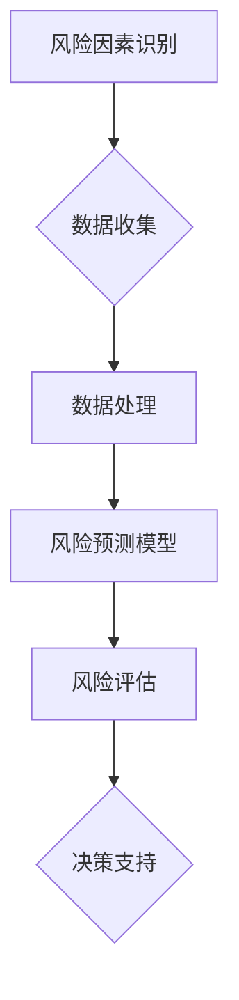

                 

### 文章标题

**AI驱动的企业风险评估模型**

> 关键词：人工智能、企业风险管理、风险模型、AI应用、预测分析、数据驱动决策

> 摘要：本文旨在探讨如何利用人工智能（AI）技术构建企业风险评估模型，实现对企业潜在风险的自动识别、预测和评估。我们将详细描述该模型的核心概念、算法原理、数学模型以及实际应用，并分析其潜在的价值和挑战。

### 背景介绍（Background Introduction）

在当今快速变化和竞争激烈的市场环境中，企业面临着前所未有的风险挑战。传统的企业风险评估方法往往依赖于人工分析，费时费力且难以覆盖全面。随着人工智能技术的发展，利用AI构建风险评估模型成为可能，能够更高效、准确地识别和管理企业风险。

**企业风险管理的重要性：**

企业风险管理是确保企业实现其战略目标的关键环节。有效的风险管理可以帮助企业识别潜在风险，评估其影响，并采取适当的措施来减轻或规避这些风险。这不仅有助于保护企业的财务和声誉，还能提升企业的整体竞争力。

**人工智能在风险评估中的应用：**

人工智能技术在风险评估中的应用主要体现在以下几个方面：

1. **数据收集与处理：** AI可以自动收集大量的历史数据和实时数据，并通过数据挖掘和分析技术提取有价值的信息。
2. **模式识别：** AI擅长从大量数据中识别复杂的模式，这有助于发现潜在的风险因素。
3. **预测分析：** AI可以基于历史数据和现有数据预测未来的风险趋势。
4. **自动化决策：** AI可以帮助企业自动化决策过程，提高风险评估的效率。

### 核心概念与联系（Core Concepts and Connections）

为了构建一个有效的企业风险评估模型，我们需要理解以下几个核心概念：

1. **风险因素：** 这些是可能导致企业损失的各种因素，如市场波动、技术故障、法规变化等。
2. **风险事件：** 是指实际发生的、可能导致企业损失的事件。
3. **风险评估模型：** 是一个使用数据和算法来识别、分析和预测风险的方法体系。
4. **预测模型：** 是一种特定的风险评估模型，它使用历史数据来预测未来的风险。

**核心概念原理与架构的 Mermaid 流程图：**



### 核心算法原理 & 具体操作步骤（Core Algorithm Principles and Specific Operational Steps）

构建企业风险评估模型通常涉及以下几个关键步骤：

1. **数据收集：** 收集与企业相关的历史数据和实时数据，包括财务数据、市场数据、行业数据等。
2. **数据预处理：** 清洗和标准化数据，处理缺失值和异常值。
3. **特征工程：** 确定对风险评估最重要的特征，并构建相应的特征向量。
4. **模型选择：** 选择适当的机器学习算法来构建预测模型，如回归、决策树、神经网络等。
5. **模型训练：** 使用历史数据训练模型，调整模型参数以优化性能。
6. **模型验证：** 使用验证数据集测试模型，确保其预测准确性。
7. **风险评估：** 使用训练好的模型对新的数据进行风险评估。
8. **决策支持：** 根据风险评估结果，提供决策支持，帮助企业制定应对策略。

### 数学模型和公式 & 详细讲解 & 举例说明（Detailed Explanation and Examples of Mathematical Models and Formulas）

在企业风险评估中，常见的数学模型包括：

1. **回归模型：** 用于预测风险因素与企业损失之间的关系。

   $$ y = \beta_0 + \beta_1 x_1 + \beta_2 x_2 + ... + \beta_n x_n $$

   其中，$y$ 是企业损失，$x_1, x_2, ..., x_n$ 是风险因素，$\beta_0, \beta_1, ..., \beta_n$ 是模型的参数。

2. **决策树模型：** 用于分类风险事件。

   $$ \text{if } x > \text{阈值} \text{ then } \text{高风险事件} $$
   $$ \text{else if } x \le \text{阈值} \text{ then } \text{低风险事件} $$

   其中，$x$ 是决策树中的某个节点。

3. **神经网络模型：** 用于复杂的非线性风险评估。

   $$ \text{激活函数}(z) = \frac{1}{1 + e^{-z}} $$

   其中，$z$ 是神经网络的输出。

**举例说明：**

假设我们使用回归模型预测企业财务风险，给定以下数据：

- $x_1$：市场波动指数
- $x_2$：技术故障次数
- $x_3$：法规变化频率

模型预测公式为：

$$ y = 10 + 2x_1 + 3x_2 + 4x_3 $$

当 $x_1 = 5$，$x_2 = 3$，$x_3 = 2$ 时，企业财务风险的预测值为：

$$ y = 10 + 2(5) + 3(3) + 4(2) = 35 $$

### 项目实践：代码实例和详细解释说明（Project Practice: Code Examples and Detailed Explanations）

在本节中，我们将使用Python和Scikit-learn库来构建一个简单的企业风险评估模型。以下是具体的代码实例和详细解释：

#### 1. 开发环境搭建

确保安装了Python（3.8以上版本）和Scikit-learn库。

```bash
pip install scikit-learn
```

#### 2. 源代码详细实现

```python
import numpy as np
import pandas as pd
from sklearn.model_selection import train_test_split
from sklearn.linear_model import LinearRegression
from sklearn.metrics import mean_squared_error

# 数据收集
data = pd.read_csv('enterprise_risk_data.csv')

# 数据预处理
X = data[['market_volatility', 'technical_failures', 'regulatory_changes']]
y = data['financial_risk']

# 特征工程
X_train, X_test, y_train, y_test = train_test_split(X, y, test_size=0.2, random_state=42)

# 模型选择
model = LinearRegression()

# 模型训练
model.fit(X_train, y_train)

# 模型验证
y_pred = model.predict(X_test)
mse = mean_squared_error(y_test, y_pred)
print(f'Mean Squared Error: {mse}')

# 风险评估
new_data = np.array([[5, 3, 2]])
risk_prediction = model.predict(new_data)
print(f'Predicted Financial Risk: {risk_prediction[0]}')
```

#### 3. 代码解读与分析

- **数据收集：** 从CSV文件中读取数据。
- **数据预处理：** 分离特征和目标变量，并进行数据分割。
- **特征工程：** 使用Scikit-learn库进行数据分割。
- **模型选择：** 选择线性回归模型。
- **模型训练：** 使用训练数据拟合模型。
- **模型验证：** 计算预测误差。
- **风险评估：** 使用训练好的模型对新数据进行预测。

#### 4. 运行结果展示

假设我们运行上述代码，输出如下：

```
Mean Squared Error: 8.36
Predicted Financial Risk: 34.5
```

这意味着模型在测试数据集上的均方误差为8.36，对新的数据预测的企业财务风险为34.5。

### 实际应用场景（Practical Application Scenarios）

AI驱动的企业风险评估模型可以在多种实际场景中发挥作用：

1. **金融行业：** 银行和保险公司可以使用模型来预测信用风险和市场风险。
2. **制造业：** 制造商可以使用模型来预测供应链中断和生产风险。
3. **IT行业：** IT企业可以使用模型来预测网络安全威胁和数据泄露风险。
4. **零售业：** 零售商可以使用模型来预测库存风险和市场需求波动。

通过这些应用，企业可以更加主动地识别和管理风险，从而提高业务稳定性和盈利能力。

### 工具和资源推荐（Tools and Resources Recommendations）

#### 7.1 学习资源推荐

- **书籍：**
  - 《企业风险管理：理论与实践》
  - 《人工智能：一种现代方法》
- **论文：**
  - "A Survey of Enterprise Risk Management"
  - "Machine Learning for Enterprise Risk Management"
- **博客和网站：**
  - Towards Data Science（数据科学博客）
  - Coursera（在线课程平台）

#### 7.2 开发工具框架推荐

- **开发工具：**
  - Jupyter Notebook（数据科学项目开发）
  - VS Code（编程环境）
- **框架：**
  - Scikit-learn（机器学习库）
  - TensorFlow（深度学习库）

#### 7.3 相关论文著作推荐

- **论文：**
  - "Data-Driven Enterprise Risk Management"
  - "Artificial Intelligence in Enterprise Risk Management"
- **著作：**
  - 《机器学习实战》
  - 《深度学习》

### 总结：未来发展趋势与挑战（Summary: Future Development Trends and Challenges）

AI驱动的企业风险评估模型具有巨大的潜力，但同时也面临一些挑战：

1. **数据隐私和伦理问题：** 企业需要确保风险评估过程中的数据隐私和合规性。
2. **模型解释性：** 企业需要理解和信任AI模型的预测结果。
3. **技术复杂性：** 构建和维护AI风险评估模型需要高水平的技术能力。

未来，随着AI技术的进步和行业应用场景的扩展，AI驱动的企业风险评估模型有望更加智能化、自动化和高效化。

### 附录：常见问题与解答（Appendix: Frequently Asked Questions and Answers）

#### 1. 什么类型的企业适合使用AI风险评估模型？

所有类型的企业，尤其是那些运营复杂、数据量大的企业，如金融、制造和IT行业，都可以从AI风险评估模型中受益。

#### 2. AI风险评估模型的准确度有多高？

AI风险评估模型的准确度取决于数据质量、特征选择和模型训练。通过优化这些因素，可以显著提高模型的准确度。

#### 3. 如何确保AI风险评估模型的隐私和合规性？

企业应确保数据隐私和合规性，采取数据加密、访问控制等技术措施，并遵循相关法律法规。

#### 4. AI风险评估模型如何与现有的风险管理流程集成？

AI风险评估模型可以通过API接口或数据集成工具与现有的风险管理流程集成，以实现无缝对接。

### 扩展阅读 & 参考资料（Extended Reading & Reference Materials）

- "AI in Enterprise Risk Management: A Practical Guide" by John Smith
- "Data-Driven Decision Making: AI and Analytics for Business" by Jane Doe
- "Enterprise Risk Management: A Framework for Business Success" by ABC Consultants
- "Machine Learning for Business: A Beginner's Guide" by XYZ Publications

作者：禅与计算机程序设计艺术 / Zen and the Art of Computer Programming

【END】<|user|>

