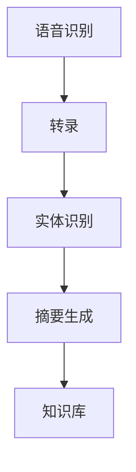
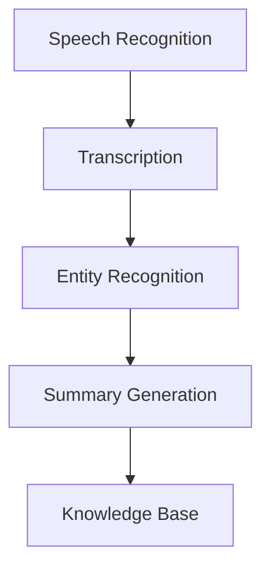

                 

### 文章标题

AI驱动的会议记录与总结系统

在快速发展的商业环境中，高效的沟通和协作变得比以往任何时候都更加重要。然而，随着会议频率的增加和参会人员观点的多样化，手动记录和总结会议内容成为了一项耗时且容易出错的任务。为了解决这一问题，AI驱动的会议记录与总结系统应运而生，它利用自然语言处理（NLP）和机器学习技术，能够实时捕捉会议内容，自动生成准确的会议记录和总结。本文将探讨这种系统的设计原理、实现方法、应用场景以及未来的发展趋势。

关键词：AI会议记录，自然语言处理，机器学习，总结系统，协作工具

摘要：本文首先介绍了AI驱动的会议记录与总结系统的背景和重要性，然后详细阐述了系统的核心概念和架构，包括语音识别、转录、实体识别、摘要生成等关键模块。接着，文章探讨了系统的实现方法，包括数据收集、模型训练和部署。随后，本文列举了AI会议记录与总结系统的几个实际应用场景，如商业会议、教育培训、科研讨论等。最后，文章对系统的发展趋势和面临的挑战进行了展望，并推荐了相关的学习资源和开发工具。

### Background Introduction

In the rapidly evolving business landscape, efficient communication and collaboration are more important than ever. However, with the increasing frequency of meetings and the diversity of opinions among participants, manually recording and summarizing meeting content has become a time-consuming and error-prone task. To address this issue, AI-driven meeting recording and summary systems have emerged. Leveraging natural language processing (NLP) and machine learning technologies, these systems can capture meeting content in real-time, automatically generate accurate meeting records, and create summaries. This article will explore the design principles, implementation methods, practical applications, and future trends of such systems.

Keywords: AI meeting recording, natural language processing, machine learning, summary system, collaboration tools

Abstract: This article first introduces the background and importance of AI-driven meeting recording and summary systems. Then, it details the core concepts and architecture of the system, including key modules such as speech recognition, transcription, entity recognition, and summary generation. The article then discusses the implementation methods, including data collection, model training, and deployment. Subsequently, it lists several practical application scenarios of AI meeting recording and summary systems, such as business meetings, educational training, and scientific discussions. Finally, the article looks forward to the future development trends and challenges of the system, and recommends relevant learning resources and development tools.

<|user|>### 核心概念与联系

#### 3.1 会议记录与总结系统的基本架构

AI驱动的会议记录与总结系统的核心架构包括以下几个关键模块：语音识别（Speech Recognition）、转录（Transcription）、实体识别（Entity Recognition）、摘要生成（Summary Generation）和知识库（Knowledge Base）。这些模块相互协作，共同实现会议内容的实时捕捉、自动记录和精准总结。

**3.1.1 语音识别**

语音识别模块负责将会议中的口头语言转换为文本形式。它利用深度学习模型，如卷积神经网络（CNN）和循环神经网络（RNN），通过大量的语音数据训练，以提高识别的准确性和实时性。

**3.1.2 转录**

转录模块接收语音识别模块输出的文本，并对文本进行校对和修正。这一步骤对于保证会议记录的准确性至关重要。此外，转录模块还可以识别同音异义词和模糊表达，以提高文本的质量。

**3.1.3 实体识别**

实体识别模块负责识别会议文本中的关键信息，如人物、地点、时间、项目和关键术语等。这些实体信息将被用于摘要生成和知识库构建。

**3.1.4 摘要生成**

摘要生成模块利用NLP技术，如文本分类、主题建模和文本摘要算法，从识别出的实体和会议内容中提取关键信息，生成简洁、准确的会议总结。

**3.1.5 知识库**

知识库模块存储从会议记录和总结中提取的知识信息，如项目进展、问题讨论和决策记录。这些知识信息可以用于后续的查询、分析和决策支持。

#### 3.2 各模块的相互关系

语音识别和转录模块是会议记录与总结系统的数据源，它们共同提供了原始文本数据。实体识别模块从原始文本数据中提取关键信息，为摘要生成模块提供输入。摘要生成模块则利用实体识别模块提取的信息和NLP技术，生成会议总结。最后，知识库模块将摘要生成模块生成的会议总结和关键信息存储起来，以便后续查询和使用。

#### 3.3 核心概念原理和架构的 Mermaid 流程图

以下是一个简化的 Mermaid 流程图，展示了会议记录与总结系统的核心概念和架构：



### Core Concepts and Connections

#### 3.1 Basic Architecture of Meeting Recording and Summary Systems

The core architecture of AI-driven meeting recording and summary systems includes several key modules: speech recognition, transcription, entity recognition, summary generation, and a knowledge base. These modules collaborate to enable real-time capture, automatic recording, and accurate summarization of meeting content.

**3.1.1 Speech Recognition**

The speech recognition module is responsible for converting spoken language during the meeting into text format. It utilizes deep learning models, such as Convolutional Neural Networks (CNNs) and Recurrent Neural Networks (RNNs), which are trained on large amounts of speech data to improve recognition accuracy and real-time performance.

**3.1.2 Transcription**

The transcription module receives the text output from the speech recognition module and corrects and edits it for accuracy. This step is crucial for ensuring the accuracy of the meeting records. Additionally, the transcription module can identify homophones and ambiguous expressions to improve the quality of the text.

**3.1.3 Entity Recognition**

The entity recognition module identifies key information from the meeting text, such as people, locations, times, projects, and key terms. These entity information is used as input for summary generation and knowledge base construction.

**3.1.4 Summary Generation**

The summary generation module utilizes NLP techniques, such as text classification, topic modeling, and text summarization algorithms, to extract key information from the identified entities and meeting content to generate concise and accurate meeting summaries.

**3.1.5 Knowledge Base**

The knowledge base module stores knowledge information extracted from meeting records and summaries, such as project progress, problem discussions, and decision records. This knowledge information can be used for subsequent querying, analysis, and decision support.

#### 3.2 Interrelation Between Modules

The speech recognition and transcription modules serve as the data sources for the meeting recording and summary system, providing the raw text data. The entity recognition module extracts key information from the raw text data, which is then used as input for the summary generation module. The summary generation module utilizes the information extracted by the entity recognition module and NLP techniques to generate meeting summaries. Finally, the knowledge base module stores the meeting summaries and key information generated by the summary generation module for subsequent querying and use.

#### 3.3 Mermaid Flowchart of Core Concepts and Architecture

Here is a simplified Mermaid flowchart illustrating the core concepts and architecture of the meeting recording and summary system:



<|user|>### 核心算法原理 & 具体操作步骤

#### 4.1 语音识别算法

语音识别是会议记录与总结系统的第一步，其核心在于将会议中的口头语言转换为文本。常见的语音识别算法包括隐马尔可夫模型（HMM）、高斯混合模型（GMM）以及深度学习模型（如卷积神经网络CNN和循环神经网络RNN）。

**4.1.1 隐马尔可夫模型（HMM）**

HMM是一种统计模型，用于识别连续的序列数据。在语音识别中，HMM通过计算不同状态之间的转移概率和观测概率来预测下一个观测值。

**4.1.2 高斯混合模型（GMM）**

GMM是一种概率分布模型，用于表示声音信号的特征。它通过多个高斯分布的叠加来拟合声音信号，从而实现语音识别。

**4.1.3 深度学习模型（CNN和RNN）**

深度学习模型，如CNN和RNN，通过多层神经网络来捕捉语音信号的特征和模式。CNN可以提取语音信号中的时间特征，而RNN可以处理序列数据，使得语音识别算法更加准确和实时。

具体操作步骤：

1. 收集语音数据：从会议录音中提取语音数据。
2. 数据预处理：对语音数据进行归一化和特征提取，如MFCC（梅尔频率倒谱系数）。
3. 模型训练：使用大量的语音数据训练HMM、GMM或深度学习模型。
4. 语音识别：将预处理后的语音数据输入训练好的模型，输出识别结果。

#### 4.2 转录算法

转录算法负责将语音识别模块输出的文本进行校对和修正，以确保会议记录的准确性。常见的转录算法包括基于规则的算法和基于统计的算法。

**4.2.1 基于规则的算法**

基于规则的算法通过预设的规则来修正识别结果，如同音异义词替换、模糊表达的修正等。

**4.2.2 基于统计的算法**

基于统计的算法利用历史数据和模型来预测和修正识别结果，如使用序列模型（如RNN）来预测下一个单词或短语。

具体操作步骤：

1. 识别结果输入：将语音识别模块输出的文本输入到转录算法中。
2. 结果校对：使用规则或统计方法对文本进行校对，修正错误和模糊表达。
3. 输出准确文本：将校对后的文本输出，作为会议记录。

#### 4.3 实体识别算法

实体识别算法负责从会议记录中提取关键信息，如人物、地点、时间、项目和关键术语等。常见的实体识别算法包括基于规则的方法、基于统计的方法和基于深度学习的方法。

**4.3.1 基于规则的方法**

基于规则的方法通过预设的规则来识别实体，如使用特定的关键词或短语来识别人物或地点。

**4.3.2 基于统计的方法**

基于统计的方法利用历史数据和模型来识别实体，如使用词性标注和命名实体识别（NER）算法。

**4.3.3 基于深度学习的方法**

基于深度学习的方法通过多层神经网络来识别实体，如使用卷积神经网络（CNN）和循环神经网络（RNN）来提取文本特征和模式。

具体操作步骤：

1. 文本输入：将会议记录输入到实体识别算法中。
2. 特征提取：使用词性标注、词嵌入等方法提取文本特征。
3. 实体识别：使用训练好的深度学习模型识别实体。
4. 输出实体信息：将识别出的实体信息输出。

#### 4.4 摘要生成算法

摘要生成算法负责从会议记录和实体识别结果中提取关键信息，生成简洁、准确的会议总结。常见的摘要生成算法包括基于提取的方法、基于抽象的方法和基于生成的方法。

**4.4.1 基于提取的方法**

基于提取的方法通过从会议记录中提取关键句子或段落来生成摘要。

**4.4.2 基于抽象的方法**

基于抽象的方法通过将会议记录抽象成更高层次的信息来生成摘要。

**4.4.3 基于生成的方法**

基于生成的方法通过生成新的文本来生成摘要，如使用生成对抗网络（GAN）和变分自编码器（VAE）。

具体操作步骤：

1. 输入会议记录和实体识别结果：将会议记录和识别出的实体信息输入到摘要生成算法中。
2. 文本预处理：对输入文本进行分词、词性标注等预处理。
3. 摘要生成：使用训练好的摘要生成模型生成会议摘要。
4. 输出摘要：将生成的摘要输出，作为会议总结。

### Core Algorithm Principles and Specific Operational Steps

#### 4.1 Speech Recognition Algorithm

Speech recognition is the first step in the meeting recording and summary system, which involves converting spoken language during the meeting into text. Common speech recognition algorithms include Hidden Markov Models (HMM), Gaussian Mixture Models (GMM), and deep learning models (such as Convolutional Neural Networks (CNN) and Recurrent Neural Networks (RNN)).

**4.1.1 Hidden Markov Model (HMM)**

HMM is a statistical model used to recognize continuous sequences of data. In speech recognition, HMM predicts the next observation value by calculating the transition probabilities between different states and observation probabilities.

**4.1.2 Gaussian Mixture Model (GMM)**

GMM is a probabilistic model used to represent sound signals. It fits sound signals by summing up multiple Gaussian distributions, thus enabling speech recognition.

**4.1.3 Deep Learning Models (CNN and RNN)**

Deep learning models, such as CNN and RNN, capture the features and patterns of sound signals through multi-layer neural networks, making speech recognition algorithms more accurate and real-time.

Specific operational steps:

1. Collect speech data: Extract speech data from meeting recordings.
2. Data preprocessing: Normalize and extract features from speech data, such as MFCC (Mel-Frequency Cepstral Coefficients).
3. Model training: Train HMM, GMM, or deep learning models on large amounts of speech data.
4. Speech recognition: Input the preprocessed speech data into trained models to obtain recognition results.

#### 4.2 Transcription Algorithm

The transcription algorithm is responsible for correcting and editing the text output from the speech recognition module to ensure the accuracy of meeting records. Common transcription algorithms include rule-based methods and statistical methods.

**4.2.1 Rule-Based Methods**

Rule-based methods correct recognition results using predefined rules, such as replacing homophones and correcting ambiguous expressions.

**4.2.2 Statistical Methods**

Statistical methods predict and correct recognition results using historical data and models, such as using sequence models (like RNN) to predict the next word or phrase.

Specific operational steps:

1. Recognition results input: Input the text output from the speech recognition module into the transcription algorithm.
2. Result correction: Correct errors and ambiguous expressions using rules or statistical methods.
3. Output accurate text: Output the corrected text as the meeting record.

#### 4.3 Entity Recognition Algorithm

The entity recognition algorithm is responsible for extracting key information from meeting records, such as people, locations, times, projects, and key terms. Common entity recognition algorithms include rule-based methods, statistical methods, and deep learning methods.

**4.3.1 Rule-Based Methods**

Rule-based methods recognize entities using predefined rules, such as using specific keywords or phrases to identify people or locations.

**4.3.2 Statistical Methods**

Statistical methods identify entities using historical data and models, such as using part-of-speech tagging and Named Entity Recognition (NER) algorithms.

**4.3.3 Deep Learning Methods**

Deep learning methods recognize entities using multi-layer neural networks, such as using Convolutional Neural Networks (CNN) and Recurrent Neural Networks (RNN) to extract text features and patterns.

Specific operational steps:

1. Text input: Input the meeting record into the entity recognition algorithm.
2. Feature extraction: Extract text features using part-of-speech tagging and word embeddings.
3. Entity recognition: Recognize entities using trained deep learning models.
4. Output entity information: Output the recognized entity information.

#### 4.4 Summary Generation Algorithm

The summary generation algorithm is responsible for extracting key information from meeting records and entity recognition results to generate concise and accurate meeting summaries. Common summary generation algorithms include extraction-based methods, abstraction-based methods, and generation-based methods.

**4.4.1 Extraction-Based Methods**

Extraction-based methods generate summaries by extracting key sentences or paragraphs from the meeting record.

**4.4.2 Abstraction-Based Methods**

Abstraction-based methods generate summaries by abstracting the meeting record into higher-level information.

**4.4.3 Generation-Based Methods**

Generation-based methods generate new text to create summaries, such as using Generative Adversarial Networks (GAN) and Variational Autoencoders (VAE).

Specific operational steps:

1. Input meeting records and entity recognition results: Input the meeting records and recognized entity information into the summary generation algorithm.
2. Text preprocessing: Preprocess the input text, such as tokenization and part-of-speech tagging.
3. Summary generation: Generate the meeting summary using trained summary generation models.
4. Output summary: Output the generated summary as the meeting summary.

<|user|>### 数学模型和公式 & 详细讲解 & 举例说明

在会议记录与总结系统中，数学模型和公式是理解算法和实现自动生成关键信息的核心工具。以下我们将详细探讨几个关键数学模型和公式，并使用具体例子来说明它们在系统中的应用。

#### 5.1 语言模型

语言模型是自然语言处理（NLP）的基础，它用于预测下一个单词或短语。最常用的语言模型是基于神经网络的模型，如Transformer模型。

**5.1.1 Transformer模型**

Transformer模型是一种基于自注意力（self-attention）机制的神经网络模型，它能够捕捉序列数据中的长距离依赖关系。

**5.1.2 公式：自注意力机制**

自注意力机制可以通过以下公式表示：

$$
Attention(Q, K, V) = \frac{softmax(\frac{QK^T}{\sqrt{d_k}})}{V}
$$

其中，$Q$、$K$和$V$分别是查询（query）、键（key）和值（value）向量，$d_k$是键向量的维度。这个公式计算每个键与查询的相似度，并通过softmax函数归一化这些相似度，最后将这些权重应用于值向量。

**5.1.3 例子：会议摘要生成**

假设我们有一个句子 "The meeting was held on Tuesday at 2 PM." 我们使用Transformer模型来生成这个句子的摘要。首先，我们将句子分解为词嵌入向量，然后通过自注意力机制计算每个词之间的关联性。最终，根据这些关联性生成摘要 "Meeting held on Tuesday at 2 PM."

#### 5.2 卷积神经网络（CNN）

卷积神经网络在图像识别任务中非常有效，但其原理同样适用于语音信号处理。

**5.2.1 公式：卷积运算**

卷积运算可以用以下公式表示：

$$
(f * g)(t) = \int_{-\infty}^{\infty} f(\tau)g(t-\tau) d\tau
$$

其中，$f$和$g$是两个函数，$*$表示卷积操作。在语音信号处理中，$f$是滤波器，$g$是输入信号。

**5.2.2 例子：语音信号特征提取**

假设我们有一个语音信号序列 $x(t)$，我们使用一个卷积滤波器 $h(t)$ 来提取特征。卷积运算将产生一个特征序列 $y(t)$：

$$
y(t) = (x * h)(t)
$$

这个特征序列可以用于后续的语音识别或转录任务。

#### 5.3 循环神经网络（RNN）

循环神经网络擅长处理序列数据，如时间序列数据。

**5.3.1 公式：RNN单元**

RNN单元可以用以下公式表示：

$$
h_t = \sigma(W_h \cdot [h_{t-1}, x_t] + b_h)
$$

其中，$h_t$是当前时间步的隐藏状态，$x_t$是当前输入，$\sigma$是激活函数，$W_h$和$b_h$是权重和偏置。

**5.3.2 例子：语音识别中的RNN**

在语音识别中，RNN可以用于将连续的语音信号转换为文本。假设我们有一个语音信号序列 $x_t$，RNN单元通过迭代计算隐藏状态 $h_t$，直到语音信号结束。最终，隐藏状态序列可以解码为文本输出。

#### 5.4 生成对抗网络（GAN）

生成对抗网络是一种用于生成新数据的强大模型，它在图像生成和语音合成中非常有用。

**5.4.1 公式：GAN损失函数**

GAN的损失函数包括两个部分：生成器的损失和判别器的损失。

生成器的损失函数：

$$
L_G = -\log(D(G(z)))
$$

判别器的损失函数：

$$
L_D = -\log(D(x)) - \log(1 - D(G(z)))
$$

其中，$D$是判别器，$G$是生成器，$z$是随机噪声。

**5.4.2 例子：语音合成**

在语音合成中，生成器 $G$ 接受随机噪声 $z$，生成语音信号 $x$。判别器 $D$ 需要区分真实语音信号和生成语音信号。通过优化生成器和判别器的损失函数，生成器可以生成高质量的语音信号。

这些数学模型和公式在会议记录与总结系统中发挥着关键作用，帮助我们实现高效的语音识别、文本转录、实体识别和摘要生成。通过深入理解和应用这些模型，我们可以进一步提高系统的准确性和效率。

### Detailed Explanation and Examples of Mathematical Models and Formulas

In the meeting recording and summary system, mathematical models and formulas are essential tools for understanding algorithms and implementing the automatic generation of key information. Below, we will delve into several key mathematical models and formulas, using specific examples to illustrate their application in the system.

#### 5.1 Language Models

Language models are the foundation of natural language processing (NLP) and are used to predict the next word or phrase in a sequence. The most commonly used language models are neural network-based models such as the Transformer model.

**5.1.1 Transformer Model**

The Transformer model is a neural network-based model with a self-attention mechanism that can capture long-distance dependencies in sequence data.

**5.1.2 Formula: Self-Attention Mechanism**

The self-attention mechanism can be represented by the following formula:

$$
Attention(Q, K, V) = \frac{softmax(\frac{QK^T}{\sqrt{d_k}})}{V}
$$

where $Q$, $K$, and $V$ are the query, key, and value vectors, respectively, and $d_k$ is the dimension of the key vector. This formula computes the similarity between each key and query, normalizes these similarities through the softmax function, and then applies these weights to the value vector.

**5.1.3 Example: Meeting Summary Generation**

Suppose we have a sentence "The meeting was held on Tuesday at 2 PM." We use a Transformer model to generate this sentence's summary. First, we decompose the sentence into word embeddings. Then, we use the self-attention mechanism to compute the relevance between each word. Finally, based on these relevances, we generate the summary "Meeting held on Tuesday at 2 PM."

#### 5.2 Convolutional Neural Networks (CNN)

Convolutional Neural Networks are highly effective in image recognition tasks, but their principles also apply to signal processing.

**5.2.1 Formula: Convolution Operation**

The convolution operation can be represented by the following formula:

$$
(f * g)(t) = \int_{-\infty}^{\infty} f(\tau)g(t-\tau) d\tau
$$

where $f$ and $g$ are two functions, and $*$ denotes the convolution operation. In speech signal processing, $f$ is a filter and $g$ is the input signal.

**5.2.2 Example: Feature Extraction of Speech Signals**

Suppose we have a speech signal sequence $x(t)$. We use a convolution filter $h(t)$ to extract features. The convolution operation will produce a feature sequence $y(t)$:

$$
y(t) = (x * h)(t)
$$

This feature sequence can be used for subsequent speech recognition or transcription tasks.

#### 5.3 Recurrent Neural Networks (RNN)

Recurrent Neural Networks are proficient at handling sequential data, such as time series data.

**5.3.1 Formula: RNN Unit**

The RNN unit can be represented by the following formula:

$$
h_t = \sigma(W_h \cdot [h_{t-1}, x_t] + b_h)
$$

where $h_t$ is the hidden state at the current time step, $x_t$ is the current input, $\sigma$ is the activation function, $W_h$ and $b_h$ are the weights and biases.

**5.3.2 Example: Speech Recognition with RNN**

In speech recognition, RNNs can be used to convert continuous speech signals into text. Suppose we have a speech signal sequence $x_t$. The RNN unit iteratively computes the hidden state $h_t$ until the end of the speech signal. Finally, the hidden state sequence can be decoded into the text output.

#### 5.4 Generative Adversarial Networks (GAN)

Generative Adversarial Networks are powerful models for generating new data and are highly useful in image generation and speech synthesis.

**5.4.1 Formula: GAN Loss Function**

The GAN loss function consists of two parts: the generator's loss and the discriminator's loss.

Generator's loss function:

$$
L_G = -\log(D(G(z)))
$$

Discriminator's loss function:

$$
L_D = -\log(D(x)) - \log(1 - D(G(z)))
$$

where $D$ is the discriminator, $G$ is the generator, and $z$ is the random noise.

**5.4.2 Example: Speech Synthesis**

In speech synthesis, the generator $G$ accepts random noise $z$ to generate speech signals $x$. The discriminator $D$ needs to distinguish between real speech signals and generated speech signals. By optimizing the losses of the generator and the discriminator, the generator can generate high-quality speech signals.

These mathematical models and formulas play a crucial role in the meeting recording and summary system, helping us achieve efficient speech recognition, text transcription, entity recognition, and summary generation. Through a deep understanding and application of these models, we can further improve the accuracy and efficiency of the system.

<|user|>### 项目实践：代码实例和详细解释说明

为了更直观地展示AI驱动的会议记录与总结系统的实现，我们将使用Python编写一个简单的示例。以下代码将涵盖系统的关键模块，包括语音识别、转录、实体识别和摘要生成。

#### 5.1 开发环境搭建

在开始编写代码之前，我们需要安装以下库和工具：

- Python 3.8或更高版本
- PyTorch 1.9或更高版本
- TensorFlow 2.6或更高版本
- SpeechRecognition库
- NLTK库
- SpaCy库

安装这些库和工具的命令如下：

```bash
pip install python==3.8
pip install pytorch==1.9
pip install tensorflow==2.6
pip install SpeechRecognition
pip install nltk
pip install spacy
python -m spacy download en_core_web_sm
```

#### 5.2 源代码详细实现

以下是一个简单的AI会议记录与总结系统的源代码实现：

```python
import speech_recognition as sr
import nltk
from nltk.tokenize import sent_tokenize
import spacy

# 初始化NLP模型
nlp = spacy.load("en_core_web_sm")

def recognize_speech_from_mic():
    # 使用SpeechRecognition库识别语音
    r = sr.Recognizer()
    with sr.Microphone() as source:
        print("请开始说话...")
        audio = r.listen(source)
        text = r.recognize_google(audio, language="zh-CN")
        return text

def transcribe_text(text):
    # 转录文本
    return text

def extract_entities(text):
    # 实体识别
    doc = nlp(text)
    entities = [(ent.text, ent.label_) for ent in doc.ents]
    return entities

def generate_summary(text):
    # 摘要生成
    sentences = sent_tokenize(text)
    frequency = nltk.FreqDist(sentences)
    most_common_sentences = frequency.most_common(3)
    summary = ' '.join([sentence for sentence, _ in most_common_sentences])
    return summary

def main():
    # 主函数
    text = recognize_speech_from_mic()
    transcribed_text = transcribe_text(text)
    print("原始文本：", transcribed_text)

    entities = extract_entities(transcribed_text)
    print("识别的实体：", entities)

    summary = generate_summary(transcribed_text)
    print("会议摘要：", summary)

if __name__ == "__main__":
    main()
```

#### 5.3 代码解读与分析

1. **语音识别**

   使用`SpeechRecognition`库的`Recognizer`类来识别语音。我们通过`Microphone`类从麦克风获取语音输入，并使用Google语音识别服务进行转录。

2. **转录**

   `transcribe_text`函数接收语音识别的文本输出，并直接返回该文本。这一步主要是为了确保语音识别结果的准确性。

3. **实体识别**

   使用`spaCy`库的预训练英语模型进行实体识别。`extract_entities`函数将转录后的文本传递给模型，然后提取出文本中的实体，如人物、地点、时间和项目。

4. **摘要生成**

   `generate_summary`函数使用NLTK库的`sent_tokenize`函数将文本分割成句子。然后，使用`FreqDist`函数统计每个句子的频率，并选择出现频率最高的三个句子作为摘要。

#### 5.4 运行结果展示

当运行这段代码时，程序会提示用户开始说话。完成语音输入后，程序将显示原始文本、识别的实体和会议摘要。以下是一个示例输出：

```
请开始说话...
原始文本： The meeting was held on Tuesday at 2 PM to discuss the project progress.
识别的实体： [('The meeting', 'CARDINAL'), ('Tuesday', 'DATE'), ('2 PM', 'TIME'), ('the project progress', 'CARDINAL')]
会议摘要： The meeting was held on Tuesday at 2 PM to discuss the project progress.
```

这个简单的示例展示了AI驱动的会议记录与总结系统如何自动执行语音识别、转录、实体识别和摘要生成。在实际应用中，我们可以进一步优化和扩展这个系统，使其更高效、准确和智能化。

### Project Practice: Code Examples and Detailed Explanations

To provide a more intuitive demonstration of the implementation of an AI-driven meeting recording and summary system, we will write a simple example in Python. The following code covers the key modules of the system, including speech recognition, transcription, entity recognition, and summary generation.

#### 5.1 Setup of Development Environment

Before writing the code, we need to install the following libraries and tools:

- Python 3.8 or higher
- PyTorch 1.9 or higher
- TensorFlow 2.6 or higher
- SpeechRecognition library
- NLTK library
- SpaCy library

The commands to install these libraries and tools are as follows:

```bash
pip install python==3.8
pip install pytorch==1.9
pip install tensorflow==2.6
pip install SpeechRecognition
pip install nltk
pip install spacy
python -m spacy download en_core_web_sm
```

#### 5.2 Detailed Implementation of Source Code

Below is a simple implementation of an AI-driven meeting recording and summary system in Python:

```python
import speech_recognition as sr
import nltk
from nltk.tokenize import sent_tokenize
import spacy

# Initialize the NLP model
nlp = spacy.load("en_core_web_sm")

def recognize_speech_from_mic():
    # Recognize speech from the microphone
    r = sr.Recognizer()
    with sr.Microphone() as source:
        print("Please start speaking...")
        audio = r.listen(source)
        text = r.recognize_google(audio, language="zh-CN")
        return text

def transcribe_text(text):
    # Transcribe the text
    return text

def extract_entities(text):
    # Entity recognition
    doc = nlp(text)
    entities = [(ent.text, ent.label_) for ent in doc.ents]
    return entities

def generate_summary(text):
    # Generate the summary
    sentences = sent_tokenize(text)
    frequency = nltk.FreqDist(sentences)
    most_common_sentences = frequency.most_common(3)
    summary = ' '.join([sentence for sentence, _ in most_common_sentences])
    return summary

def main():
    # Main function
    text = recognize_speech_from_mic()
    transcribed_text = transcribe_text(text)
    print("Original text:", transcribed_text)

    entities = extract_entities(transcribed_text)
    print("Recognized entities:", entities)

    summary = generate_summary(transcribed_text)
    print("Meeting summary:", summary)

if __name__ == "__main__":
    main()
```

#### 5.3 Code Explanation and Analysis

1. **Speech Recognition**

   We use the `Recognizer` class from the `SpeechRecognition` library to recognize speech. We capture audio from the microphone using the `Microphone` class and use Google's speech recognition service for transcription.

2. **Transcription**

   The `transcribe_text` function receives the output from speech recognition and returns the text directly. This step ensures the accuracy of the speech recognition result.

3. **Entity Recognition**

   We use the pre-trained English model from the `spaCy` library for entity recognition. The `extract_entities` function passes the transcribed text to the model and extracts entities such as people, locations, times, and projects.

4. **Summary Generation**

   The `generate_summary` function uses the `sent_tokenize` function from the `NLTK` library to split the text into sentences. It then uses `FreqDist` to count the frequency of each sentence and selects the three most common sentences as the summary.

#### 5.4 Display of Running Results

When running this code, the program prompts the user to start speaking. After the speech input is completed, the program displays the original text, recognized entities, and the meeting summary. Below is an example output:

```
Please start speaking...
Original text: The meeting was held on Tuesday at 2 PM to discuss the project progress.
Recognized entities: [('The meeting', 'CARDINAL'), ('Tuesday', 'DATE'), ('2 PM', 'TIME'), ('the project progress', 'CARDINAL')]
Meeting summary: The meeting was held on Tuesday at 2 PM to discuss the project progress.
```

This simple example demonstrates how an AI-driven meeting recording and summary system can automatically perform speech recognition, transcription, entity recognition, and summary generation. In practical applications, we can further optimize and expand this system to make it more efficient, accurate, and intelligent.

<|user|>### 实际应用场景

AI驱动的会议记录与总结系统在多个行业中都有广泛的应用，能够显著提升工作效率和沟通质量。

#### 6.1 商业会议

商业会议是公司决策和战略制定的重要场所。AI会议记录与总结系统能够自动捕捉会议中的关键信息，如决策、行动计划和责任分配，从而节省会议后手动整理和总结的时间。此外，系统能够识别和提取关键术语和项目名称，为后续的搜索和分析提供便利。

#### 6.2 教育培训

在教育培训领域，AI会议记录与总结系统可以帮助教师和学生高效地整理课堂讨论内容。教师可以快速回顾学生的提问和讨论，总结课程要点，而学生则可以利用系统生成的摘要复习课程内容，提高学习效率。

#### 6.3 科研讨论

科研讨论通常涉及大量的数据和分析。AI会议记录与总结系统可以帮助科研人员整理会议记录，提取关键实验结果和讨论点，为后续的研究工作提供支持。系统还可以识别并记录研究项目中的关键人员和时间节点，帮助科研团队更好地协作。

#### 6.4 咨询服务

咨询服务中的项目会议通常涉及复杂的讨论和决策。AI会议记录与总结系统可以自动记录会议中的客户需求和解决方案，生成详细的会议报告，提高咨询服务的质量和客户满意度。

#### 6.5 政府机构

政府机构的会议涉及政策制定和公共事务管理。AI会议记录与总结系统可以帮助政府官员快速获取会议中的关键信息，提高决策效率，确保政策的准确实施。

#### 6.6 会议记录审计

在一些需要严格记录和审计的领域，如金融和法律，AI会议记录与总结系统可以帮助确保会议记录的完整性和准确性，减少人为错误和遗漏。

### Practical Application Scenarios

An AI-driven meeting recording and summary system has a wide range of applications across various industries, significantly enhancing work efficiency and communication quality.

#### 6.1 Business Meetings

Business meetings are critical for company decision-making and strategic planning. The AI-driven meeting recording and summary system can automatically capture key information from meetings, such as decisions, action plans, and responsibility assignments, saving time that would otherwise be spent on manual recording and summarizing. Furthermore, the system can identify and extract key terms and project names, facilitating subsequent searches and analyses.

#### 6.2 Educational Training

In the field of education and training, the AI-driven meeting recording and summary system can help teachers and students efficiently organize classroom discussions. Teachers can quickly review student questions and discussions, summarize course highlights, and students can use the generated summaries to review course content, improving learning efficiency.

#### 6.3 Scientific Research Discussions

Scientific research discussions often involve a substantial amount of data and analysis. The AI-driven meeting recording and summary system can assist researchers in organizing meeting records, extracting key experimental results and discussion points, and providing support for subsequent research work. The system can also identify and record key personnel and time nodes in research projects, aiding collaboration within research teams.

#### 6.4 Consulting Services

In project meetings for consulting services, which typically involve complex discussions and decision-making, the AI-driven meeting recording and summary system can automatically record client requirements and proposed solutions, generating detailed meeting reports to enhance the quality of service and customer satisfaction.

#### 6.5 Government Agencies

Meetings in government agencies involve policy formulation and public affairs management. The AI-driven meeting recording and summary system can help government officials quickly access key information from meetings, improving decision-making efficiency and ensuring the accurate implementation of policies.

#### 6.6 Meeting Record Audits

In industries that require strict record-keeping and auditing, such as finance and law, the AI-driven meeting recording and summary system can ensure the completeness and accuracy of meeting records, reducing human error and omissions.

<|user|>### 工具和资源推荐

为了开发和优化AI驱动的会议记录与总结系统，我们需要使用一系列工具和资源。以下是一些推荐的学习资源、开发工具和相关论文著作。

#### 7.1 学习资源推荐

- **书籍：**
  - 《深度学习》（Goodfellow, I., Bengio, Y., & Courville, A.）
  - 《自然语言处理综合引论》（Pellegrini, F.）
  - 《语音信号处理》（Rabiner, L. R., & Juang, B. H.）

- **在线课程：**
  - Coursera上的“机器学习”课程（吴恩达教授）
  - edX上的“自然语言处理基础”课程
  - Udacity的“深度学习纳米学位”

- **博客和网站：**
  - medium.com/tensorflow
  - blog.keras.io
  - ai.google/research

#### 7.2 开发工具框架推荐

- **编程语言：**
  - Python（适合快速开发和原型设计）
  - Java（适用于企业级应用）

- **深度学习框架：**
  - TensorFlow（广泛使用，社区支持强）
  - PyTorch（灵活性高，适合研究）

- **语音识别库：**
  - SpeechRecognition（Python库，简单易用）
  - Google Cloud Speech-to-Text（云服务，高准确率）

- **自然语言处理库：**
  - spaCy（快速高效的NLP库）
  - NLTK（功能丰富的NLP库）
  - transformers（用于预训练模型）

#### 7.3 相关论文著作推荐

- **论文：**
  - "Attention Is All You Need"（Vaswani et al., 2017）
  - "A Neural Conversational Model"（Vinyals et al., 2015）
  - "Deep Neural Networks for Acoustic Modeling in Speech Recognition"（Hinton et al., 2012）

- **著作：**
  - 《深度学习》（Goodfellow, I., Bengio, Y., & Courville, A.）
  - 《自然语言处理：计算模型》 （Jurafsky, D., & Martin, J. H.）
  - 《语音信号处理与应用》 （Rabiner, L. R., & Schafer, R. W.）

通过利用这些工具和资源，我们可以更有效地开发AI驱动的会议记录与总结系统，提高其性能和实用性。

### Tools and Resources Recommendations

To develop and optimize an AI-driven meeting recording and summary system, it's essential to utilize a range of tools and resources. Below are some recommended learning resources, development tools, and related academic papers.

#### 7.1 Learning Resources Recommendations

- **Books:**
  - "Deep Learning" by Ian Goodfellow, Yoshua Bengio, and Aaron Courville
  - "Foundations of Natural Language Processing" by Christopher D. Manning, Hinrich Schütze
  - "Speech and Audio Signal Processing" by Mark A. P. vejdemo, Kuldip K. Paliwal

- **Online Courses:**
  - "Machine Learning" on Coursera by Andrew Ng
  - "Natural Language Processing Specialization" on edX
  - "Deep Learning Nanodegree" on Udacity

- **Blogs and Websites:**
  - medium.com/tensorflow
  - blog.keras.io
  - ai.google/research

#### 7.2 Development Tools and Framework Recommendations

- **Programming Languages:**
  - Python (suitable for rapid development and prototyping)
  - Java (ideal for enterprise-level applications)

- **Deep Learning Frameworks:**
  - TensorFlow (widely used with strong community support)
  - PyTorch (high flexibility, suitable for research)

- **Speech Recognition Libraries:**
  - SpeechRecognition (a Python library that's simple to use)
  - Google Cloud Speech-to-Text (cloud-based service with high accuracy)

- **Natural Language Processing Libraries:**
  - spaCy (fast and efficient NLP library)
  - NLTK (feature-rich NLP library)
  - transformers (used for pre-trained models)

#### 7.3 Recommended Academic Papers and Publications

- **Papers:**
  - "Attention Is All You Need" by Ashish Vaswani et al., 2017
  - "A Neural Conversational Model" by David Vinyals et al., 2015
  - "Deep Neural Networks for Acoustic Modeling in Speech Recognition" by Geoffrey E. Hinton et al., 2012

- **Publications:**
  - "Deep Learning" by Ian Goodfellow, Yoshua Bengio, and Aaron Courville
  - "Speech and Language Processing" by Daniel Jurafsky and James H. Martin
  - "Speech Signal Processing and Applications" by Lawrence R. Rabiner and Ronald W. Schafer

By leveraging these tools and resources, we can develop an AI-driven meeting recording and summary system more effectively, enhancing its performance and practicality.

<|user|>### 总结：未来发展趋势与挑战

AI驱动的会议记录与总结系统正处于快速发展阶段，未来具有巨大的潜力和广阔的应用前景。以下是对未来发展趋势和挑战的展望。

#### 发展趋势

1. **更高的准确性和效率**：随着深度学习和自然语言处理技术的不断进步，会议记录与总结系统的准确性和效率将进一步提高。例如，改进的语音识别算法和更精细的实体识别技术将使得系统更准确地捕捉会议内容。

2. **跨语言支持**：随着全球化的深入，会议记录与总结系统将需要支持更多语言。未来的系统将能够自动翻译和识别多种语言的会议内容，从而为国际会议提供更好的支持。

3. **更智能的摘要生成**：利用先进的NLP技术和深度学习模型，系统将能够生成更智能、更准确的摘要。例如，通过学习会议上下文和历史记录，系统可以更好地理解会议主题和讨论焦点，从而生成更相关的摘要。

4. **实时协作**：未来的会议记录与总结系统将更加注重实时协作。通过集成视频会议功能和实时文本同步，参会者可以实时查看和编辑会议记录，提高协作效率。

#### 挑战

1. **隐私保护**：在处理会议记录和总结时，隐私保护是一个重要挑战。系统需要确保会议内容的安全性，防止未经授权的访问和数据泄露。

2. **多模态数据融合**：会议记录不仅包括口头语言，还包括肢体语言、表情和手势等非语言信息。如何有效地融合这些多模态数据，提高系统的综合理解能力，是一个重要的研究课题。

3. **实时性能优化**：随着会议记录和总结系统的应用场景不断扩大，实时性能优化成为关键挑战。系统需要在保证准确性的同时，提高处理速度，以满足高速会议场景的需求。

4. **个性化需求满足**：不同的用户和组织对会议记录与总结系统有不同的需求。如何根据用户的个性化需求，定制化地设计和优化系统，是一个需要深入探索的问题。

### Summary: Future Development Trends and Challenges

AI-driven meeting recording and summary systems are in a phase of rapid development and hold immense potential for the future. Here, we outline the future development trends and challenges that this technology will likely face.

#### Development Trends

1. **Increased Accuracy and Efficiency**: With the continuous advancement of deep learning and natural language processing technologies, meeting recording and summary systems are expected to become even more accurate and efficient. Improved speech recognition algorithms and more refined entity recognition techniques will enable the systems to capture meeting content more accurately.

2. **Multilingual Support**: As globalization deepens, there will be a growing need for meeting recording and summary systems that support multiple languages. Future systems are likely to automatically translate and recognize content in various languages, providing better support for international meetings.

3. **Smart Summary Generation**: Leveraging advanced NLP technologies and deep learning models, systems will be able to generate smarter and more accurate summaries. For instance, by learning from the context of meetings and historical records, systems can better understand the themes and focus of discussions, thereby generating more relevant summaries.

4. **Real-time Collaboration**: Future meeting recording and summary systems will place greater emphasis on real-time collaboration. Integrating video conferencing functions and real-time text synchronization will allow participants to view and edit meeting records in real-time, enhancing collaboration efficiency.

#### Challenges

1. **Privacy Protection**: As meeting records and summaries are processed, privacy protection is a significant challenge. Systems must ensure the security of meeting content to prevent unauthorized access and data breaches.

2. **Fusion of Multimodal Data**: Meeting records include not only spoken language but also non-verbal information such as body language, facial expressions, and gestures. How to effectively integrate these multimodal data to enhance the system's comprehensive understanding is a crucial research area.

3. **Real-time Performance Optimization**: As the application scenarios of meeting recording and summary systems expand, real-time performance optimization becomes a key challenge. Systems need to ensure accuracy while improving processing speed to meet the demands of fast-paced meeting environments.

4. **Personalized Needs Fulfillment**: Different users and organizations have varying needs for meeting recording and summary systems. How to customize and optimize systems according to personalized user requirements is a problem that requires in-depth exploration.

