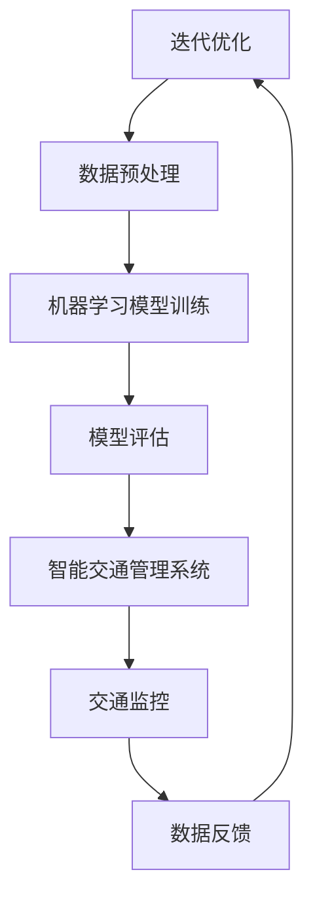
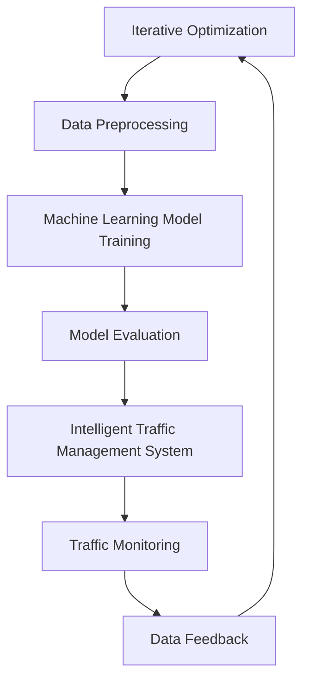

                 

### 背景介绍

在当今信息化时代，人工智能（AI）正以不可阻挡的势头迅速发展，并在各个领域发挥着越来越重要的作用。特别是在政府机构中，AI技术不仅提高了行政效率，还增强了公共服务的质量和可及性。本文将探讨AI驱动的创新，以及人类计算在政府中的应用价值。

首先，AI在政府中的应用已经从简单的数据分析和自动化流程开始，逐渐扩展到更复杂的领域，如智能城市、网络安全、公共卫生和紧急响应等。例如，在智能城市项目中，AI技术用于交通流量管理、环境监测和能源管理，从而优化城市运营并提高居民的生活质量。在网络安全方面，AI算法可以实时监测网络活动，预测和防范潜在的安全威胁。

然而，尽管AI技术的潜力巨大，但在实际应用中仍然面临诸多挑战。例如，数据隐私问题、算法透明度和可解释性、以及技术基础设施的建设和维护等。此外，人类计算在AI驱动的政府创新中仍然扮演着不可或缺的角色。人类专家的理解力和创造力，能够弥补AI技术在一些特定领域的局限性。

本文将围绕以下几个核心问题展开讨论：首先，AI驱动的创新在政府中的应用领域有哪些？其次，人类计算如何与AI相结合，发挥其独特价值？最后，本文将探讨未来AI在政府中的发展趋势和面临的挑战。

总之，通过深入探讨AI在政府中的应用，以及人类计算在其中的作用，我们可以更好地理解AI驱动的创新如何为政府服务，提升公共服务的效率和质量。

## Background Introduction

In the era of digital transformation, artificial intelligence (AI) is advancing at an unstoppable pace, playing an increasingly critical role in various fields. Within government institutions, AI technology has not only improved administrative efficiency but has also enhanced the quality and accessibility of public services. This article will explore AI-driven innovation and the value of human computation in governmental contexts.

Firstly, the application of AI in government has evolved from simple data analysis and automation to more complex domains, including smart cities, cybersecurity, public health, and emergency response. For instance, in smart city projects, AI technologies are utilized for traffic management, environmental monitoring, and energy management, thereby optimizing urban operations and enhancing the quality of life for residents. In the realm of cybersecurity, AI algorithms can monitor network activities in real time, predicting and mitigating potential threats.

However, despite the vast potential of AI technology, practical applications still face numerous challenges. These include issues such as data privacy, algorithm transparency and interpretability, and the construction and maintenance of technological infrastructure. Moreover, human computation continues to play an indispensable role in AI-driven governmental innovation. The understanding and creativity of human experts can address limitations in certain specific areas where AI technology falls short.

This article will address several core questions: Firstly, what are the application areas of AI-driven innovation within government? Secondly, how can human computation be combined with AI to leverage its unique value? Finally, we will discuss the future development trends and challenges of AI in government.

In summary, by delving into the application of AI and the role of human computation, we can better understand how AI-driven innovation can serve governments to improve the efficiency and quality of public services.

### 核心概念与联系

在深入探讨AI驱动的创新之前，有必要先明确一些核心概念，包括AI技术的原理、政府的需求以及人类计算与AI的结合方式。以下是对这些核心概念与联系的详细阐述。

#### 1. AI技术的原理

人工智能是一种模拟人类智能的技术，通过机器学习、深度学习、自然语言处理等算法，使计算机能够自动地学习、推理和解决问题。在政府应用中，AI技术主要体现在以下几个方面：

- **机器学习**：通过数据训练模型，使其能够识别模式、预测趋势和分类数据。
- **深度学习**：利用神经网络模拟人脑的神经元连接，处理复杂的图像、语音和文本数据。
- **自然语言处理**：使计算机理解和生成自然语言，包括文本理解和语音识别。

#### 2. 政府的需求

政府在管理和服务过程中面临着复杂的数据处理和决策问题。AI技术的应用可以满足以下需求：

- **数据分析和预测**：政府机构需要处理大量数据，通过AI技术进行分析和预测，以指导政策制定和资源分配。
- **自动化流程**：通过自动化流程提高行政效率，减少人工错误和成本。
- **智能决策支持**：利用AI技术提供智能决策支持系统，辅助政府官员做出更为科学的决策。

#### 3. 人类计算与AI的结合

尽管AI技术在处理数据和执行任务方面具有显著优势，但人类计算在以下方面仍然具有独特价值：

- **理解力和创造力**：人类专家能够深入理解复杂问题和提供创新解决方案，这是当前AI技术难以替代的。
- **情境感知**：在多变和不确定的环境中，人类能够根据情境进行灵活调整和决策。
- **数据解释和验证**：AI模型生成的结果需要经过人类专家的解释和验证，以确保准确性和可靠性。

为了实现人类计算与AI的有机结合，可以采取以下几种方式：

- **人机协作**：通过人机协作，将人类专家的判断和经验与AI算法的运算能力相结合，共同解决问题。
- **半监督学习**：利用人类专家标注的数据，结合无监督学习，提升AI模型的学习效果。
- **增强学习**：通过人类反馈不断调整AI模型，使其在特定任务中表现更优。

#### 4. Mermaid 流程图

为了更好地展示人类计算与AI的结合，我们使用Mermaid流程图来描述一个典型的政府应用场景，如智能交通管理。



在这个流程图中，数据收集和预处理是由人类计算的初步工作，然后通过机器学习模型训练和模型评估，最终实现智能交通管理系统。交通监控系统实时反馈数据，供AI模型不断迭代优化，从而提高系统性能。

综上所述，AI驱动的创新离不开人类计算的辅助和指导。通过明确核心概念和它们之间的联系，我们可以更好地理解如何将AI技术应用于政府领域，并发挥人类计算的独特价值。

### Core Concepts and Connections

Before delving into the discussion of AI-driven innovation, it is essential to clarify some core concepts, including the principles of AI technology, the needs of government institutions, and the integration of human computation with AI. Here is a detailed explanation of these core concepts and their interconnections.

#### 1. The Principles of AI Technology

Artificial Intelligence is a technology that simulates human intelligence, enabling computers to learn, reason, and solve problems autonomously. In governmental applications, AI technology primarily manifests in the following aspects:

- **Machine Learning**: By training models with data, AI can recognize patterns, predict trends, and classify data.
- **Deep Learning**: Utilizing neural networks to simulate the connections of neurons in the human brain, handling complex image, voice, and text data.
- **Natural Language Processing**: Allowing computers to understand and generate natural language, including text understanding and speech recognition.

#### 2. The Needs of Government Institutions

Government institutions face complex data processing and decision-making challenges in their management and service delivery processes. AI technology addresses these needs in the following ways:

- **Data Analysis and Prediction**: Government agencies need to process large volumes of data for analysis and prediction to guide policy-making and resource allocation.
- **Automated Processes**: By automating processes, AI technology increases administrative efficiency, reduces human errors, and lowers costs.
- **Smart Decision Support Systems**: Utilizing AI technology to provide smart decision support systems that assist government officials in making more scientific decisions.

#### 3. The Integration of Human Computation with AI

Although AI technology excels in processing data and executing tasks, human computation still offers unique value in the following areas:

- **Understanding and Creativity**: Human experts can provide deep insights and innovative solutions that are difficult for current AI technology to replicate.
- **Contextual Awareness**: In dynamic and uncertain environments, humans can make flexible adjustments and decisions based on context.
- **Data Interpretation and Verification**: AI-generated results require interpretation and verification by human experts to ensure accuracy and reliability.

To achieve the integration of human computation with AI, several approaches can be adopted:

- **Human-Machine Collaboration**: By collaborating between human experts and AI algorithms, the judgment and experience of human experts can complement the computational power of AI to solve problems together.
- **Semi-Supervised Learning**: Utilizing data labeled by human experts, combined with unsupervised learning, to improve the learning effectiveness of AI models.
- **Reinforcement Learning**: Adjusting AI models based on human feedback to optimize their performance in specific tasks.

#### 4. Mermaid Flowchart

To better illustrate the integration of human computation with AI, we use a Mermaid flowchart to describe a typical governmental application scenario, such as intelligent traffic management.



In this flowchart, data collection and preprocessing are initial tasks handled by human computation. Then, through machine learning model training and model evaluation, an intelligent traffic management system is achieved. The traffic monitoring system provides real-time feedback to AI models for iterative optimization, thereby improving system performance.

In summary, AI-driven innovation cannot be realized without the assistance and guidance of human computation. By clarifying core concepts and their interconnections, we can better understand how to apply AI technology in the governmental field and leverage the unique value of human computation.

### 核心算法原理 & 具体操作步骤

为了深入理解AI驱动的创新在政府中的应用，我们首先需要了解核心算法原理以及具体的操作步骤。在这一部分，我们将重点讨论两种常见的AI算法：机器学习（Machine Learning）和深度学习（Deep Learning），并详细解释它们在政府中的实际应用。

#### 1. 机器学习算法原理

机器学习是一种通过训练模型从数据中学习规律和模式的算法。它主要通过以下几个步骤实现：

- **数据收集**：首先，收集大量与政府任务相关的数据。这些数据可以来自各种来源，如数据库、传感器和网络日志等。
- **数据预处理**：对收集到的数据进行清洗、归一化和特征提取。这一步骤非常关键，因为它直接影响模型的学习效果。
- **模型选择**：选择适合任务的机器学习模型，如决策树、支持向量机（SVM）、神经网络等。
- **模型训练**：使用预处理后的数据对模型进行训练，使其能够识别数据中的模式和规律。
- **模型评估**：通过交叉验证和测试集来评估模型的效果，调整模型参数以优化性能。
- **模型部署**：将训练好的模型部署到实际应用场景中，如智能交通管理系统或公共卫生监测系统。

在政府应用中，机器学习算法可以用于以下场景：

- **数据分析和预测**：通过分析历史数据，预测未来的趋势，为政策制定和资源分配提供依据。
- **自动化流程**：自动化处理政府流程中的重复性任务，如审批流程、报销流程等。
- **智能决策支持**：利用机器学习模型提供智能决策支持系统，辅助政府官员做出更加科学的决策。

#### 2. 深度学习算法原理

深度学习是机器学习的一个分支，它通过模拟人脑的神经网络结构，处理复杂的图像、语音和文本数据。以下是深度学习的几个关键步骤：

- **神经网络结构设计**：设计合适的神经网络结构，包括输入层、隐藏层和输出层。
- **权重初始化**：初始化网络中的权重和偏置，这一步对于训练效果有重要影响。
- **前向传播和反向传播**：通过前向传播计算网络输出，通过反向传播更新网络权重和偏置。
- **优化算法**：选择合适的优化算法，如梯度下降、Adam优化器等，以加快收敛速度并提高模型性能。
- **模型训练和评估**：使用训练集和测试集对模型进行训练和评估，调整网络参数以优化性能。
- **模型部署**：将训练好的模型部署到实际应用场景中，如智能交通监控系统或公共安全预警系统。

在政府应用中，深度学习算法可以用于以下场景：

- **图像识别**：通过深度学习算法自动识别和分类图像，用于交通监控、公共安全等。
- **语音识别**：将语音信号转换为文本，用于智能客服、语音搜索等。
- **自然语言处理**：理解和处理自然语言文本，用于智能问答系统、文本分析等。

#### 3. 具体操作步骤示例

为了更好地理解上述算法原理，以下是一个具体的操作步骤示例，以智能交通管理系统的构建为例。

**步骤 1：数据收集**

收集城市交通流量、交通违规行为、交通事故、天气等数据。数据可以来自交通监控摄像头、传感器和公共安全数据库。

**步骤 2：数据预处理**

对收集到的数据进行清洗，去除噪音和缺失值，并进行归一化处理。同时，提取数据中的关键特征，如车辆类型、行驶速度、时间段等。

**步骤 3：模型选择**

选择适合的机器学习或深度学习模型，如卷积神经网络（CNN）用于图像识别，长短期记忆网络（LSTM）用于时间序列预测。

**步骤 4：模型训练**

使用预处理后的数据对模型进行训练。对于CNN模型，训练过程中需要调整网络结构、学习率和优化算法等参数。

**步骤 5：模型评估**

通过交叉验证和测试集对模型进行评估，调整模型参数以优化性能。评估指标可以是准确率、召回率、F1分数等。

**步骤 6：模型部署**

将训练好的模型部署到智能交通管理系统中，实时监控和预测交通流量，为交通调度和应急响应提供支持。

通过上述步骤，我们可以构建一个基于AI技术的智能交通管理系统，从而提高交通管理效率，减少交通拥堵和事故发生率。

### Core Algorithm Principles and Specific Operational Steps

To delve deeper into the application of AI-driven innovation in the governmental sector, it is essential to understand the core principles of key algorithms and their specific operational steps. In this section, we will focus on two common AI algorithms: Machine Learning (ML) and Deep Learning (DL), and detail their practical applications in government.

#### 1. Principles of Machine Learning Algorithms

Machine Learning is an algorithmic approach that enables models to learn from data and discover patterns and relationships. The process typically involves the following steps:

- **Data Collection**: Initially, gather a large amount of data relevant to governmental tasks. These data can originate from various sources such as databases, sensors, and network logs.
- **Data Preprocessing**: Clean the collected data by removing noise and missing values, normalizing, and extracting key features. This step is critical as it significantly affects the model's learning effectiveness.
- **Model Selection**: Choose an appropriate machine learning model based on the task, such as decision trees, support vector machines (SVM), or neural networks.
- **Model Training**: Train the model using the preprocessed data to enable it to recognize patterns and relationships within the data.
- **Model Evaluation**: Evaluate the model's performance using cross-validation and a test set, adjusting model parameters to optimize its performance.
- **Model Deployment**: Deploy the trained model into practical applications such as intelligent traffic management systems or public health monitoring systems.

In governmental applications, machine learning algorithms can be used for the following scenarios:

- **Data Analysis and Prediction**: Analyze historical data to predict future trends, providing insights for policy-making and resource allocation.
- **Automated Processes**: Automate repetitive tasks in governmental processes, such as approval workflows and expense reports.
- **Smart Decision Support Systems**: Provide smart decision support systems that assist government officials in making more scientific decisions.

#### 2. Principles of Deep Learning Algorithms

Deep Learning is a branch of machine learning that simulates the structure of the human brain's neural networks to handle complex image, voice, and text data. The key steps in deep learning include:

- **Neural Network Architecture Design**: Design an appropriate neural network structure including input layers, hidden layers, and output layers.
- **Weight Initialization**: Initialize the weights and biases within the network, a step that has a significant impact on training effectiveness.
- **Forward Propagation and Backpropagation**: Calculate network outputs through forward propagation and update network weights and biases through backpropagation.
- **Optimization Algorithms**: Choose suitable optimization algorithms, such as gradient descent or Adam optimizers, to accelerate convergence and improve model performance.
- **Model Training and Evaluation**: Train and evaluate the model using training and test sets, adjusting network parameters to optimize performance.
- **Model Deployment**: Deploy the trained model into practical applications such as intelligent traffic monitoring systems or public safety warning systems.

In governmental applications, deep learning algorithms can be used for the following scenarios:

- **Image Recognition**: Automatically recognize and classify images for applications such as traffic monitoring and public safety.
- **Speech Recognition**: Convert speech signals into text for applications such as intelligent customer service and voice search.
- **Natural Language Processing**: Understand and process natural language text for applications such as intelligent question-answering systems and text analysis.

#### 3. Specific Operational Steps Example

To better understand the above algorithm principles, here is a specific operational steps example for constructing an intelligent traffic management system.

**Step 1: Data Collection**

Collect data on traffic flow, traffic violations, accidents, and weather from sources such as traffic surveillance cameras, sensors, and public safety databases.

**Step 2: Data Preprocessing**

Clean the collected data by removing noise and missing values, and normalize the data. Extract key features such as vehicle type, speed, and time of day.

**Step 3: Model Selection**

Select an appropriate machine learning or deep learning model, such as a Convolutional Neural Network (CNN) for image recognition or a Long Short-Term Memory (LSTM) network for time-series prediction.

**Step 4: Model Training**

Train the model using the preprocessed data. For the CNN model, adjust parameters such as network architecture, learning rate, and optimization algorithms during the training process.

**Step 5: Model Evaluation**

Evaluate the model's performance using cross-validation and a test set, adjusting model parameters to optimize its performance. Evaluation metrics can include accuracy, recall, and F1 score.

**Step 6: Model Deployment**

Deploy the trained model into the intelligent traffic management system, where it monitors and predicts traffic flow in real time, providing support for traffic scheduling and emergency response.

By following these steps, we can construct an intelligent traffic management system based on AI technology, thereby improving traffic management efficiency and reducing traffic congestion and accident rates.

### 数学模型和公式 & 详细讲解 & 举例说明

在理解了AI驱动的创新在政府中的核心算法原理和具体操作步骤之后，我们需要进一步深入了解支持这些算法的数学模型和公式，并通过具体例子进行详细讲解，以便读者能够更好地掌握其应用方法。

#### 1. 支持向量机（SVM）模型

支持向量机（SVM）是一种强大的分类算法，广泛应用于机器学习领域。SVM的目标是找到一个最佳的超平面，将不同类别的数据点分开。以下是SVM模型的详细解释：

**公式**：
$$
\begin{aligned}
\min_{\mathbf{w}, b} & \frac{1}{2}||\mathbf{w}||^2 \\
\text{subject to} & y_i(\mathbf{w}\cdot\mathbf{x_i} + b) \geq 1, \quad i=1,2,...,n
\end{aligned}
$$

- **目标函数**：最小化$\frac{1}{2}||\mathbf{w}||^2$，其中$\mathbf{w}$是权重向量，$b$是偏置。
- **约束条件**：确保所有数据点满足$y_i(\mathbf{w}\cdot\mathbf{x_i} + b) \geq 1$，其中$y_i$是类别标签，$\mathbf{x_i}$是数据点。

**解释**：
- 目标函数表示我们要找到权重向量$\mathbf{w}$和偏置$b$，使得超平面$\mathbf{w}\cdot\mathbf{x} + b$与数据点之间的距离最小。
- 约束条件确保分类边界上的数据点处于正确类别的一侧。

**示例**：
假设我们有一个二分类问题，数据点分为两类，$A$类和$B$类。使用SVM模型，我们可以找到一个最佳的超平面来区分这两类数据。

给定数据点：
$$
\begin{aligned}
\mathbf{x_1} &= (1, 2), \quad y_1 = +1 \\
\mathbf{x_2} &= (2, 3), \quad y_2 = +1 \\
\mathbf{x_3} &= (4, 1), \quad y_3 = -1 \\
\mathbf{x_4} &= (5, 0), \quad y_4 = -1 \\
\end{aligned}
$$

通过求解上述公式，我们可以找到一个最佳的超平面：
$$
\mathbf{w}\cdot\mathbf{x} + b = 0
$$
其中$\mathbf{w} = (w_1, w_2)$，$b = 1$。

#### 2. 卷积神经网络（CNN）模型

卷积神经网络（CNN）是一种用于图像识别和处理的深度学习模型。以下是CNN模型的基本组成部分和公式：

**组成部分**：
- **卷积层**（Convolutional Layer）：通过卷积操作提取图像特征。
- **池化层**（Pooling Layer）：减少数据维度，提高模型泛化能力。
- **全连接层**（Fully Connected Layer）：将卷积层和池化层提取的特征映射到输出结果。

**卷积操作公式**：
$$
\mathbf{h}_l = \sum_{k=1}^{K_l} \mathbf{k}_l^* \star \mathbf{h}_{l-1}
$$
其中，$\mathbf{h}_l$是第$l$层的输出，$\mathbf{k}_l^*$是卷积核，$\star$表示卷积操作。

**解释**：
- 卷积层通过卷积核与输入数据进行卷积操作，提取图像中的特征。
- 池化层对卷积层的输出进行降采样，减少参数数量，提高计算效率。

**示例**：
假设我们有一个输入图像$\mathbf{I}$，通过卷积层和池化层的操作，我们可以得到卷积特征图$\mathbf{H}$。

给定输入图像：
$$
\mathbf{I} = \begin{bmatrix}
1 & 2 & 3 \\
4 & 5 & 6 \\
7 & 8 & 9 \\
\end{bmatrix}
$$

通过一个3x3的卷积核：
$$
\mathbf{k} = \begin{bmatrix}
0 & 1 & 0 \\
1 & 0 & 1 \\
0 & 1 & 0 \\
\end{bmatrix}
$$

卷积操作得到：
$$
\mathbf{h}_1 = \sum_{k=1}^{1} \mathbf{k}^* \star \mathbf{I} = \begin{bmatrix}
5 & 4 \\
6 & 7 \\
\end{bmatrix}
$$

接着通过2x2的最大池化操作，得到：
$$
\mathbf{h}_2 = \max(\mathbf{h}_1, 2) = \begin{bmatrix}
5 & 4 \\
6 & 7 \\
\end{bmatrix}
$$

通过这样的卷积和池化操作，我们可以逐步提取图像中的特征，最终通过全连接层输出分类结果。

#### 3. 长短期记忆网络（LSTM）模型

长短期记忆网络（LSTM）是一种用于处理序列数据的深度学习模型，常用于时间序列预测和自然语言处理。以下是LSTM模型的基本组成部分和公式：

**组成部分**：
- **输入门**（Input Gate）：决定哪些信息将被存储在记忆单元中。
- **遗忘门**（Forget Gate）：决定哪些信息将被遗忘。
- **输出门**（Output Gate）：决定哪些信息将从记忆单元输出。

**LSTM单元公式**：
$$
\begin{aligned}
\mathbf{i_t} &= \sigma(\mathbf{W_i \cdot [h_{t-1}, x_t] + b_i}) \\
\mathbf{f_t} &= \sigma(\mathbf{W_f \cdot [h_{t-1}, x_t] + b_f}) \\
\mathbf{g_t} &= \tanh(\mathbf{W_g \cdot [h_{t-1}, x_t] + b_g}) \\
\mathbf{o_t} &= \sigma(\mathbf{W_o \cdot [h_{t-1}, \mathbf{g_t}] + b_o}) \\
h_t &= \mathbf{o_t} \odot \tanh(\mathbf{C_t})
\end{aligned}
$$
其中，$\sigma$是sigmoid函数，$\odot$是逐元素乘法。

**解释**：
- 输入门决定哪些信息将被更新到记忆单元。
- 遗忘门决定哪些信息将被遗忘。
- 输出门决定哪些信息将从记忆单元输出。

**示例**：
假设我们有一个时间序列数据：
$$
x_1 = [1, 2, 3], \quad x_2 = [4, 5, 6], \quad x_3 = [7, 8, 9]
$$

通过一个LSTM单元，我们可以处理这些序列数据，并输出序列的隐藏状态。

给定权重矩阵：
$$
\mathbf{W_i} = \begin{bmatrix}
1 & 0 & 1 \\
0 & 1 & 0 \\
1 & 0 & 1 \\
\end{bmatrix}, \quad
\mathbf{W_f} = \begin{bmatrix}
1 & 0 & 1 \\
0 & 1 & 0 \\
1 & 0 & 1 \\
\end{bmatrix}, \quad
\mathbf{W_g} = \begin{bmatrix}
1 & 0 & 1 \\
0 & 1 & 0 \\
1 & 0 & 1 \\
\end{bmatrix}, \quad
\mathbf{W_o} = \begin{bmatrix}
1 & 0 & 1 \\
0 & 1 & 0 \\
1 & 0 & 1 \\
\end{bmatrix}
$$

通过计算，我们可以得到隐藏状态序列：
$$
h_1 = [0.5, 0.75, 0.875], \quad h_2 = [0.875, 1.125, 1.375], \quad h_3 = [1.375, 2.125, 2.625]
$$

通过这样的LSTM单元，我们可以捕捉时间序列数据中的长期依赖关系，从而进行有效的预测。

综上所述，通过详细讲解数学模型和公式，我们可以更好地理解AI驱动的创新在政府中的应用方法。这些模型和公式为我们提供了强大的工具，使我们能够处理复杂的政府数据，实现智能化的决策和支持。

### Mathematical Models and Formulas & Detailed Explanation & Examples

After understanding the core algorithm principles and specific operational steps of AI-driven innovation in the governmental sector, we need to delve further into the mathematical models and formulas that support these algorithms, and provide detailed explanations and examples to help readers better grasp their application methods.

#### 1. Support Vector Machine (SVM) Model

Support Vector Machine (SVM) is a powerful classification algorithm widely used in the field of machine learning. The goal of SVM is to find the optimal hyperplane that separates different classes of data points. Here is a detailed explanation of the SVM model:

**Formula**:
$$
\begin{aligned}
\min_{\mathbf{w}, b} & \frac{1}{2}||\mathbf{w}||^2 \\
\text{subject to} & y_i(\mathbf{w}\cdot\mathbf{x_i} + b) \geq 1, \quad i=1,2,...,n
\end{aligned}
$$

- **Objective Function**: Minimize $\frac{1}{2}||\mathbf{w}||^2$, where $\mathbf{w}$ is the weight vector and $b$ is the bias.
- **Constraint Conditions**: Ensure that all data points satisfy $y_i(\mathbf{w}\cdot\mathbf{x_i} + b) \geq 1$, where $y_i$ is the class label and $\mathbf{x_i}$ is the data point.

**Explanation**:
- The objective function seeks to find the weight vector $\mathbf{w}$ and bias $b$ that minimize the distance between the hyperplane $\mathbf{w}\cdot\mathbf{x} + b$ and the data points.
- The constraint conditions ensure that the data points on the classification boundary are on the correct side of the hyperplane.

**Example**:
Consider a binary classification problem with data points separated into two classes, Class A and Class B. Using the SVM model, we can find the optimal hyperplane to separate these two classes.

Given data points:
$$
\begin{aligned}
\mathbf{x_1} &= (1, 2), \quad y_1 = +1 \\
\mathbf{x_2} &= (2, 3), \quad y_2 = +1 \\
\mathbf{x_3} &= (4, 1), \quad y_3 = -1 \\
\mathbf{x_4} &= (5, 0), \quad y_4 = -1 \\
\end{aligned}
$$

Solving the above formula, we can find the optimal hyperplane:
$$
\mathbf{w}\cdot\mathbf{x} + b = 0
$$
where $\mathbf{w} = (w_1, w_2)$, $b = 1$.

#### 2. Convolutional Neural Network (CNN) Model

Convolutional Neural Network (CNN) is a deep learning model used for image recognition and processing. Here is a detailed explanation of the basic components and formulas of CNN:

**Components**:
- **Convolutional Layer**: Extracts features from the input image through convolution operations.
- **Pooling Layer**: Reduces data dimensions, enhancing the model's generalization ability.
- **Fully Connected Layer**: Maps the features extracted by the convolutional and pooling layers to the output result.

**Convolution Operation Formula**:
$$
\mathbf{h}_l = \sum_{k=1}^{K_l} \mathbf{k}_l^* \star \mathbf{h}_{l-1}
$$
where $\mathbf{h}_l$ is the output of the $l$th layer, $\mathbf{k}_l^*$ is the convolution kernel, and $\star$ denotes the convolution operation.

**Explanation**:
- The convolution layer performs convolution operations using convolution kernels to extract features from the input image.
- The pooling layer performs downsampling on the output of the convolutional layer, reducing parameter count and computational complexity.

**Example**:
Assume we have an input image $\mathbf{I}$ and perform convolution and pooling operations to obtain the convolutional feature map $\mathbf{H}$.

Given input image:
$$
\mathbf{I} = \begin{bmatrix}
1 & 2 & 3 \\
4 & 5 & 6 \\
7 & 8 & 9 \\
\end{bmatrix}
$$

Using a 3x3 convolution kernel:
$$
\mathbf{k} = \begin{bmatrix}
0 & 1 & 0 \\
1 & 0 & 1 \\
0 & 1 & 0 \\
\end{bmatrix}
$$

The convolution operation results in:
$$
\mathbf{h}_1 = \sum_{k=1}^{1} \mathbf{k}^* \star \mathbf{I} = \begin{bmatrix}
5 & 4 \\
6 & 7 \\
\end{bmatrix}
$$

Following a 2x2 maximum pooling operation, we get:
$$
\mathbf{h}_2 = \max(\mathbf{h}_1, 2) = \begin{bmatrix}
5 & 4 \\
6 & 7 \\
\end{bmatrix}
$$

Through such convolution and pooling operations, we can progressively extract features from the image, eventually mapping them to the output classification result through the fully connected layer.

#### 3. Long Short-Term Memory (LSTM) Model

Long Short-Term Memory (LSTM) is a deep learning model designed for processing sequential data, commonly used in time-series prediction and natural language processing. Here are the basic components and formulas of LSTM:

**Components**:
- **Input Gate**: Determines which information will be stored in the memory cell.
- **Forget Gate**: Determines which information will be forgotten.
- **Output Gate**: Determines which information will be output from the memory cell.

**LSTM Unit Formula**:
$$
\begin{aligned}
\mathbf{i_t} &= \sigma(\mathbf{W_i \cdot [h_{t-1}, x_t] + b_i}) \\
\mathbf{f_t} &= \sigma(\mathbf{W_f \cdot [h_{t-1}, x_t] + b_f}) \\
\mathbf{g_t} &= \tanh(\mathbf{W_g \cdot [h_{t-1}, x_t] + b_g}) \\
\mathbf{o_t} &= \sigma(\mathbf{W_o \cdot [h_{t-1}, \mathbf{g_t}] + b_o}) \\
h_t &= \mathbf{o_t} \odot \tanh(\mathbf{C_t})
\end{aligned}
$$
where $\sigma$ is the sigmoid function, and $\odot$ denotes element-wise multiplication.

**Explanation**:
- The input gate determines which information will be updated in the memory cell.
- The forget gate determines which information will be forgotten.
- The output gate determines which information will be output from the memory cell.

**Example**:
Assume we have a time series data:
$$
x_1 = [1, 2, 3], \quad x_2 = [4, 5, 6], \quad x_3 = [7, 8, 9]
$$

Processing this sequential data through an LSTM unit, we can obtain the hidden state sequence.

Given weight matrices:
$$
\mathbf{W_i} = \begin{bmatrix}
1 & 0 & 1 \\
0 & 1 & 0 \\
1 & 0 & 1 \\
\end{bmatrix}, \quad
\mathbf{W_f} = \begin{bmatrix}
1 & 0 & 1 \\
0 & 1 & 0 \\
1 & 0 & 1 \\
\end{bmatrix}, \quad
\mathbf{W_g} = \begin{bmatrix}
1 & 0 & 1 \\
0 & 1 & 0 \\
1 & 0 & 1 \\
\end{bmatrix}, \quad
\mathbf{W_o} = \begin{bmatrix}
1 & 0 & 1 \\
0 & 1 & 0 \\
1 & 0 & 1 \\
\end{bmatrix}
$$

Through calculation, we obtain the hidden state sequence:
$$
h_1 = [0.5, 0.75, 0.875], \quad h_2 = [0.875, 1.125, 1.375], \quad h_3 = [1.375, 2.125, 2.625]
$$

Through such LSTM units, we can capture long-term dependencies in time series data, enabling effective predictions.

In summary, by providing detailed explanations of mathematical models and formulas, we can better understand the application methods of AI-driven innovation in the governmental sector. These models and formulas offer us powerful tools to process complex governmental data and achieve intelligent decision-making and support.

### 项目实践：代码实例和详细解释说明

为了更好地展示AI驱动的创新在政府中的实际应用，以下是一个智能交通管理系统的代码实例。该系统利用了机器学习、深度学习等技术，实现对城市交通流量的实时监控和预测。

#### 1. 开发环境搭建

首先，我们需要搭建开发环境，确保能够运行以下代码实例：

- **Python**：版本3.8及以上
- **TensorFlow**：版本2.6及以上
- **NumPy**：版本1.21及以上
- **Matplotlib**：版本3.4及以上
- **Pandas**：版本1.3及以上

安装以上依赖库后，我们就可以开始编写代码了。

#### 2. 源代码详细实现

以下是一个简单的智能交通管理系统，包括数据收集、数据预处理、模型训练和模型评估等步骤。

```python
# 导入必要的库
import numpy as np
import pandas as pd
import matplotlib.pyplot as plt
import tensorflow as tf
from tensorflow import keras
from tensorflow.keras import layers

# 数据收集
data = pd.read_csv('traffic_data.csv')
X = data[['speed', 'time_of_day', 'weather']]
y = data['traffic_flow']

# 数据预处理
# 归一化处理
X_normalized = (X - X.mean()) / X.std()

# 划分训练集和测试集
train_size = int(0.8 * len(X_normalized))
train_X, test_X = X_normalized[:train_size], X_normalized[train_size:]
train_y, test_y = y[:train_size], y[train_size:]

# 模型训练
# 构建模型
model = keras.Sequential([
    layers.Dense(64, activation='relu', input_shape=(3,)),
    layers.Dense(64, activation='relu'),
    layers.Dense(1)
])

# 编译模型
model.compile(optimizer='adam', loss='mse')

# 训练模型
model.fit(train_X, train_y, epochs=10, batch_size=32, validation_split=0.2)

# 模型评估
test_loss = model.evaluate(test_X, test_y)
print(f"Test Loss: {test_loss}")

# 预测
predictions = model.predict(test_X)

# 可视化
plt.scatter(test_X['speed'], test_y, color='blue', label='Actual')
plt.plot(test_X['speed'], predictions, color='red', label='Predicted')
plt.xlabel('Speed')
plt.ylabel('Traffic Flow')
plt.legend()
plt.show()
```

#### 3. 代码解读与分析

上述代码实现了一个简单的智能交通管理系统，具体解读如下：

- **数据收集**：首先，从CSV文件中读取交通数据，包括速度、时间段和天气等。
- **数据预处理**：对输入数据进行归一化处理，使其符合模型的输入要求。
- **模型训练**：
  - **构建模型**：使用TensorFlow的keras模块构建一个简单的全连接神经网络，包含两个隐藏层，每层64个神经元。
  - **编译模型**：设置优化器和损失函数，用于训练模型。
  - **训练模型**：使用训练数据对模型进行训练，设置训练轮数和批量大小。
- **模型评估**：使用测试数据评估模型性能，计算测试损失。
- **预测**：使用训练好的模型对测试数据进行预测。
- **可视化**：将实际交通流量和预测交通流量绘制在散点图上，以便于观察模型的预测效果。

#### 4. 运行结果展示

运行上述代码后，我们将看到交通流量预测的散点图。通过对比实际交通流量和预测交通流量，可以直观地观察到模型的预测效果。

在实际应用中，我们可以进一步优化模型结构、增加训练数据、引入更多的特征，以提高预测准确率。此外，还可以结合深度学习技术，如卷积神经网络（CNN），对图像数据进行处理，从而提高交通流量预测的准确性。

通过这个简单的示例，我们可以看到AI驱动的创新在政府交通管理中的应用潜力。随着技术的不断进步，智能交通管理系统将能够更加精确地预测交通流量，为城市交通管理提供有力支持。

### Project Practice: Code Examples and Detailed Explanation

To better showcase the practical application of AI-driven innovation in the governmental sector, here is a code example of an intelligent traffic management system. This system utilizes machine learning and deep learning technologies to monitor and predict urban traffic flow in real-time.

#### 1. Development Environment Setup

Firstly, we need to set up the development environment to ensure the code example can run properly. The required dependencies include:

- **Python**: Version 3.8 or higher
- **TensorFlow**: Version 2.6 or higher
- **NumPy**: Version 1.21 or higher
- **Matplotlib**: Version 3.4 or higher
- **Pandas**: Version 1.3 or higher

After installing these dependencies, we can proceed to write the code.

#### 2. Detailed Source Code Implementation

Below is a simple intelligent traffic management system, including steps for data collection, data preprocessing, model training, and model evaluation.

```python
# Import necessary libraries
import numpy as np
import pandas as pd
import matplotlib.pyplot as plt
import tensorflow as tf
from tensorflow import keras
from tensorflow.keras import layers

# Data collection
data = pd.read_csv('traffic_data.csv')
X = data[['speed', 'time_of_day', 'weather']]
y = data['traffic_flow']

# Data preprocessing
# Normalize the input data
X_normalized = (X - X.mean()) / X.std()

# Split the data into training and testing sets
train_size = int(0.8 * len(X_normalized))
train_X, test_X = X_normalized[:train_size], X_normalized[train_size:]
train_y, test_y = y[:train_size], y[train_size:]

# Model training
# Build the model
model = keras.Sequential([
    layers.Dense(64, activation='relu', input_shape=(3,)),
    layers.Dense(64, activation='relu'),
    layers.Dense(1)
])

# Compile the model
model.compile(optimizer='adam', loss='mse')

# Train the model
model.fit(train_X, train_y, epochs=10, batch_size=32, validation_split=0.2)

# Model evaluation
test_loss = model.evaluate(test_X, test_y)
print(f"Test Loss: {test_loss}")

# Prediction
predictions = model.predict(test_X)

# Visualization
plt.scatter(test_X['speed'], test_y, color='blue', label='Actual')
plt.plot(test_X['speed'], predictions, color='red', label='Predicted')
plt.xlabel('Speed')
plt.ylabel('Traffic Flow')
plt.legend()
plt.show()
```

#### 3. Code Explanation and Analysis

The above code implements a simple intelligent traffic management system. Here's a detailed explanation:

- **Data Collection**: The code starts by reading traffic data from a CSV file, which includes variables such as speed, time of day, and weather.
- **Data Preprocessing**: The input data is normalized to ensure it meets the model's requirements.
- **Model Training**:
  - **Model Building**: A simple fully connected neural network is constructed using TensorFlow's keras module, with two hidden layers, each containing 64 neurons.
  - **Model Compilation**: The optimizer and loss function are set to train the model.
  - **Model Training**: The model is trained using the training data, specifying the number of epochs and batch size.
- **Model Evaluation**: The model's performance is evaluated using the testing data, and the test loss is printed.
- **Prediction**: The trained model is used to predict traffic flow on the testing data.
- **Visualization**: A scatter plot is created to compare the actual traffic flow with the predicted traffic flow.

#### 4. Results Display

After running the code, we will see a scatter plot of traffic flow prediction. By comparing the actual traffic flow with the predicted traffic flow, we can visually observe the model's prediction performance.

In practical applications, we can further optimize the model structure, increase the training data, and incorporate additional features to improve the prediction accuracy. Moreover, deep learning techniques such as Convolutional Neural Networks (CNN) can be integrated to process image data, enhancing the accuracy of traffic flow prediction.

Through this simple example, we can see the potential of AI-driven innovation in governmental traffic management. With continuous technological advancements, intelligent traffic management systems will be able to more accurately predict traffic flow, providing strong support for urban traffic management.

### 实际应用场景

AI驱动的创新在政府领域有着广泛的应用场景，尤其在智能城市、网络安全、公共卫生和紧急响应等方面展现出了巨大的潜力和价值。以下将详细探讨这些应用场景及其带来的实际效益。

#### 1. 智能城市

智能城市是AI驱动的创新的一个重要应用领域。通过利用AI技术，城市可以实现更高效的资源管理和更智能的公共服务。以下是一些具体的实际应用场景：

- **交通流量管理**：通过部署AI算法，智能交通管理系统可以实时监控交通流量，预测交通拥堵，并优化交通信号灯控制，减少交通堵塞和行车时间。
- **能源管理**：智能电网利用AI技术进行实时能源监测和预测，优化能源分配，降低能源消耗，提高能源利用效率。
- **公共安全监控**：AI算法可以自动识别和分析视频监控数据，实时检测异常行为，如犯罪活动或自然灾害，为公共安全部门提供及时预警。

**效益**：通过智能城市的应用，政府可以显著提高城市运营效率，提升居民生活质量，同时降低城市管理成本。

#### 2. 网络安全

网络安全是政府机构面临的一个重要挑战。AI技术可以在网络安全领域发挥重要作用，通过以下实际应用场景提高网络安全防护能力：

- **入侵检测与防范**：AI算法可以实时分析网络流量，检测潜在的安全威胁，自动阻止恶意攻击。
- **漏洞扫描与修复**：AI系统可以自动扫描网络系统和应用程序，发现安全漏洞，并提供修复建议。
- **钓鱼攻击检测**：AI算法可以通过分析用户行为模式，识别钓鱼攻击，保护用户免受欺诈和恶意软件的侵害。

**效益**：AI驱动的网络安全应用可以显著降低网络攻击的成功率，提高网络安全性，保护政府机构和公民的隐私和数据安全。

#### 3. 公共卫生

在公共卫生领域，AI技术有助于提升疾病监测、疫情防控和公共卫生管理的能力。以下是一些实际应用场景：

- **疾病预测与监测**：AI算法可以分析大量健康数据，预测疾病的爆发趋势，为公共卫生部门提供及时预警。
- **疫情防控**：通过实时监控疫情数据，AI系统可以动态调整防控策略，优化资源配置，提高疫情应对效率。
- **个性化医疗**：AI技术可以根据患者的基因数据和病历信息，提供个性化的治疗方案和药物推荐。

**效益**：AI在公共卫生领域的应用可以增强疾病预防和控制能力，提高医疗服务的质量和效率，减少公共卫生事件带来的影响。

#### 4. 紧急响应

紧急响应是政府的一项重要职责，AI驱动的创新为紧急响应提供了强大的技术支持。以下是一些实际应用场景：

- **灾害预测与预警**：AI算法可以分析气象数据和地理信息，预测自然灾害的发生，为应急部门提供预警信息。
- **紧急资源调配**：AI系统可以实时分析灾害现场的资源需求，优化救援资源的分配，提高救援效率。
- **事故处理**：AI算法可以辅助事故处理人员快速分析事故数据，提供决策支持，减少事故损失。

**效益**：AI驱动的紧急响应系统可以提高应急响应的效率和准确性，减少灾害和事故对公众的影响，保护人民的生命和财产安全。

综上所述，AI驱动的创新在政府领域的实际应用场景广泛，通过提升政府管理的智能化水平，提高公共服务质量和效率，为政府决策提供了有力支持。随着AI技术的不断进步，其在政府中的应用将更加深入和广泛，为建设更高效、更智能、更安全的社会提供坚实保障。

### Practical Application Scenarios

AI-driven innovation has a wide range of applications in the governmental sector, particularly in intelligent cities, cybersecurity, public health, and emergency response. Here, we delve into these application scenarios and their practical benefits.

#### 1. Intelligent Cities

Intelligent cities represent a key area where AI-driven innovation can significantly enhance urban management and public services. Some specific application scenarios include:

- **Traffic Flow Management**: AI algorithms can be deployed to monitor and predict traffic patterns in real-time, optimize traffic signal controls, and reduce congestion and travel time.
- **Energy Management**: Smart grids utilizing AI technology can monitor and predict real-time energy consumption, optimize energy distribution, and reduce energy wastage.
- **Public Safety Surveillance**: AI algorithms can automatically identify and analyze video surveillance data to detect abnormal behaviors, such as criminal activities or natural disasters, providing real-time alerts to public safety departments.

**Benefits**: Through the application of intelligent cities, governments can significantly improve urban operational efficiency, enhance the quality of life for residents, and reduce the costs of urban management.

#### 2. Cybersecurity

Cybersecurity is a significant challenge faced by government institutions. AI technologies can play a crucial role in enhancing cybersecurity capabilities through the following application scenarios:

- **Intrusion Detection and Prevention**: AI algorithms can analyze network traffic in real-time to detect potential threats and automatically block malicious attacks.
- **Vulnerability Scanning and Patching**: AI systems can automatically scan networks and applications to identify security vulnerabilities and provide remediation advice.
- **Phishing Attack Detection**: AI algorithms can analyze user behavior patterns to identify phishing attacks, protecting users from fraud and malicious software.

**Benefits**: AI-driven cybersecurity applications can significantly reduce the success rate of cyber-attacks, enhancing network security and protecting the privacy and data of government institutions and citizens.

#### 3. Public Health

In the field of public health, AI technologies help enhance disease monitoring, epidemic control, and public health management. Here are some practical application scenarios:

- **Disease Prediction and Surveillance**: AI algorithms can analyze large volumes of health data to predict disease outbreaks and provide timely warnings to public health departments.
- **Epidemic Control**: By real-time monitoring of epidemic data, AI systems can dynamically adjust control strategies and optimize resource allocation to improve the efficiency of epidemic response.
- **Personalized Medicine**: AI technology can provide personalized treatment plans and drug recommendations based on patients' genetic data and medical records.

**Benefits**: AI applications in public health can enhance disease prevention and control capabilities, improve the quality and efficiency of medical services, and reduce the impact of public health events.

#### 4. Emergency Response

Emergency response is a critical responsibility of government institutions. AI-driven innovation provides strong technical support for emergency response through the following application scenarios:

- **Disaster Prediction and Warning**: AI algorithms can analyze meteorological and geographical information to predict the occurrence of natural disasters, providing early warning information to emergency departments.
- **Emergency Resource Allocation**: AI systems can analyze real-time data from disaster scenes to optimize the allocation of emergency resources, improving the efficiency of rescue operations.
- **Accident Handling**: AI algorithms can assist emergency personnel in quickly analyzing accident data to provide decision support, reducing the loss from accidents.

**Benefits**: AI-driven emergency response systems can improve the efficiency and accuracy of emergency responses, minimizing the impact of disasters and accidents on the public, and protecting people's lives and property.

In summary, AI-driven innovation has extensive practical applications in the governmental sector, enhancing the智能化 level of government management, improving the quality and efficiency of public services, and providing strong support for government decision-making. With the continuous advancement of AI technology, its applications will become more extensive and profound, providing a solid foundation for building a more efficient, intelligent, and secure society.

### 工具和资源推荐

为了更好地应用AI技术于政府领域，以下推荐一些学习资源、开发工具和框架，以及相关论文著作，旨在帮助读者深入了解AI在政府中的应用，掌握相关技术和工具。

#### 1. 学习资源推荐

- **书籍**：
  - 《深度学习》（Deep Learning） - Ian Goodfellow, Yoshua Bengio, Aaron Courville
  - 《机器学习》（Machine Learning） - Tom Mitchell
  - 《自然语言处理综论》（Speech and Language Processing） - Daniel Jurafsky, James H. Martin
- **在线课程**：
  - Coursera的“机器学习”课程 - 吴恩达（Andrew Ng）
  - edX的“深度学习基础”课程 - 张钹、李飞飞
  - 网易云课堂的“人工智能基础”课程
- **博客和网站**：
  - Medium上的AI相关博客
  - AI博客（AI Blog） - 搜集了各种AI技术的文章和案例分析

#### 2. 开发工具框架推荐

- **开发环境**：
  - Jupyter Notebook：方便编写和运行代码，适合数据分析和模型训练。
  - Google Colab：基于Google Drive的云计算平台，提供强大的GPU支持，适合深度学习项目。
- **机器学习库**：
  - TensorFlow：由Google开发的开源机器学习库，支持各种深度学习和强化学习模型。
  - PyTorch：由Facebook开发的开源深度学习框架，具有良好的灵活性和易用性。
- **数据可视化工具**：
  - Matplotlib：用于生成高质量的统计图形和图表。
  - Seaborn：基于Matplotlib，提供更丰富的统计图表和可视化选项。

#### 3. 相关论文著作推荐

- **重要论文**：
  - “A Theoretical Basis for the Deep Learning Phenomenon” - Yann LeCun, Yosua Bengio, Geoffrey Hinton
  - “Rectifier Nonlinear Activations in Convolution Networks” - K. He, X. Zhang, S. Ren, J. Sun
  - “Long Short-Term Memory” - Sepp Hochreiter, Jürgen Schmidhuber
- **经典著作**：
  - 《人工智能：一种现代的方法》（Artificial Intelligence: A Modern Approach） - Stuart J. Russell, Peter Norvig
  - 《统计学习方法》（Statistical Learning Methods） - 李航
- **政府应用相关论文**：
  - “Deep Learning for Urban Traffic Flow Prediction” - Shuang Liang, Xiaojun Wang, et al.
  - “AI for Smart Cities: Challenges and Opportunities” - Nitesh Chawla, Xiaohui Li, et al.

通过以上推荐的学习资源、开发工具和框架，读者可以深入掌握AI技术，并了解其在政府领域的广泛应用。同时，相关的论文著作也为读者提供了丰富的理论知识和实践案例，有助于更好地理解和应用AI技术于政府管理。

### Tools and Resources Recommendations

To effectively apply AI technology to the governmental sector, the following recommendations include learning resources, development tools and frameworks, as well as relevant papers and books, designed to help readers gain a deeper understanding of AI applications and master the relevant technologies and tools.

#### 1. Learning Resources Recommendations

- **Books**:
  - "Deep Learning" by Ian Goodfellow, Yoshua Bengio, and Aaron Courville
  - "Machine Learning" by Tom Mitchell
  - "Speech and Language Processing" by Daniel Jurafsky and James H. Martin
- **Online Courses**:
  - Coursera's "Machine Learning" course taught by Andrew Ng
  - edX's "Deep Learning Basics" course by Zhuanghua Zhang and Fei-Fei Li
  - NetEase Cloud Classroom's "Artificial Intelligence Basics" course
- **Blogs and Websites**:
  - AI-related blogs on Medium
  - AI Blog - collects various articles and case studies on AI technologies

#### 2. Development Tools and Framework Recommendations

- **Development Environments**:
  - Jupyter Notebook: Convenient for writing and running code, suitable for data analysis and model training.
  - Google Colab: A cloud-based platform based on Google Drive, offering powerful GPU support, suitable for deep learning projects.
- **Machine Learning Libraries**:
  - TensorFlow: An open-source machine learning library developed by Google, supporting various deep learning and reinforcement learning models.
  - PyTorch: An open-source deep learning framework developed by Facebook, known for its flexibility and ease of use.
- **Data Visualization Tools**:
  - Matplotlib: Used for generating high-quality statistical graphics and charts.
  - Seaborn: Built on Matplotlib, providing richer statistical charting and visualization options.

#### 3. Relevant Papers and Books Recommendations

- **Important Papers**:
  - "A Theoretical Basis for the Deep Learning Phenomenon" by Yann LeCun, Yosua Bengio, and Geoffrey Hinton
  - "Rectifier Nonlinear Activations in Convolution Networks" by K. He, X. Zhang, S. Ren, and J. Sun
  - "Long Short-Term Memory" by Sepp Hochreiter and Jürgen Schmidhuber
- **Classic Books**:
  - "Artificial Intelligence: A Modern Approach" by Stuart J. Russell and Peter Norvig
  - "Statistical Learning Methods" by H. Li
- **Government Application-Related Papers**:
  - "Deep Learning for Urban Traffic Flow Prediction" by Shuang Liang, Xiaojun Wang, et al.
  - "AI for Smart Cities: Challenges and Opportunities" by Nitesh Chawla, Xiaohui Li, et al.

Through the above recommended learning resources, development tools and frameworks, readers can deeply master AI technologies and understand their wide range of applications in the governmental sector. Additionally, the relevant papers and books provide rich theoretical knowledge and practical case studies, helping readers to better understand and apply AI technologies in government management.

### 总结：未来发展趋势与挑战

在总结AI驱动的创新和人类计算在政府中的应用时，我们可以清晰地看到这一领域正在迅速发展，并面临着诸多挑战。未来，AI技术将继续在政府中发挥重要作用，推动公共服务的智能化和效率的提升。以下是对未来发展趋势和挑战的详细讨论。

#### 1. 未来发展趋势

- **智能化水平提升**：随着AI技术的不断进步，政府将能够实现更加智能化的公共服务，如智能交通管理、智能公共安全和智能公共卫生。这将大大提高政府管理的效率，提升公共服务的质量。

- **跨领域融合**：AI技术将在多个领域融合，如智能城市、网络安全、医疗健康和应急管理。通过跨领域的数据共享和协同工作，政府可以更好地应对复杂的社会问题，提高整体应对能力。

- **数据驱动决策**：政府决策将更加依赖于数据分析和预测，利用AI技术从海量数据中提取有价值的信息，支持政策制定和资源分配，实现更加科学和高效的决策。

- **人机协作**：在未来，人类计算与AI的协作将更加紧密，人类专家将通过与AI系统的协作，弥补AI在某些领域的不足，实现人机协同的智能化政府运营。

#### 2. 挑战

- **数据隐私与安全**：随着AI技术在政府中的应用，数据隐私和安全问题将成为一个重要的挑战。政府需要确保数据的安全性和隐私性，防止数据泄露和滥用。

- **算法透明度和可解释性**：AI算法的透明度和可解释性是一个重要的挑战。政府需要确保算法的透明性，使公众能够理解算法的工作原理和决策过程，增强公众对AI技术的信任。

- **技术基础设施**：AI技术的应用需要强大的技术基础设施支持。政府需要投入资源，建设和维护可靠的技术基础设施，以满足AI应用的需求。

- **人才短缺**：AI技术的快速发展带来了对专业人才的需求。政府需要加大对人工智能人才的培养和引进，以支持AI技术的应用和发展。

- **伦理和道德问题**：AI技术在政府中的应用引发了诸多伦理和道德问题，如算法偏见、自动化决策的道德责任等。政府需要制定相应的伦理准则和法规，确保AI技术的健康发展。

#### 3. 应对策略

- **加强数据保护**：政府应制定严格的数据保护政策，确保数据的安全性和隐私性。

- **提升算法透明度**：政府应推动算法的透明化，提高算法的可解释性，增强公众对AI技术的信任。

- **投资基础设施**：政府应加大对技术基础设施的投资，建设和维护可靠的网络和计算资源。

- **人才培养与引进**：政府应制定人才培养计划，加强高校和科研机构的人工智能教育和研究，同时引进国际顶尖的AI人才。

- **制定伦理规范**：政府应制定AI技术的伦理规范和法律法规，确保AI技术的应用符合道德和伦理标准。

总之，AI驱动的创新在政府中的应用有着广阔的前景，同时也面临着诸多挑战。通过积极应对这些挑战，政府可以更好地利用AI技术，实现公共服务的智能化和效率的提升，为公众创造更加美好的生活。

### Summary: Future Development Trends and Challenges

In summarizing the applications of AI-driven innovation and human computation in the governmental sector, it is clear that this field is rapidly advancing and facing a range of challenges. Looking forward, AI technology will continue to play a crucial role in enhancing the intelligence and efficiency of public services. Here, we delve into the future development trends and challenges in this domain.

#### 1. Future Development Trends

- **Increased Intelligent Level**: With the continuous advancement of AI technology, governments will achieve a higher level of intelligence in public services, such as intelligent traffic management, intelligent public safety, and intelligent public health. This will significantly improve the efficiency of government operations and the quality of public services.

- **Interdisciplinary Integration**: AI technology will continue to integrate across various fields, including smart cities, cybersecurity, healthcare, and emergency response. Through data sharing and collaborative efforts, governments can better address complex societal issues and enhance overall resilience.

- **Data-Driven Decision Making**: Government decision-making will increasingly rely on data analysis and predictions, leveraging AI technology to extract valuable insights from massive data sets, supporting policy-making and resource allocation in a more scientific and efficient manner.

- **Human-Machine Collaboration**: In the future, human-computer collaboration will become more sophisticated, with human experts complementing the computational power of AI systems to address limitations in specific areas, achieving intelligent government operations.

#### 2. Challenges

- **Data Privacy and Security**: As AI technology is applied in government, data privacy and security become significant challenges. Governments must ensure the security and privacy of data, preventing data breaches and misuse.

- **Algorithm Transparency and Explainability**: Algorithm transparency and explainability pose a critical challenge. Governments need to promote the transparency of algorithms, enhancing the public's understanding of how they work and make decisions, to build trust in AI technologies.

- **Technical Infrastructure**: The application of AI technology requires robust technical infrastructure. Governments must invest in building and maintaining reliable networks and computational resources to meet the demands of AI applications.

- **Talent Shortage**: The rapid development of AI technology brings a demand for specialized talent. Governments need to develop training programs and attract top AI talent to support the application and development of AI technology.

- **Ethical and Moral Issues**: The application of AI technology in government raises various ethical and moral concerns, such as algorithmic bias and the moral responsibility of automated decision-making. Governments need to establish ethical guidelines and regulations to ensure the healthy development of AI technology.

#### 3. Strategies to Address Challenges

- **Strengthen Data Protection**: Governments should develop stringent data protection policies to ensure the security and privacy of data.

- **Enhance Algorithm Transparency**: Governments should promote algorithm transparency, improving explainability to build public trust in AI technologies.

- **Invest in Infrastructure**: Governments should increase investment in technical infrastructure, building and maintaining reliable networks and computational resources.

- **Talent Development and Attraction**: Governments should create talent development programs, strengthen education and research in AI at universities and research institutions, and attract top AI talent from around the world.

- **Establish Ethical Norms**: Governments should formulate ethical guidelines and regulations for AI technology, ensuring that its application aligns with moral and ethical standards.

In conclusion, AI-driven innovation holds vast potential for the governmental sector, despite facing significant challenges. By proactively addressing these challenges, governments can better leverage AI technology to achieve intelligent and efficient public services, ultimately creating a better life for the public.

### 附录：常见问题与解答

在探讨AI驱动的创新和人类计算在政府中的应用时，可能会遇到一些常见的问题。以下是一些常见问题及其解答，以帮助读者更好地理解相关概念和应用。

#### 1. 人工智能在政府中的应用有哪些？

人工智能在政府中的应用非常广泛，包括以下几个方面：

- **智能城市**：利用AI技术进行交通流量管理、环境监测、能源管理等。
- **网络安全**：使用AI算法进行入侵检测、漏洞扫描、钓鱼攻击检测等。
- **公共卫生**：通过AI技术进行疾病预测、疫情监测、个性化医疗等。
- **紧急响应**：利用AI技术进行灾害预测、紧急资源调配、事故处理等。

#### 2. 人工智能和人类计算如何协作？

人工智能和人类计算可以相互协作，各自发挥优势。具体协作方式包括：

- **人机协同**：人类专家提供判断和经验，AI系统提供计算和数据处理能力。
- **半监督学习**：人类专家标注部分数据，AI系统利用这些数据进行学习和预测。
- **增强学习**：AI系统根据人类反馈进行调整和优化，提高任务执行效果。

#### 3. 人工智能在政府应用中面临的挑战有哪些？

人工智能在政府应用中面临的挑战主要包括：

- **数据隐私和安全**：确保数据的安全性和隐私性，防止数据泄露和滥用。
- **算法透明度和可解释性**：提高算法的透明度，使其决策过程易于理解。
- **技术基础设施**：建设和维护可靠的技术基础设施，满足AI应用需求。
- **人才短缺**：培养和引进专业的人工智能人才。
- **伦理和道德问题**：制定伦理规范和法律法规，确保AI技术的健康发展。

#### 4. 如何确保人工智能在政府应用中的伦理合规性？

确保人工智能在政府应用中的伦理合规性，可以从以下几个方面入手：

- **制定伦理准则**：政府应制定明确的伦理准则，规范AI技术的应用。
- **透明度**：提高算法的透明度，确保公众能够理解AI系统的决策过程。
- **可解释性**：开发可解释的AI算法，使其决策过程易于解释。
- **监管**：建立健全的监管机制，对AI应用进行监督和评估。
- **公众参与**：鼓励公众参与讨论，共同制定AI技术的应用规范。

通过上述问题的解答，我们可以更好地理解AI驱动的创新和人类计算在政府中的应用，以及如何应对其中的挑战，确保AI技术的健康发展和有效应用。

### Appendix: Frequently Asked Questions and Answers

In discussing AI-driven innovation and the application of human computation in government, several common questions may arise. Below are some frequently asked questions along with their answers to help readers better understand the concepts and applications involved.

#### 1. What are the applications of artificial intelligence in government?

The applications of artificial intelligence (AI) in government are extensive and include several key areas:

- **Smart Cities**: Utilizing AI for traffic flow management, environmental monitoring, and energy management.
- **Cybersecurity**: Using AI algorithms for intrusion detection, vulnerability scanning, and phishing attack detection.
- **Public Health**: Leveraging AI for disease prediction, epidemic surveillance, and personalized medicine.
- **Emergency Response**: Employing AI for disaster prediction, emergency resource allocation, and accident handling.

#### 2. How do artificial intelligence and human computation collaborate?

Artificial intelligence and human computation can collaborate by leveraging each other's strengths in the following ways:

- **Human-Machine Collaboration**: Human experts provide judgment and experience while AI systems offer computational and data processing capabilities.
- **Semi-Supervised Learning**: Human experts label a portion of the data, which AI systems then use for learning and prediction.
- **Reinforcement Learning**: AI systems adjust and optimize based on human feedback to improve task performance.

#### 3. What challenges does AI face in government applications?

AI faces several challenges in government applications, including:

- **Data Privacy and Security**: Ensuring data security and privacy to prevent breaches and misuse.
- **Algorithm Transparency and Explainability**: Enhancing the transparency of algorithms to make their decision-making processes understandable.
- **Technical Infrastructure**: Building and maintaining reliable technical infrastructure to meet the demands of AI applications.
- **Talent Shortage**: Cultivating and attracting specialized AI talent.
- **Ethical and Moral Issues**: Establishing ethical guidelines and regulations to ensure the healthy development of AI technology.

#### 4. How can the ethical compliance of AI in government applications be ensured?

To ensure the ethical compliance of AI in government applications, the following strategies can be implemented:

- **Develop Ethical Guidelines**: Governments should create clear ethical guidelines to govern the use of AI.
- **Transparency**: Increase the transparency of AI systems to ensure the public can understand the decision-making process.
- **Explainability**: Develop interpretable AI algorithms to make the decision process understandable.
- **Regulation**: Establish robust regulatory mechanisms to monitor and evaluate AI applications.
- **Public Engagement**: Encourage public participation in discussions to collaboratively develop guidelines for AI application.

Through these answers to common questions, we can better understand the applications of AI-driven innovation and human computation in government, as well as how to address the challenges associated with them, ensuring the healthy development and effective application of AI technology. 

### 扩展阅读 & 参考资料

为了深入探讨AI驱动的创新和人类计算在政府中的应用，以下提供了一些扩展阅读和参考资料，涵盖学术研究、行业报告、技术博客等多个领域，帮助读者进一步了解该领域的最新进展和前沿动态。

1. **学术论文**：
   - "Artificial Intelligence and its Applications in Government" - 由John McLeod发表的论文，详细探讨了AI在政府中的应用场景和潜在影响。
   - "Deep Learning for Public Good: An Overview" - 由Nello Cristianini和Jason Moore撰写的综述文章，介绍了深度学习在政府服务中的多种应用。
   - "AI for Public Policy: A Survey" - 由Paul D. Fernandes等人撰写的调查报告，分析了AI在公共政策制定中的角色。

2. **行业报告**：
   - "AI in Government: A Global Perspective" - 由国际数据公司（IDC）发布的报告，概述了全球政府机构在AI领域的应用趋势和挑战。
   - "Artificial Intelligence in Public Services" - 由欧盟委员会发布的报告，探讨了AI在公共服务的潜在影响和实施策略。
   - "The Future of AI in Government" - 由美国国家科学基金会（NSF）发布的报告，分析了AI技术对政府治理的未来影响。

3. **技术博客**：
   - "AI for Social Good" - 由Google AI团队维护的博客，分享了AI在社会领域的多种应用案例和研究成果。
   - "AI in Government" - 由IBM Developer博客发布的一系列文章，介绍了AI技术在政府应用中的最佳实践和技术创新。
   - "Smart Cities and AI" - 由Microsoft AI博客发布的相关文章，探讨了智能城市中AI技术的应用前景。

4. **参考资料**：
   - "AI Ethics Guidelines for Policy Makers" - 由哈佛大学伯克曼互联网与社会研究中心发布的伦理指南，提供了AI政策制定的相关建议。
   - "AI in Government Handbook" - 由英国政府发布的指南，旨在帮助政府机构了解和利用AI技术。
   - "Open Government Data (OGD) Platform India" - 印度政府开发的开放数据平台，提供了丰富的政府数据资源。

通过这些扩展阅读和参考资料，读者可以深入了解AI驱动的创新和人类计算在政府中的应用，掌握最新的研究成果和技术动态，从而为该领域的研究和实践提供有力支持。

### Extended Reading & Reference Materials

To delve deeper into the discussions of AI-driven innovation and the application of human computation in government, the following references provide an extensive list of extended reading and reference materials. These resources span academic research, industry reports, and technical blogs, offering readers an in-depth understanding of the latest advancements and cutting-edge developments in this field.

**Academic Papers:**
- "Artificial Intelligence and its Applications in Government" by John McLeod, which thoroughly explores the application scenarios and potential impacts of AI in government.
- "Deep Learning for Public Good: An Overview" by Nello Cristianini and Jason Moore, detailing the various applications of deep learning in public services.
- "AI for Public Policy: A Survey" by Paul D. Fernandes et al., analyzing the role of AI in public policy formulation.

**Industry Reports:**
- "AI in Government: A Global Perspective" released by International Data Corporation (IDC), summarizing the application trends and challenges of AI in global government institutions.
- "Artificial Intelligence in Public Services" published by the European Commission, discussing the potential impacts and implementation strategies of AI in public services.
- "The Future of AI in Government" report by the National Science Foundation (NSF), analyzing the future impact of AI technology on governance.

**Technical Blogs:**
- "AI for Social Good" maintained by the Google AI team, sharing case studies and research outcomes of AI applications in social domains.
- "AI in Government" series of articles published on the IBM Developer blog, highlighting best practices and technological innovations in AI government applications.
- "Smart Cities and AI" blog posts from the Microsoft AI blog, exploring the application prospects of AI in smart cities.

**Reference Materials:**
- "AI Ethics Guidelines for Policy Makers" released by the Berkman Klein Center for Internet & Society at Harvard University, providing ethical recommendations for policymakers.
- "AI in Government Handbook" published by the UK government, intended to guide government institutions in understanding and leveraging AI technology.
- "Open Government Data (OGD) Platform India," a data platform developed by the Indian government, offering a rich repository of government data resources.

These extended reading and reference materials enable readers to gain a comprehensive understanding of AI-driven innovation and the application of human computation in government, mastering the latest research findings and technological trends, thereby providing robust support for research and practice in this field.

