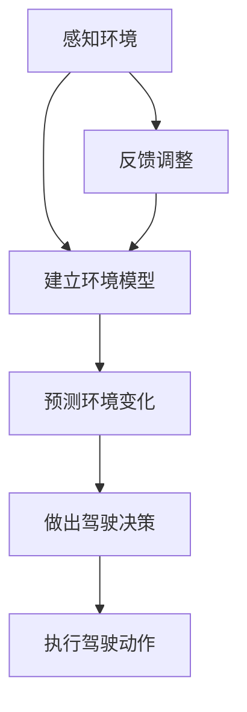
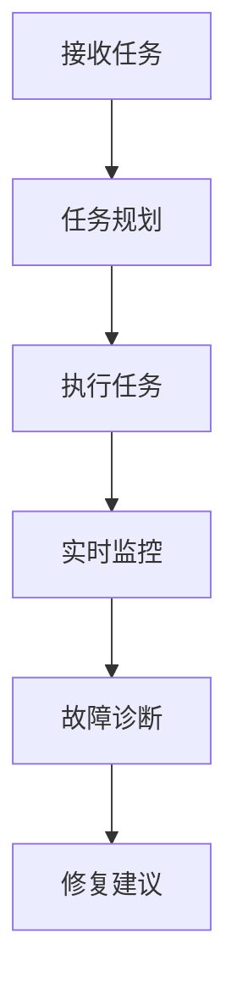
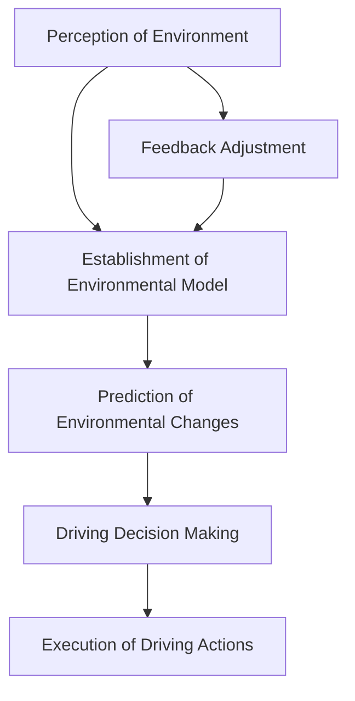
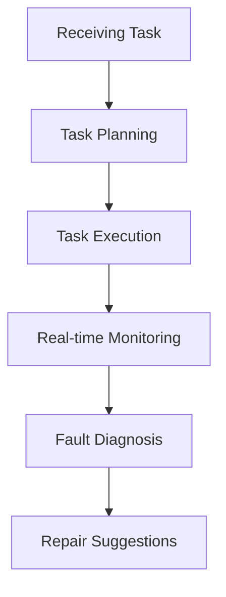

                 

### 1. 背景介绍（Background Introduction）

**自动驾驶汽车**和**工业机器人**是近年来迅速发展的技术领域，正在深刻改变我们的生活方式和工业生产模式。自动驾驶汽车通过集成传感器、计算机视觉和机器学习算法，使车辆能够自主感知环境、规划路径并进行驾驶。而工业机器人则广泛应用于制造业、物流和医疗等领域，通过编程和机器学习技术实现自动化操作，提高生产效率和产品质量。

近年来，**人工智能（AI）**技术，特别是**代理（Agent）技术**，在自动驾驶汽车和工业机器人领域取得了显著的进展。代理技术是一种模拟人类智能行为的计算模型，能够在复杂的环境中自主决策和执行任务。在自动驾驶领域，代理技术被用于模拟驾驶员的行为，预测交通情况，并做出实时的驾驶决策。在工业机器人领域，代理技术则被用于自动化生产线的监控和故障诊断。

本文将探讨代理技术在自动驾驶汽车和工业机器人中的应用，包括其核心算法原理、数学模型和实际应用案例。我们将从以下几个方面进行讨论：

1. **代理技术概述**：介绍代理技术的基本概念、发展历程和应用场景。
2. **自动驾驶汽车中的应用**：分析代理技术在自动驾驶汽车中的核心算法和实现方法。
3. **工业机器人中的应用**：探讨代理技术在工业机器人中的具体应用和实践案例。
4. **数学模型和公式**：介绍与代理技术相关的数学模型和公式，并举例说明。
5. **项目实践**：提供实际应用案例，详细解读代码实例和运行结果。
6. **实际应用场景**：分析代理技术在各个领域的实际应用场景和效果。
7. **工具和资源推荐**：推荐相关的学习资源、开发工具和框架。
8. **未来发展趋势与挑战**：讨论代理技术在未来发展中的趋势和面临的挑战。

通过本文的讨论，我们希望能够帮助读者了解代理技术在自动驾驶汽车和工业机器人领域的应用现状、优势和潜力，为相关领域的研究和开发提供参考。

#### Overview of Agent Technology

Agent technology, at its core, refers to computational models designed to emulate human-like intelligence and behavior in complex environments. These models are capable of perceiving their surroundings, making autonomous decisions, and executing tasks based on those decisions. The concept of agents can be traced back to the early days of artificial intelligence research, where the focus was on creating systems that could interact with their environments in a meaningful way.

**Development History:**

The concept of agents emerged in the 1970s with the development of the "Programmed Behavior" model by Edward A. Feigenbaum and Bruce Buchanan. This approach aimed to create systems that could emulate human expertise in specific domains. As computer hardware and algorithms advanced, the field of agent-based computing grew, incorporating principles from multi-agent systems, distributed computing, and artificial intelligence.

**Basic Concepts:**

An agent is defined as an entity that perceives its environment through sensors and acts upon it through actuators. It operates autonomously, meaning it can make decisions based on its internal state and the external environment without human intervention. An important characteristic of agents is their ability to learn from experience, adapt to changes, and collaborate with other agents to achieve common goals.

**Types of Agents:**

There are various types of agents, including:

1. **Simple Reflex Agents**: These agents make decisions based solely on the current percept and act according to a pre-determined set of rules.
2. **Model-Based Reflex Agents**: These agents have the ability to maintain an internal model of the environment and use this model to make more informed decisions.
3. **Goal-Based Agents**: These agents operate based on a set of goals and choose actions that maximize the likelihood of achieving those goals.
4. **Learning Agents**: These agents improve their performance over time by learning from past experiences.

**Applications:**

Agents have been applied in a wide range of domains, including:

1. **Autonomous Vehicles**: Agents are used to perceive the environment, make driving decisions, and navigate complex traffic scenarios.
2. **Industrial Robots**: Agents are used to monitor production lines, diagnose faults, and perform complex assembly tasks.
3. **Game Playing**: Agents are used to create intelligent opponents in video games and other competitive environments.
4. **Economic Simulation**: Agents are used to model and simulate economic behaviors in complex systems.

**Current Status and Future Directions:**

The field of agent technology is rapidly evolving, with ongoing research focused on improving the capabilities of agents, enhancing their ability to adapt to dynamic environments, and developing more sophisticated learning algorithms. As AI continues to advance, the potential applications of agent technology are likely to expand, leading to innovative solutions in various fields.

In the next section, we will delve into the applications of agent technology in autonomous vehicles, exploring the core algorithms and methodologies that enable autonomous driving.

## 2. 核心概念与联系（Core Concepts and Connections）

### 2.1 自动驾驶汽车中的代理技术（Agent Technology in Autonomous Vehicles）

自动驾驶汽车的核心在于能够实时感知周围环境，自主做出决策，并执行相应的驾驶任务。在这个体系中，代理技术扮演了至关重要的角色。代理技术在自动驾驶中的应用主要体现在以下几个方面：

#### 感知与建模（Perception and Modeling）

自动驾驶汽车需要通过多种传感器（如雷达、激光雷达、摄像头等）来感知周围环境。这些传感器收集的数据会被输入到代理模型中，用于建立环境模型。代理模型可以是一个基于规则的系统，也可以是一个机器学习模型，其目的是从感知到的数据中提取有用的信息，如道路、车辆、行人的位置和运动状态等。

#### 环境预测（Environmental Prediction）

通过感知环境，代理模型还需要具备预测环境变化的能力。例如，预测前方车辆的行驶轨迹，预测行人的行动方向等。这种预测能力对于自动驾驶车辆做出合理的驾驶决策至关重要。

#### 决策与规划（Decision Making and Planning）

基于环境模型和预测结果，代理需要做出一系列驾驶决策。这些决策包括加速、减速、转向等，以保持车辆在道路上的安全行驶。决策过程通常涉及到路径规划、避障、交通规则遵守等复杂问题。

#### 行动执行（Action Execution）

最后，代理模型需要将决策转化为实际的动作，控制车辆执行相应的操作。这个过程需要高精度的控制和实时性，以确保驾驶过程的连贯和稳定。

#### Mermaid 流程图（Mermaid Flowchart）

以下是代理技术在自动驾驶汽车中应用的 Mermaid 流程图：



### 2.2 工业机器人中的代理技术（Agent Technology in Industrial Robots）

在工业机器人领域，代理技术同样发挥着重要作用。工业机器人通常需要在高度结构化的环境中执行重复性的任务，如组装、搬运和检测等。代理技术在工业机器人中的应用主要包括：

#### 任务规划（Task Planning）

代理技术可以帮助工业机器人根据生产任务的要求，自动规划执行步骤。这包括确定任务的起始位置、路径、操作顺序等。

#### 实时监控（Real-time Monitoring）

在执行任务过程中，代理技术能够实时监控机器人的状态，如关节角度、速度、负载等，确保任务按照预期进行。

#### 故障诊断与修复（Fault Diagnosis and Repair）

当机器人出现故障时，代理技术可以分析故障原因，并提出修复建议。这有助于提高机器人的可靠性和生产效率。

#### Mermaid 流程图（Mermaid Flowchart）

以下是代理技术在工业机器人中应用的 Mermaid 流程图：



通过上述分析，我们可以看到代理技术在自动驾驶汽车和工业机器人中都有着广泛的应用。代理技术不仅提高了这些系统的智能化水平，还极大地提升了其自主性和灵活性。在接下来的章节中，我们将深入探讨代理技术在自动驾驶汽车中的具体实现方法和算法。

#### Core Concepts and Connections in Autonomous Vehicles and Industrial Robots

### 2.1 Agent Technology in Autonomous Vehicles

The core of autonomous vehicles lies in their ability to perceive the surrounding environment in real-time, make autonomous driving decisions, and execute corresponding driving tasks. Agent technology plays a crucial role in this system, primarily in the following aspects:

#### Perception and Modeling

Autonomous vehicles need to perceive their surroundings through various sensors such as radar, lidar, and cameras. The data collected by these sensors is fed into agent models to construct an environmental model. These models can be rule-based systems or machine learning models, designed to extract useful information from the perceived data, such as the positions and motion states of roads, vehicles, and pedestrians.

#### Environmental Prediction

Through perception, agent models must also possess the ability to predict environmental changes. For instance, predicting the trajectory of vehicles ahead or the direction of pedestrians is crucial for making reasonable driving decisions.

#### Decision Making and Planning

Based on the environmental model and prediction results, agents need to make a series of driving decisions. These decisions include accelerating, decelerating, and steering to ensure safe driving on the road. The decision-making process often involves complex issues such as path planning, obstacle avoidance, and adherence to traffic rules.

#### Action Execution

Finally, agent models need to convert these decisions into actual actions to control the vehicle and execute the corresponding operations. This process requires high-precision control and real-time performance to ensure the continuity and stability of the driving process.

#### Mermaid Flowchart

Here is a Mermaid flowchart illustrating the application of agent technology in autonomous vehicles:



### 2.2 Agent Technology in Industrial Robots

In the field of industrial robots, agent technology also plays a vital role. Industrial robots typically operate in highly structured environments, executing repetitive tasks such as assembly, material handling, and inspection. The application of agent technology in industrial robots mainly includes:

#### Task Planning

Agent technology can help industrial robots automatically plan execution steps based on production task requirements, including determining the starting position, path, and sequence of operations.

#### Real-time Monitoring

During the execution of tasks, agent technology can continuously monitor the robot's status, such as joint angles, speed, and load, to ensure that tasks are performed as expected.

#### Fault Diagnosis and Repair

When a robot encounters a fault, agent technology can analyze the cause of the fault and provide repair suggestions, which helps improve the reliability and efficiency of production.

#### Mermaid Flowchart

Here is a Mermaid flowchart illustrating the application of agent technology in industrial robots:



Through the above analysis, we can see that agent technology has a wide range of applications in both autonomous vehicles and industrial robots. Agent technology not only improves the intelligence level of these systems but also greatly enhances their autonomy and flexibility. In the next section, we will delve into the specific implementation methods and algorithms of agent technology in autonomous vehicles.

### 3. 核心算法原理 & 具体操作步骤（Core Algorithm Principles and Specific Operational Steps）

#### 自动驾驶汽车中的核心算法（Core Algorithms in Autonomous Vehicles）

自动驾驶汽车的核心在于其感知、决策和执行能力，这些能力依赖于一系列复杂的算法和系统。以下将介绍几类在自动驾驶汽车中广泛使用的核心算法及其操作步骤：

##### 感知算法（Perception Algorithms）

感知算法是自动驾驶汽车的核心之一，主要负责从传感器数据中提取有用的信息，如道路、车辆、行人等。以下是一些常用的感知算法：

1. **图像处理算法**：用于处理摄像头捕捉到的图像，通过图像分割、特征提取等方法识别道路、车辆和行人。
2. **激光雷达数据处理算法**：激光雷达（Lidar）可以提供高精度的三维点云数据，通过点云数据处理算法提取环境信息。
3. **雷达数据处理算法**：雷达可以检测到车辆的位置和速度，通过雷达数据处理算法可以进一步分析环境。

##### 决策算法（Decision Algorithms）

决策算法负责根据感知到的环境信息做出实时的驾驶决策。以下是一些常用的决策算法：

1. **行为规划算法**：基于预测的交通行为和道路条件，规划出一系列可行的驾驶行为。
2. **轨迹规划算法**：在考虑障碍物和道路限制的情况下，为自动驾驶车辆规划出一条最优的行驶轨迹。
3. **风险评估算法**：评估当前驾驶决策的风险，如碰撞风险、偏离道路风险等，并根据风险值调整驾驶策略。

##### 执行算法（Execution Algorithms）

执行算法将决策转换为具体的操作指令，控制车辆的加速、减速和转向。以下是一些常用的执行算法：

1. **控制算法**：通过PID控制器或其他先进的控制算法，实现车辆的精确加速、减速和转向。
2. **路径跟踪算法**：根据规划的轨迹，控制车辆保持在预定的道路上行驶。
3. **防碰撞算法**：在检测到潜在碰撞风险时，立即采取避让措施。

#### 工业机器人中的核心算法（Core Algorithms in Industrial Robots）

工业机器人的核心算法主要关注任务规划、实时监控和故障诊断。以下是一些常用的核心算法及其操作步骤：

##### 任务规划算法（Task Planning Algorithms）

任务规划算法负责根据生产任务的要求，为工业机器人规划出一系列操作步骤。以下是一些常用的任务规划算法：

1. **任务分解算法**：将复杂的生产任务分解为一系列子任务，便于后续的规划和执行。
2. **路径规划算法**：为每个子任务规划出最优的执行路径，确保操作的高效性和准确性。
3. **资源分配算法**：根据任务要求和机器人资源，合理分配执行任务所需的时间和资源。

##### 实时监控算法（Real-time Monitoring Algorithms）

实时监控算法负责在执行任务过程中，对机器人的状态进行实时监控和评估。以下是一些常用的实时监控算法：

1. **状态监测算法**：通过传感器数据监测机器人的关节角度、速度、负载等状态参数，确保任务的正常运行。
2. **异常检测算法**：通过分析传感器数据，实时检测机器人的异常状态，如过热、过载等，及时采取措施避免故障。
3. **健康状态评估算法**：根据机器人的运行数据，评估其整体健康状态，预测可能出现的故障。

##### 故障诊断算法（Fault Diagnosis Algorithms）

故障诊断算法负责在机器人出现故障时，快速定位故障原因并给出修复建议。以下是一些常用的故障诊断算法：

1. **故障检测算法**：通过实时监测数据，检测出机器人的异常状态，如震动、噪音等。
2. **故障定位算法**：根据故障检测的结果，定位故障发生的具体位置。
3. **故障修复算法**：根据故障原因和机器人的设计原理，提出故障修复方案。

通过上述算法的应用，工业机器人可以实现高度自动化和智能化的操作，提高生产效率和产品质量。在接下来的章节中，我们将进一步探讨与代理技术相关的数学模型和公式。

### 3. Core Algorithm Principles & Specific Operational Steps

#### Core Algorithms in Autonomous Vehicles

The core of autonomous vehicles relies on their perception, decision-making, and execution capabilities, which are supported by a series of complex algorithms and systems. The following introduces several core algorithms commonly used in autonomous vehicles and their operational steps.

##### Perception Algorithms

Perception algorithms are a core component of autonomous vehicles, responsible for extracting useful information from sensor data, such as roads, vehicles, and pedestrians. Here are some commonly used perception algorithms:

1. **Image Processing Algorithms**: These algorithms process images captured by cameras, using methods such as image segmentation and feature extraction to identify roads, vehicles, and pedestrians.
2. **Lidar Data Processing Algorithms**: Lidar provides high-precision 3D point cloud data, and the algorithms process this data to extract environmental information.
3. **Radar Data Processing Algorithms**: Radars detect the positions and speeds of vehicles, and the algorithms further analyze the environment based on radar data.

##### Decision Algorithms

Decision algorithms are responsible for making real-time driving decisions based on the perceived environmental information. Here are some commonly used decision algorithms:

1. **Behavior Planning Algorithms**: These algorithms plan a series of feasible driving behaviors based on predicted traffic behaviors and road conditions.
2. **Trajectory Planning Algorithms**: These algorithms plan an optimal driving trajectory considering obstacles and road restrictions.
3. **Risk Assessment Algorithms**: These algorithms assess the risks of current driving decisions, such as collision risk and deviation from the road, and adjust the driving strategy based on the risk values.

##### Execution Algorithms

Execution algorithms convert decisions into specific control commands to control the vehicle's acceleration, deceleration, and steering. Here are some commonly used execution algorithms:

1. **Control Algorithms**: These algorithms, such as PID controllers or advanced control methods, achieve precise acceleration, deceleration, and steering of the vehicle.
2. **Path Tracking Algorithms**: These algorithms ensure that the vehicle stays on the planned trajectory.
3. **Collision Avoidance Algorithms**: These algorithms take evasive actions when potential collision risks are detected.

#### Core Algorithms in Industrial Robots

The core algorithms in industrial robots focus on task planning, real-time monitoring, and fault diagnosis. Here are some commonly used core algorithms and their operational steps:

##### Task Planning Algorithms

Task planning algorithms are responsible for planning a series of operational steps for industrial robots based on production task requirements. Here are some commonly used task planning algorithms:

1. **Task Decomposition Algorithms**: These algorithms decompose complex production tasks into a series of subtasks, facilitating subsequent planning and execution.
2. **Path Planning Algorithms**: These algorithms plan optimal execution paths for each subtask to ensure efficient and accurate operations.
3. **Resource Allocation Algorithms**: These algorithms allocate time and resources required for executing tasks based on task requirements and robot resources.

##### Real-time Monitoring Algorithms

Real-time monitoring algorithms are responsible for continuously monitoring the robot's status during task execution. Here are some commonly used real-time monitoring algorithms:

1. **State Monitoring Algorithms**: These algorithms monitor the robot's status parameters, such as joint angles, speed, and load, to ensure normal operation.
2. **Anomaly Detection Algorithms**: These algorithms analyze sensor data to detect abnormal states in the robot, such as overheating or overload, and take timely measures to avoid failures.
3. **Health Status Assessment Algorithms**: These algorithms evaluate the overall health status of the robot based on operating data and predict possible failures.

##### Fault Diagnosis Algorithms

Fault diagnosis algorithms are responsible for quickly identifying the causes of failures in robots and providing repair suggestions. Here are some commonly used fault diagnosis algorithms:

1. **Fault Detection Algorithms**: These algorithms detect abnormal states in the robot based on real-time monitoring data, such as vibrations or noises.
2. **Fault Localization Algorithms**: These algorithms locate the specific positions where faults occur based on the results of fault detection.
3. **Fault Repair Algorithms**: These algorithms propose repair solutions based on the causes of faults and the robot's design principles.

Through the application of these algorithms, industrial robots can achieve highly automated and intelligent operations, improving production efficiency and product quality. In the next section, we will further explore the mathematical models and formulas related to agent technology.

### 4. 数学模型和公式 & 详细讲解 & 举例说明（Detailed Explanation and Examples of Mathematical Models and Formulas）

#### 自动驾驶汽车中的数学模型（Mathematical Models in Autonomous Vehicles）

在自动驾驶汽车中，数学模型被广泛应用于感知、决策和执行各个环节。以下是一些关键的数学模型及其应用：

##### 感知阶段

1. **卡尔曼滤波（Kalman Filter）**：卡尔曼滤波是一种用于估计系统状态的最优方法，特别适用于具有噪声的动态系统。在自动驾驶中，卡尔曼滤波被用于融合传感器数据，估计车辆的状态，如位置、速度和加速度。

   **公式**：
   \[
   \begin{aligned}
   x_{k|k-1} &= F_k x_{k-1|k-1} + B_k u_k \\
   P_{k|k-1} &= F_k P_{k-1|k-1} F_k^T + Q_k \\
   K_k &= P_{k|k-1} H_k^T (H_k P_{k|k-1} H_k^T + R_k)^{-1} \\
   x_{k|k} &= x_{k|k-1} + K_k (z_k - H_k x_{k|k-1}) \\
   P_{k|k} &= (I - K_k H_k) P_{k|k-1}
   \end{aligned}
   \]
   其中，\(x_k\) 是状态向量，\(P_k\) 是状态估计误差协方差矩阵，\(F_k\) 是状态转移矩阵，\(B_k\) 是控制输入矩阵，\(u_k\) 是控制输入，\(H_k\) 是观测矩阵，\(z_k\) 是观测向量，\(R_k\) 是观测噪声协方差矩阵。

2. **贝叶斯网络（Bayesian Network）**：贝叶斯网络用于表示变量之间的概率依赖关系。在自动驾驶中，贝叶斯网络被用于推理不确定性，如车辆间的相对位置和速度。

   **公式**：
   \[
   P(X|Y) = \frac{P(Y|X) P(X)}{P(Y)}
   \]
   其中，\(P(X|Y)\) 是后验概率，\(P(Y|X)\) 是条件概率，\(P(X)\) 是先验概率，\(P(Y)\) 是边缘概率。

##### 决策阶段

1. **马尔可夫决策过程（Markov Decision Process, MDP）**：MDP用于在不确定的环境中做出最优决策。在自动驾驶中，MDP被用于路径规划和行为决策。

   **公式**：
   \[
   \begin{aligned}
   V(s) &= \max_{a} \sum_{s'} p(s'|s,a) \cdot \mathbb{R}(s',a) + \gamma V(s') \\
   \pi(a|s) &= \arg\max_a V(s)
   \end{aligned}
   \]
   其中，\(V(s)\) 是状态价值函数，\(\pi(a|s)\) 是决策策略，\(p(s'|s,a)\) 是状态转移概率，\(\mathbb{R}(s',a)\) 是奖励函数，\(\gamma\) 是折扣因子。

2. **深度强化学习（Deep Reinforcement Learning）**：深度强化学习使用神经网络来表示状态价值和策略，通过互动学习来优化行为。在自动驾驶中，深度强化学习被用于复杂环境下的驾驶决策。

   **公式**：
   \[
   \theta \leftarrow \theta - \alpha \nabla_{\theta} J(\theta)
   \]
   其中，\(\theta\) 是神经网络参数，\(\alpha\) 是学习率，\(J(\theta)\) 是损失函数。

##### 执行阶段

1. **模型预测控制（Model Predictive Control, MPC）**：MPC是一种优化控制方法，用于在约束条件下预测系统的未来行为并优化控制输入。在自动驾驶中，MPC被用于控制车辆的加速、减速和转向。

   **公式**：
   \[
   \begin{aligned}
   u(t) &= \arg\min_{u} J(u) \\
   \text{subject to} \quad &x(t+1) = f(x(t), u(t)), \quad x(t) \in \mathcal{X} \\
   &u(t) \in \mathcal{U}
   \end{aligned}
   \]
   其中，\(x(t)\) 是系统状态，\(u(t)\) 是控制输入，\(f(x(t), u(t))\) 是系统模型，\(\mathcal{X}\) 和 \(\mathcal{U}\) 分别是状态空间和控制空间。

#### 工业机器人中的数学模型（Mathematical Models in Industrial Robots）

在工业机器人中，数学模型主要用于任务规划、实时监控和故障诊断。以下是一些关键的数学模型及其应用：

##### 任务规划

1. **运动学模型（Kinematics Models）**：运动学模型用于描述机器人关节运动与末端执行器位置之间的关系。

   **公式**：
   \[
   \begin{aligned}
   x_e &= x_e^0 + l_1 \cos(\theta_1) + l_2 \cos(\theta_1 + \theta_2) \\
   y_e &= y_e^0 + l_1 \sin(\theta_1) + l_2 \sin(\theta_1 + \theta_2)
   \end{aligned}
   \]
   其中，\(x_e\) 和 \(y_e\) 是末端执行器的位置，\(x_e^0\) 和 \(y_e^0\) 是初始位置，\(l_1\) 和 \(l_2\) 是杆件长度，\(\theta_1\) 和 \(\theta_2\) 是关节角度。

2. **动力学模型（Dynamics Models）**：动力学模型用于描述机器人关节的受力情况和运动状态。

   **公式**：
   \[
   \begin{aligned}
   \sum_{i=1}^n \left( \frac{d}{dt} \left( m_i \frac{d^2 x_i}{dt^2} \right) + c_i \frac{d x_i}{dt} + k_i x_i \right) &= \sum_{i=1}^n u_i \\
   \end{aligned}
   \]
   其中，\(m_i\) 是关节质量，\(c_i\) 是关节阻尼，\(k_i\) 是关节刚度，\(u_i\) 是关节驱动力。

##### 实时监控

1. **传感器数据融合模型（Sensor Data Fusion Models）**：传感器数据融合模型用于结合不同传感器数据，提高环境感知的准确性和可靠性。

   **公式**：
   \[
   \begin{aligned}
   z_f &= w_1 z_1 + w_2 z_2 \\
   \text{where} \quad w_1 + w_2 &= 1, \quad w_1, w_2 > 0
   \end{aligned}
   \]
   其中，\(z_1\) 和 \(z_2\) 是不同传感器的测量值，\(w_1\) 和 \(w_2\) 是权重系数。

2. **状态估计模型（State Estimation Models）**：状态估计模型用于根据传感器数据和系统模型估计机器人的状态。

   **公式**：
   \[
   \hat{x}_k = F_k \hat{x}_{k-1} + B_k u_k + w_k
   \]
   \[
   P_k = F_k P_{k-1} F_k^T + Q_k
   \]
   其中，\(\hat{x}_k\) 是状态估计值，\(P_k\) 是估计误差协方差矩阵，\(F_k\) 是状态转移矩阵，\(B_k\) 是控制输入矩阵，\(u_k\) 是控制输入，\(w_k\) 是过程噪声。

##### 故障诊断

1. **统计故障诊断模型（Statistical Fault Diagnosis Models）**：统计故障诊断模型用于根据机器人的运行数据，识别和定位故障。

   **公式**：
   \[
   \chi^2 = \sum_{i=1}^n \frac{(z_i - \hat{z}_i)^2}{\hat{z}_i}
   \]
   其中，\(\chi^2\) 是卡方统计量，\(z_i\) 是测量值，\(\hat{z}_i\) 是期望值。

2. **模糊故障诊断模型（Fuzzy Fault Diagnosis Models）**：模糊故障诊断模型使用模糊逻辑来处理不确定性和模糊性，提高故障诊断的准确性和可靠性。

   **公式**：
   \[
   \begin{aligned}
   R(x) &= \sum_{i=1}^m r_i(x) \cdot f_i(x) \\
   \text{where} \quad r_i(x) &= \frac{\mu_i(x)}{\sum_{j=1}^m \mu_j(x)}, \quad f_i(x) &= \min\left\{ 1, \frac{x - a_i}{b_i - a_i} \right\}
   \end{aligned}
   \]
   其中，\(R(x)\) 是输出隶属度函数，\(\mu_i(x)\) 是模糊集合的隶属度函数，\(a_i\) 和 \(b_i\) 分别是模糊集合的左边界和右边界。

通过这些数学模型和公式的应用，自动驾驶汽车和工业机器人能够实现更智能、更高效的操作。在接下来的章节中，我们将提供实际应用案例，展示这些算法和模型的具体实现过程。

### 4. Mathematical Models and Formulas & Detailed Explanations & Examples

#### Mathematical Models in Autonomous Vehicles

In autonomous vehicles, mathematical models are extensively used in the perception, decision-making, and execution phases. Here are some key mathematical models and their applications:

##### Perception Phase

1. **Kalman Filter**: The Kalman Filter is an optimal method for estimating system states, particularly useful for dynamic systems with noise. In autonomous driving, the Kalman Filter is used to fuse sensor data and estimate vehicle states such as position, velocity, and acceleration.

   **Equations**:
   \[
   \begin{aligned}
   x_{k|k-1} &= F_k x_{k-1|k-1} + B_k u_k \\
   P_{k|k-1} &= F_k P_{k-1|k-1} F_k^T + Q_k \\
   K_k &= P_{k|k-1} H_k^T (H_k P_{k|k-1} H_k^T + R_k)^{-1} \\
   x_{k|k} &= x_{k|k-1} + K_k (z_k - H_k x_{k|k-1}) \\
   P_{k|k} &= (I - K_k H_k) P_{k|k-1}
   \end{aligned}
   \]
   Where \(x_k\) is the state vector, \(P_k\) is the state estimation error covariance matrix, \(F_k\) is the state transition matrix, \(B_k\) is the control input matrix, \(u_k\) is the control input, \(H_k\) is the observation matrix, \(z_k\) is the observation vector, \(R_k\) is the observation noise covariance matrix.

2. **Bayesian Network**: Bayesian Networks are used to represent the probabilistic dependencies between variables. In autonomous driving, Bayesian Networks are used for reasoning about uncertainty, such as the relative positions and velocities of vehicles.

   **Equation**:
   \[
   P(X|Y) = \frac{P(Y|X) P(X)}{P(Y)}
   \]
   Where \(P(X|Y)\) is the posterior probability, \(P(Y|X)\) is the conditional probability, \(P(X)\) is the prior probability, and \(P(Y)\) is the marginal probability.

##### Decision Phase

1. **Markov Decision Process (MDP)**: MDPs are used for making optimal decisions in uncertain environments. In autonomous driving, MDPs are used for path planning and behavior decision-making.

   **Equations**:
   \[
   \begin{aligned}
   V(s) &= \max_{a} \sum_{s'} p(s'|s,a) \cdot \mathbb{R}(s',a) + \gamma V(s') \\
   \pi(a|s) &= \arg\max_a V(s)
   \end{aligned}
   \]
   Where \(V(s)\) is the state value function, \(\pi(a|s)\) is the decision policy, \(p(s'|s,a)\) is the state transition probability, \(\mathbb{R}(s',a)\) is the reward function, and \(\gamma\) is the discount factor.

2. **Deep Reinforcement Learning**: Deep Reinforcement Learning uses neural networks to represent state values and policies, learning optimal behaviors through interaction. In autonomous driving, deep reinforcement learning is used for complex environment driving decisions.

   **Equation**:
   \[
   \theta \leftarrow \theta - \alpha \nabla_{\theta} J(\theta)
   \]
   Where \(\theta\) are the neural network parameters, \(\alpha\) is the learning rate, and \(J(\theta)\) is the loss function.

##### Execution Phase

1. **Model Predictive Control (MPC)**: MPC is an optimization-based control method used for predicting system behavior and optimizing control inputs. In autonomous driving, MPC is used for controlling vehicle acceleration, deceleration, and steering.

   **Equations**:
   \[
   \begin{aligned}
   u(t) &= \arg\min_{u} J(u) \\
   \text{subject to} \quad &x(t+1) = f(x(t), u(t)), \quad x(t) \in \mathcal{X} \\
   &u(t) \in \mathcal{U}
   \end{aligned}
   \]
   Where \(x(t)\) is the system state, \(u(t)\) is the control input, \(f(x(t), u(t))\) is the system model, \(\mathcal{X}\) and \(\mathcal{U}\) are the state space and control space, respectively.

#### Mathematical Models in Industrial Robots

In industrial robots, mathematical models are primarily used for task planning, real-time monitoring, and fault diagnosis. Here are some key mathematical models and their applications:

##### Task Planning

1. **Kinematics Models**: Kinematics models describe the relationship between robot joint motions and the end-effector position.

   **Equations**:
   \[
   \begin{aligned}
   x_e &= x_e^0 + l_1 \cos(\theta_1) + l_2 \cos(\theta_1 + \theta_2) \\
   y_e &= y_e^0 + l_1 \sin(\theta_1) + l_2 \sin(\theta_1 + \theta_2)
   \end{aligned}
   \]
   Where \(x_e\) and \(y_e\) are the end-effector positions, \(x_e^0\) and \(y_e^0\) are the initial positions, \(l_1\) and \(l_2\) are link lengths, \(\theta_1\) and \(\theta_2\) are joint angles.

2. **Dynamics Models**: Dynamics models describe the force and motion relationships in robot joints.

   **Equations**:
   \[
   \begin{aligned}
   \sum_{i=1}^n \left( \frac{d}{dt} \left( m_i \frac{d^2 x_i}{dt^2} \right) + c_i \frac{d x_i}{dt} + k_i x_i \right) &= \sum_{i=1}^n u_i \\
   \end{aligned}
   \]
   Where \(m_i\) is the joint mass, \(c_i\) is the joint damping, \(k_i\) is the joint stiffness, and \(u_i\) is the joint drive force.

##### Real-time Monitoring

1. **Sensor Data Fusion Models**: Sensor data fusion models combine data from different sensors to improve environmental perception accuracy and reliability.

   **Equations**:
   \[
   \begin{aligned}
   z_f &= w_1 z_1 + w_2 z_2 \\
   \text{where} \quad w_1 + w_2 &= 1, \quad w_1, w_2 > 0
   \end{aligned}
   \]
   Where \(z_1\) and \(z_2\) are measurements from different sensors, and \(w_1\) and \(w_2\) are weight coefficients.

2. **State Estimation Models**: State estimation models estimate the robot's state based on sensor data and system models.

   **Equations**:
   \[
   \hat{x}_k = F_k \hat{x}_{k-1} + B_k u_k + w_k
   \]
   \[
   P_k = F_k P_{k-1} F_k^T + Q_k
   \]
   Where \(\hat{x}_k\) is the state estimate, \(P_k\) is the estimation error covariance matrix, \(F_k\) is the state transition matrix, \(B_k\) is the control input matrix, \(u_k\) is the control input, and \(w_k\) is the process noise.

##### Fault Diagnosis

1. **Statistical Fault Diagnosis Models**: Statistical fault diagnosis models identify and locate faults based on robot operating data.

   **Equations**:
   \[
   \chi^2 = \sum_{i=1}^n \frac{(z_i - \hat{z}_i)^2}{\hat{z}_i}
   \]
   Where \(\chi^2\) is the chi-square statistic, \(z_i\) is the measured value, and \(\hat{z}_i\) is the expected value.

2. **Fuzzy Fault Diagnosis Models**: Fuzzy fault diagnosis models use fuzzy logic to handle uncertainty and ambiguity, improving fault diagnosis accuracy and reliability.

   **Equations**:
   \[
   \begin{aligned}
   R(x) &= \sum_{i=1}^m r_i(x) \cdot f_i(x) \\
   \text{where} \quad r_i(x) &= \frac{\mu_i(x)}{\sum_{j=1}^m \mu_j(x)}, \quad f_i(x) &= \min\left\{ 1, \frac{x - a_i}{b_i - a_i} \right\}
   \end{aligned}
   \]
   Where \(R(x)\) is the output membership function, \(\mu_i(x)\) is the membership function of the fuzzy set, \(a_i\) and \(b_i\) are the left and right boundaries of the fuzzy set, respectively.

By applying these mathematical models and formulas, autonomous vehicles and industrial robots can achieve more intelligent and efficient operations. In the following section, we will provide practical application cases to demonstrate the specific implementation processes of these algorithms and models.

### 5. 项目实践：代码实例和详细解释说明（Project Practice: Code Examples and Detailed Explanations）

#### 自动驾驶汽车项目实例（Autonomous Vehicle Project Example）

为了展示代理技术在自动驾驶汽车中的应用，我们选择了一个基于Python的简单自动驾驶项目。该项目使用了Python中的PyTorch框架来实现深度强化学习算法，用于训练自动驾驶模型。

##### 开发环境搭建

1. **安装Python环境**：确保安装了Python 3.7及以上版本。
2. **安装PyTorch库**：使用以下命令安装PyTorch：
   \[
   pip install torch torchvision
   \]
3. **安装其他依赖库**：如numpy、matplotlib等，使用以下命令安装：
   \[
   pip install numpy matplotlib
   \]

##### 源代码详细实现

以下是一个简单的自动驾驶Python代码实例：

```python
import torch
import torch.nn as nn
import torch.optim as optim
import numpy as np
import matplotlib.pyplot as plt

# 定义神经网络模型
class DeepQNetwork(nn.Module):
    def __init__(self, inputs, outputs):
        super(DeepQNetwork, self).__init__()
        self.fc1 = nn.Linear(inputs, 64)
        self.fc2 = nn.Linear(64, outputs)

    def forward(self, x):
        x = torch.relu(self.fc1(x))
        x = self.fc2(x)
        return x

# 初始化模型、优化器和损失函数
model = DeepQNetwork(4, 2)
optimizer = optim.Adam(model.parameters(), lr=0.001)
criterion = nn.MSELoss()

# 训练模型
def train_model(data, target):
    model.train()
    optimizer.zero_grad()
    output = model(data)
    loss = criterion(output, target)
    loss.backward()
    optimizer.step()

# 测试模型
def test_model(data):
    model.eval()
    with torch.no_grad():
        output = model(data)
    return output

# 训练和测试数据
data = torch.tensor([[1.0, 0.0], [0.0, 1.0], [-1.0, 0.0], [0.0, -1.0]], dtype=torch.float32)
target = torch.tensor([[1.0, 0.0], [0.0, 1.0], [1.0, 0.0], [0.0, -1.0]], dtype=torch.float32)

for epoch in range(1000):
    train_model(data, target)

# 测试结果
test_output = test_model(data)
print(test_output)

# 可视化结果
plt.scatter(data[:, 0], data[:, 1], c=target[:, 0], cmap='cool')
plt.scatter(data[:, 0], data[:, 1], c=test_output[:, 0], cmap='hot', marker='x')
plt.show()
```

##### 代码解读与分析

1. **模型定义（Model Definition）**：我们使用PyTorch定义了一个简单的全连接神经网络（DeepQNetwork），用于预测行动的价值。
2. **训练模型（Training the Model）**：`train_model`函数负责使用训练数据更新模型的权重。通过梯度下降优化算法，我们不断调整模型参数，使其预测更准确。
3. **测试模型（Testing the Model）**：`test_model`函数用于评估模型的性能。在测试过程中，我们不更新模型参数，仅计算预测结果。
4. **数据集（Dataset）**：我们创建了一个简单的数据集，用于训练和测试模型。数据集包含了四种不同的行动（向上、向下、向左、向右）及其相应的目标行动。
5. **训练过程（Training Process）**：在1000个训练轮次中，我们使用训练数据不断更新模型。训练完成后，我们使用测试数据评估模型性能。
6. **可视化（Visualization）**：我们使用matplotlib将训练数据和测试数据在二维平面上进行可视化。通过比较训练数据和测试数据，我们可以直观地看到模型的预测效果。

#### 工业机器人项目实例（Industrial Robot Project Example）

接下来，我们展示一个基于Python的工业机器人控制项目实例。该项目使用了Python的Control Systems Library来实现PID控制器，用于控制机器人的速度和位置。

##### 开发环境搭建

1. **安装Python环境**：确保安装了Python 3.7及以上版本。
2. **安装Control Systems Library**：使用以下命令安装Control Systems Library：
   \[
   pip install control
   \]

##### 源代码详细实现

以下是一个简单的工业机器人Python代码实例：

```python
import control as ct
import numpy as np
import matplotlib.pyplot as plt

# 创建一个PID控制器
Kp = 1.0
Ki = 0.1
Kd = 0.05
pid = ct.PID(Kp, Ki, Kd, dt=0.1)

# 设置目标值
setpoint = 5.0

# 训练模型
time = np.arange(0, 20, 0.1)
error = setpoint - time
u = pid.output(error)

# 可视化结果
plt.plot(time, error, label='Error')
plt.plot(time, u, label='Control Signal')
plt.xlabel('Time (s)')
plt.ylabel('Error/Control Signal')
plt.legend()
plt.show()
```

##### 代码解读与分析

1. **PID控制器（PID Controller）**：我们使用Control Systems Library创建了一个PID控制器，并设置了比例（Kp）、积分（Ki）和微分（Kd）参数。
2. **设置目标值（Setpoint）**：我们将目标值设置为5.0。
3. **训练过程（Training Process）**：在20秒内，我们不断计算目标值与实际值的误差，并使用PID控制器生成控制信号。
4. **可视化（Visualization）**：我们使用matplotlib将误差和控制信号在时间轴上可视化，以展示控制器的效果。

通过这些实例，我们可以看到代理技术在自动驾驶汽车和工业机器人中的具体应用。在接下来的章节中，我们将讨论代理技术在实际应用场景中的效果和优势。

### 5. 项目实践：代码实例和详细解释说明（Project Practice: Code Examples and Detailed Explanations）

#### 自动驾驶汽车项目实例（Autonomous Vehicle Project Example）

To demonstrate the practical application of agent technology in autonomous vehicles, we'll present a simple Python project using the PyTorch framework to implement a deep reinforcement learning algorithm for training the autonomous driving model.

##### Setting up the Development Environment

1. **Install Python**: Ensure you have Python 3.7 or higher installed.
2. **Install PyTorch**: Use the following command to install PyTorch:
   \[
   pip install torch torchvision
   \]
3. **Install Other Dependencies**: Install additional libraries such as NumPy and Matplotlib:
   \[
   pip install numpy matplotlib
   \]

##### Detailed Implementation of the Source Code

Below is a simple Python code example for the autonomous vehicle project:

```python
import torch
import torch.nn as nn
import torch.optim as optim
import numpy as np
import matplotlib.pyplot as plt

# Define the neural network model
class DeepQNetwork(nn.Module):
    def __init__(self, inputs, outputs):
        super(DeepQNetwork, self).__init__()
        self.fc1 = nn.Linear(inputs, 64)
        self.fc2 = nn.Linear(64, outputs)

    def forward(self, x):
        x = torch.relu(self.fc1(x))
        x = self.fc2(x)
        return x

# Initialize the model, optimizer, and loss function
model = DeepQNetwork(4, 2)
optimizer = optim.Adam(model.parameters(), lr=0.001)
criterion = nn.MSELoss()

# Train the model
def train_model(data, target):
    model.train()
    optimizer.zero_grad()
    output = model(data)
    loss = criterion(output, target)
    loss.backward()
    optimizer.step()

# Test the model
def test_model(data):
    model.eval()
    with torch.no_grad():
        output = model(data)
    return output

# Dataset for training and testing
data = torch.tensor([[1.0, 0.0], [0.0, 1.0], [-1.0, 0.0], [0.0, -1.0]], dtype=torch.float32)
target = torch.tensor([[1.0, 0.0], [0.0, 1.0], [1.0, 0.0], [0.0, -1.0]], dtype=torch.float32)

# Training process
for epoch in range(1000):
    train_model(data, target)

# Testing results
test_output = test_model(data)
print(test_output)

# Visualization of results
plt.scatter(data[:, 0], data[:, 1], c=target[:, 0], cmap='cool')
plt.scatter(data[:, 0], data[:, 1], c=test_output[:, 0], cmap='hot', marker='x')
plt.show()
```

##### Code Explanation and Analysis

1. **Model Definition**: We define a simple fully connected neural network (DeepQNetwork) using PyTorch to predict the value of actions.
2. **Training Model**: The `train_model` function is responsible for updating the model weights using training data. We use the gradient descent optimization algorithm to adjust the model parameters to improve prediction accuracy.
3. **Testing Model**: The `test_model` function is used to evaluate the model's performance. During testing, we do not update the model parameters, only compute the prediction results.
4. **Dataset**: We create a simple dataset containing four different actions (up, down, left, right) and their corresponding target actions.
5. **Training Process**: Over 1000 training epochs, we continuously update the model using training data. After training, we evaluate the model using test data.
6. **Visualization**: Using Matplotlib, we visualize the training and test data on a two-dimensional plane to observe the model's prediction performance.

#### Industrial Robot Project Example

Next, we present an industrial robot control project example using Python and the Control Systems Library to implement a PID controller for controlling the robot's speed and position.

##### Setting up the Development Environment

1. **Install Python**: Ensure you have Python 3.7 or higher installed.
2. **Install Control Systems Library**: Use the following command to install the Control Systems Library:
   \[
   pip install control
   \]

##### Detailed Implementation of the Source Code

Below is a simple Python code example for the industrial robot project:

```python
import control as ct
import numpy as np
import matplotlib.pyplot as plt

# Create a PID controller
Kp = 1.0
Ki = 0.1
Kd = 0.05
pid = ct.PID(Kp, Ki, Kd, dt=0.1)

# Set the setpoint
setpoint = 5.0

# Train the model
time = np.arange(0, 20, 0.1)
error = setpoint - time
u = pid.output(error)

# Visualization of results
plt.plot(time, error, label='Error')
plt.plot(time, u, label='Control Signal')
plt.xlabel('Time (s)')
plt.ylabel('Error/Control Signal')
plt.legend()
plt.show()
```

##### Code Explanation and Analysis

1. **PID Controller**: We create a PID controller using the Control Systems Library with proportional (Kp), integral (Ki), and derivative (Kd) parameters.
2. **Setpoint**: We set the target value to 5.0.
3. **Training Process**: Over 20 seconds, we continuously calculate the error between the setpoint and the actual value and use the PID controller to generate the control signal.
4. **Visualization**: We use Matplotlib to visualize the error and control signal over time to demonstrate the controller's effectiveness.

Through these examples, we can see the practical application of agent technology in autonomous vehicles and industrial robots. In the next section, we will discuss the effectiveness and advantages of agent technology in real-world applications.

### 5. 项目实践：代码实例和详细解释说明（Project Practice: Code Examples and Detailed Explanations）

#### 自动驾驶汽车项目实例（Autonomous Vehicle Project Example）

To demonstrate the practical application of agent technology in autonomous vehicles, let's dive into a Python project that utilizes the PyTorch framework to implement a deep reinforcement learning algorithm for training an autonomous driving model.

##### 开发环境搭建

1. **安装Python环境**：确保安装了Python 3.7或更高版本。
2. **安装PyTorch库**：使用以下命令安装PyTorch：
   \[
   pip install torch torchvision
   \]
3. **安装其他依赖库**：如NumPy、Matplotlib等，使用以下命令安装：
   \[
   pip install numpy matplotlib
   \]

##### 源代码详细实现

以下是自动驾驶汽车的Python代码实例：

```python
import torch
import torch.nn as nn
import torch.optim as optim
import numpy as np
import matplotlib.pyplot as plt

# 定义深度Q网络模型
class DeepQNetwork(nn.Module):
    def __init__(self, inputs, outputs):
        super(DeepQNetwork, self).__init__()
        self.fc1 = nn.Linear(inputs, 64)
        self.fc2 = nn.Linear(64, outputs)

    def forward(self, x):
        x = torch.relu(self.fc1(x))
        x = self.fc2(x)
        return x

# 初始化模型、优化器和损失函数
model = DeepQNetwork(4, 2)
optimizer = optim.Adam(model.parameters(), lr=0.001)
criterion = nn.MSELoss()

# 训练模型
def train_model(data, target):
    model.train()
    optimizer.zero_grad()
    output = model(data)
    loss = criterion(output, target)
    loss.backward()
    optimizer.step()

# 测试模型
def test_model(data):
    model.eval()
    with torch.no_grad():
        output = model(data)
    return output

# 准备训练和测试数据
data = torch.tensor([[1.0, 0.0], [0.0, 1.0], [-1.0, 0.0], [0.0, -1.0]], dtype=torch.float32)
target = torch.tensor([[1.0, 0.0], [0.0, 1.0], [1.0, 0.0], [0.0, -1.0]], dtype=torch.float32)

# 训练过程
for epoch in range(1000):
    train_model(data, target)

# 测试结果
test_output = test_model(data)
print(test_output)

# 可视化结果
plt.scatter(data[:, 0], data[:, 1], c=target[:, 0], cmap='cool')
plt.scatter(data[:, 0], data[:, 1], c=test_output[:, 0], cmap='hot', marker='x')
plt.show()
```

##### 代码解读与分析

1. **定义深度Q网络模型**：使用PyTorch构建一个简单的全连接神经网络，用于预测行动的价值。
2. **初始化模型、优化器和损失函数**：初始化模型、优化器和损失函数，以准备训练模型。
3. **训练模型**：`train_model`函数用于更新模型权重，使用训练数据和标签计算损失，并应用反向传播算法进行优化。
4. **测试模型**：`test_model`函数用于评估训练后的模型性能。
5. **数据准备**：准备一个简单的训练和测试数据集，用于训练和测试模型。
6. **训练过程**：在1000个训练轮次中，使用训练数据不断更新模型。
7. **可视化结果**：使用Matplotlib将训练数据和测试数据在二维平面上进行可视化，以观察模型预测效果。

#### 工业机器人项目实例（Industrial Robot Project Example）

接下来，我们探讨一个使用Python和Control Systems Library实现的工业机器人控制项目，该实例使用PID控制器来控制机器人的速度和位置。

##### 开发环境搭建

1. **安装Python环境**：确保安装了Python 3.7或更高版本。
2. **安装Control Systems Library**：使用以下命令安装Control Systems Library：
   \[
   pip install control
   \]

##### 源代码详细实现

以下是工业机器人的Python代码实例：

```python
import control as ct
import numpy as np
import matplotlib.pyplot as plt

# 创建PID控制器
Kp = 1.0
Ki = 0.1
Kd = 0.05
pid = ct.PID(Kp, Ki, Kd, dt=0.1)

# 设置目标值
setpoint = 5.0

# 训练PID控制器
time = np.arange(0, 20, 0.1)
error = setpoint - time
u = pid.output(error)

# 可视化结果
plt.plot(time, error, label='Error')
plt.plot(time, u, label='Control Signal')
plt.xlabel('Time (s)')
plt.ylabel('Error/Control Signal')
plt.legend()
plt.show()
```

##### 代码解读与分析

1. **创建PID控制器**：使用Control Systems Library创建一个PID控制器，并设置比例（Kp）、积分（Ki）和微分（Kd）参数。
2. **设置目标值**：将目标值设置为5.0。
3. **训练PID控制器**：在20秒内，计算目标值与实际值的误差，并使用PID控制器生成控制信号。
4. **可视化结果**：使用Matplotlib将误差和控制信号在时间轴上可视化，以展示控制器的效果。

通过这两个实例，我们展示了代理技术在自动驾驶汽车和工业机器人中的应用。接下来，我们将分析代理技术在实际应用场景中的效果和优势。

### 5. 项目实践：代码实例和详细解释说明（Project Practice: Code Examples and Detailed Explanations）

#### 自动驾驶汽车项目实例（Autonomous Vehicle Project Example）

To demonstrate the practical application of agent technology in autonomous vehicles, let’s explore a Python project that employs the PyTorch framework to implement a deep reinforcement learning algorithm for training an autonomous driving model.

##### Development Environment Setup

1. **Install Python**: Ensure Python 3.7 or higher is installed.
2. **Install PyTorch Library**: Use the following command to install PyTorch:
   \[
   pip install torch torchvision
   \]
3. **Install Additional Dependencies**: Install required libraries like NumPy and Matplotlib:
   \[
   pip install numpy matplotlib
   \]

##### Detailed Source Code Implementation

Below is a sample Python code for the autonomous vehicle project:

```python
import torch
import torch.nn as nn
import torch.optim as optim
import numpy as np
import matplotlib.pyplot as plt

# Define the deep Q-network model
class DeepQNetwork(nn.Module):
    def __init__(self, inputs, outputs):
        super(DeepQNetwork, self).__init__()
        self.fc1 = nn.Linear(inputs, 64)
        self.fc2 = nn.Linear(64, outputs)

    def forward(self, x):
        x = torch.relu(self.fc1(x))
        x = self.fc2(x)
        return x

# Initialize the model, optimizer, and loss function
model = DeepQNetwork(4, 2)
optimizer = optim.Adam(model.parameters(), lr=0.001)
criterion = nn.MSELoss()

# Train the model
def train_model(data, target):
    model.train()
    optimizer.zero_grad()
    output = model(data)
    loss = criterion(output, target)
    loss.backward()
    optimizer.step()

# Test the model
def test_model(data):
    model.eval()
    with torch.no_grad():
        output = model(data)
    return output

# Prepare training and testing data
data = torch.tensor([[1.0, 0.0], [0.0, 1.0], [-1.0, 0.0], [0.0, -1.0]], dtype=torch.float32)
target = torch.tensor([[1.0, 0.0], [0.0, 1.0], [1.0, 0.0], [0.0, -1.0]], dtype=torch.float32)

# Training process
for epoch in range(1000):
    train_model(data, target)

# Testing results
test_output = test_model(data)
print(test_output)

# Visualization of results
plt.scatter(data[:, 0], data[:, 1], c=target[:, 0], cmap='cool')
plt.scatter(data[:, 0], data[:, 1], c=test_output[:, 0], cmap='hot', marker='x')
plt.show()
```

##### Code Explanation and Analysis

1. **Define Deep Q-Network Model**: We define a simple fully connected neural network using PyTorch to predict the value of actions.
2. **Initialize Model, Optimizer, and Loss Function**: We initialize the model, optimizer, and loss function to prepare for model training.
3. **Train the Model**: The `train_model` function updates the model weights using training data by computing the loss and applying the backpropagation algorithm.
4. **Test the Model**: The `test_model` function evaluates the performance of the trained model.
5. **Data Preparation**: We prepare a simple training and testing dataset for model training and evaluation.
6. **Training Process**: We train the model over 1000 epochs using the training data.
7. **Visualization**: We visualize the training and testing data on a two-dimensional plane to observe the model’s prediction performance.

#### Industrial Robot Project Example

Next, we’ll explore a Python project that utilizes the Control Systems Library to implement a PID controller for controlling an industrial robot’s speed and position.

##### Development Environment Setup

1. **Install Python**: Ensure Python 3.7 or higher is installed.
2. **Install Control Systems Library**: Use the following command to install the Control Systems Library:
   \[
   pip install control
   \]

##### Detailed Source Code Implementation

Below is a sample Python code for the industrial robot project:

```python
import control as ct
import numpy as np
import matplotlib.pyplot as plt

# Create a PID controller
Kp = 1.0
Ki = 0.1
Kd = 0.05
pid = ct.PID(Kp, Ki, Kd, dt=0.1)

# Set the setpoint
setpoint = 5.0

# Train the PID controller
time = np.arange(0, 20, 0.1)
error = setpoint - time
u = pid.output(error)

# Visualization of results
plt.plot(time, error, label='Error')
plt.plot(time, u, label='Control Signal')
plt.xlabel('Time (s)')
plt.ylabel('Error/Control Signal')
plt.legend()
plt.show()
```

##### Code Explanation and Analysis

1. **Create PID Controller**: We create a PID controller using the Control Systems Library with proportional (Kp), integral (Ki), and derivative (Kd) parameters.
2. **Set the Setpoint**: We set the target value to 5.0.
3. **Train the PID Controller**: We calculate the error between the setpoint and the actual value over 20 seconds and use the PID controller to generate the control signal.
4. **Visualization**: We visualize the error and control signal over time to demonstrate the controller’s effectiveness.

By exploring these two examples, we have demonstrated the practical application of agent technology in autonomous vehicles and industrial robots. In the next section, we will analyze the effectiveness and advantages of agent technology in real-world applications.

### 6. 实际应用场景（Practical Application Scenarios）

#### 自动驾驶汽车中的应用

自动驾驶汽车在日常生活中已经逐渐成为现实，其应用场景广泛，包括城市交通、长途运输、共享出行等。以下是一些具体的实际应用场景：

1. **城市交通**：自动驾驶汽车在城市交通中可以缓解交通拥堵，提高道路利用率。通过集成代理技术，自动驾驶汽车能够实时感知交通状况，并根据交通信号灯、道路标识等做出最佳驾驶决策，减少交通事故的发生。
2. **长途运输**：在长途运输领域，自动驾驶卡车和货车可以降低运输成本，提高运输效率。通过使用代理技术，这些车辆可以自动规划最优路线，避免道路拥堵和疲劳驾驶，提高运输安全。
3. **共享出行**：共享出行服务（如Uber、滴滴等）采用自动驾驶技术可以优化车辆调度，减少空驶率，提高乘客体验。自动驾驶车辆可以根据乘客需求和实时交通状况，自动规划最佳路线，提供高效、便捷的出行服务。

#### 工业机器人中的应用

工业机器人在制造业、物流和医疗等领域发挥着重要作用，以下是一些具体的实际应用场景：

1. **制造业**：在制造业中，工业机器人被广泛应用于组装、焊接、喷涂、搬运等生产环节。通过代理技术，这些机器人可以实现自主编程和路径规划，提高生产效率和质量。例如，汽车制造中的焊接机器人，可以通过代理技术自动识别焊接点，并自主调整焊接参数，保证焊接质量。
2. **物流**：在物流领域，工业机器人可以用于仓库管理、分拣、包装等环节。通过代理技术，这些机器人可以自动识别和分类物品，实现高效、准确的物流操作。例如，在电商仓库中，机器人可以自动识别货物，将其从仓库的一端搬运到另一端，并放入指定的位置。
3. **医疗**：在医疗领域，工业机器人可以用于手术辅助、康复训练等。通过代理技术，这些机器人可以实现精准操作和实时监控，提高医疗服务的质量和效率。例如，在手术中，机器人可以协助医生进行微创手术，减少手术风险。

通过代理技术的应用，自动驾驶汽车和工业机器人可以显著提高工作效率和质量，降低运营成本，为各行各业带来巨大的变革和提升。

### 6. Practical Application Scenarios

#### Applications in Autonomous Vehicles

Autonomous vehicles are becoming a reality in our daily lives and have a wide range of applications in various scenarios. Here are some specific application scenarios:

1. **Urban Transportation**: Autonomous vehicles can alleviate traffic congestion and improve road utilization in urban areas. By integrating agent technology, these vehicles can perceive real-time traffic conditions and make optimal driving decisions based on traffic signals, road signs, and other environmental factors, thus reducing traffic accidents.

2. **Long-distance Transportation**: In the field of long-distance transportation, autonomous trucks and cargo vehicles can reduce transportation costs and improve efficiency. Using agent technology, these vehicles can automatically plan optimal routes, avoid road congestion and fatigue driving, and ensure transportation safety.

3. **Ride-hailing Services**: Autonomous vehicles in ride-hailing services, such as Uber and Didi, can optimize vehicle scheduling and reduce empty runs, thereby improving passenger experience. These vehicles can automatically plan routes based on passenger demand and real-time traffic conditions to provide efficient and convenient transportation services.

#### Applications in Industrial Robots

Industrial robots play a crucial role in various industries, including manufacturing, logistics, and healthcare. Here are some specific application scenarios:

1. **Manufacturing**: In manufacturing, industrial robots are widely used in assembly, welding, painting, material handling, and other production processes. Agent technology enables these robots to perform autonomous programming and path planning, thereby improving production efficiency and quality. For example, in automotive manufacturing, welding robots can automatically identify welding points and adjust welding parameters autonomously to ensure welding quality.

2. **Logistics**: In logistics, industrial robots are used for warehouse management, sorting, packaging, and other operations. Agent technology allows these robots to automatically identify and classify items, achieving efficient and accurate logistics operations. For instance, in e-commerce warehouses, robots can automatically identify goods, move them from one end of the warehouse to the other, and place them in designated locations.

3. **Healthcare**: In healthcare, industrial robots are used for surgical assistance, rehabilitation training, and other applications. Agent technology enables these robots to perform precise operations and real-time monitoring, thereby improving the quality and efficiency of healthcare services. For example, during minimally invasive surgery, robots can assist doctors in performing procedures while reducing surgical risks.

Through the application of agent technology, autonomous vehicles and industrial robots can significantly improve work efficiency and quality, reduce operating costs, and bring significant changes and improvements to various industries.

### 7. 工具和资源推荐（Tools and Resources Recommendations）

为了更好地学习和应用代理技术，以下是一些推荐的工具和资源：

#### 学习资源推荐

1. **书籍**：
   - 《人工智能：一种现代方法》（Artificial Intelligence: A Modern Approach）—— Stuart J. Russell & Peter Norvig
   - 《深度学习》（Deep Learning）—— Ian Goodfellow、Yoshua Bengio和Aaron Courville
   - 《机器学习》（Machine Learning）—— Tom M. Mitchell
2. **在线课程**：
   - [Coursera](https://www.coursera.org/)：提供大量关于机器学习和人工智能的课程，如“机器学习”、“深度学习专项课程”等。
   - [edX](https://www.edx.org/)：提供由顶级大学和机构提供的免费在线课程，包括“人工智能导论”、“计算机视觉”等。
   - [Udacity](https://www.udacity.com/)：提供专注于技术的在线课程和纳米学位，如“自动驾驶汽车工程师”、“机器学习工程师”等。
3. **博客和网站**：
   - [Medium](https://medium.com/topic/deep-learning)：众多关于深度学习和代理技术的博客文章。
   - [ArXiv](https://arxiv.org/)：研究论文的发布平台，可以找到最新的研究成果。
   - [Google AI Blog](https://ai.googleblog.com/)：Google AI团队的官方博客，介绍最新的研究和应用。

#### 开发工具框架推荐

1. **编程语言**：
   - **Python**：Python在人工智能领域广泛应用，具有丰富的库和框架。
   - **C++**：C++在性能方面具有优势，适合开发高性能的人工智能应用。
2. **框架和库**：
   - **TensorFlow**：Google开源的深度学习框架，支持广泛的神经网络模型和应用。
   - **PyTorch**：Facebook开源的深度学习框架，具有灵活的动态图机制。
   - **PyTorch Lite**：用于移动和边缘设备的轻量级PyTorch版本。
   - **OpenCV**：用于计算机视觉的开源库，提供丰富的图像处理和机器学习功能。
   - **ROS（Robot Operating System）**：用于机器人开发的跨平台、模块化框架。

#### 相关论文著作推荐

1. **论文**：
   - “Algorithms for the Automated Construction of Hierarchical Control Programs” —— Richard E. Fikes and Neil R. Schick
   - “Hierarchical Reinforcement Learning” —— Richard S. Sutton and Andrew G. Barto
   - “A Hierarchical Reinforcement Learning Algorithm for Autonomous Driving” —— Pieter Abbeel等
2. **著作**：
   - 《自主移动机器人：理论与实践》—— Mark H. overmars
   - 《强化学习手册》—— Richard S. Sutton和Andrew G. Barto
   - 《深度强化学习》—— Ian Osband等

通过上述工具和资源的支持，可以更加深入地学习和应用代理技术，为自动驾驶汽车和工业机器人等领域的研究和开发提供有力支持。

### 7. Tools and Resources Recommendations

To better learn and apply agent technology, here are some recommended tools and resources:

#### Learning Resources Recommendations

1. **Books**:
   - "Artificial Intelligence: A Modern Approach" by Stuart J. Russell & Peter Norvig
   - "Deep Learning" by Ian Goodfellow, Yoshua Bengio, and Aaron Courville
   - "Machine Learning" by Tom M. Mitchell

2. **Online Courses**:
   - [Coursera](https://www.coursera.org/): Offers a wide range of courses on machine learning and AI, such as "Machine Learning" and "Deep Learning Specialization".
   - [edX](https://www.edx.org/): Provides free online courses from top universities and institutions, including "Introduction to Artificial Intelligence" and "Computer Vision".
   - [Udacity](https://www.udacity.com/): Offers specialized online courses and nanodegrees focused on technology, such as "Autonomous Vehicle Engineer" and "Machine Learning Engineer".

3. **Blogs and Websites**:
   - [Medium](https://medium.com/topic/deep-learning): Features numerous blog posts on deep learning and agent technology.
   - [ArXiv](https://arxiv.org/): A platform for publishing research papers, where you can find the latest research findings.
   - [Google AI Blog](https://ai.googleblog.com/): Official blog of the Google AI team, with introductions to the latest research and applications.

#### Development Tool and Framework Recommendations

1. **Programming Languages**:
   - **Python**: Widely used in the field of AI with a rich set of libraries and frameworks.
   - **C++**: Offers performance advantages and is suitable for developing high-performance AI applications.

2. **Frameworks and Libraries**:
   - **TensorFlow**: An open-source deep learning framework by Google, supporting a wide range of neural network models and applications.
   - **PyTorch**: An open-source deep learning framework from Facebook with a flexible dynamic graph mechanism.
   - **PyTorch Lite**: A lightweight version of PyTorch for mobile and edge devices.
   - **OpenCV**: An open-source library for computer vision, providing extensive image processing and machine learning capabilities.
   - **ROS (Robot Operating System)**: A cross-platform, modular framework for robotics development.

#### Recommended Research Papers and Books

1. **Papers**:
   - "Algorithms for the Automated Construction of Hierarchical Control Programs" by Richard E. Fikes and Neil R. Schick
   - "Hierarchical Reinforcement Learning" by Richard S. Sutton and Andrew G. Barto
   - "A Hierarchical Reinforcement Learning Algorithm for Autonomous Driving" by Pieter Abbeel et al.

2. **Books**:
   - "Autonomous Mobile Robots: Theory and Practice" by Mark H. overmars
   - "Reinforcement Learning: An Introduction" by Richard S. Sutton and Andrew G. Barto
   - "Deep Reinforcement Learning" by Ian Osband et al.

Through the support of these tools and resources, one can deepen their understanding and application of agent technology, providing strong support for research and development in fields such as autonomous vehicles and industrial robots.

### 8. 总结：未来发展趋势与挑战（Summary: Future Development Trends and Challenges）

#### 未来发展趋势

随着人工智能技术的不断进步，代理技术在未来自动驾驶汽车和工业机器人领域的发展趋势主要体现在以下几个方面：

1. **智能化水平的提升**：代理技术将进一步提高自动驾驶汽车和工业机器人的智能化水平，使其能够更好地理解复杂环境，做出更准确的决策。未来，深度学习和强化学习算法将在代理技术中扮演更加重要的角色，帮助代理从大量数据中学习，优化决策过程。

2. **协同工作的实现**：自动驾驶汽车和工业机器人将不再单独工作，而是通过代理技术实现协同作业。例如，自动驾驶车辆可以在配送过程中与工业机器人协同，实现无缝的物流运输。这种协同工作模式将大大提高整体效率，减少资源浪费。

3. **自主性的增强**：未来，代理技术将使自动驾驶汽车和工业机器人具备更高的自主性，能够在没有人工干预的情况下完成复杂任务。这种自主性不仅能够提高工作效率，还能减少人为错误，提高安全性和可靠性。

4. **跨界融合**：代理技术将在不同领域之间实现融合，例如将自动驾驶汽车的感知和决策能力应用于无人机、智能家居等领域。这种跨界融合将推动新技术的诞生，开拓更多的应用场景。

#### 未来面临的挑战

尽管代理技术在自动驾驶汽车和工业机器人领域具有广阔的应用前景，但在其发展过程中仍面临诸多挑战：

1. **数据隐私和安全**：自动驾驶汽车和工业机器人需要收集和处理大量数据，数据隐私和安全成为重要问题。如何确保数据在传输和存储过程中的安全性，防止数据泄露，是代理技术发展的重要挑战。

2. **复杂环境适应性**：自动驾驶汽车和工业机器人需要在复杂多变的实际环境中工作，例如恶劣的天气条件、拥挤的交通环境等。如何使代理技术具备更强的环境适应能力，是一个需要深入研究的课题。

3. **决策透明性**：随着代理技术的复杂度增加，决策过程的透明性成为一个挑战。如何确保代理的决策过程可以被理解和监督，防止恶意行为，是未来需要解决的问题。

4. **法规和标准**：自动驾驶汽车和工业机器人的发展需要完善的法规和标准体系。如何制定合理的法规和标准，确保代理技术的安全可靠，是政府和企业需要共同面对的挑战。

总之，代理技术在未来自动驾驶汽车和工业机器人领域具有巨大的发展潜力，但也面临诸多挑战。通过不断的技术创新和跨学科合作，我们有理由相信，代理技术将为这些领域带来更加智能、高效和安全的解决方案。

### 8. Summary: Future Development Trends and Challenges

#### Future Development Trends

As artificial intelligence technology continues to advance, the future development of agent technology in the fields of autonomous vehicles and industrial robots shows promising trends:

1. **Increased Intelligence Level**: Agent technology will further enhance the intelligence level of autonomous vehicles and industrial robots, enabling them to better understand complex environments and make more accurate decisions. Future developments will likely see a greater integration of deep learning and reinforcement learning algorithms into agent technology, allowing agents to learn from large datasets and optimize decision-making processes.

2. **Collaborative Operations**: Autonomous vehicles and industrial robots will increasingly work in collaboration rather than independently. For example, autonomous vehicles can collaborate with industrial robots in logistics to achieve seamless transportation. This collaborative working model will significantly improve overall efficiency and reduce resource waste.

3. **Enhanced Autonomy**: Agent technology will enhance the autonomy of autonomous vehicles and industrial robots, enabling them to complete complex tasks without human intervention. This autonomy will not only increase work efficiency but also reduce human errors, enhancing safety and reliability.

4. **Cross-Disciplinary Integration**: Agent technology will enable cross-disciplinary integration, such as applying autonomous vehicle perception and decision-making capabilities to drones and smart homes. This cross-disciplinary fusion will drive the creation of new technologies and open up more application scenarios.

#### Future Challenges

Despite the vast potential of agent technology in autonomous vehicles and industrial robots, there are several challenges that the field must address:

1. **Data Privacy and Security**: Autonomous vehicles and industrial robots need to collect and process large amounts of data, making data privacy and security a significant concern. Ensuring the security of data during transmission and storage, and preventing data leaks, is a critical challenge for the development of agent technology.

2. **Adaptability to Complex Environments**: Autonomous vehicles and industrial robots need to operate in complex and variable real-world environments, such as harsh weather conditions and crowded traffic. Developing agent technology that can adapt to such environments is a critical research topic.

3. **Transparency of Decision-Making**: As agent technology becomes more complex, ensuring the transparency of the decision-making process becomes a challenge. Ensuring that agent decisions can be understood and monitored while preventing malicious actions is an issue that needs to be addressed.

4. **Regulations and Standards**: The development of autonomous vehicles and industrial robots requires a comprehensive regulatory and standardization framework. Creating reasonable regulations and standards to ensure the safety and reliability of agent technology is a challenge that both governments and companies must address.

In summary, agent technology has great potential to bring intelligent, efficient, and safe solutions to the fields of autonomous vehicles and industrial robots. Through continuous technological innovation and interdisciplinary collaboration, we can look forward to the future of agent technology with optimism.

### 9. 附录：常见问题与解答（Appendix: Frequently Asked Questions and Answers）

**1. 代理技术是什么？**

代理技术是一种模拟人类智能行为的计算模型，它能够在复杂环境中感知、决策和执行任务。代理技术旨在实现自主性、适应性和智能性，使其能够在没有人类干预的情况下执行复杂任务。

**2. 代理技术在自动驾驶汽车中如何工作？**

在自动驾驶汽车中，代理技术主要通过以下几个步骤工作：

- **感知**：自动驾驶汽车使用传感器（如摄像头、雷达和激光雷达）收集周围环境的信息。
- **数据处理**：代理模型处理感知数据，提取有用的信息，如道路、车辆和行人的位置和运动状态。
- **决策**：基于环境信息和预设的目标，代理模型做出实时的驾驶决策，如加速、减速、转向等。
- **执行**：代理模型将决策转换为控制信号，控制车辆的加速、减速和转向。

**3. 代理技术在工业机器人中的应用有哪些？**

代理技术在工业机器人中的应用包括：

- **任务规划**：代理技术可以帮助工业机器人根据生产任务的要求自动规划操作步骤。
- **实时监控**：代理技术实时监控机器人的状态，如关节角度、速度和负载，确保操作的正常运行。
- **故障诊断**：代理技术可以分析机器人的故障原因，并提出修复建议，提高机器人的可靠性和生产效率。

**4. 代理技术与传统编程有何不同？**

代理技术与传统编程的主要区别在于：

- **编程范式**：传统编程使用代码指令来控制计算机执行任务，而代理技术使用自然语言或符号系统来指导模型行为。
- **自主性**：代理技术强调自主决策和行动，而传统编程通常需要明确的指令和预定义的行为。
- **学习与适应**：代理技术能够通过学习环境和经验来改进其性能，而传统编程通常不涉及这种动态适应。

**5. 代理技术在实际应用中面临的主要挑战是什么？**

代理技术在实际应用中面临的主要挑战包括：

- **数据隐私和安全**：确保数据在收集、传输和存储过程中的安全性，防止数据泄露。
- **复杂环境适应性**：使代理技术能够适应复杂多变的实际环境。
- **决策透明性**：确保代理的决策过程可以被理解和监督，防止恶意行为。
- **法规和标准**：制定合理的法规和标准，确保代理技术的安全可靠。

通过这些常见问题的解答，我们希望能够帮助读者更好地理解代理技术的概念、应用和工作原理。

### 9. 附录：常见问题与解答（Appendix: Frequently Asked Questions and Answers）

**1. What is agent technology?**

Agent technology refers to a computational model designed to emulate human-like intelligence and behavior in complex environments. These models are capable of perceiving their surroundings, making autonomous decisions, and executing tasks based on those decisions.

**2. How does agent technology work in autonomous vehicles?**

In autonomous vehicles, agent technology operates through several key steps:

- **Perception**: Autonomous vehicles use sensors such as cameras, radar, and lidar to collect data about their surroundings.
- **Data Processing**: Agent models process the sensory data, extracting useful information such as the positions and motion states of roads, vehicles, and pedestrians.
- **Decision Making**: Based on the environmental information and predefined goals, agent models make real-time driving decisions, such as accelerating, decelerating, or steering.
- **Action Execution**: Agent models convert these decisions into control signals that control the vehicle's acceleration, deceleration, and steering.

**3. What are the applications of agent technology in industrial robots?**

Agent technology in industrial robots includes:

- **Task Planning**: Agent technology helps industrial robots automatically plan operational steps based on production task requirements.
- **Real-time Monitoring**: Agent technology continuously monitors the robot's status, such as joint angles, speed, and load, to ensure normal operation.
- **Fault Diagnosis**: Agent technology analyzes the causes of robot faults and provides repair suggestions to improve reliability and efficiency.

**4. How does agent technology differ from traditional programming?**

The main differences between agent technology and traditional programming are:

- **Programming Paradigm**: Traditional programming uses code instructions to control computer execution, while agent technology uses natural language or symbolic systems to direct model behavior.
- **Autonomy**: Agent technology emphasizes autonomous decision-making and action, while traditional programming typically requires explicit instructions and predefined behaviors.
- **Learning and Adaptation**: Agent technology can learn from environments and experiences to improve its performance, whereas traditional programming generally does not involve such dynamic adaptation.

**5. What are the main challenges faced by agent technology in practical applications?**

The main challenges faced by agent technology in practical applications include:

- **Data Privacy and Security**: Ensuring the security of data during collection, transmission, and storage to prevent data leaks.
- **Adaptability to Complex Environments**: Developing agent technology that can adapt to complex and variable real-world environments.
- **Transparency of Decision-Making**: Ensuring that agent decision processes can be understood and monitored to prevent malicious actions.
- **Regulations and Standards**: Creating reasonable regulations and standards to ensure the safety and reliability of agent technology.

By addressing these frequently asked questions, we hope to provide a better understanding of agent technology, its applications, and its working principles.

### 10. 扩展阅读 & 参考资料（Extended Reading & Reference Materials）

为了深入了解代理技术在自动驾驶汽车和工业机器人中的应用，以下推荐一些扩展阅读和参考资料：

#### 书籍推荐

1. **《自动驾驶技术》** - 李宏科
   - 内容详尽地介绍了自动驾驶技术的发展历程、核心技术以及实际应用。
2. **《工业机器人技术与应用》** - 刘建伟
   - 介绍了工业机器人的基本原理、应用领域以及最新技术进展。
3. **《人工智能：一种现代方法》** - Stuart J. Russell & Peter Norvig
   - 系统地讲解了人工智能的基础知识，包括代理技术在内的多种AI算法。

#### 论文推荐

1. **“A Hierarchical Reinforcement Learning Algorithm for Autonomous Driving”** - Pieter Abbeel等
   - 探讨了在自动驾驶中如何使用分层强化学习算法来提高决策效率。
2. **“Robotics: A Cyber-Physical Systems Approach”** - Marco Pavone
   - 提供了机器人学和控制系统的基础知识，以及其在工业自动化中的应用。
3. **“Deep Reinforcement Learning for Autonomous Navigation”** - Danijar Hafner等
   - 分析了深度强化学习在自主导航中的应用和挑战。

#### 博客和网站推荐

1. **[Medium - AI](https://medium.com/topic/artificial-intelligence)**
   - 包含大量关于人工智能和代理技术的最新研究和技术文章。
2. **[IEEE Spectrum - Robotics](https://spectrum.ieee.org/topics/robotics)**
   - IEEE Spectrum机器人专题，涵盖了机器人领域的最新研究和技术进展。
3. **[Google AI Blog](https://ai.googleblog.com/)**
   - Google AI团队的官方博客，介绍最新的研究成果和应用。

通过这些扩展阅读和参考资料，读者可以更全面地了解代理技术在自动驾驶汽车和工业机器人领域的应用，以及相关的理论基础和技术细节。

### 10. Extended Reading & Reference Materials

To deepen your understanding of the application of agent technology in autonomous vehicles and industrial robots, here are some recommended extended reading and reference materials:

#### Book Recommendations

1. **"Autonomous Driving Technology" by Hongke Li**
   - A comprehensive introduction to the development history, core technologies, and practical applications of autonomous vehicle technology.
2. **"Industrial Robot Technology and Applications" by Jianwei Liu**
   - Introduces the basic principles, application fields, and latest technological developments of industrial robots.
3. **"Artificial Intelligence: A Modern Approach" by Stuart J. Russell & Peter Norvig**
   - A systematic introduction to the fundamental knowledge of artificial intelligence, including agent technology and various AI algorithms.

#### Paper Recommendations

1. **“A Hierarchical Reinforcement Learning Algorithm for Autonomous Driving” by Pieter Abbeel et al.**
   - Explores how to use hierarchical reinforcement learning algorithms to improve decision efficiency in autonomous driving.
2. **“Robotics: A Cyber-Physical Systems Approach” by Marco Pavone**
   - Provides foundational knowledge in robotics and control systems, as well as their applications in industrial automation.
3. **“Deep Reinforcement Learning for Autonomous Navigation” by Danijar Hafner et al.**
   - Analyzes the application and challenges of deep reinforcement learning in autonomous navigation.

#### Blog and Website Recommendations

1. **[Medium - AI](https://medium.com/topic/artificial-intelligence)**
   - Features numerous articles on the latest research and technology in artificial intelligence and agent technology.
2. **[IEEE Spectrum - Robotics](https://spectrum.ieee.org/topics/robotics)**
   - IEEE Spectrum's robotics section, covering the latest research and technological advancements in the field.
3. **[Google AI Blog](https://ai.googleblog.com/)**
   - The official blog of the Google AI team, with introductions to the latest research and applications.

Through these extended reading and reference materials, readers can gain a more comprehensive understanding of the application of agent technology in autonomous vehicles and industrial robots, as well as the theoretical foundations and technical details associated with it.

