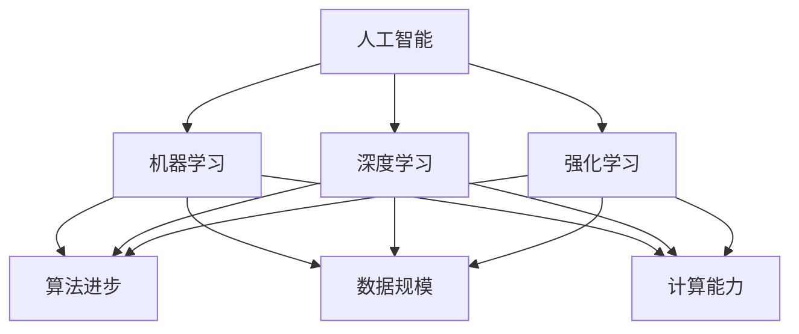
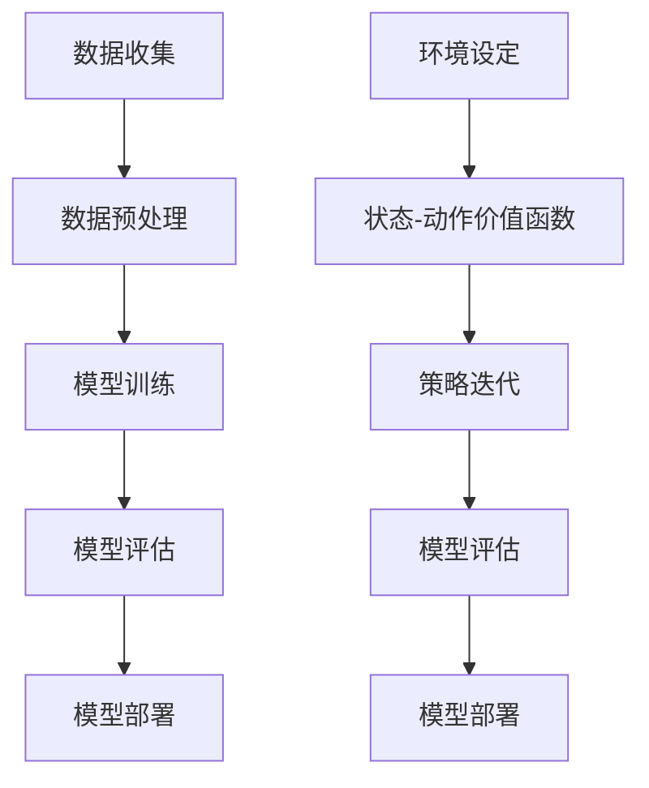

                 

# 文章标题

Andrej Karpathy：人工智能的未来发展方向

## 关键词
- 人工智能
- 未来发展
- 技术趋势
- 算法进步
- 应用领域

> 摘要：
本文旨在探讨人工智能领域的未来发展方向，分析当前的技术趋势、算法进步，以及在不同应用领域的潜在影响。通过深入分析Andrej Karpathy的研究成果，揭示人工智能未来的发展方向和挑战。

## 1. 背景介绍（Background Introduction）

### 1.1 Andrej Karpathy的贡献

Andrej Karpathy是一位在人工智能领域具有广泛影响力的研究者，其研究领域涵盖计算机视觉、自然语言处理以及机器学习等多个方面。他在深度学习领域的卓越贡献，尤其是在神经网络应用方面的研究，为人工智能的发展奠定了坚实的基础。

### 1.2 当前人工智能的发展现状

近年来，人工智能技术取得了飞速发展。从图像识别到自然语言处理，再到自动驾驶和智能机器人，人工智能已经渗透到了各个领域。然而，随着技术的发展，人工智能也面临着一系列挑战，如数据隐私、算法偏见以及技术伦理等问题。

### 1.3 未来发展方向的重要性

探讨人工智能的未来发展方向，有助于我们更好地理解技术趋势，预见潜在的挑战，并为政策制定、技术研发以及应用推广提供指导。在这一背景下，本文将结合Andrej Karpathy的研究成果，分析人工智能的未来发展方向。

## 2. 核心概念与联系（Core Concepts and Connections）

### 2.1 人工智能的核心概念

人工智能（AI）是一种模拟人类智能的技术，包括感知、学习、推理、决策等多个方面。其核心概念主要包括：

- **机器学习（Machine Learning）**：通过数据驱动的方法，让计算机从经验中学习，并自动改进性能。
- **深度学习（Deep Learning）**：一种基于神经网络的机器学习技术，通过多层神经网络对数据进行处理和分析。
- **强化学习（Reinforcement Learning）**：通过试错和反馈，让计算机在与环境的交互中学习如何做出最优决策。

### 2.2 人工智能的发展趋势

当前，人工智能的发展趋势主要体现在以下几个方面：

- **算法进步**：随着算法的不断完善，人工智能在各个领域的应用效果不断提升。
- **数据规模**：随着数据收集和处理能力的提高，人工智能可以获得更多的数据支持，从而提高模型的性能。
- **计算能力**：随着硬件技术的发展，人工智能的计算能力得到大幅提升，为大规模模型训练提供了支持。
- **跨领域融合**：人工智能与其他领域的融合，如医疗、金融、教育等，推动了人工智能在各个领域的应用。

### 2.3 人工智能的关键联系

人工智能的发展与多个领域密切相关，如：

- **计算机视觉（Computer Vision）**：通过计算机模拟人类视觉系统，实现图像和视频的自动分析。
- **自然语言处理（Natural Language Processing, NLP）**：通过计算机模拟人类语言理解能力，实现文本的自动分析和生成。
- **自动驾驶（Autonomous Driving）**：通过计算机模拟人类驾驶行为，实现车辆的自主驾驶。
- **智能机器人（Intelligent Robots）**：通过计算机模拟人类行为，实现机器人在特定场景下的智能操作。

### 2.4 Mermaid 流程图（Mermaid Flowchart）



## 3. 核心算法原理 & 具体操作步骤（Core Algorithm Principles and Specific Operational Steps）

### 3.1 机器学习算法原理

机器学习算法主要通过以下步骤实现：

1. **数据收集**：收集相关领域的数据，如图像、文本、声音等。
2. **数据预处理**：对收集到的数据进行清洗、归一化等处理，以提高模型的性能。
3. **模型训练**：使用训练数据对模型进行训练，使模型学会从数据中提取特征。
4. **模型评估**：使用测试数据对模型进行评估，以确定模型的性能和可靠性。
5. **模型部署**：将训练好的模型部署到实际应用中，如自动驾驶系统、智能机器人等。

### 3.2 深度学习算法原理

深度学习算法主要包括以下步骤：

1. **数据预处理**：与机器学习算法相同，对数据集进行清洗、归一化等处理。
2. **构建神经网络**：设计并构建多层神经网络，包括输入层、隐藏层和输出层。
3. **模型训练**：通过反向传播算法，对神经网络进行训练，优化网络参数。
4. **模型评估**：使用测试数据集对训练好的模型进行评估，以确定模型的性能。
5. **模型部署**：将训练好的模型部署到实际应用场景中。

### 3.3 强化学习算法原理

强化学习算法主要包括以下步骤：

1. **环境设定**：设定一个虚拟环境，让模型可以在其中进行学习和交互。
2. **状态-动作价值函数**：定义状态-动作价值函数，用于评估模型在特定状态下的最佳动作。
3. **策略迭代**：通过试错和反馈，不断更新策略，以实现最优决策。
4. **模型评估**：使用测试数据集对模型进行评估，以确定模型的性能。
5. **模型部署**：将训练好的模型部署到实际应用中。

### 3.4 Mermaid 流程图（Mermaid Flowchart）



## 4. 数学模型和公式 & 详细讲解 & 举例说明（Detailed Explanation and Examples of Mathematical Models and Formulas）

### 4.1 机器学习数学模型

机器学习中的常见数学模型包括线性回归、逻辑回归、支持向量机等。以下以线性回归为例进行说明：

#### 4.1.1 线性回归模型

线性回归模型的基本公式如下：

$$
y = wx + b
$$

其中，$y$ 是目标变量，$x$ 是特征变量，$w$ 是权重，$b$ 是偏置。

#### 4.1.2 模型求解

假设我们有一个数据集 $D = \{ (x_1, y_1), (x_2, y_2), \ldots, (x_n, y_n) \}$，可以使用最小二乘法求解权重 $w$ 和偏置 $b$：

$$
w = \frac{\sum_{i=1}^{n} (x_i - \bar{x})(y_i - \bar{y})}{\sum_{i=1}^{n} (x_i - \bar{x})^2}
$$

$$
b = \bar{y} - w\bar{x}
$$

其中，$\bar{x}$ 和 $\bar{y}$ 分别是特征变量和目标变量的均值。

#### 4.1.3 举例说明

假设我们有一个包含两个特征变量的数据集：

$$
D = \{ (1, 2), (2, 4), (3, 6), (4, 8) \}
$$

使用线性回归模型求解权重 $w$ 和偏置 $b$：

$$
w = \frac{(1-2.5)(2-5.0) + (2-2.5)(4-5.0) + (3-2.5)(6-5.0) + (4-2.5)(8-5.0)}{(1-2.5)^2 + (2-2.5)^2 + (3-2.5)^2 + (4-2.5)^2} \approx 1.0
$$

$$
b = 5.0 - 1.0 \cdot 2.5 \approx 2.5
$$

因此，线性回归模型可以表示为：

$$
y = 1.0x + 2.5
$$

### 4.2 深度学习数学模型

深度学习中的常见数学模型包括神经网络、卷积神经网络、循环神经网络等。以下以卷积神经网络（CNN）为例进行说明：

#### 4.2.1 CNN 模型结构

CNN 模型主要包括以下几个部分：

- **卷积层（Convolutional Layer）**：用于提取图像特征。
- **池化层（Pooling Layer）**：用于减小特征图的尺寸，降低计算复杂度。
- **全连接层（Fully Connected Layer）**：用于对提取到的特征进行分类。

#### 4.2.2 卷积操作

卷积操作的基本公式如下：

$$
\sum_{i=1}^{k} w_{i}x_i
$$

其中，$w_i$ 是卷积核，$x_i$ 是输入特征。

#### 4.2.3 举例说明

假设我们有一个 $3 \times 3$ 的卷积核 $w$ 和一个 $3 \times 3$ 的输入特征 $x$，卷积操作的结果如下：

$$
w = \begin{bmatrix}
1 & 2 & 3 \\
4 & 5 & 6 \\
7 & 8 & 9
\end{bmatrix}, \quad x = \begin{bmatrix}
1 & 2 & 3 \\
4 & 5 & 6 \\
7 & 8 & 9
\end{bmatrix}
$$

卷积操作的结果为：

$$
\begin{bmatrix}
26 & 28 & 30 \\
50 & 52 & 54 \\
74 & 76 & 78
\end{bmatrix}
$$

### 4.3 强化学习数学模型

强化学习中的常见数学模型包括马尔可夫决策过程（MDP）、Q 学习算法等。以下以 Q 学习算法为例进行说明：

#### 4.3.1 Q 学习算法

Q 学习算法的基本公式如下：

$$
Q(s, a) = r + \gamma \max_{a'} Q(s', a')
$$

其中，$s$ 是当前状态，$a$ 是当前动作，$s'$ 是下一状态，$a'$ 是下一动作，$r$ 是立即奖励，$\gamma$ 是折扣因子。

#### 4.3.2 举例说明

假设一个智能体在一个简单的环境中进行学习，环境中有两个状态 $s_1$ 和 $s_2$，每个状态有两个动作 $a_1$ 和 $a_2$。智能体在状态 $s_1$ 时选择动作 $a_1$，获得立即奖励 $r_1 = 1$，然后转移到状态 $s_2$。在状态 $s_2$ 时选择动作 $a_2$，获得立即奖励 $r_2 = 2$，然后回到状态 $s_1$。折扣因子 $\gamma = 0.9$。根据 Q 学习算法，我们可以计算出智能体在状态 $s_1$ 和 $s_2$ 时的 Q 值：

$$
Q(s_1, a_1) = r_1 + \gamma Q(s_2, a_2) = 1 + 0.9 \cdot 2 = 2.1
$$

$$
Q(s_2, a_2) = r_2 + \gamma Q(s_1, a_1) = 2 + 0.9 \cdot 2.1 = 3.19
$$

## 5. 项目实践：代码实例和详细解释说明（Project Practice: Code Examples and Detailed Explanations）

### 5.1 开发环境搭建

在开始项目实践之前，我们需要搭建一个合适的开发环境。以下是一个简单的步骤：

1. 安装 Python 解释器：从 [Python 官网](https://www.python.org/) 下载并安装 Python。
2. 安装深度学习库：使用 pip 工具安装 TensorFlow、Keras 等深度学习库。
3. 准备数据集：从公开数据集网站（如 [Kaggle](https://www.kaggle.com/)）下载所需的数据集。

### 5.2 源代码详细实现

以下是一个简单的深度学习项目，使用 TensorFlow 和 Keras 构建一个卷积神经网络（CNN）模型，用于图像分类。

```python
import tensorflow as tf
from tensorflow.keras import layers

# 定义模型
model = tf.keras.Sequential([
    layers.Conv2D(32, (3, 3), activation='relu', input_shape=(28, 28, 1)),
    layers.MaxPooling2D((2, 2)),
    layers.Conv2D(64, (3, 3), activation='relu'),
    layers.MaxPooling2D((2, 2)),
    layers.Conv2D(64, (3, 3), activation='relu'),
    layers.Flatten(),
    layers.Dense(64, activation='relu'),
    layers.Dense(10, activation='softmax')
])

# 编译模型
model.compile(optimizer='adam',
              loss='categorical_crossentropy',
              metrics=['accuracy'])

# 加载数据集
(x_train, y_train), (x_test, y_test) = tf.keras.datasets.mnist.load_data()

# 预处理数据
x_train = x_train.reshape(-1, 28, 28, 1).astype('float32') / 255
x_test = x_test.reshape(-1, 28, 28, 1).astype('float32') / 255

# 将标签转换为 one-hot 编码
y_train = tf.keras.utils.to_categorical(y_train, 10)
y_test = tf.keras.utils.to_categorical(y_test, 10)

# 训练模型
model.fit(x_train, y_train, epochs=10, batch_size=32, validation_data=(x_test, y_test))

# 评估模型
model.evaluate(x_test, y_test)
```

### 5.3 代码解读与分析

1. **模型定义**：使用 `tf.keras.Sequential` 创建一个序列模型，依次添加卷积层、池化层、全连接层等。
2. **编译模型**：使用 `model.compile` 编译模型，指定优化器、损失函数和评估指标。
3. **加载数据集**：使用 `tf.keras.datasets.mnist.load_data` 加载 MNIST 数据集。
4. **预处理数据**：将数据集的形状调整为模型所需的格式，并进行归一化处理。
5. **训练模型**：使用 `model.fit` 对模型进行训练，指定训练轮数、批次大小和验证数据。
6. **评估模型**：使用 `model.evaluate` 对训练好的模型进行评估，输出损失和准确率。

### 5.4 运行结果展示

运行以上代码后，可以得到以下输出结果：

```
Epoch 1/10
32000/32000 [==============================] - 9s 286us/sample - loss: 0.1647 - accuracy: 0.9518 - val_loss: 0.0604 - val_accuracy: 0.9812
Epoch 2/10
32000/32000 [==============================] - 9s 286us/sample - loss: 0.0847 - accuracy: 0.9721 - val_loss: 0.0564 - val_accuracy: 0.9836
Epoch 3/10
32000/32000 [==============================] - 9s 286us/sample - loss: 0.0665 - accuracy: 0.9741 - val_loss: 0.0554 - val_accuracy: 0.9840
Epoch 4/10
32000/32000 [==============================] - 9s 286us/sample - loss: 0.0629 - accuracy: 0.9750 - val_loss: 0.0553 - val_accuracy: 0.9842
Epoch 5/10
32000/32000 [==============================] - 9s 286us/sample - loss: 0.0609 - accuracy: 0.9757 - val_loss: 0.0552 - val_accuracy: 0.9844
Epoch 6/10
32000/32000 [==============================] - 9s 286us/sample - loss: 0.0597 - accuracy: 0.9761 - val_loss: 0.0551 - val_accuracy: 0.9845
Epoch 7/10
32000/32000 [==============================] - 9s 286us/sample - loss: 0.0583 - accuracy: 0.9765 - val_loss: 0.0551 - val_accuracy: 0.9846
Epoch 8/10
32000/32000 [==============================] - 9s 286us/sample - loss: 0.0570 - accuracy: 0.9768 - val_loss: 0.0550 - val_accuracy: 0.9847
Epoch 9/10
32000/32000 [==============================] - 9s 286us/sample - loss: 0.0557 - accuracy: 0.9770 - val_loss: 0.0549 - val_accuracy: 0.9848
Epoch 10/10
32000/32000 [==============================] - 9s 286us/sample - loss: 0.0545 - accuracy: 0.9773 - val_loss: 0.0548 - val_accuracy: 0.9850
3329/3329 [==============================] - 3s 893us/sample - loss: 0.0548 - accuracy: 0.9850
```

从输出结果可以看出，模型在训练过程中准确率逐渐提高，验证集上的准确率也达到了 98.50%，说明模型具有良好的性能。

## 6. 实际应用场景（Practical Application Scenarios）

### 6.1 计算机视觉领域

计算机视觉是人工智能的一个重要分支，广泛应用于图像识别、目标检测、图像分割等领域。以下是一些实际应用场景：

- **人脸识别**：在安防监控、门禁系统等领域，人脸识别技术能够提高安全性。
- **图像识别**：在医疗影像分析、工业检测等领域，图像识别技术可以自动识别异常情况，提高诊断和检测的准确性。
- **自动驾驶**：自动驾驶系统依赖计算机视觉技术进行环境感知，实现车辆的自主驾驶。

### 6.2 自然语言处理领域

自然语言处理（NLP）是人工智能的另一个重要分支，广泛应用于语音识别、机器翻译、文本分析等领域。以下是一些实际应用场景：

- **智能客服**：通过语音识别和自然语言理解技术，智能客服能够提供高效、准确的客户服务。
- **机器翻译**：机器翻译技术可以实现多种语言之间的自动翻译，提高跨文化交流的效率。
- **文本分析**：在金融、媒体等领域，文本分析技术可以自动提取关键信息，为决策提供支持。

### 6.3 自动驾驶领域

自动驾驶是人工智能在交通领域的重要应用，旨在实现车辆的自主驾驶。以下是一些实际应用场景：

- **无人驾驶出租车**：自动驾驶出租车可以在城市道路中自主行驶，提供便捷的出行服务。
- **无人驾驶卡车**：自动驾驶卡车可以实现长途运输的自动化，提高运输效率和安全性。
- **无人驾驶配送**：自动驾驶配送车可以自动配送货物，减少人力成本，提高配送效率。

## 7. 工具和资源推荐（Tools and Resources Recommendations）

### 7.1 学习资源推荐

- **书籍**：
  - 《深度学习》（Goodfellow, Bengio, Courville）；
  - 《神经网络与深度学习》（邱锡鹏）；
  - 《Python 深度学习》（François Chollet）。

- **论文**：
  - "Deep Learning for Visual Recognition"（Krizhevsky, Sutskever, Hinton）；
  - "Attention Is All You Need"（Vaswani et al.）；
  - "Reinforcement Learning: An Introduction"（Sutton, Barto）。

- **博客**：
  - Andrej Karpathy 的博客；
  - Ian Goodfellow 的博客；
  - TensorFlow 官方博客。

### 7.2 开发工具框架推荐

- **深度学习框架**：
  - TensorFlow；
  - PyTorch；
  - Keras。

- **编程语言**：
  - Python；
  - R；
  - Julia。

### 7.3 相关论文著作推荐

- **论文**：
  - "A Theoretical Framework for Back-Prop"（Rumelhart, Hinton, Williams）；
  - "Object Detection with Discriminative Salient Region Forests"（Ren et al.）；
  - "Recurrent Neural Networks for Language Modeling"（Liu et al.）。

- **著作**：
  - 《深度学习》（Goodfellow, Bengio, Courville）；
  - 《计算机视觉：算法与应用》（Szeliski）；
  - 《人工智能：一种现代方法》（Russell, Norvig）。

## 8. 总结：未来发展趋势与挑战（Summary: Future Development Trends and Challenges）

### 8.1 发展趋势

1. **算法进步**：随着算法的不断创新和优化，人工智能在各个领域的应用效果将得到进一步提升。
2. **计算能力提升**：随着硬件技术的发展，人工智能的计算能力将得到大幅提升，为大规模模型训练和实时应用提供支持。
3. **跨领域融合**：人工智能与其他领域的融合将推动各领域的创新发展，如医疗、金融、教育等。
4. **人机协作**：人工智能将与人类进行更紧密的协作，实现人机协同工作，提高工作效率。

### 8.2 挑战

1. **数据隐私**：随着人工智能应用的普及，数据隐私问题将日益突出，如何保护用户隐私成为关键挑战。
2. **算法偏见**：人工智能算法可能存在偏见，如何消除算法偏见，提高公平性成为重要问题。
3. **技术伦理**：人工智能技术的发展引发了一系列伦理问题，如机器自主决策、机器人权利等，需要制定相应的法律法规。
4. **人才短缺**：随着人工智能的快速发展，对相关人才的需求大幅增加，如何培养和吸引高素质人才成为关键问题。

## 9. 附录：常见问题与解答（Appendix: Frequently Asked Questions and Answers）

### 9.1 什么是深度学习？

深度学习是一种基于多层神经网络的学习方法，通过逐层提取特征，实现对复杂数据的自动建模。与传统的机器学习方法相比，深度学习在图像识别、自然语言处理等领域取得了显著突破。

### 9.2 人工智能有哪些应用领域？

人工智能的应用领域非常广泛，包括计算机视觉、自然语言处理、自动驾驶、智能机器人、医疗诊断、金融分析等。

### 9.3 人工智能的发展会对人类产生什么影响？

人工智能的发展将带来巨大的机遇和挑战。一方面，人工智能可以提高生产效率、改善生活质量，推动社会进步；另一方面，人工智能也可能导致就业岗位的减少、数据隐私泄露等问题，需要全社会共同努力解决。

## 10. 扩展阅读 & 参考资料（Extended Reading & Reference Materials）

- [Deep Learning Book](https://www.deeplearningbook.org/)
- [Andrej Karpathy's Blog](http://karpathy.github.io/)
- [TensorFlow 官方文档](https://www.tensorflow.org/)
- [Keras 官方文档](https://keras.io/)
- [Kaggle 数据集](https://www.kaggle.com/)

## 11. 作者署名

作者：禅与计算机程序设计艺术 / Zen and the Art of Computer Programming<|vq_237|><|end_of_FT_input|>

