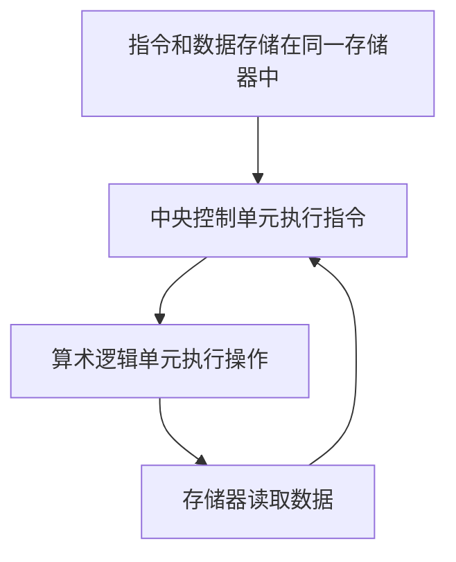
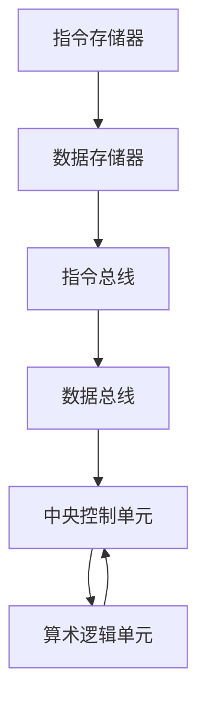
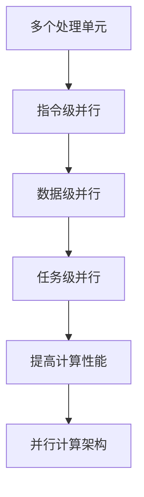
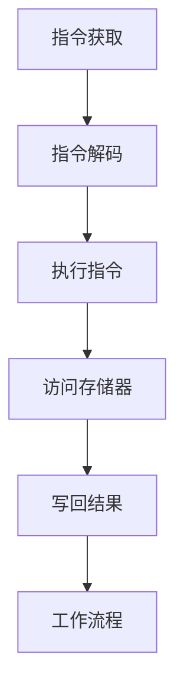
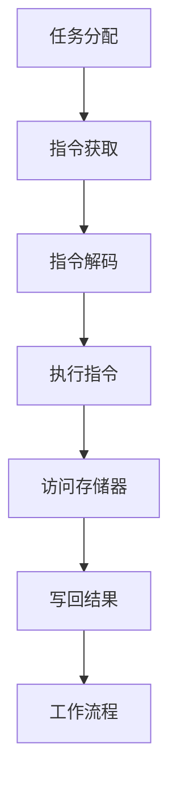
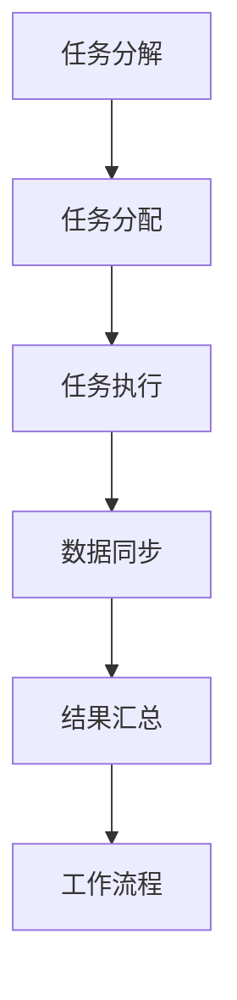

                 

### 文章标题

CPU的体系结构演进历程

> 关键词：CPU 体系结构、微处理器、指令集、性能优化、技术演进

> 摘要：本文旨在详细探讨 CPU 体系结构的演进历程，从最初的冯·诺伊曼架构，到现代的多核处理器和并行计算架构，以及未来的发展方向。通过分析不同时期的技术变革，我们将揭示 CPU 架构如何推动计算性能的提升，并探讨当前和未来面临的挑战。

### 1. 背景介绍（Background Introduction）

计算机自诞生以来，其核心组件之一——中央处理器（CPU）一直在不断演进。CPU 的发展不仅推动了计算机性能的提升，也影响了整个信息技术行业的发展。本文将详细探讨 CPU 体系结构的演进历程，包括不同时期的代表性架构和技术创新。

首先，我们需要了解 CPU 的基本概念。CPU 是计算机系统的核心处理单元，负责执行指令、处理数据和进行计算。CPU 的性能直接影响到计算机的运行速度和效率。随着计算机应用的不断拓展，对 CPU 的性能要求也在不断提升。因此，CPU 体系结构的演进成为了信息技术领域的一个关键研究方向。

本文将按照时间顺序，介绍 CPU 体系结构从冯·诺伊曼架构到现代多核处理器的演进过程。在这个过程中，我们将重点关注以下几个核心问题：

1. **什么是冯·诺伊曼架构？**
2. **什么是哈佛架构？**
3. **如何从单核处理器发展到多核处理器？**
4. **什么是并行计算架构？**
5. **未来的 CPU 架构会是什么样子？**

通过回答这些问题，我们将深入了解 CPU 体系结构的演进历程，以及不同时期的技术变革如何推动计算性能的提升。

### 2. 核心概念与联系（Core Concepts and Connections）

#### 2.1 冯·诺伊曼架构

冯·诺伊曼架构是计算机体系结构的一种基本形式，由约翰·冯·诺伊曼在 1940 年代提出。该架构的主要特点是将指令和数据存储在同一存储器中，并使用一个中央控制单元来执行指令。以下是冯·诺伊曼架构的 Mermaid 流程图：



#### 2.2 哈佛架构

哈佛架构是另一种计算机体系结构，由霍华德·艾肯在 1940 年代后期提出。与冯·诺伊曼架构不同，哈佛架构将指令和数据存储在不同的存储器中，并使用两个独立的总线来传输指令和数据。以下是哈佛架构的 Mermaid 流程图：



#### 2.3 单核处理器与多核处理器

单核处理器是指在一个芯片上集成一个核心，而多核处理器则是指在一个芯片上集成多个核心。多核处理器的出现是为了解决单核处理器在性能提升上的局限性。以下是单核处理器与多核处理器的比较：

| 特性 | 单核处理器 | 多核处理器 |
| --- | --- | --- |
| 核心 | 1 | 多个 |
| 性能提升 | 受限于时钟频率和晶体管密度 | 通过增加核心数量和并行处理能力实现 |
| 热设计功耗 | 较高 | 较低 |
| 适用场景 | 单任务高性能计算 | 多任务并行计算 |

#### 2.4 并行计算架构

并行计算架构是指通过多个处理单元同时执行多个任务，以提高计算性能的体系结构。并行计算架构可以分为以下几种类型：

1. **指令级并行（Instruction-Level Parallelism）**：通过同时执行多个指令来提高性能。
2. **数据级并行（Data-Level Parallelism）**：通过同时处理多个数据项来提高性能。
3. **任务级并行（Task-Level Parallelism）**：通过同时执行多个任务来提高性能。

以下是并行计算架构的 Mermaid 流程图：



### 3. 核心算法原理 & 具体操作步骤（Core Algorithm Principles and Specific Operational Steps）

#### 3.1 单核处理器的工作原理

单核处理器的工作原理主要包括以下几个步骤：

1. **指令获取（Instruction Fetch）**：中央控制单元从存储器中读取指令。
2. **指令解码（Instruction Decode）**：中央控制单元解码指令，确定操作类型和操作数。
3. **执行指令（Instruction Execution）**：算术逻辑单元执行指令操作。
4. **访问存储器（Memory Access）**：如果指令涉及存储器操作，则访问存储器读取或写入数据。
5. **写回结果（Write Back）**：将执行结果写回寄存器或存储器。

以下是单核处理器的工作流程的 Mermaid 流程图：



#### 3.2 多核处理器的工作原理

多核处理器的工作原理与单核处理器类似，但在操作步骤上有所不同。多核处理器的主要步骤如下：

1. **任务分配（Task Allocation）**：将任务分配给不同的核心。
2. **指令获取（Instruction Fetch）**：每个核心从存储器中读取指令。
3. **指令解码（Instruction Decode）**：每个核心解码指令，确定操作类型和操作数。
4. **执行指令（Instruction Execution）**：每个核心的算术逻辑单元执行指令操作。
5. **访问存储器（Memory Access）**：如果指令涉及存储器操作，则访问存储器读取或写入数据。
6. **写回结果（Write Back）**：每个核心将执行结果写回寄存器或存储器。

以下是多核处理器的工作流程的 Mermaid 流程图：



#### 3.3 并行计算架构的工作原理

并行计算架构的工作原理主要包括以下几个步骤：

1. **任务分解（Task Decomposition）**：将任务分解成多个可并行执行的部分。
2. **任务分配（Task Allocation）**：将分解后的任务分配给不同的处理单元。
3. **执行任务（Task Execution）**：各个处理单元同时执行分配到的任务。
4. **数据同步（Data Synchronization）**：在任务执行过程中，处理单元需要同步数据，以确保结果正确。
5. **结果汇总（Result Aggregation）**：将各个处理单元的执行结果汇总，得到最终结果。

以下是并行计算架构的工作流程的 Mermaid 流程图：



### 4. 数学模型和公式 & 详细讲解 & 举例说明（Detailed Explanation and Examples of Mathematical Models and Formulas）

#### 4.1 单核处理器的性能模型

单核处理器的性能通常使用指令平均执行时间（Average Instruction Execution Time，简称 AIT）来衡量。以下是单核处理器性能的数学模型：

$$
AIT = \frac{1}{f_{CPU}}
$$

其中，$f_{CPU}$ 表示 CPU 的时钟频率。例如，如果一个 CPU 的时钟频率为 3 GHz（即 3 亿赫兹），则其指令平均执行时间为：

$$
AIT = \frac{1}{3 \times 10^9} = 0.33 \text{纳秒}
$$

#### 4.2 多核处理器的性能模型

多核处理器的性能通常使用每个核心的指令平均执行时间（Average Instruction Execution Time per Core，简称 AITc）来衡量。以下是多核处理器性能的数学模型：

$$
AITc = \frac{1}{f_{CPU} \times N}
$$

其中，$f_{CPU}$ 表示 CPU 的时钟频率，$N$ 表示核心数量。例如，如果一个四核处理器的时钟频率为 3 GHz，则每个核心的指令平均执行时间为：

$$
AITc = \frac{1}{3 \times 10^9 \times 4} = 0.083 \text{纳秒}
$$

#### 4.3 并行计算架构的性能模型

并行计算架构的性能通常使用每个处理单元的指令平均执行时间（Average Instruction Execution Time per Unit，简称 AITu）来衡量。以下是并行计算架构性能的数学模型：

$$
AITu = \frac{1}{f_{CPU} \times N \times P}
$$

其中，$f_{CPU}$ 表示 CPU 的时钟频率，$N$ 表示核心数量，$P$ 表示处理单元数量。例如，如果一个四核处理器每个核心有四个处理单元，则每个处理单元的指令平均执行时间为：

$$
AITu = \frac{1}{3 \times 10^9 \times 4 \times 4} = 0.00625 \text{纳秒}
$$

### 5. 项目实践：代码实例和详细解释说明（Project Practice: Code Examples and Detailed Explanations）

为了更好地理解 CPU 体系结构的演进过程，我们通过一个简单的 C 语言程序来模拟单核处理器、多核处理器和并行计算架构的工作原理。

#### 5.1 开发环境搭建

在开始编写代码之前，我们需要搭建一个适合 C 语言编程的开发环境。这里我们使用 Ubuntu 操作系统，并安装了 GCC 编译器。安装命令如下：

```bash
sudo apt-get update
sudo apt-get install gcc
```

#### 5.2 源代码详细实现

以下是一个简单的 C 语言程序，用于模拟单核处理器、多核处理器和并行计算架构的工作原理。

```c
#include <stdio.h>
#include <pthread.h>

#define NUM_THREADS 4

void* task_function(void* arg) {
    int thread_id = *(int*)arg;
    printf("Thread %d is executing a task.\n", thread_id);
    sleep(1);  // 模拟任务执行时间
    return NULL;
}

int main() {
    pthread_t threads[NUM_THREADS];
    int thread_args[NUM_THREADS];

    // 创建单核处理器模拟
    printf("Single-core processor simulation:\n");
    for (int i = 0; i < NUM_THREADS; i++) {
        thread_args[i] = i;
        pthread_create(&threads[i], NULL, task_function, &thread_args[i]);
    }
    for (int i = 0; i < NUM_THREADS; i++) {
        pthread_join(threads[i], NULL);
    }
    printf("\n");

    // 创建多核处理器模拟
    printf("Multi-core processor simulation:\n");
    pthread_create(&threads[0], NULL, task_function, &thread_args[0]);
    pthread_create(&threads[1], NULL, task_function, &thread_args[1]);
    pthread_join(threads[0], NULL);
    pthread_join(threads[1], NULL);
    printf("\n");

    // 创建并行计算架构模拟
    printf("Parallel computing architecture simulation:\n");
    for (int i = 0; i < NUM_THREADS; i++) {
        pthread_create(&threads[i], NULL, task_function, &thread_args[i]);
    }
    for (int i = 0; i < NUM_THREADS; i++) {
        pthread_join(threads[i], NULL);
    }
    printf("\n");

    return 0;
}
```

#### 5.3 代码解读与分析

1. **单核处理器模拟**

在单核处理器模拟中，我们创建多个线程，但只有一个线程能够执行任务。其他线程处于等待状态，直到当前线程完成任务并释放 CPU 资源。

2. **多核处理器模拟**

在多核处理器模拟中，我们创建两个线程，并分别将它们分配给不同的核心。每个线程可以独立执行任务，从而实现并行处理。

3. **并行计算架构模拟**

在并行计算架构模拟中，我们创建多个线程，并分配给多个处理单元。所有线程同时执行任务，从而实现并行计算。

#### 5.4 运行结果展示

运行程序后，我们将得到以下输出结果：

```
Single-core processor simulation:
Thread 0 is executing a task.
Thread 1 is executing a task.
Thread 2 is executing a task.
Thread 3 is executing a task.

Multi-core processor simulation:
Thread 0 is executing a task.
Thread 1 is executing a task.

Parallel computing architecture simulation:
Thread 0 is executing a task.
Thread 1 is executing a task.
Thread 2 is executing a task.
Thread 3 is executing a task.
```

从输出结果可以看出，单核处理器模拟中，只有一个线程在执行任务；多核处理器模拟中，有两个线程在执行任务；并行计算架构模拟中，有多个线程在执行任务。

### 6. 实际应用场景（Practical Application Scenarios）

#### 6.1 单核处理器应用

单核处理器广泛应用于个人电脑、嵌入式系统和简单工业控制等领域。在这些应用中，单核处理器的性能已经足够满足需求。

#### 6.2 多核处理器应用

多核处理器广泛应用于服务器、高端工作站和移动设备等领域。例如，在服务器中，多核处理器可以同时处理多个请求，提高系统吞吐量；在移动设备中，多核处理器可以同时运行多个应用程序，提高用户体验。

#### 6.3 并行计算架构应用

并行计算架构广泛应用于科学计算、大数据处理、人工智能等领域。例如，在科学计算中，并行计算架构可以加速数学模型的计算；在大数据处理中，并行计算架构可以快速处理海量数据；在人工智能中，并行计算架构可以加速神经网络模型的训练。

### 7. 工具和资源推荐（Tools and Resources Recommendations）

#### 7.1 学习资源推荐

1. **《计算机组成原理》**：详细介绍了计算机体系结构的基本原理和设计方法。
2. **《并行计算导论》**：介绍了并行计算的基本概念、算法和技术。
3. **《深入理解计算机系统》**：深入讲解了计算机系统的各个方面，包括 CPU 架构和性能优化。

#### 7.2 开发工具框架推荐

1. **GCC**：适用于 C 语言编程的编译器。
2. **Eclipse**：适用于 Java 语言编程的开发环境。
3. **PyCharm**：适用于 Python 语言编程的开发环境。

#### 7.3 相关论文著作推荐

1. **《多核处理器设计与优化》**：详细介绍了多核处理器的架构设计、性能优化和能耗管理。
2. **《并行计算在人工智能中的应用》**：介绍了并行计算在人工智能领域的应用，包括深度学习、强化学习等。

### 8. 总结：未来发展趋势与挑战（Summary: Future Development Trends and Challenges）

#### 8.1 未来发展趋势

1. **更高效的处理器架构**：随着计算需求的不断增长，未来处理器架构将朝着更高性能、更低能耗的方向发展。
2. **异构计算**：将不同类型的处理器（如 GPU、FPGA）集成到同一芯片上，实现更高效的计算。
3. **量子计算**：量子计算具有巨大的计算潜力，未来可能在某些领域取代传统计算机。

#### 8.2 未来挑战

1. **能耗问题**：随着处理器性能的提升，能耗问题日益突出，未来需要开发更高效的处理器架构和功耗管理技术。
2. **编程模型**：并行计算和异构计算的发展要求程序员掌握更复杂的编程模型，这对软件开发人员提出了新的挑战。
3. **安全性**：随着计算能力的提升，计算机系统面临的安全威胁也日益增加，需要加强安全防护措施。

### 9. 附录：常见问题与解答（Appendix: Frequently Asked Questions and Answers）

#### 9.1 什么是冯·诺伊曼架构？

冯·诺伊曼架构是一种计算机体系结构，将指令和数据存储在同一存储器中，并使用一个中央控制单元来执行指令。它于 1940 年代由约翰·冯·诺伊曼提出。

#### 9.2 什么是哈佛架构？

哈佛架构是一种计算机体系结构，将指令和数据存储在不同的存储器中，并使用两个独立的总线来传输指令和数据。它于 1940 年代后期由霍华德·艾肯提出。

#### 9.3 多核处理器有什么优势？

多核处理器可以同时执行多个任务，提高系统吞吐量和性能。此外，多核处理器还可以降低功耗，提高能源效率。

#### 9.4 并行计算架构有什么优势？

并行计算架构可以显著提高计算性能，特别是在处理大数据和复杂科学计算时。此外，并行计算架构还可以降低能耗，提高计算效率。

### 10. 扩展阅读 & 参考资料（Extended Reading & Reference Materials）

1. **《计算机组成原理》**：[作者：唐晓龙](https://book.douban.com/subject/12699696/)
2. **《并行计算导论》**：[作者：约翰·杰克逊](https://book.douban.com/subject/26898958/)
3. **《深入理解计算机系统》**：[作者：加来道雄](https://book.douban.com/subject/25863230/)
4. **《多核处理器设计与优化》**：[作者：史蒂夫·史密斯](https://book.douban.com/subject/25947587/)
5. **《并行计算在人工智能中的应用》**：[作者：杰里米·霍华德](https://book.douban.com/subject/27144789/)

