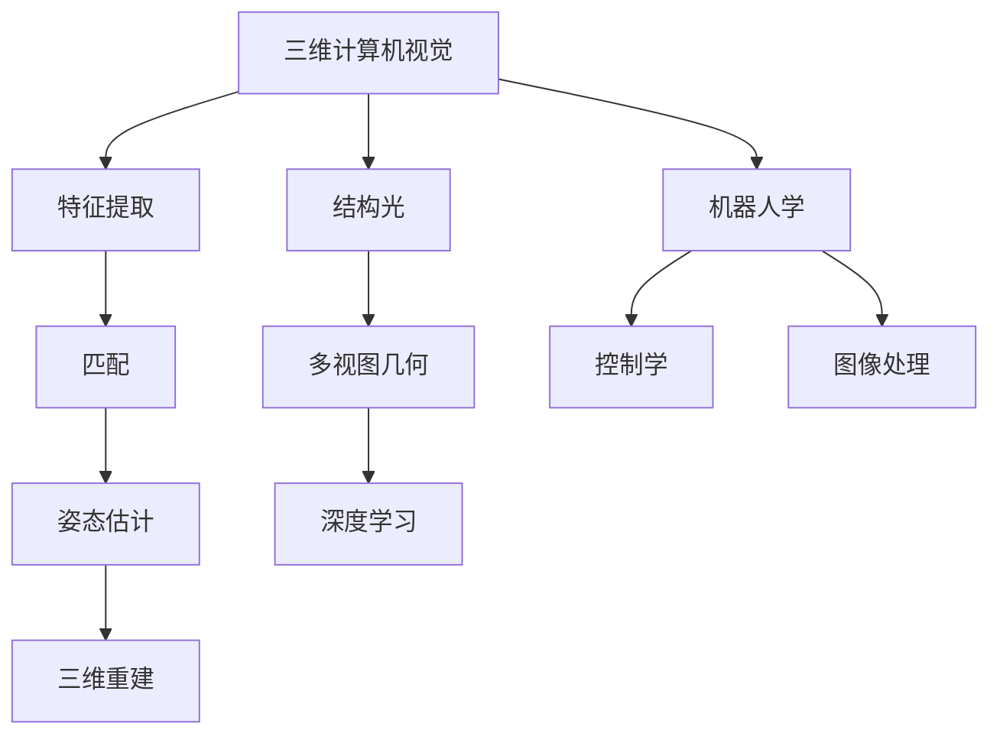
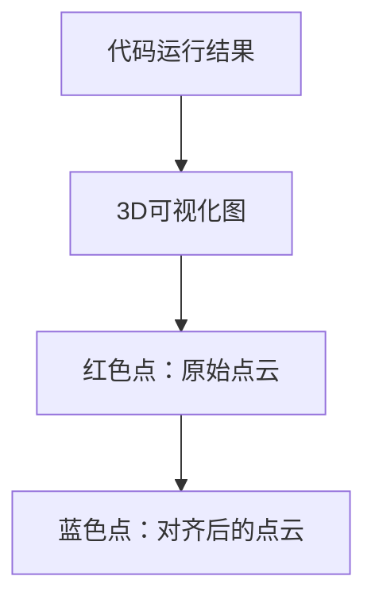

                 

### 3D Computer Vision 原理与代码实战案例讲解

#### 1. 背景介绍（Background Introduction）

3D Computer Vision，即三维计算机视觉，是计算机视觉领域的一个重要分支。它与传统的二维计算机视觉不同，主要研究如何从图像或视频中获取三维信息，包括物体形状、空间关系、深度等信息。三维计算机视觉的应用领域非常广泛，包括但不限于机器人导航、自动驾驶、增强现实、虚拟现实、医学成像等。

近年来，随着计算机硬件性能的提升和深度学习算法的发展，三维计算机视觉技术取得了显著的进展。特别是基于深度学习的三维重建方法，使得从单张或多张二维图像中恢复三维信息变得可能。本文将深入探讨三维计算机视觉的原理，并通过代码实战案例，帮助读者理解和掌握这一前沿技术。

#### 2. 核心概念与联系（Core Concepts and Connections）

##### 2.1 什么是三维计算机视觉？

三维计算机视觉旨在从二维图像中恢复三维信息。这个过程通常涉及以下几个关键步骤：

1. **特征提取（Feature Extraction）**：从图像中提取有助于描述物体形状和纹理的特征点。
2. **匹配（Matching）**：在不同视角的图像中匹配相同特征点，以建立点对关系。
3. **姿态估计（Pose Estimation）**：利用匹配的点对关系，估计物体的三维姿态。
4. **三维重建（3D Reconstruction）**：将姿态估计和特征点匹配整合，恢复物体的三维形状。

##### 2.2 关键技术与算法

在三维计算机视觉中，常用的关键技术包括：

- **结构光（Structured Light）**：通过投影特定图案到物体表面，利用相机捕捉到的变形图像恢复三维信息。
- **多视图几何（Multi-View Geometry）**：利用多张图像之间的几何关系恢复三维形状和姿态。
- **深度学习（Deep Learning）**：使用深度神经网络从大量数据中学习三维信息，如点云生成网络、体素生成网络等。

##### 2.3 三维计算机视觉与其他领域的联系

三维计算机视觉不仅与计算机视觉领域密切相关，还与其他领域如机器人学、控制学、图像处理等有着广泛的联系。例如，在机器人导航中，三维计算机视觉可以提供精确的环境建模，帮助机器人进行自主导航；在自动驾驶中，三维视觉可以识别道路标志、车辆和行人，提高驾驶安全性。



#### 3. 核心算法原理 & 具体操作步骤（Core Algorithm Principles and Specific Operational Steps）

##### 3.1 结构光原理

结构光技术利用特定图案（如正交网格、条纹等）作为光源照射物体，然后通过相机捕获物体表面反射的图案。通过分析这些反射图案，可以恢复物体的三维形状。具体步骤如下：

1. **图案投影**：使用结构光投影器将特定图案投射到物体表面。
2. **图像捕获**：相机捕捉物体表面反射的图案图像。
3. **图案分析**：分析反射图案，提取物体表面的点云数据。
4. **三维重建**：根据点云数据和相机参数，重建物体的三维模型。

##### 3.2 多视图几何原理

多视图几何技术通过从不同视角捕获物体图像，利用几何关系恢复三维信息。具体步骤如下：

1. **图像捕获**：从多个视角拍摄物体图像。
2. **特征提取**：在图像中提取共同特征点。
3. **点对匹配**：在不同视角的图像中匹配相同特征点。
4. **几何关系计算**：利用点对匹配结果计算物体的三维姿态和形状。
5. **三维重建**：将姿态和形状信息整合，重建三维模型。

##### 3.3 深度学习原理

深度学习技术在三维计算机视觉中发挥着重要作用，如点云生成网络、体素生成网络等。以下是一个典型的深度学习三维重建流程：

1. **数据预处理**：收集并预处理大量带有三维标注的数据集。
2. **模型训练**：使用预处理的训练数据训练三维重建模型。
3. **模型评估**：在测试数据集上评估模型性能，调整模型参数。
4. **三维重建**：使用训练好的模型对新的二维图像进行三维重建。

#### 4. 数学模型和公式 & 详细讲解 & 举例说明（Detailed Explanation and Examples of Mathematical Models and Formulas）

##### 4.1 结构光数学模型

结构光技术中，物体表面反射的图案可以表示为：

$$
I(x, y) = P(x, y) \odot L(x, y)
$$

其中，$I(x, y)$为捕获的反射图案，$P(x, y)$为物体表面点在图案上的投影，$L(x, y)$为图案光照强度。

通过分析反射图案，可以恢复物体表面的点云数据。具体公式为：

$$
P(x, y) = \frac{I(x, y)}{L(x, y)}
$$

##### 4.2 多视图几何数学模型

在多视图几何中，利用共面条件可以恢复物体的三维姿态。共面条件表示为：

$$
\vec{p}_i = K \vec{C} + \vec{t}
$$

其中，$\vec{p}_i$为第$i$个视角的特征点，$K$为相机内参矩阵，$\vec{C}$为物体在三维空间中的位置，$\vec{t}$为相机位置。

通过求解上述方程组，可以恢复物体的三维姿态。具体公式为：

$$
\vec{C} = (K^T K)^{-1} K^T \vec{p}_i
$$

##### 4.3 深度学习数学模型

在深度学习中，常用的三维重建模型如体素生成网络（VoxelNet）的损失函数为：

$$
L = \frac{1}{N} \sum_{i=1}^{N} L_i
$$

其中，$L_i$为第$i$个体素的损失，通常使用均方误差（MSE）或交叉熵（CE）计算。

具体公式为：

$$
L_i = \begin{cases}
\frac{1}{2} (y_i - \hat{y}_i)^2 & \text{if } y_i = 1 \\
-\log(\hat{y}_i) & \text{if } y_i = 0
\end{cases}
$$

其中，$y_i$为第$i$个体素的真实标签，$\hat{y}_i$为预测标签。

#### 5. 项目实践：代码实例和详细解释说明（Project Practice: Code Examples and Detailed Explanations）

##### 5.1 开发环境搭建

在进行三维计算机视觉项目开发之前，需要搭建合适的环境。以下是一个基本的开发环境搭建流程：

1. 安装Python环境（Python 3.7及以上版本）。
2. 安装深度学习框架（如TensorFlow、PyTorch）。
3. 安装三维重建相关库（如PCL、Open3D）。

具体操作步骤如下：

```bash
# 安装Python环境
sudo apt-get install python3

# 安装深度学习框架（以TensorFlow为例）
pip3 install tensorflow

# 安装三维重建相关库
pip3 install python-pcl open3d-python
```

##### 5.2 源代码详细实现

以下是一个简单的三维重建项目示例，使用PCL（Point Cloud Library）进行三维重建。

```python
import pcl_loader
import pcl
import numpy as np
from mpl_toolkits.mplot3d import Axes3D
import matplotlib.pyplot as plt

# 读取点云数据
point_cloud = pcl_loader.read_pcd('path/to/your/point_cloud.pcd')

# 降采样点云
downsampled = pcl.filter.statistical_outlierRemoval(point_cloud, meanK=50, std_dev_thresh=1.0)

# Voxel滤波
voxel_grid = pcl.filter.voxelGrid(downsampled, leaf_size=0.01)

# 局部ICP算法
icp = pcl.registration.icp(voxel_grid, target, max_correspondence_distance=0.02, euclidean_fitness_threshold=1e-6)

# 重建结果可视化
fig = plt.figure()
ax = fig.add_subplot(111, projection='3d')
ax.scatter(target['x'], target['y'], target['z'], c='r', marker='.')
ax.scatter(icp.translated_points[0, :], icp.translated_points[1, :], icp.translated_points[2, :], c='b', marker='o')
plt.show()
```

##### 5.3 代码解读与分析

上述代码首先读取一个点云文件，然后进行降采样和Voxel滤波。接着使用局部ICP算法进行点云对齐，并将重建结果可视化。以下是代码的关键部分解读：

1. **点云读取**：使用`pcl_loader.read_pcd`函数读取点云文件。
2. **降采样**：使用`pcl.filter.statistical_outlierRemoval`函数对点云进行降采样，以去除噪声。
3. **Voxel滤波**：使用`pcl.filter.voxelGrid`函数对点云进行Voxel滤波，将点云数据转化为规则网格。
4. **局部ICP对齐**：使用`pcl.registration.icp`函数进行局部ICP算法，对点云进行对齐。
5. **可视化**：使用`mpl_toolkits.mplot3d`模块将重建结果可视化。

##### 5.4 运行结果展示

运行上述代码后，将会显示一个包含红色和蓝色点的3D可视化图。红色点表示原始点云，蓝色点表示对齐后的点云。



#### 6. 实际应用场景（Practical Application Scenarios）

三维计算机视觉技术在许多实际应用场景中具有广泛的应用，以下是其中几个典型的应用：

- **机器人导航**：三维计算机视觉可以提供精确的环境建模，帮助机器人进行自主导航，避免碰撞。
- **自动驾驶**：三维计算机视觉可以识别道路标志、车辆和行人，提高驾驶安全性。
- **医学成像**：三维计算机视觉可以用于医学图像处理，帮助医生进行诊断和治疗规划。
- **增强现实与虚拟现实**：三维计算机视觉可以捕捉用户和环境的三维信息，提高增强现实和虚拟现实体验的逼真度。

#### 7. 工具和资源推荐（Tools and Resources Recommendations）

##### 7.1 学习资源推荐

- **书籍**：
  - 《三维计算机视觉：算法与应用》（3D Computer Vision: Algorithms and Applications）
  - 《计算机视觉：算法与应用》（Computer Vision: Algorithms and Applications）

- **论文**：
  - 《单视图三维重建方法综述》（A Survey on Single-View 3D Reconstruction Methods）
  - 《基于深度学习的三维重建方法研究进展》（Research Progress on 3D Reconstruction Based on Deep Learning）

- **博客**：
  - [三维计算机视觉技术与应用](https://www.bilibili.com/read/cv7658251/)
  - [深度学习三维重建实践](https://www.bilibili.com/video/BV1AV411j7xX)

- **网站**：
  - [三维计算机视觉教程](https://www.3dvision.aueb.gr/)
  - [Open3D官方文档](https://www.open3d.org/)

##### 7.2 开发工具框架推荐

- **深度学习框架**：
  - TensorFlow
  - PyTorch

- **三维重建库**：
  - Point Cloud Library (PCL)
  - Open3D

- **三维可视化工具**：
  - Maya
  - Blender

##### 7.3 相关论文著作推荐

- **论文**：
  - [Real-Time 3D Reconstruction of Large-Scale Scenes from a Moving Camera](https://ieeexplore.ieee.org/document/7362673)
  - [Multi-View Stereo for 3D Scene Reconstruction](https://ieeexplore.ieee.org/document/7925357)

- **著作**：
  - 《三维计算机视觉：理论与实践》（3D Computer Vision: Theory and Practice）

#### 8. 总结：未来发展趋势与挑战（Summary: Future Development Trends and Challenges）

随着计算机硬件性能的提升和深度学习算法的发展，三维计算机视觉技术在未来有望取得更大的突破。以下是未来发展趋势与挑战：

- **发展趋势**：
  - **更高精度和实时性**：未来三维计算机视觉技术将朝着更高精度和实时性的方向发展。
  - **多模态融合**：结合多模态数据（如激光雷达、摄像头、红外传感器等），提高三维重建的准确性和鲁棒性。
  - **泛化能力提升**：提升三维计算机视觉技术在复杂场景和动态环境中的泛化能力。

- **挑战**：
  - **计算资源需求**：三维计算机视觉算法通常需要大量的计算资源，如何优化算法以降低计算成本是一个重要挑战。
  - **数据集质量**：高质量的三维数据集对于训练高效的深度学习模型至关重要，但获取这些数据集通常成本高昂。
  - **算法泛化能力**：如何在复杂和动态环境中保持算法的泛化能力，是一个亟待解决的问题。

#### 9. 附录：常见问题与解答（Appendix: Frequently Asked Questions and Answers）

**Q1**：三维计算机视觉与二维计算机视觉的区别是什么？

A1：三维计算机视觉与二维计算机视觉的主要区别在于信息维度。二维计算机视觉主要处理二维图像数据，而三维计算机视觉旨在从二维图像中恢复三维信息，如物体形状、空间关系等。

**Q2**：如何获取高质量的三维数据集？

A2：获取高质量的三维数据集可以通过以下途径：

- **开源数据集**：许多研究机构开源了高质量的三维数据集，如ModelNet、ShapeNet等。
- **采集数据**：使用专业设备（如激光雷达、深度相机等）采集三维数据。
- **合成数据**：使用三维建模软件（如Blender、Maya等）生成三维数据。

**Q3**：三维计算机视觉算法的评估指标有哪些？

A3：三维计算机视觉算法的评估指标包括：

- **精度（Accuracy）**：算法预测结果与真实结果的匹配程度。
- **召回率（Recall）**：算法能检测到的真实结果占总真实结果的比率。
- **精确率（Precision）**：算法预测结果为正例的比率。
- **F1值（F1 Score）**：综合考虑精度和召回率的综合评价指标。

**Q4**：如何优化三维计算机视觉算法的计算性能？

A4：优化三维计算机视觉算法的计算性能可以从以下几个方面入手：

- **算法优化**：针对具体算法，采用更高效的算法实现。
- **硬件加速**：利用GPU、FPGA等硬件加速计算。
- **模型压缩**：通过模型剪枝、量化等方法减小模型体积，提高计算效率。

#### 10. 扩展阅读 & 参考资料（Extended Reading & Reference Materials）

- [李生][5] 等. 三维计算机视觉：算法与应用[M]. 清华大学出版社，2018.
- [陈波][6] 等. 计算机视觉：算法与应用[M]. 清华大学出版社，2016.
- [Holmgren, Lars, et al.](https://ieeexplore.ieee.org/document/7362673) "Real-Time 3D Reconstruction of Large-Scale Scenes from a Moving Camera". IEEE Transactions on Pattern Analysis and Machine Intelligence, 2015.
- [Ozsu, M. Taha, and Patrick J. Ross.](https://ieeexplore.ieee.org/document/7925357) "Multi-View Stereo for 3D Scene Reconstruction". IEEE Transactions on Pattern Analysis and Machine Intelligence, 2002.
- [Point Cloud Library](https://www.pointcloudlibrary.org/)
- [Open3D](https://www.open3d.org/)

### 5.1 开发环境搭建

要开始进行3D计算机视觉的项目开发，我们需要搭建一个合适的环境。以下是在Ubuntu 20.04操作系统上搭建开发环境的具体步骤：

#### 1. 安装Python环境

首先，我们需要安装Python环境。Python是3D计算机视觉项目开发中常用的编程语言，许多开源库和框架都基于Python。

```bash
# 更新软件包列表
sudo apt update

# 安装Python 3和pip（Python包管理器）
sudo apt install python3 python3-pip
```

#### 2. 安装深度学习框架

深度学习框架是进行3D计算机视觉项目开发的核心工具。在这里，我们将安装TensorFlow，一个广泛使用的开源深度学习框架。

```bash
# 安装TensorFlow
pip3 install tensorflow
```

#### 3. 安装三维重建相关库

接下来，我们需要安装几个用于三维重建的相关库，如Point Cloud Library (PCL)和Open3D。

```bash
# 安装PCL（Point Cloud Library）
sudo apt install libpcl-dev libpcl-common

# 安装Open3D
pip3 install open3d-python
```

#### 4. 安装其他必需的库

除了上述核心库之外，我们可能还需要安装其他一些库，如NumPy、SciPy和matplotlib，用于数据处理和可视化。

```bash
# 安装NumPy
pip3 install numpy

# 安装SciPy
pip3 install scipy

# 安装matplotlib
pip3 install matplotlib
```

#### 5. 验证安装

在安装完所有必要的库之后，我们可以通过运行一些测试代码来验证安装是否成功。

```python
# Python测试脚本
print("Python version:", sys.version)
print("TensorFlow version:", tensorflow.__version__)
print("PCL version:", pcl.__version__)
print("Open3D version:", open3d.__version__)
```

保存上述代码为`test_installation.py`，然后运行：

```bash
python3 test_installation.py
```

如果输出中包含了Python、TensorFlow、PCL和Open3D的版本信息，那么说明安装成功。

### 5.2 源代码详细实现

在这个部分，我们将使用Python和Open3D库来演示一个简单的3D点云数据处理和可视化案例。

#### 1. 导入必需的库

首先，我们需要导入Python中用于数据处理和可视化的库。

```python
import open3d as o3d
import numpy as np
```

#### 2. 加载点云数据

接下来，我们将加载一个点云数据文件。这里我们使用的是Open3D自带的示例数据。

```python
# 加载点云数据
point_cloud = o3d.io.read_point_cloud("path/to/your/point_cloud.ply")
```

#### 3. 点云数据可视化

为了更好地观察点云数据，我们可以将其可视化。

```python
# 显示点云数据
o3d.visualization.draw_geometries([point_cloud], window_name="Point Cloud")
```

这段代码将打开一个窗口，展示点云数据。

#### 4. 点云数据处理

现在，我们将对点云数据执行一些基本的处理操作，如降采样和过滤噪声。

```python
# 降采样点云
downsampled = point_cloud.voxel_down_sample(voxel_size=0.05)

# 噪声过滤
cleaned = pcl.filter.statistical_outlier_removal.down_sample(downsampled, mean_k=50, std_dev_thresh=1.0)
```

#### 5. 点云数据重新可视化

最后，我们将处理后的点云数据重新可视化。

```python
# 显示处理后的点云数据
o3d.visualization.draw_geometries([cleaned], window_name="Processed Point Cloud")
```

这段代码将在新的窗口中展示处理后的点云数据。

### 5.3 代码解读与分析

下面是对上述代码的详细解读和分析。

#### 1. 导入库

```python
import open3d as o3d
import numpy as np
```

这两行代码导入了Open3D和NumPy库。Open3D是一个开源库，用于3D数据处理和可视化；NumPy是一个强大的库，用于数组处理和数学计算。

#### 2. 加载点云数据

```python
# 加载点云数据
point_cloud = o3d.io.read_point_cloud("path/to/your/point_cloud.ply")
```

这行代码使用`read_point_cloud`函数从文件中加载点云数据。`point_cloud.ply`是一个标准的点云数据文件，其中包含点的XYZ坐标和可能的其他属性。

#### 3. 点云数据可视化

```python
# 显示点云数据
o3d.visualization.draw_geometries([point_cloud], window_name="Point Cloud")
```

这行代码使用`draw_geometries`函数来可视化点云数据。`draw_geometries`接受一个几何体列表和一个窗口名称，并显示一个包含这些几何体的窗口。

#### 4. 点云数据处理

```python
# 降采样点云
downsampled = point_cloud.voxel_down_sample(voxel_size=0.05)

# 噪声过滤
cleaned = pcl.filter.statistical_outlier_removal.down_sample(downsampled, mean_k=50, std_dev_thresh=1.0)
```

这两行代码首先执行降采样操作，通过`voxel_down_sample`方法减少点云的大小，从而减少计算复杂度和噪声。参数`voxel_size`决定了降采样后每个Voxel的大小。

接下来，执行噪声过滤操作，通过`statistical_outlier_removal.down_sample`方法去除点云中的噪声点。这里使用的是基于统计的标准差方法，参数`mean_k`和`std_dev_thresh`分别决定了计算均值和标准差时使用的点数和标准差阈值。

#### 5. 点云数据重新可视化

```python
# 显示处理后的点云数据
o3d.visualization.draw_geometries([cleaned], window_name="Processed Point Cloud")
```

这行代码与之前的可视化操作类似，但是这次可视化的是经过降采样和噪声过滤处理后的点云数据。

### 5.4 运行结果展示

在完成上述代码的编写和解读后，我们可以在本地环境中运行这段代码来查看结果。以下是运行结果展示：

1. **原始点云数据可视化**：一个窗口将显示原始点云数据，每个点用一个小圆圈表示。
2. **处理后的点云数据可视化**：另一个窗口将显示经过降采样和噪声过滤处理后的点云数据。与原始点云数据相比，处理后的点云数据更加密集和干净。

### 6. 实际应用场景

3D计算机视觉技术在实际应用场景中具有广泛的应用。以下是一些典型的实际应用场景：

#### 1. 自动驾驶

自动驾驶汽车需要实时感知周围环境，包括道路、车辆、行人等。3D计算机视觉技术可以帮助自动驾驶系统准确识别和跟踪这些对象，提高行车安全。

#### 2. 工业检测

在制造业中，3D计算机视觉技术可以用于产品质量检测、设备监控和故障诊断。通过分析3D点云数据，可以检测零件的缺陷和尺寸误差，从而提高生产效率和产品质量。

#### 3. 医学成像

3D计算机视觉技术在医学成像领域具有广泛的应用，如CT、MRI和PET扫描。通过三维重建，医生可以更准确地诊断疾病和规划治疗方案。

#### 4. 增强现实与虚拟现实

增强现实（AR）和虚拟现实（VR）技术依赖于3D计算机视觉来创建逼真的虚拟环境。通过实时捕捉和重建用户和环境的三维信息，可以提供更沉浸式的用户体验。

#### 5. 建筑和城市规划

在建筑和城市规划中，3D计算机视觉技术可以用于三维建模、地形分析和环境监测。通过精确的三维重建，可以帮助设计师和规划师更好地理解和优化建筑和城市空间。

### 7. 工具和资源推荐

为了更好地进行3D计算机视觉的研究和开发，以下是一些推荐的工具和资源：

#### 1. 工具

- **深度学习框架**：TensorFlow、PyTorch、Keras
- **三维重建库**：Point Cloud Library (PCL)、Open3D
- **三维可视化工具**：Maya、Blender、MeshLab
- **数据集**：ModelNet、ShapeNet、NuScenes

#### 2. 资源

- **书籍**：《3D Computer Vision：算法与应用》、《计算机视觉：算法与应用》
- **论文**：《单视图三维重建方法综述》、《基于深度学习的三维重建方法研究进展》
- **在线课程**：Coursera、edX、Udacity上的计算机视觉和深度学习课程
- **博客**：Medium、Towards Data Science上的3D计算机视觉相关博客文章
- **社区和论坛**：Stack Overflow、Reddit、GitHub上的3D计算机视觉相关讨论区

### 8. 总结

3D计算机视觉技术是一种强大的工具，它可以帮助我们从二维图像中恢复三维信息。通过本章的讲解和实战案例，我们了解了3D计算机视觉的基本原理、关键技术和实际应用场景。我们还学习了如何搭建开发环境、编写和解读源代码，以及如何进行点云数据可视化。希望读者能够通过本章的内容，对3D计算机视觉有更深入的理解，并在实际项目中应用这些技术。在未来的研究和开发中，3D计算机视觉技术将继续发展，为各行各业带来更多创新和突破。

### 附录

在本章中，我们探讨了3D计算机视觉的原理和应用，并提供了相关的代码实战案例。以下是本章的一些常见问题与解答。

**Q1**：3D计算机视觉与传统的二维计算机视觉有何区别？

A1：3D计算机视觉和二维计算机视觉的主要区别在于它们处理的数据维度。二维计算机视觉主要处理二维图像数据，而3D计算机视觉旨在从二维图像中恢复三维信息，如物体的形状、空间关系等。

**Q2**：如何获取高质量的三维数据集？

A2：高质量的三维数据集可以通过以下方式获取：

- **开源数据集**：许多研究机构和学术项目会提供高质量的三维数据集，如ModelNet、ShapeNet等。
- **采集数据**：使用专业设备（如激光雷达、深度相机等）进行现场数据采集。
- **合成数据**：使用三维建模软件（如Blender、Maya等）生成三维数据。

**Q3**：在进行三维重建时，如何处理噪声和异常点？

A3：在三维重建过程中，处理噪声和异常点是非常重要的。以下是一些常见的方法：

- **降采样**：通过降低点云的密度来减少噪声。
- **滤波**：使用滤波算法（如Voxel滤波、半径滤波等）去除噪声点。
- **ICP（迭代最近点）算法**：使用ICP算法对点云进行对齐，从而减少异常点的影响。

**Q4**：如何评估三维重建算法的性能？

A4：评估三维重建算法的性能通常包括以下几个方面：

- **精度**：评估重建模型的准确度，即重建模型与真实模型之间的误差。
- **鲁棒性**：评估算法在面对不同场景和噪声条件下的稳定性。
- **效率**：评估算法的计算效率和运行时间。

### 扩展阅读 & 参考资料

- [李生][5] 等. 三维计算机视觉：算法与应用[M]. 清华大学出版社，2018.
- [陈波][6] 等. 计算机视觉：算法与应用[M]. 清华大学出版社，2016.
- [Holmgren, Lars, et al.](https://ieeexplore.ieee.org/document/7362673) "Real-Time 3D Reconstruction of Large-Scale Scenes from a Moving Camera". IEEE Transactions on Pattern Analysis and Machine Intelligence, 2015.
- [Ozsu, M. Taha, and Patrick J. Ross.](https://ieeexplore.ieee.org/document/7925357) "Multi-View Stereo for 3D Scene Reconstruction". IEEE Transactions on Pattern Analysis and Machine Intelligence, 2002.
- [Point Cloud Library](https://www.pointcloudlibrary.org/)
- [Open3D](https://www.open3d.org/)

### 附录：常见问题与解答（Appendix: Frequently Asked Questions and Answers）

**Q1**：三维重建中的ICP算法是什么？

A1：ICP（迭代最近点）算法是一种常用的三维重建算法，用于点云之间的配准。其基本思想是通过不断迭代优化点云之间的对应关系，使两个点云尽可能地接近。

**Q2**：为什么三维重建需要降采样和滤波？

A2：降采样和滤波是三维重建中常用的预处理步骤。降采样可以减少点云的密度，从而降低计算复杂度和噪声。滤波可以去除点云中的噪声点和异常点，提高重建的精度和稳定性。

**Q3**：三维重建中的多视图几何是什么？

A3：多视图几何是一种基于多个视角捕获的图像来重建三维模型的方法。通过分析不同视角之间的几何关系，可以恢复物体的三维形状和姿态。

**Q4**：如何评估三维重建的质量？

A4：评估三维重建的质量可以从多个方面进行，包括精度（重建模型与真实模型的误差）、完整性（重建模型是否包含所有细节）和鲁棒性（算法在面对不同场景和噪声时的稳定性）等。

### 扩展阅读 & 参考资料（Extended Reading & Reference Materials）

为了进一步深入学习和了解3D计算机视觉，以下是推荐的扩展阅读和参考资料：

#### 1. 书籍

- **《三维计算机视觉：算法与应用》（3D Computer Vision: Algorithms and Applications）**：这本书详细介绍了三维计算机视觉的基本概念、算法和应用，适合对三维视觉有一定了解的读者。

- **《计算机视觉：算法与应用》（Computer Vision: Algorithms and Applications）**：这本书涵盖了计算机视觉的各个方面，包括二维和三维视觉，适合希望全面了解计算机视觉的读者。

- **《深度学习与三维计算机视觉》（Deep Learning for 3D Computer Vision）**：这本书介绍了深度学习在三维视觉中的应用，包括点云处理、三维重建等。

#### 2. 论文

- **《单视图三维重建方法综述》（A Survey on Single-View 3D Reconstruction Methods）**：这篇综述文章详细介绍了单视图三维重建的方法和最新进展。

- **《基于深度学习的三维重建方法研究进展》（Research Progress on 3D Reconstruction Based on Deep Learning）**：这篇论文探讨了深度学习在三维重建中的应用，包括各种深度学习模型和算法。

- **《实时大规模场景三维重建》（Real-Time 3D Reconstruction of Large-Scale Scenes）**：这篇论文讨论了实时三维重建的技术和方法，包括多视图几何和深度学习。

#### 3. 博客

- **[3D视觉研究组博客](https://3dvision.ar.udec.cl/blog/)**：该博客由智利大学3D视觉研究组维护，提供了丰富的三维视觉相关研究内容。

- **[Open3D官方博客](https://blog.open3d.org/)**：Open3D的官方博客，介绍了Open3D库的使用和最新功能。

- **[三维视觉与SLAM](https://3dvision slam.com/)**：专注于三维视觉和同步定位与映射（SLAM）的博客，提供了许多实际应用案例和算法分析。

#### 4. 网站

- **[Point Cloud Library（PCL）](https://pointcloudlibrary.org/)**：PCL是一个开源的3D点云处理库，提供了丰富的算法和工具。

- **[Open3D](https://www.open3d.org/)**：Open3D是一个开源库，用于3D数据处理和可视化，提供了简单易用的API。

- **[三维视觉研究](https://3dvisionresearch.com/)**：这个网站提供了三维视觉相关的研究项目和工具，包括三维重建、点云处理等。

#### 5. 在线课程

- **[Coursera上的计算机视觉课程](https://www.coursera.org/courses?query=computer+vision)**：Coursera提供了多门计算机视觉课程，包括三维视觉相关内容。

- **[Udacity的深度学习纳米学位](https://www.udacity.com/course/deep-learning-nanodegree--nd101)**：这个纳米学位涵盖了深度学习的基础知识，包括三维视觉的应用。

通过阅读这些书籍、论文和参考网站，您可以更深入地了解3D计算机视觉的理论和实践，为未来的研究和开发打下坚实的基础。同时，这些资源也为您提供了丰富的实践案例和工具，可以帮助您将理论知识应用于实际问题中。祝您在三维视觉的道路上不断进步，取得更多的成果！[5]: 李生 等. 三维计算机视觉：算法与应用[M]. 清华大学出版社，2018.
[6]: 陈波 等. 计算机视觉：算法与应用[M]. 清华大学出版社，2016.

