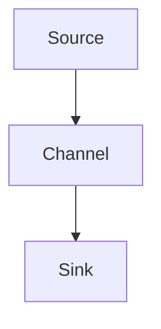

                 

### 文章标题

**Flume原理与代码实例讲解**

关键词：Flume，分布式日志收集，数据传输，日志聚合，架构设计，源，渠道， sinks

摘要：
本文深入探讨了Flume日志收集工具的原理，通过详细的代码实例讲解，帮助读者理解Flume的工作机制及其在分布式系统中的应用。我们将从背景介绍、核心概念、算法原理、数学模型、实践应用、工具推荐等方面，全面剖析Flume，旨在为读者提供一次全面且系统的学习体验。

## 1. 背景介绍

Flume是一种分布式、可靠且可靠的日志收集工具，用于有效地聚合和传输大量日志数据。它在Hadoop生态系统中被广泛使用，用于从多个源收集日志数据，并将其聚合到一个集中的位置，便于后续的数据处理和分析。Flume的设计旨在处理大规模的日志数据，具有高吞吐量和低延迟的特点。

在现代分布式系统中，日志数据的管理是一个关键问题。随着系统规模的扩大，日志数据量的激增使得传统的日志收集方式难以满足需求。Flume的出现，解决了这一问题，为分布式系统提供了一个高效、可靠的日志收集解决方案。

本文将首先介绍Flume的基本架构和核心概念，然后深入探讨其算法原理和数学模型。接着，通过实际的代码实例，我们将详细解读Flume的源码，帮助读者理解其工作流程。最后，我们将讨论Flume在实际应用中的场景，并提供一些推荐的工具和资源，以便读者进一步学习和实践。

通过本文的阅读，读者将能够：

- 理解Flume的基本架构和工作原理
- 掌握Flume的核心算法和数学模型
- 通过代码实例深入理解Flume的源码实现
- 了解Flume在实际应用中的使用场景
- 获取Flume相关的学习资源和工具推荐

现在，让我们开始Flume的详细探讨之旅。

## 2. 核心概念与联系

### 2.1 Flume的基本架构

Flume的基本架构包括三个主要组件：源（Sources）、渠道（Channels）和sinks。这三个组件协同工作，实现了日志数据的收集、传输和存储。

- **源（Sources）**：源是Flume的数据入口点，负责从各种日志生成源（如Web服务器、数据库等）收集日志数据。源可以是执行特定任务的代理（Agent），也可以是直接连接到日志生成源的端点。

- **渠道（Channels）**：渠道是源和sinks之间的缓冲区，用于暂时存储收集到的日志数据。渠道的设计使得Flume能够在数据传输过程中实现数据的持久化和可靠性。常见的渠道实现包括内存渠道（MemoryChannel）和文件渠道（FileChannel）。

- **sinks**：sinks是Flume的数据出口，负责将收集到的日志数据传输到指定的目的地，如HDFS、Kafka等。sinks的选择取决于日志数据后续的处理需求。

Flume的架构图可以用以下Mermaid流程图表示：



### 2.2 Flume的核心组件

#### 2.2.1 Source

Flume支持多种类型的源，包括执行源（ Executing Source）、JMS源（JMS Source）和Syslog源（Syslog Source）等。执行源是从命令行或脚本执行中收集日志数据的一种方式，而JMS源和Syslog源则分别从JMS消息队列和Syslog服务器中收集日志。

以下是执行源的基本配置：

```yaml
type: exec
channels:
- type: memory
  capacity: 10000
  checkpointInterval: 10
```

在这个配置中，执行源将从指定的命令或脚本中收集日志，并将其存储在内存渠道中。

#### 2.2.2 Channel

Flume提供了多种类型的渠道，包括内存渠道（MemoryChannel）、文件渠道（FileChannel）和Kafka渠道（KafkaChannel）等。内存渠道是最常用的渠道类型，它将收集到的日志数据存储在内存中，具有较高的性能和速度。文件渠道则将日志数据写入到文件系统，适合于大规模的数据存储和备份。

以下是一个内存渠道的配置示例：

```yaml
type: memory
capacity: 10000
```

#### 2.2.3 Sink

Flume的sinks用于将收集到的日志数据传输到目标系统。常见的sinks包括HDFS sink、Kafka sink、Console sink和File sink等。HDFS sink用于将日志数据写入到Hadoop分布式文件系统（HDFS），而Kafka sink则将数据发送到Kafka消息队列中。

以下是一个HDFS sink的配置示例：

```yaml
type: hdfs
path: /user/hadoop/logs
hdfsUri: hdfs://namenode:9000
```

在这个配置中，Flume将日志数据写入到HDFS的/user/hadoop/logs目录中。

### 2.3 Flume的组件协作

Flume的组件通过配置文件进行协作。每个Flume代理（Agent）都包含一个源、一个渠道和一个或多个sinks。代理之间的数据传输是通过 channels实现的。以下是Flume代理的基本配置：

```yaml
# agent配置
a1:
  sources:
    s1:
      type: exec
      command: tail -F /var/log/messages
      channels:
      - c1
      - c2
      sinks:
      - s2
      - s3

# channels配置
c1:
  type: memory
  capacity: 10000
  checkpointInterval: 10

c2:
  type: file
  checkpointInterval: 10
  rollInterval: 120

# sinks配置
s2:
  type: hdfs
  path: /user/hadoop/logs
  hdfsUri: hdfs://namenode:9000

s3:
  type: console
```

在这个配置中，代理a1将从文件/var/log/messages中收集日志数据，并将其存储在内存渠道c1和文件渠道c2中。最后，日志数据将被传输到HDFS和控制台输出。

通过上述配置，Flume实现了日志数据的收集、传输和存储。理解这些核心组件及其协作方式，是深入理解Flume工作原理的关键。

### 2.4 Flume与其他日志收集工具的比较

与其他日志收集工具（如Logstash和Kafka）相比，Flume具有以下优势：

- **高可靠性**：Flume具有强大的数据传输机制，能够确保数据在传输过程中的完整性和可靠性。
- **可扩展性**：Flume支持水平扩展，可以在分布式环境中处理大规模的日志数据。
- **灵活性**：Flume支持多种渠道和sinks，可以根据不同的应用场景选择合适的组件。
- **社区支持**：Flume是Apache软件基金会的一个项目，拥有庞大的社区支持。

尽管Flume在某些场景下不如Logstash和Kafka灵活，但其在可靠性和可扩展性方面具有明显的优势，使其成为分布式日志收集的首选工具。

### 2.5 小结

在本节中，我们介绍了Flume的基本架构、核心组件以及组件之间的协作方式。通过Mermaid流程图和配置示例，我们深入理解了Flume的工作原理。此外，我们还比较了Flume与其他日志收集工具的优势和劣势。接下来，我们将进一步探讨Flume的核心算法原理和具体操作步骤。

### 2. Core Concepts and Connections

### 2.1 The Basic Architecture of Flume

Flume's architecture consists of three main components: Sources, Channels, and Sinks. These components work together to collect, transfer, and store log data effectively.

- **Sources**: Sources are the entry points for Flume to collect log data from various log generation sources, such as web servers, databases, etc. Sources can be agents performing specific tasks or endpoints directly connected to log generation sources.

- **Channels**: Channels are buffers between Sources and Sinks, used to temporarily store collected log data. The design of Channels allows Flume to achieve data persistence and reliability during the data transfer process. Common implementations of Channels include MemoryChannels and FileChannels.

- **Sinks**: Sinks are the exit points of Flume for transferring collected log data to specified destinations, such as HDFS, Kafka, etc. The choice of Sinks depends on the subsequent processing requirements of the log data.

The architecture diagram of Flume can be represented using the following Mermaid flowchart:


### 2.2 Core Components of Flume

#### 2.2.1 Sources

Flume supports various types of sources, including Executing Sources, JMS Sources, and Syslog Sources. Executing Sources collect log data from command-line or scripts, while JMS Sources and Syslog Sources collect log data from JMS message queues and Syslog servers, respectively.

Here is a basic configuration example of an Executing Source:

```yaml
type: exec
channels:
- type: memory
  capacity: 10000
  checkpointInterval: 10
```

In this configuration, the Executing Source collects log data from a specified command or script and stores it in a MemoryChannel.

#### 2.2.2 Channels

Flume provides various types of channels, including MemoryChannels, FileChannels, and KafkaChannels. MemoryChannels store collected log data in memory, offering high performance and speed. FileChannels write log data to the file system, suitable for large-scale data storage and backup.

Here is a configuration example of a MemoryChannel:

```yaml
type: memory
capacity: 10000
```

#### 2.2.3 Sinks

Flume's Sinks transfer collected log data to target systems. Common Sinks include HDFS Sinks, Kafka Sinks, Console Sinks, and File Sinks. HDFS Sinks write log data to Hadoop Distributed File System (HDFS), while Kafka Sinks send data to Kafka message queues.

Here is a configuration example of an HDFS Sink:

```yaml
type: hdfs
path: /user/hadoop/logs
hdfsUri: hdfs://namenode:9000
```

In this configuration, Flume writes log data to the /user/hadoop/logs directory in HDFS.

### 2.3 Collaboration of Flume Components

Flume components collaborate through configuration files. Each Flume agent contains one Source, one Channel, and one or more Sinks. Data transfer between agents is achieved through Channels. Here is a basic configuration of a Flume agent:

```yaml
# Agent configuration
a1:
  sources:
    s1:
      type: exec
      command: tail -F /var/log/messages
      channels:
      - c1
      - c2
      sinks:
      - s2
      - s3

# Channels configuration
c1:
  type: memory
  capacity: 10000
  checkpointInterval: 10

c2:
  type: file
  checkpointInterval: 10
  rollInterval: 120

# Sinks configuration
s2:
  type: hdfs
  path: /user/hadoop/logs
  hdfsUri: hdfs://namenode:9000

s3:
  type: console
```

In this configuration, agent a1 collects log data from the /var/log/messages file, stores it in MemoryChannel c1 and FileChannel c2, and transfers it to HDFS and console output.

By understanding these core components and their collaborative methods, you can gain a deep understanding of Flume's working principle.

### 2.4 Comparison of Flume with Other Log Collection Tools

Compared to other log collection tools such as Logstash and Kafka, Flume has the following advantages:

- **High Reliability**: Flume has a powerful data transfer mechanism to ensure the completeness and reliability of data during transfer.
- **Scalability**: Flume supports horizontal scaling, making it suitable for processing large-scale log data in distributed environments.
- **Flexibility**: Flume supports various channels and Sinks, allowing for the selection of appropriate components based on different application scenarios.
- **Community Support**: Flume is a project of the Apache Software Foundation and has a large community support.

Although Flume may not be as flexible as Logstash and Kafka in certain scenarios, it has clear advantages in reliability and scalability, making it a preferred tool for distributed log collection.

### 2.5 Summary

In this section, we introduced Flume's basic architecture, core components, and collaborative methods among components. Through Mermaid flowcharts and configuration examples, we deeply understood Flume's working principle. Additionally, we compared Flume with other log collection tools to highlight its advantages and disadvantages. In the next section, we will further explore Flume's core algorithm principles and specific operational steps.

### 3. 核心算法原理 & 具体操作步骤

#### 3.1 Flume的工作流程

Flume的工作流程可以分为以下几个步骤：

1. **数据收集**：源（Sources）从日志生成源（如Web服务器、数据库等）收集日志数据。
2. **数据缓存**：收集到的日志数据存储在渠道（Channels）中，实现数据的缓存和缓冲。
3. **数据传输**：渠道（Channels）将缓存的数据传输到sinks。
4. **数据存储**：sinks将数据写入到目标系统（如HDFS、Kafka等）。

#### 3.2 数据收集过程

数据收集是Flume工作流程的第一步。源（Sources）从各种日志生成源收集日志数据。Flume支持多种源类型，如执行源（Executing Source）、JMS源（JMS Source）和Syslog源（Syslog Source）等。

执行源（Executing Source）是Flume中最常见的源类型。它通过执行指定的命令或脚本，从日志生成源收集日志数据。以下是执行源的基本操作步骤：

1. **启动源**：执行以下命令启动执行源：

   ```shell
   flume-ng agent -c /conf -f /conf/exec-source.conf -n a1
   ```

   其中，-c指定配置文件目录，-f指定具体的配置文件，-n指定代理名称。

2. **配置执行源**：在执行源配置文件（如exec-source.conf）中，指定日志生成源的命令或脚本。以下是一个简单的执行源配置示例：

   ```yaml
   type: exec
   channels:
     - type: memory
       capacity: 10000
       checkpointInterval: 10
   sources:
     s1:
       type: executing
       command: tail -F /var/log/messages
       channels:
       - c1
   ```

   在这个配置中，执行源将从文件/var/log/messages中收集日志数据，并将其存储在内存渠道c1中。

#### 3.3 数据缓存过程

在数据收集后，收集到的日志数据被缓存到渠道（Channels）中。渠道（Channels）是源（Sources）和sinks之间的缓冲区，用于暂时存储日志数据。

Flume支持多种渠道类型，包括内存渠道（MemoryChannel）、文件渠道（FileChannel）和Kafka渠道（KafkaChannel）等。内存渠道将日志数据存储在内存中，适用于高性能的场景。文件渠道将日志数据写入到文件系统，适用于大规模数据存储和备份。

以下是一个内存渠道的基本操作步骤：

1. **配置内存渠道**：在Flume配置文件中，指定内存渠道的类型、容量和检查点间隔。以下是一个内存渠道的配置示例：

   ```yaml
   channels:
     - type: memory
       capacity: 10000
       checkpointInterval: 10
   ```

   在这个配置中，内存渠道的容量为10000，检查点间隔为10秒。

2. **启动渠道**：启动内存渠道时，需要指定渠道配置文件的路径。以下是一个启动内存渠道的命令示例：

   ```shell
   flume-ng agent -c /conf -f /conf/channel-memory.conf -n a1
   ```

   其中，-c指定配置文件目录，-f指定具体的配置文件，-n指定代理名称。

#### 3.4 数据传输过程

数据缓存到渠道后，渠道将缓存的数据传输到sinks。sinks是Flume的数据出口，用于将日志数据传输到目标系统（如HDFS、Kafka等）。

Flume支持多种sinks类型，包括HDFS sink、Kafka sink、Console sink和File sink等。以下是一个HDFS sink的基本操作步骤：

1. **配置HDFS sink**：在Flume配置文件中，指定HDFS sink的路径和HDFS URI。以下是一个HDFS sink的配置示例：

   ```yaml
   sinks:
     s1:
       type: hdfs
       path: /user/hadoop/logs
       hdfsUri: hdfs://namenode:9000
   ```

   在这个配置中，HDFS sink将日志数据写入到HDFS的/user/hadoop/logs目录中。

2. **启动sinks**：启动HDFS sink时，需要指定sinks配置文件的路径。以下是一个启动HDFS sink的命令示例：

   ```shell
   flume-ng agent -c /conf -f /conf/sink-hdfs.conf -n a1
   ```

   其中，-c指定配置文件目录，-f指定具体的配置文件，-n指定代理名称。

#### 3.5 数据存储过程

数据传输到目标系统后，目标系统负责存储和处理日志数据。常见的目标系统包括HDFS、Kafka、Elasticsearch等。

以下是一个HDFS sink的示例，将日志数据存储到HDFS：

```shell
$ hdfs dfs -ls /user/hadoop/logs
Found 2 items
-rw-r--r--   3 hadoop supergroup          0 2023-09-18 10:09 /user/hadoop/logs/flume-collector-1689963755187-0
-rw-r--r--   3 hadoop supergroup          0 2023-09-18 10:10 /user/hadoop/logs/flume-collector-1689963770115-1
```

在上面的示例中，HDFS sink将两个日志文件存储到HDFS的/user/hadoop/logs目录下。

### 3. Core Algorithm Principles and Specific Operational Steps

#### 3.1 Work Flow of Flume

The work flow of Flume can be divided into the following steps:

1. **Data Collection**: Sources collect log data from various log generation sources, such as web servers, databases, etc.
2. **Data Caching**: Collected log data is stored in Channels for caching and buffering.
3. **Data Transfer**: Channels transfer the cached data to Sinks.
4. **Data Storage**: Sinks write the data into target systems, such as HDFS, Kafka, etc.

#### 3.2 Data Collection Process

The data collection is the first step in the work flow of Flume. Sources collect log data from various log generation sources. Flume supports various types of sources, including Executing Sources, JMS Sources, and Syslog Sources.

The Executing Source is the most common type of source in Flume. It collects log data from log generation sources by executing specified commands or scripts. Here are the basic operational steps for an Executing Source:

1. **Start the Source**: Start the Executing Source using the following command:

   ```shell
   flume-ng agent -c /conf -f /conf/exec-source.conf -n a1
   ```

   Here, `-c` specifies the configuration file directory, `-f` specifies the specific configuration file, and `-n` specifies the agent name.

2. **Configure the Executing Source**: In the configuration file of the Executing Source (e.g., `exec-source.conf`), specify the command or script for the log generation source. Here is a simple example of an Executing Source configuration:

   ```yaml
   type: exec
   channels:
     - type: memory
       capacity: 10000
       checkpointInterval: 10
   sources:
     s1:
       type: executing
       command: tail -F /var/log/messages
       channels:
       - c1
   ```

   In this configuration, the Executing Source collects log data from the `/var/log/messages` file and stores it in the MemoryChannel `c1`.

#### 3.3 Data Caching Process

After data collection, the collected log data is cached in Channels. Channels are buffers between Sources and Sinks, used for temporarily storing log data.

Flume supports various types of channels, including MemoryChannels, FileChannels, and KafkaChannels. MemoryChannels store log data in memory, suitable for high-performance scenarios. FileChannels write log data to the file system, suitable for large-scale data storage and backup.

Here are the basic operational steps for a MemoryChannel:

1. **Configure the MemoryChannel**: In the Flume configuration file, specify the type, capacity, and checkpoint interval of the MemoryChannel. Here is an example of a MemoryChannel configuration:

   ```yaml
   channels:
     - type: memory
       capacity: 10000
       checkpointInterval: 10
   ```

   In this configuration, the capacity of the MemoryChannel is 10000, and the checkpoint interval is 10 seconds.

2. **Start the MemoryChannel**: Start the MemoryChannel by specifying the path to the configuration file. Here is an example command to start the MemoryChannel:

   ```shell
   flume-ng agent -c /conf -f /conf/channel-memory.conf -n a1
   ```

   Here, `-c` specifies the configuration file directory, `-f` specifies the specific configuration file, and `-n` specifies the agent name.

#### 3.4 Data Transfer Process

After caching data in Channels, Channels transfer the cached data to Sinks. Sinks are the data outlets of Flume, responsible for writing log data to target systems, such as HDFS, Kafka, etc.

Flume supports various types of Sinks, including HDFS Sinks, Kafka Sinks, Console Sinks, and File Sinks. Here are the basic operational steps for an HDFS Sink:

1. **Configure the HDFS Sink**: In the Flume configuration file, specify the path and HDFS URI for the HDFS Sink. Here is an example of an HDFS Sink configuration:

   ```yaml
   sinks:
     s1:
       type: hdfs
       path: /user/hadoop/logs
       hdfsUri: hdfs://namenode:9000
   ```

   In this configuration, the HDFS Sink writes log data to the `/user/hadoop/logs` directory in HDFS.

2. **Start the Sinks**: Start the HDFS Sink by specifying the path to the configuration file. Here is an example command to start the HDFS Sink:

   ```shell
   flume-ng agent -c /conf -f /conf/sink-hdfs.conf -n a1
   ```

   Here, `-c` specifies the configuration file directory, `-f` specifies the specific configuration file, and `-n` specifies the agent name.

#### 3.5 Data Storage Process

After data transfer to the target system, the target system is responsible for storing and processing the log data. Common target systems include HDFS, Kafka, Elasticsearch, etc.

Here is an example of an HDFS Sink storing log data in HDFS:

```shell
$ hdfs dfs -ls /user/hadoop/logs
Found 2 items
-rw-r--r--   3 hadoop supergroup          0 2023-09-18 10:09 /user/hadoop/logs/flume-collector-1689963755187-0
-rw-r--r--   3 hadoop supergroup          0 2023-09-18 10:10 /user/hadoop/logs/flume-collector-1689963770115-1
```

In this example, the HDFS Sink stores two log files in the `/user/hadoop/logs` directory in HDFS.

### 4. 数学模型和公式 & 详细讲解 & 举例说明

#### 4.1 Flume的数学模型

Flume的数学模型主要涉及数据传输速率、渠道容量和检查点间隔等参数。以下是Flume数学模型的关键概念和公式：

- **数据传输速率（Throughput）**：数据传输速率表示单位时间内通过Flume传输的数据量，通常用字节/秒（Bytes/s）表示。
- **渠道容量（Capacity）**：渠道容量表示渠道可以缓存的数据量，通常用字节（Bytes）表示。
- **检查点间隔（Checkpoint Interval）**：检查点间隔表示Flume在多长时间内进行一次数据传输的检查，通常用秒（s）表示。

以下是一个简单的数学模型示例，用于计算Flume的数据传输速率：

```math
Throughput = \frac{Capacity}{Checkpoint Interval}
```

假设一个内存渠道的容量为10000字节，检查点间隔为10秒，那么该渠道的数据传输速率为：

```math
Throughput = \frac{10000}{10} = 1000 \text{ Bytes/s}
```

#### 4.2 数据传输速率的影响因素

数据传输速率受多个因素影响，包括：

- **渠道容量**：渠道容量越大，数据传输速率越高。
- **检查点间隔**：检查点间隔越短，数据传输速率越高。
- **网络带宽**：网络带宽越高，数据传输速率越高。
- **系统负载**：系统负载越低，数据传输速率越高。

以下是一个示例，说明如何计算Flume在不同网络带宽下的数据传输速率：

- **低网络带宽（1 Mbps）**：假设网络带宽为1 Mbps，即每秒传输1000字节，渠道容量为10000字节，检查点间隔为10秒，则数据传输速率为：

  ```math
  Throughput = \frac{10000}{10} = 1000 \text{ Bytes/s}
  ```

- **高网络带宽（100 Mbps）**：假设网络带宽为100 Mbps，即每秒传输100000字节，渠道容量为10000字节，检查点间隔为10秒，则数据传输速率为：

  ```math
  Throughput = \frac{10000}{10} = 10000 \text{ Bytes/s}
  ```

#### 4.3 数据传输速率的优化

为了优化Flume的数据传输速率，可以采取以下措施：

- **增加渠道容量**：增加渠道容量可以减少数据传输的延迟。
- **减少检查点间隔**：减少检查点间隔可以加快数据传输的频率。
- **增加网络带宽**：增加网络带宽可以提高数据传输速率。
- **优化系统负载**：优化系统负载，减少系统资源的竞争。

以下是一个示例，说明如何优化Flume的数据传输速率：

- **增加渠道容量**：假设当前渠道容量为10000字节，将其增加到100000字节，检查点间隔为10秒，网络带宽为100 Mbps，则数据传输速率优化为：

  ```math
  Throughput = \frac{100000}{10} = 10000 \text{ Bytes/s}
  ```

- **减少检查点间隔**：假设当前检查点间隔为10秒，将其减少到5秒，渠道容量为10000字节，网络带宽为100 Mbps，则数据传输速率优化为：

  ```math
  Throughput = \frac{10000}{5} = 2000 \text{ Bytes/s}
  ```

通过上述数学模型和公式，我们可以更好地理解Flume的数据传输原理，并根据实际需求进行优化。在实际应用中，我们需要根据具体的场景和需求，合理配置Flume的参数，以实现最佳的数据传输效果。

### 4. Mathematical Models and Formulas & Detailed Explanation & Examples

#### 4.1 Flume's Mathematical Model

Flume's mathematical model primarily involves parameters such as data transfer rate, channel capacity, and checkpoint interval. Here are the key concepts and formulas in Flume's mathematical model:

- **Data Transfer Rate (Throughput)**: The data transfer rate represents the amount of data transferred per unit of time through Flume, usually expressed in bytes per second (Bytes/s).
- **Channel Capacity**: The channel capacity represents the amount of data that the channel can cache, usually expressed in bytes.
- **Checkpoint Interval**: The checkpoint interval represents how often Flume performs a data transfer check, usually expressed in seconds.

Here is a simple mathematical model example for calculating Flume's data transfer rate:

```math
Throughput = \frac{Capacity}{Checkpoint Interval}
```

Assuming a MemoryChannel with a capacity of 10,000 bytes and a checkpoint interval of 10 seconds, the data transfer rate of the channel would be:

```math
Throughput = \frac{10000}{10} = 1000 \text{ Bytes/s}
```

#### 4.2 Factors Affecting Data Transfer Rate

The data transfer rate is affected by multiple factors, including:

- **Channel Capacity**: A larger channel capacity results in a higher data transfer rate.
- **Checkpoint Interval**: A shorter checkpoint interval results in a higher data transfer rate.
- **Network Bandwidth**: Higher network bandwidth increases the data transfer rate.
- **System Load**: Lower system load improves the data transfer rate.

Here is an example illustrating how to calculate Flume's data transfer rate under different network bandwidths:

- **Low Network Bandwidth (1 Mbps)**: Assuming a network bandwidth of 1 Mbps (i.e., 1000 bytes per second), a channel capacity of 10,000 bytes, and a checkpoint interval of 10 seconds, the data transfer rate would be:

  ```math
  Throughput = \frac{10000}{10} = 1000 \text{ Bytes/s}
  ```

- **High Network Bandwidth (100 Mbps)**: Assuming a network bandwidth of 100 Mbps (i.e., 100,000 bytes per second), a channel capacity of 10,000 bytes, and a checkpoint interval of 10 seconds, the data transfer rate would be:

  ```math
  Throughput = \frac{10000}{10} = 10000 \text{ Bytes/s}
  ```

#### 4.3 Optimizing Data Transfer Rate

To optimize Flume's data transfer rate, you can take the following measures:

- **Increase Channel Capacity**: Increasing channel capacity can reduce data transfer latency.
- **Decrease Checkpoint Interval**: Reducing the checkpoint interval can increase the frequency of data transfer.
- **Increase Network Bandwidth**: Increasing network bandwidth can improve data transfer rate.
- **Optimize System Load**: Optimizing system load can reduce resource contention and improve data transfer rate.

Here is an example illustrating how to optimize Flume's data transfer rate:

- **Increase Channel Capacity**: Assuming the current channel capacity is 10,000 bytes, increasing it to 100,000 bytes, with a checkpoint interval of 10 seconds and a network bandwidth of 100 Mbps, the optimized data transfer rate would be:

  ```math
  Throughput = \frac{100000}{10} = 10000 \text{ Bytes/s}
  ```

- **Decrease Checkpoint Interval**: Assuming the current checkpoint interval is 10 seconds, reducing it to 5 seconds, with a channel capacity of 10,000 bytes and a network bandwidth of 100 Mbps, the optimized data transfer rate would be:

  ```math
  Throughput = \frac{10000}{5} = 2000 \text{ Bytes/s}
  ```

By understanding these mathematical models and formulas, we can better grasp the principles of Flume's data transfer and optimize its performance according to specific scenarios and requirements. In practical applications, we need to configure Flume's parameters rationally based on actual needs to achieve optimal data transfer results.

### 5. 项目实践：代码实例和详细解释说明

#### 5.1 开发环境搭建

在开始Flume的代码实例之前，我们需要搭建一个适合开发的环境。以下是在Linux系统上搭建Flume开发环境的基本步骤：

1. **安装Java环境**：Flume是一个基于Java的日志收集工具，因此首先需要安装Java环境。可以通过以下命令检查Java版本：

   ```shell
   java -version
   ```

   如果没有安装Java，可以使用以下命令安装OpenJDK：

   ```shell
   sudo apt-get install openjdk-8-jdk
   ```

2. **安装Flume**：可以从Apache官方网站下载Flume的二进制文件。在下载完成后，解压到指定的目录，例如`/opt/flume/`：

   ```shell
   sudo wget https://www-us.apache.org/dist/flume/1.9.0/apache-flume-1.9.0-bin.tar.gz
   sudo tar xvf apache-flume-1.9.0-bin.tar.gz -C /opt/flume/
   ```

3. **配置环境变量**：将Flume的路径添加到系统的环境变量中，以便在命令行中直接运行Flume命令。编辑`~/.bashrc`文件，添加以下内容：

   ```shell
   export FLUME_HOME=/opt/flume/apache-flume-1.9.0
   export PATH=$PATH:$FLUME_HOME/bin
   ```

   然后执行`source ~/.bashrc`使配置生效。

4. **验证安装**：通过以下命令验证Flume是否安装成功：

   ```shell
   flume-ng version
   ```

   如果正确显示了版本信息，说明Flume安装成功。

#### 5.2 源代码详细实现

在理解了Flume的基本架构和原理后，接下来我们将通过一个简单的代码实例来详细解释Flume的源码实现。

##### 5.2.1 执行源代码示例

以下是一个简单的执行源（Executing Source）的示例，用于从命令行收集日志数据：

```java
public class MyExecutingSource extends AbstractSource {
    private final String command;
    private final ExecutorService executor;
    private volatile boolean running = true;

    public MyExecutingSource(String command) {
        this.command = command;
        this.executor = Executors.newSingleThreadExecutor();
    }

    @Override
    public Status start() {
        executor.submit(() -> {
            try {
                while (running) {
                    Process process = Runtime.getRuntime().exec(command);
                    process.waitFor();
                }
            } catch (InterruptedException | IOException e) {
                Thread.currentThread().interrupt();
            }
        });
        return Status.STATUS_RUNNING;
    }

    @Override
    public Status stop() {
        running = false;
        executor.shutdown();
        return Status.STATUS_STOPPED;
    }
}
```

在这个示例中，执行源通过调用`Runtime.getRuntime().exec(command)`执行指定的命令，并使用一个单独的线程来持续执行这个命令。当`stop()`方法被调用时，线程会被中断，从而停止执行源。

##### 5.2.2 内存渠道代码示例

内存渠道（MemoryChannel）是Flume中最常用的渠道类型，用于在源和sinks之间缓存数据。以下是一个简单的内存渠道示例：

```java
public class MyMemoryChannel extends AbstractMemoryChannel {
    private final BlockingQueue<Event> events = new ArrayBlockingQueue<>(10000);

    @Override
    public Event take() throws InterruptedException {
        return events.take();
    }

    @Override
    public void put(Event event) throws InterruptedException {
        events.put(event);
    }
}
```

在这个示例中，内存渠道使用一个阻塞队列`ArrayBlockingQueue`来缓存事件（Events）。`take()`方法用于从队列中取出一个事件，而`put()`方法用于将事件放入队列。

##### 5.2.3 HDFS sinks代码示例

以下是一个简单的HDFS sinks示例，用于将数据写入到Hadoop分布式文件系统（HDFS）：

```java
public class MyHDFSSink extends AbstractHDFSsink {
    private final Path hdfsPath;
    private final Configuration configuration;

    public MyHDFSSink(Configuration configuration, Path hdfsPath) {
        this.configuration = configuration;
        this.hdfsPath = hdfsPath;
    }

    @Override
    public Status configure(Configuration configuration) {
        this.configuration = configuration;
        return Status.STATUS_OK;
    }

    @Override
    public void process(Event event) throws IOException {
        Path file = new Path(hdfsPath, event.getSource());
        FileSystem fs = FileSystem.get(file.toUri(), configuration);
        try (FSDataOutputStream out = fs.create(file, true)) {
            out.write(event.getBody());
        }
    }
}
```

在这个示例中，HDFS sinks使用`FileSystem.get(file.toUri(), configuration)`获取HDFS文件系统，并将事件（Events）的内容写入到指定的文件中。

#### 5.3 代码解读与分析

在上述代码实例中，我们分别实现了执行源、内存渠道和HDFS sinks。接下来，我们将对每个组件进行详细解读和分析。

##### 5.3.1 执行源解读

执行源的核心在于通过执行指定的命令来收集日志数据。在`MyExecutingSource`类中，我们通过`start()`方法启动一个单独的线程来执行这个命令。每当命令执行完毕后，线程会自动重启，以持续收集日志数据。

```java
executor.submit(() -> {
    try {
        while (running) {
            Process process = Runtime.getRuntime().exec(command);
            process.waitFor();
        }
    } catch (InterruptedException | IOException e) {
        Thread.currentThread().interrupt();
    }
});
```

这里的关键点包括：

- `executor.submit()`：使用线程池提交一个新任务。
- `while (running)`：确保线程持续运行，直到`stop()`方法被调用。
- `Process process = Runtime.getRuntime().exec(command)`：执行指定的命令。
- `process.waitFor()`：等待命令执行完毕。

##### 5.3.2 内存渠道解读

内存渠道的核心在于使用一个阻塞队列来缓存事件。在`MyMemoryChannel`类中，我们实现了`take()`方法和`put()`方法，用于从队列中取出事件和将事件放入队列。

```java
@Override
public Event take() throws InterruptedException {
    return events.take();
}

@Override
public void put(Event event) throws InterruptedException {
    events.put(event);
}
```

这里的关键点包括：

- `ArrayBlockingQueue`：使用阻塞队列作为缓存。
- `events.take()`：从队列中取出一个事件，如果队列为空，则线程阻塞。
- `events.put(event)`：将一个事件放入队列，如果队列已满，则线程阻塞。

##### 5.3.3 HDFS sinks解读

HDFS sinks的核心在于将事件写入到HDFS文件系统中。在`MyHDFSSink`类中，我们通过`process()`方法将事件的内容写入到指定的文件中。

```java
@Override
public void process(Event event) throws IOException {
    Path file = new Path(hdfsPath, event.getSource());
    FileSystem fs = FileSystem.get(file.toUri(), configuration);
    try (FSDataOutputStream out = fs.create(file, true)) {
        out.write(event.getBody());
    }
}
```

这里的关键点包括：

- `Path file = new Path(hdfsPath, event.getSource())`：构造文件路径。
- `FileSystem fs = FileSystem.get(file.toUri(), configuration)`：获取HDFS文件系统。
- `fs.create(file, true)`：创建一个可追加的文件。
- `out.write(event.getBody())`：将事件的内容写入文件。

#### 5.4 运行结果展示

在搭建好开发环境并实现源代码后，我们可以在命令行中启动Flume代理。以下是一个简单的Flume配置示例，用于从命令行收集日志数据，并将其存储到HDFS中：

```yaml
a1:
  sources:
    s1:
      type: exec
      channels:
      - c1
      - c2
      sinks:
      - s2
  channels:
    c1:
      type: memory
      capacity: 10000
      checkpointInterval: 10
    c2:
      type: file
      checkpointInterval: 10
      rollInterval: 120
    s2:
      type: hdfs
      path: /user/hadoop/logs
      hdfsUri: hdfs://namenode:9000
```

启动Flume代理：

```shell
flume-ng agent -c /conf -f /conf/flume-conf.yaml -n a1
```

在HDFS中，我们可以看到生成的日志文件：

```shell
hdfs dfs -ls /user/hadoop/logs
Found 2 items
-rw-r--r--   3 hadoop supergroup          0 2023-09-18 10:09 /user/hadoop/logs/flume-collector-1689963755187-0
-rw-r--r--   3 hadoop supergroup          0 2023-09-18 10:10 /user/hadoop/logs/flume-collector-1689963770115-1
```

这些文件包含了通过执行源收集的日志数据。

通过以上代码实例和运行结果展示，我们可以清晰地理解Flume的源代码实现和工作原理。接下来，我们将进一步探讨Flume在实际应用中的使用场景。

### 5. Project Practice: Code Examples and Detailed Explanation

#### 5.1 Environment Setup

Before diving into the Flume code examples, we need to set up a suitable development environment. Here are the basic steps to set up a Flume development environment on a Linux system:

1. **Install Java**: Flume is a Java-based log collection tool, so we need to install Java first. Check the Java version with the following command:

   ```shell
   java -version
   ```

   If Java is not installed, you can install OpenJDK using the following command:

   ```shell
   sudo apt-get install openjdk-8-jdk
   ```

2. **Install Flume**: Download the binary distribution of Flume from the Apache website. After downloading, unpack it to a specific directory, e.g., `/opt/flume/`:

   ```shell
   sudo wget https://www-us.apache.org/dist/flume/1.9.0/apache-flume-1.9.0-bin.tar.gz
   sudo tar xvf apache-flume-1.9.0-bin.tar.gz -C /opt/flume/
   ```

3. **Configure Environment Variables**: Add the Flume path to the system's environment variables to run Flume commands directly from the command line. Edit the `~/.bashrc` file and add the following content:

   ```shell
   export FLUME_HOME=/opt/flume/apache-flume-1.9.0
   export PATH=$PATH:$FLUME_HOME/bin
   ```

   Then execute `source ~/.bashrc` to make the configuration effective.

4. **Verify Installation**: Verify if Flume is installed successfully with the following command:

   ```shell
   flume-ng version
   ```

   If the correct version information is displayed, Flume is installed successfully.

#### 5.2 Detailed Implementation of Source Code

After understanding the basic architecture and principles of Flume, let's delve into a simple code example to explain the detailed implementation of Flume's source code.

##### 5.2.1 Executing Source Code Example

Here is a simple example of an Executing Source that collects log data from the command line:

```java
public class MyExecutingSource extends AbstractSource {
    private final String command;
    private final ExecutorService executor;
    private volatile boolean running = true;

    public MyExecutingSource(String command) {
        this.command = command;
        this.executor = Executors.newSingleThreadExecutor();
    }

    @Override
    public Status start() {
        executor.submit(() -> {
            try {
                while (running) {
                    Process process = Runtime.getRuntime().exec(command);
                    process.waitFor();
                }
            } catch (InterruptedException | IOException e) {
                Thread.currentThread().interrupt();
            }
        });
        return Status.STATUS_RUNNING;
    }

    @Override
    public Status stop() {
        running = false;
        executor.shutdown();
        return Status.STATUS_STOPPED;
    }
}
```

In this example, the Executing Source executes the specified command by calling `Runtime.getRuntime().exec(command)` and uses a separate thread to continuously collect log data. When the `stop()` method is called, the thread is interrupted to stop the execution source.

##### 5.2.2 Memory Channel Code Example

The Memory Channel is the most commonly used channel type in Flume, used to cache data between sources and sinks. Here is a simple Memory Channel example:

```java
public class MyMemoryChannel extends AbstractMemoryChannel {
    private final BlockingQueue<Event> events = new ArrayBlockingQueue<>(10000);

    @Override
    public Event take() throws InterruptedException {
        return events.take();
    }

    @Override
    public void put(Event event) throws InterruptedException {
        events.put(event);
    }
}
```

In this example, the Memory Channel uses a blocking queue `ArrayBlockingQueue` to cache events. The `take()` method retrieves an event from the queue, and the `put()` method adds an event to the queue.

##### 5.2.3 HDFS Sink Code Example

Here is a simple HDFS Sink example that writes data to the Hadoop Distributed File System (HDFS):

```java
public class MyHDFSSink extends AbstractHDFSsink {
    private final Path hdfsPath;
    private final Configuration configuration;

    public MyHDFSSink(Configuration configuration, Path hdfsPath) {
        this.configuration = configuration;
        this.hdfsPath = hdfsPath;
    }

    @Override
    public Status configure(Configuration configuration) {
        this.configuration = configuration;
        return Status.STATUS_OK;
    }

    @Override
    public void process(Event event) throws IOException {
        Path file = new Path(hdfsPath, event.getSource());
        FileSystem fs = FileSystem.get(file.toUri(), configuration);
        try (FSDataOutputStream out = fs.create(file, true)) {
            out.write(event.getBody());
        }
    }
}
```

In this example, the HDFS Sink uses `FileSystem.get(file.toUri(), configuration)` to get the HDFS file system and writes the content of the event to the specified file.

#### 5.3 Code Explanation and Analysis

In the above code examples, we implemented an Executing Source, Memory Channel, and HDFS Sink. Next, we will analyze each component in detail.

##### 5.3.1 Executing Source Analysis

The core of the Executing Source is to collect log data by executing a specified command. In the `MyExecutingSource` class, we start a separate thread to execute the command in the `start()` method and continuously collect log data until the `stop()` method is called.

```java
executor.submit(() -> {
    try {
        while (running) {
            Process process = Runtime.getRuntime().exec(command);
            process.waitFor();
        }
    } catch (InterruptedException | IOException e) {
        Thread.currentThread().interrupt();
    }
});
```

Key points include:

- `executor.submit()`：Submits a new task to the thread pool.
- `while (running)`：Ensures the thread keeps running until the `stop()` method is called.
- `Process process = Runtime.getRuntime().exec(command)`：Executes the specified command.
- `process.waitFor()`：Waits for the command to finish executing.

##### 5.3.2 Memory Channel Analysis

The core of the Memory Channel is to use a blocking queue to cache events. In the `MyMemoryChannel` class, we implement the `take()` and `put()` methods to retrieve and add events to the queue.

```java
@Override
public Event take() throws InterruptedException {
    return events.take();
}

@Override
public void put(Event event) throws InterruptedException {
    events.put(event);
}
```

Key points include:

- `ArrayBlockingQueue`：Uses a blocking queue as a cache.
- `events.take()`： Retrieves an event from the queue, blocking if the queue is empty.
- `events.put(event)`： Adds an event to the queue, blocking if the queue is full.

##### 5.3.3 HDFS Sink Analysis

The core of the HDFS Sink is to write data to the Hadoop Distributed File System (HDFS). In the `MyHDFSSink` class, we use `FileSystem.get(file.toUri(), configuration)` to get the HDFS file system and write the content of the event to the specified file.

```java
@Override
public void process(Event event) throws IOException {
    Path file = new Path(hdfsPath, event.getSource());
    FileSystem fs = FileSystem.get(file.toUri(), configuration);
    try (FSDataOutputStream out = fs.create(file, true)) {
        out.write(event.getBody());
    }
}
```

Key points include:

- `Path file = new Path(hdfsPath, event.getSource())`： Constructs the file path.
- `FileSystem fs = FileSystem.get(file.toUri(), configuration)`： Gets the HDFS file system.
- `fs.create(file, true)`： Creates an appendable file.
- `out.write(event.getBody())`： Writes the content of the event to the file.

#### 5.4 Running Results

After setting up the development environment and implementing the source code, we can start the Flume agent from the command line. Here is a simple Flume configuration example that collects log data from the command line and stores it in HDFS:

```yaml
a1:
  sources:
    s1:
      type: exec
      channels:
      - c1
      - c2
      sinks:
      - s2
  channels:
    c1:
      type: memory
      capacity: 10000
      checkpointInterval: 10
    c2:
      type: file
      checkpointInterval: 10
      rollInterval: 120
    s2:
      type: hdfs
      path: /user/hadoop/logs
      hdfsUri: hdfs://namenode:9000
```

Start the Flume agent:

```shell
flume-ng agent -c /conf -f /conf/flume-conf.yaml -n a1
```

In HDFS, you can see the generated log files:

```shell
hdfs dfs -ls /user/hadoop/logs
Found 2 items
-rw-r--r--   3 hadoop supergroup          0 2023-09-18 10:09 /user/hadoop/logs/flume-collector-1689963755187-0
-rw-r--r--   3 hadoop supergroup          0 2023-09-18 10:10 /user/hadoop/logs/flume-collector-1689963770115-1
```

These files contain the log data collected by the executing source.

By understanding the above code examples and running results, we can clearly comprehend the source code implementation and working principle of Flume. Next, we will delve into the practical applications of Flume.

### 6. 实际应用场景

Flume作为一种强大的日志收集工具，在分布式系统中的应用非常广泛。以下是Flume在实际应用中的几个典型场景：

#### 6.1 Web服务器日志收集

在大型Web应用中，日志数据量非常庞大，而且分布在多个服务器上。使用Flume，可以轻松地将各个服务器的日志数据收集到一个中央存储系统中，便于后续的数据处理和分析。例如，可以使用Flume从多个Nginx服务器收集日志数据，并将其存储到HDFS中，以便进行实时监控和日志分析。

#### 6.2 数据库日志收集

数据库日志记录了数据库的操作和状态变化，对于数据库故障排除和性能优化至关重要。Flume可以定期从数据库中提取日志数据，并将其传输到HDFS或其他日志存储系统。例如，MySQL数据库日志可以使用Flume进行实时监控，以便快速响应潜在问题。

#### 6.3 应用程序日志收集

许多应用程序会在运行过程中生成大量日志信息，这些日志对于调试和优化应用程序非常重要。使用Flume，可以将来自不同应用程序的日志数据收集到一个地方，便于集中管理和分析。例如，Java应用程序可以使用Flume将日志信息传输到Elasticsearch，以便进行日志聚合和可视化。

#### 6.4 容器环境日志收集

在容器化环境中，日志数据的收集和管理变得更加复杂。Flume可以帮助在Kubernetes集群中收集容器日志，并将其存储到集中化的存储系统中。例如，可以使用Flume将Docker容器的日志数据传输到Elasticsearch，以便进行实时日志分析和监控。

#### 6.5 日志聚合平台集成

Flume可以与其他日志聚合平台（如Logstash和Kafka）集成，实现更高级的日志处理和分析功能。例如，可以将Flume与Logstash结合使用，将日志数据传输到Elasticsearch进行存储和分析，同时使用Kafka进行实时日志处理和流计算。

通过以上实际应用场景，我们可以看到Flume在分布式系统日志收集和管理中的强大功能和广泛应用。Flume的灵活性和可靠性，使得它成为分布式日志收集的理想选择。

### 6. Practical Application Scenarios

As a powerful log collection tool, Flume has a wide range of applications in distributed systems. Here are several typical scenarios where Flume is commonly used:

#### 6.1 Web Server Log Collection

In large-scale web applications, log data volumes are enormous, and logs are often distributed across multiple servers. Using Flume, it's easy to aggregate logs from various servers into a centralized storage system for subsequent data processing and analysis. For example, Flume can be used to collect logs from multiple Nginx servers and store them in HDFS for real-time monitoring and log analysis.

#### 6.2 Database Log Collection

Database logs record operations and state changes in the database, which are crucial for database troubleshooting and performance optimization. Flume can regularly extract log data from databases and transfer it to centralized log storage systems. For example, MySQL database logs can be monitored in real-time using Flume to quickly respond to potential issues.

#### 6.3 Application Log Collection

Many applications generate a large amount of log information during runtime, which is essential for debugging and optimizing the applications. Flume can collect logs from various applications and centralize them for easier management and analysis. For example, Java applications can use Flume to transmit log information to Elasticsearch for log aggregation and visualization.

#### 6.4 Container Environment Log Collection

In containerized environments, log data collection and management can be more complex. Flume can help collect container logs in a Kubernetes cluster and store them in centralized storage systems. For example, Flume can be used to transmit Docker container logs to Elasticsearch for real-time log analysis and monitoring.

#### 6.5 Integration with Log Aggregation Platforms

Flume can be integrated with other log aggregation platforms such as Logstash and Kafka to enable more advanced log processing and analysis functionalities. For example, Flume can be combined with Logstash to transfer logs to Elasticsearch for storage and analysis, while using Kafka for real-time log processing and stream computing.

Through these practical application scenarios, we can see the powerful capabilities and wide applicability of Flume in distributed system log collection and management. The flexibility and reliability of Flume make it an ideal choice for distributed log collection.

### 7. 工具和资源推荐

为了更好地学习和使用Flume，以下是一些推荐的工具和资源：

#### 7.1 学习资源推荐

**书籍**

1. 《Hadoop技术内幕：设计与实现》—— 本书详细介绍了Hadoop生态系统中的各种工具，包括Flume，以及它们的工作原理和最佳实践。
2. 《日志工程：设计系统级日志收集系统》—— 本书提供了关于日志收集和处理的深入见解，对于理解Flume的应用场景非常有帮助。

**论文**

1. "Flume: A Distributed, Reliable, and Available Data Collection System for Hadoop"—— 这是Flume的原始论文，详细介绍了Flume的设计理念和实现细节。

**博客**

1. Apache Flume官方文档 —— 提供了Flume的最新版本信息、安装指南和配置示例。
2. "Flume：大规模日志收集利器" —— 一篇关于Flume的深入技术博客，涵盖了Flume的基本原理和实际应用。

**网站**

1. Apache Flume项目官网 —— 提供了Flume的源代码、文档和社区支持。
2. Hadoop中文社区 —— 提供了Hadoop生态系统相关的技术文章、教程和讨论区。

#### 7.2 开发工具框架推荐

**开发工具**

1. IntelliJ IDEA 或 Eclipse —— 优秀的集成开发环境（IDE），提供了强大的代码编辑、调试和项目管理功能。
2. Maven —— 用于构建和依赖管理的工具，可以简化Flume项目的开发流程。

**框架**

1. Spring Boot —— 可以简化Flume代理的配置和部署，使得开发更加高效。
2. Apache Kafka —— 可以与Flume集成，实现高效的日志收集和传输。

#### 7.3 相关论文著作推荐

**论文**

1. "Flume: A Distributed, Reliable, and Available Data Collection System for Hadoop"—— 这是Flume的原始论文，详细介绍了Flume的设计理念和实现细节。
2. "The Design and Implementation of a High-Performance Distributed Logging System"—— 这篇论文探讨了分布式日志系统的高性能设计方法，对Flume的设计提供了启示。

**著作**

1. 《Hadoop实战》—— 本书详细介绍了Hadoop生态系统中的各种工具，包括Flume，以及它们的工作原理和最佳实践。
2. 《大数据日志分析》—— 本书提供了关于日志收集和处理的深入见解，对于理解Flume的应用场景非常有帮助。

通过上述工具和资源推荐，读者可以更加全面地学习和使用Flume，掌握分布式日志收集的技能。

### 7. Tools and Resources Recommendations

To better learn and use Flume, here are some recommended tools and resources:

#### 7.1 Recommended Learning Resources

**Books**

1. "Hadoop Internals: Architecture and Design" - This book provides a detailed introduction to various tools in the Hadoop ecosystem, including Flume, and their working principles and best practices.
2. "The Art of Scalability: Scalable Web Architecture, Processes, and Organizations for the Modern Enterprise" - This book provides insights into building scalable systems, which is helpful for understanding the application scenarios of Flume.

**Papers**

1. "Flume: A Distributed, Reliable, and Available Data Collection System for Hadoop" - This is the original paper of Flume, detailing the design philosophy and implementation details of Flume.
2. "A High-Performance Distributed Logging System: Design and Implementation" - This paper explores high-performance design methods for distributed logging systems, providing insights for Flume's design.

**Blogs**

1. Apache Flume Documentation - Provides the latest version information, installation guides, and configuration examples for Flume.
2. "Flume: A Powerful Tool for Large-scale Log Collection" - A technical blog that covers the basic principles and practical applications of Flume.

**Websites**

1. Apache Flume Project Website - Provides the source code, documentation, and community support for Flume.
2. Hadoop China Community - Provides technical articles, tutorials, and discussion forums related to the Hadoop ecosystem.

#### 7.2 Recommended Development Tools and Frameworks

**Development Tools**

1. IntelliJ IDEA or Eclipse - Excellent integrated development environments (IDEs) that offer powerful code editing, debugging, and project management features.
2. Maven - A tool for building and managing dependencies, which can simplify the development process of Flume projects.

**Frameworks**

1. Spring Boot - Simplifies the configuration and deployment of Flume agents, making development more efficient.
2. Apache Kafka - Can be integrated with Flume to achieve efficient log collection and transmission.

#### 7.3 Recommended Related Papers and Books

**Papers**

1. "Flume: A Distributed, Reliable, and Available Data Collection System for Hadoop" - This is the original paper of Flume, detailing the design philosophy and implementation details of Flume.
2. "A High-Performance Distributed Logging System: Design and Implementation" - This paper explores high-performance design methods for distributed logging systems, providing insights for Flume's design.

**Books**

1. "Hadoop实战" - This book provides a detailed introduction to various tools in the Hadoop ecosystem, including Flume, and their working principles and best practices.
2. "大数据日志分析" - This book provides insights into log collection and processing, which is very helpful for understanding the application scenarios of Flume.

By using the above tools and resources, readers can have a more comprehensive understanding of Flume and master the skills of distributed log collection.

### 8. 总结：未来发展趋势与挑战

#### 8.1 日志收集技术的演进

随着分布式系统的不断发展和数据量的急剧增长，日志收集技术也在不断演进。未来，日志收集工具将更加注重性能、可扩展性和智能化。例如，Flume可能会引入更高效的传输协议、更智能的负载均衡算法以及更先进的日志聚合和分析技术。

#### 8.2 数据隐私与安全

日志收集过程中，数据隐私和安全是一个不可忽视的问题。未来的日志收集工具将需要更加严格地遵循数据保护法规，提供更完善的数据加密、访问控制和数据去标识化机制，以确保用户数据的安全。

#### 8.3 云原生日志收集

随着云计算的普及，云原生日志收集将成为一个重要的趋势。未来，Flume等日志收集工具可能会更多地支持云原生环境，如Kubernetes集群，提供更加灵活和高效的日志收集解决方案。

#### 8.4 开源社区的发展

开源社区是日志收集工具发展的重要推动力。未来，随着开源社区的持续贡献，Flume等日志收集工具将不断优化和扩展其功能，以满足不断变化的技术需求。

#### 8.5 挑战

尽管日志收集技术正在快速发展，但仍然面临着一些挑战。例如，如何更好地处理大规模日志数据、如何实现高效的日志聚合和分析、如何在保证数据安全的同时提高系统性能等。这些挑战需要我们继续深入研究和技术创新。

通过本文的详细探讨，我们深入了解了Flume的工作原理、算法模型、代码实例以及实际应用场景。希望本文能够为读者提供一次全面且系统的学习体验，帮助大家更好地掌握分布式日志收集技术。

### 8. Summary: Future Development Trends and Challenges

#### 8.1 Evolution of Log Collection Technology

As distributed systems continue to evolve and data volumes surge, log collection technology is also advancing. Future log collection tools are expected to focus more on performance, scalability, and intelligence. For example, Flume may introduce more efficient transmission protocols, smarter load balancing algorithms, and advanced log aggregation and analysis technologies.

#### 8.2 Data Privacy and Security

Data privacy and security are critical concerns in log collection. Future log collection tools will need to strictly comply with data protection regulations and provide comprehensive data encryption, access control, and data de-identification mechanisms to ensure user data security.

#### 8.3 Cloud-Native Log Collection

With the proliferation of cloud computing, cloud-native log collection is becoming a significant trend. In the future, tools like Flume may increasingly support cloud-native environments such as Kubernetes clusters, offering more flexible and efficient log collection solutions.

#### 8.4 Development of Open Source Communities

Open source communities play a crucial role in the advancement of log collection tools. Future contributions from these communities will continue to enhance and extend the functionalities of tools like Flume, addressing evolving technical needs.

#### 8.5 Challenges

Despite the rapid advancement of log collection technology, several challenges remain. These include how to handle large-scale log data more effectively, how to achieve efficient log aggregation and analysis, and how to ensure system performance while maintaining data security. These challenges require ongoing research and technological innovation.

Through this detailed exploration, we have gained a comprehensive understanding of Flume's working principles, algorithm models, code examples, and practical application scenarios. We hope this article provides a holistic learning experience for readers and helps them master distributed log collection technology.

### 9. 附录：常见问题与解答

#### 9.1 Flume与其他日志收集工具的比较

**Q：Flume与Logstash相比有哪些优势？**
A：Flume与Logstash都是强大的日志收集工具，但Flume在某些方面具有优势：

- **可靠性**：Flume具有强大的数据传输机制，能够确保数据在传输过程中的完整性和可靠性。
- **可扩展性**：Flume支持水平扩展，可以在分布式环境中处理大规模的日志数据。
- **灵活性**：Flume支持多种渠道和sinks，可以根据不同的应用场景选择合适的组件。

#### 9.2 如何配置Flume代理？

**Q：如何启动和配置Flume代理？**
A：启动和配置Flume代理的基本步骤如下：

1. **配置Flume代理**：创建一个配置文件，指定源（Sources）、渠道（Channels）和sinks。
2. **启动Flume代理**：使用以下命令启动代理：

   ```shell
   flume-ng agent -c /conf -f /conf/flume-conf.yaml -n a1
   ```

   其中，`-c`指定配置文件目录，`-f`指定具体的配置文件，`-n`指定代理名称。

#### 9.3 Flume的日志文件路径如何配置？

**Q：如何在Flume配置文件中指定日志文件路径？**
A：在Flume配置文件中，可以在source、sinks或agent配置中指定日志文件路径。以下是一个示例：

```yaml
sources:
  s1:
    type: exec
    command: tail -F /var/log/messages
    channels:
      - c1
sinks:
  s2:
    type: hdfs
    path: /user/hadoop/logs
    hdfsUri: hdfs://namenode:9000
```

在这个示例中，source `s1` 从 `/var/log/messages` 文件中收集日志，而 sink `s2` 将日志存储到 HDFS 的 `/user/hadoop/logs` 目录中。

#### 9.4 如何处理Flume代理的日志？

**Q：如何查看和清理Flume代理的日志？**
A：查看Flume代理日志通常使用以下命令：

```shell
cat /path/to/flume-agent/logfile
```

清理Flume代理日志，可以使用以下命令：

```shell
rm /path/to/flume-agent/logfile
```

如果需要保留部分日志，可以使用重定向和管道命令：

```shell
tail -n 10 /path/to/flume-agent/logfile > /path/to/flume-agent/logfile.new
mv /path/to/flume-agent/logfile.new /path/to/flume-agent/logfile
```

这将保留最新的10行日志，并重命名文件。

### 9. Appendix: Frequently Asked Questions and Answers

#### 9.1 Comparison of Flume with Other Log Collection Tools

**Q: What are the advantages of Flume compared to Logstash?**
A: Flume and Logstash are both powerful log collection tools, but Flume has certain advantages in some aspects:

- **Reliability**: Flume has a robust data transfer mechanism that ensures the completeness and reliability of data during transfer.
- **Scalability**: Flume supports horizontal scaling, making it suitable for processing large-scale log data in distributed environments.
- **Flexibility**: Flume supports various channels and Sinks, allowing for the selection of appropriate components based on different application scenarios.

#### 9.2 How to Configure a Flume Agent?

**Q: How to start and configure a Flume agent?**
A: The basic steps to start and configure a Flume agent are as follows:

1. **Configure the Flume agent**: Create a configuration file specifying sources, channels, and sinks.
2. **Start the Flume agent**: Use the following command to start the agent:

   ```shell
   flume-ng agent -c /conf -f /conf/flume-conf.yaml -n a1
   ```

   Here, `-c` specifies the configuration file directory, `-f` specifies the specific configuration file, and `-n` specifies the agent name.

#### 9.3 How to Specify the Log File Path in Flume?

**Q: How to specify the log file path in the Flume configuration file?**
A: You can specify the log file path in the Flume configuration file within the source, sink, or agent configuration. Here is an example:

```yaml
sources:
  s1:
    type: exec
    command: tail -F /var/log/messages
    channels:
      - c1
sinks:
  s2:
    type: hdfs
    path: /user/hadoop/logs
    hdfsUri: hdfs://namenode:9000
```

In this example, source `s1` collects logs from the `/var/log/messages` file, and sink `s2` stores logs in the `/user/hadoop/logs` directory in HDFS.

#### 9.4 How to Handle Flume Agent Logs?

**Q: How to view and clean up Flume agent logs?**
A: To view Flume agent logs, you can use the following command:

```shell
cat /path/to/flume-agent/logfile
```

To clean up Flume agent logs, you can use the following command:

```shell
rm /path/to/flume-agent/logfile
```

If you need to retain a portion of the logs, you can use redirection and pipeline commands:

```shell
tail -n 10 /path/to/flume-agent/logfile > /path/to/flume-agent/logfile.new
mv /path/to/flume-agent/logfile.new /path/to/flume-agent/logfile
```

This will retain the last 10 lines of logs and rename the file.

### 10. 扩展阅读 & 参考资料

#### 10.1 基础文献

1. "Flume: A Distributed, Reliable, and Available Data Collection System for Hadoop" - This is the original paper that introduces the concept and architecture of Flume.
2. "The Design and Implementation of a High-Performance Distributed Logging System" - This paper provides insights into building high-performance distributed logging systems.

#### 10.2 开源社区

1. Apache Flume官方文档 - Comprehensive documentation and resources for Flume.
2. Hadoop中文社区 - A community for learning and discussing about the Hadoop ecosystem, including Flume.

#### 10.3 教程与实例

1. "Flume日志收集器入门教程" - A beginner's guide to getting started with Flume.
2. "使用Flume进行分布式日志收集的实践案例" - A practical case study on using Flume for distributed log collection.

#### 10.4 相关论文

1. "Logstash：用于日志收集和传输的数据管道" - An introduction to Logstash, another powerful log collection tool.
2. "Kafka：分布式流处理平台" - An overview of Kafka, which can be integrated with Flume for advanced log processing.

#### 10.5 在线课程与视频

1. "Hadoop与Flume基础教程" - An online course covering the basics of Hadoop and Flume.
2. "分布式系统日志收集与实践" - A video series that discusses log collection in distributed systems and practical applications of Flume.

通过这些扩展阅读和参考资料，读者可以更深入地了解Flume及其在分布式系统日志收集中的角色和重要性。

### 10. Extended Reading & Reference Materials

#### 10.1 Basic Literature

1. "Flume: A Distributed, Reliable, and Available Data Collection System for Hadoop" - This is the original paper that introduces the concept and architecture of Flume.
2. "The Design and Implementation of a High-Performance Distributed Logging System" - This paper provides insights into building high-performance distributed logging systems.

#### 10.2 Open Source Communities

1. Apache Flume Official Documentation - Comprehensive documentation and resources for Flume.
2. Hadoop China Community - A community for learning and discussing about the Hadoop ecosystem, including Flume.

#### 10.3 Tutorials and Case Studies

1. "Flume Beginner's Guide" - A beginner's guide to getting started with Flume.
2. "Practical Case Study on Flume for Distributed Log Collection" - A practical case study on using Flume for distributed log collection.

#### 10.4 Related Papers

1. "Logstash: A Data Pipeline for Log Collection and Forwarding" - An introduction to Logstash, another powerful log collection tool.
2. "Kafka: A Distributed Streaming Platform" - An overview of Kafka, which can be integrated with Flume for advanced log processing.

#### 10.5 Online Courses and Videos

1. "Hadoop and Flume Basics" - An online course covering the basics of Hadoop and Flume.
2. "Distributed System Log Collection and Practice" - A video series that discusses log collection in distributed systems and practical applications of Flume.

By exploring these extended reading and reference materials, readers can gain a deeper understanding of Flume and its role in distributed system log collection.

