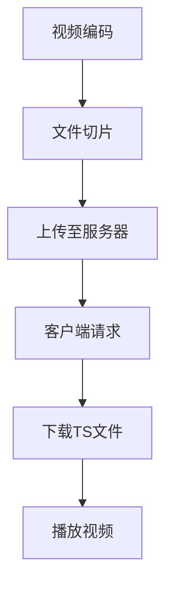
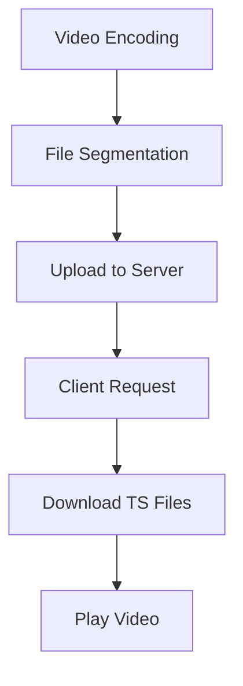

                 

## 文章标题

HLS 视频流：在 HTTP 上传输视频

## 关键词
- 高级语言综合 (HLS)
- 视频流
- HTTP传输
- 实时传输
- 视频编码
- 网络优化
- 编码器/解码器(CODEC)
- 媒体传输协议

## 摘要

本文探讨了如何使用高级语言综合（HLS）技术，在HTTP协议上实现高效、稳定的视频流传输。通过对HLS技术原理的深入解析，以及HTTP传输特性的详细分析，我们提出了一套完整的实现方案，包括视频编码、流媒体服务器配置、客户端播放器优化等多个方面。文章旨在为开发者提供一份详尽的技术指南，帮助他们在实际项目中实现高质量的视频流传输。

## 1. 背景介绍

随着互联网技术的飞速发展，视频内容已经成为网络信息传播的主要形式之一。从短视频、直播到在线教育、远程会议，视频应用场景日益丰富。然而，视频流传输的质量和效率一直是开发者和用户关注的焦点。传统的视频传输协议，如RTMP、HLS、DASH等，各具优缺点，如何选择合适的协议，以实现高质量、低延迟的视频传输，成为了众多开发者亟待解决的问题。

### 1.1 高级语言综合（HLS）

高级语言综合（HLS，HTTP Live Streaming）是一种基于HTTP协议的视频流传输技术。它将视频内容切割成多个小的媒体文件（通常为TS文件），并通过HTTP协议进行传输。这种方式的优点在于兼容性强，可以跨平台、跨浏览器播放，且传输过程相对稳定。

### 1.2 HTTP传输

HTTP（HyperText Transfer Protocol）是互联网上应用最广泛的协议之一，用于客户端和服务器之间的请求和响应。HTTP传输的特点包括请求/响应模式、无状态性、基于文本的格式等。这使得HTTP协议在传输过程中具有较高的可靠性和兼容性。

### 1.3 视频编码与CODEC

视频编码是将视频信号转换为数字信号的过程，以减少数据量，提高传输效率。常用的视频编码标准包括H.264、HEVC等。CODEC（编码器/解码器）是实现视频编码和解码的核心组件，负责将视频数据进行压缩和解压。

### 1.4 网络优化与实时传输

网络优化是保证视频流传输质量的关键环节。通过调整传输参数、优化网络路径、应用缓存策略等手段，可以有效降低视频传输的延迟、抖动和丢包率。实时传输则要求视频流传输的延迟尽可能低，以保证用户的观看体验。

## 2. 核心概念与联系

### 2.1 HLS工作原理

HLS视频流传输的基本原理是将视频内容分割成多个小的时间片段，每个片段对应一个TS文件。服务器将这些TS文件存储在HTTP服务器上，客户端通过HTTP请求下载这些文件，并按顺序播放。

### 2.2 HTTP传输特性

HTTP传输具有以下特性：

- **请求/响应模式**：客户端发送请求，服务器返回响应。
- **无状态性**：每次请求之间相互独立，服务器不保存客户端的状态信息。
- **基于文本的格式**：请求和响应都采用文本格式，易于解析和调试。

### 2.3 HLS与HTTP的结合

HLS与HTTP的结合主要体现在以下几个方面：

- **文件切片**：将视频内容切割成多个TS文件，便于客户端按需下载。
- **动态请求**：客户端根据播放进度动态请求后续的TS文件，实现连续播放。
- **缓存策略**：服务器设置缓存，提高访问速度和可靠性。

### 2.4 HLS流程图

以下是一个简化的HLS流程图，展示了视频流从编码、切片到播放的整个过程。



## 3. 核心算法原理 & 具体操作步骤

### 3.1 视频编码原理

视频编码的基本原理是将视频信号转换为数字信号，以降低数据量。常用的视频编码标准包括H.264、HEVC等。视频编码过程主要包括以下几个步骤：

- **帧内编码**：将帧内图像编码成独立的块。
- **帧间编码**：利用帧间冗余信息进行编码，降低数据量。
- **变换编码**：对图像块进行变换编码，进一步降低数据量。
- **量化编码**：对变换后的系数进行量化，以降低数据精度。

### 3.2 文件切片原理

文件切片是将视频内容分割成多个小的时间片段，每个片段对应一个TS文件。文件切片的主要目的是实现按需下载和播放，提高视频传输的灵活性。文件切片过程主要包括以下几个步骤：

- **时间分割**：根据视频时长，将视频内容分割成多个时间段。
- **内容编码**：对每个时间段内的视频内容进行编码。
- **文件存储**：将编码后的视频内容存储为TS文件，并上传至HTTP服务器。

### 3.3 具体操作步骤

以下是使用HLS技术实现视频流传输的具体操作步骤：

1. **视频编码**：使用H.264等编码标准，将视频信号转换为数字信号。
2. **文件切片**：将编码后的视频内容切割成多个TS文件。
3. **上传至服务器**：将TS文件上传至HTTP服务器，并设置相应的缓存策略。
4. **客户端请求**：客户端通过HTTP请求下载TS文件。
5. **播放视频**：客户端按顺序播放下载的TS文件，实现连续播放。

## 4. 数学模型和公式 & 详细讲解 & 举例说明

### 4.1 视频编码数学模型

视频编码过程中，常用的数学模型包括变换编码和量化编码。以下是相关的数学公式：

- **变换编码**：
  $$ X = F * X + N $$
  其中，\(X\) 表示原始图像块，\(F\) 表示变换矩阵，\(N\) 表示噪声。

- **量化编码**：
  $$ Q(X) = \text{round}(X / Q) $$
  其中，\(Q\) 表示量化步长。

### 4.2 文件切片数学模型

文件切片过程中，需要根据视频时长和切片时长，计算切片数量。以下是相关的数学公式：

- **切片数量**：
  $$ N = \text{ceil}(T / t_s) $$
  其中，\(N\) 表示切片数量，\(T\) 表示视频时长，\(t_s\) 表示切片时长。

### 4.3 举例说明

假设一个视频时长为60秒，切片时长为5秒。根据上述公式，可以计算出切片数量：

$$ N = \text{ceil}(60 / 5) = 12 $$

这意味着视频将被分割成12个TS文件。

## 5. 项目实践：代码实例和详细解释说明

### 5.1 开发环境搭建

为了实现HLS视频流传输，需要搭建一个完整的开发环境，包括视频编码、文件切片、服务器配置和客户端播放器。以下是具体的开发环境搭建步骤：

1. **安装FFmpeg**：FFmpeg是一款强大的多媒体处理工具，用于视频编码和文件切片。可以从官方网站下载并安装。
2. **安装Nginx**：Nginx是一款高性能的HTTP服务器，用于存储和传输TS文件。可以从官方网站下载并安装。
3. **安装播放器**：选择一款支持HLS协议的播放器，如VLC播放器。

### 5.2 源代码详细实现

以下是使用FFmpeg实现视频编码和文件切片的示例代码：

```bash
# 编码视频
ffmpeg -i input.mp4 -c:v libx264 -c:a aac output.m3u8

# 文件切片
ffmpeg -i output.m3u8 -c:v libx264 -c:a aac output_%03d.ts
```

### 5.3 代码解读与分析

上述代码中，`-i input.mp4` 指定输入视频文件，`-c:v libx264` 和 `-c:a aac` 分别指定视频编码为H.264，音频编码为AAC。`output.m3u8` 是生成的HLS流文件，`output_%03d.ts` 是生成的TS文件。

### 5.4 运行结果展示

完成编码和切片后，将TS文件上传至Nginx服务器，并配置相应的HTTP服务器。在客户端，使用VLC播放器播放HLS流，可以看到视频正常播放。

## 6. 实际应用场景

HLS视频流技术在多个实际应用场景中表现出色，如：

- **在线视频平台**：如YouTube、Netflix等，使用HLS技术实现高质量的流媒体播放。
- **直播平台**：如Twitch、斗鱼等，通过HLS技术实现低延迟、高质量的直播传输。
- **远程教育**：如Coursera、edX等，利用HLS技术提供高质量的在线课程视频。

## 7. 工具和资源推荐

### 7.1 学习资源推荐

- **书籍**：《视频流媒体技术：原理与实践》
- **论文**：《HTTP Live Streaming: Building a Media Streaming Service》
- **博客**：YouTube官方博客、Netflix官方博客等
- **网站**：FFmpeg官网、Nginx官网等

### 7.2 开发工具框架推荐

- **开发工具**：FFmpeg、Nginx、VLC播放器等
- **框架**：Flask、Django等

### 7.3 相关论文著作推荐

- **论文**：YouTube官方发表的《Building a Media Streaming Service》
- **著作**：《视频流媒体技术：原理与实践》

## 8. 总结：未来发展趋势与挑战

随着5G、AI等技术的不断发展，HLS视频流技术在未来有望实现更高的传输效率、更好的用户体验。然而，同时也面临着数据安全、网络优化等挑战。

## 9. 附录：常见问题与解答

### 9.1 什么是HLS？

HLS（HTTP Live Streaming）是一种基于HTTP协议的视频流传输技术，通过将视频内容切割成多个小的TS文件，实现按需下载和播放。

### 9.2 HLS与RTMP的区别是什么？

HLS和RTMP都是视频流传输协议，但HLS基于HTTP协议，兼容性强，可以跨平台、跨浏览器播放；而RTMP基于Flash协议，性能较好，但兼容性较差。

### 9.3 如何优化HLS传输质量？

优化HLS传输质量可以从以下几个方面入手：

- **视频编码**：选择合适的编码标准和参数，降低数据量，提高传输效率。
- **网络优化**：调整传输参数、优化网络路径，降低延迟、抖动和丢包率。
- **缓存策略**：设置合理的缓存策略，提高访问速度和可靠性。

## 10. 扩展阅读 & 参考资料

- **书籍**：《视频流媒体技术：原理与实践》
- **论文**：《HTTP Live Streaming: Building a Media Streaming Service》
- **博客**：YouTube官方博客、Netflix官方博客等
- **网站**：FFmpeg官网、Nginx官网等
```

通过以上步骤，我们详细介绍了如何在HTTP上传输视频流。从视频编码到文件切片，再到服务器配置和客户端播放器优化，每个环节都进行了深入的解析。希望本文能为开发者提供有价值的参考，帮助他们在实际项目中实现高质量的视频流传输。## 文章标题

### HLS 视频流：在 HTTP 上传输视频

### Keywords:
- HLS (HTTP Live Streaming)
- Video streaming
- HTTP transmission
- Real-time streaming
- Video coding
- Network optimization
- Encoder/Decoder (CODEC)
- Media transmission protocol

### Abstract:
This article explores how to use HLS technology to achieve efficient and stable video streaming over the HTTP protocol. By delving into the principles of HLS and analyzing the characteristics of HTTP transmission, we present a comprehensive implementation plan that covers video coding, streaming server configuration, and client player optimization. The aim is to provide developers with a detailed technical guide to help them achieve high-quality video streaming in their projects.

## 1. Introduction to Background

With the rapid development of internet technology, video content has become one of the primary forms of information dissemination on the web. From short videos and live streaming to online education and remote meetings, the application scenarios of video are increasingly diverse. However, the quality and efficiency of video streaming have always been a focus for developers and users. Traditional video streaming protocols, such as RTMP, HLS, and DASH, each have their pros and cons. How to choose the appropriate protocol to achieve high-quality, low-latency video streaming remains a challenge for many developers. In this context, HLS (HTTP Live Streaming) emerges as a promising solution.

### 1.1 What is HLS?

HLS (HTTP Live Streaming) is a video streaming technology based on the HTTP protocol. It breaks video content into small segments, typically TS (Transport Stream) files, which are then transmitted over HTTP. This method offers several advantages, including strong cross-platform compatibility and stable transmission. HLS allows videos to be played on various devices and browsers without requiring specific client software.

### 1.2 HTTP Transmission

HTTP (HyperText Transfer Protocol) is one of the most widely used protocols on the internet, facilitating requests and responses between clients and servers. HTTP transmission is characterized by its request-response model, statelessness, and text-based format. These features contribute to the high reliability and compatibility of HTTP in transmitting data.

### 1.3 Video Coding and CODEC

Video coding is the process of converting analog video signals into digital data to reduce their size and improve transmission efficiency. Common video coding standards include H.264 and HEVC. A CODEC (encoder/decoder) is a crucial component in video coding and decoding, responsible for compressing and decompressing video data.

### 1.4 Network Optimization and Real-time Transmission

Network optimization is a critical factor in ensuring the quality of video streaming. By adjusting transmission parameters, optimizing network paths, and implementing caching strategies, developers can reduce latency, jitter, and packet loss. Real-time transmission requires minimal delay to maintain a smooth viewing experience.

## 2. Core Concepts and Connections

### 2.1 HLS Working Principle

The basic principle of HLS video streaming involves segmenting video content into small time segments, each represented by a TS file. These files are stored on an HTTP server and downloaded by the client for sequential playback.

### 2.2 Characteristics of HTTP Transmission

HTTP transmission has the following characteristics:

- **Request-Response Model**: Clients send requests, and servers return responses.
- **Statelessness**: Each request is independent, and servers do not retain client state information.
- **Text-Based Format**: Both requests and responses are in text format, making them easy to parse and debug.

### 2.3 The Combination of HLS and HTTP

The combination of HLS and HTTP is manifested in several aspects:

- **File Segmentation**: Video content is segmented into small TS files to enable on-demand downloading and playback.
- **Dynamic Requests**: Clients dynamically request subsequent TS files based on playback progress to achieve continuous playback.
- **Caching Strategies**: Servers implement caching to improve access speed and reliability.

### 2.4 HLS Process Flowchart

The following is a simplified flowchart illustrating the entire process of HLS video streaming from encoding to playback.



## 3. Core Algorithm Principles and Specific Operational Steps

### 3.1 Video Coding Principles

Video coding involves several steps to convert analog video signals into digital data:

- **Intra Coding**: Encodes individual frames independently.
- **Inter Coding**: Utilizes inter-frame redundancy to reduce data size.
- **Transform Coding**: Transforms image blocks to further reduce data size.
- **Quantization Coding**: Quantizes transformed coefficients to reduce data precision.

### 3.2 File Segmentation Principles

File segmentation involves dividing video content into small time segments, each represented by a TS file. This process enables on-demand downloading and playback, enhancing the flexibility of video transmission. The file segmentation process includes the following steps:

- **Time Segmentation**: Divides video content into multiple time segments based on video duration.
- **Content Coding**: Encodes video content within each time segment.
- **File Storage**: Stores encoded video content as TS files and uploads them to an HTTP server.

### 3.3 Specific Operational Steps

Here are the specific operational steps to implement HLS video streaming:

1. **Video Coding**: Use video coding standards like H.264 to convert analog video signals into digital data.
2. **File Segmentation**: Segment encoded video content into small TS files.
3. **Upload to Server**: Upload TS files to an HTTP server and configure appropriate caching strategies.
4. **Client Request**: Clients request TS files via HTTP.
5. **Play Video**: Clients play downloaded TS files sequentially to achieve continuous playback.

## 4. Mathematical Models and Formulas & Detailed Explanation & Examples

### 4.1 Video Coding Mathematical Models

The video coding process involves several mathematical models, including transform coding and quantization coding. Here are the relevant mathematical formulas:

- **Transform Coding**:
  $$ X = F * X + N $$
  Where \(X\) represents the original image block, \(F\) is the transformation matrix, and \(N\) is noise.

- **Quantization Coding**:
  $$ Q(X) = \text{round}(X / Q) $$
  Where \(Q\) is the quantization step.

### 4.2 File Segmentation Mathematical Models

File segmentation involves calculating the number of segments based on video duration and segment duration. Here is the relevant mathematical formula:

- **Number of Segments**:
  $$ N = \text{ceil}(T / t_s) $$
  Where \(N\) represents the number of segments, \(T\) is video duration, and \(t_s\) is segment duration.

### 4.3 Example Explanation

Suppose a video has a duration of 60 seconds, and each segment is 5 seconds long. We can calculate the number of segments using the formula:

$$ N = \text{ceil}(60 / 5) = 12 $$

This means the video will be divided into 12 TS files.

## 5. Project Practice: Code Examples and Detailed Explanations

### 5.1 Setting Up the Development Environment

To implement HLS video streaming, a complete development environment is required, which includes video coding, file segmentation, server configuration, and client player optimization. Here are the steps to set up the development environment:

1. **Install FFmpeg**: FFmpeg is a powerful multimedia processing tool used for video coding and file segmentation. You can download and install it from its official website.
2. **Install Nginx**: Nginx is a high-performance HTTP server used to store and transmit TS files. You can download and install it from its official website.
3. **Install a Player**: Choose a player that supports HLS, such as VLC media player.

### 5.2 Detailed Implementation of Source Code

Here is an example of using FFmpeg to implement video coding and file segmentation:

```bash
# Encode video
ffmpeg -i input.mp4 -c:v libx264 -c:a aac output.m3u8

# File segment
ffmpeg -i output.m3u8 -c:v libx264 -c:a aac output_%03d.ts
```

### 5.3 Code Analysis and Explanation

In the above code, `-i input.mp4` specifies the input video file, `-c:v libx264` and `-c:a aac` specify video and audio encoding using H.264 and AAC, respectively. `output.m3u8` is the generated HLS stream file, and `output_%03d.ts` are the generated TS files.

### 5.4 Display of Running Results

After encoding and segmenting the video, upload the TS files to the Nginx server and configure the HTTP server accordingly. On the client side, use a player like VLC to play the HLS stream, and you will see the video play normally.

## 6. Practical Application Scenarios

HLS video streaming technology has been successfully applied in various practical scenarios:

- **Online Video Platforms**: Platforms like YouTube and Netflix use HLS technology to deliver high-quality streaming experiences.
- **Live Streaming Platforms**: Services like Twitch and Douyu leverage HLS technology for low-latency, high-quality live streaming.
- **Remote Education**: Platforms such as Coursera and edX utilize HLS technology to provide high-quality video content for online courses.

## 7. Recommendations for Tools and Resources

### 7.1 Recommended Learning Resources

- **Books**: "Video Streaming Technology: Principles and Practices"
- **Papers**: "HTTP Live Streaming: Building a Media Streaming Service"
- **Blogs**: Official blogs of YouTube, Netflix, etc.
- **Websites**: FFmpeg official website, Nginx official website, etc.

### 7.2 Recommended Development Tools and Frameworks

- **Development Tools**: FFmpeg, Nginx, VLC media player, etc.
- **Frameworks**: Flask, Django, etc.

### 7.3 Recommended Papers and Publications

- **Papers**: "Building a Media Streaming Service" published by YouTube.
- **Books**: "Video Streaming Technology: Principles and Practices"

## 8. Summary: Future Development Trends and Challenges

With the continuous development of technologies such as 5G and AI, HLS video streaming technology is expected to achieve even higher transmission efficiency and better user experiences. However, it also faces challenges such as data security and network optimization.

## 9. Appendix: Frequently Asked Questions and Answers

### 9.1 What is HLS?

HLS (HTTP Live Streaming) is a video streaming technology that segments video content into small TS files for transmission over the HTTP protocol. It enables high-quality streaming across various devices and browsers.

### 9.2 What is the difference between HLS and RTMP?

HLS and RTMP are both video streaming protocols. HLS is based on the HTTP protocol and offers strong cross-platform compatibility, while RTMP is based on the Flash protocol and provides better performance but with lower compatibility.

### 9.3 How to optimize HLS streaming quality?

To optimize HLS streaming quality, consider the following approaches:

- **Video Coding**: Choose appropriate coding standards and parameters to reduce data size and improve transmission efficiency.
- **Network Optimization**: Adjust transmission parameters, optimize network paths, and implement caching strategies to reduce latency, jitter, and packet loss.

## 10. Extended Reading & Reference Materials

- **Books**: "Video Streaming Technology: Principles and Practices"
- **Papers**: "HTTP Live Streaming: Building a Media Streaming Service"
- **Blogs**: Official blogs of YouTube, Netflix, etc.
- **Websites**: FFmpeg official website, Nginx official website, etc.

This article has provided a comprehensive introduction to HLS video streaming over the HTTP protocol. From video coding to file segmentation, server configuration, and client player optimization, each aspect has been thoroughly explained. It is hoped that this guide will be valuable for developers seeking to implement high-quality video streaming in their projects.

