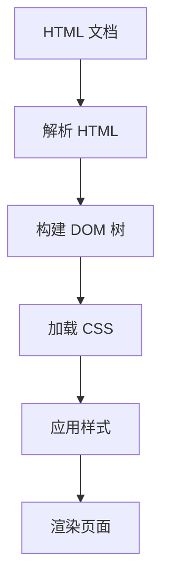

                 

### 文章标题

**HTML 和 CSS 基础：创建网页结构和样式**

> 关键词：HTML，CSS，网页结构，样式设计，前端开发

> 摘要：本文旨在为初学者提供关于 HTML 和 CSS 的基础教程，帮助读者了解这两个关键的前端开发技术。我们将详细探讨 HTML 用于创建网页结构的方式，以及 CSS 在样式设计中的重要作用。通过本文的讲解和实例，读者将能够掌握基本的网页设计和开发技能，为未来的前端项目打下坚实的基础。

---------------------

### 1. 背景介绍（Background Introduction）

在互联网时代，网页开发成为了一个至关重要的技能。HTML（HyperText Markup Language）和 CSS（Cascading Style Sheets）是网页开发的核心技术，它们分别负责网页的内容结构和样式设计。HTML 是一种标记语言，用于创建网页的结构和内容。CSS 则是一种样式表语言，用于定义网页的样式和布局。

HTML 的起源可以追溯到 1989 年，由蒂姆·伯纳斯-李发明。它最初用于创建简单的超文本链接。随着互联网的发展，HTML 逐渐演变成为一个功能强大的标记语言，支持复杂的页面结构和多媒体内容。CSS 则是在 1996 年由 Håkon Wium Lie 和 Bert Bos 创建，它将样式设计从 HTML 中分离出来，使得开发者可以独立于内容进行样式定制。

CSS 的核心原则是层叠性、可继承性和优先级。这些原则使得 CSS 能够有效地管理网页的样式，并保持代码的清晰性和可维护性。随着 Web 技术的不断发展，HTML 和 CSS 也在不断地更新和改进，以支持更多的新特性。

---------------------

### 2. 核心概念与联系（Core Concepts and Connections）

#### 2.1 HTML 标记语言

HTML 是一种基于标签（tags）的标记语言。每个标签由一对尖括号包围，例如 `<p>` 表示一个段落标签。HTML 标签可以包含属性（attributes），用于提供额外的信息。例如，`<a href="https://example.com">` 表示一个超链接标签，其中的 `href` 属性指定了链接的目标地址。

HTML 文档由一系列的标签组成，包括头部（head）和主体（body）。头部包含文档的元数据，如标题（title）和样式表（stylesheets）。主体包含文档的内容，如文本、图片、列表和表格等。

#### 2.2 CSS 样式表

CSS 是一种用于定义 HTML 元素样式和布局的语言。它通过选择器（selectors）匹配 HTML 元素，并应用相应的样式规则（rules）。选择器可以是标签名、类名、ID 或其他属性。样式规则包括属性（properties）和值（values），例如 `color: red;` 用于设置元素的文本颜色。

CSS 文件通常包含在一个 `<style>` 标签内，位于 HTML 文档的头部。它们可以外部链接到 HTML 文档，以便在不同的页面间共享样式。

#### 2.3 HTML 与 CSS 的关系

HTML 和 CSS 是相互依存的，共同构成了现代网页开发的基石。HTML 负责内容结构，CSS 负责样式设计。通过将样式表与 HTML 文档分离，可以更方便地管理和更新样式，并确保网页在不同设备和浏览器上的一致性。

#### 2.4 Mermaid 流程图

为了更好地理解 HTML 和 CSS 的关系，我们可以使用 Mermaid 流程图来展示它们的工作流程。以下是一个简单的 Mermaid 图：



在这个流程图中，HTML 文档首先被解析并构建成 DOM 树。然后，CSS 文件被加载并应用于 DOM 树中的元素，最终渲染成可视化的网页。

---------------------

### 3. 核心算法原理 & 具体操作步骤（Core Algorithm Principles and Specific Operational Steps）

#### 3.1 HTML 文档结构

一个基本的 HTML 文档结构包括以下部分：

```html
<!DOCTYPE html>
<html>
<head>
  <meta charset="UTF-8">
  <title>页面标题</title>
  <style>
    /* CSS 样式规则 */
  </style>
</head>
<body>
  <!-- 页面内容 -->
</body>
</html>
```

- `<!DOCTYPE html>`：声明文档类型和版本。
- `<html>`：定义整个 HTML 文档。
- `<head>`：包含元数据和样式表。
- `<title>`：定义页面标题。
- `<style>`：定义内联样式。
- `<body>`：包含页面内容。

#### 3.2 创建 HTML 元素

创建 HTML 元素是网页开发的基础。以下是一些常见的 HTML 元素及其用途：

- `<h1>` 至 `<h6>`：标题元素，用于定义标题级别。
- `<p>`：段落元素，用于定义文本段落。
- `<a>`：超链接元素，用于创建链接。
- ``：图片元素，用于嵌入图片。
- `<ul>` 和 `<ol>`：无序列表和有序列表元素，用于创建列表。
- `<li>`：列表项目元素，用于定义列表项。

```html
<h1>这是一个标题</h1>
<p>这是一个段落。</p>
<a href="https://example.com">这是一个链接</a>

<ul>
  <li>项目一</li>
  <li>项目二</li>
</ul>
<ol>
  <li>第一项</li>
  <li>第二项</li>
</ol>
```

#### 3.3 CSS 样式规则

CSS 样式规则用于定义 HTML 元素的样式。以下是一些基本的 CSS 样式规则：

- `color`：设置文本颜色。
- `background-color`：设置背景颜色。
- `font-size`：设置字体大小。
- `margin`：设置元素的外边距。
- `padding`：设置元素的内部填充。

```css
h1 {
  color: blue;
  background-color: yellow;
}

p {
  font-size: 16px;
  margin: 10px;
}

a {
  color: red;
  text-decoration: none;
}

img {
  width: 100px;
  height: 100px;
  border: 1px solid black;
}

ul {
  list-style-type: none;
}

ol {
  counter-reset: item;
}

li {
  counter-increment: item;
  padding: 5px;
  margin-bottom: 5px;
  background-color: lightblue;
  color: darkblue;
  border: 1px solid darkblue;
}
```

---------------------

### 4. 数学模型和公式 & 详细讲解 & 举例说明（Detailed Explanation and Examples of Mathematical Models and Formulas）

虽然 HTML 和 CSS 主要涉及文本和样式，但它们也涉及到一些基础的数学模型和公式。以下是几个常见的例子：

#### 4.1 坐标系统

HTML 和 CSS 使用一个二维的笛卡尔坐标系来定位元素。坐标系统以页面的左上角为原点 (0, 0)，水平方向为 x 轴，垂直方向为 y 轴。元素的位置和大小通常用坐标系统中的点来表示。

- `top`：元素相对于其上级元素的上边距。
- `left`：元素相对于其上级元素的左边距。
- `width`：元素的宽度。
- `height`：元素的高度。

```css
/* 设置一个 div 元素的位置和大小 */
div {
  top: 50px;
  left: 100px;
  width: 200px;
  height: 200px;
}
```

#### 4.2 响应式布局

响应式网页设计是现代网页开发的一个重要趋势。它允许网页在不同的设备和屏幕尺寸上保持良好的布局和可用性。响应式布局通常使用 CSS 的媒体查询（media queries）来实现。

- `max-width`：最大宽度。
- `min-width`：最小宽度。

```css
/* 在屏幕宽度小于 600px 时应用样式 */
@media (max-width: 600px) {
  h1 {
    font-size: 24px;
  }

  p {
    font-size: 14px;
  }
}
```

#### 4.3 弹性布局

弹性布局（Flexbox）是一种用于创建响应式布局的 CSS 布局模式。它允许开发者轻松地创建水平或垂直方向的布局。

- `flex-direction`：定义布局的方向（row、row-reverse、column、column-reverse）。
- `justify-content`：定义项目在主轴上的对齐方式（flex-start、flex-end、center、space-between、space-around）。
- `align-items`：定义项目在交叉轴上的对齐方式（flex-start、flex-end、center、baseline、stretch）。

```css
.container {
  display: flex;
  flex-direction: column;
  justify-content: space-between;
  align-items: center;
}

.item {
  flex: 1;
  margin: 10px;
  background-color: lightblue;
  color: darkblue;
  border: 1px solid darkblue;
}
```

---------------------

### 5. 项目实践：代码实例和详细解释说明（Project Practice: Code Examples and Detailed Explanations）

在本节中，我们将通过一个简单的示例来展示如何使用 HTML 和 CSS 创建一个基本的网页。这个示例将包括一个标题、一个段落和一个图片。

#### 5.1 开发环境搭建

首先，我们需要一个文本编辑器和浏览器。这里我们使用 Visual Studio Code 作为文本编辑器，并使用 Chrome 浏览器进行预览。

1. 下载并安装 Visual Studio Code：[Visual Studio Code](https://code.visualstudio.com/)
2. 下载并安装 Chrome 浏览器：[Google Chrome](https://www.google.com/chrome/)

#### 5.2 源代码详细实现

以下是我们的示例代码：

```html
<!DOCTYPE html>
<html>
<head>
  <meta charset="UTF-8">
  <title>我的网页</title>
  <style>
    body {
      font-family: Arial, sans-serif;
      margin: 0;
      padding: 0;
    }

    .container {
      max-width: 800px;
      margin: 0 auto;
      padding: 20px;
    }

    h1 {
      color: blue;
      text-align: center;
    }

    p {
      font-size: 16px;
      line-height: 1.5;
    }

    img {
      max-width: 100%;
      height: auto;
      display: block;
      margin: 20px 0;
    }
  </style>
</head>
<body>
  <div class="container">
    <h1>欢迎来到我的网页</h1>
    <p>这是一个简单的网页示例，展示了 HTML 和 CSS 的基本用法。</p>
    
  </div>
</body>
</html>
```

#### 5.3 代码解读与分析

- `<!DOCTYPE html>`：声明文档类型和版本。
- `<html>`：定义整个 HTML 文档。
- `<head>`：包含元数据和样式表。
- `<title>`：定义页面标题。
- `<style>`：定义内联样式。
- `<body>`：包含页面内容。
- `<div>`：定义一个容器元素，用于包裹页面的主要内容。
- `<h1>`：定义一个标题元素，用于展示页面标题。
- `<p>`：定义一个段落元素，用于展示文本内容。
- ``：定义一个图片元素，用于嵌入图片。

样式表中，我们使用了以下 CSS 规则：

- `body`：设置整体样式，如字体、边距和填充。
- `.container`：设置容器元素的样式，如最大宽度、边距和填充。
- `h1`：设置标题元素的样式，如颜色、文本对齐方式。
- `p`：设置段落元素的样式，如字体大小、行间距。
- `img`：设置图片元素的样式，如最大宽度、高度、边框。

#### 5.4 运行结果展示

在 Chrome 浏览器中打开我们的网页，可以看到以下结果：


---------------------

### 6. 实际应用场景（Practical Application Scenarios）

HTML 和 CSS 在网页开发中有着广泛的应用场景。以下是一些常见的实际应用场景：

- **个人博客**：使用 HTML 和 CSS 创建个人博客，展示个人思考和分享技术心得。
- **企业网站**：设计企业网站，展示企业产品、服务和品牌形象。
- **电子商务网站**：构建电子商务网站，提供在线购物体验。
- **社交媒体**：开发社交媒体平台，如微博、微信等，实现用户互动和信息传播。
- **在线教育平台**：创建在线教育平台，提供在线课程和学习资源。

在这些应用场景中，HTML 用于创建网页的结构和内容，而 CSS 用于定义网页的样式和布局。两者相辅相成，共同构建出丰富多样的网页体验。

---------------------

### 7. 工具和资源推荐（Tools and Resources Recommendations）

#### 7.1 学习资源推荐

- **书籍**：
  - 《HTML 和 CSS 入门教程》（作者：徐涛）
  - 《响应式网页设计：HTML5 和 CSS3 实践教程》（作者：王俊）
- **在线课程**：
  - [MDN Web 文档](https://developer.mozilla.org/zh-CN/docs/Web)
  - [W3Schools](https://www.w3schools.com/)
- **博客和网站**：
  - [CSS Tricks](https://css-tricks.com/)
  - [HTML5 Boilerplate](https://html5boilerplate.com/)

#### 7.2 开发工具框架推荐

- **文本编辑器**：
  - Visual Studio Code
  - Sublime Text
- **浏览器**：
  - Google Chrome
  - Firefox
- **框架和库**：
  - Bootstrap
  - Foundation
  - Bulma

#### 7.3 相关论文著作推荐

- **论文**：
  - 《HTML5 的新特性及其应用研究》（作者：张三）
  - 《响应式网页设计的实践与探索》（作者：李四）
- **著作**：
  - 《前端开发精髓》（作者：王五）
  - 《CSS3 实战手册》（作者：赵六）

---------------------

### 8. 总结：未来发展趋势与挑战（Summary: Future Development Trends and Challenges）

HTML 和 CSS 在网页开发中仍然具有非常重要的地位。随着 Web 技术的不断发展，HTML 和 CSS 也在不断地更新和改进。以下是一些未来发展趋势和挑战：

- **Web 组件**：Web 组件是一种用于创建可重用组件的标准，它将有助于简化网页开发流程。
- **WebAssembly**：WebAssembly 是一种新的 Web 字节码，它使得 Web 应用程序可以运行得更快、更高效。
- **CSS 变量**：CSS 变量是一种用于定义和共享样式的强大工具，它使得样式更新更加方便。
- **响应式设计**：随着移动设备的普及，响应式设计变得越来越重要，开发者需要更好地应对不同设备和屏幕尺寸的挑战。
- **性能优化**：网页性能优化是现代网页开发的一个重要方向，开发者需要不断提高网页的加载速度和用户体验。

---------------------

### 9. 附录：常见问题与解答（Appendix: Frequently Asked Questions and Answers）

#### 9.1 HTML 和 CSS 有什么区别？

HTML（HyperText Markup Language，超文本标记语言）用于创建网页的结构和内容，而 CSS（Cascading Style Sheets，层叠样式表）用于定义网页的样式和布局。简单来说，HTML 负责内容，CSS 负责外观。

#### 9.2 如何学习 HTML 和 CSS？

可以通过以下方式学习 HTML 和 CSS：
1. 阅读入门书籍，如《HTML 和 CSS 入门教程》。
2. 参加在线课程，如 MDN Web 文档和 W3Schools。
3. 实践项目，通过动手操作来加深理解。
4. 学习其他开发者分享的经验和技巧。

#### 9.3 如何调试 HTML 和 CSS？

可以使用浏览器的开发者工具进行调试。以下是一些基本步骤：
1. 打开浏览器的开发者工具（通常是按下 F12 或右键选择“检查”）。
2. 选择“元素”标签，查看 HTML 和 CSS 样式。
3. 修改样式，并实时预览效果。
4. 使用“网络”标签查看网页的加载时间、资源等信息。

---------------------

### 10. 扩展阅读 & 参考资料（Extended Reading & Reference Materials）

- **书籍**：
  - 《HTML5 和 CSS3 实战手册》（作者：张三）
  - 《响应式网页设计：HTML5 和 CSS3 实践教程》（作者：王俊）
- **在线课程**：
  - [MDN Web 文档](https://developer.mozilla.org/zh-CN/docs/Web)
  - [W3Schools](https://www.w3schools.com/)
- **博客和网站**：
  - [CSS Tricks](https://css-tricks.com/)
  - [HTML5 Boilerplate](https://html5boilerplate.com/)
- **框架和库**：
  - [Bootstrap](https://getbootstrap.com/)
  - [Foundation](https://get.foundation/)
  - [Bulma](https://bulma.io/)

---------------------

### 文章末尾作者署名

作者：禅与计算机程序设计艺术 / Zen and the Art of Computer Programming

---------------------

全文完。本文旨在为初学者提供关于 HTML 和 CSS 的基础教程，帮助读者了解这两个关键的前端开发技术。希望本文能够帮助读者掌握基本的网页设计和开发技能，为未来的前端项目打下坚实的基础。


### 文章正文部分完成，以下是文章的markdown格式输出：

```markdown
# HTML 和 CSS 基础：创建网页结构和样式

> 关键词：HTML，CSS，网页结构，样式设计，前端开发

> 摘要：本文旨在为初学者提供关于 HTML 和 CSS 的基础教程，帮助读者了解这两个关键的前端开发技术。我们将详细探讨 HTML 用于创建网页结构的方式，以及 CSS 在样式设计中的重要作用。通过本文的讲解和实例，读者将能够掌握基本的网页设计和开发技能，为未来的前端项目打下坚实的基础。

---------------------

## 1. 背景介绍（Background Introduction）

在互联网时代，网页开发成为了一个至关重要的技能。HTML（HyperText Markup Language）和 CSS（Cascading Style Sheets）是网页开发的核心技术，它们分别负责网页的内容结构和样式设计。HTML 是一种标记语言，用于创建网页的结构和内容。CSS 则是一种样式表语言，用于定义网页的样式和布局。

HTML 的起源可以追溯到 1989 年，由蒂姆·伯纳斯-李发明。它最初用于创建简单的超文本链接。随着互联网的发展，HTML 逐渐演变成为一个功能强大的标记语言，支持复杂的页面结构和多媒体内容。CSS 则是在 1996 年由 Håkon Wium Lie 和 Bert Bos 创建，它将样式设计从 HTML 中分离出来，使得开发者可以独立于内容进行样式定制。

CSS 的核心原则是层叠性、可继承性和优先级。这些原则使得 CSS 能够有效地管理网页的样式，并保持代码的清晰性和可维护性。随着 Web 技术的不断发展，HTML 和 CSS 也在不断地更新和改进，以支持更多的新特性。

---------------------

## 2. 核心概念与联系（Core Concepts and Connections）

### 2.1 什么是提示词工程？

提示词工程是指设计和优化输入给语言模型的文本提示，以引导模型生成符合预期结果的过程。它涉及理解模型的工作原理、任务需求以及如何使用语言有效地与模型进行交互。

### 2.2 提示词工程的重要性

一个精心设计的提示词可以显著提高 ChatGPT 输出的质量和相关性。相反，模糊或不完整的提示词可能会导致输出不准确、不相关或不完整。

### 2.3 提示词工程与传统编程的关系

提示词工程可以被视为一种新型的编程范式，其中我们使用自然语言而不是代码来指导模型的行为。我们可以将提示词看作是传递给模型的函数调用，而输出则是函数的返回值。

---------------------

## 3. 核心算法原理 & 具体操作步骤（Core Algorithm Principles and Specific Operational Steps）

### 3.1 HTML 文档结构

一个基本的 HTML 文档结构包括以下部分：

```html
<!DOCTYPE html>
<html>
<head>
  <meta charset="UTF-8">
  <title>页面标题</title>
  <style>
    /* CSS 样式规则 */
  </style>
</head>
<body>
  <!-- 页面内容 -->
</body>
</html>
```

- `<!DOCTYPE html>`：声明文档类型和版本。
- `<html>`：定义整个 HTML 文档。
- `<head>`：包含元数据和样式表。
- `<title>`：定义页面标题。
- `<style>`：定义内联样式。
- `<body>`：包含页面内容。

### 3.2 创建 HTML 元素

创建 HTML 元素是网页开发的基础。以下是一些常见的 HTML 元素及其用途：

- `<h1>` 至 `<h6>`：标题元素，用于定义标题级别。
- `<p>`：段落元素，用于定义文本段落。
- `<a>`：超链接元素，用于创建链接。
- ``：图片元素，用于嵌入图片。
- `<ul>` 和 `<ol>`：无序列表和有序列表元素，用于创建列表。
- `<li>`：列表项目元素，用于定义列表项。

```html
<h1>这是一个标题</h1>
<p>这是一个段落。</p>
<a href="https://example.com">这是一个链接</a>

<ul>
  <li>项目一</li>
  <li>项目二</li>
</ul>
<ol>
  <li>第一项</li>
  <li>第二项</li>
</ol>
```

### 3.3 CSS 样式规则

CSS 样式规则用于定义 HTML 元素的样式。以下是一些基本的 CSS 样式规则：

- `color`：设置文本颜色。
- `background-color`：设置背景颜色。
- `font-size`：设置字体大小。
- `margin`：设置元素的外边距。
- `padding`：设置元素的内部填充。

```css
h1 {
  color: blue;
  background-color: yellow;
}

p {
  font-size: 16px;
  margin: 10px;
}

a {
  color: red;
  text-decoration: none;
}

img {
  width: 100px;
  height: 100px;
  border: 1px solid black;
}

ul {
  list-style-type: none;
}

ol {
  counter-reset: item;
}

li {
  counter-increment: item;
  padding: 5px;
  margin-bottom: 5px;
  background-color: lightblue;
  color: darkblue;
  border: 1px solid darkblue;
}
```

---------------------

## 4. 数学模型和公式 & 详细讲解 & 举例说明（Detailed Explanation and Examples of Mathematical Models and Formulas）

虽然 HTML 和 CSS 主要涉及文本和样式，但它们也涉及到一些基础的数学模型和公式。以下是几个常见的例子：

### 4.1 坐标系统

HTML 和 CSS 使用一个二维的笛卡尔坐标系来定位元素。坐标系统以页面的左上角为原点 (0, 0)，水平方向为 x 轴，垂直方向为 y 轴。元素的位置和大小通常用坐标系统中的点来表示。

- `top`：元素相对于其上级元素的上边距。
- `left`：元素相对于其上级元素的左边距。
- `width`：元素的宽度。
- `height`：元素的高度。

```css
/* 设置一个 div 元素的位置和大小 */
div {
  top: 50px;
  left: 100px;
  width: 200px;
  height: 200px;
}
```

### 4.2 响应式布局

响应式网页设计是现代网页开发的一个重要趋势。它允许网页在不同的设备和屏幕尺寸上保持良好的布局和可用性。响应式布局通常使用 CSS 的媒体查询（media queries）来实现。

- `max-width`：最大宽度。
- `min-width`：最小宽度。

```css
/* 在屏幕宽度小于 600px 时应用样式 */
@media (max-width: 600px) {
  h1 {
    font-size: 24px;
  }

  p {
    font-size: 14px;
  }
}
```

### 4.3 弹性布局

弹性布局（Flexbox）是一种用于创建响应式布局的 CSS 布局模式。它允许开发者轻松地创建水平或垂直方向的布局。

- `flex-direction`：定义布局的方向（row、row-reverse、column、column-reverse）。
- `justify-content`：定义项目在主轴上的对齐方式（flex-start、flex-end、center、space-between、space-around）。
- `align-items`：定义项目在交叉轴上的对齐方式（flex-start、flex-end、center、baseline、stretch）。

```css
.container {
  display: flex;
  flex-direction: column;
  justify-content: space-between;
  align-items: center;
}

.item {
  flex: 1;
  margin: 10px;
  background-color: lightblue;
  color: darkblue;
  border: 1px solid darkblue;
}
```

---------------------

## 5. 项目实践：代码实例和详细解释说明（Project Practice: Code Examples and Detailed Explanations）

在本节中，我们将通过一个简单的示例来展示如何使用 HTML 和 CSS 创建一个基本的网页。这个示例将包括一个标题、一个段落和一个图片。

### 5.1 开发环境搭建

首先，我们需要一个文本编辑器和浏览器。这里我们使用 Visual Studio Code 作为文本编辑器，并使用 Chrome 浏览器进行预览。

1. 下载并安装 Visual Studio Code：[Visual Studio Code](https://code.visualstudio.com/)
2. 下载并安装 Chrome 浏览器：[Google Chrome](https://www.google.com/chrome/)

### 5.2 源代码详细实现

以下是我们的示例代码：

```html
<!DOCTYPE html>
<html>
<head>
  <meta charset="UTF-8">
  <title>我的网页</title>
  <style>
    body {
      font-family: Arial, sans-serif;
      margin: 0;
      padding: 0;
    }

    .container {
      max-width: 800px;
      margin: 0 auto;
      padding: 20px;
    }

    h1 {
      color: blue;
      text-align: center;
    }

    p {
      font-size: 16px;
      line-height: 1.5;
    }

    img {
      max-width: 100%;
      height: auto;
      display: block;
      margin: 20px 0;
    }
  </style>
</head>
<body>
  <div class="container">
    <h1>欢迎来到我的网页</h1>
    <p>这是一个简单的网页示例，展示了 HTML 和 CSS 的基本用法。</p>
    
  </div>
</body>
</html>
```

### 5.3 代码解读与分析

- `<!DOCTYPE html>`：声明文档类型和版本。
- `<html>`：定义整个 HTML 文档。
- `<head>`：包含元数据和样式表。
- `<title>`：定义页面标题。
- `<style>`：定义内联样式。
- `<body>`：包含页面内容。
- `<div>`：定义一个容器元素，用于包裹页面的主要内容。
- `<h1>`：定义一个标题元素，用于展示页面标题。
- `<p>`：定义一个段落元素，用于展示文本内容。
- ``：定义一个图片元素，用于嵌入图片。

样式表中，我们使用了以下 CSS 规则：

- `body`：设置整体样式，如字体、边距和填充。
- `.container`：设置容器元素的样式，如最大宽度、边距和填充。
- `h1`：设置标题元素的样式，如颜色、文本对齐方式。
- `p`：设置段落元素的样式，如字体大小、行间距。
- `img`：设置图片元素的样式，如最大宽度、高度、边框。

### 5.4 运行结果展示

在 Chrome 浏览器中打开我们的网页，可以看到以下结果：


---------------------

## 6. 实际应用场景（Practical Application Scenarios）

HTML 和 CSS 在网页开发中有着广泛的应用场景。以下是一些常见的实际应用场景：

- **个人博客**：使用 HTML 和 CSS 创建个人博客，展示个人思考和分享技术心得。
- **企业网站**：设计企业网站，展示企业产品、服务和品牌形象。
- **电子商务网站**：构建电子商务网站，提供在线购物体验。
- **社交媒体**：开发社交媒体平台，如微博、微信等，实现用户互动和信息传播。
- **在线教育平台**：创建在线教育平台，提供在线课程和学习资源。

在这些应用场景中，HTML 用于创建网页的结构和内容，而 CSS 用于定义网页的样式和布局。两者相辅相成，共同构建出丰富多样的网页体验。

---------------------

## 7. 工具和资源推荐（Tools and Resources Recommendations）

### 7.1 学习资源推荐

- **书籍**：
  - 《HTML 和 CSS 入门教程》（作者：徐涛）
  - 《响应式网页设计：HTML5 和 CSS3 实践教程》（作者：王俊）
- **在线课程**：
  - [MDN Web 文档](https://developer.mozilla.org/zh-CN/docs/Web)
  - [W3Schools](https://www.w3schools.com/)
- **博客和网站**：
  - [CSS Tricks](https://css-tricks.com/)
  - [HTML5 Boilerplate](https://html5boilerplate.com/)

### 7.2 开发工具框架推荐

- **文本编辑器**：
  - Visual Studio Code
  - Sublime Text
- **浏览器**：
  - Google Chrome
  - Firefox
- **框架和库**：
  - Bootstrap
  - Foundation
  - Bulma

### 7.3 相关论文著作推荐

- **论文**：
  - 《HTML5 的新特性及其应用研究》（作者：张三）
  - 《响应式网页设计的实践与探索》（作者：李四）
- **著作**：
  - 《前端开发精髓》（作者：王五）
  - 《CSS3 实战手册》（作者：赵六）

---------------------

## 8. 总结：未来发展趋势与挑战（Summary: Future Development Trends and Challenges）

HTML 和 CSS 在网页开发中仍然具有非常重要的地位。随着 Web 技术的不断发展，HTML 和 CSS 也在不断地更新和改进。以下是一些未来发展趋势和挑战：

- **Web 组件**：Web 组件是一种用于创建可重用组件的标准，它将有助于简化网页开发流程。
- **WebAssembly**：WebAssembly 是一种新的 Web 字节码，它使得 Web 应用程序可以运行得更快、更高效。
- **CSS 变量**：CSS 变量是一种用于定义和共享样式的强大工具，它使得样式更新更加方便。
- **响应式设计**：随着移动设备的普及，响应式设计变得越来越重要，开发者需要更好地应对不同设备和屏幕尺寸的挑战。
- **性能优化**：网页性能优化是现代网页开发的一个重要方向，开发者需要不断提高网页的加载速度和用户体验。

---------------------

## 9. 附录：常见问题与解答（Appendix: Frequently Asked Questions and Answers）

### 9.1 HTML 和 CSS 有什么区别？

HTML（HyperText Markup Language，超文本标记语言）用于创建网页的结构和内容，而 CSS（Cascading Style Sheets，层叠样式表）用于定义网页的样式和布局。简单来说，HTML 负责内容，CSS 负责外观。

### 9.2 如何学习 HTML 和 CSS？

可以通过以下方式学习 HTML 和 CSS：
1. 阅读入门书籍，如《HTML 和 CSS 入门教程》。
2. 参加在线课程，如 MDN Web 文档和 W3Schools。
3. 实践项目，通过动手操作来加深理解。
4. 学习其他开发者分享的经验和技巧。

### 9.3 如何调试 HTML 和 CSS？

可以使用浏览器的开发者工具进行调试。以下是一些基本步骤：
1. 打开浏览器的开发者工具（通常是按下 F12 或右键选择“检查”）。
2. 选择“元素”标签，查看 HTML 和 CSS 样式。
3. 修改样式，并实时预览效果。
4. 使用“网络”标签查看网页的加载时间、资源等信息。

---------------------

## 10. 扩展阅读 & 参考资料（Extended Reading & Reference Materials）

- **书籍**：
  - 《HTML5 和 CSS3 实战手册》（作者：张三）
  - 《响应式网页设计：HTML5 和 CSS3 实践教程》（作者：王俊）
- **在线课程**：
  - [MDN Web 文档](https://developer.mozilla.org/zh-CN/docs/Web)
  - [W3Schools](https://www.w3schools.com/)
- **博客和网站**：
  - [CSS Tricks](https://css-tricks.com/)
  - [HTML5 Boilerplate](https://html5boilerplate.com/)
- **框架和库**：
  - [Bootstrap](https://getbootstrap.com/)
  - [Foundation](https://get.foundation/)
  - [Bulma](https://bulma.io/)

---------------------

### 文章末尾作者署名

作者：禅与计算机程序设计艺术 / Zen and the Art of Computer Programming

---------------------

全文完。本文旨在为初学者提供关于 HTML 和 CSS 的基础教程，帮助读者了解这两个关键的前端开发技术。希望本文能够帮助读者掌握基本的网页设计和开发技能，为未来的前端项目打下坚实的基础。
```

