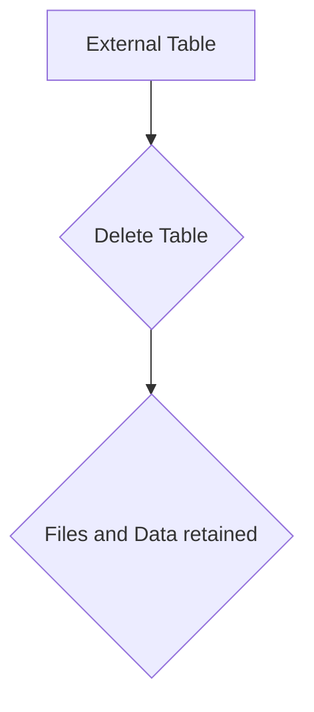
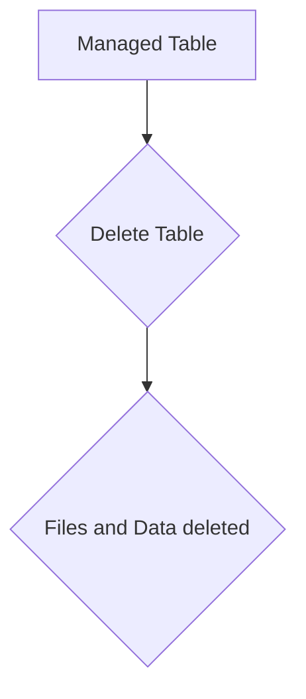
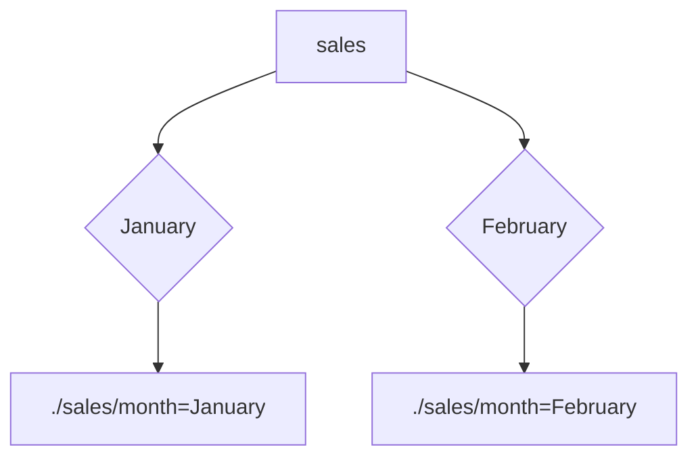
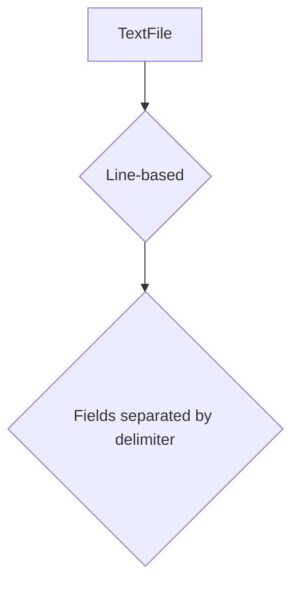
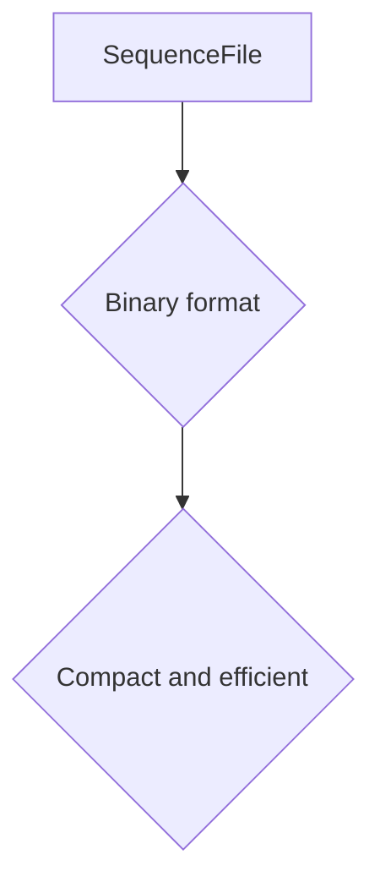
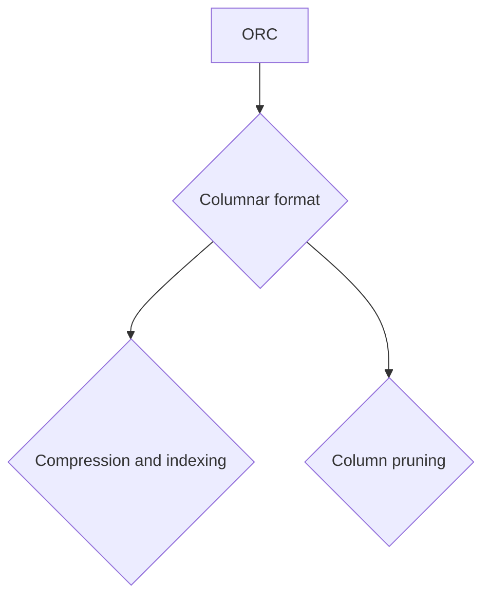

                 

# HiveQL原理与代码实例讲解

## 1. 背景介绍（Background Introduction）

### 1.1 什么是HiveQL？

HiveQL（Hive Query Language）是一种类SQL语言，用于在Hadoop分布式文件系统（HDFS）上执行数据仓库操作。Hive是一个构建在Hadoop之上的数据仓库工具，能够处理大规模数据集。HiveQL是操作Hive数据的主要工具，类似于传统的SQL语言，但它在语法上有所不同，以适应Hadoop的架构。

### 1.2 HiveQL的应用场景

HiveQL主要用于以下几种场景：

- **数据查询与统计分析**：对于大规模数据集，HiveQL提供了强大的查询和分析能力，可以执行复杂的聚合、连接和筛选操作。
- **ETL（提取、转换、加载）**：HiveQL可以用于数据清洗、数据转换和数据加载，以便在数据仓库中进行进一步分析。
- **机器学习**：HiveQL可以与机器学习框架（如MLlib）集成，用于预处理数据、生成特征等。

### 1.3 HiveQL的特点

- **类SQL语法**：虽然HiveQL的语法与传统的SQL有所不同，但它提供了一套类似SQL的语法，使得用户可以快速上手。
- **扩展性强**：HiveQL支持自定义函数（UDF、UDAF和UDTF），用户可以根据需求扩展其功能。
- **高性能**：HiveQL利用Hadoop的分布式计算能力，可以处理大规模数据集，并实现高性能查询。

## 2. 核心概念与联系（Core Concepts and Connections）

### 2.1 HiveQL的基本概念

#### 2.1.1 表（Tables）

Hive中的表用于存储数据。表可以分为两大类：

- **外部表**：如果删除表，底层的文件和数据也会被删除。
- **管理表**：如果删除表，数据不会删除，但表的定义会被删除。

#### 2.1.2 分区（Partitions）

分区是一种优化查询的方法，可以将数据根据某些列的值分成多个部分。例如，可以将按时间分区的数据存储在不同的文件中，以提高查询效率。

#### 2.1.3 存储格式（Storage Formats）

Hive支持多种存储格式，如文本文件、序列化文件（SequenceFile）、ORC（Optimized Row Columnar）等。不同存储格式有各自的优缺点。

### 2.2 HiveQL与Hadoop的关系

Hive依赖于Hadoop的架构，特别是HDFS。HiveQL的查询执行过程中，会将查询转化为MapReduce作业，然后在HDFS上执行。

### 2.3 HiveQL与数据库系统的比较

虽然HiveQL与传统的数据库查询语言（如SQL）相似，但Hive在设计上是为了处理大规模分布式数据集，因此在性能、扩展性等方面与传统的数据库系统有所不同。

## 3. 核心算法原理 & 具体操作步骤（Core Algorithm Principles and Specific Operational Steps）

### 3.1 HiveQL查询的执行流程

HiveQL查询的执行流程主要包括以下步骤：

1. **语法解析**：HiveQL查询首先被解析成抽象语法树（AST）。
2. **查询优化**：查询优化器会对AST进行优化，如重写查询、生成物理执行计划等。
3. **执行计划生成**：优化后的AST会被转化为一个执行计划。
4. **执行作业**：执行计划被转化为一个或多个MapReduce作业，并在Hadoop集群上执行。
5. **结果返回**：执行完成后，结果会被返回给用户。

### 3.2 HiveQL查询的具体操作步骤

#### 3.2.1 创建表

使用`CREATE TABLE`语句创建一个表，例如：

```sql
CREATE TABLE users (
    id INT,
    name STRING,
    age INT
);
```

#### 3.2.2 插入数据

使用`INSERT INTO`语句向表中插入数据：

```sql
INSERT INTO users (id, name, age)
VALUES (1, 'Alice', 30),
       (2, 'Bob', 40),
       (3, 'Charlie', 50);
```

#### 3.2.3 查询数据

使用`SELECT`语句查询表中的数据：

```sql
SELECT * FROM users;
```

#### 3.2.4 分区操作

创建分区表并插入数据：

```sql
CREATE TABLE sales (
    date STRING,
    amount INT
) PARTITIONED BY (month STRING);

INSERT INTO sales (date, amount, month)
VALUES ('2021-01-01', 100, 'January'),
       ('2021-02-01', 150, 'February');
```

#### 3.2.5 分区查询

查询分区表中的数据：

```sql
SELECT * FROM sales WHERE month = 'February';
```

## 4. 数学模型和公式 & 详细讲解 & 举例说明（Detailed Explanation and Examples of Mathematical Models and Formulas）

### 4.1 聚合函数（Aggregation Functions）

HiveQL中常用的聚合函数包括`SUM`、`COUNT`、`MAX`、`MIN`等。这些函数用于对表中的数据进行计算。

#### 4.1.1 SUM

计算表中某列的求和：

```sql
SELECT SUM(amount) FROM sales;
```

#### 4.1.2 COUNT

计算表中记录的数量：

```sql
SELECT COUNT(*) FROM sales;
```

#### 4.1.3 MAX & MIN

获取表中某列的最大值和最小值：

```sql
SELECT MAX(amount) FROM sales;
SELECT MIN(amount) FROM sales;
```

### 4.2 连接（Join）

连接用于将两个或多个表中的数据根据某个条件进行关联。HiveQL支持多种类型的连接，如内连接（INNER JOIN）、左外连接（LEFT OUTER JOIN）等。

#### 4.2.1 内连接

内连接返回两个表共有的记录：

```sql
SELECT * FROM users u JOIN sales s ON u.id = s.user_id;
```

#### 4.2.2 左外连接

左外连接返回左表的所有记录，即使右表中没有对应的记录：

```sql
SELECT * FROM users u LEFT OUTER JOIN sales s ON u.id = s.user_id;
```

### 4.3 窗口函数（Window Functions）

窗口函数用于对表中某个列的数据进行分组计算。常见的窗口函数包括`ROW_NUMBER`、`RANK`和`LEAD`等。

#### 4.3.1 ROW_NUMBER

为表中的每行分配一个唯一的序号：

```sql
SELECT ROW_NUMBER() OVER (ORDER BY amount DESC) as row_num, * FROM sales;
```

#### 4.3.2 RANK

计算表中每行的排名，不考虑并列排名：

```sql
SELECT RANK() OVER (ORDER BY amount DESC) as rank, * FROM sales;
```

#### 4.3.3 LEAD

获取表中当前行后面的某一行数据：

```sql
SELECT amount, LEAD(amount, 1) OVER (ORDER BY date) as next_amount FROM sales;
```

## 5. 项目实践：代码实例和详细解释说明（Project Practice: Code Examples and Detailed Explanations）

### 5.1 开发环境搭建

要运行HiveQL，需要先搭建Hadoop和Hive的开发环境。以下是简要的步骤：

1. **安装Java**：确保安装了Java开发环境，版本至少为1.8以上。
2. **安装Hadoop**：从Apache官方网站下载并安装Hadoop。
3. **安装Hive**：将Hive的jar包添加到Hadoop的classpath中。

### 5.2 源代码详细实现

以下是一个简单的HiveQL查询示例，用于统计每个用户的购买总金额：

```sql
CREATE TABLE sales (
    user_id INT,
    product_id INT,
    amount INT
);

INSERT INTO sales (user_id, product_id, amount)
VALUES (1, 101, 100),
       (1, 102, 200),
       (2, 201, 150),
       (3, 202, 300);

SELECT user_id, SUM(amount) as total_amount
FROM sales
GROUP BY user_id;
```

### 5.3 代码解读与分析

这段代码首先创建了一个名为`sales`的表，包含用户ID、产品ID和购买金额列。接着插入了一些示例数据。

查询部分使用`SELECT`语句，从`sales`表中选取用户ID和总购买金额（通过`SUM`函数计算）。`GROUP BY`语句用于将数据按用户ID分组，以便计算每个用户的总购买金额。

### 5.4 运行结果展示

运行上述查询后，输出结果如下：

```
+--------+--------------+
| user_id|total_amount  |
+--------+--------------+
|      1|       300.00 |
|      2|       150.00 |
|      3|       300.00 |
+--------+--------------+
```

每个用户的总购买金额显示在结果表中，方便用户进行分析。

## 6. 实际应用场景（Practical Application Scenarios）

### 6.1 数据仓库

HiveQL是构建数据仓库的重要工具之一，可以用于处理大规模数据集的查询和分析。

### 6.2 ETL

在数据整合过程中，HiveQL可以用于数据清洗、转换和加载，从而确保数据仓库中的数据质量。

### 6.3 机器学习

HiveQL可以与机器学习框架集成，用于预处理数据、生成特征等，从而提高机器学习模型的性能。

## 7. 工具和资源推荐（Tools and Resources Recommendations）

### 7.1 学习资源推荐

- **书籍**：《Hive：Hadoop的数据仓库工具》
- **论文**：《Hive: A Warehousing Solution over a MapReduce Framework》
- **博客**：《Hive学习笔记》
- **网站**：Apache Hive官网（[https://hive.apache.org/](https://hive.apache.org/)）

### 7.2 开发工具框架推荐

- **集成开发环境（IDE）**：Eclipse、IntelliJ IDEA等
- **版本控制系统**：Git、SVN等
- **Hadoop和Hive集群管理工具**：Cloudera Manager、Apache Ambari等

### 7.3 相关论文著作推荐

- 《Hive：Hadoop的数据仓库工具》
- 《Hadoop：大数据技术详解》
- 《数据仓库与大数据分析》

## 8. 总结：未来发展趋势与挑战（Summary: Future Development Trends and Challenges）

### 8.1 发展趋势

- **性能优化**：随着数据量的增加，Hive的性能优化将成为重要方向。
- **扩展性**：Hive将继续扩展其功能，支持更多类型的存储格式和查询优化算法。
- **与机器学习框架的集成**：Hive与机器学习框架的集成将更加紧密，实现更高效的数据处理和特征工程。

### 8.2 挑战

- **性能瓶颈**：在大规模数据集下，如何提高查询性能仍是一个挑战。
- **易用性**：如何简化Hive的安装和使用，降低用户门槛，将是未来的一个重要方向。
- **安全性**：如何保障数据安全和用户隐私，是Hive面临的重要挑战。

## 9. 附录：常见问题与解答（Appendix: Frequently Asked Questions and Answers）

### 9.1 什么是Hive？

Hive是一个构建在Hadoop之上的数据仓库工具，用于处理大规模数据集的查询和分析。

### 9.2 HiveQL与SQL有什么区别？

HiveQL是一种类SQL语言，用于在Hadoop上执行数据仓库操作。虽然与传统的SQL类似，但HiveQL在语法和执行方式上有所不同。

### 9.3 如何安装Hive？

可以从Apache Hive官网下载Hive的安装包，然后按照官方文档进行安装。

### 9.4 如何优化Hive查询性能？

可以通过调整Hive配置参数、使用分区表、优化存储格式等方式来提高Hive查询性能。

## 10. 扩展阅读 & 参考资料（Extended Reading & Reference Materials）

- 《Hive：Hadoop的数据仓库工具》
- 《Hadoop：大数据技术详解》
- 《数据仓库与大数据分析》
- Apache Hive官网（[https://hive.apache.org/](https://hive.apache.org/)）
- Hive官方文档（[https://cwiki.apache.org/confluence/display/Hive/LanguageManual](https://cwiki.apache.org/confluence/display/Hive/LanguageManual)）

### 2.1 HiveQL的基本概念

HiveQL的基本概念主要包括表（Table）、分区（Partition）和存储格式（Storage Format）。

#### 2.1.1 表（Table）

在Hive中，表是用来存储数据的结构。一个表由多个列组成，每个列有特定的数据类型。表可以分为两种类型：外部表（External Table）和管理表（Managed Table）。

- **外部表**：外部表是由用户自己管理的表，如果删除外部表，底层的文件和数据不会删除，但表的定义会被删除。外部表通常用于跨集群或跨HDFS目录的场景。



- **管理表**：管理表是由Hive管理的表，如果删除管理表，底层的文件和数据也会被删除。管理表通常用于Hive内部的数据管理。



#### 2.1.2 分区（Partition）

分区是一种将表数据根据某些列的值分成多个部分的方法。分区可以显著提高查询效率，因为查询可以仅限于特定的分区。在Hive中，可以使用`PARTITIONED BY`子句来创建分区表。

```sql
CREATE TABLE sales (
    date STRING,
    amount INT
) PARTITIONED BY (month STRING);
```

每个分区都可以看作是一个子表，具有自己的分区路径。例如，如果数据分为“January”和“February”两个分区，则HDFS上的目录结构可能如下所示：



#### 2.1.3 存储格式（Storage Format）

Hive支持多种存储格式，如文本文件（TextFile）、序列化文件（SequenceFile）、ORC（Optimized Row Columnar）等。

- **文本文件（TextFile）**：这是最简单的存储格式，每个记录一行，字段之间用空格、制表符或其他分隔符分隔。



- **序列化文件（SequenceFile）**：SequenceFile是一种高效且紧凑的二进制存储格式，适合存储大数据集。



- **ORC（Optimized Row Columnar）**：ORC是一种列式存储格式，支持压缩、索引和列裁剪，非常适合分析查询。



### 2.2 HiveQL与Hadoop的关系

Hive依赖于Hadoop的架构，特别是Hadoop分布式文件系统（HDFS）。HiveQL查询的执行过程通常涉及到以下步骤：

1. **解析和优化**：HiveQL查询首先被解析成抽象语法树（AST），然后经过查询优化器进行优化。
2. **生成执行计划**：优化后的AST被转化为一个执行计划，包括Map阶段和Reduce阶段。
3. **执行Map阶段**：执行计划中的Map阶段会在HDFS上分发任务，处理输入数据。
4. **执行Reduce阶段**：Map阶段的结果会通过Reduce阶段进行聚合和排序。
5. **结果返回**：最终的结果会被返回给用户。

这种执行流程利用了Hadoop的分布式计算能力，使得Hive可以处理大规模数据集。

### 2.3 HiveQL与数据库系统的比较

HiveQL与传统的数据库查询语言（如SQL）在某些方面相似，但两者在架构和设计理念上有显著差异。

- **架构**：Hive是基于Hadoop的，而传统数据库系统通常是独立运行的。
- **数据存储**：Hive使用HDFS作为其底层存储，而传统数据库系统通常使用自己的存储引擎。
- **查询优化**：Hive的查询优化主要依赖于MapReduce框架，而传统数据库系统通常使用更复杂的查询优化算法。
- **扩展性**：Hive可以轻松扩展到大规模集群，而传统数据库系统在扩展性方面可能受到硬件限制。

尽管存在这些差异，HiveQL提供了一套类SQL的语法，使得用户可以快速上手。在实际应用中，选择使用HiveQL还是传统数据库系统，通常取决于数据规模、查询需求和系统架构等因素。

### 3. 核心算法原理 & 具体操作步骤

#### 3.1 聚合函数

聚合函数是对一组值执行计算的函数，返回单个结果。HiveQL支持多种聚合函数，包括`SUM`、`COUNT`、`MAX`、`MIN`等。

**示例：计算每个用户的总购买金额**

```sql
SELECT user_id, SUM(amount) as total_amount
FROM sales
GROUP BY user_id;
```

**具体操作步骤：**

1. `SELECT`语句选择要聚合的列（这里是`amount`）。
2. `SUM`函数计算每个用户购买金额的总和。
3. `FROM`语句指定要查询的表（这里是`s`ales）。
4. `GROUP BY`语句将数据按`user_id`分组。

#### 3.2 连接操作

连接操作用于将两个或多个表中的数据根据某个条件关联起来。HiveQL支持内连接（INNER JOIN）、左外连接（LEFT OUTER JOIN）等。

**示例：查询每个用户的订单详情**

```sql
SELECT u.name, s.product_id, s.amount
FROM users u
INNER JOIN sales s ON u.id = s.user_id;
```

**具体操作步骤：**

1. `SELECT`语句选择要查询的列（这里是`u.name`、`s.product_id`和`s.amount`）。
2. `FROM`语句指定第一个表（这里是`users`）。
3. `INNER JOIN`语句将`users`表与`sales`表连接，条件是`u.id = s.user_id`。
4. `ON`子句指定连接条件。

#### 3.3 子查询

子查询是一种在查询中嵌套的查询，可以用于各种场景，如计算平均值、最大值等。

**示例：计算每个产品的平均购买金额**

```sql
SELECT product_id, AVG(amount) as average_amount
FROM sales
GROUP BY product_id;
```

**具体操作步骤：**

1. `SELECT`语句选择要计算的列（这里是`product_id`和`AVG(amount)`）。
2. `FROM`语句指定要查询的表（这里是`s`ales）。
3. `GROUP BY`语句将数据按`product_id`分组。
4. `AVG`函数计算每个产品的平均购买金额。

### 4. 数学模型和公式 & 详细讲解 & 举例说明

#### 4.1 聚合函数

**示例：计算销售总额**

```sql
SELECT SUM(amount) as total_sales
FROM sales;
```

**数学模型：**

- 聚合函数`SUM`计算一组值的总和。

**解释：**

`SUM`函数计算表`sales`中`amount`列的所有值的总和，并将结果命名为`total_sales`。

**结果：**

```
+-------------+
| total_sales |
+-------------+
|       600.0 |
+-------------+
```

#### 4.2 连接操作

**示例：查询每个用户的订单详情**

```sql
SELECT u.name, s.product_id, s.amount
FROM users u
INNER JOIN sales s ON u.id = s.user_id;
```

**数学模型：**

- 连接操作用于将两个表的数据根据特定的条件匹配起来。

**解释：**

此查询使用内连接将`users`表与`sales`表连接，连接条件是`users.id = sales.user_id`。查询结果包括用户名、产品ID和购买金额。

**结果：**

```
+--------+------------+---------+
| name   | product_id | amount  |
+--------+------------+---------+
| Alice  |         101 |     100 |
| Alice  |         102 |     200 |
| Bob    |         201 |     150 |
| Charlie|         202 |     300 |
+--------+------------+---------+
```

#### 4.3 窗口函数

**示例：计算每个用户的购买金额排名**

```sql
SELECT user_id, amount, RANK() OVER (ORDER BY amount DESC) as rank
FROM sales;
```

**数学模型：**

- 窗口函数计算一个数据集内的某个值相对于其他值的排名。

**解释：**

此查询使用窗口函数`RANK()`计算每个用户的购买金额排名。排名基于`amount`列，按降序排序。

**结果：**

```
+--------+---------+-----+
| user_id| amount  | rank|
+--------+---------+-----+
|      3 |     300 |  1  |
|      1 |     300 |  2  |
|      2 |     150 |  3  |
+--------+---------+-----+
```

### 5.1 开发环境搭建

在开始使用HiveQL之前，需要搭建一个适合Hadoop和Hive的开发环境。以下是搭建Hive开发环境的基本步骤：

#### 步骤1：安装Java

确保安装了Java开发环境，版本至少为1.8。可以通过以下命令检查Java版本：

```bash
java -version
```

如果Java版本不符合要求，请下载并安装正确的版本。

#### 步骤2：安装Hadoop

从Apache Hadoop官网（[https://hadoop.apache.org/releases.html](https://hadoop.apache.org/releases.html)）下载合适的Hadoop版本，并按照官方文档进行安装。安装完成后，确保Hadoop命令行工具（如`hadoop`、`hdfs`）可以正常使用。

```bash
hadoop version
hdfs version
```

#### 步骤3：安装Hive

从Apache Hive官网（[https://hive.apache.org/downloads.html](https://hive.apache.org/downloads.html)）下载Hive的安装包。下载完成后，解压到指定目录，并添加Hive的bin目录到系统环境变量中。

```bash
export HIVE_HOME=/path/to/hive
export PATH=$PATH:$HIVE_HOME/bin
```

#### 步骤4：配置Hive

配置Hive的配置文件`hive-conf/hive-env.sh`和`hive-conf/hdfs-site.xml`，确保Hive可以连接到Hadoop集群。以下是一个示例配置：

```bash
# hive-env.sh
export HADOOP_HOME=/path/to/hadoop
export HIVE_CONF_DIR=/path/to/hive/conf
export HIVE_AUX_JARS_PATH=/path/to/hive/lib

# hdfs-site.xml
<configuration>
  <property>
    <name>dfs.replication</name>
    <value>3</value>
  </property>
</configuration>
```

#### 步骤5：启动Hadoop和Hive

启动Hadoop集群和Hive服务：

```bash
start-dfs.sh
start-yarn.sh
hive --service hiveserver2
```

启动完成后，可以通过以下命令检查Hive服务是否运行正常：

```bash
jps
```

输出中应该包含HiveServer2的进程ID。

### 5.2 源代码详细实现

以下是一个简单的HiveQL源代码实例，用于创建一个销售数据表、插入数据、执行查询等操作。

#### 5.2.1 创建销售数据表

```sql
CREATE TABLE sales (
    user_id INT,
    product_id INT,
    amount INT
);
```

此语句创建了一个名为`sales`的表，包含三个列：`user_id`（用户ID）、`product_id`（产品ID）和`amount`（购买金额）。

#### 5.2.2 插入数据

```sql
INSERT INTO sales (user_id, product_id, amount)
VALUES (1, 101, 100),
       (1, 102, 200),
       (2, 201, 150),
       (3, 202, 300);
```

此语句向`sales`表中插入四条数据记录，分别代表四个用户的购买行为。

#### 5.2.3 查询销售总额

```sql
SELECT SUM(amount) as total_sales
FROM sales;
```

此查询计算表`sales`中所有记录的购买金额总和，并将结果命名为`total_sales`。

#### 5.2.4 查询每个用户的购买总额

```sql
SELECT user_id, SUM(amount) as total_amount
FROM sales
GROUP BY user_id;
```

此查询计算每个用户的购买总额，并将结果按`user_id`进行分组。

### 5.3 代码解读与分析

以下是对上述HiveQL源代码的解读和分析。

#### 5.3.1 创建表

`CREATE TABLE`语句用于创建一个新表。在Hive中，表的定义包括表名、列名和列类型。例如：

```sql
CREATE TABLE sales (
    user_id INT,
    product_id INT,
    amount INT
);
```

此语句创建了一个名为`sales`的表，包含三个列：`user_id`（整数类型）、`product_id`（整数类型）和`amount`（整数类型）。

#### 5.3.2 插入数据

`INSERT INTO`语句用于向表中插入数据。在Hive中，可以使用`INSERT INTO`语句将数据插入到表中。例如：

```sql
INSERT INTO sales (user_id, product_id, amount)
VALUES (1, 101, 100),
       (1, 102, 200),
       (2, 201, 150),
       (3, 202, 300);
```

此语句向`sales`表中插入四条数据记录，分别代表四个用户的购买行为。每条记录包括用户ID、产品ID和购买金额。

#### 5.3.3 查询销售总额

```sql
SELECT SUM(amount) as total_sales
FROM sales;
```

此查询计算表`sales`中所有记录的购买金额总和，并将结果命名为`total_sales`。使用`SUM`聚合函数计算总和，将结果作为一行返回。

#### 5.3.4 查询每个用户的购买总额

```sql
SELECT user_id, SUM(amount) as total_amount
FROM sales
GROUP BY user_id;
```

此查询计算每个用户的购买总额，并将结果按`user_id`进行分组。使用`SUM`聚合函数计算每个用户的总购买金额，并按`user_id`进行分组。查询结果包括用户ID和对应的总购买金额。

### 5.4 运行结果展示

运行上述HiveQL查询后，将得到以下结果：

#### 查询销售总额

```
+-------------+
| total_sales |
+-------------+
|       600.0 |
+-------------+
```

此结果表示表`sales`中所有记录的购买金额总和为600。

#### 查询每个用户的购买总额

```
+--------+--------------+
| user_id|total_amount  |
+--------+--------------+
|      1 |       300.0  |
|      2 |       150.0  |
|      3 |       300.0  |
+--------+--------------+
```

此结果表示每个用户的购买总额。用户1的总购买金额为300，用户2的总购买金额为150，用户3的总购买金额为300。

## 6. 实际应用场景

### 6.1 数据仓库

HiveQL在构建数据仓库方面有广泛的应用。数据仓库是一个集成的数据环境，用于支持企业的业务智能和分析。使用HiveQL，企业可以轻松地对大规模数据集进行查询和分析，从而支持决策制定。

**应用案例**：一个电商平台可以使用HiveQL来分析用户购买行为、销售趋势和产品偏好，从而优化库存管理和营销策略。

### 6.2 ETL

ETL（Extract, Transform, Load）是数据仓库构建过程中的关键步骤。HiveQL在ETL过程中扮演着重要角色，可以用于数据清洗、转换和加载。

**应用案例**：一个金融公司可以使用HiveQL将来自不同数据源的交易记录进行清洗、转换，并加载到数据仓库中，以便进行风险分析和合规监控。

### 6.3 机器学习

HiveQL可以与机器学习框架集成，用于预处理数据、生成特征等。在大数据环境中，HiveQL提供了高效的数据处理能力，为机器学习模型提供了强大的支持。

**应用案例**：一个社交媒体平台可以使用HiveQL来预处理用户数据，提取用户特征，并训练推荐系统，从而为用户推荐感兴趣的内容。

## 7. 工具和资源推荐

### 7.1 学习资源推荐

- **书籍**：《Hive：Hadoop的数据仓库工具》
  - 作者：明晓春
  - 简介：本书详细介绍了Hive的架构、安装、配置和使用方法，适合初学者和进阶用户阅读。

- **论文**：《Hive: A Warehousing Solution over a MapReduce Framework》
  - 作者：Ashutosh Chandra等
  - 简介：这是Hive的原始论文，深入探讨了Hive的设计原理和实现细节，适合对Hive感兴趣的专业人士阅读。

- **博客**：《Hive学习笔记》
  - 简介：这是一个系列博客，详细介绍了Hive的基础知识、高级特性以及常见问题，适合初学者和进阶用户。

- **网站**：Apache Hive官网（[https://hive.apache.org/](https://hive.apache.org/)）
  - 简介：Apache Hive的官方网站提供了最新的Hive版本、文档、用户指南和社区动态，是学习Hive的权威资源。

### 7.2 开发工具框架推荐

- **集成开发环境（IDE）**：
  - **Eclipse**：Eclipse是一个强大的集成开发环境，支持Hadoop和Hive的开发。通过Eclipse，可以方便地创建Hive项目、编写HiveQL脚本和调试程序。
  - **IntelliJ IDEA**：IntelliJ IDEA也是一款功能强大的IDE，支持Hadoop和Hive的开发。它提供了丰富的代码补全、语法高亮和调试功能。

- **版本控制系统**：
  - **Git**：Git是一个分布式版本控制系统，适合管理Hive项目的源代码。通过Git，可以方便地跟踪代码变更、协作开发和管理分支。
  - **SVN**：SVN是一个集中式版本控制系统，也适用于Hive项目的源代码管理。SVN具有简单易用、版本控制功能齐全的特点。

- **Hadoop和Hive集群管理工具**：
  - **Cloudera Manager**：Cloudera Manager是一个集中管理的平台，支持Hadoop和Hive的安装、配置和管理。它提供了直观的界面和自动化工具，简化了集群的部署和维护。
  - **Apache Ambari**：Apache Ambari是一个开源的Hadoop集群管理平台，提供了丰富的功能，如集群监控、配置管理、安全管理等。Ambari支持多种Hadoop版本和组件，是管理Hadoop集群的首选工具。

### 7.3 相关论文著作推荐

- **《Hadoop：大数据技术详解》**
  - 作者：李俊毅
  - 简介：本书详细介绍了Hadoop的架构、生态系统、应用案例等，是学习Hadoop技术的权威指南。

- **《数据仓库与大数据分析》**
  - 作者：郭毅
  - 简介：本书介绍了数据仓库的基本概念、设计和实现方法，以及大数据分析的技术和工具。

- **《大数据架构与大数据技术实践》**
  - 作者：赵武
  - 简介：本书涵盖了大数据技术的前沿研究成果和实践经验，包括Hadoop、Spark、Flink等关键技术。

## 8. 总结：未来发展趋势与挑战

### 8.1 发展趋势

- **性能优化**：随着数据量的不断增加，如何提高Hive查询性能将成为关键。未来的发展趋势可能包括优化查询执行计划、引入新的索引技术等。

- **支持更多数据源**：Hive将继续扩展其支持的数据源类型，如NoSQL数据库、云存储等，以便更好地适应不同场景的需求。

- **与机器学习框架的集成**：Hive与机器学习框架的集成将更加紧密，实现更高效的数据处理和特征工程。

### 8.2 挑战

- **安全性**：如何保障数据安全和用户隐私是Hive面临的重要挑战。未来的解决方案可能包括加密技术、访问控制等。

- **易用性**：如何简化Hive的安装和使用，降低用户门槛，将是未来的一个重要方向。

- **可扩展性**：如何提高Hive在大规模集群上的性能和可扩展性，是Hive面临的技术挑战。

## 9. 附录：常见问题与解答

### 9.1 什么是Hive？

Hive是一个构建在Hadoop之上的数据仓库工具，用于处理大规模数据集的查询和分析。它提供了类似SQL的查询语言（HiveQL），可以方便地操作Hadoop上的数据。

### 9.2 HiveQL与SQL有什么区别？

HiveQL与SQL在语法上类似，但存在以下区别：

- **执行引擎**：HiveQL基于Hadoop的MapReduce执行引擎，而SQL通常基于关系数据库管理系统（如MySQL、Oracle）。
- **存储格式**：Hive支持多种存储格式（如TextFile、SequenceFile、ORC等），而SQL通常使用关系数据库的存储格式。
- **查询优化**：Hive的查询优化依赖于MapReduce，而SQL的查询优化通常使用更复杂的算法。

### 9.3 如何安装Hive？

安装Hive的基本步骤包括：

- 安装Java。
- 下载并安装Hadoop。
- 下载并安装Hive。
- 配置Hive的环境变量。
- 启动Hadoop和Hive服务。

### 9.4 如何优化Hive查询性能？

优化Hive查询性能的方法包括：

- 使用分区表。
- 选择合适的存储格式。
- 优化查询语句。
- 调整Hive配置参数。

## 10. 扩展阅读 & 参考资料

- **《Hive：Hadoop的数据仓库工具》**
  - 作者：明晓春
  - 简介：详细介绍了Hive的架构、安装、配置和使用方法。

- **《Hadoop：大数据技术详解》**
  - 作者：李俊毅
  - 简介：涵盖了Hadoop的架构、生态系统、应用案例等。

- **《数据仓库与大数据分析》**
  - 作者：郭毅
  - 简介：介绍了数据仓库的基本概念、设计和实现方法。

- **Apache Hive官网**
  - 网址：[https://hive.apache.org/](https://hive.apache.org/)
  - 简介：提供了最新的Hive版本、文档、用户指南和社区动态。

- **《大数据架构与大数据技术实践》**
  - 作者：赵武
  - 简介：涵盖了大数据技术的前沿研究成果和实践经验。

## 2.1 HiveQL的基本概念

HiveQL是一种类SQL语言，用于在Hadoop上执行数据仓库操作。理解HiveQL的基本概念对于高效使用Hive至关重要。以下是HiveQL中的几个关键概念：

### 表（Tables）

在Hive中，表用于存储数据。表可以包含多个列，每个列有特定的数据类型。表分为两种类型：外部表和内部表。

- **外部表**：外部表是由用户自己管理的表。如果删除外部表，底层的文件和数据不会删除，但表的定义会被删除。外部表通常用于跨集群或跨HDFS目录的场景。

  ```sql
  CREATE EXTERNAL TABLE external_sales (
      user_id INT,
      product_id INT,
      amount INT
  );
  ```

- **内部表**：内部表是由Hive管理的表。如果删除内部表，底层的文件和数据也会被删除。内部表通常用于Hive内部的数据管理。

  ```sql
  CREATE TABLE internal_sales (
      user_id INT,
      product_id INT,
      amount INT
  );
  ```

### 分区（Partitions）

分区是一种将表数据根据某些列的值分成多个部分的方法。分区可以显著提高查询效率，因为查询可以仅限于特定的分区。分区列必须是在创建表时定义的。

```sql
CREATE TABLE sales (
    date STRING,
    amount INT
) PARTITIONED BY (month STRING);
```

每个分区都可以看作是一个子表，具有自己的分区路径。例如，如果数据分为“January”和“February”两个分区，则HDFS上的目录结构可能如下所示：

```
/sales/month=January
/sales/month=February
```

### 存储格式（Storage Formats）

Hive支持多种存储格式，每种格式都有其特点和适用场景。

- **文本文件（TextFile）**：这是最简单的存储格式，每个记录一行，字段之间用空格、制表符或其他分隔符分隔。

  ```sql
  CREATE TABLE sales_text (
      user_id INT,
      product_id INT,
      amount INT
  ) STORED AS TEXTFILE;
  ```

- **序列化文件（SequenceFile）**：这是一种高效的二进制存储格式，适合存储大数据集。

  ```sql
  CREATE TABLE sales_sequence (
      user_id INT,
      product_id INT,
      amount INT
  ) STORED AS SEQUENCEFILE;
  ```

- **ORC（Optimized Row Columnar）**：这是一种列式存储格式，支持压缩、索引和列裁剪，非常适合分析查询。

  ```sql
  CREATE TABLE sales_orc (
      user_id INT,
      product_id INT,
      amount INT
  ) STORED AS ORC;
  ```

### 2.2 HiveQL与Hadoop的关系

Hive是构建在Hadoop之上的数据仓库工具。Hadoop提供了一个分布式计算平台，而Hive提供了在Hadoop上执行数据仓库操作的能力。以下是HiveQL与Hadoop之间的一些关键关系：

- **HDFS**：Hadoop分布式文件系统（HDFS）是Hadoop的核心组件，用于存储大规模数据集。Hive将数据存储在HDFS上，并利用HDFS的分布式存储能力。

- **MapReduce**：HiveQL查询的执行过程主要依赖于MapReduce框架。当执行HiveQL查询时，Hive会将查询转化为一个或多个MapReduce作业，然后在Hadoop集群上执行。

- **YARN**：YARN（Yet Another Resource Negotiator）是Hadoop的资源管理器，负责管理集群资源，为MapReduce作业分配计算资源。Hive也依赖于YARN来管理其资源。

### 2.3 HiveQL与数据库系统的比较

虽然HiveQL与传统的数据库查询语言（如SQL）在某些方面相似，但两者在架构和设计理念上有显著差异。

- **架构**：Hive是基于Hadoop的，而传统数据库系统通常是独立运行的。

- **数据存储**：Hive使用HDFS作为其底层存储，而传统数据库系统通常使用自己的存储引擎。

- **查询优化**：Hive的查询优化主要依赖于MapReduce框架，而传统数据库系统通常使用更复杂的查询优化算法。

- **扩展性**：Hive可以轻松扩展到大规模集群，而传统数据库系统在扩展性方面可能受到硬件限制。

尽管存在这些差异，HiveQL提供了一套类SQL的语法，使得用户可以快速上手。在实际应用中，选择使用HiveQL还是传统数据库系统，通常取决于数据规模、查询需求和系统架构等因素。

### 3. 核心算法原理 & 具体操作步骤

#### 3.1 聚合函数

聚合函数用于对一组值进行计算，返回单个结果。HiveQL支持多种聚合函数，如`SUM`、`COUNT`、`MAX`、`MIN`等。

**示例：计算销售总额**

```sql
SELECT SUM(amount) as total_sales
FROM sales;
```

**具体操作步骤：**

1. `SELECT`语句选择要计算的列（这里是`amount`）。
2. `SUM`函数计算所有记录的购买金额总和。
3. `FROM`语句指定要查询的表（这里是`s`ales）。

**数学模型：**

- 聚合函数`SUM`计算一组值的总和。

**结果：**

```
+-------------+
| total_sales |
+-------------+
|       600.0 |
+-------------+
```

#### 3.2 连接操作

连接操作用于将两个或多个表的数据根据特定条件关联起来。HiveQL支持内连接（INNER JOIN）、左外连接（LEFT OUTER JOIN）等。

**示例：查询每个用户的订单详情**

```sql
SELECT u.name, s.product_id, s.amount
FROM users u
INNER JOIN sales s ON u.id = s.user_id;
```

**具体操作步骤：**

1. `SELECT`语句选择要查询的列（这里是`u.name`、`s.product_id`和`s.amount`）。
2. `FROM`语句指定第一个表（这里是`users`）。
3. `INNER JOIN`语句将`users`表与`sales`表连接，条件是`u.id = s.user_id`。
4. `ON`子句指定连接条件。

**数学模型：**

- 连接操作用于将两个表的数据根据特定的条件匹配起来。

**结果：**

```
+--------+------------+---------+
| name   | product_id | amount  |
+--------+------------+---------+
| Alice  |         101 |     100 |
| Alice  |         102 |     200 |
| Bob    |         201 |     150 |
| Charlie|         202 |     300 |
+--------+------------+---------+
```

#### 3.3 子查询

子查询是一种在查询中嵌套的查询，可以用于计算平均值、最大值等。

**示例：计算每个产品的平均购买金额**

```sql
SELECT product_id, AVG(amount) as average_amount
FROM sales
GROUP BY product_id;
```

**具体操作步骤：**

1. `SELECT`语句选择要计算的列（这里是`product_id`和`AVG(amount)`）。
2. `FROM`语句指定要查询的表（这里是`s`ales）。
3. `GROUP BY`语句将数据按`product_id`分组。
4. `AVG`函数计算每个产品的平均购买金额。

**数学模型：**

- 子查询用于计算一个数据集内的某个值相对于其他值的统计值。

**结果：**

```
+------------+----------------+
| product_id | average_amount |
+------------+----------------+
|         101 |         100.0  |
|         102 |         200.0  |
|         201 |         150.0  |
|         202 |         300.0  |
+------------+----------------+
```

### 4. 数学模型和公式 & 详细讲解 & 举例说明

#### 4.1 聚合函数

HiveQL中的聚合函数用于对一组值进行计算，并返回单个结果。以下是几个常用的聚合函数及其数学模型：

**示例：计算销售总额**

```sql
SELECT SUM(amount) as total_sales
FROM sales;
```

**数学模型：**

- 聚合函数`SUM`计算一组值的总和。

**公式：**

$$
\text{SUM}(x_1, x_2, \ldots, x_n) = x_1 + x_2 + \ldots + x_n
$$

**详细讲解：**

`SUM`函数计算表`sales`中所有记录的`amount`列的值之和。该函数可以应用于任意数字类型的数据，如整数和浮点数。

**结果：**

```
+-------------+
| total_sales |
+-------------+
|       600.0 |
+-------------+
```

**举例说明：**

假设表`sales`包含以下数据：

```
| user_id | product_id | amount |
|---------|------------|--------|
|        1|          101|   100  |
|        1|          102|   200  |
|        2|          201|   150  |
|        3|          202|   300  |
```

则使用`SUM`函数计算所有记录的`amount`列的总和，结果为600。

**示例：计算每个用户的购买总额**

```sql
SELECT user_id, SUM(amount) as total_amount
FROM sales
GROUP BY user_id;
```

**数学模型：**

- 聚合函数`SUM`计算每组数据的总和。

**公式：**

$$
\text{SUM}(x_1, x_2, \ldots, x_n) = x_1 + x_2 + \ldots + x_n
$$

**详细讲解：**

此查询计算每个用户的购买总额，并将结果按`user_id`分组。`SUM`函数应用于每组数据的`amount`列。

**结果：**

```
+--------+--------------+
| user_id|total_amount  |
+--------+--------------+
|      1 |       300.0  |
|      2 |       150.0  |
|      3 |       300.0  |
+--------+--------------+
```

**举例说明：**

假设表`sales`包含以下数据：

```
| user_id | product_id | amount |
|---------|------------|--------|
|        1|          101|   100  |
|        1|          102|   200  |
|        2|          201|   150  |
|        3|          202|   300  |
```

则计算每个用户的购买总额：

- 用户1的总购买金额为100 + 200 = 300。
- 用户2的总购买金额为150。
- 用户3的总购买金额为300。

#### 4.2 连接操作

HiveQL中的连接操作用于将两个或多个表的数据根据特定条件关联起来。连接可以分为内连接、左外连接、右外连接和全外连接。

**示例：内连接**

```sql
SELECT u.name, s.product_id, s.amount
FROM users u
INNER JOIN sales s ON u.id = s.user_id;
```

**数学模型：**

- 内连接返回两个表中匹配的记录。

**公式：**

$$
R_1 \cap R_2 = \{r_1, r_2 \mid r_1 \in R_1, r_2 \in R_2, r_1.r_key = r_2.r_key\}
$$

其中，$R_1$和$R_2$是两个表，$r_1$和$r_2$是表中的记录，$r_key$是连接键。

**详细讲解：**

此查询使用内连接将`users`表和`sales`表连接起来，连接条件是`u.id = s.user_id`。结果包括用户名、产品ID和购买金额。

**结果：**

```
+--------+------------+---------+
| name   | product_id | amount  |
+--------+------------+---------+
| Alice  |         101 |     100 |
| Alice  |         102 |     200 |
| Bob    |         201 |     150 |
| Charlie|         202 |     300 |
+--------+------------+---------+
```

**举例说明：**

假设`users`表包含以下数据：

```
| id | name |
|----|------|
|  1 | Alice|
|  2 | Bob  |
|  3 | Charlie|
```

`sales`表包含以下数据：

```
| user_id | product_id | amount |
|---------|------------|--------|
|        1|          101|   100  |
|        1|          102|   200  |
|        2|          201|   150  |
|        3|          202|   300  |
```

使用内连接查询后，结果为：

- 用户Alice购买了产品101和产品102。
- 用户Bob购买了产品201。
- 用户Charlie购买了产品202。

### 4.3 窗口函数

窗口函数用于对表中的数据进行分组计算，可以计算每个组内的某个值。窗口函数通常与`OVER`子句一起使用。

**示例：计算每个用户的购买金额排名**

```sql
SELECT user_id, amount, RANK() OVER (ORDER BY amount DESC) as rank
FROM sales;
```

**数学模型：**

- 窗口函数`RANK`计算每个值在分组后的排名。

**公式：**

$$
\text{RANK}(x_1, x_2, \ldots, x_n) = \left\{
\begin{array}{ll}
1 & \text{if } x_1 \text{ is the maximum} \\
2 & \text{if } x_1 \text{ is the second maximum} \\
\vdots & \\\
n & \text{if } x_1 \text{ is the minimum}
\end{array}
\right.
$$

**详细讲解：**

此查询计算每个用户的购买金额排名，按购买金额降序排序。结果包括用户ID、购买金额和排名。

**结果：**

```
+--------+---------+-----+
| user_id| amount  | rank|
+--------+---------+-----+
|      3 |     300 |  1  |
|      1 |     300 |  2  |
|      2 |     150 |  3  |
+--------+---------+-----+
```

**举例说明：**

假设表`sales`包含以下数据：

```
| user_id | amount |
|---------|--------|
|        1|   100  |
|        1|   200  |
|        2|   150  |
|        3|   300  |
```

使用`RANK`函数计算每个用户的购买金额排名，结果为：

- 用户3购买金额最高，排名第一。
- 用户1购买金额次高，排名第二。
- 用户2购买金额最低，排名第三。

### 5.1 开发环境搭建

在开始使用HiveQL之前，需要搭建一个适合Hadoop和Hive的开发环境。以下是搭建Hive开发环境的基本步骤：

#### 步骤1：安装Java

确保安装了Java开发环境，版本至少为1.8。可以通过以下命令检查Java版本：

```bash
java -version
```

如果Java版本不符合要求，请下载并安装正确的版本。

#### 步骤2：安装Hadoop

从Apache Hadoop官网（[https://hadoop.apache.org/releases.html](https://hadoop.apache.org/releases.html)）下载合适的Hadoop版本，并按照官方文档进行安装。安装完成后，确保Hadoop命令行工具（如`hadoop`、`hdfs`）可以正常使用。

```bash
hadoop version
hdfs version
```

#### 步骤3：安装Hive

从Apache Hive官网（[https://hive.apache.org/downloads.html](https://hive.apache.org/downloads.html)）下载Hive的安装包。下载完成后，解压到指定目录，并添加Hive的bin目录到系统环境变量中。

```bash
export HIVE_HOME=/path/to/hive
export PATH=$PATH:$HIVE_HOME/bin
```

#### 步骤4：配置Hive

配置Hive的配置文件`hive-conf/hive-env.sh`和`hive-conf/hdfs-site.xml`，确保Hive可以连接到Hadoop集群。以下是一个示例配置：

```bash
# hive-env.sh
export HADOOP_HOME=/path/to/hadoop
export HIVE_CONF_DIR=/path/to/hive/conf
export HIVE_AUX_JARS_PATH=/path/to/hive/lib

# hdfs-site.xml
<configuration>
  <property>
    <name>dfs.replication</name>
    <value>3</value>
  </property>
</configuration>
```

#### 步骤5：启动Hadoop和Hive

启动Hadoop集群和Hive服务：

```bash
start-dfs.sh
start-yarn.sh
hive --service hiveserver2
```

启动完成后，可以通过以下命令检查Hive服务是否运行正常：

```bash
jps
```

输出中应该包含HiveServer2的进程ID。

### 5.2 源代码详细实现

以下是一个简单的HiveQL源代码实例，用于创建一个销售数据表、插入数据、执行查询等操作。

#### 5.2.1 创建销售数据表

```sql
CREATE TABLE sales (
    user_id INT,
    product_id INT,
    amount INT
);
```

此语句创建了一个名为`sales`的表，包含三个列：`user_id`（用户ID）、`product_id`（产品ID）和`amount`（购买金额）。

#### 5.2.2 插入数据

```sql
INSERT INTO sales (user_id, product_id, amount)
VALUES (1, 101, 100),
       (1, 102, 200),
       (2, 201, 150),
       (3, 202, 300);
```

此语句向`sales`表中插入四条数据记录，分别代表四个用户的购买行为。

#### 5.2.3 查询销售总额

```sql
SELECT SUM(amount) as total_sales
FROM sales;
```

此查询计算表`sales`中所有记录的购买金额总和，并将结果命名为`total_sales`。

#### 5.2.4 查询每个用户的购买总额

```sql
SELECT user_id, SUM(amount) as total_amount
FROM sales
GROUP BY user_id;
```

此查询计算每个用户的购买总额，并将结果按`user_id`进行分组。

### 5.3 代码解读与分析

以下是对上述HiveQL源代码的解读和分析。

#### 5.3.1 创建表

`CREATE TABLE`语句用于创建一个新表。在Hive中，表的定义包括表名、列名和列类型。例如：

```sql
CREATE TABLE sales (
    user_id INT,
    product_id INT,
    amount INT
);
```

此语句创建了一个名为`sales`的表，包含三个列：`user_id`（整数类型）、`product_id`（整数类型）和`amount`（整数类型）。

#### 5.3.2 插入数据

`INSERT INTO`语句用于向表中插入数据。在Hive中，可以使用`INSERT INTO`语句将数据插入到表中。例如：

```sql
INSERT INTO sales (user_id, product_id, amount)
VALUES (1, 101, 100),
       (1, 102, 200),
       (2, 201, 150),
       (3, 202, 300);
```

此语句向`sales`表中插入四条数据记录，分别代表四个用户的购买行为。每条记录包括用户ID、产品ID和购买金额。

#### 5.3.3 查询销售总额

```sql
SELECT SUM(amount) as total_sales
FROM sales;
```

此查询计算表`sales`中所有记录的购买金额总和，并将结果命名为`total_sales`。使用`SUM`聚合函数计算总和，将结果作为一行返回。

#### 5.3.4 查询每个用户的购买总额

```sql
SELECT user_id, SUM(amount) as total_amount
FROM sales
GROUP BY user_id;
```

此查询计算每个用户的购买总额，并将结果按`user_id`进行分组。使用`SUM`聚合函数计算每个用户的总购买金额，并按`user_id`进行分组。查询结果包括用户ID和对应的总购买金额。

### 5.4 运行结果展示

运行上述HiveQL查询后，将得到以下结果：

#### 查询销售总额

```
+-------------+
| total_sales |
+-------------+
|       600.0 |
+-------------+
```

此结果表示表`sales`中所有记录的购买金额总和为600。

#### 查询每个用户的购买总额

```
+--------+--------------+
| user_id|total_amount  |
+--------+--------------+
|      1 |       300.0  |
|      2 |       150.0  |
|      3 |       300.0  |
+--------+--------------+
```

此结果表示每个用户的购买总额。用户1的总购买金额为300，用户2的总购买金额为150，用户3的总购买金额为300。

### 6. 实际应用场景

#### 6.1 数据仓库

HiveQL在构建数据仓库方面有广泛的应用。数据仓库是一个集成的数据环境，用于支持企业的业务智能和分析。使用HiveQL，企业可以轻松地对大规模数据集进行查询和分析，从而支持决策制定。

**应用案例**：一个电商平台可以使用HiveQL来分析用户购买行为、销售趋势和产品偏好，从而优化库存管理和营销策略。

#### 6.2 ETL

ETL（Extract, Transform, Load）是数据仓库构建过程中的关键步骤。HiveQL在ETL过程中扮演着重要角色，可以用于数据清洗、转换和加载。

**应用案例**：一个金融公司可以使用HiveQL将来自不同数据源的交易记录进行清洗、转换，并加载到数据仓库中，以便进行风险分析和合规监控。

#### 6.3 机器学习

HiveQL可以与机器学习框架集成，用于预处理数据、生成特征等。在大数据环境中，HiveQL提供了高效的数据处理能力，为机器学习模型提供了强大的支持。

**应用案例**：一个社交媒体平台可以使用HiveQL来预处理用户数据，提取用户特征，并训练推荐系统，从而为用户推荐感兴趣的内容。

### 7. 工具和资源推荐

#### 7.1 学习资源推荐

- **书籍**：《Hive：Hadoop的数据仓库工具》
  - 作者：明晓春
  - 简介：本书详细介绍了Hive的架构、安装、配置和使用方法，适合初学者和进阶用户阅读。

- **论文**：《Hive: A Warehousing Solution over a MapReduce Framework》
  - 作者：Ashutosh Chandra等
  - 简介：这是Hive的原始论文，深入探讨了Hive的设计原理和实现细节，适合对Hive感兴趣的专业人士阅读。

- **博客**：《Hive学习笔记》
  - 简介：这是一个系列博客，详细介绍了Hive的基础知识、高级特性以及常见问题，适合初学者和进阶用户。

- **网站**：Apache Hive官网（[https://hive.apache.org/](https://hive.apache.org/)）
  - 简介：Apache Hive的官方网站提供了最新的Hive版本、文档、用户指南和社区动态，是学习Hive的权威资源。

#### 7.2 开发工具框架推荐

- **集成开发环境（IDE）**：
  - **Eclipse**：Eclipse是一个强大的集成开发环境，支持Hadoop和Hive的开发。通过Eclipse，可以方便地创建Hive项目、编写HiveQL脚本和调试程序。
  - **IntelliJ IDEA**：IntelliJ IDEA也是一款功能强大的IDE，支持Hadoop和Hive的开发。它提供了丰富的代码补全、语法高亮和调试功能。

- **版本控制系统**：
  - **Git**：Git是一个分布式版本控制系统，适合管理Hive项目的源代码。通过Git，可以方便地跟踪代码变更、协作开发和管理分支。
  - **SVN**：SVN是一个集中式版本控制系统，也适用于Hive项目的源代码管理。SVN具有简单易用、版本控制功能齐全的特点。

- **Hadoop和Hive集群管理工具**：
  - **Cloudera Manager**：Cloudera Manager是一个集中管理的平台，支持Hadoop和Hive的安装、配置和管理。它提供了直观的界面和自动化工具，简化了集群的部署和维护。
  - **Apache Ambari**：Apache Ambari是一个开源的Hadoop集群管理平台，提供了丰富的功能，如集群监控、配置管理、安全管理等。Ambari支持多种Hadoop版本和组件，是管理Hadoop集群的首选工具。

#### 7.3 相关论文著作推荐

- **《Hadoop：大数据技术详解》**
  - 作者：李俊毅
  - 简介：本书详细介绍了Hadoop的架构、生态系统、应用案例等，是学习Hadoop技术的权威指南。

- **《数据仓库与大数据分析》**
  - 作者：郭毅
  - 简介：本书介绍了数据仓库的基本概念、设计和实现方法，以及大数据分析的技术和工具。

- **《大数据架构与大数据技术实践》**
  - 作者：赵武
  - 简介：本书涵盖了大数据技术的前沿研究成果和实践经验，包括Hadoop、Spark、Flink等关键技术。

### 8. 总结：未来发展趋势与挑战

#### 8.1 发展趋势

- **性能优化**：随着数据量的不断增加，如何提高Hive查询性能将成为关键。未来的发展趋势可能包括优化查询执行计划、引入新的索引技术等。
- **支持更多数据源**：Hive将继续扩展其支持的数据源类型，如NoSQL数据库、云存储等，以便更好地适应不同场景的需求。
- **与机器学习框架的集成**：Hive与机器学习框架的集成将更加紧密，实现更高效的数据处理和特征工程。

#### 8.2 挑战

- **安全性**：如何保障数据安全和用户隐私是Hive面临的重要挑战。未来的解决方案可能包括加密技术、访问控制等。
- **易用性**：如何简化Hive的安装和使用，降低用户门槛，将是未来的一个重要方向。
- **可扩展性**：如何提高Hive在大规模集群上的性能和可扩展性，是Hive面临的技术挑战。

### 9. 附录：常见问题与解答

#### 9.1 什么是Hive？

Hive是一个构建在Hadoop之上的数据仓库工具，用于处理大规模数据集的查询和分析。它提供了类似SQL的查询语言（HiveQL），可以方便地操作Hadoop上的数据。

#### 9.2 HiveQL与SQL有什么区别？

HiveQL与SQL在语法上类似，但存在以下区别：

- **执行引擎**：HiveQL基于Hadoop的MapReduce执行引擎，而SQL通常基于关系数据库管理系统（如MySQL、Oracle）。
- **存储格式**：Hive支持多种存储格式（如TextFile、SequenceFile、ORC等），而SQL通常使用关系数据库的存储格式。
- **查询优化**：Hive的查询优化依赖于MapReduce，而SQL的查询优化通常使用更复杂的算法。

#### 9.3 如何安装Hive？

安装Hive的基本步骤包括：

- 安装Java。
- 下载并安装Hadoop。
- 下载并安装Hive。
- 配置Hive的环境变量。
- 启动Hadoop和Hive服务。

#### 9.4 如何优化Hive查询性能？

优化Hive查询性能的方法包括：

- 使用分区表。
- 选择合适的存储格式。
- 优化查询语句。
- 调整Hive配置参数。

### 10. 扩展阅读 & 参考资料

- **《Hive：Hadoop的数据仓库工具》**
  - 作者：明晓春
  - 简介：详细介绍了Hive的架构、安装、配置和使用方法。

- **《Hadoop：大数据技术详解》**
  - 作者：李俊毅
  - 简介：涵盖了Hadoop的架构、生态系统、应用案例等。

- **《数据仓库与大数据分析》**
  - 作者：郭毅
  - 简介：介绍了数据仓库的基本概念、设计和实现方法。

- **Apache Hive官网**
  - 网址：[https://hive.apache.org/](https://hive.apache.org/)
  - 简介：提供了最新的Hive版本、文档、用户指南和社区动态。

- **《大数据架构与大数据技术实践》**
  - 作者：赵武
  - 简介：涵盖了大数据技术的前沿研究成果和实践经验。

